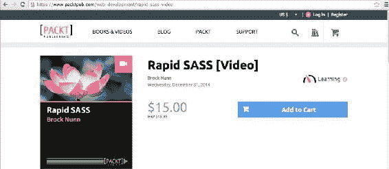
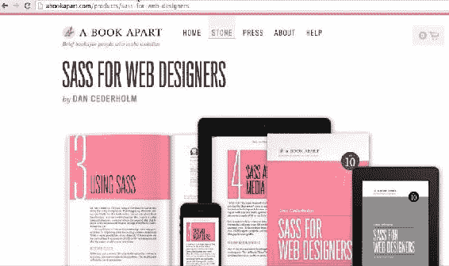
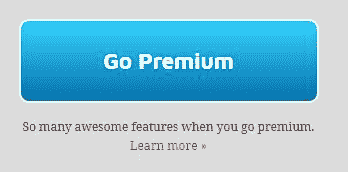
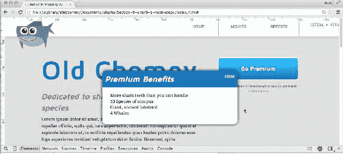
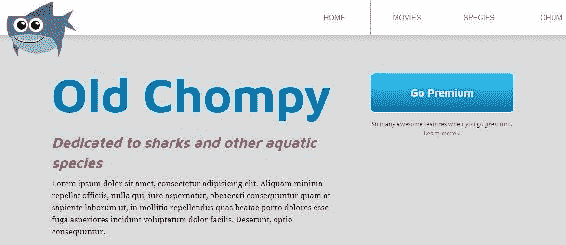
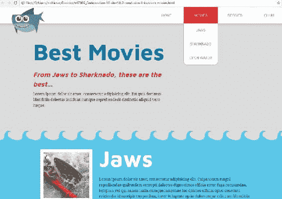
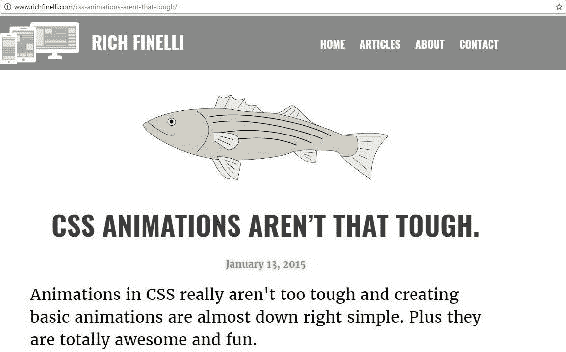
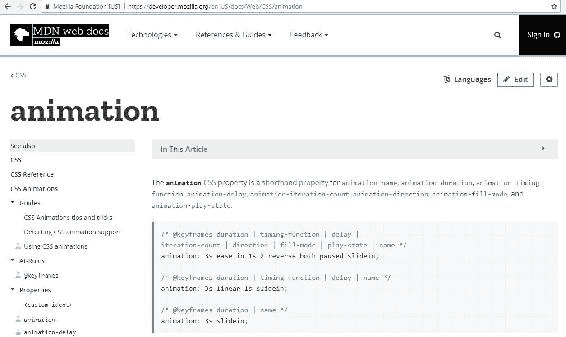
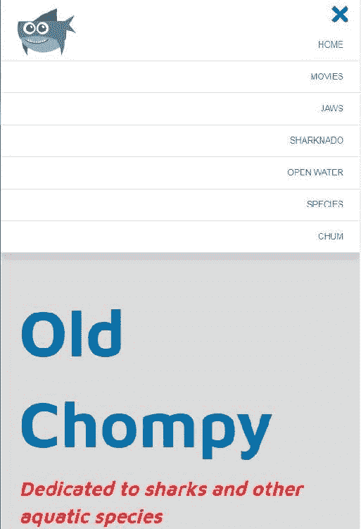

# 第十一章：总结

欢迎来到本书的最后一章。由于我们已经完成了这段旅程，我想带您走过您在 Web 开发学习过程中的一些步骤，并浏览一些链接和资源，以获取有关到目前为止学到的所有内容的更多信息。

# 下一步

学习 CSS 的下一个逻辑步骤是转向 CSS 预处理器，如 Sass 或 Less。CSS 预处理器允许您使用编程功能编写 CSS，如嵌套、导入、变量和混合，这些功能会被编译成常规 CSS。前端开发的另一个逻辑步骤是学习 JavaScript。不过，首先让我们谈谈 CSS 预处理器 Sass。

# CSS 预处理器

我既使用了*Less*又使用了*Sass*，但我现在已经使用 Sass 一段时间了。当我开始为这本书创建课程材料时，我几乎忘记了没有 Sass 的情况下编写 CSS 是什么感觉。毋庸置疑，使用 Sass 编写 CSS 要容易得多。它使您的代码更有组织性和清晰，并且我强烈推荐它。让我们来看看 Sass 的一些显着特点。

# 变量

Sass 的一个简单而强大的功能是变量。让我们设置名为`$blue`和`$red`的变量，分别等于我在整个站点中使用的蓝色或红色的颜色：

```css
//colors
$blue: #0072AE;
$red: #EB2428;
```

现在，当我需要输入难以记住的十六进制值`#0072AE`时，我只需输入`$blue`，Sass 就会神奇地处理它。变量的另一个很好的用途是它们与字体一起使用，这就是我认为它真正强大的地方。对于字体，通常可以输入`font-family`，然后创建一组字体。但是，这可能会变得冗长和重复。因此，将所有这些信息插入变量中，例如`$maven`或`$droid`这样的非常简单的变量，使得快速使用字体变得非常容易，随时都可以使用：

```css
//fonts
$serif: 'Times New Roman', Georgia, serif;
$sans: Arial, Helvetica, sans-serif;
$maven: 'Maven Pro', $sans;
$droid: 'Droid Serif', $serif;
```

然后我可以在设置`font-family`的任何地方使用这些变量：

```css
h1, h2 {
  font-family: $maven;
}
p {
  font-family: $droid;
}
```

这将被编译为整个字符串：

```css
h1, h2 {
  font-family: 'Maven Pro', Arial, Helvetica, sans-serif;;
}
p {
  font-family: 'Droid Serif', 'Times New Roman', Georgia, serif;
}
```

# 混合

Sass 中还有一个更好的功能，称为**混合**。基本上，它们是一种抽象重复的方法。例如，为 CSS3 输入供应商前缀很麻烦，但我可以使用`@mixin`关键字声明一个混合，然后创建一个充满供应商前缀的模板。在这里，我声明了一个名为`transition`的混合：

```css
@mixin transition($property: all, $duration: .25s, $timing-function: ease) {
    -webkit-transition: $property $duration $timing-function;
    transition: $property $duration $timing-function;
}
```

混合带有括号，括号内有参数`$property`，`$duration`和`$timing-function`。每个参数都有默认值，`all`，`.25s`和`ease`。然后我有-webkit-前缀的过渡属性和未前缀的版本。两者都将混合的参数作为它们的值。

这使我可以进入我的 CSS，并且，如果我想使用过渡，只需添加`@include transition`：

```css
.button {
    @include transition();
}
```

这将编译为：

```css
.button {
  -webkit-transition: all .25s ease;
  transition: all .25s ease;
}
```

我还可以在任何时候调用此混合时更新其默认值：

```css
.button {
    @include transition(background-color, .5s, ease-in-out);
}
```

这将编译为：

```css
.button {
  -webkit-transition: background-color .5s ease-in-out;
  transition: background-color .5s ease-in-out;
}
```

# SASS 嵌套

除了变量和混合，还有嵌套，表面上看起来可能不太强大，但非常方便。您可以将选择器嵌套在彼此内部，而不是编写后代选择器。您可以在以下 CSS 代码中看到，我实际上将`focus`和`hover`选择器嵌套在`.button`内部：

```css
.button {
  &:focus,
  &:hover {
    background-color: #333;
    color: #fff;
    transform: scale(1, 1) translate(0, -5px);
  }
}
```

这将编译为以下内容：

```css
.button:focus, 
.button:hover {
  background-color: #333;
  color: #fff;
  transform: scale(1, 1) translate(0, -5px);
}
```

作为一个经验法则，如果不必要，不要嵌套，因为选择器每次嵌套都会变得更具体和更重要。模块化 CSS 的技巧是保持选择器的轻量级。有关 Sass 中嵌套和使用特殊的&字符的更多信息，请查看我为 CSS-Tricks.com 撰写的文章*The Sass Ampersand*（[`css-tricks.com/the-sass-ampersand/`](https://css-tricks.com/the-sass-ampersand/)）。

# 使用 SASS 创建和导入部分文件

在第七章的*Web Fonts*部分的*Font kits and font services*中，我们还讨论了 Sass 允许您为 CSS 的不同部分创建部分文件，并将它们导入到您的主 Sass 文件中：

```css
//Imports
@import '_variables.scss';
@import '_mixins.scss';
@import '_icons.scss';
@import '_reset.scss';
@import '_modular.scss';
@import '_modal.scss';
```

Sass 将所有部分 Sass 文件编译成一个主 CSS 文件。所以我的 CSS 被分解成更小的块。它们都编译成`style.css`。

拥有这些多个组织良好的文件的最大好处是它们会编译成一个文件，这意味着只有一个 HTTP 请求，而不是多个请求。这就是性能的提升。更不用说它使我的 CSS 非常有条理。

这些只是预处理器（特别是 Sass）的一些非常好的特性。在这一点上，使用 Sass 或 Less 绝对是最合乎逻辑的步骤。您编写的 Sass 样式表需要通过编译器处理，将其转换为普通的 CSS；否则，浏览器将无法理解 Sass 代码。对于编译，您有几个选项。您可以安装 Ruby 和 Sass，并使用命令行来监视对 Sass 文件所做的任何更改。您还可以查看类似 CodeKit 的软件来执行相同的操作。或者您可以使用像 Gulp 这样的任务运行器，就像我们在上一节末讨论的那样。

要了解更多关于 SASS 的信息，我建议在 Packt 图书馆中观看*Brock Nunn 的 Rapid SASS*视频课程：



还要查看*Dan Cederholm*的*SASS for Web Designers*。这本书非常好地以简单的方式解释了 Sass，并且阅读起来很快：



# JavaScript 和 jQuery

前端开发人员的另一个合乎逻辑的步骤是学习 JavaScript，如果您还没有学习的话。通过 CSS，我们可以通过`hover`和`focus`状态添加交互性，但我们无法进行单击或滑动等操作。这就是 JavaScript 和 jQuery 的用武之地。我建议您学习 JavaScript 的基础知识；但是，如果您想快速入门，可以先学习 jQuery。

所以假设我们想要做的事情是在单击“了解更多>>”链接时显示一个模态框：



我们可以有一个显示模态框：



所以我们有一个会淡入淡出的动画。因此，使用 jQuery 设置动画相对比使用 JavaScript 更容易。这个想法是在 HTML 和 CSS 中创建一个模态框，就好像它一直存在一样。我创建了模态框，并将 HTML 放在 HTML 文件的最底部：

```css
<div class="modal modal-learn-more">
    <span class="close-modal">close</span>
    <h2>Premium Benefits</h2>
    <ul>
        <li>More shark teeth than you can handle</li>
        <li>13 Species of octopus</li>
        <li>Giant, ancient lobsters!</li>
        <li>4 Whales</li>
    </ul>
</div>
```

然后我有一个名为`modal.scss`的 Sass 部分文件，它样式化了模态框并将其定位到它应该在的位置：

```css

//learn more modal
.modal {
  display: none;
  width: 40%;
  margin: 0 auto;
  position: absolute;
  top: 200px;
  left: 50%;
  @include translateX(-50%);
  background: #fff;
  @include box-shadow;
  @include border-radius;
  overflow: hidden;
  .close-modal {
    position: absolute;
    right: 10px;
    top: 10px;
    color: #fff;
    cursor: pointer;
    text-decoration: underline;
  }
  h2 {
    background: $blue;
    color: #fff;
    padding: 10px;
  }
  ul {
    padding: 10px 30px 30px 30px;
  }
}
```

`.modal`类也设置为`display: none`，因此默认情况下它是不存在的。就像我们的下拉菜单一样；默认情况下，它是隐藏的。

这里有一些 jQuery 来打开模态框：

```css
//open modal//
$(".learn-more").on("click", function(event){
    event.preventDefault();
    $(".modal-learn-more").fadeIn();
});
```

基本上，这会监视具有`learn-more`类的链接的单击，然后淡入具有`modal-learn-more`类的元素。如果我们回到 HTML，我们会看到我们在模态框的最外层父`div`上有`modal-learn-more`类：

```css
<div class="modal modal-learn-more">
    <span class="close-modal">close</span>
    <h2>Premium Benefits</h2>
    <ul>
        <li>More shark teeth than you can handle</li>
        <li>13 Species of octopus</li>
        <li>Giant, ancient lobsters!</li>
        <li>4 Whales</li>
    </ul>
</div>
```

这是可读性很强的一小部分 jQuery。如果我们想要告诉模态框我们要在单击关闭链接时关闭它，也是同样的操作。

```css
//close modal//
$(".close-modal").on("click", function(event){
    event.preventDefault();
    $(".modal-learn-more").fadeOut();
});
```

基本上我们是在说当你单击关闭模态框时，我们将使`modal-learn-more`淡出。jQuery 通过它们创建的预定义方法来处理淡入和淡出的动画。在 jQuery 中非常容易选择我们要淡出的`div`和我们要单击的项目或元素。要了解更多关于 jQuery 的信息，我建议查看 Packt 图书馆中的 jQuery 书籍，特别是*jQuery for Designers: Beginner's Guide*。

Sass 和 jQuery 是接下来的逻辑步骤。Sass 将 CSS 编写提升到了一个新的水平，而 jQuery 将为您的网站添加功能和更深入的交互能力。更不用说它将使您成为一个全面的前端开发人员。在下一节中，我将通过总结我们讨论过的所有内容，并指出一些可以获取更多信息的好资源来结束。

# 结论和链接

感谢阅读《精通 CSS》。我真的很享受整理这本书。我们涵盖了很多内容，所以我将对我们学到的东西进行总结，并指引你获取更多关于这些主题的信息的方向。

# 盒模型和块级与内联元素

我们从回顾基础知识开始这本书，比如盒模型，以及块级和内联元素之间的区别。学习更多关于这两个重要的基础知识的好地方是 Sitepoint 的 A 到 Z CSS 视频。关于块级与内联元素：[`www.sitepoint.com/atoz-css-screencast-display/`](https://www.sitepoint.com/atoz-css-screencast-display/)，关于盒模型：[`www.sitepoint.com/atoz-css-screencast-box-model/`](https://www.sitepoint.com/atoz-css-screencast-box-model/)。在这里，你可以观看一些非常有帮助的盒模型和显示视频。

# 浮动

我们还讨论了很多关于浮动以及如何使用它们来创建多列布局，就像我们在主页上做的那样：



我们讨论了浮动带来的问题，比如塌陷，以及其他内容围绕浮动流动。我们还讨论了不同的方法，比如使用`clear-fix`，来避免这些问题。要了解更多关于浮动的知识，我将直接指向 Sitepoint 的 A 到 Z CSS，以及短短六分钟的视频（[`www.sitepoint.com/atoz-css-screencast-float-and-clear/`](https://www.sitepoint.com/atoz-css-screencast-float-and-clear/)），它涵盖了浮动的基础知识以及如何适应它们的怪癖。

# 模块化 CSS

接下来，你学会了如何创建模块化的 CSS。我们不想为网站的一个部分设置样式，然后如果我们想为网站的另一个类似的部分设置样式，就重新设置所有这些样式。我们希望能够通过采用模块化技术来重用我们已经创建的 CSS。当我们使用模块化类构建我们的按钮时，我强调了这一点。要了解更多关于模块化 CSS 的知识，你可以在**SMACSS**（**可扩展和模块化的 CSS 架构**）上找到更多信息；请参阅[smacss.com](http://smacss.com)网站。

# CSS3

在这一点上，我们最终使用了大量的 CSS3 来制作我们的按钮。我们在整个网站上使用了很多悬停效果。在电影页面上，我们为其中一部电影的图片添加了一个悬停效果。如果你想了解更多关于 CSS3 的知识，Packt 图书馆中有一本很棒的书，名为《使用 CSS3 设计下一代 Web 项目》（Designing Next Generation Web Projects with CSS3），作者是 Sandro Paganotti。

另外，你可能想看看丹·塞德霍姆（Dan Cederholm）的《网页设计的 CSS3》，第二版，可以通过[abookapart.com](http://abookapart.com)获取。

# 创建导航

我们继续构建了一个固定在顶部的导航，内容在其下滚动。它有一个漂亮的下拉菜单，使用 CSS 动画向下精美地展开：



我们还让我们的鲨鱼在浏览器刷新时动起来；我们让它看起来像在游泳，这非常有趣。我为我在 CSS 动画上写的一篇文章感到自豪：[`www.richfinelli.com/css-animations-arent-that-tough/`](http://www.richfinelli.com/css-animations-arent-that-tough/)。在这篇文章中，我详细介绍了所有的动画属性，并逐渐进展到创建一个相当复杂的动画：



我发现自己经常参考**Mozilla 开发者网络**（**MDN**）网站，快速查阅动画属性。我认为 MDN 是一个非常可靠和深入的网络资源。



# 使网站响应式

我们在使我们的网站响应式方面做得很好，特别是当我们完全将我们的菜单转换成小屏幕以适应移动设备时：



在我看来，学习更多关于响应式网页设计的最佳地方就是从发明它的人那里学习-Ethan Marcotte。看看那本开创性的书- *Responsive Web Design.* 该书的第二版于 2014 年底发布。

# 网络字体

在第七章中，*Web Fonts*，我们谈到了网络字体和图标字体。我们了解到一个好的字体确实可以让网站看起来很棒。回到[abookapart.com](https://abookapart.com/)网站，有一本非常好的书，你可以用来学习如何设置和配对字体。它叫做*On Web Typography*，作者是*Jason Santa Maria*。

# HiDPI 设备

最后，在第八章中，*Workflow for HiDPI Devices*，我们通过学习如何处理图像，使它们在 iPad Retina 等双倍密度显示屏上看起来清晰，使我们的网站“retina ready”。我们研究了许多应对 Retina 的方法。在网页开发中，我最激动的事情之一就是 SVG。它真的解决了一些 Retina 的明显问题。CSS 技巧的 Chris Coyier（[`css-tricks.com`](https://css-tricks.com/)）写了一些关于 SVG 以及如何使用它的很棒的文章，包括一篇标题为- Using SVG 的文章。

此外，关于`srcset`属性的更多信息，我写了两篇文章。一篇是关于 W 描述符和`sizes`属性的（[`www.richfinelli.com/srcset-part-2/`](http://www.richfinelli.com/srcset-part-2/)），另一篇是关于 X 描述符的（[`www.richfinelli.com/srcset-part-1/`](http://www.richfinelli.com/srcset-part-1/)）。

# Flexbox

Flexbox 太有趣了！我们将基于浮动的 3 列布局转换为基于 flexbox 的布局，并使用 flexbox 构建了一个新的部分，我们的产品列表。关于 flexbox 的更多信息，我建议查看 Wes Bos 的视频课程，*What the Flexbox! at* flexbox.io，或者快速全面地参考所有 flexbox 属性，请查看*CSS 技巧的 A Complete Guide to Flexbox*，网址为[`css-tricks.com/snippets/css/a-guide-to-flexbox/`](https://css-tricks.com/snippets/css/a-guide-to-flexbox/)。

# 最后的建议：音频播客非常棒

如果你和我一样，渴望学习并且要长时间开车上班，音频播客可以是一个很好的资源。我最喜欢的前端开发播客是 Shoptalk ([`shoptalkshow.com/`](http://shoptalkshow.com/))和 Syntax ([`syntax.fm/`](https://syntax.fm/))。两者都非常有趣和富有信息。在上班的路上听播客是我保持了解网页开发动态和学习新知识的方式。

# 总结

最后，我认为我们在这里创建了一个非常棒的小网站，学到了很多关于 CSS 和网页开发的知识。再次感谢阅读。我真的很享受把它放在一起的过程。祝你们成功，并希望你们继续磨练你们的 CSS 技能。
