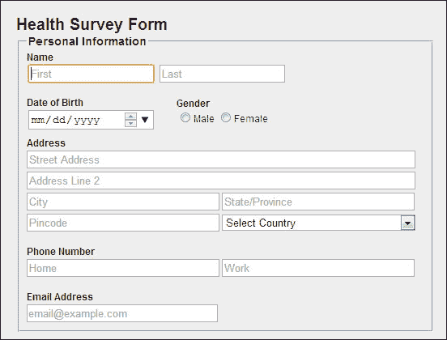
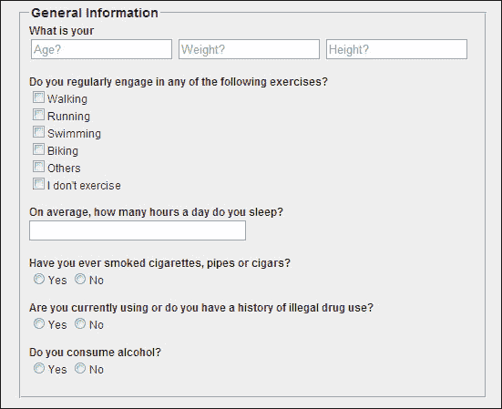
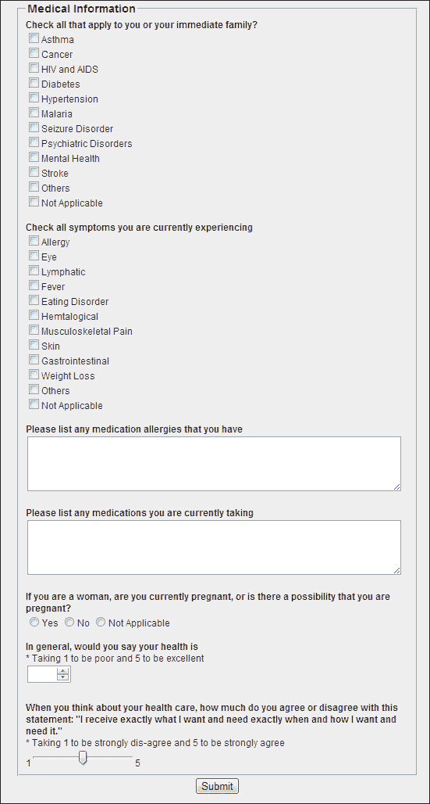

# 第一章：表单及其重要性

在网页中使用表单是从用户那里收集相关数据的最有效方式。表单是用户与应用程序真正交互的方式，无论是搜索表单、登录界面还是多页注册向导。表单可以包含姓名、性别、信用卡号、密码、图片或将文件上传到表单中。

在本章中，我们将涵盖以下主题：

+   网络表单及其好处

+   新的 HTML5 `<form>`元素

+   构建网络表单

+   构建网络表单的指南

# 理解网络表单

在我们开始学习 HTML5 表单之前，让我们先了解一下什么是网络表单。

网页上的表单提供了一个接口，使客户和用户之间的信息共享更加方便和安全，相比纸质表单。它们是各种`<input>`类型的集合，例如`textbox`、`radiobutton`和`checkbox`，允许用户执行各种操作并简化决策过程。

表单一直是网络的基本组成部分。没有它们，各种网络交易、讨论和高效搜索将根本不可能。网络表单得到大多数浏览器的支持，可以用于在购买产品后提供反馈、从搜索引擎检索搜索结果、联系任何服务等等。

通过一个简单的例子，让我们了解一下什么是网络表单。假设你曾经去过一家医院，接待员给了你一张打印的表格填写。你可能会看到许多字段，收集有关患者的信息。其中一些要求你在看起来像文本框或文本区域的地方写下患者的姓名和地址，以及房间类型等其他细节；你还被要求从选项中选择一个或多个单选按钮或复选框。HTML5 表单也是遵循相同的概念。你需要填写该表单的字段，并按下按钮将此信息发送到服务器，而不是去医院将表格交给接待员。

## 好处

网页中的表单相比纸质表单有很多优势。除了用于在线收集数据外，网络表单为用户和表单所有者提供了便利和速度。

网络表单的一些优点包括：

+   在线表单帮助客户与公司交流，因为它们包含数字化存储的数据，并将该数据推导为有意义的信息

+   表单所有者可以快速构建和分发 HTML5 界面，面向大众

+   表单所有者可以根据需要轻松更新和修改表单

+   层叠样式表（CSS）和 JavaScript 属性允许作者使用特定样式和功能自定义表单控件

+   网络表单节省时间和成本，因为它们不需要人力来收集信息。

+   它们为决策提供了可见性，例如在 eBay 等网站上在线购物

+   由于数据是由客户直接输入的，因此可以轻松地对其进行排序以获取所需的信息

即使表单有很多好处，构建它们并不是一件愉快的工作，如果涉及验证、错误处理和样式，有些表单可能会变得非常复杂，这可能会成为一个头疼的问题。我们可以使用服务器端语言验证或捕获错误，也可以使用 JavaScript，甚至两者都可以。无论哪种情况，网络表单可能会占用大量开发时间，这可能会成为一个问题。然而，通过引入新的`<form>`类型，HTML5 已经减轻了一些痛苦。

尽管 HTML5 有许多增强功能，但有些东西保持不变，比如：

+   当用户单击**提交**按钮时，表单仍然会将值发送到服务器

+   表单仍然被包含在`<form>`元素中，如下面的代码片段所示：

```html
<form action= "#">
  <input type= "text" name= "emailaddress">
  <input type= "submit" name= "submit">
</form>
```

+   表单控件仍然可以完全进行脚本处理

然而，对于 HTML5 表单，没有必要将`<form>`控件包含在`<form>`元素中。

# HTML 与 HTML5 表单

HTML5 表单相对于以前的版本提供了两个主要优势。它们是：

+   在 HTML5 的新`<form>`类型和内置验证的支持下，以前版本的 HTML 中需要繁琐的脚本和表单样式已经被移除，因为它将语义标记提升到了一个新的水平。

+   即使在浏览器中禁用了脚本，用户也可以体验到 HTML5 表单的好处

# 表单`<input>`类型、元素和属性

HTML5 表单专注于增强现有的简单 HTML 表单，以包含更多类型的控件，并解决今天 Web 开发人员面临的限制。其中最好的一点是，你现在几乎可以使用所有新的输入类型、元素和属性，HTML5 表单完全向后兼容。支持新 HTML5 元素的浏览器会增强其功能，否则不支持的浏览器会将其显示为文本框。

在本节中，我们将学习新的 HTML5`<form>`元素，如`<input>`类型、元素和属性，这些元素是为了增强表单的功能而引入的。

## `<form> <input> types`

+   `date`: `date` 类型允许用户选择没有时区的日期。

它在中受支持。

语法：

```html
<input type= "date" name= "#">
```

属性：

+   `value`: 初始值。格式为 yyyy-mm-dd

+   `min`, `max`: 可以选择的最小和最大日期的范围

+   `datetime`: `datetime` 类型允许用户选择带有 UTC 时区设置的日期和时间。

格式为 yyyy-mm-dd HH:MM。

它在中受支持。

语法：

```html
<input type= "datetime" name= "#">
```

+   `datetime-local`: `datetime-local` 类型允许用户选择没有时区的日期和时间。使用的格式是 yyyy-mm-dd HH:MM。

它在中受支持。

语法：

```html
<input type= "datetime-local" name= "#">
```

+   `color`: `color` 类型会打开一个颜色选择器弹出窗口，用于选择`<input>`类型的颜色`#rrggbb`（十六进制值）。它可以用色块或轮式选择器表示。

选择的值必须是有效的简单颜色的十六进制值，如`#ffffff`。

它在中受支持。

语法：

```html
<input type= "color" id= "#"name= "#">
```

属性：

+   `value`: 初始值

+   `number`: `number` 类型允许用户输入`整数`或`浮点数`。

它也被称为微调器。

我们可以对接受的数字设置限制。

它在中受支持。

语法：

```html
<input type= "number" name= "#">
```

属性：

+   `value`: 初始值

+   `min`, `max`: 可以使用上/下箭头选择的最小和最大值的范围

+   `step`: 当滚动微调器时告诉我们要改变值的量

+   `range`: `range` 类型允许用户从一系列数字中输入`整数`或`浮点数`。它以滑块的形式显示。

使用这个，除非使用 JavaScript，否则不会显示确切的值，所以如果你希望用户选择确切的值，使用`<input type="number" />`。

我们可以对接受的数字设置限制。

它在中受支持。

语法：

```html
<input type= "range" name= "#">
```

属性：

+   `value`: 初始值。默认值是滑块的中间值。

+   `min`, `max`: 可以选择的最小和最大值的范围。最小值的默认值为 0，最大值为 100。

+   `step`: 当滚动微调器时告诉我们要改变值的量。默认值为 1。

+   `email`: `email` 类型允许用户以电子邮件地址格式`email@example.com`输入文本。

点击**提交**按钮时，输入的文本会自动验证。

如果指定了多个属性，则可以输入多个电子邮件地址，用逗号分隔。

它在中受支持。

语法：

```html
<input type= "email" name= "#">
```

属性：

+   `value`: 初始值（合法的电子邮件地址）

接受使用多个属性，即多个电子邮件 ID，并且每个属性由逗号分隔。

+   `搜索`：`<input>`类型`搜索`允许用户输入要搜索的文本。

搜索字段的行为类似于标准文本字段，并具有内置的清除文本功能，例如 WebKit 浏览器中的交叉按钮。

它在中得到支持。

语法：

```html
<input type= "search" name= "#">
```

属性：

+   `值`：初始值

+   `电话`：`tel`类型允许用户输入电话号码。`tel`不提供任何默认语法，因此如果您想确保特定格式，可以使用`pattern`进行额外验证。

目前尚无浏览器支持。

语法：

```html
<input type= "tel" name= "#">
```

属性：

+   `值`：初始值为电话号码

+   `月份`：`月份`类型允许用户选择一个月和一个没有时区的年份。

它在中得到支持。

语法：

```html
<input type= "month" name= "#" >
```

属性：

+   `值`：初始值。格式为 yyyy-mm。

+   `最小值`，`最大值`：可以选择的最小和最大值范围。

+   `时间`：`时间`类型允许用户选择一个具有小时、分钟、秒和没有时区的分数秒的时间值。

它在中得到支持。

语法：

```html
<input type= "time" name= "#">
```

+   `网址`：`网址`类型允许用户输入绝对 URL。

单击**提交**按钮时，输入的文本会自动验证。

它在中得到支持。

语法：

```html
<input type= "url" name= "#" >
```

属性：

+   `值`：初始值为绝对 URL

+   `周`：`周`类型允许用户选择一周和一年，没有时区。

它在中得到支持。

语法：

```html
<input type= "week" name= "#">
```

属性：

+   `值`：初始值。格式为 yyyy-mmW。

到目前为止，我们已经了解了各种`<input>`类型。现在让我们看看新的 HTML5`<form>`元素。

## `<form>`元素

+   `<datalist>`：`<datalist>`元素为用户提供了一个预定义选项列表，以便在输入数据时为表单控件提供`自动完成`功能。它用于在`<form>`元素上提供`自动完成`功能。

例如，如果用户在文本字段中输入一些文本，将会显示一个下拉列表，其中包含他们可以选择的预填充值。

它在中得到支持。

例如：

```html
<input list= "browsers" name= "browser">
<datalist id= "browsers">
  <option value= "Internet Explorer">
  <option value= "Firefox">
</datalist>
```

+   `<keygen>`：`<keygen>`元素用于提供一种安全的用户认证方式。

当表单提交时，私钥存储在本地密钥库中，公钥打包并发送到服务器。

它在中得到支持。

例如：

```html
<form action= "keygen.html" method= "get"><input type= "text" name= "username"><keygen name= "security"><input type= "submit">
</form>
```

+   `<output>`：`<output>`元素表示执行的计算结果，类似于脚本执行的计算结果。

它在中得到支持。

例如：

```html
<form onsubmit="return false" oninput="o.value=parseInt(a.value)+parseInt(b.value)"><input name="a" type="number" step="any">+<input name="b" type="number" step= "any">
=<output name="o"></output></form>
```

现在让我们看看新的 HTML5`<form>`属性。

## `<form>`属性

+   `自动完成`：`autocomplete`属性允许用户根据先前的输入完成表单。我们可以为表单设置自动完成`on`选项，为特定输入字段设置`off`选项，或者反之亦然。

它适用于`<form>`和`<input>`类型，如`文本框`，`日期选择器`，`范围`，`颜色`，`网址`，`电话`，`搜索`和`电子邮件`。

它在中得到支持。

例如：

```html
<input type="text" name="city" autocomplete="on">
```

+   `自动聚焦`：当添加`autofocus`属性时，`<input>`类型在页面加载时会自动获得焦点。

例如，当我们打开 Google 主页或任何搜索引擎时，焦点会自动转到文本框，用户在其中输入文本以执行搜索。

它适用于`<input>`类型，`文本框`，`搜索`，`网址`，`电子邮件`，`电话`和`密码`。

它在中得到支持。

例如：

```html
<input type="text" name="city">
<input type="text" name="state" autofocus>
```

+   `占位符`：`placeholder`属性为用户提供了描述`<input>`字段预期值的提示。

当单击控件或获得焦点时，它会消失。

它应该仅用于简短的描述，否则使用`title`属性。

它适用于`textbox`、`search`、`url`、`email`、`tel`和`password`类型的`<input>`。

它在中得到支持。

例如：

```html
<input type="text" name="name" placeholder="First Name">
```

+   `min`和`max`：`min`和`max`属性用于指定`<input>`类型的最小值和最大值。

它适用于`number`、`range`、`date`、`datetime`、`datetime-local`、`month`、`time`和`week`类型的`<input>`。

它在中得到支持。

例如：

```html
<input type="number" min="1" max="5">
```

+   `list`：`list`属性指的是包含`<input>`元素的预定义选项的`<datalist>`元素。

它用于在`<form>`元素上提供`autocomplete`功能。

例如，如果用户在文本字段中输入一些文本，将会出现一个下拉列表，其中包含预填充的值供他们选择。

它适用于`textbox`、`search`、`url`、`email`、`tel`类型的`<input>`。

它在中得到支持。

例如：

```html
<input list= "browsers" name= "browser">
<datalist id= "browsers">
  <option value= "Internet Explorer">
  <option value= "Firefox">
</datalist>
```

+   `formnovalidate`：`formnovalidate`属性指定在提交时不应验证表单。它覆盖了`<form>`元素的`novalidate`属性。

它适用于`submit`和`image`类型的`<input>`。

它在中得到支持。

例如：

```html
<input type="email" name="email"><input type="submit" formnovalidate value="Submit">
```

+   `form`：`form`属性指定一个或多个表单，一个`<input>`类型属于这些表单，或者说，它允许用户将任何孤立的表单控件与页面上的任何`<form>`元素关联起来。

它在中得到支持。

例如：

```html
<body>
  <form action="form.html" id="form1"><input type="text" name="fname"><br><input type="submit" value="Submit"></form>
  <p>The "Last name" field below is outside the form element, but it is still a part of the form</p>
  <input type="text" name="lname" form="form1">
</body>
```

+   `formaction`：`formaction`属性指定将提交表单的文件或应用程序的 URL。

它适用于`submit`和`image`类型的`<input>`。

它在中得到支持。

例如：

```html
<input type="submit" value="Submit" formaction="form.html">
```

+   `formenctype`：`formenctype`属性指定提交到服务器时如何对表单数据进行编码。

它仅适用于`post`方法。

它适用于`submit`和`image`类型的`<input>`。

它在中得到支持。

例如：

```html
<input type="submit" value="Submit" formenctype="multipart/form-data">
```

+   `formmethod`：`formmethod`属性指定用于提交表单数据的 HTTP 方法，如`GET`、`POST`、`PUT`和`DELETE`。

它适用于`submit`和`image`类型的`<input>`。

它在中得到支持。

例如：

```html
<input type="submit" value="Submit" formmethod="post">
```

+   `formtarget`：`formtarget`属性指定提交表单后用于显示接收到的响应的目标窗口。

它适用于`submit`和`image`类型的`<input>`。

它在中得到支持。

例如：

```html
<input type="submit" value="Submit" formtarget="_self">
```

值：

+   `blank`

+   自身

+   `parent`

+   `top`

+   框架名称

+   `multiple`：`multiple`属性允许用户为`<input>`类型输入多个值。

它适用于`email`和`file`类型的`<input>`。

它在中得到支持。

例如：

```html
<input type= "file" name= "image"multiple>
```

+   `novalidate`：`novalidate`属性指定在单击**提交**按钮时不应验证表单。

它在中得到支持。

例如：

```html
<form action= "form.html" novalidate>
  <input type= "text" name= "city">
  <input type= "text" name= "state" autofocus>
</form>
```

+   `step`：让我们通过一个例子来理解`step`属性。如果`step=` `2`，合法的数字可以是`2`、`0`、`2`、`4`和`6`。

它适用于`<input>`类型，包括`number`、`range`、`date`、`datetime`、`datetime-local`、`month`、`time`和`week`。

它在中得到支持。

例如：

```html
<input type= "range" name= "#" step= "2">
```

+   `required`：添加`required`属性后，强制要求在提交表单之前必须填写输入字段。

目前，错误消息是特定于浏览器的，无法通过 CSS 控制。

它取代了用 JavaScript 实现的基本`<form>`验证，从而节省了开发时间。

它在中得到支持。

例如：

```html
<input type= "text" name= "city"required>
```

+   `pattern`：使用 `pattern` 属性，您可以使用 `正则表达式`（`regex`）声明自己的验证要求。

它适用于 `<input>` 类型，如 `text`、`search`、`url`、`tel`、`email` 和 `password`。

如果用户输入的值不符合模式，它将显示一个浏览器通用的消息。

它在  中得到支持。

例如：

```html
<input type= "text" name= "country_code" pattern= "[A-Za-z]{3}" placeholder= "Three letter country code">
```

# 构建 HTML5 表单

到目前为止，我们所学习的关于 HTML5 表单的只是理论知识，但现在是时候将这些知识提升到下一个水平了。将其提升到下一个水平意味着在这一部分，我们将构建一个带有对它们的结构和新的 `<form>` 类型的一些理解的样本表单，这些我们已经讨论过了。

在样式或功能（如设计和验证）方面，我们将花费更少的时间，而更多地关注 HTML5 的新 `<form>` 类型的核心。这种表单在支持 HTML5 特性的浏览器中得到最好的支持。

在这个例子中，我们将构建一个健康调查表单。

这个例子演示了一个简单的表单，使用了基本的 HTML 元素和新的 `<form>` 元素，代码应该是不言自明的。

现在，让我们来看看代码。以下代码是表单的 CSS，它保存在一个扩展名为 `.css` 的单独文件中（外部 CSS 文件），并链接到主 HTML 页面。拥有单独的 CSS 文件也是一个好的做法。

```html
html {
  background-color: #333;
  margin: 0px;
  padding: 0px;
}
body {
  font-size:12px;
  width: 517px;
  padding: 20px;
  margin: 10px auto;
  background-color: #eee;
  font-family: Helvetica, Arial, sans-serif;
  color: #333;
}
label{
  font-weight:bold;
}

/* General Form */
.heading{
  font-size:20px;
}
.gender{
  position:relative;
  top:-42px;
  left:185px;
}
.selectOption{
  width:239px;
}
.textboxAddress{
  width:474px;
}
.textboxAddressDetail{
  width:232px;
}
.legend{
  font-weight:bold;
  font-size:14px;
}
.submit{
  text-align:center;
}
```

以下代码是我们构建表单结构的主要 HTML 页面。`<fieldset>` 标签被包含在 `<form>` 标签内。

结构被分成了几个部分，以便更好地理解。此外， `<form>` 类型被加粗显示。

以下是用于显示个人信息表单的代码片段：

```html
<fieldset>
  <legend class="legend">Personal Information</legend>
  <div>
    <label for="name">Name</label><br>
    <input type="text" placeholder="First" autofocus>
    <input type="text" placeholder="Last">
  </div><br>
  <div>
    <label for="dob">Date of Birth</label><br>
    <input type="date" value="">
  </div>
  <div class="gender">
    <label for="gender">Gender</label><br>
    <input type="radio" name="gender"><label>Male</label>
    <input type="radio" name="gender"><label>Female</label>
  </div><br>
  <div>
    <label for="address">Address</label><br>
    <input type="text" class="textboxAddress" placeholder="Street Address"><br>
    <input type="text" class="textboxAddress" placeholder="Address Line 2"><br>
    <input type="text" class="textboxAddressDetail" placeholder="City">  
    <input type="text" class="textboxAddressDetail" placeholder="State/Province"><br>
    <input type="text" class="textboxAddressDetail" placeholder="Pincode">
    <select class="selectOption">
      <option value="Country">Select Country</option>
    </select>
  </div><br>
  <div>
    <label for="contact">Phone Number</label><br>
    <input type="tel" class="textboxAddressDetail" placeholder="Home"> 
    <input type="tel" class="textboxAddressDetail" placeholder="Work">
  </div><br>
  <div>
    <label for="email">Email Address</label><br>
    <input type="email" class="textboxAddressDetail" placeholder="email@example.com">
  </div>
</fieldset>
```

### 提示

**下载示例代码**

您可以从您在 [`www.packtpub.com`](http://www.packtpub.com) 购买的所有 Packt 图书的帐户中下载示例代码文件。如果您在其他地方购买了本书，您可以访问 [`www.packtpub.com/support`](http://www.packtpub.com/support) 并注册，以便直接通过电子邮件接收文件。

代码的输出如下：



这一部分询问受访者有关他们的个人信息，如姓名、地址和其他详细信息。我们使用了带有描述性文本的 `<label>` 并将其与表单控件绑定。

我们还在第一个文本框上使用了 `autofocus` 属性，这样当页面加载时，`<input>` 元素会自动获得焦点。`placeholder` 属性在第一个文本框中多次使用，作为`First`来提示受访者所需的内容。对于出生日期，我们使用了 `<input>` 类型 `date`，它会以日历形式打开。

还使用了基本的 HTML 元素 `<input>` 类型，如 `radiobutton`、`textbox` 和下拉列表。

同样，对于电话号码字段，使用了 `<input>` 类型 `tel`，对于电子邮件地址字段，使用了 `<input>` 类型 `email`。

以下是用于显示一般信息表单的代码片段：

```html
<fieldset>
  <legend class="legend">General Information</legend>
  <div>
    <label for="info">What is your</label><br>
    <input type="text" placeholder="Age?"> 
    <input type="text" placeholder="Weight?"> 
    <input type="text" placeholder="Height?">
  </div><br>
  <div>
    <label for="exerciceinfo">Do you regularly engage in any of the following exercises?</label><br>
    <div><input type="checkbox" name="smoke"><label>Walking</label><br>
    <input type="checkbox" name="smoke"><label>Running</label></div>
    <div><input type="checkbox" name="smoke"><label>Swimming</label><br>
    <input type="checkbox" name="smoke"><label>Biking</label></div>
    <div><input type="checkbox" name="smoke"><label>Others</label><br>
    <input type="checkbox" name="smoke"><label>I don't exercise</label></div>
  </div><br>
  <div>
    <label for="sleep">On average, how many hours a day do you sleep?</label><br>
    <input type="number" class="textboxAddressDetail">
  </div><br>
  <div>
    <label for="smoking">Have you ever smoked cigarettes, pipes or cigars?</label><br>
    <input type="radio" name="smoke"><label>Yes</label>
    <input type="radio" name="smoke"><label>No</label>
  </div><br>
  <div>
    <label for="drugs">Are you currently using or do you have a history of illegal drug use?</label><br>
    <input type="radio" name="drugs"><label>Yes</label>
    <input type="radio" name="drugs"><label>No</label>
  </div><br>
  <div>
    <label for="alcohol">Do you consume alcohol?</label><br>
    <input type="radio" name="alcohol"><label>Yes</label>
    <input type="radio" name="alcohol"><label>No</label>
  </div>
</fieldset>
```

代码的输出如下：



表单的顶部部分询问受访者一般信息，如年龄、体重、身高以及其他关于他们日常生活的信息。

在这里，我们使用了基本的 HTML `<form>` `<input>` 类型，如 `textbox`、`radiobutton` 和 `checkbox`，以及新的 `<form>` 属性，如 `placeholder`，来从受访者那里获取输入。

以下代码片段显示了一个存储医疗信息的表单：

```html
<fieldset>
  <legend class="legend">Medical Information</legend>
  <div>
    <label for= "disease">Check all that apply to you or your immediate family?</label><br>
    <input type="checkbox" name="disease"><label>Asthma</label><br>
    <input type="checkbox" name="disease"><label>Cancer</label><br>
    <input type="checkbox" name="disease"><label>HIV and AIDS</label><br>
    <input type="checkbox" name="disease"><label>Diabetes</label><br>
    <input type="checkbox" name="disease"><label>Hypertension</label><br>
    <input type="checkbox" name="disease"><label>Malaria</label><br>
    <input type="checkbox" name="disease"><label>Seizure Disorder</label><br>
    <input type="checkbox" name="disease"><label>Psychiatric Disorders</label><br>
    <input type="checkbox" name="disease"><label>Mental Health</label><br>
    <input type="checkbox" name="disease"><label>Stroke</label><br>
    <input type="checkbox" name="disease"><label>Others</label><br>
    <input type="checkbox" name="disease"><label>Not Applicable</label>
  </div><br>
  <div>
    <label for= "symptons">Checkall symptoms you are currently experiencing</label><br>
    <input type="checkbox" name="symptoms"><label>Allergy</label><br>
    <input type="checkbox" name="symptoms"><label>Eye</label><br>
    <input type="checkbox" name="symptoms"><label>Lymphatic</label><br>
    <input type="checkbox" name="symptoms"><label>Fever</label><br>
    <input type="checkbox" name="symptoms"><label>Eating Disorder</label><br>
    <input type="checkbox" name="symptoms"><label>Hemtalogical</label><br>
    <input type="checkbox" name="symptoms"><label>Musculoskeletal Pain</label><br>
    <input type="checkbox" name="symptoms"><label>Skin</label><br>
    <input type="checkbox" name="symptoms"><label>Gastrointestinal</label><br>
    <input type="checkbox" name="symptoms"><label>Weight Loss</label><br>
    <input type="checkbox" name="symptoms"><label>Others</label><br>
    <input type="checkbox" name="symptoms"><label>Not Applicable</label>
  </div><br>
  <div>
    <label for="allergy">Please list any medication allergies that you have</label><br>
    <textarea name="allergy" rows="4" cols="57">
    </textarea>
  </div><br>
  <div>
    <label for="medications">Please list any medications you are currently taking</label><br>
    <textarea name= "medications" rows="4" cols="57">
    </textarea>
  </div><br>
  <div>
    <label for="pregnancy">If you are a woman, are you currently pregnant, or is there a possibility that you are pregnant?</label><br>
    <input type="radio" name="pregnancy"><label>Yes</label>
    <input type="radio" name="pregnancy"><label>No</label>
    <input type="radio" name="pregnancy"><label>Not Applicable</label>
  </div><br>
  <div>
    <label for="healthrating">In general, would you say your health is</label><br>
    * Taking 1 to be poor and 5 to be excellent<br>
    <input type="number" name="healthrating" min="1" max="5">
  </div><br>
    <label for="ratinghealth">When you think about your health care, how much do you agree or disagree with this statement: "I receive exactly what I want and need exactly when and how I want and need it."</label><br>
    * Taking 1 to be strongly dis-agree and 5 to be strongly agree<br>
    1<input type="range" name="ratinghealth" min="1" max="5">5
  </div> 
</fieldset>

<div class="submit">
  <input type="submit" value="Submit">
</div>
```

代码的输出如下：



我们表单的最后部分询问受访者有关他们的医疗信息。为了获取受访者所患各种疾病或症状的信息，我们使用了基本的 HTML `<form>` `<input>` 类型 `checkbox`。

`Textarea`是一个自由文本字段，其中包含详细的文本，在我们的情况下，允许受访者输入信息，例如药物过敏和药物。`textarea`的行和列确定了表单中`textarea`文本字段的可显示大小。我们还可以通过设置`maxlength`来限制受访者输入详细信息。

`radiobutton`用于限制受访者从多个选项中选择一个选项。

使用`<input>`类型`number`，我们创建了一个微调器，这是一个精确的控件，用于选择由数字表示的字符串。在这里，我们通过将最小值设置为`1`和最大值设置为`5`来设置限制。

使用`<input>`类型`range`，我们创建了一个滑块，这是一个不精确的控件，用于将值设置为表示数字的字符串。在这里，我们通过将最小值设置为`1`和最大值设置为`5`来设置限制。

最后，`<input>`类型`submit`将数据发送到服务器。

# 指导方针

一个良好的实践或指导方针是设计和开发一个标准的方法，这总是表现出更好的结果。

创建有效表单的一些最佳实践如下：

+   使用相关内容分组来组织表单

+   最小化填写表单所需的帮助和提示的数量

+   采用灵活的数据输入

+   对于长表单，显示进度并保存选项

+   保持一致的方法

+   保持初始选择选项之间的清晰关系

+   使用内联验证输入，可能具有较高错误率

+   提供可操作的补救措施来纠正错误

+   在用户单击提交按钮后禁用**提交**按钮，以避免多次提交

+   清楚地传达关于数据提交的信息并提供反馈

+   保持 CSS 和 JavaScript 的单独文件

使用最佳实践：

+   提高跨浏览器兼容性

+   提高性能

+   节省时间并降低成本

+   项目理解变得容易

+   代码维护变得容易

# 总结

在本章中，我们了解了表单及其使用的好处。我们已经看到了基本的 HTML 表单和 HTML5 表单之间的区别。

我们了解了新的`<form>`控件，`date`，`week`，`tel`，`email`，`range`，`numbers`等等，我们不必依赖 JavaScript，以及它们在现代浏览器中的工作方式。

我们还构建了一个示例表单，以便熟悉表单，并在本章末尾学习了创建有效网络表单的最佳实践。

总的来说，我们已经看到了如何通过 HTML5 的帮助来减少脚本编写和开发时间，当用户需要创建具有完整功能的表单时。
