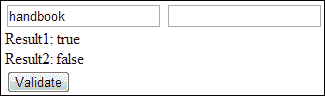

# 第二章：表单验证

自从 Web 诞生以来，表单验证一直是开发人员头疼的问题。在 HTML5 出现之前，开发人员为了验证表单以获取用户所需的信息而编写了大量代码。

在本章中，我们将涵盖以下主题：

+   验证、它们的好处和类型

+   用于验证的 HTML5 `<input>`和属性

+   JavaScript 和 HTML5 验证的区别及示例

+   验证约束和支持的 API（应用程序编程接口）

+   浏览器显示的默认错误消息

# 表单验证

表单验证是一系列检查和通知，指导用户在向服务器提交信息时需要输入什么。我们也可以说，这是一种检查输入数据是否符合特定标准或要求的过程。

表单验证是检测无效控件数据并向最终用户显示这些错误的过程。该术语具有以下几个好处：

+   提供必要的指示和提示

+   提供元素的逻辑阅读和导航顺序

+   用户可以轻松地了解他们在输入数据时所犯的错误

+   确保可以使用键盘完成并提交表单

+   节省用户在 HTTP 请求或网络调用上的等待时间

+   节省服务器所有者的时间和内存，不必处理错误的输入

验证确保用户提供了足够的数据，例如在线购物通常包括地址、电子邮件地址等许多必需的细节，以便完成交易。

有许多方法可以执行表单验证，可以归类为以下几种：

+   客户端表单验证

+   服务器端表单验证

## 客户端表单验证

客户端验证可以在支持 HTML5 属性的浏览器上执行，甚至可以借助 JavaScript 在其他浏览器上执行。与繁琐的 JavaScript 验证相比，HTML5 属性减少了验证的工作量。

客户端表单验证的优点如下：

+   它通过在客户端快速响应来增强用户体验

+   在用户填写`<form>`控件后，验证可以在将表单提交到服务器之前发生

+   这种方法非常简单，因为它确保用户已经填写了必需的字段，并且填写表单时也会指导用户正确操作

+   这是一种快速的验证形式，因为它不需要任何服务器端脚本。

客户端表单验证的缺点如下：

+   它可以在客户端的浏览器中禁用，并且不提供任何安全机制

+   这种方法无法保护我们的应用程序免受在网络上传输数据时的各种安全问题

+   客户端验证提供的安全性较低，因为它很容易被篡改或绕过

## 服务器端表单验证

各种脚本语言，如 PHP、ASP 或 Perl，用于在服务器端对用户提交的数据进行筛选和过滤。

当我们知道某些检查只能在服务器端执行时，就会使用这种方法，因为需要安全性，比如在线购物，用户输入卡片详细信息进行付款。

服务器端表单验证的优点如下：

+   可以提交有效和完整的信息，而无需进行错误恢复消息和警告。

+   用户在浏览器中看到的每个页面都会下载到计算机上，其中包括具有验证代码的 JavaScript。因此，黑客可以创建一个新版本的页面，没有任何验证，并且可以通过输入无效数据来愚弄我们的服务器。在这种情况下，服务器端验证是有帮助的。

+   服务器端验证更安全，不容易被篡改或绕过。

服务器端表单验证的缺点如下：

+   这种方法需要更多的响应时间，导致用户体验不佳。

+   服务器端处理代码重新提交页面，以显示错误消息

+   为了最小化请求-响应生命周期，它同时验证所有表单字段

或多或少，我们都依赖 JavaScript 来验证表单。此外，我们应该始终记住，客户端表单验证不能替代完备的服务器端验证和处理错误。这是一种有效的方式，在客户端为用户输入提供即时反馈。在在线购物的情况下，用户选择了总件数，但在一定限制后，用户看到了超出限制的错误。所有这些验证都需要高端的服务器端验证，这在客户端是不可能的。请记住，在表单的情况下，请使用服务器端验证。

# HTML5 表单验证

引入 HTML5 验证的目的是通知用户页面包含一些必填信息，需要填写或使用浏览器内置的处理纠正用户的任何错误。我们应该利用浏览器具有的所有功能和知识，在将表单发送到服务器之前，捕捉表单中的错误。此外，我们不需要担心网络往返的时间和费用，或者从服务器获取关于某些愚蠢错误的响应。

新的`<input>`属性，如`required`和`pattern`，与 CSS 伪类选择器结合使用，使得编写检查和向用户显示反馈变得更加容易。还有其他高级验证技术，允许您使用 JavaScript 设置自定义有效性规则和消息，或确定元素是否无效以及原因。

在深入了解 HTML5 验证之前，让我们看看使用 JavaScript 执行客户端验证时的区别，以及我们如何使用 HTML5 `<form>` 控件进行验证。在下面的示例中，我们正在验证一个用户必须填写的简单文本框。

## 代码 1-使用 JavaScript 验证文本框

以下代码将使用 JavaScript 验证文本框：

```html
<head>
<script>
  function validateField()
  {
    var x=document.forms["Field"]["fname"].value;
    if (x==null || x==""){
      alert("Please enter your name");
      return false;
    }
  }
</script>
</head>
<body>
  <form name="Field" action="#" onsubmit="validateField()"method= "post">
  First name: <input type= "text" name= "fname">
  <input type= "submit" value= "Submit">
</form>
</body>
```

上述代码的输出将如下截图所示：


## 代码 2-使用 HTML5 <form>控件验证文本框

以下代码将使用 HTML5 验证文本框：

```html
<head>
<script>
</script>
</head>
<body>
  <form name= "Field" action= "#">
  First name: <input type= "text" name= "fname" required>
  <input type= "submit" value= "Submit">
</form>
</body>
```

上述代码的输出将如下截图所示：


在前两个代码示例中，我们看到第一个代码中的`<script>`部分被 HTML5 `<form>`控件的单个属性所取代，这不仅减少了代码行数，还消除了 JavaScript 的范围。

# 约束验证

浏览器在提交表单时运行的算法称为约束验证。为了约束数据或检查有效性，该算法利用了新的 HTML5 属性，如`min`、`max`、`step`、`pattern`和`required`，以及现有属性，如`maxlength`和`type`。

在 HTML5 中，基本约束有两种不同的声明方式：

+   通过为`<input>`元素的`type`属性选择最语义化的值

+   通过在验证相关属性上设置值，并允许以简单的方式描述基本约束，而无需使用 JavaScript

## HTML5 约束验证 API

如今，越来越多的浏览器支持约束验证 API，并且变得越来越可靠。然而，HTML5 约束验证并不能消除服务器端验证的需要。

在高层次上，此 API 涵盖以下功能：

+   表单字段具有有效性属性

+   表单字段还有一个通用的`checkValidity()`方法

+   最后，还有一个`setCustomValidity()`方法

### validity 对象

`validity`对象是一组键和布尔值，表示特定表单的有效性。简单来说，我们可以说它告诉了特定表单缺少什么。

让我们以数字字段类型为例来理解这一点。使用数字字段类型，我们可以指定表单字段应该是数字，并且我们可以设置限制；例如，数字应该大于 0 并且小于 25。`validity`属性实际上可以告诉您值是否不是数字，或者太低或太高。

DOM 节点的`validity`对象返回一个包含与节点中数据的有效性相关的多个布尔属性的`ValidityState`对象。在`ValidityState`对象中，每当我们获取对它的引用时，我们可以保持对它的控制，并且返回的有效性检查将根据需要进行更新，如下面的代码示例所示：

```html
<head>
<script>
  function validateInput(){
    var bool1= document.getElementById('handbook1').validity.customError;
    var result1=document.getElementById('result1').innerHTML = bool1;
  }
</script>
</head>
<body>
  <input type= "text" id="handbook1">
  <div>
  <label>Result1:</label><output id="result1" ></output>
  </div>
  <input type="button" value="Validate" onclick="validateInput()">
</body>
```

### checkValidity 方法

调用`checkValidity`方法来检查此方法返回的值，以了解成功和不成功的验证场景。它返回一个布尔值，当不需要知道字段为何无效时，或者在我们深入`validity`属性之前使用此方法来了解字段为何无效时，我们可以使用此方法。

该方法允许我们在没有用户输入的情况下检查表单的验证。

在用户或脚本代码提交表单时检查表单的验证，但该方法允许在任何时候进行验证，如下面的代码示例所示：

```html
<head>
<script>
  function validateInput(){
    //false
    var bool2=document.getElementById('handbook2').checkValidity(); //true
    var result1=document.getElementById('result1').innerHTML = bool1;
    var result2=document.getElementById('result2').innerHTML = bool2;
  }
</script>
</head>
<body>
  <input type= "text" id="handbook1" required>
  <input type= "text" id="handbook2" value="handbook">
  <div>
  <label>Result1:</label><output id="result1"></output>
  </div>
  <div>
  <label>Result2:</label><output id="result2"></output>
  </div>
  <input type="button" value="Validate" onclick="validateInput()">
</body>
```

上述代码的输出将如下截图所示：


### setCustomValidity()方法

`setCustomValidity()`方法让我们可以逻辑地决定并创建自定义验证错误消息，并在提交无效输入到表单时显示它。这使我们可以使用 JavaScript 代码来建立除标准约束验证 API 提供的验证失败之外的验证失败。在报告问题时显示消息。

该方法还允许我们设置消息，并默认将字段设置为错误状态。如果参数是空字符串，则自定义错误将被清除或被视为有效。当我们不使用`setCustomValidity()`方法自定义错误消息时，将显示内置错误消息，如下面的代码示例所示：

```html
<script>
  function check(input){
    if (input.value != document.getElementById('email_addr').value) {
      input.setCustomValidity('Both the email addresses must match.');
    }
    else{
      input.setCustomValidity('');
    }
  }
</script>
<body>
  <form id="myForm">
  <div>
  <label>Enter Email Address:</label>
  <input type="email" id="email_addr" name="email_addr">
  </div>
  <div>
  <label>Repeat Email Address:</label>
  <input type="email" id="email_addr_repeat" name="email_addr_repeat">
  </div>
  <input type="submit" value="Validate" onclick="check(this)">
</form>
```

上述代码的输出将如下截图所示：


### willValidate 属性

`willValidate`属性指示元素是否将根据表单的验证规则和约束进行验证。如果控件上设置了任何约束，例如`required`属性或`pattern`属性，`willValidate`字段将告诉您验证检查将被强制执行。

该属性在表单提交时返回**true**，如果元素将被验证；否则，它将返回**false**，如下面的代码示例所示：

```html
<script>
  function validateInput(){
    var bool1= document.getElementById('handbook1').willValidate; //true
    var bool2=document.getElementById('handbook2').willValidate; //undefined
    var bool3= document.getElementById('handbook3').willValidate; //false
    var result1=document.getElementById('result1').innerHTML = bool1;
    var result2=document.getElementById('result2').innerHTML = bool2;
    var result3=document.getElementById('result3').innerHTML = bool3;
  }
</script>
<body>
  <input type= "text" id="handbook1" required value= "handbook">
  <div id= "handbook2" type="text">
  <input type= "text" id="handbook3" disabled>
  <div>
  <label>Result1:</label><output id="result1" ></output>
  </div>
  <div>
  <label>Result2:</label><output id="result2" ></output>
  </div>
  <div>
  <label>Result3:</label><output id="result3" ></output>
  </div>
  <input type="button" value="Validate" onclick="validateInput()">
</body>
```

上述代码的输出将如下截图所示：


### validationMessage 属性

`validationMessage`属性允许我们以编程方式查询本地化的错误消息，该控件不满足。如果控件不符合约束验证的条件，或者元素的值满足其约束，`validationMessage`设置为空字符串。

例如，如果必填字段没有输入，浏览器将向用户呈现其默认错误消息。一旦支持，这就是`validationMessage`字段返回的文本字符串，如下面的代码示例所示：

```html
<script>
  function validateInput(){
    var bool1= document.getElementById('handbook1').validationMessage;
    var bool2=document.getElementById('handbook2').validationMessage;
    var result1=document.getElementById('result1').innerHTML = bool1;
    var result2=document.getElementById('result2').innerHTML = bool2;
  }
</script>
<body>
  <input type= "text" id="handbook1" required/>
  <input type= "text" id="handbook2" value= "handbook">
  <div>
  <label>Result1:</label><output id="result1" ></output>
  </div>
  <div>
  <label>Result2:</label><output id="result2" ></output>
  </div>
  <input type="button" value="Validate" onclick="validateInput()">
</body>
```

上述代码的输出将如下截图所示：


HTML5 为我们提供了多种方式来强制表单的正确性；也就是说，HTML5 为任何给定的`<form>`控件提供了多种有效性约束。

如前所述，本节讨论了任何给定的`<form>`控件上的多种有效性约束。

### patternMismatch 属性

`patternMismatch`属性用于在`<form>`控件上设置任何模式规则，并返回`<input>`值是否与`pattern`属性定义的规则匹配。

#### validity.patternMismatch 属性

+   如果元素的值不匹配提供的`pattern`属性，则返回**true**；否则，返回**false**

+   当返回**true**时，元素将匹配`:invalid`CSS 伪类，如下面的代码示例所示：

```html
<script>
  function validateInput(){
    var bool1= document.getElementById('handbook1').validity.patternMismatch; //false
    var bool2= document.getElementById('handbook2').validity.patternMismatch; //true
    var result1=document.getElementById('result1').innerHTML = bool1;
    var result2=document.getElementById('result2').innerHTML = bool2;
  }
</script>
<body>
  <input type= "text" id="handbook1" pattern="[0-9]{5}"  value="123456">
  <input type= "text" id="handbook2" pattern="[a-z]{3}"  value="xyz">
  <div>
  <label>Result1:</label>	<output id="result1"></output>
  </div>
  <div>
  <label>Result2:</label>	<output id="result2"></output>
  </div>
  <input type="button" value="Validate" onclick="validateInput()">
</body>
```

上述代码的输出将如下截屏所示：


### customError 属性

customError 属性用于处理由应用程序代码计算和设置的错误。此属性验证是否设置了自定义错误消息。

它用于调用`setCustomValidity()`属性将表单控件置于`customError`状态。

#### validity.customError 属性

如果元素有自定义错误，则返回**true**；否则，返回**false**，如下面的代码示例所示：

```html
<script>
  function validateInput(){
    Var bool1=document.getElementById('handbook1').validity.customError; //false
    var bool2= document.getElementById('handbook2').setCustomValidity('Invalid Message');
    var bool3= document.getElementById('handbook2').validity.customError; //true
    var result1=document.getElementById('result1').innerHTML = bool1;
    var result2=document.getElementById('result2').innerHTML = bool2;
    var result3=document.getElementById('result3').innerHTML = bool3;
  }
</script>
<body>
  <input type= "text" id="handbook1">
  <input type= "text" id="handbook2">
  <div>
  <label>Result1:</label>  <output id="result1" ></output>
  </div>
  <div>
  <label>Result2:</label>  <output id="result2" ></output>
  </div>
  <div>
  <label>Result3:</label>  <output id="result3" ></output>
  </div>
  <input type="button" value="Validate" onclick="validateInput()">
</body>
```

上述代码的输出将如下截屏所示：


### rangeOverflow 属性

`rangeOverflow`属性用于通知`<form>`控件的输入值大于最大值或输入值超出范围。

此属性检查`max`属性，以确保`<form>`控件具有最大输入值。

#### validity.rangeOverflow 属性

+   如果元素的值高于提供的最大值，则返回**true**；否则，返回**false**

+   当返回**true**时，元素将匹配`:invalid`和`:out-of-range`CSS 伪类，如下面的代码示例所示：

```html
<script>
  function validateInput(){
    var bool1= document.getElementById('handbook1').validity.rangeOverflow; //false
    var bool2=document.getElementById('handbook2').validity.rangeOverflow; //true
    var result1=document.getElementById('result1').innerHTML = bool1;
    var result2=document.getElementById('result2').innerHTML = bool2;
  }
</script>
<body>
  <input type= "number" id="handbook1" max="3" value="1">
  <input type= "number" id="handbook2" max="3" value="4">
  <div>
  <label>Result1:</label>  <output id="result1" ></output>
  </div>
  <div>
  <label>Result2:</label>  <output id="result2" ></output>
  </div>
  <input type="button" value="Validate" onclick="validateInput()">
</body>
```

上述代码的输出将如下截屏所示：


### rangeUnderflow 属性

`rangeUnderflow`属性用于通知`<form>`控件的输入值低于最小值。

此属性检查`min`属性，以确保`<form>`控件具有最小输入值。

#### 有效性.rangeUnderflow 属性

+   如果元素的值低于提供的最小值，则返回**true**；否则，返回**false**

+   当返回**true**时，元素将匹配`:invalid`和`:out-of-range`CSS 伪类，如下面的代码示例所示：

```html
<script>
  function validateInput(){
    var bool1= document.getElementById('handbook1').validity.rangeUnderflow; //true
    var bool2= document.getElementById('handbook2').validity.rangeUnderflow; //false
    var result1=document.getElementById('result1').innerHTML = bool1;
    var result2=document.getElementById('result2').innerHTML = bool2;
  }
</script>
<body>
  <input type= "number" id="handbook1" min="3" value="1">
  <input type= "number" id="handbook2" min="3" value="4">
  <div>
  <label>Result1:</label>  <output id="result1" ></output>
  </div>
  <div>
  <label>Result2:</label>  <output id="result2" ></output>
  </div>
  <input type="button" value="Validate" onclick="validateInput()">
</body>
```

上述代码的输出将如下截屏所示：


### stepMismatch 属性

`stepMismatch`属性确保`<input>`值符合`min`、`max`和`step`值的规则或标准。例如，如果步长值为五，输入值为三，则在这种情况下会有步长不匹配。

#### 有效性.stepMismatch 属性

+   如果元素的值不符合`step`属性给定的规则，则返回**true**；否则，返回**false**

+   当返回**true**时，元素将匹配`:invalid`和`:out-of-range`CSS 伪类，如下面的代码示例所示：

```html
<script>
  function validateInput(){
    var bool1= document.getElementById('handbook1').validity.stepMismatch; //true
    var bool2= document.getElementById('handbook2').validity.stepMismatch; //false
    var result1=document.getElementById('result1').innerHTML = bool1;
    var result2=document.getElementById('result2').innerHTML = bool2;
  }
</script>
<body>
  <input type= "number" id="handbook1" step="3" value="1">
  <input type= "number" id="handbook2" step="3" value="6">
  <div>
  <label>Result1:</label>  <output id="result1" ></output>
  </div>
  <div>
  <label>Result2:</label>  <output id="result2" ></output>
  </div>
  <input type="button" value="Validate" onclick="validateInput()">
</body>
```

上述代码的输出将如下截屏所示：


### tooLong 属性

此属性确保`<input>`字段不包含太多字符。

我们通过在`<form>`控件上添加`maxlength`属性来确保这一点。

#### validity.tooLong 属性

+   如果元素的值长于提供的最大长度，则返回**true**；否则，返回**false**

+   当返回**true**时，元素将匹配`:invalid`和`:out-of-range` CSS 伪类，如下面的代码示例所示：

```html
<script>
  function validateInput(){
    var bool1=  document.getElementById('handbook1').validity.tooLong; //false
    var bool2=    document.getElementById('handbook2').validity.tooLong; //true
    var result1=document.getElementById('result1').innerHTML = bool1;
    var result2=document.getElementById('result2').innerHTML = bool2;
    }
</script>
<body>
  <input type="text" id="handbook1" maxlength="5" value="12345678"/>
  <input type="text" id="handbook2" maxlength="5" value="xyz"/>
  <div>
  <label>Result1:</label>  <output id="result1" ></output>
  </div>
  <div>
  <label>Result2:</label>  <output id="result2" ></output>
  </div>
  <input type="button" value="Validate" onclick="validateInput()">
</body>
```

先前代码的输出将如下屏幕截图所示：


### typeMismatch 属性

`typeMismatch`属性用于通知`<input>`值与`<form>`控件不匹配，例如电子邮件、URL 和数字，并确保值的类型与其预期字段匹配。

#### validity.typeMismatch 属性

+   如果元素的值不符合正确的语法，则返回**true**；否则返回**false**

+   当返回**true**时，元素将匹配`:invalid` CSS 伪类，如下面的代码示例所示：

```html
<script>
  function validateInput(){
    var bool1= document.getElementById('handbook1').validity.typeMismatch; //false
    var bool2= document.getElementById('handbook2').validity.typeMismatch; //true
    var result1=document.getElementById('result1').innerHTML = bool1;
    var result2=document.getElementById('result2').innerHTML = bool2;
  }
</script>
<body>
  <input type="email" id="handbook1" value="handbook@books.com">
  <input type="email" id="handbook2" value="handbook">
  <div>
  <label>Result1:</label>  <output id="result1" ></output>
  </div>
  <div>
  <label>Result2:</label>  <output id="result2" ></output>
  </div>
  <input type="button" value="Validate" onclick="validateInput()">
</body>
```

先前代码的输出将如下屏幕截图所示：


### valueMissing 属性

`valueMissing`属性确保在`<form>`控件上设置了一些值。为了确保这一点，将`required`属性设置为**true**。

#### validity.valueMissing 属性

+   如果元素没有值但是必填字段，则返回**true**；否则返回**false**

+   当返回**true**时，元素将匹配`:invalid` CSS 伪类，如下面的代码示例所示：

```html
<script>
  function validateInput(){
    var bool1=document.getElementById('handbook1').validity.valueMissing; //false
    var bool2= document.getElementById('handbook2').validity.valueMissing; //true
    var result1=document.getElementById('result1').innerHTML = bool1;
    var result2=document.getElementById('result2').innerHTML = bool2;
  }
</script>
<body>
  <input type= "text" id="handbook1" required value="handbook">
  <input type= "text" id="handbook2" required value="">
  <div>
  <label>Result1:</label>  <output id="result1" ></output>
  </div>
  <div>
  <label>Result2:</label>  <output id="result2" ></output>
  </div>
  <input type="button" value="Validate" onclick="validateInput()">
</body>
```

先前代码的输出将如下屏幕截图所示：


### valid 属性

`valid`属性用于检查字段是否有效。

#### validity.valid 属性

+   如果元素的值没有有效性问题，则返回**true**；否则返回**false**

+   当返回**true**时，元素将匹配`:invalid` CSS 伪类，如下面的代码示例所示：

```html
<script>
  function validateInput(){
    var bool1= document.getElementById('handbook1').validity.valid; //true
    var bool2= document.getElementById('handbook2').validity.valid; //false
    var result1=document.getElementById('result1').innerHTML = bool1;
    var result2=document.getElementById('result2').innerHTML = bool2;;
  }
</script>
<body>
  <input type= "text" id="handbook1" required value="handbook">
  <input type= "text" id="handbook2" required value="">
  <div>
  <label>Result1:</label>  <output id="result1" ></output>
  </div>
  <div>
  <label>Result2:</label>  <output id="result2" ></output>
  </div>
  <input type="button" value="Validate" onclick="validateInput()">
</body>
```

先前代码的输出将如下屏幕截图所示：



以下表格显示了各种属性及其可能的值和相关违规：

| 属性 | 支持属性的<Input>类型 | 可能的值 | 约束描述 | 相关违规 |
| --- | --- | --- | --- | --- |
| `required` | 日期、月份、周、复选框、单选按钮、URL、电话、电子邮件、文本、密码、搜索、时间、范围、数字和标签，如`<select>`、`<textarea>`、`checkbox`和`radiobutton` | 返回布尔值`None`；存在时返回**true**，不存在时返回**false** | 必须填写值 | 约束违规：缺失 |
| `min` | 数字和范围 | 必须是有效数字 | 填写的参数必须大于或等于定义的值 | 约束违规：下溢 |
| 月、日期和周 | 必须是有效日期 |
| datetime-local、time 和 datetime | 必须是有效的日期和时间 |
| `maxlength` | `<textarea>`等标签和属性为`text`、`password`、`search`、`tel`、`url`和`email` | 必须是整数长度 | 属性的值不能大于填写的字符数 | 约束违规：太长 |
| `max` | 数字和范围 | 必须是有效数字 | 填写的参数必须小于或等于定义的值 | 约束违规：溢出 |
| 月、日期和周 | 必须是有效日期 |
| datetime-local、time 和 datetime | 必须是有效的日期和时间 |
| `pattern` | 文本、搜索、URL、电话、电子邮件和密码 | 它是使用 JavaScript 定义的正则表达式 | 属性的值必须完全匹配定义的模式 | 约束违规：模式不匹配 |
| `step` | 月 | 必须是整数月数 | 直到`step`的值设置为任何文字（在`step`菜单中可用的值），值将是`min`值加上`step`的整数倍 | 约束违规：步骤不匹配 |
| 日期 | 必须是整数天数 |
| 周 | 必须是整数周数 |
| 日期时间、本地日期时间和时间 | 必须是整数秒数 |
| 数字和范围 | 必须是整数 |

# 错误消息

现在，所有现代浏览器都支持大部分 HTML5 的功能。所有浏览器中功能的功能性是相同的，但也存在一些差异；其中之一就是浏览器显示的默认错误消息。

各种浏览器显示的默认错误消息如下截图所示：


但是，我们可以通过`setCustomvalidity`来更改浏览器的默认错误消息。让我们通过一个例子来理解这一点。

以下代码将把浏览器的默认错误消息更改为自定义消息：

```html
<script>
  function check() 
  {
    varhtmlObject=document.getElementById("input");
    if (!htmlObject.checkValidity()) {
      htmlObject.setCustomValidity('This field is mandatory');
    }
  }
</script>
<body>
  <form id="myForm">
  <input id="input" type="text" required />
  <input type="submit" onclick="check(this)">
  </form>
</body>
```

上述代码将产生以下输出：


# 总结

在本章中，我们学习了表单验证及其类型。我们还了解了不同类型验证的好处。我们还看到了在表单验证中使用的各种<input>类型和属性。

我们通过构建一个示例代码，看到了 JavaScript 验证和 HTML5 验证之间的区别。

接下来，我们学习了 HTML5 支持的约束验证和各种 API。

最后，我们看到了各种特定于浏览器的默认错误消息，并学习了如何更改浏览器的默认错误消息。
