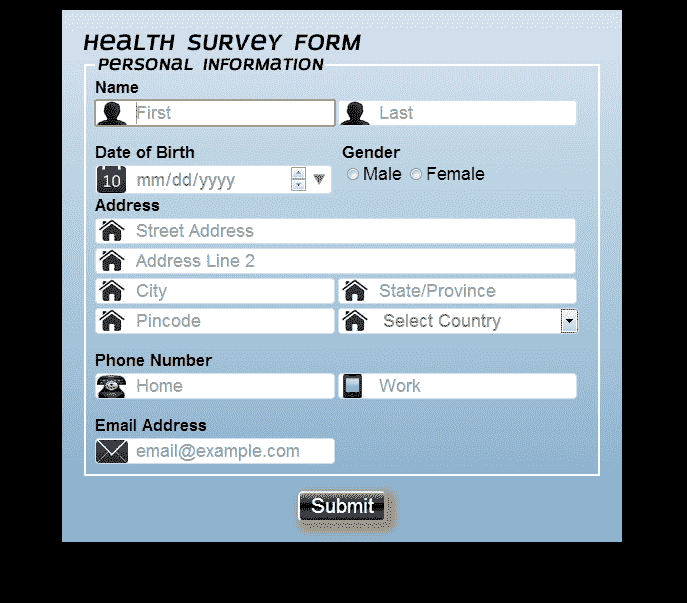
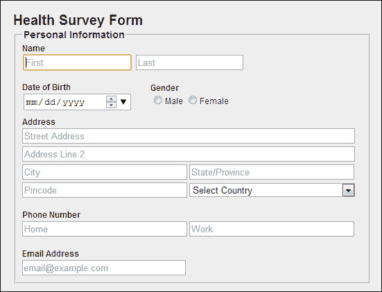

# 第三章：为表单添加样式

在早期的章节中，我们学习了如何使用 HTML5 构建表单，但是 web 设计师和开发人员使用 CSS3 来为 web 表单赋予丰富和优雅的外观。有了对 CSS3 的基本理解，本章我们将学习如何改善表单的外观和感觉。

在本章中，我们将涵盖以下主题：

+   CSS3 及其模块

+   为表单添加样式

+   有效样式表单的指南

# 用于 web 表单的 CSS3

CSS3 为我们带来了无限的新可能性，并允许样式化更好的 web 表单。CSS3 为我们提供了许多创建表单设计影响的新方法，带来了一些重要的变化。HTML5 引入了有用的新表单元素，如滑块和微调器，以及旧元素，如`textbox`和`textarea`，我们可以通过创新和 CSS3 使它们看起来非常酷。使用 CSS3，我们可以将旧的无聊表单变成现代、酷炫和吸引人的表单。

CSS3 完全向后兼容，因此我们不需要更改现有的表单设计。浏览器已经并且将始终支持 CSS2。

CSS3 表单可以分为模块。一些最重要的 CSS3 模块包括：

+   选择器（带伪选择器）

+   背景和边框

+   文本（带文本效果）

+   字体

+   渐变

表单的样式始终根据要求和 web 设计师或开发人员的创新而变化。在本章中，我们将研究那些可以为我们的表单添加样式并赋予其丰富和优雅外观的 CSS3 属性。

CSS3 的一些新属性需要供应商前缀，因为它们经常被使用，因为它们帮助浏览器读取代码。一般来说，对于某些属性，如`border-radius`，在 CSS3 中不再需要使用它们，但当浏览器无法解释代码时，它们会发挥作用。以下是主要浏览器的所有供应商前缀的列表：

+   `-moz-`：Firefox

+   `-webkit-`：Safari 和 Chrome 等 WebKit 浏览器

+   `-o-`：Opera

+   `-ms-`：Internet Explorer

在我们开始为表单添加样式之前，让我们快速复习一下表单模块，以便更好地理解和为表单添加样式。

# 选择器和伪选择器

选择器是用于选择要样式化的元素的模式。选择器可以包含一个或多个由组合符分隔的简单选择器。CSS3 选择器模块引入了三个新的属性选择器；它们被分组在**子字符串匹配属性选择器**的标题下。

这些新选择器如下：

+   `[att^=val]`：以...开始选择器

+   `[att$=val]`：以...结尾选择器

+   `[att*=val]`：包含选择器

这些新选择器中的第一个，我们将称之为“以...开始”选择器，允许选择具有指定属性（例如，超链接的`href`属性）以指定字符串（例如，`http://`，`https://`或`mailto:`）开始的元素。

同样，额外的两个新选择器，我们将称之为“以...结尾”和“包含”选择器，允许选择具有指定属性的元素，其中指定的属性要么以指定的字符串结尾，要么包含指定的字符串。

CSS 伪类只是选择器的附加关键字，告诉要选择的元素的特殊状态。例如，当用户悬停在选择器指定的元素上时，`:hover`将应用样式。伪类和伪元素可以将样式应用于元素，不仅与文档树的内容相关，还与外部因素相关，例如浏览器历史记录，如`:visited`，以及其内容的状态，例如`:checked`，在某些表单元素上。

新的伪类如下：

| 类型 | 详情 |
| --- | --- |
| `:last-child` | 用于匹配作为其父元素的最后一个子元素的元素。 |
| `:first-child` | 用于匹配作为其父元素的第一个子元素的元素。 |
| `:checked` | 用于匹配已选中的元素，如单选按钮或复选框。 |
| `:first-of-type` | 用于匹配指定元素类型的第一个子元素。 |
| `:last-of-type` | 用于匹配指定元素类型的最后一个子元素。 |
| `:nth-last-of-type(N)` | 用于匹配指定元素类型的倒数第 N 个子元素。 |
| `:only-child` | 用于匹配其父元素的唯一子元素的元素。 |
| `:only-of-type` | 用于匹配其类型的唯一子元素的元素。 |
| `:root` | 用于匹配文档的根元素。 |
| `:empty` | 用于匹配没有子元素的元素。 |
| `:target` | 用于匹配文档 URL 中标识符的当前活动元素的目标。 |
| `:enabled` | 用于匹配已启用的用户界面元素。 |
| `:nth-child(N)` | 用于匹配父元素的每第 N 个子元素。 |
| `:nth-of-type(N)` | 用于匹配父元素的每第 N 个子元素，从父元素的最后一个开始计数。 |
| `:disabled` | 用于匹配已禁用的用户界面元素。 |
| `:not(S)` | 用于匹配未被指定选择器匹配的元素。 |
| `:nth-last-child(N)` | 在父元素的子元素列表中，用于根据它们的位置匹配元素。 |

# 背景

CSS3 包含几个新的背景属性；此外，在 CSS3 中，还对背景的先前属性进行了一些更改；这些更改允许更好地控制背景元素。

添加的新背景属性如下。

## 背景剪切属性

`background-clip`属性用于确定背景图像的允许区域。

如果没有背景图像，则此属性仅具有视觉效果，例如当边框具有透明区域或部分不透明区域时；否则，边框会覆盖差异。

### 语法

`background-clip`属性的语法如下：

```html
background-clip: no-clip / border-box / padding-box / content-box;
```

### 值

`background-clip`属性的值如下：

+   `border-box`：使用此选项，背景延伸到边框的外边缘

+   `padding-box`：使用此选项，不会在边框下绘制背景

+   `content-box`：使用此选项，背景在内容框内绘制；只有内容覆盖的区域会被绘制

+   `no-clip`：这是默认值，与`border-box`相同

## 背景原点属性

`background-origin`属性指定背景图像或颜色相对于`background-position`属性的定位。

如果背景图像的`background-attachment`属性为固定，则此属性无效。

### 语法

以下是`background-attachment`属性的语法：

```html
background-origin: border-box / padding-box / content-box;
```

### 值

`background-attachment`属性的值如下：

+   `border-box`：使用此选项，背景延伸到边框的外边缘

+   `padding-box`：使用此选项，不会在边框下绘制背景

+   `content-box`：使用此选项，背景在内容框内绘制

## 背景大小属性

`background-size`属性指定背景图像的大小。

如果未指定此属性，则将显示图像的原始大小。

### 语法

以下是`background-size`属性的语法：

```html
background-size: length / percentage / cover / contain;
```

### 值

`background-size`属性的值如下：

+   `长度`：指定背景图像的高度和宽度。不允许负值。

+   `百分比`：以父元素的百分比来指定背景图像的高度和宽度。

+   `cover`：指定背景图像尽可能大，以完全覆盖背景区域。

+   `contain`：指定图像尺寸最大化，使其宽度和高度可以适应内容区域。

除了添加新属性，CSS3 还增强了一些旧的背景属性，如下所示。

## background-color 属性

如果元素的背景图像的底层图层不能使用，我们可以指定一个回退颜色，除了指定背景颜色。

我们可以通过在回退颜色之前添加一个斜杠来实现这一点。

```html
background-color: red / blue;
```

## background-repeat 属性

在 CSS2 中，当图像在末尾重复时，图像经常被切断。CSS3 引入了新的属性，我们可以用它来解决这个问题：

+   `space`：通过在图像瓦片之间使用此属性，等量的空间被应用，直到填满元素

+   `round`：通过使用此属性，直到图块适合元素，图像被缩小

## background-attachment 属性

有了新的可能值 `local`，我们现在可以在元素内容滚动时设置背景滚动。

这适用于可以滚动的元素。例如：

```html
body{background-image:url('example.gif');background-repeat:no-repeat;background-attachment:fixed;}
```

### 注意

CSS3 允许网页设计师和开发人员使用简单的逗号分隔列表来拥有多个背景图像。例如：

```html
background-image: url(abc.png), url(xyz.png);
```

## 边框

`border` 属性允许我们指定元素边框的样式和颜色，并且借助 CSS3，我们已经迈入了下一个级别。

使用 CSS3，我们可以创建圆角边框，添加阴影，并使用图像作为边框，而不需要使用诸如 Photoshop 等各种设计程序。

添加的新边框属性如下。

## border-radius 属性

使用 CSS 创建圆角边框从来都不容易。有许多可用的方法，但没有一种方法是直接的。此外，为了正确应用样式，必须同时使用 WebKit 和 Mozilla 的供应商前缀。

`border-radius` 属性可用于自定义按钮。我们还可以将 `border-radius` 应用于单个角落。有了这个属性的帮助，我们可以轻松地创建圆角边框。

### 语法

`border-radius` 属性的语法如下：

```html
border-radius: 1-4 length / % ;
```

### 值

以下是 `border-radius` 属性的值：

+   `length`：定义圆的半径大小

+   `%`：使用百分比值定义圆的半径大小

## box-shadow 属性

`box-shadow` 属性允许设计师和开发人员轻松创建多个下拉阴影。这些可以是盒子的外部或内部，指定颜色、大小、模糊和偏移的值。

通过简单地声明 `box-shadow` 一次，我们可以使用 `outer` 和 `inset` 版本，用逗号分隔。

### 语法

`box-shadow` 属性的语法如下：

```html
box-shadow: h-shadow v-shadow blur spread color inset;
```

### 值

以下显示了 `box-shadow` 属性的值：

+   `inset`：将外部（outset）阴影更改为内部阴影

+   `<h-shadow>`，`<v-shadow>`：指定阴影的位置

+   `<blur>`：这个值越大，模糊越大

+   `<spread>`：指定阴影的大小

+   `<color>`：指定阴影的颜色

## border-image 属性

`border-image` 属性有点棘手，但它允许我们创建具有自定义边框的框。有了这个功能，您可以定义一个图像来用作边框，而不是普通的边框。

我们可以使用图像甚至渐变来创建装饰性边框，而不仅仅是简单的圆角。

这个功能实际上分成了几个属性：

+   border-image

+   border-corner-image

### 语法

`border-image` 属性的语法如下：

```html
border-image: <source><slice><width><outset><repeat>;
```

### 值

`border-image` 属性的值如下：

+   `source`：指定用于边框的图像。

+   `slice`：指定边框的内部偏移量。

+   `width`：指定边框的宽度。

+   `outset`：指定边框图像区域延伸到边框框之外的程度。

+   `repeat`：指定边框是否应该被拉伸。如果是，那么它是圆形的还是拉伸的。

# 文本效果

我们已经看到许多具有各种文本效果的网站，它们正在迅速成为良好表单设计的当前和未来趋势。借助 CSS3，这些效果最好的一点是它们可以通过纯 CSS 实现，也就是说，不再需要图像替换和图像密集的设计。在本节中，我们将学习 CSS3 提供的一些新的文本效果。

新的文本特性如下。

## text-shadow 属性

`text-shadow`属性用于对文本内容应用阴影效果。我们可以通过使用一个简单的逗号为单个文本添加一个或多个效果。

这些效果包括阴影颜色、阴影效果的 x/y 偏移和阴影效果的模糊半径。效果可以重叠，但为了清晰起见，它们不应该重叠在文本内容上。

### 语法

`text-shadow`属性的语法如下：

```html
text-shadow: <color><offset-x><offset-y><blur-radius>;
```

## word-wrap 属性

`word-wrap`属性由浏览器用于在单词内部断开行，以防止文本超出边界，否则它将超出边界。它强制文本换行，即使必须在单词中间分割它。

### 语法

`word-wrap`属性的语法如下：

```html
word-wrap:break-word / normal;
```

### 值

`word-wrap`属性的值如下：

+   `word-break`：允许不可断开的单词被断开

+   `normal`：仅在允许的断点处断开单词

CSS3 提供的一些新的文本属性如下：

+   `hanging-punctuation`：指定标点符号字符是否可以放在行框外部

+   `punctuation-trim`：指定标点符号是否应该被修剪

+   `text-align-last`：描述块的最后一行或强制换行前的行如何对齐

+   `text-emphasis`：将强调标记应用于元素的文本，并将前景色应用于强调标记

+   `text-justify`：当`text-align`为`justify`时，指定使用的对齐方法

+   `text-outline`：指定文本的轮廓

+   `text-overflow`：指定文本溢出包含元素时需要采取的操作

+   `text-wrap`：指定文本的断行规则

+   `word-break`：对于非 CJK 脚本，指定断行规则

# 字体

在 CSS2 中，字体模块用于定义文本的大小、行高和粗细，以及其他属性，如样式和系列。

在 CSS 中，我们只能使用计算机上可用的预定义字体系列，但是 CSS3 为我们提供了使用用户定义字体的功能，这些字体可以用于设计网页表单。

## @font-face 规则

字体在决定页面或页面特定部分外观方面起着重要作用，这就是网页设计师和公司受益的地方，比如品牌营销。

`@font-face`属性已经将字体的使用带到了一个新的水平。

这个规则允许用户在网页表单或页面上指定任何真实的字体。更准确地说，这个规则允许从服务器下载特定的字体，并在网页表单或页面中使用它，如果用户尚未安装该特定字体。

### 语法

`@font-face`属性的语法如下：

```html
@font-face{
  font-family: <family-name>;
  src: <url>;
  unicode-range: <urange>;
  font-variant: <font-variant>;
  font-feature-settings: normal / <feature-tag-value>;
  font-stretch: <font-stretch>;
  font-weight: <weight>;
  font-style: <style>;
}
```

## 字体描述符

CSS3 提供了可以在`@font-face`规则内定义的新字体描述符。可以使用的各种字体描述符如下。

### src 字体描述符

`src`字体描述符用于定义字体的 URL。

值：`URL`。

### font-style 字体描述符

`font-style`字体描述符用于定义要使用的字体的样式。这是一个可选字段，默认值为`normal`。

值：`normal`，`italic`和`oblique`。

### font-stretch 字体描述符

`font-stretch`字体描述符用于定义字体应该被拉伸多少。这是一个可选字段，默认值为`normal`。

值：`normal`、`condensed`、`ultra-condensed`、`extra-condensed`、`semi-condensed`、`expanded`、`semi-expanded`、`extra-expanded`和`ultra-expanded`。

### 字体族字体描述符

`font-family`字体描述符用于定义字体的名称或类型。

值：`name`。

### unicode-range 字体描述符

`unicode-range`字体描述符用于定义字体支持的 Unicode 字符范围。这是一个可选字段，默认值为`U+0-10FFFF`。

值：`Unicode-range`。

### 字重描述符

`font-weight`字体描述符用于定义字体的粗细程度。这是一个可选字段，默认值为`normal`。

值：`normal`、`bold`、`100`、`200`、`300`、`400`、`500`、`600`、`700`、`800`和`900`。

# 渐变

CSS3 的一个令人惊奇的颜色特性是渐变。它们允许颜色之间的平滑过渡。

它们使用`background-image`属性声明，因为它们没有特殊属性。

渐变允许我们通过将颜色`hex`转换为`rgba`模式来创建透明度。

尽管有许多增强功能，但供应商前缀用于使表单与浏览器兼容，以便浏览器可以解释样式。

## 语法

渐变的语法如下：

```html
linear-gradient (<angle><to [left / right || top / bottom]><color [percentage/length]><color [percentage/length]>)
```

## 值

渐变的值包括以下内容：

+   `angle`：这指定了渐变的方向角度

+   `color`：这指定了颜色值，可选的选项是停止位置

# 样式化表单

快速复习了新的 CSS3 属性后，现在是时候自定义旧的和无聊的表单了。

在第一章中，我们构建了一个**健康调查表**。我们将重复使用该表单示例来讨论新的 CSS3 以及基本的 CSS 属性以及它们如何在表单中增强创造力。

为了进行样式设置，我们只需取表单的第一部分，即**个人信息**。经过一些不需要解释的小改动，以下是 HTML 代码：

```html
<form id="masteringhtml5_form">
  <label for="heading" class="heading">Health Survey Form</label>
  <fieldset class="fieldset_border">
    <legend class="legend">Personal Information</legend>
    <div>
      <label for="name">Name</label><br>
      <input  type="text" class="name txtinput" name="name" placeholder="First" autofocus>
      <input  type="text" class="name txtinput" name="name" placeholder="Last">
    </div><br>
    <div class="div_outer_dob">
      <div class="div_dob">
        <label for="dob">Date of Birth</label><br>
        <input type="date" value="date of birth" class="txtinput dateinput">
      </div>
      <div class="gender">
        <label for="gender">Gender</label><br>
        <input type="radio" name="gender"><label>Male</label>
        <input type="radio" name="gender"><label>Female</label>
      </div>
    </div>

    <div class="div_outer_address" >
      <label for="address">Address</label><br>
      <input type="text" class="txtinput textbox address_img" placeholder="Street Address"><br>
      <input type="text" class="txtinput textbox address_img" placeholder="Address Line 2"><br>
      <input type="text" class="txtinput  address_img" placeholder="City">
      <input type="text" class="txtinput  address_img" placeholder="State/Province"><br>
      <input type="text" class="txtinput  address_img" placeholder="Pincode">
      <select class="txtinput select address_img" >
        <option value="Country" class="select"  >Select Country</option>
        <option value="India" class="select"  >India</option>
        <option value="Australia" class="select"  >Australia</option>
      </select>
    </div><br>
    <div>
      <label for="contact">Phone Number</label><br>
      <input type="tel" class="txtinput  home_tel" placeholder="Home">
      <input type="tel" class="txtinput  work_tel" placeholder="Work">
    </div><br>
    <div>
      <label for="email">Email Address</label><br>
      <input type="email" class="txtinput  email" placeholder="email@example.com">
    </div>
    </fieldset>
    <br>

  <div class="submit">
    <input type="submit" class="submit_btn" value="Submit">
  </div>
</form>
```

由于我们的主要重点是样式，让我们来看看表单的 CSS。以下代码保存在一个带有`.css`扩展名的单独文件中（外部 CSS 文件），它链接到主 HTML 页面。应该遵循使用单独的 CSS 文件，因为它可以提高代码的可读性，同时也更容易维护样式。

此外，新属性和字体类型以粗体显示：

```html
/* General Form */
html{
  margin: 0px;
  padding: 0px;
  background: #000000;
}
@font-face{
  font-family: 'Conv_azoft-sans-bold-italic';
  src: url('fonts/azoft-sans-bold-italic.eot');
  src: url('fonts/azoft-sans-bold-italic.woff') format('woff'),  
  url('fonts/azoft-sans-bold-italic.ttf') format('truetype'), url('fonts/azoft-sans-bold-italic.svg') format('svg');
  font-weight: normal;
  font-style: normal;
}

body{
  font-size:12px;
  height: 100%; 
  width: 38%;
  padding: 20px;
  margin: 10px auto;
  font-family: Helvetica, Arial, sans-serif;
  color: #000000;
  background: rgba(212,228,239,1);
  background: -moz-linear-gradient(top, rgba(212,228,239,1) 0%, rgba(134,174,204,1) 100%);
  background: -webkit-gradient(left top, left bottom, color-stop(0%, rgba(212,228,239,1)), color-stop(100%, rgba(134,174,204,1)));
  background: -webkit-linear-gradient(top, rgba(212,228,239,1) 0%, rgba(134,174,204,1) 100%);
  background: -o-linear-gradient(top, rgba(212,228,239,1) 0%, rgba(134,174,204,1) 100%);
  background: -ms-linear-gradient(top, rgba(212,228,239,1) 0%, rgba(134,174,204,1) 100%);
  background: linear-gradient(to bottom, rgba(212,228,239,1) 0%, rgba(134,174,204,1) 100%);
}

input[type="radio"]{
  cursor:pointer;
}

#masteringhtml5_form .fieldset_border{
  border-color:#ffffff;
  border-style: solid;
}

#masteringhtml5_form .txtinput{ 
  font-family: Helvetica, Arial, sans-serif;
  border-style: solid;
  border-radius: 4px;
  border-width: 1px;
  border-color: #dedede;
  font-size: 18px;
  padding-left: 40px;
  width: 40%;
  color: #777;
  cursor:pointer;
}

#masteringhtml5_form .name{
  background: #fff url('images/user.png')  no-repeat;
}

#masteringhtml5_form  label{
  font-weight:bold;
  font-size:17px;
}

#masteringhtml5_form .legend{
  font-size: 18px;
  font-family: 'Conv_azoft-sans-bold-italic',Helvetica, Arial, sans-serif;
}

#masteringhtml5_form .heading{
  font-size: 24px;
  font-family: 'Conv_azoft-sans-bold-italic',Helvetica, Arial, sans-serif;
}

#masteringhtml5_form .txtinput.textbox{
  width:89%;
}

#masteringhtml5_form .address_img{
  background: #fff url('images/home.png')  no-repeat;
  background-position-y: -5px;
}

#masteringhtml5_form .txtinput.select{
  width:49%;
  color:#777777;
}

#masteringhtml5_form .div_outer_dob{
  width:100%;
}

#masteringhtml5_form .dateinput{
  width:79%;
  background: #fff url('images/date.png')  no-repeat;
  background-position-x: 1px;
  background-size: 29px 29px;
}

#masteringhtml5_form .home_tel{
  background: #fff url('images/tel.png')  no-repeat;
  background-position-x: 1px;
  background-size: 29px 29px;
}

#masteringhtml5_form .work_tel{
  background: #fff url('images/work.png')  no-repeat;
  background-size: 27px 25px;
}

#masteringhtml5_form .email{
  background: #fff url('images/email.png')  no-repeat;
}

#masteringhtml5_form .div_dob{
  width:50%;
  float:left;
}

#masteringhtml5_form .gender{
  width:50%;
  float:left;
}

#masteringhtml5_form .gender span{
  font-size:18px;
}

#masteringhtml5_form .div_outer_address{
  clear:both;
}

.legend{
  font-weight:bold;
  font-size:14px;
}

#masteringhtml5_form .submit{
  text-align:center; 
}

#masteringhtml5_form .submit_btn{
  color:#ffffff;
  cursor:pointer;
  border-radius:5px;
  width: 17%;
  height: 100%;
  font-size: 21px;
  height:100%;
  box-shadow: 5px 5px 10px 5px #888888;
  background: rgb(149,149,149);
  background: -moz-linear-gradient(top,  rgba(149,149,149,1) 0%, rgba(13,13,13,1) 46%, rgba(1,1,1,1) 50%, rgba(10,10,10,1) 53%, rgba(78,78,78,1) 76%, rgba(56,56,56,1) 87%, rgba(27,27,27,1) 100%); 
  background: -webkit-gradient(linear, left top, left bottom, color-stop(0%,rgba(149,149,149,1)), color-stop(46%,rgba(13,13,13,1)), color-stop(50%,rgba(1,1,1,1)), color-stop(53%,rgba(10,10,10,1)), color-stop(76%,rgba(78,78,78,1)), color-stop(87%,rgba(56,56,56,1)), color-stop(100%,rgba(27,27,27,1))); 
  background: -webkit-linear-gradient(top,  rgba(149,149,149,1) 0%,rgba(13,13,13,1) 46%,rgba(1,1,1,1) 50%,rgba(10,10,10,1) 53%,rgba(78,78,78,1) 76%,rgba(56,56,56,1) 87%,rgba(27,27,27,1) 100%); 
  background: -o-linear-gradient(top,  rgba(149,149,149,1) 0%,rgba(13,13,13,1) 46%,rgba(1,1,1,1) 50%,rgba(10,10,10,1) 53%,rgba(78,78,78,1) 76%,rgba(56,56,56,1) 87%,rgba(27,27,27,1) 100%); 
  background: -ms-linear-gradient(top,  rgba(149,149,149,1) 0%,rgba(13,13,13,1) 46%,rgba(1,1,1,1) 50%,rgba(10,10,10,1) 53%,rgba(78,78,78,1) 76%,rgba(56,56,56,1) 87%,rgba(27,27,27,1) 100%); 
  background: linear-gradient(to bottom,  rgba(149,149,149,1) 0%,rgba(13,13,13,1) 46%,rgba(1,1,1,1) 50%,rgba(10,10,10,1) 53%,rgba(78,78,78,1) 76%,rgba(56,56,56,1) 87%,rgba(27,27,27,1) 100%); 
}
```

前面的 HTML 和 CSS 代码的结果如下：



如果我们将新的 CSS3 表单与我们在第一章中构建的表单的第一部分进行比较，*表单及其重要性*，我们将看到两种表单的外观和感觉上的差异。

为了更好地比较，在第一章中表单的第一部分，*表单及其重要性*，如下所示：



现在，我们意识到了 CSS3 的强大之处，使用它我们很容易地将一个简单和无聊的表单转换成时尚和吸引人的东西。

让我们看看表单的 CSS 中使用的各种选择器及其重要性：

+   `<body>`：应用于`<body>`标签的 CSS 属性充当回退或默认属性，因为它充当包含其中多个其他标签的父标签。CSS 的回退属性包括`font-family`、`font-size`等。

使用`background`这样的属性，利用颜色（以 RBG 表示），并结合`linear-gradient`来设置。`linear-gradient`是用 RBG 颜色值描述的，从顶部开始，直到底部定义为百分比。它们是为了不同的浏览器支持而描述的，包括`-webkit`、`-O`和`-ms`等起始值。它显示了表单的蓝色背景。除此之外，还使用了各种其他 CSS 属性，如`font-size`、`height`和`width`。

+   `heading`和`legend`：对于我们的表单标题（**健康调查表**）和传奇标题（**个人信息**），我们实现了一个新的字体类型`Conv_azoft-sans-bold-italic`，它在`heading`和`legend`类中使用`@font-face`属性定义了`font-family`属性。

我们导入了字体类型文件`.eot`、`.woff`、`.ttf`和`.svg`，以支持不同浏览器，使用了`@font-face`属性。

此外，对于`legend`标签，我们利用了`fieldset_border`类来改变边框颜色和样式。

+   `dateinput`和`div_dob`：这两个类都是为了`<input>`类型`date`，让用户从下拉日历中选择他/她的出生日期。`div_dob`类是为了通过使用`float`属性在屏幕左侧排列元素。除此之外，`dateinput`类还用于使用`background`、`background-position`和`background-size`属性来放置日期图标，以便正确渲染。

+   `txtinput`：`txtinput`类用于样式化表单中使用的文本输入，并且除了使用以前的 CSS 属性，如`font-family`和`border-style`之外，我们还使用了一个名为`border-radius`的新属性，以使文本输入在所有边上都有圆角边框。

我们还为`cursor`类型添加了一个属性，作为指针，当鼠标指针移动到输入字段上时显示一个手点击图标。

`name`、`address_img`、`home_tel`、`work_tel`、`email`、`dropdown`和`calendar`类用于为文本输入字段设置背景图像，具体取决于`<input>`类型。我们利用了背景的各种属性，如`background`、`background-position`和`background-size`，以便正确渲染图标图像。

`autofocus`属性用于名字文本输入，以便在表单加载时自动聚焦光标。

+   `radiobutton`：`<input>`类型`radio`是一个旧的 HTML 输入，这里用于选择性别。我们还使用了`float`属性来将单选按钮对齐到出生日期的右侧。

我们还为`cursor`类型添加了一个属性，作为指针，当鼠标指针移动到输入字段上时显示一个手点击图标。

+   `submit`：为了将表单提交到服务器，我们创建了一个**提交**按钮。在`submit_btn`类中，我们使用了以前版本的属性，如颜色、宽度和高度，以及 CSS3 属性，如`border-radius`来使按钮的所有边都变圆，`box-shadow`和`background`与颜色属性一起使用`linear-gradients`来提供所需的效果。

我们还为`cursor`类型添加了一个属性，作为指针，当鼠标指针移动到输入字段上时显示一个手点击图标。

# 指南

在本节中，我们将看到用于有效样式化表单的 CSS3 指南。

CSS3 的一些最佳实践如下：

+   尽量避免使用内联样式表。应该使用外部 CSS 文件进行样式设置。

+   尽可能使用压缩的 CSS 文件，这是一种去除代码中不必要字符以减小文件大小的做法。

+   使用合并的 CSS 文件。

+   尽可能避免使用多个声明。

+   始终考虑渐进增强。

+   厂商前缀应该被组织和注释得很好。

+   对于与背景相关的属性，请使用回退。

+   在使用排版时，不应影响文本的可读性。

+   启用回退并在每个浏览器中测试表单。

+   尽量使用高效的 CSS 选择器。

+   尽量避免使用 CSS 表达式。

+   指定图像尺寸以提高网页的渲染速度。

+   使用 CSS 精灵以加快图像的渲染速度。

# 总结

在本章中，我们学习了 CSS3 的基础知识以及我们可以将 CSS3 分类为表单的模块，例如厂商前缀、渐变和背景。

然后，通过一个代码示例，我们学习了大多数可以用于改善表单外观和感觉的 CSS3 属性的实际实现。

最后，我们学习了有效样式化表单的最佳实践。
