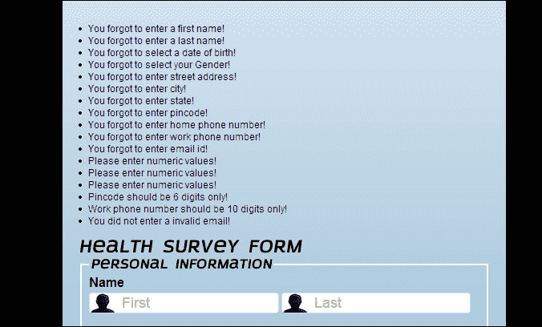
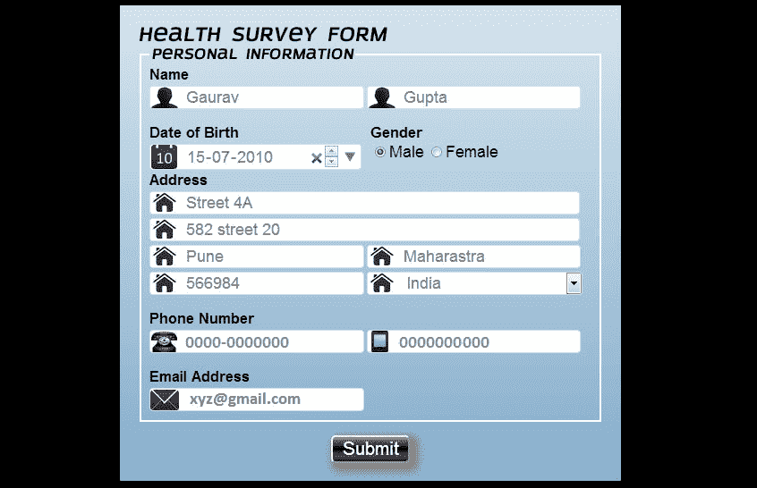
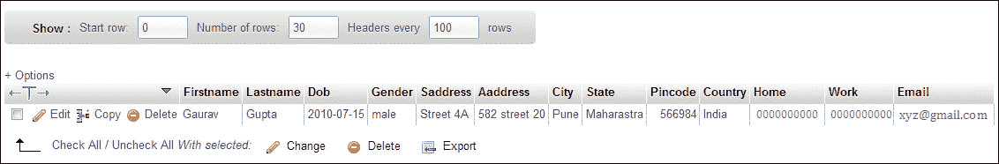

# 第四章：数据库连接

在前几章中，我们学习了表单，比如表单是什么，我们如何验证它们，以及我们如何改进它们的外观和感觉，但是表单有什么用，直到它们存储信息？在本章中，我们将学习如何使用 PHP 和 MySQL 将用户输入的数据存储到数据库中。

在本章中，我们将涵盖以下主题：

+   PHP 是什么

+   MySQL 是什么

+   欺骗和伪造表单

+   将表单链接到数据库

# PHP

PHP 也被用作通用编程语言，基本上是一种服务器端脚本语言，专门设计用于网页开发。通过 PHP 处理器模块，PHP 代码由 Web 服务器解释，生成网页。

与调用外部文件来处理数据不同，PHP 命令可以直接嵌入到 HTML 代码中。它可以用于独立的图形应用程序，并且可以部署在几乎所有操作系统和平台的大多数 Web 服务器上。

在 PHP 中，所有变量是区分大小写的，但用户定义的函数、类和关键字（如 if、else、while、echo 等）是不区分大小写的。

在服务器上，首先执行 PHP 脚本，然后将 HTML 结果发送回浏览器。

通过 HTML 表单，PHP 轻松操纵用户提交的信息的能力是其受欢迎的原因之一。

要使用 PHP，我们必须执行以下步骤：

1.  获取支持 PHP 和 MySQL 的 Web 服务器。

1.  在本章中，我们将使用 WAMP（用于 Windows 操作系统）软件，它会自动安装 Apache 服务器，配置 MySQL 数据库，并安装 PHP 支持应用程序，以便进行简单的维护和配置。

1.  然后，安装 PHP 和 MySQL。

## 语法

PHP 文件的默认扩展名是`.php`，PHP 脚本以`<?php`开头，以`?>`结尾。

```html
<?php
  // PHP script
?>
```

包含一些 PHP 脚本代码，PHP 文件通常包含 HTML 标记。分号用于终止 PHP 语句，我们不需要使用分号来终止 PHP 块的最后一行。

## 表单处理

`$_GET`和`$_POST` PHP 超全局变量（在所有范围中始终可用的内置变量）用于收集用户单击**提交**按钮时提交的表单数据。

### GET 方法

在`GET`方法中，表单中的信息对所有人都是可见的；例如，所有变量名和值都显示在 URL 中。此外，使用`GET`方法对可发送的信息量有限制，这个限制因浏览器而异。

当我们需要将网页加入书签时，这种方法就很有用，因为变量会显示在 URL 中。

我们不能使用`GET`方法发送敏感数据，比如密码或信用卡信息。

以下代码是一个简单的 HTML 页面：

```html
<html>
<body>
<form action="example.php" method="get">
  Name: <input type="text" name="name"><br>
  Age: <input type="text" name="age"><br>
  <input type="submit">
</form>
</body>
</html>
```

当用户填写上述表单并单击**提交**按钮时，表单数据将被发送到名为`example.php`的 PHP 文件进行处理。表单数据将使用`method="get"`发送。

`example.php`文件将类似于以下代码：

```html
<html>
<body>
  Hello! <?php echo $_GET["name"]; ?>!<br>
  You are <?php echo $_GET["age"]; ?> years old.
</body>
</html>
```

### POST 方法

在`POST`方法中，表单中的信息对所有人都是不可见的；例如，在 HTTP 请求的正文中，所有变量名和值都被嵌入。此外，使用`POST`方法对可发送的信息量没有限制。

当我们需要将网页加入书签时，这种方法就不太有用，因为变量不会显示在 URL 中。

此外，在将文件上传到服务器时，`POST`方法还支持高级功能，比如支持多部分二进制输入。

我们可以使用`POST`方法发送敏感数据，比如密码或信用卡信息。

以下代码是一个简单的 HTML 页面：

```html
<html>
<body>
<form action="example.php" method="post">
  Name: <input type="text" name="name"><br>
  Age: <input type="text" name="age"><br>
  <input type="submit">
</form>
</body>
</html>
```

当用户填写上述表单并单击提交按钮时，表单数据将被发送到名为`example.php`的 PHP 文件进行处理。表单数据将使用`method="post"`发送。

`example.php`文件如下所示：

```html
<html>
<body>
  Hello! <?php echo $_POST["name"]; ?>!<br>
  You are <?php echo $_POST["age"]; ?> years old.
</body>
</html>
```

`GET`和`POST`方法都分别填充`$_GET`和`$_POST`数组。由于这些是超全局变量，无论作用域如何，它们始终是可访问的，并且可以从任何类、函数或文件中访问，而无需进行任何特殊操作。这些数组描述如下：

+   `$_GET`: 这是一个变量数组，通过 URL 参数传递给当前脚本

+   `$_POST`: 这是一个变量数组，通过 HTTP POST 方法传递给当前脚本

### 注意

`POST`是发送表单数据的最常用方式，因为有安全方面的考虑。

## 过滤方法

`filter`方法通过验证或净化输入字段来过滤数据。当数据源包含未知数据时，如自定义输入或用户提供的输入时，它起着非常重要的作用并且非常有用。

例如，通过 HTML 表单输入的数据，如调查表单和新注册。

有两种主要类型的过滤：

+   验证

+   净化

输入数据的过滤是安全问题的主要关注点之一。外部数据包括来自用户、cookies、web 服务数据或数据库查询结果的输入数据。由于所有的 web 表单和应用程序都依赖于外部输入，因此通过过滤输入数据，我们可以确保我们的应用程序从用户那里得到有效的输入。

以下的`filter`函数可以用来过滤一个变量：

+   `filter_var_array()`: 获取多个变量，并使用相同或不同的过滤器对它们进行过滤

+   `filter_id()`: 返回指定过滤器的 ID 号

+   `filter_var()`: 使用指定的过滤器过滤单个变量

+   `filter_input()`: 通过名称获取一个输入变量，并可选择地对其进行过滤

+   `filter_has_var()`: 检查指定输入类型的变量是否存在

+   `filter_input_array()`: 获取多个输入变量，并使用相同或不同的过滤器对它们进行过滤

+   `filter_list()`: 返回所有支持的过滤器的列表

在下面的例子中，我们使用`filter_var()`函数验证一个整数：

```html
<?php
  $int = 'g819';
  if(!filter_var($int, FILTER_VALIDATE_INT))
  {
    echo("Entered integer is invalid");
  }
  else
  {
    echo("Entered integer is valid");
  }
?>
```

在上面的代码中，使用`FILTER_VALIDATE_INT`过滤器来过滤变量。由于整数无效，上面代码的输出将是**整数无效**，但如果我们尝试使用一个整数变量，比如 819，输出将是**整数有效**。

### 验证用户输入数据

`filter`方法用于验证用户输入数据。成功时返回值为**true**，失败时返回值为**false**。

严格的格式规则用于验证 IP 地址、URL、变量或电子邮件类型。

现在，在下面的例子中，我们将验证表单的一个输入字段。在开始之前，我们将首先检查所需输入数据的存在。然后，使用`filter_var()`函数，我们将验证输入数据。

```html
  <?php
  if(!filter_has_var($_GET"url"l))
  {
    echo("Input type is not present");
  }
  else
  {
  if (!filter_var($_GET["url"l, FILTER_VALIDATE_URL))
  {
    echo "Entered URL is invalid";
  }
  else
  {
    echo "Entered URL is valid";
  }
  }
?>
```

在上面的例子中，使用`GET`方法发送了一个输入`url`。它首先检查`GET`类型的输入`email`变量是否存在。当输入变量存在时，它验证 URL。

### 净化用户输入数据

净化的主要目的是允许或不允许字符串中的指定字符。它始终返回一个字符串值。它不遵循任何数据格式规则。

在下面的例子中，我们将验证表单的一个输入字段。在开始之前，我们将首先检查所需输入数据的存在。然后，使用`filter_var()`函数，我们将净化输入数据。

```html
<?php
  if(!filter_has_var(($_POST['string'l))
  {
    echo("Input type is not present");
  }
  else
  {
    $string = filter_var($_POST['string'l, FILTER_SANITIZE_STRING);
  }
?>
```

在上面的例子中，使用`POST`方法发送了一个输入`string`。它首先检查`POST`类型的输入`string`变量是否存在。当输入变量存在时，它验证字符串。

当用户输入一个坏的输入字符串，比如`MasteringååHTML5ååForms`，经过净化后，同样的字符串会变成`MasteringHTML5Form`。

### FILTER_CALLBACK 过滤器

使用`FILTER_CALLBACK`过滤器，可以调用用户定义的函数并将其用作过滤器。使用这个方法可以完全控制数据过滤。

与指定选项类似，指定要用于过滤的函数。

我们可以使用现有的 PHP 函数，也可以创建我们自己的用户定义函数。

在下面的例子中，我们将创建一个用户定义的函数，用于将所有的`*`符号替换为空格：

```html
<?php
  function towhitespace($string)
  {
    return str_replace("*", " ", $string);
  }
  $string = "Converting*To*Whitespace*Characters";
  echo filter_var($string, FILTER_CALLBACK,       
  array("options"=>"towhitespace"));
?>
```

上述代码的输出是：

![FILTER_CALLBACK 过滤器

在上面的例子中，字符串中的任何位置，无论多少次，所有的`*`符号都被替换为空格字符。

在上面的代码中，我们首先创建了一个函数，用于将所有的`*`符号替换为空格。然后，调用`filter_var()`函数，使用`FILTER_CALLBACK`过滤器和包含函数的数组。

### 过滤多个输入

如今，几乎每个网络表单都包含多个输入字段，比如注册页面。当一个表单包含多个输入字段时，为了验证或清理，对每个输入字段调用`filter_var()`或`filter_input()`函数不仅增加了代码的大小，还增加了复杂性。解决这个问题的方法是使用`filter_var_array()`或`filter_input_array()`函数。

在下面的例子中，我们将验证表单的两个输入字段。我们将使用`filter_var_array()`函数来过滤这些变量，并使用`POST`方法。输入是年龄和电子邮件地址。

```html
<?php
  $filters = array
  (
    "age" => array
    (
      "filter"=>FILTER_VALIDATE_INT,
      "options"=>array
        (
        "min_range"=>1,
        "max_range"=>99
      )
    ),
    "email"=> FILTER_VALIDATE_EMAIL
  );
  $output = filter_var_array($_POST, $filters);

  if (!$output["age"])
  {
    echo("Entered age must be between 1 and 99");
  }
  elseif(!$output["email"])
  {
    echo("Entered email is invalid");
  }
  else
  {
    echo("Entered inputs are valid");
  }
?>
```

在上面的例子中，输入字段是使用`POST`方法发送的。在这里，设置了一个包含输入变量名称（如`age`和`email`）的数组。我们还对这些输入变量使用了过滤器。

首先，我们使用`filter_var_array()`函数和我们设置的数组以`POST`方法输入变量。然后，我们在`$output`变量中验证了`age`和`email`变量的无效输入。

`filter_input_array()`或`filter_var_array()`函数的第二个参数可以是单个过滤器 ID 或数组。当参数是单个过滤器 ID 时，输入数组中的所有值都将被指定的过滤器过滤。

如果参数是一个数组，则必须遵循以下规则：

+   数组值必须是过滤器 ID 或指定标志、过滤器和选项的数组

+   必须有一个包含输入变量的关联数组，如`email`或`age`输入变量

# MySQL

数据库是一个结构化和组织良好的数据集合。每个前端应用程序都需要一个兼容的数据库，作为应用程序的后端。它是为了有效的存储和检索数据而组织的，而不是根据数据的性质或集合或检索方法。将数据库添加到网站提供了动态内容、灵活性和可管理性，以及各种用户交互，如果没有这个，将很难实现。

为了处理相应的数据，数据库管理系统应用程序与用户、其他应用程序和数据库本身进行交互。这个应用程序将作为管理所有数据的后端。有许多著名的数据库管理系统，包括 Microsoft SQL Server、Oracle、Sybase、MySQL、PostgreSQL、SQLite、Microsoft Access、dBASE、FoxPro、IBM 的 DB2、Libre Office Base 和 FileMaker Pro。

## PHP 的 MySQL

在使用 PHP 时，MySQL 是最兼容的数据库系统。这个数据库是几乎每个开源 PHP 应用程序的重要组成部分。

MySQL 是以*My*和*Michael Widenius*的女儿*My*的名字命名的，后者是 MySQL 的联合创始人。它由 Oracle Corporation 开发、分发和支持。这是一个免费的、易于下载的开源数据库管理系统。它非常快速、可靠，并支持标准的**结构化查询语言**（**SQL**）。

SQL 用于从称为数据库的存储区域访问和修改数据或信息。它以快速处理、可靠性和易用性和灵活性而闻名。由 IBM 开发，它是一种类似英语的语言，它以记录组的形式处理数据，而不是一次处理一条记录。以下是 SQL 的一些功能：

+   存储数据

+   修改数据

+   检索数据

+   删除数据

+   创建表和其他数据库对象

MySQL 中的数据存储在表中。表是相关数据的集合，所有数据都按列和行排列。在存储信息分类时，数据库非常有用。

## MySQL-PHP 连接

在使用任何数据库时，首先出现的问题是“我们如何从数据库中访问数据？”要访问任何数据库，我们首先必须连接到该数据库。

### 打开到 MySQL 服务器的连接

要建立连接，我们首先必须打开到 MySQL 服务器的连接。在 PHP 中，可以使用`mysqli_connect()`函数来实现。这个函数返回一个资源，这个资源是指向数据库连接的指针。它也被称为数据库句柄。

`mysqli_connect()`函数的语法是：

`mysqli_connect(server,username,password,dbname);`

它支持以下值：

+   `服务器`：它可以是 IP 地址或主机名。

+   `密码`：这是用于登录的密码，是可选的。

+   `用户名`：这是 MySQL 用户名，是可选的。此外，MySQL 可以有多个用户。

+   `dbname`：这是在执行查询时要使用的默认数据库，是可选的。

例如：

```html
<?php
  $username = "your_name";
  $password = "your_password";
  $hostname = "localhost";
  $dbname = "your_db"; 
  $dbconnect = mysqli_connect($hostname, $username, $password,$dbname)
  //Connects to the database
?>
```

### 关闭连接

PHP 将在脚本结束时自动关闭连接。但是如果我们想在结束之前关闭连接，我们可以使用`mysqli_close()`函数。

例如：

```html
<?php
  mysqli_close($dbhandle);
  //Closes the connection
?>
```

## 创建或选择一个数据库

一旦我们成功创建了与数据库的连接，下一步就是创建或选择将与我们的应用程序一起使用的任何数据库。

### 创建一个数据库

要创建数据库，我们使用`CREATE DATABASE`语句在 MySQL 中创建数据库表。

例如：

```html
<?php
  $createDB="CREATE DATABASE personal_info";
  //Creates a database with name as "personal_info"

  mysqli_query($createDB)
  //Executes the create database query
?>
```

### 选择一个数据库

要选择已经存在的数据库，我们使用`MYSQLI_SELECT_DB`语句在 MySQL 中选择数据库。

例如：

```html
<?php
  $dbconnect = mysqli_connect("host name", "username", "password", "dbname")
  //Connects to the database

  $dbselected = mysqli_select_db("personal_info",$dbconnect)
  //Selects the database to work with
?>
```

## 创建一个表

一旦我们创建或选择了一个数据库，下一步就是在数据库内创建一个表。

`CREATE TABLE`用于在 MySQL 中创建表。

例如：

```html
<?php
  $createTB="CREATE TABLE TbDummy(
    Firstname VARCHAR(255) NOT NULL,
    Lastname VARCHAR(255) NOT NULL);
  //Creating a table in MySQL with name as "TbDummy"

  mysqli_query($createTB)
  //Executing the create table query
?>
```

## 主键

为了增加表的灵活性和可靠性，必须存在主键字段。

一个表由许多记录组成，为了唯一标识每个记录，使用主键。每个记录必须有一个唯一的值，这个唯一的值将作为主键。此外，主键值不能为 null，因为为了定位记录，数据库引擎需要一个值。主键是列的组合，唯一标识记录。

例如：

让我们看一下包含组织中每个员工记录的`Employee`表：

| 员工 ID | 名字 | 职位 | 地点 |
| --- | --- | --- | --- |
| 101 | Gaurav Gupta | 程序分析师 | 浦那 |
| 102 | Gaurav Gupta | 程序分析师 | 浦那 |

该表包含两条记录，名称、职位和地点相同。员工的唯一员工 ID 号将是`Employee`表中主键的一个很好的选择。因此，我们将`Employee ID`列设置为此表的主键。

以下片段是一个示例代码，用于将列定义为主键来创建表：

```html
<?php
  $createDB="CREATE DATABASE DBEmployee";
  //Creates a database with name as "DBEmployee"

  mysqli_query($createDB)
  //Executes the create database query

  $createTB="CREATE TABLE Employee(
    Employee_ID INT NOT NULL,
    Name VARCHAR(255),
    Designation VARCHAR(255),
    Location VARCHAR(255),
    PRIMARY KEY(Employee_ID));
  //Creating a table with name as "Employee" and defining a column "Employee_ID" as a primary key

  mysqli_query($createTB)
  //Executing the create table query
?>
```

# 欺骗和伪造表单

如今，每个网站都有一个 HTML 表单供用户完成注册，以便用户可以访问该特定网站。由于互联网犯罪不断增加，我们如何验证完成表单的用户是通过您的网站完成的？因此，有必要知道没有人伪造我们的表单提交。

在我们看到如何保护我们的表单免受欺骗之前，让我们看看如何欺骗一个表单。通过以下两种方式，我们可以改变表单提交：

+   伪造 HTTP 请求

+   欺骗提交

## 伪造 HTTP 请求

我们可以使用 telnet 访问端口 80 来输入我们自己的请求。因此，通过这种方法，我们可以克服为每种类型的攻击生成或修改表单的麻烦，因为它可能只是使用原始 HTTP 来更改表单数据。由于这个原因，我们可以说这种方法比其他方法更复杂。

伪造 HTTP 请求是一种更高级的自动化攻击形式。

在以下示例中，我们要求登录到示例论坛：

```html
  POST /index.php?act=Login&CODE=01&CookieDate=1 HTTP/1.1
  Host: forums.example.com
  Connection: close
  Referrer: http://forums.example.com/
  Cookie: session_id=7819
  Content-Type: application/x-www-form-urlencoded
  Content-Length: 44

  UserName=myname&PassWord=mypass&CookieDate=1
```

要使用前面提到的请求，您需要更改一些项目，包括：

+   将`myname`更改为我们的用户名

+   将`mypass`更改为我们的密码

+   将`session_id`更改为必要的值

+   将`Content-Length`更改为`POST`数据的新长度

## 欺骗提交

假设以下 HTML 表单位于`http://sampledomain.com/form.php`：

```html
<form action="/example.php" method="post">
  <select name="browser">
  <option value="chrome">Chrome</option>
  <option value="firefox">Firefox</option>
  </select>
  <input type="submit">
</form>
```

我们假设我们将能够引用`$_POST['browser']`，并且它将具有两个选项`chrome`或`firefox`中的一个值。现在，如果用户选择`chrome`，请求将类似于以下内容：

```html
  POST /example.php HTTP/1.1
  Host: sampledomain.com
  Content-Type: application/x-www-form-urlencoded
  Content-Length: 8

  browser=chrome
```

用户可以将表单从浏览器保存到本地机器（台式机或笔记本电脑），然后打开保存的 HTML 文件并对其进行以下更改：

+   修改`action`标签，使其现在具有表单的完整 URL

+   在表单中删除`select`标签，并用`textarea`标签替换它

现在我们的表单将类似于以下代码：

```html
<form action=http://sampledomain.com/example.php method="post">
  <textarea name="myvar"></textarea>
  <input type="submit">
</form>
```

用户现在可以通过对表单进行这些简单更改来提交任何值`$_POST['myvar']`。此外，没有办法阻止操纵我们的表单的用户提交意外的表单变量或任何可以通过 HTML 表单实现的内容。

有解决方案可用于防止表单欺骗。从严格的协议角度来看，我们唯一知道的是 HTTP 请求和响应来回传递。没有明确而简洁的方法来确定表单提交是否被欺骗。

通过以下两种方式，我们可以防止表单欺骗，因为它们减少了通过遵循处理数据和表单的一般架构提交的不需要的值的可能性：

+   共享秘密

+   设定期望

## 共享秘密

共享秘密也被称为一次性令牌或哈希。我们创建一个只有服务器和用户知道的秘密。在这方面，实现方式各不相同，但它们共享的特征是对用户透明且难以利用。

其中一种实现方法是，在用户会话中，我们将把秘密存储如下代码所示：

```html
  $secret = md5(uniqid(rand(), true));
  $_SESSION['secret'] = $secret;
```

现在，它可以作为表单中的隐藏表单变量使用，如下所示：

```html
  <input type="hidden" name="secret" value="<? echo $secret; ?>" />
```

每次显示表单时，我们都会重新生成这个秘密，以便用户始终具有当前和正确的秘密值。这有助于防止**CSRF**（跨站点请求伪造）。

打开的页面可以通过比较表单发送的秘密和存储在相应会话变量中的秘密来检查这一点。

进一步进行，我们甚至可以通过限制超时窗口而不是依赖会话超时来增强此方法的安全性，后者可能对您的需求来说太大。

## 设定期望

具有最佳架构的应用程序总是假设：

+   **我们知道我们正在发送什么**：这意味着我们应该跟踪我们在网站上上传的表单，并制定接受表单提交的政策，例如超时、每个用户 ID 的多个表单、多次提交以及不接受我们不期望的表单。这可以使用令牌来实现。

+   **我们知道返回值将是什么**：这很重要，因为`<select>`字段包含某些值，我们可能会得到完全不同的东西，比如 PHP 代码、SQL 或其他内容：

+   要接受表单为有效，我们必须知道需要返回的字段

+   我们必须严格限制我们接受的输入值

+   我们必须始终最小化从表单或外部来源获取数据并直接在数据库查询或应用程序的其他内部部分中使用它

# 将表单链接到服务器

表单的基本目的是接受用户数据或存储用户数据，可以通过各种方式访问，例如调查、新注册、付款等。因此，在本节中，我们将学习如何将用户的输入数据存储到数据库中。

我们将重用我们在第三章中设计的表单，*美化表单*。

我们将使用`phpMyAdmin`（用于处理 MySQL 管理的开源工具）将表单数据存储到 MySQL 数据库中。

对于诸如 Linux 之类的操作系统，我们使用 XAMPP 服务器。

以下是在同一 HTML 页面中编写的服务器端脚本代码，但 HTML 文件扩展名`.html`已更改为`.php`：

```html
<?php
  mysqli_connect("localhost", "root", "");

  mysqli_select_db("DBpersonal_info");
  if(isset($_REQUEST['submit']))
  {
    $errorMessage = "";
    $Gender ="";
    $Firstname=$_POST['Firstname'];
    $Lastname=$_POST['Lastname'];
    $Dob=$_POST['Dob'];
    $Gender=$_POST['Gender'];
    $Saddress=$_POST['Saddress'];
    $City=$_POST['City'];
    $State=$_POST['State'];
    $Pincode=$_POST['Pincode'];
    $Country=$_POST['Country'];
    $Home=$_POST['Home'];
    $Work=$_POST['Work'];
    $Email=$_POST['Email'];
    $Aaddress = $_POST['Aaddress'];

    //Field validation
    if(empty($Firstname)) {
      $errorMessage .= "<li>You forgot to enter a first 
      name!</li>";
    }
    if(empty($Lastname)) {
      $errorMessage .= "<li>You forgot to enter a last 
      name!</li>";
    }
    if(empty($Dob)) {
      $errorMessage .= "<li>You forgot to select a date of 
      birth!</li>";
    }
    if(empty($Gender)) {
      $errorMessage .= "<li>You forgot to select your 
      Gender!</li>";
    }
    if(empty($Saddress)) {
      $errorMessage .= "<li>You forgot to enter street 
      address!</li>";
    }
    if(empty($City)) {
      $errorMessage .= "<li>You forgot to enter city!</li>";
    }
    if(empty($State)) {
      $errorMessage .= "<li>You forgot to enter state!</li>";
    }
    if(empty($Pincode)) {
      $errorMessage .= "<li>You forgot to enter pincode!</li>";
    }
    if(empty($Country)) {
       $errorMessage .= "<li>You forgot to select country!</li>";
    }
    if(empty($Home)) {
       $errorMessage .= "<li>You forgot to enter home phone 
       number!</li>";
    }
    if(empty($Work)) {
      $errorMessage .= "<li>You forgot to enter work phone 
      number!</li>";
    }
    if(empty($Email)) {
      $errorMessage .= "<li>You forgot to enter email id!</li>";
    }

    //Check if the number field is numeric
    if(is_numeric(trim($Pincode)) == false ) {
    $errorMessage .= "<li>Please enter numeric pincode value!</li>";
    }
    if(is_numeric(trim($Home)) == false ) {
      $errorMessage .= "<li>Please enter numeric home phone number!</li>";
    }
    if(is_numeric(trim($Work)) == false ) {
      $errorMessage .= "<li>Please enter numeric workphone number!</li>";
    }

    //Check if the length of field is upto required
    if(strlen($Pincode)!=6) {
      $errorMessage .= "<li>Pincode should be 6 digits only!</li>";
    }
    if(strlen($Work)!=10) {
      $errorMessage .= "<li>Work phone number should be 10 digits 
      only!</li>";
    }

    //Check for valid email format
    if(!filter_var($Email, FILTER_VALIDATE_EMAIL)) {
      $errorMessage .= "<li>You did not enter a invalid 
      email!</li>";
    }
        if ($errorMessage != "" ) {
      echo "<p class='message'>" .$errorMessage. "</p>" ;
    }
    else{  
      //Inserting record in table using INSERT query
      $insertTB="INSERT INTO `personal_info`.`personal`
      (`Firstname`, `Lastname`, `Dob`, `Gender`, `Saddress`, 
      `Aaddress`, `City`, `State`, `Pincode`, `Country`, `Home`,   
      `Work`, `Email`) VALUES ('$Firstname', '$Lastname', '$Dob',  
      '$Gender', '$Saddress', '$Aaddress', '$City', '$State', 
      '$Pincode', '$Country', '$Home', '$Work', '$Email')";

      mysqli_query($insertTB); 
    }
  }
?>
```

在执行代码之前，我们的先决条件是首先创建和选择一个数据库，然后创建一个表来存储信息。之后，我们对表单输入执行一些验证，最后，我们实现`Insert`查询以存储用户的输入数据。

以下是用户未输入任何数据并提交表单时显示的错误消息的屏幕截图：



以下是 HTML 代码。代码保持不变，但我们在`<form>`标签中添加了`method="POST"`属性和在`<input>`类型中添加了`name`属性：

```html
<form id="masteringhtml5_form" method="POST">
<label for="heading" class="heading">Health Survey Form</label>
  <fieldset class="fieldset_border">
  <legend class="legend">Personal Information</legend>
  <div>
  <label for="name">Name</label><br>
<input type="text" name="Firstname" class="name txtinput" placeholder="First" autofocus>
<input type="text" name="Lastname" class="name txtinput" placeholder="Last">
  </div><br>
  <div class="div_outer_dob">
  <div class="div_dob">
  <label for="dob">Date of Birth</label><br>
<input type="date" name="Dob" value="date of birth" class="txtinput dateinput">
  </div>
  <div class="gender">
  <label for="gender">Gender</label><br>
<input type="radio" name="Gender" value="male"> <span>Male</span>
<input type="radio" name="Gender" value="female"> <span>Female</span>
  </div>
  </div>    
<div class="div_outer_address">
  <label for="address">Address</label><br>
<input type="text" name="Saddress" class="txtinput tb address_img" placeholder="Street Address"><br>
<input type="text" name="Aaddress" class="txtinput tb address_img" placeholder="Address Line 2"><br>
<input type="text" name="City" class="txtinput tb1 address_img" placeholder="City">
<input type="text" name="State" class="txtinput tb1 address_img" placeholder="State/Province"><br>
<input type="text" name="Pincode" class="txtinput tb1 address_img" placeholder="Pincode">
  <select name="Country" class="txtinput select address_img" >
<option value="Country" class="select" >Select Country</option>
  <option value="India" class="select" >India</option>
  <option value="Australia" class="select" >Australia</option>
  </select>
  </div><br>
  <div>
  <label for="contact">Phone Number</label><br>
<input type="tel" name ="Home" class="txtinput tb1 home_tel" placeholder="Home">
<input type="tel" name="Work" class="txtinput tb1 work_tel" placeholder="Work">
  </div><br>
  <div>
  <label for="email">Email Address</label><br>
<input type="email" name="Email" class="txtinput tb1 email" placeholder="email@example.com">
  </div>
  </fieldset><br>
  <div class="submit">
<input type="submit" name="submit" class="submit_btn" value="Submit">
  </div>
</form>
```

通过点击**提交**按钮，我们可以将用户重定向到新页面，或在屏幕上显示消息，或简单地在屏幕上写一条消息，确认我们的表单已成功提交。

以下是用户在表单中输入数值后的屏幕截图：



以下是 MySQL 代码片段：

```html
//Creates database
CREATE DATABASE personal_info

//Creates table
CREATE TABLE personal(
Firstname VARCHAR(255) NOT NULL,
Lastname VARCHAR(255) NOT NULL,
Dob VARCHAR(255) NOT NULL,
Gender VARCHAR(255) NOT NULL,
Saddress VARCHAR(255) NOT NULL,
Aaddress VARCHAR(255) NOT NULL,
City VARCHAR(255) NOT NULL,
State VARCHAR(255) NOT NULL,
Pincode INT(11) NOT NULL,
Country VARCHAR(255) NOT NULL,
Home VARCHAR(255) NOT NULL,
Work VARCHAR(255) NOT NULL,
Email VARCHAR(255) NOT NULL)
```

在上述代码中，首先我们创建了一个数据库，然后创建了一个表来存储用户的输入数据。

以下是点击**提交**按钮后存储在数据库中的数值的屏幕截图：



# 总结

在本章中，我们学习了如何将数据存储到数据库中。我们还学习了用于存储用户输入数据的 PHP 和 MySQL 的基础知识。我们还了解了一些欺骗表单的方法以及如何防止表单的欺骗。

然后，借助一些代码，我们学习了通过重用我们在早期章节中构建的示例来存储表单数据的实际实现。
