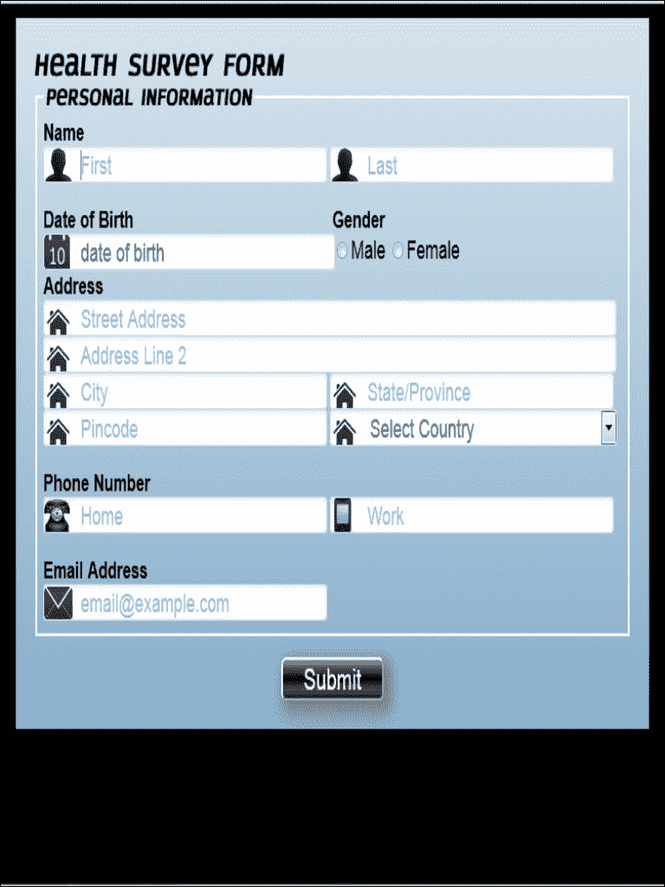

# 第五章：响应式网页表单

在之前的章节中，我们了解了表单：表单是什么，我们如何验证它们，我们如何改善表单的外观和感觉，以及如何将通过表单收集的信息存储到数据库中。但是，随着技术的提升，不同分辨率的不同设备需要不同的布局。因此，在本章中，我们将学习如何使我们的表单具有响应性。

在本章中，我们将涵盖以下主题：

+   什么是响应式设计

+   什么是媒体查询

+   什么是流体网格

+   如何使我们的表单具有响应性

+   使响应式表单更有效的指南

# 响应式设计

响应式设计这个术语是由作家和网页设计师 Ethan Marcotte 在 2010 年 5 月的一篇名为《响应式网页设计》的文章中引入的，该文章发表在《A List Apart》上。

基本上，响应式设计意味着内容如何显示在各种屏幕上，如手机、平板电脑或桌面上。响应式设计是一种方法，通过该方法，网站或特定页面会根据特定的屏幕分辨率动态调整自身，以提供最佳的用户体验。它确保了良好的用户体验，因为它可以独立地在各种设备和分辨率上运行。

使用流体、比例为基础的网格、灵活的图片和 CSS3 媒体查询，使用响应式网页设计设计的网站会自动调整布局以适应特定设备的分辨率。

网页设计曾经是简单的。网页设计师会为最流行的桌面屏幕尺寸设计，创建一个适用于大多数设备的单个布局，这使我们可以轻松地将设计分成各种网格，以便我们可以拥有一个布局良好、连贯和和谐的页面。

但随着技术的提升和各种设备的推出，如智能手机、平板电脑，甚至迷你笔记本电脑，网页布局和设计的整体体验发生了变化。

Web 的变化也改变了人们使用互联网的方式。在早期的网页设计方法中，很难在移动设备上使用互联网，因为专为桌面设计的特定网站需要滚动并且需要放大或缩小以阅读文本，浪费时间。例如，在桌面上查看的页面可能具有基于文本的紧凑链接，难以点击。但是通过响应式设计，我们可以利用 HTML5 和 CSS3 的可用功能和能力来解决这些问题。

如果该网站或页面是响应式的，文本将更大，所有内容将适合屏幕，并且导航将经过移动优化。

响应式网页设计中的断点是具有媒体查询声明的浏览器宽度，一旦达到声明的范围，就会改变网站或网页的布局。

## 谷歌对响应式设计的看法

谷歌建议构建智能手机优化的网站，并支持以下三种配置：

+   设计为响应式的网站为所有设备提供相同的 URL，每个 URL 向所有设备呈现相同的 HTML，并只利用 CSS 来更改页面在设备上的呈现方式

+   这些网站动态为所有设备提供相同的 URL，但每个 URL 根据用户代理是桌面还是移动设备提供不同的 HTML（和 CSS）。

+   有些网站有单独的移动和桌面 URL

## 使用响应式设计的好处

使用响应式设计网站的一些好处如下：

+   对于特定内容使用单个 URL 使用户更容易与内容交互，分享和链接。

+   与为桌面和移动设备开发和维护多个网站不同，我们只需要一个网站来开发和维护，适用于所有类型的设备。

+   由于不需要重定向即可获得设备优化的视图，加载时间减少。此外，基于用户代理的重定向可能会降低网站的用户体验，并且更容易出现错误。

+   它是未来友好的；这意味着它允许我们适应新技术，并随着时间的推移逐渐增强我们的网站。

除了改变布局，响应式设计还有很多其他方面。我们可以超越设备的视图大小，可以专注于设备的功能或能力。在某些情况下，我们的网站使用悬停功能，但我们需要为不支持悬停功能的触摸屏设备更改它，我们可以为不同的图像服务或在更改屏幕分辨率时裁剪图像。此外，我们还可以检查设备的位置是否可追踪，或者设备是否在互联网上工作，或者 WIFI，等等。

## 响应式设计如何工作

网页布局取决于或者我们可以说是由以下网络语言抽象地控制：

+   HTML

+   CSS

+   JavaScript

HTML 描述内容是什么，CSS 负责内容的外观，而使用 JavaScript 我们可以做一些非常酷的事情，比如回退机制。网站被设计为适用于各种屏幕尺寸和设备，根据条件自适应和改变自身，采用内容优先的方法。这是通过使用媒体查询实现的，它允许我们拥有特定的 CSS，用于根据我们的需要定制布局。我们将在本章后面讨论媒体查询。

## 屏幕分辨率

不同的设备在横向和纵向模式下具有不同的屏幕分辨率。以下是一些设备和设备支持的横向和纵向视图的屏幕分辨率：

| 设备 | 纵向视图 | 横向视图 |
| --- | --- | --- |
| iPhone 3G/3GS | 320 x 480 | 480 x 320 |
| 三星 Galaxy S Duos | 480 x 800 | 800 x 480 |
| iPhone 4 | 640 x 960 | 960 x 640 |
| iPad | 768 x 1024 | 1024 x 768 |
| 设备 | 分辨率 |
| --- | --- |
| 大多数上网本 | 1024 x 600 |
| MacBook Air 08 | 1280 x 800 |
| 一些笔记本电脑 | 1366 x 768 |
| MacBook Pro 15" | 1440 x 900 |

除了这些分辨率，今天的最新设备，如三星 Galaxy S4 或 iPhone 5，在移动设备领域具有非常高的分辨率。

## 视口

元数据是关于数据的数据（信息）。`<meta>` 标签提供了关于 HTML 文档的元数据。元数据不会显示在页面上，但可以被机器解析。

元素通常用于指定页面描述、关键词、文档最后修改的作者以及其他元数据。

元数据可以被浏览器（如何显示内容或重新加载页面）、搜索引擎（关键词）或其他网络服务使用。

对于响应式设计，在移动设备上设置视口宽度和初始缩放，通常使用以下 `<meta>` 标签。尽管是响应式设计，但在我们最终确定适合或重新启动的方法之前，我们也可以在非响应式设计中使用此标签。事实上，如果我们正在构建一个响应式网站或任何移动网站，我们仍然需要以下标签：

```html
<meta name="viewport" content="width=device-width, initial-scale=1.0">
```

# 媒体查询

媒体查询是 CSS3 模块，允许内容适应各种屏幕分辨率，如智能手机、平板电脑和高清屏幕。

为了为不同的设备提供不同的样式，媒体查询是实现这一目标的绝佳方式，为每种类型的用户提供最佳体验。作为 CSS3 规范的一部分，媒体查询扩展了控制样式应用方式的 `media` 属性的作用。

媒体查询由一个或多个表达式和涉及导致真或假的特征的媒体类型组成。此外，当媒体查询为真时，将应用相关的样式表或样式规则，遵循常规的级联规则。

以下片段是一个非常简单的例子，当设备宽度大于 500 像素时适用：

```html
@media screen and (min-width: 500px)
{
  /* some css here */
}
```

## 媒体类型

`media`属性的值指定了链接文档（外部 CSS）将应用的设备。在 HTML 文档的头部使用`<link>`元素内的`media`属性，可以声明媒体类型。在 XML 处理指令中，可以声明媒体类型，并且可以使用`@import` at-rule 和`@media` at-rule。

CSS2 定义的其他媒体类型包括：

+   `projection`：用于投影演示，如幻灯片

+   `embossed`：用于盲文打印机

+   `all`：用于所有媒体类型设备

+   `aural`：用于声音和语音合成器

+   `tv`：用于电视类型设备

+   `screen`：用于计算机屏幕

+   `braille`：用于盲文触觉反馈设备

+   `handheld`：用于手持设备或小型设备

+   `print`：用于打印机

+   `tty`：用于使用固定间距字符网格的媒体，如电传打印机和终端

样式表的一个重要特性是它们指定了文档在不同媒体上的呈现方式，比如在纸上、屏幕上使用语音合成器，或者在盲文设备上。

我们可以根据页面视图所使用的媒介应用不同的样式。借助`media`属性，可以将内部和外部样式表与媒体类型关联起来。

### 内部媒体查询

这些查询是在 HTML 页面内的`<style>`标签中编写的。

内部媒体查询的优点如下：

+   不需要额外的 HTTP 请求

+   在更新旧文件时保持可见且不被遗忘

内部媒体查询的缺点如下：

+   如果用户需要下载，文件大小会增加

+   为了使其在较旧版本的 Internet Explorer 浏览器中工作，我们必须使用 JavaScript

#### 语法

内部媒体查询的语法如下：

```html
body{
  background: blue;
}

@media screen and (max-width: 480px){
  body{
    background: black;
  }
}
```

最初，它将背景颜色设置为蓝色。但在最大宽度为 480 像素时，它将背景颜色设置为黑色，覆盖了 CSS 样式。

### 外部媒体查询

这些查询是在单独的文件或外部 CSS 文件中编写和维护的。

外部媒体查询的优点如下：

+   这在广泛使用时很容易保持和维护 CSS

+   使用条件注释，可以在旧版本的 Internet Explorer 中使用外部媒体查询

+   对于不支持的浏览器，文件大小较小

外部媒体查询的缺点如下：

+   需要额外的 HTTP 请求来应用它

+   在更新旧文件时很容易被忘记

扩展链接元素或`@import`规则的现有媒体部分：

```html
<link href="example.css" rel="stylesheet" media="only screen and (max-width:480px)">
@import url(example.css) only screen and (max-width:480px);
```

## 媒体特性

媒体特性在语法上类似于 CSS 属性，因为它们有名称并接受某些值，或者我们可以说它们是我们可以自定义响应式设计的条件。

以下表格列出了一些媒体特性：

| 特征 | 接受最小/最大前缀 | 值 | 描述 |
| --- | --- | --- | --- |
| `device-width` | 是 | 长度 | 无论浏览器窗口的宽度如何，这确定了设备整个屏幕的宽度。 |
| `device-height` | 是 | 长度 | 这确定了设备屏幕的高度。 |
| `orientation` | 否 | 纵向或横向 | 这确定了设备的方向。两种方向模式是横向和纵向。 |
| `width` | 是 | 长度 | 这确定了可显示区域的宽度。在大多数移动浏览器中保持不变，因为无法调整浏览器大小，但在台式电脑上，当用户调整浏览器大小时，宽度会改变。 |
| `height` | 是 | 长度 | 这确定了显示区域的高度。 |
| `grid` | 否 | 1 或 0 | 这检测输出设备是位图还是网格。基于网格的设备返回值为 1，所有其他设备返回值为 0。 |
| `device-aspect-ratio` | 是 | 比率 | 这确定了`device-width`媒体与`device-height`媒体的值的比率。 |
| `resolution` | 是 | 分辨率 | 这确定了像素密度或输出设备的分辨率。 |
| `color` | 是 | 整数 | 这确定了设备每个颜色分量的位数。当设备不是彩色设备时，该值为零。 |
| `color-index` | 是 | 整数 | 在输出设备的颜色查找表中，这确定了条目的数量。 |
| `monochrome` | 是 | 整数 | 这确定了单色帧缓冲区中每像素的位数。对于非单色设备，该值为`0`。 |
| `aspect-ratio` | 是 | 比率 | 这确定了`width`媒体与`height`媒体的值的比率。 |
| `scan` | 否 | 逐行或隔行 | 逐行或隔行，这确定了电视的扫描过程。 |

## 不同的屏幕分辨率

在这个特定的部分，我们将专注于设置一般和特定设备屏幕分辨率的最小或最大宽度的语法。我们还将讨论设备的方向。

我们无法使用 CSS 设置浏览器的屏幕分辨率。

### 小屏幕设备

我们可以使用以下代码来处理最大设备宽度为 480 像素的小屏幕设备：

```html
@media screen and (max-device-width: 480px)
{
  /* some CSS here */
}
```

媒体查询中的任何 CSS 都将应用于宽度为 480 像素或更小的设备。使用`max-device-width`而不是`device-width`的目的是，`device-width`指的是设备的宽度，但不指的是显示区域的宽度。在我们可以改变分辨率的浏览器中，如果用户调整大小，分辨率可以改变，因此我们使用了`max-device-width`。

除非屏幕分辨率或浏览器大小（在可以更改浏览器大小的情况下）为 480 像素或更小，否则媒体查询不会生效，这基本上为我们留下了移动设备。

### 苹果移动设备的高分辨率显示

苹果推出了 iPhone 5 和 iPad 3 等设备。在早期的设备中，如 iPhone 4 和 4S，他们引入了视网膜显示的概念。在视网膜显示中，设备的屏幕分辨率加倍。苹果支持一个名为`-webkit-device-pixel-ratio`的专有属性，返回设备的像素密度。因此，该设备返回值为`2`。

#### 针对高分辨率设备

我们可以使用以下代码来处理通用的苹果设备高分辨率：

```html
@media screen and (-webkit-min-device-pixel-ratio: 1.5)
{
  /* some css here */
}
```

#### 针对小屏幕高分辨率设备

我们可以使用以下代码来处理小屏幕高分辨率设备，如 iPhone 4：

```html
@media screen and (-webkit-min-device-pixel-ratio: 2) and (max-device-width: 480px)
{
  /* some css here */
}
```

#### 针对大屏幕高分辨率设备

我们可以使用以下代码来处理大屏幕高分辨率设备，如 iPad 3：

```html
@media screen and (-webkit-min-device-pixel-ratio: 2) and (min-device-width: 768px)
{
  /* some css here */
}
```

由于高分辨率，图像是最受欢迎的选择，可以针对视网膜显示进行优化，根据设备的不同，我们可以提供图像的两个不同版本。对于视网膜显示，我们将原始图像的尺寸和分辨率加倍，但在使用此图像时，我们对其尺寸施加约束，使其与原始图像的尺寸相同，并允许视网膜设备显示每个像素的两个像素，结果得到了一个超清晰的图像。

以下代码是背景图片的示例：

```html
normal background for the browsers:

div#featuredbox{
  width: 80%;
  height: 350px;
  background: url(normal_background.jpg) center no-repeat;
}

retina devices with larger screens:

@media screen and (-webkit-min-device-pixel-ratio: 2) and (min-device-width: 768px){
div#featuredbox{
  -webkit-background-size: 50% auto;
  background: url(highresolution_background.jpg) center no-repeat; 
  }
}
```

在上面的示例中，`-webkit-background-size: 50% auto;`将图像缩小了实际尺寸的 50%，与原始图像的尺寸相匹配。`background: url(highresolution_background.jpg) center no-repeat;`是高分辨率图像，它将原始图像的尺寸或分辨率加倍。

### 横向和纵向模式的设备

除了处理屏幕尺寸，处理媒体查询之前设备的方向是棘手的，但是媒体查询的引入简化了开发人员的生活：

```html
@media screen and (orientation: portrait)
{
  /* some CSS here */
}
```

前面的代码将针对所有屏幕高度大于宽度的设备。在用户可能使用方向很重要的小屏设备的情况下更进一步。

#### 仅限纵向模式的小屏设备

我们可以使用以下代码来适应最大宽度为 480 像素分辨率的纵向模式屏幕：

```html
@media screen and (max-device-width: 480px)and (orientation: portrait)
{
  /* some CSS here */
}
```

#### 仅限横向模式的小屏设备

我们可以使用以下代码来适应最大宽度为 640 像素分辨率的横向模式屏幕：

```html
@media screen and (max-device-width: 640px) and (orientation: landscape)
{
  /* some CSS here */
}
```

在响应式网页设计的技术支柱中，媒体查询是最成熟和支持最好的。此外，它们从设计的角度提供了可靠的回报，并且可以应用于现有应用程序以产生良好的效果。

# 流体网格

流体是一种在受到剪切应力时不断改变其形状和形式的物质。

在网页设计方面，流体指的是我们根据屏幕分辨率进行调整的设计，而剪切应力则指流体组件根据屏幕分辨率进行调整。流体设计中的组件会根据环境或屏幕分辨率进行调整和流动。

对于响应式设计，我们可以说这是一种元素的组合，其中一个是流体网格，另一个是使用媒体查询根据屏幕尺寸和类型加载 CSS；所以我们可以说流体网格本身并不完全是响应式设计。

为了保持布局清晰，并且可以轻松地将网格划分为特定数量的列，流体网格中定义了最大布局尺寸。每个网格内的元素都是按比例宽度和高度设计的，以便根据父容器进行调整。当屏幕尺寸改变时，元素将根据其所在的容器调整宽度和高度。

由于流体网格随着尺寸变化自然流动，我们必须对不同的屏幕尺寸和设备类型进行有限的调整。而在自适应网格的情况下，我们必须定义明确的基于像素的尺寸，并且必须在设备视口中手动调整元素的高度和宽度。在流体网格中，我们可以调整`max-width`，这非常重要，因为现在的移动设备更加强大，所以一个人可能会花费大部分时间使用移动设备执行各种任务。

## 流体网格生成器

流体网格并不容易，从头开始创建它们需要付出努力和时间，是一项繁琐的任务。由于大多数网格框架都具有先进的内置功能，并且已经在各种主要浏览器中进行了测试，因此明智的选择是选择现有的 CSS 网格框架或网格生成器作为我们布局创建和设计的基础。我们可以使用的一些 CSS 网格系统和生成器包括：

+   流体网格系统

+   微型流体网格

+   通过计算器的流体网格

+   通过 bootstrap 的流体网格

当我们有一个 CSS 框架时，创建具有流体列的网格很容易，但并非所有设计都会直截了当。我们可能需要在其他列和行内创建列和行。嵌套列是包含在父列中的列。

## 960 网格系统

从桌面作为主要焦点开始，960 网格系统是由*Nathan Smith*设计的，如果你正在寻找桌面解决方案，它是相当不错的。Smith 最近也努力将框架移植到移动设备上。

该系统提供了一个工具，包括用于处理快速原型设计和发布的 CSS 和 JavaScript 文件，以及许多流行设计环境的模板，如 Omnigraffle、Fireworks、Balsamiq 和 Photoshop，以便为桌面和移动设备提供一个单一的解决方案。

960 网格系统对细节的关注已经激发了弹性和流体变体，主题以及适应我们自己的 CSS 偏好的系统。因此，我们可以说，通过这个系统，我们可以设置我们喜欢的列数，列宽和间距宽度，同时享受 960 网格系统社区的好处。

960 网格系统的优点如下：

+   创建者还发布了其他基于 960 的解决方案，这简化了其集成

+   它具有用于自定义 CSS 的自定义 CSS 生成器

+   960 网格系统有很多列配置，因为它有很多除数——28 及以上

960 网格系统的缺点如下：

+   它包含比其他解决方案更多的标记

+   与其他解决方案相比，它的 CSS 文件大小更大

+   它包含非语义类名

## Bootstrap

Bootstrap 是一个 HTML，CSS 和 JavaScript 框架，可用作创建网站或 Web 应用程序的基础。如果您今天从事 Web 开发，您一定听说过 Twitter 和 GitHub，所以当您听说一个在 Twitter 开始生活并且是 GitHub 上最受欢迎的存储库的框架时——甚至超过了 jQuery 和 Node.js——您会对 Bootstrap 所带来的病毒式传播有所了解。换句话说，它是一个流畅，直观和强大的前端框架，可加快和简化 Web 开发。

简而言之，它代表了响应式网页设计背后的驱动力，使开发人员能够快速发布将用户需求置于首位的应用程序。

由于其响应特性足够强大，可以独立存在，Bootstrap 及其组件库是最佳解决方案之一。我们可以利用流体嵌套和偏移，这有助于使该框架脱颖而出。虽然我们会避免利用许多开发人员采用 Bootstrap 的组件样式，但网格的轻松实现会让您渴望探索框架的其他特性。

Bootstrap 的优点如下：

+   它可以完全定制，包括我们需要使用的功能

+   它已经经过开发人员的严格测试

+   Bootstrap 很受欢迎，这意味着开发人员熟悉它

+   它可以帮助在短时间内在网络上做出令人惊叹的事情

Bootstrap 的缺点如下：

+   它包含比其他解决方案更多的标记

+   与其他解决方案相比，它的 CSS 文件大小更大

+   它包含非语义类名

但使用响应式 CSS 框架并不会使我们的设计响应式，而且响应式设计并不那么简单。除非我们仔细规划设计，用户在使用流体网格时在较小的设备上浏览内容时总会遇到问题。

为了实现完美的响应式设计，我们不能依赖流体网格，但我们可以根据设计需要调整流体网格，以为用户提供最佳的浏览体验。

# 自适应图片

自适应图片根据客户端自适应加载不同类型的图片。它们检测用户的设备屏幕大小，并自动创建缓存并传递适当类型的 HTML 网页图像。它们的基本目的是用于响应式设计，并与流体图像技术结合使用。这是因为我们的网站不仅在较小的设备上查看，而且在速度较慢且带宽较低的设备上查看。因此，特别是在这些设备上，我们的基于桌面的图像加载速度较慢，这会导致更多的用户带宽，增加成本，并且用户界面的渲染需要时间。所有这些问题都可以通过自适应图片来解决。

自适应图片遵循相同的语义和结构模型，用于``，`<audio>`或`<video>`元素。此外，`<source>`元素应该有支持 CSS3 媒体查询的`media`属性，这些查询会在给定设备上呈现相应的元素。

例如：

```html
<imgsrc="img/header.png" width="480" height="240" alt="head" media= "handheld and (max-device-width: 480px)">
<source src= "header.png" type="image/png" media= "screen and (max-device-width: 800px)">
<source src= "header.png" type="image/png" media="screen and (max-device-width: 1600px)">
</img>
```

## 特点

自适应图片的一些特点如下：

+   它不需要标记更改

+   它可以轻松配置或定制

+   它可以很好地与任何 CMS 一起使用，也可以在没有 CMS 的情况下使用

+   它可以轻松地在我们现有的网站上使用

+   它遵循先移动设备的哲学，这意味着首先覆盖移动设备的设计，然后是更大的屏幕。

+   它可以在几分钟内启动和运行

## 它是如何工作的

使用自适应图像的步骤如下：

1.  将`.htaccess`和`adaptive-images.php`文件添加到`document-root`文件夹中。

1.  我们可以从[`github.com/mattwilcox/Adaptive-Images`](https://github.com/mattwilcox/Adaptive-Images)下载这些文件。

1.  将 JavaScript 添加到网页的`<head>`中。以下是需要复制的 JavaScript：

```html
<script>
document.cookie='resolution='+Math.max(screen.width,screen.height)+'; path=/';
</script>
```

1.  对于苹果设备的视网膜显示屏，我们可以使用以下行：

```html
<script>
document.cookie='resolution='+Math.max(screen.width,screen.height)+("devicePixelRatio" in window ? ","+devicePixelRatio : ",1")+'; path=/';
</script>
```

1.  在 PHP 文件中向`$resolutions`添加 CSS 媒体查询值。

## 定制

我们还可以通过查看 PHP 文件（`adaptive-images.php`）顶部的配置部分来更改默认值。以下要点可以相应地进行自定义：

+   我们可以设置断点以匹配 CSS 媒体查询

+   我们可以更改`ai-cache`文件夹的名称和位置

+   我们可以更改保存的任何生成的 JPG 图像的质量

+   我们可以设置浏览器缓存图像的时间

+   为了保持细节，我们可以锐化重新缩放的图像

# 使我们的表单响应

在前几章中，从表单的基础知识中，我们学习了如何样式化，验证和将我们的表单与数据库链接。在本节中，我们将学习如何使我们的表单响应。

我们将重复使用之前样式化的表单，并将看到新的技术，以使我们的表单响应。

HTML 代码保持不变，只是将以下链接添加到 HTML 页面的`<head>`标签中。

以下第一行提到的是视口`<meta>`标签：

```html
<meta name="viewport" content="width=device-width, initial-scale=1.0" />
```

第二行是外部媒体查询（例如解释）。该代码保存在一个单独的文件中，但媒体查询是写在`<head>`标签中的。

下面提到的 CSS 文件将被包含，并在设备屏幕分辨率宽度低于或等于 520 像素时生效，但一旦设备分辨率超过 520 像素宽度，媒体查询就不再生效。

在样式中，我们将输入文本元素的宽度设置为 85％。我们还清除了标有性别类的表单元素单选按钮的值为 none。对**提交**按钮的样式进行了调整，字体大小设置为 15 像素，并将宽度增加到 23％。出生日期的类`div_dob`也被清除为 none，以便按顺序排列在同一行上。

```html
<link rel='stylesheet' media='screen and (max-width: 520px)' href='Css/Internal_MediaQuery.css' />
```

以下是 CSS 中的代码：

```html
#masteringhtml5_form .txtinput.textbox{
  width: 85%;
}
#masteringhtml5_form .txtinput{
  width: 85%;
}
#masteringhtml5_form .gender{
  float:none;
}
#masteringhtml5_form .gender span{
  font-size: 14px;
}
#masteringhtml5_form .txtinput.select{
  width: 97%;
}
#masteringhtml5_form .submit_btn{
  font-size:15px;
  width:23%;
  padding-top: 3px;
  padding-bottom: 3px;
}
#masteringhtml5_form .div_dob{
  width: 100%;
  float:none;
}
```

前面的 CSS 代码已经在第三章中解释过了，但这里重要的一点是内部媒体查询，使我们的表单对小屏幕设备响应。

第三行是链接到主 HTML 页面的外部媒体查询文件：

```html
<link href="Css/External_MediaQuery.css" rel="stylesheet" />
```

以下片段是保存在单独文件中的 CSS 代码：

```html
@media screen and (min-width: 1169px) and (max-width: 1255px){
  #masteringhtml5_form .txtinput{
    width:45.7%;
  }
  #masteringhtml5_form .dateinput{
    width: 90%;
  }
}

@media screen and (min-width: 957px) and (max-width: 1170px){
  #masteringhtml5_form .txtinput{
    width:44.7%;
  }
  #masteringhtml5_form .dateinput{
    width: 90%;
  }
#masteringhtml5_form .txtinput.textbox{
    width: 94%;
  }
}

@media screen and (min-width: 811px) and (max-width: 958px){
  #masteringhtml5_form .txtinput{
    width:43.7%;
  }
  #masteringhtml5_form .txtinput.textbox{
    width: 93.7%;
  }
  #masteringhtml5_form .dateinput{
    width: 88%;
  }
}

@media screen and (min-width: 707px) and (max-width: 812px){
  #masteringhtml5_form .txtinput{
    width:42.7%;
  }
  #masteringhtml5_form .txtinput.textbox{
    width: 92.7%;
  }
  #masteringhtml5_form .dateinput{
    width: 88%;
  }
}

@media screen and (min-width: 624px) and (max-width: 708px){
  #masteringhtml5_form .txtinput{
    width:41.7%;
  }
  #masteringhtml5_form .txtinput.textbox{
    width: 92%;
  }
  #masteringhtml5_form .dateinput{
    width: 86%;
  }
}

@media screen and (min-width: 567px) and (max-width: 625px){
  #masteringhtml5_form .txtinput{
    width:40.7%;
  }
  #masteringhtml5_form .txtinput.textbox{
    width: 90%;
  }
  #masteringhtml5_form .dateinput{
    width: 84%;
  }
}

@media screen and (min-width: 521px) and (max-width: 568px){
  #masteringhtml5_form .txtinput{
    width:39.7%;
  }
  #masteringhtml5_form .txtinput.select{
    width: 48.7%;
  }
  #masteringhtml5_form .txtinput.textbox{
    width: 90%;
  }
  #masteringhtml5_form .dateinput{
    width: 84%;
  }
}
```

在前面的代码中，媒体查询应用于具有特定最小屏幕宽度和特定最大屏幕宽度的屏幕类型。我们已经覆盖了`txtinput`，`select`和`dateinput`类的宽度，这些类根据屏幕分辨率进行调整。元素会根据特定的屏幕分辨率重新流动和调整。

以下截图是我们制作的响应式表单。这个响应式表单对 Web 浏览器（更改浏览器大小）和各种设备屏幕分辨率都有响应。

对于分辨率 480 x 800，我们的表单如下截图所示：


对于分辨率 768 x 1024，我们的表单如下截图所示：



对于分辨率 1280 x 800，我们的表单如下截图所示：


对于每个特定的分辨率，我们可以注意到我们能够在不滚动任何一侧的情况下查看完整的表单。

在先前的场景中，对于不同的分辨率，一些元素被调整大小，并且动态地从原始位置移动，以获得更好的用户体验。

这样，我们的表单可以动态响应不同的分辨率。

# 限制

移动网页设计的新方法是响应式设计，但对于网页设计师和他们的客户来说，最大的挑战之一是最终确定网站的布局或线框图。

我们需要克服的其他一些挑战包括：

+   响应式设计比构建其他网站需要更多的开发时间。

+   缩放图像会降低图像质量，因为缩放是基于屏幕大小而不是上下文的。

+   在较小的设备上，使用导航菜单变得具有挑战性。

+   浏览器兼容性成为一个问题；由于旧版浏览器的支持，媒体查询的支持变得有限。

+   使用这项技术构建复杂的网站变得乏味。

+   开发成本更高

+   网站的响应时间变慢，因为网页的大小大大增加。

+   在移动设备上，下载甚至没有显示的桌面内容会增加加载时间。

# 指南

在本节中，我们将看一下响应式设计的指南，以使我们的表单更有效。

一些响应式设计的最佳实践包括：

+   尽量将网页上的内容保持最少，以获得更好的响应式设计。

+   在较小的屏幕上，始终优先考虑内容。

+   尽量少使用导航。

+   网页必须得到有效的编程和结构。

+   响应式设计不仅适用于手机。响应式设计的范围不仅限于手机或平板电脑；事实上，我们应该记住人们也使用大尺寸的 27 英寸台式电脑屏幕。

+   始终专注于浏览器兼容性。

+   保持表单简短；如果使用长表单，添加一个“保存”按钮，并将用户导航到下一页。

+   始终保持响应式设计的单独文件，以便轻松维护代码。

# 摘要

在本章中，我们学习了响应式设计。除此之外，我们还看到了响应式设计的优势和建议。

我们学习了各种技术，可以使我们的表单具有响应性。

然后，借助代码，我们学习了响应式网页表单的实际实现，通过重复使用我们在之前章节中构建的示例。

最后，我们看到了使响应式表单更有效的最佳实践。
