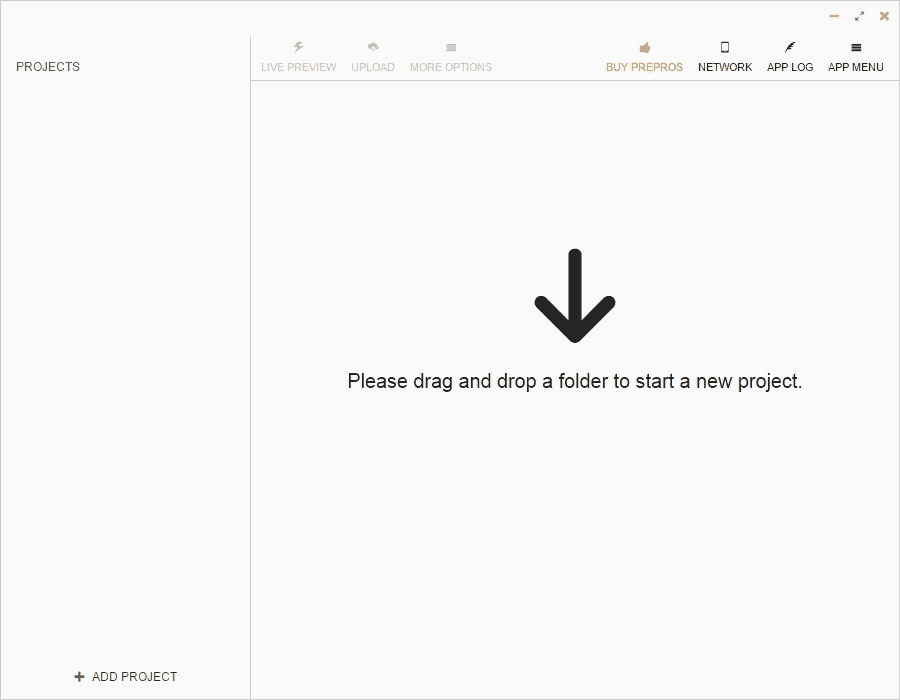

# 第一章：利用 Sass 为响应式网页设计赋能

在我们深入掌握使用 HTML5 和 CSS3 进行响应式网页设计之前，我们需要就技术达成共识，就我们的情况而言，CSS 预处理器，特别是 Sass。

在本书中，所有的 CSS 都将以 SCSS 格式写成 Sass。我们编写 CSS 的方式已经改变，改进非常大。

CSS 预处理器如 Sass、LESS 和 Stylus 为网络/移动设计师和开发人员提供了新的超能力。是的，我用了*超能力*这个词，因为这正是我第一次使用 Sass 仅仅几个小时后的感受，而我使用的只是最基本的东西：

```html
.navigation-bar {
    display: flex;
    li {
        padding: 5px 10px;
    }
}
```

看到嵌套的`li`选择器了吗？是的，那就是 Sass 在起作用。当前面的代码被编译时，就会变成这样：

```html
.navigation-bar {
   display: flex; 
}
.navigation-bar li {
   padding: 5px 10px;
}
```

### 提示

**下载示例代码**

您可以从您在[`www.packtpub.com`](http://www.packtpub.com)的帐户中下载示例代码文件，用于您购买的所有 Packt Publishing 图书。如果您在其他地方购买了本书，您可以访问[`www.packtpub.com/support`](http://www.packtpub.com/support)并注册，以便直接通过电子邮件接收文件。

让我们来看看本章给我们带来了什么：

+   Sass 是如何工作的？

+   要考虑的 Sass 的基本概念**响应式网页设计**（**RWD**）

# Sass 是如何工作的？

了解 Sass 的工作原理涉及理解几个基本的技术概念：

1.  Sass 可以基于两种不同的技术：Ruby 或 LibSass。在本书中，我们将使用基于 Ruby 的 Sass。

1.  Sass 是一个 Ruby gem。Gems 是用于 Ruby 的软件包。Ruby gem 是一种只能在 Ruby 上运行的软件。Ruby 是一种编程语言，就像 PHP、.NET、Java 等一样。

1.  我们可以通过命令行运行 Sass，但也可以使用第三方应用程序运行 Sass，从而不需要使用命令行。

1.  Sass 是一种用于创建 CSS 的编程/脚本语言。

1.  CSS 是一种非常重复的语言。Sass 允许作者优化这些重复的任务，更快、更高效地创建 CSS。

1.  Sass 工作流程的一部分是当 Sass 正在*监视*一个 SCSS 文件时，例如`book-styles.scss`。当它检测到该 SCSS 文件的更改时，它会将其编译成一个 CSS 文件`book-styles.css`。

### 提示

*监视一个 SCSS 文件*意味着 Sass 监视器在后台监视 SCSS 文件的任何更改。

## 安装 Sass

以下是我们将要遵循的步骤：

1.  下载 Ruby 安装程序

1.  打开命令行

1.  安装 Sass gem

### 下载 Ruby 安装程序

**Windows**：从以下链接下载 Ruby 安装程序：

[`rubyinstaller.org/downloads/`](http://rubyinstaller.org/downloads/)

**Mac**：Ruby 预装在所有的 Mac 上，所以不需要下载任何东西。

### 打开命令行

**Windows 和 Mac**：打开命令行。

### 提示

**Windows 提示！**

按下*Windows* + *R*，输入`CMD`，然后按*Enter*。


### 安装 Sass gem

在命令提示符中键入以下命令（无论您在哪个文件夹中都可以）：

Windows，使用以下命令：

```html
gem install sass

```

Mac，使用以下命令：

```html
sudo gem install sass

```


安装 Sass 需要几秒钟时间。

### 提示

在撰写本文时，Sass 的最新版本是 3.4.14。版本/修订可能在书出版时有所不同。

就是这样！Sass 现在已经安装在您的计算机上。

## 使用 Sass

我将要向您展示的内容与其他任何 Sass 教程告诉您要做的完全不同。大多数教程都把事情复杂化了。这是您将阅读到的使用 Sass 的最简单的方法。

以下的屏幕截图是在 Windows 上的，但是这个过程可以在任何平台上完全相同地应用。

在接下来的步骤中，您将看到创建后的必要文件夹和文件的示例，而不是如何创建它们：

1.  在你的驱动器的任何位置创建一个`/Demo`文件夹：

1.  在该文件夹中，创建两个子文件夹，`/css`和`/scss`：

1.  创建一个`.scss`文件。进入`/scss`文件夹并创建一个名为`styles.scss`的文件：

### 提示

注意文件扩展名`.scss`？这是你的 Sass 文件。是的，现在里面什么都没有，它是空的。

1.  回到命令行一分钟，按照以下步骤操作：

1.  在命令行中，输入`cd <空格>`

1.  在`cd`后加一个空格意味着*改变目录*。从你的文件管理器中，将`/Demo`文件夹拖放到命令提示符/终端窗口中，然后按*Enter*。

1.  你现在应该在`/Demo`文件夹中。


1.  通过在命令行中输入以下内容，让 Sass *监视*你的`/scss`和`/css`文件夹：

```html
sass --watch scss:css­

```

1.  让 Sass 监视`/scss`和`/css`文件夹。

就是这样！你现在正在使用 Sass！

### 提示

`--watch`标志告诉 Sass 关注`/scss`和`/css`文件夹，这样当我们对`.scss`文件（在我们的例子中是`styles.scss`）进行更改时，Sass 将检测到更改并将 SCSS 编译成我们将在网站或应用程序中使用的最终 CSS 文件。

1.  编辑`.scss`文件并观察 Sass 将其编译成`.css`文件：

1.  打开你的文本编辑器（我用 Sublime Text）。

1.  打开`styles.scss`文件。

1.  向其中添加一些 CSS。

1.  保存`styles.scss`文件。

1.  从你的命令行/终端中，验证编译是否成功。

1.  打开你的`styles.css`文件，享受你的新作品。


# RWD 的 Sass 基本概念

首先，Sass 是一种编程/脚本语言。我打赌你没有想到。是的，它是一种专注于提高网页设计师和开发人员创建 CSS 效率的编程/脚本语言。在本书中，我们将专注于 Sass 的简单部分，这些部分可以帮助我们更有效地编写 CSS，更重要的是，我们会在其中获得乐趣。

实施 RWD 是耗时的：编码、测试、创建资产、浏览器故障排除，然后再进行更多测试。我们简化编码过程的程度越高，重复性工作越少，我们就变得越有效率，为项目、团队、业务甚至最终用户增加的价值也就越多。Sass 将会做到这一点——帮助我们简化 CSS 的编码。

让我们先讨论以下概念：

+   Sass 或 SCSS

+   变量

+   混合

+   参数

+   嵌套

+   部分文件

+   @import

+   源映射

+   Sass 注释

## Sass 或 SCSS

我们可以用两种方式编写 Sass 风格的 CSS：Sass 语法和 SCSS 语法。

### 提示

不要误解；Sass 是大写 S，其余都是小写，而 SCSS 全部大写。

### Sass 语法

Sass 语法，也被称为*缩进语法*，是最初和唯一的编写 Sass 的方式。但它看起来与常规 CSS 有些不同，使学习曲线比实际需要的更陡峭。

这种语法没有使用任何大括号或分号。在某些情况下，它使用等号而不是冒号。与 SCSS 不同，缩进非常严格且是强制性的。许多开发人员对 Sass 语法的这些方面并不太喜欢。

这是一个基本的例子：

```html
.selector-a
    float: left

        .selector-b
            background: orange
```

这将编译成以下代码：

```html
.selector-a {
    float: left;
}

.selector-a, .selector-b {
    background: orange;
}
```

### SCSS 语法

当 SCSS 在 Sass 的第 3 个版本中引入时，对于我们这些不是程序员但想要利用 Sass 功能的人来说，事情变得更容易了。

### 注意

SCSS 代表**Sassy CSS**。

如果你已经写 CSS，那么你已经写了 SCSS。我们在编写 CSS 时已经使用的所有东西，在使用 SCSS 语法编写 Sass 时也是一样的。因此，学习曲线最初是不存在的。

然后，你会意识到你还可以使用一些增强你已经知道的 Sass 功能，这使得学习 Sass 成为一种很棒的体验，因为你可以相当快地变得擅长它。说实话，这感觉就像你正在获得超能力。我不是在开玩笑。

以下是我们之前看到的相同示例，使用 SCSS 语法：

```html
.selector-a {
    float: left;
}

.selector-a, .selector-b {
    background: orange;
}
```

等一下！那是 CSS！是的，它也是 SCSS。

让我们以不同的方式使用 SCSS 语法看同一个例子：

```html
.selector- {
    &a {
        float: left;
     }
    &a, &b {
        background: orange;
    }
}
```

在 SCSS 中，`&`符号允许我们将父选择器的名称添加到嵌套选择器中，而无需输入整个内容，使我们保持*DRY*的状态。

### 注意

DRY 表示不要重复自己。

这两个 SCSS 示例编译为以下代码：

```html
.selector-a {
    float: left;
}

.selector-a, .selector-b {
    background: orange;
}
```

### Sass 变量

首先让我们了解一些事情：

+   变量只是一种存储值以供以后使用的方法

+   这个值通常与一个简单的*用户友好*单词相关联

+   Sass 变量必须以美元符号(`$)`开头

+   变量的巨大好处是，如果我们需要更改值，我们只需在一个地方进行更改，而不是在整个文档中查找和替换值

### 提示

在列出多个变量时，每个变量的末尾应该有一个分号(`;`)。如果只有一个变量，则不需要分号。然而，即使只有一个变量，最好也以分号结束变量，这是一个好习惯。

以下是 Sass 变量的一个例子：

```html
$brandBlue: #416e8e;
```

### 提示

我建议您使用*驼峰命名法*来命名变量，以便将它们与以破折号分隔的类名和 CSS 属性区分开。在扫描 SCSS 文档时，这非常有帮助，因为变量更容易检测到。

正如我们所看到的，我们正在存储一个颜色值。我们使用的名称`brandBlue`肯定比`#416e8e`更用户友好。此外，我们使用了美元符号(`$`)并以分号(`;`)结束，以防我们需要添加更多变量。现在，如果以后需要更改值，我们只需要在一个位置进行更改。

变量应始终包含在 SCSS 文件的顶部，以便 Sass 知道在使用它们时应该去哪里。您还可以通过部分文件包含它们，但我们将在本章后面讨论部分文件是什么。

以下是如何使用 SCSS 变量的示例：

```html
$brandBlue: #416e8e;
body {
    background: $brandBlue;
}
```

上述代码编译为以下内容：

```html
body {
   background: #416e8e;
}
```

### Sass mixin

Mixin 是 Sass 最强大的功能之一。**Mixin**是一组 CSS 声明（属性和值），可以存储以供以后使用，就像变量一样。因此，我们不必一遍又一遍地输入所有这些 CSS 声明，只需输入 mixin 的名称。

关于 Sass mixin 需要考虑的几件事情如下：

+   它们以`@mixin`指令开头

+   使用`@include`指令调用 mixin

+   我们可以在 mixin 中存储任意数量的 CSS/SCSS 数据

+   尝试在创建 mixin 时使用*参数*，这样它就更具可扩展性

### 提示

我们还没有看到*参数*是什么，但现在提到这个词很重要，这样你就可以开始熟悉不同的 Sass 术语。我们将在下一节中介绍 Sass 参数。

让我们看一个 mixin 的例子：

```html
$brandBlue: #416e8e;
$supportGray: #ccc;
@mixin genericContainer {
    padding: 10px;
    border: $brandBlue 1px solid;
    background: $supportGray;
    box-shadow: 1px 1px 1px rgba(black, .3);
}
```

我们在 SCSS 文件中调用 mixin 如下：

```html
.selector-a {
    @include genericContainer;
}
```

编译后，在 CSS 中看起来像这样：

```html
.selector-a {
    padding: 10px;
    border: #416e8e 1px solid;
    background: #cccccc;
    box-shadow: 1px 1px 1px rgba(0, 0, 0, 0.3);
}
```

让我们回顾一下我们在 mixin 中所做的事情。

我们使用了`@mixin`指令：

```html
$brandBlue: #416e8e;
$supportGray: #ccc;
@mixin genericContainer {
    padding: 10px;
    border: $brandBlue 1px solid;
    background: $supportGray;
    box-shadow: 1px 1px 1px rgba(black, .3);
}
```

我们使用驼峰命名约定来区分 mixin 的名称和以破折号分隔的类名和 CSS 属性：

```html
$brandBlue: #416e8e;$supportGray: #ccc;
@mixin genericContainer {
    padding: 10px;
    border: $brandBlue 1px solid;
    background: $supportGray;
    box-shadow: 1px 1px 1px rgba(black, .3);
}
```

我们在 mixin 中使用了 Sass 变量：

```html
$brandBlue: #416e8e;$supportGray: #ccc;
@mixin genericContainer {
    padding: 10px;
    border: $brandBlue 1px solid;
    background: $supportGray;
    box-shadow: 1px 1px 1px rgba(black, .3);
}
```

在`box-shadow`颜色属性中使用关键字`black`，而不是使用十六进制`#000`或`rgb (0, 0, 0)`值：

```html
$brandBlue: #416e8e;$supportGray: #ccc;
@mixin genericContainer {
    padding: 10px;
    border: $brandBlue 1px solid;
    background: $supportGray;
    box-shadow: 1px 1px 1px rgba(black, .3);
}
```

为此，我们也可以像这样使用我们的变量名：

```html
$brandBlue: #416e8e;$supportGray: #ccc;
@mixin genericContainer {
    padding: 10px;
    border: $brandBlue 1px solid;
    background: $supportGray;
    box-shadow: 1px 1px 1px rgba($brandBlue, .3);
}
```

我们还省略了 alpha 值中的`0`（`.3`）。这实际上不是 Sass 的特性；这是 CSS 的特性：

```html
$brandBlue: #416e8e;$supportGray: #ccc;
@mixin genericContainer {
    padding: 10px;
    border: $brandBlue 1px solid;
    background: $supportGray;
    box-shadow: 1px 1px 1px rgba($brandBlue, .3);
}
```

### 提示

在以零开头的小数值上，零可以被省略。

同样，上述 mixin 编译为以下 CSS：

```html
.selector-a {
    padding: 10px;
    border: #416e8e 1px solid;
    background: #cccccc;
    box-shadow: 1px 1px 1px rgba(65, 110, 142, 0.3);
}
```

## Sass 参数

在我们的第一个 mixin 示例中，我们没有任何参数。这实际上并不理想，因为它不允许我们在相同的属性中使用不同的值。实际上，在 mixin 中不使用任何参数并不比每次需要它们时键入相同的属性和值有任何不同。我们并没有真正做到 DRY。

*参数*是 mixin 的一部分，您可以根据需要放入自己的值。参数使 mixin 值得创建。

在前面提到的 mixin 示例中，让我们添加一个参数：

```html
$brandBlue: #416e8e;$supportGray: #ccc;
@mixin genericContainer($padding) {
    padding: $padding;
    border: $brandBlue 1px solid;
    background: $supportGray;
    box-shadow: 1px 1px 1px rgba(black, .3);
}
```

`padding`参数允许我们设置任何我们想要的值。我们并不*强制*每次都将填充设置为`10px`。

这是我们如何设置参数的值：

```html
.selector-a {
    @include genericContainer(10px);
}
```

这编译为以下内容：

```html
.selector-a {
    padding: 10px;
    border: #416e8e 1px solid;
    background: #cccccc;
    box-shadow: 1px 1px 1px rgba(0, 0, 0, 0.3);
}
```

但是，参数存在潜在问题；如果我们不为`padding`设置值，编译时会出现错误。

因此，这里的解决方案是设置一个*默认*值；如果由于某种原因我们没有为`padding`定义一个值，Sass 将采用默认值并在编译时使用它而不会抛出错误。

以下是如何设置参数的默认值：

```html
$brandBlue: #416e8e;$supportGray: #ccc;
@mixin genericContainer($padding: 8px) {
    padding: $padding;
    border: $brandBlue 1px solid;
    background: $supportGray;
    box-shadow: 1px 1px 1px rgba(black, .3);
}
```

这是我们如何调用 mixin，而不声明任何`padding`值：

```html
.selector-a {
    @include genericContainer;
}
```

编译后的 CSS 如下：

```html
.selector-a {
    padding: 8px;
    border: #416e8e 1px solid;
    background: #cccccc;
    box-shadow: 1px 1px 1px rgba(0, 0, 0, 0.3);
}
```

### 如何在同一个 mixin 中使用多个参数

在前面的 mixin 基础上，让我们添加一些更多的参数，使其更加健壮和可扩展：

```html
@mixin genericContainer ($padding, $bdColor, $bgColor, $boxShdColor) {
    padding: $padding;
    border: $bdColor 1px solid;
    background: $bgColor;
    box-shadow: 1px 1px 1px $boxShdColor;
}
```

这是我们在包含 mixin 时如何声明参数的方式：

```html
.selector-a {
    @include genericContainer(2%, $brandBlue, #ccc, black);
}
```

我们可以使用相同的 mixin 并获得不同的样式，而无需重复输入所有属性。

前面的 mixin 及其参数编译为以下代码：

```html
.selector-a {
    padding: 2%;
    border: #416e8e 1px solid;
    background: #cccccc;
    box-shadow: 1px 1px 1px #000000;
}
```

### 在多个参数中设置默认值

有时，我们需要定义一些默认值，以防我们只需要声明一个或几个参数。换句话说，通过在我们的参数中声明默认值，我们将始终确保创建一个值，并且在编译我们的 SCSS 文件时不会出现任何错误。

以下是我们如何在参数中设置默认值：

```html
@mixin genericContainer ($padding: 5px, $bdColor: orange, $bgColor: #999, $boxShdColor: #333) {
    padding: $padding;
    border: $bdColor 1px solid;
    background: $bgColor;
    box-shadow: 1px 1px 1px $boxShdColor;
}
```

如果我们只需要声明*第一个*属性`padding`，我们可以这样做：

```html
.selector-a {
    @include genericContainer(25px);
}
```

这编译为以下内容：

```html
.selector-a {
    padding: 25px;
    border: orange 1px solid;
    background: #999999;
    box-shadow: 1px 1px 1px #333333;
}
```

### 提示

某些 Sass 编译器将简写的颜色十六进制值`#333`转换为长格式值`#333333`。

正如我们所看到的，只有第一个参数`padding`被声明。其他参数使用了它们的默认值并成功编译。

但是，假设我们仍然只想声明一个参数，而不是`padding`，它是参数列表中的第一个。假设我们想声明背景颜色！

在这种情况下，我们需要通过输入变量的名称来声明值：

```html
.selector-a { @include genericContainer($bgColor: $brandBlue); }
```

### 提示

如果我们只想声明一个与第一个参数不同的单个参数，我们需要声明整个参数名称。

还有更高级的声明参数的方法，但这对于本书的范围来说已经足够了。

## Sass 中的嵌套

Sass 中的嵌套是使我们的 SCSS 更易读的完美方式。就像在 HTML 中，标签基于其父元素进行嵌套一样，Sass 使用完全相同的结构。

以下是导航栏的两级选择器嵌套示例：

```html
$brandBlue: #416e8e;nav {
 ul {
 display: flex;
 margin: 0;
 padding: 0;
 list-style: none;
 }

 li {
 margin: 5px;
 background: #000;
 }
 a {
 display: block;
 padding: 5px 15px;
 text-decoration: none;
 color: $brandBlue;
 }
}
```

### 提示

注意深层嵌套！最佳实践建议最多嵌套三个级别。否则，我们将在未来遇到选择器特异性和可维护性问题。

您是否注意到我再次使用了`$brandBlue`颜色变量？前面的导航栏的 SCSS 编译为以下 CSS：

```html
nav ul {
    display: flex;
    margin: 0;
    padding: 0;
    list-style: none;
}
nav li {
    margin: 5px;
    background: #000;
}
nav a {
    display: block;
    padding: 5px 15px;
    text-decoration: none;
    color: #416e8e;
}
```

## Sass 中的局部文件（partials）

局部文件是我们创建的用于存放 SCSS 片段的 SCSS 文件。局部文件允许我们模块化我们的文件，例如，`_variables.scss`。局部文件以下划线符号（`_`）开头，并以扩展名`.scss`结尾。下划线符号告诉编译器，这个文件及其内容不需要编译成单独的 CSS 文件。

局部文件使用`@import`指令调用，就像在 CSS 中一样。主要区别在于无需指定下划线符号和文件扩展名。

让我们创建一个局部文件，并把这些颜色变量放在里面。我们将称这个局部文件为`_variables.scss`。`_variables.scss`局部中的变量（片段）如下：

```html
$brandBlue: #416e8e;
$brandRed: #c03;
$brandYellow: #c90;
```

然后我们假设我们的主 SCSS 文件名为`styles.scss`。现在我们有两个文件：`styles.scss`和`_variables.scss`。

### 提示

项目的主 SCSS 文件不以下划线符号开头。

我们使用`@import`指令将`_variables.scss`调用到`styles.scss`中：

```html
@import "variables";
```

注意，在引用局部文件时，下划线符号和文件扩展名是不需要的；它们可以被省略。但是，如果你想添加它们，也可以。省略它们可以使代码更清晰。

## Sass 扩展/继承功能

许多专业人士说，扩展或继承是 Sass 最有用的功能之一。其他人实际上建议远离它。本书的建议是：尽可能多地使用 Sass，并尝试不同的功能，这样你就可以形成自己的观点。当你有足够的经验时，你可以决定加入哪一方。

在 Sass 中**扩展**意味着我们可以在另一个选择器中使用选择器的属性，而不必再次输入所有这些属性。这就是所谓的**继承**。我们使用`@extend`指令来实现这一点。

例如，考虑以下选择器：

```html
$brandBlue: #416e8e; .generic-container {
    padding: 10px;
    border: $brandBlue 1px solid;
    background: #ccc;
    box-shadow: 1px 1px 1px rgba(black, .3);
}
```

假设我们想要在不同的选择器上继承这个选择器的所有属性。我们还要修改一个属性，因为它们几乎是相同的，使用`@extend`指令在第二个选择器中重用第一个选择器的样式：

```html
.box-customer-service {
    @extend .generic-container;
    padding: 25px;
}
```

这编译成以下内容：

```html
.generic-container, .box-customer-service {
    padding: 10px;
    border: #416e8e 1px solid;
    background: #cccccc;
    box-shadow: 1px 1px 1px rgba(0, 0, 0, 0.3);
}

.box-customer-service {
    padding: 25px;
}
```

注意`.generic-container`和`.box-customer-service`在同一条规则中；这意味着`.box-customer-service`继承了`.generic-container`的所有属性和值。然后，有一个单独的规则为`.box-customer-service`，只声明了`padding`属性，因为这是两个容器之间的唯一区别。

## Sass 注释

由于我们知道 CSS 文档是有效的 SCSS 文档，因此使用 CSS 注释语法也是有效的：

```html
/* This is a traditional CSS comment */
```

在 Sass 中，还有另一种方法。我们可以在开头使用双斜杠（`//`）进行注释。

```html
// This is a Sass-style comment
```

两种样式之间的区别在于使用`/**/`语法的传统 CSS 注释会添加到编译后的文件中，而使用`//`的 Sass 注释则不会添加。

Sass 语法中的注释非常有用，可以在不必担心所有这些注释被编译并使最终的 CSS 文件变得臃肿的情况下记录我们的 SCSS 文件。以下示例中的 Sass 注释不会被编译：

```html
$brandBlue: #416e8e; //Mixin for generic container across the app
.generic-container {
    padding: 10px;
    border: $brandBlue 1px solid;
    background: #ccc;
    box-shadow: 1px 1px 1px rgba(black, .3);
}
```

然而，传统的 CSS 注释确实被编译了：

```html
$brandBlue: #416e8e;
/* Mixin for generic container across the app */
.generic-container {
    padding: 10px;
    border: $brandBlue 1px solid;
    background: #ccc;
    box-shadow: 1px 1px 1px rgba(black, .3);
}
```

### 提示

现在，根据编译器上设置的选项，最终的 CSS 可以被最小化。因此，传统的 CSS 注释将被剥离以优化文件大小。

## 供应商前缀

供应商前缀基本上是为尚未被广泛使用或最终包含在 CSS3 规范中的 CSS3 属性或值添加特定的*标签*。

*供应商*部分指的是代表创建浏览器的公司名称的缩写标签：Mozilla、Opera 和 Microsoft。

不过，有一个例外，苹果。尽管苹果创建了 Safari，但供应商前缀是基于浏览器的布局引擎而不是公司名称。

+   Mozilla：`-moz-`

+   Opera：`-o-`

+   微软：`-ms-`

+   Webkit（苹果）：`-webkit-`

*前缀*部分指的是在 CSS 属性或 CSS 值之前添加供应商标签的描述。每个供应商前缀只在自己的浏览器中有效，因此对于上述列表，这里是它们所属的浏览器：

+   Mozilla：这个前缀`-moz-`在 Firefox 中有效

+   Opera：这个前缀`-o-`在 Opera 中有效

+   微软：这个前缀`-ms-`在 Internet Explorer 中有效

+   Webkit（苹果）：这个前缀`-webkit-`在 Safari 中有效

如果你想知道谷歌 Chrome 在这一切中的位置，这有一个简单的解释。

尽管谷歌创建了 Chrome，但 Chrome 没有特定的前缀。起初，Chrome 使用与 Safari 相同的布局引擎：Webkit。因此，基于 Webkit 的前缀不仅影响了 Safari，还影响了 Chrome 和其他基于 Chromium 的产品。

然而，谷歌浏览器不再使用 Webkit；它现在使用自己的布局引擎称为 Blink。然而，为了保持兼容性并避免进一步分裂网络，Chrome 仍然支持`-webkit-`前缀。

Opera 有一个类似的故事，他们有自己的布局引擎 Presto，然后切换到 Webkit。现在它使用 Blink。除了之前提到的浏览器供应商之外，还有其他浏览器供应商，他们也使用自己的前缀，比如 Konqueror 浏览器的前缀`-k-`。

这是一个带有供应商前缀的 CSS 属性的例子：

```html
-moz-box-sizing: border-box;
```

这里有一个带前缀的 CSS 值的例子：

```html
background-image: -webkit-linear-gradient(red, blue);
```

### 供应商前缀的顺序

事实上，我们列出供应商前缀的顺序并不重要；重要的是我们总是将非供应商前缀的版本放在最后。

以 linear-gradient 属性为例，我们应该这样做：

```html
*, *:before, *:after {
    background-image: -webkit-linear-gradient(red, blue);
    background-image: -moz-linear-gradient(red, blue);
    background-image: -ms-linear-gradient(red, blue);
    background-image: -o-linear-gradient(red, blue);
    background-image: linear-gradient(red, blue);
}
```

### 提示

如果你喜欢，你也可以使用`background: linear-gradient(red, blue);`。

非供应商前缀的声明应该始终放在最后，因为如果浏览器供应商修改其前缀或停止支持它，最后一行将始终覆盖上面的任何内容，因为级联。这使整个 CSS 规则更具未来性。此外，我们不必在供应商更改内容时重写样式表。

现在，许多 CSS3 属性和值不需要所有供应商前缀。大多数情况下，它们只需要一些供应商前缀，其他时候非供应商前缀的属性或值就足够了。

但是，我们如何知道哪些 CSS3 属性和值可以加前缀，哪些不需要，这样我们就可以创建受某些旧浏览器支持的样式，而不必记住太多信息？

答案是*自动化*供应商前缀的过程。

### 自动添加供应商前缀

供应商前缀带来了一些问题，如果我们希望一些 CSS3 属性在当前浏览器和/或某些旧浏览器中工作，我们就无法摆脱这些问题。供应商前缀是肮脏的工作，我们*不*必须这样做。

那么，我们如何在尽可能保持 DRY 的情况下自动化供应商前缀的过程呢？有几种方法。

#### 使用 Compass

Compass 是一个帮助我们更有效地编写 CSS 的 Sass 框架。Compass 有一个庞大的 mixin 库，我们可以使用它来处理供应商前缀。

Compass 的安装超出了本书的范围，因此我们将专注于处理供应商前缀的基本用法，并假设它已经安装在您的机器上。请参考 Compass 网站，了解如何安装它的详细说明（[`compass-style.org/`](http://compass-style.org/)）。

一旦我们安装了 Compass，我们需要导入包含我们需要的 mixin 的特定模块。

继续使用之前使用的线性渐变示例，让我们将 Compass 的`images`模块导入到我们的 SCSS 文件中。将其放在主 SCSS 文件的顶部：

```html
@import "compass/css3/images";
```

然后，我们可以使用相应的 mixin：

```html
header {
    @include background-image(linear-gradient(red, blue));
}
```

这将编译为以下内容：

```html
header {
    background-image: url('data:image/svg+xml;base64,…');
    background-size: 100%;
    background-image: -webkit-gradient(linear, 50% 0%, 50% 100%, color-stop(0%, red), color-stop(100%, blue));
    background-image: -moz-linear-gradient(red, blue);
    background-image: -webkit-linear-gradient(red, blue);
    background-image: linear-gradient(red, blue);
}
```

这里有一些新东西。

第一个声明使用了一个 base64 嵌入的 SVG 文件。这是因为旧版 IE 和旧版 Opera 存在渲染渐变的问题，因此 SVG 是它们的备用方案。按照今天的标准，处理这些问题是完全不必要的。

```html
header {
    background-image: url('data:image/svg+xml;base64,…');
    background-size: 100%;
    background-image: -webkit-gradient(linear, 50% 0%, 50% 100%, color-stop(0%, red), color-stop(100%, blue));
    background-image: -moz-linear-gradient(red, blue);
    background-image: -webkit-linear-gradient(red, blue);
    background-image: linear-gradient(red, blue);
}
```

`background-size: 100%;`参数用于使嵌入的 SVG 覆盖整个容器。再次处理这样的事情只是浪费时间。此外，我们的代码不断膨胀，试图支持旧技术。考虑下面的代码块：

```html
header {
    background-image: url('data:image/svg+xml;base64,…');
    background-size: 100%;
    background-image: -webkit-gradient(linear, 50% 0%, 50% 100%, color-stop(0%, red), color-stop(100%, blue));
    background-image: -moz-linear-gradient(red, blue);
    background-image: -webkit-linear-gradient(red, blue);
    background-image: linear-gradient(red, blue);
}
```

第三个声明是旧的 CSS 线性渐变语法，只有 Webkit 浏览器支持；这在我们的文件中会导致不必要的代码膨胀：

```html
header {
    background-image: url('data:image/svg+xml;base64,…');
    background-size: 100%;
    background-image: -webkit-gradient(linear, 50% 0%, 50% 100%, color-stop(0%, red), color-stop(100%, blue));
    background-image: -moz-linear-gradient(red, blue);
    background-image: -webkit-linear-gradient(red, blue);
    background-image: linear-gradient(red, blue);
}
```

第四和第五个声明基本上是为旧版 Firefox、Chrome 和 Safari 版本准备的：

```html
header {
    background-image: url('data:image/svg+xml;base64,…');
    background-size: 100%;
    background-image: -webkit-gradient(linear, 50% 0%, 50% 100%, color-stop(0%, red), color-stop(100%, blue));
    background-image: -moz-linear-gradient(red, blue);
 background-image: -webkit-linear-gradient(red, blue);
    background-image: linear-gradient(red, blue);
}
```

最后一个声明是没有供应商前缀的建议语法：

```html
header {
    background-image: url('data:image/svg+xml;base64,…');
    background-size: 100%;
    background-image: -webkit-gradient(linear, 50% 0%, 50% 100%, color-stop(0%, red), color-stop(100%, blue));
    background-image: -moz-linear-gradient(red, blue);
    background-image: -webkit-linear-gradient(red, blue);
 background-image: linear-gradient(red, blue);
}
```

正如我们所看到的，Compass 是一个非常方便的工具，它允许我们自定义输出。然而，这可能会变得比必要的工作更多。

在得出 Compass 是否是我们的最佳解决方案之前，有一些事情需要考虑：

+   需要安装 Compass。这通常是通过命令行完成的。

+   一旦安装了 Compass，我们就不必再使用命令行来使用它的 mixin。

+   Compass 有一个庞大的 mixin 库，可以帮助处理供应商前缀和许多其他事情。

+   每次我们需要处理特定的 CSS3 属性或值时，我们必须在我们的主 SCSS 文件中使用`@import`指令导入相应的模块。这意味着我们必须花费大量时间找到我们需要的模块并学会使用它们。

+   使用 Compass 的学习曲线是中等的，我们需要在其他技术方面有一定的了解才能使用 Compass，即使是最基本的使用也是如此。

+   Compass 有很好的文档，并且是一个不断发展的项目。

+   有一个类似的著名的 mixin 库叫做 Bourbon：[`bourbon.io/`](http://bourbon.io/)。

#### 使用“-prefix-free”

`-prefix-free`是由 Lea Verou 创建的 JavaScript 文件。当浏览器调用该脚本时，它会检测到，然后将该浏览器特定的前缀添加到 CSS 中。 `-prefix-free`文件足够智能，可以确定需要哪些前缀，并且只注入那些前缀。

使用`-prefix-free`很简单。只需调用 JavaScript 文件。根据 Lea Verou 的建议，最好在样式表之后包含此脚本，以减少**未样式内容的闪烁**（**FOUC**）。

您可以访问`-prefix-free`项目：[`leaverou.github.io/prefixfree/`](http://leaverou.github.io/prefixfree/)。

由于我们的 HTML 代码如此简短，我们可以遵循之前提到的提示：

```html
<!DOCTYPE html>
<html>
<head>
    <meta charset="utf-8">
    <meta name="viewport" content="width=device-width, initial-scale=1">
    <title>Page Title</title>
    <link href="css/styles.css" rel="stylesheet">
    <script src="img/prefixfree.min.js"></script>
</head>
<body>
    Site content...
</body>
</html>
```

使用这种方法肯定是诱人的，因为调用一个简单的 JavaScript 文件来处理自动添加供应商前缀听起来就像是最好的主意。

让我们看一下在决定使用`-prefix-free`之前需要考虑的事项的简短列表：

+   它非常容易使用。

+   这是一个额外的 HTTP 请求。我们的网站/页面的请求越少，它们就越快，因此我们为用户提供的用户体验就越好。这对 SEO 也是有益的。

+   这是一个额外的文件要管理。是的，一旦我们上传了 JavaScript 文件，我们可能不需要再回头看它——除非我们要更新它，这意味着我们需要在本地进行广泛的测试，以免在生产环境中出现任何问题。

+   它会给用户的浏览器增加一些负担，因为所有事情都发生在浏览器中。

+   它在使用`@import`指令调用的文件中不起作用。这也可以被视为一件好事，因为如果我们使用`@import`来导入文件，我们就会面临一个不同甚至更大的问题。

+   如果我们从与我们的主站点不同的域名提供样式表，那么`-prefix-free`将无法在这些外部 CSS 文件上工作。

+   Chrome 和 Opera 在允许`-prefix-free`在本地工作方面存在问题。虽然这很容易解决，但它只是增加了我们工作流程的复杂性。

+   如果有内联样式，一些未添加前缀的 CSS 值和属性在 IE 中将无法工作。

有了这个列表，我们现在可以更好地做出一个更明智的决定，这将使项目、我们自己和我们的用户受益。

#### 使用 Autoprefixer

Autoprefixer 是一个*CSS 后处理器*，它使用 CanIUse.com 数据库为已编译的 CSS 文件添加供应商前缀。

术语*后处理器*意味着它在创建 CSS 之后（后）处理它。换句话说，如果我们有一个名为`styles.scss`的 SCSS 文件，当我们保存它时，该文件会被编译为`styles.css`。在那一刻，Autoprefixer 获取生成的`styles.css`文件，打开它，为每个属性和值添加所有必要的供应商前缀，保存文件，并关闭它。此外，您还可以配置它创建一个新的单独文件。完成后，我们可以在我们的网站/应用程序中使用此文件。

这种方法相对于任何其他自动供应商前缀方法的主要优势是它使用 CanIUse.com 数据库；这意味着一旦浏览器供应商不再需要其前缀用于 CSS 属性或值，我们只需通过 Autoprefixer 运行我们的 CSS 文件，它将在几秒钟内更新。

Autoprefixer 的主要缺点是它有太多的使用方式，对一些人来说可能有点压倒性。举几个例子，我们可以通过命令行使用它，但首先需要安装`Node.js`：

```html
npm install --global autoprefixer
autoprefixer *.css
```

我们也可以在 Compass 中使用 Autoprefixer，但首先需要安装 Ruby：

```html
gem install autoprefixer-rails
```

我们可以在 Mac 上使用 CodeKit，在 Windows/Mac/Linux 上使用 Prepros 或 Koala App。我们还可以为 Sublime Text、Brackets 或 Atom Editor 安装插件。还有 Grunt 和 Gulp 插件。

在决定使用 Autoprefixer 之前，让我们看一下需要考虑的事项的简要清单：

+   它使用 CanIUse.com 数据库的事实是远远超过任何其他自动供应商前缀应用程序的最佳功能和优势，因为我们始终可以确保我们的 CSS 文件具有最新的前缀，或者如果浏览器供应商删除了其中任何一个。

+   它可以集成到许多应用程序中。

+   对于新的网页设计师或开发人员来说，安装可能有点令人生畏。

+   Autoprefixer 已经预装在其他应用程序中，所以我们只需要运行这些应用程序，就可以自动使用 Autoprefixer，而无需进行任何设置。

Autoprefixer 可以从[`github.com/postcss/autoprefixer`](https://github.com/postcss/autoprefixer)下载。

#### 使用 Pleeease

是的，它是三个*e*的*Pleeease*。Pleeease 也是一个类似 Autoprefixer 的 CSS 后处理器，它也依赖于已安装的`Node.js`。它只能通过命令行运行，但实际上非常简单。Pleeease 使用 Autoprefixer，这意味着它也使用 CanIUse.com 数据库来定义哪些 CSS 属性和/或值需要前缀。

安装 Pleeease 后，我们需要创建一个配置文件（JSON 文件），其中我们需要定义的最重要的事情是源 CSS 文件和目标 CSS 文件：

```html
{
    "in": "style.css",
    "out": "styles.fixed.css"
}
```

一旦我们设置了配置文件，我们在命令行中运行这个命令：

```html
pleeease compile
```

Pleeease 获取`style.css`文件，添加所有必要的供应商前缀，并创建`styles.fixed.css`，这是我们在生产中使用的文件。

在这一点上，Pleeease 还有其他重要的事情：

+   将相同的媒体查询编译为一个`@media`块

+   将`@import`样式表内联（这很棒，因为我们最终只会得到一个单一的 CSS 文件用于生产）

+   最终文件进行了最小化/压缩

如果您习惯使用命令行和 JSON 文件，Pleeease 可以成为您工具库中非常有用的一部分。如果您更喜欢远离命令行，也没关系；还有其他更友好的方法来自动添加供应商前缀。

在决定是否使用 Pleeease 自动添加供应商前缀之前，有一些需要考虑的事项：

+   需要使用命令行进行安装和使用，但命令非常简单。

+   它使用 JSON 文件来配置其设置。

+   它使用 Autoprefixer，这意味着它也使用 CanIUse.com 数据库。这使得它在知道哪些属性和/或值需要或不需要前缀时非常强大。

+   它对最终的 CSS 文件进行了几项其他改进，比如将相同的媒体查询打包在一个`@media`规则中，最小化结果等等。

+   它可以与 Grunt、Gulp、Brunch 和 Node.js 工作流集成。

您可以从[`pleeease.io/`](http://pleeease.io/)下载 Pleeease。

#### 使用 Emmet

Emmet 使我们能够更快地编写 CSS 和 HTML。它是文本编辑器的插件，如 Sublime Text、Coda、TextMate，甚至 Dreamweaver。

Emmet 还帮助我们为 CSS3 属性和值添加供应商前缀，这是我们接下来要重点关注的。

### 提示

Emmet 以前被称为*Zen Coding*。

一旦 Emmet 插件安装在我们喜爱的文本编辑器中，我们在 SCSS 文件中输入以下内容：

```html
.selector-a {
    -trf
}
```

### 提示

`-trf`是 CSS3 属性*transform*的缩写。

然后我们在键盘上按下*Tab*，代码会自动更改为这样：

```html
.selector-a {
    -webkit-transform:;
    -ms-transform:;
    -o-transform:;
    transform:;
}
```

我们只需要在缩写的开头加一个破折号(`-`)来添加供应商前缀。这告诉 Emmet 在按下*Tab*键时需要添加必要的供应商前缀。

### 提示

在上一个例子中未定义变换值，因为我们想展示使用 Emmet 的结果。显然，我们最终需要添加这些值。

在决定是否使用 Emmet 自动添加供应商前缀之前，有一些事情需要考虑：

+   由我们来定义什么需要加前缀，什么不需要，所以我们可能最终会给不再需要前缀的属性和值加上前缀。因此，我们最终会使我们的 CSS 文件变得臃肿。

+   如果我们忘记在属性/值的开头添加破折号，它就不会被加前缀，也许这个属性/值确实需要前缀。因此，我们会花更多时间进行故障排除。

+   Emmet 与最流行的文本编辑器兼容，所以我们很可能能够使用它。

+   使用 Emmet 的学习曲线非常低。

+   Emmet 不依赖于使用命令行。

+   Emmet 有很好的文档，并且在不断发展。

您可以从[`emmet.io/`](http://emmet.io/)下载 Emmet。

#### 使用第三方应用程序

正如我们所见，以前用于自动添加供应商前缀的方法是各种各样的，从通过命令行使用的方法到让您在使用 JavaScript 解决方案之前找到特定模块导入的方法。

提到的所有功能中最重要的是 Autoprefixer 使用 CanIUse.com 数据库。这基本上是我们想要使用的，因为我们只需要编写 CSS3 属性和值，然后完全忘记供应商前缀，让 Autoprefixer 和 CanIUse.com 为我们添加它们。

幸运的是，已经有第三方应用程序安装了 Autoprefixer。这意味着我们不需要通过命令行设置任何东西，也不需要安装插件，或者类似的东西。只需安装应用程序，激活 Autoprefixer 复选框，然后开始使用！

之前我们提到了几个应用程序：CodeKit、Prepros 和 Koala 应用。它们基本上都做同样的事情，但它们在两个方面表现出色：

+   它们可以*监视*我们的 SCSS 文件并为我们编译它们。

+   它们可以通过 Autoprefixer 自动添加供应商前缀。

这两个功能对我们的工作流程有很大影响，使我们能够将精力集中在重要的事情上，比如 RWD 和更好的用户体验。

在决定使用第三方应用程序是否是添加供应商前缀的最佳解决方案之前，有一些事情需要考虑：

+   Prepros 和 CodeKit 是付费应用程序。Koala 是免费的，但通过小额捐赠支持作者对他的工作表示感激。然而，它们绝对不贵；当我们第一次编译文件时，收益是十倍的价值。

+   它们非常容易设置。

+   它们有很好的文档、社区，并且由作者不断开发。

+   对于许多与 CSS 和 HTML 一起工作的非前端开发人员来说，这些应用程序使他们能够专注于其他重要事项，如用户体验、设计、可用性和 SEO，而不必担心 JSON 文件、命令行、插件等等。

#### 推荐的供应商前缀方法

本书建议您使用 CodeKit、Prepros 或 Koala 应用程序来处理供应商前缀。这些应用程序不仅可以编译 SCSS 文件，还可以在保存这些 SCSS 文件时自动通过 Autoprefixer 运行它们。

所以让我们来看看 Prepros，它可以在 Windows、Linux 和 Mac 等最流行的操作系统上运行。

## 使用第三方程序进行编译

使用命令行编译我们的 SCSS 文件真的并不那么困难：

```html
--sass watch scss:css

```

这就是我们在命令行中需要做的一切，以便 Sass 监视`/scss`文件夹中的 SCSS 文件，并将它们编译到`/css`文件夹中。真的就是这么简单。

以前的情况是，每次我们需要在不同的项目上工作时，都需要运行这个命令。虽然我们可以用许多不同的方式来自动化这个过程，但有些人觉得使用命令行要么令人生畏，要么只是不必要的。

### Prepros 应用程序

Prepros 是一个面向网页设计师和开发人员的工具，涉及到常规工作流程的许多部分：编译、CSS 前缀、实时刷新、JavaScript 合并、文件最小化、图像优化、浏览器测试同步、为编译文件创建源映射、内置服务器、FTP 等等。

在本书的范围内，我们将重点介绍它如何帮助我们在自动添加供应商前缀的同时编译我们的 SCSS 文件。

您可以从[`prepros.io/`](https://prepros.io/)下载它。Prepros 是一个付费应用程序。不过，花 29 美元并不会让你破产。我向你保证，第一次编译之后，这个应用程序就会为自己赚回成本。

还有一种方法可以免费使用 Prepros 并享受应用程序的所有功能。不过，这是以不得不每 5 分钟左右关闭*购买应用程序*弹出窗口为代价的。

这是 Prepros 的当前欢迎界面（可能已经改变）：



还记得安装 Sass 时的步骤吗？我们创建了一个`/Demo`文件夹，并在其中创建了两个子文件夹`/scss`和`/css`？我们将把`/Demo`文件夹拖放到 Prepros 界面上：


一个悲伤的表情出现了，让我们知道项目是空的。这是真的，因为我们还没有向`/scss`文件夹中添加任何文件：


所以，让我们在`/scss`文件夹中创建一个`.scss`文件：


Prepros 将自动检测新的`styles.scss`文件并将其编译为`styles.css`文件，保存在`/css`文件夹中。


单击`styles.scss`文件将显示文件的默认设置：


让我们修改一些设置，以便 Prepros 可以自动执行以下操作：

+   添加供应商前缀。

+   创建源映射。

+   不压缩我们编译的 CSS（至少暂时不压缩）。

### 提示

`source map`是一个带有`.map`扩展名的文件，它与我们的 CSS 文件一起生成。这个映射文件包含了将我们的 CSS 文件的每一行链接到我们的 SCSS 文件和局部文件中相应行的必要信息。当我们需要通过任何现代网页浏览器的 DevTools 检查元素的样式时，这一点至关重要。

在**输出样式**部分，我们将把设置保留为**Expanded**。


四种输出样式之间的区别很简单：

#### 扩展输出

这是传统的 CSS 样式，其中每个选择器、属性和值都在单独的一行上：

```html
header {
    background: blue;
}
header .logo {
    float: left;
}
.container {
    float: right;
}
```

#### 嵌套输出

你可以看到第二个规则是缩进的，这意味着它属于`header`选择器：

```html
header {
    background: blue;
}
    header .logo {
       float: left;
  }
.container {
    float: right;
}
```

#### 紧凑输出

所有规则都在一行中，如下所示：

```html
header { background: blue; }
header .logo { float: left; }
.container { float: right; }
```

#### 压缩输出

这是被压缩的版本，这是我们在生产中应该使用的版本：

```html
header{background:blue;}header .logo{float:left;}.container{float:right;}
```

就是这样。我们现在让 Prepros 运行。它将添加所有供应商前缀，并在我们保存时编译 SCSS 文件。让我们看看它的运行情况。

#### 添加一些 CSS，让 Prepros 应用程序完成剩下的工作！

每次我们点击**保存**，Prepros 都会在屏幕右下角显示以下对话框中的一个。

**成功**将给我们以下输出：


**错误**将给我们以下输出：


让我们拿出我们的`styles.scss`文件，然后添加一个需要一些供应商前缀的简单 CSS 规则。


当我们保存`styles.scss`文件时，Prepros 会显示绿色/成功的对话框，并将我们的 SCSS 文件编译成`styles.css`。

这是编译后的文件，自动添加了所有前缀：


#### 定义要为前缀添加支持的旧版浏览器版本数量

随着浏览器的发展，CSS3 属性和值被标准化，越来越少的属性需要供应商前缀。我们的 CSS 文件应该反映这一点，这样我们就不会在样式表中填充不必要的前缀。

Prepros 允许我们定义在应用前缀时要支持多少个旧版浏览器版本。步骤如下：

1.  在顶部点击**更多选项**菜单：

1.  从下拉菜单中点击**项目选项**：

1.  点击**CSS**菜单选项：

1.  滚动到底部，在**AutoPrefixer**字段中输入数字`2`：

1.  完成这些操作后，保存`styles.scss`文件。我们会发现，CSS3 线性渐变属性在 Prepros 编译 CSS 文件后实际上不需要添加前缀：

### 提示

如果你看不到线性渐变属性在开头被加上前缀，尝试将值更改为非常高的值，比如`40`，这样它就会显示*最后 40 个版本*。保存你的 SCSS 文档，然后再次检查你的 CSS 文件。

就是这样。

### 只有一个编译器

在我们继续之前，有一点非常重要的说明。到目前为止，我们已经讨论了通过`--watch`标志使用命令行以及使用 Prepros 来编译我们的 SCSS 文件。请注意，*只需要运行一个编译器*。同时运行 CMD 和 Prepros 编译相同的 SCSS 文件是不必要的。

## Sass mixins 来存放我们的媒体查询

有许多方法可以创建一个 Sass mixin 来存放媒体查询：只有变量的 mixin，为不支持媒体查询的旧版浏览器提供*No Queries*回退的 mixin，以及（对于 Compass）插件，比如 Breakpoint。还有其他技术，比如命名媒体查询。另一种技术是一个简单的三行 mixin，可以用于我们想要的任何东西。

它们都很好，而且非常强大。然而，在本书的范围内，我们将专注于两种简单的方法，这将使我们能够高效，保持简单，并利用 mixin 的功能。

到目前为止，你学到的关于 Sass 的一切，特别是关于 mixin 的部分，都体现在创建一个用于存放 RWD 媒体查询的部分文件中。

请记住，部分文件是我们创建的用于存放 SCSS 片段的 SCSS 文件。它们的文件名以下划线符号开头，以`.scss`扩展名结尾。

### 媒体查询 mixin 方法

命名媒体查询和断点的方法和网页设计师和前端开发人员一样多。每个人都有自己的方式和风格。

无论您使用哪种方法，重要的是开始使用 Sass mixin 来自动化这个过程。随着我们构建站点或应用程序并成为更好的网页设计师/前端开发人员，我们会发现其他解决方案可能效果更好。

有几种方法可以命名您的媒体查询 mixin：

+   让内容定义断点。换句话说，当您在测试期间调整浏览器窗口大小，并且看到内容中断或无法以理想的、可读的方式显示时——创建一个断点（这是推荐的方法）。

+   使用抽象名称命名媒体查询，如`small`、`medium`和`large`，或`s`、`m`和`l`。

+   使用特定设备名称（我不建议使用此方法）。

在本书中，我们将只关注前面列表中提到的第一种和第二种方法。

#### 让内容定义断点

由于我们不知道我们的内容会在哪里中断，我们需要一个初始 mixin，我们可以在构建响应式站点/应用程序时添加值，我们将从一些已知的、特定宽度的值开始。请理解这些值很可能会改变，并且会向这个 mixin 添加许多其他值。

我们将把这个文件命名为`_mediaqueries.scss`。媒体查询 mixin 看起来像这样：

```html
//Mobile-first
@mixin minw($point) {
    @if $point == 320 {
      @media (min-width:  20em) { @content; }
    }
    @else if $point == 640 {
      @media (min-width:  40em) { @content; }
    }
    @else if $point == 768 {
      @media (min-width:  47.5em) { @content; }
    }
}
```

这是我们在主 SCSS 文件中使用 mixin 的方法：

```html
header {
    width: 50%; //Properties for small screens
    background: red;
      @include minw(640) {
 width: 100%; //Properties for large screens
 background: blue;
 }
}
```

这是 mixin 编译的结果：

```html
header {
    width: 50%;
    background: red;
}
@media (min-width: 40em) {
 header {
 width: 100%;
 background: blue;
 }
}

```

在本书的媒体查询示例中，我们将使用`em`单位而不是像素来声明宽度值。这是因为使用`em`有助于更好地缩放所有值，独立于屏幕密度。让我们看看这里发生了什么。

##### Mixin

首先，我们看到 Sass 风格的注释，描述这个 mixin 是为移动优先方法而设计的：

```html
//Mobile-first
```

然后，我们有开放的`@mixin`指令。这个指令包含 mixin 的名称`minw`，它是*minimum-width*的缩写。我们将保持这个名称简单，因为我们将经常输入它，所以输入`minw`比输入*minimum-width*更快，同时仍然保持有意义的术语。

括号中，我们有`($point)`参数，它将存储我们在定义要使用的断点时指定的值：

```html
@mixin minw($point)
```

然后，我们有一个开放的`@if`语句。记住我们说过 Sass 是一种编程/脚本语言吗？有什么比`if-else`语句更能代表编程语言呢？

`@if`语句后面是等于(`==`) 320 像素宽度的`$point`变量。两个等号(`==`)表示它绝对等于值，即`320`：

```html
@if $point == 320
```

之后，我们有 CSS `@media` 指令，我们以前见过很多次。在这个指令中，我们以`em`为单位指定宽度，在这个例子中是`20em`。

```html
@media (min-width:  20em)
```

然后，我们有`@content`指令，允许我们在括号之间放任何内容：

```html
@media (min-width:  20em) { @content; }
```

接下来是带有`@else`语句的`$point`变量，两个等号(`==`)和值`640`。如果定义的值是`640`而不是`320`，那么 mixin 可以继续使用这个特定的媒体查询，适用于 640 像素宽度。

```html
@else if $point == 640
```

这意味着 640 像素是`40em`：

```html
@media (min-width:  40em) { @content; }
```

最后，我们有相同的媒体查询结构，适用于 768 像素宽度。768 像素等于`47.5em`。

在选择让内容定义断点的方法之前，请考虑以下几点：

+   使用特定宽度值（记住，这些值是基于内容的）作为媒体查询名称（320、640 或 768）的好处是，当我们使用 mixin 时，我们真正知道我们要定位的具体宽度是什么。

+   这意味着无论我们有多少个断点，我们都将始终知道我们要定位的宽度。

+   我们可以有尽可能多的断点，而且我们永远不必回到 mixin 去提醒我们哪个名称对应哪个宽度。

#### 命名媒体查询

这是许多前端开发人员喜爰的。这个 mixin 几乎与我们刚刚看到的那个相同；不同之处在于，它不是使用特定的宽度并知道这些宽度将改变并添加其他宽度，而是使用设备特定宽度的抽象名称，通常已经定义了断点列表。

这是这个 mixin 的样子：

```html
//Mobile-first
@mixin breakpoint($point) {
    @if $point == small {
        @media (min-width:  20em) { @content; }
    }
    @else if $point == medium {
        @media (min-width:  40em) { @content; }
    }
    @else if $point == large {
        @media (min-width:  48em) { @content; }
    }
}
```

这是我们如何使用它的方式：

```html
header {
    width: 50%; //Properties for small screens
    background: red;
    @include breakpoint(medium) {
 width: 100%; //Properties for large screens
 background: blue;
 }
}
```

这是编译后的样子：

```html
header {
    width: 50%;
    background: red;
}
@media (min-width: 40em) {
 header {
 width: 100%;
 background: blue;
 }
}

```

在选择命名媒体查询方法之前，请考虑以下几点：

+   如果你有很多断点，使用抽象名称可能会令人困惑。

+   在某个时候，你要么会用尽抽象名称，要么会有太多抽象名称，以至于你真的记不住哪个名称对应哪个宽度。

#### 基本 mixin

这是在处理媒体查询时推荐使用的 mixin，它具有以下优点：

+   它允许我们在定义宽度时继续以像素为单位思考，但输出是以相对单位（`em`）为单位。

+   这很容易理解和扩展。

+   如果我们使用桌面优先的方法，我们只需要将 mixin 名称从`mobileFirst`更改为`desktopFirst`，并将`min-width`关键字更改为`max-width`。

+   如果我们想使用基于像素的宽度，我们只需要从除法中去掉`16`：`/16+em`。

+   由于它不使用命名变量来表示不同的宽度，所以不需要记住哪个命名变量对应哪个宽度。

+   我们永远不会用尽命名变量，因为它不使用它们。

现在，考虑到我们的建议是让内容定义断点，这里是 mixin：

```html
@mixin mobileFirst($media) {
    @media (min-width: $media/16+em) { @content; }
}
```

就是这样——一个仅有三行的 mixin。这是我们如何使用它的方式：

```html
header {
    width: 50%; //Properties for small screensbackground: red;
    @include mobileFirst(640) {
 width: 100%; //Properties for large screensbackground: blue;
 }
}
```

这是它编译成的样子：

```html
header {
    width: 50%;background: red;
}
@media (min-width: 40em) {
    header {
      width: 100%;background: blue;
  }
}
```

现在，你可能会问自己，“`em`值是从哪里来的？”

这很简单。我们将期望的宽度除以 16。我们除以 16 的原因是因为`16px`是所有浏览器的默认字体大小。通过这样做，我们得到了以`em`单位为单位的值。

如果你想使用`16px`作为默认字体大小，请考虑以下示例：

+   *320px/16px = 20em*

+   *640px/16px = 40em*

+   *768px/16px = 47.5em*

如果你决定你的默认字体大小不是`16px`而是`18px`，那么同样的过程适用。将期望的宽度除以`18px`：

+   *320px/18px = 17.77em*

+   *640px/18px = 35.55em*

+   *768px/18px = 42.66em*

选择权在你手中。

### 提示

我们所有的示例都将基于`16px`的默认字体大小。

# 摘要

在本章中，我们涵盖了很多内容，但最好的还在后面。我们学会了如何安装 Sass 以及如何让它*监视*我们的 SCSS 文件。我们还了解到有两种不同的语法：Sass 和 SCSS。我们现在知道任何 CSS 文件都是有效的 SCSS 文件，如果我们现在知道如何编写 CSS，我们也知道如何编写 SCSS。我们讨论了 Sass 的不同基本概念，如变量、mixin、参数、嵌套、部分文件、`@import`指令、源映射和 Sass 注释。

我们还学会了什么是供应商前缀和帮助自动化这个过程的不同方法。我们决定使用 Prepros 来执行以下任务：监视、编译 SCSS 文件和自动添加前缀。我们学会了创建一个部分文件来容纳我们的媒体查询 mixin，名为`_mediaqueries.scss`。我们还学会了使用基本 mixin 来命名媒体查询的不同方法，这个 mixin 向我们展示了如何简单地处理媒体查询，同时遵循让内容定义断点的最佳实践。

在下一章中，我们将深入研究 HTML5 以及如何标记我们的内容以准备进行 RWD。准备好你的浮潜装备！
