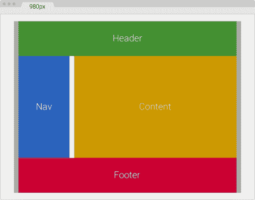
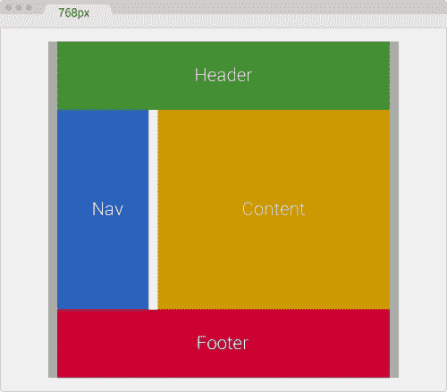
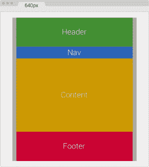
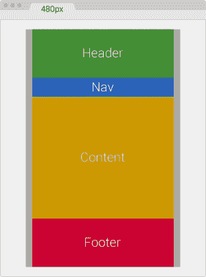
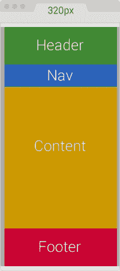

# 第三章：移动优先还是桌面优先？

在我多年的响应式网站设计和构建经验中，我发现为了更好地查看内容和消息，在线框和设计阶段使用桌面优先方法更容易可视化事物。

由于桌面优先方法允许我们在给定布局中看到更多内容，因此我们可以将提供给我们的内容的层次结构转化为代表该层次结构的布局。在 320 像素宽的小画布上进行此操作比需要更困难。

当您完成了这种层次结构，它将在小屏设备上保持不变，唯一改变的是布局。

*最佳实践*建议首先构建移动，但许多网络专业人员实际上并不知道为什么我们首先构建*移动*。双关语。

所以，让我们澄清一下。我们首先构建移动的原因是由 Luke Wroblewski 提到的三个原则，他实际上在 2009 年创造了*移动优先*这个术语。您会注意到这些原则都与 HTML、CSS 和/或 JavaScript 无关。换句话说，您不是因为 HTML、CSS 或 JavaScript 的任何优势而首先构建移动。有关更多信息，请访问[`www.lukew.com/ff/entry.asp?933`](http://www.lukew.com/ff/entry.asp?933)。

考虑以下几点：

+   **移动正在爆炸**：嗯，移动已经爆炸了。这基本上意味着人们更容易、更快速、更方便地使用移动设备访问网络。因此，如果您首先构建与移动设备兼容的网站，就有更好的机会提供更好的用户体验，并被更多人查看，而不是拥有仅限桌面的网站/应用程序。

+   **移动迫使您专注**：由于移动设备屏幕上的空间比桌面屏幕上的空间少得多，因此有必要进行优先排序。这意味着最重要的任务和/或消息需要立即可见。

+   **移动扩展了您的能力**：移动设备具有桌面设备没有的功能：GPS、加速计、多点触控输入、语音识别、前后摄像头等。在进行移动优先时，您可以使用这些先进技术来创建更丰富、更令人兴奋的体验。

现在您有了最终设计，现在您需要将该设计实施到 HTML、CSS 和 JavaScript 中。在这个阶段，您应该使用移动优先方法，并考虑我们之前提到的三个原因：

+   构建移动优先意味着您的网站/应用程序可以被更多人看到

+   这使您优先考虑内容

+   如果需要，它将允许您使用移动设备的高级功能和能力

在本章中，我们将涵盖以下主题：

+   在桌面优先视图中创建您的设计，但使用移动优先进行实施。

+   移动优先和桌面优先媒体查询的 Sass 混合。

+   处理旧版浏览器。

+   如何处理高密度屏幕。

+   为什么 RWD 有时并不一定是正确的解决方案。

+   使用 RWD 改造旧网站。

# 在桌面优先视图中创建您的设计，但使用移动优先进行实施

让我们看看一些术语，以便我们在同一页面上：

+   **线框**：这是使用仅轮廓的非常基本的布局的视觉表示。没有颜色，没有品牌，也没有任何定义的样式。

+   **设计/构图**：这是一个带有颜色、品牌和样式的*充实*线框。它是最终页面/站点/应用程序的非常接近表示（通常说，接近最终产品的 95%）而不涉及任何标记或任何类型的编码。

+   **HTML 模拟或 HTML 模板**：这是当设计已经被实现到一个实际的 HTML 页面中，带有 CSS 和—有时—JavaScript。它只能在浏览器中查看。它几乎是页面/站点/网络应用的最终产品的精确表示（接近 99%）。

术语明确后，让我们继续。

一些专业人士，包括我在内，建议使用更现代和高效的技术来创建视觉资产，以优化线框和设计/构图过程中的时间。诸如样式瓷砖、情绪板、元素拼贴和原子设计等技术与传统的线框和设计/构图方法有所不同。它们提供了独立于屏幕宽度、技术甚至内容创建的布局和样式的探索机会。

在本书的范围内，我们将专注于如何在掌握 HTML5 和 CSS3 的**响应式网页设计**（**RWD**）的初期阶段最大化利用时间的同时，仍然可以利用传统线框和设计/构图方法的一些内容。

## 为什么要以桌面优先的方式创建设计？

以桌面优先的方式创建设计的原因很简单：房地产（空间）。

作为设计师，我们需要以视觉方式反映内容的层次结构。为了实现这一点，我们使用许多设计原则，如节奏、接近性、空白、模式、对比、平衡、网格、对称等等。

当我们创建线框或设计/构图的画布足够大，可以尝试不同的排列和布局，我们就有了必要的灵活性来探索可以代表所述内容层次结构的不同方式。

例如，我们正在使用一个 12 列网格，我们提供的内容决定了以下内容层次结构：

+   这家企业希望用户能够提供他们的电子邮件 ID 以接收我们的新闻通讯。

+   我们希望展示编辑部选择的*特色文章*。

有了前面的内容层次结构，我们可以立即开始构想不同的布局来传达这个层次结构：

+   为了让用户提供他们的电子邮件地址，我们将创建一个带有标题、段落、电子邮件输入类型和按钮的表单。这个表单将位于页眉下方的左上角，并且可能有三到四列的宽度。我认为可能四列太宽了，但让我们先画线框看看感觉如何，以及这可能会有什么可用性、可访问性和可读性问题或好处。

+   对于*特色文章*，我们将使用剩余的列。如果电子邮件表单是三列宽，我们将使用剩下的九列；如果电子邮件表单是四列宽，我们将只使用剩下的八列。特色文章有更多的内容，如标题、作者、日期、类别、摘要、缩略图和指向完整文章的链接。

在我们的设计/线框应用程序中有一个宽敞的画布，我们可以尝试这些不同的方法，并最终得出一个合理的建议布局，以满足企业或利益相关者的要求，并且代表内容层次结构。

以移动优先的方式创建这样一个布局几乎是不可能的。小型房地产屏幕非常受限制和有限。但当事情开始增长时，我们需要每次考虑特定断点时进行这个探索过程。

### 提示

实际上，我们在这一点上不应该考虑断点（无意冒犯），因为内容而不是特定的设备宽度决定了需要添加新断点的位置。

一旦我们定义了反映内容层次结构的布局，我们就会处于一个良好的位置，因为当这些内容在较小的屏幕上重新排列时，无论宽度是多少，层次结构都将保持完整。

## 为什么要以移动优先的方式实施？

首先澄清一个术语：*implement*意味着根据线框图或设计/构图创建一个带有 CSS 和必要时 JavaScript 的 HTML 模型。

本章开头提到的原因是回答“为什么要首先使用移动设备实施？”记住：移动设备正在爆炸（实际上已经爆炸了），移动设备迫使你集中注意力，并扩展了你的能力。

除了第二个前提（这是一个巨大的*也许*）之外，这些原因都无法通过桌面优先实现。

让我们换个话题，转向一个更加技术性的主题，这将帮助我们了解 Sass mixin 如何帮助我们掌握移动设备优先和桌面优先方法。

因此，让我们回顾一下。使用桌面优先来创建你的设计和线框图。有一个大画布可以让我们探索不同的布局，并正确安排内容的层次结构。当需要实施（创建 HTML 模型）时，使用移动设备优先。

# 移动设备优先和桌面优先媒体查询的 Sass mixin

对于我们的示例，在本书中我们将使用两种类型的 Sass mixin：一种使用`min-width`属性的移动设备优先 mixin，另一种使用`max-width`属性的桌面优先 mixin。我们已经在第一章中看到了以下 mixin 及其工作原理，*利用 Sass 实现响应式网页设计的强大功能*，但这里是一个复习。

## 移动设备优先 mixin

我们将使用以下移动设备优先 mixin：

```html
@mixin forLargeScreens($media) {
    @media (min-width: $media/16+em) { @content; }
}
```

这就是我们使用它的方式：

```html
header {
   //Properties for small screens
    width: 50%;
    background: red;
    @include forLargeScreens(640) {
      //Properties for large screens
        width: 100%;
        background: blue;
    }
}
```

这编译成以下内容：

```html
header {
    width: 50%;
    background: red;
}

@media (min-width: 40em) {
    header {
        width: 100%;
        background: blue;
    }
}
```

## 桌面优先 mixin

这是我们将要使用的桌面优先 mixin：

```html
@mixin forSmallScreens($media) {
    @media (max-width: $media/16+em) { @content; }
}
```

这就是我们使用它的方式：

```html
header {
    //Properties for large screens
    width: 100%;
    background: purple;
    @include forSmallScreens(640) {
      //Properties for small screens
        width: 50%;
        background: yellow;
    }
}
@include forSmallScreens

```

这编译成以下内容：

```html
header {
    width: 100%;
    background: purple;
}

@media (max-width: 40em) {
    header {
        width: 50%;
        background: yellow;
    }
}
```

### 提示

使用这些 mixin 的好处是，非常容易找出正在使用的方法，因为我们可以在整个 SCSS 文件中看到`forLargeScreens`或`forSmallScreens`这个术语被重复使用。如果其他人要编辑我们最初做的任何工作，他们将清楚地了解我们用哪种方法构建了我们的站点/应用，只需扫描 SCSS 文件。

# 处理旧版浏览器

在“移动设备优先还是桌面优先？”的问题中，有一个领域我们需要涵盖一下，那就是旧版浏览器。每个项目，每个客户及其相应的分析（如果有的话，他们应该有），都有不同的要求，影响我们应该如何处理那些旧版浏览器。

如果你是用桌面优先的方法构建的，你当前的工作流程应该保持不变，因为这几乎就是在响应式网页设计变得几乎是强制性之前我们一直在做的事情。

这意味着你仍然会使用类似这样的东西：

```html
header {
    //Desktop-first declaration
    width: 50%;
    @include forSmallScreens(768) {
      //Target small screens (mobile devices)
      width: 100%; }
}
```

这编译成以下内容：

```html
header {
    width: 50%;
}

@media (max-width: 48em) {
    header {
      width: 100%;
    }
}
```

IE7 和 IE8 不支持媒体查询，但前面的代码将正常工作，因为`header { width: 50%; }`规则不在媒体查询内。

然而，如果你是以移动设备为先，那么`header { width: 50%; }`将在媒体查询内，因此 IE7 和 IE8 将无法看到该规则：

```html
.article {
    //Mobile-first declaration
    width: 100%;
    //IE7 and IE8 won't be able to see this rule.
    @include forLargeScreens(768) {
      width: 50%;
    }
}
```

这编译成以下内容：

```html
header {
    width: 100%;
}

@media (min-width: 48em) { 
    header {
      width: 50%;
    }
}
```

那么你该怎么办？解决方案非常简单：使用`Respond.js`脚本。

## 如何使用 Respond.js 进行 RWD

`Respond.js`是一种称为*polyfill*的脚本。根据最初提出这个术语的人 Remy Sharp 的说法，polyfill 是一段代码，提供了我们，网页开发人员，期望浏览器本地提供的技术。

在网页设计和开发中，polyfill 比 JavaScript 实现更丰富，例如 Scott Jehl 的`Respond.js`。但我们也可以说 CSS 中也有 polyfill，例如 Eric Meyer 的著名的`reset.css`和 Nicolas Gallagher 和 Jonathan Neal 的`Normalize.css`。

`Respond.js`脚本是一种 polyfill，使旧版浏览器（IE6/7/8）支持它们从未支持过的特定 CSS 功能：媒体查询。

您可以从[`github.com/scottjehl/Respond`](https://github.com/scottjehl/Respond)下载`Respond.js`。

### 提示

尽管我建议使用 polyfill，但我们需要注意网站/应用程序需要进行额外的 HTTP 请求以获取此 JavaScript 文件。我们的网站/应用程序发出的请求越少，它们就会越快，从而带来许多好处，如改善用户体验和积极的 SEO 影响。

因此，您需要做以下事情：

+   确保对`Respond.js`的调用在调用 CSS 文件之后*（希望只有一个 CSS 文件）*。

+   调用`Respond.js`脚本。

### 提示

性能最佳实践建议将非必要的脚本放在标记的底部，就在关闭的`</body>`标签之前。由于`Respond.js`针对的是旧版浏览器，让我们继续这样做。将脚本放在标记底部的另一个好处是有助于避免阻塞页面的渲染。

这是我们的示例 HTML：

```html
<!DOCTYPE html>
<html>
<head>
    <meta charset="utf-8">
    <title>Mastering RWD with HTML5 &amp; CSS3</title>
    <link href="styles.css" rel="stylesheet">
</head>
<body>
    <header>Logo goes here…</header>
    <article>Content goes here…</article>
    <script src="img/respond.min.js"></script>
</body>
</html>
```

在我们的`styles.scss`文件中，我们输入以下行：

```html
//Mobile-first declaration
article { background: red;
    //Target screens 640px wide and larger
    @include forLargeScreens(640) {
        & { background: green; }
  }
}
```

这编译为以下内容：

```html
article {
    background: red;
}

@media (min-width: 40em) {
    article {
         background: green; 
    }
}
```

因此，当您调整 IE7 或 IE8 浏览器窗口大小时，如果窗口宽度为 640 像素或更小，则它将能够显示红色背景，如果窗口为 641 像素或更大，则显示绿色背景。

## IE 特定样式表的时代已经过去

自从我开始编写 CSS 以来，我一直避免创建 IE 特定的样式表。这样做的原因很简单：

+   **文件管理**：在进行生产时，文件越少，每个过程就越顺利；更不用说更不容易出错。

+   **可扩展性**：如果需要添加、删除或编辑样式，您和您的团队知道最终的更改需要出现在您的主要且唯一的 CSS 文件中，我们的情况下是 SCSS 文件。

+   **组织**：在添加、删除或编辑正确的 CSS 文件（在我们的情况下是 SCSS 文件）中的 IE 特定样式时，让每个人都保持一致。

+   **性能**：少一个 HTTP 请求是一件好事，非常好的事情。无论多么小，我们为性能所做的任何事情都可以为良好的用户体验带来很大帮助；更不用说快速的网站对 SEO 有好处。

### 不使用 IE 特定样式表的其他好处

在旧版浏览器中，当它们尝试下载 IE 特定的样式表时，页面渲染不会被阻塞。此外，故障排除更容易。那么我们该使用什么呢？

有几种方法可以通过将所有内容放在一个样式表中来处理 IE：

+   使用 CSS hack（不建议）。

+   使用`Modernizr.js`。

+   在`<html>`标签中使用条件类。

让我们再谈谈一个流行的方法，使用条件类。

#### 在`<html>`标签中使用条件类

Paul Irish 在 2008 年的文章（[`www.paulirish.com/2008/conditional-stylesheets-vs-css-hacks-answer-neither/`](http://www.paulirish.com/2008/conditional-stylesheets-vs-css-hacks-answer-neither/)）指定了一个我推荐的方法，原因有几个：

+   它很容易实现；只需将此标记块复制并粘贴到我们的 HTML 文件顶部即可。

+   这并不具有侵入性，因为没有任何人需要处理额外的文件（用户、浏览器、服务器和我们）。

+   它不需要 JavaScript 即可工作；如果访问者无法使用或禁用 JavaScript，一切仍将正常工作。

这是我使用的一个：

```html
<!--[if IE 8]> <html class="no-js ie8" lang="en"> <![endif]-->
<!--[if IE 9]> <html class="no-js ie9" lang="en"> <![endif]-->
<!--[if gt IE 9]><!--><html class="no-js" lang="en"><!--<![endif]-->
```

### 提示

IE10 及以上不再支持*条件注释*，这就是条件类标记中没有提及 IE10 的原因。

有了前面的条件类，针对特定 IE（此示例中为 IE7）的定位如下：

```html
.ie7 nav li {
    float: left;
}
```

如果我们需要针对所有 IE 进行定位，我们会这样做：

```html
.ie7, .ie8, .ie9 {
    nav li {
        float: left;
    }
}
```

这编译为以下内容：

```html
.ie7 nav li, .ie8 nav li, .ie9 nav li {
    float: left;
}
```

对于所有其他浏览器，我们会这样做：

```html
nav {
    display: flex;
}
```

无论您使用哪种方法，`Modernizr.js`或条件类，都是个人偏好。使用这两种方法中的任何一种都是*正确的*做法。

记住，无论如何都要避免 CSS hack。作为网页设计师和网页开发人员，我们有责任为每个人创造一个更好的网络。

# 如何处理高密度屏幕

网络上有很多文章解释了**每英寸点数**（DPI），**每英寸像素**（PPI）和**密度无关像素**（DP/DiP）是什么。虽然了解这些技术和术语的复杂细节可能很重要，但让我们把本书的范围限制在高密度屏幕的基础和我们需要了解的内容上。

## 位图还是矢量适用于高密度屏幕？

像 SVG、图标字体或常规字体这样的矢量是数学方程的视觉表示，因此无论它们的大小如何，它们永远不会失去质量。

为了使位图图像在高密度屏幕上显示良好，我们必须导出*正常质量*图像的高分辨率版本。这意味着我们需要为我们计划使用的每个位图图像创建两个文件（或更多）：一个用于非高密度屏幕（标准液晶显示器，旧 TFT 监视器，一些电视等）的正常质量图像，以及一个（或更多）用于高密度屏幕（例如任何*视网膜*设备和 Super AMOLED 显示器）的高质量图像。

这就是良好的设计判断发挥作用的地方，因为有时我们可能并不一定需要每次都导出两个（或更多）位图图像。

当我们必须考虑高密度屏幕时，有几种技术可以用来处理图像。这些技术在《第六章》*响应式网页设计中的图像和视频处理*中有详细解释。

# 有时 RWD 并不一定是正确的解决方案

例如，大多数旅行网站的预订部分。这类网站管理的大量信息和类型使得响应式网站变得非常困难。当访问谷歌搜索结果中排名前八的旅行网站时，我看到了以下情况：

+   [`www.kayak.com/`](http://www.kayak.com/)

+   **主页**：响应

+   **预订页面**：不响应

+   [`www.expedia.com/`](http://www.expedia.com/)

+   **主页**：响应

+   **预订页面**：响应

+   [`www.hotwire.com/`](https://www.hotwire.com/)

+   **主页**：不响应

+   **预订页面**：响应

+   [`www.travelocity.com/`](http://www.travelocity.com/)

+   **主页**：响应

+   **预订页面**：响应

+   [`www.orbitz.com/`](http://www.orbitz.com/)

+   **主页**：不响应

+   **预订页面**：不响应

+   [`www.priceline.com/`](http://www.priceline.com/)

+   **主页**：不响应

+   **预订页面**：不响应

+   [`www.tripadvisor.in/`](http://www.tripadvisor.in/)

+   **主页**：不响应

+   **预订页面**：不响应

+   [`www.hipmunk.com/`](https://www.hipmunk.com/)

+   **主页**：不响应

+   **预订页面**：不响应

以下是我们的一些发现的简要列表：

+   自从 Expedia 收购了 Travelocity，它们共享相同的平台。区别在于品牌定位；因此，我将考虑这两个网站为一个。

+   七个网站中有五个（71％）的主页不响应。

+   七个网站中有五个（71％）的预订页面不响应。

+   七个网站中只有一个（Expedia/Travelocity）是完全响应的（14％）。

+   七个网站中有四个（57％）根本没有 RWD。

我们可以得出结论，最受欢迎的旅行网站尚未完全采用 RWD，但有些是固定宽度和响应式布局的混合体。这就是为什么所有这些网站都有单独的移动应用程序。对于它们来说，RWD 可能不是优先考虑的，因此它们依赖于它们的移动应用程序来弥补这一不足。

尽管这在今天已经非常罕见，但有时我们可能需要构建一个不响应的网站或页面。实际上，今天有一些页面是不响应的。

CodePen 是最受欢迎的前端沙箱之一，而 CodePen 的编辑器不是响应式的。为什么？因为它不需要。开发人员很少会使用手机去 CodePen 编写 HTML、Sass 和 JavaScript。

话虽如此，如果您需要构建一个不需要响应的站点/页面，就 CSS 网格系统而言，有两个很好的选择：

+   使用我们的老朋友，960 网格系统（[`960.gs/`](http://960.gs/)）。

+   使用 1140 网格系统（[`www.1140px.com/`](http://www.1140px.com/)）。

有几件事需要考虑：

+   960 网格系统针对 1024px 宽的屏幕。

+   1140 网格系统针对 1280px 宽的屏幕。

+   1140 网格系统默认包含媒体查询，因此我们需要考虑并决定是最好保留它们还是最好删除它们以减小文件大小并减少 IE6-IE9 中的选择器限制。

因为我一直认为 960 网格系统左右各有 10px 的填充使内容离主容器的边缘太近，我在每一侧增加了 10 个像素，将填充增加到 20px，将 960 网格系统变成了 980 网格系统。从现在开始，我们将称其为 980GS。

# 使用 RWD 改装旧网站

如果有必要，我们需要准备使非响应式或固定宽度的站点/应用程序变得响应式。

有两种改装非响应式或固定宽度的站点/应用程序的方法。一种是使用**自适应 Web 设计**（**AWD**）技术，使用绝对单位（即像素）。另一种是使用 RWD，并使用非常简单的公式将所有像素值转换为百分比。

无论我们使用哪种技术，我们都必须使用桌面优先的方法，因为我们处理的站点只适用于宽屏。这意味着我们将在媒体查询中使用`max-width`属性。

在我们查看两种改装技术之前，我们需要一个基础页面来开始。

## 基础页面

您在此处看到的图形与 12 列 980GS 布局成比例。浏览器窗口宽度为 1024px，页面宽度为 980px：



### 提示

我们灰色的主容器宽度为 980px，左右已经有 10px 的填充。这意味着内部的部分总是需要加起来等于**960px**。

以下是容器的组件：

+   灰色的主容器宽度为 980px，左右各有 10px 的填充。

+   绿色的**头部**和红色的**页脚**分别为 960px 或 12 列宽：940px 带有左右各 10px 的边距。

+   蓝色的**导航**部分宽度为 240px 或 3 列：220px 带有 10px 的左边距和右边距。

+   黄色的**内容**部分宽度为 710px 或 9 列：700px 带有 10px 的右边距。

+   白色的间距宽度为 20px，即**导航**右边距为 10px，**内容**左边距为 10px。

+   因此，*220px 导航 + 710px 内容 + 20px 间距 + 10px 边距 = 960px*。

## HTML

这是代表我们基础页面的标记：

```html
<!DOCTYPE html>
<html>
<head>
    <meta charset="utf-8">
    <title>Retrofitting with Adaptive Web Design</title>
    <link href="css/styles.css" rel="stylesheet">
</head>
<body>
    <main class="container_12 clear">
      <header class="grid_12">Header</header>
      <nav class="grid_3">Nav</nav>
      <section class="grid_9">Content</section>
      <footer class="grid_12">Footer</footer>
    </main>
</body>
</html>
```

## CSS/SCSS

关于我们的 CSS/SCSS，我们只需要创建一个部分，即包含固定宽度网格的`_980gs.scss`文件。

然后，我们将创建一个`styles.scss`文件，我们将执行以下操作：

+   导入`_980gs.scss`文件。

+   包括我们简单的桌面优先 Sass mixin 来处理媒体查询。

+   使用`max-width`属性创建所有必要的媒体查询。

+   将其编译为`styles.css`并在我们的页面中使用。

### 创建 _980gs.scss 文件

`_980gs.scss`文件包含基本网格，如下所示：

```html
//Globals
*, *:before, *:after {
    box-sizing: border-box;
}

//Container
.container_12 {
    width: 980px;
    padding: 0 10px;
    margin: auto; 
}

//Grid >> Global
.grid {
    &_1, &_2, &_3, &_4, &_5, &_6, &_7, &_8, &_9, &_10, &_11, &_12 {
      float: left;
      margin: 0 10px;
    }
}

//Grid >> 12 Columns
.container_12 {
    .grid_1  { width: 60px; }
    .grid_2  { width: 140px; }
    .grid_3  { width: 220px; }
    .grid_4  { width: 300px; }
    .grid_5  { width: 380px; }
    .grid_6  { width: 460px; }
    .grid_7  { width: 540px; }
    .grid_8  { width: 620px; }
    .grid_9  { width: 700px; }
    .grid_10 { width: 780px; }
    .grid_11 { width: 860px; }
    .grid_12 { width: 940px; }
}

//Clear Floated Elements - http://davidwalsh.name/css-clear-fix
.clear, .row {
    &:before,
    &:after { content: ''; display: table; }
    &:after { clear: both; }
}

//Use rows to nest containers
.row { margin-bottom: 10px;
    &:last-of-type { margin-bottom: 0; }
}
//Legacy IE
.clear { zoom: 1; }
```

# 使用 AWD 进行改装

与 RWD 不同，其宽度是流体和弹性的（ems 和百分比），因此术语*相对单位*，在 AWD 中，宽度是固定的（像素）。因此，我们使用术语*绝对单位*，当我们调整浏览器窗口大小时，元素将*捕捉*到这些固定宽度。

在 AWD 中，我们几乎每个宽度都使用像素，甚至我们的媒体查询也是如此。

## 创建 styles.scss 文件

我们要做的第一件事是在`styles.scss`文件中导入部分`_980gs.scss`文件：

```html
//Retrofitting with Adaptive Web Design
@import "980gs";

```

然后，我们将包含我们简单的桌面优先 mixin 来处理媒体查询。然而，请记住我之前提到过这个 mixin 是可扩展的，如果我们想要的话，我们可以使它编译基于像素的值？我们所需要做的就是从除法`$media/16+em`中移除值`/16+em`：

```html
//Retrofitting with Adaptive Web Design
@import "980gs";

//Desktop-first Media Query Mixin
@mixin forSmallScreens($media) {
 @media (max-width: $media) { @content; }
}

```

以下规则仅用于样式目的，以实现我们在之前截图中看到的相同设计：

```html
//Retrofitting with Adaptive Web Design
@import "980gs";

//Desktop-first Media Query Mixin
@mixin forSmallScreens($media) {
    @media (max-width: $media) { @content; }
}

//Basic styling
.container_12 {
 background: #aaa;
 font-size: 30px;
 text-shadow: 0 1px 1px rgba(black,.5);
}
header { background: #429032; }
nav { background: #2963BD; }
section { background: #c90; }
footer { background: #c03; }

//Give heights to elements for better perception of sections
header, footer { height: 150px; }
nav, section { height: 440px; }

```

此时，我们的页面宽度为 980px，看起来和最初看到的截图一样。

让我们定义基本页面*捕捉*的宽度：

+   在 980px 时，我们将把页面捕捉到 768px。

+   在 768px 时，我们将把页面捕捉到 640px。

+   在 640px 时，我们将把页面捕捉到 480px。

+   在 480px 时，我们将把页面捕捉到 320px。

这就是乐趣开始的地方。让我们通过为每个部分创建媒体查询来开始改造这个页面。

### 980px 到 768px（AWD）

以下媒体查询针对 768px：

```html
.container_12 {
  @include forSmallScreens(980px) {
 width: 768px;
 }
    .grid_12 { //Header and Footer sections
      @include forSmallScreens(980px) {
 width: 728px;
 }
  }
  .grid_3 { //Nav section
    @include forSmallScreens(980px) {
 width: 200px;
 }
  }
  .grid_9 { //Content section
    @include forSmallScreens(980px) {
 width: 508px;
 }
  }
}
```

诚然，从 980px 到 768px，书中的差异有点难以察觉，但相信我，以下截图完全代表了浏览器窗口宽 980px，页面宽 768px：



正如你所看到的，一旦屏幕宽度达到 980px，我们的主容器（`.container_12`）的宽度就从 980px 变为 768px。我们的主容器左右各有 10px 的填充，因此所有其他部分的宽度应该加起来匹配 748px。

让我们来看看。

我们的**Header**和**Footer**使用相同的类`.grid_12`，现在宽度为 728px。因此，如果我们加上：*728px + 10px 左边距 + 10px 右边距 = 748px*。

如果我们将**Nav**（`.grid_3`）和**Content**（`.grid_9`）部分的宽度相加：

+   *200px Nav + 508px Content = 708px*

+   *708px + 20px gutter = 728px*

+   *728px + Nav 的左边距 10px + Content 的右边距 10px = 748px*

跟着我，我保证这会非常有趣。

### 768px 到 640px（AWD）

以下媒体查询针对 640px：

```html
.container_12 {
    @include forSmallScreens(980px) {
      width: 768px;
  }
    @include forSmallScreens(768px) {
 width: 640px;
 }
    .grid_12 { //Header and Footer sections
      @include forSmallScreens(980px) {
        width: 728px;
      }
      @include forSmallScreens(768px) {
 width: 600px;
 }
    }
    .grid_3 { //Nav section
      @include forSmallScreens(980px) {
        width: 200px;
      }
      @include forSmallScreens(768px) {
 width: 160px;
 }
    }
    .grid_9 { //Content section
      @include forSmallScreens(980px) {
        width: 508px;
      }
      @include forSmallScreens(768px) {
 width: 420px;
 }
    }
}
```

好的，这个布局现在是单列页面。我们开始看到一些结果了。不错！



再次，请记住，我们的主容器左右各有 10px 的填充，因此所有其他部分的宽度应该加起来匹配 620px。

让我们确保我们的数字加起来：

我们的**Header**和**Footer**使用相同的类`.grid_12`，现在宽度为 600px。因此，如果我们加上：*600px + 10px 左边距 + 10px 右边距 = 620px*。

如果我们将**Nav**（`.grid_3`）和**Content**（`.grid_9`）部分的宽度相加：

+   *160px Nav + 420px Content = 580px*

+   *580px + 20px gutter = 600px*

+   *600px + Nav 的左边距 10px + Content 的右边距 10px = 620px*

让我们把这个页面变得更小！

### 640px 到 480px（AWD）

以下媒体查询针对 480px：

```html
.container_12 {
    @include forSmallScreens(980px) {
      width: 768px;
    }
    @include forSmallScreens(768px) {
      width: 640px;
    }
    @include forSmallScreens(640px) {
 width: 480px;
 }
    .grid_12 { //Header and Footer sections
      @include forSmallScreens(980px) {
        width: 728px;
      }
      @include forSmallScreens(768px) {
        width: 600px;
      }
    }
    .grid_3 { //Nav section
      @include forSmallScreens(980px) {
        width: 200px;
      }
      @include forSmallScreens(768px) {
        width: 160px;
      }
    }
    .grid_9 { //Content section
      @include forSmallScreens(980px) {
        width: 508px;
      }
      @include forSmallScreens(768px) {
        width: 420px;
      }
    }
    .grid_3,
 .grid_9,
 .grid_12 {
 @include forSmallScreens(640px) {
 width: 440px;
 }
 }
}
```

我们取得了一些应得的进展！在这里，浏览器窗口宽 640px，页面宽 480px：



请记住，我们的主容器左右各有 10px 的填充，因此所有其他部分的宽度应该加起来匹配 460px。

现在，我们将从 2 列布局更改为 1 列布局。这意味着所有部分现在具有完全相同的宽度。

这也意味着在我们的 SCSS 文件中，我们可以为所有三个类创建一个单一的媒体块：

```html
.grid_3,
.grid_9,
.grid_12 {
    @include forSmallScreens(640px) {
      width: 440px;
    }
}
```

现在，让我们确保我们的数字加起来：

我们的**Header**，**Nav**，**Content**和**Footer**部分现在宽度为 440px，依次堆叠在一起。因此，如果我们加上：*所有部分的 440px + 10px 左边距 + 10px 右边距 = 460px*。

我们来了，这个谜题的最后一块！

### 480px 到 320px（AWD）

以下媒体查询针对 320px：

```html
.container_12 {
    @include forSmallScreens(980px) {
      width: 768px;
    }
    @include forSmallScreens(768px) {
      width: 640px;
    }
    @include forSmallScreens(640px) {
      width: 480px;
    }
    @include forSmallScreens(480px) {
 width: 320px;
 padding: 0;
 }
    .grid_12 { //Header and Footer sections
      @include forSmallScreens(980px) {
        width: 728px;
      }
      @include forSmallScreens(768px) {
        width: 600px;
      }
    }
    .grid_3 { //Nav section
      @include forSmallScreens(980px) {
        width: 200px;
      }
      @include forSmallScreens(768px) {
        width: 160px;
      }
      @include forSmallScreens(640px) {     
        height: 50px; //This is only for styling
      }
    }
    .grid_9 { //Content section
      @include forSmallScreens(980px) {
        width: 508px;
      }
      @include forSmallScreens(768px) {
        width: 420px;
      }
    }
    .grid_3,.grid_9,.grid_12 {
      @include forSmallScreens(640px) {
        width: 440px;
      }
 @include forSmallScreens(480px) {
 width: 300px;
 }
    }
}
```

我们来了！在这个屏幕截图中，浏览器窗口宽度为 320px，内容也是 320px 宽，非常合适：



我们已经知道我们的主容器左右各有 10 像素的填充。在这种情况下，我们将去掉填充以获得这 20 像素，因为我们的屏幕空间现在非常小：

```html
@include forSmallScreens(480px) {
    width: 320px;
    padding: 0;
}
```

左右各 10 像素的间距现在将由其他部分的左右边距创建。这意味着每个部分的宽度应为 300 像素。

添加新的 320 像素断点很容易：

```html
.grid_3,
.grid_9,
.grid_12 {
    @include forSmallScreens(640px) {
      width: 440px;
    }
    @include forSmallScreens(480px) {
 width: 300px;
 }
}
```

现在，让我们确保我们的数字加起来：

我们的**标题**、**导航**、**内容**和**页脚**部分现在都是 300 像素宽，依次堆叠在一起。所以如果我们加上：*所有部分的 300 像素 + 10 像素左边距 + 10 像素右边距 = 320 像素*。

就是这样。我们现在已经使用 AWD 技术将固定宽度页面改为响应式。

最终的 SCSS 如下：

```html
.container_12 {
    @include forSmallScreens(980px) {
      width: 768px;
    }
    @include forSmallScreens(768px) {
      width: 640px;
    }
    @include forSmallScreens(640px) {
      width: 480px;
    }
    @include forSmallScreens(480px) {
 width: 320px; padding: 0;
 }
    .grid_12 { //Header and Footer sections
      @include forSmallScreens(980px) {
        width: 728px;
      }
      @include forSmallScreens(768px) {
        width: 600px;
      }
    }
    .grid_3 { //Nav section
      @include forSmallScreens(980px) {
        width: 200px;
      }
      @include forSmallScreens(768px) {
        width: 160px;
      }
      @include forSmallScreens(640px) {     
        height: 50px; //This is only for styling
      }
    }
    .grid_9 { //Content section
      @include forSmallScreens(980px) {
        width: 508px;
      }
      @include forSmallScreens(768px) {
        width: 420px;
      }
    }
    .grid_3, .grid_9, .grid_12 {
      @include forSmallScreens(640px) {
        width: 440px;
      }
 @include forSmallScreens(480px) {
 width: 300px;
 }
    }
}
```

它编译成以下 CSS：

```html
@media (max-width: 980px) {
    .container_12 {
      width: 768px;
    }
}
@media (max-width: 768px) {
    .container_12 {
      width: 640px;
    }
}
@media (max-width: 640px) {
    .container_12 {
      width: 480px;
    }
}
@media (max-width: 480px) {
    .container_12 {
      width: 320px;
      padding: 0;
  }
}
@media (max-width: 980px) {
    .container_12 .grid_12 {
      width: 728px;
    }
}
@media (max-width: 768px) {
    .container_12 .grid_12 {
      width: 600px;
    }
}
@media (max-width: 980px) {
    .container_12 .grid_3 {
      width: 200px;
    }
}
@media (max-width: 768px) {
    .container_12 .grid_3 {
      width: 160px;
    }
}
@media (max-width: 640px) {
    .container_12 .grid_3 {
      height: 50px;
    }
}
@media (max-width: 980px) {
    .container_12 .grid_9 {
      width: 508px;
    }
}
@media (max-width: 768px) {
    .container_12 .grid_9 {
      width: 420px;
    }
}
@media (max-width: 640px) {
    .container_12 .grid_3, .container_12 .grid_9,.container_12 .grid_12 {
      width: 440px;
    }
}
@media (max-width: 480px) {
    .container_12 .grid_3,.container_12 .grid_9,.container_12 .grid_12 {
      width: 300px;
  }
}
```

### 提示

正如你所看到的，我们的最终 CSS 文件中重复了几个断点。这是 Sass 的一个问题。然而，这实际上并不是一个问题，也不是我们需要担心的事情，因为当服务器对该文件进行 gzip 压缩时，它将以最大限度进行压缩。如果我们最小化最终输出（无论如何我们都应该这样做），我们将进一步压缩文件。重复的`@media`断点对性能几乎没有任何影响。

现在，让我们看看使用百分比和 RWD 改装相同页面的样子。

# 使用 RWD 进行改装

我们刚刚看到了如何使用像素来实现 AWD。通过 RWD 和一个非常简单的方程，我们可以使用相对单位（在我们的情况下是百分比）来改装网站。更不用说这将比使用 AWD 要容易得多。

## RWD 的魔法公式

由 Ethan Marcotte 发现/创造，他创造了*响应式网页设计*这个术语，RWD 的魔法公式是一个非常简单的方程：

（目标 ÷ 上下文）x 100 = 结果 %

在我们开始将像素转换为百分比之前，我们需要看看我们的*上下文*将是哪个宽度。

## 主容器

我们的上下文将是页面的主容器`.container_12`，最大宽度为 980 像素。然而，主容器和列之间存在一个问题，将这个 980 像素的上下文变成 960 像素。请注意`.container_12`部分的左右 10 像素填充和`.grid`规则中的左右 10 像素边距：

```html
.container_12 {
    width: 980px;
    padding: 0 10px;
    margin: auto; 
}
.grid {
    &_1, &_2, &_3, &_4, &_5, &_6, &_7, &_8, &_9, &_10, &_11, &_12 {
      float: left;
      margin: 0 10px;
    }
}
```

`.grid`规则中的 10 像素左右边距意味着所有列的宽度都增加了 20 像素。所以，例如，宽度为 940 像素的标题和页脚实际上是 960 像素宽。`box-sizing: border-box;`属性只考虑减去盒模型内部的内容（填充），而不考虑外部的内容（边距）。

一个解决方案是去掉`.container_12`的左右 10 像素填充，并在`.grid`规则中增加左右边距为 20 像素，以保持间距；否则，列会相互接触。

现在，间距变得更宽，这可能不是出于设计目的，而且——信不信由你——在最宽的容器中会多出 1 像素。在我们的情况下，它会添加到标题和页脚中。

作为设计师，我知道如果不得不处理这些问题，我是不想要的。

第二种解决方案更简单：将上下文设为 960 像素。这样，我们可以全局去掉多余的 10 像素，而不会影响主容器和列的完整性，由于我们得到的是百分比，所以结果几乎相同。

换句话说：*(960 像素 ÷ 980 像素) x 100 = 97.95918367346939% (97.95%)*

这实际上等同于：*(940 像素 ÷ 960 像素) x 100 = 97.91666666666667% (97.91%)*

在第二种解决方案中，1 像素的问题确实会发生，但是在调整浏览器宽度时会在随机宽度时发生。然而，在第一种解决方案中，1 像素的问题是永久性的，无论浏览器的宽度如何。

弄清楚这一点后，我们将把所有基于像素的宽度转换为使用 960 像素作为上下文的百分比。

## 标题和页脚部分

**Header**和**Footer**部分的宽度都是 940px。知道它们的上下文是 960px，让我们继续使用魔术公式找到它们的百分比宽度：*(940px ÷ 960px) x 100 = 97.91666666666667%*。

你可能会问自己，“这么多小数点有必要吗？”不是所有的小数点，但至少建议使用两位。

所以我们最终得到**Header**和**Footer**部分为 97.91%。

一些开发人员建议使用所有小数，并让浏览器决定要使用多少。过去，我决定挑战这个建议，只使用两位小数来看看会发生什么。自从我开始使用两位小数以来，在任何浏览器中都没有遇到任何不良行为或宽度问题。

Firefox 和 IE11 会将多余的小数点截断为两位。另一方面，Chrome 会保留所有小数点。我建议至少使用两位小数，这也是我们在书中使用的方式，以保持简单和简洁。但是，如果您更喜欢使用所有小数点，那就尽管去做！这在这一点上是个人偏好的问题。

### 提示

避免四舍五入值，并让浏览器处理小数点。这样做也可以让您专注于最重要的事情：高效并尝试为用户创造令人难忘的体验。

## Nav 部分

为了找到**Nav**部分的百分比宽度，我们同样使用 960px 作为上下文：*(220px ÷ 960px) x 100 = 22.91666666666667%*。

使用两位小数，我们最终得到**Nav**部分为 22.91%。

## Content 部分

为了找出**Content**部分的百分比宽度，我们的公式看起来几乎一样。唯一的区别是我们正在改变第一个值，即**Content**部分的宽度（以像素为单位）：*(700px ÷ 960px) x 100 = 72.91666666666667%*。

仅使用两位小数，我们最终得到**Content**部分为 72.91%。

这就是我们初始的改装 RWD SCSS 文件的样子：

```html
.container_12 {
    .grid_12 { //Header and Footer sections
      width: 97.91%;
    }
    .grid_3 { //Nav section
      width: 22.91%;
    }
    .grid_9 { //Content section
       width: 72.91%;
    }
}
```

现在，让我们退一步，先处理一些其他基于像素的宽度。还记得主容器`.container_12`左右各有 10px 的填充吗？我们也需要将这 10px 转换为百分比。

使用我们的魔术公式，我们这样做：

*(10px ÷ 960px) x 100 = 1.041666666666667%*。

仅使用两位小数，我们最终得到左右填充为 1.04%。

让我们将这个值添加到我们的 SCSS 中：

```html
.container_12 {
    width: 980px;
    padding: 0 1.04%;
    margin: auto; 
}
.container_12 {
    .grid_12 { //Header and Footer sections
      width: 97.91%;
    }
    .grid_3 { //Nav section
      width: 22.91%;
    }
    .grid_9 { //Content section
       width: 72.91%;
    }
}
```

此外，我们所有的列左右各有 10px 的边距。由于我们已经知道 10px 等于 1.04%，让我们将这个值添加到我们 SCSS 中的所有列中：

```html
.container_12 {
    width: 980px;
    padding: 0 1.04%;
    margin: auto; 
}
.grid {
 &_1, &_2, &_3, &_4, &_5, &_6, &_7, &_8, &_9, &_10, &_11, &_12 {
 float: left;
 margin: 0 1.04%;
 }
}
.container_12 {

    .grid_12 { //Header and Footer sections
      width: 97.91%;
    }
    .grid_3 { //Nav section
      width: 22.91%;
    }
    .grid_9 { //Content section
       width: 72.91%;
    }
}
```

现在，我们有一个宽度为 1024px 的浏览器窗口，一个宽度为 980px 的布局，以及所有列都具有相应的百分比值。实际上，这几乎是不可能的，除非查看代码以在固定宽度和基于百分比的布局之间进行视觉区分。

我们做得很好！


让乐趣开始吧。让我们添加我们的第一个媒体查询。

### 980px 到 768px（RWD）

以下媒体查询针对 768px：

```html
.container_12 {
    width: 980px;
    padding: 0 1.04%;
    margin: auto; 
}
.grid {
    &_1, &_2, &_3, &_4, &_5, &_6, &_7, &_8, &_9, &_10, &_11, &_12 {
 float: left;
      margin: 0 1.04%;
    }
}
.container_12 {
    @include forSmallScreens(980px) {
 width: 768px;
 }
    .grid_12 { //Header and Footer sections
      width: 97.91%;
    }
    .grid_3 { //Nav section
      width: 22.91%;
    }
    .grid_9 { //Content section
       width: 72.91%;
    }
}
```

由于**Header**、**Footer**、**Nav**和**Content**部分的宽度、填充和边距现在都以百分比设置，我们不必为它们声明任何媒体查询——至少目前还不需要，因为布局还没有改变。

当我们调整浏览器窗口大小时，**Header**、**Footer**、**Nav**和**Content**部分会自动响应，按比例缩小，正确对齐，并适应主容器`.container_12`的新宽度，而不会破坏布局。如下截图所示：


太棒了！

让我们添加另一个断点。

### 768px 到 640px（RWD）

在以下断点（640px）中，我们的布局将变为单列。因此，我们将添加一个新的媒体查询，使**Nav**和**Content**部分与**Header**和**Footer**部分一样宽，并使它们堆叠在一起。

以下媒体查询针对 640px，并使**Nav**和**Content**部分全宽：

```html
.container_12 {
    width: 980px;
    padding: 0 1.04%;
    margin: auto;
}
.grid {
    &_1, &_2, &_3, &_4, &_5, &_6, &_7, &_8, &_9, &_10, &_11, &_12 {
        float: left;
        margin: 0 1.04%;
    }
}
.container_12 {
    @include forSmallScreens(980px) {
        width: 768px;
    }
    @include forSmallScreens(768px) {
 width: 640px;
 }
    .grid_12 { //Header and Footer sections
      width: 97.91%;
    }
    .grid_3 { //Nav section
      width: 22.91%;
    }
    .grid_9 { //Content section
      width: 72.91%;
    }
    .grid_3, .grid_9 { //Nav and Content sections
 @include forSmallScreens(640px) {
 width: 97.91%;
 }
 }
}
```

好的，我们现在有了单列布局。还不错，还不错！


### 640px 到 480px（RWD）

现在我们的宽度已经缩小到 480px，单列布局不会改变，只有所有容器的宽度会改变。

以下媒体查询针对 480px：

```html
.container_12 {
  width: 980px;
  padding: 0 1.04%;
  margin: auto; 
}
.grid {
    &_1, &_2, &_3, &_4, &_5, &_6, &_7, &_8, &_9, &_10, &_11, &_12 {
 float: left;
      margin: 0 1.04%;
    }
}
.container_12 {
    @include forSmallScreens(980px) {
      width: 768px;
    }
    @include forSmallScreens(768px) {
      width: 640px;
    }
    @include forSmallScreens(640px) {
 width: 480px;
 }
    .grid_12 { //Header and Footer sections
      width: 97.91%;
    }
    .grid_3 { //Nav section
      width: 22.91%;
      @include forSmallScreens(640px) {     
        height: 50px; //This is only for styling
      }
    }
    .grid_9 { //Content section
       width: 72.91%;
    }
    .grid_3, .grid_9 { //Nav and Content sections
 @include forSmallScreens(640px) {
 width: 97.91%;
 }
 }
}
```

我们的布局变窄了，我们需要做的就是添加一个新的媒体查询，就这样！不需要在其他容器上瞎折腾；它们都完美地适应了我们定义的任何宽度。


### 480px 到 320px（RWD）

最后，我们解决了 320px 的宽度，而不修改单列布局。我们去掉了`.container_12`上的填充，以利用所有可用的屏幕空间。

以下媒体查询针对 320px：

```html
.container_12 {
    width: 980px;
    padding: 0 1.04%;
    margin: auto;
}
.grid {
    &_1, &_2, &_3, &_4, &_5, &_6, &_7, &_8, &_9, &_10, &_11, &_12 {
 float: left;
    margin: 0 1.04%;  }
}
.container_12 {
    @include forSmallScreens(980px) {
      width: 768px;
    }
    @include forSmallScreens(768px) {
      width: 640px;
    }
    @include forSmallScreens(640px) {
      width: 480px;
    }
    @include forSmallScreens(480px) {
 width: 320px; padding: 0;
 }
    .grid_12 { //Header and Footer sections
      width: 97.91%;
    }
    .grid_3 { //Nav section
      width: 22.91%;
      @include forSmallScreens(640px) {     
        height: 50px; //This is only for styling
      }
    }
    .grid_9 { //Content section
       width: 72.91%;
    }
    .grid_3, .grid_9 {
      @include forSmallScreens(640px) {
        width: 97.91%;
      }
    }
}
```

再次，我们不必添加任何内容到**Header**、**Footer**、**Nav**和**Content**部分，因为它们现在都是 97.91%宽。这使它们具有响应性，我们不必担心其他任何事情。


最终的 SCSS，结合所有断点和宽度，如下所示：

```html
.container_12 {
    width: 980px;
    padding: 0 1.04%;
    margin: auto;
}
.grid {
    &_1, &_2, &_3, &_4, &_5, &_6, &_7, &_8, &_9, &_10, &_11, &_12 {
        float: left;
        margin: 0 1.04%;
    }
}
.container_12 {
    @include forSmallScreens(980px) {
        width: 768px;
    }
    @include forSmallScreens(768px) {
        width: 640px;
    }
    @include forSmallScreens(640px) {
        width: 480px;
    }
    @include forSmallScreens(480px) {
        width: 320px; padding: 0;
    }
    .grid_12 { //Header and Footer sections
      width: 97.91%;
    }
    .grid_3 { //Nav section
      width: 22.91%;
    }
    .grid_9 { //Content section
      width: 72.91%;
    }
    .grid_3, .grid_9 { //Nav and Content sections
        @include forSmallScreens(640px) {
            width: 97.91%;
        }
    }
}
```

它编译成以下 CSS：

```html
.container_12 {
    width: 980px;
    padding: 0 1.04%;
    margin: auto;
}

.grid_1, .grid_2, .grid_3, .grid_4, .grid_5, .grid_6, .grid_7, .grid_8, .grid_9, .grid_10, .grid_11, .grid_12 {
    float: left;
    margin: 0 1.04%;
}

@media (max-width: 980px) {
    .container_12 {
      width: 768px;
    }
}
@media (max-width: 768px) {
    .container_12 {
      width: 640px;
    }
}
@media (max-width: 640px) {
    .container_12 {
      width: 480px;
    }
}
@media (max-width: 480px) {
    .container_12 {
      width: 320px;
      padding: 0;
    }
}
.container_12 .grid_12 {
    width: 97.91%;
}
.container_12 .grid_3 {
    width: 22.91%;
}
.container_12 .grid_9 {
    width: 72.91%;
}
@media (max-width: 640px) {
    .container_12 .grid_3, .container_12 .grid_9 {
      width: 97.91%;
    }
}
```

正如你所看到的，使用 RWD 比 AWD 来改造站点的代码要少得多。当然，这些例子是对站点/应用布局的极端简化，但现在你已经了解了在使用 AWD 或 RWD 时做出决定的基本概念。

# 总结

在本章中，我们讨论了很多有趣的内容。我们看到，使用桌面优先来创建设计和线框图是有益的，因为拥有一个大画布可以让我们探索不同的布局，并正确安排内容的层次结构。

在创建 HTML 模型时，使用移动优先更好，因为移动友好的站点将具有更广泛的覆盖范围，允许专注的内容，并利用移动设备的技术。

我们能够使用魔术公式对固定宽度的站点进行 AWD 和 RWD 的改造。我们还讨论了 RWD 的好处，因为它需要的代码要少得多。然而，对旅行网站的分析清楚地告诉我们，RWD 有时并不是正确的解决方案。

我们还看到了`Respond.js`如何用于使旧版浏览器支持媒体查询，如果我们采用移动优先的方法构建。使用条件类是一种很好的技术，因为它不会侵入，很容易实现，并且没有 JavaScript 依赖。

在下一章中，我们将讨论 RWD 世界中一些最有趣的主题：CSS 网格、CSS 框架和 Flexbox 的强大。 

让我们开始吧！
