# 第五章：设计由大手指驱动的小 UI

触摸屏设备的普及并不新鲜，对于我们——网络/移动设计师和开发人员来说。因此，我们不会谈论市场份额、统计数据或分析数字。相反，我们将讨论我们需要考虑的事项，如目标大小、导航模式、导航图标、最佳实践和移动设备人体工程学。

在本章中，我们将涵盖以下主题：

+   小 UI 上的理想目标大小。

+   姿势模式和触摸区域。

+   RWD 需要考虑的基本准则。

+   RWD 的导航模式。

# 小 UI 上的理想目标大小

所有供应商对小屏幕设备上理想目标大小的规则和指南都有不同的集合。其中一些是以像素表示这些尺寸，其他的是以点表示，还有一些是以英寸、毫米或厘米为单位。

无论这些供应商使用的单位是什么，他们都同意一个基本概念：使目标大小足够大，以避免意外点击。这与菲茨定律相一致，该定律规定*目标越小，用户到达目标所需的时间就越长*。

显然，作为网页设计师，我们必须注意在我们的设计中*大*意味着什么，因此我们需要平衡目标大小的建议与良好的设计原则。我们的目标是让消息传达给用户，并且他们应该能够舒适地使用我们的界面。

需要记住的一件事是，RWD 的目标大小指南大多基于移动应用程序设计模式。让我们直奔主题。

成年人食指的平均宽度约为 16 毫米至 20 毫米。这接近 45px 至 57px。

根据*苹果的 iOS 人机界面指南*，推荐的最小目标大小为 44pt x 44pt。

### 提示

一些用户界面指南使用点和毫米作为测量单位的原因是为了提供一个与设备无关的一致比例尺。这是因为一个设备中的 1px 在另一个设备中不一定意味着确切的 1px。尽管如此，一些供应商确实提供了像素的指南，但主要是为了让我们了解元素的比例关系。

在过去，苹果确实建议他们的目标大小以像素为单位，44px x 44px，但当引入视网膜显示屏时，iPhone 3 的 1 像素变成了 iPhone 4 上的 4 像素。不再是 1:1 的比例。

这意味着在非视网膜设备上，44pt x 44pt 实际上是 44px x 44px，但在视网膜设备上是 88px x 88px。每次苹果发布具有更高密度屏幕的新设备时，这些像素值都会再次改变。

在 RWD 世界中，对于苹果设备或任何设备的屏幕密度有很好的理解是必不可少的。这样，我们在创建设计时总是可以考虑到这些技术细节，以免妨碍用户体验和我们网站和应用的可用性。

另一方面，*微软的 Windows 8 触摸指导*文档建议理想的目标大小为 7 毫米 x 7 毫米（40px x 40px）。如果准确性至关重要，例如关闭或删除，*Windows 8 触摸指导*指南建议目标大小为 9 毫米 x 9 毫米（50px x 50px）。此外，当屏幕空间有限且需要适应时，最小推荐的目标大小为 5 毫米 x 5 毫米（30px x 30px）。

这些尺寸适用于非高密度屏幕。

*Windows 8 触摸指导*指南甚至建议元素之间的最小填充：2 毫米（10px），无论目标大小如何（这很好）。

*Android 开发者*指南建议最小目标大小为 48dp，约为 9 毫米。推荐的最小和最大目标大小分别为 7 毫米和 10 毫米。

Android 开发者指南还建议元素之间的最小间距为 8dp。

### 提示

在这里，**dp**表示密度无关像素。这意味着在*正常*密度屏幕上，1dp 与 1px 相同。就像苹果使用点（pt）一样，他们试图定义一个全球和屏幕密度无关的单位。

还有*Ubuntu*文档建议界面元素不应小于 1 厘米（约 55px）。

正如我们所看到的，推荐的最小和最大目标尺寸因供应商而异。但它们之间的差距并不大。

我们可以从提到的所有目标尺寸中得出结论，即适当的尺寸为（在低密度屏幕上）：

+   推荐的目标尺寸为 48dp×48dp = 48px×48px。

+   最小目标尺寸为 5 毫米×5 毫米= 30px×30px。

+   最大目标尺寸为 10 毫米×10 毫米= 55px×55px。

+   任何元素之间的填充为 2 毫米= 10px。

# 姿势模式和触摸区域

无论我们的触摸目标的尺寸有多可用，如果它们没有放置在正确的位置，我们所有的努力基本上都是无用的。

我们不能谈论小型 UI 和大手指而不提到 Luke Wroblewski 在他的文章《响应式导航：优化跨设备触摸》中的广泛工作（[`www.lukew.com/ff/entry.asp?1649`](http://www.lukew.com/ff/entry.asp?1649)）。

## 姿势模式

在他的文章中，Luke 谈到了大多数用户在握住智能手机、平板电脑和触摸笔记本电脑时的姿势模式：

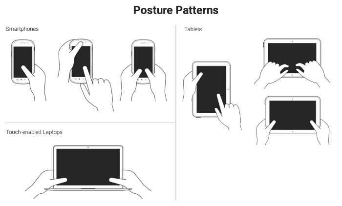

这些模式使我们能够定义布局内容的最佳方式，以便易于使用和访问。

了解用户的姿势模式将使我们能够了解我们的目标何时可以是正确的大小，甚至如果屏幕空间不足，则可以略小一些，或者如果需要精度，则可以略大一些，因为当有人使用大拇指时与使用食指时是不同的。

## 触摸区域

Luke 还谈到了“触摸区域”，基本上是设备上易于或难以触及的区域，这取决于姿势。

在所有主要类型的设备（智能手机、平板电脑和触摸笔记本电脑）中，理想的触摸区域为深绿色，*ok*触摸区域为浅绿色，难以触及的区域为黄色：

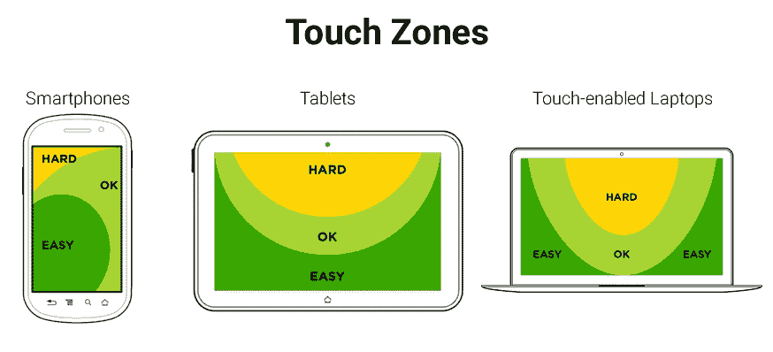

在 RWD 中，要彻底改变单个页面的布局，更不用说许多页面（至少目前还没有）像独立的应用程序那样，需要大量的工作。此外，有很高的可能性会对用户体验产生负面影响，并保持内容层次结构。

RWD 与内容策略密切相关，因此无论我们的网站/应用程序在哪种设备上查看，都需要保留内容层次结构。我们需要确保元素本身足够大，以便大手指的人能够正确使用。这些元素包括链接、按钮、表单字段、导航项、任何类型的控件（如分页、手风琴中的展开/折叠控件、选项卡系统等）。

现在，在 RWD 中非常多用途的一个网站/应用程序元素是菜单按钮。

为了触发导航，有一个非常特殊的元素，UX 社区对此有非常强烈的意见：*汉堡*图标（≡）。目前，我们将称其为更通用的名称：*导航*图标。我将其称为*导航*图标，因为它不一定是汉堡图标/图形，它可以是另一种类型的图标或一个词。

导航图标的位置、行为和设计以及导航项本身的变化与设计师的数量一样多。对其他人有效的方法未必对我们有效，反之亦然。因此，测试成为决定用户感觉舒适的方法。

尽管如此，有一些导航图标的 UX 指南值得一提，我们将在接下来看到。

# 导航图标- RWD 要考虑的基本指南

导航图标可以用许多方式表示。响应式网页设计从移动应用中借鉴了模式，因为小屏幕应用和网站有许多相似的隐喻。

让我们来看看常见的导航图标模式：

+   汉堡包图标。

+   单词“菜单”。

+   汉堡包图标加上单词“菜单”。

## 汉堡包图标

这是迄今为止最流行的用于表示导航按钮的图标：≡。

汉堡包图标是由 Norm Cox 于 1981 年创建的。Norm 设计这个图标的初衷是“……模仿显示的菜单列表的外观。”（[`gizmodo.com/who-designed-the-iconic-hamburger-icon-1555438787`](http://gizmodo.com/who-designed-the-iconic-hamburger-icon-1555438787)）。

换句话说，汉堡包图标的真正名称是“列表”图标。

现在，如果我们想一想，汉堡包图标在语义上是正确的，因为它确切地代表了触发时显示的内容：一系列项目。然而，一些用户体验研究表明，汉堡包图标并不像我们想象的那么有效，但我们在响应式网站和移动应用中随处可见它。

尽管汉堡包图标有一些缺点，但几乎每个人都能在不久的将来认出这个图标代表导航。

关键是，只要我们遵循目标大小建议，并使导航栏内的链接在小屏幕上易于点击，使用汉堡包图标并没有什么问题。

优点如下：

+   它很容易被某些人群识别，尤其是年轻人。

+   在设计中占用很少的空间。

+   它不依赖语言。

+   使用 Unicode 字符 2261（≡）制作起来很容易，全球支持率达到 96%。

缺点如下：

+   它不容易被某些人群识别，尤其是年长者。

+   尽管非常流行，很多人很难理解汉堡包图标代表菜单。

+   它促进了低发现性，因为网站的导航通常会被隐藏。

如果您打算使用汉堡包图标，不要使用任何类型的图像或任何带有边框或框阴影的 CSS 技术。保持简单。您只需要使用 Unicode 字符 2261（≡）。

在接下来的示例中，我们将使用一个众所周知的技术来隐藏内容（有一些变化以适应我们的演示）：凯勒姆方法。这种方法绝不是任何欺骗或类似的东西；我们并不打算用这种方法欺骗我们的用户或搜索引擎。我们实际上非常注意通过将文本留在标记中来提高导航图标的可访问性，以便使用辅助技术的用户仍然可以访问菜单。考虑以下示例。

HTML 如下：

```html
<button class="hamburger-icon"><span>Menu</span></button>SCSS
//Hamburger Icon
.hamburger-icon  {
    //Basic styling, modify if you want
    font-size: 40px;
    color: #666;
    background: #efefef;
    padding: 0 10px;
    border-radius: 3px;
    cursor: pointer;
    //Hamburger Icon
    &:before {
        content: '≡';
    }
    //Hide the term Menu from displaying without sacrificing accessibility
    span {
        display: inline-block;
        width: 0;
        height: 0;
        text-indent: -100%;
        overflow: hidden;
        white-space: nowrap;

    }
}
```

结果如下：


### 提示

出于可访问性原因，单词“菜单”应始终包含在标记中。当使用辅助技术（AT）的用户将焦点放在汉堡包图标上时，屏幕阅读器将朗读单词“菜单”。此外，将单词“菜单”包含在`<span>`标记中允许我们隐藏单词，而不会损害链接的可访问性。

## 单词菜单

网上一些非正式测试表明，使用单词“菜单”是解决汉堡包图标缺点的最可信赖的解决方案。

然而，需要注意的是，许多作者进行的研究和测试，比较了汉堡包图标和单词“菜单”，可能会产生误导，因为它们测试的是不同的视觉语言：图标与单词。

要使这些测试完全可靠，它们必须测试图标与图标，单词与单词。例如，测试汉堡包图标与向下指的箭头或单词“菜单”与单词“导航”。

让我们来看看单词“菜单”的优缺点。

优点如下：

+   这是不言自明的。

+   几乎任何人群的任何人都可以理解它的含义。

+   它可以用于任何语言。

+   它在设计中占用的空间很小。

缺点如下：

+   它可能会与图标系统冲突，因为它是一个单词。

考虑以下示例。

这是 HTML：

```html
<button class="word-menu">Menu</button>
```

这是 CSS：

```html
//Word "Menu"
.word-menu {
    //Basic styling, modify if you want
    display: inline-block;
    padding: 16px 8px;
    color: #666;
    font: 12px Arial, "Helvetica Neue", Helvetica, sans-serif;
    background: #efefef;
    border-radius: 3px;
    cursor: pointer;
}
```

这就是结果：

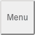

### 提示

在这个例子中，我使用了类名`.word-menu`来明确表示我对这本书的意图，但这不是为生产命名元素的正确方式。使用更有意义和通用的命名约定，例如`.menu-trigger`可能是一个替代方案。使用通用类名将允许我们在不改变标记的情况下使用任何导航图标设计。

## 汉堡图标加上单词菜单

汉堡图标与单词*菜单*讨论的一个替代方案是同时使用两者。一些人认为这样做可以兼顾两全。

优点是：

+   它是不言自明的。

+   几乎任何人都可以理解它的含义。

+   它可以用于任何语言。

+   它在设计中仍然占用很小的空间。

+   使用 Unicode 字符 2261（≡）很容易，全球支持率为 96%。

缺点是：

+   根据设计，单词*菜单*可能太小。

让我们看看我们可以用来表示这种模式的两种样式。

考虑以下示例。

HTML 如下：

```html
<button class="hamburger-icon-plus-menu style-1">Menu</button>
```

SCSS 如下：

```html
//Hamburger Icon Plus Word "Menu" – Style 1
.hamburger-icon-plus-menu {
    //Basic styling, modify if you want
    display: inline-block;
    font-family: Arial, "Helvetica Neue", Helvetica, sans-serif;
    background: #efefef;
    color: #666;
    border-radius: 3px;
    cursor: pointer;
}
.style-1 {
    padding: 16px 8px;
    font-size: 16px;
    //Hamburger Icon
    &:before {
        content: '≡ ';
    }
}
```

结果如下：


### 提示

注意在`≡`后面的空格，这样可以在不使用任何边距的情况下将图标与单词“菜单”分开。

考虑以下示例。

HTML 是：

```html
<button class="hamburger-icon-plus-menu style-2">Menu</button>
```

SCSS 是：

```html
//Hamburger Icon plus Word "Menu" – Style 2
.hamburger-icon-plus-menu {
    //Basic styling, modify if you want
    display: inline-block;

    font-family: Arial, "Helvetica Neue", Helvetica, sans-serif;
    background: #efefef;
    color: #666;
    border-radius: 3px;cursor: pointer;
}
.style-2 {
    padding: 4px 12px 6px;
    font-size: 10px;
    line-height: .8;
    text-align: center;
    //Hamburger Icon
    &:before {
        display: block;
        content: '≡';
        font-size: 40px;
    }
}
```

这就是结果：

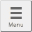

您可以在[`codepen.io/ricardozea/pen/f4ddc6443bc060004b58a7301aae83db`](http://codepen.io/ricardozea/pen/f4ddc6443bc060004b58a7301aae83db)上看到我在 CodePen 中创建的演示。

# RWD 的导航模式

RWD 最令人费解的特点之一是导航。它可以简单也可以复杂，取决于我们的需求。

在这一部分，我将向您展示如何构建三种常用的导航模式：

+   **切换导航**：这是基于 Brad Frost 的*切换菜单*演示（[`codepen.io/bradfrost/pen/sHvaz/`](http://codepen.io/bradfrost/pen/sHvaz/)）。

+   **侧边或屏幕外导航**：这是基于 Austin Wulf 的 SitePoint *纯 CSS 屏幕外导航菜单*演示（[`codepen.io/SitePoint/pen/uIemr/`](http://codepen.io/SitePoint/pen/uIemr/)）。

+   **基于 Flexbox 的导航**：这是我们的自定义解决方案。

在我们查看每个细节之前，让我们澄清一下关于上述模式的一些特点：

## 设计

在小屏幕上，所有导航模式都使用汉堡图标作为触发器，除了基于 Flexbox 的导航。在大屏幕上，所有示例中的导航栏都是水平链接组，链接居中。

为了改善切换和侧边导航的可用性，汉堡图标会添加/删除类`.active`，以提供视觉提示，显示该项目已被点击。这是通过一点 jQuery 完成的。

包括 jQuery 是这些演示的一部分，因此需要调用它才能使它们工作。

## 范围

所示的标记仅用于菜单本身，元素和指令，如`<html>`标记和 HTML5 Doctype 已经被故意省略。

这些示例适用于所有主要浏览器，这些浏览器支持相对先进的 CSS3 属性。它们不使用 FastClick 脚本来消除移动设备默认的 300 毫秒延迟。

供应商前缀已被省略；毕竟，我们应该使用 Autoprefixer 来处理这些问题。

## 第三方演示

由于没有必要重复造轮子，以下示例基于其他作者的演示，例如 Brad Frost 和 Austin Wulf 的演示。

然而，所有原始演示都已被分叉并*大幅*缩放、增强、清理、优化、重新设计和移植到 Sass，以适应本书的范围和风格。换句话说，您将看到的标记和代码已经专门为您进行了大量定制。

让我们开始吧。

## 侧栏或屏幕外导航

这是迄今为止在 RWD 和移动应用中最常用的导航模式。它使用汉堡图标作为菜单的触发器，当点击时触发菜单。这时，主容器向右滑动以显示左侧的菜单，再向左滑动以隐藏它。

这个示例不依赖于 JavaScript 来工作。但是，它使用了一些非语义元素来使其工作：`<input>`和`<label>`元素。为了支持这种方法，它使用了`：checked`伪类，在各方面都有完美的支持。

这是我们的 HTML：

```html
<!DOCTYPE html>
<html>
<head>
    <meta charset="UTF-8">
    <meta name="viewport" content="width=device-width, initial-scale=1">
    <script src="img/jquery.min.js"></script>
</head>
<body>
    <!-- Checkbox whose checked/unchecked states trigger the navigation -->
    <input type="checkbox" id="nav-trigger" class="nav-trigger">
    <!-- Hamburger icon -->
    <label for="nav-trigger" class="label-trigger"><span>Menu</span></label>
    <!-- Navigation -->
    <nav role="navigation">
        <ul class="menu">
            <li><a href="#">Link 1</a></li>
            <li><a href="#">Link 2</a></li>
            <li><a href="#">Link 3</a></li>
            <li><a href="#">Link 4</a></li>
            <li><a href="#">Link 5</a></li>
        </ul>
    </nav>
    <!-- Main container -->
    <main class="main-container" role="main">
        <h1>The "Off-Canvas" or "Off-Screen" Navigation</h1>
        <p>On <strong>small screens</strong>, the menu is triggered with a hamburger icon. The menu slides left/right.</p>
        <p>On <strong>large screens</strong> starting at 40em (640px), the menu is a horizontal nav.</p>
    </main>
</body>
</html>
```

这是我们的 SCSS：

```html
*, *:before, *:after { box-sizing: border-box; }
//Globals
html, body {
    height: 100%;
    width: 100%;
    margin: 0;
}
//Mobile-first Media Query Mixin
@mixin forLargeScreens($media) {
    @media (min-width: $media/16+em) { @content; }
}
//Mixin for animating the hamburger icon
@mixin animation-nav-icon ( $direction: left, $duration: .2s) {
    transition: $direction $duration;
}
//Menu itself
.menu {
    width: 100%;
    height: 100%;
    margin: 0;
    padding: 0;
    position: fixed;
    top: 0;
    right: 0;
    bottom: 0;
    left: 0;
    z-index: 0;
    list-style: none;
    @include forLargeScreens(640) {
        max-width: 980px;
        min-height: 50%;
        margin: 10px auto 0;
        position: relative;
        text-align: center;
        border: #999 1px dotted;
    }
    //List items
    li {
        width: 100%;
        border-bottom: 1px dotted #999;
        @include forLargeScreens(640) {
            display: inline;
            border: none;
        }
        //Links themselves
        a {
            display: block;
            padding: 1em;
            color: #2963BD;
            text-decoration: none;
            @include forLargeScreens(640) {
                display: inline-block;
            }
        }
    }
}
//Main Container
.main-container {
    max-width: 980px;
    min-height: 100%;
    margin: auto;
    padding: 20px 0 20px 80px;
    position: relative;
    top: 0;
    bottom: 100%;
    left: 0;
    z-index: 1;
    background: #eee;
    @include forLargeScreens(640) {
       padding: 20px;
    }
}
//Navigation Trigger - Hide the checkbox
.nav-trigger {
    position: absolute;
    clip: rect(0, 0, 0, 0);
}
//Label that triggers the checkbox
.label-trigger {
    position: fixed;
    left: 10px;
    top: 10px;
    z-index: 2;
    height: 50px;
    width: 50px;
    cursor: pointer;
    background: #fff;
    border-radius: 2px;
    border: 1px solid #ccc;
    //Hamburger icon
    &:before {
        display: block;
        padding-top: 25px;
        text-align: center;
        content: '≡';
        font-size: 3em;
        line-height: 0;
    }
    //Active hamburger icon
    &.active {
        background: #333;
        color: #fff;
    }
    //Hide the term 'Menu' from displaying without sacrificing accessibility
    span {
        display: inline-block;
        text-indent: -100%;
        overflow: hidden;
        white-space: nowrap;
    }
}
//Animate the menu
.nav-trigger {
    & + label {
        @include animation-nav-icon;
        //Hide the checkbox and label in large screens
        @include forLargeScreens(640) {
            display: none;
        }
    }
    //Animate the label when checkbox is checked
    &:checked + label {
        left: 215px;
    }
    //Animate the main container when checkbox is checked
    &:checked ~ .main-container {
        left: 200px;
        box-shadow: 0 0 5px 1px rgba(black, .15);
    }
}
//Animate the main container
.main-container {
    @include animation-nav-icon;
}
//Avoid horizontal scrollbars due to repositioning of elements
body, html { overflow-x: hidden; }
//Styling stuff not needed for demo
html, body { font-family: Arial, "Helvetica Neue", Helvetica, sans-serif; }
h1, p { margin: 0 auto 1em; }
p { line-height: 1.5; }
```

这是 jQuery 脚本：

```html
$(function() {
    //Set up the click behavior
    $(".label-trigger").click(function() {
        //Toggle the class .active on the hamburger icon
        $(this).toggleClass("active");
    });
});
```

让我们来看一下截图。

这是在*折叠*状态下小屏幕上的样子：

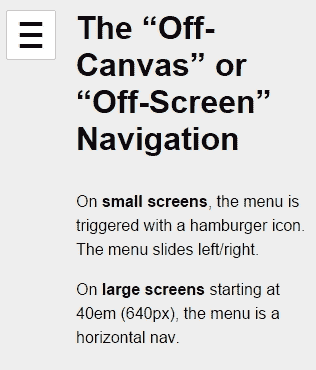

这是在*展开*状态下的样子：

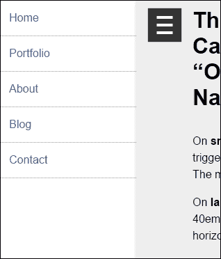

这是在大屏幕上的样子：

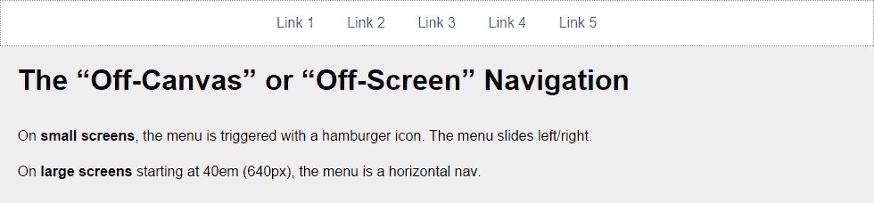

您可以在[`codepen.io/ricardozea/pen/fd504cbcf362069320d15a4ea8a88b27`](http://codepen.io/ricardozea/pen/fd504cbcf362069320d15a4ea8a88b27)看到我创建的演示。

## 切换导航

在切换模式中，当点击汉堡图标时，导航栏会下滑，链接会堆叠。再次点击汉堡图标时，导航栏会折叠。

HTML 如下：

```html
<!DOCTYPE html>
<html>
<head>
    <meta charset="UTF-8">
    <meta name="viewport" content="width=device-width, initial-scale=1">
    <script src="img/jquery.min.js"></script>
</head>
<body>
    <!-- Hamburger icon -->
    <button class="menu-link"><span>Menu</span></button>
    <!-- Navigation -->
    <nav id="menu" class="menu" role="navigation">
        <ul>
            <li><a href="#">Link 1</a></li>
            <li><a href="#">Link 2</a></li>
            <li><a href="#">Link 3</a></li>
            <li><a href="#">Link 4</a></li>
            <li><a href="#">Link 5</a></li>
        </ul>
    </nav>
    <!-- Main container -->
    <main class="main-container" role="main">
        <h1>The Toggle Navigation</h1>
        <p>On <strong>small screens</strong>, the menu is triggered with a hamburger icon. The menu slides down/up.</p>
        <p>On <strong>large screens</strong> starting at 40em (640px), the menu is a horizontal nav.</p>
    </main>
</body>
</html>
```

SCSS 如下：

```html
*, *:before, *:after { box-sizing: border-box; }
//Mobile-first Media Query Mixin
@mixin forLargeScreens($media) {
    @media (min-width: $media/16+em) { @content; }
}
//General Styling
.main-container, .menu {
    width: 98%;
    max-width: 980px;
    margin: auto;
    padding: 20px;
    background: #eee;
}
//Link that triggers the menu
.menu-link {
//Change to float: left; if you want the hamburger menu on the left side
    float: right;
    margin: 0 1% 5px 0;
    padding: 1.5em 1em 1em;
    background: #f6f6f6;
    line-height: 0;
    text-decoration: none;
    color: #333;
    border-radius: 2px;
    cursor: pointer;
    //Hamburger icon
    &:before {
        display: block;
        padding: 10px 0;
        content: '≡';
        font-size: 3em;
        line-height: 0;
    }
    //Active hamburger icon
    &.active {
        background: #333;
        color: #fff;
    }
    //Hide the term 'Menu' from displaying without sacrificing accessibility
    span {
        display: inline-block;

		text-indent: -100%;
        overflow: hidden;
        white-space: nowrap;
    }
    //On large screens hide the menu trigger
    @include forLargeScreens(640) {
        display: none;
    }
}
//If JavaScript is available, hide the menu.
.js .menu {
    overflow: hidden;
    max-height: 0;
    @include forLargeScreens(640) {
        max-height: inherit;
    }
}
//Menu itself
.menu {
    padding: 0;
    clear: both;
    transition: all .3s ease-out;
    //Define height of the menu
    &.active {
        max-height: 17em;
    }
    //Normalize the unordered list and add a bit of styling
    ul {
         margin: 0;
         padding: 0;
         list-style-type: none;
         border: 1px #999 dotted;
         border-bottom: none;
         text-align: center;
         //In large screens remove the border
        @include forLargeScreens(640) {
            background: #fff;
       }
    }
    //List items
    li {
      //Links themselves
      a {
         display: block;
         padding: 1em;
         border-bottom: 1px #999 dotted;
         text-decoration: none;
         color: #2963BD;
         background: #fff;
         @include forLargeScreens(640) {
            border: 0;
            background: none;
         }
      }
      //On large screens make links horizontal
      @include forLargeScreens(640) {
    display: inline-block;
    margin: 0 .20em;
       }
    }
}

//Styling stuff not needed for demo
body { font-family: Arial, "Helvetica Neue", Helvetica, sans-serif; }
p { line-height: 1.5; }
h1 { margin: 0; }
```

jQuery 如下：

```html
$(function() {
    //Add class .js to the body if JS is enabled
    $("body").addClass("js");
    //Set up the click behavior
    $(".menu-link").click(function() {
        //Toggle the class .active on the hamburger icon
        $(this).toggleClass("active");
       //Toggle the class .active on the menu to make it slide down/up
        $(".menu").toggleClass("active");
    });
});
```

让我们来看一下截图。

这是在小屏幕上*折叠*状态下的样子：

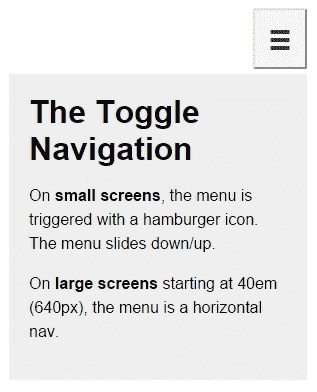

这是*展开*状态下的样子：

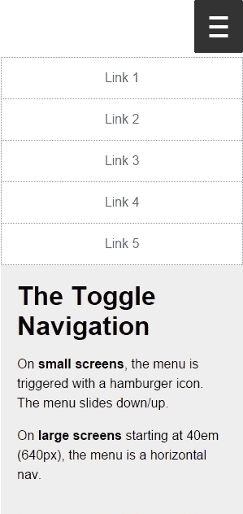

这是在大屏幕上的样子：

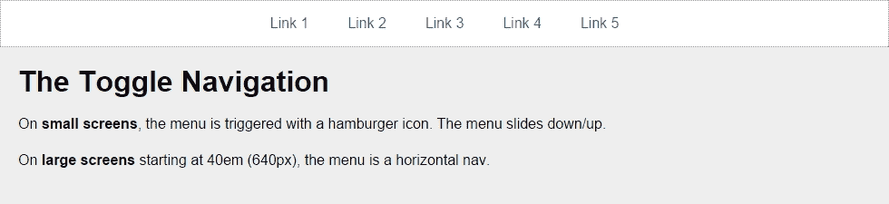

您可以在[`codepen.io/ricardozea/pen/e91a5e6ea456d41f4128d9bd405ccaa0`](http://codepen.io/ricardozea/pen/e91a5e6ea456d41f4128d9bd405ccaa0)看到我创建的演示。

您还可以访问[`responsive-nav.com/`](http://responsive-nav.com/)了解漂亮的切换导航功能。

## 基于 Flexbox 的导航

这个使用 Flexbox 的自定义解决方案非常灵活，不一定需要使用媒体查询。另外两个菜单解决方案（切换导航和侧栏导航）需要媒体查询。

使用这个解决方案，菜单项会适应可用空间，使目标区域尽可能大，自动增强菜单的可用性。这个基于 Flexbox 的解决方案的另一个主要优点是它不依赖于 JavaScript。

这是 HTML：

```html
<!DOCTYPE html>
<html>
<head>
    <meta charset="UTF-8">
    <meta name="viewport" content="width=device-width, initial-scale=1">
</head>
<body>
    <nav role="navigation">
        <ul class="menu">
            <li><a href="#">Link 1</a></li>
            <li><a href="#">Link 2</a></li>
            <li><a href="#">Link 3</a></li>
            <li><a href="#">Link 4</a></li>
            <li><a href="#">Link 5</a></li>
        </ul>
    </nav>
    <!-- Main container -->
    <main class="main-container" role="main">
        <h1>The Flexbox-based Navigation</h1>
        <p>On both <strong>small and large screens</strong> the menu and its items are always visible.</p>
        <p>However, on <strong>small screens</strong> the links are more clearly defined and occupy all the available space.</p>
   </main>
</body>
</html>
```

现在是 SCSS：

```html
*, *:before, *:after { box-sizing: border-box; }
//Mobile-first Media Query Mixin
@mixin forLargeScreens($media) {
    @media (min-width: $media/16+em) { @content; }
}
//Menu itself
.menu {
    display: flex;
    flex-wrap: wrap;
    justify-content: space-around;
    max-width: 980px;
    margin: auto;
    padding: 2px;
    list-style: none;
    border: #999 1px dotted;
    //List items
    li {
        //Expand to use any available space
        flex-grow: 1;
        margin: 3px;
        text-align: center;
        flex-basis: 100%;
        @include forLargeScreens(320) {
            flex-basis: 30%;
        }
        @include forLargeScreens(426) {
            flex-basis: 0;
        }
        //Links themselves
        a {
           display: block;
           padding: 1em;
           color: #2963bd;
           text-decoration: none;
           background: #eee;
           @include forLargeScreens(426) {
              background: none;
           }
        }
    }
}
//Main Container
.main-container {
    max-width: 980px;
    margin: auto;
    padding: 20px;
    background: #eee;
}

//Styling stuff not needed for demo
body { margin: 8px; font-family: Arial, "Helvetica Neue", Helvetica, sans-serif; }
p { line-height: 1.5; }
h1 { margin: 0; }
```

让我们来看一下截图。

这是在小屏幕（320px）上的样子：

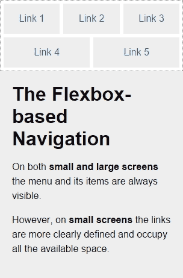

这是在小屏幕（426px）上的样子：

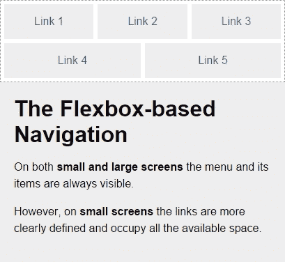

这是在大屏幕（980px）上的样子：

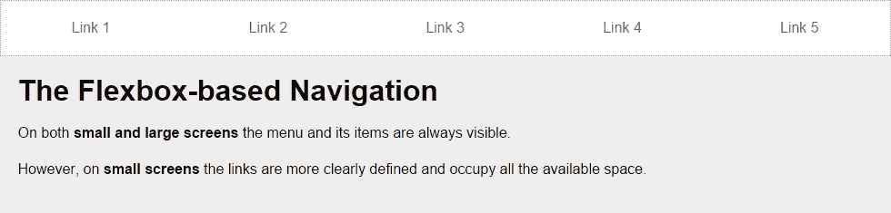

您可以在[`codepen.io/ricardozea/pen/022b38c6c395368ec4befbf43737e398`](http://codepen.io/ricardozea/pen/022b38c6c395368ec4befbf43737e398)看到我创建的演示。

# 总结

我们现在已经掌握了使用 HTML5 和 CSS3 进行 RWD 的一半。这是一个*巨大*的里程碑！非常感谢您走到这一步！

RWD 显然不仅仅是媒体查询、Sass 混合和 CSS 网格。它还涉及理解我们目标区域的不同尺寸，控件的位置（链接、按钮、表单字段等），以及不同设备中的触摸区域。

创建菜单按钮总会有不同的方法，只要确保功能在任何屏幕尺寸上都不会出现问题。一旦我们定义了菜单按钮的样式，我们就可以确定哪种导航模式最适合我们的内容和用户。

在菜单按钮或导航模式方面，实际上并没有一个单一的、最佳的解决方案；一切都取决于每个项目的具体条件。我建议的是，无论你构建什么，都要确保始终保持高水平的浏览器支持、可扩展性和性能，这样用户就可以获得很好的体验，客户/公司也可以实现其目标。

现在我们谈论性能，下一章我们将讨论 RWD 的“丑孩子”：图片。

让我们跳舞吧！
