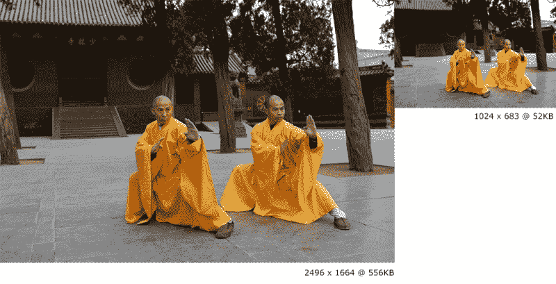
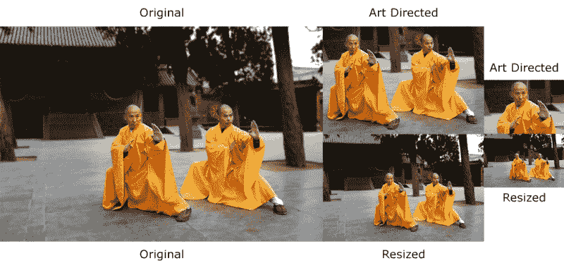

# 第六章：在响应式网页设计中使用图像和视频

我一直把图像称为**RWD**的“丑陋之子”。为什么？直到最后一刻，我总是试图避免处理它们。我要使用图像精灵吗？如果是的话，我应该将我的透明 PNG 导出为 8 位还是 24 位，或者 32 位？一些旧版 IE 不支持带有 alpha 通道的 PNG，所以我必须导出一个 GIF 精灵。我可以使用 SVG，但 IE8 及更早版本不支持 SVG。我可以使用图标字体，但如果图标字体加载失败会怎么样？那我就得查一些分析数据。有一种新的高密度屏幕的*iDevice*？现在我每次都得导出两个（或更多）图像。太好了！但我不能为小屏设备提供超过正常尺寸图像两倍大小的高质量图像！是的，它可能看起来很好，但下载速度会很慢，他们甚至在第一个 H1 加载之前就可能离开网站。

你明白了。这只是刚刚开始涉及响应式网页设计中媒体工作的冰山一角。

其中一些想法今天仍然非常活跃，但多年来我学到了一些常识，并且紧跟解决所有这些问题的技术，拥有一个简单直接的处理图像（和视频）的系统可以走得更远。

和其他章节一样，我们将保持简单但有意义。在涉及图像时并没有银弹，特别是在响应式网页设计中，我们可能整天都在这里，这绝对不是我们这本书想要的。我希望你尽快构建出色的响应式网站。但我鼓励你花一些时间研究更多关于响应式网页设计中图像的内容；这确实是网页设计和开发者社区中一个令人难忘的话题。

在本章中，我们将讨论以下主题：

+   导出图像并在保持图像质量的同时显著减小其最终文件大小的技巧。

+   如何使用`srcset`和`sizes`属性，以及`<picture>`元素。

+   使用`Retina.js`。

+   制作响应式视频。

+   使用`FitVids.js`。

+   使用矢量格式：图标字体和 SVG。

+   使用正确的 CSS 图像替换技术。

现在，这是我们在示例中要使用的图像：


这些了不起的人物是中国少林寺的两位功夫大师。他们的名字是释德如和释德阳。

### 注意

*释德如和释德阳*由释德如（刘祥阳）拍摄，他是这张照片的唯一所有者和版权持有者，该照片是在少林寺前门拍摄的。它在维基百科上以 CC BY-SA 3.0 许可证发布。可以在[`en.wikipedia.org/wiki/Shaolin_Kung_Fu#/media/File:Shi_DeRu_and_Shi_DeYang.jpg`](http://en.wikipedia.org/wiki/Shaolin_Kung_Fu#/media/File:Shi_DeRu_and_Shi_DeYang.jpg)找到。

由于我们还在用 HTML5 和 CSS3*精通*响应式网页设计，我觉得这张照片与我们的使命非常契合。

我将要描述的功夫大师的原始图像的属性将有助于理解为响应式网页设计优化图像前后效果设定基线。

以下是原始图像的属性：

+   这是一张 24 位 JPG 图像。

+   文件大小为 556KB，但由于 JPG 算法的魔力而被压缩（解压后约为 12MB）。

+   尺寸为 2496 x 1664 像素，约为 4.15 百万像素。换个角度看，这张图像的分辨率比我客厅里的 55 英寸 LED 电视还要高。

在本书结束时，我向你保证两件事。一，你将绝对准备好构建响应式网站和应用。二，当是时候开始一个新项目时，你将从座位上站起来，并摆出这些大师们正在做的同样的姿势。

图像编辑超出了本书的范围，以下步骤将需要某种形式的图像处理。在这一点上，您可以使用您喜欢的图像编辑器。我个人使用 Adobe Fireworks（确实如此），但绝大多数人使用 Photoshop。

如果您不使用其中任何一个，您可以随时使用**GNU 图像处理软件**（**GIMP**）或 Paint.NET-两者都是免费的。您可以从这里下载它们：

+   GIMP：[`www.gimp.org/`](http://www.gimp.org/)

+   Paint.NET：[`www.getpaint.net/`](http://www.getpaint.net/)

您还可以使用在线图像编辑工具。但是，我必须承认，我从未使用过其中任何一个，所以我无法推荐任何一个。在这一点上，我可以说的是尝试其中一些，并选择最适合您需求的那个。

让我们开始吧。

# 用于 RWD 图像文件大小减小的提示

在设计中，创建图像副本的经验法则是从大到小进行，而不是相反。换句话说，图像越大，其后续副本的质量就越好。

## 调整大小

仅通过将图像从 2496 x 1664 像素调整为 1024 x 683 像素，文件大小现在为 331 KB。与 556 KB 相比，这几乎是文件大小的 40％减少。这是一个巨大的改进，但我们还没有到达目标。

## 模糊背景

模糊背景实际上本身就非常有效，但从*艺术指导*的角度来看，它还有另一个好处：它有助于吸引对图像的重要部分的注意力。

在模糊背景之后，文件现在重量为 185 KB。与 556 KB 相比，文件大小减少了约 67％。我们开始有所进展了。

这是带有模糊背景的新图像：


优化的巨大胜利！

## 暗化或变亮不重要的区域

暗化或变亮不重要的区域非常主观，许多人可能不一定同意。在特殊情况下，这个过程-就像背景模糊技术一样-可以帮助减小文件大小并突出图像的重要部分。

我们基本上试图通过暗化或变亮图像来减少颜色的数量，从而创建*纯色*区域，或者至少尽可能纯色。换句话说，我们正在减少对比度。谨慎使用这个技巧。

在我们的功夫宗师的情况下，在暗化背景中不重要的部分后，图像现在重量为 178 KB。诚然，这与以前的过程没有太大不同（只有 7 KB 的差异），但是我们可以从图像中提取的每一个千字节而不影响质量都是一件好事，178 KB 大约是文件大小的 68％减少。

这是在稍微暗化背景后图像的外观：


每一个千字节都很重要。

## 优化图像

这是过程的最后一步。这一步实际上可以分为两个较小的步骤。

### 使用 Adobe Fireworks（可选）

保存一个在质量与文件大小之间平衡的 JPG。没有确定的值可以始终应用于每个单独的图像。这一切都是即兴发生的。在执行此步骤时，您不希望以太低的质量保存图像，因为图像将经历另一个优化步骤。

我实际上要使用的是 Adobe 在 2013 年 5 月停止开发的软件：Fireworks。

Fireworks 以其优越的图像优化引擎而闻名，比起 Photoshop，我自己进行了测试，Fireworks 的压缩与质量总是表现最好。Fireworks 对于今天的网页设计流程和工作流程与任何其他图像编辑软件一样相关。因此，请放心使用它。

从 Fireworks 以 80％的质量导出图像后，功夫宗师的图像现在只有 71 KB。与原始的 556 KB 相比，文件大小减少了约 87％。

### 压缩图像

通过另一个图像优化工具运行图像，可以是一个独立的应用程序，如 Mac 的 ImageOptim 或 Windows 的 Radical Image Optimization Tool（RIOT），或者通过在线服务，如[`tinypng.com/`](https://tinypng.com/)或[`www.jpegmini.com/`](http://www.jpegmini.com/)。

我们将使用[`tinypng.com/`](https://tinypng.com/)在线图像压缩服务。在通过[`tinypng.com/`](https://tinypng.com/)从 Fireworks 导出的图像后，文件大小现在约为 52 KB，比原始的 556 KB 减少了约 91%。这对于图像优化来说是一个巨大的胜利。

### 提示

如果你没有先通过 Fireworks 运行图像，不要担心。即使您的图像可能会稍大一些，它仍然会被极大地优化，这是我们的目标。

这是 556 KB 图像和最终 52 KB 图像之间的前（左）后（右）比较：



# 第三方图像调整服务

我们必须承认，如果手动优化图像的过程在需要调整大小和优化许多图像的情况下可能会非常乏味和耗时，那么手动操作可能不是最佳选择。

有一些第三方和服务器端服务可以自动为我们完成这个过程。我们将把如何实现这些服务的教程留给另一本书。但是，我们将列出一些最受欢迎的服务，以便您在需要深入了解时有一个参考。

以下是一些第三方图像调整大小服务的示例：

+   **Sencha.io Src**来自 Sencha.com ([`www.sencha.com/learn/how-to-use-src-sencha-io/`](http://www.sencha.com/learn/how-to-use-src-sencha-io/))

+   **ReSRC**由 Dom Fee 和 Ed Thurgood ([`www.resrc.it/`](http://www.resrc.it/))

+   **WURFL** Image Tailor ([`web.wurfl.io/#wit`](http://web.wurfl.io/#wit))

以下是一些服务器端（`.htaccess`和/或`.php`）图像调整大小服务的示例：

+   Matt Wilcox 的自适应图像 ([`adaptive-images.com/`](http://adaptive-images.com/))

+   RESS.io ([`ress.io/`](http://ress.io/))

# <picture>元素和 srcset 和 sizes 属性

首先，我要说的是，在 RWD 中没有 100%的最佳解决方案。这是因为当前对推荐属性的支持不足，或者因为资产双重下载。尽管戴夫·牛顿在[`ww1.smashingmagzine.com/`](http://ww1.smashingmagzine.com/)的文章中，*如何避免响应式图像中的重复下载*，试图解决这个问题（[`www.smashingmagazine.com/2013/05/10/how-to-avoid-duplicate-downloads-in-responsive-images/`](http://www.smashingmagazine.com/2013/05/10/how-to-avoid-duplicate-downloads-in-responsive-images/)）。

然而，这种解决方案非常冗长。如果你必须处理许多图像，这种解决方案可能不是最佳选择，允许双重下载开始变得更有意义。每个项目都是不同的，因此尽可能做出最明智的决定非常重要。

一旦浏览器供应商决定完全支持这里提到的任何解决方案，就不需要担心双重下载或任何类型的 polyfill 了。

<picture>元素和 srcset 和 sizes 属性由**响应式图像社区组**（**RICG**）维护，现在已成为 HTML 规范的一部分。换句话说，我们可以在没有任何类型的 polyfill 的情况下使用它们，并且可以确信现代浏览器将支持它们。至少在某种程度上是这样。

我们需要使用 polyfill 的唯一原因是为了支持那些（传统和现代的）尚未实现对它们的支持的浏览器。

### 提示

`<picture>`元素和`srcset`属性都有一个针对不支持它们的浏览器的回退功能。您可以选择使用 polyfill，但不是必须的。如果您认为使用 polyfill 可以增强用户体验，那就尽管使用。阅读 Picturefill polyfill 的创建者 Scott Jehl 的这篇文章（[`www.filamentgroup.com/lab/to-picturefill.html`](http://www.filamentgroup.com/lab/to-picturefill.html)）。

现在有很多 polyfill，这里是我们今天可以使用的一些简要列表：

+   由 Scott Jehl 的 Picturefill（由 RICG 推荐：[`scottjehl.github.io/picturefill/`](http://scottjehl.github.io/picturefill/)）提供支持

+   由 Andrea Verlicchi 的 PicturePolyfill（[`verlok.github.io/picturePolyfill/`](http://verlok.github.io/picturePolyfill/)）提供支持

+   由 Alexander Farkas 的 respimage（[`github.com/aFarkas/respimage`](https://github.com/aFarkas/respimage)）提供支持

在 Web 设计和 Web 开发社区中，一些人强烈认为，考虑到新的 HTML 元素（`<picture>`）并不是解决我们在 RWD 中遇到的图像问题的解决方案。他们认为解决方案应该来自已经存在的``标签。

### 提示

`sizes`属性也可以与`<picture>`元素一起使用，但我们将专注于在``标签中使用`sizes`属性。

对我们来说很好，解决方案有两种。使用哪种方法来负责负责您的图像并不重要，重要的是您应该使用其中一种方法。如果您已经在使用，那太棒了。如果没有，不要担心。以下的解释将帮助您解决任何关于这个问题的疑问。

## 何时使用<picture>，何时使用 srcset

何时使用`<picture>`，何时使用`srcset`？这是一个非常合理的问题，我自己在第一次听到这些术语时也无法理解。所以我决定在俄亥俄州戴顿市的一次布拉德·弗罗斯特（Brad Frost）的研讨会上向他请教。

推荐的方法归结为这个概念：艺术指导。在响应式图像中，艺术指导基本上意味着您有不同的图像，以某种方式裁剪，以便图像的不太重要的部分被剔除，从而专注于重要的部分。

这与只调整相同的图像不同。当然，您可以使用任何您想要的方法，但为了保持简单，当您想要提供艺术指导图像时，可以使用`<picture>`元素，当您只想提供相同图像的调整版本时，可以使用`srcset`属性。

在我们深入标记之前，让我们看一个关于艺术指导图像与使用功夫宗师照片的调整图像的视觉示例：



让我们看看这里发生了什么。原始图像周围有很多空间，我们可以看到后面的树和建筑物。调整大小的版本保持了原始图像的所有方面和比例 1:1。

然而，艺术指导图像有很多不同之处。第一个艺术指导图像被裁剪以显示两位宗师的特写；第二个艺术指导图像被裁剪得更多，以突出对 Shi DeRu（左侧的宗师）的关注。我们本可以裁剪图像以便关注 Shi DeYang（右侧的宗师），但这是我想要给图像的“艺术指导”。这是一个主观的决定，但基于坚定的意图。

现在，让我们看看*Picturefill polyfill/script*的实际效果。

## 实施 Picturefill polyfill

我们需要做的第一件事是下载 JavaScript 文件，可以从[`github.com/scottjehl/picturefill/blob/2.3.0/dist/picturefill.min.js`](https://github.com/scottjehl/picturefill/blob/2.3.0/dist/picturefill.min.js)下载。

然后，我们需要做的就是将它包含在文档的`<head>`部分中：

```html
<!DOCTYPE html>
<!--[if IE 8]> <html class="no-js ie8" lang="en"> <![endif]-->
<!--[if IE 9]> <html class="no-js ie9" lang="en"> <![endif]-->
<!--[if gt IE 9]><!--><html class="no-js" lang="en"><!--<![endif]-->
<head>
    <meta charset="utf-8">
    <meta name="viewport" content="width=device-width, initial-scale=1">
    <meta http-equiv="X-UA-Compatible" content="IE=edge">
    <script src="img/picturefill.min.js"></script>
    <title>Picturefill polyfill</title>
</head>
```

## 使用<picture>元素

使用`<picture>`元素时，您（作者）告诉浏览器在哪个断点使用哪个图像。这样做的好处是，我们可以通过使用媒体查询来精确定义何时显示某个图像。媒体查询的工作方式与 CSS 中使用的媒体查询完全相同，甚至看起来完全相同。

这是一个基本的`<picture>`片段的样子：

```html
<picture>
    <source srcset="images/grandmasters-small.jpg" media="(max-width: 40em)">
    <source srcset="images/grandmasters-medium.jpg" media="(max-width: 64em)">
    <source srcset="images/grandmasters-default.jpg">
    
</picture>
```

即使使用了 polyfill，IE9 对`<picture>`元素也存在问题。尽管听起来很奇怪，但我们需要在 IE9 中插入一个`<video>`标签以正确工作。

这是为 IE9 修改后的标记样式：

```html
<picture>
 <!--[if IE 9]><video style="display: none;"><![endif]-->
    <source srcset="images/grandmasters-small-ad.jpg" media="(max-width: 40em)">
    <source srcset="images/grandmasters-medium-ad.jpg" media="(max-width: 64em)">
    <source srcset="images/grandmasters-default.jpg">
    <!--[if IE 9]></video><![endif]-->
    
</picture>
```

正如您所看到的，我还突出显示了``标签。这是那些不支持`<picture>`元素的浏览器的回退图像。

请记住的一件事是，不久之前，这个回退图像在一些现代浏览器中导致了双重下载。我的最后测试显示，在 Chrome 和 Firefox 中并非如此，它们支持`<picture>`元素。因此，请确保您运行所有必要的测试，以查看您的情况，然后考虑解决方案，如果您需要支持那些旧版浏览器。

这是我在 CodePen 上创建的演示：[`codepen.io/ricardozea/pen/cf6c0965785d552bad5e200acb761ffe`](http://codepen.io/ricardozea/pen/cf6c0965785d552bad5e200acb761ffe)

## 使用`srcset`和`sizes`属性

`srcset`和`sizes`属性实际上来自`<picture>`规范，但在``元素中实现。使用`srcset`和`sizes`属性时，浏览器会决定在每种特定情况下使用哪个图像。如果需要，您还可以使用媒体查询，尽管不是必需的。单词`vw`表示*视口宽度*，用于让浏览器知道它应该根据视口宽度的百分比显示图像。如果看到类似`80vw`的东西，这意味着图像应该是当前视口宽度的 80%。

`w`描述符表示*图像的宽度*。如果看到类似`255w`的东西，浏览器将了解特定图像的宽度为 255px。

让我们看看带有`srcset`和`sizes`属性的``标签：

```html

```

`rsz`这几个字母是*resize*一词的缩写。这是因为对于在 RWD 中只会被调整大小的图像，`srcset`属性使事情变得简单一些。

以下标记被截断，以便更容易专注于特定的解释。

我们首先看到的是已知的`src`属性，它充当回退图像：

```html

```

为图像添加`alt`属性对于使用辅助技术的用户来说总是一个良好的可访问性实践。此外，如果图像没有加载，浏览器可以显示这个文本。

### 提示

属性的顺序并不重要。换句话说，你可以先使用`srcset`，然后是`alt`，然后是`sizes`，然后是`src`属性（或者反之亦然）。

### 使用 srcset 定位高密度屏幕

高密度屏幕将永远是 RWD 世界中我们无法摆脱的东西。所以如果你无法打败它们，就加入它们。

这是一个解决普通和高密度屏幕的片段：

```html

```

正如你所看到的，这是一个更短更简洁的标记。它真的很简单明了：在没有`srcset`支持的情况下使用备用图像。如果有支持，那么如果设备具有普通密度显示，则使用`1x`图像。如果设备具有高密度显示，那么必须使用`2x`图像。如果我们支持的设备密度甚至更高，就应该添加一个 3x 后缀。

`sizes`属性是不是必需的。如果你的设计或条件需要使用`sizes`属性，你可以自由使用它。

这是我在 CodePen 上为此创建的演示：[`codepen.io/ricardozea/pen/a13993f05a4cdc5f714a311a94f48a69`](http://codepen.io/ricardozea/pen/a13993f05a4cdc5f714a311a94f48a69)

## `<picture>`与`srcset`

一些网页设计师和开发人员表示，在 HTML 中使用媒体查询，就像我们在`<picture>`和`srcset`中看到的那样，违反了关注点分离的原则：样式和标记应始终保持分离，独立的资源。

正如我之前提到的，其他人认为新的 HTML 元素是不必要的，任何解决方案都应该基于增强和扩展已经存在的元素，比如``标签。

我只能说，在最后，这一切都无关紧要。重要的是，作为网页设计师和开发人员，我们应该利用我们手头的一切资源来让用户满意，创造令人难忘的体验，同时遵循持久实施的最佳实践。

# 使用 Retina.js 在运行时将 1x 图像替换为 2x 图像

`Retina.js`脚本是那些使事情变得更简单的脚本之一，有时你会想为什么响应式图像如此困难。

如果你还没有准备好处理`<picture>`和/或`srcset`和`sizes`属性，我不怪你。这很可怕，但我建议你继续努力理解这些工具，因为这是响应式图像的最新技术。

`Retina.js`脚本是由 Imulus 的人员开发的（[`imulus.com/`](http://imulus.com/)）。`Retina.js`脚本不仅仅是 JavaScript 解决方案；他们还有一个 Sass mixin，可以在不依赖 JavaScript 的情况下产生相同的结果。

让我们先看一下 JavaScript 解决方案。

## Retina.js - 一个 JavaScript 解决方案

使用这个脚本非常简单。我们需要从[`github.com/imulus/retinajs/blob/master/dist/retina.min.js`](https://github.com/imulus/retinajs/blob/master/dist/retina.min.js)下载脚本。

然后，我们将脚本放在 HTML 的底部，就在闭合的`<body>`标签之前：

```html
<!DOCTYPE html>
<!--[if IE 8]> <html class="no-js ie8" lang="en"> <![endif]-->
<!--[if IE 9]> <html class="no-js ie9" lang="en"> <![endif]-->
<!--[if gt IE 9]><!--><html class="no-js" lang="en"><!--<![endif]-->
<head>
    <meta charset="utf-8">
    <meta name="viewport" content="width=device-width, initial-scale=1">
    <meta http-equiv="X-UA-Compatible" content="IE=edge">
    <title>Retina.js - JavaScript Solution</title>
</head>
<body>
   ...
   <script src="img/retina.min.js"></script>
</body>
</html>
```

### 提示

`Retina.js`脚本不依赖于框架。换句话说，它不需要 jQuery 或 Mootools 或 Dojo 或任何框架来……嗯，工作。

然后，我们在我们的标记中添加一个图像：

```html
<!DOCTYPE html>
<!--[if IE 8]> <html class="no-js ie8" lang="en"> <![endif]-->
<!--[if IE 9]> <html class="no-js ie9" lang="en"> <![endif]-->
<!--[if gt IE 9]><!--><html class="no-js" lang="en"><!--<![endif]-->
<head>
    <meta charset="utf-8">
    <meta name="viewport" content="width=device-width, initial-scale=1"><meta http-equiv="X-UA-Compatible" content="IE=edge">
    <title>Retina.js - JavaScript Solution</title>
</head>
<body>
   
   <script src="img/retina.min.js"></script>
</body>
</html>
```

就是这样！我们不必对标记做任何事情，除非我们想要排除被替换的图像。我将在接下来的内容中解释如何做到这一点。

`Retina.js`的 JavaScript 解决方案的基本功能是查找页面中的图像，并在服务器上存在高分辨率版本时用高分辨率版本替换它们。

您需要在高分辨率图像的名称末尾加上`@2x`修饰符。

换句话说，如果您有以下图像：

```html

```

Retina.js 用以下内容替换它：

```html
.jpg" alt="">
```

只要服务器上存在`@2x`图像，`Retina.js`就会替换它。如果图像不存在，它就不会替换。

### 不包括图片

如果您已经排除或希望排除图像被`Retina.js`替换，您可以为图像添加`data-no-retina`属性：

```html

```

## Retina.js——Sass mixin 解决方案

嗯，这很奇怪——一个 JavaScript 解决方案，竟然也有 CSS 解决方案？太棒了！请注意，这个 Sass mixin 是用于应用背景高分辨率图片的。

Sass mixin 如下所示：

```html
@mixin at2x($path, $ext: "jpg", $w: auto, $h: auto) {
    $at1x_path: "#{$path}.#{$ext}";
    $at2x_path: "#{$path}@2x.#{$ext}";

  background-image: url("#{$at1x_path}");

    @media all and (-webkit-min-device-pixel-ratio : 1.5),
        all and (-o-min-device-pixel-ratio: 3/2),
        all and (min--moz-device-pixel-ratio: 1.5),
        all and (min-device-pixel-ratio: 1.5) {
          background-image: url("#{$at2x_path}");
          background-size: $w $h;
  }
}
```

使用方法非常简单：

```html
.hero {
    width: 100%;
    height: 510px;
    @include at2x('../images/grandmasters-default', jpg, 100%, auto);
}
```

我们需要声明**文件扩展名**、**宽度**和**高度**，用逗号分隔的值。前面的 Sass 代码片段将编译为这样：

```html
.hero {
    width: 100%;
    height: 510px;
    background-image: url("../images/grandmasters-default.jpg");
}
@media all and (-webkit-min-device-pixel-ratio: 1.5), all and (-o-min-device-pixel-ratio: 3 / 2), all and (min--moz-device-pixel-ratio: 1.5), all and (min-device-pixel-ratio: 1.5) {
    .hero {
        background-image: url("../images/grandmasters-default@2x.jpg");
        background-size: 100% auto;
    }
}
```

这是我在 CodePen 上创建的演示：[`codepen.io/ricardozea/pen/c3af015b325da6ee56cf59e660f3cc03`](http://codepen.io/ricardozea/pen/c3af015b325da6ee56cf59e660f3cc03)

### 提示

使用`background-size: 100% auto;`，背景图像将拉伸到其父容器的最大宽度。但是，如果容器更宽，图像将被重复。

# 使视频响应式

我们要讨论的视频是嵌入在我们的好朋友`<iframe>`元素中的视频，比如来自 YouTube、Vimeo、Dailymotion 等的视频。有几种方法可以使视频响应式，有些方法比其他方法更复杂。让我们来分解一下。

## 使用 HTML 和 CSS 创建响应式视频

YouTube 是一个令人惊叹的视频服务，使视频作者、网页设计师和开发人员的生活更加轻松。YouTube 负责视频的托管、流媒体和技术条件，这些条件包括不支持 Flash（iOS）或不支持`<video>`标签（旧版浏览器）的浏览器，这真是太棒了。

我们需要做的第一件事是创建一个容器来容纳视频。这个容器是我们将要操作的，以便在保持其宽高比的同时给视频所需的宽度：

```html
<div class="video-container"></div>

```

然后，我们创建一个用于嵌入视频的容器：

```html
<div class="video-container">
   <div class="embed-container"></div>
</div>
```

然后，我们嵌入视频，视频位于`<iframe>`元素中：

```html
<div class="video-container">
    <div class="embed-container">
        <iframe width="560" height="315" src="img/vpRsLPI400U" frameborder="0" allowfullscreen></iframe>
    </div>
</div>
```

好了，这就是我们的标记。现在，让我们从内到外处理 CSS。

让我们给`<iframe>`元素添加一些属性：

```html
.embed-container iframe {
    position: absolute;
    top: 0;
    left: 0;
    width: 100%;
    height: 100%;
}
```

然后，让我们给`.embed-container`包装器添加一些上下文：

```html
.embed-container {
    position: relative;
    padding-bottom: 56.25%;
    padding-top: 35px; /* This padding is only needed for YouTube videos */
    height: 0;
    overflow: hidden;
}
```

现在`<iframe>`元素将被正确定位并占据其父容器的所有空间。父容器将确保视频可见，任何超出父容器的部分将被隐藏。

### 提示

对于 16:9 宽高比的视频，请使用`padding-bottom: 56.25%;`。

对于 4:3 宽高比的视频，请使用`padding-bottom: 75%;`。

现在我们需要做的就是定义整个东西的宽度。我们通过为外部容器**.video-container**添加宽度来实现这一点：

```html
.video-container {
    width: 80%; /* This can be any width you want */
}
```

## 使用 jQuery 创建响应式视频

如果您是 jQuery 的粉丝，这个插件适合您。当您需要在网站上已经发布的视频上进行改装，或者需要手动更新太多视频时，它也可能会派上用场。

这个插件叫做 FitVids.js。它是由 Chris Coyer 和 Paravel 的人开发的。使用 FitVids.js 非常简单。首先，我们需要从以下 URL 下载 FitVids JavaScript 文件：[`github.com/davatron5000/FitVids.js/blob/master/jquery.fitvids.js`](https://github.com/davatron5000/FitVids.js/blob/master/jquery.fitvids.js)

然后，在文档的`<head>`中调用 jQuery 和 FitVids.js 文件。最后，在我们的标记底部添加一个脚本来调用`fitVids`函数。基本上就是这样。

### 提示

`FitVids.js`的实际文件名是`jquery.fitvids.js`。这是我们将在示例中看到的文件名。

这是一个包含两个视频的 HTML 片段，分别来自 YouTube 和 Vimeo 的`<iframe>`：

```html
<!DOCTYPE html>
<!--[if IE 8]> <html class="no-js ie8" lang="en"> <![endif]-->
<!--[if IE 9]> <html class="no-js ie9" lang="en"> <![endif]-->
<!--[if gt IE 9]><!--><html class="no-js" lang="en"><!--<![endif]-->
<head>
    <meta charset="utf-8">
    <meta name="viewport" content="width=device-width, initial-scale=1">
    <meta http-equiv="X-UA-Compatible" content="IE=edge">
<script src="img/jquery.min.js"></script>
<script src="img/jquery.fitvids.js"></script>
    <title>Responsive Videos with: jQuery Using FitVids.js</title>
</head>
<body>
    <h1>Responsive Videos with: jQuery Using FitVids.js</h1>
    <main class="main-container" role="main">
        <h2>YouTube</h2>
        <iframe width="560" height="315" src="img/vpRsLPI400U" frameborder="0" allowfullscreen></iframe>
        <h2>Vimeo</h2>
        <iframe width="560" height="315" src="img/101875373" frameborder="0" webkitAllowFullScreen mozallowfullscreen allowFullScreen></iframe>
    </main>
    <script>
 $(function(){
 //Look for all the videos inside this element and make them responsive
 $(".main-container").fitVids();
 });
 </script>
</body>
</html>
```

如果你对`FitVids.js`如何修改 DOM 以使视频响应式感兴趣，这是标记：

```html
<div class="fluid-width-video-wrapper" style="padding-top: 56.25%;">
    <iframe src="img/vpRsLPI400U" frameborder="0" allowfullscreen="" id="fitvid0"></iframe>
</div>
```

### 提示

**文档对象模型**（**DOM**）：当你读到或听到有人说*修改 DOM*时，基本上意味着*修改生成的 HTML*。

这是我在 CodePen 上为此创建的演示：[`codepen.io/ricardozea/pen/9e994c213c0eeb64ccd627e132778a42`](http://codepen.io/ricardozea/pen/9e994c213c0eeb64ccd627e132778a42)。

## 使用纯 JavaScript 响应式视频

如果你不使用 jQuery 或不想要任何框架依赖，但仍需要一个简单的 JavaScript 解决方案，最好的选择是使用 Todd Motto 开发的脚本：`Fluidvids.js`。

使用它也很简单。首先，我们需要下载 Fluidvids JavaScript 文件：[`github.com/toddmotto/fluidvids/blob/master/dist/fluidvids.min.js`](https://github.com/toddmotto/fluidvids/blob/master/dist/fluidvids.min.js)

然后，我们需要在文档的`<head>`元素中调用`fluidvis.js`文件。一旦我们完成这一步，我们在标记底部添加一个小的脚本片段。就是这样。脚本将阅读标记，修改 DOM，并使它找到的任何视频*响应式*。

### 提示

确保始终为`<iframe>`元素提供`width`和`height`值。否则，页面上会出现空白空间。

这是你需要使其工作的 HTML 片段：

```html
<!DOCTYPE html>
<!--[if IE 8]> <html class="no-js ie8" lang="en"> <![endif]-->
<!--[if IE 9]> <html class="no-js ie9" lang="en"> <![endif]-->
<!--[if gt IE 9]><!--><html class="no-js" lang="en"><!--<![endif]-->
<head>
    <meta charset="utf-8">
    <meta name="viewport" content="width=device-width, initial-scale=1">
    <meta http-equiv="X-UA-Compatible" content="IE=edge">
    <script src="img/fluidvids.min.js"></script>
    <title>Responsive Videos with: Plain JavaScript - FluidVids.js</title>
</head>
<body>
    <h1>Responsive Videos with: Plain JavaScript - FluidVids.js</h1>
    <main class="main-container" role="main">
        <h2>YouTube</h2>
        <iframe width="560" height="315" src="img/vpRsLPI400U" frameborder="0" allowfullscreen></iframe>
        <h2>Vimeo</h2>
        <iframe width="560" height="315" src="img/101875373" frameborder="0" webkitAllowFullScreen mozallowfullscreen allowFullScreen></iframe>
    </main>
    <script>
 fluidvids.init({
 selector: ['iframe'],
 players: ['www.youtube.com', 'player.vimeo.com']
 });
 </script>
</body>
</html>
```

这是修改后的 DOM：

```html
<div class="fluidvids" style="padding-top: 56.2%;">
    <iframe src="img/vpRsLPI400U" width="560" height="315" frameborder="0" allowfullscreen class="fluidvids-item" data-fluidvids="loaded"></iframe>
</div>
```

这是我在 CodePen 上为此创建的演示：[`codepen.io/ricardozea/pen/fda7c2c459392c934130f28cc092dbbe`](http://codepen.io/ricardozea/pen/fda7c2c459392c934130f28cc092dbbe)

## 第三方服务来嵌入视频

我能说什么呢？你只需要将浏览器指向[`embedresponsively.com/`](http://embedresponsively.com/)，并选择你想要使用的视频服务的选项卡。让我们选择 Vimeo。输入你想要使其响应式的视频的 URL，点击**嵌入**按钮，然后，你需要使用的 HTML 和 CSS 就会出现在示例视频的正下方。

这是由[embedresponsively.com](http://embedresponsively.com)生成的用于关于 RWD 的 Dan Mall 视频的 HTML 和 CSS 片段（已经格式化以便阅读）：

HTML 如下：

```html
<div class='embed-container'>
    <iframe src='https://player.vimeo.com/video/101875373' frameborder='0' webkitAllowFullScreen mozallowfullscreen allowFullScreen></iframe>
</div>
```

CSS 如下：

```html
.embed-container {
    position: relative;
    padding-bottom: 56.25%;
    height: 0;
    overflow: hidden;
    max-width: 100%;
}
.embed-container iframe,
.embed-container object,
.embed-container embed {
    position: absolute;
    top: 0;
    left: 0;
    width: 100%;
    height: 100%;
}
```

然而，使用以下片段，视频的容器看起来比应该高得多。为了使前面的片段正常工作，我们需要将嵌入容器包装在外部容器内。这是修改后的标记和 CSS。

HTML 如下：

```html
<div class="video-container">
    <div class='embed-container'>
        <iframe src='https://player.vimeo.com/video/101875373' frameborder='0' webkitAllowFullScreen mozallowfullscreen allowFullScreen></iframe>
   </div>
</div>

```

CSS 如下：

```html
.video-container {
 width: 100%;
}
.embed-container {
    position: relative;
    padding-bottom: 56.25%;
    height: 0;
    overflow: hidden;
    background: red;
}
.embed-container iframe,
.embed-container object,
.embed-container embed {
    position: absolute;
    top: 0;
    left: 0;
    width: 100%;
     height: 100%;
}
```

`.video-container`包装器是我们操纵的，以便定义任何我们想要的宽度，同时保持视频的纵横比。现在，我们只需要将标记放在我们的 HTML 文档中，将 CSS 片段放在我们的 SCSS 文件中。

这是我在 CodePen 上为此创建的演示：[`codepen.io/ricardozea/pen/10262216eeb01fc9d3b3bedb9f27c908`](http://codepen.io/ricardozea/pen/10262216eeb01fc9d3b3bedb9f27c908)

# 矢量格式

我们将看到一些 HTML 和 CSS/SCSS 片段，以了解如何使用图标字体和**SVG**，但我们不会详细介绍这些资产的创建过程，因为这个过程超出了本节的范围。

## 矢量或位图/光栅图像

当人们询问矢量和位图/光栅图像之间的区别时，我经常听到的答案通常围绕着“如果你放大它，它不会失去质量。对移动设备也不用担心。”虽然这是真的，但它并没有完全回答这个问题。所以这里是区别：

**矢量图像**是由数学方程组成的文件。这些方程的结果由图形（线条、形状、颜色）表示。如果图像的大小以任何方式改变，这些方程的值将被重新计算，生成的图形将被重新绘制。

**位图或光栅图像**是由像素组成的文件。这些像素具有特定/定义的宽度、高度和颜色。如果图像被放大，像素就会被拉伸，这就是为什么图像看起来模糊或呈像素化的原因。

有了这些定义，让我们来谈谈用于 RWD 的一些矢量格式。矢量格式包括：

+   Web 字体

+   图标字体

+   SVG

让我们看看如何快速实现图标字体和 SVG；Web 字体将在下一章中讨论。

## 图标字体

图标字体基本上是一个字体文件，但它不是字母，而是图标。有些人喜欢图标字体（我喜欢），有些人对它们并不太喜欢，特别是因为 SVG 变得如此受欢迎。

让我们看看图标字体的优缺点。

一些优点是：

+   图标字体的文件大小很可能比它们的 SVG 对应文件要小。我们可以在单个字体文件中有更多的图标，而且它的重量要比有一个 SVG 精灵要轻得多。

+   图标字体的属性可以用于修改文本的任何属性，例如颜色、字体系列、字重等。毕竟，它是一个字体。这意味着我们不必学习任何新的语法或属性。

+   它们相对容易实现。一旦所有的`@font-face`属性被设置，调用一个图标字体只是在 HTML 中添加一个类，并在 CSS 中调用一个特定的 Unicode 点代码。

+   图标字体是矢量图形，因此它们在任何屏幕密度、屏幕尺寸和缩放级别上都保持最佳质量。

+   它们非常适合设计。一个单独的图标字体可以被包裹在一个有颜色的容器中，图标可以被保留（挖空），但仍然是相同的图标，不需要单独的文件。

一些缺点是：

+   更新自定义设计的图标可能需要一些工作，因为我们需要使用第三方应用程序来生成我们的图标字体文件。

+   图标字体只能使用单一颜色。我真的不认为这是一个缺点。

+   图标字体的主要缺点之一是，实现一个备用方案以防字体文件加载失败有点复杂，而且如果你问我，有点啰嗦。这种模式的名称是“字体卫士”。如果你想了解更多，请查看 Zach Leatherman 的文章*Bulletproof Accessible Icon Fonts*（[`www.filamentgroup.com/lab/bulletproof_icon_fonts.html`](http://www.filamentgroup.com/lab/bulletproof_icon_fonts.html)）。GitHub 仓库可以在[`github.com/filamentgroup/a-font-garde`](https://github.com/filamentgroup/a-font-garde)找到。

在使用图标字体时，我可以给你一些建议：

+   如果可能的话，避免在关键内容中使用它们。

+   在使用图标字体的元素中始终提供一个`title=""`属性。如果字体文件加载失败，至少可以看到标题标签中的文本。

+   如果你愿意，可以使用额外的 HTML 元素来容纳图标。如果图标字体文件加载失败，无论用户是否使用辅助技术，都可以使用图标字体代表的功能。

+   在我的多年经验中，我从未见过图标字体文件加载失败，但这并不意味着它不可能发生。因此，我建议及时查看服务器日志，以确定图标字体文件是否被下载。如果没有，那么您需要尽快解决这个问题。

然后我们来实现一个图标字体。

### 实现图标字体

获取图标字体文件的最快方法是使用像 IcoMoon.io 或 Fontello.com 这样的第三方网络应用程序。您也可以获得 Font Awesome 的副本。

### 提示

在考虑使用 Font Awesome 时要小心。使用一个包含数十个图标的完整字体文件，只使用其中的一小部分是浪费带宽的。如果你只打算使用少量图标字体，使用 IcoMoon.io 或 Fontello.com 进行自定义图标选择是一个更好的选择。

一旦你能解压提供的文件，你唯一需要的文件就是`.woff`文件。你只需要这个文件的原因是因为浏览器对`.woff`文件的支持一直可以追溯到 IE9。除非你想/需要支持旧版浏览器（桌面和移动端），你可以使用`.eot`、`.ttf`和`.svg`文件。

### 提示

我建议你保持简单，避免在尝试支持旧版浏览器中出现不必要的麻烦。他们只会得到文本而不是图标，或者在`title=""`属性中显示文本。

让我们将图标字体文件命名为`icon-font.woff`。创建一个`/fonts`文件夹，并将`icon-font.woff`文件保存在其中。这是我们要尝试实现的：一个带有左侧图标的浅蓝色链接，没有下划线，以及 40px Arial/Helvetica 字体：


#### 使用伪元素

使用伪元素的好处是我们的源标记始终保持清晰。在这种情况下，我们将使用`:before`伪元素，但这种技术也适用于`:after`伪元素。

让我们来看一下构建。

这是 HTML 片段：

```html
<a href="#" class="icon icon-headphones" title="Headphones">Headphones</a>
```

这是 SCSS。我们需要的第一件事是一个 mixin 来处理任何自定义网络字体。在这种情况下，它是一个图标字体：

```html
//Web font mixin
@mixin fontFace($font-family, $file-path) {
    @font-face {
        font: {
            family: $font-family;
            weight: normal;
            style: normal;
        }
    src: url('#{$file-path}.woff') format('woff');
    }
}
```

### 提示

注意`font: {…}`块中的嵌套属性。通过这样做，我们保持代码的 DRY，并避免重复术语*font*用于以下实例：`font-family`、`font-weight`和`font-style`。

然后，我们使用*属性选择器*创建一条规则来处理图标字体的基本样式属性：

```html
//Icon Font specific rule
[class^="icon-"], [class*=" icon-"] {
    font: {
        family: icon-font, Arial, "Helvetica Neue", Helvetica, sans-serif;
        weight: normal;
        style: normal;
        variant: normal;
    }
    text-transform: none;
    line-height: 1;
    speak: none;
    // Improve Font Rendering
    -webkit-font-smoothing: antialiased;
    -moz-osx-font-smoothing: grayscale;
}
```

### 提示

注意属性选择器中的`^`和`*`字符。第一个意味着*选择以术语* `icon-` *开头的元素*，第二个*选择包含术语* `icon-` *的元素*。

然后，我们需要调用`fontFace` mixin 来将字体引入编译后的 CSS 文件中：

```html
@include fontFace(icon-font, '/fonts/icon-font');
```

`fontFace` mixin 的好处是我们只需要声明字体名称，然后是文件路径。不需要声明文件扩展名；这由 mixin 来处理。

这将编译为：

```html
@font-face {
    font-family: icon-font;
    font-weight: normal;
  font-style: normal;
  src: url("/fonts/icon-font") format("woff");
}
```

这是使用`:before`使魔法发生的规则：

```html
.icon-headphones:before {
    content: "\e601";
    margin-right: 10px;
}
```

为了基本的样式增强，我们创建了另外两条规则。但是，它们并不是必需的。代码如下：

```html
.icon { font-size: 40px; }

a {
    padding: 5px;
    text-decoration: none;
    color: #2963BD;
    transition: .3s;
    &:hover { color: lighten(#2963BD,20); }
    &:focus { outline: 2px solid orange; }
}
```

最终编译的 CSS 如下：

```html
[class^="icon-"], [class*=" icon-"] {
    font-family: icon-font, Arial, "Helvetica Neue", Helvetica, sans-serif;
    font-weight: normal;
    font-style: normal;
    font-variant: normal;
    text-transform: none;
    line-height: 1;
    speak: none;
    -webkit-font-smoothing: antialiased;
    -moz-osx-font-smoothing: grayscale;
}
@font-face {
    font-family: icon-font;
    font-weight: normal;
    font-style: normal;
    src: url("https://s3-us-west-2.amazonaws.com/s.cdpn.io/9988/icon-font.woff") format("woff");
}

.icon-headphones:before {
    content: "\e601";
    margin-right: 10px;
}
.icon {
    font-size: 40px;
}
a {
    padding: 5px;
    text-decoration: none;
    color: #2963BD;
    -webkit-transition: .3s;
        transition: .3s;
}
a:hover {
    color: #6d9adf;
}
a:focus {
    outline: 2px solid orange;
}
```

这是我在 CodePen 上为此创建的演示：[`codepen.io/ricardozea/pen/e62b201350efe7f59f91c934f9fc30fa`](http://codepen.io/ricardozea/pen/e62b201350efe7f59f91c934f9fc30fa)

这是我在 CodePen 上创建的另一个演示，其中图标字体更加高级：[`codepen.io/ricardozea/pen/5a16adffb6565312506c47ca3df69358`](http://codepen.io/ricardozea/pen/5a16adffb6565312506c47ca3df69358)

#### 使用额外的 HTML 元素

老实说，使用额外的 HTML 元素有点违背了将内容与样式分离的原则，因为出于样式原因添加额外的 HTML 元素并不是一些开发人员推荐的做法。然而，我们也可以说图标本身确实是内容，而不是样式。无论如何，这是概述。

这是 HTML 片段：

```html
<a href="#" title="Headphones"><i class="icon-headphones" aria-hidden="true"></i>Headphones</a>
```

### 提示

为了隐藏屏幕阅读器中的不相关内容，我们使用`aria-hidden="true"`指令。

前面示例中的 SCSS 代码几乎相同，只是我们将`.icon`类中的`font-size: 10px;`声明移到`a`规则中，然后完全删除`.icon`类。你还会看到一些额外的属性，但只是出于样式原因。

最终的 SCSS 如下：

```html
//Web font mixin
@mixin fontFace($font-family, $file-path) {
    @font-face {
        font: {
        family: $font-family;
        weight: normal;
        style: normal;
    }
    src: url('#{$file-path}.woff') format('woff');
    }
}
//Icon Font specific rule
[class^="icon-"], [class*=" icon-"] {
    font: {
        family: icon-font, Arial, "Helvetica Neue", Helvetica, sans-serif;
        weight: normal;
        style: normal;
        variant: normal;
    }
    text-transform: none;
    line-height: 1;
    speak: none;
    // Improve Font Rendering
    -webkit-font-smoothing: antialiased;
    -moz-osx-font-smoothing: grayscale;
}
@include iconFont(icon-font, '/fonts/icon-font');
.icon-headphones:before {
    content: "\e601";
    margin-right: 10px;
}
a {
   font-size: 40px;
    //Styling stuff
    padding: 5px;
    text-decoration: none;
    color: #2963BD;
    transition: .3s;
    &:hover { color: lighten(#2963BD,20); }
    &:focus { outline: 2px solid orange; }
}
```

编译后的 CSS 如下：

```html
[class^="icon-"], [class*=" icon-"] {
    font-family: icon-font, Arial, "Helvetica Neue", Helvetica, sans-serif;
    font-weight: normal;
    font-style: normal;
    font-variant: normal;
    text-transform: none;
    line-height: 1;
    speak: none;
    -webkit-font-smoothing: antialiased;
    -moz-osx-font-smoothing: grayscale;
}

@font-face {
    font-family: icon-font;
    font-weight: normal;
    font-style: normal;
    src: url("https://s3-us-west-2.amazonaws.com/s.cdpn.io/9988/icon-font.woff") format("woff");
}
.icon-headphones:before {
    content: "\e601";
    margin-right: 10px;
}

a {
    font-size: 40px;
    padding: 5px;
    text-decoration: none;
    color: #2963BD;
    -webkit-transition: .3s;
          transition: .3s;
}
a:hover {
    color: #6d9adf;
}
a:focus {
    outline: 2px solid orange;
}
```

这是我在 CodePen 上为此创建的演示：[`codepen.io/ricardozea/pen/8ca49cb06aeb070f4643f0a8e064126c`](http://codepen.io/ricardozea/pen/8ca49cb06aeb070f4643f0a8e064126c)。

## 可缩放矢量图形

SVG 图形非常快速地获得了令人难以置信的流行。浏览器支持度为 100%，甚至 Opera Mini 也支持 SVG 图像。让我们讨论一些 SVG 图像的优缺点：

SVG 的优点：

+   它们可以用文本编辑器创建和编辑。

+   它们 100%可访问。

+   它们可以有多种颜色。

+   它们对 SEO 友好，因为它们可以被索引。

+   由于它们是矢量图形，它们在任何屏幕密度、屏幕尺寸或缩放级别上都保持其质量。

+   它们可以被动画化，甚至是`<svg>`标签内的元素。

+   SVG 规范是由 W3C 开发的一个实际的开放标准。

+   这可能比使用字体进行图形更语义化。

+   第三方在线图标工具也可以导出为 SVG，除了图标字体。

+   现代浏览器中支持度为 100%。

SVG 的缺点：

+   一个 SVG 精灵文件可能比其图标字体对应文件更重。

+   如果需要支持旧版浏览器（IE8 及以下），则需要图像回退。

+   通常可以保存为 SVG 的软件会在最终文件中添加额外的不必要的标记，因此我们要么必须手动删除它，要么使用第三方优化工具为我们每个文件执行此操作。这反过来又给开发工作流程增加了另一层复杂性。

+   尽管 SVG 是用 XML 结构制作的，但需要相当高级的理解水平才能在文本编辑器中进行编辑。

SVG 文件基本上是一个 XML 格式的文件。这是耳机图形的标记样式：

```html
<svg  width="32" height="32" viewBox="0 0 32 32">
        <path id="left-ear-pad" d="M9 18h-2v14h2c0.55 0 1-0.45 1-1v-12c0-0.55-0.45-1-1-1z"/>
    <path id="right-ear-pad" d="M23 18c-0.55 0-1 0.45-1 1v12c0 0.6 0.5 1 1 1h2v-14h-2z"/>
        <path id="headband" d="M32 16c0-8.837-7.163-16-16-16s-16 7.163-16 16c0 1.9 0.3 3.8 1 5.464-0.609 1.038-0.958 2.246-0.958 3.5 0 3.5 2.6 6.4 6 6.929v-13.857c-0.997 0.143-1.927 0.495-2.742 1.012-0.168-0.835-0.258-1.699-0.258-2.584 0-7.18 5.82-13 13-13s13 5.8 13 13c0 0.885-0.088 1.749-0.257 2.584-0.816-0.517-1.745-0.87-2.743-1.013v13.858c3.392-0.485 6-3.402 6-6.929 0-1.29-0.349-2.498-0.958-3.536 0.62-1.705 0.958-3.545 0.958-5.465z"/>
</svg>
```

有许多使用 SVG 图像的方法：通过``、`<object>`、`<use>`或`<svg>`标签内联；作为 CSS 的背景图像；使用 Modernizr 在条件类中使用回退；或者使用 jQuery 或纯 JavaScript，使用第三方服务如 grumpicon.com 等。

为了保持简单，我们将专注于两种方法：

+   通过`<svg>`标签内联。

+   基于文件的``标签。

### 通过`<svg>`标签内联

内联 SVG 是许多网页设计师和开发人员的首选方法。我们可以使用 CSS 和 JavaScript 控制 SVG 的各个部分，这使得它非常适合动画效果。

内联 SVG 标记的一个缺点是图像不可缓存。换句话说，每次图像出现时，浏览器都必须读取 SVG 的 XML。如果页面上有太多的 SVG，这可能对页面速度和最终用户体验造成潜在的危害。因此，请注意页面的目标和使用您的网站/应用程序的访问者类型。

这是 SVG 耳机的 HTML 片段，内联在链接标签中：

```html
<a href="#">
    <svg  width="32" height="32" viewBox="0 0 32 32">
        <path id="left-ear-pad" d="M9 18h-2v14h2c0.55 0 1-0.45 1-1v-12c0-0.55-0.45-1-1-1z" />
    <path id="right-ear-pad" d="M23 18c-0.55 0-1 0.45-1 1v12c0 0.6 0.5 1 1 1h2v-14h-2z" />
        <path id="headband" d="M32 16c0-8.837-7.163-16-16-16s-16 7.163-16 16c0 1.9 0.3 3.8 1 5.464-0.609 1.038-0.958 2.246-0.958 3.5 0 3.5 2.6 6.4 6 6.929v-13.857c-0.997 0.143-1.927 0.495-2.742 1.012-0.168-0.835-0.258-1.699-0.258-2.584 0-7.18 5.82-13 13-13s13 5.8 13 13c0 0.885-0.088 1.749-0.257 2.584-0.816-0.517-1.745-0.87-2.743-1.013v13.858c3.392-0.485 6-3.402 6-6.929 0-1.29-0.349-2.498-0.958-3.536 0.62-1.705 0.958-3.545 0.958-5.465z"/>
    </svg>Headphones
</a>
```

为了控制其大小、与文本的距离和外观，我们添加以下 CSS：

```html
svg {
    width: 40px;
    height: 40px;
    margin-right: 10px;
    fill: #2963BD;
}
a {
    font-size: 40px;
    text-decoration: none;
    color:#2963BD;
}
```

### 提示

通过``标签调用的 SVG 文件*不受*CSS 的影响。如果要对其进行任何样式更改，必须在实际的 SVG 文件中进行更改，或者将 SVG 标记内联。

然而，这个标记有一个问题。它没有为旧版浏览器提供回退，特别是 IE8 及以下版本。让我们试着解决这个问题。

#### 为内联 SVG 提供回退图像给旧版浏览器

为内联 SVG 提供回退图像的两种方法。

##### 使用`<foreignObject>`和``标签

在`<svg>`标签内创建一个`<foreignObject>`元素，并包含调用回退图像的``标签：

```html
<a href="#">
    <svg   version="1.1" width="32" height="32" viewBox="0 0 32 32">
        <path d="M9 18h-2v14h2c0.55 0 1-0.45 1-1v-12c0-0.55-0.45-1-1-1z"/>
        <path d="M23 18c-0.55 0-1 0.45-1 1v12c0 0.6 0.5 1 1 1h2v-14h-2z"/>
        <path d="M32 16c0-8.837-7.163-16-16-16s-16 7.163-16 16c0 1.9 0.3 3.8 1 5.464-0.609 1.038-0.958 2.246-0.958 3.5 0 3.5 2.6 6.4 6 6.929v-13.857c-0.997 0.143-1.927 0.495-2.742 1.012-0.168-0.835-0.258-1.699-0.258-2.584 0-7.18 5.82-13 13-13s13 5.8 13 13c0 0.885-0.088 1.749-0.257 2.584-0.816-0.517-1.745-0.87-2.743-1.013v13.858c3.392-0.485 6-3.402 6-6.929 0-1.29-0.349-2.498-0.958-3.536 0.62-1.705 0.958-3.545 0.958-5.465z"/>
        <foreignObject>
 
 </foreignObject>
    </svg>Headphones
</a>
```

##### 使用`<image>`标签

众所周知，在 SVG 世界中没有`<image>`标签...或者有吗？在 SVG 世界中，是有的！这个解决方案与第一种方法非常相似。两个不同之处在于我们不使用`<foreignObject>`元素，并且使用`<image>`标签。这一切都在`<svg>`标签内部：

```html
<a href="#">
    <svg  width="32" height="32" viewBox="0 0 32 32">
        <path id="left-ear-pad" d="M9 18h-2v14h2c0.55 0 1-0.45 1-1v-12c0-0.55-0.45-1-1-1z" />
        <path id="right-ear-pad" d="M23 18c-0.55 0-1 0.45-1 1v12c0 0.6 0.5 1 1 1h2v-14h-2z" />
        <path id="headband" d="M32 16c0-8.837-7.163-16-16-16s-16 7.163-16 16c0 1.9 0.3 3.8 1 5.464-0.609 1.038-0.958 2.246-0.958 3.5 0 3.5 2.6 6.4 6 6.929v-13.857c-0.997 0.143-1.927 0.495-2.742 1.012-0.168-0.835-0.258-1.699-0.258-2.584 0-7.18 5.82-13 13-13s13 5.8 13 13c0 0.885-0.088 1.749-0.257 2.584-0.816-0.517-1.745-0.87-2.743-1.013v13.858c3.392-0.485 6-3.402 6-6.929 0-1.29-0.349-2.498-0.958-3.536 0.62-1.705 0.958-3.545 0.958-5.465z"/>
        <image src="img/headphones.png" xlink:href="" alt="Headphones">
    </svg>Headphones
</a>
```

现在，这个方法有效的原因是因为我们将 SVG 和 HTML 的特性结合到一个元素中。

SVG 的特点是`<image>`标签是 SVG 世界中的有效元素。现在，尽管听起来很奇怪，但所有浏览器都将`<image>`标签视为一个超出标准的标签，类似于 HTML 中的``标签。

HTML 的特点是，通常我们使用`src`属性来指向资源的位置。在 SVG 世界中，资源被称为`xlink:href`属性。如果我们添加一个指向资源的`src`属性，并且将`xlink:href`属性留空，那么旧版浏览器将看到备用图像，而现代浏览器不会，因为`xlink:href`属性是空的。

我建议坚持第二种方法；它更简洁，更省事。只要记住，我们使用`<image>`而不是``。另外，为了本书的目的，我在标记中保留了`xlink:href`属性，但这是可选的。如果它是空的，你可以根据需要完全删除它。

### 提示

在整本书中，我已经删除了自闭合标签的尾部斜杠`/>`，比如`<hr>`或``元素。在 HTML5 中，可以选择带或不带。然而，在 SVG 的`path`元素中，尾部斜杠**是必需的**，这就是为什么你在这些示例中看到它们的原因。

我刚刚提到的这些方法都不会在支持 SVG 的浏览器上导致双重下载。如果你问我，这是一个双赢的局面。

### 基于文件的 xlink:href 和 src 属性

SVG 是一种图像文件，因此在``中调用它是完全有效的：

```html

```

我们知道 SVG 在现代浏览器中有无缺的支持，但在旧版浏览器（IE8 及以下）中不显示先前的图像。

记得之前关于 SVG 和 HTML 中`xlink:href`和`src`属性的解释吗？嗯，我们要做的基本上和之前一样。不过，与其内联 SVG 标记，我们只是链接到一个 SVG 文件，同时为旧浏览器提供一个备用图像。

这个聪明的技巧是由 Alexey Ten 创建的。这是标记：

```html
<a href="#">
    <svg width="39" height="39">
        <image xlink:href="https://s3-us-west-2.amazonaws.com/s.cdpn.io/9988/headphones.svg" src="img/strong>" width="39" height="39">
    </svg>Headphones
</a>
```

**这里也有问题。Alexey 的技术不是问题，问题在于浏览器——特别是 IE9、10 和 11 以及 iOS 3 和 4。它们会同时下载 SVG 和备用图像。**

**如果这种双重下载对你来说是可以接受的，并且你理解后果，那就去做吧。尽管如此，记住在下一个项目中可以改进这样的事情。**

**这是我在 CodePen 上为此创建的演示：**

**[`codepen.io/ricardozea/pen/594e718f36976f8e77d4f9cf1640e29a`](http://codepen.io/ricardozea/pen/594e718f36976f8e77d4f9cf1640e29a)**

#### **学习 SVG 的其他来源**

**我们谈论 SVG 时，不能不提到当今网络设计和开发行业中最引人注目的三个名字：Amelia Bellamy-Royds、Sara Soueidan 和 Chris Coyer。Amelia 和 Chris 创建了我读过的关于如何使用带有备用的 SVG 的最完整指南之一，《A Complete Guide to SVG Fallbacks》([`css-tricks.com/a-complete-guide-to-svg-fallbacks/`](https://css-tricks.com/a-complete-guide-to-svg-fallbacks/))。**

**如果你想学习关于 SVG 的一切，Sara Soueidan 的博客是必读的：[`sarasoueidan.com/articles/`](http://sarasoueidan.com/articles/)。**

**# 总结

在这里，我们正在看着地平线，思考着`srcset`或`<picture>`？调整大小还是艺术方向？`Retina.js`还是 Sass mixin？FitVids 还是 FluidVids？图标字体还是 SVG？内联 SVG 还是基于文件的 SVG？什么是为我们的访客提供最佳体验的最佳方式？

是的，我知道这种感觉。你知道吗？这是一个好问题。否则，我们就不会学习如何掌握 RWD 了。

由于大多数时候我们只是调整图片大小，`srcset`是一个不错的选择。将我们的视频放入一个容器并加上几行 CSS，这样视频就能立即响应。太多的视频需要响应？没问题，`FitVids.js`可以通过一个单独的 jQuery 函数实现。图标字体比它们的大哥 SVG 文件要轻，但要注意服务器日志，以防图标字体文件没有下载。使用 SVG 始终是一个胜利，即使有双重下载，但要通过使用不同的技术不断提升水平，并与他人分享你的发现和经验。

让我们换个话题，谈谈一个迷人的主题，它可以决定你的响应式设计成败：排版。

让我们出发吧！**
