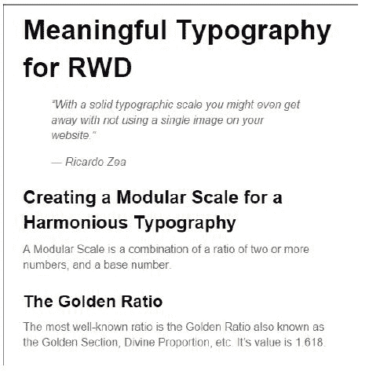
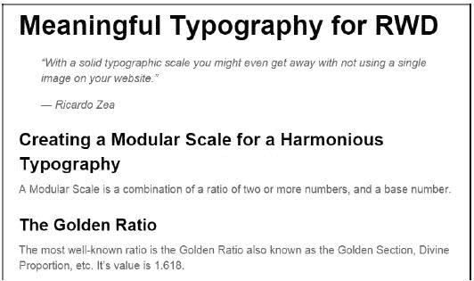
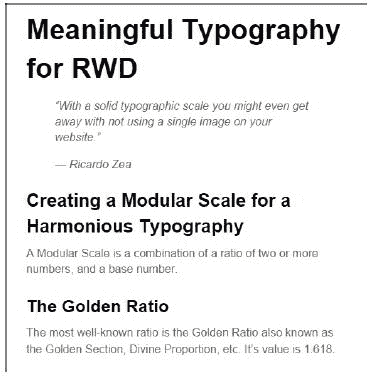
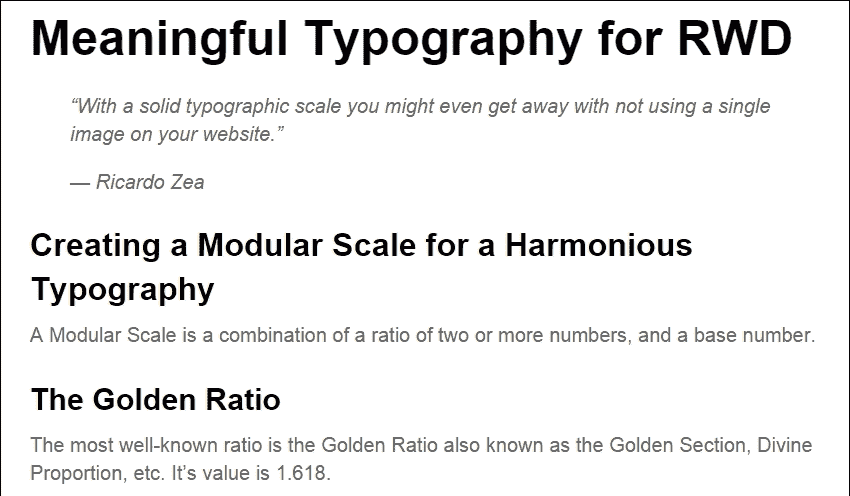

# 第七章。响应式网页设计的有意义的排版

正如我在 Dayton Web Developers 会议上的一次演讲中所说的：

> *"有了稳固的排版比例，甚至可能不需要在网站上使用任何图片。"*

排版的力量一定是网页设计中最被低估的资产之一。诚然，我们看到越来越多的设计中，排版已经得到了充分考虑，在创建网站或应用程序预期氛围方面发挥了重要作用。

在本章中，我们的重点将放在从排版角度考虑 RWD 所需考虑的一些方面、技巧和窍门上。

我们将讨论：

+   像素、ems 或 rems 用于排版？

+   计算相对字体大小。

+   为和谐的排版创建模块化比例。

+   使用模块化比例进行排版。

+   网络字体及其对 RWD 的影响。

+   使用`FitText.js`进行流式标题大小。

+   使用`FlowType.js`来提高可读性。

# 像素、ems 或 rems 用于排版？

很难决定是使用像素、ems 还是 rems 进行排版。这是一个风格问题。一些网页设计师/开发人员仍然使用像素作为声明字体大小的单位。这样做只是更容易理解这些大小。

在设置像素字体大小方面的问题基本上出现在旧版 IE 上，如果用户因为任何原因想要放大页面，文本将保持在给定的像素大小不变。

现在，对于现代浏览器来说，这已经是过去的事情了。当你在任何现代浏览器中放大，如果放大到足够大，它将触发媒体查询，因此显示站点的移动版本。

基于像素的字体大小设置的另一个问题是很难进行缩放和维护。这基本上意味着我们需要在每个媒体查询中重复声明许多元素的字体大小。

另一方面，我们有相对单位，ems 和 rems，这基本上是设置我们的字体大小的推荐方式。

然而，ems 的问题在于我们必须跟踪（在脑海中、在 CSS/HTML 注释中或在某个文本文件中）父容器的大小，这很容易变成字体管理的噩梦。ems 中的字体大小取决于其父容器的字体大小。因此，如果我们有不同级别的嵌套容器，情况可能会变得非常复杂，因为跟踪父容器的字体大小并不容易。

但后来出现了*rem*。Rem 代表*根 em*。*根*是`<html>`元素。

Rems 基本上融合了两者的优点：我们可以使用相对单位 ems 声明 rems 中的字体大小，但又能像使用像素一样轻松理解。使用 rems 的唯一问题是旧版浏览器不支持这个单位，因此需要考虑基于像素的字体大小回退值。这就是一个简短的 Sass mixin 出现并拯救一天的地方。

但在尝试任何 Sass 技巧之前，让我们先从本章的核心策略开始。

# 计算相对字体大小

还记得我们在第三章中提到的 RWD 魔法公式吗，*Mobile-first or Desktop-first?*：

（目标 ÷ 上下文）x 100 = 结果%

还有另一个类似的魔法公式，用于计算相对字体大小（ems），当字体大小已经以像素设置时。唯一的区别是我们不乘以 100。

这就是那个公式：

目标 ÷ 上下文 = 结果

*目标*是以像素定义的字体大小。*上下文*是在父容器中定义的字体大小。*结果*是以 ems 定义的值。

以下是一个示例，假设父容器中的字体大小，在这个例子中是 body，为 16px：

```html
header {
    font: 30px Arial, "Helvetica Neue", Helvetica, sans-serif;
}
```

要计算相对字体大小，我们使用以下公式：

*30px ÷ 16px = 1.875em*。

因此，我们的 CSS 规则将如下所示：

```html
header {
    font: 1.875em Arial, "Helvetica Neue", Helvetica, sans-serif;
}
```

我们需要为设计中的每个字体大小都这样做。

在理解数学方面是可以的。然而，真正的价值在于创造这些基于像素的值的思考过程。这就是模块比例的价值所在。

# 创建和谐的排版模块比例

模块比例是由 Tim Brown 创建的。有不同的方法来创建用于排版的模块比例。在我们的例子中，我们将使用两个基本数字和一个比例来创建一个模块比例。这些数字的乘积创建了一个在所有值之间和谐和成比例的比例。

最著名的比例是*黄金比例*，也被称为*黄金分割*，*神圣比例*等等。它的值是*1.618*。

现在，为了避免不必要的数学计算，黄金比例是基于斐波那契数列的：1, 1, 2, 3, 5, 8, 13, 21 等等。

这些数字有以下的模式：下一个数字是前两个数字相加的结果。例如：

0 + **1** = 1 + **1** = 2 + **1** = 3 + **2** = 5 + **3** = 8 + **5** = 13 + **8** = 21…

这里的想法是理解创建一组数字的意图，当它们一起使用时是和谐的。我们将使用相同的方法来创建一个排版比例，以便在我们的项目中使用模块比例网页应用程序，并忘记*手动*计算项目的相对字体大小。

所以让我们来看看由 Tim Brown 和 Scott Kellum 构建的模块比例网页应用程序：[`www.modularscale.com/`](http://www.modularscale.com/)。

一旦网页应用程序打开，我们需要按照以下三个步骤来创建我们的模块比例：

1.  定义第一个基本数字。

1.  定义第二个基本数字。

1.  选择一个比例。

### 提示

模块比例可以用于任何使用某种值的东西，不仅仅是排版。它可以用于`填充`，`边距`，`行高`等等。然而，我们在本章的重点是排版。

## 定义第一个基本数字

定义第一个基本数字的推荐方法是使用正文文本大小，也就是段落中使用的字体大小。但请记住，使用正文文本大小作为第一个基本数字并不是强制性的。我们可以使用我们字体的 x 高度，或者在该字体中的其他长度，我们认为可能是一个很好的起点。

虽然我们可以选择任何字体大小，但让我们从我们都知道所有浏览器使用的默认字体大小开始，即 16px。所以我们在第一个基本字段中输入`16px`。

点击加号图标并添加第二个基本字段。

### 提示

暂时不用担心应用程序的字体大小预览，因为你可以看到，当我们为我们的基本值输入数字时，右侧预览窗格中的字体大小会改变。我们将在下一步中介绍这一点。

## 定义第二个基本数字

第二个基本字段是我称之为*魔术数字*，因为这个数字完全是主观和任意的，但它与我们正在进行的项目紧密相关。

当我说*紧密相关*时，我的意思是例如使用主容器的宽度，例如 960px，980px，1140px 等。或者，它也可以是网格中使用的列数，例如 12 或 16。它也可以是站点最大宽度处的列宽，例如 60px，甚至是间距，比如 20px。

这个*魔术数字*可以是我们想要的任何东西，但它与我们的项目有直接关系。在这个例子中，假设我们的目标是针对最大宽度为 1280px 的屏幕，所以我们的主容器将具有最大宽度为 1140px。所以让我们在第二个基本字段中输入`1140px`。

## 选择一个比例

这就是魔术发生的地方。选择一个比例意味着这个比例将与基本数字相乘，从而创建一个比例相关的值的比例。

这些比例是基于音乐音阶的，列表中还包括黄金比例（1.618），如果我们决定使用它的话。从**比例**下拉菜单中，选择**1:1.618 - 黄金分割**比例。

就是这样！我们现在已经创建了我们的第一个模块比例。

由模块比例提供的字体大小完全和谐，因为它们是相对于彼此的比例值，这些比例值与我们项目直接相关：

+   理想的正文字体大小是 16px

+   我们主容器的最大宽度是 1140px

+   黄金比例是 1.618

我们的排版现在有了坚实的模块基础，让我们使用它。

# 使用模块比例进行排版

如果您点击**表格**视图，所有文本现在都消失了，我们只剩下一系列字体大小，范围从非常小的值到非常大的值。但没关系。这就是模块比例的力量。

这是我们看到的：


如前面的图像所示，有三列：

+   第一列显示了像素单位的字体大小。

+   第二列显示了 em 单位的字体大小。

+   第三列显示了基准为 16px 时的字体大小。

我们需要专注于第一列和第二列。突出显示的 16px，或 1em 的行，将成为我们段落的字体大小。16px 是大多数浏览器中的默认字体大小。

然后，我们定义我们的标题元素。假设我们只定义`h1`，`h2`和`h3`。这意味着我们将选择大于 16px 的行，具有更大的字体大小：

+   `<h1>`：**39.269px**，即 2.454em

+   `<h2>`：**25.888px**，即 1.618em

+   `<h3>`：**24.57px**，即 1.517em

对于`<small>`元素，如果网站上有任何免责声明，我们选择小于 16px 的字体大小：

`<small>`：**9.889px**，即 0.618em

就是这样！模块比例中的所有数字都是和谐的，当一起使用时将提供清晰的视觉层次结构，以及通过其他方法难以获得的关系。

这里有一个例子。

这是 HTML：

```html
<h1>Meaningful Typography for RWD</h1>
<blockquote>
    <p>"With a solid typographic scale you might even get away with not using a single image on your website."</p>
    <p>— Ricardo Zea</p>
</blockquote>
<h2>Creating a Modular Scale for a Harmonious Typography</h2>
<p>A Modular Scale is a combination of a ratio of two or more numbers, and a base number.</p>
<h3>The Golden Ratio</h3>
<p>The most well-known ratio is the Golden Ratio also known as the Golden Section, Divine Proportion, etc. It's value is 1.618.</p>
```

这是 SCSS：

```html
//Mobile-first Media Query Mixin
@mixin forLargeScreens($media) {
    @media (min-width: $media/16+em) { @content; }
}
body {
    font:16px/1.4 Arial, "Helvetica Neue", Helvetica, sans-serif;
    @include forLargeScreens(640) {
        font-size: 20px;
    }
}
h1 { font-size: 2.454em; }
h2 { font-size: 1.618em; }
h3 { font-size: 1.517em; }
```

### 提示

注意我也包含了移动优先的 Sass mixin。

这是编译后的 CSS：

```html
body {
    font: 16px/1.4 Arial, "Helvetica Neue", Helvetica, sans-serif;
}
@media (min-width: 40em) {
    body {
        font-size: 20px;
    }
}
h1 {
    font-size: 2.454em;
}
h2 {
    font-size: 1.618em;
}
h3 {
    font-size: 1.517em;
}
```

在小屏幕上（宽 510px）模块比例如下：



在大屏幕上（宽 850px）也是这样：



我们在这里唯一可能遇到的问题是我之前提到的关于使用 em 的问题：跟踪父元素的字体大小可能会变成字体管理的噩梦。

使用像素是不可取的，因为在传统浏览器中存在可伸缩性问题。然而，使用 rems 可以保持在“相对字体大小”领域，同时提供基于像素的思维方式，但没有可伸缩性问题。这使我们能够支持不支持 rems 的传统浏览器。

这是我在 CodePen 为此创建的演示：

[`codepen.io/ricardozea/pen/0b781bef63029bff6155c00ff3caed85`](http://codepen.io/ricardozea/pen/0b781bef63029bff6155c00ff3caed85)

## rems-to-pixels Sass mixin

我们只需要一个 Sass mixin，允许我们设置没有特定单位的字体值，mixin 会负责为现代浏览器添加 rem 单位的字体大小，为传统浏览器添加像素单位的字体大小。

这是由 Chris Coyer 创建的 Sass mixin：

```html
//Pixels to Rems Mixin
@mixin fontSize($sizeValue: 1.6) {
    font-size: ($sizeValue * 10) + px;
    font-size: $sizeValue + rem;
}
```

### 提示

我对 mixin 的原始名称进行了小修改，从使用破折号分隔改为驼峰命名法。我这样做的原因是因为在扫描文档时，从类名中更容易找到 mixin 的名称。

用法如下：

```html
@include fontSize(2);
```

这个示例使用了前一章节中使用的相同标记，所以我只会展示 SCSS 和一些截图。

SCSS 如下：

```html
//Mobile-first Media Query Mixin
@mixin forLargeScreens($media) {
    @media (min-width: $media/16+em) { @content; }
}
//Pixels to Rems Mixin
@mixin fontSize($sizeValue: 1.6) {
 font-size: ($sizeValue * 10) + px;
 font-size: $sizeValue + rem;
}
//Base-10 model
html { font-size: 62.5%;
    @include forLargeScreens(640) {
        font-size: 75%;
    }
}
h1 { @include fontSize(3.9269); }
h2 { @include fontSize(2.5888); }
h3 { @include fontSize(2.457); }
p { @include fontSize(1.6); }
```

考虑以下几点：

+   我们将根字体大小设置为 62.5％，将字体大小减小到 10px。这样声明字体值就容易得多。例如，1.2rem 的字体大小等同于 12px，.8rem 等同于 8px，依此类推。

+   在声明 rems 的字体大小时，我们需要将小数点从基于像素的值向左移一位。例如，根据我们的模块化比例，`<h1>`像素大小为 39.269px，所以在声明 rems 的字体大小时，我们声明为 3.9269，*不带单位*。

编译后的 CSS 如下：

```html
html {
    font-size: 62.5%;
}
@media (min-width: 40em) {
    html {
        font-size: 75%;
    }
}
h1 {
    font-size: 39.269px;
    font-size: 3.9269rem;
}
h2 {
    font-size: 25.888px;
    font-size: 2.5888rem;
}
h3 {
    font-size: 24.57px;
    font-size: 2.457rem;
}
p {
    font-size: 16px;
    font-size: 1.6rem;
}
```

这是在小屏幕上（510 像素宽）使用 rems-to-pixels mixin 的模块化比例的样子：



这是在大屏幕上（850 像素宽）的样子：



这是我在 CodePen 上创建的演示：

[`codepen.io/ricardozea/pen/8a95403db5b73c995443720475fdd900`](http://codepen.io/ricardozea/pen/8a95403db5b73c995443720475fdd900)

我们刚刚看到的示例使用了系统字体 Arial。让我们继续使用一些网络字体来提升这些示例的*特色*。

# 网络字体及其对 RWD 的影响

现在几乎必须使用网络字体，我说*几乎*是因为我们需要注意它们对我们项目的影响，如果必要，我们实际上可能根本不使用它们。

在深入研究如何使用网络字体之前，以下是一些可能对你们许多人有帮助的网络字体资源：

+   **Font Squirrel** ([`www.fontsquirrel.com/`](http://www.fontsquirrel.com/))：我已经广泛使用了这项服务并取得了巨大成功。要使用这些字体，你需要下载文件，然后在你的 CSS 中使用`@font-face`。他们有你能找到的最好的网络字体生成工具([`www.fontsquirrel.com/tools/webfont-generator`](http://www.fontsquirrel.com/tools/webfont-generator))

+   **Google Fonts** ([`www.google.com/fonts`](https://www.google.com/fonts))：我不能谈论网络字体资源而不提到 Google Fonts。如果我在 Font Squirrel 上找不到，我就来这里，反之亦然。你可以下载字体文件，或者使用 JavaScript。以下示例中使用的字体是从 Google Fonts 下载的([`github.com/google/fonts/tree/master/ofl/oswald`](https://github.com/google/fonts/tree/master/ofl/oswald))。

+   **Adobe Edge Web Fonts** ([`edgewebfonts.adobe.com/`](https://edgewebfonts.adobe.com/))：这也是一个很棒的工具。这项服务由 TypeKit（第一个网络字体服务）提供支持。我也广泛使用了 TypeKit。但你不能下载字体，必须使用 JavaScript。

现在，让我们看看使用网络字体的利弊：

优点包括：

+   它们有助于突出品牌，并在不同媒体上创建一致性。

+   正确使用时，它们使设计看起来更吸引人。

+   不再需要使用图像替换技术。

+   这使文本保持为 HTML，使内容更易访问和*可索引*。

+   旧版浏览器支持网络字体。

+   免费字体的绝佳资源。

+   所有这些都有助于保持标记更清洁。

缺点包括：

+   它们由于 HTTP 请求或对第三方服务器的依赖而减慢网站/应用的速度。

+   并非所有网络字体在小尺寸和/或大尺寸下都可读。

+   如果需要支持旧版浏览器，则需要管理更多文件。

+   使用字体需要付费：每月、每个字体系列、每种字体样式等等。

+   一些免费字体制作不良。

+   有渲染副作用：

+   **未样式文本的闪烁**（**FOUT**）：在现代浏览器上，当页面加载时，文本首先用系统字体呈现在屏幕上，然后一秒钟后被切换并用网络字体进行样式设置。

+   **不可见文本的闪烁**（**FOIT**）：在旧版浏览器上，当页面加载时，文本是不可见的，但一秒钟后它会用网络字体呈现出来。

还有其他不值得深入的，比如**备用文本的闪烁**和**伪文本的闪烁**（**FOFT**）。

如何解决所有“闪烁文本”的问题不在本节的范围之内。但是，我鼓励您阅读 Zach Leatherman 在 Opera 博客上关于*使用字体加载事件改进@font-face*的文章（[`dev.opera.com/articles/better-font-face/`](https://dev.opera.com/articles/better-font-face/)）。

# 用于实现网络字体的 Sass mixin

要实现网络字体，我们需要在我们的 CSS 中使用`@font-face`指令...嗯，SCSS。

`@font-face`声明块在其原始 CSS 形式中如下所示：

```html
@font-face {
    font-family: fontName;
    src: url('path/to/font.eot'); /*IE9 Compat Modes*/
    src: url('path/to/font.eot?#iefix') format('embedded-opentype'), /*IE6-IE8 */
        url('path/to/font.woff') format('woff'), /*Modern Browsers*/
        url('path/to/font.ttf') format('truetype'), /*Safari, Android, iOS*/
        url('path/to/font.svg#fontName') format('svg'); /*iOS devices*/
    font-weight: normal;
    font-style: normal;
}
```

现在，如果您使用多种样式或字体系列，您需要为每个字体文件重复整个`@font-face`声明块。这不是很干净（不要重复自己）。

### 提示

网络字体在文件大小和服务器请求方面都很昂贵，因此请适度使用网络字体。您使用的越多，您的网站/网络应用程序就会变得越慢。

是的，处理网络字体的 CSS 代码相当庞大，哦天啊。

为了保持理智，让我们将先前的`@font-face` CSS 声明块转换为 Sass mixin：

```html
@mixin fontFace($font-family, $file-path) {
    @font-face {
        font: {
            family: $font-family;
            weight: normal;
            style: normal;
        }
        //IE9 Compat Modes
        src: url('#{$file-path}.eot');
        //IE6-IE8
        src: url('#{$file-path}.eot?#iefix') format('embedded-opentype'),
        //Modern Browsers
        url('#{$file-path}.woff') format('woff'),
        //Safari, Android, iOS
        url('#{$file-path}.ttf') format('truetype'),
        //Safari, Android, iOS
        url('#{$file-path}.svg') format('svg');
    }
}
```

使用一行代码调用字体文件。让我们使用 Oswald 字体：

```html
@include fontFace(oswald-light, '../fonts/oswald-light');
```

在任何元素上使用它只需在字体堆栈的开头添加字体名称，如下所示：

```html
p { font: 2.2rem oswald-bold, Arial, "Helvetica Neue", Helvetica, sans-serif; }
```

如果我们需要包含多个字体文件，只需添加另一行调用 mixin，但指定其他字体名称：

```html
@include fontFace(oswald-light, '../fonts/oswald-light');
@include fontFace(oswald-regular, '../fonts/oswald-regular');

```

前两行代码将编译为以下 CSS：

```html
@font-face {
    font-family: oswald-light;
    font-weight: normal;
    font-style: normal;
    src: url("../fonts/oswald-light.eot");
    src: url("../fonts/oswald-light.eot?#iefix") format("embedded-opentype"), url("../fonts/oswald-light.woff") format("woff"), url("../fonts/oswald-light.ttf") format("truetype"), url("../fonts/oswald-light.svg") format("svg");
}
@font-face {
    font-family: oswald-regular;
    font-weight: normal;
    font-style: normal;
    src: url("../fonts/oswald-regular.eot");
    src: url("../fonts/oswald-regular.eot?#iefix") format("embedded-opentype"), url("../fonts/oswald-regular.woff") format("woff"), url("../fonts/oswald-regular.ttf") format("truetype"), url("../fonts/oswald-regular.svg") format("svg");
}
```

这是一种非常巧妙的方式，只需两行代码就可以创建所有这些 CSS，是吧？然而，如果我们想做正确的事情，让我们分析一下我们在这里做什么：

+   我们支持旧版浏览器：

+   IE8 及以下版本使用`.eot`字体。

+   在 iOS 上的旧版 Safari 和 Android 上使用`.ttf`字体。

+   旧版 iOS 适用于几乎被遗忘的 iPhone 3 及以下版本，使用`.svg`文件。

+   现代浏览器只需要`.woff`字体。根据 CanIUse.com 的数据，`.woff`字体文件有 99%的支持率，除了 Opera Mini 在撰写本书时（[`caniuse.com/#search=woff`](http://caniuse.com/#search=woff)）。

因此，问题是：我们是否可以优雅地降级旧版浏览器和操作系统的体验，并让它们使用系统字体？

当然可以！

在优化 mixin 以仅使用`.woff`字体后，它看起来是这样的：

```html
@mixin fontFace($font-family, $file-path) {
    @font-face {
        font: {
            family: $font-family;
            weight: normal;
            style: normal;
        }
      //Modern Browsers
        src: url('#{$file-path}.woff') format('woff');
    }
}
```

使用方式完全相同：

```html
@include fontFace(oswald-light, '../fonts/oswald-light');
@include fontFace(oswald-regular, '../fonts/oswald-regular');
```

编译后的 CSS 要短得多：

```html
@font-face {
    font-family: oswald-light;
    font-weight: normal;
    font-style: normal;
    src: url("../fonts/oswald-light.woff") format("woff");
}
@font-face {
    font-family: oswald-regular;
    font-weight: normal;
    font-style: normal;
    src: url("../fonts/oswald-regular.woff") format("woff");
}
```

在几个元素上使用它看起来像这样：

```html
h1 { font: 4.1rem oswald-regular, Arial, "Helvetica Neue", Helvetica, sans-serif; }
p { font: 2.4rem oswald-light, Arial, "Helvetica Neue", Helvetica, sans-serif; }
```

仅提供`.woff`字体可以减少我们的文件管理工作量，有助于解放我们的大脑，让我们专注于最重要的事情：构建一个令人难忘的体验。更不用说，它使我们的 CSS 代码更加简洁和可扩展。

但等等，我们让旧版浏览器优雅地降级到系统字体，我们仍然需要为它们定义像素字体大小！

像素到 rems Sass mixin 来拯救！

记得在`<html>`标签中查看十进制模型以便更容易计算：

```html
//Base-10 model
html { font-size: 62.5%; }
```

然后让我们声明字体大小和字体系列：

```html
h1 {
    @include fontSize(4.1);
    font-family: oswald-regular, Arial, "Helvetica Neue", Helvetica, sans-serif;
}
p {
    @include fontSize(2.4);
    font-family: oswald-light, Arial, "Helvetica Neue", Helvetica, sans-serif;
}
```

编译后的 CSS 如下所示：

```html
h1 {
    font-size: 41px;
    font-size: 4.1rem;
    font-family: oswald-regular, Arial, "Helvetica Neue", Helvetica, sans-serif;
}

p {
    font-size: 24px;
    font-size: 2.4rem;
    font-family: oswald-light, Arial, "Helvetica Neue", Helvetica, sans-serif;
}
```

### 提示

我们在同一规则中声明了两个不同的字体大小，因此在这种情况下我们不能使用字体简写。

因此，通过利用两个简单的 Sass mixin 的超能力，我们可以轻松嵌入网络字体，并为我们的字体大小使用 rems，同时为旧版浏览器提供基于像素的字体大小。

这是一个强大可扩展性的很好的例子。

这是我在 CodePen 上创建的演示：

[`codepen.io/ricardozea/pen/9c93240a3404f12ffad83fa88f14d6ef`](http://codepen.io/ricardozea/pen/9c93240a3404f12ffad83fa88f14d6ef)

在不失去任何动力的情况下，让我们转变思路，谈谈如何通过使用 Simple Focus 的强大 FlowType.js jQuery 插件来实现最小行长，从而提高页面的可读性。

# 使用 FlowType.js 增加可读性

最具说服力的编辑原则之一是，最易读的排版的理想行长在 45 到 75 个字符之间。

如果你问我，这是一个相当不错的范围。然而，实际上让你的段落足够长，或者足够短，就像一个“盲人引导盲人”的游戏。我们怎么知道容器的宽度和字体大小的组合是否真正符合 45 到 75 个字符的建议？此外，在小屏幕或中等屏幕上，你怎么知道情况是这样的？

棘手的问题，对吧？

好吧，不用担心，因为有了 FlowType.js，我们可以解决这些问题。

你可以从[`simplefocus.com/flowtype/`](http://simplefocus.com/flowtype/)下载这个插件。

我们需要的第一件事是 HTML，所以这是我们将要使用的标记：

```html
<!DOCTYPE html>
<!--[if IE 8]> <html class="no-js ie8" lang="en"> <![endif]-->
<!--[if IE 9]> <html class="no-js ie9" lang="en"> <![endif]-->
<!--[if gt IE 9]><!--><html class="no-js" lang="en"><!--<![endif]-->
<head>
    <meta charset="utf-8">
    <meta name="viewport" content="width=device-width, initial-scale=1">
    <meta http-equiv="X-UA-Compatible" content="IE=edge">
    <title>Meaningful Typography for RWD</title>
    <script src="img/"></script>
    <script src="img/flowtype.js"></script>
</head>
<body>
    <main class="main-ctnr" role="main">
        <h1>Meaningful Typography for RWD</h1>
        <blockquote>
            <p>"With a solid typographic scale you might even get away with not using a single image on your website."</p>
            <p>— Ricardo Zea</p>
        </blockquote>
        <p>One of the most compelling editorial principles states that the ideal line length for the most legible typography is between 45 and 75 characters.</p>
    </main>
</body>
</html>
```

一旦你熟悉了 FlowType.js，你可能会开始思考，“如果 FlowType 自动在几乎任何视口宽度下修改字体大小，我觉得我不需要在我的 SCSS 中声明任何字体大小！毕竟，它们将被 FlowType 覆盖。”

好吧，我们确实需要设置字体大小，因为如果 FlowType.js 没有加载，我们将受制于浏览器的默认样式，而我们设计师不想要这样。

说到这里，这是声明必要字体大小的 SCSS：

```html
//Pixels to Rems Mixin
@mixin font-size($sizeValue: 1.6) {
    font-size: ($sizeValue * 10) + px;
    font-size: $sizeValue + rem;
}
//Base-10 model
html { font-size: 62.5%; }
h1 { @include fontSize(3.9269); }
p { @include fontSize(1.6); }
```

这将编译成以下 CSS：

```html
html {
    font-size: 62.5%;
}
h1 {
    font-size: 39.269px;
    font-size: 3.9269rem;
}
p {
    font-size: 16px;
    font-size: 1.6rem;
}
```

这就是魔法发生的地方。我们创建一个 jQuery 函数，可以指定要定位的元素。这个函数可以放在一个单独的 JavaScript 文件中，也可以放在标记中。

在我们的示例中，我们告诉 FlowType.js 将字体的调整应用到`<html>`元素上。由于我们使用相对字体大小单位 rems，所有文本将在任何屏幕宽度下自动调整大小，保持理想的行长度。

这是 jQuery 函数：

```html
$(function() {
    $("html").flowtype();
});
```

## 定义阈值

我们刚刚看到的解决方案存在潜在问题：FlowType.js 将无限期地修改段落的字体大小。换句话说，在小屏幕上，文本将变得非常小，在大屏幕上，文本将变得太大。

我们可以用两种不同的阈值方法或两者结合来解决这个问题。

现在，我们需要澄清的一件事是，这部分需要一些调整和调整，以获得最佳结果，没有特定的值适用于所有情况。

我们将采用以下方法：

+   定义容器或元素的最小和最大宽度。

+   定义容器或元素的最小和最大字体大小。

### 阈值宽度

定义最小和最大宽度将告诉 FlowType.js 在哪些点停止调整大小。

让我们定义宽度阈值：

```html
$(function() {
    $("html").flowtype({
      //Max width at which script stops enlarging
        maximum: 980,
      //Min width at which script stops decreasing
      minimum: 320
   });
});
```

### 提示

我选择的阈值专门适用于这个示例，可能不适用于其他情况。调整和测试，直到你得到适合推荐的每行 45-75 个字符的理想宽度。

### 阈值字体大小

就像宽度阈值一样，定义最小和最大字体大小将告诉 FlowType.js 应该将文本缩放到的最小和最大字体大小。

我们还将使用`fontRatio`变量声明自己的字体大小；数字越大，字体越小，数字越小，字体越大。如果这感觉反直觉，可以这样理解：数字越大，压缩越大（因此变小），数字越小，压缩越小（因此变大）。

调整`fontRatio`值是一个*凭感觉*的练习，所以像没有明天一样调整和测试。

让我们看一下字体大小的值：

```html
$(function() {
 $("html").flowtype({
      //Max width at which script stops enlarging
      maximum: 980,
      //Min width at which script stops decreasing
      minimum: 320,
      //Max font size
      maxFont : 18,
      //Min font size
      minFont : 8,
 //Define own font-size
 fontRatio : 58
   });
});
```

### 提示

在列表中的最后一个值后面不需要包含逗号。

FlowType.js 真的很棒！

这是我在 CodePen 上创建的演示：

[`codepen.io/ricardozea/pen/c2e6abf545dbaa82a16ae84718c79d34`](http://codepen.io/ricardozea/pen/c2e6abf545dbaa82a16ae84718c79d34)

# 总结

所以在这里，我们在 RWD 的排版上升了一个层次。排版还有更多内容吗？当然有！这个令人惊叹的主题本身就是一个完整的行业，没有它我们就不会读到这本书。

现在我们可以说，我们明白为什么使用相对单位进行排版是一个好方法：可伸缩性。此外，使用我们的小魔法公式，我们可以计算设计中每个文本元素的相对字体大小，但为什么要经历这么多麻烦呢？排版的模块化比例在这方面拯救了我们，并为我们的项目注入了令人惊叹的排版和谐。谁知道，也许我们根本不需要使用图片！

品牌现在可以通过网络字体扩展到网络上，但我们需要谨慎考虑它们对我们网站/应用的影响。另外，就现代浏览器而言，我们只需要使用一种文件类型（WOFF 字体文件），这样可以更容易地管理——对于浏览器下载和用户享受都更方便。

FlowType.js 增强了我们的标题和正文文本，同时保持了良好的可读性水平。

现在，RWD 的一个重要部分是（信不信由你）做一些我们多年前做过的事情。在下一章中，我们将保持简单，讨论电子邮件中的 RWD。

是时候回到过去了！
