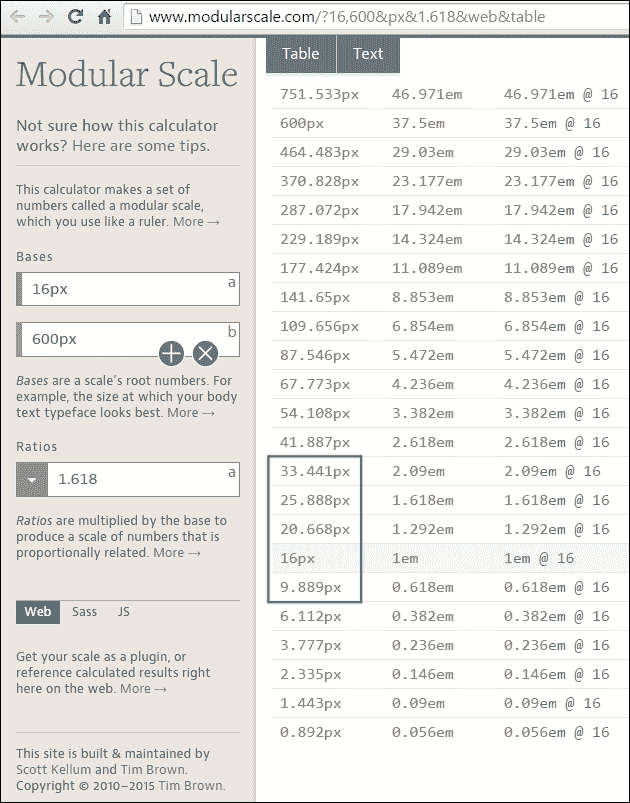
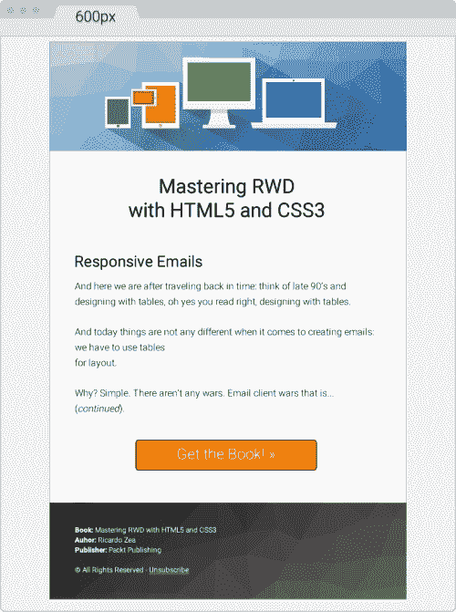
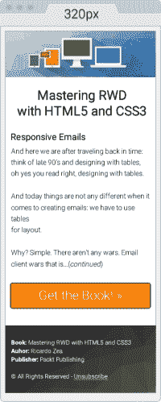
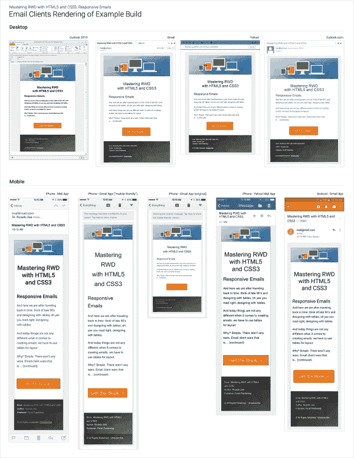
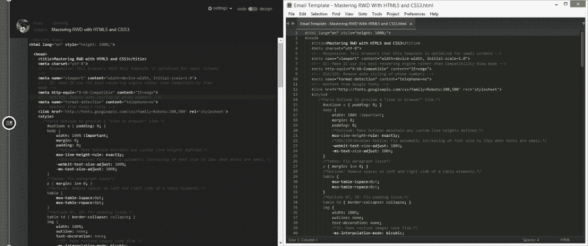

# 第八章：响应式电子邮件

在我们回到过去之后，我们来想一想 90 年代末使用表格进行设计；是的，你没看错，使用表格进行设计。

今天，在创建电子邮件方面并没有任何不同：我们必须使用表格进行布局。为什么？很简单。没有任何战争。那就是电子邮件客户端之间的竞争。

与 1995 年的浏览器之战不同，当时 Netscape 和 Internet Explorer 为市场霸权而战，电子邮件客户端自从有记忆以来就一直过着各自独立的生活，几乎对彼此毫不在意。

由于浏览器之战，我们现在拥有了这样一些非常棒的符合标准的浏览器，它们充满了功能、定制能力、不断的更新等等，使每个人的在线生活变得更加轻松。

另一方面，电子邮件客户端以自己的步伐发展，而且步伐很慢，因为实际上没有任何竞争。此外，绝大多数公司已经与微软的 Outlook 绑定在一起。在 Office 的最新版本中，Outlook 实际上比早期版本更糟糕，因此并没有真正帮助电子邮件领域支持更现代的技术。

此外，有一些相对较新的电子邮件客户端彻底拒绝支持`<style>`元素甚至媒体查询。

但是，无论技术水平如何，电子邮件都是一种非常高效和强大的营销工具，我们需要准备好迟早要使用它。

换句话说，作为一种沟通媒介，电子邮件不会很快消失，我们作为网页设计师/开发人员必须使用表格和内联样式设计电子邮件。

但不要担心，我会向你展示，通过使用 RWD 的基本原则，一点点常识，采用渐进增强，并且始终试图保持简单，设计和实现响应式电子邮件并不困难，而且可以很有趣。

在本章中，我们将讨论以下主题：

+   我们为什么需要担心响应式电子邮件？

+   不要忽视你的分析。

+   响应式电子邮件需要考虑的事项。

+   响应式电子邮件构建。

+   第三方服务。

# 我们为什么需要担心响应式电子邮件？

我们需要担心响应式电子邮件的主要原因很简单：大约 65%的电子邮件是在移动设备（智能手机和平板电脑）上打开的。其余 35%的电子邮件是在桌面上打开的。此外，响应式电子邮件比非响应式电子邮件有更多的参与度。

除此之外，在桌面上打开的电子邮件比在移动设备上打开的电子邮件有更多的参与度。

查看以下文章：

+   *美国近 65%的电子邮件是在移动设备上打开的*：[`www.internetretailer.com/2014/01/23/nearly-65-e-mails-us-are-opened-mobile-devices`](https://www.internetretailer.com/2014/01/23/nearly-65-e-mails-us-are-opened-mobile-devices)

+   *上季度 65%的营销电子邮件是在移动设备上打开的；安卓平板使用量翻了一番*：[`www.phonearena.com/news/65-of-marketing-emails-were-opened-on-a-mobile-device-last-quarter-Android-tablet-use-doubles_id51864`](http://www.phonearena.com/news/65-of-marketing-emails-were-opened-on-a-mobile-device-last-quarter-Android-tablet-use-doubles_id51864)

### 提示

术语*参与*意味着用户点击/轻敲。因此，*更多参与*简单地意味着*更多点击/轻敲*。

# 不要忽视你的分析

在开始推动像素、嵌套表格和样式元素之前，绝对必要的是我们看一下分析数据，全面了解我们将为之创建电子邮件的环境。

这样做将使我们了解：

+   我们的电子邮件是在何时被打开的。

+   哪些日子有更多的开放。

+   哪些时间段有更多的开放。

+   无论季节是否导致更多/更少的开放。

+   哪些设备被用来打开我们的电子邮件。

+   哪些电子邮件客户端被最多/最少使用。

例如，如果分析数据表明 Outlook 2013 很少被使用（这将是很棒的），那么我们可能根本不需要担心这个电子邮件客户端。

如果安卓上的 Yahoo Mail 应用是最常用的应用和平台，那么我们可以放心地使用更高级的 CSS 属性，并逐步增强，知道我们的想法将正确显示。

进行市场份额研究很重要，但最终决定如何制定电子邮件开发策略的是你自己的分析数据。

# 建议构建更好的响应式电子邮件

尽管一些电子邮件客户端在呈现电子邮件方面变得更好了，但还有其他电子邮件客户端并不如他们应该的那样好。这意味着我们需要构建一些基本的东西，并逐步增强以适应更好的电子邮件客户端。

在构建响应式电子邮件时，有一些重要的准则需要考虑：

+   **确定支持 HTML 和 CSS 最少的电子邮件客户端**：了解哪个电子邮件客户端对 HTML 和 CSS 的支持最少将在测试过程中节省我们不必要的麻烦和时间。再次强调，这就是分析数据至关重要的地方。

+   **使用渐进增强**：首先，设计和构建支持 CSS 和 HTML 最少的电子邮件客户端。然后，我们使用这个核心基础来增强设计和体验。

+   **保持在 550px 至 600px 的宽度范围内**：这非常重要，因为大多数电子邮件客户端的预览窗格非常窄。此外，600px 或更少在桌面客户端和网页浏览器上看起来都很好，而且在小屏幕上缩小或响应式时，电子邮件仍然可读。

+   **使用表格进行布局**：大多数电子邮件客户端对 HTML 和 CSS 的支持远远不及网页浏览器，因此使用表格来构建布局仍然是创建电子邮件的方法。

+   **内联 CSS**：许多电子邮件客户端会移除电子邮件的`<head>`部分，因此我们放在那里的任何东西都会被剥离。因此，我们需要内联 CSS 以实现必要的样式。

+   **使用系统字体**：虽然技术上可以使用网络字体，最好还是使用系统字体，这样可以使电子邮件在不同设备和不同电子邮件客户端上尽可能相似。但是，如果你决定使用网络字体，那就去做吧，并始终将它们作为渐进增强过程的一部分使用。

+   **为背景图像提供备用颜色**：使用背景图像并不是很困难。Outlook 是唯一需要特殊标记（条件注释）才能使其工作的客户端。然而，始终提供一个备用的背景颜色，以防图像无法加载。

+   **始终在图像上使用 alt 属性**：如果图像无法加载或加载速度过慢，电子邮件客户端将显示替代文本。确保在`alt`属性中放入一些描述性的内容。与其使用*Logo*，最好使用*公司标志-标语*之类的内容。

+   **不需要先考虑移动端**：因为我们正在进行渐进增强，我们从支持 HTML 和 CSS 最少的电子邮件客户端开始。因此，这个电子邮件客户端很可能不支持媒体查询或`viewport`元标记。因此，移动优先的方法可能并不是最佳选择，至少目前还不是。

+   **使用 HTML5 DOCTYPE**：我们当然可以使用旧的 HTML4 DOCTYPE，但也可以使用 HTML5 DOCTYPE，这总是一个好的措施。

+   **避免使用 HTML5 元素**：尽管我们可以使用 HTML5 DOCTYPE，但对 HTML5 元素的支持实际上几乎不存在。因此，在电子邮件中避免使用 HTML5 元素。

+   **保持简单**：大多数电子邮件的寿命很短，因此制作复杂的布局并不是必要的。创建一个简单的单列布局会节省我们很多麻烦。要着重关注设计本身。这就是一个坚实的排版模块化比例可以发挥奇迹的地方。

# 响应式电子邮件构建

定义电子邮件的特性也是*构建*的一部分，所以让我们来定义这些：

1.  为排版创建一个模块比例。

1.  创建两种设计来帮助预先可视化电子邮件：一种用于大屏幕，一种用于小屏幕。

1.  电子邮件的最大宽度为 600px，最小宽度为 320px。

1.  使用渐进增强。

## 排版的模块比例

为了构建我们的模块比例，我们将使用以下值：

+   **基础一**（16px）：这是我们的基本字体大小。

+   **基础二**（600px）：这是我们电子邮件的最大宽度。

+   **比例**（1.618）：黄金比例。

这个模块比例可以在[`www.modularscale.com/?16,600&px&1.618&web&table`](http://www.modularscale.com/?16,600&px&1.618&web&table)找到。



## 设计-大屏幕和小屏幕视图

以下的设计将有助于更好地了解大屏幕和小屏幕上的电子邮件。这是它在 600px 宽时的样子：



这是电子邮件在最小尺寸（320px 宽）下的样子：



让我们立即着手构建一个响应式的电子邮件。

## 设置基本的 HTML 模板

让我们从最基本的模板开始。然后，我们将添加需要的不同元素，以建立一个完整的模板。

以下是 HTML 的第一次尝试，其中包含`<head>`部分的一些初始元素：

+   使用`lang`属性定义文档的语言，我们的情况下是英语。

+   由于我们的设计具有彩色背景，我们需要给`<html>`和`<body>`元素一个 100%的高度。这样两个元素就会延伸到视口的全高度。否则，背景将在电子邮件底部结束，然后页面将显示白色背景。

+   添加一个`<title>`标签。

+   添加以下 meta 标签：

+   字符集 UTF-8

+   视口

+   使 Internet Explorer 使用可能的最新渲染引擎

+   移除 OSX/iOS 中电话号码的自动样式。

+   谁说我们不能使用网络字体？只有少数几个电子邮件客户端支持它们，不支持的将会回退到我们字体堆栈中的系统字体，很可能是 Arial 或 Helvetica。让我们使用 Roboto。

以下是 HTML：

```html
<!DOCTYPE html>
<html lang="en" style="height: 100%;">
<head>
    <title>Mastering RWD with HTML5 and CSS3</title>
 <meta charset="utf-8">
 <!-- Responsive: Tell browsers that this template is optimized for small screens -->
 <meta name="viewport" content="width=device-width, initial-scale=1.0">
 <!-- IE: Make IE use its best rendering engine rather than Compatibility View mode -->
 <meta http-equiv="X-UA-Compatible" content="IE=edge">
 <!-- OSX/iOS: Remove auto styling of phone numbers -->
 <meta name="format-detection" content="telephone=no">
 <!-- Webfont from Google Fonts -->
 <link href='http://fonts.googleapis.com/css?family=Roboto:300,500' rel='stylesheet'>
</head>
<body style="height: 100%;">

</body>
</html>
```

### 使用 CSS 重置来规范显示

让我们添加必要的 CSS 重置样式，以帮助在尽可能多的电子邮件客户端上保持相对统一的显示。

以下列表概述了我们将在多个电子邮件客户端上*重置*（也称为*规范化*）的确切内容：

+   **Outlook（所有版本）**：

+   强制它提供“在浏览器中查看”链接。

+   使其保持任何自定义行高的定义。

+   删除`<table>`元素左右两侧的空格。

+   修复填充问题。

+   **OSX/iOS/Windows Mobile**：

+   修复字体小的时候自动增加字体大小到 13px 的问题。

+   **Yahoo**：

+   修复段落问题。

+   **IE**：

+   修复调整大小的图像问题。

+   **Hotmail/Outlook.com**：

+   使其以全宽度显示电子邮件。

+   强制它显示正常的行间距。

+   **所有电子邮件客户端**：

+   移除链接图像周围的边框。

以下是嵌入的 CSS：

```html
<!DOCTYPE html>
<html lang="en" style="height: 100%;">
<head>
    <title>Mastering RWD with HTML5 and CSS3</title>
    <meta charset="utf-8">
    <!-- Responsive: Tell browsers that this template is optimized for small screens -->
    <meta name="viewport" content="width=device-width, initial-scale=1.0">
    <!-- IE: Make IE use its best rendering engine rather than Compatibility View mode -->
    <meta http-equiv="X-UA-Compatible" content="IE=edge">
    <!-- OSX/iOS: Remove auto styling of phone numbers -->
    <meta name="format-detection" content="telephone=no">
    <!-- Webfont from Google Fonts -->
    <link href='http://fonts.googleapis.com/css?family=Roboto:300,500' rel='stylesheet'>
    <style>
        /*Force Outlook to provide a "View in Browser" link.*/
 #outlook a { padding: 0; }
        body {
            width: 100% !important;
            margin: 0;
            padding: 0;
            /*Outlook: Make Outlook maintain any custom line heights defined.*/
 mso-line-height-rule: exactly;
 /*OSX/iOS/Windows Mobile: Fix automatic increasing of font size to 13px when fonts are small.*/
 -webkit-text-size-adjust: 100%;
 -ms-text-size-adjust: 100%;
 }
 /*Yahoo: Fix paragraph issue*/
 p { margin: 1em 0; }
 /*Outlook: Remove spaces on left and right side of a table elements.*/
 table {
 mso-table-lspace:0pt;
 mso-table-rspace:0pt;
 }
 /*Outlook 07, 10: Fix padding issue.*/
 table td { border-collapse: collapse; }
 img {
 outline: none;
 text-decoration: none;
 /*IE: Make resized images look fine.*/
 -ms-interpolation-mode: bicubic;
 }
 /*Remove border around linked images.*/
 a img { border: none; }
 /*Prevent Webkit and Windows Mobile platforms from changing default font sizes, while not breaking desktop design.*/
 /*Force Hotmail to display e-mails at full width.*/
 .ExternalClass{ width:100%; }
 /*Force Hotmail to display normal line spacing.*/
 .ExternalClass,
 .ExternalClass p,
 .ExternalClass span,
 .ExternalClass font,
 .ExternalClass td,
 .ExternalClass div {
 line-height: 100%;
 }
    </style>
</head>
<body style="height: 100%;">

</body>
</html>
```

有了这个基本模板，让我们开始添加内容。

### 添加电子邮件内容

构建电子邮件基本上是一种“你必须做你必须做的事情！”的心态。换句话说，我们必须做任何我们必须做的事情，以便使事物显示为我们想要的样子。有时，我们必须使用不间断空格（`&nbsp;`）来分隔事物，使用`<br>`标签使事物进入下一行，甚至使用多个`<br>`标签在元素之间创建空间。

然而，这并不意味着我们要把学到的所有好东西都抛到脑后，绝对不是。

让我们尽可能地保持清洁和简洁，必要时进行嵌套，并在需要时添加必要的样式。

### 提示

为了优化空间并帮助专注于重要部分，我们将只处理`<body>`标签内的标记。

#### 创建一个 100%宽度的包裹表格

这是我们最外层的表格容器，始终将其作为一个良好的实践。这个表格将允许我们处理我们设计中想要或需要的任何填充，因为在`<body>`标签上添加填充可能不是一种可靠的方法。

如果我们的设计有背景颜色，我们也可以使用这个外部表格来添加背景颜色。我们将给这个外部表格设置 100%的宽度和高度。

我们还在单元格中添加了 20 像素的填充；这将给整个电子邮件留出一些空间，因为它不会触及视口/面板的顶部和底部边缘。代码如下：

```html
<body style="height: 100%;">
 <table width="100%" height="100%" cellpadding="20" cellspacing="0" border="0" bgcolor="#efefef" class="outer-container-table">
 <tr>
 <td align="center"> </td>
 </tr>
 </table>
</body>
```

### 提示

我在电子邮件中为一些元素添加了类，可能并不是立即使用。无论如何，我都会添加这些类，以防将来发生变化，我已经有了这些类，并且可以更快地进行编辑。

#### 创建 600 像素的内部表格

我们使用 HTML 属性`width`声明了这个内部表格的宽度，而不是在内联样式中声明宽度。我们还给这个表格添加了白色背景，这样我们的内容就可以覆盖它，并阻止宽容器的浅灰色背景。

可以使用边框简写添加 1 像素的边框。有人说不要在电子邮件中使用 CSS 简写！然而，在测试了几个电子邮件客户端之后，简写效果非常好。

在顶部添加 10 像素的边距将有助于给电子邮件留出更多空间。代码如下：

```html
<body style="height: 100%;">
    <table width="100%" height="100%" cellpadding="20" cellspacing="0" border="0" bgcolor="#efefef" class="outer-container-table">
        <tr>
            <td align="center">
                <table width="600" cellpadding="0" cellspacing="0" border="0" bgcolor="white" align="center" class="inner-container-table" style="margin-top: 10px; border: #999999 1px solid;">
 <tr>
 <td></td>
 </tr>
 </table>
            </td>
        </tr>
    </table>
</body>
```

注意我在`.inner-container-table`的背景颜色上使用了术语*white*？这是因为我想告诉你，你也可以使用 HTML 颜色名称而不是十六进制值。所有电子邮件客户端都支持这个功能。这也更具描述性。

在公开网络上有很多资源列出了所有 HTML 颜色名称，但我特别喜欢这个，因为它将颜色名称按类别分组。因此，在设计中更容易使用：[`html-color-codes.info/color-names/`](http://html-color-codes.info/color-names/)。

#### 添加页眉图像

在空的`<td>`元素中，我们需要做的就是添加调用页眉图像的``标签。

图像默认为`inline-block`元素。为了避免不需要的行为，请确保图像具有`display: block;`和`width: 100%;`元素，如下所示：

```html
<body style="height: 100%;">
   <table width="100%" cellpadding="0" cellspacing="20" border="0" bgcolor="#efefef" style="height: 100%;" class="outer-container-table">
      <tr>
         <td align="center">
            <table width="580" cellpadding="0" cellspacing="0" border="0" bgcolor="white" align="center" class="inner-container-table" style="margin-top: 10px; border: #999999 1px solid;">
               <tr>
                  <td>
                     
                  </td>
               </tr>
            </table>
         </td>
      </tr>
   </table>
</body>
```

#### 创建内容包装表格及其所有内容

这是大部分魔术发生的地方，因为我们现在正在创建电子邮件的主体，包括页脚。需要注意的几件事：

+   第一个表格的宽度为 88%。我这样做是为了向你展示，如果你愿意，你可以是任意的。此外，你不必每次都使用像素，使用百分比时也可以使用不同于 100%的其他值。

+   在某些部分，我大量使用`<br>`标签。这是因为我希望一些元素之间的间距在我想要的位置。在其他情况下，这将是一个相当糟糕的做法；在电子邮件中，这样做非常有用，也很常见。

+   我们将使用三行：一行用于主标题，一行用于正文，一行用于**呼吁行动**（**CTA**）按钮。这样做将允许我们独立处理每个部分，而无需担心在调试或样式化时影响其他两个部分。

+   页脚将与主要内容结构分开，因此我们可以轻松处理背景图片。

标记如下：

```html
<body style="height: 100%;">
    <table width="100%" height="100%" cellpadding="20" cellspacing="0" border="0" bgcolor="#efefef" class="outer-container-table">
        <tr>
            <td align="center">
                <table width="600" cellpadding="0" cellspacing="0" border="0" bgcolor="  white" align="center" class="inner-container-table" style="margin-top: 10px; border: #999999 1px solid;">
                    <tr>
                        <td>
                            
                        </td>
                    </tr>
                    <tr>
 <td align="center">
 <table width="88%" cellpadding="0" cellspacing="0" border="0" align="center" class="content-table">
 <tr>
 <td align="center">
 <table width="100%" cellpadding="10" cellspacing="0" border="0" align="center">
 <tr>
 <td style="font-family: Roboto, Arial, Helvetica, san-serif; font-weight: 500; font-size: 33.441px; text-align: center;"><br>Mastering RWD<br>with HTML5 and&nbsp;CSS3</td>
 </tr>
 <tr>
 <td>
 <h2 style="font-family: Roboto, Arial, Helvetica, san-serif; font-weight: 500; font-size: 25.888px;">Responsive Emails</h2>
 <p style="font-family: Roboto, Arial, Helvetica, san-serif; font-weight: 300; font-size: 16px; line-height: 26px">And here we sare after traveling back in time: think of late 90's and designing with tables, oh yes you read right, designing with&nbsp;tables.</p>
 <p style="font-family: Roboto, Arial, Helvetica, san-serif; font-weight: 300; font-size: 16px; line-height: 26px"> And today things are not any different when it comes to creating e-mails: we have to use tables for&nbsp;layout.</p>
 <p style="font-family: Roboto, Arial, Helvetica, san-serif; font-weight: 300; font-size: 16px; line-height: 26px">Why? Simple. There aren't any wars. Email client wars that is&hellip;&nbsp;(continued).</p>
 </td>
 </tr>
 <tr>
 <td style="font-family: Roboto, Arial, Helvetica, san-serif; font-weight:300; font-size: 25.888px; text-align:center;">
 <br>
 <a href="#" target="_blank" style="padding: 20px 30px; border: #663300 2px solid; border-radius: 5px; text-decoration: none; color: white; background: #ff8000;" class="main-cta">Get the Book! &raquo;</a>

 <br><br><br>
 </td>
 </tr>
 </table>
 </td>
 </tr>
 </table>
 </td>
 </tr>
 <tr>
 <td>
 <table width="100%" cellpadding="0" cellspacing="0" border="0" class="footer-table-ctnr" style="background: #666666; background: linear-gradient(#333, #666);">
 <tr>
 <td background="https://s3-us-west-2.amazonaws.com/s.cdpn.io/9988/trianglify-black.png">
 <table width="95%" align="center" cellpadding="30" cellspacing="0" border="0">
 <tr>
 <td style="font-family: Roboto, Arial, Helvetica, san-serif; font-weight: 300; font-size: 12px; line-height: 20px; color: white;">
 <p style="margin: 0;"><span style="font-weight: 500;">Book:</span> Mastering RWD with HTML5 and&nbsp;CSS3</p>
 <p style="margin: 0;"><span style="font-weight: 500;">Author:</span> Ricardo Zea</p>
 <p style="margin: 0;"><span style="font-weight: 500;">Publisher:</span> Packt Publishing</p>
 <br>
 <p>&copy; All Rights Reserved - <a href="#" style="color: white;">Unsubscribe</a></p>
 </td>
 </tr>
 </table>
 </td>
 </tr>
 </table>
 </td>
 </tr>
 </table>
 </td>
 </tr>
    </table>
</body>
```

到目前为止，电子邮件看起来是这样的：


我们完成了！我们？还没有，我们还有一些事情要做：

+   为页脚和 CTA 按钮添加 Outlook 2007/2010/2013 条件注释的黑客。

+   添加媒体查询。

+   添加 Outlook 网络字体回退样式。

#### 添加 Outlook 2007/2010/2013 条件注释黑客

就像在基于表格的布局时代的 IE 一样，Outlook 在桌面电子邮件客户端的领域中占据主导地位。因此，在创建电子邮件时，我们不能忽视这个客户端。

这一切都很好，问题在于大多数 Outlook 版本的 HTML 渲染能力非常差，因此通过条件注释进行 HTML hack（不幸的是）是必要的。它们并不难实现；您只需要知道何时实现它们。

条件注释对于背景图像和大型 CTA 按钮非常有用。在我们的示例中，我们都有：页脚中的黑色/灰色三角形背景图案和橙色**获取图书»** CTA（呼吁行动）。

在下面的标记中，您将能够注意到以下几点：

+   条件注释只包裹元素。换句话说，确保您不要包裹比所需更多的元素，否则我们将制造更多问题而不是解决方案。

+   页脚和 CTA 按钮都要求我们在两个地方进行编辑：元素本身和条件注释内部。

+   电子邮件条件注释看起来相当晦涩；它们不遵循任何标准，因为它们是专有技术。把它们看作是渐进增强的一部分而不是一部分。它们是一种彻头彻尾的 hack。

+   编辑条件注释并不太困难。可定制的部分要么是内联 CSS 属性/值，要么是图像的`src`属性——这些都不是我们以前没有见过的。

### 提示

为了清晰起见并涵盖本书的范围，我只会向您展示两个包含在条件注释中的部分。

##### 页脚背景图像的条件注释

这就是 HTML 的样子：

```html
<td background="https://s3-us-west-2.amazonaws.com/s.cdpn.io/9988/trianglify-black.png">
 <!--[if gte mso 9]>
 <v:rect  strokecolor="none" style="width: 600px; height: 184px;">
 <v:fill type="frame" src="img/trianglify-black.png"></v:fill>
 </v:rect>
 <v:shape style="position: absolute; width: 600px; height: 184px;">
 <![endif]-->
   <table width="95%" align="center" cellpadding="30" cellspacing="0" border="0">
      <tr>
         <td style="font-family: Roboto, Arial, Helvetica, san-serif; font-weight: 300; font-size: 12px; line-height: 20px; color: white;">
            <p style="margin: 0;"><span style="font-weight: 500;">Book:</span> Mastering RWD with HTML5 and&nbsp;CSS3</p>
            <p style="margin: 0;"><span style="font-weight: 500;">Author:</span> Ricardo Zea</p>
            <p style="margin: 0;"><span style="font-weight: 500;">Publisher:</span> Packt Publishing</p>
            <br>
            <p>&copy; All Rights Reserved - <a href="#" style="color: white;">Unsubscribe</a></p>
         </td>
      </tr>
   </table>
   <!--[if gte mso 9]>
 </v:shape>
 <![endif]-->
</td>
```

##### CTA 按钮的条件注释

以下片段改编自 Eli Dickinson 在 IndustryDive.com 的文章*如何制作出色的 HTML 电子邮件按钮*（[`www.industrydive.com/blog/how-to-make-html-email-buttons-that-rock/`](http://www.industrydive.com/blog/how-to-make-html-email-buttons-that-rock/)）。

以下是标记的样子：

```html
<td style="font-family: Roboto, Arial, Helvetica, san-serif; font-weight:300; font-size: 25.888px; text-align: center;">
    <br>
  <!--[if mso]>
 <v:roundrect   href="http:#" style="height: 60px; width: 300px; v-text-anchor: middle;" arcsize="10%" stroke="f" fillcolor="#ff8000">
 <center style="color: #ffffff; font-family: Roboto, Arial, Helvetica, san-serif; font-weight:300; font-size: 25.888px;">
 Get the Book! &raquo;
 </center>
 </v:roundrect>
 <![endif]-->
 <![if !mso]>
     <a href="#" target="_blank" style="padding: 20px 30px; border: #663300 2px solid; border-radius: 5px; text-decoration: none; color: white; background: #ff8000;" class="main-cta">Get the Book! &raquo;</a>
 <![endif]-->
  <br><br><br>
</td>
```

#### 添加媒体查询

在这封电子邮件中使用的媒体查询代码量很少。这是在创建任何 HTML 或 CSS 之前具有坚实的功能基础的结果。

使这封电子邮件成为坚实构建的因素如下所列：

+   设置排版模块化比例。

+   保持布局为单列。

+   首先为最棘手的电子邮件客户端构建。

+   使用渐进增强。

+   知道何时应用条件注释。

媒体查询就像这里显示的那样简单：

```html
/*Responsive Styles*/
@media (max-width: 380px) {
    .main-cta { padding:10px 30px !important; white-space: nowrap !important; }
}
@media (max-width: 600px) {
    .inner-container-table { width: 95% !important; }
    .footer-table-ctnr td { padding: 10px 0 10px 5px !important; }
}
```

### 提示

由于内联样式的特异性高于`<style>`标签中的样式，我们需要在值的末尾添加`!important`声明，以覆盖这些内联样式。

以下是我们在媒体查询中看到的内容：

+   由于我们采用了桌面优先的方法，我们使用`max-width`属性。

+   我们在 380px 处看到一个媒体查询，因为在这个宽度下，橙色 CTA 在小屏幕上看起来有点厚。因此，我们将上下填充从 20px 减少到 10px。

+   我们还添加了`white-space: nowrap !important;`元素，以防止按钮换行到第二行。

+   一旦视口达到 600px，我们将使`inner-container-table`的宽度为 95%。这将使电子邮件在两侧留有一些填充，使其能够*呼吸*，而不会在如此狭小的空间中感到*受限*。

+   然后，我们将减少页脚表格的填充。这有助于更充分地利用可用空间，同时保持每行信用在一行内。

#### Outlook 网络字体回退样式

Outlook 不会使用字体堆栈中的任何回退字体。它只会使用 Times New Roman，有时这并不是我们想要的。

因此，在条件注释中使用特定样式来针对 Outlook 是解决这个问题的方法。这个样式应该放在主嵌入样式表的`</style>`标签之后。

这是它的样子：

```html
<!--[if mso]>
    <style>
    /* Make Outlook fallback to Arial rather than Times New Roman */
    h1, h2, p { font-family: Arial, sans-serif; }
    </style>
<![endif]-->
```

就是这样！真的就是这样。这是我在 CodePen 上创建的演示：[`codepen.io/ricardozea/pen/d11a14e6f5eace07d93beb559b771263`](http://codepen.io/ricardozea/pen/d11a14e6f5eace07d93beb559b771263)

##### 各种电子邮件客户端的屏幕截图

此电子邮件已在以下电子邮件客户端和平台上进行了测试：

+   桌面：

+   Outlook 2010

+   Gmail

+   雅虎邮件

+   Outlook.com

+   移动（iPhone）：

+   邮件应用

+   Gmail 应用（*移动友好*视图）

+   Gmail 应用（原始视图）

+   雅虎邮件应用

+   移动（Android）：

+   Gmail 应用

以下是电子邮件在各种桌面和移动客户端上的图像：



在这里，一些电子邮件客户端，无论是桌面还是移动设备，实际上都能够使用我们使用的网络字体 Roboto。其余的使用了字体堆栈中的 Arial，这正是我们的计划。

令人惊讶的是，在桌面上，Outlook 2010 是唯一能够呈现 Roboto 的电子邮件客户端，尽管字体看起来比实际粗，但它仍然是唯一的。

在移动设备上，iPhone 的邮件应用和 Android 上的 Gmail 是能够使用 Roboto 的。

# 第三方服务

在构建响应式电子邮件时，我们必须补充我们的技巧、黑客和对电子邮件客户端的怪癖和故障的广泛理解，以及可以让我们更快地测试、优化我们的工作流程、提高我们的效率并学习更多现代技术的工具。

有很多工具，就像有很多网页设计师一样；我们要提到的工具与本书的主题密切相关。而且，所有这些工具都是免费的。让我们来看看。

## Litmus's PutsMail

我必须承认，这个工具的名称并不是很描述性，也没有提到这个工具有多有用。使用 Litmus's PutsMail，我们可以将电子邮件发送到任何我们想要进行测试和调试的账户。只需点击一个按钮，PutsMail 就可以将电子邮件发送到几乎任意数量的电子邮件账户。

PutsMail 允许我们做以下事情：

+   添加任何电子邮件以发送测试

+   添加主题行

+   粘贴我们的 HTML

一旦我们做好了这些准备，我们只需点击发送电子邮件的按钮，然后就可以在所有设备上进行测试了。不需要在电子邮件管理平台中登录和使用繁琐的界面。

我使用这个工具发送了您在前面几段中看到的所有电子邮件客户端屏幕截图的图像。

优点是：

+   它非常容易使用，并且学习曲线非常低。

+   与一些电子邮件管理服务不同，PutsMail 立即发送测试邮件。

+   添加和删除电子邮件非常容易。

+   除了测试常规 HTML 电子邮件，它还允许您测试纯文本和 Apple Watch 版本。

+   如果需要，它可以内联 CSS。

+   标记在 HTML 字段中得到了清晰的突出显示。

+   它是免费的。

缺点是：

+   有时您需要删除一封电子邮件并再次添加才能接收测试。

+   每个电子邮件营销服务对发送电子邮件时会剥离或保留标记的规则都不同。因此，PutsMail 的规则可能与其他电子邮件营销提供商的规则不同。

Litmus's PutsMail 可以在以下网址找到：[`putsmail.com/`](https://putsmail.com/)。

## CSS 内联工具

编写内联 CSS 是一项相当繁琐的任务：如果我们的段落具有`font-family: Arial, Helvetica, san-serif; font-style: italic; font-weight: bold; font-size: 18px;`，那么我们必须将所有这些属性复制并粘贴到每个段落中。或者，我们必须复制并粘贴相同的段落，并更改其中的文本。

甚至不要考虑使用字体速记。那么属性的更改呢？现在我们必须在每个段落中进行更改。查找和替换可能会有风险，这意味着需要更多的时间进行测试。这就是 CSS 内联工具的作用！

使用 CSS 内联工具，我们可以在电子邮件模板的`<head>`部分中的`<style>`标签中编写我们的 CSS，就像创建普通网页时所做的那样。完成后，我们将电子邮件模板上传到 CSS 内联工具中。该工具将自动*内联*CSS 到每个对应的 HTML 标签中。

所以如果我们有以下段落：

```html
<p class="note__important">CSS inliners are an awesome tool!</p>
```

然后，我们在`<head>`部分的`<style>`标签中写入这个：

```html
<style>
    p.note__important {
        font-family: Arial, Helvetica, san-serif;
        font-style: italic;
        font-weight: bold;
        font-size: 18px;
    }
</style>
```

CSS inliner 将执行以下操作：

```html
<p class="note__important" style="font-family: Arial, Helvetica, san-serif;font-style: italic;font-weight: bold;font-size: 18px;" >CSS inliners are an awesome tool!</p>
```

优点如下：

+   我们可以在电子邮件模板的`<head>`部分的`<style>`标签中包含所有样式，就像在常规网页构建中一样。

+   使用 CSS inliner 很简单：粘贴您的标记，按下内联按钮，完成。

+   这导致重复任务大大减少，因为在`<style>`标签中放置一个类就足够了——工具会完成其余工作。

+   大多数 CSS inliner 是免费的。

缺点如下：

+   测试电子邮件非常耗时，因此使用 CSS inliner 创建测试电子邮件会增加额外的步骤。

Litmus 的 PutsMail 是一个例外，因为它在发送测试电子邮件时有内联 CSS 的选项。

+   CSS inliner 有不同的写样式的方式：有些在分号后添加空格，而其他则不添加。这可能与个人的风格一致，也可能不一致。

一些最受欢迎的 CSS inliner 如下：

+   MailChimp（[`templates.mailchimp.com/resources/inline-css/`](http://templates.mailchimp.com/resources/inline-css/)）

+   Campaign Monitor（[`inliner.cm/`](http://inliner.cm/)）

+   Dialect 的 Premailer（[`premailer.dialect.ca/`](http://premailer.dialect.ca/)）

+   Zurb 的 Inliner（[`zurb.com/ink/inliner.php`](http://zurb.com/ink/inliner.php)）

## 高级电子邮件框架

谁说我们不能使用 Sass、Grunt 和 Node.js 等现代和更先进的技术构建电子邮件？

对于那些有点更懂技术并且热爱前端开发的人来说，这些电子邮件框架可以极大地加快速度。

优点如下：

+   这些技术提高了开发和测试阶段的速度。

+   这些技术在本地机器上运行；这意味着一切都比使用第三方基于 Web 的服务执行得快得多。

+   如果您是熟悉这些技术的前端开发人员，学习使用任何电子邮件框架会更容易。

+   一些电子邮件框架允许我们重用组件，类似于使用包含，比如头部和页脚等。

+   在一些电子邮件框架中，创建纯文本电子邮件是一个选项。

+   每当我们使用开源项目时，我们都在帮助同行的网络专业人士发展他们的职业，以及这些项目周围的任何社区，使网络变得更好。

+   有来自开发者和项目贡献者生态系统的支持。

+   这些技术是免费的。

缺点如下：

+   如果不熟悉这些前端技术，学习曲线可能会很陡峭。

+   这需要事先了解和理解多个前端技术。

一些电子邮件框架如下：

+   Nathan Rambeck 的 Email Lab（[`github.com/sparkbox/email-lab`](https://github.com/sparkbox/email-lab)）它使用以下内容：

+   Node.js

+   Grunt

+   Bundler

+   Sass

+   Ruby

+   Premailer

+   Nodemailer

+   Handlebars/Assemble

+   Alex Ilhan 的 Zenith（[`github.com/Omgitsonlyalex/ZenithFramework`](https://github.com/Omgitsonlyalex/ZenithFramework)）

您可以在 Litmus 找到教程[`litmus.com/community/learning/23-getting-started-with-sass-in-email`](https://litmus.com/community/learning/23-getting-started-with-sass-in-email)。它使用以下内容：

+   Sass

+   Compass

+   Premailer

+   Lee Munroe 的 Grunt Email Workflow（[`github.com/leemunroe/grunt-email-workflow`](https://github.com/leemunroe/grunt-email-workflow)）

它使用以下内容：

+   Grunt

+   Ruby

+   Node.js

+   Sass

+   Premailer

+   Mailgun（可选）

+   Litmus（可选）

+   Rackspace Cloud（可选）

## 响应式电子邮件模板服务

我一直相信亲自动手是学习的最佳方式。然而，在电子邮件世界中，亲自动手意味着花费大量时间以一种不再是良好实践的方式处理 HTML 和 CSS。使用表格进行布局（并非使用浮动更好），内联 CSS，处理古怪的电子邮件客户端等等，比必要的测试和调试花费了更多的时间，以及其他一切好东西。

加快速度的方法是使用第三方电子邮件模板，因为作者已经至少在很大程度上为我们做了繁重的工作。让我们来看看使用第三方响应式电子邮件模板的利弊。

优点是：

+   很可能已经进行了彻底的测试；这极大地减少了我们自己的测试时间。

+   如果我们对布局满意，我们只需要用我们自己的内容替换即可。

+   一些电子邮件模板服务甚至允许您在编辑后发送电子邮件本身。

+   有些服务不需要作者了解任何 HTML 或 CSS 就能创建响应式电子邮件。

+   下载电子邮件模板是一些电子邮件模板服务提供的选项。

+   大多数响应式电子邮件模板都是免费下载的。

+   一些付费的拖放电子邮件构建服务提供免费帐户，并且在其免费计划中提供了许多功能。

缺点是：

+   尽管很少，我们仍然需要进行一些自己的测试。

+   如果我们想要更改布局，有时是不可能的。这取决于电子邮件模板服务。

+   尽管一些电子邮件模板服务允许我们发送电子邮件，但它们并不提供任何分析或后端，让我们可以看到电子邮件的表现如何。

+   图像优化可能是理想的，也可能不是。没有办法知道。

+   在某些服务中，无法重复使用旧的电子邮件模板，因此如果我们打算使用相同的布局，就必须从头开始编辑一切。

一些常见的响应式电子邮件模板如下：

+   MailChimp 的 Email Blueprints ([`github.com/mailchimp/Email-Blueprints`](https://github.com/mailchimp/Email-Blueprints))

+   Zurb Ink ([`zurb.com/ink/templates.php`](http://zurb.com/ink/templates.php))

+   Litmus 的 Slate ([`litmus.com/resources/free-responsive-email-templates`](https://litmus.com/resources/free-responsive-email-templates))

+   Brian Graves 的 Responsive Email Patterns ([`responsiveemailpatterns.com/`](http://responsiveemailpatterns.com/))

以下是拖放电子邮件构建服务：

+   Stamplia Builder ([`builder.stamplia.com/`](https://builder.stamplia.com/))

+   MailUp 的 BEE Free ([`beefree.io/`](https://beefree.io/))

**BEE**是**Best E-mail Editor**的缩写

## 查看电子邮件的构建方式

这个工具肯定是电子邮件开发和学习中最令人惊奇和有用的工具之一。Litmus 的**Scope**书签允许我们从任何网络邮件客户端中查看电子邮件模板的构建方式。

### 提示

*bookmarklet*是一个 JavaScript 组件，你可以存储在书签中，通常是在书签栏中。当你点击这个*bookmarklet*时，会显示特殊功能。*bookmarklet*本身并不是一个书签；它恰好存储在书签中，但提供的功能与常规书签非常不同。

Scope 的工作方式非常简单：

1.  转到 Scope 网站：[`litmus.com/scope/`](https://litmus.com/scope/)。

1.  将书签拖到浏览器的书签栏中。

1.  打开您的网络邮件并查看任何电子邮件。

1.  在您的书签栏中点击**Scope It**书签。

1.  Scope 网站以*design*模式打开电子邮件。

1.  点击**code**，设计面板将滑开，让我们可以看到所讨论的电子邮件的所有标记。

这对于了解其他人是如何在电子邮件中实现视频、渐变、响应等惊人的事情非常有用。这是一个截图，向我们展示了我们刚刚构建的响应式电子邮件模板在发送到我的 Gmail 帐户并且使用书签工具*scope*后的样子。

在左边是 Litmus 网站上的 Scope 侧面，右边是在 Sublime Text 中打开的文件。它们完全相同...甚至格式都是相同的。令人惊讶的工具！



使用 Litmus 的 Scope 的电子邮件模板

# 摘要

哇，我们成功了！

在关于响应式电子邮件的最后一章中，我们讨论了一些重要的事情，除了构建实际的电子邮件。

我们现在明白了为什么电子邮件在任何营销活动中如此重要，因为越来越多的电子邮件在移动设备上被打开。然而，人们更喜欢在他们的桌面上与电子邮件互动——这是使我们的电子邮件响应式的非常充分的理由。

分析是决定支持哪些电子邮件客户端的关键因素。我们希望明智地利用我们的时间。然后，设置一个基本的 HTML 模板可以走很长一段路，因为我们可以一次又一次地重用这样的模板。

像 CSS 重置、将内容放在 100%宽的表格中，以及创建内部表格这样的事情，基本上是任何电子邮件设计的常用流程。我们现在知道，电子邮件的最大宽度应该是 600 像素。

微软的 Outlook 2007/2010/2013 版本是电子邮件客户端的 IE6：它们对现代 HTML 和 CSS 的支持非常差，但它们是桌面上最流行的电子邮件客户端。因此，使用条件注释来实现漂亮的 CTA 和背景是一个好方法。

此外，为了尽可能高效，使用第三方电子邮件模板和拖放电子邮件构建服务始终是一个选择。

关于响应式电子邮件的最后一句话，我们已经完成了使用 HTML5 和 CSS3 掌握响应式 Web 设计的旅程，还有更多。如果您有任何问题，请随时联系我。我将非常乐意在任何时间、任何地点帮助同行的网络专业人士。

我们现在可以摆出少林寺的功夫宗师释德如和释德阳在第六章中所做的相同姿势了，*在响应式 Web 设计中使用图像和视频*。

嗨呀！


非常感谢您的阅读，希望您喜欢！
