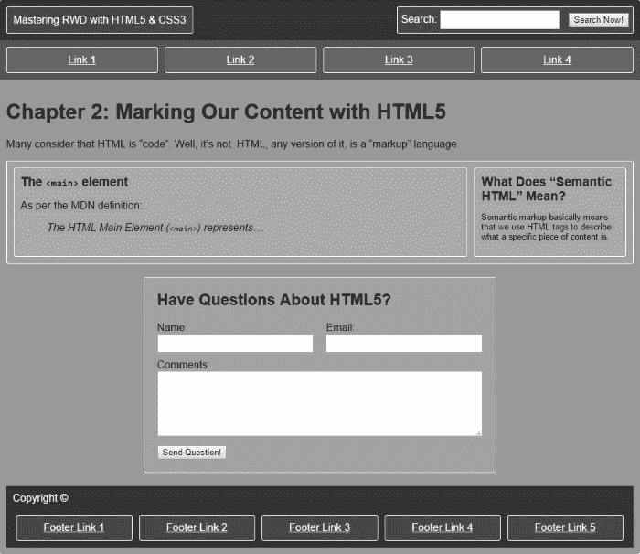
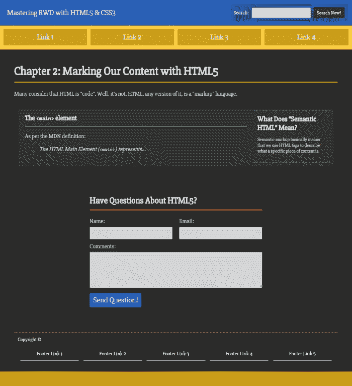
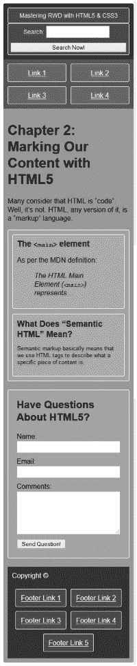
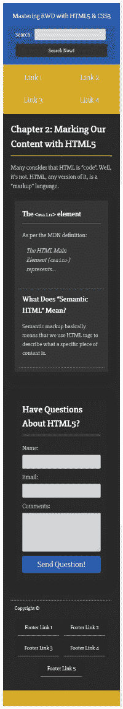

# 第二章：用 HTML5 标记我们的内容

许多人认为 HTML 是*代码*。嗯，不是的。HTML——任何版本的 HTML——都是*标记*语言。

标记语言是一种可以被人类阅读和理解的计算机语言。它使用标签来定义内容的各个部分。HTML 和 XML 都是标记语言。

为了更好地区分，编码语言涉及更复杂的抽象、脚本、数据库连接、通过复杂协议以某种形式传输数据等等。编码确实是一个神奇的世界。

HTML 可以做到这一切，但它远没有那么复杂，更容易理解。

在本章中，我们将专注于标记内容背后的科学。内容可以以许多不同的形式呈现：文本、图像、视频、表单、错误消息、成功消息、图标等等。此外，特定类型的内容在浏览器中的行为或用户与之交互的方式将告诉我们应该将特定内容标记为什么类型的 HTML 元素。

例如，许多网页设计师将锚链接`<a href="#">开始 30 天试用</a>`*看起来像*按钮。许多网页开发人员使相同的锚链接*行为像*按钮。为什么不直接使用`<input type="button" value="开始 30 天试用">`元素呢？更好的是，使用`<button>开始 30 天试用</button>`元素，它的行为完全相同，更容易样式化，并且允许添加 HTML 内容。

我们的目标是尽可能地保持语义标记。语义标记基本上意味着我们使用 HTML 标签来描述特定内容是什么。保持语义标记有很多好处：

+   对于继承我们工作的其他网页设计师或开发人员也非常有帮助，因为他们将花费更少的时间来逆向工程我们所做的工作，更多的时间来增强它。

+   在可访问性方面也非常有帮助，因为它允许辅助技术将元素命名为它们本来的样子：一个按钮实际上是一个`<button>`，而不是一个被样式化成按钮的链接`<a href="#">`。

+   语义标记对 SEO 有很大的好处，因为它可以让搜索引擎更快、更准确地索引内容。

密切关注内容对于链条中的每个人都有很大帮助——帮助我们在项目中，帮助项目本身，最终帮助我们的用户，无论是否使用辅助技术。

我可以给你的最好建议是在标记内容时*倾听内容*；它会和你交流。真的会。

我们将在本章中涵盖以下主题：

+   HTML5 元素的实际应用

+   使用**Web Accessibility Initiative - Accessible Rich Internet Applications** (**WAI-ARIA**)地标角色来增加可访问性

+   响应式网页设计的重要元标签

+   带有 ARIA 角色和元标签的完整 HTML5 示例页面

那么，现在我们可以使用哪些 HTML 元素，以确保我们的网站/应用在所有浏览器中都能正常显示呢？答案是*所有元素*。

2014 年 10 月 28 日，W3C 完成了 HTML5 标准。然而，所有主要浏览器多年来一直支持 HTML5 元素。

对我们来说，这意味着即使在 W3C 完成 HTML5 标准之前，我们已经可以使用任何 HTML5 元素。所以，如果你一直在使用 HTML5 构建网站/应用，继续使用吧；如果你还没有因为任何特定原因开始使用 HTML5，那么现在是开始的时候了。

# <main>元素

根据**Mozilla** **Developer Network** (**MDN**)的定义：

> *HTML 主要元素(`<main>`)可以用作文档的主要内容的容器。主要内容区域包括与部分的中心主题直接相关或扩展的内容，或应用程序的中心功能。这些内容应该是文档独有的，不包括在一组文档中重复的内容，例如侧边栏、导航链接、版权信息、站点标志和搜索表单（除非文档的主要功能是作为搜索表单）。与`<article>`和`<section>`不同，这个元素不会对文档大纲产生影响。*

以下是关于`<main>`元素的几个重要要点：

+   页面的顶层内容应包含在`<main>`元素中。

+   内容应该是独占且独特的。

+   `<main>`元素不应包含在`<header>`、`<footer>`、`<nav>`、`<aside>`或`<article>`元素内。

+   每个页面只能有一个`<main>`元素。

考虑以下例子：

```html
<body>
    <main class="main-container" role="main">Content goes here
    </main>
</body>
```

### 提示

为了谨慎起见，使用 HTML 实体表示特殊字符，例如，和字符(&)是`&amp;`，省略号字符(…)是`&hellip;`。

# `<article>`元素

根据 MDN 的定义：

> *HTML 文章元素(`<article>`)代表文档、页面、应用程序或站点中的独立组成部分，旨在独立分发或重复使用，例如在联合中。这可以是论坛帖子、杂志或报纸文章、博客文章或任何其他独立的内容项。每个`<article>`应该被识别，通常通过在`<article>`元素的子元素中包含标题(`h1`-`h6`元素)来实现。*

以下是关于`<article>`元素的几个重要要点：

+   任何自包含的内容应放在`<article>`元素内。

“自包含”意味着如果我们将`<article>`元素及其内部内容移到另一个上下文中，所有内容都是不言自明的，不需要其他东西来理解。

+   `<article>`可以嵌套在另一个`<article>`元素内。

+   一个页面可以有多个`<article>`元素。

考虑以下例子：

```html
<body>
    <main class="main-container" role="main">
       <article class="article-container flex-container">
           Content goes here
       </article>
    </main>
</body>
```

# `<section>`元素

根据 MDN 的定义：

> *HTML 节元素(`<section>`)代表文档的一个通用部分，即内容的主题分组，通常带有标题。每个`<section>`应该被识别，通常通过在`<section>`元素的子元素中包含标题(`h1`-`h6`元素)来实现。*

以下是关于`<section>`元素的几个重要要点：

+   `<section>`元素可用于封装一组相关内容。这些相关内容不一定需要在页面上下文之外有意义。

+   使用`<section>`元素的一种安全有效的方式是将其放在`<article>`元素内。当然也可以单独使用`<article>`元素。建议在使用`<section>`元素时包含标题元素(`<h1>`、`<h2>`、`<h3>`等)，但不是必需的。

+   什么时候使用`<section>`元素，什么时候使用`<article>`元素可能会令人困惑。如果不确定，可以选择任何一个元素。

+   一个页面可以有多个`<section>`。

考虑以下例子：

```html
<body>
   <main class="main-container" role="main">
      <article class="article-container flex-container">
         <section class="main-content">
            <header>
               <h1>The <code>&lt;main></code> element  </h1>
            </header>
            <p>As per the MDN definition:</p>            <blockquote>
 <p>The HTML Main Element (<code>&lt;main></code>)                     represents&hellip;</p>
            </blockquote>
         </section>
      </article>
   </main>
</body>
```

# <aside>元素

根据 MDN 的定义：

> *HTML`<aside>`元素代表页面上与其余内容有轻微关联的内容部分，可以被视为与该内容分开的部分。这些部分通常表示为侧边栏或插入内容。它们通常包含侧边栏上的定义，例如词汇表中的定义；也可能包含其他类型的信息，例如相关广告；作者的传记；网络应用程序；博客上的个人资料信息或相关链接。*

以下是关于`<aside>`元素的几个重要要点：

+   与主要内容相关的内容可以包含在`<aside>`元素中。如果这些内容与主要内容分开，它们仍然可以独立存在。

+   在单个页面中可以有多个`<aside>`。

考虑以下例子：

```html
<body>
    <main class="main-container" role="main">
        <article class="article-container flex-container">
            <section class="main-content">
              <header>
                  <h1>The <code>&lt;main></code> element  </h1>
              </header>
              <p>As per the MDN definition:</p>
              <blockquote>
                  <p>The HTML Main Element (<code>&lt;main></code>) 
  represents&hellip;</p>
              </blockquote>
            </section>
 <aside class="side-content" role="complementary">
 <h2>What Does "Semantic HTML" Mean?</h2>
 <p>Semantic markup basically means that we use HTML tags 
 to describe what a specific piece of content is.</p>
 </aside>
         </article>
      </main>
</body>
```

### 提示

*切题内容*意味着内容涉及手头的主题，但不是主要信息的一部分。如果`<aside>`元素内的内容被移除，主要信息不会受到影响。

# `<header>`元素

通常，我们认为网站/应用的顶部部分是页眉，这是正确的。该顶部部分的编辑名称是*标志*。

然而，从 HTML5 的角度来看，*标志*和*页眉*之间有区别。

标志是网站/应用的主要页眉，只能有一个。它通常包含标志、一些导航，可能还有搜索字段等。页眉可以被认为是任何部分的顶部区域，可以有多个页眉。

请注意，我们还没有讨论`<header>`元素，至少目前还没有。

标志可以使用`<header>`元素构建，但`<header>`元素也可以在同一页面的其他部分使用。

以下是 MDN 的定义：

> *HTML `<header>`元素代表一组介绍性或导航辅助信息。它可能包含一些标题元素，还可能包含其他元素，如标志、包装部分的页眉、搜索表单等。*

以下是关于`<header>`元素的几个重要要点：

+   一个很好的经验法则是在`<section>`元素内使用`<header>`元素。

+   如果我们认为有必要，可以将标题(`h1`到`h6`)包装在`<header>`元素内，但这并不是一种常见做法或必需的。

+   在单个页面中可以有多个`<header>`元素。

在以下示例中，有两个突出显示的`<header>`部分，标志和`<section>`元素内的页眉：

```html
<body>
   <header class="masthead" role="banner">
 <div class="logo">Mastering RWD with HTML5 &amp; CSS3</div>
 <div class="search" role="search">
 <form>
 <label>Search:
 <input type="text" class="field">
 <button>Search Now!</button>
 </label>
 </form>
 </div>
 </header>
   <main class="main-container" role="main">
      <article class="article-container flex-container">
         <section class="main-content">
            <header>
 <h1>The <code>&lt;main></code> element</h1>
 </header>
            <p>As per the MDN definition:</p>
            <blockquote>
               <p>The HTML Main Element (<code>&lt;main></code>) represents&hellip;</p>
            </blockquote>
         </section>
         <aside class="side-content" role="complementary">
            <h2>What Does "Semantic HTML" Mean?</h2>
            <p>Semantic markup basically means that we use HTML tags to describe what a specific piece of content is.</p>
         </aside>
      </article>
   </main>
</body>
```

# `<footer>`元素

根据 MDN 的定义：

> *HTML 页脚元素(`<footer>`)代表其最近的分区内容或分区根元素的页脚。页脚通常包含有关该部分作者的信息、版权数据或相关文档的链接。*

以下是关于`<footer>`元素的几个重要要点：

+   它应始终包含有关其包含的父元素的任何信息。

+   尽管术语*页脚*暗示着页面、文章或应用的*底部部分*，但`<footer>`元素不一定非要在底部。

+   在单个页面中可以有多个`<footer>`元素。

考虑以下例子：

```html
<body>
    <header class="masthead" role="banner">
      <div class="logo">Mastering RWD with HTML5 &amp; CSS3</div>
      <div class="search" role="search">
         <form>
            <label>Search:
               <input type="text" class="field">
               <button>Search Now!</button>
            </label>
         </form>
      </div>
    </header>
    <main class="main-container" role="main">
      <article class="article-container flex-container">
         <section class="main-content">
            <header>
               <h1>The <code>&lt;main></code> element</h1>
            </header>
            <p>As per the MDN definition:</p>
            <blockquote>
               <p>The HTML Main Element (<code>&lt;main></code>) represents&hellip;</p>
            </blockquote>
         </section>
         <aside class="side-content" role="complementary">
            <h2>What Does "Semantic HTML" Mean?</h2>
            <p>Semantic markup basically means that we use HTML tags to describe what a specific piece of content is.</p>
         </aside>
      </article>
      <footer class="main-footer" role="contentinfo">
 <p>Copyright &copy;</p>
 <ul class="nav-container" role="navigation">
 <li><a href="#">Footer Link 1</a></li>
 <li><a href="#">Footer Link 2</a></li>
 <li><a href="#">Footer Link 3</a></li>
 <li><a href="#">Footer Link 4</a></li>
 <li><a href="#">Footer Link 5</a></li>
 </ul>
 </footer>
   </main>
</body>
```

# `<nav>`元素

根据 MDN 的定义：

> *HTML 导航元素(`<nav>`)代表页面中链接到其他页面或页面内部部分的部分：一个带有导航链接的部分。*

以下是关于`<nav>`元素的几个重要要点：

+   它用于对链接列表或集合进行分组。这些链接可以指向外部资源或站点/应用内的其他页面。

+   在`<nav>`元素内使用无序列表`<ul>`来构造链接是一种常见做法，因为这样更容易进行样式设置。

+   在`<header>`元素中包含`<nav>`也是一种常见做法，但不是必需的。

+   并非所有链接组都必须在`<nav>`元素内。如果我们在`<footer>`标签内有一组链接列表，那么在`<nav>`中也没有必要包含这些链接。

+   在单个页面中可以有多个`<nav>`元素，例如主导航、实用导航和`<footer>`导航。

考虑以下例子：

```html
<body>
    <header class="masthead" role="banner">
      <div class="logo">Mastering RWD with HTML5 &amp; CSS3</div>
      <div class="search" role="search">
         <form>
            <label>Search:
               <input type="text" class="field">
               <button>Search Now!</button>
            </label>
         </form>
      </div>
    </header>
    <nav class="main-nav" role="navigation">
 <ul class="nav-container">
 <li><a href="#">Link 1</a></li>
 <li><a href="#">Link 2</a></li>
 <li><a href="#">Link 3</a></li>
 <li><a href="#">Link 4</a></li>
 </ul>
 </nav>
    <main class="main-container" role="main">
      <article class="article-container flex-container">
         <section class="main-content">
            <header>
               <h1>The <code>&lt;main></code> element</h1>
            </header>
            <p>As per the MDN definition:</p>
            <blockquote>
               <p>The HTML Main Element (<code>&lt;main></code>) represents&hellip;</p>
            </blockquote>
         </section>
         <aside class="side-content" role="complementary">
            <h2>What Does "Semantic HTML" Mean?</h2>
            <p>Semantic markup basically means that we use HTML tags to describe what a specific piece of content is.</p>
         </aside>
      </article>
      <footer class="main-footer" role="contentinfo">
         <p>Copyright &copy;</p>
         <ul class="nav-container" role="navigation">
            <li><a href="#">Footer Link 1</a></li>
            <li><a href="#">Footer Link 2</a></li>
            <li><a href="#">Footer Link 3</a></li>
            <li><a href="#">Footer Link 4</a></li>
            <li><a href="#">Footer Link 5</a></li>
         </ul>
      </footer>
    </main>
</body>
```

# 使用 WAI-ARIA 地标角色来增加可访问性

网络最被忽视的一个方面是可访问性，除非你是致力于这个主题的团体的一部分。作为网页设计师和开发者，我们很少考虑残障用户如何访问网页并使用屏幕阅读器和其他辅助技术来访问我们的网站或应用程序。我们实际上更关心支持旧版浏览器，而不是增加产品的可访问性。

在本章中，我们将介绍**WAI-ARIA landmark roles**是什么，以及如何在我们的标记中轻松实现它们，以增强我们文档的语义，为那些使用辅助技术的用户在任何现代浏览器上使用键盘浏览我们的网站/应用程序时提供更好和愉快的体验。

### 注意

**WAI-ARIA**代表**Web Accessibility Initiative – Accessible Rich Internet Applications**。

## WAI-ARIA landmark roles

WAI-ARIA landmark roles 也可以称为*ARIA roles*，所以这是我们将使用的术语。

当在 HTML5 元素中实现 ARIA 角色时，它看起来像这样：

```html
<header role="banner">
```

我们可以使用多个 ARIA 角色，但在本书中，我们将专注于那些更容易实现并且能够有效增强我们网站/应用程序可访问性的角色。

### 横幅角色

以下是一些重要的要点需要记住：

+   这个角色通常应用于页面的顶部`<header>`。

+   页眉区域包含页面的最突出的标题。

+   通常，具有`role="banner"`的内容会在整个站点中持续出现，而不是在单个特定页面中出现。

+   每个页面/文档只允许一个`role="banner"`。

考虑以下示例：

```html
<header class="masthead" role="banner">
    <div class="logo">Mastering RWD with HTML5 &amp; CSS3</div>
    <div class="search" role="search">
      <form>
         <label>Search:
            <input type="text" class="field">
            <button>Search Now!</button>
         </label>
      </form>
    </div>
</header>

```

### 导航角色

以下是一些重要的要点需要记住：

+   这个角色通常应用于`<nav>`元素，但也可以应用于其他容器，如`<div>`或`<ul>`。

+   它描述了一组导航元素/链接。这些链接可以是用于导航站点或者出现在页面上的链接。

+   每个页面可以有多个`role="navigation"`。

考虑以下示例，其中角色应用于主要的`<nav>`元素：

```html
<nav class="main-nav" role="navigation">
    <ul class="nav-container">
      <li><a href="#">Link 1</a></li>
      <li><a href="#">Link 2</a></li>
      <li><a href="#">Link 3</a></li>
      <li><a href="#">Link 4</a></li>
    </ul>
</nav>

```

考虑以下示例，其中角色应用于页脚导航的`<ul>`元素：

```html
<footer class="main-footer" role="contentinfo">
    <p>Copyright &copy;</p>
    <ul class="nav-container" role="navigation">
      <li><a href="#">Footer Link 1</a></li>
      <li><a href="#">Footer Link 2</a></li>
      <li><a href="#">Footer Link 3</a></li>
      <li><a href="#">Footer Link 4</a></li>
      <li><a href="#">Footer Link 5</a></li>
    </ul>
</footer>
```

对于我们将`navigation`角色添加到哪个元素并没有特定的偏好。如果我们将其添加到`<nav>`元素或`<ul>`元素中，效果是一样的。

### 主要角色

以下是一些重要的要点需要记住：

+   这个角色通常应用于页面的`<main>`元素。

+   页面的主要/中心主题的容器应该标记有这个角色。

+   每个页面/文档只允许一个`role="main"`。

考虑以下示例：

```html
<body>
    <main class="main-container" role="main">Content goes here
 </main>
</body>
```

### 内容信息角色

以下是一些重要的要点需要记住：

+   这个角色通常应用于页面的主要`<footer>`元素。

+   这是包含有关文档/站点/应用程序的信息的部分。

+   如果该部分包含例如版权链接、脚注、隐私声明链接或条款和条件链接，那么它是`role="contentinfo"`的一个很好的候选者。

+   每个页面/文档只允许一个`role="contentinfo"`。

考虑以下示例：

```html
<footer class="main-footer" role="contentinfo">
    <p>Copyright &copy;</p>
    <ul class="nav-container" role="navigation">
      <li><a href="#">Footer Link 1</a></li>
      <li><a href="#">Footer Link 2</a></li>
      <li><a href="#">Footer Link 3</a></li>
      <li><a href="#">Footer Link 4</a></li>
      <li><a href="#">Footer Link 5</a></li>
    </ul>
</footer>

```

### 搜索角色

以下是一些重要的要点需要记住：

+   这个角色通常应用于页面/应用程序搜索功能所属的`<form>`元素。

+   如果搜索表单包裹在`<div>`元素中，这个角色也可以应用于该`<div>`元素。如果是这种情况，那么就不需要将其添加到子`<form>`元素中。

+   每个页面可以有多个`role="search"`，只要控件是实际的搜索功能。例如，在联系表单上使用`role="search"`是不正确和不语义化的。

考虑以下示例，其中角色应用于站点的搜索`<form>`元素：

```html
<div class="search">
 <form role="search">
      <label>Search:
         <input type="text" class="field">
         <button>Search Now!</button>
      </label>
 </form>
</div>
```

### 表单角色

以下是一些重要的要点需要记住：

+   这个角色通常应用于包含某种表单的`<div>`元素，*除了*站点/应用的主搜索表单，例如联系表单、注册表单、付款表单等。

+   不应该应用于实际的`<form>`元素，因为该元素已经具有默认的角色语义，可以帮助技术支持。

考虑以下示例：

```html
<div class="contact-form" role="form">
    <header>
      <h2>Have Questions About HTML5?</h2>
    </header>
    <form>
      <div class="flex-container">
         <label class="label-col">Name: <input type="text" class="field name" id="name" required></label>
         <label class="label-col">Email: <input type="email" class="field email" id="email" required></label>
      </div>
      <label for="comments">Comments:</label>
      <textarea class="comments" id="comments" cols="50" required></textarea>
      <button>Send Question!</button>
    </form>
</div>

```

### 补充角色

以下是一些重要的要点：

+   这个角色通常应用于`<aside>`元素。

+   它应该用于包含支持内容的区域；即使与内容分开，它仍然可以独立理解。这基本上是`<aside>`元素的描述。

+   页面上可以有多个`role="complementary"`。

考虑以下示例：

```html
<aside class="side-content" role="complementary">
    <h2>What Does "Semantic HTML" Mean?</h2>
    <p>Semantic markup basically means that we use HTML tags to describe what a specific piece of content is.</p>
</aside>

```

### 注意

**WAI-ARIA 角色解释**

如果您对 ARIA 角色列表感兴趣，可以访问 Web 平台网站，那里的解释简单易懂：[`specs.webplatform.org/html-aria/webspecs/master/#docconformance`](https://specs.webplatform.org/html-aria/webspecs/master/#docconformance)

## RWD 的重要元标记

网页设计师和开发人员使用元标记的方式有很多，但这些广泛的解释超出了本书的范围，所以我们将专注于对 RWD 有用且按预期工作的一些要点。

以下元标记对我们的响应式网站/应用非常重要。这些元标记不仅适用于 HTML5 页面，它们也适用于任何 HTML 版本。

让我们开始吧。

### 视口元标记

`viewport`元标记是 RWD 中最重要的元标记。它是由苹果在其移动 Safari 浏览器中引入的。现在，其他移动浏览器也支持它。奇怪的是，这个元标记并不属于任何网页标准，但如果我们希望我们的响应式网站/应用在小屏幕上正确显示，它是必不可少的。

这个元标记的推荐语法如下：

```html
<meta name="viewport" content="width=device-width, initial-scale=1">
```

以下是一些重要的要点：

+   `name="viewport"`指令描述了元标记的类型。

+   `content="width=device-width, initial-scale=1"`指令执行了几项任务：

+   `width`属性定义了`viewport`元标记的大小。我们也可以使用特定的像素宽度，例如`width=960`。

+   `device-width`值是 CSS 像素中 100%缩放时屏幕的宽度。

+   `initial-scale`值定义了页面首次加载时应显示的缩放级别。1 等于 100%缩放，1.5 等于 150%缩放。

+   使用这种语法，用户可以根据需要进行缩放。这是用户体验的最佳实践。

### 注意

本书强烈不建议使用以下`viewport`属性：`maximum-scale=1`和`user-scalable=no`。通过使用这些`viewport`属性，我们剥夺了用户在我们的网站/应用中进行缩放的能力。我们永远不知道缩放对任何人都可能很重要，所以最好远离包含这些 viewport 属性。

为了帮助尚未响应式的网站在小屏幕上显示得更好，添加网站构建时的特定像素宽度。例如，如果一个网站宽度为 960px，就给它添加这个`viewport`元标记：

```html
<meta name="viewport" content="width=960">
```

如果您对`viewport`元标记的详细阅读感兴趣，MDN 解释得很好：[`developer.mozilla.org/en/docs/Mozilla/Mobile/Viewport_meta_tag`](https://developer.mozilla.org/en/docs/Mozilla/Mobile/Viewport_meta_tag)。

### X-UA-Compatible 元标记

`X-UA-Compatible`元标记仅针对 Internet Explorer 及其兼容性视图功能。众所周知，Microsoft 在 IE8 中引入了兼容性视图。

这个元标记的推荐语法如下：

```html
<meta http-equiv="X-UA-Compatible" content="IE=edge">
```

以下是一些重要的要点：

+   `http-equiv="X-UA-Compatible"`指令告诉 IE 需要使用特定的渲染引擎来渲染页面。

+   `content="IE=edge"`指令告诉 IE 应该使用其最新的渲染 HTML 和 JavaScript 引擎。

+   使用这个元标记来触发 IE 的最新 HTML 和 JavaScript 引擎非常好，因为 IE 的最新版本总是具有最新的安全更新和对更多功能的支持。

### 提示

不再需要使用`chrome=1`值，因为 Chrome Frame 在 2014 年 2 月被停用了。

### 注意

Google Chrome Frame 是一个针对旧版本 IE 的插件。安装后，它会替换 IE 中的某些模块，如渲染和 JavaScript 引擎，从而改善用户体验。换句话说，它就像在 IE 上安装了一个小版本的 Google Chrome。

### 字符集元标记

`charset`元标记告诉浏览器使用哪种字符集来解释内容。有人说包含它并不那么重要，因为服务器本身会通过 HTTP 头将字符集发送给浏览器。但在我们的页面中包含它总是一个好的措施。

如果 HTML 中没有声明`charset`，并且服务器没有将字符集发送给浏览器，那么一些特殊字符可能会显示不正确。

在 HTML5 中，这个元标记的推荐语法是这样的：

```html
<meta charset="utf-8">
```

以下是一些重要的要点需要记住：

+   这个元标记是专门为 HTML5 文档创建的。主要好处是写的代码更少。

+   对于 HTML 4 和 XHTML，你应该使用以下语法`：`

```html
<meta http-equiv="Content-Type" content="text/html; charset=UTF-8">
```

+   另一个常见的值是`ISO-8859-1`，但`UTF-8`更广泛使用，因为浏览器正确解释内容的机会更大。

### 注意

**UTF-8**代表**Unicode 转换** **格式-8**。

# 一个带有 ARIA 角色和元标记的完整 HTML5 示例页面

现在我们已经了解了一些基本的 HTML5 元素，它们可以应用的 ARIA 角色，以及适合显示的正确元标记，让我们在一个完整的 HTML5 页面中将它们可视化：

```html
<!DOCTYPE html>
<html>
<head>
 <meta charset="utf-8">
 <meta http-equiv="X-UA-Compatible" content="IE=edge">
 <meta name="viewport" content="width=device-width, initial-scale=1">
    <title>Mastering RWD with HTML5 &amp; CSS3</title>
    <link rel="stylesheet" href="css/site-styles.css">
</head>
<body>
<header class="masthead" role="banner">
    <div class="logo">Mastering RWD with HTML5 &amp; CSS3</div>
    <div class="search" role="search">
      <form>
         <label>Search:
            <input type="text" class="field">
            <button>Search Now!</button>
         </label>
      </form>
    </div>
</header>
    <nav class="main-nav" role="navigation">
      <ul class="nav-container">
            <li><a href="#">Link 1</a></li>
            <li><a href="#">Link 2</a></li>
            <li><a href="#">Link 3</a></li>
            <li><a href="#">Link 4</a></li>
        </ul>
    </nav>
    <main class="main-container" role="main">
      <h1>Chapter 2: Marking Our Content with HTML5</h1>
      <p>Many consider that HTML is "code". Well, it's not. HTML, any version of it, is a "markup" language. </p>
      <article class="article-container flex-container">
         <section class="main-content">
            <header>
               <h1>The <code>&lt;main></code> element  </h1>
            </header>
            <p>As per the MDN definition:</p>
            <blockquote>
               <p>The HTML Main Element (<code>&lt;main></code>) represents&hellip;</p>
            </blockquote>
         </section>
         <aside class="side-content" role="complementary">
            <h2>What Does "Semantic HTML" Mean?</h2>
            <p>Semantic markup basically means that we use HTML tags to describe what a specific piece of content is.</p>
         </aside>
      </article>
      <div class="contact-form" role="form">
         <header>
            <h2>Have Questions About HTML5?</h2>
         </header>
         <form>
            <div class="flex-container">
               <label class="label-col">Name: <input type="text" class="field name" id="name" required></label>
               <label class="label-col">Email: <input type="email" class="field email" id="email" required></label>
            </div>
            <label for="comments">Comments:</label>
            <textarea class="comments" id="comments" cols="50" required></textarea>
            <button>Send Question!</button>
         </form>
      </div>
      <footer class="main-footer" role="contentinfo">
         <p>Copyright &copy;</p>
         <ul class="nav-container" role="navigation">
            <li><a href="#">Footer Link 1</a></li>
            <li><a href="#">Footer Link 2</a></li>
            <li><a href="#">Footer Link 3</a></li>
            <li><a href="#">Footer Link 4</a></li>
            <li><a href="#">Footer Link 5</a></li>
         </ul>
      </footer>
    </main>
</body>
</html>
```

作为奖励，让我们来看看将所有这些整合成一个漂亮响应式页面的 SCSS。

### 注意

以下的 SCSS 代码是使用桌面优先的方法构建的，因为我们将会逐步进入移动优先的方式。

这是 SCSS：

```html
//Media Query Mixin - Desktop-first
@mixin forSmallScreens($media) {
   @media (max-width: $media/16+em) { @content; }
}
//Nav
.main-nav {
    max-width: 980px;
    margin: auto;
    padding: 10px 5px;
    background: #555;
    @include forSmallScreens(420) {
       padding: 5px 0;
    }
}

//All Navigations
.nav-container {
    display: flex;
    justify-content: center;
    list-style-type: none;
    margin: 0;
    padding: 0;
    @include forSmallScreens(420) {
       flex-wrap: wrap;
    }
    li {
       display: flex;
       width: 100%;
       margin: 0 5px;
       text-align: center;
       @include forSmallScreens(420) {
          display: flex;
          justify-content: center;
          flex-basis: 45%;
          margin: 5px;
       }
    }
    a {
       @extend %highlight-section;
       display: flex;
       justify-content: center;
       align-items: center;
       width: 100%;
       padding: 10px;
       color: white;
    }
}

//Header
.masthead {
    display: flex;
    justify-content: space-between;
    max-width: 980px;
    margin: auto;
    padding: 10px;
    background: #333;
    border-radius: 3px 3px 0 0;
    @include forSmallScreens(700) {
       display: block;
       text-align: center;
    }
}

.logo {
    @extend %highlight-section;
    padding: 0 10px;
    color: white;
    line-height: 2.5;
    @include forSmallScreens(420) {
       font-size: .85em;
    }
}

//Search field
.search {
    @extend %highlight-section;
    padding: 5px;
    color: white;
    @include forSmallScreens(420) {
       font-size: .85em;
    }
    .field {
       width: auto;
       margin: 0 10px 0 0;
    }
    button {
       @include forSmallScreens(420) {
          width: 100%;
          margin-top: 10px;
       }
    }
}

//Main Container
.main-container {
    max-width: 980px;
    margin: auto;
    padding: 10px;
    background: #999;
    border-radius: 0 0 3px 3px;
}

//Article
.article-container {
    @extend %highlight-section;
    margin-bottom: 20px;
    padding: 10px;
}

    //Main Content of the Page
    .main-content {
       @extend %highlight-section;
       width: 75%;
       margin-right: 10px;
       padding: 10px;
       @include forSmallScreens(600) {
          width: 100%;
       }
       h1 {
          margin: 0;
       }
    }

    //Side Content
    .side-content {
       @extend %highlight-section;
       width: 25%;
       padding: 10px;
       font-size: .8em;
       background: #999;
       @include forSmallScreens(600) {
          width: 100%;
          margin-top: 12px;
       }
       h2 {
          margin: 0;
       }
       ol {
          padding-left: 20px;
       }
       a {
          color: #eee;
       }
    }

//Contact Form
.contact-form {
    @extend %highlight-section;
    width: 540px;
    margin: 0 auto 20px;
    padding: 20px;
    @include forSmallScreens(600) {
       width: 100%;
    }
    h2 {
       margin-top: 0;
    }
    label, button {
       display: block;
    }
    .comments {
       height: 100px;
    }
    .flex-container {
       justify-content: space-between;
       @include forSmallScreens(600) {
          display: flex;
       }
       @include forSmallScreens(400) {
          display: block;
       }
    }
    .label-col {
       width: 48%;
       @include forSmallScreens(400) {
          width: 100%;
       }
    }
}

//Form Elements
.field,
.comments {
    width: 100%;
    margin-bottom: 10px;
    padding: 5px;
    @include forSmallScreens(420) {
       width: 100%;
    }
}

//Footer
.main-footer {
    color: white;
    padding: 10px;
    background: #333;
    p {
       margin-top: 0;
    }
}

//Placeholder
%highlight-section {
    border: white 1px solid;
    border-radius: 3px;
    background: rgba(white, .1);
}

//Helper Classes
.flex-container {
    display: flex;
    @include forSmallScreens(600) {
       display: block;
    }
}

//General
*,
*:before,
*:after {
    box-sizing: border-box;
}

body {
    font-family: Arial, "Helvetica Neue", Helvetica, sans-serif;
}

blockquote {
    font-style: italic;
}
```

# 桌面和移动设备的输出截图

以下截图代表了线框和样式化模式下的原型/演示。您将能够看到桌面（宽 980 像素）以及移动设备（宽 320 像素）的输出。

在线框截图中，白色轮廓和不同色调的灰色背景基本上是视觉提示，帮助你理解每个元素的边界在哪里，而不必使用浏览器的开发工具。

另一方面，样式化截图向你展示了用少量 CSS 可以实现什么。线框和样式化页面都使用完全相同的标记。

页面的演示可以在这里看到：

+   访问[`codepen.io/ricardozea/pen/717c6ab2dab9646f814f0429153a6777`](http://codepen.io/ricardozea/pen/717c6ab2dab9646f814f0429153a6777)查看线框页面

+   访问[`codepen.io/ricardozea/pen/244886bac2434369bd038294df72fdda`](http://codepen.io/ricardozea/pen/244886bac2434369bd038294df72fdda)查看样式化页面

让我们看看截图。

桌面输出[线框]如下：



桌面输出[样式化]如下：



移动设备的输出[线框]如下：



移动设备的输出[样式化]如下：



# 总结

这是一个简短的章节，但它肯定充满了重要信息。

我们学到了 HTML 是标记而不是代码。我们还看到了各种 HTML5 元素的作用。这将帮助我们理解可以用哪些 HTML5 元素来标记我们提供的内容。

我们还学会了如何使用 ARIA 角色标记 HTML，以使我们的站点/应用对使用辅助技术的用户更加可访问。

我们还讨论了一些重要的元标记，这些标记将帮助您的页面和标记在不同设备上正确显示，并触发 Internet Explorer 中的最新 HTML 和 JavaScript 引擎。

最后，我们看到所有上述主题在一个实际的完整 HTML5 示例中实现，以及它的 SCSS。该示例是使用桌面优先方法构建的；这将使我们能够有条不紊地将我们的思维模式转变为移动优先技术。

下一章将讨论何时以及如何使用移动优先和/或桌面优先方法，以及如何使用每种方法论。拿出你的水晶球！
