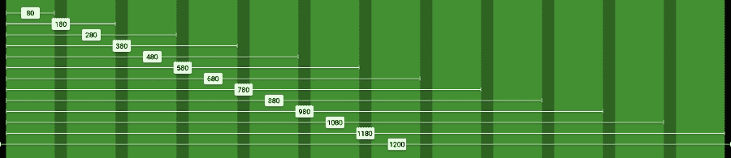
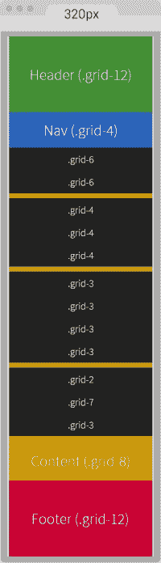
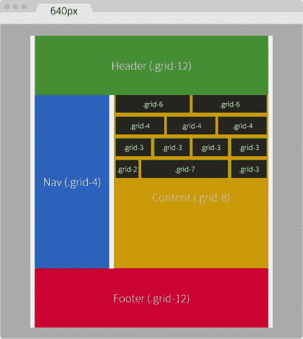
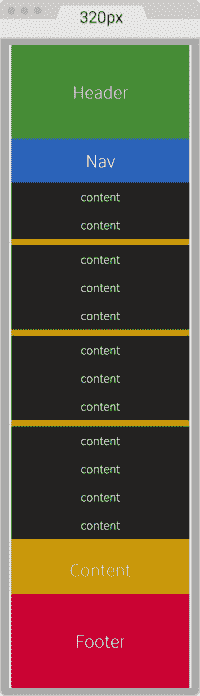
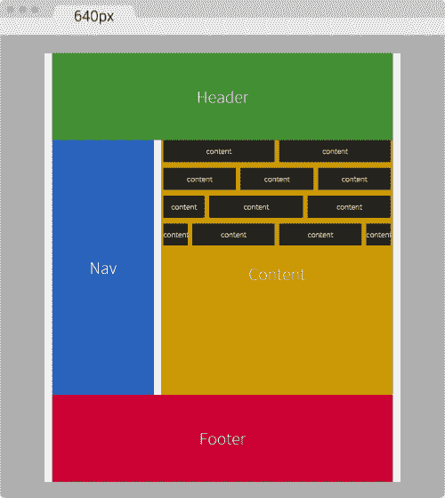

# 第四章：CSS 网格、CSS 框架、UI 工具包和 Flexbox 用于 RWD

**响应式网页设计** (**RWD**)为所有构建响应式网站和应用程序的人引入了一层新的工作。当我们必须在不同设备和不同尺寸上测试我们的工作时，无论内容在哪里中断，我们都需要添加一个断点并重新测试。

这可能会发生很多次。因此，构建网站或应用程序将比以前花费更多的时间。

为了使事情更有趣，作为网页设计师和开发人员，我们需要注意内容在不同尺寸上的布局以及网格如何帮助我们将内容结构化到不同的布局中。

既然我们提到了网格，你有没有问过自己，“我们到底用网格做什么？”

借用设计行业的一些术语来回答这个问题，我们使用网格来让内容具有节奏、比例和平衡。目标是让使用我们网站/应用的人对我们的内容有更愉快的体验，因为它将更容易扫描（节奏）、更容易阅读（比例）和有组织（平衡）。

为了加快设计和构建过程，同时保持所有内容在不同尺寸下正确格式化，许多作者和公司创建了包含网格以及许多其他功能和样式的 CSS 框架和 CSS 网格，可以通过使用简单的类名来利用。

随着时间的推移，浏览器开始支持越来越多的 CSS3 属性，比如 Flexbox，使用布局将变得更加容易。这将使 CSS 框架中的网格几乎变得不必要。

让我们看看 CSS 网格、CSS 框架、UI 工具包和 Flexbox 是什么，以及它们如何帮助我们实现 RWD。

在本章中，我们将涵盖以下主题：

+   什么是网格？

+   CSS 网格

+   CSS 网格在 RWD 中的优缺点

+   CSS 框架

+   UI 工具包

+   CSS 框架在 RWD 中的优缺点

+   创建自定义 CSS 网格

+   使用自定义 CSS 网格构建示例页面

+   使用 Flexbox

+   使用 Flexbox 构建示例页面

# 什么是网格？

网格是一组视觉指南（垂直、水平或两者兼有，因此称为*网格*），它们有助于定义元素的放置位置。一旦元素被放置，我们就得到了一个*布局*。

使用网格的好处是放置在上面的元素将在页面上具有和谐的流动，增强用户体验，提高可读性、布局一致性和元素之间的良好比例。

# CSS 网格

CSS 网格基本上是由形成列的垂直指南的组合。这些列的属性在 CSS 文件中定义。该文件包含一个具有特定宽度的类列表，与特定网格构建的列数相匹配。

我们在第三章中已经见过了，当时我们使用**980 Grid System** (**980GS**)来改造一个旧的固定宽度站点。这是 SCSS 文件：

```html
*, *:before, *:after {
    box-sizing: border-box;
}

//Container
.container-12 {
     width: 980px;
     padding: 0 10px;
     margin: auto;
}
//Grid >> Global
.grid {
    &-1, &-2, &-3, &-4, &-5, &-6, &-7, &-8, &-9, &-10, &-11, &-12 {
        float: left;
        margin: 0 10px;
    }
}
//Grid >> 12 Columns
.container-12 {
    .grid-1  { width: 60px; }
    .grid-2  { width: 140px; }
    .grid-3  { width: 220px; }
    .grid-4  { width: 300px; }
    .grid-5  { width: 380px; }
    .grid-6  { width: 460px; }
    .grid-7  { width: 540px; }
    .grid-8  { width: 620px; }
    .grid-9  { width: 700px; }
    .grid-10 { width: 780px; }
    .grid-11 { width: 860px; }
    .grid-12 { width: 940px; }
}
//Clear Floated Elements - http://davidwalsh.name/css-clear-fix
.clear, .row {
    &:before,
    &:after { content: ''; display: table; }
    &:after { clear: both; }
}
//Use rows to nest containers
.row { margin-bottom: 10px;
    &:last-of-type { margin-bottom: 0; }
}
//Legacy IE
.clear { zoom: 1; }
```

### 提示

记住，我们将 960GS 变成了 980GS，因为内容看起来离主容器的边缘太近，主容器的左右各有 10px 的间距。因此，我们在每一侧都添加了 10px，并将主容器的宽度设为 980px。

因为我们正在使用 HTML5 和 CSS3 掌握 RWD，让我们看看相同的 980GS，使用百分比使其流动起来。

RWD 的魔法公式是*(目标 ÷ 上下文) x 100 = 结果 %*。

在这种情况下，我们的上下文是 980px，如下所示：

```html
//Container
.container-12 {
    width: 100%;
    max-width: 980px;
    padding: 0 1.02%;
    margin: auto;
}
//Grid >> Global
.grid {
    &-1, &-2, &-3, &-4, &-5, &-6, &-7, &-8, &-9, &-10, &-11, &-12 {
        float: left;
        margin: 0 1.02%;
    }
}
//Grid >> 12 Columns
.container-12 {
    .grid-1  { width: 6.12%; }
    .grid-2  { width: 14.29%; }
    .grid-3  { width: 22.45%; }
    .grid-4  { width: 30.61%; }
    .grid-5  { width: 38.78%; }
    .grid-6  { width: 46.94%; }
    .grid-7  { width: 55.10%; }
    .grid-8  { width: 63.27%; }
    .grid-9  { width: 71.43%; }
    .grid-10 { width: 79.59%; }
    .grid-11 { width: 87.76%; }
    .grid-12 { width: 95.92%; }
}
//Clear Floated Elements - http://davidwalsh.name/css-clear-fix
.clear, .row {
  &:before,
  &:after { content: ''; display: table; }
  &:after { clear: both; }
}
//Use rows to nest containers
.row { margin-bottom: 10px;
  &:last-of-type { margin-bottom: 0; }
}
//Legacy IE
.clear { zoom: 1; }
```

在网页设计中，网格通常由 12 或 16 列组成。960GS 几乎是最著名的之一，尽管它一直是一个固定宽度的网格。但其他作者已经将其移植成流动的，比如*Fluid 960 Grid System*，但不是响应式的。960GS 还有 24 列的选项，但不像 12 列版本那么受欢迎。

还有其他用于网页设计的网格，它们没有定义的框架宽度或列数，而是可以有无限数量的列，比如基于**自适应 Web 设计**（**AWD**）的*无框网格*。这意味着主容器的宽度*捕捉*到由它容纳的列数计算出的特定断点。

## CSS 网格用于 RWD 的优缺点

列出 CSS 网格用于 RWD 的优缺点的想法是，当我们计划使用某种类型的网格时，我们应该能够做出最明智的决定。这有助于澄清客户的期望和我们自己的期望，因为使用某种网格将影响时间表、设计、布局和许多 UX 因素。

优点如下：

+   布局元素变得更容易，因为列作为放置的指南。

+   如果使用预先构建的 CSS 网格，则无需进行任何数学计算来处理列和间距宽度。这已经由网格的作者处理了。

+   我们可以更快地构建，因为我们只需要在我们的 HTML 容器中添加特定的类，而大部分布局将立即发生。

+   了解网页设计中的网格相对简单，因此在已建立的项目中增强/编辑其他人的标记和代码比如果根本没有使用 CSS 网格要少痛苦。

+   如果网格是响应式或自适应的，我们就不必太担心断点。

+   如果我们使用第三方 CSS 网格，任何跨浏览器问题都已经得到解决。

缺点如下：

+   一些 CSS 网格的学习曲线比其他的陡峭。

+   对于许多 CSS 网格，我们被锁定在作者创建的命名约定中。

+   我们可能需要改变/调整我们编写 HTML 的方式。

+   有太多 CSS 网格可供选择，对一些人来说可能会感到不知所措。

+   如果我们的内容在网格不支持的某些点上中断，我们必须花时间修改原始网格以适应每种情况。

# CSS 框架

CSS 框架是一组预构建功能，基本上帮助加快 Web 前端开发。这些 CSS 框架的作者已经处理了许多重要但细微的细节，因此决定使用它们的人可以专注于手头的任务，同时将许多决定留给 CSS 框架本身。

许多开发人员和设计师相信（我也是）任何 CSS 框架的真正价值在于它们的 CSS 网格，有时我们会不遗余力地提取 CSS 网格并自定义它以满足我们的需求。

在本书中，我们将专注于 CSS 网格来掌握 RWD，而不是从 CSS 框架或 UI 工具包中剥离一个（如果它确实提供一个）。我们很快就会谈到这一点。

以下列表描述了一些 CSS 框架的特点和特征：

+   CSS 框架专注于基于 Web 的开发，而不是原生移动应用程序。

+   CSS 框架总是提供 CSS 网格。

+   许多 UI 工具包还提供用户界面组件（就像 UI 工具包一样），例如滑块、分页、导航栏、排版、按钮等，以 HTML 和 CSS 的形式。

+   CSS 框架和面向 Web 的 UI 工具包都可以称为*前端框架*。

# UI 工具包

与 CSS 框架类似，还有另一种称为 UI 工具包的前端框架。然而，UI 工具包可以是一种独特的类型。

说实话，有时很难区分 CSS 框架和 UI 工具包。但不要过多地深究哪一个是哪一个，重要的是要理解我们首先为什么使用它们以及它们如何帮助我们构建更好、更快速的响应式网站和应用程序。

以下列表描述了一些 UI 工具包的特点和特征：

+   基本上有两种类型的 UI 工具包：一种是使用 Web 技术（HTML 和 CSS）构建的，可以用来原型化基于 Web 的应用程序，另一种是由（通常是）Photoshop（PSD）文件制作的，用来帮助设计本机移动应用程序的模拟和设计。

+   很少有面向网络的 UI 工具包提供某种网格。

+   UI 工具包专注于提供用户界面组件，如滑块、分页、导航栏、对话框、覆盖/模态、按钮、排版、工具提示、列表、手风琴、选项卡系统、旋转木马/幻灯片、表单等。

+   在面向网络的 UI 工具包中，架构非常模块化。这意味着每个组件都可以并入任何 CSS 框架。

# RWD 的 CSS 框架的优缺点

以 RWD 作为我们在布局与屏幕房地产方面做出的任何决定的主要驱动力，让我们来看看 CSS 框架的优点和不足之处：

优点如下：

+   它们非常有用，可以快速构建响应式原型，而不是显示静态线框。

+   跨浏览器问题已经得到解决。

+   它们以一种好的方式，迫使你创建基于网格的布局。

+   它们为构建提供了一个坚实的起点。

+   模块化允许你手动选择你想要的组件。例如，你可以只使用 CSS 网格模块，或者你可以使用`forms`模块。

+   更改样式以适应你的设计相对容易。

+   如果你对 CSS 不太擅长，你仍然可以使用 CSS 框架来实现自己的设计。

缺点如下：

+   它们可能会用你永远不会使用的 CSS 来膨胀你的项目。

+   如果你决定使用整个 CSS 框架，它们的占用空间很大。

+   你可能需要改变你的习惯和编写 HTML 和 CSS 的方式，以适应你正在使用的 CSS 框架。

+   它们可能会持有自己的观点，所以如果你不喜欢事物的命名方式，你几乎没有选择自定义。

+   定制 CSS 框架是可行的，但可能非常耗时和危险。将一个名称更改为其他名称，几乎没有办法知道对框架的其他部分会产生什么影响。

+   如果默认样式没有改变以适应你的品牌/设计，你的网站或应用将不会是独特的，看起来会像其他人的，失去了用户的信任。

+   如果需要构建简单的东西，使用 CSS 框架就太过了。

+   每个网站/应用程序或项目都是不同的，所以你可能最终会花费大量时间为每个项目更改和覆盖属性。

+   他们试图解决每一个前端问题。

现在我们已经看到了 CSS 网格、CSS 框架和 UI 工具包的优缺点，是时候做出决定并回答这个问题了：哪种方法对 RWD 最好？

答案并不是最令人鼓舞的，我承认，但这是事实：这取决于情况。

如果我们是自由职业者，自己做所有事情，或者在一个非常小的团队中工作，也许根本不需要使用任何框架。我们可以根据主要框架建立的原则自定义构建一些东西。显然，我们希望自动化任何重复的过程，以便高效利用我们的时间。

但如果我们在一个庞大的团队中工作，一个由内部和离岸资源组成的网络专业人士的大熔炉，也许使用框架会有所帮助。这是因为每个人都需要遵守框架的结构，以确保一切都是一致的。

# 创建自定义 CSS 网格

由于我们正在掌握 RWD，我们有奢侈的创造我们自己的 CSS 网格。然而，我们需要聪明地工作，而不是努力地工作。所以我们要做的是利用*可变网格系统*应用程序，并将其结果与我们自己的方法相结合，制作一个移动优先、流动、自定义构建和坚实的 CSS 网格，从中我们可以创建强大的响应式设计。

让我们列出我们的 CSS 网格需求：

+   它应该有 12 列。

+   它应该是 1200 像素宽，以适应 1280 像素的屏幕。

+   它应该是流体的，使用相对单位（百分比）来定义列和间距。

+   它应该使用移动优先方法。

+   它应该使用 SCSS 语法。

+   它应该可以重复使用在其他项目中。

+   它应该简单易懂。

+   它应该很容易扩展。

这就是我们的 1200 像素宽和 12 列宽 20px 的网格的样子：



左右两侧的填充都是 10px。我们将在此过程结束时将这 10px 转换为百分比。

## 进行数学计算

我们将使用 RWD 魔法公式：*(目标 ÷ 上下文) x 100 = 结果 %*。

我们的上下文将是 1200px。所以让我们转换一个列：*80 ÷ 1200 x 100 = 6.67%*。

对于两列，我们必须考虑 20px 的间距。换句话说，我们不能说两列确切地是 160px。这并不完全正确。

两列分别是：*80px + 20px + 80px = 180px*。

现在让我们转换两列：*180 ÷ 1200 x 100 = 15%*。

对于三列，现在我们必须考虑两个间距：*80px + 20px + 80px + 20px + 80px = 280px*。

现在让我们转换三列：*280 ÷ 1200 x 100 = 23.33%*。

现在你能看到模式了吗？每次我们添加一列，我们只需要将值增加 100。这个值也包括了间距！

检查我们刚才看到的网格的屏幕截图，你可以看到列的值递增 100。

所以，所有的方程式如下：

```html
1   column:    80 ÷ 1200 x 100 = 6.67%
2   columns:  180 ÷ 1200 x 100 = 15%
3   columns:  280 ÷ 1200 x 100 = 23.33%
4   columns:  380 ÷ 1200 x 100 = 31.67%
5   columns:  480 ÷ 1200 x 100 = 40%
6   columns:  580 ÷ 1200 x 100 = 48.33%
7   columns:  680 ÷ 1200 x 100 = 56.67%
8   columns:  780 ÷ 1200 x 100 = 65%
9   columns:  880 ÷ 1200 x 100 = 73.33%
10  columns:  980 ÷ 1200 x 100 = 81.67%
11  columns: 1080 ÷ 1200 x 100 = 90%
12  columns: 1180 ÷ 1200 x 100 = 98.33%

```

让我们为 12 列网格创建 SCSS：

```html
//Grid 12 Columns
.grid {
    &-1  { width:6.67%; }
    &-2  { width:15%; }
    &-3  { width:23.33%; }
    &-4  { width:31.67%; }
    &-5  { width:40%; }
    &-6  { width:48.33%; }
    &-7  { width:56.67%; }
    &-8  { width:65%; }
    &-9  { width:73.33%; }
    &-10 { width:81.67%; }
    &-11 { width:90%; }
    &-12 { width:98.33%; }
}
```

### 提示

使用连字符（`-`）来分隔单词可以更容易地选择代码编辑时的术语。

## 添加 UTF-8 字符集指令和 Credits 部分

不要忘记在文件顶部包含 UTF-8 编码指令，让浏览器知道我们正在使用的字符集。让我们通过在顶部添加一个 Credits 部分来装饰我们的代码。代码如下：

```html
@charset "UTF-8";

/*
 Custom Fluid & Responsive Grid System
 Structure: Mobile-first (min-width)
 Syntax: SCSS
 Grid: Float-based
 Created by: Your Name
 Date: MM/DD/YY
*/

//Grid 12 Columns
.grid {
    &-1  { width:6.67%; }
    &-2  { width:15%; }
    &-3  { width:23.33%; }
    &-4  { width:31.67%; }
    &-5  { width:40%; }
    &-6  { width:48.33%; }
    &-7  { width:56.67%; }
    &-8  { width:65%; }
    &-9  { width:73.33%; }
    &-10 { width:81.67%; }
    &-11 { width:90%; }
    &-12 { width:98.33%; }
}
```

### 提示

注意 Credits 是用 CSS 样式注释注释的：`/* */`。这种类型的注释，取决于我们如何编译我们的 SCSS 文件，不会被剥离。这样，Credits 总是可见的，这样其他人就知道谁编写了文件。这对团队可能有用，也可能没有。此外，显示 Credits 对文件大小的影响是微不可见的。

## 包括 box-sizing 属性和移动优先 mixin

包括`box-sizing`属性允许浏览器的盒模型考虑容器内的填充；这意味着填充被减去而不是添加，从而保持了定义的宽度。

由于我们的自定义 CSS 网格的结构将是移动优先的，我们需要包括处理这一方面的 mixin：

```html
@charset "UTF-8";

/*
    Custom Fluid & Responsive Grid System
    Structure: Mobile-first (min-width)
    Syntax: SCSS
    Grid: Float-based
    Created by: Your Name
    Date: MM/DD/YY
*/

*, *:before, *:after {
 box-sizing: border-box;
}

//Moble-first Media Queries Mixin
@mixin forLargeScreens($width) {
 @media (min-width: $width/16+em) { @content }
}

//Grid 12 Columns
.grid {
    &-1  { width:6.67%; }
    &-2  { width:15%; }
    &-3  { width:23.33%; }
    &-4  { width:31.67%; }
    &-5  { width:40%; }
    &-6  { width:48.33%; }
    &-7  { width:56.67%; }
    &-8  { width:65%; }
    &-9  { width:73.33%; }
    &-10 { width:81.67%; }
    &-11 { width:90%; }
    &-12 { width:98.33%; }
}
```

## 主容器和将 10px 转换为百分比值

由于我们使用移动优先方法，我们的主容器默认情况下将是 100%宽；但我们还将给它一个最大宽度为 1200px，因为要求是创建这样大小的网格。

我们还将把 10px 转换为百分比值，所以使用 RWD 魔法公式：*10 ÷ 1200 x 100 = 0.83%*。

然而，正如我们之前看到的，10px，或者在这种情况下 0.83%，不足够的填充会使内容看起来离主容器的边缘太近。所以我们将填充增加到 20px：*20 ÷ 1200 x 100 = 1.67%*。

我们还将使用`margin: auto;`来水平居中主容器。

### 提示

没有必要声明零值来使顶部和底部边距水平居中。换句话说，`margin: 0 auto;`是不必要的。只需声明`margin: auto;`就足够了。

现在让我们包括这些值：

```html
@charset "UTF-8";

/*
    Custom Fluid & Responsive Grid System
    Structure: Mobile-first (min-width)
    Syntax: SCSS
    Grid: Float-based
    Created by: Your Name
    Date: MM/DD/YY
*/

*, *:before, *:after {
 box-sizing: border-box;
}

//Moble-first Media Queries Mixin
@mixin forLargeScreens($width) {
 @media (min-width: $width/16+em) { @content }
}

//Main Container
.container-12 {
 width: 100%;
 //Change this value to ANYTHING you want, no need to edit anything else.
 max-width: 1200px;
 padding: 0 1.67%;
 margin: auto;
}

//Grid 12 Columns
.grid {
    &-1  { width:6.67%; }
    &-2  { width:15%; }
    &-3  { width:23.33%; }
    &-4  { width:31.67%; }
    &-5  { width:40%; }
    &-6  { width:48.33%; }
    &-7  { width:56.67%; }
    &-8  { width:65%; }
    &-9  { width:73.33%; }
    &-10 { width:81.67%; }
    &-11 { width:90%; }
    &-12 { width:98.33%; }
}
```

### 提示

在`padding`属性中，如果我们输入`0.83%`或`.83%`都是一样的。我们可以省略零。保持我们的代码尽可能简洁是一种良好的实践。这与当我们使用十六进制简写值时的原理相同：`#3336699`和`#369`是一样的。

## 使其移动优先

在小屏幕上，所有列都将是 100%宽。由于我们使用的是单列布局，我们不使用间距；这意味着我们至少现在不必声明边距。

在 640px 处，网格将启动并为每个列分配相应的百分比，因此我们将在`40em`（640px）媒体查询中包含列并将它们浮动到左侧。在这一点上，我们需要间距。因此，我们声明左右填充为`.83%`。

### 提示

我任意选择了`40em`（640px）作为起点。记住要创建基于内容而不是设备的断点。

代码如下：

```html
@charset "UTF-8";

/*
    Custom Fluid & Responsive Grid System
    Structure: Mobile-first (min-width)
    Syntax: SCSS
    Grid: Float-based
    Created by: Your Name
    Date: MM/DD/YY
*/

*, *:before, *:after {
    box-sizing: border-box;
}

//Moble-first Media Queries Mixin
@mixin forLargeScreens($width) {
    @media (min-width: $width/16+em) { @content }
}

//Main Container
.container-12 {
    width: 100%;
    //Change this value to ANYTHING you want, no need to edit anything else.
    max-width: 1200px;
    padding: 0 1.67%;
    margin: auto;
}

//Grid
.grid {
 //Global Properties - Mobile-first
 &-1, &-2, &-3, &-4, &-5, &-6, &-7, &-8, &-9, &-10, &-11, &-12 {
 width: 100%;
 }
 @include forLargeScreens(640) { //Totally arbitrary width, it's only a starting point.
 //Global Properties - Large screens
 &-1, &-2, &-3, &-4, &-5, &-6, &-7, &-8, &-9, &-10, &-11, &-12 {
 float: left;
 margin: 0 .83%;
 }
 //Grid 12 Columns
 .grid {
 &-1  { width:6.67%; }
 &-2  { width:15%; }
 &-3  { width:23.33%; }
 &-4  { width:31.67%; }
 &-5  { width:40%; }
 &-6  { width:48.33%; }
 &-7  { width:56.67%; }
 &-8  { width:65%; }
 &-9  { width:73.33%; }
 &-10 { width:81.67%; }
 &-11 { width:90%; }
 &-12 { width:98.33%; }
 }
}

```

## 添加行和浮动清除规则

如果我们在 HTML 结构中使用行或向标签添加`.clear`类，我们可以在单个嵌套规则中使用`:before`和`:after`伪元素声明所有的浮动清除值。

### 提示

在声明伪元素时，使用单冒号或双冒号是一样的。双冒号是 CSS3 语法，单冒号是 CSS2.1 语法。这个想法是为了能够一眼区分它们，以便开发人员可以知道它们是在哪个 CSS 版本上编写的。然而，IE8 及以下版本不支持双冒号语法。

浮动清除技术是对 David Walsh 的 CSS 片段的改编（[`davidwalsh.name/css-clear-fix`](http://davidwalsh.name/css-clear-fix)）。

我们还为行添加了一个底部间距为 10px 的规则，以便将它们彼此分开，同时从最后一行中去除该间距，以避免在底部创建不必要的额外间距。最后，我们为旧版 IE 添加了清除规则。

现在让我们包括这些规则：

```html
@charset "UTF-8";

/*
    Custom Fluid & Responsive Grid System
    Structure: Mobile-first (min-width)
    Syntax: SCSS
    Grid: Float-based
    Created by: Your Name
    Date: MM/DD/YY
*/

*, *:before, *:after {
    box-sizing: border-box;
}

//Moble-first Media Queries Mixin
@mixin forLargeScreens($width) {
    @media (min-width: $width/16+em) { @content }
}

//Main Container
.container-12 {
    width: 100%;
    //Change this value to ANYTHING you want, no need to edit anything else.
    max-width: 1200px;
    padding: 0 1.67%;
    margin: auto;
}

//Grid
.grid {
    //Global Properties - Mobile-first
    &-1, &-2, &-3, &-4, &-5, &-6, &-7, &-8, &-9, &-10, &-11, &-12 {
        width: 100%;
    }
    @include forLargeScreens(640) { //Totally arbitrary width, it's only a starting point.
    //Global Properties - Large screens
    &-1, &-2, &-3, &-4, &-5, &-6, &-7, &-8, &-9, &-10, &-11, &-12 {
        float: left;
        margin: 0 .83%;
    }
    //Grid 12 Columns
    .grid {
        &-1  { width:6.67%; }
        &-2  { width:15%; }
        &-3  { width:23.33%; }
        &-4  { width:31.67%; }
        &-5  { width:40%; }
        &-6  { width:48.33%; }
        &-7  { width:56.67%; }
        &-8  { width:65%; }
        &-9  { width:73.33%; }
        &-10 { width:81.67%; }
        &-11 { width:90%; }
        &-12 { width:98.33%; }
    }
}

//Clear Floated Elements - http://davidwalsh.name/css-clear-fix
.clear, .row {
 &:before,
 &:after { content: ''; display: table; }
 &:after { clear: both; }
}

//Use rows to nest containers
.row { margin-bottom: 10px;
 &:last-of-type { margin-bottom: 0; }
}

//Legacy IE
.clear { zoom: 1; }

```

让我们回顾一下我们的 CSS 网格要求：

+   **12 列**：从`.grid-1`到`.grid-12`。

+   **为了适应 1280px 屏幕而设置为 1200px 宽**：`.container-12`容器的`max-width: 1200px;`

+   **流动和相对单位（百分比）用于列和间距**：百分比从 6.67%到 98.33%。

+   **移动优先**：我们添加了移动优先的 mixin（使用`min-width`）并将网格嵌套其中。

+   **SCSS 语法**：整个文件都是基于 Sass 的。

+   **可重用**：只要我们使用 12 列并且使用移动优先的方法，我们可以多次使用这个 CSS 网格。

+   **简单易用和理解**：类名非常直观。`.grid-6`网格用于跨越 6 列的元素，`.grid-7`用于跨越 7 列的元素，依此类推。

+   **易于扩展**：如果我们想使用 980px 而不是 1200px，我们只需要改变`.container-12 max-width`属性中的值。由于所有元素都使用相对单位（百分比），一切都会按比例适应新的宽度 - 无论是*任何*宽度。如果你问我，这真是太棒了。

# 使用自定义 CSS 网格构建示例页面

这是我们在这个例子中将要使用的 HTML：

```html
<!DOCTYPE html>
<html>
<head>
    <meta charset="utf-8">
    <meta http-equiv="X-UA-Compatible" content="IE=edge">
    <meta name="viewport" content="width=device-width, initial-scale=1">
    <title>Mastering RWD with HTML5 &amp; CSS3</title>
    <link rel="stylesheet" href="css/site-styles.css">
    <!--[if lt IE 9]>
    <script src="img/html5.js">
	</script>
    <![endif]-->
</head>
<body>
    <h1>Basic Layout Using a Custom CSS Grid</h1>
    <main class="container-12 clear" role="main">
    <header class="grid-12" role="banner">Header (.grid-12)</header>
        <nav class="grid-4" role="navigation">Nav (.grid-4)</nav>
        <section class="grid-8">
          <div class="row">
              <div class="grid-6 black">.grid-6</div>
              <div class="grid-6 black">.grid-6</div>
          </div>
          <div class="row">
              <div class="grid-4 black">.grid-4</div>
              <div class="grid-4 black">.grid-4</div>
              <div class="grid-4 black">.grid-4</div>
          </div>
          <div class="row">
              <div class="grid-3 black">.grid-3</div>
              <div class="grid-3 black">.grid-3</div>
              <div class="grid-3 black">.grid-3</div>
              <div class="grid-3 black">.grid-3</div>
          </div>
          <div class="row">
              <div class="grid-2 black">.grid-2</div>
              <div class="grid-7 black">.grid-7</div>
              <div class="grid-3 black">.grid-3</div>
          </div>
          <p>Content (.grid-8)</p>
        </section>
    <footer class="grid-12" role="contentinfo">Footer (.grid-12)</footer>
    </main>
</body>
```

## 嵌套容器

请注意，有几个嵌套容器在它们自己的行内（黑色背景）。这里的想法是突出显示添加到 12 列的嵌套内容部分。

嵌套列是任何网格系统的主要优势。在这本书中，我们正在利用这种力量，以便不会以任何方式限制设计。

### 提示

我们使用 HTML5 Shiv polyfill 为 IE8 及以下版本添加 HTML5 支持。

在小屏幕上（320px 宽），容器如下所示：



在宽度为 40em（640px）及以上的大屏幕上，布局如下：



您可以在 CodePen 上看到我创建的演示[`codepen.io/ricardozea/pen/d6ab6e0293be9b6bac2e16ad37942ed5`](http://codepen.io/ricardozea/pen/d6ab6e0293be9b6bac2e16ad37942ed5)。

# 停止使用 CSS 网格，使用 Flexbox！

我打赌你没有看到这一点，哈！

事实上，Flexbox 是一种令人惊奇的 CSS 属性，它为布局提供了新的可能性。以下是关于 Flexbox 的一些事情：

+   它在现代浏览器中的浏览器支持是完美的。

+   IE8 和 IE9 不支持它。但不用担心，使用条件类技术来解决这两个浏览器非常简单，如第三章中提到的，*Mobile-first or Desktop-first?*

+   IE10 仅支持 2012 语法，但 Autoprefixer（在 Prepros 中）会自动为我们处理这些旧的供应商前缀。

+   在使用 Flexbox 时，我们需要小心，因为旧的`display: box;`语法会导致浏览器在布局中进行多次传递，从而降低性能。

+   相比之下，新/当前的语法`display: flex`;对性能没有任何影响。自从旧语法以来，浏览器性能问题现在已得到解决，所以我们应该没问题。

### 提示

Paul Irish 和 Ojan Vafai 在文章**Flexbox layout isn't slow**中对此进行了很好的解释，该文章可以在[`updates.html5rocks.com/2013/10/Flexbox-layout-isn-t-slow`](http://updates.html5rocks.com/2013/10/Flexbox-layout-isn-t-slow)找到。

让我们开始吧，好吗？

## 使用 Flexbox 构建示例页面

在下面的示例中，我们将使用 Flexbox 属性构建与使用自定义 CSS 网格构建的相同布局。这将帮助我们更好地理解 Flexbox 的强大之处，并最终*摆脱*完全使用 CSS 网格，同时在我们的 HTML 中保持更语义化的结构。

### 提示

Chris Coyer 的一篇很棒的文章**A Complete Guide to Flexbox**可以在[`css-tricks.com/snippets/css/a-guide-to-flexbox/`](https://css-tricks.com/snippets/css/a-guide-to-flexbox/)找到。

关于示例页面的一些注意事项：

+   我们在`<html>`元素中包含条件类，以支持旧版浏览器，并避免使用 JavaScript 文件依赖项从服务器请求。

+   由于我们不使用 CSS 网格，嵌套容器只会在其中显示术语**Content**。

+   我们将使用 HTML5 Shiv polyfill 来支持 IE8 对所有必要的 HTML5 标签。

+   由于 IE10 在 Flexbox 中存在一些数学计算问题，我们需要通过在`<html>`元素中添加`.ie10`类来定位它。我们将使用 Louis Lazaris 创建的一个简单脚本来实现这一点，该脚本位于 IE 排除条件注释中，以便 IE8/9 不运行该脚本。有关此脚本的所有信息可以在文章中找到：[`www.impressivewebs.com/ie10-css-hacks/`](http://www.impressivewebs.com/ie10-css-hacks/)。

### 提示

我们用于定位 IE10 的脚本不使用用户代理嗅探。UA 嗅探不被认为是一个好的做法。该脚本使用条件编译语句。有关`@cc_on`语句的更多信息可以在**Microsoft Developer Network** (**MSDN**)找到：[`msdn.microsoft.com/en-us/library/8ka90k2e(v=vs.94).aspx`](https://msdn.microsoft.com/en-us/library/8ka90k2e(v=vs.94).aspx)。

这是小屏幕（320px 宽）上 Flexbox 布局的样子：



这是大屏幕上的样子。这个屏幕宽度为 768px，但内容为`40em`（640px）：



### HTML

这是我们将在示例页面中使用的标记：

```html
<!DOCTYPE html>
<!--[if IE 8]> <html class="no-js ie8" lang="en"> <![endif]-->
<!--[if IE 9]> <html class="no-js ie9" lang="en"> <![endif]-->
<!--[if gt IE 9]><!--><html class="no-js" lang="en"><!--<![endif]-->
<head>
    <meta charset="utf-8">
    <meta name="viewport" content="width=device-width, initial-scale=1">
    <meta http-equiv="X-UA-Compatible" content="IE=edge">
    <title>Basic Layout Using Flexbox</title>
    <!--[if lt IE 9]>
      <script src="img/html5.js">
	  </script>
    <![endif]-->
	<!--[if !IE]><!-->
      <script>
        if (/*@cc_on!@*/false && document.documentMode === 10) {
          document.documentElement.className+=' ie10';
        }
      </script>
    <!--<![endif]-->
</head>
<body>
    <h1>Basic Layout Using Flexbox</h1>
    <main class="main-container" role="main">
        <header role="banner">Header</header>
        <!-- Flexible elements need to be wrapped in a container -->
        <div class="flex-container">
            <nav role="navigation">Nav</nav>
            <section>
                <div class="flex-container row-1">
                    <div class="level-1">content</div>
                    <div class="level-1">content</div>
                </div>
                <div class="flex-container row-2">
                    <div class="level-1">content</div>
                    <div class="level-1">content</div>
                    <div class="level-1">content</div>
                </div>
                <div class="flex-container row-3">
                    <div class="level-1">content</div>
                    <div class="level-1">content</div>
                    <div class="level-1">content</div>
                    <div class="level-1">content</div>
                </div>
                <div class="flex-container row-4">
                    <div class="level-1 content-a">content</div>
                    <div class="level-1 content-b">">content</div>
                    <div class="level-1 content-c">content</div>
                </div>
                <p>Content</p>
            </section>
        </div>
        <footer role="contentinfo">Footer</footer>
    </main>
</body>
</html>
```

### SCSS

SCSS 代码有几个部分与 CSS 网格中使用的代码类似。但是，有重要的区别。

让我们来分析一下。

我们将从创建 Credits 部分开始，`box-sizing: border-box;`参数用于考虑容器内部而不是外部的填充，首先是移动优先的 mixin 和主容器属性：

```html
/*
    Custom Fluid & Responsive Grid System
    Structure: Mobile-first (min-width)
    Syntax: SCSS
    Grid: Flexbox-based
    Created by: Your Name
    Date: MM/DD/YY
*/
*, *:before, *:after {
  box-sizing: border-box;
}
//Moble-first Media Queries Mixin
@mixin forLargeScreens($media) {
    @media (min-width: $media/16+em) { @content }
}
//Main container
.main-container {
    width: 100%;
    //Change this value to ANYTHING you want, no need to edit anything else
    max-width: 1200px;
    //Any value you want
    padding: 0 1.67%;
    margin: auto;
}
```

### 添加 Flexbox 容器

现在，让我们为 Flexbox 容器添加属性，该容器在某种程度上类似于 CSS 网格中的`.row`。代码如下：

```html
/*
    Custom Fluid & Responsive Grid System
    Structure: Mobile-first (min-width)
    Syntax: SCSS
    Grid: Flexbox-based
    Created by: Your Name
    Date: MM/DD/YY
*/
*, *:before, *:after {
    box-sizing: border-box;
}
//Moble-first Media Queries Mixin
@mixin forLargeScreens($media) {
    @media (min-width: $media/16+em) { @content }
}
//Main container
.main-container {
    width: 100%;
  //Change this value to ANYTHING you want, no need to edit anything else
    max-width: 1200px;
    //Any value you want
    padding: 0 1.67%;
    margin: auto;
}
//Flexbox container
.flex-container {
 margin-bottom: 10px;
 //Remove the margin from the last flexbox container
 &:last-of-type {
 margin-bottom: 0;
 }
 @include forLargeScreens(640) {
 display: flex;
 }
}

```

正如你所看到的，我们添加了`margin-bottom: 10px;`来分隔内容行。然而，我们在最后一个 Flexbox 容器上移除了该边距，以防止在末尾产生不必要的额外填充。

然后，我们将包含针对 640px（`40em`）屏幕宽度的移动优先 mixin。这意味着我们**只**会在大屏幕上使用 Flexbox，但在小屏幕上，我们不会使用它。

### 提示

如果所有列的宽度相等，则无需使用 Flexbox。在我们的示例中，小屏幕上的列宽度为 100%。

#### Flexbox 容器内的 DIV

现在，让我们在大屏幕上为列添加`.83%`的左右边距。在小屏幕上，列没有边距。记住*10px = 0.83%*。

我们将使用带有星号/星号的属性选择器，以便可以针对所有包含类名中至少一个值为`level-`的 DIV 进行定位。我们还将删除第一个容器的左边距和最后一个容器的右边距，以便我们的 DIV 与其父容器的边缘对齐。代码如下：

```html
/*
    Custom Fluid & Responsive Grid System
    Structure: Mobile-first (min-width)
    Syntax: SCSS
    Grid: Flexbox-based
    Created by: Your Name
    Date: MM/DD/YY
*/
*, *:before, *:after {
    box-sizing: border-box;
}
//Moble-first Media Queries Mixin
@mixin forLargeScreens($media) {
    @media (min-width: $media/16+em) { @content }
}
//Main container
.main-container {
    width: 100%;
    //Change this value to ANYTHING you want, no need to edit anything else
    max-width: 1200px;
    //Any value you want
    padding: 0 1.67%;
    margin: auto;
}
//Flexbox container
.flex-container {
    margin-bottom: 10px;
    //Remove the margin from the last flexbox container
    &:last-of-type {
        margin-bottom: 0;
    }
    @include forLargeScreens(640) {
        display: flex;
    }
}
//DIVs inside the flex container
[class*="level-"] {
 width: 100%;
 @include forLargeScreens(640) {
 margin: 0 .83%;
 }
 &:first-of-type { margin-left: 0; }
 &:last-of-type { margin-right: 0; }
}

```

### 标题、页脚、导航和部分容器

现在，标题和页脚部分在小屏幕和大屏幕上都是 100%宽，因此它们不需要任何特定的规则。然而，这个示例为标题和页脚部分添加了一些属性，但只是出于样式原因，而不是布局原因。尽管如此，导航和部分容器确实根据可用屏幕宽度具有特定的宽度。

在小屏幕上，导航和部分容器的宽度为 100%，而在大屏幕上它们并排显示；导航容器在大屏幕上宽度为 33%，右边距为 1.67%（相当于 20px）以创建间距。部分容器在大屏幕上宽度为 65.33%。这里是公式：*33% + 1.67% + 65.33 = 100%*。

让我们继续为导航和部分容器定义这些属性：

```html
/*
    Custom Fluid & Responsive Grid System
    Structure: Mobile-first (min-width)
    Syntax: SCSS
    Grid: Flexbox-based
    Created by: Your Name
    Date: MM/DD/YY
*/
*, *:before, *:after {
    box-sizing: border-box;
}
//Moble-first Media Queries Mixin
@mixin forLargeScreens($media) {
    @media (min-width: $media/16+em) { @content }
}
//Main container
.main-container {
    width: 100%;
    //Change this value to ANYTHING you want, no need to edit anything else
    max-width: 1200px;
    //Any value you want
    padding: 0 1.67%;
    margin: auto;
}
//Flexbox container
.flex-container {
    margin-bottom: 10px;
    //Remove the margin from the last flexbox container
    &:last-of-type {
        margin-bottom: 0;
    }
    @include forLargeScreens(640) {
        display: flex;
    }
}
//DIVs inside the flex container
[class*="level-"] {
 width: 100%;
 @include forLargeScreens(640) {
 margin: 0 .83%;
 }
 &:first-of-type { margin-left: 0; }
 &:last-of-type { margin-right: 0; }
}
//Nav
nav {
 width: 100%;
 @include forLargeScreens(640) {
 width: 33%;
 margin-right: 1.67%;
 }
}
//Content area
section {
 width: 100%;
 @include forLargeScreens(640) {
 width: 65.33%;
 }
}

```

### 嵌套容器

最后，对于这个示例，我们将为具有黑色背景的不同内容部分定义宽度，这样你就可以清楚地了解如何嵌套容器。

基本上，我们正在为该行的第一个和第三个内容区域`.content-a`和`.content-c`分配特定但不同的宽度。除非我们想要，否则不需要为第二个内容区域分配宽度。Flexbox 将使第二个容器完全占据第一个和第三个内容区域之间的所有剩余空间。

### 提示

IE10 在计算嵌套容器值时存在问题，因此我们需要为这些容器创建特定的宽度。我们将在为 IE8 和 IE9 创建的同一规则中包含 IE10 的宽度。

我使用任意值如 30%和 42%是为了向你展示，我们可以随意调整这些值，而 Flexbox 会尽量保持这些比例，只要有空间可用。

现在让我们为不同的嵌套容器添加这些属性：

```html
/*
    Custom Fluid & Responsive Grid System
    Structure: Mobile-first (min-width)
    Syntax: SCSS
    Grid: Flexbox-based
    Created by: Your Name
    Date: MM/DD/YY
*/
*, *:before, *:after {
    box-sizing: border-box;
}
//Moble-first Media Queries Mixin
@mixin forLargeScreens($media) {
    @media (min-width: $media/16+em) { @content }
}
.main-container {
    //Change this value to ANYTHING you want, no need to edit anything else.
    width: 100%;
    max-width: 1200px;
    //Any value you want
    padding: 0 1.67%;
    margin: auto;
}
//Flexbox container
.flex-container {
    margin-bottom: 10px;
    //Remove the margin from the last flexbox container
    &:last-of-type {
        margin-bottom: 0;
    }
    @include forLargeScreens(640) {
        display: flex;
    }
}
//DIVs inside the flex container
[class*="level-"] {
 width: 100%;
 @include forLargeScreens(640) {
 margin: 0 .83%;
 }
 &:first-of-type { margin-left: 0; }
 &:last-of-type { margin-right: 0; }
}
//Nav
nav {
 width: 100%;
 @include forLargeScreens(640) {
 width: 33%;
 margin-right: 1.67%;
 }
}
//Content area
section {
 width: 100%;
 @include forLargeScreens(640) {
 width: 65.33%;
 }
}
//Different width containers
.content- {
 @include forLargeScreens(640) {
 &a { width: 30%; }
 &c { width: 42%; }
 }
}

```

### 支持旧版 IE

使用 Flexbox 也会带来与 IE8、IE9 和 IE10 相关的注意事项。

与传统浏览器一样，调整数值并进行测试是获得最佳结果的关键。记住，网站在每个浏览器中不必看起来完全相同。

让我们澄清一些事情。类`.ie8`和`.ie9`来自`<html>`元素中的条件类。类`.ie10`来自 IE 排除条件注释中的脚本。因此，IE8 和 IE9 无法运行此脚本。但不用担心，解决方案很简单，你会看到的。让我们来看看它们。

#### 一条规则支配所有规则

我们首先要做的是为 IE8、IE9 和 IE10 创建一个规则。在这个规则中，我们将以百分比声明嵌套容器的宽度。事实上，我们也可以用像素声明这些宽度，但出于一致性的原因，我们将使用百分比，与所有其他响应式示例保持一致。

这就是那条规则……好吧，支配它们所有：

```html
/*
    Custom Fluid & Responsive Grid System
    Structure: Mobile-first (min-width)
    Syntax: SCSS
    Grid: Flexbox-based
    Created by: Your Name
    Date: MM/DD/YY
*/
*, *:before, *:after {
    box-sizing: border-box;
}
//Moble-first Media Queries Mixin
@mixin forLargeScreens($media) {
    @media (min-width: $media/16+em) { @content }
}
.main-container {
    //Change this value to ANYTHING you want, no need to edit anything else.
    width: 100%;
    max-width: 1200px;
    //Any value you want
    padding: 0 1.67%;
    margin: auto;
}
//Flexbox container
.flex-container {
    margin-bottom: 10px;
    //Remove the margin from the last flexbox container
    &:last-of-type {
        margin-bottom: 0;
    }
    @include forLargeScreens(640) {
        display: flex;
    }
}
//DIVs inside the flex container
[class*="level-"] {
    width: 100%;
    @include forLargeScreens(640) {
        margin: 0 .83%;
    }
    &:first-of-type { margin-left: 0; }
    &:last-of-type { margin-right: 0; }
}
//Nav
nav {
    width: 100%;
    @include forLargeScreens(640) {
        width: 33%;
        margin-right: 1.67%;
    }
}
//Content area
section {
    width: 100%;
    @include forLargeScreens(640) {
        width: 65.33%;
    }

}
//Different width containers
.content- {
    @include forLargeScreens(640) {
        &a { width: 30%; }
        &c { width: 42%; }
    }
}
//All IEs
.ie8, .ie9, .ie10 {
 //Exact values (desired width − 0.83% = result %) are commented, but they need tweaked to have one value for all IEs
 section {
 .row-1 .level-1 { width: 49.17%; }
 //Exact value is 32.17%
 .row-2 .level-1 { width: 32.20%; }
 //Exact value is 24.17%
 .row-3 .level-1 { width: 23.75%; }
 .row-4 {
 .content-a { width: 19.17%; }
 .content-b { width: 49.17%; }
 //Exact value is 29.17%
 .content-c { width: 28.3%; }
 }
 }
}

```

#### IE8 和 IE9 的规则

我们现在将声明处理 IE8 和 IE9 值的规则。我们声明`overflow: hidden;`来清除父容器中的浮动，即`.flex-container` DIVs。然后我们将 Nav 和 Content 部分浮动到左侧，并给它们一个高度；这个高度仅用于样式目的。

我们给 Nav 部分设置宽度和右边距为 1%，以保持简洁。我们也给 Content 部分分配了宽度。然后，我们使用 Footer 来清除浮动的 Nav 和 Content 部分，使用`clear: both;`和`zoom: 1;`参数以确保。

以下是 IE8/9 的 SCSS：

```html
/*
    Custom Fluid & Responsive Grid System
    Structure: Mobile-first (min-width)
    Syntax: SCSS
    Grid: Flexbox-based
    Created by: Your Name
    Date: MM/DD/YY
*/
*, *:before, *:after {
    box-sizing: border-box;
}
//Moble-first Media Queries Mixin
@mixin forLargeScreens($media) {
    @media (min-width: $media/16+em) { @content }
}
.main-container {
    //Change this value to ANYTHING you want, no need to edit anything else.
    width: 100%;
    max-width: 1200px;
    //Any value you want
    padding: 0 1.67%;
    margin: auto;
}
//Flexbox container
.flex-container {
    margin-bottom: 10px;
    //Remove the margin from the last flexbox container
    &:last-of-type {
        margin-bottom: 0;
    }
    @include forLargeScreens(640) {
        display: flex;
    }
}
//DIVs inside the flex container
[class*="level-"] {
    width: 100%;
    @include forLargeScreens(640) {
        margin: 0 .83%;
    }
    &:first-of-type { margin-left: 0; }
    &:last-of-type { margin-right: 0; }
}
//Nav
nav {
    width: 100%;
    @include forLargeScreens(640) {
        width: 33%;
        margin-right: 1.67%;
    }
}
//Content area
section {
    width: 100%;
    @include forLargeScreens(640) {
        width: 65.33%;
    }
}
//Different width containers
.content- {
    @include forLargeScreens(640) {
        &a { width: 30%; }
        &c { width: 42%; }
    }
}
//All IEs
.ie8, .ie9, .ie10 {
    //Exact values (desired width − 0.83% = result %) are commented, but they need tweaked to have one value for all IEs
    section {
        .row-1 .level-1 { width: 49.17%; }
        //Exact value is 32.17%
        .row-2 .level-1 { width: 32.20%; }
        //Exact value is 24.17%
        .row-3 .level-1 { width: 23.75%; }
        .row-4 {
          .content-a { width: 19.17%; }
          .content-b { width: 49.17%; }
          //Exact value is 29.17%
          .content-c { width: 28.3%; }
        }
    }
}
//IE8/9
.ie8, .ie9 {
 .flex-container { overflow: hidden; }
 nav, section { float: left; min-height: 440px; }
 nav { width: 29%; margin-right: 1%; }
 section { width: 70%; }
 footer { clear: both; zoom: 1; }
}

```

#### IE8 和 IE9 的特定规则

最后，我们通过一些规则来解决旧版浏览器的问题：为 IE8 制定一条规则，为 IE9 使用属性选择器制定另一条规则，适用于所有嵌套容器。

对于 IE8，我们给嵌套容器`display: inline-block;`而不是`float: left;`，以使嵌套容器的组在相应的行中居中。如果我们不这样做，所有行的右侧将会出现奇怪的间隙。我们还将声明左右边距为.2%。经过测试，任何更大的值都会使嵌套容器换行。

对于 IE9，我们将把嵌套容器浮动到左侧。

让我们来看看这两条规则：

```html
/*
  Custom Fluid & Responsive Grid System
    Structure: Mobile-first (min-width)
    Syntax: SCSS
    Grid: Flexbox-based
    Created by: Your Name
    Date: MM/DD/YY
*/
*, *:before, *:after {
    box-sizing: border-box;
}
//Moble-first Media Queries Mixin
@mixin forLargeScreens($media) {
    @media (min-width: $media/16+em) { @content }
}
.main-container {
    //Change this value to ANYTHING you want, no need to edit anything else.
    width: 100%;
    max-width: 1200px;
    //Any value you want
    padding: 0 1.67%;
    margin: auto;
}
//Flexbox container
.flex-container {
    margin-bottom: 10px;
    //Remove the margin from the last flexbox container
    &:last-of-type {
        margin-bottom: 0;
    }
  @include forLargeScreens(640) {
        display: flex;
    }
}
//DIVs inside the flex container
[class*="level-"] {
    width: 100%;
    @include forLargeScreens(640) {
        margin: 0 .83%;
    }
    &:first-of-type { margin-left: 0; }
    &:last-of-type { margin-right: 0; }
}
//Nav
nav {
    width: 100%;
    @include forLargeScreens(640) {
        width: 33%;
        margin-right: 1.67%;
    }
}
//Content area
section {
    width: 100%;
    @include forLargeScreens(640) {
        width: 65.33%;
    }
}
//Different width containers
.content- {
    @include forLargeScreens(640) {
        &a { width: 30%; }
        &c { width: 42%; }
    }
}
//All IEs
.ie8, .ie9, .ie10 {
    //Exact values (desired width − 0.83% = result %) are commented, but they need tweaked to have one value for all IEs
    section {
        .row-1 .level-1 { width: 49.17%; }
        //Exact value is 32.17%
        .row-2 .level-1 { width: 32.20%; }
        //Exact value is 24.17%
        .row-3 .level-1 { width: 23.75%; }
        .row-4 {
          .content-a { width: 19.17%; }
          .content-b { width: 49.17%; }
          //Exact value is 29.17%
          .content-c { width: 28.3%; }
        }
    }
}
//IE8/9
.ie8, .ie9 {
    .flex-container { overflow: hidden; }
    nav, section { float: left; min-height: 440px; }
    nav { width: 29%; margin-right: 1%; }
    section { width: 70%; }
    footer { clear: both; zoom: 1; }
}
//IE8
.ie8 {
 [class*="level-"] {
 display: inline-block;
 margin: 0 .2%;
 }
}
//IE9
.ie9 {
 [class*="level-"] { float: left; }
}

```

# 总结

在这一章中有很多内容需要消化，是吧？

然而，我们现在知道什么是网格，以及它的用途，这是我们许多人以前从未真正质疑过的东西。我们还更加了解 CSS 网格、CSS 框架和 UI 工具包；尽管你愿意使用它们，只要你清楚它们如何帮助我们在构建响应式网站和应用程序时更加高效。

使用传统的*浮动*技术创建我们的自定义 CSS 是一种识别模式的问题，其中添加新列只是通过增加 100 的值。现在，我们可以在任何宽度上创建一个 12 列网格。

借助 Flexbox，我们现在明白了响应式和流动布局的未来在哪里。由于有如此出色的浏览器支持，毫无疑问 Flexbox 是传统 CSS 网格的一个重要竞争者。在旧版浏览器中，使用条件类是支持复杂布局的一个不错的选择。此外，对于 IE10，我们需要使用条件编译脚本，只有 IE10 才能看到。因此，我们可以使用`.ie10`特定选择器来针对 IE10。

在下一章中，当我们谈论为小屏幕上的大手指构建响应式界面时，我们将深入了解可用性和用户体验的世界。是时候来测试那些大手指了！
