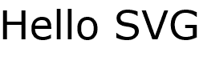
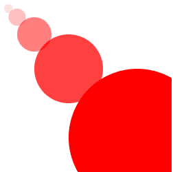
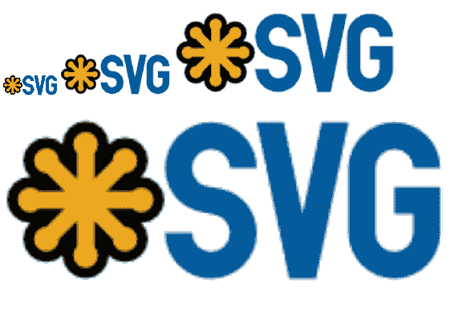
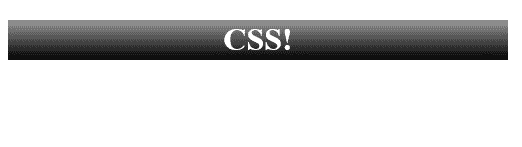
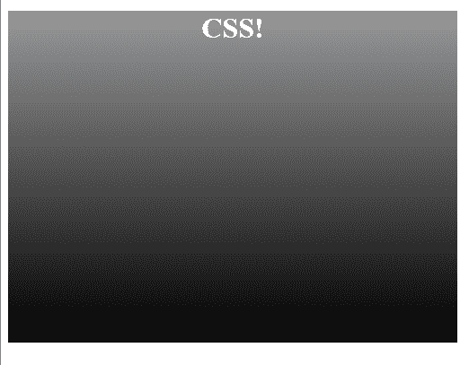
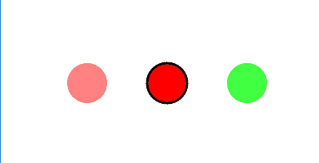

# 第一章：介绍可缩放矢量图形

**可缩放矢量图形**（**SVG**）是现代 Web 开发中最强大的组件之一。如果使用得当，它可以解决与图像和用户界面的设计、开发和交付相关的常见问题。

SVG 是一种基于 XML 的标记语言，用于定义图像。就像 HTML 是用于文本一样，SVG 是用于图像的。

SVG 非常灵活。它可以作为独立图像实现，并用作图像的`src`，也可以作为 CSS 中的背景图像，如 PNG、GIF 或 JPG。它也可以直接嵌入到 HTML 页面中，并通过 CSS 或 JavaScript 进行操作，以创建动画、可视化和交互式图表。

因此，如果 SVG 如此重要并且可以做这么多事情，为什么它还没有被更广泛地使用呢？为什么感觉我们只是挖掘了它的表面？为什么它仍然感觉像是一件*新*的东西？

问题是，并不是每个人都知道 SVG 的所有功能，也不是每个了解其功能的人都能以最佳方式实现 SVG 解决方案。本书旨在帮助所有对使用 SVG 感兴趣的人克服这些障碍，掌握这项重要的技术。

SVG 在现代 Web 开发技术中的地位经历了曲折的道路。SVG 于 1999 年发布（比 XHTML 还要早），由于当时主导的 Internet Explorer 浏览器缺乏支持，SVG 在接下来的十年中一直处于低迷状态。几年前，随着 JavaScript 库（如 Raphaël）的出现，为旧版本的 IE 添加了编程回退支持，这项技术开始受到青睐，而这种趋势自那时以来一直在增强。幸运的是，潮流已经完全扭转。所有现代版本的 Internet Explorer 和 Edge 都支持 SVG，所有浏览器制造商都对这项技术给予了强大的支持，包括 Chrome 和 Firefox。

通过本章结束时，您将了解 SVG 在各种形式中的基础知识。您将能够在网页和 CSS 中自信地使用现有的 SVG 图像，并且您将在掌握 SVG 的过程中迈出良好的一步。

本章将涵盖以下主题：

+   SVG 的基本语法和矢量图形介绍

+   将 SVG 用作图像的`src`文件的原因和方法

+   SVG 作为 CSS 背景图像的基本用法

+   直接在文档中嵌入 SVG 的好处和区别

+   Modernizr 和特性检测简介

# 创建一个简单的 SVG 图像

如果您对 HTML 有所了解，那么 SVG 文档的基础对您来说将是熟悉的。所以让我们早点揭开神秘面纱，看一看一个简单的 SVG 文档。

以下代码示例显示了 SVG 的基本结构。第一个元素是标准的`xml`声明，表示接下来的内容应该被解析为 XML 文档。第二个元素是乐趣的开始。它定义了根 SVG 元素（就像 HTML 文档中有一个根 HTML 元素一样）。`height`和`width`定义了文档的固有尺寸。**XML** **Name*S*pace** (**xmlns**)是对定义当前 XML 元素的模式的引用。您将在下一章中更详细地了解`viewBox`。SVG 元素上还有许多其他可能的属性。您将在本书中更多地了解它们。

在这个第一个例子中，在 SVG 元素之后，有一个单独的 SVG `text`元素。`text`元素，就像 SVG 元素一样，有许多可能的属性，你将在阅读本书的过程中了解到。在这种情况下，有四个与元素显示相关的属性。`x`和`y`属性表示文本元素左上角的位置，作为坐标平面上的点。`font-family`映射到同名的常见 CSS 属性，定义应该用于显示文本的特定字体。`font-size`也映射到同名的常见 CSS 属性。

接受*长度值*的属性（在这个例子中是`width`、`height`和`font-size`）是不带单位的（例如`px`、`em`和`%`）。当这些值作为属性呈现时，单位是可选的。如果没有提供单位，这些值被指定为用户空间中的用户单位。你将在本书中了解更多关于 SVG 中值的计算方式。现在，只需记住，在实践中，用户单位将等同于像素。

最后，是`text`元素的内容，简单的消息 Hello SVG：

```xml
<?xml version="1.0" encoding="UTF-8"?>
<svg width="250" height="100" viewBox="0 0 250 100" version="1.1" xmlns=”http://www.w3.org/2000/svg”>
<text x="0" y="50" font-family="Verdana" font-size="50">
    Hello SVG
  </text>
</svg>
```

保存为`1-1-hello-world.svg`并在浏览器中打开，前面的标记呈现如下屏幕截图：



现在你已经看到了 SVG 文档的最基本示例，让我们以各种方式来看一下 SVG 图像和元素的基本用法。

# 使用 SVG 作为内容图像

在这一部分，你将学习 SVG 图像的最基本用法，就像你使用 JPG、PNG 或 GIF 一样，作为`img`元素的`src`。如果你已经做过任何 HTML 工作，那么你会知道如何做到这一点，因为它只是一个图像元素，但你应该开始考虑*所有*你可以使用 SVG 的不同方式，这是一个重要的方式。

看下面的代码示例，`img`元素并没有什么特别之处。有一个指向 SVG 图像的`src`，`height`和`width`定义图像的尺寸，还有一个`alt`属性，为屏幕阅读器和其他图像无法显示的情况提供图像的文本表示：

```xml
<!doctype html>
<html lang="en">
    <head>
        <meta charset="utf-8">
        <title>Mastering SVG - Inserting an SVG Image into an HTML
         Document</title>
    </head>
    <body>
      
    </body>
</html>
```

在浏览器中运行上述代码将呈现如下内容：



可能会有一个小问题，不是所有的 web 服务器默认设置了正确的 SVG MIME 类型。如果 MIME 类型设置不正确，一些浏览器将无法正确显示 SVG 图像。一个常见的例子是，微软的 IIS 可能需要更改特定的配置设置（[`docs.microsoft.com/en-us/iis/manage/managing-your-configuration-settings/adding-ie-9-mime-types-to-iis`](https://docs.microsoft.com/en-us/iis/manage/managing-your-configuration-settings/adding-ie-9-mime-types-to-iis)）才能正确地提供 SVG 图像。正确的 MIME 类型是`image/svg+xml`。

# 用代码绘图

在学习其他基本实现之前，值得更深入地看一下前面的屏幕截图。它不仅仅是像第一个例子那样的文本（毕竟，你可以在 HTML 中完成），它显示了四个圆对角排列在画布上。让我们来看看该图像的源代码，并学习 SVG 中的第一个视觉元素，`circle`元素。

以下代码示例显示了`circle`的操作。它还显示了标记属性值的简单更改如何创建视觉上有趣的图案。其中有五个`circle`元素。所有这些都利用了四个新属性。`cx`和`cy`表示元素在坐标平面上的中心*x*和中心*y*坐标。`r`表示圆的半径。`fill`定义了填充`circle`的颜色。`fill`接受任何有效的 CSS 颜色值（[`developer.mozilla.org/en-US/docs/Web/CSS/color_value`](https://developer.mozilla.org/en-US/docs/Web/CSS/color_value)）。在这种情况下，我们使用了一个**红色**，**绿色**，**蓝色**，**alpha**（**RGBA**）值来填充这个纯红色的变化。前几个值保持不变，而第四个值，alpha，每次从`.125`加倍到`1`（完全不透明）。同样，`cx`，`cy`和`r`每次加倍。这产生了您之前看到的图案。这不是最复杂的 SVG 图像，但它确实向您展示了基本 SVG 元素的使用和理解有多容易：

```xml
<?xml version="1.0" encoding="UTF-8"?>
<svg width="250" height="250" viewBox="0 0 250 250" version="1.1" >
       <circle cx="12.5" cy="12.5" r="6.25" fill="rgba(255,0,0,.125)">
       </circle>
       <circle cx="25" cy="25" r="12.5" fill="rgba(255,0,0,.25)">
       </circle>
       <circle cx="50" cy="50" r="25" fill="rgba(255,0,0,.5)"></circle>
       <circle cx="100" cy="100" r="50" fill="rgba(255,0,0,.75)">
       </circle>
       <circle cx="200" cy="200" r="100" fill="rgba(255,0,0,1)">
       </circle>
</svg>
```

# 可伸缩的矢量图形

现在您已经看到了使用 SVG 创建的绘图示例，可能有必要花一点时间解释 SVG 中的*VG*以及为什么这使文件格式可*伸缩*。

对于光栅（位图）文件格式，您可能熟悉的格式有 JPG、PNG 或 GIF。您可以将图像数据视为逐像素存储，因此图像中的每个点都存储在文件中，并由浏览器或图形程序逐像素和逐行读取。图像的大小和质量受到创建时的大小和质量的限制。

所有位图文件格式都有优化，限制了实际存储的数据量。例如，GIF 使用 LZ77 算法将冗余像素折叠到一个回指器和参考像素中。想象一下，如果您的图像有`100`个纯黑像素排成一行。该算法将搜索图像以找到相同字节的序列，当遇到序列时，算法将向后搜索文档，以找到该模式的第一个实例。然后，它将用指令（回指器）替换所有这些像素，指示向后搜索多少个字符以及复制多少像素以填充相同字节的数量。在这种情况下，它将是`100`（要搜索的像素）和`1`（要复制的像素）。

矢量图形，另一方面，是由矢量和控制点定义的。为了显著简化，您可以将矢量图形视为描述线条形状的一组数字。它们可能是一组特定的点，也可能是，就像之前的圆的情况一样，一组关于如何创建特定类型对象的指令。`circle`元素并不存储组成圆的每个像素。它存储用于创建圆的*参数*。

为什么这很酷？一个原因是因为它只是一组定义形状的指令，您可以放大或缩小，渲染引擎将根据需要计算新值。因此，矢量图形可以无限缩放而不会失去保真度。

如果这一切对您来说很困惑，不要担心。您与它们一起工作得越多，您就会越熟悉矢量图形的工作方式。与此同时，以下一组示例和图表将有助于说明差异。首先，看看以下标记。它表示四个图像，使用完全相同的 SVG 图像作为源。该图像代表 SVG 标志。尺寸设置为图像的自然大小，然后是`2x`，`4x`和`8x`，图像的自然大小：

```xml
      
      
      
      
```

在浏览器中呈现，该标记产生以下结果。请注意，它一直清晰到`8x`，即原始大小：


现在，再看看相同的标记，这次是 PNG 格式。它遵循相同的模式：

```xml
      
      
      
      
```

但现在，看结果。注意，在自然级别上，SVG 和 PNG 之间没有区别。PNG 中的像素足以匹配 SVG 版本中定义的矢量线。此外，注意随着图像变大，图像变得越来越糟。浏览器无法从位图格式中获取更多信息（更多像素）来填补较大尺寸的细节。它只是放大它拥有的像素，结果非常糟糕（特别是在`8x`级别）：



# 在 CSS 中使用 SVG

SVG 的常见用法是作为 CSS 中的背景图像。在**响应式网页设计**（**RWD**）方面，这种方法在文件大小和可伸缩性方面都有好处。在今天的多设备、多形态因素的世界中，能够以一系列设备尺寸和分辨率（包括高像素密度设备）提供高质量图像的能力是非常重要的。虽然对于光栅显示图像有优化的解决方案（以`picture`元素和`srcset`和`sizes`属性的形式）并且你可以使用媒体查询在 CSS 中呈现不同的图像或图像尺寸，但是能够为所有设备做一张图像是非常重要的。CSS 中的 SVG 使我们能够轻松实现这一点

虽然你将在第五章中学习 SVG 和 CSS 的交集，*使用 SVG 和 CSS*，现在让我们看一个基本的例子来激发你的兴趣。

以下页面有一个类为 header 的`div`标签。这里唯一需要注意的是`background`属性的`url`值中引用了一个 SVG 文件：

```xml
<!doctype html>
<html lang="en">
    <head>
        <meta charset="utf-8">
        <title>Mastering SVG- Using SVG images in CSS</title>
        <style type="text/css">
            .header {
                color: #ffffff;
                background: url(1-3-gradient.svg) repeat-x;
                width: 500px;
                height: 40px;
                text-align: center;
            }
        </style>
    </head>
    <body>
      <div class="header"><h1>CSS!</h1></div>
    </body>
</html>
```

这段代码在浏览器中运行时会产生以下效果。这个简单的例子与任何其他 CSS 实现没有区别，它将在不损失渐变平滑度的情况下适应最高像素每英寸的显示。这是通过简单地使用 SVG 实现的：



# SVG 中的渐变

当你继续学习基本的 SVG 用法时，我将继续引入 SVG 本身创作的新概念。我将向你介绍的下一个功能是`defs`部分、`gradient`元素和`rect`元素。

以下示例显示了前一个示例中 SVG 元素的源。除了根`svg`元素本身之外，其他所有内容都与前一个示例不同。

首先是`defs`元素。`defs`是一个组织元素，旨在保存以后在文档中使用的图形对象的定义。我们立即遇到了`linearGradient`元素，它定义了（你猜对了！）线性渐变。`x1`、`x2`、`y1`和`y2`定义了渐变的*渐变向量*。你将在第二章中了解更多，*使用 SVG 和 CSS*，但现在只需知道它定义了渐变的方向。默认值是`0`在左边，`1`在右边。将`x2`设置为`0`，`y2`设置为`1`会将角度从水平左到右的渐变改变为垂直上到下的渐变。

渐变的外观实际上是由子`stop`元素定义的。每个都有两个属性，`offset`和`stop-color`。偏移接受百分比或`0`到`1`之间的数字，表示渐变停止在渐变向量的整体上的位置。这个例子是最简单的：`0%`处有一种颜色，`100%`处有另一种颜色。`stop-color`接受任何有效的颜色值：

```xml
<svg width="10" height="40" viewBox="0 0 10 40" version="1.1" >
 <defs>
 <linearGradient id="gradient" x1="0" x2="0" y1="0" y2="1">
 <stop offset="0%" stop-color="#999999"/>
 <stop offset="100%" stop-color="#000000"/>
 </linearGradient>
 </defs>
 <rect x="0" y="0" width="10" height="40" fill="url(#gradient)"/>
</svg>
```

由于这些只是关于如何渲染渐变的说明，在这种情况下可以拉伸和移动背景图像而不会损失保真度。浏览器将计算新值并渲染新的完美渐变。

以下示例显示了对 CSS 的调整，将标题拉伸到浏览器高度的一半（使用`vh`单位），并强制标题背景图像填充可用空间（`background: size: contain`）：

```xml
<!doctype html>
<html lang="en">
 <head>
   <meta charset="utf-8">
   <title>Mastering SVG- Using SVG images in CSS</title>
   <style type="text/css">
  .header {
   color: #ffffff;
   background: url(1-3-gradient.svg) repeat-x;
   width: 500px;
   height: 50vh;
   text-align: center;
   background-size: contain;
  }
  </style>
 </head>
 <body>
   <div class="header"><h1>CSS!</h1></div>
 </body>
</html>
```

如您在以下截图中所见，相同的背景图像可以轻松调整大小。正如您将学到的那样，对 SVG 可以做的任何其他事情也是如此。



# 直接在 HTML 文档中嵌入 SVG

在我看来，SVG 最令人兴奋的用途是作为 HTML 文档中的内联元素。虽然您将了解 SVG 图像作为单独的文件格式以及 SVG 图像可以用于开发现代 Web 应用程序的所有方式，但本书的大部分内容将向您展示如何与直接嵌入文档的 SVG 元素进行交互。这很重要，因为无法对外部引用的 SVG 文件的各个元素进行动画或以其他方式进行操作；只有在页面上直接（通过**文档对象模型**（**DOM**））可用 SVG 元素时才可能。

以下示例显示了一个简单的内联 SVG 图像，其中包含三个圆圈，并展示了在使用内联 SVG 时您拥有的最强大的工具之一：CSS！CSS 可以用来以与样式常规 HTML 元素相同的方式来样式化 SVG 元素。这打开了一系列可能性。这里使用的属性可能对您来说是新的，因为它们是特定于 SVG 的，但就像您习惯的`background-color`或`border`属性一样，您可以使用 CSS 调整 SVG 元素的基本外观和感觉。在下一个示例中，CSS 为所有圆圈定义了默认的`fill`颜色，为第二个圆圈添加了`border`，然后更改了第三个圆圈的`fill`颜色。如果您还没有计划如何使用 CSS 来操作 SVG 元素，那么请放心，阅读完第五章之后，您将有很多想法：

```xml
<!doctype html>
<html lang="en">
    <head>
        <meta charset="utf-8">
        <title>Mastering SVG - Using SVG images in CSS</title>
        <style type="text/css">
            circle {
              fill: rgba(255,0,0,1);
            }
            .first {
              opacity: .5;
            }
            .second {
              stroke-width: 3px;
              stroke: #000000;
            }
            .third {
              fill: rgba(0,255,0,.75);
            }
        </style>
    </head>
    <body>
      <svg width="400" height="250" viewBox="0 0 400 250" version="1.1"
       >
        <circle cx="100" cy="100" r="25" class="first"></circle>
        <circle cx="200" cy="100" r="25" class="second"></circle>
        <circle cx="300" cy="100" r="25" class="third"></circle>
        </svg>
    </body>
</html>
```

打开浏览器将显示所有 CSS 的结果：



# 特性检测和 Modernizr

尽管全球网络对 SVG 的整体支持（[`caniuse.com/#search=svg`](https://caniuse.com/#search=svg)）现在非常高，但并不一致，仍然存在不支持 SVG 的浏览器。这就是特性检测库 Modernizr 可以派上用场的地方。如果您的用户群广泛，或者您正在使用更新的（甚至是实验性的）功能，您可以使用 Modernizr 来检测浏览器对重要功能的兼容性，并相应地调整您的代码。

这种工作有两种方式。一种是 Modernizr 可以放置在 HTML 元素上的类。另一种是全局 Modernizr 对象，其中包含所有测试结果作为*布尔值*。在我们继续之前，我将向您展示这两种工具的示例。

Modernizr 项目提供了数百个测试。由于某些测试相当昂贵（在计算所需资源方面），因此在使用 Modernizr 时，您希望仅使用您的应用程序所需的测试。在这种情况下，我创建了一个特定的 Modernizr 构建，用于测试多个 SVG 功能，而不测试其他内容。将此文件添加到 HTML 页面后，将向 HTML 元素添加类，指示对各种 SVG 功能的支持

以下是 Microsoft Edge 中 HTML 元素的输出。 `no-smil`类表示 Edge 不支持**同步多媒体集成语言**（**SMIL**），但支持我们正在测试的其他所有内容：

```xml
<html class=" svg svgclippaths svgforeignobject svgfilters
 no-smil inlinesvg svgasimg" lang="en">
```

最新 Chrome 版本的输出显示支持所有测试功能：

```xml
<htmlclass=" svg svgclippaths svgforeignobject svgfilters smil 
 inlinesvg svgasimg" lang="en" >
```

最后，Internet Explorer 8（IE8）根本不支持 SVG：

```xml
<HTML class=" no-svg no-svgclippaths no-svgforeignobject no-svgfilters 
 no-smil no-inlinesvg no-svgasimg" lang="en">
```

使用这些类可以让您为 IE8 提供 PNG`fallback`功能，例如为 CSS 背景图像提供支持：

```xml
<!doctype html>
<html lang="en">
    <head>
        <meta charset="utf-8">
        <title>Mastering SVG- Modernizr</title>
        <style type="text/css">
            .header {
                color: #ffffff;
                background: url(1-3-gradient.svg) repeat-x;
                width: 500px;
                height: 40px;
                text-align: center;
            }
            .no-svg .header {
                background: url(1-3-gradient.png) repeat-x;
              }
        </style>
    </head>
    <body>
      <div class="header"><h1>CSS!</h1></div>
    </body>
</html>
```

正如前面提到的，Modernizr 还公开了一个全局 Modernizr JavaScript 对象，其中包含每个可用测试的布尔值。以下示例显示了如何访问该布尔值，并使用`if`语句对代码进行近似处理，具体取决于 SVG 是否受支持：

```xml
<!doctype html>
<html lang="en">
    <head>
        <meta charset="utf-8">
        <title>Mastering SVG- Monderizr JavaScript Object</title>
        <script src="img/modernizr-custom.js"></script>
      </head>
    <body>
      <script>
        if (Modernizr.svg){
          // do things with SVG
        } else {
          //create a non-SVG fallback
        }
      </script>
    </body>
</html>
```

一般来说，本书的其余部分不会专注于老版本浏览器的`回退`，但如果你在需要支持广泛的浏览器和设备的环境中工作，了解它们的存在是很有用的。

# 总结

在本章中，我们学习了关于 SVG 的基础知识，包括几个 SVG 特定的元素，如`circle`，`text`，以及用于创建 SVG 渐变的元素。我们还学习了在 HTML 文档中以及在 CSS 中将 SVG 用作背景图像的几种方法。

我们还学习了关于 Modernizr 特性检测库以及如何使用它为不支持 SVG 或特定 SVG 功能的浏览器创建`回退`。

在第二章中，*开始使用 SVG 进行创作*，你将学习更多关于 SVG 功能的知识，扩展你对创作 SVG 文档的了解。
