# 第二章：使用 SVG 进行创作的入门

现在您已经初步了解了 SVG，是时候更深入地了解常见的 SVG 元素及其用法了。本章将重点介绍最常见的 SVG 元素及其用法，深入介绍您已经学习过的一些元素，并介绍您在创建 SVG 图像时将使用的许多其他元素。

本章将涵盖以下主题：

+   基本 SVG 形状

+   SVG 定位系统

+   渐变和图案

+   使用软件程序生成的 SVG 图像，例如 Adobe Illustrator、Inkscape 和 Sketch

# SVG 中的定位

如您在第一章中所见，*介绍可伸缩矢量图形*，SVG 元素使用坐标平面定位系统。SVG 文档中的元素使用*x*和*y*坐标来定位。这对您来说应该很熟悉，因为您在几何课程中或者更具体地说，在网页上使用 CSS 时，您已经习惯了绝对定位的元素。以下代码展示了您已经在圆元素和矩形元素上看到的定位方案的两种变化，圆元素使用(`cx`，*center x)*和(`cy`，*center y)*属性来基于圆的中心放置`circle`元素，而`rect`元素将使用`x`和`y`属性来在坐标平面上放置正方形的左上角：

```xml
     <svg  width="350" height="150"
       viewBox="0 0 350 150" version="1.1"> 
        <circle cx="100" cy="75" r="50" fill="rgba(255,0,0,1)"/> 
        <rect x="200" y="25" width="100" height="100" 
         fill="rga(0,0,255,1)"/> 
      </svg> 
```

在浏览器中呈现的效果如下：

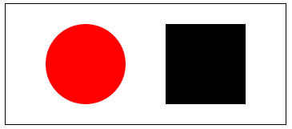

除了使用两个中心属性来基于其中心放置元素，*x*和*y*，这应该看起来就像在 CSS 中定位元素一样。有趣的地方在于`height`和`width`的交集以及 SVG 元素本身的`viewBox`属性的值。

# SVG 中的 viewBox 和视口

`height`和`width`属性定义了 SVG 元素的*视口*。视口可以被视为与浏览器中的视口相同。它定义了 SVG 文档的可见尺寸。底层 SVG 文档的尺寸可以大于视口，并且与 HTML 一样，元素可以完全不在屏幕上。所有可见的内容都在视口的尺寸内。

如果您只设置 SVG 元素的`height`和`width`属性，并且不使用`viewBox`属性，它将以与您在 CSS 中使用的方式相同的方式运行。在前面的例子中，视口坐标系统将以坐标`(0,0)`开始，并以`(350, 150)`结束。

在本书中，坐标将呈现为(`x`值，`y`值)。

在这种情况下，每个用户单位默认为屏幕上的一个像素。

`viewBox`属性允许您更改初始视口坐标系统。通过重新定义该坐标系统，您可以以有趣的方式移动和缩放底层 SVG 文档。让我们看一些例子，而不是试图*描述*可能发生的事情。

到目前为止，我们展示的每个例子都使用了`viewBox`属性，并且它被设置为与视口的`height`和`width`属性的尺寸相匹配。如果我们改变 SVG 元素的`height`和`width`属性，并且不改变`viewBox`以匹配，会发生什么？添加一个新的 SVG 元素，其`height`属性和`width`属性等于原始值的两倍，会创建一个两倍大小的图像的第二个版本：

```xml
     <svg  width="700" height="300" 
       viewBox="0 0 350 150" version="1.1"> 
        <circle cx="100" cy="75" r="50" fill="rgba(255,0,0,1)"/> 
        <rect x="200" y="25" width="100" height="100" 
         fill="rga(0,0,255,1)"/> 
      </svg> 
```

在浏览器中的效果如下。如您所见，视口已经加倍，但由于`viewBox`具有相同的尺寸，`circle`和`rect`元素上的确切坐标仍会创建图像的放大版本。在这种情况下，用户单位不再等同于一个像素，但 SVG 元素内部的计算仍然保持不变：

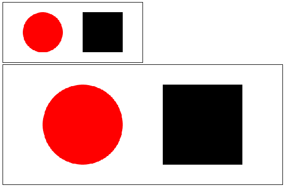

您可以将其放大到任意大小，它都会完美呈现。

如果我们调整`viewBox`属性本身会发生什么？`viewBox`属性的值代表什么？

`viewBox`属性有四个参数：`min-x`、`min-y`、`width`和`height`。`min-x`和`min-y`定义了`viewBox`的左上角。现在，`width`和`height`确定了`viewBox`的宽度和高度。调整这些值可以显示它们如何与视口的高度和宽度交互。前两个示例改变了视口坐标系的*x*和*y*位置。第一个示例将其正向偏移了 20%（70 和 30 分别是 SVG 宽度和高度的 20%）。第二个示例将其负向偏移了 20%。第三个示例改变了`viewBox`属性的宽度和高度，将其缩小了一半：

```xml
<svg  width="350" height="150" viewBox="70 30 350 150" version="1.1"> <circle cx="100" cy="75" r="50"
  fill="rgba(255,0,0,1)"/> <rect x="200" y="25" width="100" 
  height="100" fill="rga(0,0,255,1)"/> </svg> 
<svg  width="350" height="150" 
 viewBox="-70 -30 350 150" version="1.1"> <circle cx="100" cy="75" 
 r="50" fill="rgba(255,0,0,1)"/> <rect x="200" y="25" width="100" height="100" fill="rga(0,0,255,1)"/> </svg> 
<svg  width="350" height="150" 
 viewBox="0 0 175 75" version="1.1"> <circle cx="100" cy="75" r="50"
 fill="rgba(255,0,0,1)"/> <rect x="200" y="25" width="100" height="100" 
 fill="rga(0,0,255,1)"/> </svg> 
```

在浏览器中呈现，你可以看到`viewBox`属性的这些变化效果。偏移移动了圆和正方形，使其相对于视口的左上角更接近。将`viewBox`属性的大小缩小一半，并保持`rect`和`circle`的大小不变，实际上使渲染元素的大小加倍。视口保持相同大小，因此`viewBox`属性和相关的用户单位按比例放大了两倍。其中的所有元素都按需放大：

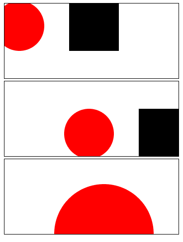

以下图表显示了更深入的工作原理（黑色轮廓覆盖层代表`viewBox`视口）：

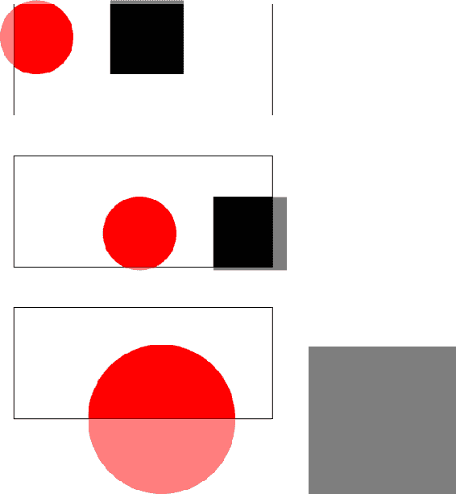

在 SVG 中仍有更多关于定位的知识需要学习，但我们将在本书的其余部分逐步解决这些问题。

现在让我们更深入地了解一些构成 SVG 体验的其他元素。

# 引入路径

在 SVG 规范中，最重要的元素是`path`元素。`path`允许您使用作为`d`属性值传递的一系列命令来绘制线条和形状。还记得我提到过 SVG 采用的最大障碍之一是缺乏友好的 API 吗？这个`path`元素很可能是整个规范中最大的痛点。您可能在`d`属性中看到的值可能非常密集且难以阅读。有多难以阅读？看看 SVG 标志中的*S*元素：

```xml
<path id="S" d="M 5.482,31.319 C2.163,28.001 0.109,23.419 0.109,18.358 C0.109,8.232 8.322,0.024 18.443,0.024 C28.569,0.024 36.782,8.232 36.782,18.358 L26.042,18.358 C26.042,14.164 22.638,10.765 18.443,10.765 C14.249,10.765 10.850,14.164 10.850,18.358 C10.850,20.453 11.701,22.351 13.070,23.721 L13.075,23.721 C14.450,25.101 15.595,25.500 18.443,25.952 L18.443,25.952 C23.509,26.479 28.091,28.006 31.409,31.324 L31.409,31.324 C34.728,34.643 36.782,39.225 36.782,44.286 C36.782,54.412 28.569,62.625 18.443,62.625 C8.322,62.625 0.109,54.412 0.109,44.286 L10.850,44.286 C10.850,48.480 14.249,51.884 18.443,51.884 C22.638,51.884 26.042,48.480 26.042,44.286 C26.042,42.191 25.191,40.298 23.821,38.923 L23.816,38.923 C22.441,37.548 20.468,37.074 18.443,36.697 L18.443,36.692 C13.533,35.939 8.800,34.638 5.482,31.319 L5.482,31.319 L5.482,31.319 Z"/> 
```

不知道发生了什么，是不可能解析的，即使知道`d`属性的规则，也很难跟踪。

让我们看一个更简单的例子，以便你能理解语法。在这个文档中，我们创建了一个风格化的字母 R。以下是如何阅读`d`属性的指令：

1.  (M)ove to point `(100,100)`.

1.  画一条(L)线到`(100,300)`。

1.  画一条(L)线到`(150,300)`。

1.  画一条(L)线到`(150,150)`。

1.  从当前点绘制(S)平滑立方贝塞尔曲线到点`(150,175)`，第二个控制点为`(250,150)`。控制点提供用于绘制曲线的方向信息。这个版本的立方贝塞尔`curveto`指令实际上是控制点被反射的简写。在其他格式中，可以定义指向不同方向的多个控制点。这将创建一个更复杂的曲线。

1.  画一条(L)线到`(200,300)`。

1.  画一条(L)线到`(250,300)`。

1.  画一条(L)线到`(225,225)`。

1.  从当前起始点绘制(S)平滑立方贝塞尔曲线到点`(100,100)`，第二个控制点为`(350,100)`：

```xml
<svg  width="500" height="500" viewBox="0 0 500 500" version="1.1"> 
        <path d="M100,100 L100,300 L150,300 L150,150 S250,150,175,200 L200,300 L250,300 L225,225 S350,100,100,100" stroke-width="1" stroke="#003366" fill="#cccccc"></path> 
</svg> 
```

在浏览器中呈现，这些命令产生以下结果：

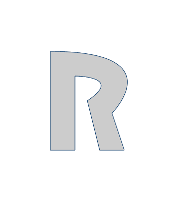

这一系列的说明仍然很复杂，甚至没有涉及`path`元素的所有可能选项。好消息是，当您使用 SVG 时，大多数时候这些复杂的`path`将被生成 - 要么由您自己（使用图形 SVG 编辑器），要么通过 JavaScript。因此，实际上，您只需要能够理解说明和它们的用法。您不需要坐在那里逐条解析这些数据指令。

# 更多关于基本形状

现在您已经了解了`path`，让我们来看看 SVG 宇宙中更直接的部分，并且让我们检查一些更基本的形状。您已经了解了`circle`和`rect`。让我们看看一些更基本的形状。

# 线元素

`path`元素允许您使用一长串的说明来绘制您能想象到的任何东西。值得庆幸的是，有许多方便的元素定义了比`path`元素更容易处理的常见形状。其中您将学习的第一个是`line`元素。

以下示例在一个`500`乘`500`的正方形上绘制了一个网格。这里使用的`line`元素需要五个参数：`x1`，`y1`，`x2`，`y2`和`stroke`。*x*和*y*坐标表示线的起点（`x1`，`y1`）和终点（`x2`，`y2）。这个 SVG 文档在一个`500`像素的正方形中绘制了每边`100`像素的网格：

```xml
    <svg version="1.1"  
        width="500" height="500" viewBox="500 500 0 0"> 
        <line stroke="#000000" x1="0" y1="0" x2="0" y2="500" /> 
        <line stroke="#000000" x1="100" y1="0" x2="100" y2="500" /> 
        <line stroke="#000000" x1="200" y1="0" x2="200" y2="500" /> 
        <line stroke="#000000" x1="300" y1="0" x2="300" y2="500" /> 
        <line stroke="#000000" x1="400" y1="0" x2="400" y2="500" /> 
        <line stroke="#000000" x1="500" y1="0" x2="500" y2="500" /> 
        <line stroke="#000000" x1="0" y1="0" x2="500" y2="0" /> 
        <line stroke="#000000" x1="0" y1="100" x2="500" y2="100" /> 
        <line stroke="#000000" x1="0" y1="200" x2="500" y2="200" /> 
        <line stroke="#000000" x1="0" y1="300" x2="500" y2="300" /> 
        <line stroke="#000000" x1="0" y1="400" x2="500" y2="400" /> 
        <line stroke="#000000" x1="0" y1="500" x2="500" y2="500" /> 
      </svg> 
```

在浏览器中呈现，前面的标记产生了以下网格：

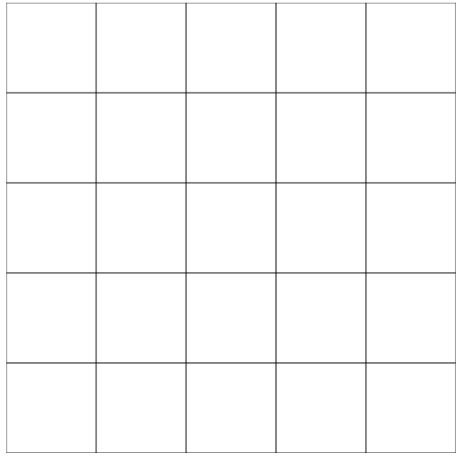

顺便说一句，生成这样的网格对生成和调试 SVG 文档很有帮助。在网格上有更细粒度的网格时，您可以更容易地确定屏幕上计算或手动生成的位置。

# 椭圆元素

`ellipse`就像`circle`一样，只是它需要*两个半径*参数，`rx`和`ry`分别代表*x*和*y*的半径。由于需要额外的半径参数，否则我们只会画一个标准的圆：

```xml
      <svg width="250" height="100" viewBox="0 0 250 100" 
         > 
        <ellipse cx="125" cy="50" rx="75" ry="25" 
         fill="rgba(255,127,0,1)"/> 
      </svg> 
```

以下是直接标记的输出：

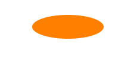

# 多边形元素

`polygon`元素创建由多条直线组成的*封闭*形状，从初始`x，y`坐标开始，并以坐标平面上的最终点结束。`points`属性接受坐标平面上的点列表来定义`polygon`元素。`polygon`元素的最终点会自动连接到第一个点。以下代码示例绘制了一个星星：

```xml
<svg width="240" height="240" viewBox="0 0 240 240" 
  > 
        <polygon points="95,95 120,5 150,95 235,95 165,150 195,235
         120,180 50,235 75,150 5,95" fill="rgba(0,0,255,1)"></polygon> 
</svg> 
```

以下显示了前面 SVG 元素的输出：


对于`polygon`和`polyline`，这只是一个建议，而不是将`x，y`对用逗号分隔的要求。

以下代码在程序上等同于前面的例子（尽管更难阅读）。它呈现了完全相同的形状：

```xml
<svg width="240" height="240" viewBox="0 0 240 240" 
  > 
   <polygon points="95 95 120 5 150 95 235 95 165 150 195 235 120 
     180 50 235 75 150 5 95" fill="rgba(0,0,255,1)"></polygon> 
 </svg> 
```

# 折线元素

`polyline`元素创建由多条直线组成的*开放*形状。`points`属性接受坐标平面上的`x，y`点列表来定义`polyline`。以下代码示例跟踪了天空中龙座的图案：

```xml
<svg width="800" height="600" viewBox="0 0 400 300" 
   > 
   <polyline points="360,60 330,90 295,160 230,220 190,217
    175,180 155,130 155,60 135,30 100,25 90,55 65,170 80,195 
    65,220 35,210 65,170" fill="none" stroke="white" stroke-width="3"> 
    </polyline> 
</svg> 
```

在浏览器中运行，前面的例子看起来是这样的：

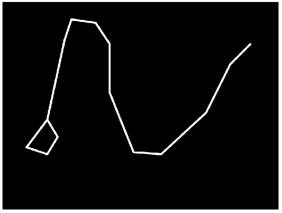

# 更多关于填充和描边

您已经在大多数示例中看到了它们的使用，现在让我们更全面地了解一下填充和描边。这些表示属性对 SVG 很重要，特别是在动态工作时，因为与编写动态 CSS 相比，直接操作元素要容易得多。

`fill`和`stroke`被统称为`paint`属性。`fill`设置对象的内部颜色，`stroke`设置对象周围绘制的线的颜色。正如您已经看到的，它们可以接受任何有效的 CSS 颜色值。它们还可以接受对*绘画服务器元素*的引用（这些是`hatch`、`linearGradient`、`meshgradient`、`pattern`、`radialGradient`和`solidcolor`），这些元素定义了元素的绘画样式。您已经看到了其中一个（`linearGradient`），很快将了解更常见的支持。然而，在您这样做之前，现在是时候看一看一些控制线条外观和拟合的特定于描边的属性了。

# stroke-dasharray

`stroke-dasharray`属性定义了一个逗号和/或空格分隔的长度或百分比列表，指定了用于描边线的虚线和间隙的交替模式。以下示例显示了几个不同的示例。第一个是一系列 10 像素的开和 5 像素的关。第二个示例根据斐波那契数列打开和关闭像素。第三个系列根据质数系列打开和关闭像素：

```xml
<svg width="400" height="300" viewBox="0 0 400 300" 
  > 
  <rect x="50" y="20" width="300" height="50" fill="none" 
    stroke="#000000" stroke-width="4"  stroke-dasharray="10 5"></rect> 
  <rect x="50" y="80" width="300" height="50" fill="none" 
   stroke="#000000" stroke-width="4"  stroke-dasharray="1, 2, 3, 5, 8, 
    13"></rect> 
  <rect x="50" y="140" width="300" height="50" fill="none" 
    stroke="#000000" stroke-width="4"  stroke-dasharray="2, 3, 5, 7, 
     11, 13, 17, 19"></rect> 
 </svg> 

```

在浏览器中呈现，上述代码产生以下示例：

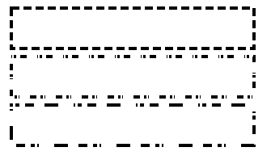

如果提供的值作为属性的值的数量是奇数，则列表将重复以产生偶数个值。这可能不会产生您期望的模式，因为值可能会从虚线转移到空格，并产生意想不到的结果。在以下示例中，单个值`10`产生`10`开和`10`关，这可能是您预期的结果。另一方面，`"15,10,5"`模式产生`15`开，`10`关，`5`开，`15`关，`10`开和`5`关。如果您期望模式始终将`15`作为“开”，那么这可能会让您感到惊讶。

```xml
 <svg width="400" height="300" viewBox="0 0 400 300"
    > 
    <rect x="50" y="20" width="300" height="50" fill="none" 
     stroke="#000000" stroke-width="4"  stroke-dasharray="10"> 
    </rect> 
    <rect x="50" y="80" width="300" height="50" fill="none" 
      stroke="#000000" stroke-width="4"  stroke-dasharray="15,10,5">
    </rect> 
  </svg> 
```

您可以在浏览器中看到这一点。这可能是您想要的外观，但如果不是，现在您知道原因了：

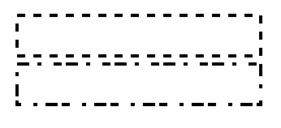

# stroke-dashoffset

`stroke-dashoffset`属性接受正值或负值的长度或百分比，并指定开始渲染虚线的虚线模式的距离。这个偏移量可以在以下代码示例中看到：

```xml
<svg width="400" height="300" viewBox="0 0 400 300"  
 >
 <rect x="50" y="20" width="300" height="50" fill="none"
  stroke="#000000" stroke-width="4" stroke-dasharray="10 10"></rect>
 <rect x="50" y="80" width="300" height="50" fill="none"
  stroke="#000000" stroke-width="4" stroke-dasharray="10 10" stroke- 
  dashoffset="25"></rect>
 <rect x="50" y="140" width="300" height="50" fill="none"
  stroke="#000000" stroke-width="4" stroke-dasharray="10 10" stroke-
  dashoffset="-25"></rect>
</svg>
```

这个属性的效果可以在以下截图中看到：

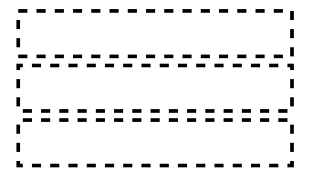

# stroke-linecap

`stroke-linecap`属性指示在开放线的末端呈现的形状。选项包括`butt`、`round`、`square`和`inherit`。以下代码示例展示了不同的渲染选项。两条红线是为了显示`butt`和`square`之间的区别。`butt`使`stroke`与线的末端齐平。`square`端延伸到线的末端，包括`stroke`的厚度： 

```xml
<svg  width="500" height="400"
   viewBox="0 0 500 400" version="1.1"> 
 <line fill="none" stroke-width="20" stroke="#000000" x1="20" y1="100" 
    x2="450" y2="100" stroke-linecap="butt" /> 
 <line fill="none" stroke-width="20" stroke="#000000" x1="20" y1="200"
    x2="450" y2="200" stroke-linecap="round" /> 
 <line fill="none" stroke-width="20" stroke="#000000" x1="20" y1="300"
    x2="450" y2="300" stroke-linecap="square" /> 
 <line fill="none" stroke-width="2" stroke="rgba(255,0,0,1)" x1="20" 
    y1="0" x2="20" y2="400" /> 
 <line fill="none" stroke-width="2" stroke="rgba(255,0,0,1)" x1="450" 
    y1="0" x2="450" y2="400" /> 
</svg> 
```

这个结果可以在以下截图中看到：

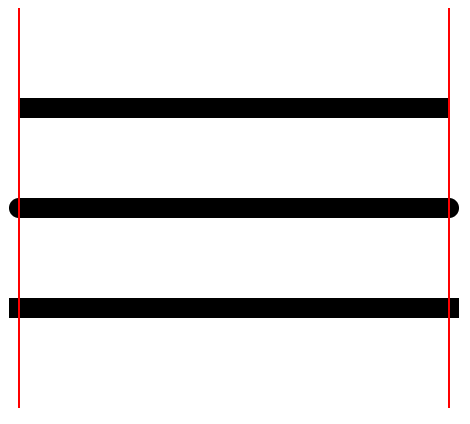

# stroke-linejoin

`stroke-linejoin`属性定义了`path`和基本形状的拐角的呈现方式。可能的值有`miter`、`round`、`bevel`和`inherit`。`Round`呈现平滑的曲线角，`miter`产生只有一个角的尖边，`bevel`在角上添加一个新的角来创建一个复合角：

```xml
  <svg width="400" height="300" viewBox="0 0 400 300" 
    > 
  <rect x="50" y="20" width="300" height="50" fill="none" 
    stroke="#000000" stroke-width="20"  stroke-linejoin="miter"></rect> 
  <rect x="50" y="100" width="300" height="50" fill="none" 
     stroke="#000000" stroke-width="20"   stroke-linejoin="bevel">  
  </rect> 
  <rect x="50" y="180" width="300" height="50" fill="none" 
     stroke="#000000" stroke-width="20"  stroke-linejoin="round">
   </rect> 
 </svg> 
```

这些选项可以在以下截图中看到：

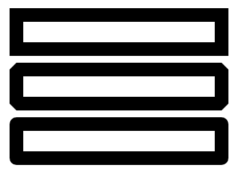

# stroke-opacity

`stroke-opacity`属性的作用与您预期的一样。它设置了描边对象的不透明度。以下示例在三个单独的矩形上设置了三种不同的不透明度。您可以看到`stroke`不仅与页面的背景交互，还与矩形的填充区域交互，因为`stroke`位于矩形边缘的中心，并且部分覆盖了填充区域：

在 SVG 元素上没有简单的方法来更改`stroke`属性的定位。在图形程序中，可以将`stroke`属性设置为在框的内部、在框的边缘上居中（这是 SVG 的做法）和在框的外部。在新的 SVG strokes ([`www.w3.org/TR/svg-strokes/`](https://www.w3.org/TR/svg-strokes/))规范中有一个提案来更改`stroke`的对齐方式（称为 stroke-alignment），但目前浏览器中还没有这样的功能。

```xml
<svg width="400" height="300" viewBox="0 0 400 300" 
  >
 <rect x="50" y="20" width="300" height="50" fill="none"
  stroke="#000000" stroke-width="20" stroke-opacity=".25"></rect>
 <rect x="50" y="100" width="300" height="50" fill="none"
  stroke="#000000" stroke-width="20" stroke-opacity=".5"></rect>
 <rect x="50" y="180" width="300" height="50" fill="none"
  stroke="#000000" stroke-width="20" stroke-opacity="1"></rect>
</svg>
```

前面代码的输出可以在以下截图中看到：

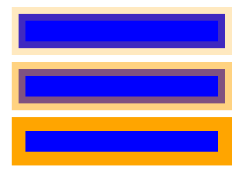

现在我们已经看过了`stroke`的不同选项，是时候看看一些其他填充选项了。这些是我们之前提到的绘图服务器元素。您已经遇到了其中之一，`linearGradient`。您还将了解另外两个常用的，`radialGradient`和`pattern`。

# linearGradient 和 radialGradient

您已经在第一章中看到了`linearGradient`元素，*介绍可伸缩矢量图形*。还有`radialGradient`，它的工作方式基本相同，只是它呈现以中心点为中心辐射的渐变。这两个元素都添加到`defs`部分，每个元素都有一系列带有`offset`和`stop-color`的`stop`，定义了渐变。

然后，它们通过它们的`id`属性作为`rect`的`fill`属性的参数引用：

```xml
<svg width="400" height="300" viewBox="0 0 400 300"  
 >
    <defs>
        <linearGradient id="linear">
            <stop offset="5%" stop-color="green"/>
            <stop offset="95%" stop-color="gold"/>
        </linearGradient>
        <radialGradient id="radial">
            <stop offset="10%" stop-color="gold"/>
            <stop offset="95%" stop-color="green"/>
        </radialGradient>
    </defs>
    <rect x="50" y="20" width="100" height="100" fill="url(#radial)">
    </rect>
    <rect x="200" y="20" width="100" height="100" fill="url(#linear)"> 
    </rect>
</svg>
```

这会产生以下输出：

**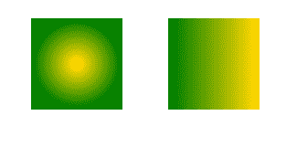**

# pattern 元素

我们将要看的最后一个绘图服务器是`pattern`元素。`pattern`允许您定义一个小的图形元素，您可以将其引用为`fill`或`stroke`并在元素上以重复的图案平铺。在这个例子中，我们使用了一个`pattern`元素，它有一个单独的子`polygon`元素，定义了两条对角线，组合在一起创建了一个长图案：

```xml
<svg width="400" height="400" viewBox="0 0 400 400" 
 >
    <pattern id="pattern-example" width="100" height="100"
      patternUnits="userSpaceOnUse">
    <polygon points="0,50 0,100 50,50 100,100 100,75 50,25 0,75" 
      fill="#000000"></polygon>
    </pattern>
    <rect x="0" y="0" width="400" height="400" fill="url(#pattern-
     example)"></rect>
</svg>
```

在浏览器中呈现，这会创建以下锯齿状图案：

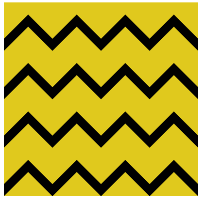

# 创作程序

到目前为止，本书中的所有示例都是手工生成的。在实践中，正如您将在本书中了解到的那样，SVG 通常是由软件生成的。本书的大部分内容将涉及使用基于 Web 的工具和库创建和操作 SVG，但 SVG 图像也可以由桌面绘图应用程序生成。在 Web 上工作时，您经常会使用设计师在应用程序中创建的 SVG 图像，例如 Inkscape ([`inkscape.org/en/`](https://inkscape.org/en/))、Adobe Illustrator ([`www.adobe.com/products/illustrator.html`](https://www.adobe.com/products/illustrator.html))或 Sketch ([`www.sketchapp.com/`](https://www.sketchapp.com/))。这些应用程序非常棒，因为它们允许非技术设计师使用高级绘图工具来创建 SVG 图像。

虽然这不是本书的其余部分的要求，但我建议您找到一些可以用来以这种方式编写 SVG 的工具。虽然您希望学习如何在动态的基于 Web 的环境中使用 SVG，但拥有使用高级绘图工具来更新和操作 SVG 元素的选项是很棒的。多年来，我一直在使用 Adobe Illustrator 和 Inkscape，许多人都喜欢 Sketch，所以这是三个开始的选择。对于刚开始，我建议首先看看 Inkscape。Inkscape 是一个免费的开源软件，发布在 GNU 许可下，从功能的角度来看相当不错，所以是一个很好的默认选择。

无论您选择哪个应用程序（甚至如果您不选择任何应用程序，只是继承了一个 SVG 图像），都要知道这些应用程序存在一些缺点。这些应用程序是为了创作体验而设计的，并不会生成为网络优化的 SVG 图像，因此在将由图形程序创建的 SVG 图像导入到网络项目时，要牢记这一点非常重要。您将在本书的后面学习更多关于优化 SVG 图像的知识，但是您应该从一开始就意识到您将面对的挑战。

看一下以下的屏幕截图。它显示了两个渲染完全相同图像的文件之间的差异。左边的是 Inkscape 输出的 SVG 源文件。右边的文件是经过优化的版本。正如您所看到的，Inkscape 文件中有很多额外的数据。这些数据是应用程序所需的，但在网络上并不需要，因此删除它们可以显著减小文件大小：

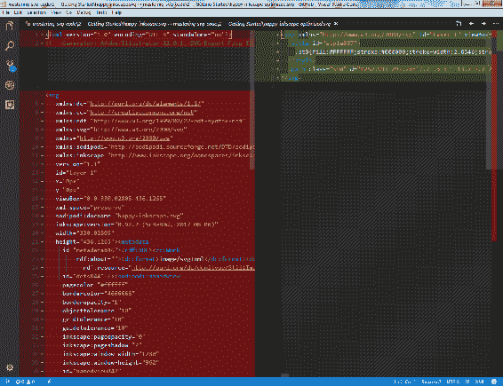

您将在第十一章中学习清理 SVG 文件的工具，*优化 SVG 的工具*。

# 总结

在本章中，您了解了多个 SVG 功能。您了解了`path`，它允许您使用线条和曲线绘制复杂的形状。您还了解了一些基本绘图工具，可以用它们来绘制线条、椭圆、多边形和折线。此外，您还了解了一些描边和填充选项。

最后，您了解了使用软件绘制静态 SVG 的选项，并了解了这样做可能存在的一些缺点。

在第三章中，*深入了解 SVG 创作*，您将继续学习 SVG 创作，增加您已经体验过的工具列表，并允许您创建更复杂的 SVG 图像。
