# 第三章：深入挖掘 SVG 创作

到目前为止，在这本书中，你已经接触到了大部分基本的 SVG 功能和元素。只用到目前为止你所体验过的工具，你就可以开始使用 SVG 做一些真正的任务了。也就是说，SVG 还有很多其他功能。本章将开始介绍更高级的 SVG 工具。其中一些技术将在进行动态 SVG 动画和可视化方面发挥重要作用。

本章将涵盖以下主题：

+   转换

+   裁剪和遮罩

+   将内容导入 SVG

+   滤镜效果

+   在网络上提供 SVG

所有这些，以及你已经学到的工具，将为你打下坚实的 SVG 基础。

# 转换

SVG 中的变换允许你以各种方式操纵 SVG 元素，包括缩放、旋转、倾斜和平移（看起来像是移动元素，但并不完全是）。使用变换允许你操纵 SVG 而不改变其固有值（例如高度、宽度、*x*和*y*），这在以动态方式操纵元素时很重要。

本节将逐一介绍常见的变换函数，并附上每个函数的示例。

# 平移

`translate`变换通过指定的`x`和`y`坐标移动 SVG 元素。平移改变了元素坐标系的*原点*。

如果没有提供`y`坐标，它是一个可选参数，假定与提供的`x`参数相等。

下面的示例显示了三个等效的圆。第一个圆没有以任何方式进行变换。第二个圆通过单个参数（`10`）进行了变换，它在*x*轴和*y*轴上分别移动了`10`。第三个在*x*平面上平移了`"75"`像素，在*y*平面上没有平移。在每种情况下，底层元素具有等效的度量，但它们显示方式不同。

*你可能会问，为什么不直接移动元素*。首先，在动态 SVG 中，这是有用的，因为如果你移动元素，你不必跟踪元素的原始位置。你可以通过移除变换来简单地将元素重置为其原始状态：

```xml
<svg  width="350" height="150"
  viewBox="0 0 350 150" version="1.1">
    <circle cx="100" cy="75" r="50" fill="rgba(255,0,0,.5)"/>
    <circle cx="100" cy="75" r="50" fill="rgba(255,0,0,.5)" 
     transform="translate(10)" />
    <circle cx="100" cy="75" r="50" fill="rgba(255,0,0,.5)"
     transform="translate(75,0)" />
</svg>
```

你可以在下面的截图中看到输出：

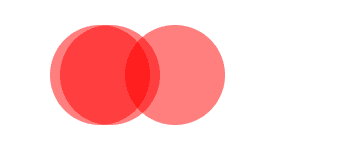

# 缩放

`scale`变换通过指定的`x`和`y`坐标对 SVG 元素进行缩放。单位是**因子**，因此传入两个将会使元素的尺寸*加倍*。

与`translate`一样，`y`坐标是可选的，如果没有提供，它被假定为与提供的`x`参数相等。

如果你做过 CSS 变换并缩放了一个元素，你可能会对`scale`的工作方式感到惊讶。即使你没有做过 CSS，你也可能会感到惊讶。

在 SVG 中，缩放是从坐标系的*原点*开始的。请看下面的例子，显示了三个单独的方框。一个根本没有缩放。接下来的两个矩形在两个轴上都缩放了`1.25`倍，然后在*x*轴上缩放了`2`倍，而在*y*轴上没有缩放：

```xml
<svg  width="500" height="500"
 viewBox="0 0 500 500" version="1.1">
    <rect x="100" y="100" width="100" height="100" stroke="blue"
     fill="none"></rect>
    <rect x="100" y="100" width="100" height="100" stroke="red"
     fill="rgba(255,0,0,.5)" transform="scale(1.25)"></rect>
    <rect x="100" y="100" width="100" height="100" stroke="red" 
     fill="rgba(255,0,0,.5)" transform="scale(2,1)"></rect>
</svg>
```

正如你在下面的截图中所看到的，结果是元素的尺寸不仅被缩放，而且与坐标系原点的距离也被缩放了。第一个元素在两个方向上都进行了调整，沿着*x*和*y*平面。第二个元素沿着*x*轴向右移动：

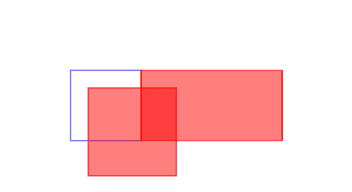

与下面的代码相比，显示了 CSS 缩放的工作方式。在 CSS 中使用相同的缩放因子会产生完全不同的结果。CSS 不是从 SVG 文档的原点进行缩放，而是从元素本身的中心点进行缩放。语法可能看起来相似，但结果是不同的：

```xml
<head>
<style type="text/css">
    div {
        position: absolute;
        left: 100px;
        top: 100px;
        width: 100px;
        height: 100px;
        border: 1px solid blue;
    }
    .scale-1-25 {
        transform: scale(1.25);
        border: 1px solid red;
        background: rgba(255,0,0,.5);
    }
    .scale-2-by-1 {
        transform: scale(2,1);
        border: 1px solid red;
        background: rgba(255,0,0,.5);
    }
</style>
</head>
<body>
    <div></div>
    <div class="scale-1-25"></div>
    <div class="scale-2-by-1"></div>
</body>
```

结果可以在下面的截图中看到：

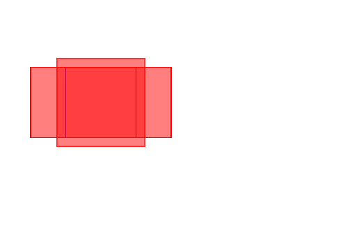

如果您想要在 SVG 中产生类似的效果，有一个有趣的技巧可以使用。这个技巧也可以用来说明`transform`属性可以接受多个变换函数。您不仅限于一个。

那么，它是如何工作的呢？正如我所提到的，CSS 变换的原点是*被变换的盒子的中心*。这种技术在 SVG 中复制了相同的原点。

要做到这一点，您需要做一个技巧，即将元素的原点移动到一个新的原点，使其与 CSS 原点匹配。这是它的工作原理。在这种情况下，我们的矩形在坐标系中的位置是`(100, 100)`，边长为`100`像素。因此，盒子的中心点位于`(150, 150)`。通过将元素平移`(150,150)`，将这些元素的原点设置为等同于 CSS 原点的位置。请记住，CSS 原点是盒子的中心点（在变换之前是`(150,150)`），平移元素实际上*改变*了它的原点。

在平移之后，我们应用了缩放。这发生在新的原点`(150,150)`处（再次等同于 CSS 原点），并将正方形分别扩大了`1.25`和`2`。最后，我们将元素*返回*到其*原始*原点`(0,0)`，因为它们是在 CSS 等效原点`(150,150)`处进行操作的，所以缩放后的元素现在被适当地居中了：

```xml
<svg  width="500" height="500"
  viewBox="0 0 500 500" version="1.1">
    <rect x="100" y="100" width="100" height="100" stroke="red"
     fill="rgba(255,0,0,.5)"></rect>
    <rect x="100" y="100" width="100" height="100" stroke="red" 
     fill="rgba(255,0,0,.5)" transform="translate(150 150) scale(1.25)
      translate(-150 -150)"></rect>
    <rect x="100" y="100" width="100" height="100" stroke="red" 
     fill="rgba(255,0,0,.5)" transform="translate(150 150) scale(2,1) 
     translate(-150 -150)"></rect>
</svg>
```

以下插图逐步展示了这是如何工作的：

1.  第一帧显示了起始位置。`100`像素的矩形放置在`(100,100)`，它们的原点是`(0,0)`。

1.  然后它们被平移`(150,150)`。

1.  然后，它们从新的原点`(150,150)`处进行了变换，分别为`1.25`和`(2,1)`。

1.  它们被平移到`(0,0)`，同时保持新的缩放。此时它们的实际原点是`(0,0)`，但它呈现出来好像是 CSS 原点`(150,150)`：

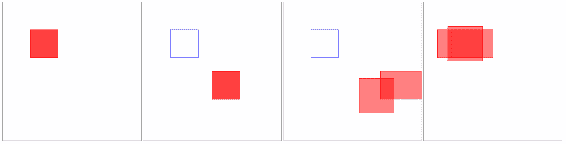

# 旋转

`rotate`变换通过一定角度旋转元素。这个变换有三个参数。第一个是角度数。第二个和第三个参数是定义旋转原点的`x`和`y`坐标。如果元素没有旋转原点，则使用视口的原点。这可以在以下两个代码示例中看到，其中在 SVG 元素上绘制了九个矩形。第一个没有被变换。接下来的八个依次旋转了十度：

```xml
<svg  width="700" height="700" 
  viewBox="0 0 700 700" version="1.1">
    <rect x="600" y="0" width="100" height="100" 
     fill="rgba(255,0,0,.5)"/>
    <rect x="600" y="0" width="100" height="100" 
      fill="rgba(255,0,0,.5)" transform="rotate(10)"/>
    <rect x="600" y="0" width="100" height="100" 
     fill="rgba(255,0,0,.5)" transform="rotate(20)"/>
    <rect x="600" y="0" width="100" height="100" 
     fill="rgba(255,0,0,.5)" transform="rotate(30)"/>
    <rect x="600" y="0" width="100" height="100" 
     fill="rgba(255,0,0,.5)" transform="rotate(40)"/>
    <rect x="600" y="0" width="100" height="100" 
     fill="rgba(255,0,0,.5)" transform="rotate(50)"/>
    <rect x="600" y="0" width="100" height="100" 
     fill="rgba(255,0,0,.5)" transform="rotate(60)"/>
    <rect x="600" y="0" width="100" height="100"
      fill="rgba(255,0,0,.5)" transform="rotate(70)"/>
    <rect x="600" y="0" width="100" height="100" 
     fill="rgba(255,0,0,.5)" transform="rotate(80)"/>
</svg>
```

如您在渲染代码的下面截图中所见，它们在整个画布上`arc`，并且视口的`(0,0)`点位于旋转的原点：

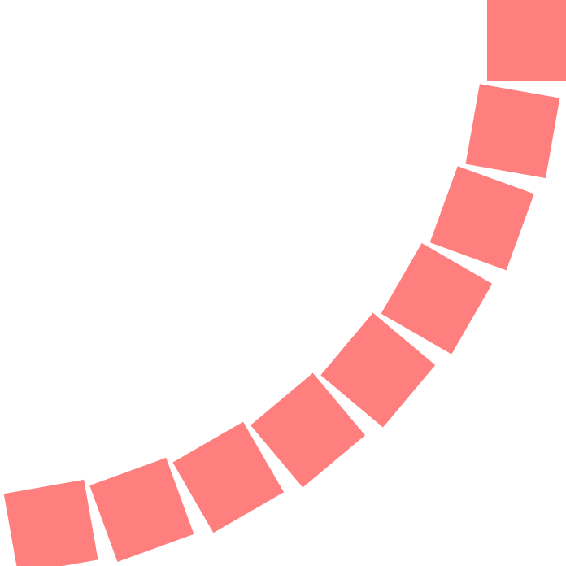

与之相比，下面的代码将旋转点更改为视口的中心点，以及`x`轴上的顶部和`y`轴上的顶部：

```xml
<svg  width="700" height="700" viewBox="0 0 700 700" version="1.1">
    <rect x="600" y="0" width="100" height="100" 
      fill="rgba(255,0,0,.5)"/>
    <rect x="600" y="0" width="100" height="100" 
     fill="rgba(255,0,0,.5)" transform="rotate(10 350 0)"/>
    <rect x="600" y="0" width="100" height="100"  
     fill="rgba(255,0,0,.5)" transform="rotate(20 350 0)"/>
    <rect x="600" y="0" width="100" height="100" 
     fill="rgba(255,0,0,.5)" transform="rotate(30 350 0)"/>
    <rect x="600" y="0" width="100" height="100" 
     fill="rgba(255,0,0,.5)" transform="rotate(40 350 0)"/>
    <rect x="600" y="0" width="100" height="100" 
     fill="rgba(255,0,0,.5)" transform="rotate(50 350 0)"/>
    <rect x="600" y="0" width="100" height="100" 
     fill="rgba(255,0,0,.5)" transform="rotate(60 350 0)"/>
    <rect x="600" y="0" width="100" height="100" 
     fill="rgba(255,0,0,.5)" transform="rotate(70 350 0)"/>
    <rect x="600" y="0" width="100" height="100" 
     fill="rgba(255,0,0,.5)" transform="rotate(80 350 0)"/>
</svg>
```

如您所见，当这段代码在浏览器中渲染时，相同角度的旋转`arc`在视口的右上角四分之一中。*正方形从新的原点辐射出来*：

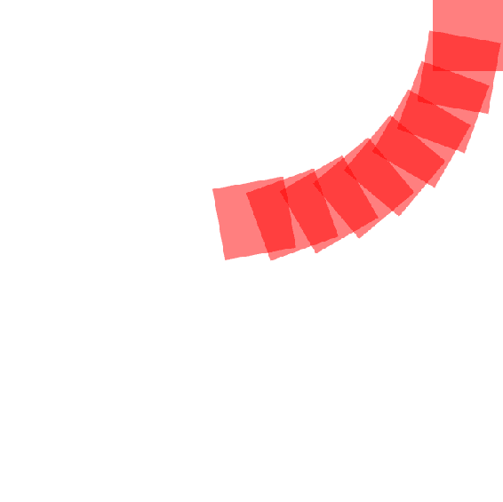

与缩放一样，如果您想要围绕元素的中心点旋转，您可以使用在该部分学到的相同平移技巧。在下面的代码示例中，矩形被平移了相当于它们的中心点`(100,100)`，旋转了`10`度，然后又被平移到了它们的原始原点：

```xml
<svg  width="400" height="400" viewBox="0 0 200 200" version="1.1">
    <rect x="50" y="50" width="100" height="100" 
    fill="rgba(255,0,0,.2)" transform="translate(100,100) rotate(10) translate(-100,-100)"/>
    <rect x="50" y="50" width="100" height="100" 
    fill="rgba(255,0,0,.2)" transform="translate(100,100) rotate(20) 
    translate(-100,-100)"/>
    <rect x="50" y="50" width="100" height="100" 
    fill="rgba(255,0,0,.2)" transform="translate(100,100) rotate(30)
     translate(-100,-100)"/>
    <rect x="50" y="50" width="100" height="100" 
    fill="rgba(255,0,0,.2)" transform="translate(100,100) rotate(40) 
    translate(-100,-100)"/>
    <rect x="50" y="50" width="100" height="100"
     fill="rgba(255,0,0,.2)" transform="translate(100,100) rotate(50) 
     translate(-100,-100)"/>
    <rect x="50" y="50" width="100" height="100" 
     fill="rgba(255,0,0,.2)" transform="translate(100,100) rotate(60)
     translate(-100,-100)"/>
    <rect x="50" y="50" width="100" height="100"
     fill="rgba(255,0,0,.2)" transform="translate(100,100) rotate(70) 
      translate(-100,-100)"/>
    <rect x="50" y="50" width="100" height="100" 
    fill="rgba(255,0,0,.2)" transform="translate(100,100) rotate(80)
     translate(-100,-100)"/>
    <rect x="50" y="50" width="100" height="100" 
    fill="rgba(255,0,0,.2)" transform="translate(100,100) rotate(90) 
    translate(-100,-100)"/>
</svg>
```

这产生了以下输出：

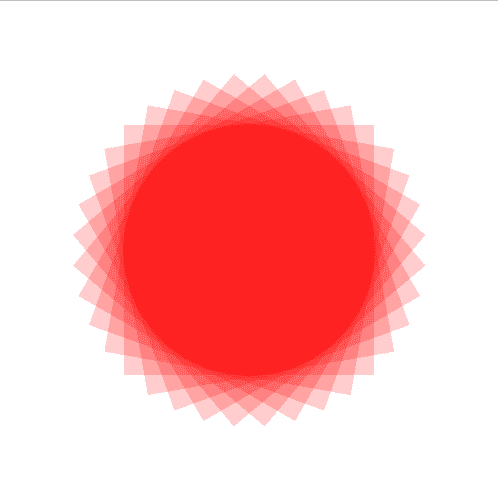

# 倾斜

`skew`变换通过指定的轴沿角度倾斜元素。与`rotate`和`scale`一样，`skew`基于当前原点。以下代码示例显示了两组元素。一组沿着`x`轴倾斜，另一组沿着`y`轴倾斜。对于每组元素，有一个变换专注于`skew`，然后还有另一个相同量的`skew`变换，也包括平移技术：

```xml
<svg  width="500" height="500" viewBox="0 0 500 500" version="1.1">
    <rect x="100" y="100" width="100" height="100"
     fill="rgba(255,0,0,.1)" transform="skewX(10)"/>
    <rect x="100" y="100" width="100" height="100" stroke="blue"
     fill="none"/>
    <rect x="100" y="100" width="100" height="100" 
    fill="rgba(0,255,0,.1)" transform="translate(150,150) skewX(10) 
    translate(-150,-150)"/>
    <rect x="300" y="300" width="100" height="100" stroke="blue" 
    fill="none"/>
    <rect x="300" y="300" width="100" height="100" 
     fill="rgba(255,0,0,.1)" transform="skewY(10)"/>
    <rect x="300" y="300" width="100" height="100" 
    fill="rgba(0,255,0,.1)" transform="translate(300,300) skewY(10)
     translate(-300,-300)"/>
</svg>
```

你可以在以下截图中看到此代码的输出。蓝色正方形显示了原始位置，然后两个倾斜的元素排列在其上，以显示基于原始原点的倾斜和使用平移技术改变原点到元素中心的差异：

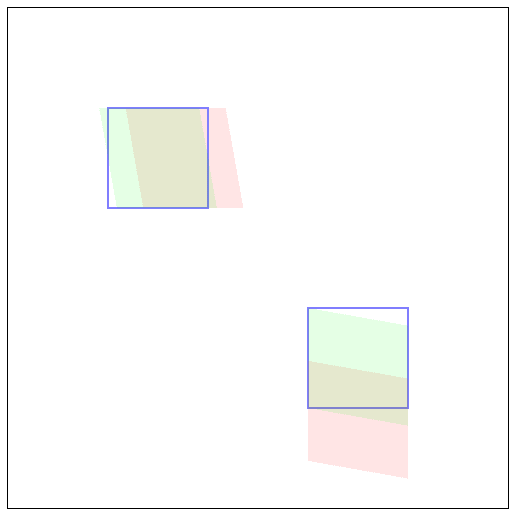

还有另一种选项可以变换元素。你可以使用所谓的*变换矩阵*。矩阵变换很强大（它们可以表示任何其他变换函数），但也很复杂，它们严重依赖数学。由于并非每个人都认为数学很有趣，矩阵变换并不像其他变换函数那样常见。因此，我不打算在这里涵盖它们。实际上，你可以用已经学到的方法做任何你需要做的事情。

# 裁剪和遮罩

裁剪和遮罩允许你在 SVG 文档中减去元素的部分。

剪切路径，使用`clipPath`元素实现，可以使用路径、文本元素和基本形状的任意组合作为简单蒙版的轮廓。这意味着`clipPath`元素轮廓内部的所有内容都是可见的，而外部的所有内容都被裁剪掉。`clipPath`中的每个像素要么是打开的，要么是关闭的。

遮罩，使用`mask`元素实现，可以包含图形、文本和基本形状，作为半透明的遮罩。使用遮罩，每个像素值表示不透明度的程度，可以从完全透明到完全不透明。

# 裁剪

SVG 中的`clipPath`元素允许你从另一个形状中裁剪出一个形状。裁剪使用形状的几何图形来定义被裁剪的区域。它不考虑除形状之外的任何东西，因此`stroke`和`fill`等属性不会改变被裁剪的区域。

以下代码示例显示了一个非常简单但非常有用的`clipPath`元素的使用模式。基本效果是切掉一个复杂元素的一半（我们在第二章中绘制的星星，*开始使用 SVG 进行创作*），以便将其放在另一个相同星星的实例上，创建一个红色和黑色的分割星星设计。虽然你可以创建两个星星的一半并将它们放在一起，但混合和匹配相同元素的实例更加灵活。

让我们看看这是如何工作的。

首先，在`defs`部分，我们创建`clipPath`元素本身。`clipPath`的任何子元素都将捆绑在一起，以创建稍后将使用的裁剪模式。在这种情况下，它是一个简单的矩形，覆盖了画布的一半。它的 ID 是`"box"`。接下来，我们创建了一个星星的可重用实例，我们在第二章中创建了它，*开始使用 SVG 进行创作*。我们给它一个 ID 为`"star"`。在`defs`部分之外，我们把它全部放在一起。使用两个`use`元素的实例，它允许你交换在其他地方定义的元素，我们链接到星星的`polygon`，并将其两次插入文档中，一次填充为红色，一次填充为黑色。请注意，用户元素使用片段标识符来引用多边形。`"#star"`是一个有效的相对 URL，指向本页上特定`id`。第二个变体具有一个`clip-path`属性，它链接到我们的`box`，`clipPath`：

```xml
<svg  width="240" height="240" viewBox="0 0 240 240" version="1.1">
    <defs>
        <clipPath id="box" maskUnits="userSpaceOnUse" x="0" y="0"
         width="240" height="240">
            <rect x="120" y="0" width="240" height="240" fill="red" >
            </rect>
        </clipPath>
        <polygon id="star" points="95,95 120,5 150,95 235,95 165,150 
           195,235 120,180 50,235 75,150 5,95"></polygon>
    </defs>
    <use href="#star" fill="red"></use>
    <use href="#star" fill="black" clip-path="url(#box)"></use>
</svg>
```

该代码的输出可以在以下截图中看到。红色的星星实例暴露为黑色星星的左半部分，该部分被`clipPath`元素中定义的正方形剪切掉：

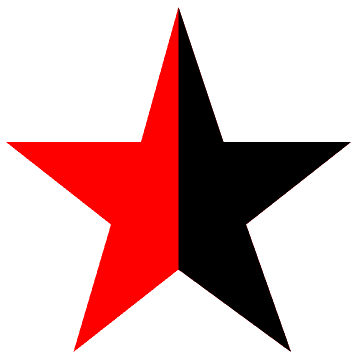

# 遮罩

遮罩与裁剪相反，考虑了除了元素简单形状之外的属性。正如前面提到的，您可以利用全透明、半透明或完全不透明的像素。这可以产生有趣的效果。

以下示例显示了如何一起使用多个遮罩。在此示例中，我们大量使用`defs`部分，然后使用不同的可重用元素组合图像。

首先，我们创建两个渐变。一个是线性渐变，有五个步骤，大部分是黑色，中间创建了一个非常强烈的白色带。第二个是径向渐变，中心区域是黑色，周围是一个非常大的白色圆圈。将这些用作遮罩意味着这些渐变中的每个像素都落在从完全不透明（黑色像素）到完全透明（白色像素）和中间可变透明度的连续范围上。

单独看这些渐变：

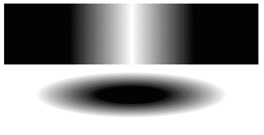

然后，我们创建一个写着“精通 SVG”的`text`元素，并引入一个`pattern`元素，您将从第二章中认识到它，*开始使用 SVG 进行创作*。

在 SVG 元素的主体中，我们链接到文本元素，使用片段标识符（`#mastering-SVG`）指向`defs`部分中`text`元素的 ID，并使用`mask`属性将两个遮罩应用于它们，`mask`属性的`url`值指向`mask`属性的片段标识符。单独看看这些遮罩如何影响文本元素：

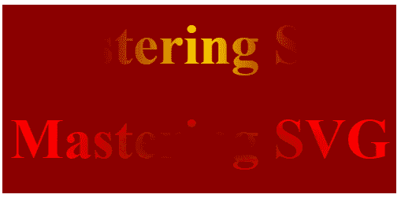

将所有内容放在一起，我们将两个文本元素叠放在一起，并在文本框后面添加一个带图案的框：

```xml
<svg  width="500" height="120" viewBox="0 0 500 120" version="1.1">
    <defs>
        <linearGradient id="gradient">
            <stop offset="0" stop-color="black" stop-opacity="1" />
            <stop offset=".25" stop-color="black" stop-opacity="1" />
            <stop offset=".5" stop-color="white" stop-opacity="1" />
            <stop offset=".75" stop-color="black" stop-opacity="1" />
            <stop offset="1" stop-color="black" stop-opacity="1" />
        </linearGradient>
        <radialGradient id="highlight-gradient">
            <stop offset=".25" stop-color="black" stop-opacity="1" />
            <stop offset=".75" stop-color="white" stop-opacity="1" />
        </radialGradient>
        <mask id="gradient-mask" maskUnits="userSpaceOnUse" x="0" y="0"
         width="500" height="240">
            <rect y="0" x="0" width="500" height="120" 
             fill="url(#gradient)"></rect>
        </mask>
        <mask id="highlight-mask" maskUnits="userSpaceOnUse" x="0" 
         y="0" width="500" height="240">
            <rect y="0" x="0" width="500" height="120" 
             fill="url(#highlight-gradient)"></rect>
        </mask>
        <text id="mastering-SVG" x="10" y="75" font-size="72" text-
         anchor="left" font-weight="bold">
            Mastering SVG
        </text>
        <pattern id="pattern-example" width="100" height="100" 
         patternUnits="userSpaceOnUse">
            <rect width="100" height="100" fill="darkred" x="0" y="0">
            </rect>
            <polygon points="0,50 0,100 50,50 100,100 100,75 50,25 
              0,75" fill="rgb(83,1,1)">               
            </polygon>
        </pattern>
    </defs>
    <rect x="0" y="0" width="500" height="120" fill="url(#pattern-
      example)"></rect>
    <use href="#mastering-SVG" fill="gold" mask="url(#gradient-mask)" 
     x="120"></use>
    <use href="#mastering-SVG" fill="red" mask="url(#highlight-mask)"></use>
</svg>
```

在浏览器中运行后，我们得到以下输出。您可以看到两个文本元素中可见的黄色区域和红色区域混合在一起。中心和边缘有完全不透明的颜色区域，与半透明颜色区域混合，其中背景图案透过，位于两者之间：

**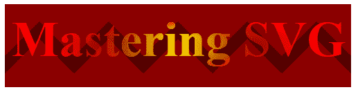**

本节只是简单介绍了遮罩和裁剪的可能性。在本书的其余部分中，您将继续看到这些强大技术的示例。

# 将图像导入 SVG

除了在 SVG 中批量创建图像之外，还可以将其他图像引入 SVG 文档中。

有几种方法可以做到这一点。一种方法是使用 SVG`image`元素，并以一种您熟悉的方式导入图像，如果您使用过 HTML`img`元素，这种方式对您来说将是熟悉的。在此示例中，我们使用`image`元素。它采用`href`属性，类似于 HTML 中的`img src`，并且具有`height`和`width`属性。与 HTML`img`元素不同，它还接受`x`和`y`位置：

在 HTML 文档的上下文中，HTML`spec`实际上将`IMAGE`定义为`img`的同义词。它只存在于内联 SVG 的上下文中。

```xml
<svg  width="1000" height="485" viewBox="0 0 1000 485" version="1.1">
    <image href="take-2-central-2017.jpg" width="1000" height="485" 
      x="0" y="0" ></image>
    <text x="300" y="400" fill="white" font-family="verdana, helvetica" 
     font-size="36" text-anchor="left">
        REACT @ Central Square 2017
    </text>
</svg>
```

在浏览器中呈现，我们得到了完整的照片图像，SVG 文本元素作为标题：

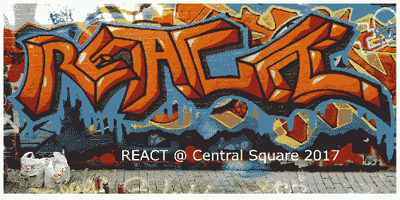

你也可以使用`image`元素来导入其他 SVG 图像。该技术有一定的限制，限制了导入的 SVG 元素的实用性。它们基本上被视为静态图像，因此诸如进一步导入图像之类的事情是行不通的；你不能在导入的 SVG 图像内导入其他图像。只有*第一个*引用的图像会被导入。要使用导入的 SVG 图像的全部功能，你应该使用`use`元素并指向外部 URL。通过这种技术，你还可以针对导入文档的特定片段。这种技术可以让你创建一个符号库，并通过引用将符号导入到你的 SVG 文档中。

在这个简单的例子中，我们展示了如何使用`use`元素并引用包含文档的片段来正确导入图像。`#image`指向`svg-with-import.svg`中特定元素的`id`元素：

```xml
<svg  width="1000" height="970" viewBox="0 0 1000 970" version="1.1">
<image href="svg-with-import.svg" width="1000" height="485" x="0" y="0"></image>
<use xlink:href="svg-with-import.svg#image" width="1000" height="485" x="0" y="485"></use>
</svg>
```

这个文档顶部的空白处显示了图像加载失败的位置：

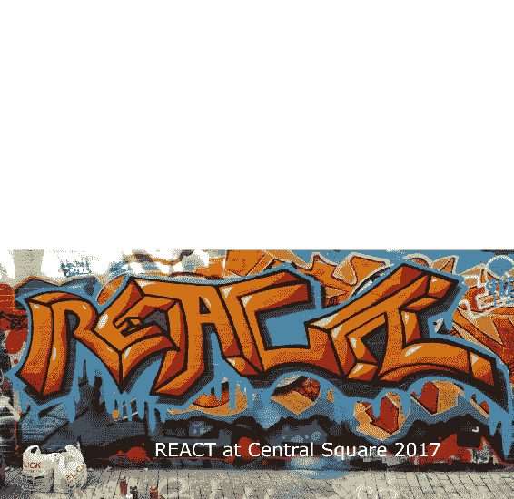

要使这个示例在低于 8 版本的 Internet Explorer 中工作，你需要使用一个叫做`svg4everybody`的 polyfill 脚本（[`github.com/jonathantneal/svg4everybody`](https://github.com/jonathantneal/svg4everybody)）。将它插入到你的文档中，在需要使用 SVG 时调用它，它就可以工作。`svg4everybody`还可以在 Safari 6 和 Edge 12 中填充体验。如何修复你的页面在下面的代码示例中显示。你包含文件，然后调用`svg4everybody()`脚本：

```xml
<script src="img/svg4everybody.min.js"></script>
<script>svg4everybody();</script>
```

# 滤镜

滤镜允许你对元素或元素组应用各种效果。滤镜允许你模糊图像，应用照明效果，以及许多其他高级图像处理技术。如果你曾经使用过 Adobe Photoshop 或其他图形处理程序，这些滤镜就像你在那个环境中看到的滤镜一样。

滤镜是在 SVG 文档的`defs`部分中实现的，并作为`filter`元素的一部分进行分组。它们的引用方式与`mask`和`clipPath`元素相同，通过片段 URL。以下示例显示了应用于圆的常见高斯模糊滤镜：

```xml
<svg
 width="300" height="150" viewBox="0 0 300 150">
    <filter id="blurIsm">
        <feGaussianBlur in="SourceGraphic" stdDeviation="5"/>
    </filter>
    <circle cx="75" cy="75" r="50" fill="red"/>
    <circle cx="200" cy="75" r="50" fill="red" filter="url(#blurIsm)"/>
</svg>
```

在浏览器中呈现，你可以看到右侧的模糊圆圈：

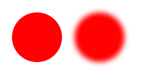

我不打算在本书中详细介绍滤镜。有很多滤镜；浏览器支持的级别有所不同（有时令人困惑），并且解释起来可能非常复杂。我想向你展示一个，这样你就可以看到基本模式，这个是最简单的。*所有*其他滤镜都遵循相同的一般模式。一个`filter`或一系列滤镜被分组在`defs`部分，并通过`id`元素进行引用。只要知道这个简单的模式，你就可以准备好尝试它们，或者将它们纳入你的项目中。

# 在网络上提供 SVG

在我们进入更多关于 SVG 与 web 技术更广泛的交互方式的细节章节之前，关于 SVG 的最后一点说明：如果你要在网络上提供 SVG，你需要确保它以正确的内容类型提供。浏览器期望以`"image/svg+xml"`媒体类型提供 SVG。如果你遇到 SVG 图像不显示的问题，并且你可以验证它们存在于服务器上，最好检查头部（使用你选择的浏览器调试器的网络选项卡）以查看它们是否被正确提供。如果没有（例如，如果它们是`text/xml`），那么你需要正确设置媒体类型。本节概述了如何在常见的 web 服务器中设置正确的媒体类型。

# Apache

在 Apache 中添加正确的媒体类型就像在你的`.htaccess`文件中添加以下行一样简单：

```xml
AddType image/svg+xml svg svgz
```

# nginx

在 nginx 中添加正确的媒体类型需要你在你的`mime.types`文件中有以下条目：

```xml
types {
    image/svg+xml svg svgz;
}
```

# IIS

在 IIS 中添加正确的媒体类型有两种方式。您可以使用 IIS 管理器（[`docs.microsoft.com/en-us/previous-versions/windows/it-pro/windows-server-2008-R2-and-2008/cc753281(v=ws.10)`](https://docs.microsoft.com/en-us/previous-versions/windows/it-pro/windows-server-2008-R2-and-2008/cc753281(v=ws.10))）添加媒体类型，或者您可以将以下条目添加到`web.config`中：

```xml
<configuration>
    <system.webServer>
        <staticContent>
            <remove fileExtension=".svg"/>
            <mimeMap fileExtension=".svg" mimeType="image/svg+xml"/>
            <remove fileExtension=".svgz"/>
            <mimeMap fileExtension=".svgz" mimeType="image/svg+xml"/>
        </staticContent>
    </system.webServer>
</configuration>
```

# 总结

在本章中，您了解了许多更高级的 SVG 功能。您了解了多重变换，这使您能够在不改变 SVG 元素的基本结构的情况下操作它们。这为我们在本书中将继续探讨的许多可能性打开了大门。

您还了解了裁剪和遮罩，这使您能够通过复杂的图形减去图像的部分。这包括使用可变不透明度来操作图像的能力。

此外，您还了解了实现基本 SVG 滤镜以及在常见 Web 服务器上提供 SVG 文件的方法。

在第四章中，*在 HTML 中使用 SVG*，您将了解有关在 HTML 文档中使用 SVG 的一些细节，这是 SVG 真正展现其力量供全世界看到的地方。
