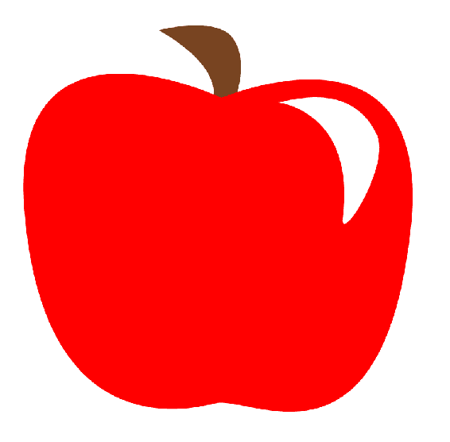
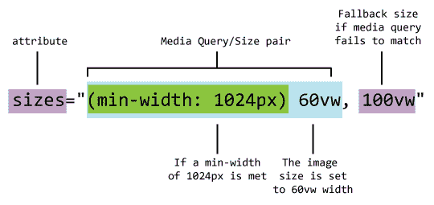
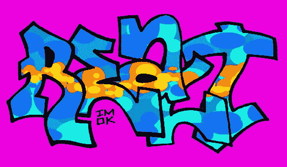
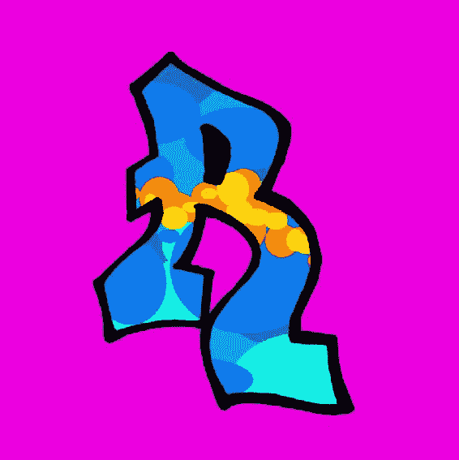

# 第四章：在 HTML 中使用 SVG

到目前为止，在本书中，您已经接触到了 SVG 的基本构建块：在 SVG 规范中定义的功能和功能。虽然 SVG 可以独立存在，但当它在现代网络上得到应用时，它真正发挥作用。现在的网络是多设备、多形态和多连接速度的环境，SVG 有助于解决现代网络开发人员面临的许多棘手问题。因此，接下来的几章将重点介绍 SVG 与其他核心技术的集成：HTML、CSS 和 JavaScript。本章非常直接，重点是在 HTML 文档的上下文中使用 SVG。网络上的一切都始于 HTML，因此确保您的 SVG 在 HTML 中正常运行是正确的方法。

您已经学习了如何将 SVG 插入 HTML 文档中作为图像或内联 SVG 元素的基础知识，可以在[第一章](https://cdp.packtpub.com/mastering_svg/wp-admin/post.php?post=29&action=edit) *介绍可伸缩矢量图形*中找到。本章将在此基础上添加一些细节。

在本章中，您将学习以下内容：

+   SVG 和可访问性

+   使用 SVG 图像进行响应式网页设计以及作为响应式图像解决方案的好处

+   在 HTML 文档的上下文中使用内联 SVG 的工作细节

那么，让我们开始吧！

# SVG、HTML 和可访问性

网络可访问性旨在确保残障人士可以访问网站和应用程序。总体目标是提供以这样一种方式提供内容，以便残障用户可以直接访问，或者如果由于其残障（例如，听障用户需要音频内容），无法直接访问，则提供结构良好的替代内容，以传达相同的信息。然后，可以通过**辅助技术**（**AT**）访问这些结构良好的替代内容。辅助技术的最常见示例是*屏幕阅读器*。

所有平台都有屏幕阅读器。您可以使用一些免费应用程序进行测试，包括以下内容：

+   NVDA（Windows）

+   Apple VoiceOver（OS X）

+   Orca（Linux）

对于 SVG 这种视觉格式，重点是在适当的情况下提供描述图像的文本内容。

正如您可能知道的那样，HTML 本身具有辅助功能的工具和最佳实践。除了 HTML 中的工具外，还有一组名为**可访问丰富互联网应用**（**ARIA**）的技术，它定义了使网络和网络应用对残障人士更具可访问性的方法。 ARIA 提供了一组特殊的辅助功能属性，当添加到 HTML 中时，可以提供有关页面或应用程序的辅助功能信息。例如，`role`属性定义了元素的*类型*（文章、菜单或图像）。

正如您在第一章 *介绍可伸缩矢量图形*中看到的，将 SVG 插入 HTML 文档的两种常见方法是作为图像的`src`和作为内联 SVG 元素（或元素）。本节将添加一些关于使用 SVG、HTML 和 ARIA 属性的注意事项，以确保您的内容在使用这两种技术时仍然具有可访问性。

# SVG 作为图像的 src

将 SVG 放入文档的最简单方法是作为`img`元素的`src`。正如您在第一章 *介绍可伸缩矢量图形*中看到的那样，这样做就像引用`*.svg`元素一样简单，就像在`img`元素的`src`属性上引用任何图像一样。

至于可访问性，如果您遵循有关可访问性和图像的最佳实践，您可以继续对 SVG 图像执行相同的操作。alt 属性应该存在，并且如果辅助技术需要，它应该正确描述内容。您可能会想知道为什么您需要这样做，尤其是对于已经在其源中具有描述性文本的 SVG 图像。请注意，SVG 文件中的任何文本内容实际上被屏幕阅读器锁定，因此即使您使用 SVG，作为一种具有描述性的基于标记的图像格式，它在这种情况下至少表现得就像一个常见的位图文件格式。

除了替代文本之外，旧版 Safari（早于 Safari 桌面 9.1.1 版或 iOS 上的 9.3.2 版）有一个小问题需要考虑。在这些旧版本中，除非在 img 元素上设置了 role="img" ARIA 角色，否则 VoiceOver，苹果屏幕阅读器，将不会读取 alt 文本：

```xml

```

# 内联 SVG

内联 SVG 为可访问性提供了更广泛的选择。例如，与我们刚讨论的 SVG 作为 img src 的情况不同，如果 SVG 中有一个或多个 text 元素，则该文本可以直接被屏幕阅读器读取。如果文本对图像有适当的描述，那么您已经提供了一个可访问的图像。您无需做其他任何事情。

如果 SVG 中的文本对图像没有描述性，或者图像没有文本，那么您可以利用两个 SVG 元素，即 title 和 desc，提供可访问的文本。这些元素与 aria-labelledby 属性结合使用，提供了一种两级的可访问性方法。以下代码示例显示了这种工作方式的基本原理。图像本身是一个苹果的插图。在浏览器中呈现时，看起来像这样：



标记如下。

SVG 元素本身有两个重要的属性。它具有一个 role 为 img 的属性，表示该元素被标识为图形。它还利用了 aria-labelledby 属性，该属性引用了两个单独的 ID，即"apple-title"和"apple-desc"。aria-labelledby 属性在元素本身和其他标签它的元素之间创建了一个关系。

我们首先遇到这两个元素中的第一个元素，即 SVG 元素的第一个子元素，即 title 元素。title 元素可用于为 SVG 元素提供元素的文本描述。它不会直接由浏览器呈现，但应该由屏幕阅读器读取，并且可以呈现为工具提示，就像 alt 属性中的文本在某些浏览器中显示的方式一样。它的 id 是"apple-title"。接下来是可选的 desc 元素。desc 允许您提供图像的更长文本描述。它的 id 是"apple-desc"。它也可以被屏幕阅读器读取，并且不会直接呈现在浏览器中。

有趣的标记的最后一部分是 role="presentation"，它应用于每个子 path 元素。这样做可以将这些元素从可访问性树中排除出去，因此从可访问性的角度来看，SVG 元素被视为一个图形：

```xml
<!doctype html>
<html lang="en">
<head>
 <meta charset="utf-8">
 <title>Mastering SVG- Accessible Inline SVG </title>
</head>
<body>
 <svg  width="300" height="300"
  viewBox="0 0 300 300" version="1.1" role="img" aria-
  labelledby="apple-title apple-desc">
 <title id="apple-title">An Apple</title>
 <desc id="apple-desc">An apple, the sweet, pomaceous fruit, of the
  apple tree.</desc>
 <path role="presentation" style="fill:#784421;stroke:none;stroke-
  width:0.26458332px;stroke-linecap:butt;stroke-linejoin:miter;stroke-
  opacity:1"
  d="m 105.75769,18.053573 c 0,0 46.1131,23.434525 34.01786,50.64881  
  -12.09524,27.214284 15.875,-6.803573 15.875,-6.803573 0,0
   9.07143,-23.434524 -1.5119,-38.55357 -10.58334,-15.1190474 
  -48.38096,-5.291667 -48.38096,-5.291667 z"
 />
 <path role="presentation" style="fill:#ff0000;stroke:none;stroke-
  width:0.26458332px;stroke-linecap:butt;stroke-linejoin:miter;stroke-
  opacity:1"
  d="m 146.65476,61.898812 c 0,0 -139.0952362,-66.5238097
 -127.755951,73.327378 11.339285,139.85118 92.218641,132.57921
  123.220231,124.73214 23.47822,-5.94277 108.10119,52.16071 
  127.00001,-111.125 C 286.06755,2.3982366 146.65476,61.898812 
  146.65476,61.898812 Z"
 />

 <path role="presentation" style="fill:#ffffff;stroke:none;stroke-
  width:0.26458332px;stroke-linecap:butt;stroke-linejoin:miter;stroke-
  opacity:1"
  d="m 183.69643,64.92262 c 0,0 50.21311,5.546816 41.57738,74.83928 
  -2.32319,18.64109 31.75,-34.7738 21.92261,-54.428565 C
  237.36905,65.678572 219.22619,55.851191 183.69643,64.92262 Z"
 />
 </svg>
</body>
</html>
```

本节描述了静态 SVG 图像的可访问性。动态 SVG 还有其他可行的可访问性技术，包括其他 ARIA 属性，例如 ARIA-live 区域。在适用的情况下，您将在以下章节中了解这些内容。也就是说，正确掌握静态 SVG 的基础知识是一个很好的开始，学会使用屏幕阅读器测试 SVG 将使您走上正确的道路。

# SVG 和响应式网页设计

**响应式网页设计**（**RWD**）是一种开发网站和应用程序的技术，利用流体布局网格和 CSS3 媒体查询（[`www.w3.org/TR/css3-mediaqueries/`](https://www.w3.org/TR/css3-mediaqueries/)）来创建可以适应和响应设备或用户代理特征的布局，从而可以伸缩以呈现适用于各种屏幕尺寸的布局，而无需事先了解设备特征。

当 RWD 开始流行起来时，一个迅速浮出水面的问题是难以根据影响最终用户体验的多种变量之一（屏幕分辨率、像素深度和可用带宽）来提供正确大小的图像（文件大小和尺寸）。用户体验。屏幕分辨率、像素深度和可用带宽都结合在一起，使得为用户提供何种大小的图像成为一个复杂的问题。

接下来是多年的追求标记模式，以创建响应式内容图像。*内容图像*是使用`img`标签提供的图像，旨在作为内容呈现。这与仅用于设计的图像相比，后者可以并且应该已经用 CSS 处理。由于媒体查询得到了强有力的支持，CSS 已经提供了许多工具，可以根据多种因素呈现正确的图像。

响应式图像的一些要求如下：

+   **尽可能使用最小的文件大小**：这实际上是核心问题。它以许多方式表现出来。在理想的世界中，我们只会发送渲染图像所需的最小字节数，以达到可接受的质量水平。

+   **利用浏览器预加载程序**：所有现代 Web 浏览器都使用一种技术，其中浏览器会跳过，同时阅读文档并构建 DOM，并阅读文档，寻找可以开始下载的其他资产。

+   为多个分辨率提供正确大小的图像：如果您要为`2048`像素的显示器提供大图像，则希望它是`1600`像素或更大的大图像。另一方面，平板电脑或手机上的大图像可能只需要`320`或`480`像素宽。在这种情况下发送正确数量的数据可以显著提高性能。

+   **为多个像素比设备提供正确的图像**：为了在具有高设备像素比的设备上产生清晰的图像，您需要发送比例更大的文件，这些文件将显示给定 CSS 像素的图像。在标准桌面显示器上清晰的图像会在高像素密度显示器上显示出瑕疵。显然，您可以向所有浏览器发送更高分辨率的图像，但这些像素需要带宽，因此最好只向正确的设备发送正确的图像。

+   **选择不同尺寸的图像或完全不同的图像在不同的断点**：希望能够在不同的方向和屏幕分辨率下显示不同的图像。在大屏幕上，描述亚利桑那州图森的植物的文章中，您可能会使用一个宽图像，显示那里可以找到的各种耐旱植物。在纵向的小屏幕上，由于只显示一英寸高且细节很少，多样性的影响会消失，具有明显垂直宽高比的仙人掌图像可能是更好的选择。

+   **使用设计断点**：围绕媒体查询断点的概念进行了大量开发。它们是 RWD 核心技术之一。图像需要与响应式网站中发生的所有其他设计更改一起进行控制。

那次探索得出的多种解决方案（`picture`元素和`srcset`和`sizes`属性）非常强大。花了一些时间（几年时间和大量的互联网烦恼），但最终，我们在浏览器中获得了为我们提供*正确*图像、*正确*文件大小和*正确*尺寸的一切所需的东西。

这不容易。这是一个复杂的问题，因为它有一个复杂的解决方案。编码是复杂的，理解起来也很复杂，需要生成每个要在网页上呈现的图像的多个版本。

让我们看看新的解决方案是如何工作的，然后我们将看看 SVG（如果由于图像要求而可用）如何使它变得不那么复杂。

# srcset 属性

`srcset`属性是添加到`img`元素的新属性。您可以将其与新的`picture`元素一起使用，我们稍后会这样做。现在，让我们单独看一下。就像我说的，这些东西很复杂，所以值得花时间慢慢建立。

与标准的`src`属性一样，`srcset`属性告诉浏览器从哪里获取要用于`img`元素内容的文件。但与`src`引用的单个图像不同，`srcset`属性呈现了一个逗号分隔的 URL 列表。`srcset`属性还提供了关于图像大小或像素密度的*提示*。

让我们看一个例子来理解这些提示是如何工作的。

在以下示例中，`srcset`属性提示有关设备像素比。在这种情况下，有两个选项。第一个选项是`more-colors-small.jpg`，宽度为`600*350`（600 乘以 350）像素，用于显示标准分辨率。第二个图像`more-colors-large.jpg`，宽度为`1200*700`像素，用于更高分辨率的显示。它仍然以`600*350` *CSS*像素显示，但它有足够的额外图像信息，可以在更高像素密度的显示器上显示得更清晰。

`src`属性作为不支持`srcset`的浏览器的后备：

```xml
<!DOCTYPE html>
   <html lang="en">
     <head>
       <meta charset="utf-8">
     </head>
     <body>
       
     </body>
 </html>
```

这是设备像素比用例的解决方案。

对于每个支持图像的浏览器，`src`作为后备，对于不支持图像的浏览器，`alt`属性作为后备，这是一个很好的向后兼容的解决方案。

# srcset 和 sizes 属性

为了解决更复杂的用例，`srcset`属性可以与新的`sizes`属性一起使用，使用媒体查询来提供不同的图像源，根据浏览器窗口显示不同的相对尺寸。代码示例说明了这是如何工作的。

在这个例子中，元素以`src`属性作为不支持图像的浏览器的后备。在这种情况下，我选择了一个较小的图像，以确保无论设备或浏览器如何，它都能快速加载。接下来是新的`sizes`属性。`sizes`接受媒体查询/图像大小对（或对列表）。

以下图表分解了组件。第一部分是媒体查询。如果您在 CSS 中使用过媒体查询，这个媒体查询应该很熟悉。如果查询为`true`，则图像大小设置为**60vw**（**视口宽度**（**vw**）的 60%）。如果媒体查询失败，则大小回退到**100vw**的默认大小：



可以有任意数量的**媒体查询/大小对**。第一个匹配的媒体查询获胜，如果没有匹配，则使用回退值。

这里的`srcset`属性更加广泛。列表中有一系列宽度在`200`像素到`1600`像素之间的图像。源集中值对的第二部分，而不是指示首选像素密度，提示浏览器图像的像素宽度（200w，400w 等）。浏览器可以根据不同的尺寸和像素密度混合和匹配最佳像素宽度与适当尺寸：

```xml
<!doctype html>
<html lang="en">
<head>
  <meta charset="utf-8">
  <title>Mastering SVG - the srcset and sizes attributes </title>
</head>
<body>
    
  </body>
</html>

```

`size`的长度部分可以用任何有效的 CSS 长度来指定，这增加了这个属性的可能性和复杂性。本章将坚持使用`vw`度量。

# 图片元素

在最初的概念中，`picture`被设计为`img`元素的并行元素，模仿 HTML5 的`video`和`audio`元素的语法。其想法是有一个`picture`元素包裹一系列`source`元素，这些元素将代表图像源的选项。它会包裹一个默认的`img`元素，供不支持的浏览器使用。每个源上的`media`属性将提示浏览器使用正确的源：

```xml
<picture alt="original proposal">
 <source src="img/high-resolution.png" media="min-width:1024px">
 <source src="img/low-resolution.png">
 
 </picture>
```

出于各种实施相关的原因，这个最初的提案被否决了。`srcset`填补了一些空白，但由于它没有解决所有响应式图像使用案例，规范景观中总是有一个空白。

多年过去了，*最终*，经过多次失败的尝试，`picture`被重新设计和重塑，以填补那个空白。

然而，现在，`picture`不再是`img`的替代品，而是`img`元素的*增强*，以帮助浏览器找出图像源的最佳解决方案。

让我们看一个例子。虽然`srcset`的例子使用了同一图像的不同分辨率版本，但这个`picture`的例子旨在为不同分辨率提供不同的图像。在较大的浏览器窗口中，将显示一个宽度大于高度的图像：



在小于 1,024 像素的浏览器窗口中，将使用一个正方形图像：



这个标记相对复杂，需要一些解释。

在`head`中，注意到`picturefill.min.js`文件的存在。Picturefill ([`github.com/scottjehl/picturefill`](https://github.com/scottjehl/picturefill))是`picture`元素的 Polyfill ([`remysharp.com/2010/10/08/what-is-a-polyfill`](https://remysharp.com/2010/10/08/what-is-a-polyfill))，为不支持的浏览器提供了 JavaScript 驱动的图片元素支持。

在 HTML 文档的主体中，`picture`元素包裹整个解决方案。它让浏览器知道它应该使用这个`picture`元素来为子`img`元素找到正确的源。然而，我们并不立即进入`img`元素。我们遇到的第一个子元素是`source`元素。

从开发者的角度来看，`source`的工作方式与最初的提案意图相同。如果媒体查询匹配，就使用该`source`。如果不匹配，则转到堆栈中的下一个媒体查询。

在这里，您有一个媒体查询，寻找最小宽度为`1024`像素的页面。如果媒体查询匹配，`srcset`属性用于让浏览器在`600`像素到`1600`像素宽的三个不同源图像中进行选择。由于此图像旨在以`50vw`显示，这将为大多数显示器提供良好的覆盖范围。接下来是备用的`img`元素，它也包含一个`srcset`。如果浏览器不支持`picture`和`source`，或者前面的媒体查询不匹配，您可以在这里使用`srcset`属性来获取此图像的源。`sizes`属性允许您进一步调整小于`1024`像素的范围的显示：

```xml
<!doctype html>
<html lang="en">
<head>
  <meta charset="utf-8">
  <title>Mastering SVG- picture element </title>
  <script src="img/picturefill.min.js"></script>
</head>
<body>
    <picture>
     <source
      media="(min-width: 1024px)"
      sizes="50vw"
      srcset="more-colors-600.jpg 600w,
        more-colors-1200.jpg 1200w,
        more-colors-1600.jpg 1600w">
       
      </picture>
  </body>
</html>
```

虽然复杂，这种`picture`模式解决了不同图像尺寸和不同格式的分离艺术指导选择的问题。既然（冗长的）解释已经结束，让我们看看 SVG 如何以更少的标记解决同样的问题。您已经在[第一章](https://cdp.packtpub.com/mastering_svg/wp-admin/post.php?post=29&action=edit)中看到了*介绍可缩放矢量图形*，SVG 图像作为`img`元素的`src`进行缩放。实际上，使用 SVG，响应式图像就像以下代码一样简单：

```xml
<!doctype html>
<html lang="en">
<head>
  <meta charset="utf-8">
  <title>Mastering SVG- 100% image element </title>
</head>
<body>
    
  </body>
</html>
```

它允许您无限缩放，而不会丢失保真度或增加额外字节，也不需要`srcset`！有一些方法可以通过 CSS 改进这种简单的解决方案，我们将在下一章中看到，但现在，只需知道这种模式将起作用。从一个 3000 多像素的巨型显示器到一个小巧的功能手机（假设它支持 SVG），前面的标记将很好地进行缩放。

艺术指导用例怎么样？使用 SVG 也更简单。因为我们不必提供图像的多个版本（每个 SVG 图像都可以根据需要进行缩放），艺术指导用例的标记如下。

我们有与之前看到的相同的`picture`元素。有一个子`source`元素，其中包含一个指向大于`1024`像素的浏览器的媒体查询。如果为`true`，则将使用横向图像。然后，有一个子`img`元素，其中`srcset`指向一个正方形图像，`width`为 100%。如果第一个`source`元素上的媒体查询失败，我们就会得到这个图像。

它不像普通的`img`那样简单，但比每个`srcset`中的多个位图图像版本要简单得多。输出两个图像，即可处理最复杂的情况，艺术指导和跨多个屏幕分辨率的缩放：

```xml
<!doctype html>
<html lang="en">
<head>
  <meta charset="utf-8">
  <title>Mastering SVG- picture element with SVG </title>
  <script src="img/picturefill.min.js"></script>
</head>
<body>
  <picture>
    <source 
      media="(min-width: 1024px)"
      srcset="more-colors.svg">
    
  </picture>
  </body>
</html>
```

虽然 SVG 并非适用于每种用例，但它是远远最灵活的 RWD 图像格式。从基于一个图像源的简单`width="100%"`技术来缩放图像，到使用`picture`元素更简单地实现艺术指导用例，SVG 在这个多分辨率、多设备的世界中提供了巨大的好处。

# HTML 文档中内联 SVG 的附加细节

正如您已经了解的那样，使用内联 SVG 与 HTML 标记一样简单，通常是您嵌入 SVG 到文档中的最佳（或唯一，在交互式 SVG 的情况下）选项。也就是说，与网络上的任何内容一样，当使用内联 SVG 时，总会有一些边缘情况、注意事项和需要牢记的要点。本节概述了其中两个问题。第一个是尝试利用浏览器的缓存，另一个是要注意在处理 SVG 时 DOM 复杂性可能会大幅增加。

# 缓存

与作为`img`元素的`src`链接的 SVG 图像或通过 CSS 引用的 SVG 图像不同，内联 SVG 无法被缓存并在另一页或单页应用程序的不同视图中引用。虽然最小化 HTTP 请求的数量仍然有性能优势（内联 SVG 通过消除对单独 SVG 文档的请求来实现），但这并不总是最优化的模式。如果您在多个页面上多次使用相同的 SVG 图像，或者多次访问多个站点，那么拥有一个可以被缓存并稍后再次读取的文件将会有益处。这对于更大、更复杂的 SVG 图像尤其如此，它们可能具有较大的下载占用空间。

如果您真的需要使用内联 SVG（例如所有交互式示例），您仍然可以尝试通过使用`use`元素链接到外部库 SVG 元素来以不同的方式利用浏览器缓存。您可能会在前期添加一些 HTTP 请求，但您不必不断下载和解析定义这些可重用组件的内联标记。

而且，考虑可重用组件是思考项目结构的一种好方法，因此这是利用浏览器缓存之外的好处。

# 复杂性

虽然我实际上已经尝试限制您在本书中迄今为止看到的 SVG 代码示例的复杂性，但您已经看到了一些非常繁忙的 SVG 示例。实际上，当处理比一小部分`rect`、`circle`或`text`元素更复杂的任何内容时，SVG 代码的大小和/或可读性可能会迅速下降。这在生成的代码中尤其如此，因为它实际上并不是为了人类消费而设计的。

这种复杂性可能会以两种不同的方式成为问题：创作环境更加复杂，页面的渲染和性能变慢。

# 创作

SVG 文档可能会变得非常庞大，即使是简单的图像也是如此。根据效果的数量和元素的数量，用于绘制 SVG 图像的标记可能会迅速压倒页面上的其他所有内容。因此，值得将大型 SVG 元素保留为单独的文档片段，并根据需要将它们引入您的文档中。根据它们的使用方式，这可能是在包含 SVG 文档内部使用`use`元素，或者可能是使用您选择的页面组合工具导入文档片段的情况。有许多服务器端和/或客户端解决方案可以将标记和文本片段组合在一起（例如，JavaScript 模板解决方案，CMS，博客平台和服务器端脚本语言，如 PHP），因此我不打算创建一个潜在有限用途的示例。我相信您会利用最贴近您心的解决方案。

您仍然必须在检查页面时处理它，但这比在一个 700 行文件中占据 500 行标记的 SVG 插图要好得多，该插图显示了供应链图表或类似内容。

# 文档对象模型

除了创作问题，您还可能遇到非常复杂的 SVG 在浏览器性能方面的问题。这是真实的，无论您以何种方式导入它们，因为即使 SVG 作为`img src`导入，它也不仅仅是一组像素，但如果您已经在 DOM 中进行了大量交互，这种情况可能会更加严重。一般来说，文档中的元素数量直接影响页面的速度和响应性（https://developers.google.com/web/fundamentals/performance/rendering/avoid-large-complex-layouts-and-layout-thrashing）。当页面上有成百上千个潜在的可交互 SVG 元素时，每个元素都需要由浏览器计算（其中一些在内部进行非常复杂的计算）并呈现，事情可能会非常快地变慢。

大多数情况下，您不太可能遇到这种性能问题。至少我希望您不会。然而，这是可能的，因此请将可能性存档，希望您永远不必使用这些知识。

# 总结

在本章中，您了解了在 HTML 文档环境中使用 SVG。首先，您了解了使用内联 SVG 元素和 SVG 图像作为`img`元素的`src`时的 SVG 可访问性。这包括`img`元素的`alt`属性的详细信息，以及内联 SVG 中`title`和`desc`元素的详细信息。

接下来，您了解了响应式图像的解决方案，以及如何使用 SVG 可以极大地简化甚至是最复杂的响应式图像使用情况的实现。最后，您了解了在实际世界中实施这些解决方案时需要注意的内联 SVG 的其他方面。

接下来，我们将看一下 CSS 和 SVG 的重要交集。下一章将建立在我们所学到的一切基础上，并将为您介绍一些强大的新工具，供您添加到 SVG 工具箱中。
