# 第五章：使用 SVG 和 CSS

本章将重点介绍 SVG 和 CSS 的交集。虽然 JavaScript 是处理 SVG 最强大的工具，但没有 CSS 的 SVG 不会像现在这样受欢迎。正如你已经了解的那样，SVG 非常适合现代网络，通常是对 RWD 问题的最佳答案。因此，它已经被设计师和开发人员全力以赴地用于为网络生成图像。

对于整个网络来说，这种对 SVG 的偏好是一个很好的选择，应该加以培养。本章将希望说明为什么。

在这一章中，我们将学习以下内容：

+   使用 CSS 背景图像

+   如何优化 SVG 的数据 URI

+   SVG 精灵与图标字体

+   不同的 SVG 嵌入方式如何与 CSS 互动

+   使用常见的 CSS 属性来操作 SVG

+   使用 SVG 特定的 CSS 属性来操作 SVG

+   使用 SVG 的基本 CSS 动画和过渡

# CSS 背景图像

你已经在第一章中看到了使用 CSS 作为背景图像的例子，*介绍可伸缩矢量图形*。本节将为使用 SVG 的这种方式添加一些更多的细节。

在这个最初的基本示例中，我们将一个风格化的字母 R 的 SVG 图像添加为`div`的背景图像。一个重要的方面是设置`background-size`属性。SVG 图像的自然大小是`458`乘以`392`。在这种情况下，它被设置为原来大小的一半，以适应`div`的大小：

```xml
<!doctype html>
<html lang="en">
    <head>
        <meta charset="utf-8">
        <title>Mastering SVG- CSS Background Images</title>
        <style type="text/css">
          .logo{
            width: 229px;
            height: 196px;
            background: url(icon.svg);
            background-repeat: no-repeat;
            background-size: 229px 196px;
          }
        </style>
    </head>
    <body>
        <div class="logo">
        </div>
    </body>
</html>
```

在浏览器中呈现，我们得到以下结果：

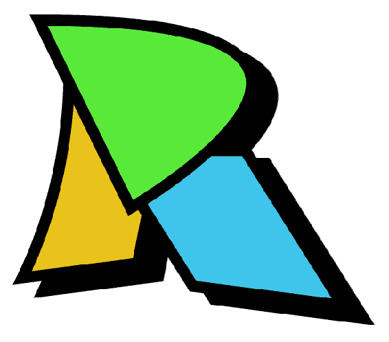

除了提供高像素密度显示（这确实是一个很棒的功能）之外，这并没有比 PNG 提供更多。

在使用相对单位的环境中，你可以利用 SVG 的能力，将`background-size`的值设置为`contain`或`cover`，以真正充分利用 SVG。在下面的例子中，与之前相同的标志被应用为背景图像，旁边还有一些文本。所有的度量都是相对的，使用根 em（rem）单位。背景图像设置为`contain`的`background-size`值。`contain`确保标志将完整地显示，受包含元素的高度和宽度的限制。由于我们使用 SVG 图像作为背景图像，文档的基本字体（因此计算*根 em*）可以从 16 像素（浏览器默认值）缩放到 1600 像素，SVG 背景将能够缩放以匹配：

```xml
<!doctype html>
<html lang="en">
    <head>
        <meta charset="utf-8">
        <title>Mastering SVG- Relative Background Images </title>
        <link href="https://fonts.googleapis.com/css?
         family=Raleway:600" rel="stylesheet"> 
        <style type="text/css">
          .logo{
            width: 14.3rem;
            height: 14.3rem;
            background: url(icon.svg);
            background-repeat: no-repeat;
            background-size: contain;
            background-position-y: 2.5rem;
          }
          h1 {
            font-family: Raleway, sans-serif;
            font-size: 2rem;
          }
        </style>
    </head>
    <body>
      <div class="logo">

      <h1>Rob Larsen</h1>
    </div>
    </body>
</html>
```

在浏览器中呈现，我们得到以下结果：

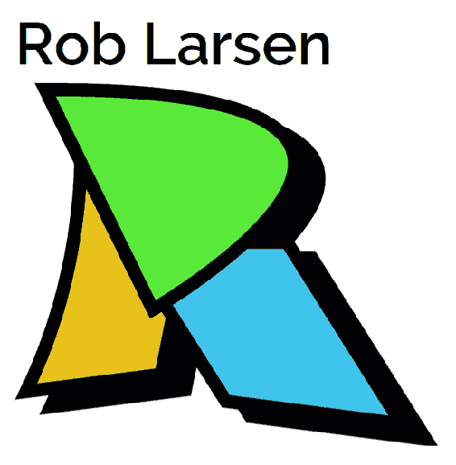

这里没有什么新的东西，但这是现代网页上 SVG 的一个非常重要的用途，值得花一些时间来强调这种模式。

# SVG 背景图像的数据 URL

如果你注重性能，你可能会想知道通过 data: URL 直接在 CSS 中嵌入背景图像的技术。数据 URL 允许你通过特殊的`data: URL`将文件直接嵌入文档中。这种技术允许你节省一个 HTTP 请求。

当使用诸如 JPG 或 PNG 之类的二进制格式时，图像数据需要进行`base64`编码。虽然这对 SVG 图像也适用，但实际上，将 SVG 图像作为 SVG 源嵌入更快（[`css-tricks.com/probably-dont-base64-svg/`](https://css-tricks.com/probably-dont-base64-svg/)）。这是因为除了`base64`编码的数据外，你还可以直接嵌入文本。SVG 当然是一种文本格式。你只需要对 SVG 进行一些处理才能使其正常工作。你应该阅读 Taylor Hunt 的完整文章以获取详细信息（[`codepen.io/tigt/post/optimizing-svgs-in-data-uris`](https://codepen.io/tigt/post/optimizing-svgs-in-data-uris)），但基本步骤如下：

+   使用单引号作为属性值

+   对任何非安全字符（`<`，`>`，`#`等）进行 URL 编码

+   双引号数据 URL

转换初始示例，我们得到的代码如下：

```xml
<!doctype html>
<html lang="en">
    <head>
        <meta charset="utf-8">
        <title>Mastering SVG- CSS Background Images with Data 
         URLs</title>
        <style type="text/css">
          .logo{
            width: 229px;
            height: 196px;
            background: url("data:image/svg+xml,%3Csvg
xmlns='http://www.w3.org/2000/svg' height='392' width='458'%3E%3Cg  stroke='%23000' stroke-width='14.17'%3E%3Cpath d='M96.42 60.2s14 141.5-58 289l145.5-18.4 55.4-276.7z' fill='%23000012'/%3E%3Cpath d='M145.42 188l108.5 171.6 189.2 24.4-123.4-196z' fill='%23000012'/%3E%3Cpath d='M70.12 43.7s14 141.5-58 289l145.5-18.4 55.4-276.7z' fill='%23e9c21b'/%3E%3Cpath d='M59.02 23.6l116.2 237.2c-.1 0 411.3-239.1-116.2-237.2z' fill='%23000012'/%3E%3Cpath d='M119.12 171.6l108.5 171.6 189.2 24.4-123.4-196z' fill='%233fc4eb'/%3E%3Cpath d='M32.62 7.1l116.2 237.2S560.22 5.2 32.62 7.1z' fill='%2359ea39'/%3E%3C/g%3E%3C/svg%3E");
            background-repeat: no-repeat;
            background-size: 229px 196px;
          }
        </style>
    </head>
    <body>
      <div class="logo">
    </div>
    </body>
</html>
```

虽然这实际上是非常简单的手工准备（这里的示例是手工编码的），但如果您想要挤出所有字节，有一些可用的工具可以为您完成这项工作。有一个 node 模块（[`www.npmjs.com/package/mini-svg-data-uri`](https://www.npmjs.com/package/mini-svg-data-uri)）和一个 SASS 函数（[`codepen.io/jakob-e/`](https://codepen.io/jakob-e/)），可以帮助您将此功能构建到您的工作流程中。

# SVG 精灵和图标集

这一部分并不严格涉及 CSS，但讨论了一种常见的基于 CSS 的解决方案的替代方案，用于向应用程序添加图标，因此这似乎是讨论它的最佳地方。

如果您正在阅读本书，您可能对图标字体的概念有所了解，比如 GLYPHICONS（[`glyphicons.com/`](http://glyphicons.com/)）或 Font Awesome（[`fontawesome.com/icons?from=io`](https://fontawesome.com/icons?from=io)）。如果您不了解，它们是字体，而不是表示可以作为语言阅读的字符（就像您现在正在阅读的字符），它们呈现可以用作站点或应用程序图标的不同图像。

例如，您可以使用*Font Awesome*创建视频播放器的界面，而无需设计单个元素。

以下代码示例显示了该实现可能看起来如何。除了 Font Awesome，以下示例还使用了 Bootstrap 样式。

Font Awesome 的基本模式是将图标作为空元素包含。在这种情况下是`i`。每个图标都有两个常见的类：`fa`和`fa-2x`。这些类表示元素是 Font Awesome 图标，并且应该以正常大小的`2x`渲染。之后，使用`fa-`类添加各个图标，表示要使用的图标类型：

```xml
<!doctype html>
<html lang="en">
    <head>
        <meta charset="utf-8">
        <title>Mastering SVG- Font Awesome</title>
        <link rel="stylesheet" 
href="https://maxcdn.bootstrapcdn.com/bootstrap/4.0.0/css/bootstrap.min.css" integrity="sha384-Gn5384xqQ1aoWXA+058RXPxPg6fy4IWvTNh0E263XmFcJlSAwiGgFAW/dAiS6JXm" crossorigin="anonymous">
        <link href="font-awesome.min.css" rel="stylesheet" />
    </head>
    <body>       
        <div style="text-align: center">
            <button class="btn btn-link"><i class="fa fa-2x fa-backward
             "></i></button> 
            <button class="btn btn-link"><i class="fa fa-2x fa-fast-
              backward"></i></button> 
            <button class="btn btn-link"><i class="fa fa-2x fa-play">
             </i></button>
            <button class="btn btn-link"><i class="fa fa-2x fa-fast-
             forward"></i></button> 
            <button class="btn btn-link"><i class="fa fa-2x fa-
             forward"></i></button> 
        </div>

    </body>
</html>
```

在浏览器中呈现如下：


这一切都非常清晰易懂。正因为如此，这些图标字体非常受欢迎。我在多个环境中使用过它们，对它们的通用易用性和快速启动能力印象深刻。

也就是说，使用图标字体也有缺点。两个突出的缺点是：

+   可访问性：有方法可以很好地使用图标字体，以便实现可访问性（[`www.filamentgroup.com/lab/bulletproof_icon_fonts.html`](https://www.filamentgroup.com/lab/bulletproof_icon_fonts.html)），但开箱即用，您正在向空元素插入无意义的字符。屏幕阅读器可以读取这些无意义的字符，为依赖 AT 浏览网页的用户创建混乱的体验。

+   语义：空元素是*空的。*使用`i`或`span`的图标字体实际上没有任何含义。

还有其他问题，包括加载 Web 字体的挑剔性以及对阅读障碍用户的问题（[`cloudfour.com/thinks/seriously-dont-use-icon-fonts/`](https://cloudfour.com/thinks/seriously-dont-use-icon-fonts/)）。

好消息是，如果您对更好的语义、更好的可访问性和更直接的实现感兴趣，有一种 SVG 替代图标字体的方法：使用*SVG 精灵*。公平地说，SVG 精灵也不是一个完美的解决方案，因为最优雅的变体需要 IE/Edge 形状的解决方法。但对于某些配置（特别是单页应用程序），SVG 精灵是图标交付的绝佳选择。

让我们看看它是如何工作的。

在本例中，我们将使用 Front Awesome v5，它提供了所有图标的 SVG 版本，以复制先前的控件集。

以下是使用 SVG 精灵实现相同控件的方法。

首先，让我们看一下精灵文件本身的细节。在其中，所有图标都被定义为与 CSS 图标的类名相对应的`symbol`元素。每个`symbol`元素都包括可访问的`title`元素。

集合中的每个图标都在文件`fa-solid.svg`中表示：

```xml
 <symbol id="play" viewBox="0 0 448 512">
    <title id="play-title">play</title>
    <path d="M424.4 214.7L72.4 6.6C43.8-10.3 0 6.1 0 47.9V464c0 37.5 
     40.7 60.1 72.4 41.3l352-208c31.4-18.5 31.5-64.1 0-82.6z"></path>
  </symbol> 

```

在 HTML 文件中，情况略有不同，但总体模式基本相同。我们仍然链接到 Bootstrap 以方便使用。我们不再在`head`中链接来自 Font Awesome 的任何内容。我们只需要一小块 CSS 来调整页面上图标的大小。在实际的示例中，您可能会做更多的样式处理，但目前这已经足够使其正常工作。

在文档的主体部分，我们有一个新的模式。与`button.btn > i.fa`模式不同，我们有`button.btn > svg > use`，其中 use 指向`fa-solid.svg`文件中的特定符号。

除此之外，我们有一个适用于 Internet Explorer 的问题。Internet Explorer 不允许您从外部文档中使用元素。脚本*svg4everybody*填补了这个缺陷，并允许您在 IE 中链接到外部 SVG：

```xml
<html lang="en">
<head>
  <meta charset="utf-8">
  <title>Mastering SVG- Font Awesome</title>
  <link rel="stylesheet" 
    href="https://maxcdn.bootstrapcdn.com/bootstrap/4.0.0- 
    beta.3/css/bootstrap.min.css" integrity="sha384-
    Zug+QiDoJOrZ5t4lssLdxGhVrurbmBWopoEl+M6BdEfwnCJZtKxi1KgxUyJq13dy"
    crossorigin="anonymous">
  <style>
    .btn svg{
      height: 2em;
      width: 2em;
      fill: #007bff;
    }
  </style>
</head>
<body>
  <div>
    <button aria-label="rewind" class="btn btn-link">
      <svg  role="img">
        <use xlink:href="fa-solid.svg#backward"></use>
      </svg>
    </button>
    <button aria-label="skip to previous track" class="btn btn-link">
      <svg  role="img">
        <use xlink:href="fa-solid.svg#fast-backward"></use>
      </svg>
    </button>
    <button aria-label="play" class="btn btn-link">
      <svg  role="img">
        <use xlink:href="fa-solid.svg#play"></use>
      </svg>
    </button>
    <button aria-label="skip to next track" class="btn btn-link">
      <svg  role="img">
        <use xlink:href="fa-solid.svg#fast-forward"></use>
      </svg>
    </button>
    <button aria-label="fast forward" class="btn btn-link">
      <svg  role="img">
        <use xlink:href="fa-solid.svg#forward"></use>
      </svg>
    </button>
  </div>
  <script src="img/svg4everybody.min.js"></script>
  <script>svg4everybody();</script>
</body>

</html>
```

我提到了单页面应用程序可能会被不同对待。如果您正在开发单页面应用程序并且想要使用 SVG 图标，您可以在页面中*内联*符号，并且在所有现代浏览器中*使用*它们，而无需任何填充脚本。对于单页面应用程序，您可能已经在文档中内联了 CSS 等内容以节省 HTTP 请求，因此在文档中内联一部分 SVG 可以成为相同过程的一部分。

我不打算详细说明这可能是如何从构建或页面创建的角度工作的，因为有很多种方法可以做到这一点（可以作为构建过程的一部分或通过服务器端模板系统），但输出可能看起来像以下代码示例。

最大的区别是在`body`顶部的内联`svg`元素中定义符号。这增加了页面的复杂性，但节省了 HTTP 请求。因此，如果您正在构建单页面应用程序并且不需要依赖缓存单独的精灵文件，这将会稍微更快一些。

除此之外，引用直接指向同一页面的文档片段，而不是链接到单独的文件。这意味着我们不需要 svg4everybody，而且 Internet Explorer 很乐意支持`use`：

```xml
<!doctype html>
<html lang="en">

<head>
  <meta charset="utf-8">
  <title>Mastering SVG- Font Awesome</title>
  <link rel="stylesheet" 
    href="https://maxcdn.bootstrapcdn.com/bootstrap/4.0.0-
    beta.3/css/bootstrap.min.css" integrity="sha384-
    Zug+QiDoJOrZ5t4lssLdxGhVrurbmBWopoEl+M6BdEfwnCJZtKxi1KgxUyJq13dy"
    crossorigin="anonymous">
  <style>
    .btn svg {
      height: 2em;
      width: 2em;
      fill: #007bff;
    }
  </style>
</head>

<body>
  <svg  style="display:none">
    <defs>
      <symbol id="play" viewBox="0 0 448 512">
        <title id="play-title">play</title>
        <path d="M424.4 214.7L72.4 6.6C43.8-10.3 0 6.1 0 47.9V464c0 
         37.5 40.7 60.1 72.4 41.3l352-208c31.4-18.5 31.5-64.1 0-82.6z"></path>
      </symbol>
      <symbol id="fast-backward" viewBox="0 0 512 512">
        <title id="fast-backward-title">fast-backward</title>
        <path d="M0 436V76c0-6.6 5.4-12 12-12h40c6.6 0 12 5.4 12
         12v151.9L235.5 71.4C256.1 54.3 288 68.6 288 96v131.9L459.5 
         71.4C480.1 54.3 512 68.6 512 96v320c0 27.4-31.9 41.7-52.5
         24.6L288 285.3V416c0 27.4-31.9 41.7-52.5 24.6L64 285.3V436c0 
         6.6-5.4
         12-12 12H12c-6.6 0-12-5.4-12-12z"></path>
      </symbol>
      <symbol id="fast-forward" viewBox="0 0 512 512">
        <title id="fast-forward-title">fast-forward</title>
        <path d="M512 76v360c0 6.6-5.4 12-12 12h-40c-6.6 0-12-5.4-12-
         12V284.1L276.5 440.6c-20.6 17.2-52.5 2.8-52.5-24.6V284.1L52.5 
         440.6C31.9 457.8 0 443.4 0 416V96c0-27.4 31.9-41.7 52.5-
         24.6L224 226.8V96c0-27.4 31.9-41.7 52.5-24.6L448 226.8V76c0-
         6.6 5.4-12 12-12h40c6.6 0 12 5.4 12 12z"></path>
      </symbol>
      <symbol id="forward" viewBox="0 0 512 512">
        <title id="forward-title">forward</title>
        <path d="M500.5 231.4l-192-160C287.9 54.3 256 68.6 256 96v320c0 
         27.4 31.9 41.8 52.5 24.6l192-160c15.3-12.8 15.3-36.4 0-49.2zm-
         256 0l-192-160C31.9 54.3 0 68.6 0 96v320c0 27.4 31.9 41.8 52.5 
         24.6l192-160c15.3-12.8 15.3-36.4 0-49.2z"></path>
      </symbol>
      <symbol id="backward" viewBox="0 0 512 512">
        <title id="backward-title">backward</title>
        <path d="M11.5 280.6l192 160c20.6 17.2 52.5 2.8 52.5-24.6V96c0-
         27.4-31.9-41.8-52.5-24.6l-192 160c-15.3 12.8-15.3 36.4 0 
         49.2zm256 0l192 160c20.6 17.2 52.5 2.8 52.5-24.6V96c0-27.4-
         31.9-41.8-52.5-24.6l-192 160c-15.3 12.8-15.3 36.4 0 49.2z"></path>
      </symbol>
    </defs>
  </svg>
  <div>
    <button aria-label="rewind" class="btn btn-link">
      <svg  role="img">
        <use xlink:href="#backward"></use>
      </svg>
    </button>
    <button aria-label="skip to previous track" class="btn btn-link">
      <svg  role="img">
        <use xlink:href="#fast-backward"></use>
      </svg>
    </button>
    <button aria-label="play" class="btn btn-link">
      <svg  role="img">
        <use xlink:href="#play"></use>
      </svg>
    </button>
    <button aria-label="skip to next track" class="btn btn-link">
      <svg  role="img">
        <use xlink:href="#fast-forward"></use>
      </svg>
    </button>
    <button aria-label="fast forward" class="btn btn-link">
      <svg  role="img">
        <use xlink:href="#forward"></use>
      </svg>
    </button>
  </div>
</body>

</html>
```

与图标字体一样，SVG 精灵可以完全使用 CSS 进行自定义。您已经看到了一个示例，在前面的示例中我们改变了图标的大小和颜色。当您阅读本章的其余部分时，您将会遇到许多使用 CSS 操纵 SVG 的方法。这是一个非常强大的组合！

# 对内联 SVG 进行样式设置

本节将重点介绍您可以使用 CSS 操纵内联 SVG 元素的许多方法。本节不会详尽无遗，但将涵盖您在处理 SVG 时将使用的许多常见属性。

这些属性分为两类：

+   您可能已经熟悉的 CSS 和 HTML 中的 CSS 属性，也适用于 SVG

+   特定于 SVG 本身的 CSS 属性

让我们从熟悉的 CSS 属性开始。

# 使用常见的 CSS 属性来操纵 SVG

本节将重点介绍与 SVG 一起使用的常见 CSS 属性。除了一些例外，您实际上会关注的大多数属性都与文本相关。

# 基本字体属性

如果您已经使用 CSS 工作了一段时间，您可能已经操纵了元素的字体和样式。这些属性对 SVG 元素也是可用的。

以下代码示例显示了四个`text`元素。第一个没有应用任何样式，并显示了 SVG 中`text`元素的默认渲染。接下来的三个元素通过 CSS 样式进行了增强。第一个类`text`添加了优秀的 Raleway 字体（作为 Google 网络字体可用）和一个新的`font-size`（`2em`）。接下来的两个类，`text-italic`和`text-bold`，分别使用`font-style`和`font-weight`进行了增强：

```xml
<!doctype html>
<html lang="en">
    <head>
        <meta charset="utf-8">
        <title>Mastering SVG- CSS Font Properties</title>
        <link href="https://fonts.googleapis.com/css?
         family=Raleway:400" rel="stylesheet"> 

        <style type="text/css">
          .text {
            font-family: Raleway, sans-serif;
            font-size: 2em;
          }
          .text-italic {
            font-style: italic;
          }
          .text-bold {
            font-weight: bold;
          }
        </style>
    </head>
    <body>
      <svg  role="img" width="800"
        height="250" viewBox="0 0 800 250">
        <text x="25" y="50">
          Default text format
        </text>
        <text x="25" y="100" class="text">
          font-family: Raleway, sans-serif;
          font-size: 2em;
        </text>
        <text x="25" y="150" class="text text-italic">
          font-style: italic;
        </text>
        <text x="25" y="200" class="text text-bold">
          font-weight: bold;
        </text>
       </svg>
    </body>
</html>
```

在浏览器中呈现，您可以看到以下结果：

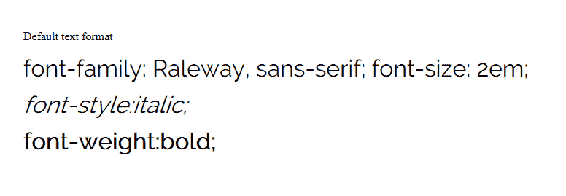

如果你在想，简写属性也同样适用。因此，简单地定义一个`font`属性是支持的，如下面的代码示例所示：

```xml
<!doctype html>
<html lang="en">
    <head>
        <meta charset="utf-8">
        <title>Mastering SVG- CSS Font Shorthand</title>
        <link href="https://fonts.googleapis.com/css?
         family=Raleway:400" rel="stylesheet"> 
        <style type="text/css">
          .text {
            font: 2em bold Raleway, sans-serif; 
          }
        </style>
    </head>
    <body>
      <svg  role="img" width="800"
       height="250" viewBox="0 0 800 250">
        <text x="25" y="50">
          Default text format
        </text>
        <text x="25" y="100" class="text">
          font: 2em bold Raleway, sans-serif; 
        </text>
       </svg>
    </body>
</html>
```

这在浏览器中呈现如下：

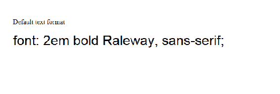

# 文本属性

在 SVG 中支持的下一组 CSS 属性都与文本块有关。因此，不仅仅是由字体属性定义的单个字形，还有更大的字形组合方式。

以下代码示例展示了其中的几个。第一个类`text`再次更改了`font-family`和`font-size`。

接下来，我们有几个其他类，展示了 SVG 对文本属性的支持。第一个示例展示了对`direction`的支持，它允许您定义在从右到左阅读的语言中正常工作的文本块（例如，波斯语、阿拉伯语和希伯来语）。这个例子简单地将基于英语的属性定义锚定到框的右侧。接下来，我们将`letter-spacing`（跟踪）属性设置为宽敞的`1em`，使用`text-decoration`添加下划线，并将`word-spacing`设置为`2em`：

```xml
<!doctype html>
<html lang="en">
    <head>
        <meta charset="utf-8">
        <title>Mastering SVG- CSS Text Properties</title>
        <link href="https://fonts.googleapis.com/css?
         family=Raleway:400" rel="stylesheet"> 

        <style type="text/css">
          .text {
            font-family: Raleway, sans-serif;
            font-size: 1.5em;
          }
          .text-direction {
            direction: rtl;
          }
          .text-letter-spacing {
            letter-spacing: 1em;
          }
          .text-decoration {
            text-decoration: underline;
          }
          .text-word-spacing {
            word-spacing: 2em;
          }
        </style>
    </head>
    <body>
      <svg  role="img" width="500"
       height="300" viewBox="0 0 500 300">
        <text x="475" y="50" class="text text-direction">
          direction: rtl;
        </text>
        <text x="25" y="100" class="text text-letter-spacing">
          letter-spacing: 1em;
        </text>
        <text x="25" y="150" class="text text-decoration">
          text-decoration: underline;
        </text>
        <text x="25" y="200" class="text text-word-spacing">
          word-spacing: 2em;
        </text>

       </svg>
    </body>
</html>
```

在浏览器中呈现，该示例如下所示：

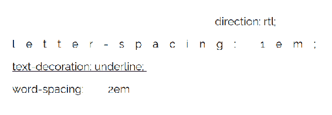

# 杂项 CSS 属性

本节中的最后一个示例显示了对光标、显示和可见性属性的支持。其中，最有用的将是光标。在这个例子中，我们将`rect`元素的`cursor`更改为帮助光标。拖动手柄、调整大小手柄、可点击的指针等都将是交互式 SVG 中常用的值。

接下来，我们使用`display`和`visibility`属性来隐藏元素。虽然在 HTML 中两者之间的区别很明显，在 SVG 中这两个属性之间的实际区别较小。在 HTML 中，使用`display:none`的元素不会影响文档的呈现。它们不会影响文档的整体流程。它们在 DOM 中，并且可以从 JavaScript 中访问，但实际上被呈现引擎忽略。另一方面，使用`visibility:hidden`设置的元素仍然是文档流的一部分。一个高 200 像素的`div`仍然会占据 200 像素。它只是以不可见的方式这样做。

由于 SVG 中的大多数元素都是在坐标系上使用`(x,y)`属性进行定位，因此两者之间的差异可能是微妙的。通常，使用`visibility:hidden`的 SVG 元素没有任何流程中断（`tspan`可能是一个例外），因此在布局上没有实际的区别。唯一的区别在于 JavaScript 事件的处理方式。我们将在后面更深入地研究这一点，既在下一节中，也在后面的 JavaScript 章节中。但根据`pointer-events`属性的设置方式，`visibility:hidden`元素可能仍然通过 JavaScript 事件与用户交互。默认情况下，它们不会，但这仍然是可能的：

```xml
<!doctype html>
<html lang="en">
    <head>
        <meta charset="utf-8">
        <title>Mastering SVG- CSS Misc Properties</title>
        <link href="https://fonts.googleapis.com/css?
         family=Raleway:400" rel="stylesheet"> 

        <style type="text/css">
          .help {
            cursor: help;
          }
          .display-none {
            display: none;
          }
          .visibility-hidden {
            visibility: hidden;
          }
        </style>
    </head>
    <body>
      <svg  role="img" width="500" 
        height="300" viewBox="0 0 500 300">
        <rect x="10" y="0" width="100" height="100" fill="red" 
          class="help"></rect>
        <rect x="120" y="120" height="100" width="100" fill="blue" 
          class="display-none"></rect>
        <rect x="240" y="120" height="100" width="100" fill="blue" 
           class="visibility-hidden"></rect>
       </svg>
    </body>
</html>

```

在浏览器中呈现时，当鼠标悬停在元素上时，此示例如下所示：

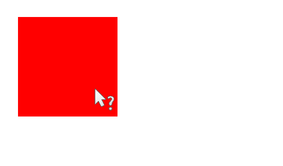

如果您熟悉 CSS，那么您会知道`display`还有其他可能的值。虽然我相信设置 SVG 元素具有另一个`display`值的情况是有效的，但这不是您通常会做的事情，所以我不会在这里讨论这个问题。

# 使用 SVG 特定的 CSS 属性来操作 SVG

本节将讨论您可以用来处理 SVG 的不同 CSS 属性。这些属性中的大多数在以前的章节中已经作为特定 SVG 元素的属性看到了。您会发现这些表现属性的组合以及使用 CSS 在 SVG 元素和 SVG 文档之间共享样式的可能性代表了一个强大的组合。

CSS 属性将覆盖演示属性，但不会覆盖 `style` 属性（这实际上意味着 SVG + CSS 的行为方式与您熟悉的 CSS 特异性工作方式相同）。

# 颜色和绘画属性

这个第一个示例说明了更改元素填充的能力。`fill` 属性接受任何有效的 CSS 颜色值（[`developer.mozilla.org/en-US/docs/Web/CSS/color_value`](https://developer.mozilla.org/en-US/docs/Web/CSS/color_value)），以及指向绘图服务器的链接（例如，在 `defs` 部分中定义的 `pattern`）。`fill-opacity` 更改填充本身的不透明度（就像 `rgba` 颜色定义中的 alpha 值一样），而不是整个元素，就像 CSS 的 `opacity` 属性一样。

在这个例子中，我们定义了四个类。前两个，`red-fill` 和 `blue-fill`，定义了两种不同的主要颜色，红色和蓝色，用于填充。第三个，`half-opacity`，定义了 `50%` 的不透明度。最后一个 `gradient`，定义了填充为 SVG 元素中定义的绘图服务器的链接。

然后，它们与您使用常规 HTML 元素时使用的相同的 `class` 属性一起应用：

```xml
<!doctype html>
<html lang="en">
    <head>
        <meta charset="utf-8">
        <title>Mastering SVG- CSS Fill Properties</title>
        <link href="https://fonts.googleapis.com/css?
          family=Raleway:400" rel="stylesheet"> 

        <style type="text/css">
          .red-fill {
            fill: red;
          }
          .blue-fill {
            fill: blue;
          }
          .half-opacity{
            fill-opacity: .5;
          }
          .gradient{
            fill: url(#linear);
          }
        </style>
    </head>
    <body>
      <svg  role="img" width="550" 
        height="300" viewBox="0 0 550 300">
          <defs>
            <linearGradient id="linear">
                <stop offset="5%" stop-color="green"/>
                <stop offset="95%" stop-color="gold"/>
            </linearGradient>

        </defs>
        <rect x="10" y="0" width="100" height="100" class="red-fill">
        </rect>
        <rect x="120" y="0" height="100" width="100" class="blue-fill">
        </rect>
        <rect x="230" y="0" height="100" width="100" class="blue-fill 
         half-opacity" ></rect>
        <rect x="340" y="0" height="100" width="100" class="gradient">
        </rect>
       </svg>
    </body>
</html>
```

在浏览器中呈现，我们得到以下结果：

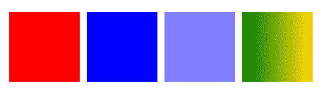

# 描边属性

另一个非常有用的一组属性，可用于从 CSS 操作 SVG 的属性与描边有关。所有描边属性都可以作为 CSS 属性使用。与 `fill` 属性类似，这些属性在创建一致的界面和可视化方面非常有用。

这个例子展示了作为基本 `stroke` 类的一部分使用 `stroke` 和 `stroke-width` 的用法。这样设置了一个常见的描边样式，以便我们可以将其他描边操作属性应用到我们的示例中。在那之后，我们设置了两个虚线属性，`stroke-dashoffset` 和 `stroke-dasharray`，并将这些属性应用到前两个 `rect` 元素，使用 `stroke-dasharray` 和 `stroke-dashoffset` 类。之后，我们使用 `stroke-linecap-join` 类将 `stroke-linecap` 应用到 `line` 元素。在那之后，我们将 `stroke-linejoin-round` 类应用到最后一个 `rect` 元素。

`property/value` 对匹配了您在 第二章 中学到的相同模式，*开始使用 SVG 进行创作*，当您最初学习这些演示属性时。

所有这些都可以作为 CSS 属性使用，这应该有助于您为 SVG 文档中的元素创建一致可重用的描边模式：

```xml
<!doctype html>
<html lang="en">
    <head>
        <meta charset="utf-8">
        <title>Mastering SVG- CSS Stroke Properties</title>
        <link href="https://fonts.googleapis.com/css?
         family=Raleway:400" rel="stylesheet"> 

        <style type="text/css">
            .stroke {
                stroke-width: 10px;
                stroke: royalblue;
            }
            .stroke-dasharray {
                stroke-dasharray: 10;
            }
            .stroke-dashoffset {
                stroke-dashoffset: 25;
            }
            .stroke-linecap-square {
                stroke-linecap: square;
            }
            .stroke-linejoin-round{
                stroke-linejoin: round;
            }
            .stroke-opacity{
                stroke-opacity: .5;
            }
        </style>
    </head>
    <body>
      <svg  width="550" height="300" 
       viewBox="0 0 550 300">
        <rect x="50" y="15" width="300" height="50" fill="none"
        class="stroke stroke-dasharray"></rect>
        <rect x="50" y="80" width="300" height="50" fill="none"
        class="stroke stroke-dasharray stroke-dashoffset"></rect>
        <line x1="50" y1="160" x2="350" y2="160" class="stroke stroke-
          linecap-square"></line>
        <rect x="50" y="180" width="300" height="50" fill="none"
        class="stroke stroke-linejoin-round"></rect>
       </svg>
    </body>
</html>
```

在浏览器中呈现，上述代码产生以下输出：

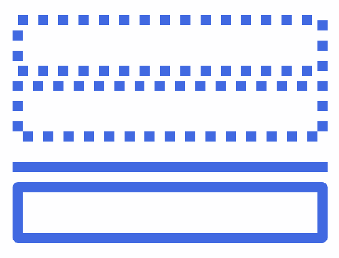

# 文本属性

本节将介绍一些 SVG 特定的文本属性。前几个示例涉及 SVG 中文本的基线。根据您的工作类型，您可能永远不需要调整文本元素的基线（文本行所在的视觉平面）。但是，您可能需要，特别是如果您正在处理多语言布局或复杂的基于文本的插图（如标志）。因此，值得向您介绍这些属性。与基线相关的属性是 `alignment-baseline`、`dominant-baseline` 和 `baseline-shift`。

除此之外，本节还将介绍 `text-anchor` 属性，该属性可以更改 `text` 元素的锚点。

关于基线属性的简要说明，还有更多内容，但以下描述足以为您提供足够的基础，以理解代码示例中发生的情况。这 *可能* 足够让您使用这些属性：

+   `dominant-baseline` 用于调整 `text` 元素的基线

+   `alignment-baseline` 用于调整子元素相对于其父 `text` 元素基线的基线

+   `baseline-shift`可能是最有用的，通过将主基线上移或下移来提供常见的*下标*和*上标*功能

`dominant-baseline`和`alignment-baseline`接受类似的值。这里使用的两个值是*hanging*，它将文本从文本框底部删除，以及*middle*，它将文本垂直居中在文本框底部。在这个示例中，`dominant-baseline`应用于具有两个不同值的`text`元素，而`alignment-baseline`应用于具有两个不同值的两个子`tspan`元素。

在此之后，使用`baseline-shift`的`super`和`sub`值创建了常见的上标和下标模式。

最后，`text-anchor`属性通过应用于视口中间居中的文本元素的三个不同值进行说明。`text-anchor`将文本对齐到文本框中的不同点：`start`，`middle`和句子的`end`。

接下来的代码示例说明了这些基线属性的用法，以及`text-anchor`属性的用法：

```xml
<!doctype html>
<html lang="en">

<head>
    <meta charset="utf-8">
    <title>Mastering SVG- SVG-specific CSS Text Properties</title>
    <link href="https://fonts.googleapis.com/css?family=Raleway:400"
      rel="stylesheet">

    <style type="text/css">
     .text {
         font-family: Raleway, sans-serif;
         font-size: 1.5em;
     }
     .dominant-hanging {
         dominant-baseline: hanging;
     }
     .dominant-middle {
         dominant-baseline: middle;
     }
     .alignment-hanging {
         alignment-baseline: hanging;
     }
     .alignment-middle {
         alignment-baseline: middle;
     }
     .sub {
        baseline-shift: sub;
    }
    .super {
        baseline-shift: super;
    }
    .text-anchor-start{
        text-anchor:start;
    }
    .text-anchor-middle{
        text-anchor:middle;
    }
    .text-anchor-end{
        text-anchor:end;
    }
    </style>
</head>

<body>
    <svg  width="400" height="550"
      viewBox="0 0 400 550">
        <rect width="400" height="25" x="0" y="0" fill="#cccccc" />
        <rect width="400" height="25" x="0" y="25" fill="#efefef" />
        <rect width="400" height="25" x="0" y="50" fill="#cccccc"/>
        <rect width="400" height="25" x="0" y="75" fill="#efefef"/>
        <rect width="400" height="25" x="0" y="100" fill="#cccccc"/>
        <rect width="400" height="25" x="0" y="125" fill="#efefef"/>
        <rect width="400" height="25" x="0" y="150" fill="#cccccc"/>
        <rect width="400" height="25" x="0" y="175" fill="#efefef"/>
        <rect width="400" height="25" x="0" y="200" fill="#cccccc"/>
        <rect width="400" height="25" x="0" y="225" fill="#efefef"/>
        <rect width="400" height="25" x="0" y="250" fill="#cccccc"/>
        <rect width="400" height="25" x="0" y="275" fill="#efefef"/>
        <rect width="400" height="25" x="0" y="300" fill="#cccccc"/>
        <rect width="400" height="25" x="0" y="325" fill="#efefef"/>
        <rect width="400" height="25" x="0" y="350" fill="#cccccc"/>
        <rect width="400" height="25" x="0" y="375" fill="#efefef"/>
        <rect width="400" height="25" x="0" y="400" fill="#cccccc"/>
        <rect width="400" height="25" x="0" y="425" fill="#efefef"/>

        <line x1="200" y1="300" x2=
        "200" y2="325" stroke="red"></line>
        <line x1="200" y1="350" x2=
        "200" y2="375" stroke="red"></line>
        <line x1="200" y1="400" x2=
        "200" y2="425" stroke="red"></line>
        <text class="text dominant-hanging" x="50"
          y="25">Hanging</text>
        <text class="text dominant-middle" x="50" y="75">Middle</text>
        <text class="text" x="50" y="125">Text <tspan class="alignment-
         hanging">Hanging</tspan></text>
        <text class="text" x="50" y="175">Text <tspan class="alignment-
         middle">Middle</tspan></text>
        <text class="text" x="50" y="225">Super<tspan
         class="super">sup</tspan></text>
        <text class="text" x="50" y="275">Sub<tspan 
         class="sub">sub</tspan></text>
        <text class="text text-anchor-start" x="200" y="325">Text
          Anchor Start</text>

        <text class="text text-anchor-middle" x="200" y="375">Text
         Anchor Middle</text>

        <text class="text text-anchor-end" x="200" y="425">Text Anchor 
         End </text>

    </svg>
</body>

</html>
```

在浏览器中呈现，这些效果在以下截图中可见：

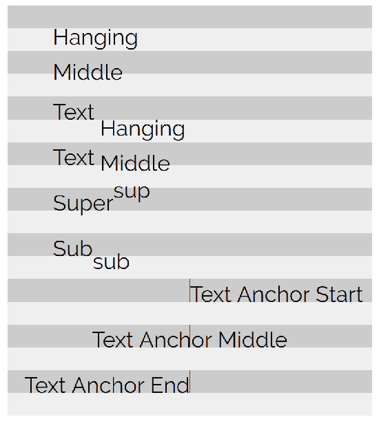

较暗的条带显示了基于文本元素的*x*，*y*位置的初始文本框。您可以看到`hanging`和`middle`如何清楚地移动了字体的基线，相对于*x*，*y*位置。

`text-anchor`示例通过添加一条指示这些文本元素的`(x,y)`位置的线来进行说明。它们放置在 SVG 元素的中心，这说明了该属性对文本元素的影响。

# 合成属性

目前，浏览器对合成属性的支持非常糟糕。在撰写本文时，微软对`clip`属性的支持不完整，而 mask 属性的支持在各个浏览器中都很糟糕。这很不幸，因为它们可以提供强大的选项来定义和重用剪切路径和蒙版。

我要展示的一个有效示例是如何使用 CSS 定义`clip-path`。有两种变体。第一种只是通过`id`引用了一个`clipPath`元素。这很简单，在现代浏览器中可以工作。

第二个示例允许更好地分离关注点。您不必定义一个带有路径的元素来进行剪切，而是可以直接向 CSS 提供多边形坐标。`polygon`，`circle`和`inset`是此属性的可用值。这种语法取代了现在已弃用的`clip`属性。如果您熟悉`clip`，您应该注意几件事。首先，请注意没有`rect`值的直接替代品。值得庆幸的是，正如我们在这里展示的，多边形已经足够替代`rect`。其次，`clip-path`*不需要*将元素绝对定位（尽管在 SVG 中使用此属性时，这并不是一个特别关注的问题）。

多边形值的语法与用于`polygon`元素的`path`属性的语法略有不同。与路径元素的 d 属性的逗号是任意的，仅用于可读性不同，这个 CSS 属性中的点对需要用逗号分隔并且需要单位。否则，它的工作方式与 SVG 中的`polygon`相同。

这个示例通过将点映射为`polygon`来复制`clipPath`示例中看到的矩形：

```xml
<!doctype html>
<html lang="en">

<head>
    <meta charset="utf-8">
    <title>Mastering SVG- CSS Compositing Properties</title>
    <link href="https://fonts.googleapis.com/css?family=Raleway:400" 
      rel="stylesheet">

    <style type="text/css">
      .clip-url{
        clip-path: url(#box);
      }
      .clip-polygon {
        clip-path: polygon(50% 0, 100% 0, 100% 100%, 50% 100%, 50% 0)
      }
    </style>
   </head>
   <body>
     <svg  width="240" height="240"
       viewBox="0 0 240 240" version="1.1">
       <defs>
         <clipPath id="box" maskUnits="userSpaceOnUse" x="0" y="0" 
           width="240" height="240">

             <rect x="120" y="0" width="240" height="240" fill="red" >
             </rect>
         </clipPath>
         <polygon id="star" points="95,95 120,5 150,95 235,95 165,150 
           195,235 120,180 50,235 75,150 5,95"></polygon>
       </defs> 
       <use href="#star" fill="red"></use>
       <use href="#star" fill="black" class="clip-url"></use>
     </svg>
     <svg  width="240" height="240"
        viewBox="0 0 240 240" version="1.1">
      <defs>
        <polygon id="star" points="95,95 120,5 150,95 235,95 165,150 
          195,235 120,180 50,235 75,150 5,95"></polygon>
      </defs> 
      <use href="#star" fill="red"></use>
      <use href="#star" fill="black" class="clip-polygon"></use>
    </svg>
   </body>
</html>

```

在浏览器中呈现，您将获得以下输出：

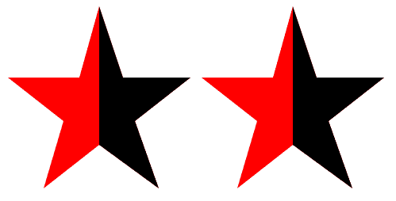

正如我所提到的，对`mask`属性的支持存在问题，因此我没有完全实现的示例。有三种定义的模式：

+   第一个与`clip-path`属性类似。您可以定义一个`mask-image`属性，并通过`url`将一个蒙版图像传递给它：

```xml
.mask{
    mask-image: url(mask.svg);
}
```

+   第二个选项是使用片段标识符来使用链接图像的一部分：

```xml
.mask-fragment{
    mask-image: url(mask.svg#fragment);
}
```

+   第三个，也是最有趣的选项，允许您在属性值中创建蒙版：

```xml
.mask-image {
    mask-image: linear-gradient(rgba(0, 0, 0, 1.0), transparent);
}
```

这项技术尚未准备好投入使用，但了解未来的技术发展是很重要的，特别是它将允许您仅使用 CSS 类来重用在一个中心位置定义的蒙版。

# 交互属性

我们要查看的最后一个 CSS 属性是`pointer-events`属性。`pointer-events`属性指示 SVG 元素是否可以成为指针事件的目标（包括所有输入，包括鼠标、笔或触摸输入）。

实现`pointer-events`的基本方法是打开或关闭它们。以下示例展示了这一点。此示例还将包括一点 JavaScript，这样您就可以在第六章 *JavaScript 和 SVG*中提前了解一些关于使用 JavaScript 操纵 SVG 的知识。

在此示例中，我们有两个`rect`元素。其中一个设置了类名`pointer-default`。该类有一个名为`pointer-events`的属性，值为`visiblePainted`。`visiblePainted`是 SVG 元素上`pointer-events`的默认值。它表示元素的整个可见绘制区域应接受鼠标事件。这意味着边框和填充区域都包括在内。

第二个`rect`的类名是`pointer-none`。其单个属性`pointer-events`的值为`none`。这表示该元素不应接收鼠标事件。

页面底部有一个小的 JavaScript 块，展示了该属性的作用。它还说明了在处理 SVG 和 JavaScript 时可能遇到的差异。在其中，我们使用一些核心**文档对象模型**（**DOM**）方法来为每个`rect`元素附加点击事件处理程序。首先，我们使用`document.querySelectorAll`来获取页面上所有`rect`元素的引用。如果您不熟悉它，`querySelectorAll`可以被视为著名的 jQuery 接口的标准化、浏览器原生版本。您传入一个 CSS 选择器，它返回一个包含查询结果的静态`nodeList`。

我们立即通过方便的`forEach`方法循环遍历类似数组的`nodeList`，并为每个节点附加事件处理程序。此事件处理程序旨在在单击方块时更改相邻`text`元素的文本。

如果您习惯使用`innerHTML`来设置文本内容，您会注意到这里使用的是`textContent`属性。为什么呢？因为 SVG 没有`innerHTML`（这是有道理的，因为它不是 HTML）。

在浏览器中运行此代码，您会发现只有默认`pointer-events`值的`rect`单击才会更改文本。设置为`none`的`rect`不会有任何反应：

```xml
<!doctype html>
<html lang="en">

<head>
    <meta charset="utf-8">
    <title>Mastering SVG- CSS Compositing Properties</title>
    <link href="https://fonts.googleapis.com/css?family=Raleway:400" 
      rel="stylesheet">

    <style type="text/css">
      .pointer-default {
        pointer-events: visiblePainted;
      }
      .pointer-none {
        pointer-events: none;
      }

    </style>
   </head>
   <body>
     <svg  width="500" height="250" 
      viewBox="0 0 500 250" version="1.1">
       <rect x="10" y="10" width="100" height="100" class="pointer-
         default" fill="red"></rect>
       <rect x="120" y="10" width="100" height="100" class="pointer-
          none" fill= "red"></rect>
       <text x="10" y="150" id="text"></text>
    </svg>
    <script>
      document.querySelectorAll("rect").forEach(function(element){
        let classname = element.className.baseVal;
        element.addEventListener("click",()=>{
          document.getElementById("text").textContent= `clicked
           ${classname}`
        });
      });
    </script>
   </body>
</html>
```

以下插图显示了点击两个`rect`元素后的页面：

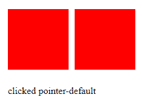

下表说明了此属性的其他可能值。它们在与 SVG 元素交互的方式上提供了很多控制。根据您计划进行多少精确的交互，您可能最终会利用这种精度：

| 属性 | 定义 |
| --- | --- |
| `visiblePainted` | 如果`visibility`属性设置为`visible`，并且指针位于*painted area*上，则可以将该元素作为目标。使用此值，绘制区域包括`stroke`（如果它设置为除`none`之外的值）和`fill`（如果它设置为除`none`之外的值）。 |
| `visibleFill` | 如果`visibility`属性设置为`visible`，并且指针位于内部（`fill`区域）上，则可以将该元素作为目标，无论`fill`是否设置。 |
| `visibleStroke` | 如果`visibility`属性设置为`visible`，并且指针位于周边（`stroke`区域）上，则可以将该元素作为目标，无论`stroke`是否设置。 |
| `visible` | 如果`visibility`属性设置为`visible`并且指针位于内部或周边，则可以定位元素，无论是否设置了 fill 或 stroke。 |
| `painted` | 如果`visibility`属性设置为`visible`并且指针位于*painted area*上，则可以定位元素。使用此值，绘制区域包括`stroke`（如果设置为除`none`之外的值）和`fill`（如果设置为除`none`之外的值）。不考虑`visibility`属性的值。 |
| `fill` | 如果指针位于内部（`fill`区域），则可以定位元素，无论是否设置了 fill。不考虑`visibility`属性的值。 |
| `stroke` | 如果指针位于周边（`stroke`区域），则可以定位元素，无论是否设置了 fill。不考虑`visibility`属性的值。 |
| `all` | 如果指针位于元素的内部或周边，则可以定位元素。不考虑`stroke`，`fill`和`visibility`属性的值。 |
| `none` | 元素不接收指针事件。 |

# 独立 SVG 图像中的样式

到目前为止，所有的例子都是关于内联 SVG 在 HTML 文档中，你也可以在独立的 SVG 图像中使用 CSS。以下 SVG 图像显示了使用 CSS 来调整多个 SVG `text` 元素的显示。有趣的细节包括包裹在`style`元素中的样式的**字符数据**（`<![CDATA[ ]]>`）块：

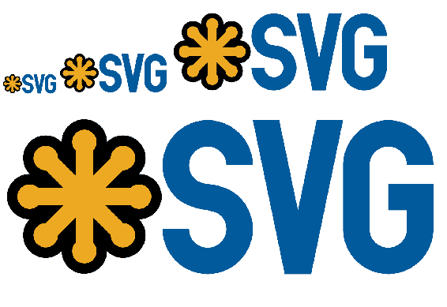

如果你没有处理过很多 XML（它现在并不像以前那样常见，所以可能是这种情况），`CDATA`用于指示 XML 解析器，该部分可能包含可被解释为 XML 但不应该的字符。 JavaScript（由于`<`和`>`的普遍存在）是最常见的用例（如果你在 1999 年构建网站，你会知道），但 CSS 也可能陷入同样的陷阱，所以在这里使用它也是很好的。

接下来要注意的是外部样式表的缺失。如果要创建一个将作为`img src`导入或作为 CSS 背景图像的 SVG 图像，它需要完全自包含。

除此之外，这与你可能熟悉的 HTML 和 CSS 组合工作方式非常相似：

```xml
<?xml version="1.0" encoding="UTF-8"?>
    <svg  width="250" height="250" viewBox="0 0 250 250" version="1.1">
    <style>
      <![CDATA[
          text {
            font-family: Verdana, Geneva, sans-serif;
            fill: slategray;
          }
          .palatino{
            font-family: Palatino, "Palatino Linotype", "Palatino LT
            STD", "Book Antiqua", Georgia, serif;
          }
          .big-green{
            fill: forestgreen;
            font-size: 2rem;
            opacity: .75;
          }
          .huge-blue{
            fill: dodgerblue;
            font-size: 4rem;
          }
          .medium-deep-pink{
            fill: deeppink;
            font-size: 1.5rem;
          }
          .bigger {
            font-size: 6rem;
          }
          .text-anchor-middle{
            text-anchor: middle;
          }
          .text-baseline-middle{
            dominant-baseline: middle;
          }
          .half-opacity{
            opacity: .5;
          }
        ]]>
       </style>
          <text x="20" y="20" class="big-green">Styles</text>
          <text x="-10" y="50" class="huge-blue palatino">Styles</text>
          <text x="66" y="40" class="medium-deep-pink half
           opacity">Styles</text>
          <text x="77" y="77" class="big-green">Styles</text>
          <text x="55" y="66">Styles</text>
          <text x="100" y="125" class="medium-deep-pink 
           bigger">Styles</text> 
          <text x="175" y="33" class="big-green">Styles</text>
          <text x="220" y="44" class="huge-blue half-
            opacity">Styles</text>
          <text x="-20" y="244" class="huge-blue bigger half-
            opacity">Styles</text>
          <text x="120" y="120" class="medium-deep-pink">Styles</text>
          <text x="14" y="166" class="big-green palatino">Styles</text>

          <text x="136" y="199" class="huge-blue palatino half-
            opacity">Styles</text>
          <text x="170" y="144" class="huge-blue">Styles</text>
          <text x="-40" y="144" class="huge-blue half-
            opacity">Styles</text>
          <text x="143" y="24" class="big-green">Styles</text> 
          <text x="125" y="125" class="bigger text-anchor-middle text- 
            baseline-middle">Styles</text> 
      </svg>
```

在浏览器中呈现，此图像如下所示：

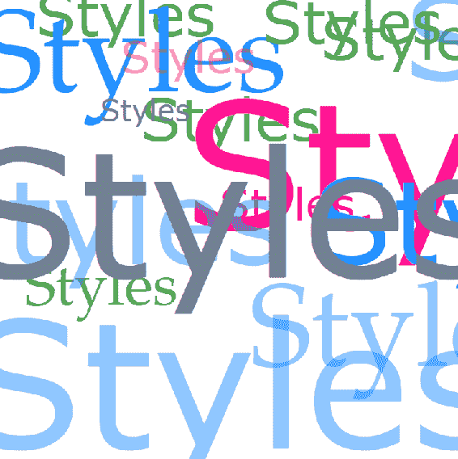

# 使用 SVG 的基本 CSS 动画和过渡

使用 SVG 和 CSS 的最有趣的方式之一是使用 CSS *动画*和*过渡*。

+   **动画**：这允许你为元素分配动画。这些动画被定义为一系列对 CSS 属性的更改。

+   **过渡**：这允许你控制 CSS 属性更改生效所需的时间。它们不是立即改变，而是在状态之间*过渡*。

这些是一组非常强大的功能，并且是 SVG 工具包的重要概念和技术补充。

# CSS 动画

SVG 中的 CSS 动画与 HTML 中的工作方式相同，还可以使用 SVG 特定的属性。

# 基本动画格式

基本模式如下。SVG 很简单。它是一个单独的`rect`元素。CSS 有两个有趣的组件。第一个是类`rect`，它引用了一个属性`animation`。`animation`是一个简写属性，映射到一整套`animation-`属性。在这种情况下，我们设置了其中的两个。映射属性的第一个是`animation-name`，它引用了`@keyframes`动画中定义的动画`movement`。我们设置的第二个是`animation-duration`，我们将其设置为三秒（`3s`）。`@keyframes`动画是魔术发生的地方。在其中，我们设置了两组关键帧。第一组标记了动画的初始（`0%`）和最终状态（`100%`），使用了相同的属性，即 CSS `transform`，设置为`(0,0)`的`translate`函数。这是初始（和最终）状态。我们将在下一个关键帧中对`transform`属性进行动画。在其中，我们设置了动画的中间部分（`50%`），我们将`rect`向右移动 400 像素：

```xml
<!doctype html>
<html lang="en">

<head>
    <meta charset="utf-8">
    <title>Mastering SVG- CSS animation</title>

    <style type="text/css">
    .rect {
      animation: movement 3s;
    }

    @keyframes movement {
      0%, 100% {
        transform: translate(0, 0);
      }
      50% {
        transform: translate(400px, 0);
      }
    }

    </style>
   </head>
   <body>
     <svg  width="500" height="100" 
       viewBox="0 0 500 100" version="1.1">
      <rect x="0" y="0" width="100" height="100" class="rect">
    </svg>
   </body>
</html>
```

效果是矩形慢慢从左到右移动，然后再返回：

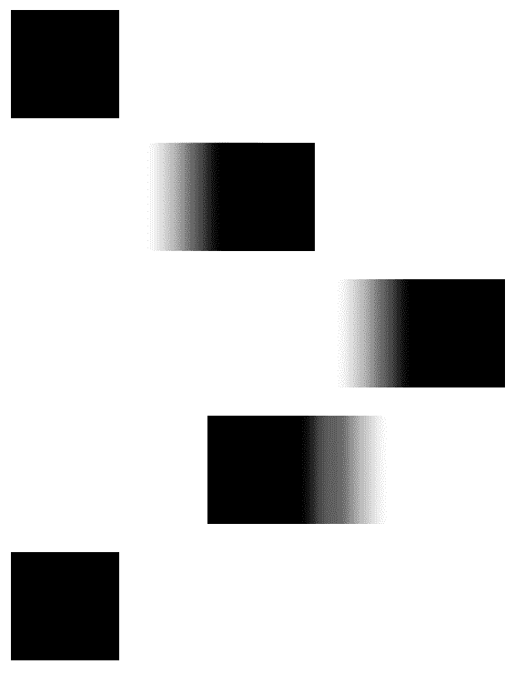

# 使用动画剪辑路径

从 CSS 的角度来看，SVG 中动画剪辑路径的一个相对简单的例子是非常强大的。使用我们刚学到的`polygon`选项，你可以在两个（或更多）被定义为`clip-path`的形状之间进行动画。如果它们有*相同数量的点*，浏览器将平滑地在动画中定义的位置之间进行动画。

以下示例就展示了这一点。在这个示例中，我们创建了一个类`stars`：

+   `stars`有一个`animation`属性。它引用了样式表中稍后定义的`@keyframe stars`块。

+   第二个参数你已经熟悉了，`animation-duration`。这次又设置为三秒。

+   第三个属性对你来说可能是新的。属性值`infinite`映射到`animation-iteration-count`属性。

+   `animation-iteration-count`接受一个数字，表示动画应该运行的具体次数，或关键字`infinite`，表示动画应该永远播放。

`@keyframes`遵循与之前动画相同的模式。我们有相同的起始和完成状态（0%和 100%）。这些被定义为一个多边形`clip-path`，用于说明一个星星。动画的中点（`50%`）将多边形重新定义为正方形。由于动画状态之间需要等效的点数，这意味着我们需要定义多于四个点来在这些状态之间进行动画：

```xml
<!doctype html>
<html lang="en">

<head>
    <meta charset="utf-8">
    <title>Mastering SVG- CSS animation</title>

    <style type="text/css">
    .stars {
      animation: stars 3s infinite;
    }

    @keyframes stars {
      0%, 100% {
        clip-path: polygon(95px 95px, 120px 5px, 150px 95px, 235px 
         95px, 165px 150px, 195px 235px, 120px 180px, 50px 235px,75px
         150px, 5px 95px)
      }
      50% {
        clip-path: polygon(10px 10px, 120px 10px, 230px 10px, 230px 
        120px, 230px 180px, 230px 230px, 120px 230px, 10px 230px, 10px
        180px, 10px 120px)
      }
    }

    </style>
   </head>
   <body>
     <svg  width="240" height="240"
      viewBox="0 0 500 500" version="1.1">
      <image href="take-2-central-2017.jpg" width="1000" height="500" 
       x="0" y="0" class="stars"></image>
    </svg>
   </body>
</html>
```

以下时间间隔截图显示了动画在运行的三秒内是如何展开的。确保在支持的浏览器中运行，看看这种效果有多有趣：

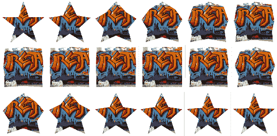

# 同时对一个元素进行多个属性的动画和分配多个动画

关于动画还有两件事需要注意：

+   你可以同时对多个 CSS 属性进行动画

+   你也可以将多个动画应用于同一个元素

以下代码示例显示了这两个功能的工作原理。有三个重要部分。第一个是单个类`rect`。它有两个用于`animation`属性的逗号分隔的参数，即动画`box`和`change-color-and-fade`。`box`定义了两个正方形`clip-path`属性，一个距离矩形边缘`50`像素，另一个距离边缘`10`像素。`change-color-and-fade`将背景颜色从红色变为蓝色，不透明度从`.5`变为`1`：

```xml
<!doctype html>
<html lang="en">

<head>
  <meta charset="utf-8">
  <title>Mastering SVG- CSS animation</title>
  <style type="text/css">
    svg {
      background: lightgray;
    }
    .rect {
      animation: box 3s infinite, change-colors-and-fade 3s infinite;
    }
    @keyframes box {
      0%,
      100% {
        clip-path: polygon(50px 50px, 200px 50px, 200px 200px, 50px 
        200px)
      }
      50% {
        clip-path: polygon(10px 10px, 240px 10px, 240px 240px, 10px 
        240px)
      }
    }
    @keyframes change-colors-and-fade {
      0%,
      100% {
        opacity: .5;
        fill: rgb(255, 0, 0);
      }
      50% {
        opacity: 1;
        fill: rgb(0, 0, 255);
      }
    }
  </style>
</head>

<body>
  <svg  width="250" height="250"
   viewBox="0 0 250 250" version="1.1">
    <rect x="0" y="50" width="250" height="50" fill="gray"></rect>
    <rect x="0" y="0" width="250" height="250" class="rect"></rect>
  </svg>
</body>

</html>
```

在浏览器中运行，动画经历以下阶段：

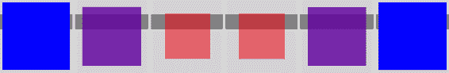

# CSS 过渡

本章中我们要看的最后一个 CSS 属性是 CSS `transition`属性。`transition`允许您定义浏览器在属性值更改时的动画方式。属性不会立即改变，而是可以更平滑地过渡。

以下示例展示了这是如何工作的。在示例中，我们有一个小的、单值的条形图，当用户悬停在上面时会填充，显示对目标的虚拟进度。

CSS 中充满了用于定义文本的类。您会注意到本章中学到的许多属性。除了这些属性，您在本章中应该对它们有一定的了解之外，还有一些定义条形图的类，其中一个比另一个更有趣。

第一个`the-bar`定义了条形图的轮廓。第二个`fill-the-bar`定义了条形图的*进度*部分。它没有描边，填充为绿色。对我们来说有趣的部分是`transition`属性。`transition`是一组相关的`transition-`属性的简写。在这种情况下，我们使用了`transition-property`（`transform`）和`transition-duration`（`3s`）。这表示浏览器应该监视此元素上`transform`属性的更改，并在三秒内过渡到该属性的更改。在这个类中，我们还定义了一个`scaleY transform`，值为`1`，并使用`transform-origin`将`transform`锚定到元素的`bottom`。我们需要一个基准的`scaleY`，这样浏览器就有一个匹配的属性来进行动画。`fill-the-bar:hover`将比例改变为`7.5`，根据配置的方式，这将填满条形图的`75%`目标：

```xml
<!doctype html>
<html lang="en">
<head>
  <meta charset="utf-8">
  <title>Mastering SVG- CSS Transitions</title>
  <link href="https://fonts.googleapis.com/css?family=Raleway:400" 
   rel="stylesheet">

  <style type="text/css">
    .text {
      font-family: Raleway, sans-serif;
      font-size: 1.5em;
    }

    .smaller-text {
      font-size: 1em;
    }

    .the-bar {
      stroke: black;
      stroke-width: 2px;
      fill: none;
    }

    .fill-the-bar {
      transition: transform 2s;
      transform: scaleY(1);
      transform-origin: bottom;
      stroke: none;
      fill: green;
      cursor: pointer;
    }

    .fill-the-bar:hover {
      transform: scaleY(7.5);
    }

    .dominant-baseline-hanging {
      dominant-baseline: hanging;
    }

    .dominant-baseline-middle {
      dominant-baseline: middle;
    }

    .text-anchor-end {
      text-anchor: end;
    }
  </style>
</head>

<body>
  <svg  width="250" height="500" 
   viewBox="0 0 250 500" version="1.1">
    <text class="text" x="10" y="25">Our Progress</text>
    <text x="90" y="50" class="dominant-baseline-hanging smaller-text
     text-anchor-end">100%</text>
    <text class="text smaller-text text-anchor-end" x="90" y="250">0%
    </text>
    <text class="text smaller-text text-anchor-end dominant-baseline-
     middle" x="90" y="150">50%</text>

    <rect x="100" y="50" height="200" width="50" class="the-bar">
    </rect>
    <rect class="fill-the-bar" x="100" y="230" height="20" width="50" 
     fill="green"></rect>
  </svg>
</body>

</html>
```

在浏览器中运行；过渡效果会慢慢增长，直到填满适当的空间：

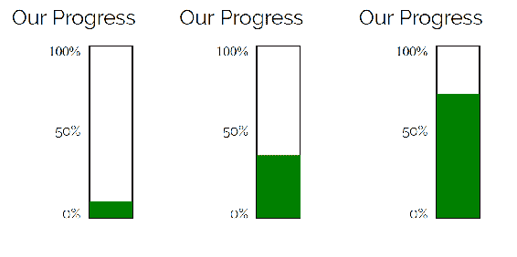

# 总结

在本章中，您学到了很多。CSS 是制作快速、易于维护的现代网站和应用的关键技术之一，了解 SVG 和 CSS 之间的交集是很重要的。

本章以详细介绍了将 SVG 用作 CSS 背景图像的常见用例，包括使用 SVG 数据 URL 的有趣细节。

接下来，您将学习 SVG 精灵和图标集，以及它们可以如何以及为什么可以用来替代当今网页上流行的常见字体图标集。

接下来，您将学习如何对内联 SVG 进行样式设置，包括详细的操作字体和文本行的方式。接着，您将学习许多控制`fill`、`stroke`和元素文本的 SVG 特定属性。之后，您将了解一些尖端的合成属性，比如`clip-path`和`mask-image`，尽管浏览器的支持还不完全到位，但它们非常强大。

之后，您将学习如何使用 CSS 来提高独立 SVG 图像的一致性和编写的便利性。

最后，您将学习如何使用基本的 CSS 动画和过渡效果来增加网站和应用的交互性和动态效果。

接下来，我们将把我们学到的关于将 SVG 放到页面上并确保它看起来正确的所有知识，加上 JavaScript，这样我们就可以开始以越来越有趣的方式与 SVG 进行交互了。
