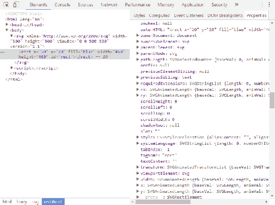
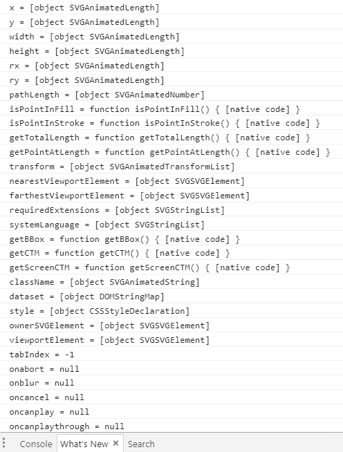
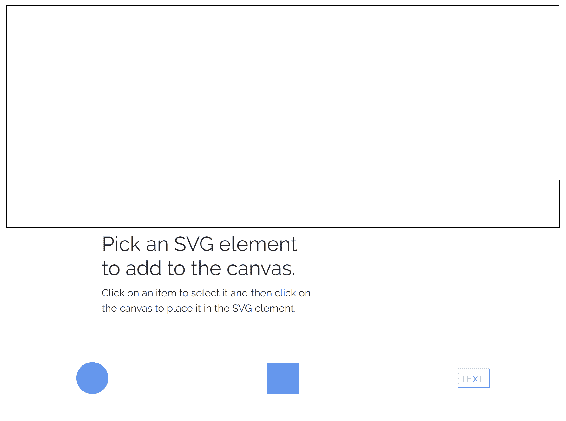
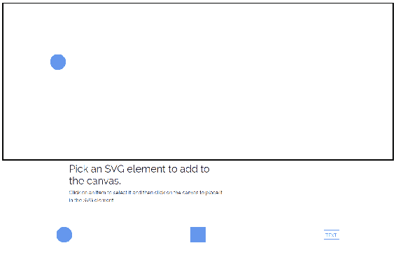
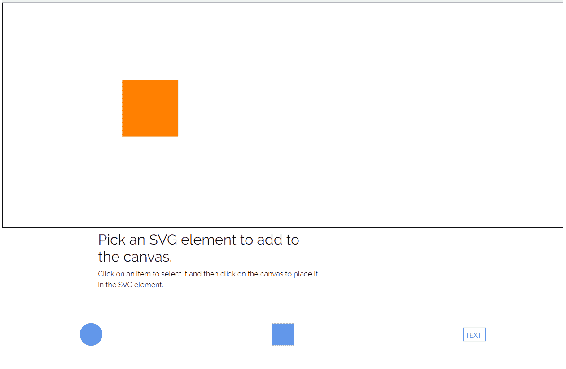
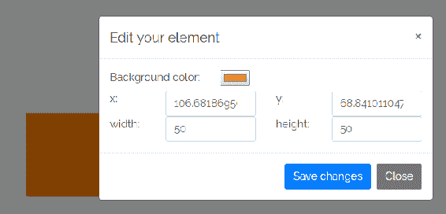
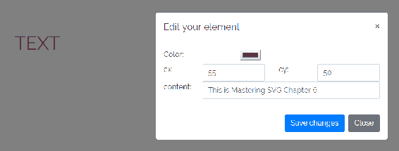
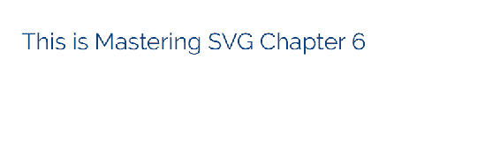

# 第六章：JavaScript 和 SVG

到目前为止，您已经在本书中学到了很多关于 SVG 的知识。您花了很多时间研究 SVG 规范的细节，以及 SVG 与 CSS 和 HTML 交互的不同方式。希望对您来说和对我一样有趣。

尽管一切都很有趣，但正是在这一章中，我们将把所有工具整合在一起，真正释放 SVG 的力量。将 JavaScript 添加到其中会开启大量新的可能性。

可以肯定，有许多网页开发人员和设计师永远不会使用 SVG 进行动画、动态可视化或其他交互式工作。对于他们来说，全面了解 SVG 本身作为标记的工作方式以及它如何与其他静态网页技术结合是非常有价值的。这在我们刚刚详细了解的 SVG 和 CSS 的交集中尤为重要。

话虽如此，SVG 最令人兴奋的是它如何轻松地与 JavaScript 一起工作，以增强您网站的交互性。所有这些开放网络技术都旨在以创造超越个别规范总和的方式相互配合。尽管有专门的专家在所有这些不同的技术上工作，但他们大多数情况下是公开的，并且通常是作为微软、谷歌或 Mozilla 等更大组织的一部分，因此他们真正希望确保这些技术以最佳方式相互配合。

SVG 和 JavaScript 的交集绝对是这样一个案例。

在本章中，我们将学习 JavaScript 和 SVG 之间的低级接口。这包括 SVG 的 DOM 接口。这是重要的内容，尽管我们也将学习使用 SVG 的库和框架。即使您已经从事网页开发一段时间，并熟悉 JavaScript 和 DOM，了解常规 HTML DOM 和 SVG 元素接口之间的差异也是重要的。如果您对原始 DOM 操作不太熟悉（许多在 jQuery 时代及以后开始的开发人员并不熟悉），那么本章将为您提供一整套有用的技能。

在本章中，我们将学习以下内容：

+   SVG 基本 DOM 接口-在 JavaScript 中访问和操作 SVG 元素

+   SVG 特定的 DOM 接口

+   动态处理 SVG 和 CSS

# JavaScript 版本和工具

在我们开始编码之前，我认为重要的是了解不同的 JavaScript 版本以及它们在本书中的使用方式。我还想介绍一下我将如何呈现需要工具的示例。

# JavaScript 版本

您可能已经注意到，在过去几年中，围绕 JavaScript 编程语言的发展进行了大量工作。其中一些工作确实非常出色。事实上，目前网络上主要的库和框架都是用不同版本和变体的 JavaScript 写成的，这些 JavaScript 并不是在所有网络浏览器中都通用。使用最新版本的语言，包括特定于框架的扩展，是可能的，因为使用了转译器（[`scotch.io/tutorials/javascript-transpilers-what-they-are-why-we-need-them`](https://scotch.io/tutorials/javascript-transpilers-what-they-are-why-we-need-them)），这是一种软件，它将用一种语言（或在本例中是语言的一个版本）编写的软件代码转换为另一种语言（在本例中是语言的一个较旧但完全支持的版本）。这种转译步骤使我们能够用我们喜欢的 JavaScript 风格编写应用程序，然后将其转换为可以在任何地方运行的浏览器标准 JavaScript。

本节概述了您将在本书中遇到的不同 JavaScript 版本。下一节将简要介绍我们将如何呈现所需的工具，以使用转译器使您的最新代码在常见的网络浏览器中运行。

需要注意的是，这是对这个主题的最广泛的介绍。随着情况的出现，书中将涵盖更多细节，但即使如此，也只是触及了这个广泛主题的表面。

虽然我在整本书中都称呼并将继续称呼这种语言为 JavaScript，但这个商标名称（由 Oracle 商标，后者从 Sun Microsystems 获得商标，后者又从 Netscape 获得商标）并不是这种语言的官方名称。这种语言的官方名称是 **ECMAScript**，基于 Ecma ([`www.ecma-international.org/`](https://www.ecma-international.org/))，这个组织主持编写规范的标准机构。

# ECMAScript 5

**ECMAScript 5** (**ES5**) 是当今浏览器中最完全支持的语言版本，也是转译器的目标版本，因为它可以在任何地方运行。标准化于 2009 年，截至撰写本文时，这个版本在超过 90%的浏览器中得到了全面支持，在约 97%的浏览器中得到了部分支持。通过添加 ES5 polyfills ([`github.com/es-shims/es5-shim`](https://github.com/es-shims/es5-shim))，你可以几乎实现对 ES5 的普遍覆盖。一些代码，特别是第七章中的 Angular 1 和 jQuery 部分，*常见的 JavaScript 库和 SVG*，将直接以 ES5 编写。这是因为大多数人对 Angular 1 和 jQuery 都是以 ES5 风格的接口熟悉。文件顶部的注释如下所示，表示正在使用这个版本：

```xml
/*
 ECMAScript 5
 */
```

# ECMAScript 2015

ECMAScript 2015 以前被称为 **ECMAScript 6** (**ES6**)。这个版本于 2015 年完成，现在正在进入浏览器。它在所有主要浏览器的最新版本（Edge、Firefox、Chrome 和 Safari）中都有部分支持。一般来说，本书中编写的 JavaScript 代码（除了前面提到的例子）将使用 ES6。除了 *React* 部分，它使用了更高级的功能和一些 React 特定的扩展，其他使用的功能都在最新版本的 Chrome、Edge 和 Firefox 中得到支持。因此，如果你使用这些浏览器之一，你不必为这些示例实际运行转译器。如果你想将这些代码投入生产，那就是另一回事，超出了本书的范围。

文件顶部的注释如下所示，表示正在使用这个版本：

```xml
/*
 ECMAScript 6
 */
```

# TypeScript

Angular ([`angular.io/`](https://angular.io/)) 部分将使用 TypeScript ([`www.typescriptlang.org/`](https://www.typescriptlang.org/)) 编写。TypeScript 是 JavaScript 的一个超集，它通过类型注解添加了某些可选功能，最显著的是静态类型化。TypeScript 被 Angular 团队用来为开发环境添加一些核心功能。因为并非每个人都有 TypeScript 的经验，所以示例中的 TypeScript 语言特性将被指出，以尽量减少混淆。

在这方面的好消息是，一旦脚本启动并运行，任何 Angular 组件的主体都可以用普通的旧 JavaScript 编写。

# 工具化

直到目前为止，我们在工具方面没有做太多工作。几乎所有的例子在本地文件系统上提供服务时都可以正常工作。

未来情况可能不会如此。在最简单的情况下，例如任何需要进行 HTTP 请求的示例，都将依赖于 node 包 serve ([`www.npmjs.com/package/serve`](https://www.npmjs.com/package/serve)) 来建立一个简单的本地服务器。

特别是 React 和 Angular 示例需要更广泛的工具。至少，您需要安装 Node.js（[`nodejs.org/en/`](https://nodejs.org/en/)），并且您需要按照一些步骤进行设置。最终，您将运行一个本地 Web 服务器，并且将有几个进程监视您的 JavaScript 或 Typescript 文件的更改。当您进行更改时，相关进程将捕捉更改并执行操作（例如将代码从 Typescript 转换为 JavaScript）以确保代码在本地服务器上更新。

每个相应部分都将提供有关如何使用代码示例的说明。

另外，请记住所有工作代码都可以在 GitHub 上找到（[`github.com/roblarsen/mastering-svg-code`](https://github.com/roblarsen/mastering-svg-code)）。

在所有这些之后，让我们看一些不需要除了较新的 Web 浏览器之外的任何东西就可以在本地运行的代码。

# SVG 的 DOM 接口

DOM 是用于访问、更新、创建和删除基于 XML 的文档的元素、属性和内容的 API。这包括相关但不严格符合 XML 语法的文档，例如最新的 HTML 规范。

对于普通开发人员来说，进行大量的纯 DOM 操作在今天是相当罕见的。多年前 jQuery 就解决了这个问题，而且从来没有再流行起来。我可以从经验中说，了解 DOM 操作的内部工作原理仍然很有用，这样当您遇到库或框架无法提供的东西时，您就可以自己编写代码来解决问题。

这也说明了在使用不同技术时可用的可能性。拥有对图书馆或框架作者感兴趣的东西的访问权限是一回事，但如果你熟悉底层代码，你只受你的想象力和目标浏览器中可用的东西的限制。

SVG DOM 基于 Dom Level 2 规范（[`www.w3.org/TR/2000/REC-DOM-Level-2-Core-20001113/core.html`](https://www.w3.org/TR/2000/REC-DOM-Level-2-Core-20001113/core.html)）。它支持大多数具有 DOM 和 HTML 经验的人所期望的内容，并添加了几组 SVG 特定接口，您可以使用这些接口来操作 SVG 文档。

本节将介绍 SVG 特定 DOM 方法的基本类，并说明它们的用法。除非您正在编写库，否则您不需要了解这些低级工具的所有内容。本章将作为一个介绍，让您对它们有一个良好的了解，并知道要寻找什么。

# 初始探索

要开始，让我们看一些 DOM 方法和属性，这些方法和属性可用于任意（常见的）SVG 元素`rect`。为此，您可以查看`SVGRectElement`元素文档（[`developer.mozilla.org/en-US/docs/Web/API/SVGRectElement`](https://developer.mozilla.org/en-US/docs/Web/API/SVGRectElement)）。那将是一个不错的选择。

您还可以直接检查`rect`元素，使用您选择的浏览器的开发人员工具。这将看起来像以下的屏幕截图。这将是您许多人接触 SVG 元素的可用方法和属性的方式：



虽然这些是常见的，但您也可以做一些像以下的事情，这是向脚本化 SVG 迈出的一大步。

在此代码示例中，我们使用`document.getElementById`访问`rect`元素，并将其存储在变量`rect`中。`document.getElementById`是您将用于访问 SVG 和 HTML 本身中的 DOM 元素的常见 DOM 访问器方法之一。您将在本章中看到其更多用法示例。

接下来，我们将通过简单的`for...in`循环遍历`rect`循环的属性，使用方括号表示法将变量和属性写入控制台，其中`prop`是`rect`元素上的属性或方法的名称：

```xml
<!doctype html>
<html lang="en">

<head>
    <meta charset="utf-8">
    <title>Mastering SVG- SVG Basic SVG DOM Manipulation</title>
</head>

<body>
    <svg  width="500" height="500"
     viewBox="0 0 500 500" version="1.1">
        <rect x="20" y="20" fill="blue" width="460" height="460"
         id="rect"></rect>
    </svg>
    <script>
    /*
        ES6
    */
        document.addEventListener("DOMContentLoaded",()=> 
            const rect = document.getElementById("rect");
            for (let prop in rect){
                let val = rect[prop];
                console.log(`${prop} = ${val}`);
            }
        });
    </script>
</body>

</html>
```

输出如下截图所示。您会注意到前几个属性和方法都是特定于 SVG 的。这个列表在下面的几个屏幕上继续，但列表中的第一个都是 SVG 特定的。这是因为`for...in`循环从`SVGRectElement`的最内部属性开始，然后沿着原型链向上工作，直到`SVGElement`、`Element`和`Node`的属性（最通用的 DOM 接口）。其中一些属性非常明显和立即有用，比如`x`、`y`、`width`和`height`。

其他可能不那么明显有用，比如`getBBox`或`isPointInFill`（尽管您可能能够猜到它们的作用），但您可以开始看到当您访问一个元素时，有很多可用的内容：



基于这个基本的基础和探索的想法，让我们开始构建一个小型应用程序，让您以简单的方式操作 SVG 画布。接下来的部分将重点介绍逐步构建一个小工具，允许您向 SVG 画布添加简单的 SVG 元素（`text`、`rect`和`circle`）并以不同的方式操作它们。这个小演示将很容易理解，并将演示与 SVG 交互的许多不同方式。

# SVG DOM 操作器

我们要构建的应用程序将允许您点击并向 SVG 画布添加三种不同类型的 SVG 元素。界面将允许您点击要添加的项目（`rect`、`circle`或`text`），然后您将能够点击画布并将该元素添加到特定的`(x,y)`坐标处。选择该元素后，您将能够通过更改几个可用的属性来编辑它。

这个示例将使用 Bootstrap 来简化布局不同的表单字段，并创建一个简单的模态框来编辑属性。因此，jQuery 也将被包含在内，尽管至少在这个演示版本中，jQuery 的交互将被保持在最低限度；我们将专注于原始的 DOM 操作。

完成后，它将如下截图所示，显示了屏幕顶部的 SVG 画布，用黑色边框。之后是简单的说明，然后在屏幕底部有三个按钮，允许您选择要添加到画布的矩形、圆形或文本元素：



这一次，与其一次性添加整个代码示例并解释整个内容，不如我们在示例中构建并讨论每个代码块。

让我们从页面的骨架开始。这个初始状态完全没有任何 JavaScript，但它为我们提供了一些结构和一些稍后会用到的工具。

在`head`中，我们从**内容传送网络**（**CDN**）链接到 Bootstrap，从 Google 字体链接到 Raleway 字体，然后为我们的页面设置一些基本样式，将 Raleway 添加为正文字体，给我们的画布 SVG 元素加上边框，然后改变 SVG 精灵按钮的颜色。

在 body 中，我们使用 Bootstrap 的实用类来创建一个填满整个屏幕宽度的流体布局。SVG 元素将缩放以适应这个 Bootstrap 容器。

布局分为两部分：目标 SVG 元素，用于绘图的地方，和第二部分用于 UI 控件。目前，UI 控件只是包裹在 SVG 精灵周围的三个`button`元素。

接下来，我们有一个隐藏的 SVG 元素，其中包含一系列定义了我们精灵的`symbol`元素。

最后，我们链接到一些第三方 JavaScript，以便连接一些 Bootstrap 功能：

```xml
<!doctype html>
<html lang="en">

<head>
  <meta charset="utf-8">
  <title>Mastering SVG- SVG Basic The DOM Manipulator</title>
  <link rel="stylesheet" 
   href="https://maxcdn.bootstrapcdn.com/bootstrap/4.0.0/css/bootstrap.
    min.css" integrity="sha384-
    Gn5384xqQ1aoWXA+058RXPxPg6fy4IWvTNh0E263XmFcJlSAwiGgFAW/dAiS6JXm"
    crossorigin="anonymous">
  <link href="https://fonts.googleapis.com/css?family=Raleway" 
    rel="stylesheet">
  <style type="text/css">
    body {
      font-family: Raleway, sans-serif;
    }
    svg.canvas {
      border: 1px solid black;
    }

    button svg {
      fill: cornflowerblue;
      stroke: cornflowerblue;
      max-width: 50px;
    }
  </style>
</head>

<body>

  <div class="container-fluid">
    <div class="row">
        <div class="col-12">
            <svg  viewBox="0 0 500 
              200" version="1.1" id="canvas" class="canvas">
            </svg>
        </div>
    </div>
    <div class="row">
      <div class="col-5 offset-2">
        <h2>Pick an SVG element to add to the canvas. </h2>
        <p>Click on an item to select it and then click on the canvas
             to place it in the SVG element.</p>
      </div>
    </div>
    <div class="row">
      <div class="col-4 text-center">
        <button class="btn btn-link" title="click to add a circle">
          <svg  role="img">
            <use xlink:href="#circle"></use>
          </svg>
        </button>
      </div>
      <div class="col-4 text-center" title="click to add a square">
        <button class="btn btn-link">

          <svg  role="img">
            <use xlink:href="#square"></use>
          </svg>
        </button>
      </div>
      <div class="col-4 text-center">
        <button class="btn btn-link" title="click to add a text box">
          <svg  role="img">
            <use xlink:href="#text"></use>
          </svg>
        </button>
      </div>
    </div>
  </div>

  <svg  style="display:none">
    <defs>
      <symbol id="circle" viewBox="0 0 512 512">
        <circle cx="256" cy="256" r="256"></circle>
      </symbol>
      <symbol id="square" viewBox="0 0 512 512">
        <rect x="6" y="6" height="500" width="500"></rect>
      </symbol>
      <symbol id="text" viewBox="0 0 512 512">
        <rect x="6" y="106" height="300" width="500" fill="none" 
            stroke-width="10px"></rect>
        <text x="6" y="325" font-size="150">TEXT</text>
      </symbol>
      <!--
      Font Awesome Free 5.0.2 by @fontawesome - http://fontawesome.com
      License - http://fontawesome.com/license (Icons: CC BY 4.0,
         Fonts: SIL OFL 1.1, Code: MIT License)
      -->
      <symbol id="edit" viewBox="0 0 576 512">
          <title id="edit-title">Edit</title>
          <path d="M402.6 83.2l90.2 90.2c3.8 3.8 3.8 10 0 13.8L274.4 
            405.6l-92.8 10.3c-12.4 1.4-22.9-9.1-21.5-21.5l10.3-
            92.8L388.8 83.2c3.8-3.8 10-3.8 13.8 0zm162-22.9l-48.8-
            48.8c-15.2-15.2-39.9-15.2-55.2 0l-35.4 35.4c-3.8 3.8-3.8 10 
            0 13.8l90.2 90.2c3.8 3.8 10 3.8 13.8 0l35.4-35.4c15.2-15.3 
            15.2-40 0-55.2zM384 346.2V448H64V128h229.8c3.2 0 6.2-1.3 
            8.5-3.5l40-40c7.6-7.6 2.2-20.5-8.5-20.5H48C21.5 64 0 85.5 0 
            112v352c0 26.5 21.5 48 48 48h352c26.5 0 48-21.5 48-
            48V306.2c0-10.7-12.9-16-20.5-8.5l-40 40c-2.2 2.3-3.5 5.3-
            3.5 8.5z"></path>
        </symbol>
    </defs>
  </svg>
  <script>

  </script>
  <script src="img/jquery-3.2.1.slim.min.js"
     integrity="sha384-KJ3o2DKtIkvYIK3UENzmM7KCkRr/rE9/Qpg6aAZGJwFDMVNA/GpGFF93hXpG5KkN"
    crossorigin="anonymous"></script>
  <script 
   src="img/>    per.min.js" integrity="sha384-
    ApNbgh9B+Y1QKtv3Rn7W3mgPxhU9K/ScQsAP7hUibX39j7fakFPskvXusvfa0b4Q"
    crossorigin="anonymous"></script>
  <script 
   src="img/>    n.js" integrity="sha384-
    JZR6Spejh4U02d8jOt6vLEHfe/JQGiRRSQQxSfFWpi1MquVdAyjUar5+76PVCmYl"
    crossorigin="anonymous"></script>
</body>

</html>
```

现在我们已经了解了页面的基础知识，让我们开始添加一些交互性。

虽然页面上有 jQuery，但我不打算在任何 DOM 操作中使用它，这样我们就可以看一下原始的交互。我们将在第七章中看到 jQuery 和 SVG，所以不要担心。

我们要做的第一件事是创建一些事件处理程序来处理不同的交互。我们将添加的第一个事件处理程序是按钮上的`click`事件处理程序。想法是你点击按钮将一个 SVG 元素加载到你的光标上，然后再点击一次将其放置在画布上。这段代码还没有处理将元素添加到 SVG 画布中，但它确实展示了在处理 SVG 和 JavaScript 时的一些问题。

这是一个例子，有些你可能从老式 DOM 操作中知道的东西可能会让你失望。如果你一直在直接操作 HTML DOM，你可能习惯于使用`Element.className`属性。在 HTML 元素上，`className`属性是一个`读/写`字符串，对应于 HTML 元素上的`class`属性。在这种情况下，你可以操作字符串，改变会反映在 DOM 中。

DOM 接口`SVGElement`确实有一个`className`属性，但它不是一个简单的字符串。它是一个`SVGAnimatedString`属性，有两个字符串值，`AnimVal`和`BaseVal`。因为有了这一层额外的东西，而且因为我选择的替代接口现代化且更清晰，我决定使用`SVGElement.classList`属性来操作 CSS 类。`classList`是元素上 CSS 类的结构化接口。直接访问时，`classList`是`只读`的，但有可用的方法来查询和操作类列表。

让我们深入了解一下这段代码是如何工作的。

我们通过添加一个在`DOMContentLoaded`事件上触发的函数来开始整个过程。这个事件在 DOM 被浏览器读取时触发一个函数。如果你想在浏览器读取标记时在页面上使用一个元素，这是开始操作 DOM 的最安全的地方。然后我们设置了两个本地引用，一个是通过变量`doc`引用`document`，另一个是通过`canvas`变量引用 SVG 画布本身。

我们创建本地引用 DOM 属性和元素，因为 DOM 查找可能很慢。保存本地引用 DOM 属性和元素是一种常见的性能模式。

然后我们使用`querySelectorAll`获取按钮的集合，并依次循环遍历每个按钮，为每个按钮添加一个点击事件处理程序。在点击事件处理程序的主体中，我们最初设置了两个本地引用，`classlist`是指向目标 SVG 元素的`classList`的引用，还有一个`const`，引用了被请求的元素的`type`。这个类型是通过`use`元素上的`data-*`属性传递的。`data-*`是一种在 DOM 元素上存储任意数据的方法。

然后我们使用该类型和一个简单的`if...else`语句来确保目标 SVG 元素上有适当的类。在第一个`if`块中，我们测试当前类是否与当前类型匹配，并且它具有`active`类。如果它们匹配当前类型并且元素具有活动类，我们将删除这些类。这个动作是为了在我们已经用特定类型加载了光标并且想要通过单击相同的按钮来重置它的情况。下一个块检查光标是否处于活动状态但不是当前选定的类型。在这种情况下，我们删除所有类型类以确保清除所选类型，然后再添加当前选定的类型。在最后一个块中，光标不活动，所以我们只是添加`active`类和类型类，加载光标：

```xml
    /*
    Ecmascript 6
    */
    document.addEventListener("DOMContentLoaded", () => {
      let doc = document;
      let canvas = doc.getElementById("canvas");
      doc.querySelectorAll(".controls .btn").forEach((element) => {
        element.addEventListener("click", (event) => {
          let classlist = canvas.classList;
          const type = event.srcElement.dataset.type;
          if (classlist.contains("active") && classlist.contains(type)){
            classlist.remove("active",type);
          }
          else if (classlist.contains("active")){
            classlist.remove("circle","text","square");
            classlist.add(type);
          } else {
            classlist.remove("circle","text","square");
            classlist.add("active",type);
          }
        });
      });
    });
```

活动光标的 CSS 如下。在新的 CSS 中，我们简单地为每个活动光标的光标属性传递了一个 PNG 的 URL 引用：

```xml
    svg.canvas.active.square{
      cursor:url(square.png), crosshair;
    }
    svg.canvas.active.circle{
      cursor:url(circle.png), crosshair;
    }
    svg.canvas.active.text{
      cursor:url(text.png), crosshair;
    }

```

加载了一个圆形元素的光标如下截图所示：



接下来，我们将逐步介绍在单击目标 SVG 元素时添加元素的过程。函数`add`是魔术发生的地方。首先我们设置了一些变量。我们首先使用五个常量。第一个是对`document`的引用，存储为`doc`，第二个是对目标 SVG 元素的引用，存储为`canvas`，第三个是目标 SVG 的`classList`，存储为`classes`，然后是 SVG 命名空间 URL 的引用，存储为**namespace**（**NS**），最后是创建并存储为`point`的`SVGpoint`。前三个应该很简单；`NS`变量的使用将很快解释。

`point`立即被使用。这是常规 DOM 操作和处理 SVG DOM 之间的一个主要区别，所以让我们来看看发生了什么。这段代码的基本目的是将点击事件的屏幕坐标转换为 SVG 元素内的正确（可能是变换或缩放后的）坐标。如果你一直在关注 SVG 的一般缩放方式以及变换如何与 SVG 元素一起工作的方式，你应该能够看到，根据文档的设置方式，屏幕像素可能与 SVG 文档中的用户单位匹配或不匹配。由于我们有一个静态的`viewbox`设置为 500 个用户单位，并且一个 SVG 元素被缩放以适应整个页面，我们需要使用一些 SVG 工具来访问当前的变换矩阵，并将该矩阵应用到点击的点上。

为了做到这一点，我们需要经历一些步骤。`point`是通过`createSVGPoint`创建的，这是一个返回当前 SVG 坐标系中点的方法。初始返回值有两个属性，`x`和`y`，都设置为零。我们立即用点击事件的鼠标坐标填充该变量。这些坐标作为事件对象的一部分自动传递给函数作为`event.offsetX`和`event.offsetY`。接下来，我们使用`getScreenCTM()`方法来获取**当前用户单位变换矩阵**（**CTM**）的逆。CTM 表示从屏幕坐标系转换到 SVG 文档中所需的变换步骤。调用`inverse()`方法返回从 SVG 用户单位坐标系转换到屏幕坐标系所需的步骤。因此，将该矩阵应用到 point 中定义的`(x,y)`点，将这些点移动到 SVG 文档中的正确位置。

最后，我们创建一个空变量`elem`，稍后将用要添加到文档中的元素填充。

接下来，我们实际创建元素。

如果目标 SVG 元素上有活动类，那么我们将向其添加一个元素。无论我们要创建哪种类型的元素，模式都是相同的：

1.  我们测试活动元素的类型。

1.  我们创建元素。

1.  在将其添加到 DOM 之前，我们对其设置了一些属性。

再次，如果你熟悉 DOM 操作，你会注意到这里有一些不同。这就是`NS`变量发挥作用的地方。由于这不是纯 HTML，实际上是一个完全不同的文档定义，我们需要提供该命名空间以正确创建元素。因此，我们不是使用`document.createElement`，而是必须使用`document.createElementNS`，并通过`NS`变量引用 SVG 命名空间的第二个参数。

元素创建后，我们使用`elem.setAttribute`设置相关属性。对于`rect`，我们设置`x`、`y`、`width`和`height`。对于`circle`，我们设置`r`、`cx`和`cy`。对于`text`元素，我们设置`x`、`y`，然后使用`elem.textContent`设置文本内容，如果你习惯使用`innerHTML`更新文本和/或 HTML 节点，这是一个新的变化。正如之前提到的，SVG 元素没有`innerHTML`。

一旦`elem`使用基线属性定义，我们就使用`appendChild`方法将其插入到文档中。最后，我们从目标 SVG 元素中删除`"active"`类，这将防止意外添加更多元素：

```xml
  function add(event) {
        const classes = canvas.classList;
        const NS = canvas.getAttribute('xmlns');
        const point = canvas.createSVGPoint()
        point.x = event.offsetX;
        point.y = event.offsetY;
        const svgCoords = 
        point.matrixTransform(canvas.getScreenCTM().inverse());
        let elem;
        if (classes.contains("active")) {
          if (classes.contains("square")) {
            elem = doc.createElementNS(NS, "rect");
            elem.setAttribute("x", svgCoords.x);
            elem.setAttribute("y", svgCoords.y);
            elem.setAttribute("width", 50);
            elem.setAttribute("height", 50);

          } else if (classes.contains("circle")) {
            elem = doc.createElementNS(NS, "circle");
            elem.setAttribute("r", 10);
            elem.setAttribute("cx", svgCoords.x);
            elem.setAttribute("cy", svgCoords.y);
          } else if (classes.contains("text")) {
            elem = doc.createElementNS(NS, "text");
            elem.setAttribute("x", svgCoords.x);
            elem.setAttribute("y", svgCoords.y);
            elem.textContent = "TEXT"
          }
          elem.setAttribute("fill", "#ff8000");
          canvas.appendChild(elem);
          classes.remove("active");
        }
      }
```

这是 SVG 画布上新添加的正方形元素如下：



虽然我们现在已经将事件绑定到文档并可以向屏幕添加元素，但这个演示还没有完成。我们需要做的是允许用户更新放置在目标 SVG 元素上的元素。虽然我们可以以越来越复杂的方式来做到这一点（点击和拖动，用鼠标或手指绘制新元素，复制和粘贴元素），但为了这个演示，我们只是允许用户点击 SVG 元素并打开一个小的 Bootstrap 模态框，让他们可以编辑基本的 SVG 属性。这将说明在不深入研究任何一组交互的情况下操纵底层 DOM 属性。这是特别重要的，因为许多最复杂的交互都最好由单独的库或框架处理。正如你将看到的，即使在最好的情况下，完全手工完成这些工作也可能很麻烦。

所以让我们开始吧。我们要做的第一件事是更新`add`函数的一行。这一行将点击事件处理程序添加到`elem`，这将触发`edit`函数。因此，看一下`add`函数底部，我们可以看到新代码：

```xml
          elem.setAttribute("fill", "#ff8000");
          canvas.appendChild(elem);
          classes.remove("active");  
 elem.addEventListener("click", edit, false);
```

在查看编辑功能之前，让我们先看一下模态框标记。如果你以前使用过 Bootstrap，这应该很熟悉。如果没有，基本知识是相当简单的。Bootstrap `modal`包装器类和`modal-`类的模式添加了 Bootstrap 模态框布局，并且这些类还指示 Bootstrap JavaScript 应该将 Bootstrap 特定的事件绑定到这个特定元素。我们很快将看到其中一个事件的作用。

每个模态框都有一个`id`，以便从我们的函数中引用，以及更新所选元素所需的特定表单字段。

第一个模态框用于编辑`rect`元素。它有一个`color`类型的`input`，允许用户选择新的背景颜色，两个`number`类型的`input`来更新`x`和`y`坐标，以及两个`number`类型的`input`来更新元素的`height`和`width`。

`number`和`color`类型的输入是较新的 HTML5 输入类型。

第二个模态框用于编辑`circle`元素。它提供了一个`color`输入来更改背景颜色，两个`number`输入来更改`cx`和`cy`属性，以及一个最终的`number`输入来更改圆的半径。

最终的模态框用于编辑`text`元素。它提供了一个`color` `input`来改变文本的颜色，两个`number` `inputs`来改变元素的`x`和`y`位置，以及一个`text` `input`来改变`text`元素的实际文本：

```xml
<div class="modal" tabindex="-1" role="dialog" id="rect-edit-modal">
    <div class="modal-dialog" role="document">
      <div class="modal-content">
        <div class="modal-header">
          <h5 class="modal-title">Edit your element</h5>
          <button type="button" class="close" data-dismiss="modal"
             aria-label="Close">
            <span aria-hidden="true">&times;</span>
          </button>
        </div>
        <div class="modal-body">
          <div class="row">
            <div class="col-4">
              <label for="rect-color">Background color:</label>
            </div>
            <div class="col-8">
              <input type="color" id="rect-color">
            </div>
          </div>
          <div class="row">
            <div class="col-2">
              <label for="rect-x">x:</label>
            </div>
            <div class="col-4">
              <input type="number" id="rect-x" class="form-control">
            </div>
            <div class="col-2">
              <label for="rect-y">y:</label>
            </div>
            <div class="col-4">
              <input type="number" id="rect-y" class="form-control">
            </div>
          </div>
          <div class="row">
            <div class="col-2">
              <label for="rect-width">width:</label>
            </div>
            <div class="col-4">
              <input type="number" id="rect-width" class="form-
                control">
            </div>
            <div class="col-2">
              <label for="rect-height">height:</label>
            </div>
            <div class="col-4">
              <input type="number" id="rect-height" class="form-
                control">
            </div>
          </div>
        </div>
        <div class="modal-footer">
          <button type="button" class="btn btn-primary" id="rect-
            save">Save changes</button>
          <button type="button" class="btn btn-secondary" data-
            dismiss="modal">Close</button>
        </div>
      </div>
    </div>
  </div>
  <div class="modal" tabindex="-1" role="dialog" id="circle-edit-
    modal">
    <div class="modal-dialog" role="document">
      <div class="modal-content">
        <div class="modal-header">
          <h5 class="modal-title">Edit your element</h5>
          <button type="button" class="close" data-dismiss="modal" 
              aria-label="Close">
            <span aria-hidden="true">&times;</span>
          </button>
        </div>
        <div class="modal-body">
          <div class="row">
            <div class="col-4">
              <label for="circle-color">Background color:</label>
            </div>
            <div class="col-8">
              <input type="color" id="circle-color">
            </div>
          </div>
          <div class="row">
            <div class="col-2">
              <label for="cirlce-cx">cx:</label>
            </div>
            <div class="col-4">
              <input type="number" id="circle-cx" class="form-control">
            </div>
            <div class="col-2">
              <label for="circle-cy">cy:</label>
            </div>
            <div class="col-4">
              <input type="number" id="circle-cy" class="form-control">
            </div>
          </div>
          <div class="row">
            <div class="col-2">
              <label for="circle-radius">radius:</label>
            </div>
            <div class="col-4">
              <input type="number" id="circle-radius" class="form-
                control">
            </div>

          </div>
        </div>
        <div class="modal-footer">
          <button type="button" class="btn btn-primary" id="circle-
            save">Save changes</button>
          <button type="button" class="btn btn-secondary" data-
            dismiss="modal">Close</button>
        </div>
      </div>
    </div>
  </div>
  <div class="modal" tabindex="-1" role="dialog" id="text-edit-modal">
    <div class="modal-dialog" role="document">
      <div class="modal-content">
        <div class="modal-header">
          <h5 class="modal-title">Edit your element</h5>
          <button type="button" class="close" data-dismiss="modal"
             aria-label="Close">
            <span aria-hidden="true">&times;</span>
          </button>
        </div>
        <div class="modal-body">
          <div class="row">
            <div class="col-4">
              <label for="text-color">Color:</label>
            </div>
            <div class="col-8">
              <input type="color" id="text-color">
            </div>
          </div>
          <div class="row">
            <div class="col-2">
              <label for="text-x">x:</label>
            </div>
            <div class="col-4">
              <input type="number" id="text-x" class="form-control">
            </div>
            <div class="col-2">
              <label for="text=y">y:</label>
            </div>
            <div class="col-4">
              <input type="number" id="text-y" class="form-control">
            </div>
          </div>
          <div class="row">
            <div class="col-2">
              <label for="text-text">content:</label>
            </div>
            <div class="col-10">
              <input type="text" id="text-text" class="form-control">
            </div>

          </div>
        </div>
        <div class="modal-footer">
          <button type="button" class="btn btn-primary" id="text-
            save">Save changes</button>
          <button type="button" class="btn btn-secondary" data-
            dismiss="modal">Close</button>
        </div>
      </div>
    </div>
  </div>
```

现在让我们来看一下`edit`函数。这里大部分有趣的事情都是基于`event 参数`。`event`引用了有关触发的事件的各种信息。`edit`检查`event.srcElement.nodeName`来查看点击了什么类型的元素。然后，函数对每种元素类型都做三件事。

1.  它使用带有`"show"`选项调用的`$().modal`方法打开正确的编辑模态框。

1.  它使用 jQuery 的`$().data()`方法存储对当前元素的引用。`$().data`允许您将任意数据绑定到元素上。我们将在第七章中查看更多 jQuery 功能，*常见的 JavaScript 库和 SVG*，但由于我们已经在使用 jQuery 来获取 Bootstrap 方法，让我们在这里使用`$().data()`为了方便起见。

1.  它从单击的元素中加载当前值并将其加载到表单字段中。这有多个实例，但在大多数情况下它们遵循相同的模式。`form`字段通过`id`引用，并使用`event.srcElement.getAttribute`访问的当前值进行设置。唯一的例外是通过`event.srcElement.textContent`属性访问的文本元素的文本值。

因此，一旦单击元素，模态框就会打开，并填充当前值，准备进行操作：

```xml
      function edit(event) {
        let elem = event.srcElement;

        if (event.srcElement.nodeName.toLowerCase() === "rect") {
          $("#rect-edit-modal").modal("show").data("current-element",
             elem);
          document.getElementById("rect-color").value = 
            elem.getAttribute("fill");
          document.getElementById("rect-x").value =
             elem.getAttribute("x");
          document.getElementById("rect-y").value = 
            elem.getAttribute("y");
          document.getElementById("rect-width").value =
             elem.getAttribute("width");
          document.getElementById("rect-height").value =
             elem.getAttribute("height");
        }
        else if (event.srcElement.nodeName.toLowerCase() === "circle") {
          $("#circle-edit-modal").modal("show").data("current-element",
             elem);
          document.getElementById("circle-color").value = 
            elem.getAttribute("fill");
          document.getElementById("circle-cx").value =
             elem.getAttribute("cx");
          document.getElementById("circle-cy").value = 
             elem.getAttribute("cy");
          document.getElementById("circle-radius").value =
             elem.getAttribute("r");
        }
        else if (event.srcElement.nodeName.toLowerCase() === "text") {
          $("#text-edit-modal").modal("show").data("current-element",
             event.srcElement);
          document.getElementById("text-color").value =
             elem.getAttribute("fill");
          document.getElementById("text-x").value =
             elem.getAttribute("x");
          document.getElementById("text-y").value = 
            elem.getAttribute("y");
          document.getElementById("text-text").value = 
            elem.textContent;
        }
      }
```

以下是打开的模态框的样子：



为了捕获更改，我们需要向文档添加一些更多的事件处理程序和一些更多的函数来保存数据。这是通过向三个模态框保存按钮添加一些点击处理程序，并定义三个不同的函数来处理更改来完成的。

正如您在下一个示例中所看到的，事件处理程序很简单。您可以使用`document.getElementById`获取每个保存按钮的引用，并使用`addEventListener`将正确的保存处理程序添加到每个元素中：

```xml
 document.getElementById("rect-save").addEventListener("click",
  rectSave);
 document.getElementById("circle-save").addEventListener("click",
 circleSave);
 document.getElementById("text-save").addEventListener("click", 
  textSave);
```

各种保存函数也很简单。它们最初都使用`$.modal()`方法隐藏打开的模态框，并传递`hide`参数。之后，函数使用`$().data()`方法的 get 签名存储对当前单击元素的引用，并将其存储为本地变量`elem`。然后，根据类型，函数从表单中访问值，并在所选元素上设置新值。`rectSave`访问`fill`、`x`、`y`、`height`和`width`属性。`circleSave`访问`fill`、`cx`、`cy`和`r`属性。`text``Save`访问`fill`、`x`、`y`和`text`属性：

```xml
function rectSave() {
        $("#rect-edit-modal").modal("hide");
        let elem = $("#rect-edit-modal").data("current-element")
        elem.setAttribute("fill", document.getElementById("rect-
        color").value);
        elem.setAttribute("x", document.getElementById("rect-
        x").value);
        elem.setAttribute("y", document.getElementById("rect-
        y").value);
        elem.setAttribute("height", document.getElementById("rect-
        height").value);
        elem.setAttribute("width", document.getElementById("rect-
        width").value);
      }
      function circleSave() {
        $("#circle-edit-modal").modal("hide");
        let elem = $("#circle-edit-modal").data("current-element")
        elem.setAttribute("fill", document.getElementById("circle-
        color").value);
        elem.setAttribute("cx", document.getElementById("circle-
        cx").value);
        elem.setAttribute("cy", document.getElementById("circle-
         cy").value);
        elem.setAttribute("r", document.getElementById("circle-
        radius").value);
      }
      function textSave() {
        $("#text-edit-modal").modal("hide");
        let elem = $("#text-edit-modal").data("current-element")
        elem.setAttribute("fill", document.getElementById("text-
        color").value);
        elem.setAttribute("x", document.getElementById("text-
        x").value);
        elem.setAttribute("y", document.getElementById("text-
        y").value);
        elem.textContent = document.getElementById("text-text").value;
      }
```

对`text`元素运行`edit`函数的效果如下截图所示：



应用这些值会产生以下输出：



虽然我们可以为这个小的 SVG 编辑演示添加许多更多的功能，但这个例子既足够简单，可以在一个章节中理解，也可以让我们说明用于在屏幕上添加、访问和更新 SVG 元素的基本模式。如果您以前有一些原始 DOM 操作的经验，这对您来说应该是很熟悉的。如果没有，这是一组有用的技能，您在这里看到的基本模式是 SVG 和 HTML 领域中所有工作的方式。一旦您访问了一个元素，您就可以访问和更新它的属性，并在其上调用各种方法来调整它在屏幕上的位置。有了这个基础，您将能够解决一些可能不容易通过库或框架解决的问题，无论是在 SVG 还是 HTML 中。

# 总结

在本章中，您创建了一个小型应用程序，允许您在目标 SVG 画布上添加和编辑 SVG 元素。通过这个应用程序，您学习了各种 DOM 功能和功能，包括：

+   使用`document.getElementById`和`document.querySelectorAll`两种不同的方式访问 DOM 元素

+   如何使用`document.createElementNS`和`appendChild`插入 SVG 元素

+   如何使用`addEventListener`将事件绑定到 HTML 和 SVG 元素

+   如何使用`classList`接口从 SVG 元素获取、设置和移除 CSS 类

+   如何使用`getAttribute`和`setAttribute`操纵常见的 SVG 属性

+   如何使用`getScreenCTM`方法在浏览器坐标系和 SVG 元素坐标系之间进行转换，以获取*C*urrent 用户单位* T *ransformation * M *atrix 的逆

+   如何使用`textContent`设置 SVG 文本元素的文本内容

除了您已经在本书中学到的知识，本章学到的知识将使您能够在各种任务中以非常高的水平使用 SVG。如果您熟悉原始 DOM 接口，创建、访问和操作 DOM 元素的模式就是您构建最复杂的 Web 应用程序和可视化所需的一切。

在此基础上，我们将把到目前为止学到的所有知识应用到其他库和框架上，这样您就可以利用 jQuery、React 和 D3 等库以及 Angular 等框架在原始 DOM 接口之上提供的强大和便利功能。
