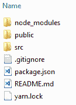

# 第七章：常见的 JavaScript 库和 SVG

现在你已经看过了 SVG 的原始 DOM 接口，是时候看看 SVG 与一些更常见的 JavaScript 库和框架之间的接口了。借鉴于第六章中学到的*JavaScript 和 SVG*的经验，我们将研究在使用 jQuery、AngularJS（1.*）、Angular（2+）和 ReactJS 时使 SVG 正常工作时出现的一些特殊情况。这些示例不会很深入，但应该都能说明在处理 SVG 和这些其他代码库时存在的基本问题。这里的目标不是要完全向你介绍这些库和框架。只会有足够的介绍让你能够开始运行，然后每个部分都将处理该库或框架以及 SVG 的具体问题。

在本章中，我们将涵盖：

+   使用广受欢迎的 jQuery 库和 SVG

+   Angular 1 和 Angular（2+）与 SVG 之间的接口

+   SVG 和 ReactJS，这是 Facebook 的流行库

# 使用 jQuery 操纵 SVG

我们将首先看的库是 jQuery。jQuery 并不像以前那样热门，但它仍然是地球上最流行的 JavaScript 库，了解在 SVG 中使用 jQuery 的特殊情况仍然可能是有用的。

由于 jQuery 作为常见 DOM 交互的友好替代，本节将展示我们在第六章中进行的 DOM 操作演示的基于 jQuery 的重写，JavaScript 和 SVG。

它使用完全相同的标记，因此在本章中我们需要查看的唯一位置是底部的脚本块。

此代码将以惯用的 jQuery/ES5 编写。

我们将首先看一下我们将在 jQuery 的`DOMContentLoaded`事件的等价事件上触发的函数，即`$(document).ready()`。`$(document).ready()`接受一个函数作为参数。正如其名称所示，当文档的 DOM 内容加载完成时，该函数将被执行。

虽然你可以传入一个函数表达式，但我们将定义一个传递给`$(document).ready()`的传统命名的函数`init`。

在其中，我们设置了一些事件处理程序。第一个是我们按钮的`click`事件处理程序。它触发`loadCursor`函数。第二到第四个事件处理程序为每种不同的 SVG 元素类型创建`save`事件。最后一个将`add`函数添加到`#canvas`元素中，以便在画布元素上单击时知道要将所选的 SVG 元素放到页面上：

```xml
  function init() {
      $(".controls .btn").on("click", loadCursor); 
      $("#rect-save").on("click", rectSave);
      $("#circle-save").on("click", circleSave);
      $("#text-save").on("click", textSave);
      $("#canvas").on("click", add);
    }
$().ready(init);
```

现在我们已经看过了启动应用程序的函数，让我们依次看看其他函数。首先我们将看看`add`函数的新版本。`add`有一个主要的问题，然后还有几个较小的问题。

我们首先通过获取一个加载了 jQuery 引用的`$("#canvas")` SVG 元素来开始。之后，初始化与函数的纯 JavaScript 版本类似。

这包括一个主要的问题，即 jQuery 的预期行为失败的地方。虽然常见的 jQuery 元素创建方法如`$("<rect>")`适用于 SVG 元素，并将`<rect>`元素插入页面，但它们仍然需要使用正确的命名空间进行创建。没有命名空间，就像你在上一章中学到的那样，它们将被浏览器视为任意的 HTML 元素，并不会按预期渲染。因此，就像纯 JS 示例中一样，我们需要向元素创建添加命名空间。因此，我们使用与仅 JavaScript 示例中相同的`elem = doc.createElementNS(NS, "rect");`模式来执行此操作。一旦元素被创建，它就可以像通常一样被插入到 DOM 中并用 jQuery 进行操作。

元素创建后，`square`、`circle`和`text`的各个选项都与仅 JavaScript 示例类似地处理。在这种情况下，我们只是使用 jQuery 的便利方法`$().hasClass()`和`$().attr()`来测试类名并设置各种属性。

最后，我们使用更多的 jQuery 便利方法将元素添加到`$canvas`元素中，移除`"active"`类，并添加`click`事件处理程序来编辑元素：

```xml
function add($event) {
      var $canvas = $("#canvas");
      var elem;
      var doc = document;
      var NS = canvas.getAttribute('xmlns');
      var point = canvas.createSVGPoint();
      var $elem;
      point.x = $event.offsetX;
      point.y = $event.offsetY;
      var svgCoords = 
        point.matrixTransform(canvas.getScreenCTM().inverse());
      if ($canvas.hasClass("active")) {
        if ($canvas.hasClass("square")) {
          elem = doc.createElementNS(NS, "rect");
          $elem = $(elem).attr({
            "x": svgCoords.x,
            "y": svgCoords.y,
            "width": 50,
            "height": 50
          });

        } else if ($canvas.hasClass("circle")) {
          elem = doc.createElementNS(NS, "circle");

          $elem = $(elem).attr({
            "cx": svgCoords.x,
            "cy": svgCoords.y,
            "r": 10
          });
        } else if ($canvas.hasClass("text")) {
          elem = doc.createElementNS(NS, "text");
          $elem = $(elem).attr({
            "x": svgCoords.x,
            "y": svgCoords.y,
            "width": 50,
            "height": 50
          });
          $elem.text("TEXT");

        }
        $elem.attr("fill", "#ff8000");
        $canvas.append($elem);
        $canvas.removeClass("active");
        $elem.on("click", edit);
      }
    }
```

三个编辑函数再次遵循与普通 JS 示例相同的模式。在每个函数中，我们获取一个加载的 jQuery 引用到`target`元素，并将其存储为`$elem`。然后我们使用 jQuery 方法`$().prop`，它查找对象属性，以测试调用对象的`nodeName`。然后我们显示正确的模态，使用 Bootstrap 模态方法调用`"show"`参数，并使用 jQuery `$().data`方法设置当前元素。`$().data`，正如你在第六章中记得的，*JavaScript 和 SVG*，在元素上获取和设置任意数据。然后我们使用`$().val()`方法的组合，它获取或设置表单输入的值，和`$().attr()`方法，它获取或设置元素属性，来填充表单值。`$().val()`在这里用于通过读取 SVG 元素的值来设置表单的值，使用`$().attr()`调用`getter`（没有参数）并将该值作为`$().val()`的参数：

```xml
   function edit($event) {
      var $elem = $($event.target);
      if ($elem.prop("nodeName") === "rect") {
        $("#rect-edit-modal").modal("show").data("current-element",
         $elem);

        $("#rect-color").val($elem.attr("fill"));
        $("#rect-x").val($elem.attr("x"));
        $("#rect-y").val($elem.attr("y"));
        $("#rect-width").val($elem.attr("width"));
        $("#rect-height").val($elem.attr("height"));
      }
      else if ($elem.prop("nodeName") === "circle") {
        $("#circle-edit-modal").modal("show").data("current-element",
         $elem);
        $("#circle-color").val($elem.attr("fill"));
        $("#circle-cx").val($elem.attr("cx"));
        $("#circle-cy").val($elem.attr("cy"));
        $("#circle-radius").val($elem.attr("r"));
      }
      else if ($elem.prop("nodeName") === "text") {
        $("#text-edit-modal").modal("show").data("current-element",
         $elem);
        $("#text-color").val($elem.attr("fill"));
        $("#text-x").val($elem.attr("x"));
        $("#text-y").val($elem.attr("y"));
        $("#text-text").val($elem.text());
      }
    }
```

最后，我们有各种`save`方法。这些遵循与之前示例相同的模式。这与普通 JS 示例的基本工作流程相同，但我们再次能够使用完整的 jQuery 便利方法来操作我们的 SVG 元素：使用 Bootstrap 方法隐藏模态，使用`$().data()`方法获取对当前元素的引用，然后使用`$().attr()`方法设置属性，称为`setter`，和`$().val()`称为`getter`，作为参数：

```xml
    function rectSave() {
      $("#rect-edit-modal").modal("hide");
      var $elem = $("#rect-edit-modal").data("current-element");
      $elem.attr({
        "fill": $("#rect-color").val(),
        "x": $("#rect-x").val(),
        "y": $("#rect-y").val(),
        "height": $("#rect-height").val(),
        "width": $("#rect-width").val()
      });
    }
    function circleSave() {
      $("#circle-edit-modal").modal("hide");
      var $elem = $("#circle-edit-modal").data("current-element");
      $elem.attr({
        "fill": $("#circle-color").val(),
        "cx": $("#circle-cx").val(),
        "cy": $("#circle-cy").val(),
        "r": $("#circle-radius").val()
      });
    }
    function textSave() {
      $("#text-edit-modal").modal("hide");
      var $elem = $("#text-edit-modal").data("current-element");
      $elem.attr({
        "fill": $("#text-color").val(), "x": $("#text-x").val(),
        "y": $("#text-y").val()
      });
      $elem.text($("#text-text").val());
    }
```

正如你所看到的，除了元素创建之外，使用 SVG 和 jQuery 是直接的。元素创建需要使用标准 DOM 方法，但与 SVG 元素的其他交互可以使用适当的 jQuery 方法。

# 使用 AngularJS 和 SVG

现在是时候看看在更完整的应用程序框架中使用 SVG。我们将从 AngularJS 开始，这是 Google 广受欢迎的应用程序框架的原始版本。虽然 AngularJS（Angular 1.*）在 Web 框架的背景下已经过时，但它仍然受欢迎，并在许多环境中使用。它也为许多人所熟悉，并且被广泛部署，因此从多个角度来看，了解如何在 AngularJS 应用程序中使用 SVG 是有用的。

这个和接下来的示例将比 jQuery 和纯 JavaScript 演示更简单。这有两个原因。首先，你已经在 SVG 和 JavaScript 在 DOM 中的交互方面看到了很多细节。你实际上已经准备好自己处理 SVG DOM 操作，因此在不同框架中涵盖大量变化可能甚至不那么有益。覆盖基础知识应该足够让你自己去做。

其次，我们不希望太多关于实际库和框架的细节。将每个介绍保持在最低限度意味着我们可以专注于讨论的 SVG 部分。为此，我们将看看最简单的演示，它将展示在应用程序中使用元素的两个最重要方面：将动态 SVG 元素插入 DOM，并通过用户交互对其进行操作。

演示将如下所示：


这段代码将以惯用的 ES5 方式编写。

以下是代码。这个示例的所有代码都在一个单独的 HTML 文件中。这通常不是您构建 AngularJS 应用程序的方式，但对于这个示例来说，它完全可以。

文档`head`使用必要的脚本和样式设置应用程序。我们链接到 Bootstrap，jQuery 和 Angular：

```xml
<head>
  <link rel="stylesheet" 
   href="https://maxcdn.bootstrapcdn.com/bootstrap/4.0.0/css/bootstrap.
    min.css" integrity="sha384-
    Gn5384xqQ1aoWXA+058RXPxPg6fy4IWvTNh0E263XmFcJlSAwiGgFAW/dAiS6JXm"
    crossorigin="anonymous">
  <link rel="stylesheet" href="style.css" />
  <script src="img/jquery-3.3.1.min.js" 
          integrity="sha256-
            FgpCb/KJQlLNfOu91ta32o/NMZxltwRo8QtmkMRdAu8="
            crossorigin="anonymous"></script>
  <script  
   src="img/>    min.js"></script>
</head>
```

有趣的部分从`body`元素开始。这是我们设置 Angular 应用程序的地方。`ng-app`属性表示 Angular 应该处理`body`元素及其所有子元素，并将 Angular 的特殊解析规则应用于其中包含的标记。我们很快会看到`ng-app`值`"angularSVG"`的引用指的是什么。

接下来的标记是我们将 UI 与 Angular 功能和功能绑定在一起的地方。Angular 使用特殊属性和自定义 HTML 元素的组合来创建动态界面。

从我们的角度来看，最重要的部分是使用`ng-attr`前缀来处理`fill`、`cx`、`cy`和`r`属性。Angular 允许您在标记中引用当前控制器作用域中的变量，只要它包含在`{{}}`模式中，Angular 就会用模型中的值替换该引用。这是一个实时引用，它将在常规周期中自动更新。

这个非常方便的特性*不*与某些 SVG 属性兼容。虽然在您玩转应用程序并将值从 Angular 令牌转换为数值后，以下内容最终会起作用，但在文档加载时会出现错误：

```xml
<circle
      fill="{{fill}}" 
      cx="{{cx}}" 
      cy="{{cy}}" 
      r="{{r}}" />
```

错误可以在以下截图中看到。SVG 解析器期望一个`length`值，而实际上得到的是一个字符串：


修复这个问题需要使用`ng-attr`前缀。这个前缀告诉 Angular 在插值步骤中使用`allOrNothing`标志。简单来说，这意味着如果属性的值是`undefined`，则不会将属性呈现到文档中。一旦它有一个值，它就会像正常一样呈现。

这个标记的第二个有趣部分是自定义 HTML 元素`angular-rect`。`angular-rect`是 Angular 中所谓的**指令**。指令是 Angular 用来创建自定义 HTML 元素和属性的机制，允许您通过自己设计的可重用代码块来扩展和增强常见的 HTML 元素和文档。虽然这个很简单，但很快你会看到，这个自定义元素将简洁地说明 Angular 指令如何与 SVG 一起工作。

标记中唯一有趣的部分是使用`ng-model`属性将 JavaScript 变量值绑定到表单字段中。这个特殊的 AngularJS 属性在标记和 Angular 控制器之间建立了双向数据绑定。我们很快会看到这些变量是如何在控制器中设置的，但请记住一点，一旦建立了这种连接，AngularJS 会保持它的活力，并在`form`字段更新时自动更新 SVG 元素中的值：

```xml
<body ng-app="angularSVG">
  <div ng-controller="circleController" class="container">
    <svg  width="150" height="150" 
     viewBox="0 0 150 150" version="1.1">
      <circle
      ng-attr-fill="{{fill}}" 
      ng-attr-cx="{{cx}}" 
      ng-attr-cy="{{cy}}" 
      ng-attr-r="{{r}}" />
      <angular-rect></angular-rect>
    </svg>
    <div class="row">
      <div class="col-4">
        <label>Background color:</label>
      </div>
      <div class="col-8">
        <input type="color" ng-model="fill" id="circle-color">
      </div>
    </div>
    <div class="row">
      <div class="col-2">
        <label>cx:</label>
      </div>
      <div class="col-4">
        <input type="number" ng-model="cx" id="circle-cx" class="form-
          control">
      </div>
      <div class="col-2">
        <label>cy:</label>
      </div>
      <div class="col-4">
        <input type="number" ng-model="cy" id="circle-cy" class="form-
         control">
      </div>
    </div>
    <div class="row">
      <div class="col-2">
        <label>radius:</label>
      </div>
      <div class="col-4" height="{{cx}}>
        <input type="number" ng-model="r" id="circle-radius" 
          class="form-control">
      </div>
    </div>
  </div>
```

JavaScript 非常简单。只需几行 JavaScript 代码，就可以将表单字段的值动态调整为圆的高度、宽度和填充颜色。第一部分是`angular.module()`方法调用，创建了一个名为`"angularSVG"`的 Angular 应用程序。这个引用是 Angular 在标记中寻找的，以便知道页面上是否有一个 Angular 应用程序。如果它在`ng-app`中找到这个值，它会解析该标记并将基于 Angular 的魔术应用到页面上。

接下来是我们小的控制器定义，`circleController`。`circleController`有一个参数，即 Angular 的`$scope`变量。如果您对 Angular 不熟悉，可以将`$scope`视为函数的`this`值的受控别名。它是控制器的内部状态，`$scope`中的属性和方法对 JavaScript 代码和对 Angular 感知的标记都是可用的。

在控制器内部，我们只是在`$scope`上设置了一些变量。这些变量作为圆的基线值，并且由于它们绑定到 Angular 的`$scope`，它们自动成为与圆和表单字段中相应值的活动、双向链接。

之后，我们创建了一个简单的 Angular 指令`angularRect`，它只是在 SVG DOM 中插入一个`rect`元素。我们不会在这里讨论 Angular 指令的复杂性，但有一个特定的细节对于 SVG 元素非常重要。返回对象的`templateNamespace`属性指示 Angular 应将该指令视为 SVG。没有它，就像 jQuery 的常见 DOM 创建模式和 DOM 方法`document.createElement`一样，该指令将被插入文档，但它不会被创建为一个正确的 SVG 元素。它会存在，但在渲染时不会显示为一个正方形：

Angular 在 JavaScript 中使用友好的驼峰命名法，然后在将元素插入文档时使用短横线命名法。

```xml
 <script>
    angular.module('angularSVG', [])
      .controller('circleController', function ($scope) {
        $scope.cx = 75;
        $scope.cy = 75;
        $scope.r = 50;
        $scope.fill = "#ff0000";
      }).directive('angularRect', function() {
        return {
            restrict: 'E',
            templateNamespace: 'svg',
            template: '<rect x="125" y="125" width="10" height="10"
             stroke="blue" fill="none"></rect>',
            replace: true
        };
});
  </script>
```

在浏览器中运行并调整数值后，效果如下截图所示。初始截图显示了加载初始数值的演示：


第二个截图显示了调整后的数值和圆形元素相应地发生了变化：


现在我们已经了解了 AngularJS，让我们来看看 Angular 的新进化，Angular 2.0+。这个版本的框架被称为 Angular，与之前的版本非常不同，功能非常强大。

让我们快速看一下。

# 使用 Angular 操作 SVG

从 AngularJS 转向，让我们来看看 Angular 的现代进化。Angular 2.0+（简称为 Angular）是一个非常现代的框架。它通常是用 TypeScript 编写的，这是 JavaScript 的一个超集，它添加了一些可选功能，Angular 利用这些功能为库添加了一些非常方便的功能和功能。

# 开始使用 Angular

由于 Angular 是一个较新的框架，占用的空间较大，我们将介绍一些设置步骤。下载示例中的代码将可以工作，但了解如何到达那里是非常有用的。所以，让我们开始设置。

这个 Angular 示例将复制使用 Angular 代码重新制作的与 AngularJS 示例提供的完全相同的演示。正如您可能已经感觉到并将继续学习的那样，无论您使用哪种库或框架，动态 SVG 的基本问题都是相同的；解决方案只是略有不同。

您可以使用任何您喜欢的文本编辑器来进行 Angular 示例，但我建议使用微软的 VS Code。它是免费的，得到很好的支持，经常更新，并且与 TypeScript 非常兼容。

# 安装 Node、npm 和 Angular Cli

在您开始使用 Angular 之前，您需要设置好实际运行代码所需的工具。一切的基础是 Node.js 和 Node 的包管理器`npm`。因此，如果您还没有安装，您应该首先安装它们。最简单的方法是转到[nodejs.org](http://nodejs.org)并下载适用于您操作系统的安装程序。

安装完成后，您可以继续安装 Angular 的**命令行工具**（**CLI**）。Angular CLI 使得启动 Angular 项目变得非常容易，您很快就会看到。以下命令将在您的计算机上全局安装 Angular CLI：


1.  安装完成后，使用`ng new`命令创建一个项目。`ng new`将创建一个新的文件夹，其中包含启动 Angular 项目所需的一切。我们不会详细介绍，但运行此命令后，您应该已经准备好开始使用您的应用程序了：


1.  下一步是进入您刚创建的文件夹并运行`npm install`：


`npm install`将确保所有依赖项都安装在`node_modules`中，并且您的应用程序将准备就绪。

1.  从 VS Code 的以下屏幕截图显示了初始化应用程序并运行`npm` install 后的布局：


1.  由于我们在这个演示版本中也使用 Bootstrap，因此需要确保它可用。通过运行以下命令完成：

```xml
npm install --save bootstrap 
```

这将把 Bootstrap 安装到您的`node_modules`中：


然后，您可以在`angular-cli.json`中进行连接。`angular-cli.json`是您配置 Angular CLI 安装的不同方面的地方。在这种情况下，我们只需要将 Bootstrap CSS 添加到 styles 属性中，以便它将与应用程序的其余部分捆绑在一起：

在幕后，Angular CLI 使用 Webpack 来捆绑脚本和样式，并以多种方式处理它们，以便将它们准备好交付到开发服务器以及生产环境。使用 Angular CLI 的最大好处之一是它简化了使用 Webpack 的复杂性。Webpack 非常强大，但学习曲线陡峭。Angular CLI 让它变得简单易用。

```xml
 "apps": [
    {
      "root": "src",
      "outDir": "dist",
      "assets": [
        "assets",
        "favicon.ico"
      ],
      "index": "index.html",
      "main": "main.ts",
      "polyfills": "polyfills.ts",
      "test": "test.ts",
      "tsconfig": "tsconfig.app.json",
      "testTsconfig": "tsconfig.spec.json",
      "prefix": "app",
      "styles": [
        "../node_modules/bootstrap/dist/css/bootstrap.css",
        "styles.css"
      ],
      "scripts": [],
      "environmentSource": "environments/environment.ts",
      "environments": {
        "dev": "environments/environment.ts",
        "prod": "environments/environment.prod.ts"
      }
    }
  ],
```

在这种简单状态下运行应用程序将允许我们开始开发应用程序，并针对在本地运行的开发服务器进行测试。这是使用`ng serve`命令完成的。在编译代码后，使用`--open`选项将打开一个 Web 浏览器：


这将在浏览器中自动重新加载代码，每当对代码进行更改时。

因此，现在是时候开始编写一些 TypeScript 并与 SVG 进行交互了。

我们要做的第一件事是编辑应用程序的主模块。`app.module.ts`是应用程序的根模块，它是应用程序的所有部分连接在一起的地方。大部分都是由`Angular CLI`自动连接的。我们只需要使用新的 ES6 模块模式（`import` `module from src`）从 Angular 核心导入`FormsModule`。然后将其添加到`@NgModule`装饰器的`imports`数组中。这允许`FormsModule`的指令和属性在此应用程序中可用：

```xml
import { BrowserModule } from '@angular/platform-browser';
import { NgModule } from '@angular/core';
import { FormsModule } from '@angular/forms';
import { AppComponent } from './app.component';

@NgModule({
  declarations: [
    AppComponent,
    AngularRectComponent
  ],
  imports: [
    BrowserModule,
    FormsModule
  ],
  providers: [],
  bootstrap: [AppComponent]
})
export class AppModule { }
```

接下来，我们将完全编辑`app.component.ts`文件以表示我们的（简单）组件。在其中，我们从 Angular 导入`Component`和`FormsModule`，在`@Component`装饰器中进行一些标准的维护工作，然后导出`AppComponent`类，其中包含四个设置的属性。这种模式值得一些解释，因为它可能很熟悉，但又有足够的不同之处，可能会让人费解。首先，所有这些都是使用`public`关键字创建的。这表示这些属性应该在类的范围之外可用。接下来是变量名称本身，后跟冒号和类型注释，指示变量的预期类型。TypeScript 允许您基于其他 TypeScript 类创建自定义类型，但对于我们的目的，我们只是使用标准的 JavaScript 原语，`number`和`string`。最后，我们为它们设置默认值，以便我们的应用程序有东西可以依靠：

```xml
import { Component } from '@angular/core';
import { FormsModule } from '@angular/forms';

@Component({
  selector: 'app-root',
  templateUrl: './app.component.html',
  styleUrls: ['./app.component.css']
})
export class AppComponent {
  public cx:number = 75;
  public cy:number = 75;
  public r:number = 50
  public color:string = "#cc0000";
}
```

接下来是标记，与之前的示例类似。它都包含在`app.component.html`中。与 AngularJS 版本有一些相似之处。例如，动态属性必须以类似的方式处理，仍然不能直接绑定到 SVG 属性而不引起错误，因此仍然必须显式地管理它们。在这种情况下，您使用`attr.`前缀而不是在 AngularJS 中使用的`ng-attr-`前缀。您还会注意到属性周围的方括号。

使用简单的方括号`[]`表示这是单向数据绑定；模板从我们之前定义的组件属性中读取。稍后，在输入中，我们看到了使用方括号/括号`[()]`语法围绕属性的显式双向数据绑定的示例。`ngModel`是我们使用`FormsModule`导入的指令。它允许我们从表单元素到组件属性进行双向数据绑定。这样，表单中的条目再次表示为 SVG `circle`元素的属性，并且随着对`form`字段的更改而显示更改。

```xml
<div class="container">
  <svg  width="150" height="150" viewBox="0 0 150 150" version="1.1">
    <svg:circle
    [attr.fill]="color"
    [attr.cx]="cx"
    [attr.cy]="cy"
    [attr.r]="r" />
  </svg>
  <div class="row">
    <div class="col-4">
      <label>Background color:</label>
    </div>
    <div class="col-8">
      <input type="color" [(ngModel)]="color" id="circle-color">
    </div>
  </div>
  <div class="row">
    <div class="col-2">
      <label>cx:</label>
    </div>
    <div class="col-4">
      <input type="number" id="circle-cx" [(ngModel)]="cx" class="form-
        control">
    </div>
    <div class="col-2">
      <label>cy:</label>
    </div>
    <div class="col-4">
      <input type="number" id="circle-cy" [(ngModel)]="cy" class="form-
        control">
    </div>
  </div>
  <div class="row">
    <div class="col-2">
      <label>radius:</label>
    </div>
    <div class="col-4">
      <input type="number" id="circle-radius" [(ngModel)]="r" 
        class="form-control">
    </div>
  </div>
</div>
```

我们只需要做一件事情，就可以使这个 Angular 示例与之前的 AngularJS 示例匹配，那就是添加一个代表小蓝色`rect`元素的子组件。这里有一些有趣的地方。首先是展示了 Angular CLI 的强大之处。使用 Angular CLI，如果需要连接一个组件，可以使用`ng new`命令。在我们的例子中，我们将运行`ng new component angular-rect`，这将生成组成 Angular 组件的各种文件，并将实际将组件连接到`app.module.ts`中：


您可以在以下更新的代码示例中看到`app.module.ts`的样子，其中导入了新的`AngularRectComponent`组件并将其添加到`@NgModule`声明中：

```xml
import { BrowserModule } from '@angular/platform-browser';
import { NgModule } from '@angular/core';
import { FormsModule } from '@angular/forms';
import { AppComponent } from './app.component';
import { AngularRectComponent } from './angular-rect/angular-rect.component';

@NgModule({
  declarations: [
    AppComponent,
    AngularRectComponent
  ],
  imports: [
    BrowserModule,
    FormsModule
  ],
  providers: [],
  bootstrap: [AppComponent]
})
export class AppModule { }
```

还有一些与 SVG 直接相关的问题，需要指出才能将这个自定义元素放到页面上。首先是需要在`angular-rect`组件中的元素中添加`svg:`前缀。这告诉 Angular，您猜对了，它应该在创建这些元素时使用 SVG 命名空间：

```xml
<svg:rect x="125" y="125" width="10" height="10" stroke="blue" fill="none"></svg:rect>
```

下一个问题是一个两部分的问题。对于由简单 HTML 元素组成的组件，您可以像这样做，这与您在 AngularJS 中看到的类似。您可以按照以下方式将元素添加到页面中：

```xml
<angular-rect></angular-rect>
```

这将在 Web 检查器中的实时视图中呈现如下：

```xml
<angular-rect _ngcontent-c0="" _nghost-c1=""><rect _ngcontent-c1="" fill="none" height="10" stroke="blue" width="10" x="125" y="125"></rect>
</angular-rect>
```

从标记的角度来看，这看起来很好，但在浏览器中，蓝色矩形消失了。整个元素没有渲染，即使它在 DOM 中。

在 HTML5 中，这种做法可以工作，因为 HTML5 解析器已经被设计成对未知元素（以及格式不正确的标记）宽容，并且您可以使用 CSS 操作自定义元素。另一方面，SVG 仍然是严格的 XML 语法，因此除非元素在 SVG 规范中，或者您可以指向定义该特定元素的基于 XML 的**文档类型定义**（**DTD**），否则它不会正确渲染。幸运的是，有一个与 Angular 组件的功能完全兼容的 SVG 形状解决方案。您可以使用 Angular 绑定自定义组件到`g`元素的能力来创建几乎相同的效果。

以下代码示例显示了如何做到这一点。

首先，让我们看看`angular-rect`组件本身。需要注意的是，大部分文件都是样板文件，唯一需要注意的是`@Component`装饰器中的选择器被包裹在方括号`[]`中。由于它被包裹在方括号中，这告诉解析器它是一个属性选择器，而不是您在应用程序组件本身中看到的常见元素选择器。这意味着 Angular 将查找元素的属性中是否存在`angular-rect`，并将其替换为我们的新自定义组件：

```xml
import { Component, OnInit } from '@angular/core';

@Component({
  selector: '[angular-rect]',
  templateUrl: './angular-rect.component.html',
  styleUrls: ['./angular-rect.component.css']
})
export class AngularRectComponent implements OnInit {

  constructor() {}

  ngOnInit() {}

}
```

接下来，我们将看到如何在标记中使用。我们再次将`svg:`前缀添加到`g`元素，然后我们只需添加`angular-rect`属性，组件就会正确渲染：

```xml
  <svg  width="150" height="150" viewBox="0 0 150 150" version="1.1">
    <svg:circle
    [attr.fill]="color"
    [attr.cx]="cx"
    [attr.cy]="cy"
    [attr.r]="r" />
    <svg:g angular-rect></svg:g>
  </svg>
```

Angular 到此为止。

# 使用 React 和 SVG

我们要看的最后一个库是 React。React 是一个非常流行的库，它在 AngularJS 变得陈旧之际出现，而在 Angular 准备好投入使用之前出现。在某些圈子里非常受欢迎。它基于 ES6，并具有一些特定于 React 的扩展。

其中许多内容对你来说可能很熟悉，仅仅基于你在本章中迄今所看到的内容，特别是如果你做过任何严肃的 Web 应用程序开发。

开始使用 React 并不像使用 Angular 那样直接。Angular 在内部可能更复杂，但 Angular CLI 消除了许多问题，因此作为开发人员，你几乎不会（或很少）看到复杂性。React 更像是一个库而不是一个完整的框架，因此为了启动和运行，你可能需要做出更多的决定。幸运的是，虽然有许多方法可以实现这一点，但没有任何方法像 Angular CLI 对 Angular 那样对项目至关重要（它们在文档和社区中紧密耦合），但有一些方法可以像 Angular CLI 一样简单地实现。也许甚至更简单，因为根本不需要安装任何东西。

假设你的机器上安装了 Node 版本>6，你只需要运行一个命令就可以创建演示代码中使用的简单应用程序：

```xml
$ npx create-react-app react-svg 
```

`create-react-app`是 Facebook 的一个实用工具，可以启动一个完全功能的 React 应用程序。运行它看起来像以下两个屏幕截图（完整滚动将占据书的许多页面）。

这很酷。它创建文件夹，下载所有的依赖项并安装所有内容，然后给你一系列命令，以便与你新创建的 React 应用程序进行交互：


持续结果：


更深入地看，它创建了一个看起来像以下屏幕截图的目录。它包含了`node_modules`文件夹和所有的依赖项，`public`是编译后文件的存放位置（当你浏览你的工作代码时，它们是从这里提供的），`src`是你的应用程序的所有源文件的存放位置。其他文件都是`git/npm/yarn-based project`的标准文件：

Yarn 是`npm`的替代品。我们不会详细介绍两者之间的区别，因为这超出了本书的范围，而且说实话，也不是很有趣。可以说，yarn 是`npm`的并行工具，因此你将使用 yarn 做与`npm`相同的事情。语法偶尔有所不同，在运行`yarn install`时会创建一个不同的文件（`yarn.lock`）。但就本书而言，你不需要关心这些区别。



如前所述，应用程序代码在`src`中。你可以在以下屏幕截图中看到该文件夹的布局。

`App.css`、`App.js`和`App.test.js`是你的应用程序的核心所在。`index.js`文件是你的应用程序的主要入口点，它会引导你的 React 应用程序。`registerServiceWorker.js`是框架提供的一个文件，用于从本地缓存中提供资源。但是，在这个简单的应用程序中，你实际上不会碰它：


从项目文件夹的根目录运行`yarn start`将编译所有的 React 代码和 CSS，并将启动一个可在 localhost:`3000`访问的开发服务器：


启动应用程序如下，以防你想知道。我们将很快消除它：


在我们开始深入研究 SVG 和 React 之前，让我们看一下`create-react-app`生成的基本 React 组件。你之前已经看到它的渲染；现在让我们看看它是如何工作的。

React 组件的基本格式如下。它是一个 ES6 模块，带有`import`语句、一个类和一个导出。有一个特定于 React 的元素值得注意。

文件顶部显示了 ES6 导入。这可以包括 CSS 文件（我们马上就会看到）和 SVG 图像。Webpack 实际上会读取这些导入语句并优化这些导入，就像 Webpack 与 Angular 装饰器一样工作。

接下来是文件中的唯一一个类。`App`，它扩展自 React 的基本`Component`类。它有一个方法`render()`，它使用了一种称为 JSX 的 JavaScript 扩展。JSX 允许您将 XML 和 JavaScript 混合在一起。老实说，我从来不太喜欢这种格式，当他们发布它时我几乎感到震惊，但我已经开始欣赏它的意图，即使我不喜欢它。如果 JSX 属性被引用，则它们被解析为字符串。否则，它们被视为 JavaScript 表达式。在这种情况下，`logo.svg`的路径被转换为有用的路径，并在浏览器中呈现出 logo。

最后，我们导出默认类`App`，其他应用程序可以导入它：

```xml
import React, { Component } from 'react';
import logo from './logo.svg';
import './App.css';

class App extends Component {
  render() {
    return (
      <div className="App">
        <header className="App-header">
          
          <h1 className="App-title">Welcome to React</h1>
        </header>
        <p className="App-intro">
          To get started, edit <code>src/App.js</code> and save to 
            reload.
        </p>
      </div>
    );
  }
}

export default App;
```

快速浏览一下`index.js`，因为我们实际上没有做太多事情，这将展示应用程序如何加载。

文件顶部有几个 ES6 模块导入。React 和 ReactDOM 是核心，驱动基本的 React 库并添加 ReactDOM 接口。它们主要驱动我们在这个小演示中要做的大部分工作。

导入还包括`index.css`文件。

除此之外，我们还导入了两个 JavaScript 模块：`App`，这是我们要进行工作的模块，以及之前提到的`registerServiceWorker`，我们将完全不使用它。

一旦所有内容都被导入，我们运行两个小函数。`ReactDOM.render`被调用时带有两个参数，`<App />`表示由 App 组件创建的自定义元素，`document.getElementById("root")`表示应接收新元素的节点：

```xml
import React from 'react';
import ReactDOM from 'react-dom';
import './index.css';
import App from './App';
import registerServiceWorker from './registerServiceWorker';

ReactDOM.render(<App />, document.getElementById('root'));
registerServiceWorker();
```

现在我们已经快速浏览了基本的 React 架构，让我们来看看我们的演示。

除了基本的 React 应用程序之外，Bootstrap 也通过运行以下命令安装到该项目中。我们将继续使用相同的标记来做另一个简单的表单/SVG 演示，这是有道理的：

```xml
npm install --save bootstrap
```

让我们看看我们的`App.js`。它以几个导入语句开始。我们从 React 中导入`React`和`component`。然后我们导入两个 CSS 文件，我们自己的自定义`App.css`和刚刚安装的`Bootstrap CSS`，链接到项目的`node_modules`中的文件。最后，我们从`rect`模块导入我们独立的`ReactRect`组件。

然后是`App`类的定义。它实际上只有几件事情。在构造函数中，我们创建一个基本的`state`对象，其中包含我们标准 SVG 属性`cx`、`cy`、`r`和`color`的默认值。然后我们设置一个方法`handleChange`来处理对底层模型的更改。

这个方法很简单。它接收`event`对象，创建一个`target`常量，然后进一步检查该对象以获取输入的`name`和`value`。然后它使用`setState`方法（从`props`继承）来设置应用程序状态的值。

接下来是`render`函数。

浏览一下，您会注意到您不需要做太多工作就可以让 React 正确地呈现 SVG。

首先，我们使用 ES6 解构赋值模式为各种属性设置本地变量。一旦这些变量设置好了，只需将需要由 React 解释的变量添加到适当属性的大括号`{}`中。SVG 元素和表单输入中的变量引用以相同的方式处理，不需要任何特殊处理。

我们只需将`handleChange`方法直接绑定到标记中的`onChange`事件，一切都会如预期般运行。

我们导入的`ReactRect`被添加到 SVG 元素中。React 负责导入该组件，我们很快就会看到它，并将其呈现到文档中。

自定义组件需要以大写字母开头。以小写字母开头的标记被解释为 HTML 元素。

```xml
import React, { Component } . from 'react';
import './App.css';
import 'bootstrap/dist/css/bootstrap.css';
import ReactRect from './rect';

class App extends Component {
  constructor(props) {
    super(props);
    this.state = {
      cx: 75,
      cy: 75,
      r: 50,
      color: "#cc0000"
    };
    this.handleChange = this.handleChange.bind(this);
  }
  handleChange(event) {
    const target = event.target;
    const value = target.value;
    const name = target.name;
    this.setState({
      [name]: value
    });
  }
  render() {
    const { cx,cy,r,color } = this.state;
    return (
      <div className="container">
      <svg  width="150" height="150" 
        viewBox="0 0 150 150" version="1.1">
        <circle
        r={r}
        cy={cy}
        cx={cx}
        fill={color}
        ></circle>
        <ReactRect></ReactRect>
      </svg>
      <div className="row">
        <div className="col-4">
          <label>Background color:</label>
        </div>
        <div className="col-8">
          <input type="color" id="circle-color" value={color}
          name="color"
          onChange={this.handleChange} />
        </div>
      </div>
      <div className="row">
        <div className="col-2">
          <label>cx:</label>
        </div>
        <div className="col-4">
          <input type="number" id="circle-cx" className="form-control" 
            value={cx}
          name="cx"
          onChange={this.handleChange} />
        </div>
        <div className="col-2">
          <label>cy:</label>
        </div>
        <div className="col-4">
          <input type="number" id="circle-cy" className="form-control" 
            value={cy}
          name="cy"
          onChange={this.handleChange} />
        </div>
      </div>
      <div className="row">
        <div className="col-2">
          <label>radius:</label>
        </div>
        <div className="col-4">
          <input type="number" id="circle-radius" className="form-
            control" value={r}
          name="r"
          onChange={this.handleChange} />
        </div>
      </div>
    </div>
    );
  }
}

export default App;
```

我们的自定义元素非常简单。它只是一个简单的 React 组件，返回我们的`rect`元素：

```xml
import React, { Component } from 'react';

class ReactRect extends Component {
  render() {
    return (
      <rect x="125" y="125" width="10" height="10" stroke="blue" 
        fill="none"></rect>

    );
  }
}

export default ReactRect;
```

正如您所看到的，使用动态 SVG 和 React 非常简单。React 团队努力确保 SVG 元素和属性都能正常工作，因此这归功于他们的辛勤工作。谢谢，React 团队！

# 总结

在本章中，您将使用四个常见的库和框架，将这些强大的工具与 SVG 集成在一起。

从 jQuery 开始，通过 AngularJS、Angular 和 React，您现在具有将 SVG 与地球上四个最受欢迎的库和框架之一集成的基本经验。

具体来说，您学习了如何使用每个框架设置应用程序，如何创建具有 SVG 元素和属性的动态组件，以及如何以动态方式操纵这些属性。

您还了解了在使用 SVG 和这些库时的多个注意事项，包括确保元素在 jQuery 中正确创建以及确保在 Angular 框架中正确处理动态属性的方法。
