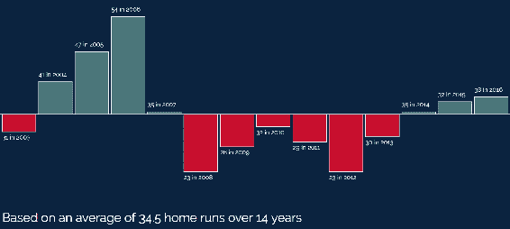
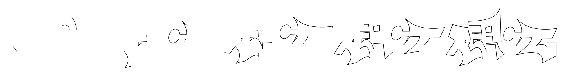
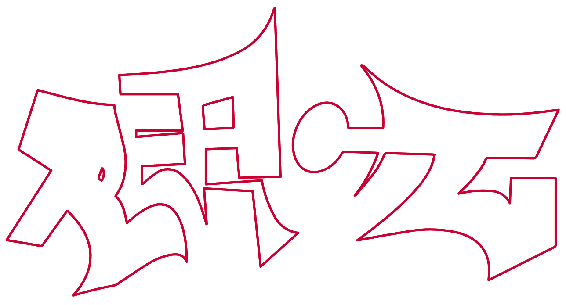

# 第八章：SVG 动画和可视化

这一章讨论了 SVG 的最具动态和令人印象深刻的用例：使用 SVG 进行数据可视化和动画。您已经了解的工具，SVG、JavaScript 和 CSS，以及一些新工具，将汇集在一起，为您构建动态站点和应用程序提供强大的选择。

在这一章中，我们将学到以下内容：

+   如何使用 SVG、JavaScript 和结构化数据生成静态数据可视化

+   动画 SVG 的一般技术概述

+   使用 Vivus 对 SVG 进行动画处理

+   使用 GSAP 进行动画

在完成本章中的示例后，您将能够使用 SVG 创建动画和数据可视化，并了解使用 SVG 和动画的两种最佳工具。

让我们开始吧。

# 创建 SVG 数据可视化

这一部分将专注于使用 SVG 和 JavaScript 组合基本数据可视化。这个特定的可视化将关注一个插图，即相对于平均值的正/负差异。在这种情况下，它将说明棒球选手大卫·奥尔蒂兹在波士顿红袜队生涯中每个赛季击出的本垒打数量与他在红袜队生涯中的平均本垒打数量的比较。

从 2003 年到 2016 年，大卫·奥尔蒂兹在为红袜队效力期间，每个赛季最少击出 23 个本垒打，最多击出 54 个。他的平均每个赛季 34.5 个。这个可视化将展示他每年本垒打总数相对于 34.5 平均值的正/负差异。他击出比平均值多的年份将以绿色显示。击出比平均值少的年份将以红色显示。

我们需要经历的步骤如下：

1.  我们将获取数据并计算总年数、总本垒打数量，然后计算平均值。

1.  我们将循环遍历数据，并计算每年的正/负偏移量。

1.  我们将根据可用的屏幕空间计算一些指标。

1.  我们将在屏幕上垂直居中绘制一个基准线。

1.  我们将在适当的位置绘制一系列矩形，其高度适当以指示正/负的差异，以及一些简单的标签指示年份和本垒打的数量。

1.  我们将添加一个图例，指示本垒打的平均数量和年数。

最终的可视化将如下所示：



现在我们已经计划好了基础知识，让我们详细看看这是如何工作的。

我们将从标记开始，这非常简单。我们首先包括 Bootstrap 和 Raleway 字体作为我们标准模板的一部分。然后，我们设置 SVG 元素的背景，并设置两种不同类型文本元素的字体系列、大小和颜色。然后我们只需包括目标 SVG 元素和运行可视化的 JavaScript 文件：

```xml
<!doctype html>
<html lang="en">

<head>
  <meta charset="utf-8">
  <title>Mastering SVG- SVG Data Visualization</title>
  <link rel="stylesheet" 
   href="https://maxcdn.bootstrapcdn.com/bootstrap/4.0.0/css/bootstrap.
    min.css" integrity="sha384-
    Gn5384xqQ1aoWXA+058RXPxPg6fy4IWvTNh0E263XmFcJlSAwiGgFAW/dAiS6JXm"
    crossorigin="anonymous">
  <link href="https://fonts.googleapis.com/css?family=Raleway" 
    rel="stylesheet">
  <style type="text/css">
    body {
      font-family: Raleway, sans-serif;
    }
    svg.canvas {
     background: #0C2340;
    }
    text {
      font-family: Raleway, sans-serif;
      font-size: .75em;
      fill: #fff;
    }
    text.large {
      font-size: 1.5em;
    }
  </style>
</head>

<body>

  <div class="container-fluid">
    <div class="row">
      <div class="col-12">
        <svg  viewBox="0 0 1000 450" 
          width="1000" height="450" version="1.1" id="canvas" 
            class="canvas">
        </svg>
      </div>
    </div>
  </div>
  <script src="img/scripts.js"></script>
</body>

</html>
```

包含的 JavaScript 文件是真正的工作所在。

这个 JavaScript 文件使用了几个 ES6 特性。

`scripts.js`本身基本上是一个大函数，`viz`。

在`viz`的顶部，我们有`data`变量。这个变量是一个 JavaScript 对象数组。每个对象都有两个属性，`year`和`hrs`，表示相关年份和奥尔蒂兹在那一年击出的本垒打数量：

```xml
function viz() {
  /*
    ES6
  */
  const data = [
    {
      "year": 2003,
      "hrs": 31
    },
    {
      "year": 2004,
      "hrs": 41
    },
    {
      "year": 2005,
      "hrs": 47
    },
    {
      "year": 2006,
      "hrs": 54
    },
    {
      "year": 2007,
      "hrs": 35
    },
    {
      "year": 2008,
      "hrs": 23
    },
    {
      "year": 2009,
      "hrs": 28
    },
    {
      "year": 2010,
      "hrs": 32
    },
    {
      "year": 2011,
      "hrs": 29
    },
    {
      "year": 2012,
      "hrs": 23
    },
    {
      "year": 2013,
      "hrs": 30
    },
    {
      "year": 2014,
      "hrs": 35
    },
    {
      "year": 2015,
      "hrs": 37
    },
    {
      "year": 2016,
      "hrs": 38
    }
  ];
```

如果您正在交互式地运行此可视化，要么接受用户的输入，要么将 Web 服务调用的结果插入到可视化中，您只需要具有正确的结构（对象数组）和格式（`hrs`和`year`），其他一切都会自动完成。在查看填充文件的其余变量和方法时，请记住这一点。

从`data`开始，我们设置了几个不同的变量，我们将在可视化过程中使用，除了`data`之外：

+   `doc`：对文档的引用

+   `canvas`：引用具有`id`为`#canvas`的 SVG 元素

+   `NS`：从`SVG`元素派生的命名空间的引用

+   `elem`：我们将创建的元素的占位符变量

```xml
  const doc = document;
  const canvas = doc.getElementById("canvas");
  const NS = canvas.getAttribute('xmlns');
  let elem;
```

接下来是我们用来填充可视化值和元素的几个实用方法。

第一个函数`addText`让我们可以向可视化添加文本标签。它接受一个坐标对象`coords`，要输入的`text`，最后是一个可选的 CSS 类`cssClass`。我们将在一个示例中探讨 CSS 类参数的用例。前两个参数应该很简单，是必需的。

在`addText`之后，有一个`addLine`函数，它允许我们在屏幕上绘制线条。它接受一个坐标对象`coords`（在这种情况下包含四个坐标）和一个可选的`stroke`颜色。您会注意到`stroke`在函数签名中创建了一个默认值。如果没有提供描边颜色，`stroke`将是`#ff8000`。

接下来是`addRect`函数，它允许我们向屏幕添加矩形。它接受一个坐标对象`coords`，其中包含`height`和`width`属性，以及可选的`stroke`和`fill`颜色。

最后，有一个函数`maxDiffer`，它计算出一组正负数之间的最大差值。获取这个范围，然后使用这个最大差确保无论数字如何分布，基线上方或下方所需的最大高度都能适应屏幕：

```xml
  function addText(coords, text, cssClass) {
    elem = doc.createElementNS(NS, "text");
    elem.setAttribute("x", coords.x);
    elem.setAttribute("y", coords.y);
    elem.textContent = text;
    if (cssClass){
      elem.classList.add(cssClass);
    }
    canvas.appendChild(elem);
  }
  function addLine(coords, stroke = "#ff8000") {
    elem = doc.createElementNS(NS, "line");
    elem.setAttribute("x1", coords.x1);
    elem.setAttribute("y1", coords.y1);
    elem.setAttribute("x2", coords.x2);
    elem.setAttribute("y2", coords.y2);
    elem.setAttribute("stroke", stroke);
    canvas.appendChild(elem);
  }
  function addRect(coords, fill = "#ff8000", stroke = "#ffffff") {
    elem = doc.createElementNS(NS, "rect");
    elem.setAttribute("x", coords.x);
    elem.setAttribute("y", coords.y);
    elem.setAttribute("width", coords.width);
    elem.setAttribute("height", coords.height);
    elem.setAttribute("fill", fill);
    elem.setAttribute("stroke", stroke);
    canvas.appendChild(elem);
  }
  function maxDiffer(arr) {
    let maxDiff = arr[1] - arr[0];
    for (let i = 0; i < arr.length; i++) {
      for (let j = i + 1; j < arr.length; j++) {
        if (arr[j] - arr[i] > maxDiff) {
          maxDiff = arr[j] - arr[i];
        }
      }
    }
    return maxDiff;
  }

```

在这些实用函数之后，我们有定义可视化核心的代码。它发生在一个在`DOMContentLoaded`事件上运行的函数中。

当函数运行时，我们创建多个变量，保存我们需要生成可视化的不同属性。以下是它们的作用：

+   `viewBox`是 SVG 元素`viewBox`的本地引用。我们将这个和后续的 DOM 引用存储在本地，这样我们就可以节省`viewBox`的 DOM 查找次数。

+   `width`是对 SVG 元素`viewBox`中宽度的本地引用。

+   `height`是对`viewBox`中`height`的本地引用。

+   `x`是对`viewBox`中`x`点的本地引用。

+   `y`是对`viewBox`中`y`点的本地引用。

+   `padding`是一个任意的常数，用于创建几个填充计算。

+   `vizWidth`定义了 SVG 画布的可见宽度。这定义了我们可以安全地将元素绘制到 SVG 元素中的区域。

+   `years`是数据集中的年数的引用。

+   `total`是一个计算出的值，代表整个数据集中击出的全垒打总数。

+   `avg`是每年击出的全垒打的平均数，通过将`total`除以`years`得出。

+   `verticalMidPoint`表示 SVG 元素的垂直中点。这是正负差异绘制的基准线。

+   `diffs`是一个数组，保存了每年击出的全垒打平均数和实际击出的全垒打数之间的正负差异。

+   `maxDiff`是每年击出的全垒打的平均数和实际击出的全垒打数之间的最大差异。

+   `yInterval`是每个全垒打的像素数。这确保了方框在垂直方向上根据每年击出的全垒打数正确地进行缩放。

+   `xInterval`是每年的像素数。这个值允许我们均匀地在 SVG 元素中放置方框，无论数据集中有多少年：

```xml
  document.addEventListener("DOMContentLoaded", () => {
    const viewBox = canvas.viewBox.baseVal;
    const width = viewBox.width;
    const height = viewBox.height;
    const x = viewBox.x;
    const y = viewBox.y;
    const padding = width / 200;
    const vizWidth = width - padding;
    const years = data.length;
    const total = data.reduce((total, item) => {
      return total + item.hrs;
    }, 0);
    const avg = total / years;
    const verticalMidPoint = (y + height) / 2;
    const diffs = data.map((item) => {
      return item.hrs - avg;
    });
    const maxDiff = maxDiffer(diffs);
    const yIntervals = verticalMidPoint / maxDiff;
    const xInterval = (vizWidth / years);
```

在创建所有这些变量之后，我们开始绘制不同的框并添加标签。为此，我们使用`for...in`循环来循环遍历`diffs`数组，进行两个计算以创建两个新变量`newX`和`newY`。`newX`是基于`i`的值乘以我们之前创建的`intervalX`变量的常规间隔。`newY`变量是通过将`diffs[i]`的值（当前差异）乘以`yInterval`常量来计算的。这为我们提供了一个距离，用于计算矩形的高度，以表示每年的本垒打数量。

接下来，我们测试当前`diff`是否大于或小于零。如果大于零，我们希望绘制一个从`verticalMidPoint`向上的框。如果当前`diff`小于零，则我们绘制一个从`verticalMidPoint`向下的框。由于矩形的方向和相关的锚点在每种情况下都不同，我们需要以不同的方式处理它们。我们还将使用不同的颜色来突出显示这两种变化，以便进行次要指示。

虽然这个`if`的两个分支之间存在差异，但两个分支都调用了`addRect`和`addText`。让我们看看`if`的两个分支之间的相似之处和差异之处。

首先，每次调用`addRect`都遵循相同的模式，对于`x`和`width`属性。`x`始终是`newX`值加上`padding`，而`width`是`xInterval`值加上`padding`。

`y`和`height`值由两个分支处理。

如果当前差异小于零，则新的`y`坐标为`verticalMidpoint`。这将使框的顶部锚定在可视化中表示零的线上，并指示框将悬挂在该线下方。如果当前差异大于零，则`y`坐标设置为`verticalMidPoint`减去`newY`。这将使新矩形的顶部值为`newY`在表示零的线上方。

如果当前差异小于零，则`height`是传入`Math.abs()`的`newY`值。无法向 SVG 元素传递负值，因此需要使用`Math.abs()`将负值转换为正值。如果当前差异大于零，则`height`就是`newY`值，因为它已经是正数。

在`if`的每个分支中调用`addText`的位置不同。如果`newY`值为负数，则再次使用`Math.abs`将`newY`值转换为正数。否则，保持不变。

随后，我们使用`addLine`调用将零线添加到垂直中点。传入的参数是`viewBox`的未更改的`x`和`width`，左右两个点的`verticalMidpint`作为`y`值。

最后，我们添加了一些解释可视化基础知识的文本。在这里，我们使用了`cssClass`参数可选项来调用`addLine`，传入`large`，以便我们可以制作稍大一些的文本。`x`和`y`参数利用了`x`和`height`变量以及`padding`变量，将文本放置在 SVG 元素的左下角略微偏移。

最后一行代码只是调用`viz()`函数来启动可视化。

```xml
for (const i in diffs) {
      const newX = xInterval * i;
      const newY = diffs[i] * yInterval;
      if (diffs[i] < 0) {
        addRect({
          "x": newX + padding,
          "y": verticalMidPoint,
          "width": xInterval - padding,
          "height": Math.abs(newY),
        }, "#C8102E", "#ffffff");
        addText({
          "x": newX + padding,
          "y": verticalMidPoint + Math.abs(newY) + (padding * 3)
        }, `${data[i].hrs} in ${data[i].year}`);
      }
      else if (diffs[i] > 0) {
        addRect({
          "x": newX + padding,
          "y": verticalMidPoint - newY,
          "width": xInterval - padding,
          "height": newY,
        }, "#4A777A", "#ffffff");
        addText({
          "x": newX + padding,
          "y": verticalMidPoint - newY - (padding * 2)
        }, `${data[i].hrs} in ${data[i].year}`);
      }
      addLine({
        x1: x,
        y1: verticalMidPoint,
        x2: width,
        y2: verticalMidPoint
      }, "#ffffff");
      addText({
        "x": x + padding,
        "y": height - (padding * 3)
      }, `Based on an average of ${avg} home runs over ${years} years`,
            "large");
    }
  });

}
viz();
```

如果这是一个用于生产或更通用用途的可视化，那么我们仍然需要对其进行一些处理。敏锐的读者会发现，我们实际上并没有处理本垒打数量恰好等于平均本垒打数量的情况，例如。也就是说，对于本书的目的，这里的细节足以说明如何使用 JavaScript、SVG 和数据来以可视化的方式讲述数据集的故事。

现在我们已经看过静态可视化了，让我们来看一下如何在屏幕上添加一些动作。下一节将介绍在浏览器中可以对 SVG 进行动画的多种方式。

# 动画 SVG 的一般技术

本节将介绍各种用于动画 SVG 的一般技术。虽然有不同的工具可用于完成这项工作（您将在本章后面遇到两种），但了解在没有框架或库的帮助下如何完成这些工作是很有用的。本节将提供这方面的基础知识。

您之前已经看到了一些这些技术，但是在动画的上下文中再次查看它们是很好的。

# 使用纯 JavaScript 进行动画

在 CSS 关键帧动画和 CSS 过渡出现之前，我们不得不手动使用 JavaScript 在浏览器中制作所有动画和有趣的效果；在循环中更新属性并手动优化帧速率。最终，诸如 jQuery 之类的库出现并消除了对了解这些工作原理的需求，通过将动画作为其 API 的一部分呈现出来。幸运的是，如今，除了您选择的工具中可用的动画方法之外，您还可以利用 CSS 动画来完成许多以前需要使用 JavaScript 的事情，因此现在越来越少需要人们学习这些技能。

也就是说，有些地方 CSS 动画无法胜任，因此了解它在幕后如何工作并且不依赖库是有好处的。

这个简单的动画将会将一个圆形元素从左到右地在 SVG 元素上移动。我们需要计算几个指标来创建动画，所以即使它很简单，它也会说明你在编写这种代码时可能遇到的许多挑战。

让我们来看一下代码。

`head`中没有任何有趣的内容，所以让我们直接跳到页面的`body`。`body`中有我们在整本书中一直使用的标准 Bootstrap 标记。在主`div`内部，我们有一个包含单个`circle`元素的`SVG`元素，位于`75, 225`，半径为`50`像素。它的`id`是`circle`：

```xml
  <div class="container-fluid">
    <div class="row">
      <div class="col-12">
        <svg  viewBox="0 0 1000 450" 
          width="1000" height="450" version="1.1" id="canvas" 
           class="canvas">
          <circle cx="75" cy="225" r="50" fill="blue" id="circle">
        </circle>
        </svg>
      </div>
    </div>
  </div>
```

JavaScript 很简单。

它包括一个添加到`DOMContentLoaded`事件的函数。该函数执行一些熟悉的操作。它创建了对`doc`、`canvas`和`circle`的本地引用，以便我们可以在整个动画过程中轻松地引用这些元素。接下来创建了几个变量来存储`viewBox`的属性：`viewBox`本身，`height`，`width`和`x`。然后设置了两个常量，表示动画运行的秒数和我们动画的**每秒帧数**（**fps**）。

接下来，我们将当前圆形元素的`x`值作为变量`currX`。然后计算结束点`newX`，通过使用圆的半径乘以 3 来计算。这给我们一个舒适的结束点，视觉上。

接下来，我们创建一些变量来运行动画。首先，`diffX`是当前`x`值和目标`newX`值之间的差值的计算。然后我们将`diffX`除以秒数，再乘以每秒帧数。这将创建三秒的间隔来进行动画。

最后，我们创建了动画变量`animX`，这是我们在每一帧中将要处理的变量，因为我们要将元素动画移动到屏幕上。

接下来，有一个函数会在每一帧调整元素在屏幕上的位置。它有三个作用。它将间隔添加到`animX`上，以通过计算的间隔移动元素。然后设置元素的`cx`属性，将其移动到新位置。最后，使用`window.requestAnimationFrame`递归调用自身。

`requestAnimationFrame`是一种允许浏览器优化 JavaScript 动画绘制到屏幕上的方法。它通常优化到每秒`60`帧，但从技术上讲，它将匹配设备的显示刷新率。

所有这些都发生在一个`if`块内，当动画完成时停止动画。如果`animX`小于`newX`，则执行代码，再次调用`animate`来启动下一帧。如果`animX`大于或等于`newX`，则动画停止：

```xml
document.addEventListener("DOMContentLoaded", () => {

 const doc = document;
 const canvas = doc.getElementById("canvas");
 const circle = doc.getElementById('circle');
 const viewBox = canvas.viewBox.baseVal;
 const width = viewBox.width;
 const height = viewBox.height;
 const x = viewBox.x;
 const padding = width / 200;
 const seconds = 3;
 const fps = 60;
 let currX = circle.cx.baseVal.value;
 let newX = width - (circle.r.baseVal.value * 3);
 let diffX = newX - currX;
 let intervalX = diffX / (fps * seconds);
 let animX = currX;
 function animate() {
    if (animX < newX) {
        animX = animX + intervalX;
        circle.setAttribute("cx", animX);
        window.requestAnimationFrame(animate);
     }
 }
 animate();
 });
```

这不是最复杂的动画，但使用`window.requestAnimationFrame`意味着在浏览器中看起来相当不错。

虽然有其他选项可以对 SVG 进行动画，你应该了解它们并在适当的地方使用它们，但 JavaScript 将是最强大且最灵活的选择。如果你的动画需要在尽可能多的浏览器中运行，那么你需要使用 JavaScript。

好消息是，正如你将在本章后面看到的，有很好的工具可以简化使用 JavaScript 进行动画。

在我们看几个用于处理 SVG 的 JavaScript 库之前，让我们看一下使用核心 Web 技术对 SVG 进行动画的另外两个选项：CSS 和 SMIL。

# 使用 CSS 进行动画

使用 CSS 对 SVG 进行动画是直接的，它的工作方式与 CSS 动画和过渡与常规 HTML 元素的工作方式相同。你定义一些 CSS 属性，根据你是否使用关键帧动画或过渡，你创建特定的 CSS 规则来处理它们在一段时间内的渲染。这个过程的问题在于，只有演示属性，它们驱动了 SVG 的许多内容，也可以作为 CSS 属性使用，才能用 CSS 进行操作。正如你在下面的网站上看到的，根据 SVG 1.1 的定义，缺少许多重要的属性：[`www.w3.org/TR/SVG/propidx.html`](https://www.w3.org/TR/SVG/propidx.html)。SVG 2.0 添加了更多属性，但对这些新属性的支持并不是普遍的，不幸的是，没有一个适当的手册来说明哪些属性在哪里得到支持。

换句话说，根据你的浏览器支持矩阵的情况，使用这些技术可能会有一些潜在的问题。

无论如何，即使有这样一个有些粗糙的故事，看到这些技术的实际应用仍然是值得的。

这里有三个例子。两个显示了类似于之前的 JavaScript 动画的动画；它们将一个蓝色圆圈移动到屏幕上。它们以两种不同的方式实现。这说明了根据你的目标浏览器的不同，你可能会看到实现上的差异。第一个例子使用 CSS 变换和 CSS 动画来将元素沿屏幕移动。这种技术具有更广泛的浏览器支持。第二个例子使用更简单的方法，在 SVG 元素悬停时设置`cx`属性的过渡，然后更改值。在 Chrome 中，`cx`作为 CSS 属性可用，因此在该浏览器中，这是更简单的方法。

第三个例子展示了元素上`fill`的过渡，以说明在这种情况下将计算留给浏览器和 CSS 是非常有益的一个例子。如果不清楚如何从一个颜色值动画到另一个颜色值，那么你可能至少能看到一个将繁重的工作留给浏览器的绝佳用例。

让我们按顺序看一下这些例子。

第一个例子很简单。在这个例子中，我们有与之前的 JavaScript 例子相同的标记，只有一个例外：通过 CSS 设置`cx`属性。我们在文档的`head`中的`#circle`选择器中这样做。

此外，我们在该选择器上设置了一个`transition`属性，监视`cx`属性的变化，并在其变化时进行三秒的过渡。在下一个选择器`svg:hover #circle`中，我们通过父 SVG 元素上的悬停事件触发动画，将`cx`值设置为最终目的地`875`像素。

有了这个 CSS，当你在 SVG 元素上悬停鼠标时，新的`cx`被设置，浏览器将在 SVG 元素的*X*轴上在`75`和`875`像素之间进行动画处理：

```xml
<!doctype html>
<html lang="en">

<head>
  <meta charset="utf-8">
  <title>Mastering SVG- SVG Animation with CSS</title>
  <link rel="stylesheet" 
  href="https://maxcdn.bootstrapcdn.com/bootstrap/4.0.0/css/bootstrap.m
    in.css" integrity="sha384-
    Gn5384xqQ1aoWXA+058RXPxPg6fy4IWvTNh0E263XmFcJlSAwiGgFAW/dAiS6JXm"
    crossorigin="anonymous">
  <style type="text/css">
    #circle {
      transition: cx 3s;
      cx: 75px;
    }
    svg:hover #circle {
      cx: 875px;
    }
  </style>

</head>

<body>

  <div class="container-fluid">
    <div class="row">
      <div class="col-12">
        <svg  viewBox="0 0 1000 450"
         width="1000" height="450" version="1.1" id="canvas" 
          class="canvas">
          <circle cy="225" r="50" fill="blue" id="circle"></circle>
        </svg>
      </div>
    </div>
  </div>

</body>

</html>
```

下一个例子设置类似。它与前一个例子具有完全相同的 SVG 标记，并由 JavaScript 进行动画处理。区别再次在于 CSS。

有两个感兴趣的部分。第一部分定义了一个名为`animate-circle`的两关键帧动画。第一个关键帧，在`0%`处，使用`transform: translateX`在*X*轴上进行`0px`的平移。第二个关键帧，在`100%`处，将该变换增加到`800px`。

然后，在`#circle`选择器中，我们使用命名动画定义`animation`属性，持续时间为三秒，线性缓动。然后我们将`animation-fill-mode`设置为 forwards，表示动画应该向前运行一次并完成，保持动画元素处于最终状态。

当这个运行时，圆圈会平滑地在屏幕上进行动画处理：

```xml
<!doctype html>
<html lang="en">

<head>
  <meta charset="utf-8">
  <title>Mastering SVG- SVG CSS Animation</title>
  <link rel="stylesheet" 
   href="https://maxcdn.bootstrapcdn.com/bootstrap/4.0.0/css/bootstrap.
    min.css" integrity="sha384-
    Gn5384xqQ1aoWXA+058RXPxPg6fy4IWvTNh0E263XmFcJlSAwiGgFAW/dAiS6JXm"
    crossorigin="anonymous">
  <style type="text/css">
    @keyframes animate-circle {
      0% {
        transform: translateX(0)
      }
      100% {
        transform: translateX(800px)
      }
    }

    #circle {
      animation: animate-circle 3s linear;
      animation-fill-mode: forwards;
    }
  </style>

</head>

<body>

  <div class="container-fluid">
    <div class="row">
      <div class="col-12">
        <svg  viewBox="0 0 1000 450" 
         width="1000" height="450" version="1.1" id="canvas" 
          class="canvas">
          <circle cx="75" cy="225" r="50" fill="blue" id="circle">
        </circle>
        </svg>
      </div>
    </div>
  </div>

</body>

</html>
```

最后一个例子也使用了过渡，这次是将`fill`属性从蓝色动画到红色。这个属性是早期在 CSS 中定义为可用的演示属性之一，因此在当前时间，它在浏览器中的支持要比`cx`等属性好得多。

CSS 定义非常简单。在`#circle`定义上设置了一个`fill`属性，以及一个`transition`，用于监视`fill`的变化，并在 2 秒内进行过渡。

在`#circle:hover`中，我们将`fill`更改为蓝色。在浏览器中运行并悬停在圆圈上，将会使圆圈元素的颜色进行动画处理，而无需使用任何 JavaScript，并且无需弄清楚如何从一个命名颜色动画到另一个。

```xml
<!doctype html>
<html lang="en">
<head>
  <meta charset="utf-8">
  <title>Mastering SVG- SVG Data Visualization</title>
  <link rel="stylesheet" 
  href="https://maxcdn.bootstrapcdn.com/bootstrap/4.0.0/css/bootstrap.m
  in.css" integrity="sha384-
  Gn5384xqQ1aoWXA+058RXPxPg6fy4IWvTNh0E263XmFcJlSAwiGgFAW/dAiS6JXm"
    crossorigin="anonymous">
  <style type="text/css">
    #circle {
      fill: red;
      transition: fill 3s;
    }
    #circle:hover {
      fill: blue;
    }
  </style>
</head>
<body>
  <div class="container-fluid">
    <div class="row">
      <div class="col-12">
        <svg  viewBox="0 0 450 450"
         width="450" height="450" version="1.1" id="canvas" 
            class="canvas">
          <circle cx="225" cy="225" r="225" fill="blue" id="circle">
        </circle>
        </svg>
      </div>
    </div>
  </div>
</body>
</html>
```

所有这些例子都是故意基本的，正如前面提到的，它们的浏览器支持很弱（例如，在 IE 旧版本中都不起作用）；但它们仍然很强大。如果你的浏览器支持矩阵偏向于最新和最好的浏览器，那么你可以在 CSS 和 SVG 中玩得很开心。

# 使用 SMIL 对 SVG 进行动画处理

SVG 动画的另一个有趣且强大的选项与 CSS 具有类似令人沮丧的支持矩阵。SMIL 在 Microsoft 浏览器中根本不受支持，甚至曾一度被 Chrome 弃用。

这是一件遗憾的事，因为 SMIL 有一些很好的特点。它是一种清晰的、声明式的动画元素的方式。它不像 JavaScript 那样强大，也不像 CSS 那样常用作通用技术，但它仍然相当不错。

看一个例子。

在其中，我们有我们现在熟悉的标记：一个简单的`circle`在一个空的 SVG 元素上。这次有一个小小的变化。`animate`元素作为`circle`元素的子元素。`animate`元素是动画定义的地方。它有几个属性，我们需要看一下：

+   `xlink:href`属性指向将要进行动画处理的`#circle`元素。`animate`元素是`circle`元素的子元素，这样就自动将动画与其关联起来。使用`xlink:href`属性可以确保连接被准确定义。

+   `attributeName`定义将要进行动画处理的属性。在这种情况下，它是`cx`属性。

+   `from`和`to`属性表示动画的起点和终点。在这种情况下，我们将从`"75"`移动到`"900"`。

+   `dur`指示动画的持续时间。在这种情况下，它被定义为`"3s"`，持续三秒。

+   `begin`属性指示动画应该何时开始。这让你可以根据需要延迟动画。在我们的例子中，我们立即开始动画，设置为`"0s"`。

+   `fill`属性，与常见的`fill`属性同名，表示动画值在动画结束后是否保留在元素上。这个值`"freeze"`表示元素应该在动画结束时保持在达到的状态上。

在 SVG 的上下文中，似乎没有很好的理由将`fill`重载为执行两个基本不相关的任务。这很不幸。

在浏览器中运行这个动画会创建一个类似于本章中几个实例中看到的动画；球从左边开始，在三秒内移动到右边。

```xml
<!doctype html>
<html lang="en">

<head>
 <meta charset="utf-8">
 <title>Mastering SVG- SVG Animation with SMIL</title>
 <link rel="stylesheet" 
  href="https://maxcdn.bootstrapcdn.com/bootstrap/4.0.0/css/bootstrap.m
    in.css" integrity="sha384-
    Gn5384xqQ1aoWXA+058RXPxPg6fy4IWvTNh0E263XmFcJlSAwiGgFAW/dAiS6JXm"
    crossorigin="anonymous">
</head>

<body>

 <div class="container-fluid">
 <div class="row">
 <div class="col-12">
 <svg  viewBox="0 0 1000 450" 
    width="1000" height="450" version="1.1" id="canvas" class="canvas">
    <circle cx="75" cy="225" r="50" fill="blue" id="circle">
 <animate 
 xlink:href="#circle"
 attributeName="cx"
 from="75"
 to="900" 
 dur="3s"
 begin="0s"
 fill="freeze" />
 </circle>
 </svg>
 </div>
 </div>
 </div>
</body>

</html>
```

现在我们已经看了 SVG 中数据可视化和动画的手动方法，让我们来看一些可以帮助动画元素的工具。

# 使用 Vivus 对 SVG 进行动画

Vivus 是一个只做一件事情并且做得非常好的库([`maxwellito.github.io/vivus/`](https://maxwellito.github.io/vivus/))。Vivus 允许您在一段时间内“绘制”SVG 元素的描边。

以下一系列截图展示了它的效果。这是一个很好的效果。



需要注意的是，本章中的三个示例都使用了相同的插图。书中打印的代码示例截断了每个路径元素的`d`属性，以缩短代码示例的长度。如果您想看完整的示例，请参考 GitHub 上的代码([`github.com/roblarsen/mastering-svg-code`](https://github.com/roblarsen/mastering-svg-code)[)。 ](https://github.com/roblarsen/mastering-svg-code)

只要`stroke`设置了一个值并且`fill`设置为`none`，只需包含 Vivus JavaScript 文件（在这种情况下，我们通过在 Vivus 文件夹中运行`npm install`，然后链接到`node_modules`文件夹中的 JavaScript 文件来实现），然后创建一个新的 Vivus 实例就可以了。

创建一个新的 Vivus 实例非常容易。使用`new`关键字，您可以用两个参数实例化一个新的 Vivus 对象。第一个是 SVG 元素的`id`。第二个是配置对象。在这种情况下，我们只传入一个选项，即`duration`参数，将动画的持续时间设置为三秒（3,000 毫秒）。

以下代码示例展示了使用 Vivus 有多么容易：

```xml
<!doctype html>
<html lang="en">

<head>
  <meta charset="utf-8">
  <title>Mastering SVG- SVG Animation with Vivus</title>
  <style>
  .stroke{
    stroke-linejoin: round;
  }
  </style>
</head>

<body>

 <div class="container-fluid">
 <div class="row">
 <div class="col-12">
 <svg id="loader"  viewBox="0 0 
    250.23 131.83"><title>Logo</title><path fill="none" stroke="#000"
     d="M160.9,26.9l-.37.25c6.81,8.24,10.62,17.49"/>
<path fill="none" stroke="#000" 
 d="M28.14,92.59c1.43,1.56,2.81,3,4,4.45,3.56,4.31,6.05"/>
<path fill="none" stroke="#000" d="M80.3,57.58c.27,4.74.54,9.34.81,14l-
 19.33,1v8.1a4.56,4.56,"/>
<path fill="none" stroke="#000" 
 d="M160.9,26.9a5.89,5.89,0,0,1,1.08.74c11.41,"/>
<path fill="none" stroke="#000" d="M28.14,92.59c-3.72,5.21-7.28,"/>
<path fill="none" stroke="#000" 
 d="M80.3,57.58,59.18,59.36V56.54h21C79.42,"/>
<path fill="none" stroke="#000" 
 d="M43.87,73.26a5.31,5.31,0,0,1-.24,5.8c-1.51-.76-1.58-.91-1-2.4Z"/><path fill="none" stroke="#000" d="M103.13,55.28,90"/></svg>
 </div>
 </div>
 </div>
<script src="img/vivus.js"></script>
<script>
 new Vivus('loader', {duration: 3000});
</script>
</body>

</html>
```

Vivus 还有其他配置选项，您可以在这里找到它们：[`github.com/maxwellito/vivus#option-list`](https://github.com/maxwellito/vivus#option-list)。我们不会全部讨论，但我们将说明另一个非常有用的选项，即在动画完成后运行回调函数。

除了我们定义一个简单的回调函数`callback`，它遍历所有具有类`stroke`的元素的实例并将它们的描边更改为不同的颜色，其他都与之前的 Vivus 示例相同。

最终结果看起来像以下的截图。一旦动画完成并且回调函数执行，文本将变为红色：



回调函数作为可选的第三个参数传递给 Vivus 构造函数。然后在动画完成时执行。

以下代码示例展示了它是如何工作的：

```xml
<!doctype html>
<html lang="en">

<head>
  <meta charset="utf-8">
  <title>Mastering SVG- SVG Animation with Vivus</title>
  <style>
  .stroke{
    stroke-linejoin: round;
  }
  </style>
</head>

<body>
  <div class="container-fluid">
    <div class="row">
      <div class="col-12">
          <svg id="loader"  
            viewBox="0 0 250.23 131.83"><title>Logo</title><path
             fill="none" stroke="#000" 
             d="M160.9,26.9l-.37.25c6.81,8.24,10.62,17.49"/>
<path fill="none" stroke="#000" d="M28.14,92.59c1.43,1.56,2.81,3,4,4.45,3.56,4.31,6.05"/>
<path fill="none" stroke="#000" d="M80.3,57.58c.27,4.74.54,9.34.81,14l-19.33,1v8.1a4.56,4.56,"/>
<path fill="none" stroke="#000" d="M160.9,26.9a5.89,5.89,0,0,1,1.08.74c11.41,"/>
<path fill="none" stroke="#000" d="M28.14,92.59c-3.72,5.21-7.28,"/>
<path fill="none" stroke="#000" d="M80.3,57.58,59.18,59.36V56.54h21C79.42,"/>
<path fill="none" stroke="#000" d="M43.87,73.26a5.31,5.31,0,0,1-.24,5.8c-1.51-.76-1.58-.91-1-2.4Z"/><path fill="none" stroke="#000" d="M103.13,55.28,90"/></svg>
      </div>
    </div>
  </div>
<script src="img/vivus.js"></script>
<script>
  function callback(){
    for (const element of document.getElementsByClassName("stroke")){
      element.style.stroke = "#cc0033";
    };
  }
  new Vivus('loader', {duration: 500}, callback);
</script>
</body>

</html>
```

现在我们已经看了一个只做一件事的动画库，让我们来看看一个更全面的动画库**GreenSock Animation Platform (GSAP)**。

# 使用 GSAP 对 SVG 进行动画

GSAP 是用于 Web 动画的一组强大的 JavaScript 工具。它与 SVG 非常配合。

GSAP 是一组强大的工具，深入探索它所提供的所有内容需要跨越多个章节。*这还只是免费版本*。还有一个高级版本，其中包括更多功能和功能。

好消息是，尽管它非常强大，但 GSAP API 很简单，所以一旦找到所需的功能并查看了强大的文档（[`greensock.com/docs`](https://greensock.com/docs)），您将能够非常快速地做很多事情。

让我们看两个单独的示例，为您介绍 GSAP 可以做什么以及它是如何做到的。

这个第一个示例复制了我们在本章中已经做过几次的相同动画。我们将一个球从 SVG 元素的一边移动到另一边。这个实际上使用了最初 JavaScript 示例中的一些熟悉代码来计算最终位置。

标记与我们迄今为止看到的一样。它是一个 SVG 元素中的一个`circle`元素，带有`circle`的`id`。

要开始使用 GSAP，我们需要在演示中包含他们的 JavaScript。在这种情况下，我们包含了 TweenMax 脚本。在项目文件夹中运行`npm install`将安装 GSAP，然后我们可以从项目的`node_modules`文件夹中包含它。

GSAP 提供了两个不同的 Tween*模块：`TweenLite`和`TweenMax`。

它们的描述如下：

TweenLite 是一个非常快速，轻量级和灵活的动画工具，它是 GSAP 的基础。TweenLite 实例处理任何对象（或对象数组）的一个或多个属性随时间的变化。

TweenMax 扩展了 TweenLite，添加了许多有用（但非必要）的功能，如 repeat()，repeatDelay()，yoyo()等。它还默认包含许多额外的插件，使其功能非常齐全。

我们将在此演示中使用 TweenMax。如果您要开始尝试 GSAP，TweenMax 将为您提供最大的工具集。它稍微慢一些，但更强大，而且在您尝试使用它时，拥有一切都会更有趣。

现在我们已经加载了 JavaScript 文件，让我们开始使用它。

JavaScript 应该看起来很熟悉，至少起初是这样。我们设置了几个熟悉的常量：`doc`作为`document`的别名，`canvas`作为 SVG 元素的引用，`circle`作为我们要动画的圆的本地引用，`viewBox`作为 SVG 元素的`viewBox`的本地引用，`width`作为`viewBox.width`，`newX`作为圆元素的计算完成位置。

GSAP 特定的新代码如下，当我们调用`TweenMax.to`时。`TweenMax.to`是一个方法，用于将 HTML 元素动画到特定状态。参数如下：

+   `"#circle"`是用于匹配我们要动画的元素的 CSS 选择器。

+   `1`是动画将运行的次数。

+   最后，有一个配置对象来定义动画。在我们的示例中，我们将`newX`变量作为`cx`元素的新值传入。

就是这样；GSAP 处理剩下的部分，平滑地将圆圈从屏幕的一端移动到另一端：

```xml
<!doctype html>
<html lang="en">

<head>
  <meta charset="utf-8">
  <title>Mastering SVG- SVG Animation with GSAP</title>

</head>

<body>

  <div class="container-fluid">
    <div class="row">
      <div class="col-12">
        <svg  viewBox="0 0 1000 450" 
        width="1000" height="450" version="1.1" id="canvas" 
        class="canvas">
          <circle cx="75" cy="225" r="50" fill="blue" id="circle">
        </circle>
        </svg>
      </div>
    </div>
  </div>

<script src="img/TweenMax.min.js"></script>
<script>
const doc = document;
const canvas = doc.getElementById("canvas");
const circle = doc.getElementById('circle');
const viewBox = canvas.viewBox.baseVal;
const width = viewBox.width;
const newX = width - (circle.r.baseVal.value * 3);
TweenMax.to("#circle", 1, {attr:{cx:newX}, ease:Linear.easeNone});
</script>
</body>

</html>
```

下一个示例具有相同的设置，但更改了传递到`TweenMax.to`的参数，并添加了另一个链接方法调用以更改动画的持续时间。在这个示例中，我们传入四个单独的属性来对元素进行动画处理，`cx`，`cy`，`r`和`fill`。这个示例展示了 GSAP 的真正力量之一。您不必弄清楚关于这些多个属性动画的时间，各个间隔的样子，或者如何同步它们并解析它们以使它们平稳运行。您只需给 GSAP 一个最终状态，然后观察它的魔力。

此外，我们正在添加一个新的方法，链接到对`TweenMax.to`的调用的末尾。调用`TweenMax.duration`会改变动画的持续时间。在这里，我们传入`5`，以延长动画的持续时间为整整五秒。这种链接的接口允许您以类似于使用 jQuery 和许多其他 JavaScript 库的方式处理动画。这是一个强大而友好的接口。

```xml
<!doctype html>
<html lang="en">

<head>
  <meta charset="utf-8">
  <title>Mastering SVG- SVG Animation with GSAP</title>

</head>

<body>

  <div class="container-fluid">
    <div class="row">
      <div class="col-12">
        <svg  viewBox="0 0 1000 450" 
         width="1000" height="450" version="1.1" id="canvas" 
         class="canvas">
          <circle cx="75" cy="225" r="50" fill="blue" id="circle">
        </circle>
        </svg>
      </div>
    </div>
  </div>

<script src="img/TweenMax.min.js"></script>
<script>
const doc = document;
const canvas = doc.getElementById("canvas");
const circle = doc.getElementById('circle');
const viewBox = canvas.viewBox.baseVal;
const width = viewBox.width;
const height= viewBox.height;
TweenMax.to("#circle", 1, {attr:{cx:width,cy:0,r:height,fill:"red"}, ease:Linear.easeNone}).duration(5);
</script>
</body>

</html>
```

在浏览器中运行上面的代码会产生以下输出：


# 摘要

在本章中，您了解了关于 SVG 的可视化和动画。这包括使用纯 JavaScript、SMIL、CSS 以及两个用于动画的库：GSAP 和 Vivus。

在本章中，我们看到了：

+   使用 JavaScript、SVG 和 CSS 创建自定义数据可视化。您使用 JavaScript 处理了一组数据，并使用结果创建了一个漂亮的可视化，以便以易于阅读的方式说明一组数据。

+   使用 JavaScript 创建自定义 SVG 动画。这包括计算增量以在每秒 60 帧的速度下进行动画，并使用`requestAnimationFrame`作为一种方法，以确保您提供最流畅的体验。

+   使用 CSS 对 SVG 进行动画。您了解到，用于对 SVG 进行动画的强大选项具有不确定的浏览器支持。

+   使用 SMIL 对 SVG 进行动画，这也带来了不确定的浏览器支持。

+   使用 Vivus 库对 SVG 进行动画，这使得在 SVG 中实现“绘图”动画就像包含库并添加一行 JavaScript 代码一样简单。

+   最后，您对强大的 GSAP 库有了一瞥，它为 SVG 和其他元素的动画提供了非常强大的选项。

现在我们已经将一些库引入到混合中，将顺利过渡到一个关于 SVG、Snap.svg 和 SVG.js 的辅助库的整个章节。这些是重要的工具，如果您想要在 SVG 上进行高级的自定义工作，它们将是非常宝贵的。
