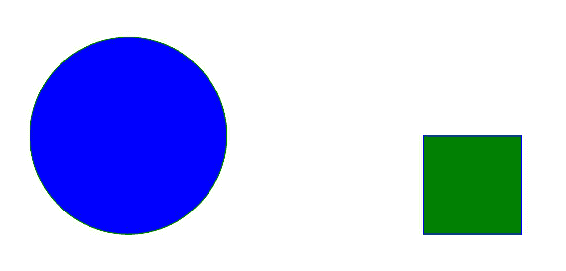
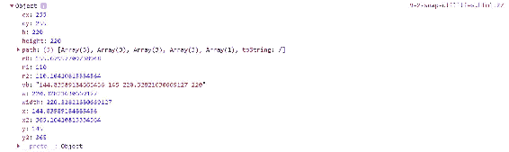
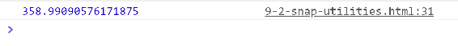
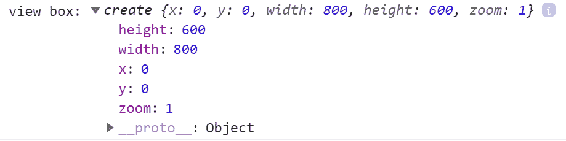
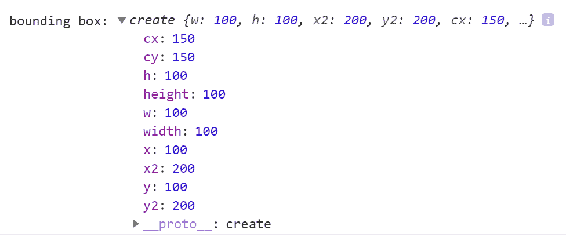
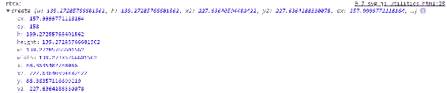
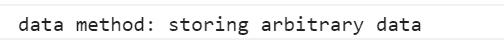
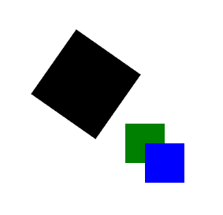
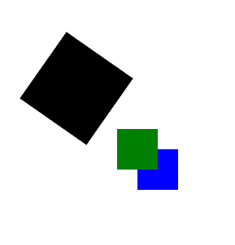
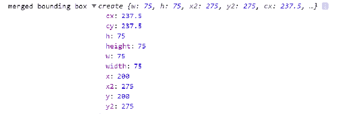

# 第九章：辅助库 Snap.svg 和 SVG.js

到目前为止，我们在本书中已经学到了很多关于 SVG 的知识。如果你已经走到了这一步，你已经准备好进行一些严肃的 SVG 开发，对此有三种方法：

+   继续做我们在本书中大部分已经做过的事情-了解核心技术如何相互作用并将 SVG 集成到您的站点或应用程序中，就像您在任何标记中一样。用 JavaScript 和 CSS 操纵它，你就可以准备好处理基本上任何事情。这是一个有效的方法，也是我在自己的工作中经常采用的方法。

+   使用特定任务的框架和库。我们已经开始用 GSAP 和 Vivus 进行动画的一点探索。我们将在第十章中继续探讨这个问题，*使用 D3.js*，当我们研究 D3，一个强大的可视化框架。

+   使用通用的 SVG 库，它将帮助您处理各种与 SVG 相关的任务。SVG 是在一个名为 Raphael 的库的支持下进入了 Web 开发的主流，目前有一些库可供您在自己的工作中使用。这个选项是本章的重点。

如前所述，由于浏览器的有限支持，SVG 花了很多年时间才获得了广泛的应用。一个名为 Raphael.js 的通用 SVG 库通过为较旧版本的 Internet Explorer 提供了一个非常聪明的**矢量标记语言**(**VML**)的 polyfill 来弥合了这种支持差距。它还为处理浏览器中的 SVG 提供了一个友好的 API，这有助于那些对 SVG 不熟悉的人快速、轻松地入门。

本章涉及两个最受欢迎的 Raphael.js 的后继者：

+   `Snap.svg`：是 Raphael 的直接继承者，由 Raphael.js 的作者 Dmitry Baranovskiy([`snapsvg.io/`](http://snapsvg.io/))编写的库。

+   `svg.js`：另一个小巧、轻量级的库，提供了许多强大的选项来操纵 SVG([`svgjs.com/`](http://svgjs.com/))

本章的其余部分将介绍每个库的基础知识，然后通过一些熟悉的例子，重新利用这些通用的 SVG 工具的功能。

我们将从 Snap.svg 开始。

# 使用 Snap.svg

Snap.svg 是 Adobe 的 SVG 实用库，由 Dmitry Baranovskiy 编写。它功能相对齐全，具有友好、易于探索的 API，并且是开源的。最近这个库的开发速度有所放缓，但它仍然是一个有用的工具，如果您正在探索通用的 SVG 库，您应该意识到它。

让我们开始吧。

# 开始使用 Snap.svg

Snap.svg 可以在`npm`上获得，因此最简单的方法是使用`npm`安装它：

```xml
npm install snapsvg
```

它也可以直接从网站[`snapsvg.io/`](http://snapsvg.io/)下载，也可以从 GitHub[`github.com/adobe-webplatform/Snap.svg`](https://github.com/adobe-webplatform/Snap.svg)下载或克隆。

一旦你做到了这一点，只需包含`node_modules`中的`snap.svg-min.js`，或者从下载的文件夹中，你就可以开始使用 Snap 了。

在这个第一个例子中，我们将 Snap 加载到文档中，然后通过一些 Snap 基础知识加载 Snap API 并操纵一些 SVG。

最初，在这个第一个例子中，我们获取了一个包含`div`的引用，使用 ID`#target`。然后我们使用`new`关键字创建了一个 Snap 的实例，并将其存储在变量`S`中。传入了两个参数，`800`和`600`。这代表了 SVG 元素的宽度和高度。

在本章中，我们将使用变量`S`来表示`Snap.svg`的 API，你可以将变量命名为任何你喜欢的名称，只要你将`Snap.svg`构造函数的返回值分配给它。S 并没有什么神奇之处，除了它是 Snap 作者在他们的示例中使用的传统变量名。

接下来，我们使用 Snap 的实用方法`S.appendTo`将我们的新 SVG 元素添加到文档中，使用我们的`#target`元素作为容器。

现在 SVG 元素已经在页面上，我们向文档中添加了两个新的 SVG 元素，以展示使用 Snap 添加和操作 SVG 元素的基本模式。我们添加了一个圆和一个矩形。圆是用`S.circle`添加的，传入三个属性，`中心 x`、`中心 y`和`半径`。一旦圆被添加，我们调用链式方法`attr`，传入`fill`和`stroke`。

接下来我们调用`S.rect`来创建一个矩形，传入`x`、`y`、`width`和`height`参数，并再次使用`attr`来添加`fill`和`stroke`。

类似于 jQuery 的方法链式调用来操作 SVG 元素是与 Snap 交互的核心。如果你有这种开发风格的经验，你会很快掌握 Snap。API 清晰而逻辑，因此很容易进行实验：

```xml
<!doctype html>
<html lang="en">

<head>
 <meta charset="utf-8">
 <title>Mastering SVG- Basic Snap.svg demo</title>
 <link rel="stylesheet" 
  href="https://maxcdn.bootstrapcdn.com/bootstrap/4.0.0/css/bootstrap.m
  in.css" integrity="sha384-
  Gn5384xqQ1aoWXA+058RXPxPg6fy4IWvTNh0E263XmFcJlSAwiGgFAW/dAiS6JXm" 
  crossorigin="anonymous">
</head>

<body>

 <div class="container-fluid">
 <div class="row">
 <div class="col-12" id="target">

 </div>
 </div>
 </div>

 <script src="img/snap.svg-min.js"></script>
 <script>
 const target = document.getElementById("target");
 const S = new Snap(800,600);
 S.appendTo(target);
 S.circle(250,250,100)
 .attr({
 "fill":"blue",
 "stroke":"green"
 });
 S.rect(550,250,100,100)
 .attr({
 "fill":"green",
 "stroke":"blue"
 });
 </script>
</body>

</html>
```

在浏览器中运行上述代码会产生以下输出：



有了这种基本模式，我们现在可以开始使用 Snap 重新创建之前做过的一些演示。从核心技术过渡到库可以很有启发性，可以让你对库有所了解，以及它是否适合你使用。

# 使用 Snap 进行动画

由于 SVG 动画是现代网页的一个重要特性，Snap 提供了几个动画工具。它还提供了操作现有 SVG 元素的能力，而不仅仅是 Snap 本身生成的元素（这是 SVG.js 无法做到的）。这个演示利用了这两个功能。

设置与我们之前在这个动画演示的例子中看到的类似。我们通过获取三个元素引用`doc`（文档）、`canvas`（父 SVG）和`circle`（圆圈元素）来开始演示。接下来，我们获取`viewBox`的引用和相关的`width`，以便对圆的结束点进行一些计算。这个新的结束点被存储为`newX`。

接下来是这个例子的 Snap 特定特性。首先，我们使用 Snap 的 API 加载了一个对`circle`元素的引用。我们通过将变量`circle`，一个对`circle`元素的 DOM 引用，传递给 Snap 来实现这一点。如果你经常使用 jQuery，这可能对你来说是一个熟悉的模式。

完成后，我们可以使用 Snap 的`animate`方法来使圆圈在屏幕上移动。在这种情况下，`animate`接受四个参数：

1.  第一个是一个对象，指示动画的结束状态。在这种情况下，我们正在将`cx`属性动画到计算出的`newX`值。

1.  然后我们传入动画的持续时间，三秒的毫秒数。

1.  之后我们传入动画缓动。我们再次使用了弹跳缓动。这是作为 Snap 的`mina`对象的一部分提供的，它提供了内置的缓动选项以及一些其他用于处理动画的实用工具。

1.  最后，我们传入一个`callback`函数，在动画完成后运行。这个函数将填充颜色更改为红色：

```xml
<!doctype html>
<html lang="en">

<head>
  <meta charset="utf-8">
  <title>Mastering SVG- SVG Animation with Snap.svg</title>
  <link rel="stylesheet" 
   href="https://maxcdn.bootstrapcdn.com/bootstrap/4.0.0/css/boot
   strap.min.css" integrity="sha384-
   Gn5384xqQ1aoWXA+058RXPxPg6fy4IWvTNh0E263XmFcJlSAwiGgFAW/dAiS6J
   Xm"
    crossorigin="anonymous">
</head>

<body>

  <div class="container-fluid">
    <div class="row">
      <div class="col-12">
        <svg  viewBox="0 0 1000
         450" width="1000" height="450" version="1.1" id="canvas"
         class="canvas">
          <circle cx="75" cy="225" r="50" fill="blue" 
           id="circle"></circle>
        </svg>
      </div>
    </div>
  </div>

  <script src="img/snap.svg-min.js"></script>
  <script>
    const doc = document;
    const canvas = doc.getElementById("canvas");
    const circle = doc.getElementById("circle");
    const viewBox = canvas.viewBox.baseVal;
    const width = viewBox.width;
    const newX = width - (circle.r.baseVal.value * 3);
    const S = new Snap(circle);

    S.animate({ "cx": newX }, 3000, mina.bounce, () => {
      S.attr({ "fill": "red" })
    });
  </script>
</body>

</html>
```

除了在这个例子中看到的动画工具之外，Snap 还包括其他用于处理 SVG 的工具。下一节将介绍其中一些工具。

# Snap.svg 工具

这个例子将说明一些可用于处理 SVG 的有用的 Snap 实用程序。使用通用库如 Snap 的目的是使用诸如以下的实用方法。这个例子只显示了两个这样的实用程序，但这应该足以向您展示可用的东西的类型。

示例的开始是标准的`Snap.svg`开发。您首先获取对`#target`元素的引用。我们创建一个`Snap`变量`S`，然后将其附加到`#target`元素上。

一旦它在文档中，我们可以使用两个实用程序中的第一个。这是一个单行赋值给变量`bbox`，它返回 SVG 元素的边界框，这种情况下是一个圆。

边界框是可以包含形状（或一组形状）的最小可能矩形。

让我们看看这个赋值发生了什么。首先，我们在（`255`，`255`）处创建一个新的`circle`，半径为`110`像素。然后我们添加`fill`和`stroke`，以便在 SVG 元素上看到它。然后我们调用`getBbox`方法，存储为`bbox`。

当我们`console.log`出`bbox`变量时，我们看到以下值：



正如您所看到的，返回值包含的信息远不止可以包含元素的最小可能矩形的简单坐标。它包含了这些信息（`x`，`y`，`height`和`width`），但它还有其他几个属性，如果您正在处理元素与动画、可视化或动态绘图中的另一个元素的关系，这些属性可能会很有用。

以下列表显示了边界框的值及其代表的含义：

+   `cx` - 盒子中心的*x*值

+   `cy` - 盒子中心的*y*值

+   `h` - 盒子的高度

+   `height` - 盒子的高度

+   `path` - 盒子的路径命令

+   `r0` - 完全包围盒子的圆的半径

+   `r1` - 可以包含在盒子内的最小圆的半径

+   `r2` - 可以包含的最大圆的半径

+   `vb` - 作为`viewBox`命令的盒子

+   `w` - 盒子的宽度

+   `width` - 盒子的宽度

+   `x2` - 盒子右侧的*x*值

+   `x` - 盒子左侧的*x*值

+   `y2` - 盒子底边的*y*值

+   `y` - 盒子顶边的*y*值

这是一个非常有用但可能普通的实用方法。正如你将在 SVG.js 部分看到的，边界框是在使用 SVG 时一个重要且常见的概念。

下一个实用程序示例更有趣一些。让我们看看它是如何工作的。

为此，我们首先创建一个代表风格化字母 R 的`path`。您之前在我们的动画示例中看到了这个 R 和相关的`path`。一旦字母 R 被插入文档中，我们为其添加`fill`和`stroke`，然后对其进行变换，以便将其居中放置在我们之前创建的`circle`上。最终结果如下截图所示：


一旦路径被插入，我们再次调用`console.log`，使用另一个实用方法`path.getTotalLength()`作为参数传入。`path.getTotalLength()`就像它的名字一样 - 它返回引用路径元素的总长度。

例如，如果您正在沿着路径在一定时间长度内进行动画，获取路径的长度将是一个重要的度量。正如下面的截图所示，这个实用程序提供了这个强大的度量，而几乎没有麻烦：



刚刚描述的整个代码如下：

```xml
<!doctype html>
<html lang="en">

<head>
  <meta charset="utf-8">
  <title>Mastering SVG- Snap.svg utilities</title>
  <link rel="stylesheet" 
   href="https://maxcdn.bootstrapcdn.com/bootstrap/4.0.0/css/bootstrap.
    min.css" integrity="sha384-
    Gn5384xqQ1aoWXA+058RXPxPg6fy4IWvTNh0E263XmFcJlSAwiGgFAW/dAiS6JXm"
    crossorigin="anonymous">
</head>

<body>

  <div class="container-fluid">
    <div class="row">
      <div class="col-12" id="target">

      </div>
    </div>
  </div>

  <script src="img/snap.svg-min.js"></script>
  <script>
    const target = document.getElementById("target");
    const S = new Snap(800,600);
    S.appendTo(target);
    const bbox = S.circle(255,255,110)
                    .attr({
                        "fill":"blue",
                        "stroke":"green"
                    }).getBBox();
    console.log("bounding box",bbox);

   const path = 
   S.path("M28.14,92.59c1.43,1.56,2.81,3,4,4.45,3.56,4.31,6.05,9.14,6.3
    9,14.82.37,6.35-2,11.81-5.82,16.7-.61.76-1.27,1.48-
    2,2.35,3.15-.86,6.09-1.74,9.07-2.48,2.82-.7,5.66-1.4,8.54-
    1.82a6.54,6.54,0,0,0,2.84-1.15c4.26-2.9,8.5-5.84,12.87-
    8.56a30.61,30.61,0,0,1,10.12-
    4.23c3.16-.64,6.11-.57,7.81,3a73.85,73.85,0,0,0-.4-7.64c-.51-4.55-
    1.4-9-3.7-13-2.84-5-7-6.39-12.32-4.22a32.44,32.44,0,0,0-
    9.07,6.17c-.38.34-.77.65-1.51,1.26-.88-4.66-1.72-9-5.08-12.1.76-
    1.26,1.5-2.32,2.05-3.46a22.71,22.71,0,0,0,1.38-
    3.57,31.72,31.72,0,0,0,0-16.47c-1-4.39-2.26-8.73-3.33-13.11-.37-
    1.53-.53-3.12-.77-4.58-12-.08-23.06-3.78-34.44-
   6.66L6.21,65.08l14.68,9.47L.83,105.88c5.07.89,9.91,1.7,14.74,2.6a1.5
  ,1.5,0,0,0,1.76-.72C20.86,102.76,24.42,97.8,28.14,92.59Z")
    .attr({"fill":"gray","stroke":"burgundy"})
    .transform("s2 t110,85");

    console.log("total length", path.getTotalLength());

  </script>
</body>

</html>
```

现在我们已经看了一些 Snap 实用程序，让我们来看看 Snap 的事件系统，它允许您以交互方式使用 SVG 元素，同时仍然紧密地遵循 Snap API 的限制。

# Snap.svg 事件

虽然您可能已经掌握了使用`Element.addEventListener`手动管理事件，或者已经使用类似 jQuery 的东西来处理事件，但值得注意的是，Snap 提供了一些自己的事件工具。这使您可以减少外部依赖，如果您正在专注于 SVG 的工作。它还允许您跳过像 jQuery 这样的库在处理 SVG 元素时提供的任何怪癖。

以下示例是一个熟悉的示例，修改后显示了 Snap.svg 事件的工作原理。在这个示例中，我们再次向空白的 SVG 画布添加`click`事件处理程序，并在点击点将随机大小的圆插入 SVG 元素。使用 Snap 来实现这个演示与您之前看到的非常相似，但它有一些值得注意的便利，并且说明了 Snap 处理事件的简单方式。

该示例首先获取`#target`元素的访问权限，设置`height`和`width`变量，然后创建一个附加到`#target`元素并存储在标准 Snap 变量`S`中的 Snap 实例。

一旦我们加载了 Snap，我们将一系列方法调用链接在一起，使用`S.circle`方法添加一个圆，使用`attr`方法设置`fill`，然后使用 Snap 的`click`事件工具为元素添加点击事件处理程序。

当用户单击 SVG 元素时调用的`callback`函数与普通 JS 版本几乎相同，尽管它使用 Snap 方法`S.circle`插入一个圆元素，使用熟悉的随机参数`fill`，`radius`，`newX`和`newY`：

```xml
<!doctype html>
<html lang="en">

<head>
  <meta charset="utf-8">
  <title>Mastering SVG- SVG Events with Snap.svg</title>

</head>

<body>

  <div class="container-fluid">
    <div class="row">
      <div class="col-12" id="target">

      </div>
    </div>
  </div>

  <script src="img/snap.svg-min.js"></script>
  <script>
    const target = document.getElementById("target");
    const height = 600;
    const width = 800;
    const S = new Snap(width,height);
    S.appendTo(target);
    S.circle(250,250,100).attr({"fill":"blue"}).click(()=>{
      const newX = Math.random() * width;
      const newY = Math.random() * height;
      const r = Math.random() * height/2;
      const red = Math.random() * 255;
      const blue = Math.random() * 255;
      const green = Math.random() * 255;
      S.circle(newX,newY,r).attr({
        "fill":`rgba(${red},${blue},${green},${Math.random()})`
      });
    });

  </script>
</body>

</html>
```

如果您习惯于使用 jQuery 或其他遵循类似模式的库，那么您应该能够快速掌握 Snap 的事件工具。

# 使用 Snap.svg 进行自定义数据可视化

最后一个使用`Snap.svg`的示例显示了它如何用于进行自定义数据可视化。这将展示`Snap.svg`的许多功能，并提供对该库的最终全面了解。

这个例子将再次生成一个可视化，显示大卫·奥尔蒂兹在波士顿红袜队职业生涯中每年击出的全垒打的正负增量与每年击出的平均全垒打数之间的对比。

由于我们已经看到了这个可视化，在本节中我们将只关注使用`Snap.svg`的地方，而不是脚本的每一行。如果您需要对数据可视化本身的方法和原因以及如何计算指标进行复习，请回顾第八章，“SVG 动画和可视化”，以获得整个脚本的完整解释。

您将看到的第一个文件是 HTML 文件，它与此可视化的原始版本类似。唯一的真正区别是包括从`node_modules`中的`Snap.svg`源文件：

```xml
  <div class="container-fluid">
    <div class="row">
      <div class="col-12">
        <svg  viewBox="0 0 1000 450" 
         width="1000" height="450" version="1.1" id="canvas" 
         class="canvas">
        </svg>
      </div>
    </div>
  </div>

  <script src="img/snap.svg-min.js"></script>
  <script src="img/scripts.js"></script>
```

查看`scripts.js`的源代码，`viz()`函数在结构上是相同的，但有一些与 Snap 相关的差异，您会想要注意到。

`data`变量完全相同，并在此处截断，以使`viz()`函数稍微易于阅读。请参阅第八章，“SVG 动画和可视化”，或查看源代码以查看完整的数据集。

在`data`变量之后，一些有趣的东西从`S`变量开始。正如您之前看到的，`S`是`Snap.svg`的一个实例，这将是我们进行大部分工作的接口。在那之后，在这个版本和原始版本之间没有任何变化，直到我们使用对 SVG 元素的 DOM 节点的 Snap 引用`S.node`来访问 SVG 元素的`viewBox`。

接下来，你会注意到的最大的区别是能够使用 Snap 的便利方法`S.rect`、`S.line`和`S.text`（都与`S.attr`配对）将我们的线条、方框和文本元素添加到屏幕上。我们还使用`S.addClass`将 CSS 类添加到我们的线条中。

因为所有这些方法都存在于`Snap.svg`中，这个例子和我们仅使用 JavaScript 的例子之间最大的区别是我们自己手动编写的便利方法的缺失。由于 Snap 提供了许多便利功能，我们不需要自己提供。这本身就很棒，当然，Snap 包括的便利方法远远多于`S.rect`、`S.line`、`S.text`和`S.attr`。

```xml
function viz() {
  /*
    ES6
  */
  const data = [
    /* truncated for brevity - see Chapter 8 for the full data set*/   
    {
      "year": 2016,
      "hrs": 38
    }
  ];

  const doc = document;
  const canvas = doc.getElementById("canvas");
  const S = new Snap(canvas);
  function maxDiffer(arr) {
    let maxDiff = arr[1] - arr[0];
    for (let i = 0; i < arr.length; i++) {
      for (let j = i + 1; j < arr.length; j++) {
        if (arr[j] - arr[i] > maxDiff) {
          maxDiff = arr[j] - arr[i];
        }
      }
    }
    return maxDiff;
  }
  document.addEventListener("DOMContentLoaded", () => {
    const viewBox = S.node.viewBox.baseVal;
    const width = viewBox.width;
    const height = viewBox.height;
    const x = viewBox.x;
    const y = viewBox.y;
    const padding = width / 200;
    const vizWidth = width - padding;
    const years = data.length;
    const total = data.reduce((total, item) => {
      return total + item.hrs;
    }, 0);
    const avg = total / years;
    const verticalMidPoint = (y + height) / 2;
    const diffs = data.map((item) => {
      return item.hrs - avg;
    });
    const maxDiff = maxDiffer(diffs);
    const yIntervals = verticalMidPoint / maxDiff;
    const xInterval = (vizWidth / years);
    for (const i in diffs) {
      const newX = xInterval * i;
      const newY = diffs[i] * yIntervals;
      if (diffs[i] < 0) {
        S.rect(
          newX + padding,
          verticalMidPoint,
          xInterval - padding,
          Math.abs(newY)
        ).attr({ 
          "fill": "#C8102E", 
          "stroke": "#ffffff" 
        });

        S.text(
          newX + padding, 
          verticalMidPoint + Math.abs(newY) + (padding * 3), 
          `${data[i].hrs} in ${data[i].year}`
        );
      }
      else if (diffs[i] > 0) {
        S.rect(
          newX + padding,
          verticalMidPoint - newY,
          xInterval - padding,
          newY,
        ).attr({ 
          "fill": "#4A777A", 
          "stroke": "#ffffff" 
        });

        S.text(
          newX + padding,
          verticalMidPoint - newY - (padding * 2)
          , `${data[i].hrs} in ${data[i].year}`
        );
      }
      S.line(
        x,
        verticalMidPoint,
        width,
        verticalMidPoint
      ).attr({ 
        "stroke": "#ffffff" 
      });
      S.text(
        x + padding,
        height - (padding * 3)
        `Based on an average of ${avg} home runs over ${years} years`
       ).addClass("large");
    }
  });

}

viz();
```

现在我们已经仔细研究了`Snap.svg`，并希望让你感受到与它一起工作的感觉，让我们再看看另一个`helper`库，名为 SVG.js。

# 使用 SVG.js

SVG.js 是由 Wout Fierens 创建的，目前由 Ulrich-Matthias Schäfer、Jon Ronnenberg 和 Rémi Tétreault 维护。它被设计成轻量级和快速，并且是一个友好的 SVG 工作界面。它的维护活跃度比`Snap.svg`更高，所以它有这个优势。在撰写本文时，最近的代码是在过去两周内添加到项目中的。

# 开始使用 SVG.js

与`Snap.svg`一样，SVG.js 也可以在`npm`上获得，因此使用`npm`安装 SVG.js 是最简单的方法：

```xml
npm install svg.js
```

确保你使用`npm`安装`svg.js`而不是`svg.js`。两者都可以使用并且都指向正确的项目。然而，`svg.js`已经过时，因为官方包是`svg.js`。

它也可以直接从[`svgjs.com/installation/#download`](http://svgjs.com/installation/#download)下载。也可以从 GitHub 的[`svgjs.com/`](http://svgjs.com/)下载或克隆，并且可以在`cdnjs`[.](http://snapsvg.io/)上找到。

一旦你做到了，只需包含`node_modules`或下载文件夹中的`svg.min.js`，你就可以开始使用 SVG.js 了。

这个第一个例子重复了之前的蓝色圆/绿色方块演示。SVG.js 的约定，如他们的演示所示，是使用一个变量`draw`来保存你要使用的 SVG.js 的加载实例。

要创建 SVG.js 的实例，你需要传入一个目标 HTML 元素的引用，SVG.js 会将一个加载好的 SVG 元素插入到目标元素中，准备让你使用。然后你可以链式调用`SVG.size`方法，它会设置新创建的 SVG 元素的大小。

在本章中，我们将使用变量`draw`来表示 SVG.js API，你可以用任何你喜欢的变量名。只要将 SVG.js 构造函数的返回值分配给它，任何变量名都可以使用。`draw`并没有什么特别神奇的地方，除了它是 SVG.js 作者在他们的示例中使用的传统变量名。

`Snap.svg`和变量`S`也是如此。这些只是约定。

SVG.js 并不是为了与现有的 SVG 元素一起工作而设计的，因此如果你习惯于获取现有 SVG 元素的引用然后对其进行操作，你必须稍微改变你的方法。

一旦我们有了对`draw`的引用并且我们的 SVG 元素添加到页面上，我们就可以开始操纵 SVG 元素，添加我们的正方形和圆形。

看看圆的例子，我们调用了名为`draw.circle`的方法来创建一个圆。`draw.circle`接受*一个*参数，即圆的*半径*。

有趣的是，所有其他属性都是用熟悉的（来自 jQuery 和 Snap 的）`attr`方法进行操作。我认为这是一个奇怪的选择，因为只有半径的圆并不是很有用。对于`draw.rect`也是一样，它需要矩形的高度和宽度作为参数，然后使用`attr`作为其他属性。

这种语法完全有效。但有趣的是属性分布在两个方法中：

```xml
<!doctype html>
<html lang="en">

<head>
  <meta charset="utf-8">
  <title>Mastering SVG- Basic SVG.js demo</title>
  <link rel="stylesheet" 
   href="https://maxcdn.bootstrapcdn.com/bootstrap/4.0.0/css/bootstrap.
    min.css" integrity="sha384-
    Gn5384xqQ1aoWXA+058RXPxPg6fy4IWvTNh0E263XmFcJlSAwiGgFAW/dAiS6JXm"
    crossorigin="anonymous">
</head>

<body>

  <div class="container-fluid">
    <div class="row">
      <div class="col-12" id="target">

      </div>
    </div>
  </div>

  <script src="img/svg.min.js"></script>
  <script>
    const draw = SVG('target').size(800,600);
    draw.circle(200)
        .attr({
          "fill":"blue",
          "stroke":"green", 
          "x":250,
          "y":250
        });
    draw.rect(100,100)
        .attr({
          "fill":"green",
          "stroke":"blue", 
          "x":550,
          "y":250
        });
  </script>
</body>

</html>
```

# SVG.js 动画

现在我们已经看到了将元素插入页面的基本示例，让我们继续遵循与`Snap.svg`相同的模式，并看看如何使用 SVG.js 创建动画。

我们需要另一个依赖项才能在 SVG.js 中正确运行动画，`svg.easing.js`。这是一个与 SVG 动画一起使用的缓动函数库：

```xml
npm install svg.easing.js
```

在包含主 SVG.js 文件之后包含它，然后您就可以开始了。

开始使用这个例子，我们创建了几个变量来在整个动画中使用，`width`，`height`，`cx`，`cy`和`radius`。您之前看到过这些，它们映射到 SVG 元素的属性。

然后我们创建了我们的 SVG.js 实例，使用`height`和`width`值作为参数，并将其存储在`draw`变量中。之后我们通过调用`draw.circle`创建了我们将要进行动画的`circle`元素，参数是`radius`变量。然后我们调用`attr`，传入蓝色的`fill`值和`cx`和`cy`变量作为`cx`和`cy`属性的值。这在 SVG 元素上正确的位置创建了蓝色的圆。

然后我们计算了`newX`变量。然后我们使用 SVG.js 方法`circle.animate`将圆形动画到新值。`animate`方法接受三个参数，`3000`，动画的长度，`SVG.easing.bounce`，要使用的缓动函数（来自`svg.easing.js`），和`1000`，动画延迟。

接下来是一个链式操作方法，`center`，在这个例子中，表示要执行的动画类型。`center`本身将元素的中心移动到传入的新`(x,y)`坐标。将其与`animate`链接意味着您将在两个状态之间平滑地进行动画。在我们的例子中，`center`将`newX`和原始`cy`变量作为参数，这为我们提供了新的水平放置位置，同时保留了原始的垂直放置位置。

最后，为了说明动画`callback`方法，我们使用`after`方法，它允许我们在动画完成后运行一个函数。在这里，我们只是使用`attr`方法改变了圆的颜色：

```xml
<!doctype html>
<html lang="en">

<head>
  <meta charset="utf-8">
  <title>Mastering SVG- SVG Animation with SVG.js</title>
  <link rel="stylesheet" 
   href="https://maxcdn.bootstrapcdn.com/bootstrap/4.0.0/css/bootstrap.
    min.css" integrity="sha384-
    Gn5384xqQ1aoWXA+058RXPxPg6fy4IWvTNh0E263XmFcJlSAwiGgFAW/dAiS6JXm"
    crossorigin="anonymous">
</head>

<body>

  <div class="container-fluid">
    <div class="row">
      <div class="col-12" id="canvas">

      </div>
    </div>
  </div>

  <script src="img/svg.min.js"></script>
  <script src="img/svg.easing.min.js"></script>
  <script>
    const width = 1000;
    const height = 450;
    const radius = 50;
    const cx = 75;
    const cy = 225;
    const draw = SVG('canvas').size(width,height);
    const circle = draw.circle(radius * 2)
                        .attr({
                            "fill":"blue",
                            "cx":cx,
                            "cy":cy
                         });
    const newX = width - (radius * 3);
    circle.animate(3000, SVG.easing.bounce, 1000)
      .center(newX,cy)
      .after(function(situation) {
        this.attr({ 
          "fill": 'red' 
        });
      });

  </script>
</body>
</html>
```

正如我们在这两个示例中看到的，SVG.js API 中有一些怪癖。由于这些怪癖是一致的，比如在两个链接的方法中设置属性，您可以非常快速地适应它们。

# SVG.js 实用程序

像`Snap.svg`一样，SVG.js 有一套实用函数，可以帮助您处理 SVG。其中一些确实很棒。这个例子展示了其中许多函数的工作原理。

为了开始这个例子，我们创建了一个加载了 SVG.js 变量`draw`，并传入`800`，`600`作为`height`和`width`。

立即开始使用一些实用程序，我们调用`draw.viewbox()`来获取 SVG 元素的`viewBox`。如果您还记得使用`Snap.svg`完成的可视化示例，您会记得我们必须导航多个属性才能访问`Snap`中的`viewBox`。根本没有方便的方法，只是表示 SVG 元素的 DOM 节点的属性。

这里有一个方便的方法直接返回它：



接下来，我们使用`rect`加载一个`100`乘`100`的矩形，位于(`100`, `100`)，然后`console.log`出`rect.bbox()`，它返回矩形的边界框。正如您在下面的截图中所看到的，它的属性比`Snap.svg`示例的边界框要少，但它仍然具有所有您需要与该元素进行干净交互的标准属性：



下一个非常有用的与标准边界框相关的实用程序被说明了。

首先，我们使用 SVG.js 的`transform`方法转换矩形，将其旋转 125 度。`transform`是一个`getter`/`setter`，当没有参数调用时，将返回当前的转换值，当使用参数调用时，将设置该值。

一旦我们转换了`rect`矩形，我们就会`console.log`出`rect.rbox()`的返回值，它返回一个表示元素的可视表示的边界框，其中包括所有的变换。*如果你正在处理变换后的元素，这将节省你大量的编码工作：



接下来的方法`data`的工作方式与 jQuery 的 data 方法完全相同。作为`setter`调用时，`rect.data({"data":"storing arbitrary data"}),`，`data`在对象上设置任意数据，存储在用户提供的标签下。作为`getter`调用时，传入标签作为参数，`rect.data("data")`，它返回标记数据的值：



下一个实用方法允许你调整 SVG 元素的堆栈。与绝对定位的 HTML 元素不同，它们具有显式的堆叠顺序（z-index），SVG 元素是基于它们在 DOM 中的出现顺序进行分层的。在 DOM 中后出现的元素似乎位于先出现的元素的顶部。

下一个代码块展示了如何使用 SVG.js 实用程序调整这个堆叠顺序。

首先，我们创建两个正方形，一个绿色的正方形，然后是一个蓝色的正方形。当它们最初出现在屏幕上时，它们看起来如下截图所示：



然后，在一秒的超时内，我们调用`back()`方法，将元素发送到堆栈的底部。之后，正方形看起来如下：



现在我们在屏幕上有两个正方形，是时候看一下最后一个非常有用的边界框相关实用程序了。如果你调用`first.bbox().merge`并将`second.bbox()`作为参数传入，你将得到一个合并的边界框。如果你正在处理不属于结构化 SVG 组的多个元素，这将非常有用：



这是整个代码示例：

```xml
<!doctype html>
<html lang="en">

<head>
  <meta charset="utf-8">
  <title>Mastering SVG- SVG.js utilities</title>
  <link rel="stylesheet" 
   href="https://maxcdn.bootstrapcdn.com/bootstrap/4.0.0/css/bootstrap.
    min.css" integrity="sha384-
    Gn5384xqQ1aoWXA+058RXPxPg6fy4IWvTNh0E263XmFcJlSAwiGgFAW/dAiS6JXm"
    crossorigin="anonymous">
</head>

<body>

  <div class="container-fluid">
    <div class="row">
      <div class="col-12" id="canvas">

      </div>
    </div>
  </div>

  <script src="img/svg.min.js"></script>
  <script>
    const draw = SVG('canvas').size(800,600);
    console.log("view box:",draw.viewbox());
    const rect = draw.rect(100,100)
                    .attr({
                        "x":100,
                        "y":100
                     });
    console.log("bounding box:", rect.bbox());
    rect.transform({ rotation: 125 });
    console.log("rbox:",rect.rbox());
    rect.data({"data":"storing arbitrary data"});
    console.log("data method:", rect.data("data"));

    const first = draw.rect(50,50)
                      .attr({
                          "x": 200,
                          "y": 200, 
                          "fill": "green"
                       });
    const second = draw.rect(50,50)
                        .attr({
                            "x": 225,
                            "y": 225, 
                            "fill": "blue"
                        });
    setTimeout(()=> {
      second.back();
    },2000);
    console.log("merged bounding box", first.bbox().merge(second.bbox()));

  </script>
</body>

</html>
```

# SVG.js 事件

SVG.js 还具有事件处理工具。下面的示例将说明 SVG.js 提供的非常熟悉的事件处理模式。

我们再次通过将`click`事件绑定到一个函数来说明事件处理，该函数在画布上插入随机大小的圆和随机填充。这也将说明 SVG.js `front()`方法的一个很好的用法。

示例从创建`draw`变量开始，设置其高度和宽度，然后创建一个带有 SVG.js 增强的`circle`元素的`circle`变量。

之后，我们将`click`事件绑定到圆上，使用事件工具`circle.click`创建随机大小/填充的圆元素。这很简单。就像`Snap.svg`示例或早期版本的 jQuery 示例一样，你将`callback`方法作为参数传递给`click`，这就是正确绑定事件所需的全部内容。

在`callback`中，我们使用`draw.circle`来创建我们的圆，每次函数运行时都会生成随机值。

在这里使用 SVG.js 的一个好处是，你可以通过在每个圆添加后调用`circle.front()`来确保可点击的圆始终位于堆栈的顶部。否则，它最终可能会被其他在 DOM 中后插入的元素埋没，因为它们出现在它的上面：

```xml
<!doctype html>
<html lang="en">

<head>
  <meta charset="utf-8">
  <title>Mastering SVG- SVG.js Events

  </title>
</head>

<body>

  <div class="container-fluid">
    <div class="row">
      <div class="col-12" id="target">

      </div>
    </div>
  </div>

  <script src="img/svg.min.js"></script>
  <script>
    const height = 600;
    const width = 800;
    const draw = SVG('target').size(width,height);
    const circle = draw.circle(100)
                    .attr({
                      "fill":"blue",
                      "cx":250,
                      "cy":250
                    });

    circle.click((e)=> {
      const newX = Math.random() * width;
      const newY = Math.random() * height;
      const r = Math.random() * height/2;
      const red = Math.random() * 255;
      const blue = Math.random() * 255;
      const green = Math.random() * 255;
      draw.circle(r)
        .attr({
            "cx": newX,
            "cy": newY,
            "fill":`rgba(${red},${blue},${green},${Math.random()})`
          });
      circle.front();
    });

  </script>
</body>

</html>
```

# 使用 SVG.js 进行自定义数据可视化

本章的最后一个示例是另一个自定义数据可视化的示例。我们将再次回顾代表大卫·奥尔蒂兹作为波士顿红袜队成员的职业生涯中的全垒打的可视化。

由于我们已经看到了这个多次，我们可以简单地专注于 SVG.js 如何帮助我们完成这项工作。

你将看到的第一个文件是 HTML 文件。与纯 JS 版本之间唯一的区别是包含了来自`node_modules`的 SVG.js 源文件，以及没有基本 SVG 元素：

```xml
  <div class="container-fluid">
    <div class="row">
      <div class="col-12" id="target">

      </div>
    </div>
  </div>
  <script src="img/svg.min.js"></script>
  <script src="img/scripts.js"></script>
</body>
```

`viz()`函数与`Snap.svg`版本中看到的类似。再次，我们为了可读性对数据对象进行了剪裁。

接下来是使用 SVG.js 的熟悉模式。我们设置`width`和`height`变量，然后使用`width`和`height`变量作为参数创建`draw` SVG.js 实例。

SVG.js 首次发挥作用的地方是`DOMContentLoaded 回调`函数中易于使用的`viewBox()`方法，该方法返回 SVG 元素的`viewBox`。我们使用这个变量来计算可视化中使用的多个变量。在创建了超过 20 行熟悉变量之后（请参阅第八章，*SVG 动画和可视化*，以便了解每个变量的作用），我们绘制了一些框，画了一些线，并添加了一些文本。

让我们看一个 SVG.js 如何帮助解决这些问题的例子。

绘制框允许我们暴露一些 SVG.js 提供的便利方法，作为`attr`中属性设置的替代。`draw.rect`的调用方式与以前相同，传入每个框的计算宽度和高度。然后，我们对其进行了三次方法调用：`attr`用于设置`x`和`y`，然后，作为它们可用性的说明，我们还使用了两个便利方法`fill`和`stroke`，直接设置了`fill`和`stroke`。完全可以将所有内容设置为`attr`的参数，但如果您喜欢以这种方式链接方法调用，那么调用`fill`和`stroke`来设置这些属性是一个不错的选择。

绘制文本引入了一个新方法`draw.plain`。有一个`draw.text`方法，但`draw.text`设计用于处理更大的文本块，因此引入了`tspan`元素来帮助控制流和换行。这实际上非常聪明，对于许多情况下需要处理 SVG 中的长文本块的情况来说，这是一个有用的选择，因为一切与流和换行有关的事情都必须手动处理。在这些情况下，有多个元素可供使用是很好的。

然而，`draw.plain`非常适合我们这里的需求，因为我们只对单个文本元素感兴趣。要使用它，我们调用`draw.plain`，将我们连接的字符串作为参数传入，然后使用我们的好朋友`attr`设置`(x,y)`坐标。

绘制线需要四个初始参数，起始`(x,y)`和结束`(x,y)`。一旦我们提供了`viz()`函数的其余部分计算出的这些值，我们就可以执行诸如添加描边之类的操作，通过`draw.attr`（就像这个例子中一样）或`draw.stroke`（如果您喜欢），或者使用便利方法`draw.addClass`添加类。

```xml
function viz() {
  /*
    ES6
  */
  const data = [
/* truncated for brevity - see Chapter 8 for the full data set */
    {
      "year": 2016,
      "hrs": 38
    }
  ];
  const width = 1000;
  const height = 450;
  const draw = SVG("target").size(width, height);
  function maxDiffer(arr) {
    let maxDiff = arr[1] - arr[0];
    for (let i = 0; i < arr.length; i++) {
      for (let j = i + 1; j < arr.length; j++) {
        if (arr[j] - arr[i] > maxDiff) {
          maxDiff = arr[j] - arr[i];
        }
      }
    }
    return maxDiff;
  }
  document.addEventListener("DOMContentLoaded", () => {
    const viewBox = draw.viewbox();
    const width = viewBox.width;
    const height = viewBox.height;
    const x = viewBox.x;
    const y = viewBox.y;
    const padding = width / 200;
    const vizWidth = width - padding;
    const years = data.length;
    const total = data.reduce((total, item) => {
      return total + item.hrs;
    }, 0);
    const avg = total / years;
    const verticalMidPoint = (y + height) / 2;
    const diffs = data.map((item) => {
      return item.hrs - avg;
    });
    const maxDiff = maxDiffer(diffs);
    const yIntervals = verticalMidPoint / maxDiff;
    const xInterval = (vizWidth / years);
    for (const i in diffs) {
      const newX = xInterval * i;
      const newY = diffs[i] * yIntervals;
      if (diffs[i] < 0) {
        draw.rect(
          xInterval - padding,
          Math.abs(newY)
        )
        .attr({
          "x": newX + padding,
          "y": verticalMidPoint,
        })
        .fill("#C8102E")
        .stroke("#ffffff");

        draw.plain(`${data[i].hrs} in ${data[i].year}`)
        .attr({
          "x": newX + padding,
          "y": verticalMidPoint + Math.abs(newY) + (padding * 3)
        });
      }
      else if (diffs[i] > 0) {
        draw.rect(
          xInterval - padding,
          newY,
        )
        .attr({
          "x": newX + padding,
          "y": verticalMidPoint - newY
        })
        .fill("#4A777A")
        .stroke("#ffffff");

        draw.plain(`${data[i].hrs} in ${data[i].year}`)
        .attr({
          "x": newX + padding,
          "y": verticalMidPoint - newY - (padding * 2)
        });
      } 
    }
    draw.line(
      x,
      verticalMidPoint,
      width,
      verticalMidPoint
    )
    .attr({ 
      "stroke": "#ffffff" 
    });

    draw.plain(`Based on an average of ${avg} home runs over ${years} years`)
    .attr({
      "x": x + padding,
      "y": height - (padding * 3)
    })
    .addClass("large");
  });

}

viz();
```

# 摘要

本章为您提供了两个用于处理 SVG 的独立库`Snap.svg`和 SVG.js 的快速介绍。在这两个库中，使用相同的熟悉任务，您可以看到使用原始 JS 和使用库进行这些 SVG 操作之间的区别。您还可以比较两个库在类似任务上的差异。

总的来说，通过这两个库，您学到了许多不同的主题，包括如何入门，如何为元素添加动画，如何处理事件，以及如何进行自定义数据可视化。

现在我们已经了解了通用库，我们将最后看一下一个非常特定目的的 SVG 库，D3.js。D3 用于重型数据可视化，并且是处理 SVG 的最强大的工具之一。
