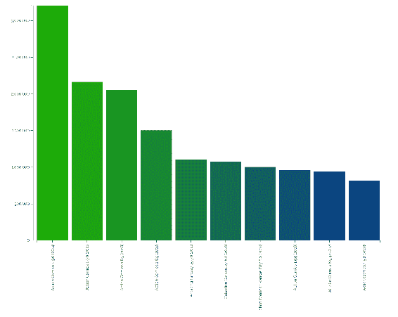
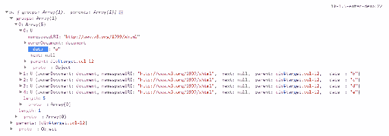
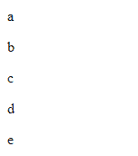
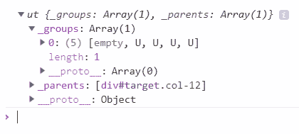
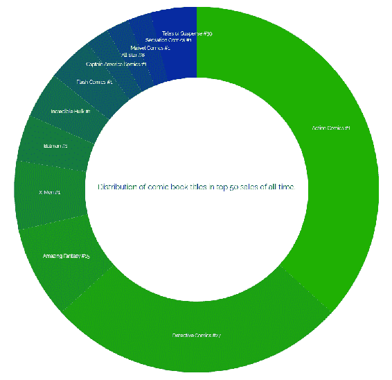
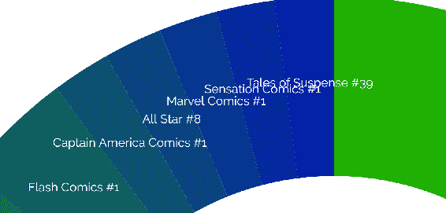
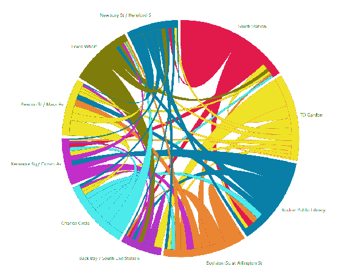
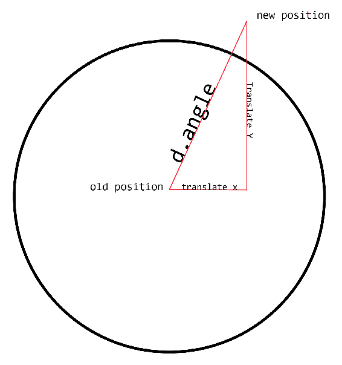
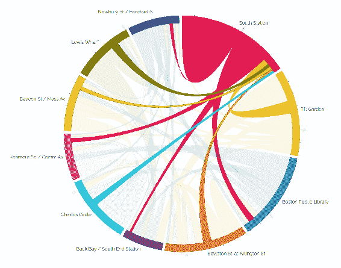

# 第十章：使用 D3.js

这一章将向您介绍**数据驱动文档**（**D3**），这是一个功能强大的可视化库，也是世界上最受欢迎的开源项目之一。有趣的是，尽管它最重要的是其数据操作功能，但 D3 只是用于直接处理 SVG 的最强大的库之一。即使在作为我们在上一章中讨论的`helper`库的上下文中，它也有许多非常有用的功能，用于处理 SVG 文档，包括许多复制`Snap.svg`和 SVG.js 提供的功能以及更多功能。

然而，D3 并不止于此。它远远超出了 SVG 创作和实用功能集，并提供了丰富的工具套件，用于数据操作和随后生成数据可视化。此外，D3 在底层使用了您在整本书中一直在使用的相同的 Web 标准，并将其与强大的 API 结合在一起，为处理 SVG 和数据提供了一个真正的游乐场。

D3 诞生于一个名为 Protovis 的早期可视化库（[`mbostock.github.io/protovis/`](http://mbostock.github.io/protovis/)），自 2010 年代初以来一直存在，并且仍由项目的原始开发人员 Mike Bostock 密切关注。该项目正在积极开发，并提供大量文档和丰富的示例供学习。

一旦你掌握了它，它也会很有趣。这是本书介绍的最后一个新技术，用于直接处理 SVG，因此很高兴能以一个高潮结束本书的这一阶段。

让我们玩得开心。

在本章中，我们将学习一些主题，包括：

+   如何安装 D3 以及如何使用库进行基本的 SVG 操作

+   如何使用 D3 使用比例尺和帮助定义图表的*x*和*y*轴来制作条形图

+   如何使用`d3-fetch`实用程序获取和解析 JSON 和 CSV 数据

+   如何使用`enter`和`exit`选择来根据数据集的更改操作 SVG DOM

+   如何使用 D3 的`arc`和`pie`函数实现甜甜圈图表

+   如何实现和弦图；一个包含多个组件的复杂可视化

# 开始使用 D3

D3 API 可能需要一些时间来适应。本章的示例将努力说明一些基本概念，并随着我们的深入展示 D3 所提供的一些最佳功能。

在做任何事情之前，您需要将 D3 引入您的页面。为此，您可以使用`npm`将其安装到您的项目文件夹中：

```xml
npm install d3
```

安装完成后，您可以使用脚本标签从您的文档中链接到压缩的 D3 源代码：

```xml
<script src="img/d3.min.js"></script>
```

如果您不想使用`npm`，也可以直接从[d3js.org](https://d3js.org/)链接到它：

```xml
<script src="img/d3.v5.js"></script>
```

此外，如果您想要本地副本，可以从 GitHub（[`github.com/d3/d3`](https://github.com/d3/d3)）克隆项目，或者从[d3js.org](https://d3js.org/)下载项目，然后以任何您喜欢的方式组织您的文件。

安装完成后，您就可以开始探索 D3 API 了。

以下示例显示了如何使用 D3 实现一个简单的条形图。在本书中，您已经看到了用于生成条形图的一些概念，但这里的区别在于 D3 会为您完成。D3 了解所有关于可视化的知识，因此它将为您生成所需的度量标准。

这个可视化将比较有史以来销量最高的十本个人漫画书。它将说明的数据如下：[`itsalljustcomics.com/all-time-record-comic-book-sales/`](https://itsalljustcomics.com/all-time-record-comic-book-sales/)

| **标题/期号/等级** | **销售日期** | **销售价格** |
| --- | --- | --- |
| 动作漫画 1 9.0 | 2014/08/24 | $3,207,852.00 |
| 动作漫画 1 9.0 | 2011/11/30 | $2,161,000.00 |
| 动作漫画 1 8.5 | 2018/06/13 | $2,052,000.00 |
| 动作漫画 1 8.5 | 2010/03/29 | $1,500,000.00 |
| 了不起的幻想 15 9.6 | 2011/03/09 | $1,100,000.00 |
| 侦探漫画 27 8.0 | 2010/02/25 | $1,075,000.00 |
| 动作漫画 1 堪萨斯城 8.0 | 2010/02/22 | $1,000,000.00 |
| 动作漫画 1 5.5 | 2016/08/04 | $956,000.00 |
| 全明星漫画 8 9.4 | 2017/08/27 | $936,223.00 |
| 动作漫画 1 5.0 | 2018/03/20 | $815,000.00 |

可视化的最终结果将如下截图所示：



本章中的所有 JavaScript 代码都是为了充分利用 ES6 功能而编写的，比如箭头函数、const 和 let。

接下来是非常简单的标记。我们再次包括 Bootstrap 来进行简单的布局任务和`Raleway`，这本书中我们选择的字体。然后我们为文本元素设置了一些基本的 CSS 样式，并设置了一个简单的容器来容纳可视化内容。之后，我们包括了三个文件：`d3.min.js`，主要的 D3 文件，`d3-fetch.min.js`，D3 的 Fetch 实用程序（[`developer.mozilla.org/en-US/docs/Web/API/Fetch_API)`](https://developer.mozilla.org/en-US/docs/Web/API/Fetch_API)），以及我们的可视化文件`bar.js`：

```xml
<!doctype html>
<html lang="en">

<head>
 <meta charset="utf-8">
 <title>Mastering SVG- D3 Bar Chart</title>
 <link rel="stylesheet" 
   href="https://maxcdn.bootstrapcdn.com/bootstrap/4.0.0/css/bootstrap.
    min.css" integrity="sha384-
    Gn5384xqQ1aoWXA+058RXPxPg6fy4IWvTNh0E263XmFcJlSAwiGgFAW/dAiS6JXm"
    crossorigin="anonymous">
 <link href="https://fonts.googleapis.com/css?family=Raleway" 
    rel="stylesheet">
 <style type="text/css">
  text {
   font-family: Raleway;
   font-size: 1em;
  }
 </style>
</head>

<body>
 <div class="container">
  <div class="row">
   <div class="col-12" id="target">

   </div>
  </div>
 </div>
 <script src="img/d3.min.js"></script>
 <script src="img/d3-fetch.min.js"></script>
 <script src="img/bar.js"></script>
</body>
</html>
```

由于这里的 JavaScript 很复杂，并引入了许多新概念，我将逐个解释每个块。如果您想一次看到整个文件，请查看下载的源代码中的完整文件。

查看`bar.js`，它包含一个在屏幕上绘制整个可视化的函数。函数的开始设置了几个常量，这些常量在整个可视化过程中都被使用：`width`、`height`、`chartHeight`（用于设置图表本身的大小与整个 SVG 的大小）和一个`margin`常量，用于确保 SVG 元素中有足够的边距来容纳整个可视化内容：

```xml
function bar() {
  const width = 960,
    height = 800,
    chartHeight = 600,
    margin = 30;
```

之后，我们开始直接使用 D3。D3 允许您访问和操作现有的 SVG 元素，并且，就像本书中 D3 演示的情况一样，生成一个经过 D3 增强的 SVG 元素并将其附加到 DOM 中。

在这种情况下，我们使用 D3 的查询选择器实用程序`d3.select`来选择`#target`元素，然后将一个新的 SVG 元素附加到其中。然后，我们使用越来越熟悉的命名函数`attr`来设置 SVG 元素的`height`和`width`。一旦 SVG 元素在文档中，我们附加一个新的`g`元素，并立即通过*x*和*y*轴上的`margin`进行平移。

链接的 D3 方法的行为类似于 jQuery 或其他使用这种模式的库，因此变量`svg`是对链中最终元素的 D3 启用引用，即新添加的`g`。任何与该变量交互的内容都将从该`g`元素的上下文开始：

```xml
 let svg = d3.select("#target").append("svg")
    .attr("width", width)
    .attr("height", height)
    .append("g")
    .attr("transform", `translate(${margin},${margin})`);
```

接下来，我们使用一些方法来设置*x*和*y*轴的比例，然后实际生成*x*和*y*轴。这就是 D3 真正发挥作用的地方。做这项工作并不是不可能的。这通常是简单的数学。只是没有人想一直编写这些函数，D3 通过一整套比例函数（[`github.com/d3/d3-scale`](https://github.com/d3/d3-scale)）使其变得容易。

`x`变量保存了`scaleBand`方法调用的返回值。`scaleBand`允许您将数值比例划分为组件*band*，我们将使用它来创建条形图的水平间距。初始调用链接到两个后续调用，每个调用都通知了我们特定可视化的 band。`range`方法调用将*x*比例尺设置为从`10`像素到计算出的上限（`width`减去两个水平边距）。`paddingInner`设置 band 的内部填充。这个属性允许我们在列之间创建一些空间。

`y`变量被创建为线性比例尺。线性比例尺是两个值之间的连续、常规比例尺。这个特定比例尺的值是通过调用`range`并将`chartHeight`和`0`作为范围值来设置的。

随后，我们使用新创建的`x`和`y`比例尺调用了两个便利方法，`axisLeft`和`axisBottom`。这些方法为比例尺渲染了可读的参考标记。创建了`xAxis`，然后将刚刚创建的`x`比例尺传递给`xAxis`，以将`xAxis`与`x`比例尺的值连接起来。*y*轴的生成方式完全相同：

```xml
 let x = d3.scaleBand()
    .range([10, (width - margin.left - margin.right)])
    .paddingInner(0.1);
  let y = d3.scaleLinear()
    .range([chartHeight, 0]);
  let xAxis = d3.axisBottom()
    .scale(x);
  let yAxis = d3.axisLeft()
    .scale(y);

```

然后，我们使用另一个比例尺方法`scaleOrdinal`来创建我们的离散数据值和相应一组颜色之间的映射：

```xml
 let color = d3.scaleOrdinal()
    .range([
      "#1fb003",
      "#1CA212",
      "#199522",
      "#178732",
      "#147A41",
      "#126C51",
      "#0F5F61",
      "#0C5170",
      "#0A4480",
      "#073690"
    ]);

```

该方法的其余部分使用了`d3-fetch`和`d3.json`中的实用程序来访问我们的数据文件，然后作为`fetch`请求的`callback`来处理数据并生成我们的可视化。

`callback`方法以对`x`和`y`轴的`domain`进行两次调用开始。

对于序数比例尺，`xAxis`和`domain`接受一个数组，并将比例尺的域设置为数组中的特定值集。在这里，我们`map`返回的`data`以创建`title`属性的集合，作为`xAxis`中使用的值。

对于线性比例尺，调用`domain`将连续比例尺限制为特定的值集。在这种情况下，我们将比例尺设置为最小值为`0`，最大值为`d3.max`的返回值，该返回值为数组中的最大值。

接下来，我们开始操作 SVG 元素来创建实际的可视化效果。

第一组链接的方法附加了一个新的 SVG 组元素`g`，并向其添加了一对类`x`和`axis`，然后将其转换为一个点(`0`, `chartHeight`)。这将该组放置在图表底部，这正是您希望*x*轴的图例所在的位置。

然后我们使用`d3.call`函数调用`xAxis`并生成我们的*x*轴。`d3.call`是一个实用方法，允许您在选择上调用一个函数，然后返回修改后的选择。这使您能够以一种启用链接的方式将一些功能封装在可重用的函数中。在这里，我们调用`xAxis`，即我们之前创建的`axisBottom`方法，以创建*x*轴 - 包括构成*x*轴的所有元素。不做其他任何操作，*x*轴现在看起来像下面这样：


如您所见，对于某些值，该布局可能是可以的，但对于我们的目的来说，它并不实用。由于我们标题的长度，我们需要调整标签以便可读。我们将它们旋转 90 度。

为此，我们在当前链上再链接了一些方法。首先，我们选择了当前选择的所有子节点中的所有`text`元素。这些都是我们刚刚用`xAxis`创建的所有`text`元素。一旦我们有了这个选择，我们就对文本元素应用了-90 度的旋转。这重新定位了文本为垂直。随后，我们调整了`dx`和`dy`属性，使文本整齐地排列。

接下来，我们附加一个新的`g`元素。

使用这些组并不是严格必要的，但它们有助于组织生成的代码以进行调试，并且使您更容易创建易于操作的选择。这就是组的作用。

这个新的`g`元素将保存*y*轴。*y*轴的创建方式与*x*轴类似 - 尽管这是一个更简单的过程，因为不需要操作文本元素。水平文本布局对*y*轴来说是可以的。在这个调用中，我们向`g`元素添加了`y`和`axis`类，然后调用`yAxis`，它生成了构成*y*轴的所有元素。

在这个`callback`函数中的最终方法链展示了在 D3 中工作时的常见模式。第一个调用是`d3.selectAll`。`selectAll`将访问与提供的选择器匹配的*所有*元素。返回的值在 D3 中称为*selection*。选择可以是 DOM 元素的列表，或者在这种情况下，是与数据中的项目匹配的占位符元素的数组。因此，在这种情况下，空是可以的，因为我们将根据接收到的数据来处理选择并向其添加元素。

我们将在下一节更深入地说明`enter`和相关方法`exit`，但简而言之，如果您的选择的元素少于数据集中的点数，则这些额外的数据点将存储在所谓的*enter 选择*中。调用`enter`允许我们进入并操作这个进入选择。在我们的情况下，我们正在向 SVG 元素添加许多`rect`元素。

这些`rect`元素中的每一个都以以下方式进行操作：

+   其`fill`是参考`color`比例的成员设置的。

+   `x`属性是基于`x`比例的成员创建的。

+   `width`是使用`x-bandwidth`计算的，这是一个根据该比例计算宽度的方法，包括任何定义的填充。

+   `y`属性是基于先前创建的`y`比例创建的

+   `height`是通过从`chartHeight`减去此数据点的*y*比例值来计算的。这实际上是将框从`y`值悬挂到图表底部。

所有这些属性组合在一起创建了可视化的核心：

```xml
  d3.json("data/top-ten.json").then((data) => {
    x.domain(data.map((d) => {
      return d.title;
    }));
    y.domain([0, d3.max(data,(d) => {
      return d.price;
    })]);
    svg.append("g")
      .attr("class", "x axis")
      .attr("transform", `translate(0, ${chartHeight})`)
      .call(xAxis)
      .selectAll("text")
      .style("text-anchor", "end")
      .attr("transform", "rotate(-90)")
      .attr("dx", -10)
      .attr("dy", -5);
    svg.append("g")
      .attr("class", "y axis")
      .call(yAxis);
    svg.selectAll("rect")
      .data(data)
      .enter().append("rect")
      .style("fill", (d) => {
        return color(d.price);
      })
      .attr("x", (d) => {
        return x(d.title); })
      .attr("width", () => {
        return x.bandwidth();
      })
      .attr("y", (d) => {
        return y(d.price);
      })
      .attr("height", (d) => {
        return chartHeight - y(d.price);
      });
  });
}
bar();
```

文件的最后一行只是调用`bar()`来创建可视化。

# D3 的 enter 和 exit

正如我在上一节中提到的，我想简要地看一下`enter`和相关方法`exit`。这些方法对于处理动态数据集非常重要。使用这些方法，您可以获取任意选择，将其与数据混合，然后使用 D3 的工具对其进行操作，以创建可视化效果。

在这一部分，您将看到三个例子。第一个示例展示了使用`enter`的示例，说明了对完全空选择调用该方法。第二个示例说明了在具有现有元素的选择上调用`enter`。第三个示例说明了`exit`的工作原理。

在这个第一个示例中，我们选择`#target`元素，然后使用`p`作为参数调用`selectAll`。由于`#target`元素中没有段落，这是一个空选择。在其上调用`data`将空选择绑定到我们的数据。在绑定的选择上调用`enter`允许我们根据每个数据点来操作我们的选择。

如果此时记录`d3.select("#target").selectAll("p").data(data).enter()`的返回值，它将看起来像以下的屏幕截图，显示一个包含原始数据的五个元素的数组，存储为内部的`__data__`属性：



接下来，我们简单地为每个数据点在文档中`append`一个段落，并使用`text`方法将代表数据的文本节点插入文档中：

```xml
<!doctype html>
<html lang="en">

<head>
  <meta charset="utf-8">
  <title>Mastering SVG- D3 Enter</title>
</head>

<body>
  <div class="container">
    <div class="row">
      <div class="col-12" id="target">

      </div>
    </div>
  </div>
  <script src="img/d3.min.js"></script>
  <script src="img/d3-fetch.min.js"></script>
  <script>
    function enter() {
      const data = ["a", "b", "c", "d", "e"];
      d3.select("#target")
        .selectAll("p")
        .data(data)
        .enter().append("p")
        .text((d) => d);
    }
    enter();

  </script>
</body>

</html>
```

在浏览器中运行代码会产生以下输出：



下一个示例类似，只是在`#target div`中有一个现有的段落元素。由于存在`p`元素，在选择上调用`d3.select("#target").selectAll("p").data(data).enter()`的结果如下。如您所见，`_groups`数组具有相同的五个成员，但第一个条目，与`selection`中的现有成员对应的条目为空。这是因为它不是进入选择的一部分（因为它对应于*现有*元素）：



这个示例的其他内容与使用`enter`的上一个示例相同：

```xml
<!doctype html>
<html lang="en">

<head>
  <meta charset="utf-8">
  <title>Mastering SVG- D3 Enter with existing content</title>
</head>

<body>
  <div class="container">
    <div class="row">
      <div class="col-12" id="target">
        <p>This is an existing paragraph</p>

      </div>
    </div>
  </div>
  <script src="img/d3.min.js"></script>
  <script src="img/d3-fetch.min.js"></script>
  <script>
    function enter() {
      const data = ["a", "b", "c", "d", "e"];
      d3.select("#target")
        .selectAll("p")
        .data(data)
        .enter()
        .append("p")
        .text((d) => d);
    }
    enter();

  </script>
</body>

</html>
```

由于在这个示例中只更新了输入选择，因此在浏览器中运行上述代码会产生以下输出：


要更新*整个*选择，您只需要在更新输入选择之前操纵原始选择：

```xml
      const data = ["a", "b", "c", "d", "e"];
      d3.select("#target")
        .selectAll("p")
        .data(data)
        .text((d) => d)
        .enter()
        .append("p")
        .text((d) => d);
```

`exit`选择允许您清理不再与数据关联的元素。以下示例显示了这是如何工作的。

`render`函数最初通过一些我们已经看到的模式。该函数在`#target div`的子元素`p`上调用`selectAll`，加载数据，进入输入选择，并附加一系列带有正确数据的段落元素。

接下来我们重复这个过程，而不是调用`enter`，我们调用`exit`，然后立即调用`remove`。`exit`选择返回选择中不对应数据点的任何元素。`remove`从文档中删除这些元素。第一次运行时，没有元素被删除，因为数据刚刚被加载。选择中的所有元素都用正确的数据填充。

有趣的事情发生在`setTimeout`。在那个`callback`函数中，如果数据数组仍然有成员，就会调用`data.pop()`。`pop`从数组中删除最后一个元素，然后在 1 秒后递归调用`render`。当函数再次运行并且我们到达退出选择时，我们调用`exit.remove`，数据和选择之间存在不匹配。第一次递归调用时，有五个段落，但只有四个数据点。因为第五个段落没有与之关联的数据点，所以它从文档中删除。

这个过程重复，直到没有数据点或段落剩下，递归调用停止：

```xml
<!doctype html>
<html lang="en">

<head>
  <meta charset="utf-8">
  <title>Mastering SVG- D3 Exit</title>
</head>

<body>
  <div class="container">
    <div class="row">
      <div class="col-12" id="target">

      </div>
    </div>
  </div>
  <script src="img/d3.min.js"></script>
  <script>
      const data = ["a", "b", "c", "d", "e"];
      function render(){
        d3.select("#target")
          .selectAll("p")
          .data(data)
          .enter()
          .append("p")
          .text((d) => d );
        d3.select("#target")
          .selectAll("p")
          .data(data)
          .exit()
          .remove();
        if (data.length) {
          setTimeout(()=>{
            data.pop();
            render();
          }
          ,1000);
        }
      }
    render();
  </script>
</body>

</html>
```

希望这些简化的例子足以说明这种非常强大的模式如何帮助处理数据集。

现在我们已经看了这两种方法，让我们回到一些更有趣的东西，用一个新的，稍微更复杂的可视化。

# 使用 D3 实现甜甜圈图

下一个示例说明了另一种基本的数据可视化：在这种情况下，是一个甜甜圈图。比饼图稍微复杂一些，这个可视化展示了 D3 的一些新特性。完成后，可视化将如下截图所示。

它代表了个别漫画书（按标题和期号引用）在有史以来的前 50 本漫画书销售中的分布（公开销售，在撰写时）。像这样的列表中有一些主导的漫画书，这张图表将显示哪些最主导：



数据看起来像下面的 CSV：

```xml
title,numbers
"Action Comics #1",18
"All Star #8", 1
"Amazing Fantasy #15",4
"Batman #1",2
"Captain America Comics #1", 1
"Detective Comics #27",13
"Flash Comics #1", 2
"Incredible Hulk #1", 2
"Marvel Comics #1", 1
"Sensation Comics #1", 1
"Tales of Suspense #39", 1
"X-Men #1", 3
```

HTML 文件非常简单。它包括了`Raleway`，Bootstrap，`d3-fetch`和 D3 作为依赖项。它包括了我们在本书中几个示例中一直在工作的相同标记，然后包括我们的`donut.js`文件，这是一切有趣的地方：

```xml
<!doctype html>
<html lang="en">

<head>
    <meta charset="utf-8">
    <title>Mastering SVG- D3 Chord Diagram</title>
    <link rel="stylesheet" 
href="https://maxcdn.bootstrapcdn.com/bootstrap/4.0.0/css/bootstrap.min.css" integrity="sha384-Gn5384xqQ1aoWXA+058RXPxPg6fy4IWvTNh0E263XmFcJlSAwiGgFAW/dAiS6JXm"
        crossorigin="anonymous">
    <link href="https://fonts.googleapis.com/css?family=Raleway" 
     rel="stylesheet">
    <style type="text/css">
        text {
            font-family: Raleway;
            font-size: .8em;
            text-anchor: middle;
            fill: #fff;
        }
        text.legend{
            font-size: 1.25em;
            fill: #000;
        }
    </style>
</head>

<body>
    <div class="container">
        <div class="row">
            <div class="col-12" id="target">

            </div>
        </div>
    </div>

    <script src="img/d3.min.js"></script>
    <script src="img/d3-fetch.min.js"></script>
    <script src="img/donut.js"></script>

</body>

</html>
```

看着`donut.js`，有很多事情要做，所以我们将再次逐个部分地查看文件。如果您想看整个文件，请查看完整的源代码。

文件从设置可视化的`height`，`width`和`radius`的几个常数开始。然后我们创建一个颜色比例尺，它经过 13 种蓝色和绿色的色调：

```xml
const width = 1000,
  height = 1000,
  radius = Math.min(width, height) / 2;

const color = d3.scaleOrdinal()
  .domain(d3.range(13))
  .range([
    "#1fb003",
    "#1CA212",
    "#199522",
    "#178732",
    "#147A41",
    "#126C51",
    "#0F5F61",
    "#0C5170",
    "#0A4480",
    "#073690",
    "#05299F",
    "#021BAF",
    "#000EBF"
  ]);
```

接下来的两个方法调用只是为了为以后的可视化设置。在这一点上，我们没有任何数据可以使用，但是当数据到达时，我们仍然可以创建一些加载的 D3 工具来处理数据。第一个常数`arc`将允许我们用`outerRadius`绘制弧，该弧接近 SVG 元素的边缘，并且`innerRadius`在`outerRadius`内 200 像素。这创建了一个 190 像素的环。

接下来我们调用`d3.ie`，这是一个接收数据并返回代表饼图或甜甜圈图的正确比例切片的方法。我们还没有数据，但是我们设置了该方法，以便在创建`arc`时使用数据对象的`numbers`属性：

```xml
const arc = d3.arc()
  .outerRadius(radius - 10)
  .innerRadius(radius - 200);

const pie = d3.pie()
  .value((d) => {
    return d.numbers;
  });
```

接下来我们开始实现一些 SVG。第一个调用到这个时候应该对你来说是常见的。我们调用`d3.select`来获取`#target`元素，然后将 SVG 元素附加到 DOM 中。然后我们使用`attr`来设置`height`和`width`，然后在 SVG 文档中附加一个组`g`元素。然后将该`g`转换为 SVG 元素的中心，通过将其平移半个宽度和半个高度。

接下来，我们在包含可视化的`g`元素中附加一个新的`text`元素，用于小传说：

```xml
let svg = d3.select("#target").append("svg")
  .attr("width", width)
  .attr("height", height)
  .append("g")
  .attr("transform", `translate(${width / 2},${height / 2})`);

svg.append("text")
  .text("Distribution of comic book titles in top 50 sales of all time.")
  .attr("class","legend");

```

现在我们已经完成了所有这些设置，是时候处理一些数据并绘制可视化了。我们首先使用`d3-fetch`中的另一个方法`d3.csv`，来获取包含我们的数据并在 D3 解析后处理它的 CSV 文件。

在`callback`内部，有一个现在熟悉的 D3 模式。首先，调用`svg.selectAll("arc")`，这时返回一个空选择。然后我们调用`data`，传入`pie(data)`。`pie`接收数据并返回我们用于甜甜圈图的起始和结束角度。接下来我们进入 enter 选择，并为每个选择的成员附加`g`元素。我们还没有画任何东西，但是我们已经为每个数据点设置了组，并且已经计算了应用于数据集的起始和结束角度。

下一节说明了与 D3 一起工作有多么美妙。

此时，我们已经得到了通过调用`pie`生成的角度，附加到许多空的`g`元素上。在下一个调用中，我们附加了一个`path`元素，并且通过调用先前创建的`arc`方法，将`d`属性填充为绘制可视化所需的完整`arc`。就是这么简单。

现在，对于图表本身，唯一剩下的就是通过从之前创建的颜色比例尺返回一个值来填充`arc`的颜色。这是基于数据的索引进行选择。数据根据其在漫画书标题中的排名进行排序。这样在运行此可视化时，我们看到了漂亮的渐变。如果你停在这里，你实际上已经有了一个可视化。它没有与之相关的任何文本，但你已经有了一个看起来不错的甜甜圈图。这就是 D3 的威力。

也就是说，我们应该添加一些标签，让我们看看它是如何工作的。初始模式是你应该开始熟悉的。我们调用`selectAll(".label")`，加载数据（通过对`pie`的另一个调用来操作，以获得相同的起始和结束角度），然后在 enter 选择中操作它。在 enter 选择中，我们附加一个`text`元素，然后采取几个步骤将文本放置在整个可视化中的有用位置。

第一步是使用`arc.centroid`方法将文本元素平移到`arc`的中心。同样，这是 D3 有多么有用的一个很好的例子。一个小小的调用就可以让你访问一个复杂形状的几何中心。这对大多数文本元素都适用。我们快要完成了。

我们只需要调整两种特定情况下的文本。没有下一个调用，最后几个元素的可视化中文本会以不美观的方式重叠，如下面的截图所示：



要调整这两个重叠元素的位置，我们需要找出它们是哪两个。我们知道它们是最后两个，并且它们会靠近圆圈的末端。这里的角度是用弧度来测量的（360 度是 2PI 或大约 6.28 弧度）。使用粗略的简写，一个切片（0.125 弧度大约代表我们可视化中的一个切片），我们从整个圆圈向后测试最后两个切片，并使用`dy`属性稍微调整它们。第一个通过`.6em`进行调整。接下来，最后一个文本元素通过`1.5em`进行调整。这意味着每个标签都清晰可读。

最终的调用实际上通过调用`text`并将数据的`title`作为参数将文本附加到元素中：

```xml
d3.csv("data/top-fifty-comics-data.csv").then((data) => {
  let g = svg.selectAll(".arc")
    .data(pie(data))
    .enter()
    .append("g");

  g.append("path")
    .attr("d", arc)
    .style("fill", (d) => {
      return color(d.index);
    });

  svg.selectAll(".label")
    .data(pie(data))
    .enter()
    .append("text")
    .attr("class", "text")
    .attr("transform", (d) => {
      return `translate(${arc.centroid(d)})`;
    })
    .attr("dy", (d) => {
      if (d.startAngle > 6.0 && d.startAngle < 6.125) {
        return "-.6em";
      } else if (d.startAngle > 6.125) {
        return "-1.5em";
      }
    })
    .text((d) => {
      return d.data.title;
    });

});
```

现在我们已经完成了两个标准图表，是时候做一个更有趣的弦图了。这个最终的例子将展示 D3 的更多特性。这会很有趣。

# 在 D3 中实现弦图

这个最终的可视化在数据和编码方面都更加复杂。该可视化基于几年前发布的数据，作为 Hubway 数据可视化挑战的一部分（[`hubwaydatachallenge.org/`](http://hubwaydatachallenge.org/)）。这是一个庞大的数据集，代表了波士顿的 Hubway 共享单车项目（现在称为 Blue Bikes）上的每一次行程，包括出发和到达站。这个可视化展示了波士顿十个最受欢迎站点之间的关系，说明了这些站点之间发生的行程数量。这很有趣，可以看到主要枢纽站之间的潜在公共交通网络漏洞（很多人在主要枢纽站之间出行，比如北站和南站），或者可能被游客用来观光波士顿（很多南站的行程返回到南站）。

最终的可视化看起来是这样的。每个`arc`代表一个出发站，两个站点之间的带状物显示了两个站点之间行程的相对权重。当它离开`arc`时的宽度代表行程的数量。`arc`的颜色由生成两个站点之间更多行程的站点拥有：



这个可视化的 HTML，就像其他 D3 示例一样非常简单。我们在头部有`Raleway`和 Bootstrap。然后顶部有一段 CSS 来添加一些文本样式，以及一个小的定义来为圆圈外缘显示刻度数字的小刻度添加描边颜色。

另外，有一个包含可视化描述的`H1`。然后我们只包含主要的 D3 文件和我们的可视化文件。所有重要的事情都发生在`chord.js`中：

```xml
<!doctype html>
<html lang="en">

<head>
    <meta charset="utf-8">
    <title>Mastering SVG- D3 Chord Diagram</title>
    <link rel="stylesheet" 
href="https://maxcdn.bootstrapcdn.com/bootstrap/4.0.0/css/bootstrap.min.css" integrity="sha384-Gn5384xqQ1aoWXA+058RXPxPg6fy4IWvTNh0E263XmFcJlSAwiGgFAW/dAiS6JXm"
        crossorigin="anonymous">
    <link href="https://fonts.googleapis.com/css?family=Raleway" rel="stylesheet">
    <style type="text/css">
    h1 {
        font-family: Raleway;
    }
    text {
        font-family: Raleway;
        font-size: 1em;
    }
    text.tick {
        font-size: .8em;
        fill: #999;
    }
    .group-tick line {
        stroke: #999;
    }
    </style>
</head>

<body>
    <div class="container-fluid">
        <div class="row">
            <div class="col-12" id="target">
                <h1>Trip connections between the top 10 Hubway 
                    departure stations. Data from the
                    <a href="http://hubwaydatachallenge.org/">Hubway 
                     Data Visualization Challenge</a>
                </h1>

            </div>
        </div>
    </div>

    <script src="img/d3.min.js"></script>
    <script src="img/chord.js"></script>

</body>

</html>
```

让我们开始通过查看数据来看`chord.js`。文件顶部有整个可视化的硬编码数据。这是一个更大数据集的精简版本，在这个可视化的原始版本中，有很多代码用于创建特定格式的数据。生成这些数据的代码可以在 GitHub 上找到，以及本书的其他源代码。

弦图需要一个*方阵*。这是一个数组的数组，其中数组的成员总数与子数组的成员总数相匹配，并且你可以在它们之间进行映射。在我们的例子中，父数组代表一个*出发*站，子数组的值代表到达每个*到达*站的总行程数。子数组的索引与父数组的索引相匹配。一个出发站也可以是到达站。

`names` `const` 包含每个出发站的名称，与`matrix`数组中出发站的索引相匹配：

```xml
function drawChord() {
  const names = [
    "South Station",
    "TD Garden",
    "Boston Public Library",
    "Boylston St. at Arlington St",
    "Back Bay / South End Station",
    "Charles Circle",
    "Kenmore Sq / Comm Av",
    "Beacon St / Mass Av",
    "Lewis Wharf",
    "Newbury St / Hereford S"
  ];
  const matrix = [
    [2689, 508, 1170, 189, 1007, 187, 745, 248, 263, 2311],
    [1064, 121, 830, 323, 2473, 393, 453, 312, 533, 599],
    [506, 296, 813, 530, 988, 540, 1936, 578, 747, 268],
    [706, 311, 1568, 526, 1273, 371, 618, 694, 481, 227],
    [178, 701, 277, 176, 663, 227, 379, 284, 330, 111],
    [550, 270, 548, 445, 196, 769, 868, 317, 1477, 195],
    [344, 141, 468, 955, 172, 346, 502, 388, 415, 97],
    [333, 207, 455, 545, 196, 1322, 618, 254, 659, 62],
    [655, 120, 301, 90, 2368, 108, 226, 99, 229, 875],
    [270, 221, 625, 436, 239, 278, 548, 1158, 320, 90]
  ];
```

现在我们已经整理好了数据，让我们开始看看如何生成实际的可视化。前五个代码块都是用于设置。这是你通常使用 D3 做的事情，而这个比其他的更复杂，所以需要更多的设置。

第一个块只涉及对可视化所需的各种度量的常量的创建。`width`和`height`对我们所有的 D3 示例都是常见的。`radius`是一个计算出的值，表示一个圆的完整半径，该圆可以适应由高度和宽度创建的正方形。`padding`常量用于计算可视化实际圆的`outerRadius`。然后我们使用`outerRadius`来计算`innerRadius`。

接下来，我们将直接开始使用 D3。第一个调用是`d3.chord`，其结果存储在一个常量`chord`中。`chord`是一个加载方法，将使用我们的设置生成一个弦图。第一个设置`padAngle`是一个`radians`参数，表示`arc`之间的间距。对于这样一个复杂的可视化，`arc`之间有一点空间是很好的，以便为各个部分带来一些清晰度。第二个设置指示我们是否要对子组进行排序。在我们的情况下，我们需要，所以我们传入`d3.descending`作为预定义的排序。

下一个变量`arc`加载了一个`d3.arc`的实例，带有我们计算出的`innerRadius`和`outerRadius`，就像甜甜圈图表一样。一旦你开始把这些东西看作是可以组合在一起的组件，可能性就会打开。

接下来，我们将使用 D3 `ribbon`创建一个实例，`innerRadius`是唯一的配置设置，作为参数传递给`radius`方法。这个方法与`chord`方法一起使用，创建可视化的核心，连接连接的丝带的两端，在我们的例子中是出发和到达站。

最后，我们创建一个`color`比例尺，将车站映射到一组彩虹颜色：

```xml
const width = 1200,
    height = 1200,
    radius = Math.min(width, height) / 2,
    padding = 200,
    outerRadius = radius - padding,
    innerRadius = outerRadius - 25;

  const chord = d3.chord()
    .padAngle(0.025)
    .sortSubgroups(d3.descending);

  const arc = d3.arc()
    .innerRadius(innerRadius)
    .outerRadius(outerRadius);

  const ribbon = d3.ribbon()
    .radius(innerRadius);

  const color = d3.scaleOrdinal()
    .domain(d3.range(9))
    .range([
      "#e6194b",
      "#ffe119",
      "#0082c8",
      "#f58231",
      "#911eb4",
      "#46f0f0",
      "#f032e6",
      "#d2f53c",
      "#808000",
      "#008080"
    ]);
```

现在我们已经设置好了，是时候开始在屏幕上进行可视化工作了。第一个块在这一点上应该非常熟悉。在其中，我们选择`#target`元素，附加一个 SVG 元素，然后设置它的`width`和`height`。

下一个块也应该大部分是熟悉的。在其中，我们向 SVG 元素添加一个`g`组，然后将其平移到屏幕的中心。这里有趣的部分是对`datum`的调用，这是一个非常类似于`data`的方法，除了它将数据传播到整个树中。在这里，我们传入我们的`chord`实例，以及我们的`matrix`，`chord`方法返回我们数据可视化的构建块。

这一部分的最后一个块创建了将容纳我们的弧段、路径和组刻度的组。我们进入`enter`选择，并为`matrix`的每个项目附加一个子`g`元素：

```xml
  const svg = d3.select("#target")
    .append("svg")
    .attr("height", height)
    .attr("width", width);

  const g = svg.append("g")
    .attr("transform", `translate(${width / 2},${height / 2})`)
    .datum(chord(matrix));

  const group = g.append("g")
    .attr("class", "groups")
    .selectAll("g")
    .data((chords) => chords.groups)
    .enter()
    .append("g");
```

在这一点上，我们已经完成了*所有*的设置。现在是时候真正地在屏幕上绘制一些元素了。

添加到可视化中的第一个部分是`arc`。这个模式对你来说应该很熟悉，来自甜甜圈图表。这完全相同的模式；只是这里它是更大的可视化的一部分。

`group`变量已经是一个`Enter`选择的一部分，因此这一部分和我们添加图例的下一部分已经在完整的数据集上运行。

首先我们附加一个`path`，并使用我们对`arc`的调用结果设置`path`的`d`属性。这返回了切片的起始和结束角度。然后我们给它一个`fill`和一个`stroke`。`stroke`提供了 D3 的另一个实用工具的首次亮相。D3.color ([`github.com/d3/d3-color`](https://github.com/d3/d3-color))提供了几种选项来处理颜色。在这里，我们使用`d3.color.darker`来返回所选“弧”的略暗色，以便给它足够的对比度来显示边缘。最后，我们添加了两个事件处理程序，允许用户在鼠标悬停在该站点的弧上时淡化所有其他站点的弧和带。这将使他们能够检查特定站点的连接，而不会受到其他站点的干扰。我们稍后会详细讨论这个功能。

接下来我们添加了带。这与“弧”非常相似。我们从核心`g`组开始，附加一个新的带组，添加一个带的类。然后我们调用`selectAll("path")`来进行选择，调用`data`来应用弦数据，然后我们进入`enter`选择来构建带。对于数据集的每个成员，我们附加一个新的`path`，并使用`ribbon`的调用设置路径的`d`属性。`ribbon`的返回值创建了一个连接“弧”一侧的两个角度与“弧”另一侧的两个角度的路径。之后，我们以与弧相同的方式设置`stroke`和`fill`，以便一切匹配：

```xml
  group.append("path")
    .attr("d", arc)
    .style("fill", (d) => color(d.index))
    .style("stroke", (d) => d3.color(color(d.index)).darker())
    .on("mouseover", fade(.1))
    .on("mouseout", fade(1));

  g.append("g")
    .attr("class", "ribbons")
    .selectAll("path")
    .data((chords) => chords)
    .enter()
    .append("path")
    .attr("d", ribbon)
    .style("fill", (d) => color(d.source.index))
        .style("stroke", (d) => {
      return d3.color(color(d.source.index)).darker();
    });
```

此时，可视化已经绘制到屏幕上。不过我们仍然可以做得更好，所以让我们来做吧。

接下来的部分为每个站点添加了小标签。与之前一样，我们已经处于“enter”选择中，因此我们已经在正确的数据集上操作。这个链中的第一个调用是`each`，它允许我们在选择的每个成员上运行一个函数。传入的`callback`函数添加了一个新的属性到数据集，即`angle`。`angle`通过将“弧”的起始角度和结束角度相加并除以 2 来计算得到，得到“弧”的中间部分。我们将使用该角度来在下一个调用中放置标签。

我们用甜甜圈图表做的标签放在了“弧”上。这在我们设置的弦图表和我们拥有的长文本标签上实际上看起来并不那么好，所以我们想把标签移到圆圈外。我们用一些三角学来实现这一点。

以下图表显示了这是如何工作的。所有这些`text`元素都在 SVG 元素的中心的一个组中。我们要将它们移动到它们的新位置，即圆圈外与它们标记的弧的中间对齐。为此，我们取我们计算的`d.angle`属性，并将其用作直角三角形的斜边（最长边）。一旦我们得到了那个角度，我们就可以计算正弦（对边长与斜边长的比值）和余弦（邻边长与斜边长的比值）。一旦我们有了这些比值，我们只需将它们乘以`outerRadius`（再加上一些额外像素以给它一些空间）就可以得到三角形的邻边和对边的长度。我们将这些值用作将文本元素转换到它们的新位置所需的*x*和*y*。

这项技术将随时派上用场：



接下来的部分根据`arc`上文本元素的位置调整`text-anchor`属性。如果它大于一半（圆上有两个 PI 弧度，所以`Math.PI`相当于圆的一半），那么我们需要将`text-anchor`设置为`end`，以便与圆右侧的标签平衡。如果我们不以这种方式调整 text-anchor，可视化的左侧文本元素将与该侧的弧重叠。

最后，我们附加文本本身：

```xml
group.append("text")
    .each((d) => d.angle = (d.startAngle + d.endAngle) / 2)
    .attr("text-anchor", (d) => {
      if (d.angle > Math.PI) {
        return "end";
      }
    })
    .attr("transform", (d) => {
      const y = Math.sin(d.angle) * (outerRadius + 10),
        x = Math.cos(d.angle) * (outerRadius + 20);
      return `translate(${y},${(-x)})`;
    })
    .text((d) => {
      return names[d.index];
    });
```

我们要为这个可视化添加的最后的 SVG 元素是在外边缘添加组刻度和刻度标签。这些将允许我们以友好的方式指示可视化的规模，以千为单位。

我们首先创建一个新的常量`groupTick`，它基于对`groupTicks`方法的调用返回的数据设置了一个新的进入选择。`groupTick`接收链中的现有数据，并返回一个新的操纵后的数据集，代表每 1000 个单位的新刻度。这些新的`groupTick`数据条目具有一个新的角度，对应于刻度在弧上的正确位置，并引用原始数据的`value`。一旦`groupTick`数据返回，我们进入选择，附加一个新的组并添加一个类`group-tick`。然后我们将元素旋转以在外边缘形成视觉圆圈，并将其平移到`outerRadius`的一个点。

一旦完成，我们在每个刻度处添加一个六像素长的灰色“线”。记住，`groupTick`仍然在这个新链中的一个进入选择中，所以即使我们打破了之前的链，我们仍然可以操作每个数据点。

最后，我们再次进入选择并`filter`数据，防止空数据，然后测试值是否可以被 5000 整除，使用模数（或余数）运算符（[`developer.mozilla.org/en-US/docs/Web/JavaScript/Reference/Operators/Arithmetic_Operators#Remainder_()`](https://developer.mozilla.org/en-US/docs/Web/JavaScript/Reference/Operators/Arithmetic_Operators#Remainder_())）。如果可以被 5000 整除，我们需要添加一些文本以指示我们已经为该站点完成了 5000 次行程。这样做的步骤如下。调整`x`属性，将其移动到`outerRadius`之外。调整`dy`属性，将文本元素向上移动一点，以更好地与刻度线对齐。

如果角度超过圆的一半，则转换`text`元素。再次对`Math.PI`进行测试，然后，如果超过一半，我们将文本旋转 180 度，然后将其平移 16 像素，以使其完美地贴合`outerRadius`的边缘。我们还对`text`元素是否超过圆的一半进行相同的测试，如果是，我们将`text-anchor`属性更改为将文本的右边缘固定在圆的边缘。最后，我们向`text`元素添加一个类`ticks`，并使用`d3.formatPrefix`附加实际文本。`d3.formatPrefix`根据提供的格式化参数格式化数字，使其更友好。

在这种情况下，我们希望使用 SI（国际单位制）前缀（[`en.wikipedia.org/wiki/Metric_prefix#List_of_SI_prefixes`](https://en.wikipedia.org/wiki/Metric_prefix#List_of_SI_prefixes)）格式化数字，这将把`5000`转换为`5k`：

```xml
  const groupTick = group.selectAll(".group-tick")
    .data((d) => groupTicks(d, 1000))
    .enter()
    .append("g")
    .attr("class", "group-tick")
    .attr("transform", (d) => {
      return `rotate(${(d.angle * 180 / Math.PI - 90)}) translate(${outerRadius},0)`;
    });

  groupTick.append("line")
    .attr("x2", 6);

  groupTick
    .filter((d) => d.value && !(d.value % 5000))
    .append("text")
    .attr("x", 8)
    .attr("dy", ".35em")
    .attr("transform", (d) => {
      if (d.angle > Math.PI) {
        return "rotate(180) translate(-16)";
      }
    })
    .style("text-anchor", (d) => {
      if (d.angle > Math.PI) {
        return "end";
      }
    })
    .attr("class", "tick")
    .text((d) => d3.formatPrefix(",.0", 1000)(d.value));

  function groupTicks(d, step) {
    let k = (d.endAngle - d.startAngle) / d.value;
    return d3.range(0, d.value, step).map((value) => {
      return {
        value: value,
        angle: value * k + d.startAngle
      };
    });
  }
```

最后的代码是之前提到的`fade`方法。这个函数选择与 CSS 选择器匹配的所有元素。`.ribbons path`过滤掉与当前选择相关的任何元素，并将它们的`opacity`设置为提供的`opacity`参数：

```xml
  function fade(opacity) {
    return function(g, i) {
      svg.selectAll(".ribbons path")
        .filter((d)=> {
          return d.source.index !== i && d.target.index !== i;
        })
        .transition()
        .style("opacity", opacity);
    };
  }
```

效果如下截图所示：



有了这个，弦图就完成了。这并不是你在 D3 中见过的最复杂的可视化，但它还是相当不错的。连同甜甜圈图和条形图，这三种图表结合起来展示了 D3 的许多重要特性。

# 总结

本章向您介绍了 D3 的世界。尽管本章深入，但只是触及了 D3 所提供的一部分。希望您能将在这里学到的知识继续在未来的几个月和几年中进行实验。这是一个值得掌握的有益工具。

在本书中，我们只剩下一个简短的章节，我们将讨论一些优化 SVG 在网络上提供的方法。这是一个至关重要的领域，至少应该有一些了解，特别是如果您在您的网站或应用程序中使用了大量的 SVG。
