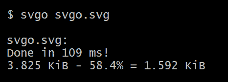
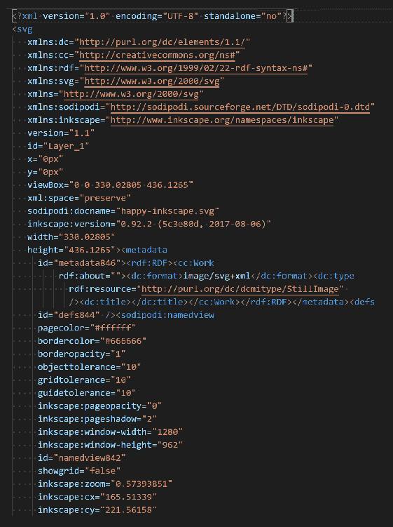
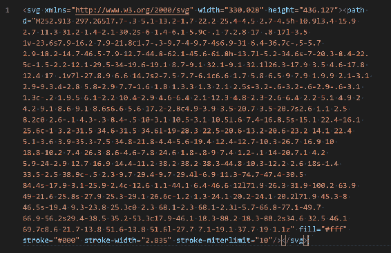
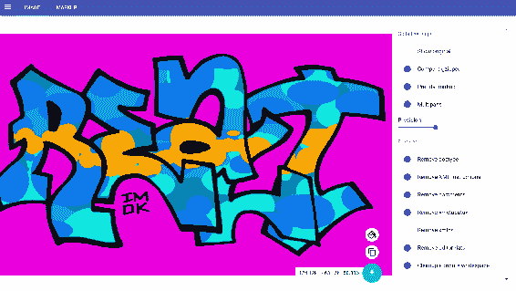
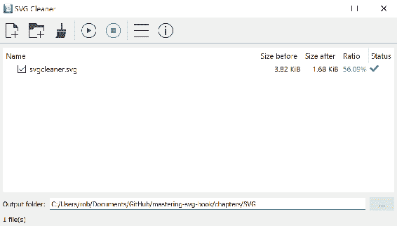

# 第十一章：优化 SVG 的工具

现在您已经在本书中学习了关于 SVG 的一切，从纯 SVG 标记的基础知识到过去几章中您所做的基于动态 JavaScript 的 SVG 工作，您已经准备好充分利用 SVG 所提供的一切。

我们应该看一下 SVG 的最后一个方面，即确保您提供给用户的工作以最佳方式呈现。SVG 应该针对性能进行优化，无论是在传输过程中的性能还是在复杂性方面。保持 SVG 文件尽可能精简并有效地提供它们将为用户带来更好的体验。

本章将作为一个高层次的介绍，向您展示优化 SVG 图像的许多方法。接下来的内容有些是纯粹与性能相关的工程。其他则是纯 SVG 工具。

本章中，您将了解以下内容：

+   在三种流行的服务器平台（IIS、Apache 和 nginx）上对服务器上的 SVG 进行压缩

+   SVGO 及其相关工具

+   svgcleaner，SVGO 的替代方案，提供无损优化

# 提供压缩的 SVG

在处理 SVG 时，最直接的性能增强之一就是在提供文件时对`gzip`文件进行压缩。虽然文本文件通常在提供给浏览器时受益于被 gzipped，但 SVG 是一个特别重要的目标，因为 SVG 图像的使用方式（通常用于核心界面）以及一些文件的潜在大小。您希望您的图像加载速度快，SVG 也不例外。

根据您的平台，这可能只需添加几行代码或在对话框中勾选一个框。接下来的几节将向您展示如何在三种常见的 Web 服务器上实现此操作。

# 在 Apache 上对 SVG 进行 gzip 压缩

放置以下代码的位置取决于您的 Apache 实例设置以及您对服务器的访问权限。大多数共享主机的用户将在他们的`.htaccess`文件中执行此操作。`.htaccess`是服务器根目录中的一个特殊文件，允许您在不必访问主配置文件（`httpd.conf`）的情况下配置 Apache 行为。假设您的服务器允许您访问此功能（一些主机不允许您打开压缩，因为它会使用更多的服务器资源），则将文本内容进行 gzip 压缩就像在您的`.htaccess`文件中添加以下内容一样简单。示例代码来自 H5BP Apache 服务器配置项目（[`github.com/h5bp/server-configs-apache/blob/master/dist/.htaccess#L795`](https://github.com/h5bp/server-configs-apache/blob/master/dist/.htaccess#L795)）。有三个部分：

+   第一个修复了代理服务器搞乱请求标头导致资源无法被提供为 gzipped 的问题（这不仅修复了 SVG）

+   第二个实际上告诉 Apache 压缩列出的 MIME 类型的文件（这里进行了缩写；通常会列出几十种不同的 MIME 类型）

+   第三个确保以压缩格式`.svgz`压缩并保存的 SVG 文件能够正确提供：

```xml
# ######################################################################
# # WEB PERFORMANCE #
# ######################################################################

# ----------------------------------------------------------------------
# | Compression |
# ----------------------------------------------------------------------

<IfModule mod_deflate.c>

    # Force compression for mangled `Accept-Encoding` request headers
    #
    # https://developer.mozilla.org/en-US/docs/Web/HTTP/Headers/Accept-Encoding
    # https://calendar.perfplanet.com/2010/pushing-beyond-gzipping/

    <IfModule mod_setenvif.c>
        <IfModule mod_headers.c>
            SetEnvIfNoCase ^(Accept-EncodXng|X-cept-Encoding|X{15}|~{15}|-{15})$ ^((gzip|deflate)\s*,?\s*)+|[X~-]{4,13}$ HAVE_Accept-Encoding
            RequestHeader append Accept-Encoding "gzip,deflate" env=HAVE_Accept-Encoding
        </IfModule>
    </IfModule>

    # - - - - - - - - - - - - - - - - - - - - - - - - - - - - - - - - -

    # Compress all output labeled with one of the following media types.
    #
    # https://httpd.apache.org/docs/current/mod/mod_filter.html#addoutputfilterbytype

    <IfModule mod_filter.c>
        AddOutputFilterByType DEFLATE "application/atom+xml" \
                                      "application/javascript" \
                                      "application/json" \
# Many other MIME types clipped for brevity
                                      "image/svg+xml" \
# Many other MIME types clipped for brevity        
                                      "text/xml"

    </IfModule>

    # - - - - - - - - - - - - - - - - - - - - - - - - - - - - - - - - -

    # Map the following filename extensions to the specified
    # encoding type in order to make Apache serve the file types
    # with the appropriate `Content-Encoding` response header
    # (do note that this will NOT make Apache compress them!).
    #
    # If these files types would be served without an appropriate
    # `Content-Enable` response header, client applications (e.g.:
    # browsers) wouldn't know that they first need to uncompressed
    # the response, and thus, wouldn't be able to understand the
    # content.
    #
    # https://developer.mozilla.org/en-US/docs/Web/HTTP/Headers/Content-Encoding
    # https://httpd.apache.org/docs/current/mod/mod_mime.html#addencoding

    <IfModule mod_mime.c>
        AddEncoding gzip svgz
    </IfModule>

</IfModule>
```

# 在 nginx 上对 SVG 进行压缩

与 Apache 类似，为 SVG 打开`gzip`压缩只是配置几行代码的问题。这段代码块来自 HTML5 锅炉板 nginx 服务器配置项目（[`github.com/h5bp/server-configs-nginx/blob/master/nginx.conf#L89`](https://github.com/h5bp/server-configs-nginx/blob/master/nginx.conf#L89)），提供了如何执行此操作的示例。该代码将打开`gzip`压缩，设置`gzip`压缩级别，停止对已经很小的对象进行压缩，为代理设置一些值，然后将 SVG MIME 类型添加到应该被压缩的对象列表中（这里进行了缩写；通常会列出几十种不同的 MIME 类型）：

```xml
# Enable gzip compression.
  # Default: off
  gzip on;

  # Compression level (1-9).
  # 5 is a perfect compromise between size and CPU usage, offering about
  # 75% reduction for most ASCII files (almost identical to level 9).
  # Default: 1
  gzip_comp_level 5;

  # Don't compress anything that's already small and unlikely to shrink much
  # if at all (the default is 20 bytes, which is bad as that usually leads to
  # larger files after gzipping).
  # Default: 20
  gzip_min_length 256;

  # Compress data even for clients that are connecting to us via proxies,
  # identified by the "Via" header (required for CloudFront).
  # Default: off
  gzip_proxied any;

  # Tell proxies to cache both the gzipped and regular version of a resource
  # whenever the client's Accept-Encoding capabilities header varies;
  # Avoids the issue where a non-gzip capable client (which is extremely rare
  # today) would display gibberish if their proxy gave them the gzipped version.
  # Default: off
  gzip_vary on;

  # Compress all output labeled with one of the following MIME-types.
  # text/html is always compressed by gzip module.
  # Default: text/html
  gzip_types
    # Many other MIME types clipped for brevity
    image/svg+xml
    # Many other MIME types clipped for brevity
```

# IIS 上的 SVG 压缩

IIS 默认情况下不会压缩 SVG 文件。根据服务器的配置方式，需要在`applicationHost.config`（`C:\Windows\System32\inetsrv\config`）或`web.config`文件中进行以下更改。您只需将 SVG MIME 类型添加到`httpCompression`模块中的`staticTypes`和`dynamicTypes`元素中，然后就可以开始了：

```xml
<httpCompression directory="%SystemDrive%\inetpub\temp\IIS Temporary Compressed Files">
    <scheme name="gzip" dll="%Windir%\system32\inetsrv\gzip.dll" />
        <staticTypes>
            <add mimeType="image/svg+xml" enabled="true" />
        </staticTypes>
        <dynamicTypes>
            <add mimeType="image/svg+xml" enabled="true" />
        </dynamicTypes>
</httpCompression>
```

现在我们已经学会了有效地提供 SVG，是时候看看一些在将 SVG 放在服务器上之前对 SVG 进行优化的方法了。

# SVGO

SVG 优化器（[`github.com/svg/svgo`](https://github.com/svg/svgo)）是用于优化 SVG 文件的 Node.js 实用程序。SVG 文件，特别是由编辑器生成的文件，可能会有许多与之相关的垃圾。SVGO 可以清理元数据、注释、隐藏元素等，而不会改变 SVG 元素本身的渲染。

要安装它，假设您已安装了 Node.js，请在命令行上运行以下命令：

```xml
$ npm install -g svgo
```

使用方法就是这么简单：

```xml
svgo svgo.svg
```

在 Inkscape 生成的小文件上运行，可以将文件大小减少 50％以上：



如果您查看`svgo.svg`源代码在优化之前和之后的变化，差异是显而易见的。

以下截图显示了在创作过程中 Inkscape 添加的元数据：



此截图显示了优化后的清理文件：



这是一个很棒的工具，有许多配置选项（[`github.com/svg/svgo#usage`](https://github.com/svg/svgo#usage)）和与其他工具的集成（[`github.com/svg/svgo#other-ways-to-use-svgo`](https://github.com/svg/svgo#other-ways-to-use-svgo)）。

# SVGOMG

在前面的链接中列出的集成之一是与 SVGO 的 Web 前端 SVGOMG 的集成（[`jakearchibald.github.io/svgomg/`](https://jakearchibald.github.io/svgomg/)）。SVGOMG 是 SVGO 的 Web 前端。在 UI 中几乎暴露了所有选项，使您能够更深入地了解 SVGO 提供的优化，而无需研究所有配置选项。将 SVG 元素加载到界面中，会呈现以下视图：



加载的 SVG 在左侧，显示为优化视图。您可以切换“显示原始”按钮，以查看由于优化而导致的可见图像是否有任何降级。

请记住，SVGO 提供的一些优化可能会有*损失*。这意味着图像本身可能会以某种可见的方式发生变化；由于运行的优化，图像的有效数据将丢失。

然后，在右侧有许多可供您调整图像的选项。有一个节省的预览，然后有一个下载按钮，可以让您下载您的作品。

尽管许多人会将此优化作为构建过程的一部分自动化，但知道您可以在 Web 上对此工具进行精细控制，并立即获得更改的反馈是件好事。

# SVGO 创作插件

除了可用的命令行工具和基于 Web 的界面之外，还有一些创作插件可供您将 SVGO 直接集成到创作工作流程中。`SVG-NOW`是 Adobe Illustrator 的插件（尽管它似乎已被放弃；自 2014 年以来就没有更新过），而 SVGO Compressor 是流行应用 Sketch 的一个正在积极开发的插件。如果您有一个设计团队，您可以通过在生产过程中较早地集成这些优化来节省时间并避免出现意外。由于他们将控制导出过程，他们将准确知道 SVGO 优化的输出将是什么。

# svgcleaner

svgcleaner 是 SVGO 的替代品，提供*无损优化*（[`github.com/RazrFalcon/svgcleaner`](https://github.com/RazrFalcon/svgcleaner)）。与有可能破坏事物的 SVGO 相比，svgcleaner 承诺永远不会破坏 SVG 文件。浏览他们的图表（[`github.com/RazrFalcon/svgcleaner#charts`](https://github.com/RazrFalcon/svgcleaner#charts)）以查看他们如何与 SVGO 和 scour（另一种替代品）进行比较。

此外，还有一个可下载的 GUI（[`github.com/RazrFalcon/svgcleaner-gui/releases`](https://github.com/RazrFalcon/svgcleaner-gui/releases)），您可以在桌面上运行。以下截图显示了它的运行情况。要达到这种状态所发生的一切就是加载一个 SVG 元素并点击播放按钮，这将运行优化：



由于它是用 Rust 构建的，而不是原生的 Node.js 应用程序，它与`npm/node`世界的兼容性不是很好，但它仍然是一个很棒的工具。

# 总结

这是本书中最轻松的一章，但您仍然学到了一些有助于 SVG 优化的知识。牢记这些因素和这些工具将确保用户获得最佳的结果，并确保您对 SVG 的辛勤工作能够以最佳的方式展现出来。

有了这一点，我们对 SVG 世界的旅程就结束了。从最基本的 SVG 元素，到复杂的 JavaScript 可视化和基于 CSS 的动画，您体验了 SVG 所能提供的全部广度。希望您享受了这段旅程，并将继续在未来与 SVG 一起工作。
