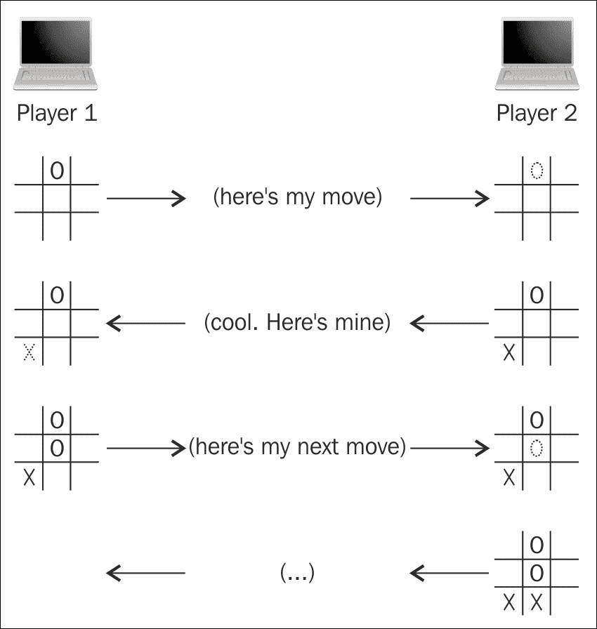
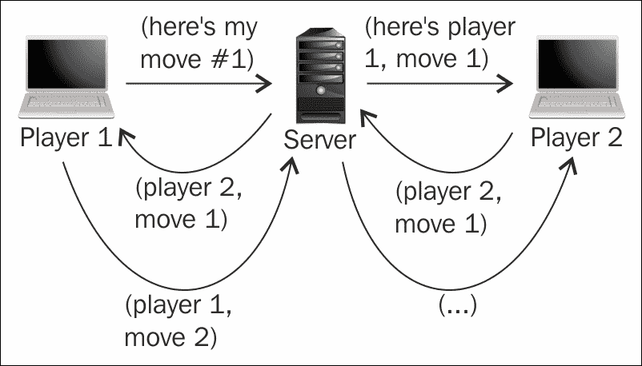
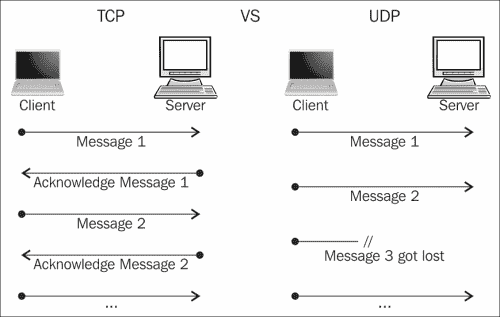
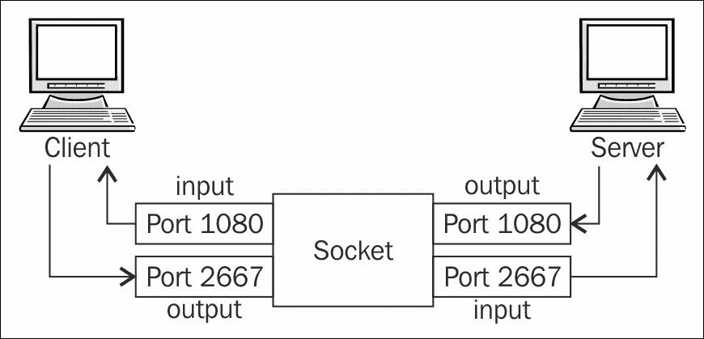
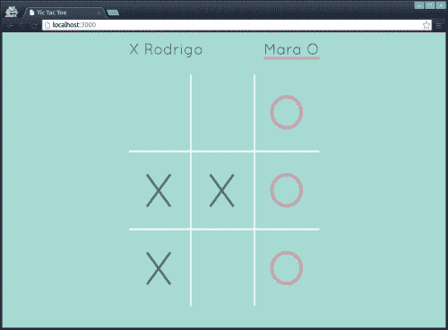
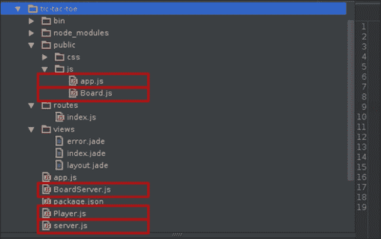

# 第一章：开始多人游戏编程

如果你正在阅读这本书，很有可能你已经是一名游戏开发者。如果是这样，那么你已经知道编写自己的游戏是多么令人兴奋，无论是专业地还是作为一种非常耗时但非常令人满足的爱好。现在你已经准备将你的游戏编程技能提升到下一个水平——也就是说，你已经准备在基于 JavaScript 的游戏中实现多人功能。

如果你已经开始使用 HTML5 和 JavaScript 为**Open Web Platform**创建多人游戏，那么你可能已经意识到个人台式电脑、笔记本电脑或移动设备并不是与另一个玩家分享游戏世界的最合适的设备，因此，为了使用 JavaScript 创建令人兴奋的多人游戏，需要一些形式的网络技术。

在本章中，我们将讨论以下原则和概念：

+   网络和网络编程范式的基础知识

+   使用 HTML5 进行套接字编程

+   编写游戏服务器和游戏客户端

+   回合制多人游戏

# 了解网络的基础知识

据说，如果没有先了解计算机网络和网络编程的学科，就无法编写利用网络的游戏。虽然对任何主题有深入的了解对于从事该主题的人来说都是有益的，但我不认为你必须了解关于游戏网络的所有知识才能编写一些非常有趣和引人入胜的多人游戏。说这种情况就像说一个人需要成为西班牙语的学者才能做一个简单的墨西哥卷饼。因此，让我们来看看网络的最基本和基本概念。在本节结束时，你将了解足够的计算机网络知识，可以开始，并且可以轻松地为你的游戏添加多人游戏方面。

需要记住的一件事是，尽管网络游戏并不像单人游戏那样古老，但计算机网络实际上是一个非常古老且经过深入研究的主题。一些最早的计算机网络系统可以追溯到 20 世纪 50 年代。尽管一些技术随着时间的推移有所改进，但基本思想仍然是一样的：两台或更多台计算机连接在一起，以建立机器之间的通信。通过通信，我指的是数据交换，比如在机器之间来回发送消息，或者一台机器只发送数据，另一台只接收数据。

通过这个对网络概念的简要介绍，你现在已经对网络主题有了一定的了解，足以知道网络游戏所需的是什么——尽可能接近实时地交流的两台或更多台计算机。

到目前为止，应该很清楚这个简单的概念是如何让我们能够将多个玩家连接到同一个游戏世界中的。实质上，我们需要一种方法来在连接到游戏会话的所有玩家之间共享全局游戏数据，然后继续更新每个玩家关于其他每个玩家的信息。通常有几种不同的技术用于实现这一点，但最常见的两种方法是点对点和客户端-服务器。这两种技术都提供了不同的机会，包括优势和劣势。一般来说，两者都没有特别优于另一种，但不同的情况和用例可能更适合其中一种技术。

## 点对点网络

通过点对点架构将玩家连接到同一个虚拟游戏世界是一种简单的方法。尽管名称可能暗示只涉及两个对等体（“节点”），但根据定义，点对点网络系统是指两个或更多个节点直接连接在一起，没有中央系统编排连接或信息交换。

在典型的点对点设置中，每个对等体都扮演着与其他对等体相同的功能，即它们都消耗相同的数据并共享它们产生的数据，以便其他人保持同步。在点对点游戏的情况下，我们可以用一个简单的*井字棋*游戏来说明这种架构。



一旦两名玩家之间建立了连接，谁开始游戏就在游戏板上标记一个单元格。这些信息通过电线传递给另一个对等体，后者现在知道了对手所做的决定，并因此可以更新自己的游戏世界。一旦第二名玩家收到了由第一名玩家最新移动所导致的游戏最新状态，第二名玩家就能够通过检查游戏板上的一些可用空间来进行自己的移动。然后这些信息被复制到第一名玩家那里，他可以更新自己的世界，并通过进行下一个期望的移动来继续这个过程。

这个过程会一直持续，直到其中一个对等体断开连接或者游戏以基于游戏自身业务逻辑的某个条件结束。在*井字棋*游戏的情况下，游戏将在其中一名玩家在棋盘上标记了三个空格形成一条直线，或者所有九个单元格都被填满，但没有一名玩家成功连接三个单元格的情况下结束。

点对点网络游戏的一些好处如下：

+   **快速数据传输**：在这里，数据直接传输到其预定目标。在其他架构中，数据可能首先传输到一些集中节点，然后中央节点（或者在下一节中我们将看到的“服务器”）联系其他对等体，发送必要的更新。

+   **更简单的设置**：你只需要考虑游戏的一个实例，一般来说，它处理自己的输入，将其输入发送给其他连接的对等体，并处理它们的输出作为自己系统的输入。这在回合制游戏中特别方便，例如，大多数棋盘游戏，比如*井字棋*。

+   **更可靠**：这里一个离线的对等体通常不会影响其他对等体。然而，在一个两人游戏的简单情况下，如果其中一名玩家无法继续，游戏很可能会无法继续进行。不过，想象一下，如果所涉及的游戏有数十甚至数百个连接的对等体。如果其中一些突然失去了互联网连接，其他人可以继续玩。但是，如果有一个连接所有节点的服务器并且服务器宕机，那么其他玩家将不知道如何与彼此交流，也不会知道发生了什么。

另一方面，点对点架构的一些明显缺点如下：

+   **无法信任传入数据**：在这里，你无法确定发送者是否修改了数据。输入到游戏服务器的数据也会受到同样的挑战，但一旦数据经过验证并广播到所有其他对等体，你就可以更有信心地认为每个对等体从服务器接收到的数据至少已经经过了清理和验证，并且更可信。

+   **容错率可能非常低**：在我们之前讨论的*点对点网络*的好处部分中提出了相反的观点；如果足够多的玩家共享游戏世界，一个或多个崩溃不会使游戏对其他对等体不可玩。现在，如果我们考虑到任何突然崩溃的玩家对其他玩家产生负面影响的许多情况，我们就可以看到服务器如何可以轻松从崩溃中恢复。

+   **向其他对等体广播时的数据重复**：想象一下，你的游戏是一个简单的 2D 横向卷轴游戏，许多其他玩家与你共享这个游戏世界。每当其中一个玩家向右移动时，你会收到该玩家的新的（x，y）坐标，并且能够更新自己的游戏世界。现在，想象一下，你将你的玩家向右移动了几个像素；你将不得不将这些数据发送给系统中的所有其他节点。

总的来说，点对点是一种非常强大的网络架构，仍然被许多游戏行业广泛使用。由于当前的点对点网络技术仍处于起步阶段，今天大多数基于 JavaScript 的游戏不使用点对点网络。出于这个原因和其他很快就会变得明显的原因，我们将几乎专注于另一种流行的网络范式，即客户端-服务器架构。

## 客户端-服务器网络

**客户端-服务器网络**架构的理念非常简单。如果你闭上眼睛，你几乎可以看到一个点对点图。它们之间最明显的区别是，每个节点都是平等的对等体，而其中一个节点是特殊的。也就是说，每个节点（客户端）不是连接到每个其他节点，而是连接到一个名为*服务器*的主要集中节点。

虽然客户端-服务器网络的概念似乎足够清晰，也许一个简单的比喻可能会让你更容易理解这种网络格式中每种类型节点的角色，并将其与点对点区分开（*McConnell*，*Steve*，*(2004)* *Code Complete*，*Microsoft Press*）。在点对点网络中，你可以将其视为一群朋友（对等体）在派对上进行对话。他们都可以直接与参与对话的其他对等体交谈。另一方面，客户端-服务器网络可以被视为一群朋友在餐馆吃饭。如果餐馆的客户想要点菜单上的某样东西，他或她必须与服务员交谈，服务员是那群人中唯一能够访问所需产品并为客户提供服务的人。

简而言之，服务器负责向一个或多个客户端提供数据和服务。在游戏开发的背景下，最常见的情况是两个或多个客户端连接到同一个服务器；服务器将跟踪游戏以及分布的玩家。因此，如果两个玩家要交换只与他们两个有关的信息，通信将从第一个玩家经过服务器传递并最终到达第二个玩家那里。



在我们之前关于点对点的部分中看到的*井字棋*游戏中涉及的两名玩家的例子中，我们可以看到客户端-服务器模型中事件流是多么相似。再次强调，主要区别在于玩家彼此不知道对方，只知道服务器告诉他们的内容。

虽然你可以很容易地通过使用服务器仅仅连接两个玩家来模拟点对点模型，但通常服务器的使用要比这更加活跃。在网络游戏中，有两种方式可以让服务器参与，即授权方式和非授权方式。也就是说，你可以将游戏逻辑的执行严格放在服务器端，或者你可以让客户端处理游戏逻辑、输入验证等。如今，大多数使用客户端-服务器架构的游戏实际上使用这两种方式的混合（授权和非授权服务器，我们将在本书的后面讨论）。但无论如何，服务器的生命周期的目的是接收来自每个客户端的输入，并将该输入分发到连接的客户端池中。

不管你决定使用授权服务器还是非授权服务器，你会注意到客户端-服务器游戏的一个挑战是你需要编写整个堆栈的两端。即使你的客户端只是从用户那里获取输入，将其转发到服务器，并渲染从服务器接收到的任何数据；如果你的游戏服务器只是将它从每个客户端接收到的输入转发给其他每个客户端，你仍然需要编写游戏客户端和游戏服务器。

本章后面我们将讨论游戏客户端和服务器。目前，我们真正需要知道的是，这两个组件是将这种网络模型与点对点网络区分开来的关键。

客户端-服务器网络游戏的一些好处如下：

+   **关注点分离**：如果你了解软件开发，你就会知道这是你应该始终追求的。也就是说，良好的、可维护的软件是由离散的组件编写的，每个组件都只做一件“事”，而且做得很好。编写单独的专门组件让你可以专注于一次执行一个任务，使得你的游戏更容易设计、编码、测试、推理和维护。

+   **集中化**：尽管这一点可以被反对也可以被支持，但通过一个中心位置进行所有通信使得更容易管理这样的通信，强制执行任何必要的规则，控制访问等等。

+   **减轻客户端的工作量**：客户端不再需要负责从用户和其他对等体获取输入，验证所有输入，与其他对等体共享数据，渲染游戏等等，客户端只需要专注于做其中的一部分，让服务器来分担一部分工作。当我们谈论移动游戏以及微妙的劳动分工如何影响整体玩家体验时，这一点尤为重要。例如，想象一个游戏中有 10 名玩家参与同一个游戏世界。在点对点设置中，每当一个玩家采取行动时，他或她需要将该行动发送给其他九名玩家（换句话说，需要进行九次网络调用，导致更多的移动数据使用）。另一方面，在客户端-服务器配置中，一个玩家只需要将他或她的行动发送给一个对等体，也就是服务器，然后服务器负责将该数据发送给其余的九名玩家。

无论服务器是否具有授权性，客户端-服务器架构的一些常见缺点如下：

+   **通信需要更长时间传播**：在最理想的情况下，从第一个玩家发送到第二个玩家的每条消息传递时间都会比点对点连接长一倍。也就是说，消息首先从第一个玩家发送到服务器，然后从服务器发送到第二个玩家。今天有许多技术用于解决这种情况下面临的延迟问题，其中一些我们将在第四章中更深入地讨论，*减少网络延迟*。然而，根本的困境将始终存在。

+   **由于移动部件更复杂**：无论你如何切割披萨，你需要编写的代码越多（相信我，当你为游戏构建两个独立的模块时，你会写更多的代码），你的心智模型就需要越大。虽然你的大部分代码可以在客户端和服务器之间重复使用（特别是如果你使用了成熟的编程技术，比如面向对象编程），但归根结底，你需要管理更高级别的复杂性。

+   **单点故障和网络拥塞**：到目前为止，我们大多讨论的是只有少数玩家参与同一游戏的情况。然而，更常见的情况是少数玩家组在同一时间玩不同的游戏。

以两人玩*Tic-tac-toe*的游戏为例，想象一下有成千上万的玩家在单人游戏中面对面。在点对点设置中，一旦一对玩家直接配对，就好像没有其他玩家在享受那个游戏。唯一能阻止这两个玩家继续游戏的是他们彼此之间的连接。

另一方面，如果同样成千上万的玩家通过一个位于两者之间的服务器相互连接，那么两个被孤立的玩家可能会注意到消息之间出现严重的延迟，因为服务器忙于处理所有来自其他玩家的消息。更糟糕的是，这两个玩家现在不仅需要担心彼此之间通过服务器维持连接，还希望服务器与他们和对手之间的连接保持活动状态。

总的来说，客户端-服务器网络中涉及的许多挑战都经过深入研究和理解，你在多人游戏开发过程中可能会遇到的许多问题已经被其他人解决了。客户端-服务器是一种非常流行和强大的游戏网络模型，而通过 HTML5 和 JavaScript 可用的所需技术已经得到了很好的发展和广泛的支持。

## 网络协议 - UDP 和 TCP

通过讨论玩家如何在某种形式的网络上进行交流，我们只是浅尝辄止，实际上并没有涉及到通信是如何实际完成的。让我们来描述一下协议是什么，以及它们如何应用于网络和更重要的是多人游戏开发。

协议一词可以被定义为*一组约定*或*详细的程序计划* [引用[Def. 3,4]。(n.d.)。在 Merriam Webster Online 中检索到 2015 年 2 月 12 日，从[`www.merriam-webster.com/dictionary/protocol`](http://www.merriam-webster.com/dictionary/protocol)]。在计算机网络中，协议向消息的接收方描述数据的组织方式，以便对其进行解码。例如，想象一下，您有一个多人对打游戏，并且您想告诉游戏服务器，您的玩家刚刚发出了一个踢的命令，并向左移动了 3 个单位。您应该向服务器发送什么？您发送一个值为“kick”的字符串，然后是数字 3 吗？否则，您首先发送数字，然后是一个大写字母“K”，表示所采取的行动是踢？我试图表达的观点是，如果没有一个被充分理解和达成一致的协议，就不可能成功和可预测地与另一台计算机进行通信。

我们将在本节中讨论的两种网络协议，也是多人联机游戏中最广泛使用的两种协议，分别是**传输控制协议**（**TCP**）和**用户数据报协议**（**UDP**）。这两种协议都提供了网络系统中客户端之间的通信服务。简单来说，它们是允许我们以可预测的方式发送和接收数据包的协议。

当数据通过 TCP 发送时，源机器中运行的应用程序首先与目标机器建立连接。一旦建立了连接，数据以数据包的形式传输，以便接收方的应用程序可以将数据按适当的顺序重新组合。TCP 还提供了内置的错误检查机制，因此，如果数据包丢失，目标应用程序可以通知发送方应用程序，并且任何丢失的数据包都会被重新发送，直到整个消息被接收。

简而言之，TCP 是一种基于连接的协议，可以保证完整数据的按正确顺序传递。我们周围有许多需要这种行为的用例。例如，当您从 Web 服务器下载游戏时，您希望确保数据正确传输。您希望在用户开始玩游戏之前，游戏资产能够被正确完整地下载。虽然这种交付保证听起来非常令人放心，但也可以被认为是一个缓慢的过程，有时可能比知道数据将完整到达更重要，我们稍后会简要看到。

相比之下，UDP 在不使用预先建立的连接的情况下传输数据包（称为*数据报*）。该协议的主要目标是以非常快速和无摩擦的方式向某个目标应用程序发送数据。实质上，您可以将 UDP 视为勇敢的员工，他们打扮成公司的吉祥物站在店外挥舞着大型横幅，希望至少有一些经过的人会看到他们并给他们业务。

起初，UDP 可能看起来像是一种鲁莽的协议，但使 UDP 如此令人渴望和有效的用例包括许多情况，当您更关心速度而不是偶尔丢失数据包，获取重复数据包或以无序方式获取它们时。您可能还希望在您不关心接收方的回复时选择 UDP 而不是 TCP。使用 TCP 时，无论您是否需要接收方的某种确认或回复，它仍然需要时间来回复您，至少确认消息已收到。有时，您可能不在乎服务器是否收到了数据。



UDP 比 TCP 更好的选择的一个更具体的例子是，当你需要从客户端获取心跳信号，让服务器知道玩家是否还在游戏中时。如果你需要让服务器知道会话仍然活跃，并且偶尔丢失一个心跳信号并不重要，那么使用 UDP 是明智的选择。简而言之，对于任何不是关键任务且可以承受丢失的数据，UDP 可能是最佳选择。

最后，要记住，就像点对点和客户端-服务器模型可以并行构建一样，同样你的游戏服务器可以是授权和非授权的混合体，绝对没有理由为什么你的多人游戏只能使用 TCP 或 UDP。使用特定情况需要的任何协议。

## 网络套接字

还有一个我们将非常简要地介绍的协议，只是为了让你看到在游戏开发中需要网络套接字。作为 JavaScript 程序员，你无疑熟悉**超文本传输协议**（**HTTP**）。这是 Web 浏览器用来从 Web 服务器获取你的游戏的应用层协议。

虽然 HTTP 是一个可靠地从 Web 服务器检索文档的协议，但它并不是为实时游戏而设计的；因此，它并不是这个目的的理想选择。HTTP 的工作方式非常简单：客户端向服务器发送请求，然后服务器返回响应给客户端。响应包括一个完成状态码，向客户端指示请求是正在处理中，需要转发到另一个地址，或者已成功或错误地完成（*超文本传输协议（HTTP/1.1）：身份验证*，*（1999 年 6 月）*。[`tools.ietf.org/html/rfc7235`](https://tools.ietf.org/html/rfc7235)）

有几件事情需要注意关于 HTTP，这将清楚地表明在客户端和服务器之间的实时通信需要更好的协议。首先，每次接收到响应后，连接就会关闭。因此，在发出每个请求之前，必须与服务器建立新的连接。大多数情况下，HTTP 请求将通过 TCP 发送，相对而言，这可能会比较慢。

其次，HTTP 在设计上是一个无状态协议。这意味着，每次你从服务器请求资源时，服务器都不知道你是谁以及请求的上下文是什么。（它不知道这是你的第一个请求，还是你经常请求。）这个问题的一个常见解决方案是在每个 HTTP 请求中包含一个唯一的字符串，服务器会跟踪这个字符串，并因此可以持续提供有关每个个体客户端的信息。你可能会认识到这是一个标准的*会话*。这种解决方案的主要缺点，至少在实时游戏方面，是将会话 cookie 映射到用户会话需要额外的时间。

最后，使 HTTP 不适合多人游戏编程的主要因素是通信是单向的——只有客户端可以连接到服务器，服务器通过同一连接回复。换句话说，游戏客户端可以告诉游戏服务器用户输入了一个出拳命令，但游戏服务器无法将这些信息传递给其他客户端。想象一下自动售货机。作为机器的客户，我们可以请求我们想要购买的特定物品。我们通过向自动售货机投入货币来正式化这个请求，然后按下适当的按钮。

在任何情况下，自动售货机都不会向附近站立的人发出命令。这就像等待自动售货机发放食物，期望人们之后再往里面投钱。

对于 HTTP 功能的缺乏，答案非常简单。网络套接字是连接中允许客户端和服务器进行双向通信的端点。把它想象成电话通话，而不是自动售货机。在电话通话期间，任何一方都可以在任何时候说任何他们想说的话。最重要的是，双方之间的连接在整个对话期间保持打开状态，使通信过程非常高效。



**WebSocket**是建立在 TCP 之上的协议，允许基于 Web 的应用程序与服务器进行双向通信（*WebSocket Protocol*，*（2011 年 12 月）*。[`tools.ietf.org/html/rfc6455 RFC 6455`](http://tools.ietf.org/html/rfc6455 RFC 6455)）。创建 WebSocket 的方式包括多个步骤，包括从 HTTP 升级到 WebSocket 的协议升级。幸运的是，所有繁重的工作都是由浏览器和 JavaScript 在幕后完成的，我们将在下一节中看到。现在，这里的关键要点是，通过 TCP 套接字（是的，还有其他类型的套接字，包括 UDP 套接字），我们可以可靠地与服务器通信，服务器也可以根据需要回应我们。

# JavaScript 中的套接字编程

现在让我们通过讨论将一切联系在一起的工具——JavaScript 和 WebSocket——来结束关于网络连接、协议和套接字的对话，从而使我们能够使用开放 Web 的语言编写出色的多人游戏。

## WebSocket 协议

现代浏览器和其他 JavaScript 运行时环境已经在 JavaScript 中实现了 WebSocket 协议。不要误以为只因为我们可以在 JavaScript 中创建 WebSocket 对象，WebSocket 就是 JavaScript 的一部分。定义 WebSocket 协议的标准是与语言无关的，可以在任何编程语言中实现。因此，在开始部署使用 WebSocket 的 JavaScript 游戏之前，请确保将运行游戏的环境使用了实现了 WebSockets 的**ECMA**标准。换句话说，并非所有浏览器在您请求 WebSocket 连接时都知道该怎么做。

就目前而言，今天最流行的浏览器（即 Google Chrome，Safari，Mozilla Firefox，Opera 和 Internet Explorer）的最新版本（即本文撰写时）实施了 RFC 6455 的最新修订版。 WebSockets 的旧版本（如协议版本-76、7 或 10）正在逐渐被弃用，并已被一些先前提到的浏览器移除。

### 注意

关于 WebSocket 协议最令人困惑的事情可能是每个协议版本的命名方式。最初的草案（可以追溯到 2010 年）被命名为*draft-hixie-thewebsocketprotocol-75*。下一个版本被命名为*draft-hixie-thewebsocketprotocol-76*。有些人将这些版本称为 75 和 76，这可能会相当令人困惑，特别是因为协议的第四个版本被命名为*draft-ietf-hybi-thewebsocketprotocol-07*，在草案中被命名为 WebSocket Version 7。协议的当前版本（*RFC 6455*）是 13。

让我们快速看一下我们将在 JavaScript 代码中使用的编程接口（API），以与 WebSocket 服务器进行交互。请记住，我们需要编写使用 WebSockets 消耗数据的 JavaScript 客户端，以及使用 WebSockets 但扮演服务器角色的 WebSocket 服务器。随着我们讨论一些示例，两者之间的区别将变得明显。

### 创建客户端 WebSocket

以下代码片段创建了一个新的 WebSocket 类型对象，将客户端连接到某个后端服务器。构造函数需要两个参数；第一个是必需的，表示 WebSocket 服务器正在运行并期望连接的 URL。第二个 URL 在本书中不会使用，它是服务器可能实现的可选子协议列表。

```js
var socket = new WebSocket('ws://www.game-domain.com');
```

尽管这一行代码可能看起来很简单且无害，但请记住以下几点：

+   我们不再处于 HTTP 领域。现在，WebSocket 服务器的地址以`ws://`开头，而不是`http://`。同样，当我们使用安全（加密）套接字时，我们将指定服务器的 URL 为`wss://`，就像在`https://`中一样。

+   这对您可能显而易见，但 WebSockets 入门者常犯的一个常见错误是，在您可以使用上述代码建立连接之前，您需要在该域上运行一个 WebSocket 服务器。

+   WebSockets 实现了同源安全模型。正如您可能已经在其他 HTML5 功能中看到的那样，同源策略规定，只有在客户端和服务器位于同一域中时，才能通过 JavaScript 访问资源。

### 提示

对于不熟悉同源（也称为**同源**）策略的人来说，在这种情况下，构成域的三个要素是正在访问的资源的协议、主机和端口。在上一个示例中，协议、主机和端口号分别是`ws`（而不是`wss`、`http`或`ssh`）、`www.game-domain.com`（任何子域，如`game-domain.com`或`beta.game-domain.com`都将违反同源策略），以及 80（默认情况下，WebSocket 连接到端口 80，使用`wss`时连接到端口 443）。

由于上一个示例中的服务器绑定到端口 80，我们不需要显式指定端口号。但是，如果服务器配置为在不同的端口上运行，比如 2667，那么 URL 字符串需要包括一个冒号，后面跟着需要放在主机名末尾的端口号，如`ws://www.game-domain.com:2667`。

与 JavaScript 中的其他所有内容一样，WebSocket 实例尝试异步连接到后端服务器。因此，在确保服务器已连接之前，您不应尝试在新创建的套接字上发出命令；否则，JavaScript 将抛出一个可能会使整个游戏崩溃的错误。可以通过在套接字的`onopen`事件上注册回调函数来实现这一点：

```js
var socket = new WebSocket('ws://www.game-domain.com');
socket.onopen = function(event) {
   // socket ready to send and receive data
};
```

一旦套接字准备好发送和接收数据，您可以通过调用套接字对象的`send`方法向服务器发送消息，该方法接受一个字符串作为要发送的消息。

```js
// Assuming a connection was previously established
socket.send('Hello, WebSocket world!');
```

然而，通常情况下，您会希望向服务器发送更有意义的数据，例如对象、数组和其他具有自己含义的数据结构。在这些情况下，我们可以简单地将我们的数据序列化为 JSON 字符串。

```js
var player = {
   nickname: 'Juju',
   team: 'Blue'
};

socket.send(JSON.stringify(player));
```

现在，服务器可以接收该消息，并将其作为客户端发送的相同对象结构进行处理，方法是通过 JSON 对象的解析方法运行它。

```js
var player = JSON.parse(event.data);
player.name === 'Juju'; // true
player.team === 'Blue'; // true
player.id === undefined; // true
```

如果您仔细查看上一个示例，您会注意到我们从某个事件对象的`data`属性中提取通过套接字发送的消息。您会问，那个事件对象是从哪里来的？好问题！我们从套接字的`onmessage`事件上注册回调函数的方式在套接字的客户端和服务器端上接收消息是相同的。我们只需在套接字的`onmessage`事件上注册回调函数，每当接收到新消息时，就会调用该回调。传递给回调函数的参数将包含一个名为 data 的属性，其中包含发送的原始字符串对象的消息。

```js
socket.onmessage = function(event) {
   event instanceof MessageEvent; // true

   var msg = JSON.parse(event.data);
};
```

### 提示

**下载示例代码**

您可以从[`www.packtpub.com`](http://www.packtpub.com)的帐户中下载您购买的所有 Packt Publishing 图书的示例代码文件。如果您在其他地方购买了本书，您可以访问[`www.packtpub.com/support`](http://www.packtpub.com/support)并注册，以便直接通过电子邮件接收文件。

您还可以在 socket 对象上注册回调的其他事件包括`onerror`，每当与 socket 相关的错误发生时触发，以及`onclose`，每当 socket 的状态更改为*CLOSED*时触发；换句话说，每当服务器以任何原因关闭与客户端的连接或连接的客户端关闭其连接时。

如前所述，socket 对象还将具有一个名为`readyState`的属性，其行为类似于 AJAX 对象（或更恰当地说是`XMLHttpRequest`对象）中同名属性。该属性表示连接的当前状态，并且在任何时间点都可以具有四个值之一。该值是一个无符号整数，介于 0 和 3 之间，包括这两个数字。为了清晰起见，在 WebSocket 类上有四个与实例的`readyState`属性的四个数值相对应的常量。这些常量如下：

+   `WebSocket.CONNECTING`：其值为 0，表示客户端和服务器之间的连接尚未建立。

+   `WebSocket.OPEN`：其值为 1，表示客户端和服务器之间的连接已经打开并准备就绪。每当对象的`readyState`属性从 CONNECTING 更改为 OPEN 时（这只会在对象的生命周期中发生一次），将调用`onopen`回调。

+   `WebSocket.CLOSING`：其值为 2，表示连接正在关闭。

+   `WebSocket.CLOSED`：其值为 3，表示连接现在已关闭（或者根本无法打开）。

一旦`readyState`已经更改为新值，它将永远不会在同一 socket 对象实例中返回到先前的状态。因此，如果一个 socket 对象正在 CLOSING 或已经变为*CLOSED*，它将永远不会再次*OPEN*。在这种情况下，如果您希望继续与服务器通信，您将需要一个新的 WebSocket 实例。

总之，让我们总结一下之前讨论过的简单 WebSocket API 功能，并创建一个方便的函数，简化与游戏服务器通信时的数据序列化、错误检查和错误处理：

```js
function sendMsg(socket, data) {
   if (socket.readyState === WebSocket.OPEN) {
      socket.send(JSON.stringify(data));

      return true;
   }

   return false;
};
```

# 游戏客户端

在本章的前面，我们讨论了基于客户端-服务器模式的多人游戏的架构。由于这是我们将在整本书中开发的游戏所采用的方法，让我们定义一些游戏客户端将要履行的主要角色。

从更高的层次来看，游戏客户端将是人类玩家与游戏宇宙的其余部分（包括游戏服务器和连接到它的其他人类玩家）之间的接口。因此，游戏客户端将负责接收玩家的输入，将其传达给服务器，接收服务器的任何进一步指令和信息，然后再次将最终输出呈现给人类玩家。根据所使用的游戏服务器类型（我们将在下一节和未来章节中讨论此问题），客户端可以比仅仅是从服务器接收静态数据的输入应用程序更复杂。例如，客户端很可能会模拟游戏服务器的操作，并将此模拟的结果呈现给用户，而服务器则执行真正的计算并将结果告知客户端。这种技术的最大卖点在于，由于客户端几乎立即响应输入，游戏对用户来说会显得更加动态和实时。

# 游戏服务器

游戏服务器主要负责将所有玩家连接到同一个游戏世界，并保持它们之间的通信。然而，你很快就会意识到，有些情况下，你可能希望服务器比一个路由应用程序更复杂。例如，即使其中一名玩家告诉服务器通知其他参与者游戏结束了，并且发送消息的玩家是赢家，我们可能仍然希望在决定游戏是否真的结束之前确认信息。

有了这个想法，我们可以将游戏服务器标记为两种类型之一：权威或非权威。在权威游戏服务器中，游戏逻辑实际上一直在内存中运行（尽管通常不像游戏客户端一样渲染任何图形输出），每个客户端通过其对应的套接字发送消息将信息报告给服务器，服务器更新当前游戏状态并将更新发送回所有玩家，包括原始发送者。这样我们就可以更加确定从服务器传来的任何数据都经过了验证并且是准确的。

在一个非权威的服务器中，客户端在游戏逻辑执行中扮演了更加重要的角色，这给了客户端更多的信任。正如之前建议的，我们可以取长补短，创造两种技术的混合。在这本书中，我们将拥有一个严格的权威服务器，但客户端是智能的，可以自行完成一些工作。然而，由于服务器对游戏有最终决定权，因此客户端从服务器接收的任何消息都被视为最终真相，并且超越了客户端自己的任何结论。

# 将所有内容整合在一起 - 井字棋

在我们对网络、WebSockets 和多人游戏架构的新知识疯狂之前，让我们通过创建一个非常激动人心的*井字棋*网络游戏，以最简单的方式应用这些原则。我们将使用纯 WebSockets 与服务器通信，服务器将使用纯 JavaScript 编写。由于这个 JavaScript 将在服务器环境中运行，我们将使用**Node.js**（参考[`nodejs.org/`](https://nodejs.org/)），你可能在这一点上对它很熟悉，也可能不熟悉。现在不要太担心 Node.js 的具体细节。我们已经专门为 Node.js 和其相关生态系统的入门编写了一整章。现在，尽量专注于这个游戏的网络方面。



当然，你对*井字棋*很熟悉。两名玩家轮流在一个 9x9 的网格上标记一个方格，谁能标记三个相同的标记，形成水平、垂直或对角线的直线，谁就赢了。如果所有九个方格都被标记，并且之前提到的规则没有被满足，那么游戏就以平局结束。

## Node.js - 宇宙的中心

正如承诺的，我们将在下一章深入讨论 Node.js。现在，只需知道 Node.js 是我们开发策略的基本部分，因为整个服务器将使用 Node 编写，所有其他支持工具都将利用 Node 的环境。我们将在这个第一个演示游戏中使用的设置包含三个主要部分，即**web 服务器**、**游戏服务器**和**客户端文件**（游戏客户端所在的地方）。



现在我们需要担心的主要是六个文件。其余的文件都是由 Node.js 和相关工具自动生成的。至于我们的六个脚本，每个脚本的作用如下。

### /Player.js 类

这是一个非常简单的类，主要用于描述游戏客户端和服务器的期望。

```js
/**
 *
 * @param {number} id
 * @param {string} label
 * @param {string} name
 * @constructor
 */
var Player = function(id, label, name) {
    this.id = id;
    this.label = label;
    this.name = name;
};

module.exports = Player;
```

当我们谈论 Node.js 的基础知识时，最后一行将会有更详细的解释。现在，你需要知道的是它使`Player`类在服务器代码以及发送到浏览器的客户端代码中都可用。

此外，我们很可能只需在整个游戏中使用对象字面量来表示我们所抽象出的`player`对象。我们甚至可以使用一个包含这三个值的数组，其中每个元素的顺序代表元素的含义。顺便说一句，我们甚至可以使用逗号分隔的字符串来表示这三个值。

正如你所看到的，通过创建一个全新的类来存储三个简单的值，这里产生了一些冗余，但这使得代码更易于阅读，因为现在我们知道了游戏在请求`Player`时建立的契约。它将期望在那里存在名为`id`、`label`和`name`的属性。

在这种情况下，`id`可以被认为有点多余，因为它的唯一目的是识别和区分玩家。重要的是两个玩家有一个唯一的 ID。标签属性是每个玩家将在棋盘上打印的内容，这也恰好是两个玩家之间的一个唯一值。最后，名称属性用于以人类可读的方式打印每个玩家的名称。

### /BoardServer.js 类

这个类抽象了*井字棋*游戏的表示，定义了一个接口，我们可以在其中创建和管理一个有两个玩家和一个棋盘的游戏世界。

```js
var EventEmitter = require('events').EventEmitter;
var util = require('util');

/**
 *
 * @constructor
 */
var Board = function() {
    this.cells = [];
    this.players = [];
    this.currentTurn = 0;
    this.ready = false;

    this.init();
};

Board.events = {
    PLAYER_CONNECTED: 'playerConnected',
    GAME_READY: 'gameReady',
    CELL_MARKED: 'cellMarked',
    CHANGE_TURN: 'changeTurn',
    WINNER: 'winner',
    DRAW: 'draw'
};

util.inherits(Board, EventEmitter);
```

由于这段代码只打算在服务器上运行，它充分利用了 Node.js。脚本的第一部分导入了两个核心 Node.js 模块，我们将利用它们而不是重新发明轮子。第一个是`EventEmitter`，它允许我们广播关于游戏发生的事件。其次，我们导入一个实用类，让我们轻松地利用面向对象编程。最后，我们定义了一些与`Board`类相关的静态变量，以简化事件注册和传播。

```js
Board.prototype.mark = function(cellId) {
    // …
    if (this.checkWinner()) {
        this.emit(Board.events.WINNER, {player: this.players[this.currentTurn]});
    }
};
```

`Board`类公开了几种方法，驱动程序可以调用这些方法来向其中输入数据，并在发生某些情况时触发事件。正如前面提到的方法所示，每当玩家成功在棋盘上标记一个可用的方块时，游戏就会广播该事件，以便驱动程序知道游戏中发生了什么；然后它可以通过相应的套接字联系每个客户端，并让他们知道发生了什么。

### /server.js 类

在这里，我们有一个驱动程序，它使用我们之前描述的`Board`类来强制执行游戏规则。它还使用 WebSockets 来维护连接的客户端，并处理他们与游戏的个体交互。

```js
var WebSocketServer = require('ws').Server;
var Board = require('./BoardServer');
var Player = require('./Player');

var PORT = 2667;
var wss = new WebSocketServer({port: PORT});
var board = new Board();

var events = {
    incoming: {
        JOIN_GAME: 'csJoinGame',
        MARK: 'csMark',
        QUIT: 'csQuit'
    },
    outgoing: {
        JOIN_GAME: 'scJoinGame',
        MARK: 'scMark',
        SET_TURN: 'scSetTurn',
        OPPONENT_READY: 'scOpponentReady',
        GAME_OVER: 'scGameOver',
        ERROR: 'scError',
        QUIT: 'scQuit'
    }
};

/**
 *
 * @param action
 * @param data
 * @returns {*}
 */
function makeMessage(action, data) {
    var resp = {
        action: action,
        data: data
    };

    return JSON.stringify(resp);
}

console.log('Listening on port %d', PORT);
```

这个 Node.js 服务器脚本的第一部分导入了我们自定义的类（`Board`和`Player`）以及一个方便的第三方库`ws`，它帮助我们实现 WebSocket 服务器。这个库处理诸如初始连接设置、协议升级等事情，因为这些步骤不包括在 JavaScript WebSocket 对象中，该对象只是用作客户端。在一些方便的对象之后，我们有一个等待在`ws://localhost:2667`上连接的工作服务器。

```js
wss.on('connection', function connection(ws) {
    board.on(Board.events.PLAYER_CONNECTED, function(player) {
        wss.clients.forEach(function(client) {
            board.players.forEach(function(player) {
                client.send(makeMessage(events.outgoing.JOIN_GAME, player));
            });
        });
    });

    ws.on('message', function incoming(msg) {
        try {
            var msg = JSON.parse(msg);
        } catch (error) {
            ws.send(makeMessage(events.outgoing.ERROR, 'Invalid action'));
            return;
        }

        try {
            switch (msg.action) {
                case events.incoming.JOIN_GAME:
                    var player = new Player(board.players.length + 1, board.players.length === 0 ? 'X' : 'O', msg.data);
                    board.addPlayer(player);
                    break;
                // ...
            }
        } catch (error) {
            ws.send(makeMessage(events.outgoing.ERROR, error.message));
        }
    });
});
```

这个服务器的其余重要部分发生在中间。为了简洁起见，我们只包括了`Board`类发出的事件的事件处理程序注册的一个示例，以及对套接字接收到的事件注册的`callback`函数。（你是否认出了`ws.on('message', function(msg){})`函数调用？这是 Node 中等价于我们之前讨论的客户端 JavaScript`socket.onmessage = function(event){}`的函数调用。）

这里的重要之处在于我们如何处理来自游戏客户端的消息。由于客户端只能向我们发送单个字符串作为消息，我们如何知道消息是什么？由于客户端可以向服务器发送许多类型的消息，我们在这里创建了自己的小协议。也就是说，每条消息都将是一个序列化的`JSON`对象（也称为对象文字），具有两个属性。第一个属性将以`action`的值为键，第二个属性将以`data`的值为键，具体取决于指定的操作。从这里，我们可以查看`msg.action`的值，并相应地做出响应。

例如，每当客户端连接到游戏服务器时，它会发送一个带有以下值的消息。

```js
{
    action: events.outgoing.JOIN_GAME,
    data: "<player nickname>"
};
```

一旦服务器将该对象作为`onmessage`事件的有效载荷接收，它就可以知道消息的含义以及玩家昵称的预期值。

### /public/js/Board.js 类

这个类与`BoardServer.js`非常相似，主要区别在于它还处理 DOM（即浏览器渲染和管理的 HTML 元素），因为游戏需要呈现给人类玩家。

```js
/**
 *
 * @constructor
 */
var Board = function(scoreBoard) {
    this.cells = [];
    this.dom = document.createElement('table');
    this.dom.addEventListener('click', this.mark.bind(this));
    this.players = [];
    this.currentTurn = 0;
    this.ready = false;

    this.scoreBoard = scoreBoard;

    this.init();
};

Board.prototype.bindTo = function(container) {
    container.appendChild(this.dom);
};

Board.prototype.doWinner = function(pos) {
    this.disableAll();
    this.highlightCells(pos);
};
```

出于简洁起见，我们选择不显示游戏逻辑的大部分内容。这里需要注意的重点是，这个版本的 Board 类非常了解 DOM，并且对游戏决策和游戏规则的执行非常被动。由于我们使用的是权威服务器，这个类会按照服务器的指示进行操作，比如标记自己以指示某个参与者赢得了游戏。

### /public/js/app.js 类

与`server.js`类似，这个脚本是我们游戏的驱动程序。它有两个功能：接收用户输入并驱动服务器，以及使用从服务器接收的输入来驱动棋盘。

```js
var socket = new WebSocket('ws://localhost:2667');

var scoreBoard = [
    document.querySelector('#p1Score'),
    document.querySelector('#p2Score')
];

var hero = {};
var board = new Board(scoreBoard);

board.onMark = function(cellId){
    socket.send(makeMessage(events.outgoing.MARK, {playerId: hero.id, cellId: cellId}));
};

socket.onmessage = function(event){
    var msg = JSON.parse(event.data);

    switch (msg.action) {
        case events.incoming.GAME_OVER:
            if (msg.data.player) {
                board.doWinner(msg.data.pos);
            } else {
                board.doDraw();
            }

            socket.send(makeMessage(events.outgoing.QUIT, hero.id));
            break;

        case events.incoming.QUIT:
            socket.close();
            break;
    }
};

socket.onopen = function(event) {
    startBtn.removeAttribute('disabled');
    nameInput.removeAttribute('disabled');
    nameInput.removeAttribute('placeholder');
    nameInput.focus();
};
```

再次需要注意的是客户端服务器是多么以 DOM 为中心。还要注意客户端对从服务器接收的消息是多么顺从。如果服务器在发送给客户端的消息中指定的操作是`GAME_OVER`，客户端会清理一切，告诉玩家游戏结束了，要么是因为有人赢得了游戏，要么是因为游戏以平局结束，然后告诉服务器它准备断开连接。再次，客户端等待服务器告诉它下一步该做什么。在这种情况下，它等待服务器清理，然后告诉客户端断开连接。

# 摘要

在本章中，我们讨论了网络和网络编程范式的基础知识。我们看到了 WebSockets 如何使得在 HTML5 中开发实时多人游戏成为可能。最后，我们使用广泛支持的 Web 技术实现了一个简单的游戏客户端和游戏服务器，并构建了一个有趣的*井字棋*游戏。

在下一章中，我们将介绍 JavaScript 开发领域的最新技术，包括通过 Node.js 在服务器端使用 JavaScript。本章将教授您使用工作流和资源管理工具（如 NPM、Bower、Grunt 等）来管理 JavaScript 开发周期的当前技术。
