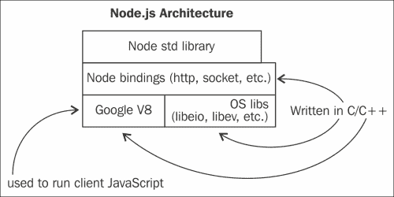
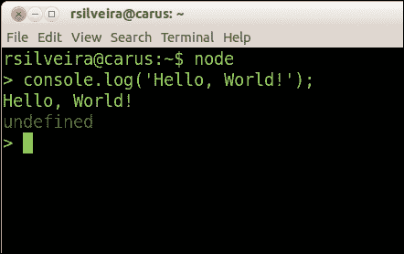
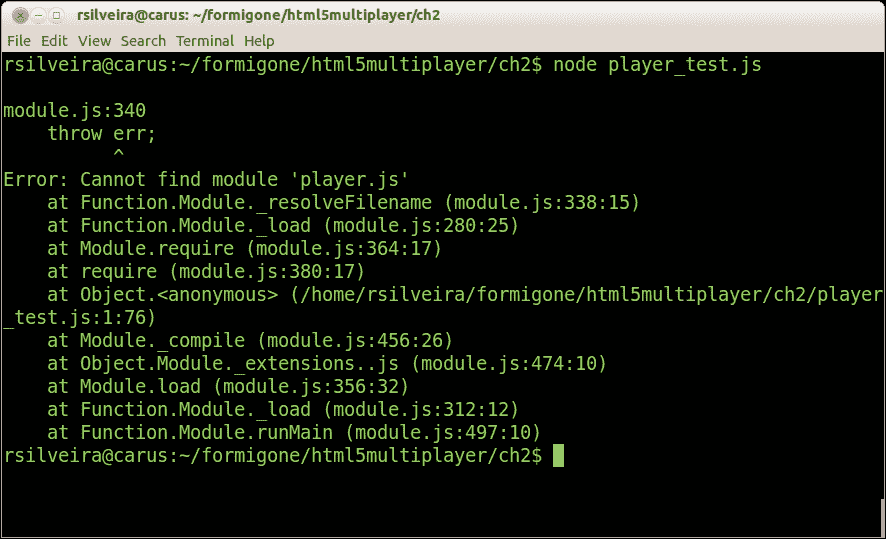

# 第二章：设置环境

上一章的目标是介绍使用当前 HTML5 技术进行 JavaScript 多人游戏编程。虽然我们讨论了一个真正的多人游戏的实现，但并没有提到如何管理更复杂的项目。

除了诸如 WebSockets 之类的新技术之外，我们还可以将发生在 Web 平台内的巨大进步归功于已经创建的支持项目管理和 HTML5 和 JavaScript 开发工作流的支持工具。

在本章中，我们将讨论以下原则和概念：

+   在**Node.js**中开发 JavaScript 应用程序

+   编写模块化的 JavaScript 应用程序

+   使用**npm**管理 Node.js 包

+   使用**Bower**管理客户端包

+   自动化 JavaScript 开发

# Node.js 中的 JavaScript 在浏览器之外

不久前，所谓的 Web 开发人员很少使用 JavaScript，只有在 Web 表单需要客户端验证时才会用到。由于 CSS 不像今天这样先进，或者至少没有得到广泛支持，JavaScript 也被用来创建图像滚动效果。不久前，JavaScript 和程序员这两个词是不太搭配的。

然而，时代在变化，技术在进化。如今，合格的 JavaScript 程序员受到追捧，并且相对于其他编程语言的程序员来说，薪酬竞争力非常强。这反映了 JavaScript 语言变得多么受欢迎和强大。

因此，JavaScript 正在稳步从*世界上最被误解的编程语言*（*Crockford*，*Douglas（2001）*。[`javascript.crockford.com/javascript.html`](http://javascript.crockford.com/javascript.html)）变成一个企业级语言，它被用于浏览器内部以及独立程序，包括服务器应用程序。正如上一章所解释和说明的，当它被用于游戏的客户端构建以及游戏服务器时，JavaScript 以不同的方式被使用。

你可能记得游戏服务器不一定要用 JavaScript 编写。事实上，游戏客户端根本不知道服务器是用什么语言编写的，因为它与服务器的所有通信都是通过 WebSocket 协议进行的。然而，由于我们希望最大化我们可以在客户端和服务器之间共享的代码量，同时减少我们编写的总代码量，我们将以一种可以实现代码共享的方式编写我们的游戏。这就是 Node.js 发挥作用的地方。

## Node.js

毫无疑问，你现在应该已经听说过 Node.js 了。对于那些不太确定 Node 实际是什么的人来说，它只是建立在谷歌 Chrome 的 JavaScript 引擎（也称为**V8**）之上的运行时环境。换句话说，Node 既不是 JavaScript 的特殊版本，也不是独立的 JavaScript 引擎，而是一个整个的生态系统，碰巧利用了谷歌的开源 JavaScript 引擎，这可能是当今世界上的七大奇迹之一。



值得一提的是 Node.js 的两个特点是它不依赖于浏览器，以及每个 I/O 操作都是异步的。

至于它不是浏览器环境，您不会像在浏览器中那样找到 window 对象。此外，由于 Node.js 环境中不存在浏览器施加的任何限制，您可以充分利用底层操作系统。首先，想象一下到目前为止您一直在使用的服务器端语言，或者您考虑使用来编写我们在第一章中讨论的游戏服务器的任何编程语言，*开始多人游戏编程*。然后，在您的脑海中用 JavaScript 替换该语言。这就是 Node.js 提供的重要优势。

在堆栈的两端（服务器端和客户端）使用 JavaScript 的一些好处包括以下内容：

+   您可以共享为服务器和客户端编写的大量代码

+   您只需要掌握一种语言

+   JavaScript 是一种强大的语言，解决了其他语言中存在的许多问题

+   由于 JavaScript 是单线程的，您永远不会遇到死锁或许多与多线程编程相关的问题

到目前为止，我希望您能够看到 Node.js 在 HTML5 多人游戏开发中有多么基础，或者至少在本书中有多么关键。在我们深入探讨一些基本概念之前，让我们确保您可以在系统上安装和运行它。

## 安装 Node.js

在系统上安装 Node.js 的两种推荐方法是从官方网站[`www.nodejs.org`](http://www.nodejs.org)下载可执行文件，或者通过编译源代码手动安装。根据您选择的操作系统，您还可以通过某些软件包管理系统或类似工具安装它。无论您决定采取哪种方法，请确保安装最新的稳定版本，截至撰写本文时，最新版本是 0.12.0。

一旦您在系统上安装了 Node.js，您可以通过打开终端窗口并输入以下命令来进行测试：

```js
node
console.log('Hello, World!');
```

如果在安装过程中一切顺利，您应该会看到类似于以下截图中显示的输出：



您可以通过在终端上运行以下命令来检查已安装的 Node.js 版本：

```js
node --version
```

尽管今天（撰写本文时，即 2015 年初）可用的最新版本是 0.12.0，但本书中描述的所有脚本都是在版本 0.10.25 中编写和测试的。对于向后和向前兼容性问题和疑问，请务必参考 Node.js 的官方待办事项。

# 编写模块化 JavaScript

在 Node.js 出现之前，鉴于 JavaScript 的臭名昭著的限制，开发人员可能对其最大的抱怨是缺乏对模块化开发过程的内置支持。

模块化 JavaScript 开发的最佳实践是在字面对象内创建组件，以某种方式行为类似于命名空间。这个想法是在全局范围内创建一个对象，然后使用该对象内的命名属性来表示您将声明类、函数、常量等的特定命名空间（或至少 JavaScript 等效项）。

```js
var packt = packt || {};
packt.math = packt.math || {};
packt.math.Vec2 = function Vec2(x, y) {// …
};

var vec2d = new packt.math.Vec2(0, 1);
vec2d instanceof packt.math.Vec2; // true
```

在上一个代码片段中，我们在`packt`变量不存在的情况下创建一个空对象。如果存在，我们不会用空对象替换它，而是将一个引用分配给`packt`变量。我们在 math 属性中也是一样，其中我们添加了一个名为`Vec2d`的构造函数。现在，我们可以自信地创建特定向量类的实例，知道如果我们的全局范围内还有其他向量库，即使它也被命名为`Vec2`，它也不会与我们的版本冲突，因为我们的构造函数位于`packt.math`对象内。

虽然这种方法在很长一段时间内运行得相对良好，但它确实有三个缺点：

+   每次键入整个命名空间都需要很多工作

+   不断引用深层嵌套的函数和属性会影响性能

+   您的代码很容易被粗心的赋值替换为顶级 `namespace` 属性

好消息是，今天有一种更好的方法来编写 JavaScript 模块。通过认识到旧方式的缺点，一些提出的标准出现了，以解决这个问题。

## CommonJS

2009 年，Mozilla 的开发人员创建了一个旨在定义一种从浏览器中解放出来的 JavaScript 应用程序的方式的项目。 (参见 [`en.wikipedia.org/wiki/CommonJS`](http://en.wikipedia.org/wiki/CommonJS).) 这种方法的两个显著特点是 `require` 语句，它类似于其他语言提供的功能，以及 `exports` 变量，从这里来的所有代码将被包含在对 require 函数的后续调用中。每个导出的模块都驻留在单独的文件中，这样就可以识别 `require` 语句引用的文件，并隔离组成模块的代码。

```js
// - - - - - - -
// player.js

var Player = function(x, y, width, height) {
   this.x = x;
   this.y = y;
   this.width = width;
   this.height = height;
};

Player.prototype.render = function(delta) {
   // ...
};

module.exports = Player;
```

这段代码在名为 `player.js` 的文件中创建了一个模块。这里的要点如下：

+   您实际模块的内容是您所熟悉和热爱的相同的旧式 JavaScript

+   您希望导出的任何代码都分配给 `module.exports` 变量

在我们讨论如何使用这个模块之前，让我们详细说明之前提到的最后一点。由于 JavaScript 闭包的工作原理，我们可以引用文件中（在文件内部）未直接通过 `module.exports` 导出的值，这些值无法在模块外部访问（或修改）。

```js
// - - - - - - -
// player.js

// Not really a constant, but this object is invisible outside this module/file
var defaults = {
   width: 16,
   height: 16
};

var Player = function(x, y, width, height) {
   this.x = x;
   this.y = y;
   this.width = width || defaults.width;
   this.height = height || defaults.height;
};

Player.prototype.render = function(delta) {
   // ...
};

module.exports = Player;
```

请注意，`Player` 构造函数接受宽度和高度值，这些值将分配给该类实例的本地和对应的宽度和高度属性。但是，如果我们省略这些值，那么我们将回退到 `defaults` 对象中指定的值，而不是将未定义或空值分配给实例的属性。好处是该对象无法在模块外部任何地方访问，因为我们没有导出该变量。当然，如果我们使用 EcmaScript 6 的 `const` 声明，我们可以实现只读的命名常量，以及通过 EcmaScript 5 的 `Object.defineProperty`，将可写位设置为 false。然而，这里的要点仍然是，未导出的模块外部的任何东西都无法直接访问模块中未通过 `module.exports` 导出的值。

现在，为了使用 CommonJs 模块，我们需要确保可以在文件系统中本地访问代码。在其最简单的形式中，一个 require 语句将寻找一个文件（相对于所提供的文件）来包含，其中文件的名称与 require 语句匹配。

```js
// - - - - - - -
// app.js

var Player = require('./player.js');
var hero = new Player(0, 0);
```

要在 app.js 文件中运行脚本，我们可以在与存储 `app.js` 相同的目录中使用以下命令：

```js
node app.js
```

假设 `app.js` 和 `player.js` 文件存储在同一个目录中，Node 应该能够找到名为 `player.js` 的文件。如果 `player.js` 存储在 `app.js` 的父目录中，那么 `require` 语句需要如下所示：

```js
// - - - - - - -
// test/player_test.js

var Player = require('./../player.js');
var hero = new Player(0, 0);
```

正如您将在后面看到的，我们可以使用 Node 的包管理系统非常容易地导入模块或整个库。这样做会使导入的包以一种有条理的方式存储，从而使将它们引入您的代码变得更容易。

另一种导入模块的方式是简单地在 require 语句中包含导出模块的名称，如下所示：

```js
// - - - - - - -
// app.js

var Player = require('player.js');
var hero = new Player(0, 0);
```

如果您运行先前的文件，您将看到一个致命的运行时错误，看起来像以下的屏幕截图：



Node 无法找到`player.js`文件的原因是，当我们不使用前导句号指定文件名（这意味着包含的文件是相对于当前脚本的），它会在与当前脚本相同的目录中寻找名为`node_modules`的目录中的文件。

如果 Node 无法在`node_modules`中找到匹配的文件，或者当前目录没有这样命名的目录，它将在与当前脚本的父目录中的`require`语句类似的目录中寻找名为`node_modules`的目录以及同名的文件。如果在那里搜索失败，它将再向上查找一个目录级别，并在那里的`node_modules`目录中寻找文件。搜索将一直持续到文件系统的根目录。

将文件组织成可重用的、自包含模块的另一种方法是将文件捆绑在`node_modules`中的一个目录中，并利用一个代表模块入口点的`index.js`文件。

```js
// - - - - - - -
// node_modules/MyPlayer/index.js

var Player = function(x, y, width, height) {
   this.x = x;
   this.y = y;
   this.width = width;
   this.height = height
};

module.exports = Player;

// - - - - - - -
// player_test.js

var Player = require('MyPlayer');

var hero = new Player(0, 0);
console.log(hero);
```

请注意，模块的名称，在`require`语句中指定的，现在与`node_modules`中的一个目录的名称匹配。当名称不以指示相对或绝对路径的字符（"`/`"，"`./`"或"`../`"）开头，并且文件扩展名被省略时，可以确定 Node 将寻找一个目录而不是与`require`函数中提供的名称匹配的文件。

当 Node 查找目录名称时，如前面的示例所示，它将首先在匹配的目录中查找`index.js`文件并返回其内容。如果 Node 找不到`index.js`文件，它将查找一个名为`package.json`的文件，这是描述模块的清单文件。

```js
// - - - - - - -
// node_modules/MyPlayer/package.json

{
   "name": "MyPlayer",
   "main": "player.js"
}
```

假设我们已将`node_modules/MyPlayer/index.js`文件重命名为`node_modules/MyPlayer/player.js`，一切将与以前一样工作。

在本章后面，当我们谈论 npm 时，我们将更深入地了解`package.json`，因为它在 Node.js 生态系统中扮演着重要的角色。

## RequireJS

试图解决 JavaScript 缺乏本地脚本导入和标准模块规范的另一个项目是 RequireJS。 （参见[`requirejs.org/`](http://requirejs.org/)。）实际上，RequireJS 是**异步模块定义**（**AMD**）规范的一个特定实现。 AMD 是一个定义模块及其依赖项可以异步加载的 API 的规范[Burke，James（2011）。[`github.com/amdjs/amdjs-api/wiki/AMD`](https://github.com/amdjs/amdjs-api/wiki/AMD)]。

CommonJS 和 RequireJS 之间的一个显著区别是，RequireJS 设计用于在浏览器内部使用，而 CommonJS 并没有考虑浏览器。然而，这两种方法都可以适应浏览器（在 CommonJS 的情况下）以及其他环境（在 RequireJS 的情况下）。

与 CommonJS 类似，RequireJS 可以被认为有两部分：一个模块定义脚本和一个消费（或需要）模块的第二个脚本。此外，与 CommonJS 类似但在 RequireJS 中更明显的是，每个应用程序都有一个单一的入口点。这是需要开始的地方。

```js
// - - - - - - -
// index.html

<script data-main="scripts/app" src="img/require.js"></script>
```

在这里，我们在 HTML 文件中包含`require.js`库，指定入口点，这由`data-main`属性表示。一旦库加载，它将尝试加载名为`app.js`的脚本，该脚本位于名为`scripts`的目录中，该目录存储在与主机`index.html`文件相同的路径上。

这里需要注意的两件事是，`scripts/app.js`脚本是异步加载的，而不是使用`script`标签时浏览器默认加载所有脚本的方式。此外，`scripts/app.js`本身可以要求其他脚本，这些脚本将依次异步加载。

按照惯例，入口脚本（在上一个示例中为`scripts/app.js`）将加载一个配置对象，以便 RequireJS 可以适应您自己的环境，然后加载真正的应用程序入口点。

```js
// - - - - - - -
// scripts/app.js

requirejs.config({
    baseUrl: 'scripts/lib',
    paths: {
        app: '../app'
    }
});

requirejs(['jquery', 'app/player'], function ($, player) {
    // ...
});
```

在上一个示例中，我们首先配置了脚本加载器，然后我们需要两个模块——首先是`jQuery`库，然后是一个名为`player`的模块。配置块中的`baseUrl`选项告诉 RequireJS 从`scripts/lib`目录加载所有脚本，这是相对于加载`scripts/app.js`的文件（在本例中为`index.html`）。路径属性允许您对`baseUrl`创建异常，重写以`app`字符串开头的脚本的路径，这被称为**模块 ID**。当我们需要`app/player`时，RequireJS 将加载一个相对于`index.html`的脚本`scripts/app/player.js`。

一旦加载了这两个模块，RequireJS 将调用传递给`requirejs`函数的回调函数，按照指定的顺序将请求的模块作为参数添加进去。

您可能会想知道为什么我们谈论了 CommonJS 和 RequireJS，因为目标是在服务器和客户端之间尽可能共享尽可能多的代码。覆盖两种方法和工具的原因仅是为了完整性和信息目的。由于 Node.js 已经使用 CommonJS 作为其模块加载策略，几乎没有理由在服务器上使用 RequireJS。而不是混合使用 RequireJS 在浏览器中使用，通常做法（这将是本书其余部分的选择）是在所有地方使用 CommonJS（包括**客户端**代码），然后在客户端代码上运行一个名为**Browserify**的工具，使得可以在浏览器中加载使用 CommonJS 的脚本。我们将很快介绍 Browserify。

# 使用 Npm 管理 Node.js 包

Npm 是 JavaScript 的包管理器，类似于 PHP 的**Composer**或 Python 的**Pip**。（转到[`www.npmjs.com/`](https://www.npmjs.com/)。）有些人可能会告诉您 npm 代表 Node Package Manager，但尽管自 0.6.3 版本以来一直是 Node.js 的默认包管理器，npm 并不是一个首字母缩写词。因此，您经常会看到 npm 以小写形式拼写。

要快速检查是否已安装 npm，可以使用终端窗口查询已安装的 npm 版本。

```js
npm -v
```

有关如何在特定操作系统上安装 npm 的说明，请确保您遵循 npm 官方网站上的指南。本书中示例代码和演示应用程序使用的版本是 1.3.10。

使用 npm 安装第三方包时，可以选择将其安装在项目的本地位置，也可以全局安装，以便在系统的任何位置都可见该包。

```js
npm install watch
```

默认情况下，当您安装一个包（在上一个示例中，我们安装了一个名为`watch`的包，用于监视目录和文件的更改）时，如果没有标志，该包将被安装在本地（假设`package.json`文件也存在），并保存到执行命令的相对位置的`node_modules`目录中。

要全局或系统范围安装一个包，只需在安装命令后附加`-g`标志：

```js
npm install watch -g
```

按照惯例，如果您需要一个通过`require`语句在代码中使用的包，您将希望将该包保存在本地。如果意图是从命令行中使用包作为可执行代码，那么通常会希望全局安装它。

如果要在`package.json`清单上构建，以便项目依赖的本地包可以共享并轻松安装，可以手动编辑清单文件，在“`dependencies`”键下的`json`对象中添加依赖项，或者让 npm 为您执行此操作，但不要忘记指定`--save`标志：

```js
npm install watch --save
```

请注意，运行上一个命令将下载组成所请求包的代码到你的工作目录，并更新你的`package.json`清单，以便以后更新包或根据需要重新安装它们。换句话说，你可以随时使用你现有的`package.json`文件来重建你的开发环境，就第三方依赖而言。

一旦你在`package.json`文件中指定了一个或多个依赖项，你可以通过运行 npm 来安装它们，如下所示：

```js
npm install
```

这将下载清单文件中的所有依赖项并保存到`node_modules`中。

同样，你可以通过使用 update 命令通过 npm 更新包：

```js
npm update
```

如果你不知道如何开始创建一个`package.json`清单文件，你可以让 npm 帮助你填写最常见属性的空白部分。

```js
npm init
```

这将加载一个交互式实用程序，要求你为清单的各种属性输入值，比如包名称、版本、作者名称等。它还提供了一些默认值，这样你可以忽略你不知道它们的属性，或者你可以信任 npm 提供的任何后备选项，让你很容易快速获得一个清单文件。

```js
npm init
// … assume all proposed default values

// - - - - - - -
// package.json

{
  "name": "npm",
  "version": "0.0.0",
  "description": "ERROR: No README data found!",
  "main": "index.js",
  "scripts": {
    "test": "echo \"Error: no test specified\" && exit 1"
  },
  "author": "",
  "license": "BSD-2-Clause"
}
```

一旦你有了一个通用的`package.json`清单，你可以用 npm install 命令将你的依赖项添加到其中。

```js
npm install browserify --save

// - - - - - - -
// package.json

{
  "name": "npm",
  "version": "0.0.0",
  "description": "ERROR: No README data found!",
  "main": "index.js",
  "scripts": {
    "test": "echo \"Error: no test specified\" && exit 1"
  },
  "author": "",
  "license": "BSD-2-Clause" ,
  "dependencies": {
    "browserify": "~9.0.3"
  }
}
```

当然，你可以随时手动编辑文件来更改值或删除你认为不必要的属性，比如许可证、描述或版本。有些属性只有在你计划私下或与全局 npm 注册表共享你的包时才有意义。其他值，比如脚本，用于方便开发。例如，我们可以注册一个脚本，当我们运行`npm <script value>`时执行。

```js
// - - - - - - -
// package.json

{
 "scripts": {
    "test": "node test.js"
  }
}

// - - - - - - -
// test.js

console.log('testing npm scripts');
```

因此，我们可以让 Node 通过 npm 运行一个名为`test.js`的脚本，命令如下：

```js
npm test
```

虽然在这种情况下使用 npm 可能不会节省很多输入，但它确实使其他人更容易知道，例如，如何运行你的测试，即使你的测试运行器脚本没有以任何特定的标准形式命名或执行。

# 使用 Bower 管理前端包

如果你对 npm 作为后端 JavaScript 包管理器并不满意，也许 Bower 会让你更加快乐。 （参见[`bower.io/`](http://bower.io/)。）Bower 的工作方式与 npm 非常相似。事实上，我们刚刚讨论的大多数 npm 命令和约定在 Bower 中都可以直接使用。

事实上，Bower 本身是一个通过 npm 安装的 Node.js 模块：

```js
npm install bower -g
```

我们可以以与 npm 相同的方式与 Bower 交互。

```js
bower init
// … using all proposed defaults

// - - - - - - -
// bower.json

{
  name: 'npm',
  version: '0.0.0',
  homepage: 'https://github.com/formigone',
  authors: [
    'Rodrigo Silveira <webmaster@rodrigo-silveira.com>'
  ],
  license: 'MIT',
  ignore: [
    '**/.*',
    'node_modules',
    'bower_components',
    'test',
    'tests'
  ]
}
```

Bower 使用`bower.json`清单文件，到目前为止，这应该对你来说看起来有些熟悉。要安装依赖项，要么手动编辑清单，要么利用 Bower。

```js
bower install jquery –save

// - - - - - - -
// bower.json

{
  name: 'npm',
  version: '0.0.0',
  homepage: 'https://github.com/formigone',
  authors: [
    'Rodrigo Silveira <webmaster@rodrigo-silveira.com>'
  ],
  license: 'MIT',
  ignore: [
    '**/.*',
    'node_modules',
    'bower_components',
    'test',
    'tests'
  ],
  "dependencies": {
    "jquery": "~2.1.3"
  }
}
```

到目前为止，Bower 和 npm 之间的主要区别是，Bower 处理前端依赖项，可以是 JavaScript、CSS、HTML、字体文件等。Bower 将依赖项保存在`bower_components`目录中，类似于 npm 的`node_dependencies`。

## Browserify

最后，让我们使用这个非常方便的 npm 包来利用我们的 CommonJS 模块（以及 Node 的原生模块）在浏览器中使用。这正是 Browserify 的作用：它接受一个入口点脚本，从该文件递归地跟随所有 require 语句，然后内联构建的依赖树中的所有文件，并返回一个单一文件。（参见[`browserify.org/`](http://browserify.org/)。）这样，当浏览器在你的脚本中遇到一个 require 语句时，它不必从文件系统中获取文件；它从同一个文件中获取文件。

```js
sudo npm install browserify -g
```

一旦我们安装了 Browserify（再次强调，因为这是用作命令行工具，我们要全局安装它），我们可以将所有的 CommonJS 文件“捆绑”在一起。

```js
// - - - - - - -
// app.js

var Player = require('MyPlayer');

var hero = new Player(0, 0);
console.log(hero);

// - - - - - - -
// node_modules/MyPlayer/index.js

var defaults = {
   width: 16,
   height: 16
};

var Player = function(x, y, width, height) {
   this.x = x;
   this.y = y;
   this.width = width || defaults.width;
   this.height = height || defaults.height;
};

Player.prototype.render = function(delta) {
   // ...
};

module.exports = Player;
```

Browserify 将负责根据需要引入所有的依赖项，以便输出文件具有所有准备好供使用的依赖项，就像上面的代码示例中所示的那样。

Browserify 将入口点的名称作为第一个参数，并默认将输出打印到标准输出。或者，我们可以指定一个文件名，将捆绑保存在那里。

```js
browserify app.js -o bundle.js
```

Browserify 现在将创建一个名为`bundle.js`的文件，我们可以在 HTML 文件中包含它，并在浏览器中使用。此外，我们可以使用 npm 注册表中的许多可用工具之一来压缩输出文件。

```js
sudo npm install uglify-js -g
uglifyjs bundle.js -o bundle.min.js --source-map bundle.min.js.map
```

运行上述代码将安装一个名为**UglifyJS**的 node 包，它可以非常智能地解析、混淆、压缩和收缩我们的`bundle.js`文件。（参考[`github.com/mishoo/UglifyJS`](https://github.com/mishoo/UglifyJS)。）输出文件将非常小，并且对人类来说完全不可读。作为奖励，它还创建了一个`source map`文件，这样我们就可以通过将其映射回原始的`bundle.js`文件来调试被最小化的文件。

# 自动化您的工作流程

到目前为止，我们已经学会了执行以下任务：

+   编写可导入其他模块的模块化 JavaScript 代码

+   通过 CommonJS 和 Browserify 在客户端和服务器端代码中重用模块

+   使用 npm 管理 node 包

+   使用 Bower 管理客户端包

现在，我们准备以一种方式将所有这些内容整合起来，以便摆脱我们运行所有这些命令的负担。试想一下，如果您必须编写几行代码，保存您的工作，跳到命令行，运行 Browserify，然后运行 Uglify-js，然后运行您的单元测试，然后运行其他几个 npm 工具，最后跳到浏览器，刷新浏览器，看到更新后的应用程序正在运行。哦，等等！您忘记重新启动游戏服务器，它是一个 Node.js 应用程序，在更改这些文件后需要重新启动。所以，您回到终端，运行几个命令，最终，您会在浏览器中看到新的代码。

如果刚才的思维练习让我们所涵盖的这些精彩工具看起来像是很多工作，保持冷静。我们还有另一套工具可以让我们的生活变得更轻松，JavaScript 开发是一种美妙的事情（与通常所说的相反，特别是那些不使用我们将要讨论的工具的人）。

## Grunt

**Grunt**是一个流行的任务运行工具，可以自动化您可能需要执行的重复任务，例如运行单元测试、捆绑组件、缩小捆绑包、从源文件注释创建 API 文档等。（参考[`gruntjs.com/`](http://gruntjs.com/)。）

Grunt 使用插件的概念，这些插件是特定的任务配置，可以共享和重复使用。例如，您可能希望有一个插件来监视目录的更改，然后在触发更改时运行 Browserify。（换句话说，每次保存文件时，都会运行一个任务。）

您可以手动编写自己的插件；尽管这是一个简单的过程，但它足够冗长，所以我们不会在本书中详细介绍。幸运的是，Grunt 有一个庞大的插件列表，几乎包含了您所需的所有插件，或者至少是我们在本书中需要的所有插件。

```js
npm install grunt-cli -g
```

毫不奇怪！我们通过 npm 安装 Grunt。接下来，我们需要使用 npm 和`package.json`安装 Grunt 插件；唯一的区别是我们将它们列在`devDependencies`下，而不是 dependencies 下。

```js
npm install grunt --save-dev
npm install grunt-browserify --save-dev
npm install grunt-contrib-watch --save-dev
npm install grunt-contrib-uglify --save-dev
```

接下来，我们创建一个`Gruntfile.js`来配置我们的任务。这个文件指定了*目标*，并定义了每个目标的行为。大多数情况下，您只需查看您使用的插件的示例配置文件，然后调整它以满足您的需求。

在使用 watch 和 Browserify 的特定情况下，我们只需要告诉 watch 插件在观察到变化时运行 Browserify 任务，并且在 Browserify 任务中，我们需要指定最基本的设置：一个入口文件和一个输出捆绑文件。

构成`Gruntfile`的四个部分如下：

+   一个样板包装函数

+   每个任务的配置

+   手动加载每个任务使用的插件

+   每个任务的注册，以便 Grunt 可以执行它们

```js
// - - - - - - -
// Gruntfile.js
module.exports = function(grunt) {

  grunt.initConfig({
    browserify: {
      client: {
        src: ['./app.js'],
        dest: 'bundle.js'
      }
    },
    watch: {
      files: ['**/*'],
      tasks: ['browserify'],
    }
  });

  grunt.loadNpmTasks('grunt-browserify');
  grunt.loadNpmTasks('grunt-contrib-watch');

  grunt.registerTask('default', ['watch']);

};
```

在`grunt.initConfig`内，您配置每个任务，属性名称与任务名称匹配。然后，您调用`loadNpmTasks`函数加载每个插件并加载相应的依赖项。最后，您指定默认任务以及任何自定义任务，并将它们映射到它们的依赖项。使用任务注册中使用的名称将运行特定的任务。

```js
grunt browserify
```

前面的命令将运行 browserify 任务，该任务已经配置和加载如前所示。如果您运行 grunt 命令而没有指定任务，将运行`default`任务，这种情况下将运行 watch 任务。

## Gulp

**Gulp**是 Grunt 的一个流行的替代品，它声称通过提供更简单的配置来改进 Grunt。（参考[`gulpjs.com/`](http://gulpjs.com/)。）你使用哪种工具取决于你。就像你开什么样的车或者去哪家快餐店一样，使用 Gulp 或 Grunt 完全取决于口味和个人偏好。

```js
npm install gulp -g
npm install gulp-uglify --save-dev
npm install gulp --save-dev
```

Gulp 使用`gulpfile.js`作为其配置文件。

```js
// - - - - - - -
// gulpfile.js

var gulp = require('gulp');
var uglify = require('gulp-uglify');

gulp.task('minify', function () {
   gulp.src('app.js')
      .pipe(uglify())
      .pipe(gulp.dest('build'))
});
```

与 Grunt 相比，前面的配置看起来更加简单。如果你看到一个名为 minify 的任务被注册，它会取一个名为`app.js`的源文件，首先进行 uglify，然后保存到一个构建目录，那么你猜对了。

要运行任务，您可以指定一个默认任务，或者使用以下命令显式运行先前提到的任务：

```js
gulp minify
```

# 总结

在本章中，我们涵盖了很多内容，解释了 Node.js 为我们带来的机会，将 JavaScript 带到服务器上。我们看到了在 JavaScript 中构建可管理的模块的方法，在堆栈的两端共享和重用这些模块，并使用 npm、Bower、Grunt 和 Gulp 等管理和工作流工具来自动化开发过程。

现在，我们已经准备充分利用 Node.js 生态系统以及可用的强大的支持工作流工具。从这里开始，我们将回到编写游戏，通过构建一个有趣的多人蛇游戏。我们将讨论一些概念，这些概念将允许我们将玩家匹配到同一个游戏世界中，这是将玩家带入游戏的基本部分。
