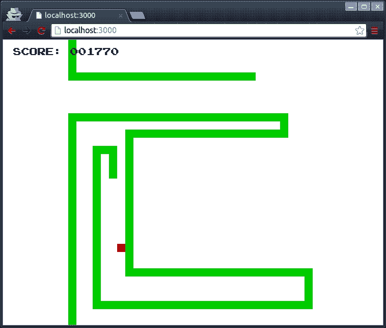
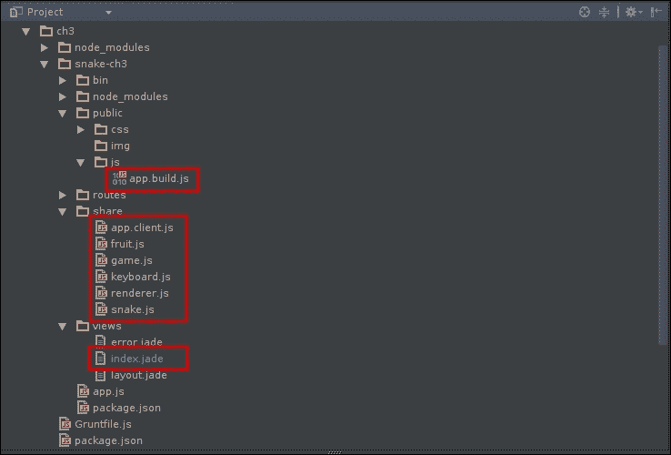
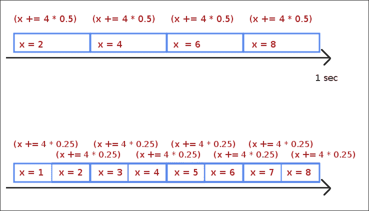
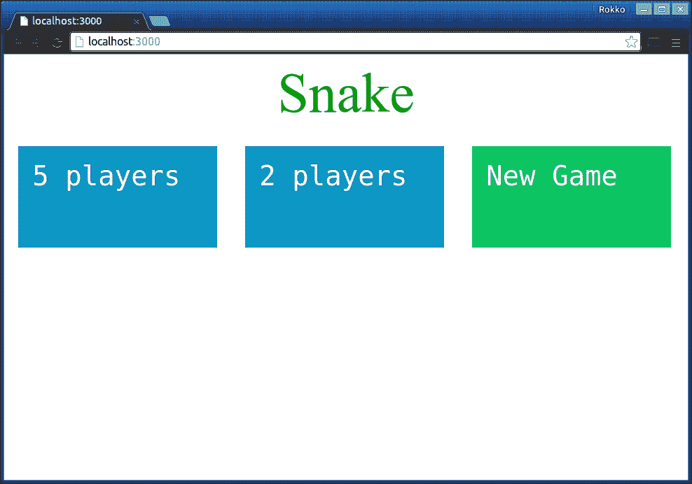

# 第三章：实时喂蛇

在现在已经涵盖了介绍性材料之后，是时候让橡皮碰到路了。本章将指导您将单人游戏升级为多人游戏。

与我们在第一章中开发的游戏不同，*开始多人游戏编程*，这款游戏需要实时进行，而不是回合制，这给我们带来了一系列挑战。一旦我们解决了跨两个或更多玩家同步实时游戏世界所涉及的基本问题，我们将研究其他基本但更深入的概念。

在本章中，我们将讨论以下原则和概念：

+   修复您的游戏循环以进行多人游戏

+   实施权威服务器

+   大厅和房间系统

+   匹配算法

+   使用**Socket.io**进行套接字编程

# 游戏开发的 hello world

当你学习编程时，肯定写过一个*hello world*程序。在游戏开发中，我会说每个开发者都应该从经典的*hello world*游戏——贪吃蛇开始。概念很简单：在屏幕上移动一个方块，收集特殊方块，使您的方块拉伸成一系列相连的方块，类似于蛇的移动。如果你把蛇的头撞到它的身体，你就输了。



这个实现只允许蛇向上、向下、向左或向右移动。一旦您指定了蛇的移动方向，它将继续沿着该方向移动，直到您将其移动到另一个方向。作为奖励，这个特定的实现允许您在屏幕上环绕——也就是说，如果您移动到屏幕的一侧之外，蛇将出现在相反的一侧。

捕捉红色方块会使蛇增长一个额外的方块，并将您的得分增加 10 分。将蛇撞到自己会停止游戏循环，并打印一个简单的游戏结束消息。

为了使这个初始版本保持简单，没有任何额外的屏幕，包括主入口屏幕。游戏加载完毕后游戏就开始了。随着我们在这个单人版本的游戏上进行扩展，我们将添加必需的屏幕，使其更直观和用户友好，以便多个玩家加入游戏。

## 设置游戏

这个初始的单人版本的游戏的目标是使用尽可能少的代码制作一个可玩的游戏，使用我们可以构建的最基本的模型。因此，许多额外的细节留作练习。

为了为游戏添加服务器端组件做好准备，我们使用 Node.js 编写了游戏的第一个版本，并使用 Browserify 将其导出到浏览器中，如第二章中所讨论的那样，*设置环境*。

### package.json

为了使一切尽可能简单，我们将使用一个`package.json`文件，它只需要**Express**框架来帮助我们进行路由和 Grunt 插件来帮助我们使用 Browserify 自动构建和导出我们的模块：

```js
// ch3/package.json
{
    "name": "snake-ch3",
    "dependencies": {
        "express": "*",
        "express-generator": "*"
    },
    "devDependencies": {
        "grunt": "~0.4.5",
        "grunt-browserify": "~3.4.0",
        "grunt-contrib-uglify": "~0.8.0",
        "grunt-contrib-watch": "~0.6.1"
    }
}
```

### 注意

**Express.js**是一个用于 Node.js 的 Web 框架，它允许我们非常快速地设置整个 Web 服务器来托管和提供我们的游戏。（参考[`expressjs.com/`](http://expressjs.com/)。）虽然 Express 在我们的项目中扮演着重要角色，因为它路由用户请求以获取适当的文件，但了解它的工作原理并不是本章或本书的先决条件。我们将涵盖足够的绝对基础知识，让您开始使用这个强大的框架。

有了这一切，我们使用 Express 命令行工具来构建项目。

```js
npm install
express snake-ch3
cd snake-ch3
npm install

```

执行上述命令序列后，我们已经设置好了我们的 Node.js 服务器的样板，其中包括 Express 的所有默认设置，对于我们的目的来说，这将完全正常工作。如果由于任何原因出现问题，将会有足够的错误消息帮助您理解问题所在。假设在输入上述命令后一切都进行得很顺利，您现在可以通过以下命令启动服务器来测试项目：

```js
npm start

```

这将在端口`3000`上启动服务器，您可以在现代浏览器上加载`http://localhost:3000/`。



项目结构现在看起来像前面的屏幕截图中的那样，除了红框内的文件不会被 Express Generator 生成。我们将手动创建和编辑这些文件，您将在接下来的几节中看到。

### Index.jade

默认情况下，Express 会创建一个显示欢迎消息的索引文件。由于我们现在只需要一个屏幕来显示游戏，我们将编辑这个文件以满足我们自己的目的：

```js
// ch3/snake-ch3/views/index.jade
extends layout

block content
  div#gameArea
    p#scoreA SCORE: <span>000000</span>
    p#gameOver.animated.pulse.hidden Game Over
    canvas#gameCanvas
    div#statsPanel
  script(src='/js/app.build.js')
```

如果你用力眨眼，你会看到 HTML 标记。如果你不熟悉 Express 默认使用的 Jade 模板语言，不用担心。在模板中，我们创建了一个`<p>`元素，用来显示当前得分，一个用于游戏结束消息的元素，以及一个用来渲染游戏的 canvas 元素。我们还包括了主脚本文件，这是 Grunt 任务的输出，它将所有文件连接起来，并在它们上运行 Browserify，以便我们可以在浏览器中加载它。由于`index.jade`是本书中我们将看到的 Jade 的唯一内容，我们不会进一步深入讨论。有关 Jade 的工作原理和功能的更多信息，请访问其网站[`www.jade-lang.com`](http://www.jade-lang.com)。

## 游戏模块

有了上述结构，现在我们所需要的只是实现游戏的几个类。我们将用五个类来实现这个，这样当我们实现游戏服务器时，我们可以重用单独的逻辑片段。

### Game.js

这是我们将实现的`game.js`文件：

```js
// ch3/snake-ch3/share/game.js
var Game = function (fps) {
    this.fps = fps;
    this.delay = 1000 / this.fps;
    this.lastTime = 0;
    this.raf = 0;

    this.onUpdate = function (delta) {
    };
    this.onRender = function () {
    };
};

Game.prototype.update = function (delta) {
    this.onUpdate(delta);
};

Game.prototype.render = function () {
    this.onRender();
};

Game.prototype.loop = function (now) {
    this.raf = requestAnimationFrame(this.loop.bind(this));

    var delta = now - this.lastTime;
    if (delta >= this.delay) {
        this.update(delta);
        this.render();
        this.lastTime = now;
    }
};

Game.prototype.start = function () {
    if (this.raf < 1) {
        this.loop(0);
    }
};

Game.prototype.stop = function () {
    if (this.raf > 0) {
        cancelAnimationFrame(this.raf);
        this.raf = 0;
    }
};

module.exports = Game;
```

这个模块是我们项目的基石。它定义了一个非常简单的接口，抽象了一个简单的游戏循环。当我们实现这个类时，我们所需要做的就是定义`update()`和`render()`方法。

您会注意到使用了`requestAnimationFrame`，这是浏览器定义的一个特殊函数，帮助我们渲染游戏。由于游戏服务器不会渲染游戏，它也不会有这个函数可用，所以当我们开始在服务器上工作时，我们需要适应这一点。我们将在下一节更多地讨论帧速率的独立性。

### snake.js

我们将向我们的`snake.js`文件添加以下代码：

```js
// ch3/snake-ch3/share/snake.js
var keys = require('./keyboard.js');
var EventEmitter = require('events').EventEmitter;
var util = require('util');

var Snake = function (id, x, y, color_hex, width, height) {
    this.id = id;
    this.color = color_hex;
    this.head = {x: x, y: y};
    this.pieces = [this.head];
    this.width = width || 16;
    this.height = height || 16;
    this.readyToGrow = false;
    this.input = {};
};

Snake.events = {
    POWER_UP: 'Snake:powerup',
    COLLISION: 'Snake:collision'
};

util.inherits(Snake, EventEmitter);

Snake.prototype.setKey = function (key) {
    this.input[keys.UP] = false;
    this.input[keys.DOWN] = false;
    this.input[keys.LEFT] = false;
    this.input[keys.RIGHT] = false;
    this.input[key] = true;
};

Snake.prototype.update = function (delta) {
    if (this.readyToGrow) {
        this.pieces.push({x: -10, y: -10});
        this.readyToGrow = false;
    }

    for (var len = this.pieces.length, i = len - 1; i > 0; i--) {
        this.pieces[i].x = this.pieces[i - 1].x;
        this.pieces[i].y = this.pieces[i - 1].y;
    }

    if (this.input[keys.LEFT]) {
        this.head.x += -1;
    } else if (this.input[keys.RIGHT]) {
        this.head.x += 1;
    } else if (this.input[keys.UP]) {
        this.head.y += -1;
    } else if (this.input[keys.DOWN]) {
        this.head.y += 1;
    }
};

Snake.prototype.checkCollision = function(){
    var collide = this.pieces.some(function(piece, i){
        return i > 0 && piece.x === this.head.x && piece.y === this.head.y;
    }, this);

    if (collide) {
        this.emit(Snake.events.COLLISION, {id: this.id, point: this.head, timestamp: performance.now()});
    }
};

Snake.prototype.grow = function() {
    this.readyToGrow = true;
    this.emit(Snake.events.POWER_UP, {id: this.id, size: this.pieces.length, timestamp: performance.now()});
};

module.exports = Snake;
```

蛇类扩展了 Node 的`EventEmitter`类，以便它可以向主应用程序发出事件。这样我们就可以隔离类的具体行为，并将其与任何根据我们的选择对蛇作出响应的具体实现解耦。

我们还创建了一个简单的界面，主应用程序可以使用它来控制蛇。同样，由于此版本的即时目标是在浏览器中运行游戏，我们将利用浏览器特定的功能，这种情况下是`window.performance.now()`，当需要时我们将用兼容 Node.js 的模块替换它。

## 其他支持模块

还有三个其他类（即`fruit.js`，`keyboard.js`和`renderer.js`），它们仅仅包装了 canvas 和 canvas 上下文对象，一个 JavaScript 等价的枚举，帮助我们引用键盘输入，以及一个简单的点，我们将用它来表示蛇将吃的小球。为简洁起见，我们将省略这些类的代码。

### app.client.js

这是我们的`app.client.js`模块应该是什么样子的：

```js
// ch3/snake-ch3/share/app.client.js
game.onUpdate = function (delta) {
    var now = performance.now();

    // Check if there's no fruits left to be eaten. If so, create a new one.
    if (fruits.length < 1) {
        fruitDelta = now - lastFruit;

        // If there's been enough time without a fruit for the snakes,
        // create a new one at a random position, and place it in the world
        if (fruitDelta >= fruitDelay) {
            fruits[0] = new Fruit(
              parseInt(Math.random() * renderer.canvas.width / BLOCK_WIDTH / 2, 10),
              parseInt(Math.random() * renderer.canvas.width / BLOCK_HEIGHT / 2, 10),
              '#c00', BLOCK_WIDTH, BLOCK_HEIGHT
         );
        }
    }

    player.update(delta);
    player.checkCollision();

    // Check if the snake has gone outside the game board.
    // If so, wrap it around to the other side
    if (player.head.x < 0) {
        player.head.x = parseInt(renderer.canvas.width / player.width, 10);
    }

    if (player.head.x > parseInt(renderer.canvas.width / player.width, 10)) {
        player.head.x = 0;
    }

    if (player.head.y < 0) {
        player.head.y = parseInt(renderer.canvas.height / player.height, 10);
    }

    if (player.head.y > parseInt(renderer.canvas.height / player.height, 10)) {
        player.head.y = 0;
    }

    // Check if there's a fruit to be eaten. If so, check if the snake has just
    // eaten it. If so, grow the player that ate it.
    if (fruits.length > 0) {
        if (player.head.x === fruits[0].x && player.head.y === fruits[0].y) {
            fruits = [];
            player.grow();
            lastFruit = now;
        }
    }
};

game.onRender = function () {
    ctx.clearRect(0, 0, renderer.canvas.width, renderer.canvas.height);

    ctx.fillStyle = player.color;
    player.pieces.forEach(function(piece){
        ctx.fillRect(
           piece.x * player.width,
           piece.y * player.height,
           player.width,
           player.height
        );
    });

    fruits.forEach(function(fruit){
        ctx.fillStyle = fruit.color;
        ctx.fillRect(
           fruit.x * fruit.width,
           fruit.y * fruit.height,
           fruit.width,
           fruit.height
        );
    });
};
```

`app.client` 模块的第一部分是游戏的具体实现，它导入所有必需的类和模块，并实例化游戏循环和玩家类。接下来（如前所述），我们实现了两个游戏循环生命周期方法，即 `update` 和 `render` 方法。当我们添加多人游戏功能时，我们需要对这两个方法进行的唯一更改是更新和渲染一组蛇，而不是单个蛇。

由于每个玩家的实际更新都委托给了 `snake` 类本身，游戏循环对该方法内部的操作没有任何问题。事实上，游戏循环甚至不关心 `update` 方法的输出，我们稍后会看到。关键在于游戏循环的 `update` 方法允许游戏中的每个实体在更新阶段更新自身。

同样，在渲染阶段，游戏循环只关心渲染它想要渲染的每个实体的当前状态。虽然我们也可以委托蛇和其他可视实体的渲染，但为了简单起见，我们将具体的渲染留在游戏循环内部。

最后，在 `app.client` 模块的末尾，我们连接到我们关心的传入事件。在这里，我们监听由 `snake` 对象创建的游戏事件。`Snake.events.POWER_UP` 和 `Snake.events.COLLISION` 自定义事件让我们执行回调函数，以响应蛇吃掉颗粒和与自身碰撞时的情况。

接下来，我们绑定键盘并监听按键事件。由于我们实现的游戏机制，我们不关心未被按下的任何键，这就是为什么我们不为这些事件注册任何监听器。这段代码块将来可以进行重构，因为客户端接收此类输入的方式将与服务器不同。例如，客户端仍然会直接从用户那里接收输入，使用相同的键盘事件作为输入，但服务器将从用户那里接收此输入，通过套接字连接通知服务器其状态：

```js
// whenever we receive a POWER_UP event from the game, we
// update the player's score and display its value inside scoreWidget.
player.on(Snake.events.POWER_UP, function(event){
    var score = event.size * 10;
    scoreWidgets.filter(function( widget){
        return widget.id === event.id;
    })
        .pop()
        .el.textContent = '000000'.slice(0, - (score + '').length) + score + '';
});

// whenever we receive a COLLISION event from the game, we
// stop the game and display a game over message to the player.
player.on(Snake.events.COLLISION, function(event){
    scoreWidgets.filter(function(widget){
        return widget.id === event.id;
    })
        .pop()
        .el.parentElement.classList.add('gameOver');

    game.stop();
    setTimeout(function(){
        ctx.fillStyle = '#f00';
        ctx.fillRect(event.point.x * player.width, event.point.y * player.height, player.width, player.height);
    }, 0);

    setTimeout(function(){
        gameOver.classList.remove('hidden');
    }, 100);
});

document.body.addEventListener('keydown', function (e) {
    var key = e.keyCode;

    switch (key) {
        case keys.ESC:
            game.stop();
            break;
        case keys.SPACEBAR:
            game.start();
            break;
        case keys.LEFT:
        case keys.RIGHT:
        case keys.UP:
        case keys.DOWN:
            player.setKey(key);
            break;
        case keys.D:
            console.log(player.pieces);
            break;
    }
});
```

# 游戏循环

正如你所知，游戏循环是任何实时游戏的核心。尽管游戏循环的功能相当简单，但现在让我们考虑一下同时运行游戏服务器和客户端的一些影响。

## 帧率独立性

游戏循环的目的只是确保游戏以一致有序的方式运行。例如，如果我们在更新游戏状态之前绘制当前游戏状态，玩家在与游戏交互时可能会发现游戏略微不同步，因为当前显示的内容至少会比玩家期望的要滞后一个帧。

此外，在 JavaScript 的基于事件的输入系统中，如果我们每次从用户那里接收输入就更新游戏，可能会导致游戏的不同部分在不同时间更新，使体验更加不同步。

因此，我们设置了游戏循环，以确保在处理和缓存任何输入之后，直到游戏循环的下一个 `tick`，我们可以在游戏步骤的 `update` 阶段应用输入，然后渲染更新的结果：

帧率独立性

这个问题最明显的解决方案是在游戏中建模输入空间；然后，在 `update` 阶段查询并相应地做出响应。在其他编程环境中，我们可以直接查询输入设备。由于 JavaScript 暴露事件，我们无法询问运行时左键当前是否被按下。

接下来，我们需要更新游戏，这在大多数情况下意味着我们会微调一些东西。在更新了几帧之后，我们在每次迭代中更新的这些小动作将合并在一起，形成平滑的运动。实际上，一旦游戏循环完成一个周期，我们需要再次调用游戏循环以进行下一个周期的循环：

```js
while (true) {
   update();
   render();
}
```

在大多数其他编程语言中，传统的游戏循环可能看起来像前面的代码片段，但在 JavaScript 中我们不能这样做，因为 while 循环会阻塞 JavaScript 的单个线程，导致浏览器锁死：

```js
function tick() {
   setTimeout(tick, 0.016);
   update();
   render();
}
```

在 JavaScript 中更合适的方法是使用定时器函数（`setTimeout`或`setInterval`）之一来调用游戏步骤方法。虽然这个解决方案实际上是有效的，不像 while 循环的想法，但我们可能会遇到一些问题，比如游戏消耗太多 CPU（以及移动设备的电池寿命），特别是当游戏不运行时循环继续执行。如果 JavaScript 忙于其他事情，定时器方法也可能会出现问题，`tick`函数无法像我们希望的那样频繁地被调用。

### 注意

也许你会想知道为什么我们在`tick`方法的开头而不是结尾调用`setTimeout`和`requestAnimationFrame`，而不是在方法内部的代码实际执行后。

之所以这样做是因为调用这两个函数中的任何一个都只是简单地安排`callback`函数在下一个事件循环周期运行。调用`setTimeout`或`requestAnimationFrame`会立即将执行返回给调用它的函数的下一个命令，然后函数的其余部分执行完成。

一旦函数返回，JavaScript 将执行事件循环中添加的下一个代码片段，换句话说，如果 JavaScript 在执行我们的游戏`tick`方法或其他事件发生时检测到用户输入，这些事件将被添加到队列中，并在 tick 方法返回后处理。因此，如果我们等到 tick 方法的结尾再次使用事件循环调度它，我们可能会发现 tick 方法在排队等候（以便它可以再次获得 CPU 的使用权）之前，其他回调将被处理。

通过提前调度`tick`方法，我们可以确保它在当前执行完成后尽快再次被调用，即使在当前执行期间触发了其他事件，并且其他代码被放入事件循环中。

最后，在 JavaScript 中编写游戏循环的最合适的方法是使用较新的`window.requireAnimationFrame`函数：

```js
function tick(timestamp) {
   var rafId = requestAnimationFrame(tick);
   update();
   render();
}
```

`requestAnimationFrame`是浏览器中实现的一个方便的函数，我们可以使用它来要求浏览器在进行下一次重绘之前调用我们的回调函数。由于浏览器内部工作超出了 JavaScript 的范围，刷新率现在处于操作系统级别，这更加精确。此外，由于浏览器知道何时需要重绘，并且比 JavaScript 更接近显示设备，它可以进行许多我们无法做到的优化。

调用`requestAnimationFrame`将返回一个整数值，该值将映射到回调列表中提供的函数。我们可以使用这个 ID 号来取消触发我们的回调，当浏览器确定它应该触发时。这是一种方便的方法，可以暂停游戏循环的执行，而不需要在回调的开头使用条件语句，这通常大部分时间都会评估为 false（或者我们希望如此）。

最后，我们提供给`RequestAnimationFrame`的回调函数将会传递一个时间戳数值，格式为`DOMHighResTimeStamp`类型。这个时间戳代表了在给定周期内，使用`RequestAnimationFrame`注册的回调被触发的时间。我们可以使用这个数值来计算自上一帧以来的时间差，从而将我们的游戏循环脱离时间空间连续性，接下来我们将讨论这一点。

## 基于时间的游戏循环

现在我们已经有了一种有效的方法，可以使我们的游戏更新速度与底层硬件的能力一样快，我们只需要控制更新发生的速率。一种选择是确保游戏循环在至少经过一定时间后才再次执行。这样我们就不会更新得比我们必须要更新的更频繁。另一种选择是计算上一次更新所花费的时间，并将该数字发送到更新函数中，以便根据时间差移动所有内容：



如前图所示，如果我们在一个浏览器或设备上以两倍的速度更新游戏，那么更新单帧所需的时间（也称为**时间差**）也会减半。使用这个时间差作为物理更新的因素，我们可以使每次更新相对于更新单帧所需的时间。换句话说，在整整一秒钟内，我们可以选择在几次更新中每次更新的幅度更大，或者在同一秒内多次更新游戏，但每次更新的幅度更小。在一秒结束时，我们仍然会移动相同的距离。

## 多个游戏循环

在不同的 CPU 上平稳一致地运行游戏本身就是一种胜利。既然我们已经过了这一关，现在让我们考虑如何在客户端和服务器上实现这一点。

在浏览器上，我们可以使用`requestAnimationFrame`来为用户运行游戏，就像之前演示的那样。然而，在服务器上，没有`requestAnimationFrame`。更糟糕的是，我们无法以每秒 60 次的速度将更新发送到所有参与者。理论上，我们完全可以这样做——也许在服务器在短短几秒内就会过热并崩溃之前。换句话说，对于同一服务器中的每个游戏来说，每秒运行 60 次更新会给服务器带来巨大的负载。因此，我们需要减慢服务器上更新的速度。

首先，由于 Node.js 中没有`requestAnimationFrame`，我们知道我们不能使用它。然而，由于游戏服务器的游戏循环的具体实现与游戏客户端的游戏循环是分开的，我们可以选择 Node 提供的另一种计时器机制。

其次，我们需要在服务器上运行第二个计时器，以便以更慢的速度向客户端发送更新。如果我们实际上尝试以每秒 60 帧的速度向每个客户端发送更新，我们很快就会使服务器过载，并且性能会下降。

解决客户端更新问题的方法是以更慢但一致的速度发送更新，允许服务器以可扩展的方式成为游戏状态的最终权威。在服务器发送更新之间，如果游戏需要更快的更新，我们可以让游戏客户端以最佳方式更新自身；然后，一旦它从服务器接收到信息，我们可以根据需要修复客户端状态。

在 Node.js 中，有两个常用的计时器函数，可以作为`setTimeout()`的高分辨率替代品。这两个函数分别是`setImmediate()`和`process.nextTick()`。你会选择使用这两个函数而不是`setTimeout()`的原因是因为`setTimeout()`不能保证你指定的延迟，也不能保证事件执行的顺序。

作为更好的替代方案，我们可以使用`setImmediate`来安排一个回调，在当前坐在事件队列上的每个事件之后运行。我们还可以使用`process.nextTick`，它将安排回调在当前代码块执行完毕后立即运行。

虽然`process.nextTick`似乎是两者之间更好的选择，但请记住它不会给 CPU 执行事件队列中的其他代码的机会（或允许 CPU 休息），导致执行占用 CPU 的 100％。因此，在您的 Node.js 游戏模拟中的游戏循环的特定用例中，您可能最好使用`setImmediate`。

如前所述，游戏服务器将运行两个定时器或循环。第一个是物理更新循环，将使用`setImmediate`来尝试以完整的 60 fps 高效运行。第二个将是客户端同步循环，不需要运行得那么快。

客户端同步循环的目的是权威性地告诉客户端游戏的真实状态，以便每个客户端可以更新自身。如果我们试图让服务器在每一帧调整每个客户端，游戏和服务器都会变得非常缓慢。一个简单而广泛使用的解决方案是每秒只同步几次客户端。与此同时，每个客户端可以在本地玩游戏，然后在服务器更新其状态时进行任何必要的更正。

# 实施权威服务器

这个服务器的策略是为了两个不同的目的运行两个游戏循环。第一个循环是物理更新，我们会以接近客户端循环频率的频率运行。第二个循环，我们称之为客户端同步循环，以较慢的速度运行，并在每个时刻将整个游戏状态发送给每个连接的客户端。

此时，我们只关注让服务器按照我们描述的方式工作。客户端的当前实现将继续像以前一样工作，本地管理整个游戏逻辑。客户端从服务器接收的任何数据（使用游戏同步循环）将只被渲染。在本书的后面，我们将讨论客户端预测的概念，其中我们将使用游戏同步循环的输入作为游戏逻辑的实际输入，而不仅仅是无意识地渲染它。

## 游戏服务器接口

从当前游戏客户端的实现中要改变的第一件事是分解输入和输出点，以便它们可以与中间的套接字层通信。我们可以将其视为一个编程接口，指定服务器和客户端将如何通信。

为此，让我们在项目中创建一个简单的模块，作为 JavaScript 中没有枚举的可怜之人的枚举。尽管此模块中的数据不是不可变的，但它将给我们带来优势，因为 IDE 将自动建议值，在我们犯拼写错误时纠正我们，并将我们所有的意图放在一个地方。按照惯例，任何以*server*_ 开头的事件代表服务器的操作。例如，名为`server_newRoom`的事件要求服务器创建一个新房间：

```js
// ch3/snake-ch3/share/events.js

module.exports = {
    server_spawnFruit: 'server:spawnFruit',
    server_newRoom: 'server:newRoom',
    server_startRoom: 'server:startRoom',
    server_joinRoom: 'server:joinRoom',
    server_listRooms: 'server:listRooms',
    server_setPlayerKey: 'server:setPlayerKey',

    client_newFruit: 'client:newFruit',
    client_roomJoined: 'client:roomJoined',
    client_roomsList: 'client:roomsList',
    client_playerState: 'client:playerState'
};
```

我们现在使用此模块中定义的字符串值来注册回调并以一致和可预测的方式在客户端和服务器之间发出套接字事件。例如，当我们发出名为`modules.exports.server_spawnFruit`的事件时，我们知道意图是让服务器接收到一个名为`spawnFruit`的动作。此外，您会注意到我们将使用`socket.io`来抽象化客户端和服务器之间的套接字通信。如果您现在想开始使用`socket.io`，请随时跳到本章末尾并阅读*Socket.io*部分。

```js
var gameEvents = require('./share/events.js');

socket.on(gameEvents.server_spawnFruit, function(data){
   var pos = game.spawnFruit(data.roomId, data.maxWidth, data.maxHeight);

   socket.emit(gameEvents.client_newFruit, pos);
});
```

在给定的示例中，我们首先将我们的模块包含到`gameEvents`变量中。然后，我们注册一个回调函数，每当套接字接收到`server_spawnFruit`事件时就会调用该函数。据推测，这段代码在某个服务器代码中，因为键名开头的 server 关键字指示了这一点。这个回调函数接受一个由客户端创建的数据参数（在套接字的另一端发送命令的人）。这个数据对象包含了生成游戏中新水果对象所需的数据。

接下来，我们使用套接字事件中的输入数据执行一些任务（在这种情况下，我们生成一个随机位置，可以在游戏世界中添加水果）。有了这些数据，我们向客户端发出一个套接字命令，发送我们刚刚生成的位置。

## 更新游戏客户端

在客户端代码中要改变的第一件事是添加不同的屏幕。至少，我们需要两个不同的屏幕。其中一个屏幕将是游戏板，就像我们迄今为止实现的那样。另一个是大厅，我们稍后会详细讨论。简而言之，大厅是玩家在加入特定房间之前所在的区域，我们稍后也会讨论。



在大厅中，玩家可以选择加入现有房间或创建并加入一个没有玩家的新房间。

在一个完美的世界中，你的游戏引擎会为多个屏幕提供很好的支持。由于我们正在编写的示例游戏不是用这样的游戏引擎编写的，我们将只使用基本的 HTML 和 CSS，并在同一个 HTML 文件中编写每个屏幕以及任何支持的道具和小部件：

```js
// ch3/snake-ch3/views/index.jade

extends layout

block content
  div#lobby
    h1 Snake
    div#roomList

 div#main.hidden
    div#gameArea
      p#scoreA SCORE: <span>000000</span>
      p#gameOver.animated.pulse.hidden Game Over
      canvas#gameCanvas
      div#statsPanel

  script(src='/js/socket.io.js')
  script(src='/js/app.build.js')
```

在上一个模板中只有三个代码块。首先，我们有一个 ID 为`lobby`的`div`元素，其中我们动态添加了一个可用游戏房间的列表。接下来，有一个 ID 为`main`的`div`元素，最初带有一个名为`hidden`的类，因此这个屏幕最初是不可见的。最后，我们包括了`socket.io`库以及我们的应用程序。

绑定到 HTML 结构的最简单方法是创建模块范围的全局变量，引用每个所需的节点。一旦这些引用就位，我们就可以附加必要的事件侦听器，以便玩家可以与界面交互：

```js
// ch3/snake-ch3/share/app.client.js

var roomList = document.getElementById('roomList');
var screens = {
    main: document.getElementById('main'),
    lobby: document.getElementById('lobby')
};

// …

socket.on(gameEvents.client_roomsList, function (rooms) {
    rooms.map(function (room) {
        var roomWidget = document.createElement('div');
        roomWidget.textContent = room.players.length + ' player';
        roomWidget.textContent += (room.players.length > 1 ? 's' : '');

        roomWidget.addEventListener('click', function () {
            socket.emit(gameEvents.server_joinRoom, {
                    roomId: room.roomId,
                    playerId: player.id,
                    playerX: player.head.x,
                    playerY: player.head.y,
                    playerColor: player.color
                }
            );
        });

        roomList.appendChild(roomWidget);
    });

    var roomWidget = document.createElement('div');
    roomWidget.classList.add('newRoomWidget');
    roomWidget.textContent = 'New Game';

    roomWidget.addEventListener('click', function () {
        socket.emit(gameEvents.server_newRoom, {
            id: player.id,
            x: player.head.x,
            y: player.head.y,
            color: player.color,
            maxWidth: window.innerWidth,
            maxHeight: window.innerHeight
        });
    });

    roomList.appendChild(roomWidget);
});

socket.on(gameEvents.client_roomJoined, function (data) {
    // ...
    screens.lobby.classList.add('hidden');
    screens.main.classList.remove('hidden');
});
```

由于初始游戏屏幕是大厅，并且大厅的标记已经可见，我们不需要做其他设置。我们只需注册一个套接字回调，当我们收到可用房间列表时就调用它，并在准备好时将单独的 HTML 节点附加到 DOM 上。

在不同的套接字回调函数内部，这次是与`roomJoined`自定义事件相关联的回调函数，我们首先使大厅屏幕不可见，然后使主屏幕可见。我们通过添加和移除名为 hidden 的 CSS 类来实现这一点，其定义如下代码片段所示：

```js
// ch3/snake-ch3/public/css/style.css

.hidden {
    display: none;
}
```

# 理解游戏循环

我们需要对原始游戏代码进行的下一组更改是在`game`类中。你会记得，这个类定义了一个基本的游戏生命周期，暴露了`update`和`render`函数，由使用它的人来实现。

由于在这个类中定义的游戏循环的核心（在`Game.prototype.loop`中找到）使用了`window.requestAnimationFrame`，我们需要摆脱这个调用，因为它在 Node.js（或者在浏览器之外的任何其他环境）中都不可用。

通常用于允许我们灵活地编写一个既在浏览器中使用又在服务器中使用的单个模块的技术是将浏览器和服务器特定的函数封装在一个自定义模块中。

使用 Browserify，我们可以编写两个分开的模块，包装环境特定的功能，但在代码中只引用一个。通过配置 Browserify 属性，我们可以告诉它在看到对自定义包装模块的`require`语句时编译不同的模块。为简单起见，我们只在这里提到了这种能力，但在本书中我们不会深入讨论。相反，我们将编写一个单一组件，它可以在运行时自动检测所处的环境并做出相应的响应。

```js
// ch3/snake-ch3/share/tick.js
var tick = function () {
    var ticks = 0;
    var timer;

    if (typeof requestAnimationFrame === 'undefined') {
        timer = function (cb) {
            setTimeout(function () {
                cb(++ticks);
            }, 0);
        }
    } else {
        timer = window.requestAnimationFrame;
    }

    return function (cb) {
        return timer(cb);
    }
};

module.exports = tick();
```

tick 组件由一个函数组成，根据`window.requestAnimationFrame`的可用性返回两个函数中的一个。这种模式一开始可能看起来有些混乱，但它的好处在于它只在初始设置之后检测环境一次，然后每次都根据环境进行特定功能。

请注意，我们从这个模块导出的是对`tick`的调用，而不仅仅是一个引用。这样，当我们需要这个模块时，在客户端代码中被引用的是`tick`返回的函数。在浏览器中，这将是对`window.requestAnimationFrame`的引用，在 node 中，它将是一个调用`setTimeout`的函数，通过向其传递一个递增的数字，类似于浏览器版本的`tick`。

## 游戏客户端的游戏循环

现在，抽象的游戏循环类已经准备在任何环境中使用，让我们看看如何重构现有的客户端实现，以便它可以由连接到权威服务器的 socket 驱动。

请注意，我们不再确定何时生成新的水果。在客户端上，我们只检查如何移动玩家角色。我们可以让服务器告诉我们每一帧蛇在哪里，但这会使应用程序负担过重。我们也可以只在服务器同步状态时渲染主要蛇，但这会使整个游戏看起来非常慢。

我们所做的是在这里复制整个逻辑，并在同步时忽略服务器对其的说法。稍后，我们将讨论客户端预测；在那时，我们将在这里添加一些逻辑来纠正我们在服务器同步时发现的任何差异。

```js
// ch3/snake-ch3/share/app.client.js

game.onUpdate = function (delta) {
    // The client no longer checks if the player has eaten a fruit.
    // This task has now become the server's jurisdiction.
    player.update(delta);
    player.checkCollision();

    if (player.head.x < 0) {
        player.head.x = parseInt(renderer.canvas.width / player.width, 10);
    }

    if (player.head.x > parseInt(renderer.canvas.width / player.width, 10)) {
        player.head.x = 0;
    }

    if (player.head.y < 0) {
        player.head.y = parseInt(renderer.canvas.height / player.height, 10);
    }

    if (player.head.y > parseInt(renderer.canvas.height / player.height, 10)) {
        player.head.y = 0;
    }

    if (fruits.length > 0) {
        if (player.head.x === fruits[0].x && player.head.y === fruits[0].y) {
            fruits = [];
            player.grow();
        }
    }
};
```

## 游戏服务器的游戏循环

这就是事情变得令人兴奋的地方。在我们为服务器端代码实现游戏循环之前，我们首先需要实现一个 API，客户端将使用它来查询服务器并发出其他命令。

在这个项目中使用`express`的一个好处是它与`Socket.io`非常配合。在本章后面专门介绍 Socket.io 之前，我们的主服务器脚本将如下所示：

```js
// ch3/snake-ch3/app.js

// …

var io = require('socket.io')();
var gameEvents = require('./share/events.js');
var game = require('./server/app.js');

var app = express();
app.io = io;

// …

io.on('connection', function(socket){
    // when a client requests a new room, create one, and assign
    // that client to this new room immediately.
    socket.on(gameEvents.server_newRoom, function(data){
        var roomId = game.newRoom(data.maxWidth, data.maxHeight);
        game.joinRoom(roomId, this, data.id, data.x, data.y, data.color);
    });

    // when a client requests to join an existing room, assign that
    // client to the room whose roomId is provided.
    socket.on(gameEvents.server_joinRoom, function(data){
        game.joinRoom(data.roomId, this, data.playerId, data.playerX, data.playerY, data.playerColor);
    });

    // when a client wishes to know what all the available rooms are,
    // send back a list of roomIds, along with how many active players
    // are in each room.
    socket.on(gameEvents.server_listRooms, function(){
        var rooms = game.listRooms();
        socket.emit(gameEvents.client_roomsList, rooms);
    });
});
```

在默认的 Express `app.js`脚本中，我们导入了`Socket.io`，游戏事件模块，以及我们之前定义的游戏应用程序，这将在本章的其余部分中讨论。

接下来，在设置 Express 完成后，我们设置与客户端的 socket 通信。第一步是等待连接建立，这将使我们可以访问绑定到单个客户端的单个 socket。

一旦我们有了一个活跃的 socket，我们通过向每个事件注册自定义事件监听器来配置我们关心的所有事件。您会注意到，先前提到的一些示例事件监听器也会向请求的 socket 发出事件，而其他的则只是在游戏对象上调用方法。两种情况之间的区别在于，当我们只需要与单个客户端（请求的客户端）通信时，我们直接从事件监听器中联系该 socket。然而，有时我们可能希望与连接到同一房间的所有 socket 进行通信。在这种情况下，我们必须让游戏对象通知所有需要的玩家，因为它将知道所有属于给定房间的客户端。

# 大厅和房间系统

游戏房间和大厅的概念对多人游戏至关重要。为了理解其工作原理，可以将游戏服务器视为人们一起玩游戏的建筑物。

在进入建筑物之前，玩家可以站在建筑物前面，欣赏外墙的美丽。在我们的比喻中，凝视建筑物的前面相当于被游戏介绍的启动画面所欢迎。

进入建筑物后，玩家可能会看到一些选项供其选择，比如他或她可能想去的可用楼层的列表。在一些游戏中，您可以选择要玩的游戏类型以及难度级别。可以将此视为乘坐电梯到特定楼层。

最后，您到达了一个大厅。与现实生活中大厅的工作方式类似，在多人游戏中，大厅是多个玩家在进入进行游戏的特定房间之前去的一个特殊房间。在大厅中，您可以看到可用的房间，然后选择一个加入。

一旦您决定加入哪个房间，您现在可以进入该房间并与其他玩家一起参与现有游戏。或者，您可以加入一个空房间，并等待其他人加入。

通常情况下，多人游戏中永远不会有空房间。每个房间至少有一个玩家，并且每个玩家一次只能属于一个房间。一旦所有玩家离开房间，游戏服务器将删除该房间并释放相关资源。

## 实现大厅

通过对大厅的基本理解，我们可以以多种方式实现它。一般来说，大厅实际上是所有玩家在最终进入进行特定游戏的房间之前加入的一个特殊房间。

实现这一点的一种方法是将服务器中的所有套接字连接跟踪为一个数组。在实际操作中，这些套接字数组就是您的大厅。一旦玩家连接到大厅（换句话说，一旦玩家连接到您的服务器），他或她就可以与其他玩家进行通信，并可能成为大厅中其他玩家之间对话的观察者。

在我们的情况下，大厅简单明了。玩家在启动游戏时会自动分配到大厅。一旦进入大厅，玩家可以向服务器查询可用房间的列表。然后，玩家可以发出套接字命令加入现有房间或创建一个新房间：

```js
// ch3/snake-ch3/server/app.js

var Game = require('./../share/game.js');
var gameEvents = require('./../share/events.js');
var Room = require('./room.js');

// ...

/** @type {Array.<Room>} */
var rooms = [];

module.exports = {
    newRoom: function(maxWidth, maxHeight){
        var room = new Room(FPS, maxWidth, maxHeight);
        rooms.push(room);
        return rooms.length - 1;
    },

    listRooms: function(){
        return rooms.map(function(room, index) {
            return {
                roomId: index,
                players: room.players.map(function(player){
                    return {
                        id: player.snake.id,
                        x: player.snake.head.x,
                        y: player.snake.head.y,
                        color: player.snake.color
                    };
                })
            };
        });
    },

    joinRoom: function(roomId, socket, playerId, playerX, playerY, playerColor) {
        var room = rooms[roomId];
        var snake = new Snake(playerId, playerX, playerY, playerColor, 1, 1);
        room.join(snake, socket);

        socket.emit(gameEvents.client_roomJoined, {roomId: roomId});
    },
};
```

请记住，我们的主服务器脚本公开了一个接口，套接字可以使用该接口与游戏服务器进行通信。前面提到的脚本是接口通信的后端服务。连接到服务器的实际套接字存储在并由 Socket.io 管理。

可用房间列表是作为一个`Room`对象数组实现的，我们将在下一节详细讨论。请注意，每个房间都需要至少两样东西。首先，房间需要一种方法来分组玩家并与这些玩家一起运行游戏。其次，房间需要一种方法，让客户端和服务器能够唯一识别每个单独的房间。

识别各个房间的两种简单方法是确保每个房间对象都有一个 ID 属性，该属性需要在整个游戏空间中是唯一的，或者我们可以使用存储房间的数组索引。

为简单起见，我们选择了第二种方法。请记住，如果我们删除一个房间并将其从房间数组中切割出来，一些玩家可能现在指向错误的房间 ID。

例如，假设数组中有三个房间，房间的 ID 分别为 0、1 和 2。假设每个房间都有几个玩家参与游戏。最后，想象一下，房间 ID 为 0 的所有玩家离开了游戏。如果我们将数组中的第一个房间切掉（存储在索引 0 处），那么数组中原来的第二个元素（以前存储在索引 1 处）将被移到数组的前面（索引 0）。数组中的第三个元素也会改变，将存储在索引 1 处而不是索引 2。因此，原来在房间 1 和 2 中的玩家现在将以相同的房间 ID 报告给游戏服务器，但服务器将把第一个房间报告为第二个房间，而第二个房间将不存在。因此，我们必须避免通过切掉空房间来删除它们。请记住，JavaScript 可以表示的最大整数是 2⁵³（等于 9,007,199,254,740,992），因此如果我们只是在房间数组的末尾添加新房间，我们不会用完数组中的槽位。

## 实现房间

游戏房间是一个模块，实现了游戏类并运行游戏循环。这个模块看起来与客户端游戏非常相似，因为它引用了玩家和水果对象，并在每个游戏时刻更新游戏状态。

您会注意到一个不同之处是服务器中没有渲染阶段。此外，房间将需要公开一些方法，以便服务器应用程序可以根据需要管理它。由于每个房间都引用了其中的所有玩家，服务器中的每个玩家都由套接字表示，因此房间可以联系到连接到它的每个玩家：

```js
// ch3/snake-ch3/server/room.js

var Game = require('./../share/game.js');
var Snake = require('./../share/snake.js');
var Fruit = require('./../share/fruit.js');
var keys = require('./../share/keyboard.js');
var gameEvents = require('./../share/events.js');

/** @type {Game} game */
var game = null, gameUpdateRate = 1, gameUpdates = 0;
var players = [], fruits = [], fruitColor = '#c00';
var fruitDelay = 1500, lastFruit = 0, fruitDelta = 0;

var Room = function (fps, worldWidth, worldHeight) {
    var self = this;
    game = new Game(fps);

    game.onUpdate = function (delta) {
        var now = process.hrtime()[1];
        if (fruits.length < 1) {
            fruitDelta = now - lastFruit;

            if (fruitDelta >= fruitDelay) {
                var pos = {
                    x: parseInt(Math.random() * worldWidth, 10),
                    y: parseInt(Math.random() * worldHeight, 10)
                };

                self.addFruit(pos);
                players.map(function(player){
                    player.socket.emit(gameEvents.client_newFruit, pos);
                });
            }
        }

        players.map(function (player) {
            player.snake.update(delta);
            player.snake.checkCollision();

            if (player.snake.head.x < 0) {
                player.snake.head.x = worldWidth;
            }

            if (player.snake.head.x > worldWidth) {
                player.snake.head.x = 0;
            }

            if (player.snake.head.y < 0) {
                player.snake.head.y = worldHeight;
            }

            if (player.snake.head.y > worldHeight) {
                player.snake.head.y = 0;
            }

            if (fruits.length > 0) {
                if (player.snake.head.x === fruits[0].x
                    && player.snake.head.y === fruits[0].y) {
                    fruits = [];
                    player.snake.grow();
                }
            }
        });

        if (++gameUpdates % gameUpdateRate === 0) {
            gameUpdates = 0;
            var data = players.map(function(player){
                return player.snake;
            });
            players.map(function(player){
                player.socket.emit(gameEvents.client_playerState, data);
            });

            lastFruit = now;
        }
    };
};

Room.prototype.start = function () {
    game.start();
};

Room.prototype.addFruit = function (pos) {
    fruits[0] = new Fruit(pos.x, pos.y, fruitColor, 1, 1);
};

Room.prototype.join = function (snake, socket) {
    if (players.indexOf(snake.id) < 0) {
        players.push({
            snake: snake,
            socket: socket
        });
    }
};

Room.prototype.getPlayers = function(){
    return players;
};

module.exports = Room;
```

请注意，玩家数组保存了包含对蛇对象的引用以及实际套接字的对象文字列表。这样，两个资源在同一个逻辑位置上。每当我们需要对房间中的每个玩家进行 ping 时，我们只需映射玩家数组，然后通过`player.socket.emit`访问套接字。

此外，请注意，同步循环放置在主游戏循环内，但我们只在一定数量的帧经过后才触发同步循环内的逻辑。目标是定期同步所有客户端。

# 在游戏房间内匹配玩家

在我们将各种概念分解为简单的基本原理之后，您将看到实现每个模块并不像一开始听起来那么复杂。玩家匹配就是一个例子。

在游戏房间中，您可能希望以不同的方式匹配玩家。虽然我们的示例游戏没有进行任何复杂的匹配（我们允许玩家盲目匹配自己），但您应该知道这里有更多的选择。

以下是一些关于如何将玩家匹配到同一个游戏世界的想法。请记住，有第三方服务，比如谷歌的 Play 服务 API，可以帮助你处理这些问题。

## 邀请朋友进入你的世界

匹配玩家的最吸引人的方式之一利用了当今世界的社交方面。通过与社交网络服务集成（或使用由玩家填充的自己的社交网络），您可以让玩家选择邀请朋友一起玩。

虽然这可能是一种有趣的体验，但不言而喻的是，两个玩家必须同时在线才能进行游戏。通常，这意味着当玩家向他或她的朋友发送邀请时，会向朋友发送一封包含有关邀请信息的电子邮件。每当朋友加入游戏房间并且两个玩家准备好时，游戏就可以开始了。

这种技术的一个变种是只显示可用的朋友（即已经在线并且在大厅或游戏房间中的朋友）。这样游戏可以立即开始，或者在朋友退出当前游戏后立即开始。

## 自动匹配

也许，您没有社交网络可以利用，或者，玩家不在乎对手是谁。当您希望玩家能够快速进入并玩一局游戏时，自动匹配是一个很好的选择。

有更具体的方法可以自动匹配玩家（例如，根据他们的技能或其他标准自动匹配玩家），但在最基本的形式中，您需要为第一个玩家创建一个私人房间（私人房间指的是一个不列出供任何玩家加入的房间，只有游戏服务器知道它），然后等待匹配的玩家加入该房间。

## 基于技能的匹配

另一种常见的玩家匹配到同一游戏房间的方式是根据他们的技能水平将玩家分组。跟踪玩家的技能水平的方式至少可以有三种确定方式，即询问用户他或她的技能水平是什么，监控他们在单个会话期间的表现，或者在多个会话中持久化玩家的信息。

第一种选择是最容易实现的。通常的做法是通过显示一个菜单，其中有三个或更多的选项，要求玩家从这些选项中选择，例如业余、高级和摇滚明星。根据这个选择，然后您将尝试与同一组的其他玩家匹配。

这种方法的一个可能的好处是，没有与游戏的过去历史（从服务器的角度来看）的新玩家可以立即开始与更高级的玩家对战。另一方面，同样的功能也可能被认为是这种方法的一个缺点，因为真正高级的玩家可能只希望与同样技能水平的玩家对战，而可能会因为与声称拥有更高技能水平的较差玩家匹配而感到沮丧。

第二个选项是让每个人从同一水平开始（或者随机分配新玩家的第一个技能水平）。然后，随着更多的游戏进行，应用程序可以跟踪每个玩家的胜利和失败以及有关每个玩家的其他元数据，以便您可以将每个玩家分成当前的技能水平。

例如，一个玩家可能在一个初学者房间开始游戏。在赢得两场比赛并且没有输掉任何一场之后，您可以将这个玩家放入一个高级房间。在玩家玩了额外的两三场比赛并且赢得了两三场胜利之后，您现在可以认为这个玩家处于超高级水平。

这种方法的明显缺点是，它假设一个个体玩家会保持足够长的登录时间来进行多次游戏。根据您设计的游戏类型，大多数玩家甚至不会登录完成单个游戏会话。

然而，如果您的游戏是这种类型的理想选择（即单个游戏的持续时间不超过几分钟），那么这种匹配技术非常有效，因为您不需要编写任何长期持久性逻辑或需要验证用户。

最后，您可以通过在某种后端数据库中持久化他们的信息来跟踪玩家的技能水平。在大多数情况下，这将需要玩家拥有个人帐户，在游戏开始之前需要进行身份验证。

同样，在某些情况下，您可能希望使用现有的第三方服务来验证玩家，并可能在服务本身中持久化您生成的有关他们的信息。

虽然这可能会变得非常复杂和引人入胜，但基本概念很简单——计算一些可以用来推断玩家技能水平的分数，并将该信息存储在某个地方，以便以后可以检索。从这个角度来看，您可能可以通过使用 HTML5 的本地存储 API 在本地存储玩家当前的技能水平来实现这种持久性。这样做的主要缺点是，这些数据将被困在玩家的机器上，因此如果玩家使用不同的机器（或者清除本地存储数据），您将无法访问这些数据。

# Socket.io

在第一章中，*开始多人游戏编程*，我们使用原生 HTML5 套接字实现了第一个演示游戏。尽管 WebSockets 仍然非常棒，但不幸的是，它们仍然严重依赖于玩家使用的特定浏览器。

今天，每个现代浏览器都配备了完整的 WebSockets 实现，特别是在移动设备上，世界似乎正在趋同。然而，可能有一种例外情况，用户的浏览器不完全支持 WebSockets，但支持 canvas（或者其他 HTML5 API），这时 Socket.io 就派上用场了。

简而言之，Socket.io 是一个开源库，提供了对套接字的出色抽象。不仅如此，Socket.io 还使实现前端套接字客户端将使用的后端服务变得非常容易。

实现服务器端代码就像指定连接的端口，然后实现您感兴趣的事件的回调一样容易。

现在，本书并不是想要掌握 Socket.io 的每个方面的全面指南，对于该库提供的许多功能，也不会过于描述。然而，您可能会发现 Socket.io 提供了令人惊叹的客户端支持。换句话说，如果使用套接字的浏览器没有实现 WebSockets 规范，那么 Socket.io 将回退到其他一些可以用于与服务器异步通信的技术。虽然其中一些技术可能对实时游戏来说太慢（例如，如果浏览器不支持其他技术，Socket.io 最终会回退到使用 HTML iFrames 与服务器通信），但了解该库的强大之处还是很有好处的。

## 安装 Socket.io

我们将通过 NPM 将 Socket.io 引入我们的项目。一定要使用本书中使用的版本（1.3.5），因为一些方法或配置可能会有所不同。

```js
npm install socket.io --save
npm install socket.io-client –save

```

再次强调，由于我们使用 Express 框架来简化创建 Node.js 服务器的工作，我们将 Socket.io 与 Express 集成。

```js
// ch3/snake-ch3/app.js

var express = require('express');
var io = require('socket.io')();

// ...

var app = express();
app.io = io;

// ...

io.on('connection', function(socket){
        console.log('New client connected. Socket ready!');
    });
});
```

我们需要做的第一件事是`require` Socket.io 以及 Express 和服务器脚本的所有其他依赖项。然后，我们利用 JavaScript 的动态特性将 Socket.io 添加到 Express 实例中。我们这样做是因为 Socket.io 还没有完全设置好，因为我们需要访问 Express 使用的 HTTP 服务器。在我们的情况下，按照当前标准，我们使用 Express Version 4.9.0 以及 express-generator，它会在`<project-name>/bin/www`下生成一个文件，其中进行低级服务器设置。这是我们将 Socket.io 集成到 Express 中的地方，通过将 Express 使用的相同服务器附加到我们的 Socket.io 实例中。

```js
// ch3/snake-ch3/bin/www

#!/usr/bin/env node
var debug = require('debug')('snake-ch3');
var app = require('../app');

app.set('port', process.env.PORT || 3000);

var server = app.listen(app.get('port'), function() {
  debug('Express server listening on port ' + server.address().port);
});

app.io.attach(server);
```

## 客户端 Socket.io

最后一步是在我们的客户端 JavaScript 中使用 Socket.io 库。在这里，只有两个简单的步骤，如果你以前做过任何 JavaScript 编程，那么你肯定已经习惯了。

首先，我们将客户端库复制到我们的公共目录，以便我们可以将其包含到我们的客户端代码中。为此，将`ch3/snake-ch3/node_modules/socket.io-client/socket.io.js`文件复制到`ch3/snake-ch3/public/js/socket.io.js`。接下来，使用脚本标签在您的 HTML 文件中包含该库。

为了在客户端代码中开始使用套接字，你所需要做的就是通过需要它的域来实例化它，服务器正在运行的域。

```js
// ch3/snake-ch3/share/app.client.js

var socket = require('socket.io-client')(window.location.origin);

// …

socket.on('connect', function () {
    socket.emit(gameEvents.server_listRooms);
});
```

现在，套接字将立即异步地尝试连接到您的服务器。一旦它这样做，连接事件将触发，相应的回调也将被触发，您将知道套接字已经准备好使用。从那时起，您可以开始向套接字的另一端发出事件。

# 总结

希望这一章让你对多人游戏开发的独特方面感到兴奋。我们将一个现有的单人贪吃蛇游戏分解成了一个权威服务器组件和一个由套接字驱动的前端组件。我们使用 Socket.io 将游戏客户端和服务器以非常无缝的方式与 Express 进行了链接。我们还讨论了游戏大厅和游戏房间的概念，以及将玩家匹配到同一个游戏世界的方法。

在下一章中，我们将通过添加客户端预测和校正以及输入插值来改进我们的贪吃蛇游戏，以减少网络延迟。我们还将修复游戏服务器的游戏循环，以实现更流畅和更高效的游戏。
