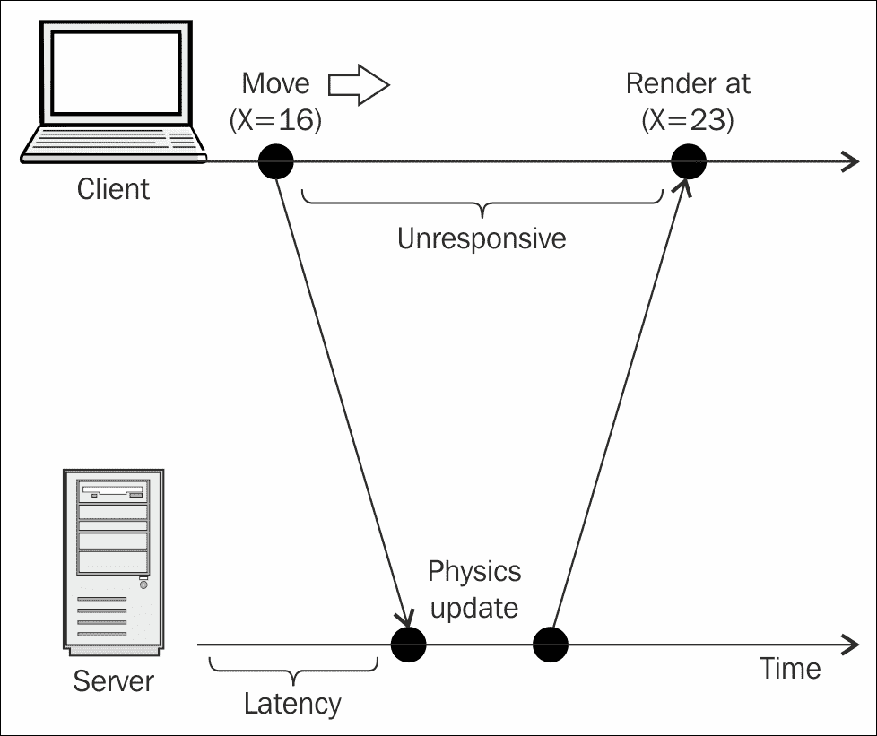

# 第四章：减少网络延迟

现在我们有一个允许多个玩家在同一个或多个游戏房间中存在的工作游戏，我们将迭代并解决在线游戏中一个非常重要的问题，即网络延迟。考虑到你将需要在未来很多年里思考这个问题，我们将非常专注于本章涵盖的主题。

在本章中，我们将讨论以下原则和概念：

+   处理多人游戏中的网络延迟

+   在客户端实现本地游戏服务器

+   客户端预测

+   插值真实位置以纠正错误的预测

# 处理网络延迟

尽管你可能是那些拥有千兆互联网连接的幸运公民之一，但你应该知道世界上大多数地方肯定不那么幸运。因此，在开发在线多人游戏时需要牢记的一些最重要的事情是，并非所有玩家都拥有相同的网络速度，也并非所有玩家都拥有高速连接。

从本节中你需要记住的主要观点是，只要玩家和游戏服务器之间存在网络（或者两个玩家直接连接在一起），就会存在延迟。

的确，并非所有游戏都需要在网络上具有几乎即时的响应时间，例如，回合制游戏，比如国际象棋，或者我们的贪吃蛇实现，因为游戏的 tick 比大多数动作游戏要慢得多。然而，对于实时、快节奏的游戏，即使是 50 毫秒的小延迟也会使游戏变得非常卡顿和令人讨厌。

想象一下这种情况。你按下键盘上的右箭头键。你的游戏客户端告诉服务器你的意图是向右移动。服务器最终在 50 毫秒后收到你的消息，运行其更新周期，并告诉你将你的角色放在位置（23，42）。最后，另外 50 毫秒后，你的客户端接收到服务器的消息，按下键盘的那一刻，你的玩家开始朝着你想要的位置移动。



正如前几章中提到的，网络延迟问题最常用的解决方案是改变客户端逻辑，使其能够立即响应用户输入，同时向服务器更新其输入。然后，权威服务器根据每个客户端的输入更新自己的游戏状态，最后向所有客户端发送游戏世界当前状态的版本。然后这些客户端可以更新自己，以便与服务器同步，整个过程继续进行。


因此，正如你可能已经意识到的那样，目标根本不是消除延迟，因为这在物理上是不可能的，而只是将其隐藏在一个不断更新的游戏后面，以便玩家产生游戏正在实时由服务器更新的错觉。

只要玩家觉得游戏反应灵敏，并且表现符合玩家的期望，从实际目的来看，你已经解决了网络延迟问题。在与服务器的每次通信（或者从服务器到客户端），问问自己延迟在哪里，以及如何通过保持游戏进行来隐藏它，而数据包在传输过程中。

## 在同步客户端中锁定步伐

到目前为止，我们已经讨论了客户端-服务器结构，其中服务器是游戏的最终权威，客户端对游戏逻辑几乎没有或根本没有权威。换句话说，客户端只是接受玩家的任何输入，并将其传递给服务器。一旦服务器向客户端发送更新的位置，客户端就会渲染游戏状态。

在线多人游戏中常用的另一种模型是锁步方法。在这种方法中，客户端尽可能频繁地告诉服务器有关玩家收到的任何输入。然后服务器将此输入广播给所有其他客户端。然后客户端依次使用每个参与者的输入状态进行下一个更新周期，并且理论上，每个人最终都会得到相同的游戏状态。每当服务器进行锁步（从每个客户端的输入数据运行物理更新）时，我们称之为一个回合。

为了使服务器保持对游戏的最终控制权，服务器的模拟也会运行更新周期，并且模拟的输出也会广播给客户端。如果客户端的更新状态与服务器发送的状态不同，客户端会认为服务器的数据是正确的，并相应地更新自己。

# 固定时间步

我们在服务器代码中将要更新的第一件事是游戏循环，它将做的第一件不同的事情是不再有增量时间的概念。此外，我们需要在更新周期之间排队每个客户端的所有输入，以便在运行物理更新时，我们有数据来更新游戏状态。

由于我们现在使用了一致的时间步长，我们不需要在服务器上跟踪增量时间。因此，服务器在客户端的角度也没有增量时间的概念。

例如，想象一个赛车游戏，玩家以每秒 300 像素的速度驾驶。假设这个特定的客户端以每秒 60 帧的频率运行游戏。假设汽车在整个秒内保持稳定的速度，那么经过 60 帧，汽车将行驶 300 像素。此外，在每帧期间，汽车将平均行驶 5 像素。

现在，假设服务器的游戏循环配置为每秒 10 帧，或者每 100 毫秒运行一次。汽车现在每帧将行驶更远（30 像素而不是 5 像素），但最终，它也将比一秒前行驶 300 像素。


总之，虽然客户端仍然需要跟踪处理单个帧需要多长时间，以便所有客户端以相同的速度运行，但是服务器的游戏循环不关心这一切，因为它不需要关心。

```js
// ch4/snake-ch4/share/tick.js

var tick = function (delay) {
    var _delay = delay;
    var timer;

    if (typeof requestAnimationFrame === 'undefined') {
        timer = function (cb) {
            setImmediate(function () {
                cb(_delay);
            }, _delay);
        }
    } else {
        timer = window.requestAnimationFrame;
    }

    return function (cb) {
        return timer(cb);
    }
};

module.exports = tick;
```

在这里，我们首先更新了我们为重用服务器代码以及发送到浏览器的代码而构建的 tick 模块。请注意使用`setImmediate`而不是`setTimeout`，因为回调函数在执行队列中提前调度，理论上会更快。

此外，观察我们如何导出包装器 tick 函数，而不是它返回的闭包。这样我们可以在导出函数之前配置服务器的计时器。

最后，由于增量时间现在是可预测和一致的，我们不再需要 tick 的变量来模拟时间的流逝。现在，我们可以在每次 tick 之后直接将间隔值传递给回调函数。

```js
// ch4/snake-ch4/share/game.js

var tick = require('./tick.js');
tick = tick(100);

var Game = function (fps) {
    this.fps = fps;
    this.delay = 1000 / this.fps;
    this.lastTime = 0;
    this.raf = 0;

    this.onUpdate = function (delta) {
    };

    this.onRender = function () {
    };
};

Game.prototype.update = function (delta) {
    this.onUpdate(delta);
};

Game.prototype.render = function () {
    this.onRender();
};

Game.prototype.loop = function (now) {
    this.raf = tick(this.loop.bind(this));

    var delta = now - this.lastTime;
    if (delta >= this.delay) {
        this.update(delta);
        this.render();
        this.lastTime = now;
    }
};
```

您唯一会注意到的区别是`tick`模块被调用的频率与传入的频率相同，因此我们可以配置它的运行速度。

### 注意

您可能会想知道为什么我们选择了服务器游戏循环每秒 10 次更新的可能任意的数字。请记住，我们的目标是让玩家相信他们实际上正在与其他玩家一起玩一个很棒的游戏。

我们可以通过精心调整服务器以快速更新，以便准确度不会太偏离，同时又足够慢以使客户端可以以不太明显的方式移动，从而实现这种实时游戏的错觉。

您需要在提供准确游戏状态的权威服务器和客户端提供对玩家的响应体验之间找到平衡。您更新客户端的频率越高，来自服务器更新周期的数据的模拟就越不准确；这取决于模拟需要处理多少数据，并且可能会在途中丢弃数据以保持高更新频率。同样，您更新客户端的频率越低，客户端的响应性就越低，因为它需要在服务器上等待更长时间，直到确定正确的游戏状态。

# 同步客户端

由于服务器不断推送有关游戏世界当前状态的更新，我们需要一种方式让客户端消耗和利用这些数据。实现这一点的简单方法是在游戏类之外保存最新的服务器状态，并在数据可用时更新自身，因为它不会在每次更新`tick`时都存在。

```js
// ch4/snake-ch4/share/app.client.js

// All of the requires up top
// …

var serverState = {};

// …

socket.on(gameEvents.client_playerState, function(data){
    otherPlayers = data.filter(function(_player){

        if (_player.id == player.id) {
            serverState = _player;
            return false;
        }

        _player.width = BLOCK_WIDTH;
        _player.height = BLOCK_HEIGHT;
        _player.head.x = parseInt(_player.head.x / BLOCK_WIDTH, 10);
        _player.head.y = parseInt(_player.head.y / BLOCK_HEIGHT, 10);
        _player.pieces = _player.pieces.map(function(piece){
            piece.x = parseInt(piece.x / BLOCK_WIDTH, 10);
            piece.y = parseInt(piece.y / BLOCK_HEIGHT, 10);

            return piece;
        });

        return true;
    });
});
```

在这里，我们将`serverState`变量声明为模块范围的全局变量。然后，我们修改了套接字监听器，当服务器更新其他所有玩家的状态时，我们现在寻找代表英雄的玩家的引用，并将其存储在全局`serverState`变量中。

有了这个全局状态，我们现在可以在客户端的更新方法中检查其存在并相应地采取行动。如果在给定的更新周期开始时状态不存在，我们就像以前一样更新客户端。如果来自服务器的世界状态确实在下一个客户端更新`tick`开始时对我们可用，我们就可以将客户端的位置与服务器同步。

```js
// ch4/snake-ch4/share/app.client.js

game.onUpdate = function (delta) {

    if (serverState.id) {
        player.sync(serverState);

        // On subsequent ticks, we may not in sync any more,
        // so let's get rid of the serverState after we use it
        if (player.isSyncd()) {
            serverState = {};
        }
    } else {
        player.update(delta);
        player.checkCollision();

        if (player.head.x < 0) {
            player.head.x = parseInt(renderer.canvas.width / player.width, 10);
        }

        if (player.head.x > parseInt(renderer.canvas.width / player.width, 10)) {
            player.head.x = 0;
        }

        if (player.head.y < 0) {
            player.head.y = parseInt(renderer.canvas.height / player.height, 10);
        }

        if (player.head.y > parseInt(renderer.canvas.height / player.height, 10)) {
            player.head.y = 0;
        }
    }
};
```

`Player.prototype.sync`的实际实现将取决于我们的错误校正策略，这将在接下来的几节中描述。最终，我们将希望同时整合传送和插值，但现在，我们只需检查是否需要任何错误校正。

```js
// ch4/snake-ch4/share/snake.js

var Snake = function (id, x, y, color_hex, width, height) {
    this.id = id;
    this.color = color_hex;
    this.head = {
        x: x,
        y: y
    };
    this.pieces = [this.head];
    this.width = width || 16;
    this.height = height || 16;
    this.readyToGrow = false;
    this.input = {};

    this.inSync = true;
};

Snake.prototype.isSyncd = function(){
    return this.inSync;
};

Snake.prototype.sync = function(serverState) {
    var diffX = serverState.head.x - this.head.x;
    var diffY = serverState.head.y - this.head.y;

    if (diffX === 0 && diffY === 0) {
        this.inSync = true;
        return true;
    }

    this.inSync = false;

    // TODO: Implement error correction strategies here

    return false;
};
```

对`snake`类的更改非常直接。我们添加一个标志，让我们知道在单个更新周期后是否仍需要与服务器状态同步。这是必要的，因为当我们决定在两个点之间进行插值时，我们需要多个更新周期才能到达那里。接下来，我们添加一个方法，用于验证玩家是否与服务器同步，这将决定`snake`如何更新给定的帧。最后，我们添加一个执行实际同步的方法。现在，我们只是检查是否需要更新我们的位置。随着我们讨论不同的错误校正策略，我们将更新`Snake.prototype.sync`方法以利用它们。

# 使用本地游戏服务器预测未来

我们将使用的策略是使客户端响应灵活，但受限于权威服务器，我们将根据玩家的输入来告诉服务器。换句话说，我们需要接收玩家的输入并预测由此对游戏状态的影响，同时等待服务器返回玩家行动的实际输出。

客户端预测可以总结为您对权威更新之间应该发生的事情的最佳猜测。换句话说，我们可以在客户端重用一些更新游戏世界的服务器代码，以便我们对玩家输入的输出应该是与服务器模拟的几乎相同。

## 报告用户输入

我们将改变客户端的控制机制。我们不仅会在本地跟踪我们的位置，还会通知服务器玩家按下了一个键。

```js
// ch4/snake-ch4/share/app.client.js

document.body.addEventListener('keydown', function (e) {
    var key = e.keyCode;

    switch (key) {
        case keys.ESC:
            game.stop();
            break;

        case keys.SPACEBAR:
            game.start();
            break;

        case keys.LEFT:
        case keys.RIGHT:
        case keys.UP:
        case keys.DOWN:
            player.setKey(key);
            socket.emit(gameEvents.server_setPlayerKey, {
                    roomId: roomId,
                    playerId: player.id,
                    keyCode: key
                }
            );

            break;
    }
});
```

当然，直接在事件处理程序的回调中执行这个操作可能会很快地使服务器不堪重负，所以一定要及时向上报告。一种方法是使用`tick`更新来联系服务器。

```js
// ch4/snake-ch4/share/app.client.js

game.onUpdate = function (delta) {
    player.update(delta);
    player.checkCollision();

    // …

    socket.emit(gameEvents.server_setPlayerKey, {
            roomId: roomId,
            playerId: player.id,
            keyState: player.input
        }
    );
};
```

现在，我们以与本地模拟相同的频率更新服务器，这不是一个坏主意。然而，你可能还要考虑将所有网络逻辑放在`game`类（`update`和`render`方法）之外，以便将游戏的网络方面完全抽象出来。

为此，我们可以将 socket 发射器直接放回到控制器的事件处理程序中；但是，我们不会立即调用服务器，而是使用定时器来保持更新一致。这个想法是，当按下一个键时，我们立即用更新调用服务器。如果用户在一段时间内再次按下一个键，我们会等待一段时间再次调用服务器。

```js
// ch4/snake-ch4/share/app.client.js

// All of the requires up top
// …

var inputTimer = 0;
var inputTimeoutPeriod = 100;

// …

document.body.addEventListener('keydown', function (e) {
    var key = e.keyCode;

    switch (key) {
        case keys.ESC:
            game.stop();
            break;

        case keys.SPACEBAR:
            game.start();
            break;

        case keys.LEFT:
        case keys.RIGHT:
        case keys.UP:
        case keys.DOWN:
            player.setKey(key);

            if (inputTimer === 0) {
                inputTimer = setTimeout(function(){
                    socket.emit(gameEvents.server_setPlayerKey, {
                            roomId: roomId,
                            playerId: player.id,
                            keyCode: key
                        }
                    );
                }, inputTimeoutPeriod);
            } else {
                clearTimeout(inputTimer);
                inputTimer = 0;
            }

            break;
    }
});
```

在这里，`inputTimer`变量是对我们使用`setTimeout`创建的定时器的引用，我们可以随时取消，直到定时器实际触发。这样，如果玩家非常快地按下许多键（或者长时间按住一个键），我们可以忽略额外的事件。

这种实现的一个副作用是，如果玩家长时间按住同一个键，包裹对`socket.emit`调用的定时器将继续被取消，服务器将永远不会收到后续按键的通知。虽然这乍一看可能是一个潜在的问题，但实际上这是一个非常受欢迎的特性。首先，在这个特定游戏的情况下，按两次或更多次相同的键没有效果，我们真的不需要向服务器报告额外的按键。其次（这对任何其他类型的游戏也适用），我们可以让服务器假设，在玩家按下右箭头键后，右键仍然被按下，直到我们告诉服务器停止。由于我们的`Snake`游戏没有按键释放的概念（这意味着蛇将一直朝着最后按下的方向移动，直到我们改变它的方向），服务器将继续以给定的方向移动蛇，直到我们按下不同的键并告诉服务器以新的方向移动。

# 错误校正

一旦服务器获得了每个玩家的输入状态、位置和意图，它就可以进行锁步转向并更新整个游戏世界。因为在个别玩家进行移动时，他或她只知道在特定客户端发生了什么，可能会出现的情况之一是另一个玩家可能会在他们的本地客户端以一种导致两个玩家之间发生冲突的方式进行游戏。也许，只有一个水果，两个玩家同时试图接近它，或者可能是另一个玩家撞到了你，你现在要承受一些伤害。

这就是权威服务器发挥作用的地方，让所有客户端保持一致。每个客户端在孤立状态下预测的结果现在应该与服务器确定的结果相匹配，这样每个人都可以看到游戏世界处于相同的状态。

这是一个经典的例子，说明网络延迟可能会妨碍有趣的多人游戏体验。假设两个玩家（玩家 A 和玩家 B）开始朝着同一个水果前进。根据每个玩家的模拟，他们都是从相反的方向来到水果，现在只有几帧的距离。如果没有一个玩家改变方向，他们将在完全相同的帧数到达水果。假设在玩家 A 吃掉水果之前的一帧，他因为某种原因决定改变方向。由于玩家 B 在几帧内没有从服务器获取玩家 A 的更新状态和位置，他可能会认为玩家 A 确实要吃水果，因此玩家 B 的模拟将显示玩家 A 吃水果并得分。

考虑到前面的情况，当服务器发送下一轮输出，显示玩家 A 避开了水果并没有得到任何分数时，玩家 B 的模拟应该怎么做？实际上，现在两个状态不同步（玩家 B 的模拟和服务器之间），所以玩家 B 应该与服务器更好地同步。

## 按照意图进行游戏，而不是结果

处理之前提到的情况的常见方法是包括某种动画，客户端可以根据其对玩家意图和游戏世界当前状态的了解立即开始。在我们的特定情况下，当玩家 B 认为玩家 A 即将抓住水果并获得一些分数时，他或她的模拟可以开始一个动画序列，表明玩家 A 即将通过吃水果升级。然后，当服务器回应并确认玩家 A 实际上没有吃水果时，玩家 B 的客户端可以回退到一些次要动画，表示水果未被触摸。

那些喜欢《光环》的人可能已经在与朋友进行在线游戏时注意到了这一点。当客户端尝试在游戏中扔手榴弹时，客户端会立即通知服务器。服务器然后会运行一系列测试和检查，以确保这是一个合法的举动。最后，服务器会回应客户端，告知其是否允许继续扔手榴弹。与此同时，在服务器确认客户端可以扔手榴弹时，客户端开始播放玩家扔手榴弹时的动画序列。如果这没有得到检查（也就是说，服务器没有及时回应），玩家会完成向前挥动手臂的动作，但什么也没有扔出去，在这种情况下，看起来就像是一个正常的动作。[*Aldridge*，*David* *(2011)*，*我先开枪：网络化《光环：Reach》的游戏玩法。GDC 2011*]

## 多接近才算足够接近？

另一个用例是，客户端具有游戏的当前状态以及玩家的输入信息。玩家运行下一轮的模拟并在某个位置渲染蛇。几帧后，服务器告诉客户端蛇实际上在不同的位置。我们该如何解决这个问题？

在需要改变玩家位置的情况下，如果玩家将蓝色机器人投入空中并越过底部有尖刺的坑，然后几帧后（在服务器同步所有客户端之后），我们突然看到机器人离玩家预期的位置几个像素远，可能会看起来很奇怪。然而，另一方面，有些情况下，从服务器的更新所需的调整很小，以至于简单地将玩家从 A 点传送到 B 点是不可察觉的。这将严重依赖于游戏的类型和个体情况。


为了我们的贪吃蛇游戏，如果我们确定我们的预测与服务器告诉我们蛇应该在的位置之间的差异只有一个单位（不是两个轴都有偏差），除非头部在两个轴上都有一个单位的偏差，但调整其中一个轴会使我们处于蛇的脖子上，那么我们可以选择传送。这样，玩家只会看到蛇的头部位置变化了一个位置。

例如，如果我们的预测将玩家的头放在点（8,15），而蛇是从右向左移动，但服务器的更新显示它应该在点（7,16），我们不会传送到新的点，因为那需要调整两个轴。

然而，如果蛇仍然向左移动，其头部现在位于点（8,15），而服务器更新将其放在点（7,15），（8,14），（8,16），（9,15），（9,14）或（9,16），我们可以简单地将头部瞬间移动到新点，然后在下一次更新时，蛇的其余部分将被重新定位。


```js
// ch4/snake-ch4/share/snake.js

Snake.prototype.sync = function(serverState) {
    var diffX = serverState.head.x - this.head.x;
    var diffY = serverState.head.y - this.head.y;

    if (diffX === 0 && diffY === 0) {
        this.inSync = true;
        return true;
    }

    this.inSync = false;

    // Teleport to new position if:
    //   - Off by one in one of the axis
    //   - Off by one in both axes, but only one unit from the neck
    if ((diffX === 0 && diffY === 1)
           || (diffX === 1 && diffY === 0)
           || (this.pieces[0].x === serverState.head.x && diffY === 1)
           || (this.pieces[0].y === serverState.head.y && diffX === 1)
    ){

        this.head.x = serverState.head.x;
        this.head.y = serverState.head.y;

        this.inSync = false;
        return true;
    }

    // TODO: Implement interpolation error correction strategy here

    return false;
};
```

您会注意到瞬间移动可能会使蛇的头部重叠，这在正常情况下会导致玩家输掉游戏。然而，当这种情况发生时，游戏不会再次检查碰撞，直到下一帧更新。此时，头部将首先向前移动，这将重新调整蛇的其余部分，从而消除任何可能的碰撞。

## 流畅的用户体验

调整玩家当前位置和服务器设置的位置之间的另一种方法是通过多帧逐渐平滑地移动到该点。换句话说，我们在当前位置和想要到达的位置之间进行插值。

插值的工作原理很简单，如下所述：

1.  首先确定您希望插值需要多少帧。

1.  然后确定每个方向上每帧需要移动多少单位。

1.  最后，在每帧中移动一点，直到在所需的帧数内到达目标点。

基本上，我们只是按照所需时间的相同百分比向目标点移动相应的百分比。换句话说，如果我们希望在 10 帧内到达目标位置，那么在每一帧我们就移动总距离的 10％。因此，我们可以将以下公式抽象出来：

*a = (1 – t) * b + t * c*

在这里，`t`是一个介于零和一之间的数字，表示 0％到 100％之间的百分比值（这是起点和目标点之间的当前距离）。


我们可以直接在`snake`类中实现线性插值方法；然而，您内心中那个执着的面向对象的设计师可能会认为，这种数学过程更适合放在一个完全独立的实用程序类中，该类被`snake`类导入并使用。

```js
// ch4/snake-ch4/share/snake.js

Snake.prototype.interpolate = function(currFrame, src, dest, totalFrames) {
    var t = currFrame / totalFrames;

    return (1 - t) * src + dest * totalFrames ;
};
```

这种插值方法将使用（除了源点和目标点）动画中的当前帧以及动画将持续的总帧数。因此，我们需要一种方法来跟踪当前帧，并在希望重新开始动画时将其重置为零。

重置插值序列的好地方是在`socket`回调中，这是我们首次得知可能需要向不同位置插值的地方。

```js
// ch4/snake-ch4/share/app.client.js

socket.on(gameEvents.client_playerState, function(data){
    otherPlayers = data.filter(function(_player){

        if (_player.id == player.id) {
            serverState = _player;
            serverState.currFrame = 0;

            return false;
        }

        return true;
    });
});
```

然后，我们还需要更新`snake`类，以便我们可以配置每个插值周期可以处理的最大帧数。

```js
// ch4/snake-ch4/share/snake.js

var Snake = function (id, x, y, color_hex, width, height, interpMaxFrames) {
    this.id = id;
    this.color = color_hex;
    this.head = {x: x, y: y};
    this.pieces = [this.head];
    this.width = width || 16;
    this.height = height || 16;
    this.interpMaxFrames = interpMaxFrames || 3;
    this.readyToGrow = false;
    this.input = {};
    this.inSync = true;
};
```

有了这个方法，我们现在可以在我们的`sync`方法中实现线性插值，这样蛇就可以在几帧的时间内平滑地插值到其实际位置。您可以根据需要选择到达目标位置所需的帧数，也可以根据游戏的个别情况将其保持不变。

```js
// ch4/snake-ch4/share/snake.js

Snake.prototype.sync = function(serverState) {
    var diffX = serverState.head.x - this.head.x;
    var diffY = serverState.head.y - this.head.y;

    if (diffX === 0 && diffY === 0) {
        this.inSync = true;

        return true;
    }

    this.inSync = false;

    // Teleport to new position if:
    //   - Off by one in one of the axis
    //   - Off by one in both axes, but only one unit from the neck
    if ((diffX === 0 && diffY === 1) ||
        (diffX === 1 && diffY === 0) ||
        (this.pieces[0].x === serverState.head.x && diffY === 1) ||
        (this.pieces[0].y === serverState.head.y && diffX === 1)) {

        this.head.x = serverState.head.x;
        this.head.y = serverState.head.y;

        this.inSync = true;

        return true;
    }

    // Interpolate towards correct point until close enough to teleport
    if (serverState.currFrame < this.interpMaxFrames) {
        this.head.x = this.interpolate(
            serverState.currFrame,
            this.head.x,
            serverState.head.x,
            this.interpMaxFrames
        );
        this.head.y = this.interpolate(
            serverState.currFrame,
            this.head.y,
            serverState.head.y,
            this.interpMaxFrames
        );
    }

    return false;
};
```

最后，您会注意到，在我们当前的客户端-服务器设置中，客户端接收其他玩家的确切位置，因此不会对它们进行预测。因此，它们的位置始终与服务器同步，不需要错误校正或插值。

# 总结

本章的重点是减少权威服务器和运行它的客户端之间的感知延迟。我们看到了客户端预测如何可以在服务器确定玩家请求的移动和意图的有效性之前，为玩家提供即时反馈。然后，我们看了如何在服务器上使用锁步方法，以便所有客户端一起更新，并且每个客户端还可以确定性地重现游戏服务器计算出的相同世界状态。

最后，我们看了两种纠正错误客户端预测的方法。我们实现的方法是传送和线性插值。使用这两种错误校正方法可以让我们向玩家展示他们的输入应该产生的结果的一个近似，但也确保他们的多人游戏体验准确且与其他玩家的体验相同。

在下一章中，我们将迈向未来，并尝试一些较新的 HTML5 API，包括 Gamepad API，它将允许我们放弃键盘，使用更传统的游戏手柄来控制我们的游戏，全屏模式 API 和 WebRTC，它将允许我们进行真正的点对点游戏，并暂时跳过客户端-服务器模型，以及更多。
