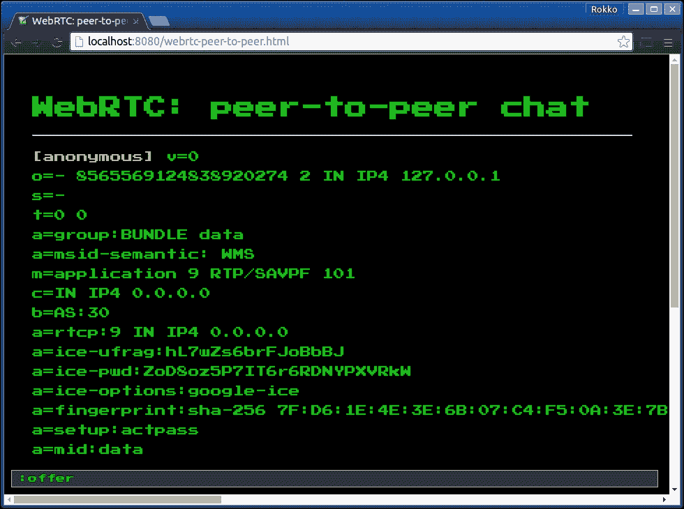
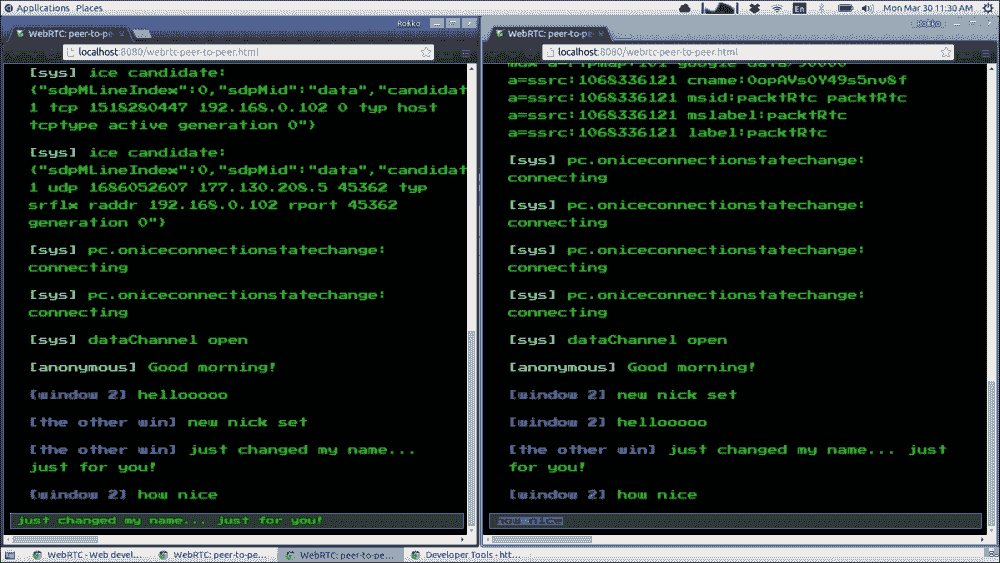

# 第五章：利用前沿技术

到目前为止，在本书中，我们已经集中讨论了与多人游戏开发相关的主题。这一次，除了**WebRTC**之外，我们将讨论一些 HTML5 中最新的 API，它们本身与多人游戏几乎没有关系，但在游戏开发的背景下提供了很多机会。

在本章中，我们将讨论以下原则和概念：

+   使用 WebRTC 直接连接对等方

+   为基于浏览器的游戏添加游戏手柄

+   在**全屏**模式下最大化您的游戏

+   访问用户的媒体设备

# HTML5-最终前沿

尽管我们在本章中将要尝试的技术令人兴奋并且非常有前途，但我们还不能过于依赖它们。至少，我们必须谨慎地使用这些 API，因为它们仍然处于实验阶段，或者规范仍处于工作草案或候选推荐阶段。换句话说，截至目前为止，在本书出版后的可预见的未来，每个功能的浏览器支持可能会有所不同，支持每个功能的 API 在不同浏览器上可能会略有不同，而 API 的未来可能是不确定的。

**万维网联盟**（**W3C**）定义了每个规范在成为最终、稳定并被视为 W3C 标准之前经历的四个开发阶段（也称为成熟级别）。这四个阶段是**工作草案**、**候选推荐**、**提议推荐**和**W3C 推荐**。

初始级别是工作草案，社区在这一级别讨论了提议的规范并定义了他们试图实现的精确细节。在这个级别上，推荐是非常不稳定的，它的最终发布几乎是不确定的。

接下来是候选推荐级别，在这个级别上从实施推荐中获取反馈。在这里，标准仍然不稳定并且可能会发生变化（或者像有时候一样被废弃），但它的变化频率比在工作草案阶段要低。

一旦规范文档作为候选推荐发布，W3C 的咨询委员会将审查提案。如果自审查期开始以来已经过去至少四周，并且文档已经得到了社区和实施者的足够认可，那么文档将被转发为推荐发布。

最后，当一个规范成为 W3C 推荐时，它将携带 W3C 的认可标志作为认可标准。遗憾的是，即使在这一点上，也不能保证浏览器会支持标准或根据规范实施它。然而，在我们这个时代，所有主要的浏览器都非常好地遵循规范，并实施所有有用的标准。

# 使用全屏模式最大化您的游戏

在本章中我们将讨论的所有 API 中，全屏是最容易理解和使用的。正如你可能已经猜到的那样，这个 API 允许你设置一个可以在全屏模式下呈现的 HTML 元素节点。

请注意，尽管全屏模式的第一个编辑草案（推荐标准成为工作草案之前的成熟级别）于 2011 年 10 月发布，但规范仍处于早期起草阶段。（有关更多信息，请参阅以下文章：*使用全屏模式*，*(2014 年 7 月)*。[`developer.mozilla.org/en-US/docs/Web/Guide/API/DOM/Using_full_screen_mode`](https://developer.mozilla.org/en-US/docs/Web/Guide/API/DOM/Using_full_screen_mode)）。

至于当前浏览器支持情况，您会发现在所有现代浏览器中使用 API 是相当安全的，尽管今天在实现上有细微差异以及如何启用全屏模式也有所不同。

在使用全屏模式时要牢记的主要事项是，您必须将单个元素设置为全屏模式。这个元素确实可以有一组元素节点的子树，但您仍然需要在特定元素上启用全屏模式。在游戏开发的背景下，您很可能会将主画布元素设置为全屏，但这不是一个硬性要求。您也可以要求浏览器通过在 body 元素上调用`requetFullscreen()`方法使整个文档进入全屏模式。

设置元素进入全屏模式和将元素退出全屏模式涉及两种方法，分别是`requestFullscreen`和`exitFullscreen`方法。请注意，截至目前，所有主要浏览器都在其各自的供应商前缀下实现了这些方法。

此外，请记住，除非用户发起的事件向浏览器发出请求，否则无法启用全屏模式。换句话说，你不能在 DOM 加载后立即尝试将 body 元素更改为全屏。同样，你也不能以编程方式触发 DOM 事件（例如在页面上触发虚假点击或使用 JavaScript 滚动页面，从而触发`onScroll`事件），并使用事件处理程序回调来欺骗浏览器，让它认为是用户发起了该操作。

```js
<!doctype html>
<html>
<head>
    <title> Fullscreen</title>
    <!-- [some custom CSS here, left out for brevity] -->
</head>
<body>
<ul>
    <li>
        <span>1</span>
    </li>
    <li>
        <span>O</span>
    </li>
    <li>
        <span>O</span>
    </li>
    <li>
        <span>1</span>
    </li>
</ul>
<script>
    var list = document.querySelector('ul');

    list.addEventListener('click', function (event) {
        var block = event.target;
        block.requestFullscreen();
    });
</script>
</body>
</html>
```

上面的代码演示了如何在元素接收到点击后将其设置为全屏模式。在这种情况下，您可能已经注意到，我们假设无论哪个浏览器执行该代码都已经放弃了他们的供应商支持，因此我们可以简单地调用`requestFullscreen()`，就像它原本的意图一样。

今天处理这个问题的更好方法是，由于浏览器尚未实现不带供应商前缀的 API 规范，因此使用 polyfill 或辅助函数来检测是否需要供应商前缀，并执行必要的操作使其正常工作。

```js
var reqFullscreen = (function () {
    var method = (function () {
        var el = document.createElement('div');
        var supported = '';
        var variations = [
            'requestFullscreen',
            'msRequestFullscreen',
            'mozRequestFullScreen',
            'webkitRequestFullscreen'
        ];

        variations.some(function (method) {
            supported = method;
            return el[method] instanceof Function;
        });

        return supported;
    }());

    return function (element) {
        element[method]();
    };
}());

var list = document.querySelector('ul');

list.addEventListener('click', function (event) {
    var block = event.target;
    reqFullscreen(block);
});
```

上面的示例代码创建了一个名为 reqFullscreen 的函数，它通过确定是否需要供应商前缀来为我们做繁重的工作；然后它记住了需要进行全屏请求的版本。然后，当我们希望元素进入全屏模式时，我们通过将其传递给该函数来调用该函数。

### 注意

似乎浏览器制造商的目标是尽可能让实验性 API 对最终用户造成困惑。在全屏模式的情况下，请注意规范将接口函数命名为`requestFullscreen`和`exitFullscreen`（其中`Fullscreen`一词仅大写第一个字母）。

除了 Mozilla Firefox 之外，每个供应商前缀都遵循规范，关于函数名称——即`webkitRequestFullscreen`和`msRequestFullscreen`。Mozilla Firefox 不同，因为它实现了`mozRequestFullScreen`，这与其他供应商不同，因为它在驼峰命名法中将`FullScreen`拼写为两个单词。最后一个细节是，Webkit 的开发人员决定同时实现两个版本：`webkitRequestFullscreen`和`webkitRequestFullScreen`，以取悦所有人。


在上面的图像中，我们的页面不处于全屏模式。但是，当您单击其中一个元素时，该元素将以全屏模式呈现：


您可能会注意到，浏览器强加的唯一要求是必须由用户操作发起请求以启用全屏模式。这并不意味着操作必须在设置为全屏的相同元素上，就像下面的例子所示：

```js
var list = document.querySelector('ul');
var btn = document.querySelector('button');

btn.addEventListener('click', function (event) {
    // Somehow determine what element to use
    var firstBlock = list.children[0].children[0];

    reqFullscreen(firstBlock);
});
```

前面的示例绑定到一个按钮元素，然后添加一个点击处理程序，将一些其他元素设置为全屏模式。

我们可以通过查找文档对象的一个自动更新的属性来检查特定元素是否处于全屏模式。

```js
var element = document.webkitFullscreenElement;
```

当您运行上述语句时，它将返回对当前处于全屏模式的任何元素的引用；否则，它将返回一个空值。

我们还可以查询文档，测试文档是否可以启用全屏。

```js
var canFullscreen = document.webkitFullscreenEnabled; // => bool
```

最后，有一个特殊的 CSS 伪选择器，允许我们定位全屏中的元素。同样，这个选择器目前也是供应商前缀的。

```js
full-screen,
:-moz-full-screen,
:-moz-full-screen-ancestor,
:-webkit-full-screen {
    font-size: 50vw;
    line-height: 1.25;
    /* … */
}
```

请注意，选择器会定位调用`requestFullscreen`的元素。在前面的示例中，指定的样式适用于**ul li span**。

# 更好地使用游戏手柄进行控制

在过去的几年里，我们已经看到 HTML5 中添加了一系列非常受欢迎和强大的新 API。这些包括 WebSockets、canvas、本地存储、WebGL 等等。在游戏开发的背景下，下一个自然的步骤是为游戏手柄添加标准支持。

与全屏模式类似，游戏手柄 API 仍处于非常早期的起草阶段。实际上，游戏手柄支持甚至比全屏模式更“原始”。尽管您会发现浏览器支持是足够的，但使用 API 可能会出现错误和有些不可预测。然而，游戏手柄 API 确实提供了一个足够好的接口，以提供出色的最终用户体验。随着规范的成熟，将游戏手柄添加到浏览器中的前景是非常令人兴奋和有前途的。

关于游戏手柄 API 的第一件事是，它与 DOM 中所有其他输入 API 的不同之处在于它不是由鼠标或键盘等事件驱动的。例如，尽管每个键盘输入都会触发一个事件（换句话说，会调用一个注册的回调），但来自连接的游戏手柄的输入只能通过手动轮询硬件来检测。换句话说，浏览器会触发与游戏手柄相关的事件，以让您知道游戏手柄已连接和断开连接。然而，除了这些类型的事件之外，浏览器不会在连接的游戏手柄上每次按键时触发事件。

要在游戏中使用游戏手柄，您首先需要等待游戏手柄连接到游戏中。这是通过注册一个回调来监听全局的`gamepadconnected`事件来实现的：

```js
/**
 * @type {GamepadEvent} event
 */
function onGamepadConnected(event) {
    var gamepad = event.gamepad;
}

window.addEventListener('gamepadconnected', onGamepadConnected);
```

`gamepadconnected`事件将在游戏运行期间任何时候在您的计算机上连接游戏手柄时触发。如果在脚本加载之前已经连接了游戏手柄，那么`gamepadconnected`事件将不会触发，直到玩家按下游戏手柄上的按钮。虽然这一开始可能看起来有点奇怪，但这一限制是有很好的原因的，即为了保护玩家不受恶意脚本的指纹识别。然而，要求用户在激活控制器之前按下按钮并不是什么大问题，因为玩家如果想玩游戏，总是需要在某个时候按下按钮。唯一的缺点是，我们一开始不知道用户是否已经连接了游戏手柄。不过，想出创造性的解决方案来解决这个限制并不是太困难的任务。

`GamepadEvent`对象公开了一个 gamepad 属性，它是对实际的 Gamepad 对象的引用，这正是我们想要的。这个对象的有趣之处在于它不像 JavaScript 中的其他对象那样自动更新。换句话说，每当浏览器接收到来自连接的游戏手柄的输入时，它会在内部跟踪其状态。然后，一旦您轮询`gamepad`状态，浏览器就会创建一个新的`Gamepad`对象，其中包含所有更新的属性，以反映控制器的当前状态。

```js
function update(){
    var gamepads = navigator.getGamepads();
    var gp_1 = gamepads[0];

    if (gp_1.buttons[1].pressed) {
        // Button 1 pressed on first connected gamepad
    }

    if (gp_1.axes[1] < 0) {
        // Left stick held to the left on first connected gamepad
    }

    requestAnimationFrame(update);
}
```

在每个`update`周期中，您需要获取游戏手柄对象的最新快照并查找其状态。

`Gamepad`对象接口定义了没有方法，但有几个属性：

```js
interface Gamepad {
    readonly attribute DOMString id;
    readonly attribute long index;
    readonly attribute boolean connected;
    readonly attribute DOMHighResTimeStamp timestamp;
    readonly attribute GamepadMappingType mapping;
    readonly attribute double[] axes;
    readonly attribute GamepadButton[] buttons;
};
```

`id`属性描述了连接到应用程序的实际硬件。如果通过某个 USB 适配器连接游戏手柄，则`id`可能会引用适配器设备，而不是实际使用的控制器。

`index`将引用`GamepadList`对象中的`Gamepad`对象，这是浏览器响应`navigator.getGamepads()`提供的。使用此索引值，我们可以获取对我们希望查询的特定游戏手柄的引用。

如预期的那样，`boolean connected`属性指示特定游戏手柄是否仍连接到应用程序。如果在调用`navigator.getGamepads()`之前游戏手柄断开连接，则基于`Gamepad.index`偏移的相应元素将在`GamepadList`中为 null。但是，如果获取了对`Gamepad`对象的引用，但硬件断开连接，那么对象的 connected 属性仍将设置为 true，因为这些属性不是动态更新的。总之，这个属性是多余的，可能会在将来的更新中从规范中删除。

我们可以通过查看`Gamepad`对象上的`timestamp`属性来检查浏览器上次更新`gamepad`状态的时间。

一个特别有趣的属性是`mapping`。其背后的想法是可以有几种标准映射，以便更容易地连接到硬件的方式对应应用程序。


目前只有一个标准映射，可以通过名称`standard`来识别，如先前演示的（有关更多信息，请参阅*Gamepad W3C Working Draft 29 April 2015*。[`www.w3.org/TR/gamepad`](http://www.w3.org/TR/gamepad)）。如果浏览器不知道如何布局控制器，它将用空字符串响应`mapping`属性，并以最佳方式映射按钮和轴。在这种情况下，应用程序可能应该要求用户手动映射应用程序使用的按钮。请记住，有些情况下，方向键按钮映射到其中一个轴，因此要小心处理每种情况：

```js
var btns = {
        arrow_up: document.querySelector('.btn .arrow-up'),
        arrow_down: document.querySelector('.btn .arrow-down'),
        arrow_left: document.querySelector('.btn .arrow-left'),
        arrow_right: document.querySelector('.btn .arrow-right'),

        button_a: document.querySelector('.buttons .btn-y'),
        button_b: document.querySelector('.buttons .btn-x'),
        button_x: document.querySelector('.buttons .btn-b'),
        button_y: document.querySelector('.buttons .btn-a'),

        button_select: document.querySelector('.controls .btn- select'),
        button_start: document.querySelector('.controls .btn- start'),

        keyCodes: {
            37: 'arrow_left',
            38: 'arrow_up',
            39: 'arrow_right',
            40: 'arrow_down',

            32: 'button_a',
            65: 'button_b',
            68: 'button_x',
            83: 'button_y',

            27: 'button_select',
            16: 'button_start'
        },

        keyNames: {
            axe_left: 0,
            axe_left_val: -1,

            axe_right: 0,
            axe_right_val: 1,

            axe_up: 1,
            axe_up_val: -1,

            axe_down: 1,
            axe_down_val: 1
        }
    };

    Object.keys(btns.keyCodes).map(function(index){
        btns.keyNames[btns.keyCodes[index]] = index;
    });

function displayKey(keyCode, pressed) {
    var classAction = pressed ? 'add' : 'remove';

    if (btns.keyCodes[keyCode]) {
        btns[btns.keyCodes[keyCode]].classListclassAction;
    }
}

function update(now) {
        requestAnimationFrame(update);

        // GamepadList[0] references the first gamepad that connected to the app
        gamepad = navigator.getGamepads().item(0);

        if (gamepad.buttons[0].pressed) {
            displayKey(btns.keyNames.button_x, true);
        } else {
            displayKey(btns.keyNames.button_x, false);
        }

        if (gamepad.buttons[1].pressed) {
            displayKey(btns.keyNames.button_a, true);
        } else {
            displayKey(btns.keyNames.button_a, false);
        }

        if (gamepad.buttons[2].pressed) {
            displayKey(btns.keyNames.button_b, true);
        } else {
            displayKey(btns.keyNames.button_b, false);
        }

        if (gamepad.buttons[3].pressed) {
            displayKey(btns.keyNames.button_y, true);
        } else {
            displayKey(btns.keyNames.button_y, false);
        }

        if (gamepad.buttons[8].pressed) {
            displayKey(btns.keyNames.button_select, true);
        } else {
            displayKey(btns.keyNames.button_select, false);
        }

        if (gamepad.buttons[9].pressed) {
            displayKey(btns.keyNames.button_start, true);
        } else {
            displayKey(btns.keyNames.button_start, false);
        }

        if (gamepad.axes[btns.keyNames.axe_left] === btns.keyNames.axe_left_val){
            displayKey(btns.keyNames.arrow_left, true);
        } else {
            displayKey(btns.keyNames.arrow_left, false);
        }

        if (gamepad.axes[btns.keyNames.axe_down] === btns.keyNames.axe_down_val) {
            displayKey(btns.keyNames.arrow_down, true);
        } else {
            displayKey(btns.keyNames.arrow_down, false);
        }

        if (gamepad.axes[btns.keyNames.axe_up] === btns.keyNames.axe_up_val) {
            displayKey(btns.keyNames.arrow_up, true);
        } else {
            displayKey(btns.keyNames.arrow_up, false);
        }

        if (gamepad.axes[btns.keyNames.axe_right] === btns.keyNames.axe_right_val) {
            displayKey(btns.keyNames.arrow_right, true);
        } else {
            displayKey(btns.keyNames.arrow_right, false);
        }
    }

    window.addEventListener('gamepadconnected', function (e) {
        update(0);
    });
```

前面的示例连接了一个没有可识别映射的游戏手柄；因此，它将每个按钮分配给特定的布局。由于在这种特殊情况下，方向键按钮映射到左轴，因此当我们想要确定是否正在使用方向键时，我们会检查该状态。此演示的输出如下：


通常，您可能希望为用户提供选择他们希望与您的游戏交互的方式的能力 - 使用键盘和鼠标，游戏手柄或两者兼而有之。在上一个示例中，这正是为什么`btns`对象引用看似随机和任意的`keyCode`值的原因。这些值被映射到特定的键盘键，以便玩家可以在标准键盘或游戏手柄上使用箭头键。

# 使用 WebRTC 进行点对点通信

近年来最令人兴奋的 API 之一是 WebRTC（代表 Web 实时通信）。该 API 的目的是允许用户在支持该技术的平台上进行实时流式音频和视频通信。

WebRTC 由几个单独的 API 组成，并可以分解为三个单独的组件，即`getUserMedia`（我们将在下一节中更深入地讨论）、`RTCPeerConnection`和`RTCDataChannel`。

由于我们将在下一节中讨论`getUserMedia`，所以我们将在那里时留下更详细的定义（尽管名称可能会透露 API 的预期用途）。

`RTCPeerConnection`是我们用来连接两个对等方的。一旦建立了连接，我们可以使用`RTCDataChannel`在对等方之间传输任何数据（包括二进制数据）。在游戏开发的背景下，我们可以使用`RTCDataChannel`将玩家的状态发送给每个对等方，而无需一个服务器来连接每个玩家。

要开始使用`RTCPeerConnection`，我们需要一种方法来告诉每个对等方有关另一个对等方。请注意，WebRTC 规范故意省略了应该进行数据传输的具体方式。换句话说，我们可以自由选择任何方法手动连接两个对等方。

获取`RTCPeerConnection`的第一步是实例化`RTCPeerConnection`对象，并配置它所需使用的**STUN**服务器以及与您期望的连接类型相关的其他选项：

```js
var pcConfig = {
    iceServers: [{
        url: 'stun:stun.l.google.com:19302'
    }]
};

var pcOptions = {
    optional: [{
        RtpDataChannels: true
    }]
};

var pc = new webkitRTCPeerConnection(pcConfig, pcOptions);
```

在这里，我们使用 Google 免费提供的公共`STUN`服务器。我们还使用供应商前缀以保持与本章中其他示例的一致性。截至目前，每个以某种方式实现 WebRTC 的供应商都使用供应商前缀。

### 注意

如果您对 STUN、**交互式连接建立**（**ICE**）、**NAT**、**TURN**和**SDP**不太熟悉，不用太担心。虽然本书不会深入解释这些网络概念，但您在本章中跟随示例并在自己的游戏中实现数据通道时，不需要对它们了解太多。

简而言之，STUN 服务器用于告知客户端其公共 IP 地址以及客户端是否在路由器的 NAT 后面，以便另一个对等方可以连接到它。因此，我们在创建`RTCPeerConnection`时使用一个 STUN 服务器。

再次强调简单和简洁，ICE 候选允许浏览器直接连接到另一个浏览器。

一旦我们准备好了`RTCPeerConnection`，我们通过提议与对等方连接。第一步是创建一个提议，描述了另一个客户端如何连接回我们。在这里，我们使用我们选择的协议通知其他对等方我们的提议。通常，这将使用 WebSocket 完成，但为了更明确地演示每个步骤，我们将使用人类已知的最古老的通信协议：**口头交流**：

```js
/**
 *
 */
function makeMessage(msg, user, color) {
    var container = document.createElement('p');
    var tag = document.createElement('span');
    var text = document.createElement('span');

    if (color) {
        tag.classList.add(color);
    } else if (nickColor) {
        tag.classList.add(nickColor);
    }

    tag.textContent = '[' + (user || nick) + '] ';
    text.textContent = msg;

    container.appendChild(tag);
    container.appendChild(text);

    var out = document.getElementById('out');
    var footer = document.getElementById('outFooter');
    out.appendChild(container);
    footer.scrollIntoView();
}

/**
 *
 */
function createOffer() {
    pc.createOffer(function (offer) {
        // Note #1
        makeMessage('offer: ' + encodeURIComponent(offer.sdp));

        // Note #2
        pc.setLocalDescription(new RTCSessionDescription(offer),
            // Note #3
            function () {},

            // Note #4
            function (e) {
                console.error(e);
                makeMessage('error creating offer');
            }
        );
    });
}
```

在这个 WebRTC 点对点连接的*hello world*演示中，我们将构建一个简单的聊天室，中间没有服务器（除了我们需要启动点对点连接的 STUN 服务器）。

根据前面的示例代码，我们可以假设有一些 HTML 结构，其中包含一个输入元素，我们可以在其中输入文本和命令，并使用它们来驱动 WebRTC 组件。



前面的屏幕截图显示了我们调用先前显示的`createOffer`函数后的输出。我们将广泛使用`makeMessage`函数来帮助我们查看系统（即 WebRTC API）发起的消息，以及来自我们试图连接和聊天的其他对等方的消息。

前面代码示例中的`Note #1`旨在引起您对我们如何显示提议的**会话描述协议**（**SDP**）的注意，这是一种*在对等方之间协商会话能力的协议*（摘自 Suhas Nandakumar 的文章，*SDP for the WebRTC*，[`tools.ietf.org/id/draft-nandakumar-rtcweb-sdp-01.html`](http://tools.ietf.org/id/draft-nandakumar-rtcweb-sdp-01.html)）。由于协议中的换行符是有意义的，我们需要保留该字符串中的每个字符。通过对字符串进行编码，我们保证了框架提供给我们的字符串不会以任何方式被更改（尽管这使得对我们人类来说稍微不太可读）。

`注 2`显示了这种信息交换过程的第二步，这将把我们连接到另一个对等方。在这里，我们需要设置自己客户端的会话描述。你可以把这看作是你记住自己家庭地址（或邮箱，如果你喜欢与笔友进行一系列信件交流）。

`注 3`和`注 4`是我们发送给`RTCSessionDescription`构造函数的第二个和第三个参数。它们分别是成功和错误回调函数，目前我们并不太关心。实际上，我们确实关心“错误”回调函数，因为我们希望在尝试到达 STUN 服务器时等可能出现的错误时得到通知等。

现在我们有了一个`offer`对象，我们只需要让另一个对等方知道这个提议是什么样子的。构成提议的两个要素是 SDP 块和会话描述类型。

一旦我们的对等方知道 SDP 块的样子，他或她就可以实例化一个`RTCSessionDescription`对象，并设置 SDP 和类型属性。接下来，第二个对等方将该会话描述设置为自己的远程会话描述。在这种情况下，我们只需打开一个新窗口来代表第二个对等方，并通过*复制+粘贴*方法传输 SDP 字符串。

```js
function setRemoteDesc(sdp, type) {
    var offer = new RTCSessionDescription();
    offer.sdp = decodeURIComponent(sdp);
    offer.type = type;

    makeMessage('remote desc: ' + offer.sdp);

    pc.setRemoteDescription(new RTCSessionDescription(offer),
        function () {
        },
        function (e) {
            console.log(e);
            makeMessage('error setting remote desc');
        }
    );
}
```

在这里，我们为另一个客户端手动创建一个`offer`对象。我们使用从第一个客户端获得的 SDP 数据，并将第二个客户端的会话描述类型设置为`offer`。这个提议被设置为第二个客户端的远程描述。你可以把这看作是，在你写信给笔友的例子中，笔友写下你的家庭地址，这样他或她就知道该把信件寄到哪里了。

第二个对等方记下你的会话描述后，下一步就是接受该提议。在 RTC 术语中，第二个对等方需要回应这个提议。类似于我们调用`createOffer()`来创建初始提议一样，我们在`webkitRTCPeerConnection`对象上调用`createAnswer()`。这个调用的输出也是一个会话描述对象，只是它包含了第二个用户的 SDP，会话描述类型是`answer`而不是`offer`。

```js
function answerOffer() {
    pc.createAnswer(function (answer) {
        makeMessage('answer: ' + encodeURIComponent(answer.sdp));
        pc.setLocalDescription(new RTCSessionDescription(answer));
    }, function (e) {
        console.log(e);
        makeMessage('error creating answer');
    });
}
```

在这里，远程对等方首先从来自`answer`对象的 SDP 中设置自己的本地描述。然后，我们将其显示到屏幕上，这样我们就可以使用与第一个对等方（“本地对等方”）相同的信息作为远程描述。这代表了你的笔友首先记住自己的家庭地址，然后让你拥有一份副本，这样你就知道该把你的信件寄到哪里了。

现在两个对等方都知道对方可以被联系到，所需要的只是一种联系对方的方式。这种细节层次被抽象出来，不涉及数据通道。因此，在我们可以使用数据通道之前，我们需要向对等连接对象添加至少一个 ICE 候选。

当每个对等方创建他们的`offer`和`answer`对象时，对等连接对象会接收一个或多个 ICE 候选引用。在这个演示中，当我们接收到 ICE 候选时，我们将其打印到屏幕上，这样在这一点上我们可以复制和粘贴组成每个 ICE 候选的数据，因此我们可以在对方的机器上重新创建它们，并将 ICE 候选添加到对等连接对象中。

```js
pc.onicecandidate = function (event) {
    if (event.candidate) {
        makeMessage('ice candidate: ' + JSON.stringify(event.candidate), 'sys', 'sys');
    }
};

function addIceCandidate(candidate) {
    pc.addIceCandidate(candidate);
}

addIceCandidate(JSON.parse({
   /* encoded candidate object from onIceCandidate callback */
});
```

一旦每个对等方都有了另一个对等方的会话描述，并且有一个 ICE 候选来引导浏览器到另一个对等方，我们就可以开始直接从一个对等方发送消息到另一个对等方。

下一步就是简单地使用`DataChannel`对象发送和接收消息。在这里，API 与 WebSocket 的 API 非常相似，我们在通道对象上调用`send()`方法向对等方发送数据，并注册一个`onmessage`事件处理程序，从中接收对等方连接的另一侧的数据。这里的主要区别是，与 WebSocket 场景不同，我们现在直接连接到另一个对等方，因此发送消息非常快：

```js
// When creating the RTCPeerConnection object, we also create the DataChannel
var pc = new webkitRTCPeerConnection(pcConfig, pcOptions);
var channelName = 'packtRtc';
var dc = dc = pc.createDataChannel(channelName);

function sendMessage(msg) {
    if (dc.readyState === 'open') {
        var data = {
            msg: msg,
            user: nick,
            color: nickColor
        };

        // Since this is a chat app, we want to see our own message
        makeMessage(msg);

        // The actual send command
        dc.send(JSON.stringify(data));
    } else {
        makeMessage('Could not send message: DataChannel not yet open.');
    }
}

dc.onmessage = function (event) {
    var data = JSON.parse(event.data);
    makeMessage(data.msg, data.user, data.color);
};

dc.onopen = function () {
    makeMessage('dataChannel open', 'sys', 'sys');
};

dc.onerror = function (e) {
    makeMessage('dataChannel error: ' + e, 'sys', 'sys');
};

dc.onclose = function () {
    makeMessage('dataChannel close', 'sys', 'sys');
};
```



总之，在我们可以开始使用`DataChannel`与其他对等方通信之前，我们需要手动（意味着在 WebRTC API 的真实领域之外）相对于彼此配置每个对等方。通常，您将首先通过 WebSocket 连接对等方，并使用该连接创建并回答发起对等方的提议。此外，通过`DataChannel`发送的数据不仅限于文本。我们可以使用另一个 WebRTC API 发送二进制数据，例如视频和音频，我们将在下一节中讨论。

# 使用媒体捕获捕获时刻

在线多人游戏的较新组件之一是涉及实时语音和视频通信的社交方面。这最后一个组件可以通过使用 HTML **媒体捕获** API 完美满足，它允许您访问玩家的摄像头和麦克风。一旦您获得了对摄像头和麦克风的访问权限，您可以将这些数据广播给其他玩家，将它们保存为音频和视频文件，甚至创建一个仅基于这些数据的独立体验。

媒体捕获的*hello world*示例可能是音频可视化演示的吸引人之处。我们可以通过媒体捕获和**Web Audio** API 的混合来实现这一点。通过媒体捕获，我们实际上可以从用户的麦克风接收原始音频数据；然后，我们可以使用 Web Audio 连接数据并对其进行分析。有了这些数据，我们可以依靠 canvas API 来呈现由麦克风接收的代表声波的数据。

首先，让我们更深入地了解媒体捕获。然后，我们将看一下 Web Audio 的重要部分，并留给您找到更好、更完整和专门的来源来加深您对 Web Audio API 的理解。

目前，媒体捕获处于候选推荐阶段，因此我们仍然需要寻找并包含供应商前缀。为简洁起见，我们将假定**Webkit 目标**（*HTML 媒体捕获 W3C 候选推荐*，（2014 年 9 月）。[`www.w3.org/TR/html-media-capture/`](http://www.w3.org/TR/html-media-capture/)）。）

我们首先在 navigator 对象上调用`getUserMedia`函数。（有关`window.navigator`属性的更多信息，请转到[`developer.mozilla.org/en-US/docs/Web/API/Window/navigator`](https://developer.mozilla.org/en-US/docs/Web/API/Window/navigator)。）在此，我们指定有关我们希望捕获的媒体的任何约束，例如音频、我们想要的视频帧速率等等：

```js
var constraints = {
    audio: false,
    video: {
        mandatory: {
            minAspectRatio: 1.333,
            maxAspectRatio: 1.334
        },
        optional: {
            width: {
                min: 640,
                max: 1920,
                ideal: 1280
            },
            height: {
                min: 480,
                max: 1080,
                ideal: 720
            },
            framerate: 30
        }
    }
};

var allowCallback = function(stream){
    // use captured local media stream
    // ...
};

var denyCallback = function(e){
    // user denied permission to let your app access media devices
    console.error('Could not access media devices', e);
};

navigator.webkitGetUserMedia(constraints, allowCallback, denyCallback);
```

在其最简单的形式中，约束字典只包括一个指示我们希望捕获的媒体类型的键，后面跟着一个代表我们意图的`Boolean`值。可选地，任何 false 值都可以通过完全省略属性来简写。

```js
var  constraints = {
    audio: true,
    video: false
};

// the above is equivalent to simply {audio: true}

navigator.webkitGetUserMedia(constraints, allowCallback, denyCallback);
```

一旦执行了对`getUserMedia`的调用，浏览器将向用户显示警告消息，提醒用户页面正在尝试访问媒体设备；这将给用户一个机会允许或拒绝这样的请求：


尽管它与旧的`window.alert`、`window.confirm`和`window.prompt` API 不同，但浏览器生成的提示始终是异步的和非阻塞的。这就是为什么在用户允许或拒绝请求的情况下提供回调函数的原因。

一旦我们获得了对用户音频设备的访问权限，就像前面的例子一样，我们可以利用 Web Audio API 并创建一个`AudioContext`对象；从这里，我们可以创建一个媒体流源：

```js
var allowCallback = function(stream){
    var audioContext = new AudioContext();
    var mic = audioContext.createMediaStreamSource(stream);

    // ...
};
```

正如您可能已经猜到的那样，`MediaStream`对象表示麦克风作为数据源。有了这个参考，我们现在可以将麦克风连接到`AnalyserNode`，以帮助我们将音频输入分解为我们可以以可视方式表示的内容：

```js
var allowCallback = function(stream){
    var audioContext = new AudioContext();
    var mic = audioContext.createMediaStreamSource(stream);

    var analyser = audioContext.createAnalyser();
    analyser.smoothingTimeConstant = 0.3;
    analyser.fftSize = 128;

    mic.connect(analyser);

    // ...
};
```

下一步是使用`analyser`对象并从音频源获取频率数据。有了这个，我们可以根据需要将其渲染到现有画布上：

```js
var allowCallback = function(stream){
    var audioContext = new AudioContext();
    var mic = audioContext.createMediaStreamSource(stream);

    var analyser = audioContext.createAnalyser();
    analyser.smoothingTimeConstant = 0.3;
    analyser.fftSize = 128;

    mic.connect(analyser);

    var bufferLength = analyser.frequencyBinCount;
    var frequencyData = new Uint8Array(bufferLength);

    // assume some canvas and ctx objects already loaded and bound to the DOM
    var WIDTH = canvas.width;
    var HEIGHT = canvas.height;
    var lastTime = 0;

    visualize(e);

    function visualize(now) {
        // we'll slow down the render speed so it looks smoother
        requestAnimationFrame(draw);
        if (now - lastTime >= 200) {
            ctx.clearRect(0, 0, WIDTH, HEIGHT);
            analyser.getByteFrequencyData(frequencyData);

            var barWidth = (WIDTH / bufferLength) * 2.5;
            var x = 0;

            [].forEach.call(frequencyData, function (barHeight) {
                ctx.fillStyle = 'rgb(50, ' + (barHeight + 100) + ', 50)';
                ctx.fillRect(x, HEIGHT - barHeight / 1, barWidth, barHeight / 1);
                x += barWidth + 1;
            });

            lastTime = now;
        }
    }
};
```


处理视频同样简单，但是需要连接摄像头到您的计算机，这是您所期望的。如果您使用设置视频约束的`getUserMedia`请求，但没有摄像头，则将执行错误回调，并将`NavigatorUserMediaError`对象作为参数发送：

```js
navigator.webkitGetUserMedia({video: true}, function(stream){
    // ...
}, function(e){
    // e => NavigatorUserMediaError {
    //              constraintName: '',
    //              message: '',
    //              name: 'DevicesNotFoundError'
    //          }
});
```

另一方面，当视频设备可访问时，我们可以通过将其`src`属性设置为`objectUrl`的方式将其流式传输到视频元素中，该`objectUrl`指向我们从用户媒体获取的流源：

```js
var video = document.createElement('video');
video.setAttribute('controls', true);
video.setAttribute('autoplay', true);

document.body.appendChild(video);

var constraints = {
    video: true
};

function allowCallback(stream){
    video.src = window.URL.createObjectURL(stream);
}

function denyCallback(e){
    console.error('Could not access media devices', e);
}

navigator.webkitGetUserMedia(constraints, allowCallback, denyCallback);
```

# 摘要

本章使我们向前迈进了一步，让我们一窥我们可以将其纳入我们的多人游戏中的最新 HTML5 API。这些 API 包括全屏模式、游戏手柄、媒体捕获和 WebRTC。有了这些强大的附加功能，您的游戏将更具吸引力和乐趣。

然而，整个讨论中的一个要点是，本章中描述的所有 API 仍处于早期草拟阶段；因此，它们可能会受到严重的界面更改，或者也可能被弃用。与此同时，请确保为每个 API 添加适当的供应商前缀，并注意任何一次性浏览器怪癖或实现差异。

在下一章中，我们将通过讨论与网络游戏相关的安全漏洞来结束我们在 JavaScript 中进行多人游戏开发的精彩旅程。我们将描述最常见的技术，以最小化作弊的机会，从而提供公平和充分的游戏体验。
