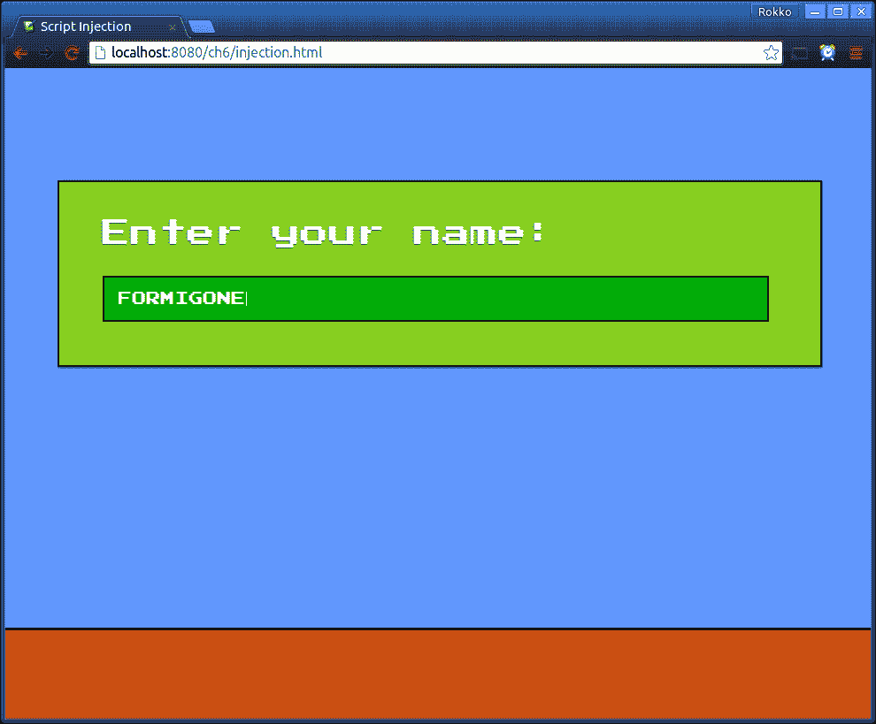
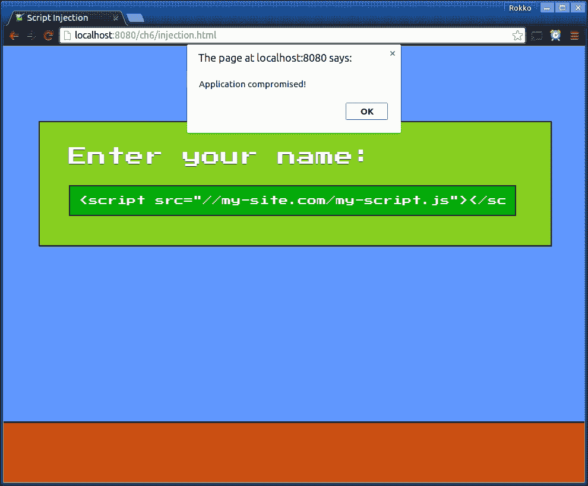
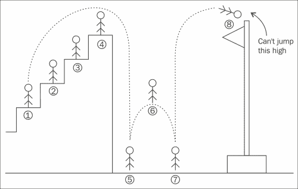

# 第六章：增加安全性和公平竞争

尽管我们现在才谈论安全性，但本章的主要要点是安全性应该内置到您的游戏中。就像其他类型的软件一样，您不能事后再加入一些安全功能，然后期望产品是无懈可击的。然而，由于本书的主要重点不是安全性，我认为我们可以理直气壮地直到最后一章才提出这个问题。

在本章中，我们将讨论以下原则和概念：

+   基于网络的应用程序中的常见安全漏洞

+   使用 Npm 和 Bower 为您的游戏增加额外的安全性

+   使游戏更安全，更不容易作弊

# 常见的安全漏洞

如果您是从软件开发的许多其他领域转向游戏开发，您会高兴地知道，保护游戏与保护任何其他类型的软件并没有太大的不同。将游戏视为需要安全性的任何其他类型的软件，尤其是分布式和网络化的软件，将帮助您制定适当的措施，以帮助您保护您的软件。

在本节中，我们将介绍一些基于网络的应用程序（包括游戏）中最基本和基本的安全漏洞，以及保护措施。然而，我们不会深入探讨更复杂的网络安全主题和情景，比如社会工程学、拒绝服务攻击、保护用户帐户、正确存储敏感数据、保护虚拟资产等等。

## 通过加密传输数据

您应该知道的第一个漏洞是，从服务器向客户端发送数据会使数据暴露给其他人。监视网络流量几乎和边走路、嚼口香糖一样容易，尽管并非每个人都有足够的技能来做这些事情。

以下是您可能要求玩家在玩游戏（或准备玩游戏）时经历的常见情景：

+   玩家输入用户名和密码以获得授权进入您的游戏

+   您的服务器验证登录信息

+   然后允许玩家继续玩游戏

如果玩家发送到服务器的初始 HTTP 请求未加密，则查看网络数据包的任何人都将知道用户凭据，您的玩家帐户将受到威胁。

最简单的解决方案是通过 HTTPS 传输任何此类数据。虽然使用 HTTPS 不能解决所有安全问题，但它确实为我们提供了相当确定的保证，其中包括以下几点：

+   服务器响应客户端请求的人应该是它所说的那样

+   服务器和客户端接收的数据不会被篡改

+   任何查看数据的人都无法以纯文本形式阅读它

由于 HTTPS 数据包是加密的，任何监视网络的人都需要解密每个数据包才能知道其中包含的数据，因此这是向服务器发送密码的安全方式。

就像没有免费的午餐一样，也没有免费的加密和解密。这意味着使用 HTTPS 会产生一些可衡量的性能损失。这种惩罚实际上是什么，以及它将是多么微不足道，这在很大程度上取决于一系列因素。关键是评估您的具体情况，并确定在性能方面使用 HTTPS 将会太昂贵的地方。

然而，请记住，至少在数据的价值大于额外性能时，以安全性为代价换取性能是值得的。由于相关的延迟，您可能无法通过 HTTPS 传输数千个玩家的位置和速度，但每个单独的用户在初始认证后不会经常登录，因此至少强制进行安全认证是任何人都无法承受的。

## 脚本注入

这个漏洞背后的基本原则是，你的脚本将用户输入作为文本（数据）并在执行上下文中将其评估为代码。这种情况的典型用例如下：

+   游戏要求用户输入他/她的名字

+   恶意用户输入代码

+   游戏可选择保存该文本以备将来使用

+   游戏最终在执行上下文中使用该代码

在基于 Web 的应用程序中，或者更具体地说，在浏览器中执行 JavaScript 时，恶意输入可能是一串 HTML，执行上下文是 DOM。DOM API 的一个特点是它能够将一个字符串设置为元素的 HTML 内容。浏览器会将该字符串转换为活动的 HTML，就像渲染在某个服务器上的任何其他 HTML 文档一样。

以下代码片段是一个应用程序的示例，该应用程序要求用户输入昵称，然后在屏幕右上角显示它。这个游戏也可能会将玩家的名字保存在数据库中，并尝试在游戏的其他部分中使用玩家的名字来渲染该字符串：

```js
/**
 * @param {Object} player
 */
function setPlayerName(player){
    var nameIn = document.getElementById('nameIn');
    var nameOut = document.getElementById('nameOut');

    player.name = nameIn.value;

    // Warning: here be danger!
    nameOut.innerHTML = player.name;
}
```



对于普通开发者来说，这似乎是对一个准备享受你的平台游戏的玩家的一个相当可爱的问候。只要用户输入一个没有 HTML 字符的实际名称，一切都会很好。

然而，如果用户决定称自己为`<script src="img/my-script.js"></script>`之类的东西，而我们不对该字符串进行消毒以删除使字符串成为有效 HTML 的字符，应用程序可能会受到损害。

用户利用这个漏洞的两种可能方式是改变客户端的体验（例如，输入一个使名称闪烁或下载并播放任意 MP3 文件的 HTML 字符串），或者输入一个下载并执行 JavaScript 文件的 HTML 字符串，这些文件会以恶意方式改变主游戏脚本并与游戏服务器交互。

更糟糕的是，如果我们在保护其他漏洞方面不小心，这个安全漏洞可以与其他漏洞一起被利用，进一步加剧邪恶玩家可能造成的损害：



## 服务器验证

根据我们如何处理和使用来自用户的输入，我们可能会通过信任未经消毒的输入来危害服务器和其他资产。然而，仅仅确保输入通常有效是不够的。

例如，某个时刻你会告诉服务器玩家在哪里，以多快的速度朝着哪个方向移动，可能还有哪些按钮被按下。如果我们需要告知服务器玩家的位置，我们首先会验证客户端游戏是否提交了一个有效的数字：

```js
// src/server/input-handler.js

socket.on(gameEvents.server_userPos, function(data){
    var position = {
        x: parseFloat(data.x),
        y: parseFloat(data.y)
    };

    if (isNaN(position.x) || isNan(position.y) {
        // Discard input
    }

    // ...
});
```

现在我们知道用户没有黑客攻击游戏，而是发送了实际位置向量，我们可以对其进行计算并更新游戏状态的其余部分。或者，我们可以吗？

例如，如果用户发送了无效的浮点数作为他们的位置（假设在这种情况下我们正在使用浮点数），我们可以简单地丢弃输入或对其尝试输入无效值做出特定的响应。但是，如果用户发送了一个不正确的位置向量，我们该怎么办？

可能是玩家从屏幕左侧移动到右侧。首先，服务器接收到玩家的坐标，显示玩家真正的位置，然后玩家报告说自己稍微靠右一点，离一个火坑更近了。假设玩家可能每帧最快移动 5 像素。那么，如果我们只知道玩家发送了一个有效的向量{`x`: `2484`, `y`: `4536`}，我们如何知道玩家是否真的在一个帧内跳过火坑（这是不可能的移动），还是玩家作弊了呢？



这里的关键原则是验证输入是否有效。请注意，我们谈论的是验证而不是清理用户输入，尽管后者也是必不可少的，并且与前者相辅相成。

对于玩家报告虚假位置的先前问题的一个解决方案是，我们可以简单地跟踪上次报告的位置，并将其与下一个接收到的位置进行比较。对于更复杂的解决方案，我们可以跟踪几个先前的位置，并查看玩家的移动方式。

```js
var PlayerPositionValidator = function(maxDx, maxDy) {
    this.maxDx = maxDx;
    this.maxDy = maxDy;
    this.positions = [];
};

PlayerPositionValidator.prototype.addPosition = function(x, y){
    var pos = {
        x: x,
        y: y
    };

    this.positions.push(pos);
};

PlayerPositionValidator.prototype.checkLast = function(x, y){
    var pos = this.positions[this.positions.length - 1];

    return Math.abs(pos.x - x) <= this.maxDx
         && Math.abs(pos.y - y) <= this.maxDy;
};
```

上述类跟踪了玩家在一个帧（或者服务器验证新用户位置的频率）中可能具有的最大垂直和水平位移。通过将其与特定玩家的实例相关联，我们可以添加新的传入位置，并检查它是否大于最大可能的位移。

更复杂的情况是检查和验证的一个案例是确保玩家不会报告可能已过期的事件或属性（例如临时增益等），或者无效的输入状态（例如，玩家已经在空中，但突然报告发起了一次跳跃）。

更复杂的是，还有另一种情况需要我们注意，这是非常难以检查的。到目前为止，正如我们所讨论的，对抗试图操纵游戏状态的玩家的解决方案是利用权威服务器的力量来否决客户端的操作。然而，正如我们将在下一节讨论的那样，甚至权威服务器也无法真正防止或恢复一类问题。

## 人工智能

检测玩家试图作弊的一种情况是因为报告的移动是不可能的（例如，移动得太快或者在游戏中某个级别中没有可用的武器）。然而，完全不同的是，试图检测一个作弊者因为他或她玩得太好。如果邪恶的玩家是一个机器人，完美地对抗诚实的人类玩家，这是我们可能面临的一个漏洞。

这个问题的解决方案和问题一样复杂。假设您想要防止机器人与人类竞争，您如何可能确定一系列输入是否来自另一个软件而不是人类玩家？可以假设，尽管每一步都是合法的，但准确度可能会比其他人高出几个数量级。

不幸的是，本书范围之外的代码实现展示了对抗这类问题的方法，这是本书无法涵盖的。一般来说，您将希望使用各种启发式方法来确定一系列动作是否过于完美。

# 构建安全的游戏和应用程序

既然我们已经讨论了一些需要注意的基本事项，以及在游戏中不应该执行的事项；我们现在将看一些简单的概念，这些概念是我们不能忽略的。

再次强调，大多数概念都适用于网页开发，所以来自那个领域的人会感到如鱼得水。

## 权威服务器

希望现在清楚了，拥有可信赖的信息的关键是确保信息的来源是可信赖的。在我们的情况下，我们依赖游戏服务器来监听所有客户端，然后确定当前游戏状态的真相。

如果你发现自己在考虑不使用服务器-客户端模型来进行多人游戏，而是倾向于某种替代格式，你应该牢记的一件事是，通过在两个玩家之间放置一个权威机构，可以获得这样的安全性。即使单个玩家决定操纵和作弊他或她自己的游戏客户端，权威游戏服务器也可以确保其他玩家仍然拥有公平的游戏体验。

虽然并非每种游戏格式都需要权威游戏服务器，但当你的特定游戏可以使用权威游戏服务器时，如果你不使用权威游戏服务器，你应该有一个非常好的理由。

## 基于会话的游戏玩法

现代浏览器的一个好处是它们具有非常强大的 JavaScript 引擎，使我们能够在客户端使用纯 JavaScript 做很多事情。因此，我们可以将很多繁重的工作从服务器转移到客户端。

例如，假设我们想保存当前玩家的游戏状态。这将包括玩家当前的位置、健康状况、生命、得分等，以及虚拟货币、成就等。

一种方法是对所有这些信息进行编码，并将其存储在用户的设备上。这样做的问题是用户可能会更改保存的文件，而我们却不知情。因此，这个过程中的一个常见步骤是创建最终保存文件的哈希值，然后稍后使用相同的哈希值来确保游戏的保存文件没有被更改。

### 注意

“哈希”和“加密”之间有什么区别？

也许你已经听说过这两个术语可以互换使用，但它们实际上是非常不同的概念。虽然两者都经常与安全性相关联，但这是它们唯一共享的相似之处。

哈希函数将任意长度的字符串映射到某个固定长度的字符串。给定相同的输入字符串，始终返回相同的输出哈希。哈希函数的主要特点是映射是单向的，这意味着无法通过输出来恢复原始输入。

例如，`Rodrigo Silveira`输入字符串将映射到类似`73cade4e8326`的内容。对这个输出字符串进行哈希处理将返回与其自身或原始输入完全不同的内容。

另一方面，加密是一种将某个输入字符串转换为该字符串的不同表示的方法，但具有可逆（或撤消）函数的能力，并获得原始输入字符串。

例如，如果使用凯撒密码（以强大的罗马将军命名，而不是巴西足球运动员）对 Rodrigo Silveira 字符串进行加密，使用偏移值 3（这意味着输入文本中的每个字符都向后移动 3 个字母），则输出为`Urguljr Vloyhlud`——即`R`之后的第三个字符是`U`，依此类推。如果我们对输出字符串应用偏移值`-3`，将得到原始字符串。

简而言之，就实际目的而言，哈希无法被逆转，而加密可以。

然而，如果我们还将哈希值与客户端一起存储，那么在修改游戏保存文件后，他们只需要重新计算哈希值，我们就会回到原点。

更好的方法是在服务器上计算哈希值，将哈希值存储在服务器上，并通过某种用户账户系统与玩家关联起来。这样，如果对本地存储的文件进行任何篡改，服务器可以使用只有它自己访问的哈希来验证它。

还有一些情况，您可能希望将 API 密钥或其他此类唯一对象存储在客户端。同样，这里的关键原则是，任何接触客户端的东西现在都在您的敌人控制之下，不能信任。

因此，这一部分的主要要点是始终将密钥和其他敏感数据存储在服务器内，并通过会话令牌将其与玩家关联和代理。

## 通过混淆来增加安全性

虽然混淆不是一种安全形式，但它确实增加了一层复杂性，使真正决心的（和有技能的）恶意用户减慢速度，并过滤掉大多数其他邪恶的人，否则他们会尝试利用你的游戏。

在网页开发中，混淆游戏的最常见方法是通过将最终源代码通过一些 JavaScript 编译器运行，安全地重命名变量和函数名称，并以等效于原始输入代码但执行相同任务的方式重写代码。

例如，您可能有以下代码，玩家可以通过更改一些变量的值来轻松利用他们浏览器的 JavaScript 控制台：

```js
Gameloop.prototype.update = function(){
    Players.forEach(function(player){
        hero.bullets.filter(function(bullet){
            if (player.intersects(bullet)) {
                player.takeDamage(bullet.power);
                hero.score += bullet.hp;

                return false
            }

            return true;
        });
    });

    // ...
};
```

我们不必仔细研究以前的函数，就可以意识到在这个虚构的游戏中，只有击中其他玩家的子弹才会对每个玩家造成伤害并增加我们自己的得分。因此，编写一个函数来替换它是微不足道的，或者至少修改其重要部分以达到相同的目的同样容易。

现在，通过诸如 Google 的闭包编译器之类的工具运行该函数（要了解有关闭包编译器的更多信息，请参阅[`developers.google.com/closure/compiler/`](https://developers.google.com/closure/compiler/)）将输出类似于以下内容，这显然不可能操纵，但肯定不会那么微不足道：

```js
_l.prototype.U=function(){c.forEach(function(e){i.a.filter(
function(o){return e.R(o)?(e.a4(o.d),i.$+=o.F,!1):!0})})};
```

大多数 JavaScript 混淆器程序将重命名函数名称，变量和属性，并删除不必要的空格，括号和分号，使输出程序非常紧凑且难以阅读。在部署代码之前使用这些程序的一些额外好处包括拥有较小的文件，这样您将最终发送给客户的文件（从而节省带宽），并且在闭包编译器的情况下，它会重写代码的部分，以便输出是最佳的。

这一部分的主要要点是，向您的代码添加复杂性层使其更加安全，并且至少有助于摆脱某些攻击者。就像在前门上方安装摄像头并不一定能消除潜在的闯入者一样，但它确实在吓唬不受欢迎的访客方面走了很长的路。

“然而，请记住，混淆根本不是安全。对混淆的 JavaScript 程序进行反混淆是微不足道的（即使编译的程序也可以轻松地反编译为部分源代码）。您永远不应该仅依赖混淆和模糊作为一种可靠的安全形式。混淆您的部署应用程序应该是已经安全系统的最后一步，特别是考虑到混淆的主要好处，如前面所述。

# 重复造轮子

像计算机科学中的大多数问题一样，有人已经找到了解决方案并将其转换为代码。在这方面，我们特别受益于许多慷慨（而非常聪明）的程序员，他们通过开源项目分发他们的解决方案。

在这一部分，我邀请您寻找现有的解决方案，而不是花时间编写自己的解决方案。尽管编写有趣问题的复杂解决方案总是很有趣（除非，也许，你的老板正在催促你赶上即将到来的截止日期），但您可能会发现，您的努力更好地投资于制作您的实际游戏。

正如我们在第二章中讨论的*设置环境*，拥有 Node.js 生态系统的访问权限可以让您在开发游戏时遇到的许多问题找到、使用并最终分享很多有用的工具。

遵循安全和公平竞争的主题，接下来是一个常见工具列表，我们可以通过**Npm**和**Bower**（以及**Grunt**和**Gulp**）来帮助我们处理游戏中的安全性。

## Npm 安装验证器

这个模块可以让您非常轻松地验证和消毒数据。您可以在服务器上以及在浏览器中使用验证器。只需将模块引入并在输入上调用其各种方法：

```js
var validator = require('validator');

validator.isEmail('foo@bar.com'); //=> true
validator.isBase64(inStr);
validator.isHexColor(inStr);
validator.isJSON(inStr);
```

有各种方法可以检查几乎任何类型的数据或格式，以及对数据进行消毒，这样您就不必为此编写自己的函数。

## Npm 安装 js-sha512

这个简单的模块用于使用各种算法对字符串进行哈希处理。要在浏览器中将库作为独立库使用，您还可以使用 Bower 导入它：

```js
bower install js-sha512

```

要使用`js-sha512`，只需将其`require`到所需的哈希函数，并将字符串发送给它进行哈希处理：

```js
sha512 = require('js-sha512').sha512;
sha384 = require('js-sha512').sha384;

var s512 = sha512('Rodrigo Silveira');
var s384 = sha384('Rodrigo Silveira');
```

## Npm 安装闭包编译器

正如之前提到的，谷歌的闭包编译器是一个非常强大的软件，几年前就已经开源。使用编译器可以获得的好处远远超出了简单地想要混淆代码。例如，编译器允许您使用数据类型注释您的 JavaScript 代码，然后编译器可以查看并告诉您变量是否违反了该合同：

```js
/**
 * @param {HTMLImageElement} img
 * @constructor
 */
var Sprite = function(img) {
    this.img = img;
};

/**
 * @param {CanvasRenderingContext2D} ctx
 */
Sprite.prototype.draw = function(ctx) {
    // ...
};

/**
 * @param {number} x
 * @param {number} y
 * @param {Sprite} sprite
 * @constructor
 */
var Player = function(x, y, sprite) {
    this.x = x;
    this.y = y;
    this.sprite = sprite;
};
```

在给定的示例代码中，您会注意到`Player`和`Sprite`构造函数被注释为`@constructor`。当闭包编译器看到调用这些函数的代码没有使用 new 运算符时，它会推断代码的执行方式与预期不同，并引发编译错误，以便您可以修复错误的代码。此外，如果尝试实例化`Player`，例如，发送到构造函数的值不是一对数字，后跟`Sprite`类的实例，编译器将提醒您，以便您的代码可以得到纠正。

使用闭包编译器的最简单方法是依赖 Grunt 或 Gulp，并安装闭包的等效构建任务。流行的解决方案如下：

```js
// For Grunt users:
npm install grunt-closure-compiler

// If you prefer Gulp:
npm install gulp-closure-compiler

```

# 公平竞争和用户体验

到目前为止，在本章中，我们已经讨论了安全性的许多不同方面，所有这些都旨在为用户提供公平竞争。尽管我们可以尽力保护我们的服务器、知识产权、用户数据和其他玩家，但归根结底，攻击者总是处于优势地位。

特别是在多人游戏中，数十、甚至数百或数千名不同的玩家将同时享受您的游戏，您可能会到达一个点，尝试保护玩家免受自己的侵害不是一个明智的时间或其他资源投资。例如，如果一个孤立的玩家希望通过作弊的方式跳得比游戏允许的更高，或者更改保存游戏以反映额外的生命，那么您最好只让该玩家在自己的客户端上继续进行黑客攻击。只要确保其他玩家不受影响。

从本节以及整个章节中的关键要点是用户体验至关重要。尤其是当多个玩家共享游戏世界寻找快乐时，其中一个玩家只是想找到一种破坏其他人快乐的方式；您必须确保无论发生什么，其他玩家都可以继续游戏。

# 摘要

通过本章，我们结束了关于多人游戏开发的讨论，尽管它涵盖了一个必须从一开始就深入了解的主题。请记住，安全性不能简单地在项目结束时添加；相反，它必须与软件的其余部分一起有意识地构建。

我们看到了基于浏览器的游戏中一些最基本的安全漏洞，以及保护游戏免受这些漏洞的常见方法。我们还讨论了一些任何严肃的游戏都不应该缺少的技术。最后，我们看了如何使用现有的开源工具通过 Node 的 Npm 来实现这些技术。

总之，现在你已经完成了学习 JavaScript 多人游戏开发基础的旅程的最后一关，我想让你知道，尽管这可能很令人兴奋，但你的旅程还没有结束。*谢谢你的阅读，但公主在另一个城堡里！* 现在你必须忙于编写下一个多人游戏，让所有玩家经历充满乐趣、娱乐和实时精彩的旅程。游戏结束！
