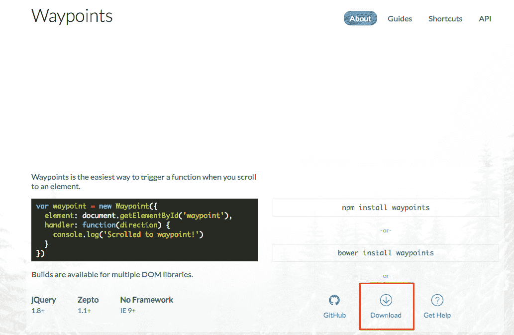
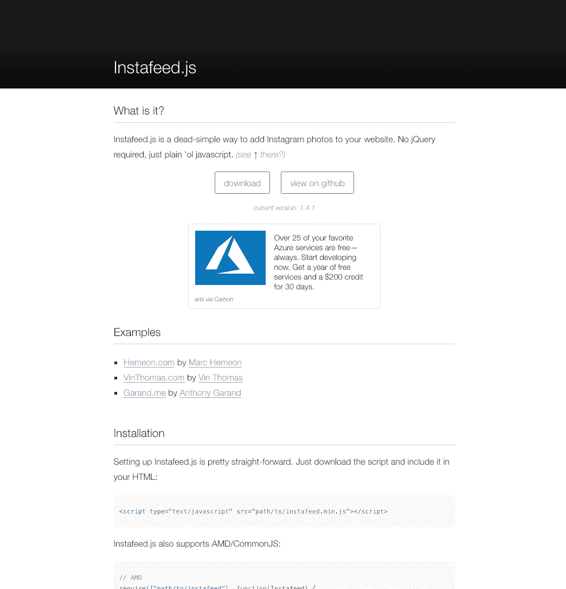
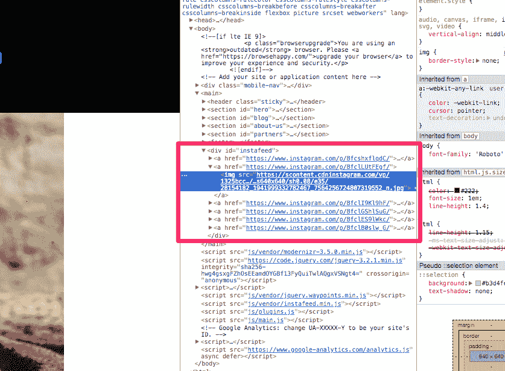
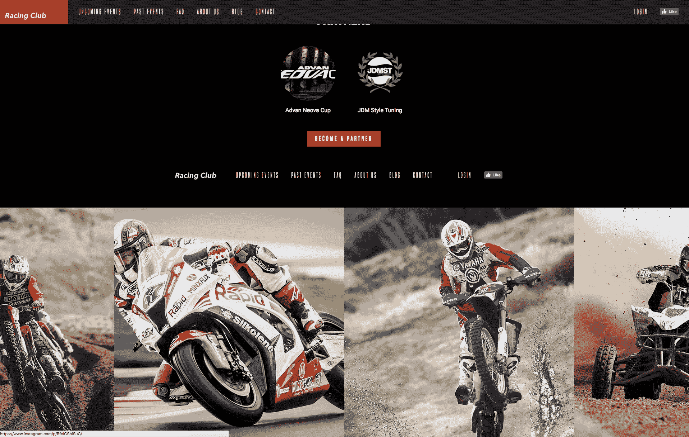

# 九、添加交互和动态内容

我发现这部分建设一个网站是最有趣和愉快的。 添加交互性和动态内容会给我们的网站带来活力，并增加个人的感觉。

在本章中，我们将:

*   首先学习 CSS 中的**伪类**的基础知识，并提供一些悬停和活动状态的示例
*   学习如何从头开始创建一个 CSS 动画
*   添加一些动态内容连接到一个 API，并导入一些内容显示在我们的网站上

让我们开始吧!

# CSS 伪类

伪类用于定义元素的特殊状态。 例如，当您悬停或单击按钮时，可以激活某个状态。

我们现在要学习两个简单的伪类，也是最常见的。 你可以很容易地添加和激活其他伪类，只要你知道如何使用它们:


Different pseudo-classes

两个伪类是`hover`和`active`。 当您将鼠标悬停在一个元素上时，将使用`hover`状态。 显示元素是可点击的是很有用的。 另一方面，当您单击一个元素时，会使用`active`状态。

要使用这些伪类，你只需要用冒号`:`调用它们:

```html
.element:hover {
    // Display something
}

.element:active {
    // Display something
}

```

对于第一个例子，当鼠标悬停在菜单中的链接上时，我们将添加一些样式。 我们想要添加一个下划线链接时悬停。 要做到这一点，我们最好能够用一个类针对每一个`<a>`。 但是如果我们看一下我们的 HTML，我们有很多不同的类为每个导航。 我们要做的是为每个`nav`添加一个公共类，这样我们就可以很容易地用 CSS 调用它。

我们在页眉和页脚上有类`.main-nav`和`.right-nav`。 我们要做的是将一个公共类`.nav`添加到这些类中:

```html
<ul class="nav main-nav">
              <li><a href="upcoming.html">Upcoming events</a></li>
              <li><a href="past.html">Past events</a></li>
              <li><a href="faq.html">FAQ</a></li>
              <li><a href="about.html">About us</a></li>
              <li><a href="blog.html">Blog</a></li>
              <li><a href="contact.html">Contact</a></li>
            </ul>
            <ul class="nav right-nav">
              <li><a href="login.html">Login</a></li>
              <li><a href="#"><iframe src="https://www.facebook.com/plugins/like.php?href=http%3A%2F%2Ffacebook.com%2Fphilippehongcreative&width=51&layout=button&action=like&size=small&show_faces=false&share=false&height=65&appId=235448876515718" width="51" height="20" style="border:none;overflow:hidden" scrolling="no" frameborder="0" allowTransparency="true"></iframe></a></li>
            </ul>
```

现在，我们必须瞄准`nav`内的链接。 如前所述，链接是元素`<a>`。 为了达到目标，我们将调用 CSS 如下:

```html
.nav li a {
  // CSS
}
```

这将针对每个`<li>`中的每个`<a>`，它是每个`.nav`的子元素。

让我们添加伪类`:hover `:

```html
.nav li a:hover {
  // CSS
}
```

要在链接下添加下划线，我们可以使用 CSS 属性`text-decoration:underline;`:

```html
.nav li a:hover {
  text-decoration: underline;
}
```

现在让我们也为按钮添加一些样式。

对于每个按钮，我们都有类`.btn-primary`，因此，按照之前的过程，我们将添加伪类`hover`:

```html
.btn-primary:hover {
  background: #A3171B;
}
```

我们在这里所做的是，当鼠标悬停在按钮上时，改变按钮的背景颜色。 现在让我们添加一个`active`状态:

```html
.btn-primary:active {
  box-shadow: inset 0px 8px 4px rgba(0, 0, 0, 0.25);
}
```

这将在点击按钮时添加一个内阴影。

为了添加额外的触摸，我们可以添加`transition`来使动作更平滑。 不要忘记，一个`transition`必须在正常状态下添加，而不是在伪类上:

```html
.btn-primary {
  display: inline-block;
  font-family: 'built_titling', Helvetica, sans-serif;
  font-weight: 400;
  font-size: 18px;
  letter-spacing: 4.5px;
  background: #BF0000;
  color: white;
  padding: 12px 22px;
  border: none;
  outline: none;
  transition: all 0.3s ease;
}
```

瞧! 非常容易的。 CSS 中有很多伪类。 我们会再看一些但你们已经可以玩了。 下面是 CSS 中的伪类列表:[https://www.w3schools.com/css/css_pseudo_classes.asp](https://www.w3schools.com/css/css_pseudo_classes.asp)。

下一步是构建粘性导航! 我们将结合一些 jQuery 和 CSS，构建一个当用户滚动页面时保持在顶部的导航。 激动人心的时刻!

# 粘性的导航

我们想要做的是，当我们滚动通过 Blog 部分时，导航保持在顶部，如下图所示:


The sticky navigation we want to build.

为了实现这一点，我们将在头部添加一个额外的 jQuery 类。 这个额外的类将使导航保持在顶部，并使导航背景变暗。 让我们首先创建这个额外的类:

```html
header.sticky {

} 
```

We need to be careful here as we didn't separate the class with space, which means it's when the header has also the class `sticky`. 

在这个类中，我们将添加以下属性:

```html
header.sticky {
  position: fixed;
  top: 0;
  background-color: #212121;
  background-image: none;
}
```

让我们来分析一下:

*   我们使用`position: fixed;`是因为我们想让导航保持在顶部。 `position: fixed`将定位相对于浏览器窗口的元素。
*   `top: 0;`告诉我们它会粘在顶端。
*   设置一个纯背景色。
*   `background-image: none;`移除渐变。


Sticky header on the Blog section

我们已经准备好了 CSS 类`.sticky`。 现在我们必须创建 jQuery 函数来实现这一点。

# JS Plugin: Waypoints

我们将使用一个插件，当滚动到一个元素时触发一个动作。 该插件名为*Waypoints*，可以从这个链接下载:[http://imakewebthings.com/waypoints/](http://imakewebthings.com/waypoints/):



Waypoints website.

只需点击下载按钮下载文件。 在您下载的文件中，只有一个文件是必需的。 转到`lib`文件夹，查找`jquery.waypoints.min`。 复制这个文件并将其粘贴到我们的`Web Project`文件夹中，特别是在`js`|`vendor`文件夹中。

粘贴后，我们需要将其链接到我们的 HTML 页面。 为此，转到结束标记`</body>`之前的 HTML 文件。 您将看到一堆之前已经链接到 jQuery 文件的脚本。 在最后一个文件`main.js`之前，只需添加以下内容:

```html
<script src="js/vendor/jquery.waypoints.min.js"></script>
```

`main.js`应该是列表中的最后一个文件，因为它包含了我们所有的个人 JS 函数，需要最后由浏览器读取。

每个插件都有不同的使用方式。 最好的方法是阅读插件作者提供的文档。 在这里，我将向您解释使用这个插件的最简单的方法。

要在 jQuery 中使用`.waypoint`，我们可以通过以下方式调用它:

```html
$('elementToTrigger').waypoint(function(direction){
    /* JS code */
});
```

以下是一些解释:

*   `elementToTrigger`将是我们希望插件在用户滚动经过该元素时监视并触发动作的元素。 在本例中，它将是`#blog`。
*   `direction`:此参数用于检测用户是在向下还是向上滚动页面。

让我们进入我们的`main.js`，创建我们自己的`JS code`:

```html
$('#blog').waypoint(function(direction) {

  });
```

现在，我们希望在用户滚动`down`并滚动过 Blog 部分时执行一个操作，同时在用户向上滚动并离开 Blog 部分时执行另一个操作。

要做到这一点，我们需要使用一个条件，正如我们前面看到的:

```html
$('#blog').waypoint(function(direction) {
    if (direction == 'down') {

    } else {

    }
  });
```

`direction == 'down'`表示卷轴的方向等于`down`。

现在我们要做的是，当用户滚动`down`并通过 blog 部分时，添加类`sticky`，并在用户离开 blog 部分时删除相同的类:

```html
$('#blog').waypoint(function(direction) {
    if (direction == 'down') {
      $('header').addClass('sticky');
    } else {
      $('header').removeClass('sticky');
    }
  });
```

让我们保存并看看它是如何工作的:


Our sticky header.

它工作得很完美，但是标题会立即出现，没有任何动画。 让我们试着让它更平滑一点。 为了添加一点过渡，在这个例子中，我们将使用 CSS 动画。

# CSS 动画

CSS 动画允许在没有 JS 或 Flash 的情况下，使用关键帧和每个 CSS 属性创建动画。 它比简单的转换提供了更多的优势。

要创建一个 CSS 动画，你需要创建一个关键帧:

```html
/* The animation code */
@keyframes example {
    from {background-color: red;}
    to {background-color: yellow;}
}
```

`from`表示动画开始时，`to`表示动画结束时。

您还可以通过设置百分比来更精确地使用时间框架:

```html
/* The animation code */
@keyframes example {
    0% {background-color: red;}
    25% {background-color: yellow;}
    50% {background-color: blue;}
    100% {background-color: green;}
}
```

要触发动画，你需要用 CSS 属性在特定的 div 中调用它:

```html
animation-name: example;
animation-duration: 4s;
```

对于我们的头导航，关键帧将是:

```html
/* The animation code */
@keyframes sticky-animation {
    from {transform: translateY(-90px);}
    to {transform: translateY(0px);}
}
```

`transform:`是 CSS 中一种新的位置类型，它允许你在 2D 或 3D 环境中移动元素。 使用`translateY`，我们将元素移动到*y 轴*。 同样，我们将关键帧命名为`sticky-animation`:

```html
header.sticky {
  position: fixed;
  top: 0;
  background-color: #212121;
  background-image: none;
  animation-name: sticky-animation;
 animation-duration: 0.3s;
}
```

最后一部分是调用课堂中的动画`.sticky`，时长为`0.3s`。

我们现在有一个完美的粘性导航，带有一个很酷的动画!

# 添加一个动态的 Instagram feed

这里的最终目标是能够通过连接到 Instagram API 并从中提取信息来实现自己的 Instagram feed。

从设计的角度来看，我们想要在页脚之后显示我们的最新照片的 feed，当你把鼠标移到它上面时，有一个不透明的悬停效果。

它应该看起来像这样:


The final design of our Instagram feed

要做到这一点，首先，我们需要有一个 Instagram 账户。 如果你已经有一个了，你可以用你自己的。 否则，我已经为这个练习创建了一个帐户:


Our awesome Instagram feed

# 安装 Instafeed.js

我事先上传了几张比赛的照片。 下一步是安装一个名为`Instafeed.js`的插件。 让我们去网站下载:[http://instafeedjs.com/](http://instafeedjs.com/):



Instafeed.js home page

右键单击下载，然后单击将链接保存为.... 将文件放在`vendor`文件夹中，位于`Web Project`的`js`文件夹中。

对于每个插件，每次的安装都非常相似。 所有的安装过程一般都在网站上详细介绍。 让我们看看 Instafeed 的文档。

设置`Instafeed.js`非常简单。 只需下载脚本，并包括在您的 HTML:

```html
<script type="text/javascript" src="path/to/instafeed.min.js"></script>
```

首先，我们需要调用我们最初放置在`vendor`文件夹中的`js`文件:

```html
<script src="js/vendor/modernizr-3.5.0.min.js"></script>
<script src="https://code.jquery.com/jquery-3.2.1.min.js" integrity="sha256-hwg4gsxgFZhOsEEamdOYGBf13FyQuiTwlAQgxVSNgt4=" crossorigin="anonymous"></script>
<script>window.jQuery || document.write('<script src="js/vendor/jquery-3.2.1.min.js"><\/script>')</script>
<script src="js/vendor/jquery.waypoints.min.js"></script>
<script src="js/vendor/instafeed.min.js"></script>
<script src="js/plugins.js"></script>
<script src="js/main.js"></script>
```

把它放在我们之前安装的 Waypoints 插件后面。

现在，如果我们仔细看一下文档，就能找到我们需要的部分。

# 从您的用户帐户获取图像

要从您的帐户获取图像，设置`get`和`userId`选项:

```html
<script type="text/javascript">
    var userFeed = new Instafeed({
        get: 'user',
        userId: 'YOUR_USER_ID',
        accessToken: 'YOUR_ACCESS_TOKEN'
    });
    userFeed.run();
</script>
```

下一步是查找 userID 和 TokenAccess。 如果你不想创建一个 Instagram 帐户，并想使用我事先创建的一个，你可以直接进入标题为显示提要的部分。

# 找到我们的 userID 和 TokenAccess

我们需要找到的信息是`userID`和`accessToken`。 要获得`userID`，我们需要我们的 Instagram 用户名。 Instagram 并没有让我们很容易找到我们的`userID`。 幸运的是，有很多人发明了一种简单的方法来找到它。 你可以通过 google*How to find Instagram userID*轻松找到方法，但我们将直奔主题。 只需前往这个网站[https://codeofaninja.com/tools/find-instagram-user-id](https://codeofaninja.com/tools/find-instagram-user-id)，并填写输入与您的 Instagram 用户名:


The Find Instagram User ID website

点击“Find Instagram ID”后，你会看到以下内容:


Our userID

现在让我们转向`main.js`并复制/粘贴`instafeedjs`文档中显示的代码示例。 在我们的`Sticky Nav`代码之后，粘贴代码:

```html
// INSTAGRAM

    var userFeed = new Instafeed({
        get: 'user',
        userId: 'YOUR_USER_ID',
        accessToken: 'YOUR_ACCESS_TOKEN'
    });
    userFeed.run();
```

只需复制粘贴我们从网站上得到的`userID`，替换`'YOUR_USER_ID'`:

```html
// INSTAGRAM

    var userFeed = new Instafeed({
        get: 'user',
        userId: '7149634230',
        accessToken: 'YOUR_ACCESS_TOKEN'
    });
    userFeed.run();
```

这是没有完成; 我们还需要访问令牌。 这就有点复杂了。

# 获取访问令牌

Instagram 也不容易找到访问令牌。 通常，生成我们的访问令牌需要花费相当多的时间，但我们将使用一个工具来帮助我们获得它。 让我们转到[http://instagram.pixelunion.net/](http://instagram.pixelunion.net/)并点击 Generate Access Token。

该网站将为我们生成一个令牌访问，只需单击，我们唯一需要的是授权该网站访问我们的帐户:


The Pixel Union website

点击生成令牌访问; 它将引导您进入 Instagram*授权*页面:


Instagram Authorization page

一旦完成，你可以复制粘贴他们提供的代码:


Pixel Union Access Token Code

让我们复制/粘贴`main.js`代码中的最后一块拼图:

```html
// INSTAGRAM

    var userFeed = new Instafeed({
        get: 'user',
        userId: '7149634230',
        accessToken: '7149634230.1677ed0.45cf9bad017c431ba5365cc847977db7',
    });
    userFeed.run();
```

保存`main.js`。 下一步是用我们的 Instagram feed 的照片填充 HTML。

# 显示提要

Instafeed 插件是如何显示我们的 feed 的? 它将查找`<div id="instafeed"></div>`并使用链接的缩略图填充它。

让我们回到 HTML 文件的末尾，在我们的`<footer>`标签之后，添加`<div id="instafeed"></div>`:

```html
<footer>
            <div class="container">
              <a class="logo" href="/"></a>
              <ul class="nav main-nav">
                <li><a href="upcoming.html">Upcoming events</a></li>
                <li><a href="past.html">Past events</a></li>
                <li><a href="faq.html">FAQ</a></li>
                <li><a href="about.html">About us</a></li>
                <li><a href="blog.html">Blog</a></li>
                <li><a href="contact.html">Contact</a></li>
              </ul>
              <ul class="nav right-nav">
                <li><a href="login.html">Login</a></li>
                <li><a href="#"><iframe src="https://www.facebook.com/plugins/like.php?href=http%3A%2F%2Ffacebook.com%2Fphilippehongcreative&width=51&layout=button&action=like&size=small&show_faces=false&share=false&height=65&appId=235448876515718" width="51" height="20" style="border:none;overflow:hidden" scrolling="no" frameborder="0" allowTransparency="true"></iframe></a></li>
              </ul>
            </div>
          </footer>

          <div id="instafeed"></div>
```

让我们保存一下，看看它是什么样子:


我们的 Instagram 账号确实出现了，但我们不能就这样不管它。 让我们定制我们的提要并添加一些 CSS 来使它更漂亮。

我们要做的第一件事是从我们的 feed 中获得更大的图像。 默认情况下，Instafeed 从 Instagram 获得最小尺寸的缩略图。 为了获得更大的缩略图，我们可以阅读文档，并找到以下信息:

在 Instafeed 提供的 s*标准选项*中，我们可以看到我们可以从属性`resolution`的缩略图中选择三种分辨率类型:


Instafeed documentation.

我们选最大的一个。 要添加这个选项，我们只需要在 JavaScript 函数中添加一个属性:

```html
// INSTAGRAM

    var userFeed = new Instafeed({
        get: 'user',
        userId: '7149634230',
        accessToken: '7149634230.1677ed0.45cf9bad017c431ba5365cc847977db7',
        resolution: 'standard_resolution'
    });
    userFeed.run();
```

因此，在`accessToken`之后，我们可以添加属性`resolution`。 确保在属性`accessToken`的末尾添加逗号，以表明这不是最后一个属性。 last 属性的末尾不需要逗号。

保存，看看我们有什么:


Website work in progress

很好，现在它需要一些 CSS 来使它更漂亮。 在进入 CSS 之前，我们需要检查一下 Instafeed 为我们生成了什么 HTML，以便我们能够在 CSS 中调用它。 如果你还记得，我们可以在谷歌 Chrome 中检查元素的 HTML。 我们只需要右键单击它，然后点击检查:



Our Google Chrome inspector

我们可以看到 Instafeed 生成了一个内部带有``的`<a>`标签。 非常简单。

知道了这一点，让我们进入我们的`styles.css`文件，并在我们的`footer`部分之后写入:

```html
/* INSTAFEED */

#instafeed {
  width: 100%;
  display: flex;
  justify-content: center;
  overflow: hidden;
  background: black;
}

#instafeed a {
  flex-grow: 1;
}
```

为了解释，我们使用:

*   `width: 100%;`因为#instafeed 是我们用来容纳所有内容的容器。 我们想让它取全宽。
*   `display: flex;`因为我们想要水平地并排显示缩略图。
*   `justify-content: center;`将内容置于中心。
*   `overflow: hidden;`因为我们不希望页面水平扩展。
*   因为默认情况下背景是白色的。

最后，但并非最不重要，也是最重要的一点:

*   `flex-grow: 1;`:如果所有的物品都设置了柔性生长`1`，则`container`中的剩余空间将平均分配给所有的孩子。 如果其中一个子元素的值为 2 或 2 以上，那么剩余的空间将占用其他子元素两倍多的空间。

让我们看看它现在的样子:



Website work in progress

现在，最后一部分是添加不透明度效果时，悬停它。 我们将玩透明度和伪类`:hover`，我们刚刚学过:

```html
#instafeed a {
  flex-grow: 1;
  opacity: 0.3;
}

#instafeed a:hover {
  opacity: 1;
}
```

同样，您只需要在伪类中添加想要更改的值; 这里是不透明度。

让我们也加入一些`transition`:

```html
#instafeed a {
  flex-grow: 1;
  opacity: 0.3;
  transition: opacity 0.3 ease;
}
```

让我们保存它，看看:


Website work in progress

很好，到目前为止我们做得很好。 但如果你像我一样是一个完美主义者，你会注意到在手机和平板电脑上，图像是相当大的。 让我们添加一些快速响应的 CSS，我们可以总结:

```html
/* Tablet Styles */
@media only screen and (max-width: 1024px) {
  #instafeed a img {
    max-width: 300px;
  }
}

/* Large Mobile Styles */
@media only screen and (max-width: 768px) {
  #instafeed a img {
    max-width: 200px;
  }
}

/* Small Mobile Styles */
@media only screen and (max-width: 400px) {
  #instafeed a img {
    max-width: 100px;
  }
}

```

我在这里所做的是改变每个断点的图像大小:


Tablet and mobile view of our Instagram Feed

我们现在已经完成了网站的交互和动态内容。

# 总结

显然，有很多事情你可以做，并添加到你的网站。 这只是一个小小的预演，可以很快实现。 再说一遍，你的想象力和决心将是唯一的限制。 以下是我们在本章所讨论的内容:

我们已经学习了 CSS 伪类以及它如何帮助不同的动画。 我们已经学习了如何使用 CSS`@keyframe`创建动画。 现在，我们可以使用 JQuery 定位元素，并向其添加不同的函数。 我们已经学习了如何通过使用插件连接到 API 和显示信息

这一章有很多令人兴奋的东西! 在下一章，我们将介绍如何优化我们的网站和发布它!