# 第一章：Web 设计的演变

我仍然记得小时候用 56k 调制解调器浏览互联网的情景。那时候感觉很棒！网站加载得很慢，但它们被设计成尽量减少我们使用的数据，因为每个 kbit 都被计算为使用量（没有无限上网，哈！）。为了理解 Web 设计的工作原理，我坚信我们需要了解它背后的历史，了解开发人员和设计师在 1991 年蒂姆·伯纳斯-李的第一个网站开始时是如何设计网站的。基于表格的网站、动画文本和 GIF 图像、免费页面构建工具的出现，以及 1996 年 Macromedia 引入 Flash 都是 Web 设计领域的重大进步。这将帮助您真正理解 Web 设计原则，了解它的发展方向和重要性。让我们通过这些关键方面来精确了解 Web 设计是如何演变的，并分析它在当代社会日常生活中的重要性。

在这一章中，我们将涵盖以下内容：

+   有史以来第一个网站：*万维网的开始*

+   基于表格的布局：*在 HTML 中引入表格标记*

+   Flash 的引入：*Web 设计的复兴*

+   CSS——救世主：*网站设计的新方式*

+   Web 2.0：*JavaScript——Web 的新智能*

+   移动设备的兴起：*移动 Web 设计的繁荣*

+   响应式 Web 设计：*为移动和桌面设计*

+   扁平设计：*新设计趋势的兴起*

# 有史以来第一个网站

有史以来第一个网站是由一位名叫蒂姆·伯纳斯-李的科学家于 1990 年创建的。他是欧洲核子研究组织（CERN）的一位英国计算机科学家。它基本上是一个基于文本的网站，带有一些链接。1992 年的原始页面副本仍然存在在线。它的存在只是为了向人们介绍和告诉他们什么是**万维网**（**WWW**）：

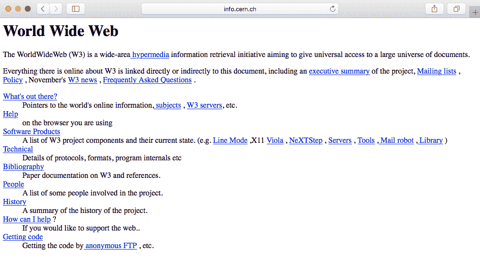

随后的大多数网站基本上都是相同的。它们完全基于文本，使用简单的 HTML 标记：

+   `<h1>`用于标题

+   `
`用于段落

+   `<a>`用于链接（我们将在我们的 HTML 课程中学习所有这些标记）

HTML 的后续版本允许人们插入图像``和表格`<table>`，从而创造了更多的可能性。

1994 年，万维网联盟（W3C）成立，旨在制定和建立 Web 的标准（[`www.w3.org/`](https://www.w3.org/)）。主要是为了阻止私营公司建立自己的 Web 语言，因为这将在 Web 上造成混乱。W3C 至今仍在为开放 Web 提供标准，比如新的 HTML5 或 CSS3。

以下是 90 年代的一些网站示例。以下截图显示了 1994 年雅虎网页的外观：

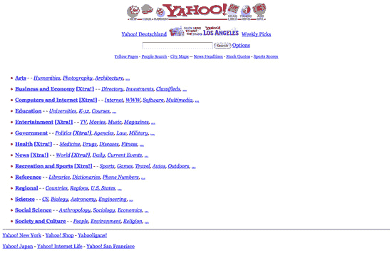

以下截图显示了 1996 年谷歌网页的外观：

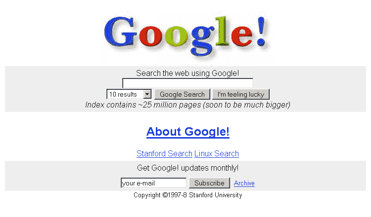

# 基于表格的布局

随着 HTML 中表格标记的引入，Web 设计变得更加有趣。Web 设计师看到了使用原始表格标记（他们总是很狡猾）来构建他们的设计的机会。网站仍然以文本为主，但至少他们可以将内容分成不同的列、行和其他导航元素。1996 年，大卫·西格尔在他的书《Creating Killer Sites》中介绍了间隔 GIF 的使用，这使得 Web 设计师可以利用空白空间（基本上是在内容之间放置小的透明 GIF），并通过合并切片图像背景，用户会产生一个简单结构的错觉，而实际上背后是一个表格布局。设计师们最终可以玩弄一些图形设计元素，比如访问计数器、动画 GIF 等，随着它在流行中迅速增长。文字和图像在网站上随处可见。

我们可以在 1996 年 3drealms 的网站中看到这一点，它展示了设计师们用来添加到他们的网站中的所有花哨的元素：

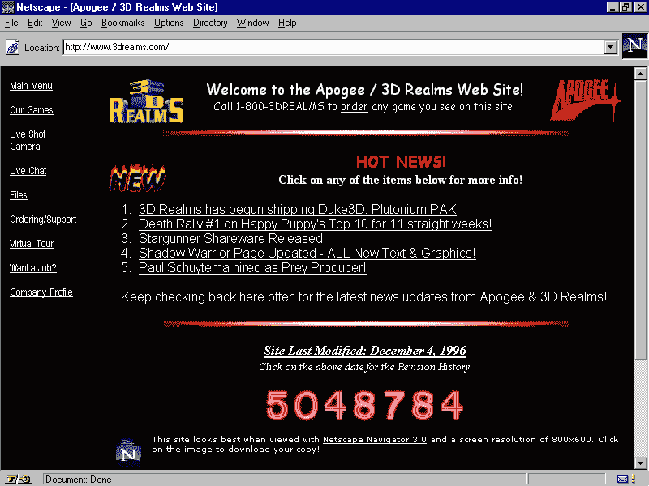

我们还可以看到 2002 年雅虎网页的演变：

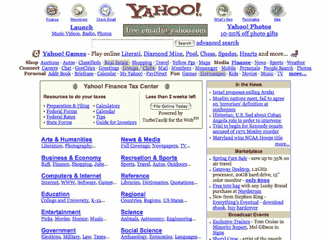

# Flash 的介绍

Flash，之前是 Macromedia Flash，现在是 Adobe Flash，是在 1996 年创建的。它就像是网页设计的复兴。如果你今天用 Flash 建立你的网站，人们可能会取笑你，但在那个时候，它是创建交互和图形网站的杀手工具。设计师们能够添加动画、自定义字体和形状、3D 按钮、闪屏页面，而且所有这些都在一个工具-Flash 中。整个内容被封装到一个文件中，供用户的浏览器阅读。就像魔术一样。不幸的是，这种魔法很不方便。它对于**搜索引擎优化**（**SEO**）不友好，而且在计算机资源方面非常沉重。

Flash 开始衰落是在 2010 年，当时苹果决定停止在他们的 iOS 软件中支持 Flash（[`www.apple.com/hotnews/thoughts-on-flash/`](https://www.apple.com/hotnews/thoughts-on-flash/)）。随着 HTML5/CSS3 的新功能，你可以创建动画并添加多媒体内容，设计师和开发者很快就转向了 Flash，至少是在网页设计方面。

以下是一些 Flash 网站的例子。这个截图显示了一个非常基本的 Flash 网站，使用了滑块、动画和交互。你可以在[`www.richard-goodwin.com/flash/indexn.html`](http://www.richard-goodwin.com/flash/indexn.html)查看这个网站。

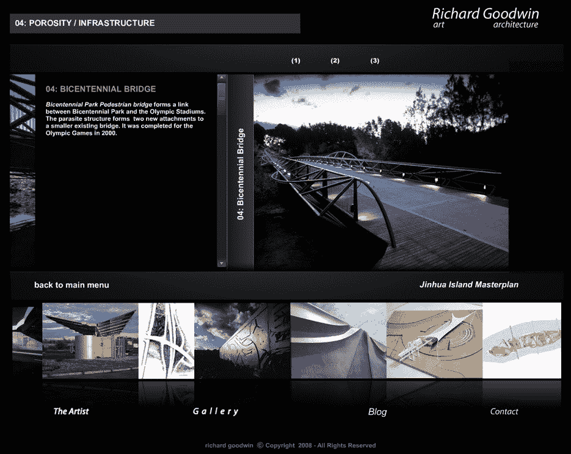

这是一个令人印象深刻的 Flash 网站，当我开始网页设计时它就存在了，*Immersive Garden*：

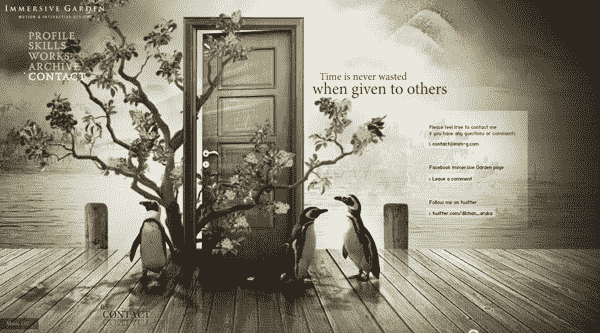

# CSS - 救世主

**层叠样式表**（**CSS**）在 2000 年代变得更加流行，因为它们在网页浏览器中得到了越来越多的支持。CSS 定义了 HTML 的显示方式，这使得设计师能够将内容和设计分开，使网站更容易维护和加载更快。你可以在不触及内容的情况下改变基于 CSS 的网站的整体外观。

CSS 作为 Flash 的替代品真的起到了很大的作用。W3C 推荐它作为最佳实践，它提供了更清晰的语义，从而实现更好的 SEO。

然而，CSS 的一个缺点是各种浏览器的支持不足：一个浏览器会支持最新的功能，而另一个则不会。这对开发者来说是一场噩梦。

我们将在书的第六章中详细探讨这一点，*构建你自己的网站*。以下是雅虎网站（2009 年）的一些设计变化：

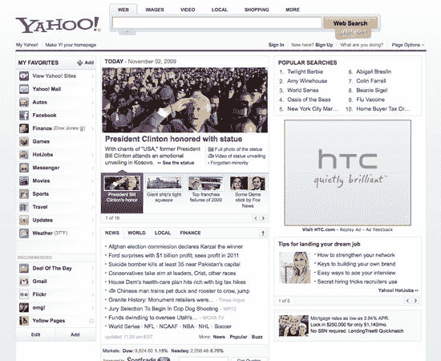

# Web 2.0

21 世纪初期见证了 JavaScript 的崛起。这是事情真正开始朝着我们今天所知道的网络发展的时候。JavaScript 是向网络添加智能的第一种手段。设计师们能够向他们的设计中添加交互、复杂的导航和多媒体应用程序。

尽管网络的最初似乎主要关注设计和美学，但很快就变得以用户为中心，以可用性为主要关注点。设计师们也更加关注颜色分布、位置、对排版的关注，以及使用图标而不是文本链接。最后，Web 2.0 的发展也促进了 SEO 的增长，作为内容驱动。这些技术，如关键词优化、标记和入站和出站链接，现在仍在使用。网络行业真的意识到了 SEO 的重要性，这在这个时期成为了网页设计的主要关注点。

以下是一些网站的例子：

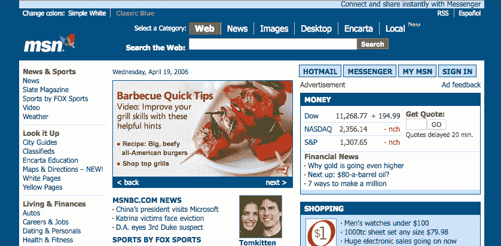

我们可以看到设计上的差异。布局和内容更加结构化。随着*MySpace*网站，开发者开始为人们创建应用程序进行互动：

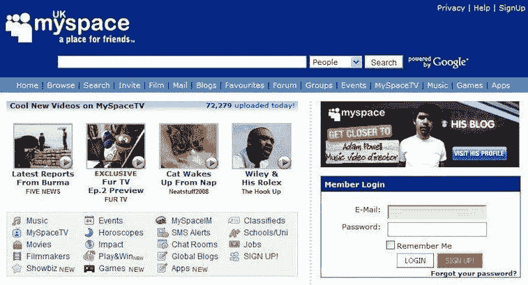

# 移动的崛起

我仍然记得第一部 iPhone 发布时。 对我来说很明显我不会买。 那时我显然不了解自己。 iPhone 最终引发了移动浏览的繁荣。 网络行业的人们没有预料到这一点；用户怎么可能在如此小的屏幕上浏览网站？ 这显然一点也不用户友好。 网页设计师开始设计第二个只在移动上显示的网站。 我仍然记得那些链接以[m.domainname.com](http://m.domainname.com)开头。 维护两个网站绝对是一件麻烦事。 人们开始越来越多地从移动设备访问网站。

2016 年，全球首次移动和平板电脑上网使用超过了桌面使用：

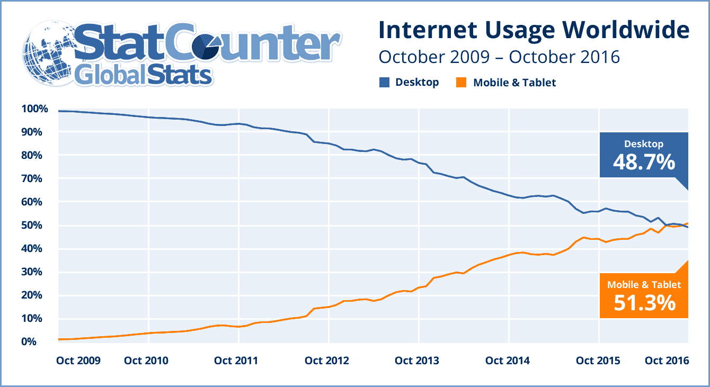

StatCounter 统计 http://gs.statcounter.com/press/mobile-and-tablet-internet-usage-exceeds-desktop-for-first-time-worldwide

# 响应式网页设计

我们第一次听到“响应式网页设计”这个术语是在 2011 年由伊桑·马科特提出的。 在他关于响应式设计的书中，他描述了一种新的设计方式，既适用于桌面，也适用于移动界面，基本上建议在每个屏幕上使用相同的内容，但是不同的设计布局。 960 网格系统的引入也帮助了这个响应式问题（[`960.gs`](https://960.gs)）。 最流行的版本要么使用 12 列，要么使用 16 列。 对于设计师来说，设计他们的网站使用 12 列桌面，逐渐降级为移动查看已经成为标准。 随着 CSS3 的媒体查询的引入，设计师更容易为移动屏幕设计网站。

我们将在下一章节中更详细地探讨这个主题。

媒体查询是 CSS3 模块，允许内容呈现适应条件，如屏幕分辨率（例如，智能手机屏幕与计算机屏幕相比）。 从左到右，我们有 iPhone，iPad 和桌面版本。 这是网格系统和媒体查询的完美示例（[`www.wired.com/2011/09/the-boston-globe-embraces-responsive-design/`](https://www.wired.com/2011/09/the-boston-globe-embraces-responsive-design/)）：

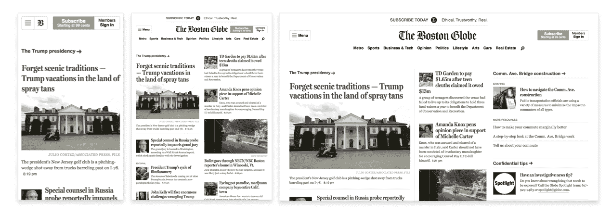

# 扁平设计

你可能听说过这个术语。 如果没有，扁平设计是指设计风格，其中元素没有样式化的形状和字符，如渐变，投影阴影，纹理和任何使其看起来真实和立体的设计类型。 它通常被描述为与“丰富设计”的相反，后者用于使元素在用户导航时感觉更触觉，真实和可用。

人们经常说扁平设计起源于瑞士风格。 如果你没有听说过这个，瑞士风格（也称为国际排版风格）是 1940-50 年代的主导设计风格，起源于瑞士：

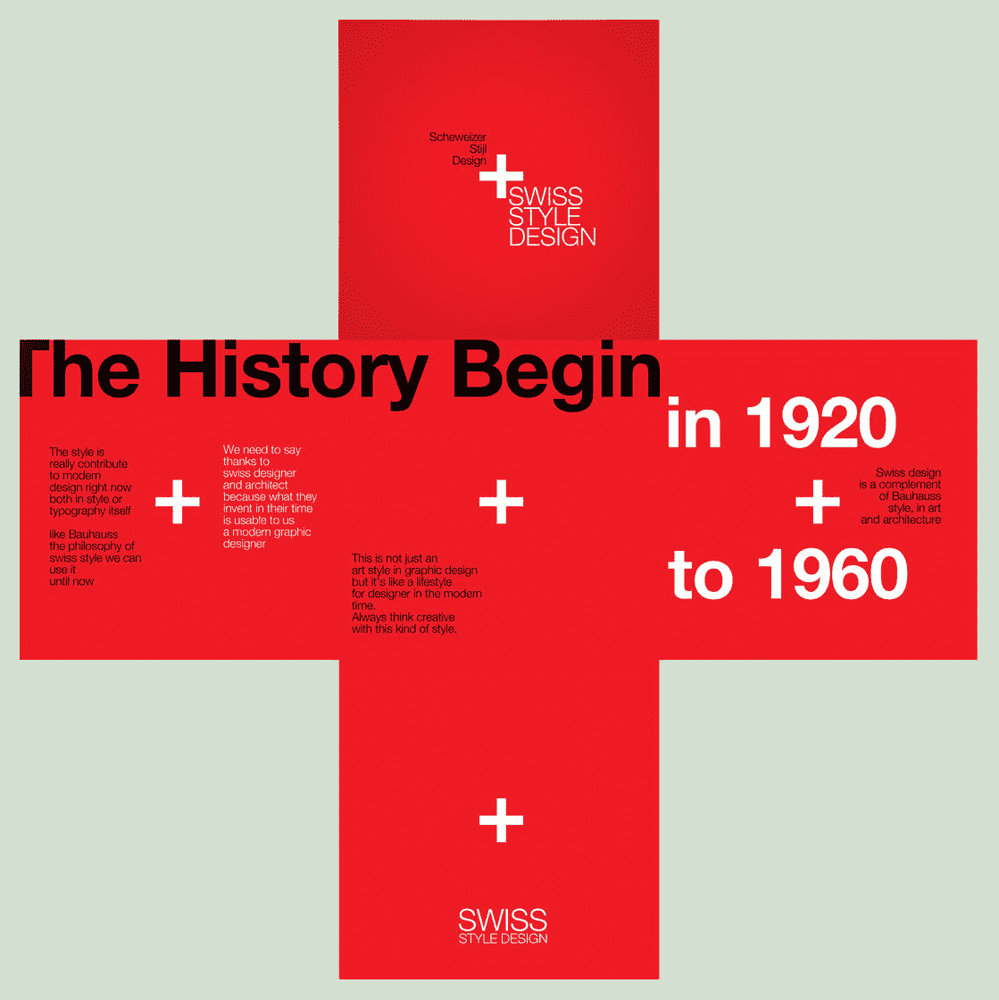

它仍然对许多与设计相关的领域的现代主义运动的图形设计产生深远影响。 它成为了 20 世纪中叶世界各地图形设计的坚实基础。 这种设计风格的主要特征是使用不对称布局，网格，如 Akzidenz Grotesk 的无衬线字体和清晰的内容层次结构。 著名的字体 Helvetica 就是在这个时期创造的，并且在各种类型的设计中都被使用。

毫无疑问，瑞士风格对我们今天所知的扁平设计风格产生了很大影响。然而，这一趋势的主要原因主要是由于在这一时期响应式设计的发展，开发人员和设计师们努力实现了一个严重依赖纹理、投影和背景图像的设计。将这些模式缩小到各种屏幕尺寸，以及由于浏览器兼容性的限制，对设计师来说太过繁琐。他们不得不回归基础，简化他们的设计，使其更少的纹理化。这将导致网站加载更快，更高效，更容易设计。

作为一名设计师，我看到这一趋势正在上升。我仍然记得设计师们测试 CSS3 的最新功能，尝试尽可能少地使用设计资产，同时试图通过代码创建一切。在这个时候，开发人员和设计师的主要关注点是效率和更快的加载。

但我们可以一致同意的是，微软和苹果都对这一趋势产生了重大影响，并进一步推广了这一趋势。随着微软的 Metro 和苹果的 iOS 7 的推出，人们立即感到所谓的丰富设计已经完全过时，并迅速发现他们需要重新设计他们的网站或应用程序。

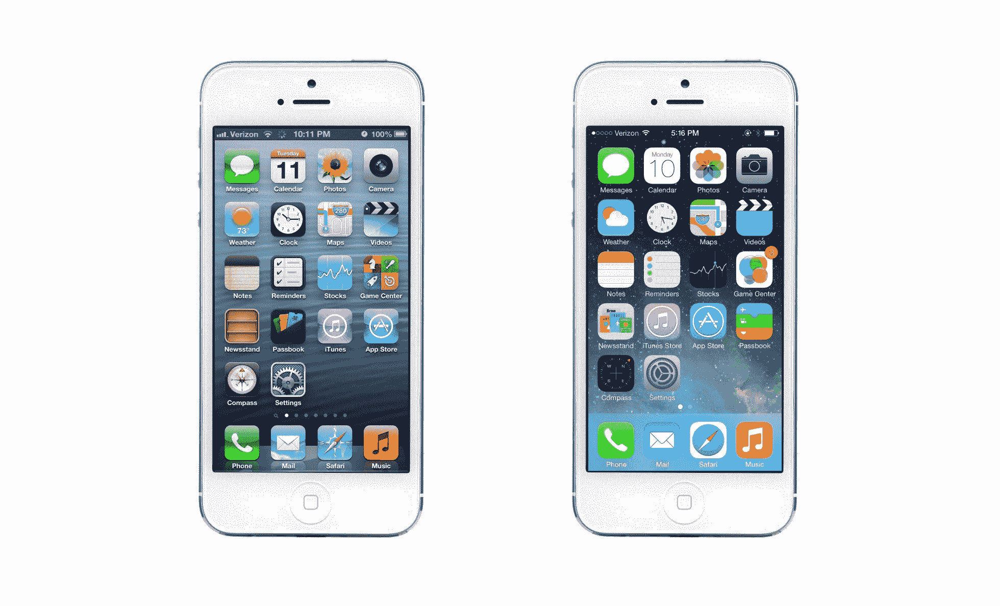

iOS 6 和 iOS 7 之间的比较

# 接下来呢？

在审查了所有这些重要的网页设计特点之后，要记住并牢记的一件重要事情是，网页设计趋势并不是由任何特定的个人或公司导致的。网页设计是视觉设计（受印刷设计影响）和网络技术的结合。随着 HTML5 和 CSS3 的进步，我们可以开始看到设计变得比最初的扁平设计复杂得多。技术现在允许人们在设计和形式上拥有更多的灵活性。让我们看看网页设计趋势将如何发展，但要记住它发展得很快，非常快。

# 摘要

总结这一章，我们看到了互联网是如何由蒂姆·伯纳斯-李爵士创建的第一个网站开始的，以及互联网如何随着多年来表格布局、Flash、CSS 的发展，特别是智能手机的兴起而发生了变化，这改变了用户全球浏览互联网的方式。有了这段历史，我们现在可以跳到第二章，讨论网络组件并解释它们的用途。所以，让我们开始吧！
