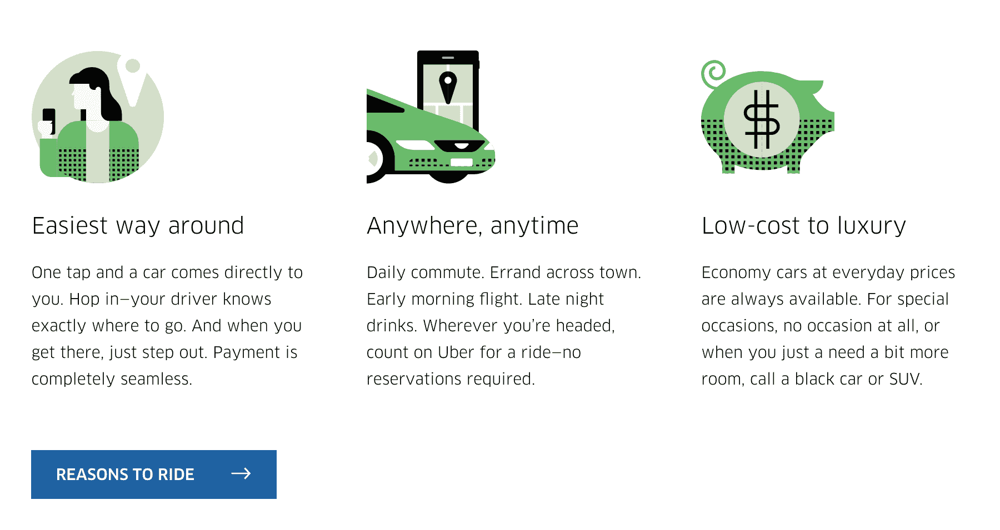

# 第二章：网页设计及其组件

在第一章中，*网页设计的演变*，我们看到自 1990 年蒂姆·伯纳斯-李爵士的第一个网页以来，网页设计是如何演变的。在这些年里，我们看到了新的元素和风格出现在网站设计中。一些元素将帮助用户浏览网站，一些将帮助讲述故事，但最重要的是，所有这些元素都有潜力改善访客的体验。在本章中，我将帮助你了解每个组件，它的用途，以及为什么它有用。让我们深入研究吧！

以下是我们将要涵盖的组件列表：

+   网格

+   行动号召

+   面包屑

+   搜索栏

+   图标

+   模态

+   排版

+   颜色

+   可用性

+   一致性

# 网格

如果你还记得，我们在第一章谈到了网格。网格在响应式设计中非常有用，但它们的用途并不止于此。设计师们自印刷设计以来就使用了网格，用于书籍、出版物，尤其是杂志。简单地定义，网格系统是一个帮助设计师结构他们的设计、内容和图像，并使其更易读和易管理的系统。

了解网格非常重要，因为它们将帮助你按比例设计，平衡设计中的元素，组织模块和部分。更重要的是，它将帮助用户以设计网格的一致性和熟悉性进行导航：

网格系统网站([`thegridsystem.net/`](http://thegridsystem.net/))，对于每个网格系统来说都是一个非常有用的工具，必须要了解。

# 缺点

任何事物都有优点和缺点，网格也不例外。对于大多数人，特别是那些新手设计者来说，网格系统的第一个缺点是他们可能觉得网格系统在创意上有些限制和重复。这是完全可以理解的，不幸的是，有时你会觉得很难突破思维定式，感觉好像一遍又一遍地创造相同的东西。但请记住，网格不容易掌握，需要练习和经验才能充分利用它的优势。

网格在这里是为了帮助，但就像设计时的所有规则一样，规则是用来打破的。你不一定需要遵循网格，但在打破规则之前，你需要了解它是如何工作的。让我们来看一些使用网格布局的好例子：

[`kinfold.com`](http://kinfold.com)

网格的出色使用，优雅而简单。你可以清楚地看到构图和布局。你可以在网站([`kinfold.com`](http://kinfold.com))上查看。你会发现顶部部分不是网格的一部分，但它仍然与设计完美地融合在一起：

著名的 Bootstrap，基于网格的 CSS 框架

一个很好的练习是尝试在网站上找到网格。并看看它是如何设计的。

# 行动号召

**行动号召**（**CTA**）是一个营销术语，用来定义一个设计元素，它向用户征求并鼓励用户采取行动，最终目标是尝试销售。当你开始作为设计师设计网站时，特别是为营销目的时，你会经常听到这个术语。每个设计师的目标是最大化点击转化率，从而最终实现销售。在设计 CTA 时，以下是一些良好实践的指示。

# 显而易见

我要给出的建议是，在设计 CTA 时不要太有创意，因为它仍然是一个按钮，人们已经习惯了。随着用户习惯了在线体验，他们知道 CTA 以按钮的形式出现。他们看到一个按钮，就知道该怎么做。简单。让它变大，明显，并且与周围的一切脱颖而出，那就成功了。

这是一个糟糕的 CTA 示例：

来自 Capgemini.com 网站 2017 年的图片。一切权利属于 Capgemini

箭头指向的区域是按钮，是的，我是认真的，你可以点击它。这就是为什么你应该将 CTA 作为按钮，而不是其他形式，尤其不要与内容或标题相似。

# 使用对比色

使用对比色可以使按钮突出，吸引用户的注意。颜色的选择也很重要，所以要小心你使用的颜色。我们将在本章后面讨论颜色心理学。

这是一个很好的例子：

来自[Freelancer.com](http://Freelancer.com)，一切权利属于 Freelancer International Limited

这个例子很有趣，因为这里的意图很明显是让用户专注于橙色按钮，眼睛会自然而然地转向它。通过使按钮成为对比色，你可以吸引用户的注意力。

# 引人注目的文案

你在 CTA 中写的内容也非常重要。措辞应该简短。超过十到十五个词的任何内容可能都太长了。简单的陈述是最好的。

这是一个很好的例子，措辞简洁高效：

来自[Invision.com](http://Invision.com)的图片

# 位置

位置也非常重要，CTA 按钮需要放在用户接下来会看到的地方。作为设计师，你可以预测和预测这种行为。你不需要花哨，只需要合乎逻辑：

来自[Dropbox.com](http://Dropbox.com)的图片

这里很直接，你必须点击的地方很明显。CTA 在表单之后放置得很合理。

另一方面，这是一个不太直接的例子：

来自[Apple.com](http://Apple.com)的图片

在这个例子中，按钮的放置不直观，用户必须返回到上面才能点击 CTA，而不是在内容之后。

# 面包屑

**面包屑**（或面包屑导航）是指示用户在网站或 Web 应用程序上的位置的辅助导航系统。该术语来源于《韩赛尔与格莱特》童话故事，主要角色在故事中留下一串面包屑以便追踪回到他们的房子。就像童话故事一样，网页中的面包屑允许用户从开始的地方找回自己的路。对于复杂的网站或应用程序非常有用，但对于没有逻辑层次结构或分组的单页面网站来说并不是很有用。

以下是一些面包屑的例子。

这里有一个 Google Drive 的例子：

这是一个电子商务网站的例子。([mac-addict.com.au](http://mac-addict.com.au)):

# 搜索栏

搜索栏对于内容丰富的网站（如 YouTube、Facebook 和 eBay）变得更加重要。用户现在习惯使用搜索栏，当他们搜索某物时，他们总是在寻找它。然而，并非每个网站都需要搜索栏。如果你有一个简单直观的网站，内容较少，搜索栏可能就太过了。

以下是设计搜索栏时的一些良好实践的快速提示。

# 提交按钮

设计师在设计时经常贬低提交按钮，但背后总是有原因的。即使用户可以按*Enter*按钮，不显示它也不够有价值。用户需要看到还有其他操作可以触发。为用户提供不同的可能性来实现他们的最终目标总是更好的：

上面是一个糟糕的搜索栏和一个好的搜索栏的例子。

# 使其显眼

让用户寻找搜索框是一种不好的方法。搜索框应该很容易找到，特别是当你的网站上有很多内容时。通过对比或颜色使你的搜索栏突出是很重要的。显示一个完整的开放文本字段也很重要，因为隐藏在图标后面的搜索栏会使搜索功能不太显眼，并增加访问它的点击次数：

这是亚马逊移动网站的样子：

来自[Amazon.com](http://Amazon.com)的图片

你可以看到亚马逊在移动端专注于搜索栏，而不是隐藏它。

# 正确放置搜索栏

搜索栏需要突出，但也需要放置得当。由*A. Dawn Shaikh*和*Keisi Lenz*进行的一项研究（*搜索在哪里？重新审视用户对网络对象的期望*）涉及 142 名参与者，结果显示用户最方便的位置是在网站的每个页面的顶部中心或右上角。

来自([`blog.wikimedia.org/2010/06/15/usability-why-did-we-move-the-search-box/`](https://blog.wikimedia.org/2010/06/15/usability-why-did-we-move-the-search-box/))

# 图标

现在图标随处可见，你可以在路标、键盘、界面等地方找到它们。图标帮助我们更好地理解和解释信息。它在任何图形通信中都起着重要的视觉辅助作用。作为设计师，知道何时何地使用图标来服务你的设计是非常重要和关键的。以下是一些快速入门的提示。

# 简而言之

有趣的是，图标可以快速总结文本的内容。网络用户已经变得更擅长扫描页面，寻找对他们来说相关和有趣的内容。因此，他们只需看一眼图标，就能快速获取他们想要的信息。例如，在这个例子中：

（[uber.com](http://uber.com)）

图标可以快速描述内容，并产生美观的效果。

# 吸引用户的注意力

一个没有图标的网站可能会很无聊。想象一下一本没有图片的杂志，会有多无聊？对于网站内的图标来说，也是同样的逻辑。此外，有了漂亮的图标，你为你的网站增添了更多的美感，而你的用户也会因为方便而感激你。

来自[Paypal.com](http://Paypal.com)的图片

看看这张从 PayPal 网站上截取的带有图标的屏幕截图，与我们去掉图标的下一张对比：

来自[Paypal.com](http://Paypal.com)的图片

第一个肯定比第二个更有趣和吸引人。

# 方向性

我推荐使用图标的最后一个原因是向用户显示方向。与其显示“上一个”或“下一个”，显示箭头往往更有效，因为用户现在习惯了这种方式：

箭头也可以设计得很好（[`cars3generations.com/`](http://cars3generations.com/)）。

# 模态

模态框通常是弹出窗口，而不是打开新的标签页/窗口。它们通常会使背景变暗，以吸引弹出窗口的注意。简而言之，模态框用于在同一页面上向用户显示信息，而不需要重新加载页面，从而提高了可用性。

模态框起源于 Windows、Mac OSX 和 Linux，但它们很快就传播到了 Web 应用程序和其他用途。

使用模态框的五种常见用法：

+   **错误：**警告用户出现错误

+   **警告：**警告用户可能有害的情况

+   **收集信息：**从用户那里收集信息

+   **确认或提示：**要求用户确认操作

+   **助手：** 在使用界面时帮助用户

模态框不应与侧边栏、手风琴菜单、工具栏等无模态组件混淆，因为它们允许用户与父窗口进行交互。

以下是一些模态框的例子：

在[Twitter.com](http://Twitter.com)上撰写推文时使用模态框：

模态框也用于在登陆网站时获取人们的电子邮件或注意力，比如在[Getflywheel.com](http://getflywheel.com)上。

# 排版

我仍然记得设计我的第一个网站时，网页设计中的字体非常受限制。只有几种默认字体可用，我们大多数情况下不得不使用超级中性的 Arial 字体。随着 CSS3 的字体支持，现在可以添加自定义字体，这对设计师来说是一种解脱！排版在设计中非常重要，它可以改变访问者的感知。*纽约时报*（[`opinionator.blogs.nytimes.com/2012/08/08/hear-all-ye-people-hearken-o-earth/`](https://opinionator.blogs.nytimes.com/2012/08/08/hear-all-ye-people-hearken-o-earth/)）中有一项研究比较了字体的真实性。看一下这张图表：

权重一致

你可以看到人们倾向于相信 Baskerville 字体中写的信息胜过其他任何字体：

权重不一致

排版在你的设计中真的可以起到作用。不幸的是，我在这里不是为了做一个完整的排版课程，但这里有一些快速选择最佳字体的小贴士。

# 选择一个与您的品牌相连接的字体

你所做的一切都应该与你的品牌相连接，包括你的排版。你选择的排版将给用户一个关于你的品牌是谁以及是关于什么的想法。基本上有三种不同的字体类别：有衬线、无衬线和手写体。

# 有衬线字体

有衬线字体很容易通过字母上延伸的小线或笔画来识别。这里有一张图解释了区别：

图表来自[`visualhierarchy.co/blog/serif-vs-sans-serif/`](https://visualhierarchy.co/blog/serif-vs-sans-serif/)

与有衬线字体相关的情绪通常是经典、浪漫、优雅、正式和成熟的。一些著名的有衬线字体包括 Times New Roman、Baskerville、Georgia 和 Garamond。

# 无衬线

无衬线字体通常被认为比有衬线字体更现代。与无衬线字体相关的情绪更清洁、友好、简约或现代。一些最著名的无衬线字体包括 Arial、Helvetica、Futura 或 Gotham。

Gotham 字体来自[`www.typography.com/fonts/gotham/overview/`](https://www.typography.com/fonts/gotham/overview/)

Gotham 字体在 2000 年代末非常流行。

# 随意手写体

这些字体旨在表现得像是快速书写的非正式字体。很多时候它们看起来像是用毛笔画的。它们可以代表情感、速度和熟悉感。它们不适合作为正文内容，但可以作为一个非常好的标题来传达情感：

来自创意市场的 Bellisia 字体（[`creativemarket.com/sizimon/1719182-Bellisia-Script`](https://creativemarket.com/sizimon/1719182-Bellisia-Script)）

# 不要使用太多字体

这是我经常给年轻设计师的建议，因为他们倾向于在设计中使用太多的字体，我猜是因为太兴奋了。尽量保持设计的一致性，我建议使用一到三种不同的字体，但不要超过三种。使用有衬线字体作为标题，无衬线字体作为正文是一个很好的搭配。

以下是一些良好组合的示例：

Playfair 和 Futura 的组合([`www.dogstudio.co/`](https://www.dogstudio.co/))

另一个好的组合：

GTWalsheim 和 Adobe Garamond 的组合([`www.christianaslund.com/the-new-oil-frontier`](http://www.christianaslund.com/the-new-oil-frontier))

最后，GT-Sectra 和 Futura 的组合：

GT-Sectra 和 Futura 的组合([`changegout.com/`](http://changegout.com/))

如果你想要一个网站来找到排版的好组合，我推荐[`fontpair.co/`](https://fontpair.co/)。

有不同的方法将字体添加到你的网站中：

+   你可以使用自己的字体，并使用字体生成器生成与你的浏览器兼容的字体。我推荐[`www.fontsquirrel.com/`](https://www.fontsquirrel.com/)。

+   你也可以使用免费的 Google 字体：[`fonts.google.com/`](https://fonts.google.com/)。

# 颜色

颜色在网页设计中具有巨大的重要性。根据 Kissmetrics 的说法，当你看到一种颜色时，你的眼睛会与大脑的下丘脑区域进行交流，然后，它会向垂体发送信号，最终到甲状腺。这会导致释放激素，引起情绪、情感的波动，从而产生行为。有趣，不是吗？

同样来自 Kissmetrics 的研究表明，一个网站访客形成判断或意见只需要 90 秒。而 62-90%的互动是由产品颜色决定的。

现在你应该明白为什么颜色非常重要，为什么选择它们的方式、时间、受众和目的至关重要。

# 颜色的含义

每种颜色在每个人身上都会引发特定的情感。尽管这可能会因文化、背景或偏好而有所不同。以下是颜色含义的快速参考：

+   黄色：

+   张扬的黄色应谨慎使用

+   男性觉得这不雅

+   孩子们喜欢

+   橙色：

+   新的红色，温暖而没有危险

+   与能量（饮料、运动、健身）相关

+   孩子们也喜欢

+   红色：

+   促使行动，增加呼吸和脉搏

+   象征激情，是时尚/化妆品品牌、约会和食品的理想选择

+   紫色：

+   奢华、优雅和女性化

+   涵盖了大量女性受众，没有负面联想

+   黑色：

+   高雅、传统、企业

+   卓越和正式

+   绿色：

+   成熟，绿色促进健康

+   适用于健康产品、道德运动

+   浅绿色表示创新和新思路

+   蓝色：

+   受欢迎的蓝色暗示着智慧和宁静

+   深蓝色与奢侈品相关

+   浅蓝色适用于清新的产品和创意

+   抑制食欲，所以不适合食品

+   粉色：

+   经典的粉色

+   经常被过度使用来吸引女性用户的注意

+   任何女性化和与婴儿有关的东西

+   它也被认为刺激甜食欲望

+   白色：

+   纯净、凉爽、平静和现代

+   棕色：

+   大多数人避开这种颜色

+   男性不喜欢

+   唤起自然

+   表示可靠性

例如，如果你想创建一个销售玩具的电子商务网站，你不会使用黑色，因为它暗示着更加高档和优雅。你会更多地在欧莱雅或魅可化妆品等奢侈品牌上使用它：

图片来自[Loreal.com](http://Loreal.com)。

看看欧莱雅如何使用黑色看起来更奢华，尽管他们并不是奢侈品市场。

当然，记住这些只是指导方针（它们总是取决于上下文）。看看不同的网站如何使用颜色，这总是学习的最佳方式。

# 可用性

我们之前谈到设计如何演变为以用户为中心的设计。这正是我们现在要研究的，那么什么是可用性呢？可用性简单地定义了用户界面的易用性。通常用五个组成部分来衡量：

+   可学习性：用户在访问网站时，实现基本任务有多容易？

+   效率：学习之后，用户重新执行任务或完成其他任务有多有效率？

+   记忆性：用户在一段时间不使用网站后，再次返回并熟练使用网站有多容易？

+   容错性：用户从错误中恢复有多容易？

+   满意度：使用设计有多愉快和令人满意？

在过去几年里，用户已经习惯了网页设计的某些标准，不再容忍加载缓慢、难看或难以浏览的网站。如果你的网站不可用，那么还有很多其他选择。加载速度慢和糟糕的用户体验是增加网站跳出率的因素之一。但是，如果你研究用户的需求和行为，你就能够根据这些来调整你的内容和设计。以下是一些快速指南，让你对应该注意的事项有所了解：

# 简洁

简洁绝对是我在设计中始终追求的东西之一。有时，页面中简单的 CTA 就足够了，不是在开玩笑！首先尝试定义你的用户需要，然后尽可能简化用户体验。添加没有任何功能目的的不必要元素将不可避免地影响访问者。建筑师的著名语录：

“少即是多”

-路德维希·密斯·凡德罗

在某种程度上是相当准确的。

# 可导航性

在简洁的延续中，直观的导航对于良好的用户体验至关重要。不要让用户思考。尽量将自己放在最终用户的位置上，使导航尽可能无痛。与朋友或家人进行一些测试总是一个好主意。

以下是一些良好导航的快速提示：

+   保持主导航简单，放在页面顶部是不错的。

+   不要忘记在大型网站中加入页脚导航（人们经常使用页脚导航）。

+   包括一个搜索框（我们之前讨论过为什么要这样做）。

+   不要使你的导航过于复杂。对项目进行分类，但不要过于深入。

+   链接应该明显，下划线、加粗或者使用不同颜色，但它们应该总是与内容有所区别。

# 易访问性

如果你的网站加载时间超过三秒，你需要考虑优化你的网站。如今的用户懒惰且不耐烦。在一个一切都快速且易于访问的互联网世界中，你需要尽可能地让你的网站易于访问。

以下是可用性和易访问性的一些基础知识：

+   正常运行时间：确保你的网站没有宕机或在加载时出现任何错误。投资于一个良好的托管。

+   损坏的链接：确保没有死链接。用户不应该跳转到 404 页面。一个好的做法是如果链接无法访问，将用户重定向到一个新页面。

+   网站响应性：使你的网站适用于每种屏幕，并根据分辨率支持不同的布局。

良好的可访问性的一个很好的例子是亚马逊。他们的网站可以从任何地方访问，而且几乎没有宕机，主要是因为他们也是一个托管公司。但是如果你仔细观察，他们的网站在桌面和平板电脑上都是响应式的，在调整大小时会自适应。对于移动设备，他们有一个自适应网站，具有不同和更清晰的布局，更适应小分辨率。我们将在接下来的章节中看到响应式和自适应之间的区别。

[Amazon.com](http://Amazon.com) 在台式电脑、iPad 和 iPhone 上

# 一致性

在审查了所有这些网页设计组件之后，我将以一致性及其重要性结束。一致性无疑是一个良好网站的关键组成部分。它将为你的出色网站或应用程序带来最后一块拼图。想象一个例子，当你想找到你的钥匙，但你知道它们总是在同一个地方，你就不必思考。但如果你找不到它，你会开始紧张地寻找它。对于用户来说，网站也是一样的。你不希望他们每次来到你的网站都要学习。

# 那么，我们如何保持一致呢？

这些是你应该保持一致的几个领域：

+   设计

+   内容

+   互动

# 设计

你的设计应该是一致的，这意味着你创建的每个元素，如链接、按钮、输入或标题，都应该遵循你自己的设计风格。用户会记住细节，无论是有意识地还是无意识地，所以他们会因为特定的颜色或形状而认出一个链接。

一个**用户界面**（**UI**）样式指南示例。这有助于保持 UI 的一致性：

# 内容

视觉方面不仅需要保持一致，内容也需要如此。网站上使用的情绪和语气必须反映品牌。如果你是一个面向企业销售的企业网站，你的网站内容既应该看起来，也应该感觉非常专业。

# 互动

最后，互动在整个网站上必须保持一致。网站如何响应用户的互动应始终保持一致并保持不变。例如，在 Dropbox 上打开文件时，返回按钮始终位于左上角位置，这样用户就不必再次寻找它并重新学习你的界面。

# 总结

在本章中，我们涵盖了很多主题，但总结起来，网页设计中的每个组件都很重要，对于你的设计来说很重要，但更重要的是对于最终用户来说很重要。有了所有给出的建议，你现在能够创建并使网站看起来很棒，用户友好。

在你开始着手创建自己的设计之前，我想向你介绍下一章，它将讨论响应式和自适应设计，这是你作为设计师或开发者需要了解的内容。让我们开始吧！
