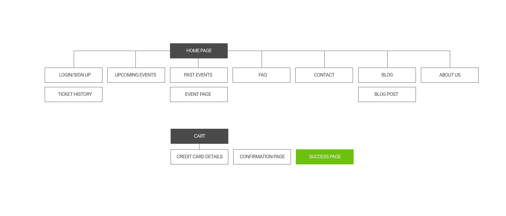
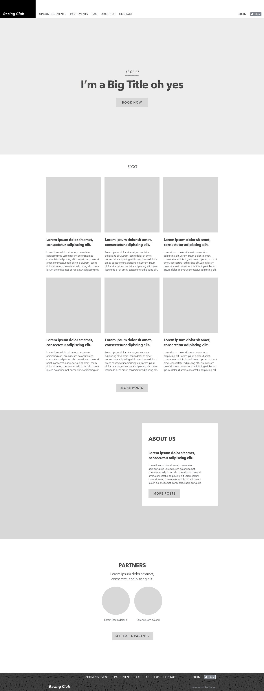
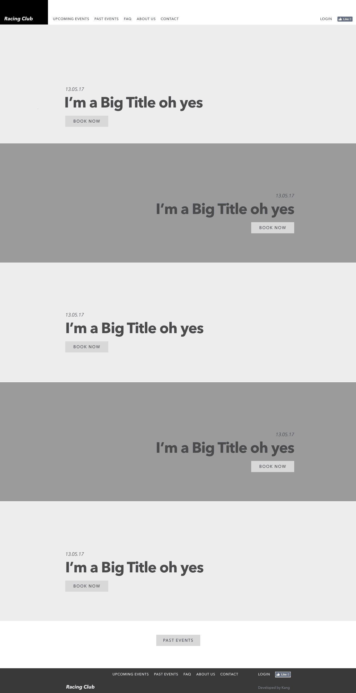
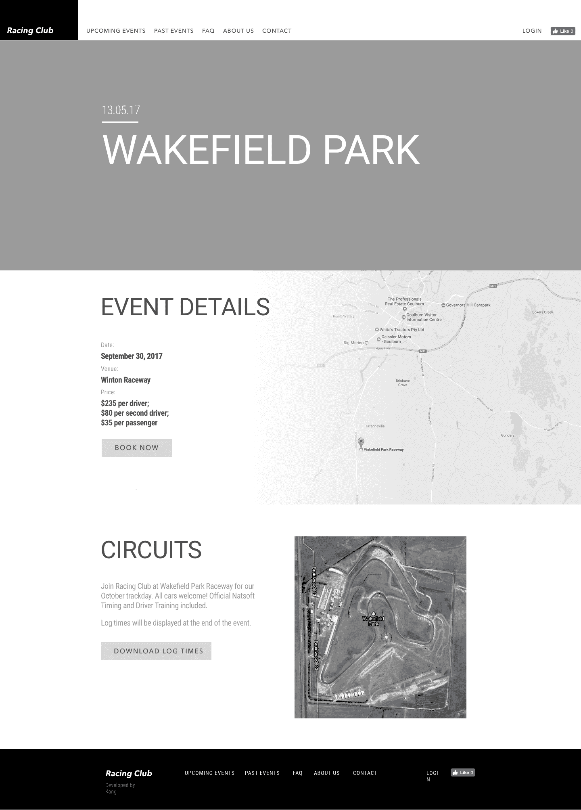
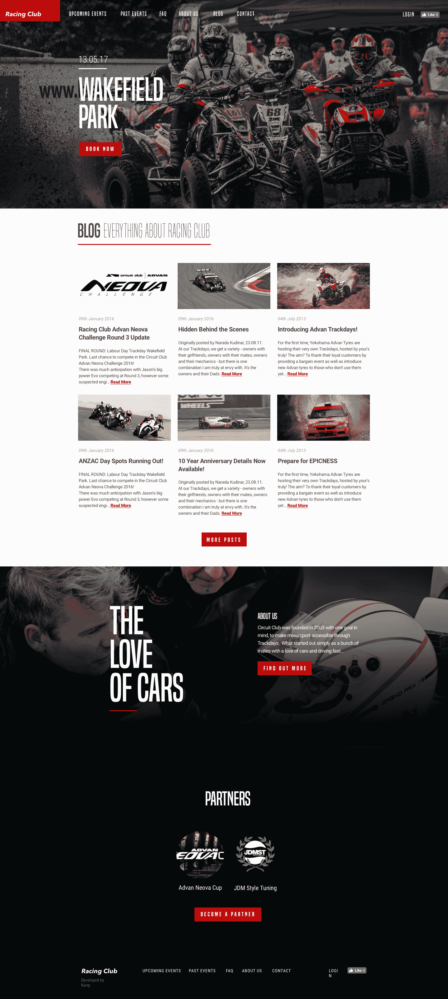

# 第三章：网站设计工作流程

在我们真正开始着手创建和实施我们的第一个网站之前，我希望你能从头到尾地经历一遍所有的过程。网页设计不仅仅是设计美观的网站和漂亮的布局；网页设计是一个整个过程，特别是当你想要在现实世界中实施你的设计时。

在这一章中，我们将涵盖以下内容：

+   目标确定：*如何确定我们的目标*

+   范围定义：*列出范围*

+   线框图创建：*如何创建线框图*

+   设计：*创建出色设计的框架*

+   实施、测试和发布

# 我们的情况

让我们想象自己作为设计师工作，接受客户工作。你的第一个项目是为一个赛车俱乐部设计网站；以下是项目的简要：

*Racing** Club*是一个赛车迷俱乐部，成立于 2016 年。它最初是由一群热爱汽车的朋友创建的，但迅速发展成一个热衷于分享他们的激情的社区。

那么现在，让我们来看整个过程。

# 目标确定

在这个阶段，你需要确定网站的最终目标。通过与客户沟通并询问他们关于他们的业务和目标的问题。

# 网站的目的是什么？

现在是确定要解决的问题或为网站设定目标的合适时机。销售门票或增加门票销售？看看你的客户想要什么，并为其找到最佳解决方案。你还需要进行自己的调查，深入了解他们的网站，并寻找需要修复的任何问题。通过之前学习的所有基础知识，你现在能够看到什么是好的，什么是不好的。

# 网站是为谁设计的？

简化设计过程和决策的最佳方法是了解你的目标受众。了解受众有很多方法。你可以问客户，使用不同的分析工具进行跟踪，或者查看以前关于同一市场的报告，这些都会在这个阶段帮助你。

# 这对我们的受众有用吗？

你的客户应该对他们的客户有一些信息，比如他们的年龄、收入等。利用这些信息来创建人物角色，并创建适合网站的用户流程。在我们的例子中，赛车俱乐部，我们会创建以下人物角色：

+   乔治：38 岁，父亲，车库工人，热衷于赛车

+   保罗：28 岁，单身，从事金融工作，热爱汽车和赛车

两种用户流程将有不同的工作方式，你可以排除任何与我们目标用户无关的流程。

# 他们期望在那里找到或做什么？

了解并定义网站的**信息架构**（**IA**）也很重要。知道要向用户展示什么将决定你屏幕的设计并规划用户体验。

你需要创建一个站点地图并定义你需要做的每个屏幕。首先这样做将极大地帮助你设计网站，因为你甚至不需要考虑它。

# 网站需要遵循品牌还是有自己的品牌身份？

当你需要遵循品牌风格指南时，设计网站可能会有所不同。由于风格指南将有助于保持品牌的一致性，客户希望你遵循它，即使这可能会在一定程度上限制你的创造力。

如果客户没有品牌身份，这是为他们创建一个品牌的好机会。

# 有竞争对手吗？如果有，网站与其他网站有何不同？

了解客户的竞争对手也是了解该做什么和不该做什么的好方法。在收集信息的过程中，你需要研究客户的竞争对手。这不仅仅是要做一些完全不同的事情，而是要为客户做好的事情。如果你的竞争对手的一些用户体验很好，可以从中汲取灵感，让你的客户网站变得更好。你通常不需要重新发明轮子，只需要改进它。

所以这就是我们的项目。

我们需要一个具有以下特点的网站：

+   首页

+   即将举行的活动页面

+   往期活动页面

+   活动页面详情（查看活动信息并购买门票）

+   博客页面

+   关于我们页面

+   联系页面

+   登录页面（查看购买门票的历史记录）

网站需要响应式设计，以便人们可以在手机上访问。客户没有品牌身份，并且愿意让我们创造一个。

网站的主要目标是首先向用户展示相关信息，然后，如果他们愿意，让他们能够在线购买门票，而不是去实际的地点购买。

网站地图如下：

网站地图示例

# 定义范围

这通常是设计师的难点：了解和定义项目的范围。项目通常会比预期的时间长，但这不应该是问题，因为这会导致更多的工作。但有时，客户的期望和你的期望并不相同，所以最好设定边界，以防止意外的工作和范围蔓延。将所有内容都写入合同将有所帮助。这里有一些你可以使用的模板：[`www.smashingmagazine.com/2013/04/legal-guide-contract-samples-for-designers/`](https://www.smashingmagazine.com/2013/04/legal-guide-contract-samples-for-designers/)。

# 创建线框图

现在我们已经定义了项目的目标，我们可以开始设计一些线框图。

在这个项目示例中，我们只会做几个屏幕。这是我们将用于首页、活动页面和即将举行的活动页面的线框图。线框图不是为了精细和设计，它们只是为了得到布局和内容的想法。所以只需使用你喜欢的设计应用程序的简单矩形，或者甚至可以手绘。

这是我们想出的：

对于活动页面：

这是我们为活动页面想出的设计：

# 设计

当我设计一个项目时，我总是使用相同的框架：

1.  获取灵感

1.  改进

1.  创新

让我解释一下我在每个步骤中做什么：

# 获取灵感

我真的认为灵感是设计创作的主要部分之一。寻找和收集灵感对我来说至关重要，因为我需要这些灵感来通过获取一些我认为酷或与这类项目相关的设计片段来制作自己的设计。

以下是我用来寻找灵感的一些网站：

+   Awwwards

+   CSSDesignawards

+   FWA

+   Dribbble

+   Behance

然后我会使用*BukketApp*来获取图片，并为这个特定项目创建一个情绪板。

# 改进

一旦你有了情绪板，你就可以开始调整和改进设计。就像拼图一样，尝试通过重新组合形状、颜色等来构成。这是最有趣和最有创意的部分，因为这取决于你的想象力和你创造独特高质量东西的灵活性。

# 创新

当你最终从上一步得到一些东西时，你现在可以将这个设计扩展到整个设计风格。

这个框架不仅可以应用在设计中，还可以应用在创意或研究过程的各个方面。看看生物学研究，比如仿生学，它模仿自然的元素和部分，解决复杂的人类问题。这个过程本质上是一样的，只是方式不同。

这是我们想出的最终设计：

首页设计：

# 实施、测试和发布

设计获得批准后，就是实施网页设计的时间了。这是一个非常有趣的阶段，因为你将让你的设计变得生动起来。看到并与之交互将会得到一些有趣的反馈，这些反馈在设计时可能没有看到。

一旦一切都完成了，你需要彻底测试每个页面，并确保每个链接都能正常工作。这也是一个很好的方法，可以将你的网站放在一个暂存网站上，让人们可以在不将其发布到生产服务器上的情况下进行测试。在这个过程中，你总会发现问题或错误。测试将确保你的网站在每个浏览器和每个设备上都能完美运行。这是一个漫长的过程，但必须完成！

最后，大家最喜欢的部分来了：发布是当你看到自己的作品最终上线时，你应该为此感到自豪。但是，仅仅因为你已经发布了网站，并不意味着工作结束了。你仍然可以进行一些 A/B 测试，使你的设计变得更好，永远不要忘记，一个伟大的网站不仅仅是关于美学，而是要找到形式和功能之间的正确平衡。

这最后三个步骤是下一章的一部分，所以我们将逐步进行这个过程。

# 总结

在本章中，我们经历了从设计网站到发布的整个过程。了解整个过程将有助于你与你的客户和项目。很多人在设计项目时匆忙行事，但在实际设计之前还有很多步骤。特别是如果你在做大量的用户体验设计，花一些时间进行一些研究实际上会为你节省大量的时间和金钱。

在下一章中，我们将深入了解响应式和自适应设计。这两者有着相似的最终目标，但它们是非常不同的。我们将看到其中的区别！
