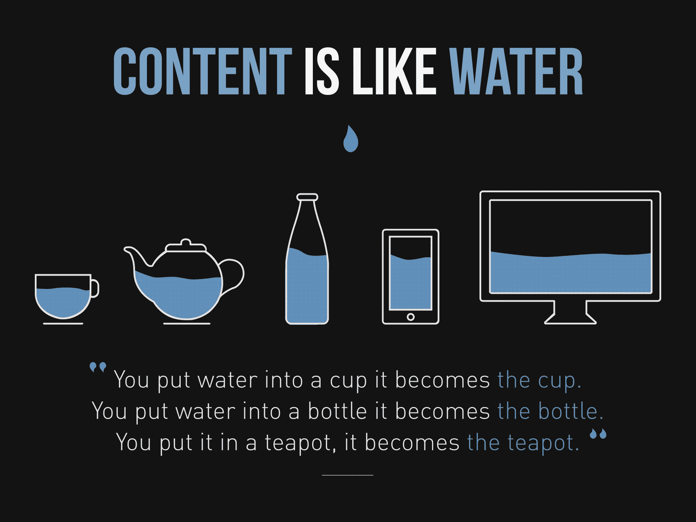
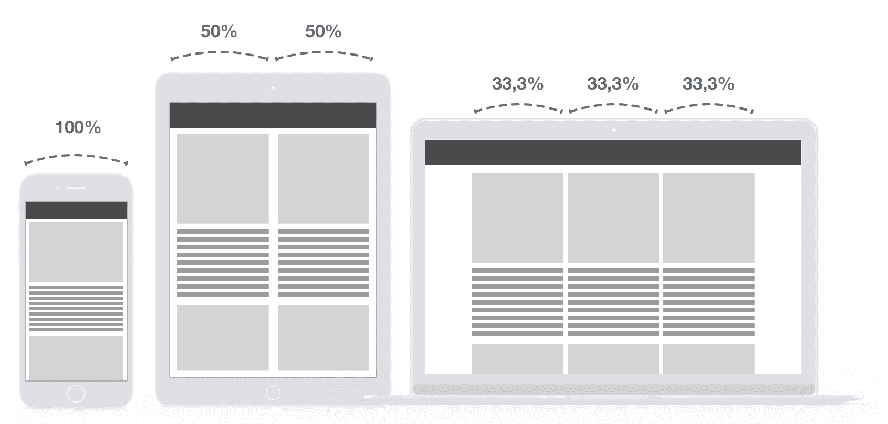
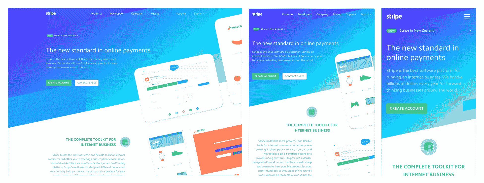
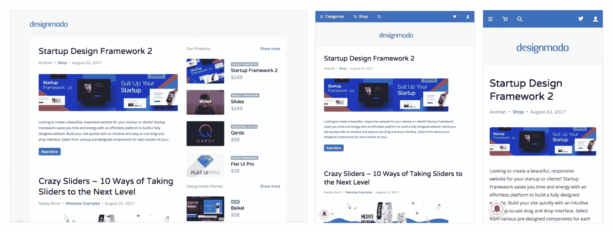
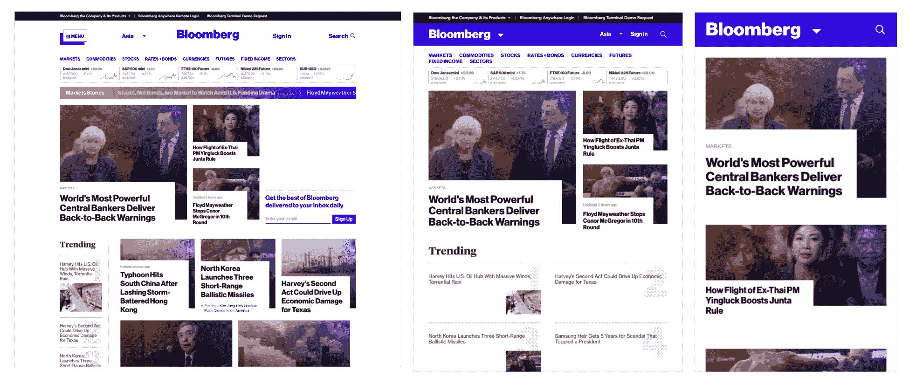
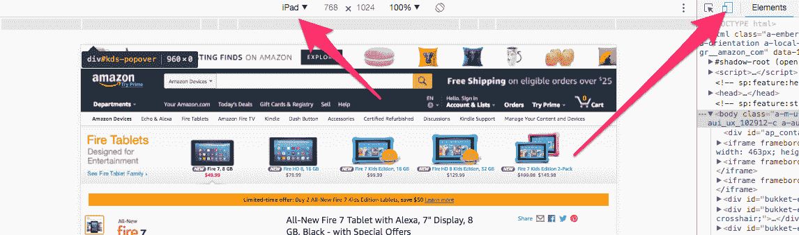
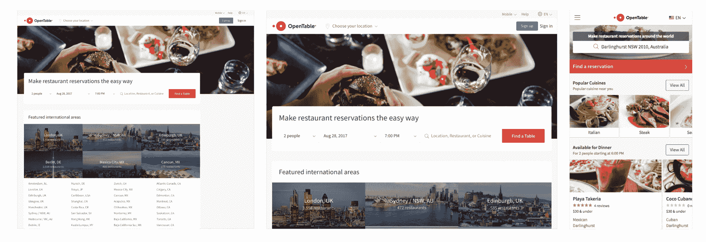
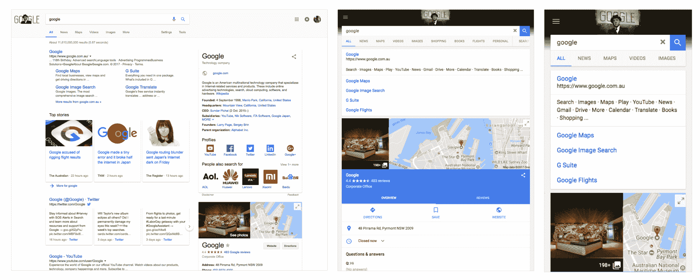

# 第四章：响应式设计与自适应设计

在设计我们的网站之前，让我们了解响应式和自适应设计之间的区别，以及为什么有必要了解它。了解响应式和自适应设计方法之间的区别对于网页和应用程序设计师来说非常重要。了解这些区别将使您在规划和执行设计时拥有更好的视野和结果。

随着我们现在拥有的设备数量，了解每个设备的需求和行为真的很重要。内容是关键，它需要在每个设备之间流动。正如 Josh Clark 所说的那样，把它看作是在每个设备上冷却的水：

“内容就像水一样。内容会呈现多种形式，流入许多不同的容器，其中许多我们甚至还没有想象过。”

-（也受到李小龙著名语录的启发）

作者/版权所有者：Stéphanie Walter

设计师们仍然混淆这些，并且并没有真正看到两者之间的界限，尤其是年轻的设计师。

在本章中，我们将学习：

+   响应式设计

+   自适应设计

+   哪一个是最好的？

+   并从中获得启发。

让我们开始吧！

# 响应式设计

我们在第一章中简要讨论了响应式设计，*Web 设计的演变；*如果你还记得的话，它描述了一种为桌面和移动界面设计的新方法。基本上是建议在每个屏幕上使用相同的内容，但是不同的布局设计。

更准确地说，响应式网站根据浏览器空间显示内容。如果你在桌面上打开一个响应式网站并改变浏览器窗口的大小，它将动态适应窗口大小并自行排列。

响应式设计的概念最初是由 Ethan Marcotte 创造的，当他写了一篇关于响应式建筑设计概念的介绍性文章时，即一个房间/空间会根据其中的人数自动调整。

“最近，一个名为“响应式建筑”的新兴学科开始探讨物理空间如何对通过它们的人的存在做出反应。通过嵌入式机器人技术和拉伸材料的结合，建筑师正在尝试艺术装置和墙体结构，当人群靠近时会弯曲、伸展和扩展。运动传感器可以与气候控制系统配对，根据房间内的人数调整温度和环境照明。一些公司已经生产出“智能玻璃技术”，当房间内的人数达到一定密度阈值时，玻璃会自动变得不透明，为他们提供额外的隐私层。”

这个想法是在网页设计中有类似的行为。与响应式建筑一样，网页设计应该自动调整给用户。最终目标是在每个设备上都有无缝的体验，主要是通过 CSS（媒体查询）在客户端上实现。

为了更容易理解，看看下面的图表：

在这个图中，你可以看到每个设备上的行为。桌面视图有三列，每列占总宽度的 33.3%。随着屏幕尺寸的减小，这个值增加到 50%，在移动视图上增加到 100%。结果，我们可以看到，内容会根据窗口大小拉伸，因此无论用户使用什么设备，内容仍然可读。

所有规则都在 CSS 文件中制定，因此 HTML 根本没有被修改。这就是为什么 CSS 媒体查询非常强大。

以下是一些良好响应式设计的例子：

Stripe.com 上的响应式布局

来自*Stripe*网站的上述截图显示，布局完全是流动的，能够伸展和适应各种屏幕分辨率：

Designmodo.com

来自*Designmodo*网站的上一张屏幕截图显示了非常清晰和清晰的设计，完全是响应式的。您可以看到右侧边栏在平板电脑和移动视图上都消失了。

*Bloomberg*网站

上一张屏幕截图显示了*Bloomberg*网站。该网站以其良好的网格响应和让用户专注于内容而闻名。

# 自适应设计

而响应式设计旨在创建一个通用的外观和感觉，其中一个设计因设备而异，自适应设计则采用了不同的方法。自适应设计旨在检测用户设备并将用户重定向到专为该分辨率设计的网站。

由 Aaron Gustafson 在 2011 年的书*Adaptive Web Design: Crafting Rich Experience with Progressive Enhancement*中首次提出，自适应设计的主要区别在于在特定分辨率上有一个完全不同的网站。调整浏览器大小对设计没有影响。

自适应设计的最佳示例是[Amazon.com](http://Amazon.com)，它在平板电脑和手机上显示了一个全新的网站布局：

亚马逊网站在桌面、平板电脑和手机上。

如果您尝试调整浏览器大小，您会发现设计在 999 像素以下不会改变。

您可以使用 Google Chrome 的检查工具来测试网站的响应性或适应性。您只需右键单击并检查任何元素以打开开发者控制台，并单击小图标，如下面的屏幕截图所示。然后，您可以从左侧的下拉菜单中选择任何设备。

带有设备工具栏的 Chrome 检查器

因此，请记住，自适应网站在桌面上是看不到的，即使您调整大小，只能在相关设备上看到。

而响应式设计是在客户端使用 CSS 工作，自适应设计则是在服务器端工作。这确实是两个概念之间的主要区别。

以下是一些其他示例：

Opentable.com

上一张屏幕截图显示了*OpenTable*网站，该网站在 iPad 视图和 iPhone 视图上有一个自适应网站。看到他们如何完全改变了移动视图的布局是很有趣的：

Adidas.com

来自*Adidas*网站的上一张屏幕截图显示，*Adidas*在移动视图（[m.adidas.com](http://m.adidas.com)）上有一个完全不同的网站，外观更动态和用户友好：

最后一个例子将是 Google.com

上一张屏幕截图显示了*Google*网站。如果您还没有注意到，[Google.com](http://Google.com)在 iPad 和 iPhone 上是一个自适应网站，令人惊讶，不是吗？

# 那么哪一个是最好的呢？

响应式设计绝对更容易设计和实施。这就是为什么它是迄今为止最受欢迎的创建和设计网站的方法。

然而，它将对每个屏幕的设计控制权降低。在简单的网站上，它看起来相当简单，但在繁重和复杂的网站上，它往往会成为一个真正的头痛——在移动设备上不起作用的组件（广告）或视觉层次结构可能会变得不友好。有时，响应式网站会给人一种“未完成”的感觉，元素似乎是以适应屏幕的方式排列的，但并非为了最佳用户体验而设计。然而，还有另一种方法，即**移动优先**。这基本上是从移动设备开始设计，然后逐渐扩展到桌面。但它仍然无法解决问题。

移动优先的另一个优势是速度。研究显示，具有自适应网站的公司在加载速度测试中通常表现比响应式网站更好。这是因为响应式网站通常在桌面和移动设备上使用相同的元素/资产，而不是为移动网站具有特定的格式和大小。然而，如今，通过使用媒体查询，可以轻松地克服这个问题，如果响应式网站得到了正确的实施：

| **指标（默认）** | **自适应** | **响应式** |
| --- | --- | --- |
| 响应 | 568 毫秒 | 1,202 毫秒 |
| 文档完成 | 1,536 毫秒 | 4,086 毫秒 |
| 网页响应 | 2,889 毫秒 | 4,860 毫秒 |
| 下载的字节数 | 2,474,326 千字节 | 4,229,362 千字节 |
| 下载的对象 | 20 | 61 |

Catchpoint 进行的测试。UXPin ([`www.uxpin.com/studio/blog/Responsive-vs-Adaptive-design-whats-best-choice-designers/`](https://www.uxpin.com/studio/blog/responsive-vs-adaptive-design-whats-best-choice-designers/))。

自适应设计也有缺点。首先，设计和实施自适应设计通常比设计和实施响应式设计要多得多。管理和维护两个或更多不同的网站需要更多的基础设施和预算。

最后，虽然搜索引擎在识别`.com`和`m.com`网站方面变得更加出色，但仍然明智的是，大多数搜索引擎仍然不会平等地对待多个 URL 上的相同内容。

# 要点

响应式设计是设计跨设备网站的最流行方式。它更容易、更简单，但在设计方面可能会有限制。

| **优点** | **缺点** |
| --- | --- |
| 无缝和统一 | 较少的设计控制 |
| 对 SEO 友好 | 广告无法正常工作 |
| 更容易实施 | 加载时间稍长 |

自适应设计将被选择用于大型基础设施或复杂网站，以更好地控制设计并在各种设备上提供更好的用户体验。

| **优点** | **缺点** |
| --- | --- |
| 允许设计师构建更好的设计和用户体验 | 在设计和实施网站方面更多的工作 |
| 设计师可以优化设备上的广告 | 对于 SEO 目的来说具有挑战性 |
| 加载速度更快 |  |

没有好的或坏的做事方式。响应式设计和自适应设计只是值得理解的概念。您甚至可以在单个网站中同时使用它们，使用响应式设计用于个人电脑、笔记本电脑和平板电脑，使用自适应设计用于移动设备。只需记住这一点：在设计网站时，必须始终考虑用户的需求。

# 总结

在本章中，我们看到了响应式设计和自适应设计之间的区别。了解这些区别将有助于您在实施网站时。

现在我们已经学习了网页设计的基础知识，是时候转到另一边，建立自己的网站了。在下一章中，我们将学习 HTML 的基础知识，以及如何从头开始构建一个 HTML 页面。所以，让我们开始编写我们的第一个网站！
