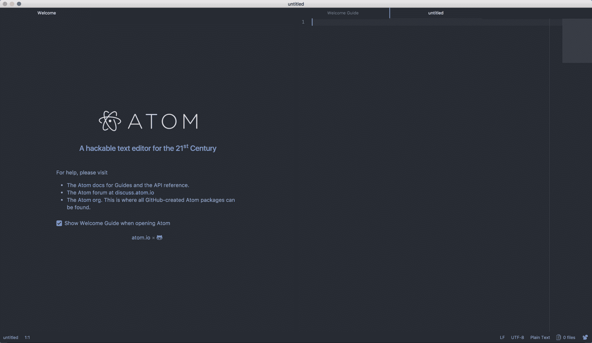
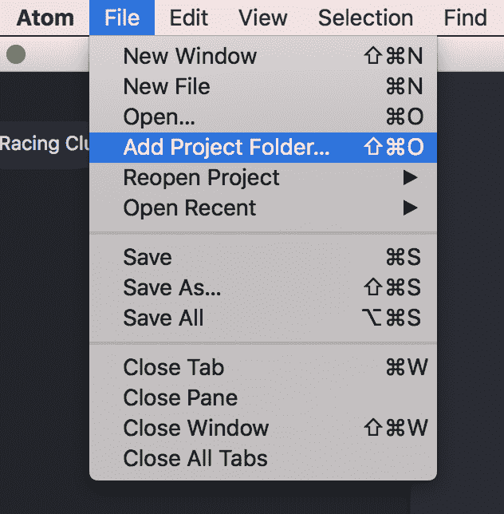
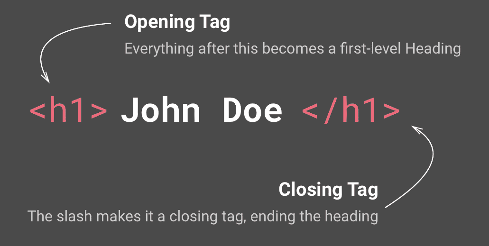
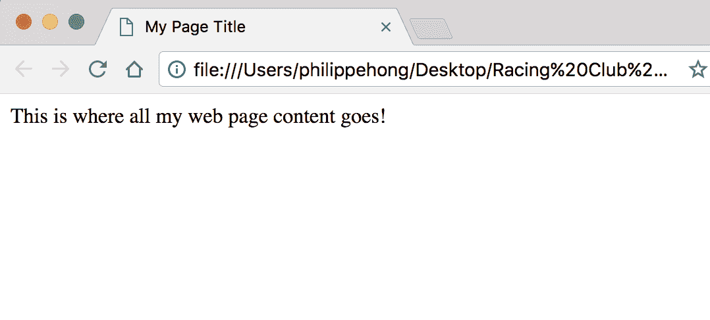
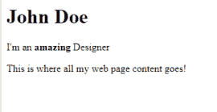
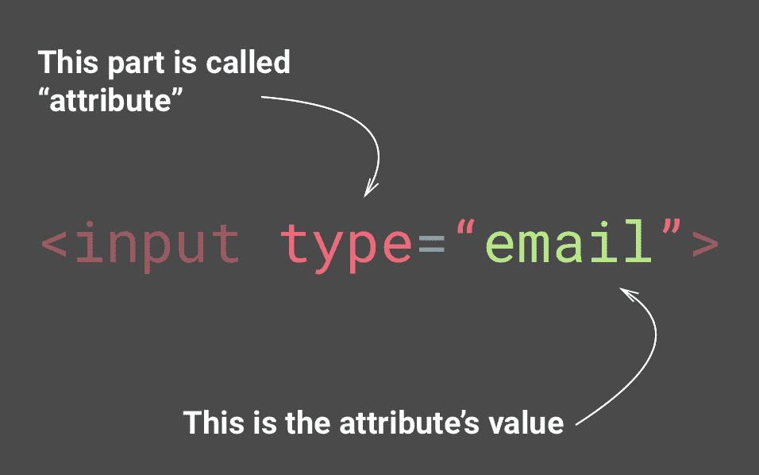
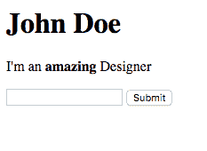
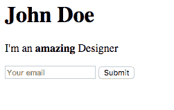
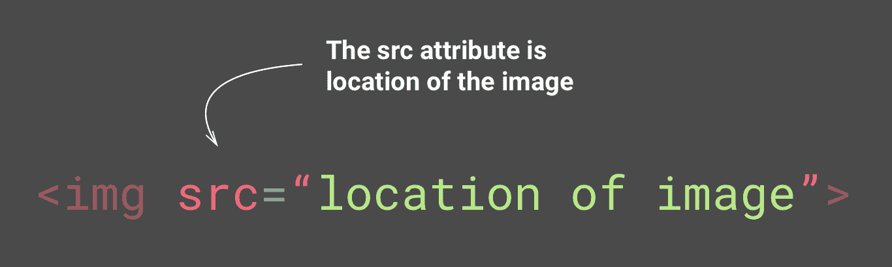
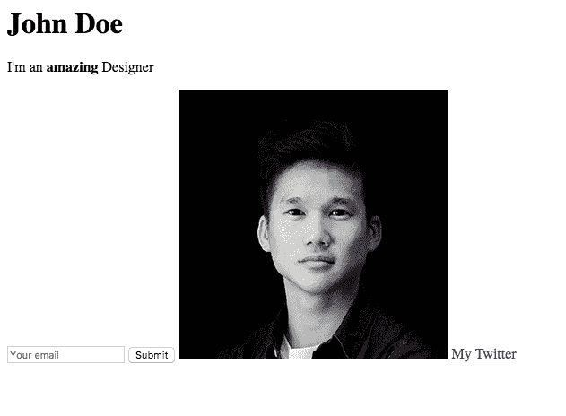

# 第五章：学习 HTML5

终于是时候开始构建我们的网站了。首先，您需要了解**超文本标记语言**（**HTML**）和 CSS 的基础知识。我们将从 HTML 开始，介绍 HTML 是什么。按照 HTML 文档的结构，我们将填充结构，并在途中添加一些图像和链接。

在本章中，我们将涵盖：

+   Atom，我们的文本编辑器

+   HTML 标签和属性

+   HTML 结构

+   图像和链接

所以，让我们开始吧。

# 我们的主要工具

在我们真正开始编码之前，我们需要下载一个文本编辑器。这是一个基本上用来编写我们所有代码的程序。在本课程中，我们将使用 Atom；您可以通过此 URL（[`atom.io/`](https://atom.io/)）下载该工具。该程序适用于 macOS、Windows 和 Linux，而且完全免费！

如果您熟悉其他文本编辑器，完全可以使用您自己的。还有一些其他非常好的免费编辑器，如 Sublime Text 3（[`www.sublimetext.com/`](https://www.sublimetext.com/)）、Bracket（[`brackets.io/`](http://brackets.io/)）和 Dreamweaver（[`www.adobe.com/products/dreamweaver.html`](https://www.adobe.com/products/dreamweaver.html)）。

一旦您有了文本编辑器，我们就可以开始课程了：



ATOM 文本编辑器

首先，我们需要创建一个文件夹来放置所有我们的项目文件。让我们创建这个文件夹并将其命名为`Racing Club Website`。完成后，将此文件夹打开为我们的项目文件夹。单击文件|添加项目文件夹...：



既然我们已经安装了超级文本编辑器并设置了项目文件夹，让我们谈谈 HTML。

# 什么是 HTML？

HTML 是用于创建网页和 Web 应用程序的标准标记语言。结合 CSS 和 JavaScript，您可以创建简单和复杂的网站。

每个网页实际上都是一个 HTML 文件。每个 HTML 文件只是一个纯文本文件，但扩展名为`.html`而不是`.txt`。

# HTML 标签

HTML 标签是定义您如何对元素和内容进行排序和显示的隐藏关键字。大多数 HTML 标签都有两个部分，一个开放部分和一个关闭部分：



请注意，关闭标签与开放标签具有相同的文本，但有一个额外的斜杠（`/`）字符。

也有一些例外，比如 HTML 标签``没有闭合标签：

```html
<tagname>Content</tagname>
```

要查看 HTML 文档，您需要一个网页浏览器，如 Google Chrome、Mozilla Firefox、Internet Explorer 或 Safari。

# HTML 属性

属性是用于自定义标签的内容，并且它们是在标签内定义的，例如：

```html

```

大多数标签的属性是可选的，通常用于更改标签的默认状态。但是，某些标签，如``标签，需要`src`和`alt`等属性，这些属性对于浏览器正确显示图像是必需的。

# HTML 结构

每个 HTML 都遵循一种结构，以便浏览器能够读取页面。总结一下，它总是以`<html>`标签开头。此标签将包含`<head>`标签和`<body>`标签。让我们创建我们的第一个页面，这样您就可以理解了。

# 创建我们的第一个页面

要创建我们的第一个页面。单击文件|新建文件或*Command* + *N*（或*Ctrl* + *N*适用于 Windows）。

您现在有一个无标题文件。让我们快速保存并命名它，方法是单击文件|保存或*Command* + *S*（或*Ctrl* + *S*适用于 Windows），然后将其命名为`index.html`。

为什么要命名为`index.html`？因为`index.html`页面是在访客请求站点时默认显示的默认页面的常用名称。换句话说，`index.html`基本上是网站的主页名称。

现在我们有了我们的第一个 HTML 文件，我们必须放入必要的标签才能使其工作。必要的标签应按以下方式编写：

```html
<html>  <!--This is our HTML main tag-->
 <head>  <!--This is our head tag where we put our title and script and all infos relative to our page.-->
  <title>My Page Title</title>
 </head>
 <body> <!--This is where all our content will go-->

  This is where all my web page content goes!

 </body>
</html>

```

只需将代码复制粘贴到你的 HTML 文件中，并用你的互联网浏览器打开文件（我们将选择 Google Chrome）。不要忘记保存你的文档！

你的网页应该如下所示：



在 Google Chrome 中打开的网页

恭喜！你刚刚创建了你的第一个网页！

现在让我们向我们的页面添加一些其他元素。

# HTML 元素

HTML 中有许多不同的元素，它们都是为不同的目的而设计的。不是必须要了解所有的元素，但是一些对于网站来说是必不可少的。以下是 HTML 中的一些基本元素。

# 标题和段落

要在 HTML 中插入标题，有一个名为`<h1>`的标签，一直到`<h6>`。数字由标题的重要性决定。

让我们把一个`<h1>`元素放到我们的`<body>`中：

```html
<html> <!--This is our HTML main tag-->
 <head> <!--This is our head tag where we put our title and script and all infos relative to our page.-->
  <title>My Page Title</title>
 </head>
 <body> <!--This is where all our content will go-->
  <h1>John Doe</h1>

 </body>
</html>
```

现在我们有了我们的第一个标题。让我们添加一个段落。要添加一个段落，我们可以使用 HTML 标签`<p>`：

```html
<h1>John Doe</h1>
  <p>I'm an amazing Designer</p>
```

你之前学到，对于每个 HTML 标签，我们有一个开放的`<tagname>`标签和一个关闭的`</tagname>`标签。这基本上是告诉你你的元素何时结束。你也可以在一个标签内添加另一个标签。例如，如果我们想要使一些文本**加粗**。

让我们使用我们的`<p>`标签，并在`amazing`单词中添加一个`<b>`标签使其加粗：

```html
<p>I'm an <b>amazing</b> Designer</p>
```

这是你在浏览器中应该看到的：



太棒了！你刚刚把文本加粗了！现在让我们添加一些表单。

使用表单，无论你想从用户那里获取什么类型的信息，你都需要使用`<input>`标签来获取它们。

有许多不同类型的输入，但是，现在我们将涵盖`email`和`submit`。

`input`标签是不需要闭合标签的例外之一；让我们把它添加到我们的段落中：

```html
<input type="email">
```



HTML 属性

你可以把属性看作是每个标签的选项

但是`email`输入如果没有提交按钮就不会有任何作用！让我们添加另一个输入类型，`submit`：

```html
<input type="submit">
```

让我们看看我们现在有什么：



这是你在浏览器中应该看到的。用*Ctrl*（或*Cmd*）+ *S*保存你的 HTML 文档，然后刷新你的浏览器。

太棒了！但是我们可能会有一点问题。我们实际上没有说用户应该在`email`输入中输入什么。幸运的是，有一个名为`placeholder`的属性，让我们可以向我们的输入添加默认文本，这样用户就知道应该输入什么：

```html
<input type="email" placeholder="Your email">
```

太棒了！现在你可以在我们的电子邮件输入中看到我们的占位符。



这是你在浏览器中应该看到的。用*Ctrl*（或*Cmd*）+ *S*保存你的 HTML 文档，然后刷新你的浏览器。

# 链接和图片

我们的最后一部分将是添加图片和链接。

网页如果没有图片会很无聊。要添加一张图片，你需要添加一个``标签：



img 标签结构

你需要添加`src`属性来放置你的图片位置。

但首先，让我们创建一个文件夹来放置我们所有的图片。回到你之前创建的主文件夹`Racing Club Website`。在里面，让我们创建一个名为`images`的文件夹。

在 GitHub 上的代码包中的`Images`文件夹中，你可以看到一个名为`designer.jpg`的图片；让我们把这张图片复制粘贴到我们的`images`文件夹中。

现在我们在`images`文件夹中有了图片，我们可以将它链接到我们的`img`标签。为此，添加以下内容：

```html

```

你可以在`src`属性中放置两种不同类型的 URL。相对 URL，比如我们放置的这个，只有在链接到与当前页面相同域的文件时才有效。因为我们是在本地进行操作，所以被视为相同域。绝对 URL，包括`http://`的 URL，会将你引导到图片目录，例如`http://philippehong.com/img/image-example.jpg`。

现在让我们添加一个链接。链接使用`<a>`标签和`href`属性添加。

您可以在`href`属性中放入两种不同类型的 URL，就像您可以为图像一样。这次让我们放入一个绝对 URL，添加我们的 Twitter 页面：

```html
<a href="http://twitter.com/philippehong">My Twitter</a>
```

但我们仍然需要在`<a>`标签内添加一些文本才能使其可见。

您的 HTML 文档应如下所示：

```html
<html> <!--This is our HTML main tag-->
  <head> <!--This is our head tag where we put our title and script and all infos relative to our page.-->
    <title>My Page Title</title>
  </head>
  <body> <!--This is where all our content will go-->

    <h1>John Doe</h1>
    <p>I'm an <b>amazing</b> Designer</p>
    <input type="email" placeholder="Your email">
    <input type="submit">
    
```

```html
    <a href="http://twitter.com/philippehong">My Twitter</a>

  </body>
</html>
```

请注意，您可以看到代码已经准备就绪。让我们保存我们的 HTML 文档，看看它在我们的互联网浏览器中的效果：



这是您在浏览器中应该看到的内容。使用*Ctrl*（或*Cmd*）+ *S*保存您的 HTML 文档，然后刷新您的浏览器。

它看起来非常简单，但这是因为我们没有添加任何 CSS。

# 摘要

在本章中，我们学习了 HTML 的所有基础知识。我们了解了 HTML 标签、属性，以及 HTML 页面的整体结构。

在我们进入下一章之前，我们在本章学习的标签并不是 HTML 中唯一可用的标签。HTML 中有很多标签，您可以在本书末尾的术语表中查看它们。当我们创建自己的项目时，我们还将使用一些新的标签！现在让我们给我们的页面添加一些样式！
