# 第六章：学习 CSS3

**层叠样式表**（**CSS**）允许您控制 HTML 内容的样式，更改颜色、字体、布局等。它相当容易理解，在本章中，我们将解决以下主题：

+   使用 CSS 的方法

+   CSS 格式

+   父元素和子元素

+   类和 ID

+   CSS 框模型

+   CSS 布局和分隔符

# 使用 CSS 的不同方法

有三种使用 CSS 的方法：

+   在具有`style`属性的 HTML 标签内（这种方法不推荐，但您仍然可以稍微使用）：

```html
<p style'"font-size:12px"></p>
```

+   在具有`<style>`标签的 HTML 文档的`<head>`部分内：

```html
<style>
  p {
    font-size:12px;
  } 
</style>
```

+   CSS 代码也可以放入外部文件中，并使用`<link>`标签链接到 HTML 文档。文件扩展名将保存为`.css`文件：

```html
<link rel="stylesheet" href="css/style.css">
```

对于此示例，我们将使用第二个选项，但是当我们开始构建自己的网站时，我们将学习第三个选项。

让我们从在`<head>`部分中添加`<style>`标签开始：

```html
<head> <!--This is our head tag where we put our title and script and all infos relative to our page.-->
  <title>My Page Title</title>
  <style>

  </style>
 </head>
```

# CSS 格式

我们现在准备好放入我们的 CSS，那么 CSS 的格式如何？

CSS 很简单理解：

+   **选择器**：这是您选择要添加样式的 HTML 元素的位置。在此示例中，我们选择所有`<h1>`元素。

+   **大括号**：这些括号内的所有样式将应用于选择器选择的 HTML 元素

+   **属性**：属性控制 HTML 元素样式的一个方面，例如 text-align、color、width、background 等。

+   **值**：值传递给属性。在这种情况下，text-align 的值可以是 left、right、center 或 justify。

+   **分号**：在属性的末尾应用它是强制性的。

您可以在同一个`<style>`标签中拥有多个样式。让我们居中所有`h1`和`p`标签。

您应该有以下内容：

```html
<style>
 h1 {
  text-align: center;
 }
 p {
  text-align: center;
 }
</style>
```

# 父元素和子元素

如果您想要居中所有文本而不仅仅是`<h1>`和`<p>`？有一种简单的方法可以实现。您必须了解父元素和子元素。基本上，如果您为父元素设置样式，则所有子元素将具有相同的样式，除非您为子元素指定特定样式。以下是我们的示例：

```html
<body> <!--This is our parent element -->
  <h1>John Doe</h1>
  <p>I'm an <b>amazing</b> Designer</p>
  <input type="email" placeholder="Your email">
  <input type="submit">
  
  <a href="http://twitter.com/philippehong">My Twitter</a>
</body>
```

`<body>`标签是其中包含的每个元素的父元素，其中包括`<h1>`、`<p>`、`<input>`、``和`<a>`元素。

让我们删除以前的样式，并使用`text-align: center;`样式`<body>`元素：

```html
<style>
  body {
    text-align: center;
  }
</style>
```

让我们保存 HTML 文档并在 Chrome 中重新加载页面。请注意，每个元素都具有属性`text-align: center;`。

# 类和 ID

我们已经了解了如何使用 CSS 选择 HTML 标签，但是大多数情况下，您将拥有多个相同的 HTML 标签，例如`<p>`或`<a>`。我们如何区分它们，以便只选择和设置特定的样式？这就是类和 ID 的作用。它们用于选择您已经放置了`id`或`class`属性的特定 HTML 标签，例如：

```html
<div id="header"></div>
<p class="big"></p>
```

要在 CSS 中选择此 ID `header`，我们需要写一个井号（`#`）字符，后面跟着元素的 ID，在本例中是`header`：

```html
#header {
  margin-left: 10px;
}
```

要选择类，我们需要写一个句点（`.`）字符，后面跟着类的名称：

```html
.big {
  font-size:20px;
}
```

那么 ID 和类之间有什么区别？唯一的区别是 ID 在 HTML 文档中只能使用一次，而类可以多次使用。我们还需要知道以下内容：

**对于 ID：**

+   每个元素只能有一个 ID

+   每个页面只能有一个具有该 ID 的元素

**对于类：**

+   您可以在多个元素上使用相同的类

+   您可以在同一个元素上使用多个类

例如，我们可以有以下内容：

```html
<div id="header" class="big red blue"></div>
```

这意味着`<div>`元素具有 ID `header` 和类 `big`、`red` 和 `blue`。

现在让我们在文档中添加一些类和 ID：

```html
<body> <!--This is our parent element -->

  <h1 id="my-name">John Doe</h1>
   <p class="text">I'm an <b>amazing</b> Designer</p>
   <input class="form" type="email" placeholder="Your email">
   <input class="button" type="submit">
   
   <a class="link" href="http://twitter.com/philippehong">My Twitter</a>

</body>

```

正如您所看到的，我添加了一些非常简单的 ID 和类，以便您了解它是如何工作的。当涉及到使用 ID 和类的最佳实践时，我们将详细介绍。

现在我们有了我们的 ID 和类，让我们为我们的 CSS 添加一些样式。 为此，让我们选择我们的第一个 ID`my-name`，并使其更大和带下划线。 为此，我们将使用 CSS 属性`font-size`和`text-decoration`：

```html
<style>
  body {
    text-align: center;
  }
  #my-name{
    font-size: 50px;
    text-decoration: underline;
  }
</style>
```

现在让我们来设置一些类。 例如，让我们在我们的 HTML 文档中添加另一个`<p>`标签，就在我们的链接之前，如下所示：

```html
<body> <!--This is where all our content will go-->

  <h1 id="my-name">John Doe</h1>
  <p class="text">I'm an <b>amazing</b> Designer</p>
  <input class="form" type="email" placeholder="Your email">
  <input class="button" type="submit">
  
  <p class="text">Follow me on Twitter</p> <!--Added text-->
  <a class="link" href="http://twitter.com/philippehong">My Twitter</a>

</body>
```

现在我们有两个具有相同类的元素，让我们看看当我们想要通过添加`font-family`属性来样式化类`text`时会发生什么：

```html
<style>
  body {
    text-align: center;
  }
  #my-name{
    font-size: 50px;
    text-decoration: underline;
  }
  .text {
    font-family: Arial;
  }
</style>
```

保存您的 HTML 文档并刷新您的浏览器。 这是您应该看到的：

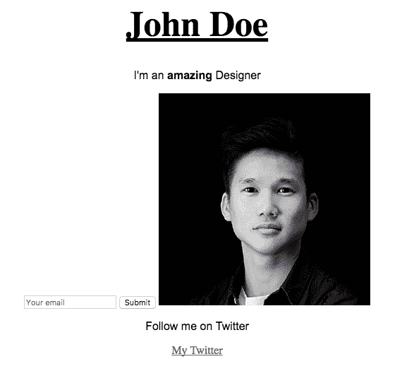

这应该改变具有类`text`的元素的字体。 您可以看到两个元素都已更改。

# CSS 框模型

所有 HTML 元素都可以看作是框。 CSS 框模型允许我们定义元素之间的空间。 无论您想要添加边框、设置边距还是在元素之间添加填充，您都需要了解框模型。 在实施设计时，了解这一部分将对您有很大帮助。

# 盒子

框模型由四个属性组成：

+   **内容**：文本、图像等

+   **填充**：内容周围的透明区域，位于框内

+   **边距**：盒子之间的空间

+   **边框**：围绕填充和内容

请查看以下图表，以便更好地理解：

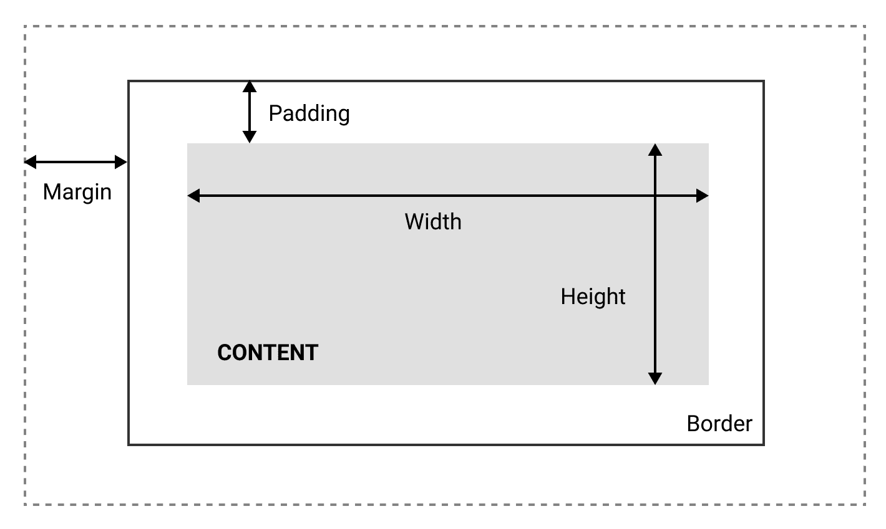

CSS 框模型可以如前图所示描述。

框模型还可以让我们设置元素的高度和宽度。 通过以下设置内容的宽度或高度：

```html
Width: 200px;
```

内容的宽度将为`200px`。

现在，标准框模型的讨厌之处在于，您只能设置内容的宽度和高度，而不能设置整个框本身的宽度和高度，这意味着填充、边距和边框将添加到我们指定的宽度和高度中。 这相当让人讨厌：

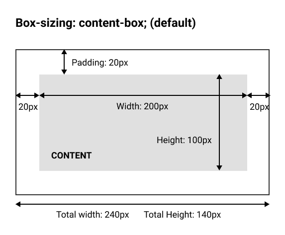

使用属性 content-box 的框模型

幸运的是，我们可以通过使用`box-sizing`属性来抵消这一点：

```html
box-sizing: border-box; 
```

通过将`box-sizing`设置为`border-box`，我们现在将设置整个框的宽度和高度：

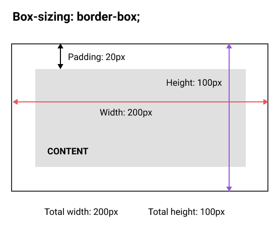

使用属性 border-box 的框模型

# 块和内联

关于框模型还有最后一件事。 在 HTML 中，有我们所谓的块级元素和内联元素。

**块级元素**：它使用浏览器的整个宽度，并始终从新行开始。 您可以将它们视为需要一个接一个地堆叠的块。 标题和段落是块级元素的一些示例。

块级元素的示例：

+   `<div>`

+   `<h1> - <h6>`

+   `<p>`

+   `<form>`

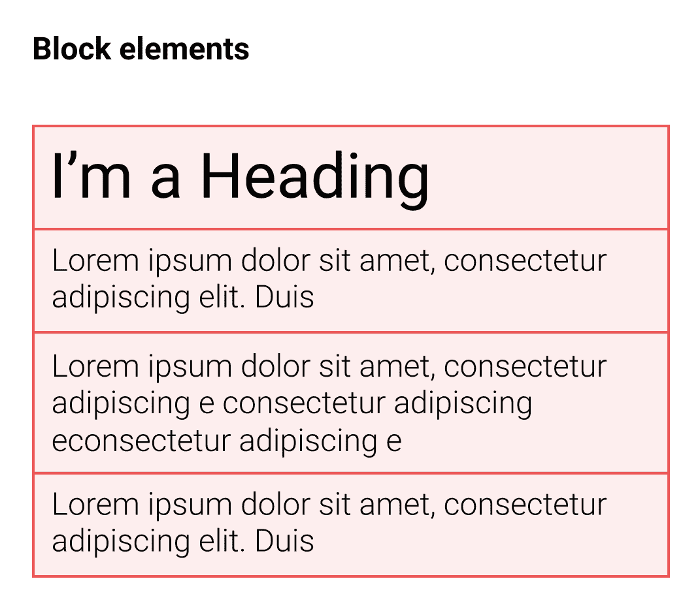

块级元素用红色框表示

**内联元素**：内联元素不会从新行开始，只会占据必要的宽度。 看一下蓝色元素的示例：

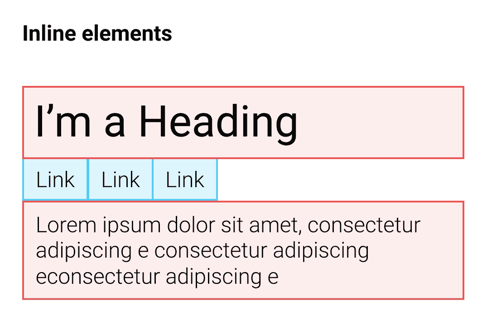

内联元素用蓝色框表示

以下是内联元素的示例：

+   `<span>`

+   `<a>`

+   ``

# CSS 布局和分隔符

现在我们了解了框模型的工作原理，我们可以尝试为我们的 HTML 页面构建一个简单的布局，如下图所示：

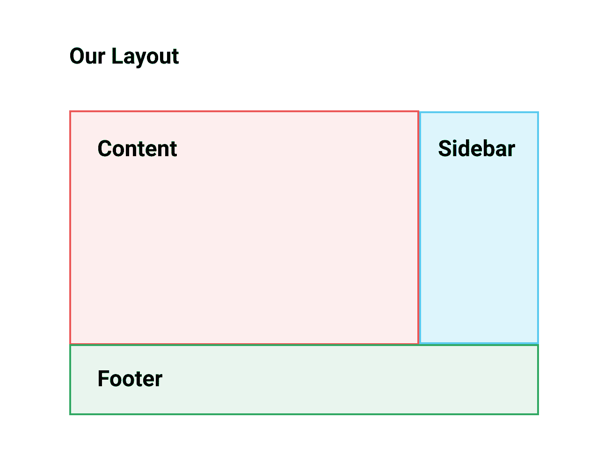

我们的布局将有一个带有右侧边栏的容器，并在底部有一个页脚。 这是许多网站的非常基本的布局。

此布局将位于一个容器内，该容器将居中于页面。 没有多余的话，让我们开始吧！

# 基本布局

为了创建我们的基本布局，我们将使用`<div>`元素。 `<div>`元素是最常用的 HTML 元素。 `<div>`代表分割，我们只是用它来通过创建放置内容的框来将我们的页面分成部分。

让我们在`<style>`部分清除我们的 CSS，从头开始。

我们将首先添加一个`<div>`元素来包装我们创建的所有内容，然后给它添加一个类`container`：

```html
   <div class="container">
     <h1 id="my-name">John Doe</h1>
     <p class="text">I'm an <b>amazing</b> Designer</p>
     <input class="form" type="email" placeholder="Your email">
     <input class="button" type="submit">
     
     <p class="text">Follow me on Twitter</p> <!--Added text-->
     <a class="link" href="http://twitter.com/philippehong">My Twitter</a>
   </div> 
```

# 格式化和缩进您的 HTML

您可以在我的 HTML 文档中看到我的代码是缩进的。代码缩进适用于每种语言，使其更易于阅读和结构化。缩进的基本方法是使用*Tab*键将内容向右移动一步：

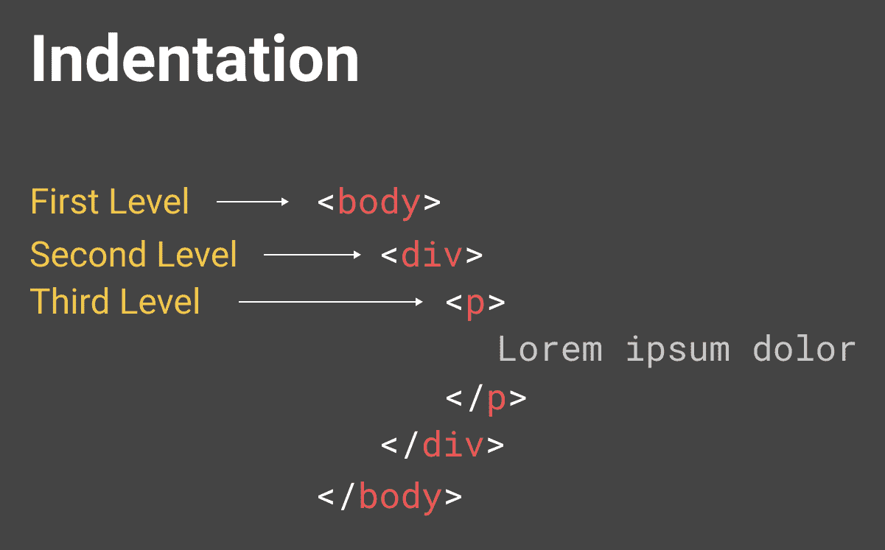

这是您应该具有的基本结构和缩进。

# 样式化我们的类

让我们首先对我们刚刚创建的`container`类进行样式化。为此，让我们转到我们的`<style>`部分并添加以下内容：

```html
<style>
  .container {
    width: 960px; 
  } 
</style>
```

这将把`width`属性设置为具有类`container`的`<div>`为`960px`。

我们希望我们的容器居中显示在页面上。为了做到这一点，我们需要添加`margin`属性，如下所示：

```html
<style>
  .container {
    width: 960px;
    margin-left: auto;
    margin-right: auto;
  }
</style>
```

添加`margin-left: auto;`和`margin-right: auto;`意味着左右边距会根据元素的上下文（在这种情况下是浏览器窗口）自动调整：

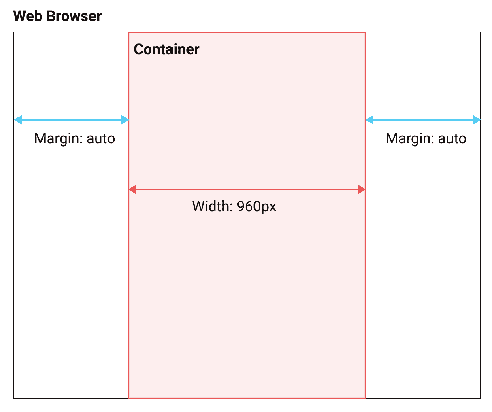

有很多种方法可以使用 CSS 来使元素居中；这是第一种方法。我们将在接下来的章节中了解其他几种方法。

现在让我们按照我们想要的布局创建我们的`content`元素。

在我们的`<div class = "container">`内部，让我们添加我们的`<div class = "content">`。同样，让我们将我们的内容移动到这个`div`中，如下所示：

```html
<body> <!--This is where all our content will go-->
 <div class="container">
   <div class="content">
     <h1 id="my-name">John Doe</h1>
     <p class="text">I'm an <b>amazing</b> Designer</p>
     <input class="form" type="email" placeholder="Your email">
     <input class="button" type="submit">
     
     <p class="text">Follow me on Twitter</p> <!--Added text-->
     <a class="link" href="http://twitter.com/philippehong">My Twitter</a>
   </div>
 </div>
</body>
```

接下来，让我们添加我们的`sidebar`。在我们的`<div class= "content">`之后，添加一个带有类`sidebar`的`div`。

在我们的`sidebar`内部，添加一个`<p>`元素来创建一些内容：

```html
<div class="sidebar">
   <p>Lorem ipsum dolor sit amet, consectetur adipiscing elit. Duis turpis neque, volutpat ac consequat sed, ullamcorper at dolor. Donec placerat a mi quis ultricies. Etiam egestas semper tempor. Suspendisse nec eros porta, rhoncus tortor sed, consequat arcu. Suspendisse potenti. Nunc blandit nisl eu justo feugiat vestibulum. Vivamus consequat, quam vitae sagittis maximus, magna lacus fringilla justo, sit amet auctor mi nulla quis ante. Morbi malesuada gravida turpis, vel lobortis libero placerat sit amet. Vestibulum sollicitudin semper est eget ultricies. Donec posuere turpis urna.
  </p>
</div>
```

您可以通过访问网站[`www.lipsum.com/`](https://www.lipsum.com/)找到一些虚拟文本。

最后，让我们在`sidebar`元素之后添加我们的`footer`元素：

```html
<div class="footer">
  <p>This is my footer</p>
</div>
```

我们的 HTML 文档现在应该如下所示：

```html
<html> <!--This is our HTML main tag-->
 <head> <!--This is our head tag where we put our title and script and all infos relative to our page.-->
  <title>My Page Title</title>
  <style>
    .container {
      width: 960px;
      margin-left: auto;
      margin-right: auto;
    }
  </style>
 </head>
 <body> <!--This is where all our content will go-->
   <div class="container">
     <div class="content">
       <h1 id="my-name">John Doe</h1>
       <p class="text">I'm an <b>amazing</b> Designer</p>
       <input class="form" type="email" placeholder="Your email">
       <input class="button" type="submit">
       
       <p class="text">Follow me on Twitter</p> <!--Added text-->
       <a class="link" href="http://twitter.com/philippehong">My Twitter</a>
     </div>
     <div class="sidebar">
       <p>Lorem ipsum dolor sit amet, consectetur adipiscing elit. Duis turpis neque, volutpat ac consequat sed, ullamcorper at dolor. Donec placerat a mi quis ultricies. Etiam egestas semper tempor. Suspendisse nec eros porta, rhoncus tortor sed, consequat arcu. Suspendisse potenti. Nunc blandit nisl eu justo feugiat vestibulum. Vivamus consequat, quam vitae sagittis maximus, magna lacus fringilla justo, sit amet auctor mi nulla quis ante. Morbi malesuada gravida turpis, vel lobortis libero placerat sit amet. Vestibulum sollicitudin semper est eget ultricies. Donec posuere turpis urna.</p>
     </div>
     <div class="footer">
       <p>This is my footer</p>
     </div>
   </div>
 </body>
</html>

```

现在，出于本课程的目的，让我们为每个元素添加一些背景颜色，以查看布局的工作原理。为此，让我们转到我们的样式部分，并为每个类添加`background-color`属性，如下所示：

```html
<style>
  .container {
    width: 960px;
    margin-left: auto;
    margin-right: auto;
  }
  .content {
    background-color: red;
  }
  .sidebar {
    background-color: green;
  }
  .footer {
    background-color: blue;
  }
</style>

```

现在我们将保存我们的 HTML 文档并刷新我们的浏览器以查看它的外观：

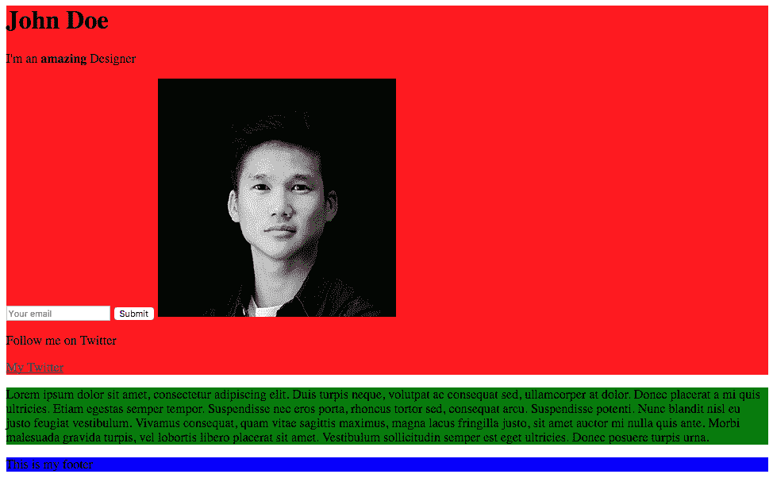

我们的网页看起来很丑，但它确实展示了布局是如何组合在一起的。让我们添加一些 CSS 属性，使其看起来符合我们的期望。

我们希望`.content`元素占总宽度（960px）的`75%`，而侧边栏占`25%`。我们可以进行一些数学计算，计算 960 的`75%`，但是在 CSS 中，您也可以按百分比设置`width`：

```html
.content {
  background-color: red;
  width: 75%;
}
.sidebar {
  background-color: green;
  width: 25%;
}

```

现在我们将保存我们的 HTML 文档并刷新我们的浏览器以查看它的外观：

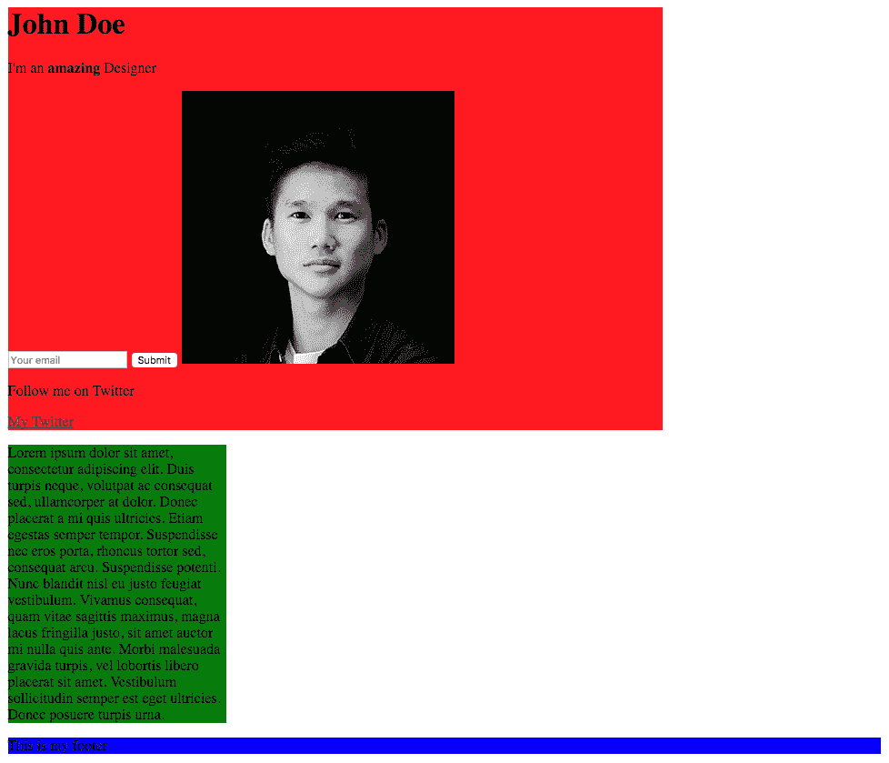

如您所见，我们的元素的宽度属性为`75%`和`25%`。现在，为了将我们的`sidebar`移到内容旁边，我们需要使用名为`float`的 CSS 属性。使用`float`，元素可以被推到左侧或右侧，从而允许其他元素围绕它包裹。所以让我们这样做：

```html
.content {
  background-color: red;
  width: 75%;
  float: left;
}
.sidebar {
  background-color: green;
  width: 25%;
  float: right;
}

```

让我们保存我们的 HTML 文档并刷新我们的浏览器以查看它的外观：

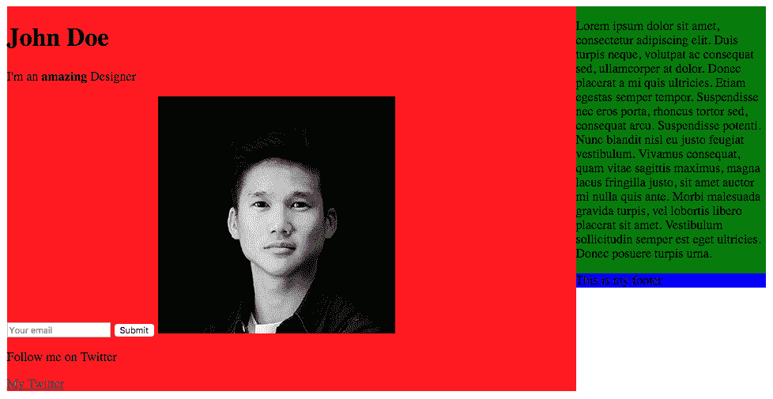

我们的内容和`sidebar`现在并排显示，但问题是我们的`footer`在右侧，因为它具有来自`sidebar`的`float`右侧的属性。为了避免这种情况，我们需要使用`clear`属性，它与`float`属性相对应。我们将属性设置为 both，这意味着右侧和左侧：

```html
.footer {
  background-color: blue;
  clear: both;
} 
```

保存并刷新文档。

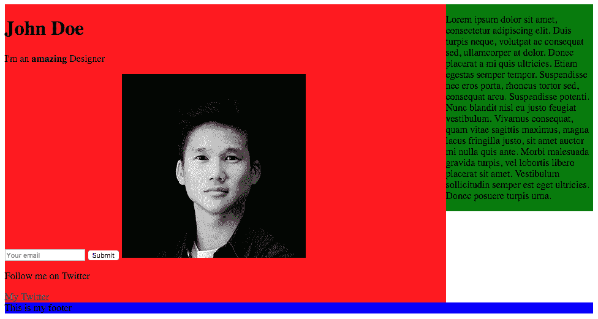

我们现在已经完全使用 CSS 编写了我们的布局。

# 总结

我们现在终于有了我们的布局。再次强调，本课程不是为了做出漂亮的东西，而是为了帮助您了解如何正确使用 CSS 布局页面。在下一章中，我们将深入研究 HTML 和 CSS，通过创建和设计我们的网站来学习—多么令人兴奋！
