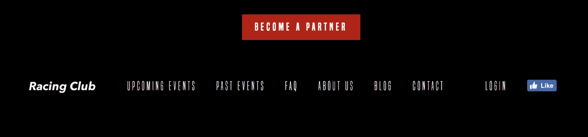

# 第七章：创建您自己的网站

有趣的部分终于来了。我们将从头到尾开始实施我们的网站。我将逐步解释每个步骤。以下是本章将涵盖的内容列表：

+   安装 HTML 样板

+   使用图像、字体和 normalize.css 设置我们的项目

+   创建我们的页眉并美化它

+   创建我们的主要部分并学习 CSS 中的定位

+   创建我们的博客部分

+   添加关于部分

+   创建合作伙伴部分

+   创建页脚部分

首先，让我们看看我们将要实施的设计。如果您还记得，我们在第四章中看到了一个小预览，*响应式与自适应设计*。

# 我们的设计

我们的主页将包括以下内容：

1.  页眉：我们将学习如何创建和美化一个导航部分，带有标志和右侧菜单。

1.  主要图像：在网页设计中，它描述了一个前端横幅图像，通常是一个大图像。我们将学习如何创建一个带有大标题的全宽背景图像。

1.  带有六篇博客文章的`Blog`预览：我们将学习如何显示带有图像和内容的三个响应式列。

1.  关于我们部分：我们将学习如何向图像添加渐变。

1.  合作伙伴部分：我们将学习如何在页面上居中内容。

1.  页脚：基本上与页眉相同，但在底部。

您可以在我提供的资源文件中的`Resources` | `Screens`中查看主页的完整尺寸图像。项目还包括`Sketch`源文件。

我强烈建议您安装 Sketch 或 Figma，如果您还没有使用这些设计工具之一。Sketch 应用程序通常用于 Web 设计项目，可以在[`sketchapp.com`](http://sketchapp.com)下载。它有 14 天的免费试用期。Figma 类似于 Sketch，可以在没有试用期的情况下使用。

这就是我们的设计长什么样子：


我们的主页设计

话不多说，让我们开始吧！

# 安装 HTML 样板

我们将从头开始，因此让我们为这个项目创建一个新文件。当我开始一个项目时，我喜欢下载一个 HTML 样板。HTML5 样板是一个前端模板，旨在帮助您构建快速、强大和适应性强的 Web 应用程序或站点。您基本上只需下载一个包，它包含了开始项目所需的所有文件。

让我们去[`html5boilerplate.com/`](https://html5boilerplate.com/)下载模板的最新版本：


单击下载 v6.0.1 或更高版本。

让我们看看我们的包里有什么：


文件夹中有很多文件。我们可以看到，它包含了网站正常运行所需的所有基本文件：

+   `index.html`：我们的主页，用户访问网站时会首先看到的页面

+   `css`文件夹：存放所有 CSS 文件的文件夹

+   `img`文件夹：存放所有图像的文件夹

+   `js`文件夹：存放所有 JS 文件的文件夹

+   `favicon.ico`：显示在浏览器标签左上角的图标，向用户指示他们正在访问您的网站，通常是您的标志

+   `404.html`：一个用于错误 URL 的用户的 HTML 页面

其他文件对我们目前来说并不那么重要；我们将在即将到来的章节中进行审查。

让我们将文件夹重命名为我们自己的名字，例如`Web 项目`。

# 编辑 index.html

现在让我们在 Atom 中打开我们的文件夹；单击菜单|打开… |并选择我们的`Web 项目`文件夹。

从左侧面板选择`index.html`。您可以看到 HTML 文档及其内容：

```html
<!doctype html>
<html class="no-js" lang="">
  <head>
      <meta charset="utf-8">
      <meta http-equiv="x-ua-compatible" content="ie=edge">
      <title></title>
      <meta name="description" content="">
      <meta name="viewport" content="width=device-width, initial-scale=1">

      <link rel="manifest" href="site.webmanifest">
      <link rel="apple-touch-icon" href="icon.png">
      <!-- Place favicon.ico in the root directory -->

      <link rel="stylesheet" href="css/normalize.css">
      <link rel="stylesheet" href="css/main.css">
  </head>
  <body>
      <!--[if lte IE 9]>
          <p class="browserupgrade">You are using an <strong>outdated</strong> browser. Please <a href="https://browsehappy.com/">upgrade your browser</a> to improve your experience and security.</p>
      <![endif]-->

      <!-- Add your site or application content here -->
      <p>Hello world! This is HTML5 Boilerplate.</p>
      <script src="img/modernizr-3.5.0.min.js"></script>
      <script src="img/jquery-3.2.1.min.js" integrity="sha256-hwg4gsxgFZhOsEEamdOYGBf13FyQuiTwlAQgxVSNgt4=" crossorigin="anonymous"></script>
      <script>window.jQuery || document.write('<script src="img/jquery-3.2.1.min.js"><\/script>')</script>
      <script src="img/plugins.js"></script>
      <script src="img/main.js"></script>

      <!-- Google Analytics: change UA-XXXXX-Y to be your site's ID. -->
      <script>
          window.ga=function(){ga.q.push(arguments)};ga.q=[];ga.l=+new Date;
          ga('create','UA-XXXXX-Y','auto');ga('send','pageview')
      </script>
      <script src="img/analytics.js" async defer></script>
  </body>
</html>
```

现在我们将逐个审查此 HTML 文件的每个部分，以便您了解代码的每个部分：

```html
<title></title>
```

在这里，您将放置我们网站的标题；在这个练习中，让我们把标题设为“赛车俱乐部-活动和门票”。

```html
<meta name="description" content="">
```

这一部分是页面的描述，对于 SEO 很有用，并且会在标题之后出现在搜索结果中。

```html
<meta name="viewport" content="width=device-width, initial-scale=1">
```

这将告诉浏览器如何在桌面和移动视图中行为。你可以保持原样。

```html
<link rel="stylesheet" href="css/normalize.css">
<link rel="stylesheet" href="css/main.css">
```

我们在上一章中学到，在我们的 HTML 页面中使用 CSS 有三种不同的方法。我们在练习中使用了第二种方法，但是使用 CSS 的最佳方式是将其放入一个外部文件中，就像这样。你可以保持原样。

```html
<!--[if lte IE 9]>
    <p class="browserupgrade">You are using an <strong>outdated</strong> browser. Please <a href="https://browsehappy.com/">upgrade your browser</a> to improve your experience and security.</p>
<![endif]-->
```

这基本上是为了建议使用 Internet Explorer 9 或更低版本的用户更新他们的互联网浏览器。你不需要改变这段代码。

```html
<!-- Add your site or application content here -->
 <p>Hello world! This is HTML5 Boilerplate.</p>
```

这是我们的内容。我们将编辑 HTML 的这部分来在我们的 HTML 页面中添加元素和内容。你可以删除`<p>`元素，因为我们不需要它。

以下代码包含了链接到我们页面的 JavaScript 插件的列表：

```html
<script src="img/modernizr-3.5.0.min.js"></script>
<script src="img/jquery-3.2.1.min.js" integrity="sha256-hwg4gsxgFZhOsEEamdOYGBf13FyQuiTwlAQgxVSNgt4=" crossorigin="anonymous"></script>
<script>window.jQuery || document.write('<script src="img/jquery-3.2.1.min.js"><\/script>')</script>
<script src="img/plugins.js"></script>
<script src="img/main.js"></script>

<!-- Google Analytics: change UA-XXXXX-Y to be your site's ID. -->
<script>
    window.ga=function(){ga.q.push(arguments)};ga.q=[];ga.l=+new Date;
    ga('create','UA-XXXXX-Y','auto');ga('send','pageview')
</script>
<script src="img/analytics.js" async defer></script>
```

插件如下：

+   `modernizr`：检测用户的浏览器并相应地改变网站的行为。

+   `Jquery`：我们将在下一章中使用这个框架来创建交互和动画。

+   `Plugin.js`：包含我们需要的所有其他插件。

+   `Main.js`：包含我们将创建的所有 JS 代码。

+   `Google Analytics`：用于分析用户并帮助了解你的网站表现的分析插件。我们将在第十章，*优化和发布我们的网站*中介绍这个。

让我们开始编辑我们的网页！

# 创建我们的网页

现在一切都准备好了，让我们开始整理我们的图片文件夹并安装我们的字体。

# 图片文件夹

我已经准备了一个包含所有你需要的图片的文件夹来进行这个练习。这些图片可以在`Resources` | `Image Web project`中找到。你可以简单地将所有图片和资源复制到我们新项目文件夹中的`img`文件夹中。

# 安装我们的字体

如果你再看一下网站，你会发现我们正在使用自定义字体，这意味着我们没有使用网页*安全*字体。网页安全字体是预装在每台设备上的字体。它们出现在所有操作系统上。这些字体集合被 Windows、Mac、Google、Linux、Unix 等使用。

可能还有一些，但这是常见的网页安全字体列表：

+   Arial

+   Helvetica

+   Times New Roman

+   Courier New

+   Courier

+   Verdana

+   Georgia

+   Comic Sans MS

+   Trebuchet MS

+   Arial Black

+   Impact

不是很吸引人；坦率地说。

但是，有了 CSS3，我们现在可以通过使用`@font-face`来添加自定义字体。让我们看看如何添加这个：

```html
@font-face
```

为了这个练习，我提供了一个名为`fonts.zip`的压缩文件，以便让你更容易。你可以解压这个文件，然后将`fonts`文件夹移动到我们的`Web Project`文件夹中。让我们看看这个文件夹里有什么：


它包含了网页所需的字体文件，并且可以直接使用。

要在网页上使用自定义字体，我们需要事先生成或转换这个字体为网页字体。你可以使用网站[fontsquirrel.com](http://fontsquirrel.com)从你自己的字体生成网页字体。

还有一个使用`@font-face`属性的 CSS 文件：

```html
@font-face {
  font-family: 'built_titling';
  src: url('built_titling_rg-webfont.woff2') format('woff2'),
       url('built_titling_rg-webfont.woff') format('woff');
  font-weight: 400;
  font-style: normal;
}

@font-face {
  font-family: 'built_titling';
  src: url('built_titling_el-webfont.woff2') format('woff2'),
       url('built_titling_el-webfont.woff') format('woff');
  font-weight: 200;
  font-style: normal;
}
```

因此，让我们将这个 CSS 文件链接到我们的 HTML 文件中。在我们的`index.html`中，让我们添加以下内容：

```html
<link rel="stylesheet" href="fonts/font.css"> <!-- Font face CSS link -->

<link rel="stylesheet" href="css/normalize.css">
<link rel="stylesheet" href="css/main.css">
```

很好，我们现在已经将我们的字体链接到我们的 HTML 页面。现在让我们添加我们的第二个字体，这是一个谷歌字体。

# 导入谷歌字体

自 2010 年以来，谷歌为用户提供了一个发现字体并免费使用的平台。谷歌字体的主网站上提供了 800 多种字体系列，我们将在这个练习中使用其中的一种。

谷歌让导入字体变得非常容易。以下是在我们的网站上引入字体的步骤：

1.  前往谷歌字体网站（[`fonts.google.com/`](https://fonts.google.com/)）。

1.  搜索我们的字体，Roboto，并点击相应的字体（[`fonts.google.com/specimen/Roboto`](https://fonts.google.com/specimen/Roboto)）。

1.  点击选择这个字体。

1.  点击底部的小弹出窗口，切换到自定义选项卡。

1.  我们希望有常规和粗体。

1.  切换回 EMBED 选项卡并复制显示的代码：

```html
<link href="https://fonts.googleapis.com/css?family=Roboto:400,700" rel="stylesheet">
```

1.  在我们之前的 CSS 链接之前粘贴此代码：

```html
<link href="https://fonts.googleapis.com/css?family=Roboto:400,700" rel="stylesheet">
<link rel="stylesheet" href="fonts/font.css"> <!-- Font face CSS link -->

```

您现在已安装了 Google 字体！

现在，要使用我们的 Google 字体，只需在我们要样式化的元素上粘贴 CSS 属性：

```html
font-family: 'Roboto', sans-serif;
```

让我们去我们的 CSS 文件，位于`css` | `main.css`。

找到以下注释的部分：

```html
/* ==========================================================================
   Author's custom styles
   ========================================================================== */
```

在这里，写：

```html
body {
  font-family: 'Roboto', sans-serif;
}
```

这将将 font-family 属性应用于`<body>`元素，这是我们 HTML 页面的主要元素，因此它将应用于`<body>`内的所有元素。

# 添加 normalize.css

当查找`main.css`时，您可能会注意到另一个`css`文件。`normalize.css`是什么，为什么我们应该将其与我们的 HTML 集成？

正如我们之前所看到的，每个浏览器的渲染方式都不相同。使用`normalize.css`，所有浏览器将更一致地渲染元素，并符合现代标准。我们只需要将其添加到我们的其他`css`文件中，它就会起作用。很酷，不是吗？

# 标题

让我们开始实施我们的标题。最佳做法是先做 HTML，然后再完成 CSS。让我们先看看我们的设计。

如您所见，我们的标题具有透明背景，左侧有标志和主菜单，右侧有次级菜单。

首先，在我们的 HTML 文档中创建一个`<header>`标签：

```html
<!-- Add your site or application content here --> <header></header>
```

# 创建菜单

要创建我们的菜单，我们需要创建一个列表。在 HTML 中，要创建列表，您必须使用标签`<ul>`。

`<ul>`代表无序列表；它需要在`<li>`内部有一个列表标签。您可以按以下方式使用它：

```html
<ul>
  <li>Coffee</li>
  <li>Tea</li>
  <li>Milk</li>
</ul>
```

我们的列表应该最终看起来像这样：

```html
<header>
  <ul>
    <li>Upcoming events</li>
    <li>Past events</li>
    <li>FAQ</li>
    <li>About us</li>
    <li>Blog</li>
    <li>Contact</li>
  </ul>
</header>
```

# 插入链接

为了使菜单工作，我们需要向我们的列表添加链接；否则，它将无法工作。要添加链接，您必须使用标签`<a>`。为了使每个`<li>`元素可点击为链接，我们需要在`<li>`标签内添加`<a>`标签，如下所示：

```html
<li><a>Upcoming events</a></li>
```

现在我们需要指定链接的位置。为此，我们需要添加属性`href`：

```html
<li><a href="upcoming.html">Upcoming events</a></li>
```

如果不存在`href`属性，则`<a>`标签将不起作用。`href`的值可以是指向另一个网站的绝对链接，也可以是指向同一域上的文件的相对链接。这基本上与我们之前看到的`src`属性的行为相同。

最后，我们的菜单应该看起来像这样：

```html
<ul>
  <li><a href="upcoming.html">Upcoming events</a></li>
  <li><a href="past.html">Past events</a></li>
  <li><a href="faq.html">FAQ</a></li>
  <li><a href="about.html">About us</a></li>
  <li><a href="blog.html">Blog</a></li>
  <li><a href="contact.html">Contact</a></li>
</ul>
```

最后，让我们给我们的`<ul>`标签添加一个类，这样我们以后可以用`css`指定样式，就像这样：

```html
<ul class="main-nav">
```

# 添加标志

除了我们的导航，我们还在左侧放置了一个标志。我在`资源`文件夹（`练习 2` | `资产`）中提供了一些您可以在此练习中使用的资产。

只需将`logo.png`和`logo@2x.png`文件复制并粘贴到您的`Web 项目`的`img`文件夹中。

`logo@2x.png`只是图像的视网膜版本，这意味着它的像素密度是普通图像的两倍。将视网膜图像命名为后缀`@2x`是一个很好的做法。

现在我们将简单地在我们的菜单之前添加一个图像，如下所示：

```html

```

也许您已经注意到我们只放置了`logo.png`，并没有使用`logo@2x.png`。为了能够仅在视网膜设备上使用我们的视网膜版本图像，我们将不得不使用属性`srcset`：

```html

```

`srcset`属性非常简单易用。对于每个资产，添加密度以指定应该使用哪个屏幕密度。在这个例子中，我们将放置`img/logo@2x.png 2x`。您还可以指定它应该出现在哪个屏幕宽度，但让我们在这个例子中保持简单。

一个网页设计的良好实践是使标志链接到主页。为此，我们需要将`img`标签放在标签内：

```html
<a href="#"></a>
```

为了确保链接指向网站的主页，我们需要将`href`属性`"#"`更改为`"/"`，这样它将转到文件夹的根目录：

```html
<a href="/"></a>
```

最后，让我们放一个类`"logo"`，这样我们以后可以定位这个元素：

```html
<a class="logo" href="/"></a>
```

# 右侧菜单

菜单的最后一部分是右侧的菜单，有`登录`和`Facebook`喜欢按钮。有很多方法可以做到这一点，但我建议使用另一个列表，就像我们之前创建的那个：

```html
<ul class="right-nav">
  <li><a href="login.html">Login</a></li>
  <li><a href="#">Facebook</a></li>
</ul>
```

我们将添加类`"right-nav"`并添加 2 个`<li>`，就像前面的代码中所示。

# 添加 Facebook 喜欢按钮

要添加`Facebook`的喜欢按钮，我们首先需要创建按钮。为此，我们需要去 Facebook 开发者网站获取信息。我已经为你准备好了链接：[`developers.facebook.com/docs/plugins/like-button`](https://developers.facebook.com/docs/plugins/like-button%23)。在这个页面上，你会找到自定义按钮的方法，就像下面的截图所示：


完成后，点击获取代码，并选择 IFrame 选项卡：


我们可以将这段代码复制到我们网站的第二个`<li>`标签中。

我们将稍微定制一下按钮；将属性高度的默认值更改为`20px`。你应该最终得到这样的代码：

```html
<ul class="right-nav">
  <li><a href="login.html">Login</a></li>
  <li><a href="#"><iframe src="img/like.php?href=http%3A%2F%2Ffacebook.com%2Fphilippehongcreative&width=51&layout=button&action=like&size=small&show_faces=false&share=false&height=65&appId=235448876515718" width="51" height="20" style="border:none;overflow:hidden" scrolling="no" frameborder="0" allowTransparency="true"></iframe></a></li>
</ul>

```

我们现在在 HTML 中有了我们的菜单；让我们用 CSS 添加一些样式，使它看起来更好。

# 为我们的页眉添加样式

此刻，我们的页眉看起来非常无聊。但是，别担心，我们将用 CSS 添加一些魔法，让它变得更漂亮。


我们之前看到 CSS 可以用三种不同的方式编写：

+   在带有`style`属性的 HTML 标签中

+   在 HTML 文档的`<head>`部分中，带有`style`属性的 HTML 标签

+   CSS 代码也可以放在外部文件中

对于我们自己的项目，我们将使用网页中普遍使用的第三种方式，因为 CSS 可以在不更改 HTML 文件的情况下进行更改。

让我们创建一个 CSS 文件，用于一般的样式。在 Atom 中，点击文件|新建文件，并将文件保存为文件|另存为。选择`css`文件夹，并将此文件命名为`styles.css`。我们必须像之前创建的`font.css`文件一样链接这个文件：

```html
<link href="https://fonts.googleapis.com/css?family=Roboto:400,700" rel="stylesheet">
<link rel="stylesheet" href="fonts/fonts.css"> <!-- Font face CSS link -->
<link rel="stylesheet" href="css/normalize.css">
<link rel="stylesheet" href="css/main.css">
<link rel="stylesheet" href="css/styles.css">
```

现在我们有了`styles.css`，我们可以开始了。但我通常喜欢同时查看 HTML 和 CSS。这很容易做到；选择你的`styles.css`，然后转到查看|窗格|右侧拆分。现在你有两个不同窗格中打开的文件。你可以关闭左边的那个：


Atom 中的两个视图拆分。

首先，我们需要定位`header`标签。`header`标签没有类，但我们可以只用这个标签来定位 HTML 标签。在 CSS 中，它将是：

```html
header {
}
```

这将基本上定位 HTML 中的每个`<header>`标签，所以你需要小心：


如果我们仔细看一下我们的设计，我们会发现页眉占据了整个网页的宽度，高度为*70px*，并且有一个从灰色到透明的渐变背景，让图像出现在其后。

为此，我们有 CSS 属性`width`：

```html
header {
  width: 100%;
  height: 70px;
}
```

现在我们可以添加背景渐变。为此，我们有 CSS 属性`background-image: linear-gradient`：

```html
background-image: linear-gradient(0deg, rgba(0,0,0,0.00) 0%, rgba(0,0,0,0.50) 50%);
```

为了使用 CSS 创建渐变，我经常使用一个生成器（[`www.colorzilla.com/gradient-editor/`](http://www.colorzilla.com/gradient-editor/)），它会为我创建最终的代码。

我有时也会使用 Sketch 或 Photoshop 提供的 CSS 工具，直接从设计中复制 CSS 属性。

在这个练习中，你可以直接复制我提供的代码：

```html
header {
  width: 100%;
  background-image: linear-gradient(0deg, rgba(0,0,0,0.00) 0%, rgba(0,0,0,0.50) 50%);
}
```

保存 CSS 和 HTML 文件，并在浏览器中打开`index.html`：


现在我们有了容器，但我们仍然需要为我们的菜单添加样式。让我们首先通过它的类`main-nav`来定位我们的列表。如果你记得，要调用一个类，我们需要在类名前面加一个点，就像这样：

```html
header .main-nav {

}
```

现在我们想要具体地定位`<ul>`内的每个`<li>`。为了做到这一点，我们只需要在后面添加`li`，就像我们在之前的章节中看到的那样：

```html
header .main-nav li {

}
```

让我们首先移除列表的样式，它默认是一个圆圈。为了做到这一点，我们需要使用 CSS 属性`list-style-type`：

```html
header .main-nav li {
  list-style-type: none; 
}
```

让我们放置`none`，这样它将移除`li`标签中的所有样式。

我们还需要将列表水平显示而不是垂直显示。为了实现这一点，我们需要使用 CSS 属性 `display: inline-block`。

CSS 属性`display: inline-block` 将以内联方式显示列表，但具有设置宽度和高度的块元素的能力：

```html
header .main-nav li {
  list-style-type: none;
  display: inline-block;
}
```

让我们保存我们的工作并检查一下我们目前的进展：


我们现在的目标是将菜单放在标志旁边。为此，我们需要使标志浮动。正如我们之前在 CSS 章节中看到的，我们将在标志上使用 CSS 属性`float: left;`：

```html
header .logo {
  float: left;
}
```

我们现在需要正确显示菜单。我们首先给我们的`main-nav`添加一个高度：

```html
header .main-nav {
  height: 70px;
}
```

我们还需要使菜单浮动，以便右侧菜单可以显示在上方：

```html
header .main-nav {
  height: 70px;
}
```

由于所有`<ul>`标签默认具有一些填充和边距，我们需要覆盖它：

```html
Header .main-nav {
  height: 70px;
  float: left;
  margin: 0;
  padding: 0;
}
```


问题是我们的菜单与标志并排，所以我们需要为菜单添加一些填充：

```html
header .main-nav {
  height: 70px;
  float: left;
  margin: 0;
  padding: 0;
  padding-left: 0;
}
```

但现在我们有两个重叠的属性，因为填充包括所有填充，如填充左侧。这仍然有效，但这是不好的 CSS。为了正确编写它，我们可以使用一个 CSS 属性来组合和修改填充：


这张图片解释了如何使用一个属性改变不同的填充。

对于我们的练习，我们将执行以下操作：

```html
header .main-nav {
  height: 70px;
  float: left;
  margin: 0;
  padding: 0px 15px;
}
```

我们的下一个目标是使我们的菜单与标志垂直对齐。为此，我们可以使用一点 CSS 技巧，通过使用行高，通常用于改变段落中行之间的间距。通过将`line-height`设置为菜单的高度，我们将使菜单垂直对齐：

```html
header .main-nav {
  height: 70px;
  float: left;
  margin: 0;
  padding: 0px 15px;
  line-height: 70px;
}
```

现在让我们自定义字体为我们之前安装的字体。让我展示最终的 CSS，这样我就可以逐行解释它的含义：

```html
header .main-nav li a {
  color: white;
  text-decoration: none;
  font-family: 'built_titling', Helvetica, sans-serif;
  font-weight: 200;
  font-size: 20px;
  letter-spacing: 4px;
  padding: 0px 15px;
}
```

首先，我们需要定位`.main-nav`类中的`<a>`标签。在括号内，我们将有以下内容：

1.  `color: white;` 将指定文本的颜色。您可以使用 HEX 代码或 140 种本地颜色 CSS 支持来设置这种颜色（[`www.w3schools.com/cssref/css_colors.asp`](https://www.w3schools.com/cssref/css_colors.asp)）。

1.  `text-decoration: none;` 将取消文本上的所有装饰。这里我们想要取消每个链接上的下划线。

1.  `font-family: 'built_titling', Helvetica, sans-serif;` 用于指定我们想要显示的字体。如果第一个字体无法加载，将使用以下字体名称。

1.  `font-weight: 200;` 是字体的粗细级别。

1.  `font-size: 20px;` 将是以像素为单位的字体大小。

1.  `letter-spacing:` 将指示每个字符之间的间距。

1.  `padding:` 这是我们之前学过的内部填充。

我们快要完成了。让我们保存并查看一下：


我们只剩下右侧部分要完成，让我们完成它！

对于这部分，我们需要使它向右浮动。让我们首先定位这个类：

```html
Header .right-nav {

}
```

这个右侧导航将几乎与左侧导航具有相同的属性；我们只会将浮动更改为右侧：

```html
header .right-nav {
  height: 70px;
  float: right;
  margin: 0;
  padding: 0px 15px;
  line-height: 70px;
}
```

正如你将看到的，我们将在编码中使用大量的复制/粘贴，因为很多元素将使用相同的属性。

但是如果我们有很多选择器使用相同的 CSS 属性怎么办？我们需要复制/粘贴所有吗？在编码中的一个好习惯是始终简化我们的代码，以便加载时间更短。

在 CSS 中，我们可以调用多个选择器并放置相同的 CSS 属性。为此，我们需要用逗号`,`分隔它们。例如，对于我们的`left-nav`和`right-nav`，我们可以这样做：

```html
header .main-nav, header .right-nav{
  height: 70px;
  float: left;
  margin: 0;
  padding: 0px 15px;
  line-height: 70px;
}

header .right-nav {
  float: right;
}
```

这将产生与我们之前编写的代码相同的效果。因为我们调用了`.right-nav`并在之后添加了`float: right;`属性，它会覆盖之前的属性，即`float: left;`。这是在 CSS 中编码时的一个好习惯。

让我们在编写代码时遵循这个好习惯：

```html
header .main-nav li, header .right-nav li {
  list-style-type: none;
  display: inline-block;
}

header .main-nav li a, header .right-nav li a {
  color: white;
  text-decoration: none;
  font-family: 'built_titling', Helvetica, sans-serif;
  font-weight: 200;
  font-size: 20px;
  letter-spacing: 4px;
  padding: 0px 15px;
}
```

现在我们有了我们的标题。让我们保存它并最后看一下：


太棒了！最后，为了使我们的代码清晰易读，我建议在代码的每个部分的开头和结尾添加一些注释。

这将是我们`HEADER`部分的最终 CSS 代码：

```html
/* HEADER */

header {
  width: 100%;
  height: 70px;
  background-image: linear-gradient(0deg, rgba(0,0,0,0.00) 0%, rgba(0,0,0,0.50) 50%);
  position: absolute;
}

header .logo {
  float: left;
}

header .main-nav, header .right-nav{
  height: 70px;
  float: left;
  margin: 0;
  padding: 0px 15px;
  line-height: 70px;
}

header .right-nav {
  float: right;
}

header .main-nav li, header .right-nav li {
  list-style-type: none;
  display: inline-block;
}

header .main-nav li a, header .right-nav li a {
  color: white;
  text-decoration: none;
  font-family: 'built_titling', Helvetica, sans-serif;
  font-weight: 200;
  font-size: 20px;
  letter-spacing: 4px;
  padding: 0px 15px;
}

/* END OF HEADER */
```

# 添加英雄部分

在实现我们的标题后，我们现在可以进行下一步，即英雄部分。在网页设计中，英雄部分通常由一个大图像、一个标题、一个描述和一个**行动号召**（**CTA**）组成。它作为网站的概览，因为这是访问者将看到的第一件事情。

在我们的设计中，我们有以下内容：


这很简单。它由一个背景图像、一个渐变叠加和一些文本以及左侧的按钮组成。如果我们试图勾勒出每个块的轮廓，我们可能会得到这样的东西：


也许这可以帮助你想象我们在 HTML/CSS 中要做的事情。让我们从 HTML 开始：

我们可以首先创建一个将包含所有内容的部分（紫色）：

```html
<section id="hero">
</section>
```

我们将添加一个`id`，这样以后调用它会更容易。

现在我们需要创建一个包含所有元素但也水平居中的`container`（紫红色）。为此，我们将创建一个带有`container`类的`div`：

```html
<section id="hero">
  <div class="container">

  </div>
</section>
```

里面我们将有一个块，其中将包含标题、描述和按钮，这些将左对齐。我们可以称之为`"hero-text"`：

```html
<section id="hero">
  <div class="container">
    <div class="hero-text">

    </div>
  </div>
</section>
```

现在，让我们在里面添加内容：

```html
<section id="hero">
  <div class="container">
    <div class="hero-text">
      <p class="hero-date">10.05.18</p>
      <h1 class="hero-title">Wakefield Park</h1>
      <button type="button" name="button" class="btn-primary">Book now</button>
    </div>
  </div>
</section>
```

正如你可能已经注意到的，我们没有在 HTML 中添加图像，因为我们想用 CSS 添加它。使用 CSS 添加图像可以提供更多的灵活性和定制。在这种情况下，我们希望使其全屏并覆盖背景。首先，让我们调用我们的`#hero` div：

```html
#hero {

}
```

让我们添加以下样式：

```html
#hero {
  width: 100%;
  height: 700px;
  background-image:
    linear-gradient(to bottom, rgba(0,0,0,0.3) 0%,rgba(0,0,0,0.4) 100%),
    url("../img/hero-image.jpg");
  background-repeat: no-repeat;
  background-size: cover;
  background-position: center;
}
```

以下是一些解释：

1.  我们首先需要设置块的大小。因为我们希望它是全屏的，所以我们必须将宽度设为 100％，高度设为 700px，因为这是设计的尺寸。

1.  使用 CSS5，我们有能力添加多个背景。为此，我们需要用逗号分隔它们，就像之前展示的那样。

1.  我们使用`background-repeat`来使背景不像默认情况下那样无限重复。

1.  `background-size: cover;` 将使背景图像根据块的大小（这里是全屏）进行拉伸。

1.  `background-position: center;` 将始终将背景放在中心，即使在调整大小时也是如此。

1.  让我们保存我们的文件并看看我们得到了什么：


我们有我们的图片和渐变；现在让我们进入我们的内容。

正如我们之前所说，我们需要我们的内容居中。正如你可能已经注意到的，我们的设计遵循一个网格：


我们需要创建这个容器，它的宽度为 940px，并且在水平方向上居中。非常简单，我们需要做的就是：

```html
.container {
  max-width: 940px;
  margin: 0 auto;
}
```

以下是一些注释：

1.  `max-width: 940px:`：我们不希望容器超过`940px`，但它可以根据屏幕尺寸而小于这个值。

1.  `margin: 0 auto;` 是水平居中块级元素的简单方法。

下一步将是对内容进行样式化。但是，首先，我们需要在跳入代码之前分析设计。观察设计时，我们可以看到：

+   英雄内容需要从英雄部分垂直居中

+   英雄内容需要左对齐，并且宽度为 50％

# CSS flexbox

为了实现这一点，我们将使用新的 CSS 属性`display: flex`。CSS flexbox 非常实用，因为它可以让你非常容易地定位元素。使用 flexbox 可以非常轻松地实现居中、排序和对齐。如果你能掌握这个新属性，我保证你会成为 CSS 方面的高手。

在我们的情况下，我们希望我们的`.container`在垂直方向上居中。为了做到这一点，我们将针对这个类并添加这些属性：

```html
#hero .container {
  display: flex;
  align-items: center;
  height: 700px;
}
```

通过在`.container`之前添加`#hero`，我们只针对`#hero`内部的`.container`元素。我们不希望所有`.container`具有相同的属性：

1.  `display: flex;`必须设置在父元素上。

1.  `align-items: center;`将垂直对齐并居中此元素内的所有元素。神奇！

1.  需要设置`height`以便您可以将元素垂直对齐。

CSS flexbox 具有非常强大的属性。我们可以使用 flexbox 属性来完成整个网站，但为了让您了解所有可能性，我们必须经历所有步骤。

让我们继续进行文本样式设置：

```html
.hero-text {
  max-width: 470px;
}
```

我们设置这个宽度，因为我们不希望文本一直延伸到右边，所以我们将最大宽度设置为`.container`的`max-width`的一半。继续遵循我们的设计：

```html
.hero-text .hero-date {
  font-family: 'built_titling', Helvetica, sans-serif;
  font-size: 30px;
  color: #FFFFFF;
  font-weight: normal;
}
```

接下来，我们有我们的标题：

```html
.hero-text .hero-title {
  font-family: 'built_titling', Helvetica, sans-serif;
  font-size: 120px;
  margin: 20px 0px;
  font-weight: normal;
  color: #FFFFFF;
  line-height: 1;
}
```

最后，我们有我们的按钮：

```html
.btn-primary {
  display: inline-block;
  font-family: 'built_titling', Helvetica, sans-serif;
  font-weight: 400;
  font-size: 18px;
  letter-spacing: 4.5px;
  background: #BF0000;
  color: white;
  padding: 12px 22px;
  border: none;
  outline: none;
}
```

我们使用`display: inline-block;`，这样我们就可以将按钮用作内联元素，但具有块元素（宽度和高度）的特性。默认情况下，`border`和`outline`都设置为`none`。每个按钮都有一个`border`和`outline`。

让我们看看我们有什么：


网站看起来很棒，但顶部有一些讨厌的边距。为了解决这个问题，我们需要使用 CSS 属性`"position"`。

# CSS 中的定位

在 CSS 中，有五种不同的定位值：

+   静态

+   相对的

+   固定的

+   绝对

+   粘性

# 静态位置

它们都有不同的用途。所有 HTML 元素默认都是静态定位的。

# 相对定位

具有相对位置的元素相对于其正常位置进行定位。您可以通过更改其左、上、右或下位置来调整定位。

例如：

```html
div.relative-element {
    position: relative;
    top: 50px;
    left: 50px;
}
```

查看以下图表以更好地理解：


# 绝对位置

具有绝对位置的元素将被放置在其最近的定位父元素旁边，这意味着任何期望静态位置的位置元素。如果此元素没有父元素，则将定位到视口本身。

绝对定位的元素将放置在父元素之上。


# 固定位置

具有固定位置的元素将作为绝对位置，但仅在视口本身上。即使页面滚动，它也将保持在相同的位置：


# 粘性位置

具有粘性位置的元素是基于用户的滚动位置进行定位的。

在每个浏览器中并不完全支持，因此我们在这个练习中不会使用它。

现在我们了解了 CSS 中位置的用法，我们需要使标题叠加到英雄部分。为此，我们需要使标题位置绝对。由于标题没有父元素，它将定位在视口本身上。

让我们回到标题部分并添加`position: absolute`属性：

```html
header {
  width: 100%;
  height: 70px;
  background-image: linear-gradient(0deg, rgba(0,0,0,0.00) 0%, rgba(0,0,0,0.50) 50%);
  position: absolute;
}
```

让我们保存并看看我们有什么：


我们现在有了我们的第一部分和标题的良好实现。让我们继续到下一部分。

# 博客部分

首先，就像我们总是做的一样（你需要养成这个习惯），我们需要分析设计并看看它是如何组成的：


正如我们所看到的，博客部分由标题和六篇博客文章组成。每行有三篇文章，宽度均为三分之一。

我们知道如何用`float`和`display: inline-block`属性来设计这个。让我们尝试用 CSS flexbox 来构建它。

让我们首先添加 HTML：

```html
<section id="blog">
  <div class="container">
    <h2><b>Blog</b> Everything about RACING CLUB</h2>

  </div>
</section>
```

这里有一些解释：

1.  我们需要创建另一个`section id "blog"`

1.  我们需要重用类`container`来拥有一个遵循相同宽度的容器

1.  我们添加了一个`<h2>`，因为它不像主标题那么重要

1.  我们添加了一个`<b>`标签来使单词 Blog 加粗

现在让我们添加我们的`blog`帖子部分：

```html
<section id="blog">
  <div class="container">
    <h2><b>Blog</b> Everything about RACING CLUB</h2>
    <div class="blog-posts">
      <div class="blog-post">
        
        <p class="blog-post-date">09th January 2016</p>
        <h3>Racing Club Advan Neova Challenge Round 3 Update</h3>
        <p class="blog-post-desc">FINAL ROUND: Labour Day Trackday Wakefield Park. Last chance to compete in the Circuit Club Advan Neova Challenge 2016!
There was much anticipation with Jason's big power Evo competing at Round 3, however some suspected engi… <a href="#">Read More</a></p>
      </div>
    </div>
  </div>
</section>
```

这是我们做的事情：

1.  我们添加了一个带有类`"blog-posts"`的`div`，其中包含了所有的博客帖子。

1.  在内部，我们创建了一个带有类`"blog-post"`的`div`，它将是一个单独的博客帖子。

1.  在这个`div`里，我们添加了一个带有`img`标签和我们之前学到的`srcset`的图片。

1.  我们还为博客帖子日期添加了一个带有类`"blog-post-date"`的 p 标签。

1.  我们添加了一个没有类的`<h3>`，因为它是唯一的`h3`元素，所以我们可以很容易地用 CSS 来定位它。

1.  最后，我们添加了带有链接的`description`文本。

这代表一个单独的博客帖子，所以要创建六个，我们只需要复制`blog`帖子元素六次。

让我们也添加另一个`div`来制作我们的“显示更多”按钮：

```html
<div class="blog-show-more">
  <button type="button" name="button" class="btn-primary">More posts</button>
</div>
```

最后，你应该有这样的东西：

```html
<section id="blog">
  <div class="container">
    <h2><b>Blog</b> Everything about RACING CLUB</h2>
    <div class="blog-posts">

      <div class="blog-post">
        
        <p class="blog-post-date">09th January 2016</p>
        <h3>Racing Club Advan Neova Challenge Round 3 Update</h3>
        <p class="blog-post-desc">FINAL ROUND: Labour Day Trackday Wakefield Park. Last chance to compete in the Circuit Club Advan Neova Challenge 2016!
There was much anticipation with Jason's big power Evo competing at Round 3, however some suspected engi… <a href="#">Read More</a></p>
      </div>

      <div class="blog-post">
        
        <p class="blog-post-date">09th January 2016</p>
        <h3>Hidden Behind the Scenes</h3>
        <p class="blog-post-desc">Originally posted by Narada Kudinar, 23.08.11.
At our Trackdays, we get a variety - owners with their girlfriends, owners with their mates, owners and their mechanics - but there is one combination I am truly at envy with. It's the owners and their Dads. <a href="#">Read More</a></p>
      </div>

      <div class="blog-post">
        
        <p class="blog-post-date">04th July 2015</p>
        <h3>Introducing Advan Trackdays!</h3>
        <p class="blog-post-desc">For the first time, Yokohama Advan Tyres are hosting their very own Trackdays, hosted by your's truly! The aim? To thank their loyal customers by providing a bargain event as well as introduce new Advan tyres to those who don't use them yet...<a href="#">Read More</a></p>
      </div>

      <div class="blog-post">
        
        <p class="blog-post-date">09th Jun 2015</p>
        <h3>ANZAC Day Spots Running Out!</h3>
        <p class="blog-post-desc">FINAL ROUND: Labour Day Trackday Wakefield Park. Last chance to compete in the Circuit Club Advan Neova Challenge 2016!
There was much anticipation with Jason's big power Evo competing at Round 3, however some suspected engi… <a href="#">Read More</a></p>
      </div>

      <div class="blog-post">
        
        <p class="blog-post-date">15th Mar 2015</p>
        <h3>10 Year Anniversary Details Now Available!</h3>
        <p class="blog-post-desc">Originally posted by Narada Kudinar, 23.08.11.
At our Trackdays, we get a variety - owners with their girlfriends, owners with their mates, owners and their mechanics - but there is one combination I am truly at envy with. It's the owners and their Dads. <a href="#">Read More</a></p>
      </div>

      <div class="blog-post">
        
        <p class="blog-post-date">16th Jan 2015</p>
        <h3>Prepare for EPICNESS</h3>
        <p class="blog-post-desc">For the first time, Yokohama Advan Tyres are hosting their very own Trackdays, hosted by your's truly! The aim? To thank their loyal customers by providing a bargain event as well as introduce new Advan tyres to those who don't use them yet... <a href="#">Read More</a></p>
      </div>

    </div>
div class="blog-show-more">
      <button type="button" name="button" class="btn-primary">More posts</button>
    </div>

  </div>
</section>
```

现在让我们转到 CSS！我们将首先为标题添加样式：

```html
#blog h2 {
  font-family: 'built_titling', Helvetica, sans-serif;
  font-weight: 200;
  font-size: 60px;
}
```

对于`blog-posts`容器，我们将按照以下方式进行：

```html
.blog-posts {
  display: flex;
  flex-direction: row;
  flex-wrap: wrap;
  margin-top: 50px;
}

.blog-post {
  width: 33.33%;
  padding: 0 5px;
  box-sizing: border-box;
  margin-bottom: 30px;
}
```

`.blog-posts`是父元素，`.blog-post`是子元素。

关于`.blog-posts`的一些信息：

1.  `display: flex;`总是需要添加到父元素。

1.  `flex-direction: row;`将把子元素定向为一行。如果你想的话，你也可以把它放在一列上。

1.  `flex-wrap: wrap;`将使子元素换行，从上到下。默认情况下，它会尝试将每个元素放在一行上。

1.  `margin-top: 50px;`在顶部添加了一点边距。

关于`.blog-post`的一些信息：

1.  `width: 33.33%;`将宽度设置为总宽度的三分之一

1.  `padding: 0 5px;`在右侧和左侧添加一些填充

1.  `box-sizing: border-box;`: 正如我们之前看到的，这使得填充和边距属性应用在盒子内部而不是外部

到目前为止，我们有了正确的布局：


让我们为博客帖子内部的内容添加样式：

```html
.blog-post img {
  width: 100%;
}
```

我们使用`width: 100%;`因为我们希望我们的图片占据整个宽度。其余的都是相当基本的 CSS，只是为了遵循设计：

```html
.blog-post .blog-post-date {
  font-size: 14px;
  color: #9A9A9A;
  margin-top: 20px;
}

.blog-post h3 {
  font-size: 20px;
  color: #4A4A4A;
  letter-spacing: -0.4px;
  line-height: 1.4;
}

.blog-post .blog-post-desc {
  font-size: 14px;
  color: #4A4A4A;
  line-height: 1.6;
}

.blog-post .blog-post-desc a {
  color: #BF0000;
  text-decoration: underline;
  font-weight: bold;
}
```

这就是我们最终得到的东西：


现在看起来很相似了。最后一部分是“显示更多”按钮。一个简单的方法是在父元素中添加`text-align: center`，这样它就会使按钮在中间对齐：

```html
.blog-show-more {
  text-align: center;
}
```

最后一点，我会在底部添加一些边距，增加一些空白：

```html
#blog {
  margin-bottom: 50px; 
}
```

我们的博客部分的 CSS：

```html
/* BLOG SECTION */

#blog {
  margin-bottom: 50px;
}

#blog h2 {
  font-family: 'built_titling', Helvetica, sans-serif;
  font-weight: 200;
  font-size: 60px;
}

.blog-posts {
  display: flex;
  flex-direction: row;
  flex-wrap: wrap;
  margin-top: 50px;
}

.blog-post {
  width: 33.33%;
  padding: 0 5px;
  box-sizing: border-box;
  margin-bottom: 30px;
}

.blog-post img {
  width: 100%;
}

.blog-post .blog-post-date {
  font-size: 14px;
  color: #9A9A9A;
  margin-top: 20px;
}

.blog-post h3 {
  font-size: 20px;
  color: #4A4A4A;
  letter-spacing: -0.4px;
  line-height: 1.4;
}

.blog-post .blog-post-desc {
  font-size: 14px;
  color: #4A4A4A;
  line-height: 1.6;
}

.blog-post .blog-post-desc a {
  color: #BF0000;
  text-decoration: underline;
  font-weight: bold;
}

.blog-show-more {
  text-align: center;
}

/* END OF BLOG SECTION */
```

# 创建关于我们部分

这个部分并不是很复杂。让我们来看看设计：


如果我们使用我们的块分析器，我们可以得到这样的东西：


我们需要做的事情：

+   使内容垂直居中

+   将文本对齐到左边

+   有一个覆盖整个部分的背景图片

如我们之前所见，垂直对齐元素的最佳方法是使用 CSS flexbox。

让我们创建我们的 HTML。在我们的`blog`部分之后，我们将添加我们的`about-us`部分：

```html
<section id="about-us">

</section>
```

在这个部分里，和往常一样，我们要添加我们的`container`：

```html
<section id="about-us">
          <div class="container">

          </div>
</section>
```

在我们的容器里，我们将创建两个块，用来包含我们的大标题和描述：

```html
<section id="about-us">
  <div class="container">
    <div class="about-us-title">
        <h3>The love of cars</h3>
    </div>
    <div class="about-us-desc">
      <h4>About us</h4>
      <p>Racing Club was founded in 2003 with one goal in mind, to make motorsport accessible through Trackdays. What started out simply as a bunch of mates with a love of cars and driving fast… </p>
      <button type="button" name="button" class="btn-primary">Learn more</button>
    </div>
  </div>
</section>
```

让我们保存并跳转到我们的 CSS 文件：

1.  首先，定位我们的关于部分 ID：

```html
#about-us {

}
```

1.  为我们的部分添加背景图片：

```html
#about-us {
  width: 100%;
  background-image: url(../img/about-us-bg.jpg);
  background-repeat: no-repeat;
  background-size: cover;
  padding: 120px 0;
  color: white;
}
```

我们使用了之前在我们的主标题部分使用的相同的 CSS 属性。添加了一些填充，以保持与设计的一致性。我们在父级设置了颜色，这样我们就不必在每个子元素中设置颜色。

1.  在`container`中设置 flexbox：

```html
#about-us .container {
  display: flex;
  align-items: top;
}
```

`align-items: top;`将使文本从顶部对齐，就像设计中的一样。

1.  我们现在必须设置容器内块的`width`；否则，flexbox 将无法工作：

```html
.about-us-title {
  width: 50%;
}

.about-us-desc {
  width: 50%;
}
```

让我们保存并检查设计：


到目前为止，一切都很好；我们正在朝着正确的方向前进。让我们为我们的标题和描述添加一些样式。

1.  为我们的标题添加样式：

```html
.about-us-title h3 {
  font-family: 'built_titling', Helvetica, sans-serif;
  font-weight: 400;
  font-size: 120px;
  line-height: 1;
  letter-spacing: -1px;
  margin: 0;
}
```

`margin: 0`必须默认添加，因为每个`h`标题都有一个跟随文本大小的边距。让我们再次检查：


我们已经非常接近了，但我们仍然需要在实现上更加精确：


我们可以看到在我们的设计中，标题底部有几个换行和一条红线。

为了做到这一点，我们需要在 HTML 中添加一些换行。要在 HTML 中添加换行，我们可以在任何文本块中使用标签`<br />`。所以在我们的标题中，我们会在`The`和`love`后面添加一个`<br />`标签：

```html
<h3>The<br /> love<br /> of cars</h3>
```

现在，要添加红线，我们可以创建一个`<div>`并自定义它为我们想要的形状和颜色。但这将在 HTML 中添加一些无用的东西。

更好的方法是在 CSS 中使用`::before/:: after`选择器。此选择器可以在 HTML 元素之前或之后添加一些文本。

它主要用于在段落后添加额外的文本，但我们将用它来添加这条红线。

为此，我们必须选择`h3`元素并添加`::after`：

```html
.about-us-title h3::after {

}
```

对于每个`::after`或`::before`选择，我们需要添加 CSS 属性`content`：

```html
.about-us-title h3::after {
  content: "";
}
```

我们将把值留空，因为我们不想要任何文本。继续：

```html
.about-us-title h3::after {
  content: "";
  display: block;
  background: #BF0000;
  width: 90px;
  height: 2px;
  margin-top: 30px;
}
```

我们做了什么：

+   我们将`display`设置为`block`，因为默认情况下它是内联的

+   我们添加了红色背景和尺寸

+   我们添加了一些边距，以便文本和红线之间有一些空间

我们几乎完成了。我们还需要为描述的标题添加最后的修饰：

```html
.about-us-desc h4 {
  font-family: 'built_titling', Helvetica, sans-serif;
  font-weight: 400;
  font-size: 26px;
  line-height: 1;
  margin: 0;
}
```


关于我们部分的最终 CSS 代码如下：

```html
/* ABOUT US SECTION */

#about-us {
  width: 100%;
  background-image: url(../img/about-us-bg.jpg);
  background-repeat: no-repeat;
  background-size: cover;
  padding: 120px 0;
  color: white;
}

#about-us .container {
  display: flex;
  align-items: top;
}

.about-us-title {
  width: 50%;
}

.about-us-title h3 {
  font-family: 'built_titling', Helvetica, sans-serif;
  font-weight: 400;
  font-size: 120px;
  line-height: 1;
  letter-spacing: -1px;
  margin: 0;
}

.about-us-title h3::after {
  content: "";
  display: block;
  background: #BF0000;
  width: 90px;
  height: 2px;
  margin-top: 30px;
}

.about-us-desc {
  width: 50%;
}

.about-us-desc h4 {
  font-family: 'built_titling', Helvetica, sans-serif;
  font-weight: 400;
  font-size: 26px;
  line-height: 1;
  margin: 0;
}

/* END ABOUT US SECTION */
```

# 添加合作伙伴部分

让我们像上一个部分一样高效地进行这一部分。

看一下以下内容：


此部分仅包含一个标题、两个图像、文本和一个按钮。我们需要在我们通常的容器内创建一个块（如橙色所示）。

HTML：

```html
<section id="partners">

</section>
```

从我们的`section`标签和`id`开始，我们将其命名为`partners`：

```html
<section id="partners">
  <div class="container">
  </div>
</section>
```

像往常一样，我们需要我们的`div "container"`来维护我们的结构：

```html
<section id="partners">
  <div class="container">
    <div class="partners-container">
    </div>
  </div>
</section>
```

在内部，我们创建另一个容器，`"partners-container"`：

```html
<section id="partners">
  <div class="container">
    <div class="partners-container">

      <h2>Partners</h2>

      <div class="partners-inner">

        <div class="partner">
          
          <p>Advan Neova Cup</p>
        </div>

        <div class="partner">
          
          <p>JDM Style Tuning</p>
        </div>

      </div>

      <button type="button" name="button" class="btn-primary">Become a partner</button>
    </div>
  </div>
</section>
```

在我们的`"partners-container"` `div`内部，我们执行以下操作：

+   我们将我们的标题放入`h2`中

+   我们还创建了另一个`"partners-inner"` div 来容纳我们的两个合作伙伴图像

+   在这个`partner-inners div`内部，我们有我们的单个合作伙伴`div`，每个都有一个图像和一个文本

+   我们还添加了一个按钮，放在`partners-inner`之外，但在`"partners-container"`内

我们的 CSS 将如下所示：

```html
#partners {
  background-color: black;
  color: white;
  text-align: center;
  padding: 50px 0px;
}
```

以下是代码的一些解释：

1.  背景是`black;`，因为在设计中，我们有一个黑色背景

1.  我们可以在父元素中放置`color:white;`，这样所有内部元素都将具有相同的属性

1.  我们可以对`text-align:center;`做同样的事情

1.  我们还在顶部和底部添加了一些填充

```html
.partners-container {
  max-width: 400px;
  margin: 0 auto;
}
```

我们添加了`max-width`和`margin: 0 auto;`来使我们的`partners-container`居中。要使用`margin: auto`方法对齐任何内容，您总是需要为元素定义一个宽度：

```html
.partners-container h2 {
  font-family: 'built_titling', Helvetica, sans-serif;
  font-weight: 400;
  font-size: 60px;
}
```

还要添加以下 CSS：

```html
.partners-inner {
  display: flex;
  margin: 30px 0px;
}

.partners-inner .partner {
  width: 50%;
}
```

为了能够使用`display:flex;`，我们需要为子元素设置`width`。

PARTNERS 部分完成了；让我们保存并查看一下：


我们 PARTNERS 部分的最终 CSS 代码如下：

```html
/* PARTNERS SECTION */

#partners {
  background-color: black;
  color: white;
  text-align: center;
  padding: 50px 0px;
}

.partners-container {
  max-width: 400px;
  margin: 0 auto;
}

.partners-container h2 {
  font-family: 'built_titling', Helvetica, sans-serif;
  font-weight: 400;
  font-size: 60px;
  line-height: 1;
}

.partners-inner {
  display: flex;
  margin: 30px 0px;
}

.partners-inner .partner {
  width: 50%;
}

/* END PARTNERS SECTION */
```

全部完成了！让我们进入最后一步，页脚！

# 添加页脚部分

在这一部分，我们将致力于页脚部分。


页脚基本上与页眉相同，因此为了简化编码，我们将简单地复制并粘贴来自我们页眉的代码，并更改一些内容：

```html
<header>
  <a id="logo" href="/"></a>
  <ul class="main-nav">
    <li><a href="upcoming.html">Upcoming events</a></li>
    <li><a href="past.html">Past events</a></li>
    <li><a href="faq.html">FAQ</a></li>
    <li><a href="about.html">About us</a></li>
    <li><a href="blog.html">Blog</a></li>
    <li><a href="contact.html">Contact</a></li>
  </ul>
  <ul class="right-nav">
    <li><a href="login.html">Login</a></li>
    <li><a href="#"><iframe src="img/like.php?href=http%3A%2F%2Ffacebook.com%2Fphilippehongcreative&width=51&layout=button&action=like&size=small&show_faces=false&share=false&height=65&appId=235448876515718" width="51" height="20" style="border:none;overflow:hidden" scrolling="no" frameborder="0" allowTransparency="true"></iframe></a></li>
  </ul>
</header>
```

这里是我们需要更改的内容：

+   将`<header>`标签更改为`<footer>`标签

+   在我们的页脚内添加一个`.container` `div`，如下所示

+   将我们的标志图片更改为`"logo-footer.png"`。

这是最终的 HTML：

```html
<footer>
  <div class="container">
    <a id="logo" href="/"></a>
    <ul class="main-nav">
      <li><a href="upcoming.html">Upcoming events</a></li>
      <li><a href="past.html">Past events</a></li>
      <li><a href="faq.html">FAQ</a></li>
      <li><a href="about.html">About us</a></li>
      <li><a href="blog.html">Blog</a></li>
      <li><a href="contact.html">Contact</a></li>
    </ul>
    <ul class="right-nav">
      <li><a href="login.html">Login</a></li>
      <li><a href="#"><iframe src="img/like.php?href=http%3A%2F%2Ffacebook.com%2Fphilippehongcreative&width=51&layout=button&action=like&size=small&show_faces=false&share=false&height=65&appId=235448876515718" width="51" height="20" style="border:none;overflow:hidden" scrolling="no" frameborder="0" allowTransparency="true"></iframe></a></li>
    </ul>
  </div>
</footer>
```

让我们跳到 CSS。我们首先要定位我们的`footer`：

```html
footer {
  background: black;
  color: white;
}
```

我们调用`footer`而不带任何点或`#`，因为我们单独调用标签。这也意味着将选择每个其他`footer`标签。因此，我们需要确保只选择`footer`元素的标签。

我们添加了一个黑色的背景，就像设计中一样，但也在父级别添加了`color:white`。我们很懒，不想每次都添加。

```html
footer .container {
  display: flex;
  height: 120px;
}
```

这变得很有趣；我们现在已经针对`footer`内的`.container`进行了定位，并将其属性更改为`flex`，这样我们就可以将这些元素显示为内联。

我们不会为每个子元素指定宽度，因为我们希望它们占据自然的空间。

最后一步，我们将为标志添加一些填充以使其与菜单对齐：

```html
footer .logo {
  padding-top: 20px;
}

footer .main-nav li, footer .right-nav li {
  list-style-type: none;
  display: inline-block;
}

footer .main-nav li a, footer .right-nav li a {
  color: white;
  text-decoration: none;
  font-family: 'built_titling', Helvetica, sans-serif;
  font-weight: 200;
  font-size: 20px;
  letter-spacing: 4px;
  padding: 0px 15px;
}
```

我们还从`header`中获取了一些样式，并将其复制到这里：



我们现在已经完成了我们的页脚！

以下是最终的 CSS 代码：

```html
/* FOOTER SECTION */

footer {
  background: black;
  color: white;
}

footer .container {
  display: flex;
  height: 120px;
}

footer .logo {
  padding-top: 20px;
}

footer .main-nav li, footer .right-nav li {
  list-style-type: none;
  display: inline-block;
}

footer .main-nav li a, footer .right-nav li a {
  color: white;
  text-decoration: none;
  font-family: 'built_titling', Helvetica, sans-serif;
  font-weight: 200;
  font-size: 20px;
  letter-spacing: 4px;
  padding: 0px 15px;
}

/* END FOOTER SECTION */
```

# 总结

迄今为止，我们所做的总结：我们从头开始创建了一个网页，还使用了 HTML Boilerplate 来启动我们的项目。我们学到了很多 CSS 技巧，特别是关于 CSS flexbox，这可能非常有用。

在下一章中，我们将解决 CSS 的响应式方面，并为我们的网站添加一些交互性。让我们开始吧！
