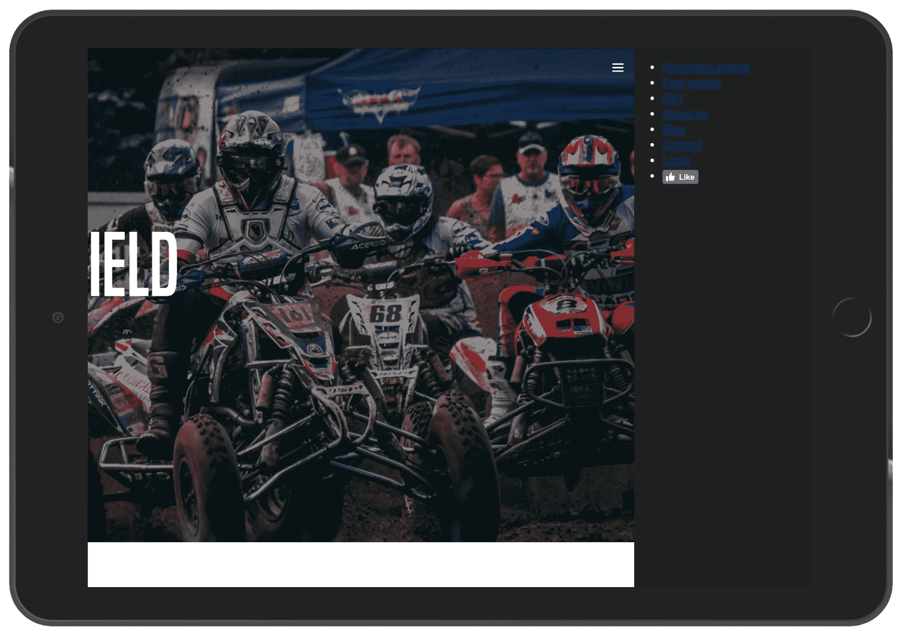

# 第八章：使我们的网站响应

在第四章中，*响应式与自适应设计*，您学习了响应式设计和自适应设计之间的区别。前者更容易实现，后者则针对最终用户。

本章将涵盖以下内容：

+   什么是媒体查询？

+   打开浏览器检查器

+   桌面优先和移动优先之间的区别

+   jQuery 介绍

+   如何使我们的网站对每种设备和屏幕尺寸都响应

# 什么是媒体查询？

可以使用*媒体查询*来实现响应式设计。这是如何工作的？将媒体查询视为您应用于 CSS 的条件。您告诉浏览器根据设备或视口大小添加或删除某些 CSS 规则：


要应用这些规则，我们需要使用 CSS 属性`@media`，如下所示：

```html
/* Mobile Styles */
@media only screen and (max-width: 400px) {
  body {
    background-color: #F09A9D; /* Red */
  }
} 
```

`@media only screen and (max-width: 400px)` 意味着如果屏幕/视口尺寸小于或等于 `400px`，那么我们将应用这个 CSS。

您可以向媒体添加几种不同类型的属性，并针对不同类型的设备进行定位。

例如，您可以使用以下代码专门针对 iPhone 4：

```html
@media only screen 
  and (min-device-width: 320px) 
  and (max-device-width: 480px)
  and (-webkit-min-device-pixel-ratio: 2)
  and (orientation: portrait) {

}
```

这翻译为以下内容：

```html
and (min-device-width: 320px) 
and (max-device-width: 480px)
```

上述代码意味着任何尺寸大于或等于 `320px` 且小于或等于 `480px` 的设备：

```html
and (-webkit-min-device-pixel-ratio: 2)
```

以下代码针对像素比或密度为 `2` 的任何设备：

```html
and (orientation: portrait)
```

上述代码将仅针对`纵向`方向的设备。

现在我们已经介绍了媒体查询的基础知识，让我们在项目中实践一下。

# 打开检查器

首先，为了能够测试我们网站的响应性，Chrome 中有一个非常有用的工具。要访问它，您可以转到查看 | 开发者 | 开发者工具：


要使用此工具，请单击左上角的第二个图标

现在，您可以选择任何您想要测试的设备，如下：


您还可以看到整个页面的代码显示在右侧：


谷歌 Chrome 检查器

这非常有用，因为它允许您在放入代码之前尝试不同的 CSS 属性，或者检查您的 CSS 是否有效。您可以快速尝试并进行调整。

# 桌面优先

根据您开始的设计过程，但一般来说，您会从桌面设计开始，然后逐渐降低到移动端。如果您从移动优先的过程开始设计，您将需要从移动端开始，然后升级到桌面端。

因此，初始 CSS 是为桌面设计的，现在我们要考虑的是要应用到 CSS 的条件。

我们想要针对的设备如下：

+   桌面（默认）

+   平板电脑（视口尺寸小于或等于 1,024px）

+   大型移动设备（视口尺寸小于或等于 768px）

+   小型移动设备（视口尺寸小于或等于 400px）

这是一个如何分隔不同断点的示例。您可以根据需要进行更改。

因此，在 CSS 中看起来是这样的：

```html
/* Tablet Styles */
@media only screen and (max-width: 1024px) {

} 

/* Large Mobile Styles */
@media only screen and (max-width: 768px) {

} 

/* Small Mobile Styles */
@media only screen and (max-width: 400px) {

} 
```

现在我们已经准备好了我们的断点，让我们开始使我们的网站响应。

# 设计菜单

在本节中，我们将看看如何在移动设备或平板电脑上隐藏桌面菜单，而在移动设备或平板电脑上显示汉堡图标：


移动视图的设计

如果我们单击该图标，菜单将在右侧打开：


在移动设备上打开的菜单

为此，我们首先需要在移动版本和平板版本上隐藏菜单。

在我们的 CSS 的`header`部分末尾，添加以下代码：

```html
/* Tablet Styles */
@media only screen and (max-width: 1024px) {
  header {
    display: none;
  }
}
```

现在我们想在移动设备上显示`汉堡菜单`。我们需要在 HTML 中创建一个`div`标签，并且只在移动设备上显示它，使用 CSS：

```html
<div class="hamburger-menu">
   
</div>    
```

我们将把这个放在我们的头部标签`</header>`的结束之前。

在 CSS 中，我们需要在桌面视图中隐藏汉堡，并且只在移动视图中显示它：

```html
.hamburger-menu {
  display: none;
}
/* Tablet Styles */
@media only screen and (max-width: 1024px) {
  header .main-nav, header .right-nav {
    display: none;
  }
  .hamburger-menu {
    display: block;
  }
}
```

让我们保存并查看：


如果你想为平板视图添加一个花哨的框架，那么点击右上角的三个点，然后点击显示设备框架。

我们可以看到汉堡图标显示出来了，但我们需要正确放置它：

```html
.hamburger-menu {
  display: none;
  position: absolute;
  right: 15px;
  top: 15px;
}
```

不要忘记我们只是通过媒体查询改变`display`属性，所以我们在这里应用的规则将适用于移动版本。

现在我们必须创建另一个仅在移动版本上显示的菜单，当用户点击汉堡菜单时，整个页面将向左移动：


显示内容和移动导航的不同层的图表

为了能够移动整个页面，我们需要创建一个 HTML 标签并将我们的内容放在其中。我们将创建一个名为`<main>`的标签，并将我们从`header`到`footer`创建的内容放在其中。

现在，在 CSS 中，我们首先需要为我们的`main`标签添加一个新的部分：

```html
/* MAIN SECTION */

main {

}

/* END MAIN SECTION */
```

现在，为了确保这个元素将成为父元素，我们需要将这个元素设置为`position: relative;`，这样每个具有`position: absolute;`的元素现在都将与这个元素相关联：

```html
main {
  position: relative;
}
```

我们还将添加一个`background-color: white;`，以确保它具有与默认的`white`相同的背景`white`：

```html
main {
  position: relative;
  background-color: white;
}
```

现在，为了移动我们的`main`标签，我们将使用`"left:-200px"`的 CSS 属性：

```html
main {
  position: relative;
  background-color: white;
  left:-200px;
}
```

这将使我们的元素水平移动-200px，也就是向左移动 200px。现在，让我们保存并查看：


主容器向左移动了 250px

对于我们的移动菜单，让我们创建另一个带有`"mobile-nav"`类的`div`，但我们将把它放在`<main>`标签之外。

```html
<div class="mobile-nav">

</div>
<main>
   <header>
    ...
```

在`.mobile-nav`中，让我们重新创建我们的`nav`（包括`.main-nav`和`.right-nav`列表）：

```html
<div class="mobile-nav">
          <ul>
            <li><a href="upcoming.html">Upcoming events</a></li>
            <li><a href="past.html">Past events</a></li>
            <li><a href="faq.html">FAQ</a></li>
            <li><a href="about.html">About us</a></li>
            <li><a href="blog.html">Blog</a></li>
            <li><a href="contact.html">Contact</a></li>
            <li><a href="login.html">Login</a></li>
            <li><a href="#"><iframe src="img/like.php?href=http%3A%2F%2Ffacebook.com%2Fphilippehongcreative&width=51&layout=button&action=like&size=small&show_faces=false&share=false&height=65&appId=235448876515718" width="51" height="20" style="border:none;overflow:hidden" scrolling="no" frameborder="0" allowTransparency="true"></iframe></a></li>
          </ul>
        </div>
```

在我们的 CSS 文件中，让我们确保在桌面视图中隐藏我们的`.mobile-nav`：

```html
/* MOBILE MAVIGATION */

.mobile-nav {
  display: none;
}

/* Tablet Styles */
@media only screen and (max-width: 1024px) {
  .mobile-nav {
    display: block;
  }
}

/* END MOBILE NAVIGATION */
```

让我们添加一些定制：

```html
.mobile-nav {
  display: none;
  position: fixed;
  background-color: #1F1F1F;
  width: 200px;
  height: 100%;
  right: 0;
  top: 0;
}
```

+   `position: fixed;`：因为我们希望菜单在我们移动`<main>`容器时保持固定在后面

+   `background-color: #1F1F1F;`：从设计中选择的颜色

+   `width: 200px;`和`height: 100%;`：因为我们希望尺寸略小于移动设备的最小宽度，即 320px。200px 看起来不错，当然，我们希望高度为 100%，以垂直占据整个空间

+   `right: 0;`和`top: 0;`：指定从视口的位置



iPad 视图（1,024px）

让我们完成菜单的定制：

```html
.mobile-nav ul {
  margin: 0;
  padding: 25px;
}

.mobile-nav ul li {
  list-style-type: none;
  margin-bottom: 10px;
}

.mobile-nav ul li a {
  color: white;
  text-decoration: none;
  font-family: 'built_titling', Helvetica, sans-serif;
  font-weight: 200;
  font-size: 20px;
  letter-spacing: 4px;
}
```

让我们保存并查看它的样子：


iPad 视图（1,024px）

现在让我们将`<main>`容器返回到初始位置：

```html
main {
  position: relative;
  background-color: white;
  left: 0px;
}
```

这就是乐趣开始的时候；我们将在 JS 中创建一个函数，当用户点击汉堡菜单时，会使`<main>`容器动画化。

为了实现这一点，当用户点击汉堡菜单时，我们将向`<main>`标签添加一个类。这个类叫做`active`，将具有以下值：

```html
main.active {
  left: -200px;
}
```

因此，如果我们向`<main>`元素添加一个`active`类，容器将按我们指定的方式向左移动。

现在让我们把它移除，开始 JS。

为了启动任何项目，对于任何初学者来说，最好的方法是从 jQuery 开始。什么是 jQuery？

# 什么是 jQuery？

jQuery 是一个快速而简洁的 JavaScript 库，简化了 HTML 文档的遍历、事件处理、动画和 Ajax 交互，用于快速的 Web 开发。

- jQuery 官方网站

jQuery 本身不是一种语言；它是一个帮助更轻松、更高效地编写 JavaScript 的 JavaScript 框架。jQuery 的优点如下：

+   它简化了 JavaScript 语法

+   它已经解决了 JavaScript 在每个 Web 浏览器之间将会遇到的大部分问题

+   它使部署在所有平台上更安全

+   对于初学者来说很容易理解

+   它有许多库和一个庞大的社区

要使用 jQuery，我们只需要将脚本链接到我们的 HTML，但是幸运的是，使用 HTML 样板，jQuery 已经集成了。以下是在我们的 HTML 中调用 URL 并下载 jQuery 文件的行：

```html
<script src="img/jquery-3.2.1.min.js" integrity="sha256-hwg4gsxgFZhOsEEamdOYGBf13FyQuiTwlAQgxVSNgt4=" crossorigin="anonymous"></script>
```

# jQuery 语法

我们现在来看一下 jQuery 语法。以下语法是一个改变 body 背景的 jQuery 和 JavaScript 代码的示例：

```html
jQuery
$('body').css('background', '#fff'); 

Javascript
function changeBackgroundColor(color) {
   document.body.style.background = color;
}
onload="changeBackgroundColor('white');"
```

您可以看到它们之间的很大区别。

jQuery 的基本语法非常简单：

```html
$(selector).action();
```

1.  `$`符号开始任何 jQuery 操作

1.  `(selector)`用于查询(或查找)HTML 元素，通过 ID 或类，就像在 CSS 中一样(`#`或`.`)

1.  `action()`是要在元素上执行的操作

1.  分号(`;`)用于关闭操作

例如，要在 jQuery 中添加一个类，我们可以使用 jQuery 操作`.addClass`：

```html
$('main').addClass('active'); 
```

要实现这一点，我们需要事先创建一个 JS 文件，并在其中编写所有我们的 JS 代码。但是，我们可以使用 HTML 样板中的一个创建的位于我们的`js`文件夹中的`main.js`。

要调用 jQuery 并说我们需要执行这些操作，我们需要添加以下代码：

```html
$(document).ready(function(){

   // jQuery methods go here...

});
```

这是为了防止在文档完成加载之前运行任何 jQuery 代码。

现在，为了测试我们的 jQuery 是否正确地与我们的 HTML 文件链接，我们可以做的一个快速的事情是在页面加载时显示一个警报。

为此，我们可以使用 JavaScript 的`alert`操作：

```html
$(document).ready(function(){

  alert("Hello world");

});
```


我们的警报操作正常工作

我们可以删除`alert`操作并添加我们之前创建的小代码：

```html
$(document).ready(function(){

  $('main').addClass('active'); 

});
```

让我们保存并检查一切是否正常工作：


这显示了检查器上的类

确实，我们从一开始就有我们的类`active`。

将此操作更改为用户单击菜单时，我们需要使用 jQuery 操作`click`：

```html
$('.hamburger-menu').click();
```

我们可以定义这一点，但这将不起作用，因为我们需要在单击图标时定义操作。为此，我们需要在内部设置一个`function`。函数是一组您可以设置的操作，后面跟着一个开放和一个关闭的花括号：

```html
$('.hamburger-menu').click(function(){

}); 
```

现在，在`function`内部，我们将添加`addClass`操作：

```html
$('.hamburger-menu').click(function(){
    $('main').addClass('active');
  });
```

现在保存您的 JS 文件并刷新页面。当您单击`hamburger-menu`时，容器会向左移动。干得好！我们迈出了第一步。但是，现在我们想关闭菜单并将容器移回。

我们可以添加这个：

```html
$('main').click(function(){
    $('main').removeClass('active');
});
```

但是，这不起作用，因为它总是尝试删除类`active`，因为`<main>`是`.hamburger-menu`的父级。为了解决这个问题，我们需要告诉脚本在单击触发器时停止点击`event`冒泡。这意味着它永远不会达到`<main>`级别，并且不会触发`.removeClass()`方法。为此，我们需要添加一种跟踪点击事件并告诉它不要冒泡的方法：

```html
$('.hamburger-menu').click(function(event){
    event.stopPropagation();
    $('main').addClass('active');
  });
```

您现在可以检查您的菜单。它按预期正常工作，但当您单击`.hamburger-menu`本身时，它不会执行任何操作。这是因为我们没有告诉它要执行任何操作。

当我们单击汉堡菜单时，我们需要使`<main>`返回到其初始位置。但是，现在，我们只设置了将类`active`添加到`<main>`。

我们需要配置一种方法，只有在`<main>`上有`active`时才能移除该类。为此，我们需要应用一个条件。在 jQuery 中应用条件，我们只需要使用条件`if`和`else`在`function`内部：

```html
$('.hamburger-menu').click(function(event){
    event.stopPropagation();
    if (condition){

    } else {

    }
  });
```

因此，我们想要的操作如下：

+   如果`<main>`有类`active`，则删除类`active`

+   如果`<main>`没有类`active`，则添加类`active`

要检查元素是否有类，我们可以使用 jQuery 操作`hasClass`，如下所示：

```html
$('.hamburger-menu').click(function(event){
    event.stopPropagation();
    if ($('main').hasClass('active')){
      $('main').removeClass('active');
    } else {
      $('main').addClass('active');
    }
  });
```

现在保存您的 JS 文档。我们的 JS 完美地工作了，但是如果您有完美主义的倾向，添加一些动画不会伤害您。我们可以为容器添加一些过渡效果，以使动画更加流畅：

```html
main {
  position: relative;
  background-color: white;
  left: 0px;
  transition: all 0.2s ease-in-out; 
}
```

过渡效果只会作用于移动的元素，这种情况下是`<main>`元素。

我们的响应式终于完成了；让我们转移到主标题部分。

# 使主标题部分具有响应性

让我们来检查一下目前我们的主标题是如何响应的：


iPad 视图和 iPhone 8 视图

正如我们所看到的，iPad 视图中没有什么需要改变；然而，在 iPhone 视图中，缺少填充，标题似乎有点太大。

我认为可以在不添加太多代码的情况下解决这个问题，就是给每个部分实现的`container`添加一些填充：

```html
.container {
  max-width: 940px;
  margin: 0 auto;
}

/* Tablet Styles */
@media only screen and (max-width: 1024px) {
  .container {
    padding: 0px 15px;
  }
}
```

我们将从平板电脑断点添加一些填充，这样它将影响所有更低的断点。

现在让我们修复我们的标题。这将是直接的；我们只需要找到我们的`.hero-title`类并添加一些媒体查询：

```html
/* Large Mobile Styles */
@media only screen and (max-width: 768px) {
  .hero-text .hero-title {
    font-size: 90px;
  }
}
```

就是这样！您也可以根据需要随时更改值。

# 使博客部分具有响应性

这个博客部分是基于三列网格的，它在台式机和平板电脑上运行得很好；然而，在手机上，它缩小得有点太多，所以我们需要将三列改为两列（对于小手机，一列）：


博客部分的移动视图

要改变列的宽度，让我们转到我们创建的`.blog-post`类，并在大手机断点上将宽度值改为`50%`：

```html
.blog-post {
  width: 33.33%;
  padding: 0 5px;
  box-sizing: border-box;
  margin-bottom: 30px;
}

/* Large Mobile Styles */
@media only screen and (max-width: 768px) {
  .blog-post {
    width: 50%;
  }
}

/* Small Mobile Styles */
@media only screen and (max-width: 400px) {
  .blog-post {
    width: 100%;
  }
}
```

这将确保内容无论出现在哪种设备上都能够被读取。

此外，标题也显得有点太大。在移动视图中，我们可以将`font-size`减小`40px`：

```html
#blog h2 {
  font-family: 'built_titling', Helvetica, sans-serif;
  font-weight: 200;
  font-size: 60px;
}

/* Small Mobile Styles */
@media only screen and (max-width: 400px) {
  #blog h2 {
    font-size: 40px;
  }
}
```

前面的代码将如下所示：


博客部分的不同断点的视图

# 使关于我们部分具有响应性

关于我们部分在 iPad 视图上看起来很好，但在手机上开始变得有点挤：


关于我们部分的移动视图

为了解决这个问题，我们需要在手机断点上将宽度值改为`100%`：

```html
.about-us-title {
  width: 50%;
}

/* Small Mobile Styles */
@media only screen and (max-width: 400px) {
  .about-us-title {
    width: 100%;
  }
}

.about-us-desc {
  width: 50%;
}

/* Small Mobile Styles */
@media only screen and (max-width: 400px) {
  .about-us-desc {
    width: 100%;
  }
}
```

此外，我们将通过添加 CSS 属性`flex-orientation: column`来改变 flexbox 的方向。默认情况下，这个值是`row`，但您也可以通过`row-reverse`值来改变顺序，对于`column`值也是一样，使用`column-reverse`：

```html
/* Small Mobile Styles */
@media only screen and (max-width: 400px) {
  #about-us .container {
    flex-direction: column;
  }
}
```

设计看起来不错，但文本与标题仍然有点太近；让我们通过添加一些边距来解决这个问题：

```html
/* Small Mobile Styles */
@media only screen and (max-width: 400px) {
  .about-us-desc {
    width: 100%;
    margin-top: 50px;
  }
}
```

现在，保存并检查：


关于我们的响应式布局

# 使 footer 部分具有响应性

最后一部分是`footer`，对于大多数网站来说，它只是一个链接列表。它通常显示为一个简单的垂直列表；它不像我们创建的标题菜单那样复杂。

首先，我们需要移除在`footer`中设置的高度值；为此，我们可以简单地用`auto`值替换它：

```html
/* Small Mobile Styles */
@media only screen and (max-width: 768px) {
  footer .container {
    height: auto;
  }
}
```

我们还需要通过设置 flexbox 的方向来垂直显示链接，就像我们之前看到的那样：

```html
/* Small Mobile Styles */
@media only screen and (max-width: 768px) {
  footer .container {
    flex-direction: column;
    height: auto;
  }
}
```

下一步将是改变我们在`<li>`上设置的显示值：

```html
footer .main-nav li, footer .right-nav li {
  list-style-type: none;
  display: inline-block;
}

/* Small Mobile Styles */
@media only screen and (max-width: 768px) {
  footer .main-nav li, footer .right-nav li {
    display: block;
  }
}
```

此外，我们需要移除在`<a>`标签上设置的填充：

```html
/* Small Mobile Styles */
@media only screen and (max-width: 768px) {
  footer .main-nav li a, footer .right-nav li a {
    padding: 0px;
  }
}
```

最后，我们需要从`<ul>`中移除默认的填充：

```html
/* Small Mobile Styles */
@media only screen and (max-width: 768px) {
  footer .container ul {
    padding: 0;
  }
}
```

现在我们都完成了。

# 总结

那是一个非常紧凑的章节，我希望你仍然能够理解！现在我们已经介绍了如何使用媒体查询使我们的网站具有响应性，还有一个快速介绍 jQuery，我们现在可以继续下一章了。在下一章中，我们将深入研究 CSS 和 jQuery，通过添加一些交互和动态内容来丰富您的网站。我们将讨论 CSS 中的伪类，如何在网站上使用插件，以及如何通过 API 收集信息。我迫不及待要向你展示这些！
