# 第九章：添加交互和动态内容

我发现网站构建的这一部分是最有趣和令人愉快的。添加交互和动态内容将为我们的网站带来生机，并为其增添个人风格。

在本章中，我们将：

+   首先学习 CSS 中**伪类**的基础知识，以及一些悬停和激活状态的示例

+   学习如何从头开始创建 CSS 动画

+   通过连接到 API 并导入一些内容来添加一些动态内容以在我们的网站上显示

让我们开始吧！

# CSS 伪类

伪类用于定义元素的特殊状态。例如，当您悬停或单击按钮时，可以激活一个状态。

我们将学习两个简单的伪类，最常见的伪类。当您知道如何使用它们时，您可以轻松地添加和激活其他伪类：

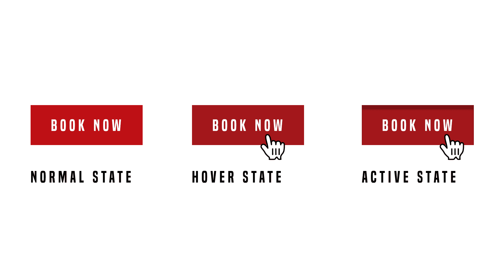

不同的伪类

这两个伪类是`hover`和`active`。当您用鼠标悬停在元素上时，将使用`hover`状态。这对于显示元素是可点击的很有用。另一方面，当您单击元素时，将使用`active`状态。

要使用这些伪类，您只需用冒号`:`调用它们：

```html
.element:hover {
    // Display something
}

.element:active {
    // Display something
}

```

对于第一个示例，当悬停在菜单中的链接上时，我们将添加一些样式。我们希望在悬停时为链接添加下划线。为了做到这一点，最好能够轻松地用 CSS 来定位每一个`<a>`。但是，如果我们查看我们的 HTML，我们会发现每个导航都有许多不同的类。我们要做的是为每个`nav`添加一个共同的类，这样我们就可以轻松地用 CSS 来调用它。

我们在标题和页脚上有类`.main-nav`和`.right-nav`。我们要做的是为这些类中的每一个添加一个共同的类`.nav`：

```html
<ul class="nav main-nav">
              <li><a href="upcoming.html">Upcoming events</a></li>
              <li><a href="past.html">Past events</a></li>
              <li><a href="faq.html">FAQ</a></li>
              <li><a href="about.html">About us</a></li>
              <li><a href="blog.html">Blog</a></li>
              <li><a href="contact.html">Contact</a></li>
            </ul>
            <ul class="nav right-nav">
              <li><a href="login.html">Login</a></li>
              <li><a href="#"><iframe src="img/like.php?href=http%3A%2F%2Ffacebook.com%2Fphilippehongcreative&width=51&layout=button&action=like&size=small&show_faces=false&share=false&height=65&appId=235448876515718" width="51" height="20" style="border:none;overflow:hidden" scrolling="no" frameborder="0" allowTransparency="true"></iframe></a></li>
            </ul>
```

现在，我们必须定位`nav`内的链接。链接是元素`<a>`，正如我们之前所看到的。为了定位它，我们将在 CSS 中调用如下：

```html
.nav li a {
  // CSS
}
```

这将定位每个`.nav`的每个`.li`的每个子元素中的每个`<a>`。

让我们添加伪类`:hover`：

```html
.nav li a:hover {
  // CSS
}
```

要在链接下方添加下划线，我们可以使用 CSS 属性`text-decoration:underline;`：

```html
.nav li a:hover {
  text-decoration: underline;
}
```

现在让我们也为按钮添加一些样式。

对于每个按钮，我们都有类`.btn-primary`，所以，与之前的过程相同，我们将添加伪类`hover`：

```html
.btn-primary:hover {
  background: #A3171B;
}
```

我们在这里做的是在悬停在按钮上时改变按钮的背景颜色。现在让我们添加一个`active`状态：

```html
.btn-primary:active {
  box-shadow: inset 0px 8px 4px rgba(0, 0, 0, 0.25);
}
```

这将在单击按钮时向按钮添加内阴影。

为了增加一些额外的效果，我们可以添加一个`transition`来使动作更加平滑。不要忘记，`transition`必须添加在正常状态下，而不是在伪类上：

```html
.btn-primary {
  display: inline-block;
  font-family: 'built_titling', Helvetica, sans-serif;
  font-weight: 400;
  font-size: 18px;
  letter-spacing: 4.5px;
  background: #BF0000;
  color: white;
  padding: 12px 22px;
  border: none;
  outline: none;
  transition: all 0.3s ease;
}
```

大功告成！相当容易。CSS 中有很多伪类。我们将继续学习更多，但您现在可以尝试一下。以下是 CSS 中的伪类列表：[`www.w3schools.com/css/css_pseudo_classes.asp`](https://www.w3schools.com/css/css_pseudo_classes.asp)。

下一步是构建一个固定导航！我们将结合一些 jQuery 和 CSS 来构建一个导航，当用户滚动页面时，它将固定在顶部。令人兴奋的时刻！

# 固定导航

我们想要做的是在滚动到博客部分时使导航固定在顶部，如下面的截图所示：

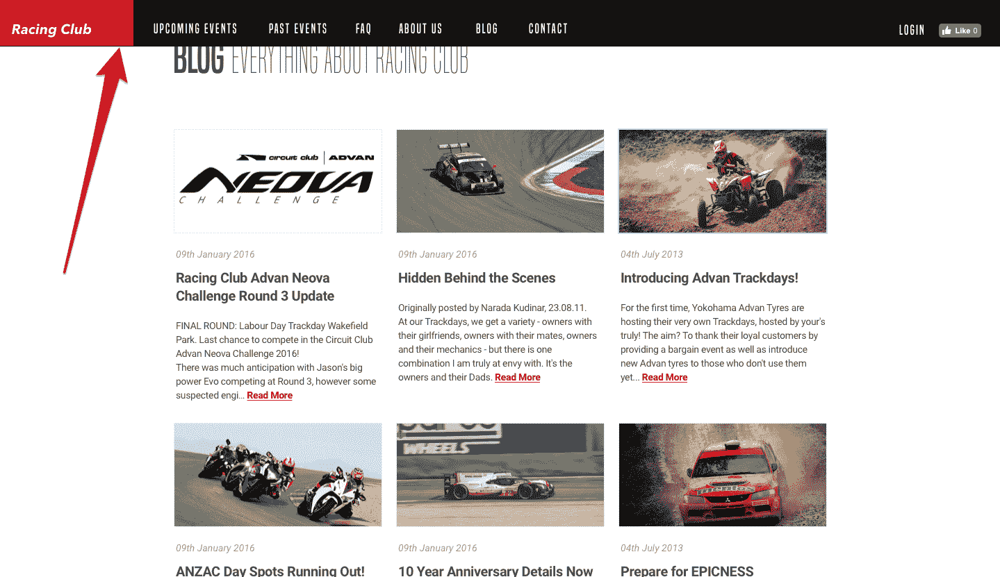

我们要构建的固定导航。

为了实现这一点，我们将在标题上添加一个额外的类。这个额外的类将使导航固定在顶部，并使导航背景变暗。让我们首先创建这个额外的类：

```html
header.sticky {

} 
```

我们需要小心，因为我们没有用空格分隔类，这意味着当标题也有类`sticky`时。

对于这个类，我们将添加以下属性：

```html
header.sticky {
  position: fixed;
  top: 0;
  background-color: #212121;
  background-image: none;
}
```

让我们来分解一下：

+   我们使用`position: fixed;`，因为我们希望使导航固定在顶部。`position: fixed`将使元素相对于浏览器窗口定位。

+   `top: 0;`告诉我们它会固定在顶部。

+   `background-color:` 设置了一个纯色背景。

+   `background-image: none;`移除了渐变。

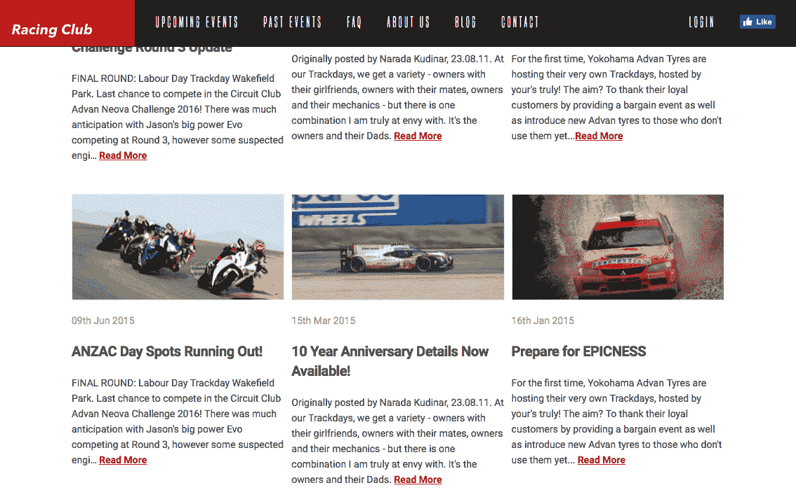

博客部分的粘性页眉

我们有我们的 CSS 类`.sticky`准备就绪。现在我们需要创建我们的 jQuery 函数来实现这一点。

# JS 插件：Waypoints

我们将使用一个插件，当滚动到一个元素时触发一个动作。该插件称为*Waypoints*，可以从此链接下载：[`imakewebthings.com/waypoints/`](http://imakewebthings.com/waypoints/)：

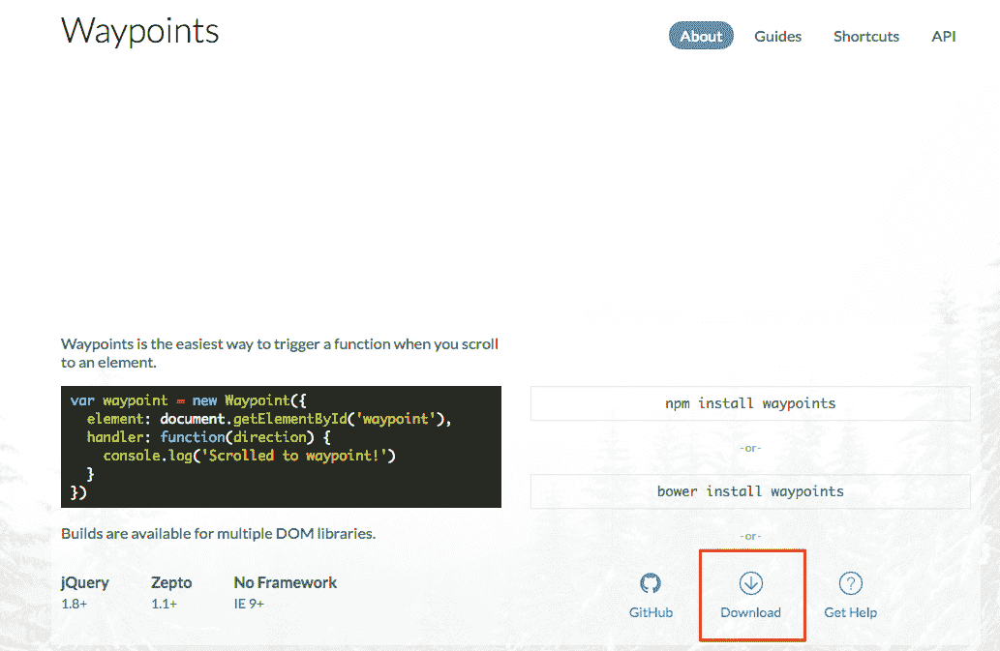

Waypoints 网站。

只需点击“下载”按钮即可下载文件。在您下载的文件中，只有一个文件是必需的。转到`lib`文件夹，找到`jquery.waypoints.min`。复制此文件并粘贴到我们的`Web Project`文件夹中，具体来说是在我们的`js` | `vendor`文件夹中。

粘贴后，我们需要将其链接到我们的 HTML 页面。为此，请转到我们的 HTML 文件，位于结束标签`</body>`之前。您会看到一堆脚本已经链接到我们的 jQuery 文件之前。在最后一个文件`main.js`之前，只需添加以下内容：

```html
<script src="img/jquery.waypoints.min.js"></script>
```

`main.js`应该是列表中的最后一个文件，因为它包含了所有我们个人的 JS 函数，并且需要在浏览器最后读取。

每个插件都有不同的使用方式。最好的方法是阅读插件作者提供的文档。在这里，我将向您解释使用此插件的最简单方法。

要使用`.waypoint`与 jQuery，我们可以使用以下方式调用它：

```html
$('elementToTrigger').waypoint(function(direction){
    /* JS code */
});
```

以下是一些解释：

+   `elementToTrigger`将是我们希望插件监视并在用户滚动通过该元素时触发动作的元素。在这种情况下，它将是`#blog`。

+   `direction`：此参数将用于检测用户是向下滚动还是向上滚动页面。

让我们转到我们的`main.js`并创建我们自己的`JS 代码`：

```html
$('#blog').waypoint(function(direction) {

  });
```

现在我们想要的是，当用户向下滚动并滚过博客部分时执行一个动作，但当用户向上滚动并离开博客部分时执行另一个动作。

为了做到这一点，我们需要使用一个条件，就像我们之前看到的那样：

```html
$('#blog').waypoint(function(direction) {
    if (direction == 'down') {

    } else {

    }
  });
```

`direction == 'down'`表示滚动的方向等于`down`。

现在我们要做的是在用户向下滚动并经过博客部分时添加类`sticky`，并在后者离开时删除相同的类：

```html
$('#blog').waypoint(function(direction) {
    if (direction == 'down') {
      $('header').addClass('sticky');
    } else {
      $('header').removeClass('sticky');
    }
  });
```

让我们保存并看看它是如何工作的：

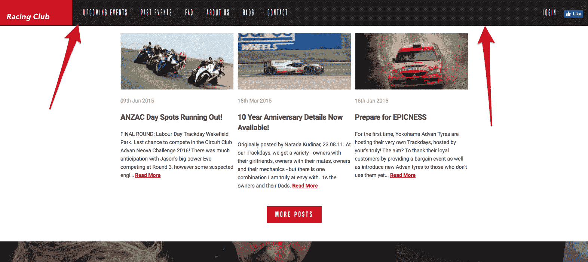

我们的粘性页眉。

它工作得很好，但是页眉会立即出现，没有任何动画。让我们尝试使其更加流畅。为了添加一些过渡效果，在这个例子中，我们将使用 CSS 动画。

# CSS 动画

CSS 动画允许创建动画而无需 JS 或 Flash，具有关键帧和每个 CSS 属性。它比简单的过渡提供了更多的优势。

要创建 CSS 动画，您需要创建一个关键帧：

```html
/* The animation code */
@keyframes example {
    from {background-color: red;}
    to {background-color: yellow;}
}
```

`from`表示动画开始时，而`to`表示动画结束时。

您还可以通过设置百分比来更精确地设置时间段：

```html
/* The animation code */
@keyframes example {
    0% {background-color: red;}
    25% {background-color: yellow;}
    50% {background-color: blue;}
    100% {background-color: green;}
}
```

要触发动画，您需要在具有 CSS 属性的特定 div 中调用它：

```html
animation-name: example;
animation-duration: 4s;
```

对于我们的页眉导航，关键帧将是：

```html
/* The animation code */
@keyframes sticky-animation {
    from {transform: translateY(-90px);}
    to {transform: translateY(0px);}
}
```

`transform:` 是 CSS 中的一种新的位置类型，允许您在 2D 或 3D 环境中移动元素。使用`translateY`，我们在*Y 轴*上移动元素。此外，我们将关键帧命名为`sticky-animation`：

```html
header.sticky {
  position: fixed;
  top: 0;
  background-color: #212121;
  background-image: none;
  animation-name: sticky-animation;
 animation-duration: 0.3s;
}
```

最后一部分将是在类`.sticky`中调用动画，持续时间为`0.3s`。

我们现在有一个完美运行的粘性导航，带有一个很酷的动画！

# 添加一个动态的 Instagram 动态

最终目标是能够通过连接到 Instagram API 并从中提取信息来实现自己的 Instagram 动态。

从设计的角度来看，我们希望在页脚之后展示我们最新的 Instagram 照片动态，当您将鼠标悬停在上面时，会有一个不透明度的悬停效果。

它应该看起来像这样：

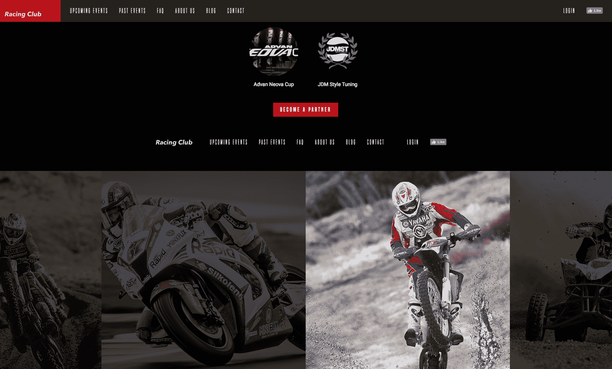

我们的 Instagram 供稿的最终设计

为了实现这一点，首先我们需要有一个 Instagram 账户。如果你已经有一个，你可以使用你自己的。否则，我已经为这个练习创建了一个账户：

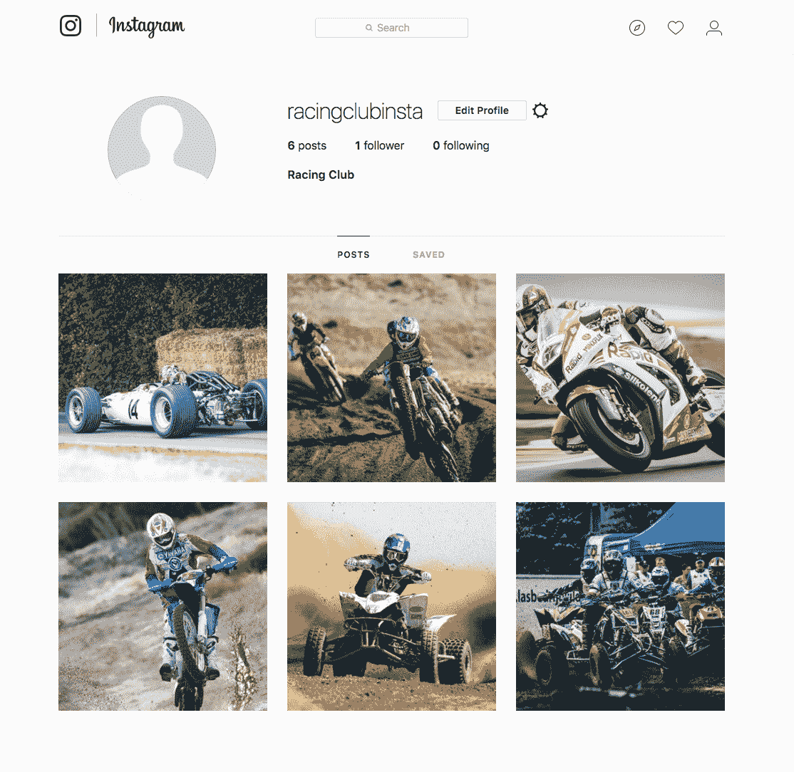

我们很棒的 Instagram 供稿

# 安装 Instafeed.js

我之前上传了一些赛车的图片。下一步是安装一个名为`Instafeed.js`的插件。让我们去网站下载它：[`instafeedjs.com/`](http://instafeedjs.com/):

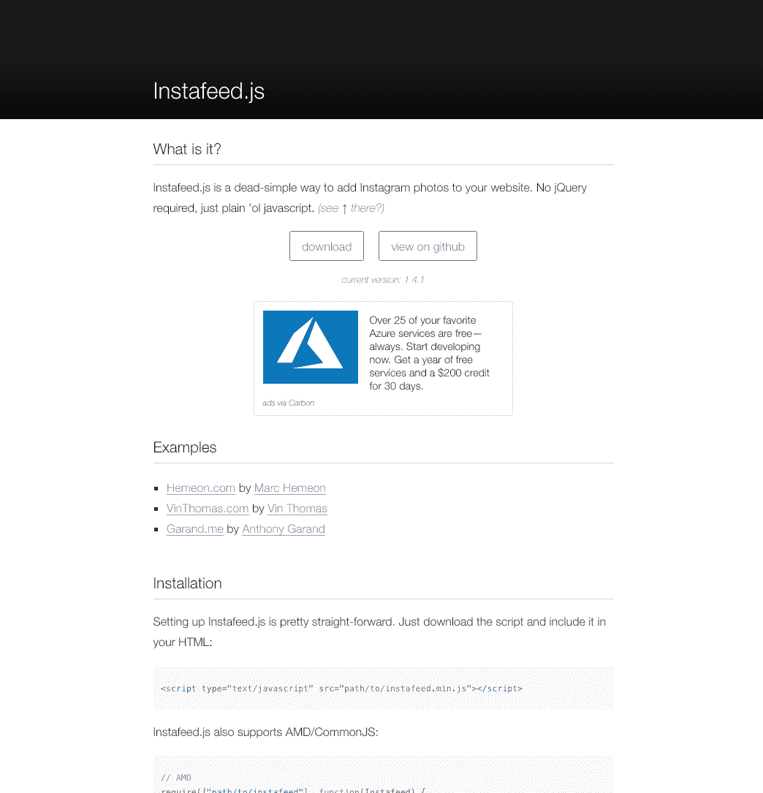

Instafeed.js 主页

右键点击下载，然后点击另存为....将文件放在我们`Web 项目`中`js`文件夹中的`vendor`文件夹中。

对于每个插件，安装过程每次都相当相似。所有的安装过程通常都在网站上详细说明。让我们来看看 Instafeed 的文档。

设置`Instafeed.js`非常简单。只需下载脚本并将其包含在 HTML 中：

```html
<script type="text/javascript" src="img/instafeed.min.js"></script>
```

首先，我们需要调用最初放在我们的`vendor`文件夹中的`js`文件：

```html
<script src="img/modernizr-3.5.0.min.js"></script>
<script src="img/jquery-3.2.1.min.js" integrity="sha256-hwg4gsxgFZhOsEEamdOYGBf13FyQuiTwlAQgxVSNgt4=" crossorigin="anonymous"></script>
<script>window.jQuery || document.write('<script src="img/jquery-3.2.1.min.js"><\/script>')</script>
<script src="img/jquery.waypoints.min.js"></script>
<script src="img/instafeed.min.js"></script>
<script src="img/plugins.js"></script>
<script src="img/main.js"></script>
```

将其放在我们之前安装的 Waypoints 插件之后。

现在，如果我们仔细查看文档，我们可以找到我们需要的部分。

# 从你的用户账户获取图片

要从你的账户中获取特定的图片，设置`get`和`userId`选项：

```html
<script type="text/javascript">
    var userFeed = new Instafeed({
        get: 'user',
        userId: 'YOUR_USER_ID',
        accessToken: 'YOUR_ACCESS_TOKEN'
    });
    userFeed.run();
</script>
```

下一步是找到 userID 和 TokenAccess。如果你不想创建 Instagram 账户，想要使用我之前创建的账户，你可以直接转到标题为显示供稿的部分。

# 查找我们的 userID 和 TokenAccess

我们需要找到的信息是`userID`和`accessToken`。要获得`userID`，我们需要我们的 Instagram 用户名。Instagram 并没有真的让我们很容易地找到我们的`userID`。幸运的是，有很多人创建了一个简单的方法来找到它。你可以很容易地通过谷歌搜索*如何找到 Instagram userID*来找到一个方法，但我们会直奔主题。只需转到这个网站[`codeofaninja.com/tools/find-instagram-user-id`](https://codeofaninja.com/tools/find-instagram-user-id)并填写你的 Instagram 用户名：

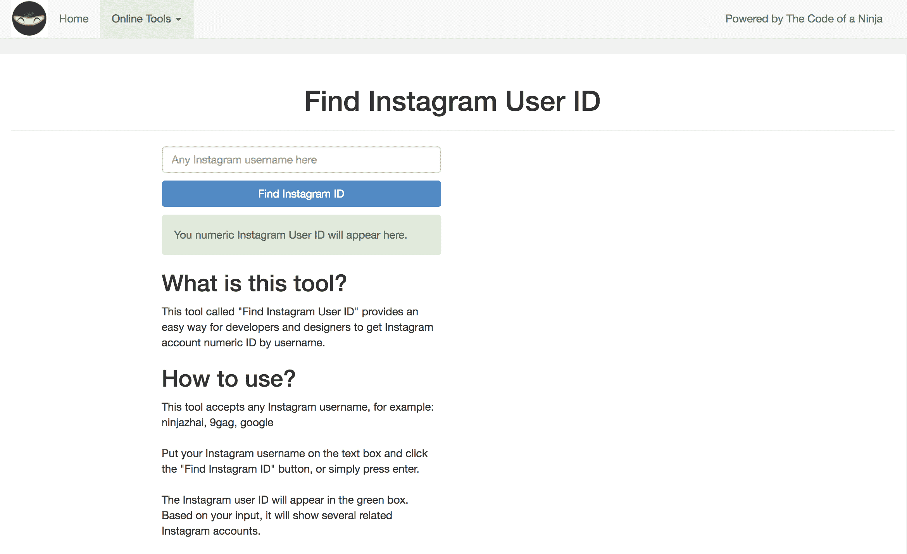

查找 Instagram 用户 ID 网站

点击查找 Instagram ID 后，你会得到类似这样的东西，带有你的`User ID`：

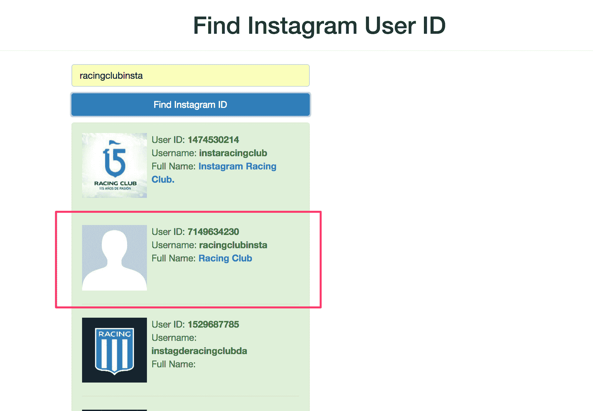

我们的 userID

现在让我们转到我们的`main.js`并复制/粘贴`instafeedjs`文档中显示的代码示例。在我们的`Sticky Nav`代码之后，粘贴代码：

```html
// INSTAGRAM

    var userFeed = new Instafeed({
        get: 'user',
        userId: 'YOUR_USER_ID',
        accessToken: 'YOUR_ACCESS_TOKEN'
    });
    userFeed.run();
```

只需复制并粘贴我们从网站上得到的`userID`，替换`'YOUR_USER_ID'`：

```html
// INSTAGRAM

    var userFeed = new Instafeed({
        get: 'user',
        userId: '7149634230',
        accessToken: 'YOUR_ACCESS_TOKEN'
    });
    userFeed.run();
```

还没有完成；我们仍然需要我们的访问令牌。这会有点复杂。

# 获取我们的访问令牌

Instagram 并没有真的让我们很容易地找到访问令牌。通常，生成我们的访问令牌需要相当长的时间，但我们将使用一个工具来帮助我们获得它。让我们前往[ http://instagram.pixelunion.net/ ](http://instagram.pixelunion.net/)并点击生成访问令牌。

这个网站将为我们生成一个令牌访问，我们唯一需要的是授权网站访问我们的账户：

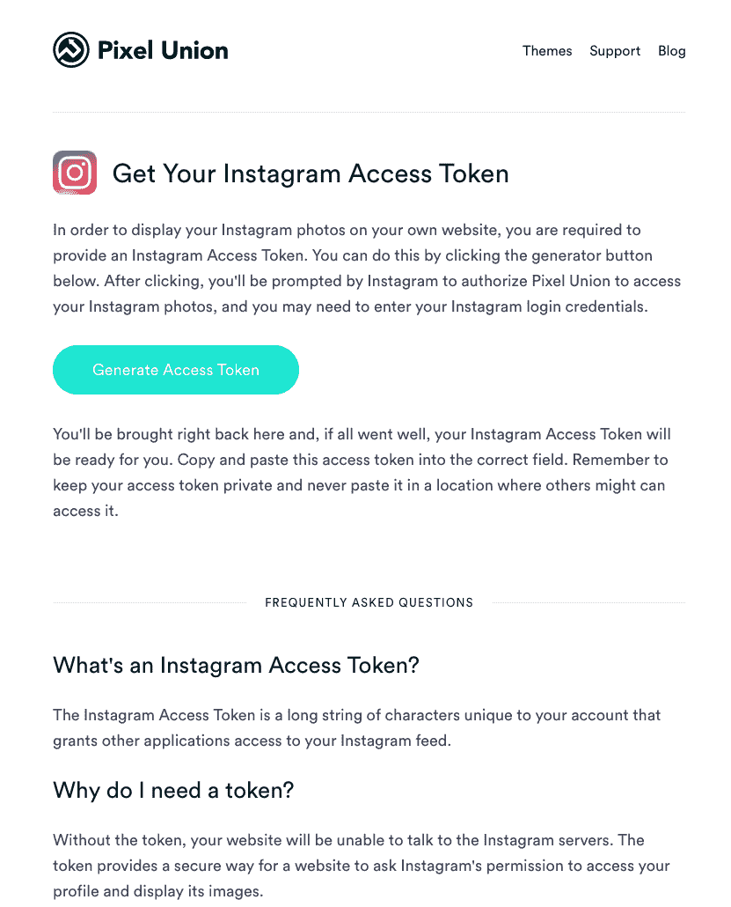

Pixel Union 网站

点击生成令牌访问；它应该将你引导到 Instagram 的*授权*页面：

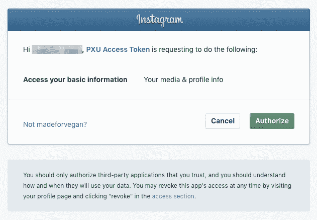

Instagram 授权页面

完成后，你可以复制粘贴他们提供的代码：

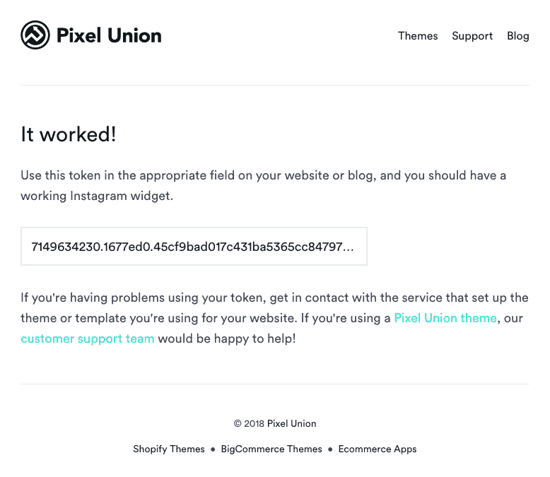

Pixel Union 访问令牌代码

让我们复制/粘贴最后一块拼图到我们的`main.js`代码中：

```html
// INSTAGRAM

    var userFeed = new Instafeed({
        get: 'user',
        userId: '7149634230',
        accessToken: '7149634230.1677ed0.45cf9bad017c431ba5365cc847977db7',
    });
    userFeed.run();
```

保存`main.js`。下一步是用我们的 Instagram 供稿的照片填充 HTML。

# 显示供稿

Instafeed 插件是如何工作来显示我们的供稿的？它会寻找`<div id="instafeed"></div>`并用链接的缩略图填充它。

让我们转到我们的 HTML 文件的末尾，在我们的`<footer>`标签之后，添加`<div id="instafeed"></div>`：

```html
<footer>
            <div class="container">
              <a class="logo" href="/"></a>
              <ul class="nav main-nav">
                <li><a href="upcoming.html">Upcoming events</a></li>
                <li><a href="past.html">Past events</a></li>
                <li><a href="faq.html">FAQ</a></li>
                <li><a href="about.html">About us</a></li>
                <li><a href="blog.html">Blog</a></li>
                <li><a href="contact.html">Contact</a></li>
              </ul>
              <ul class="nav right-nav">
                <li><a href="login.html">Login</a></li>
                <li><a href="#"><iframe src="img/like.php?href=http%3A%2F%2Ffacebook.com%2Fphilippehongcreative&width=51&layout=button&action=like&size=small&show_faces=false&share=false&height=65&appId=235448876515718" width="51" height="20" style="border:none;overflow:hidden" scrolling="no" frameborder="0" allowTransparency="true"></iframe></a></li>
              </ul>
            </div>
          </footer>

          <div id="instafeed"></div>
```

让我们保存并看看它的样子：

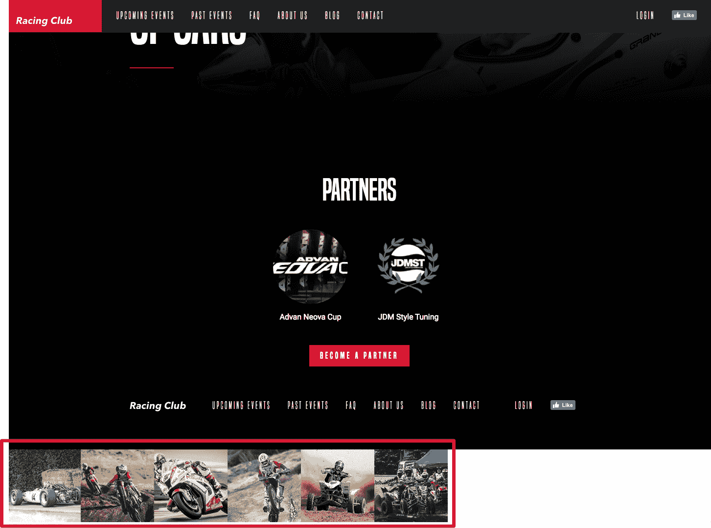

我们的 Instagram feed 确实出现了，但我们不能就这样离开它。让我们自定义我们的 feed 并添加一些 CSS 使其漂亮。

我们要做的第一件事是从我们的 feed 中获取更大的图片。默认情况下，Instafeed 从 Instagram 获取缩略图的最小尺寸。要获取更大的缩略图，我们可以阅读文档，并找到以下信息：

在 Instafeed 提供的标准选项中，我们可以看到我们可以使用`resolution`属性从缩略图中选择三种分辨率类型：

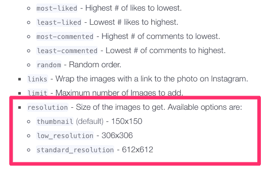

Instafeed 文档。

让我们选择最大的那个。要添加此选项，我们只需要在我们的 JavaScript 函数中添加一个属性：

```html
// INSTAGRAM

    var userFeed = new Instafeed({
        get: 'user',
        userId: '7149634230',
        accessToken: '7149634230.1677ed0.45cf9bad017c431ba5365cc847977db7',
        resolution: 'standard_resolution'
    });
    userFeed.run();
```

因此，在`accessToken`之后，我们可以添加`resolution`属性。确保在`accessToken`属性的末尾添加逗号，以表明这不是最后一个属性。最后一个属性在末尾不需要逗号。

保存并查看我们有什么：

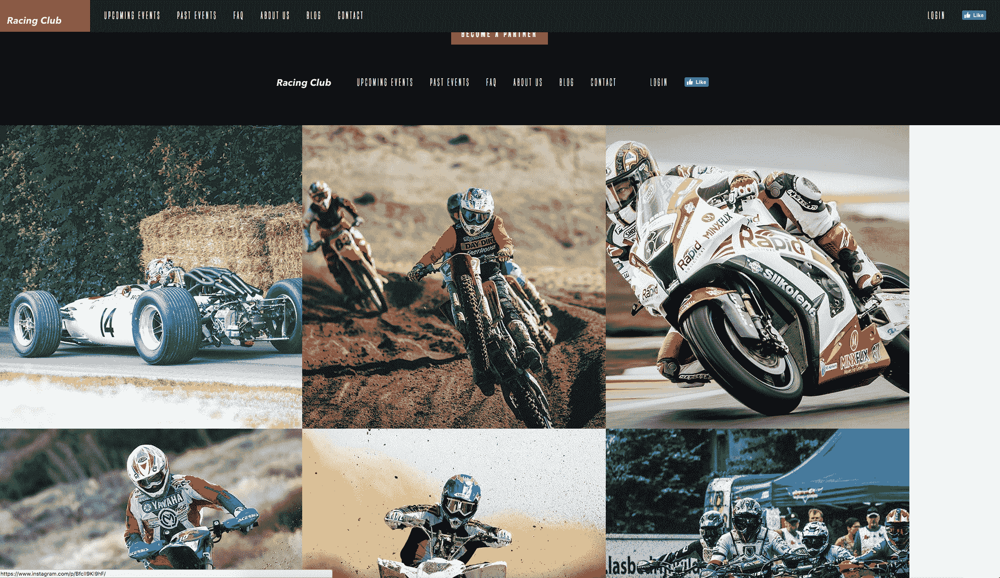

网站工作正在进行中

很好，现在它需要一些 CSS 来使其漂亮。在转到 CSS 之前，我们需要检查 Instafeed 为我们生成了什么 HTML，以便我们能够在 CSS 中调用它。如果您记得，我们可以在 Google Chrome 中检查元素的 HTML。我们只需右键单击它，然后单击检查：

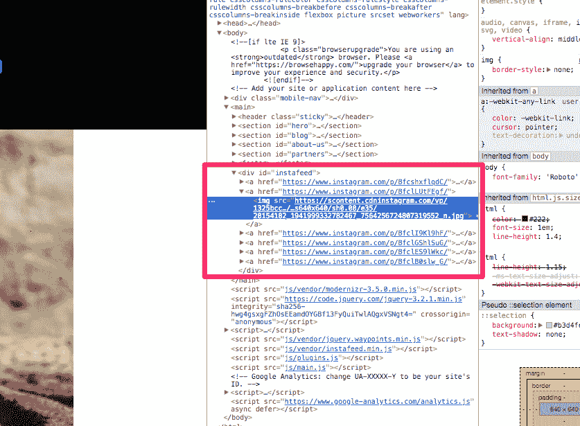

我们的 Google Chrome 检查器

我们可以看到 Instafeed 生成了一个带有``的`<a>`标签。非常简单直接。

知道了这一点，让我们去我们的`styles.css`文件，并在我们的`footer`部分之后写入：

```html
/* INSTAFEED */

#instafeed {
  width: 100%;
  display: flex;
  justify-content: center;
  overflow: hidden;
  background: black;
}

#instafeed a {
  flex-grow: 1;
}
```

为了解释，我们使用：

+   `width: 100%;`因为#instafeed 是包含所有内容的容器。我们希望它占满整个宽度。

+   `display: flex;`因为我们希望水平并排显示缩略图。

+   `justify-content: center;`将内容放置在中心。

+   `overflow: hidden;`因为我们不希望页面水平扩展。

+   `background: black;`因为默认情况下背景是白色的。

最后，但同样重要的是：

+   `flex-grow: 1;`：如果所有项目的`flex-grow`都设置为`1`，则`container`中的剩余空间将均匀分配给所有子项目。如果其中一个子项目的值为 2 或更高，则剩余空间或更多空间将占用其他空间的两倍。

让我们看看现在的样子：

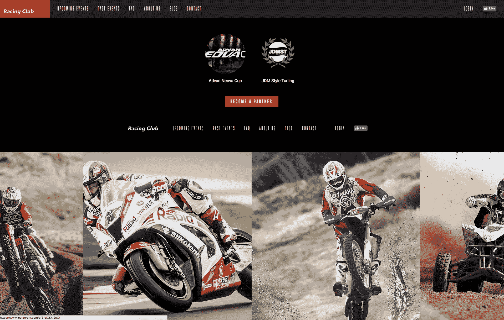

网站工作正在进行中

现在，最后一部分是在悬停时添加不透明度效果。我们将使用我们之前学到的不透明度和伪类`:hover`来进行操作：

```html
#instafeed a {
  flex-grow: 1;
  opacity: 0.3;
}

#instafeed a:hover {
  opacity: 1;
}
```

同样，您只需要在伪类中添加您想要更改的值；在这里，它是不透明度。

让我们也添加一些`transition`：

```html
#instafeed a {
  flex-grow: 1;
  opacity: 0.3;
  transition: opacity 0.3 ease;
}
```

让我们保存并查看：

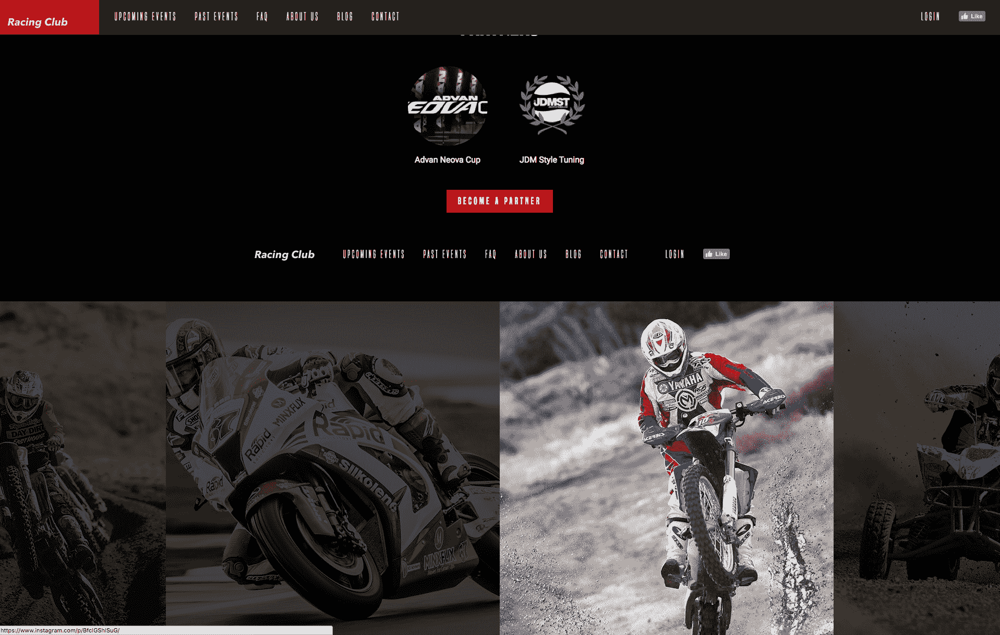

网站工作正在进行中

很好，到目前为止我们做得很好。但是如果您像我一样是一个完美主义者，您会注意到在手机和平板电脑上，图像相当大。让我们添加一些快速响应式 CSS，然后我们就可以结束了：

```html
/* Tablet Styles */
@media only screen and (max-width: 1024px) {
  #instafeed a img {
    max-width: 300px;
  }
}

/* Large Mobile Styles */
@media only screen and (max-width: 768px) {
  #instafeed a img {
    max-width: 200px;
  }
}

/* Small Mobile Styles */
@media only screen and (max-width: 400px) {
  #instafeed a img {
    max-width: 100px;
  }
}

```

我在这里做的是在每个断点上更改图像大小：

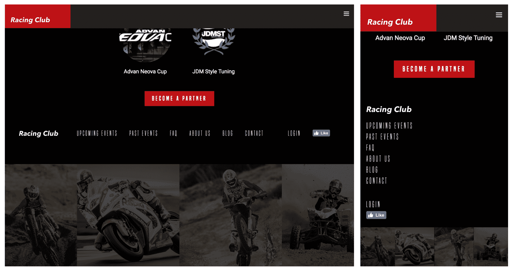

平板电脑和手机视图中的 Instagram Feed

我们现在已经完成了网站的交互和动态内容。

# 总结

显然，您可以在您的网站上做很多事情和添加很多东西。这只是一个可以非常快速实现的小预览。再次强调，您的想象力和决心将是唯一的限制。这是我们在本章中涵盖的内容：

我们已经学习了 CSS 伪类以及它如何帮助不同的动画。我们已经学会了如何使用 CSS 的`@keyframe`来创建动画。我们现在可以用 JQuery 来定位元素并为其添加不同的功能。我们已经学会了如何连接到 API 并使用插件显示信息。

本章内容非常精彩！在下一章中，我们将学习如何优化我们的网站并发布它！
