# 第十章：优化和发布我们的网站

欢迎来到创建我们网站的最后一部分；我们已经走了很长的路。我们的网站看起来非常棒，有一些很酷的动画。在本章中，我们将通过以下方式优化我们的网站：

+   为我们的网站创建和实现一个 Favicon

+   学习如何优化我们的图像

+   学习一些 SEO 基础知识

+   逐步学习如何将我们的网站发布到网上

让我们开始吧！

# 创建一个 Favicon

**Favicons**是你在浏览器标签和书签栏上看到的小图标。它们是任何网站的标识的一部分，让用户认识你的网站：

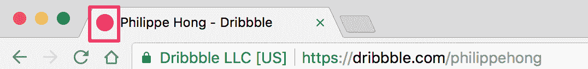

Dribbble 网站的 Favicon

不要跳过这一步。有一个非常简单的在线工具可以做到这一点。我们只需要一个图像作为我们的图标，所以现在就做吧。让我们去[`realfavicongenerator.net/`](https://realfavicongenerator.net/)，这是 Favicon 生成器。通过这个，我们可以为浏览器创建图标，甚至根据它将在其上运行的不同操作系统进行设计。我们只需要选择我们的图像。在这种情况下，我们将使用资产文件夹中提供的标志，并找到图像`Logo_Square.png`。在网站上点击选择您的 Favicon 图片，并上传标志。

这是我们现在拥有的：

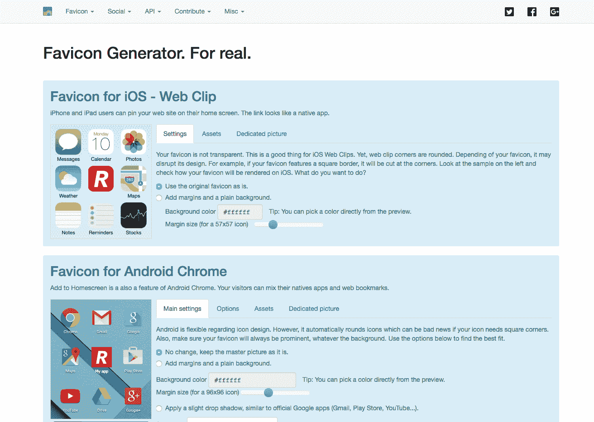

它为我们提供了一堆 iOS、Android 和 Windows 手机的图标，并进行了一些自定义，但这并不是真正重要的。真正重要的是页面底部的内容：

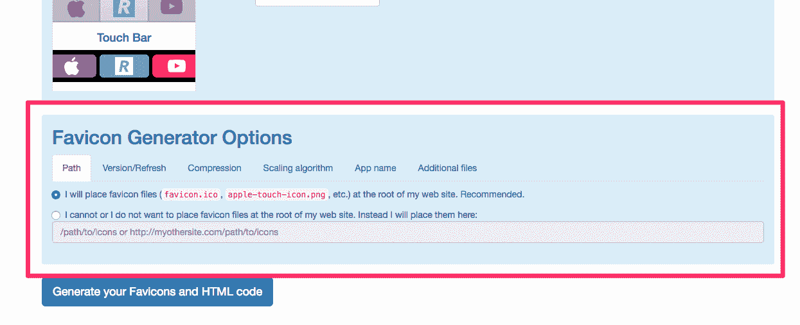

现在我们将点击第二个选项，因为我们想选择一个路径，我们将把我们的图标放在那里，因为我们不想把它们放在根目录，主项目文件夹中。网站建议我们将 Favicon 放在根目录，但我们将指定一个不同的路径，因为将有很多图像，我们希望保持它有组织。让我们在`img`文件夹内创建一个文件夹，并将其命名为`icons`。然后，我们将编辑网站上输入框中的值，并将`/img/icons`作为我们刚刚创建的文件夹。现在，让我们生成 Favicon！首先，我们需要点击*生成您的 Favicons 和 HTML 代码*，这将带我们到另一个页面，然后我们可以点击 Favicon 包以下载它。还提供了一段代码片段，我们可以复制粘贴。

这段代码将被插入到我们网站的`<head>`标签中，就在`<!-- Place favicon.ico in the root directory -->`之后。

现在可以删除 Boilerplate 提供的三行代码了：

```html
<link rel="manifest" href="site.webmanifest">
<link rel="apple-touch-icon" href="icon.png">
<!-- Place favicon.ico in the root directory -->
```

我们的`head`部分现在应该是这样的：

```html
<head>
        <meta charset="utf-8">
        <meta http-equiv="x-ua-compatible" content="ie=edge">
        <title></title>
        <meta name="description" content="">
        <meta name="viewport" content="width=device-width, initial-scale=1">

        <link rel="apple-touch-icon" sizes="180x180" href="/img/icons/apple-touch-icon.png">
        <link rel="icon" type="image/png" sizes="32x32" href="/img/icons/favicon-32x32.png">
        <link rel="icon" type="image/png" sizes="16x16" href="/img/icons/favicon-16x16.png">
        <link rel="manifest" href="/img/icons/site.webmanifest">
        <link rel="mask-icon" href="/img/icons/safari-pinned-tab.svg" color="#5bbad5">
        <link rel="shortcut icon" href="/img/icons/favicon.ico">
        <meta name="msapplication-TileColor" content="#da532c">
        <meta name="msapplication-config" content="/img/icons/browserconfig.xml">
        <meta name="theme-color" content="#ffffff">

        <link href="https://fonts.googleapis.com/css?family=Roboto:400,700" rel="stylesheet">
        <link rel="stylesheet" href="fonts/font.css"> <!-- Font face CSS link -->
        <link rel="stylesheet" href="css/normalize.css">
        <link rel="stylesheet" href="css/animate.css">
        <link rel="stylesheet" href="css/main.css">
        <link rel="stylesheet" href="css/styles.css">
    </head>
```

最后一步是将我们下载的文件复制到我们的`icons`文件夹中。干得好！让我们跳到下一部分，看看如何优化我们网站的性能。

# 网站性能优化

没有人喜欢慢网站；我们都知道这一点。除此之外，页面速度对用户的参与度有真正的影响，因为没有人想等待网站加载。我们已经添加了一些插件和很多图像。现在，让我们开始优化我们的网站，并通过一些加快上传时间的技术让我们的用户更喜欢我们的网站。我们可以做两件非常基本的事情，即优化重图像和压缩 CSS 和 jQuery 代码。让我们来做吧。

# 优化图像

我们必须优化的第一件事是我们的图像，因为图像通常是网页中最重的内容。我们的一些图像非常重，比如我们的主图像，超过 480KB。所有这些图像，加上我们下载网站时，需要很长时间。想象一下，有人在智能手机上使用缓慢的互联网连接尝试下载这个网站。这将花费他们很长时间。所以，让我们减小文件大小。作为第一步，我们可以减小实际图像大小。

我使用一个叫做[TinyJPG](https://tinyjpg.com/)的工具来压缩大型图像。我发现它比 Sketch 或 Photoshop 的集成优化更强大：

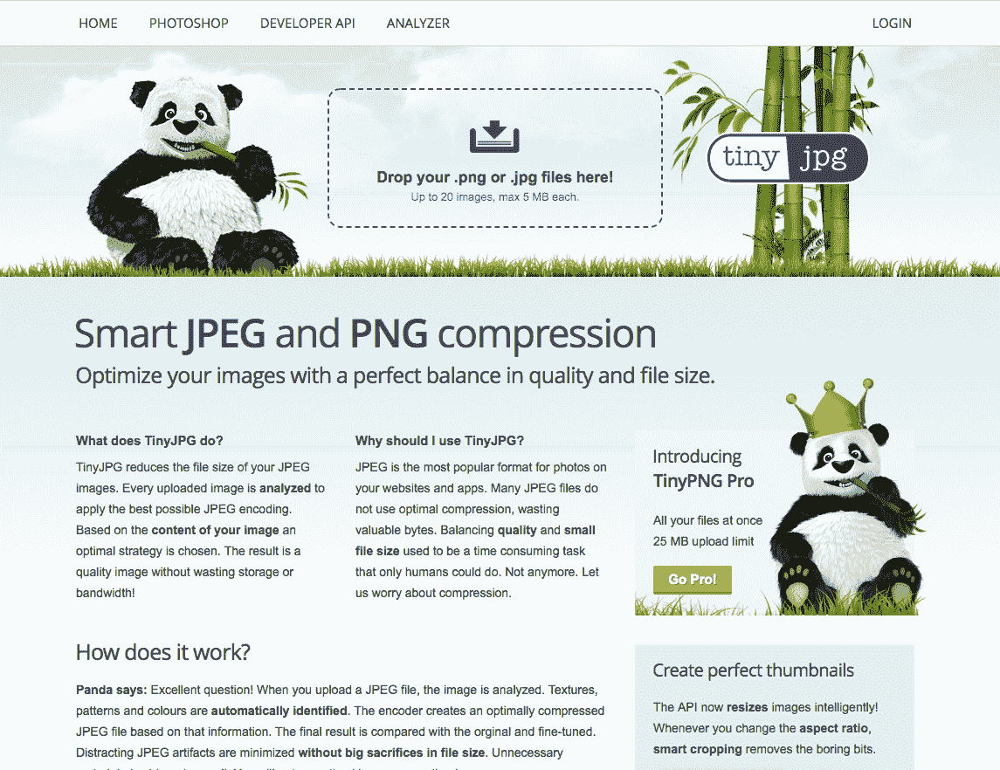

Tinyjpg.com

您需要做的就是拖放您想要压缩的图像。让我们尝试一下我们的`hero-image`，它的大小为 480KB：

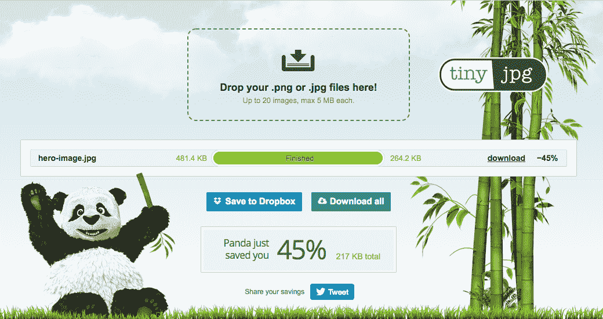

压缩后的 hero-image.jpg

在这里，您可以看到，压缩`hero-image.jpg`后，它现在几乎只有原来的一半大小！不可思议，不是吗？现在我们要做的就是尽可能压缩尽可能多的文件，以减小它们的大小。

# 优化我们的代码

我们还可以对 CSS 和 jQuery 代码进行压缩。这基本上通过删除不必要的空格和优化代码来减小 CSS 和 jQuery 文件的大小。但是，压缩代码使人类阅读变得非常困难，因此我们应该只在准备启动网站时才压缩代码。我使用的一个工具是 Minifier ([`www.minifier.org/`](https://www.minifier.org/))。我们只需将我们的代码粘贴到其中：

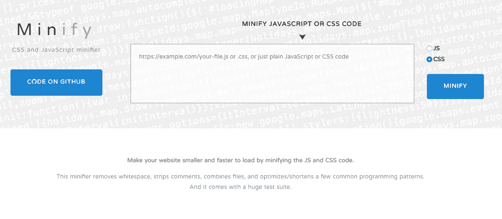

Minifier.org

当我们有大量代码需要压缩时，这种技术实际上更重要；否则，我们将无法节省太多空间。在我们的情况下，我们没有那么多的代码，所以也许没有必要这样做。

如果您想要对代码进行解压缩，还有另一个网站可以使用：[`unminify.com/.`](http://unminify.com/)

现在，让我们继续进行一些非常基本的搜索引擎优化。

# 基本 SEO 改进

**搜索引擎优化**（**SEO**）是一个非常热门的话题。这是因为非常重要，您的网站可以被用户通过搜索引擎（如 Google）找到。

# 什么是搜索引擎优化？

基本上，搜索引擎优化或 SEO 使用一些技术来改进和推广网站，以增加网站从搜索引擎获得的访问者数量。SEO 有许多方面，但我们只会涵盖一些非常基本的内容，使我们的网站能够被搜索引擎找到。

# Meta 描述

首先，最重要的是，我们需要一个网站标题。这对于 SEO 和用户理解网站非常重要。

在您的 HTML 顶部，有一个`<title>`标签，我们要填写它。在这个例子中，我们将添加`Racing Club - Motor Racing Club for passionate`：

```html
<title>Racing Club - Motor Racing Club for passionate</title> 
```

其次，让我们谈谈`meta 描述`标签。这个标签是网站的简短描述，通常用于在搜索结果页面上描述一个网站，就像我们在这个 Dribbble 网站的例子中看到的一样：

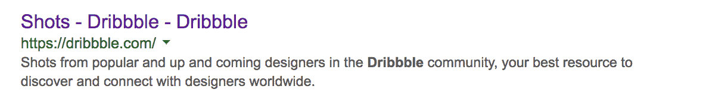

“Dribbble”一词的搜索结果

```html
<meta name="description" content="Shots from popular and up and coming designers in the Dribbble community, your best resource to discover and connect with designers worldwide." />
```

这段文字对网页访问者来说是不可见的，但它可以帮助您为您的网站做广告，从搜索结果中吸引用户访问您的网站。因此，这是搜索营销的一个极其重要的部分。我们应该使用重要关键词来制作引人注目的 meta 描述，但不超过 160 个字符。

现在，让我们为我们的网页做这个；没有比这更容易的了。我们只需使用带有`name="description"`属性的`meta`标签，然后使用我们想要的描述的`content`属性。我们想要添加一些关于 Racing Club 的内容，所以我们会放置类似这样的内容：`“一个由热爱者组成的赛车俱乐部。澳大利亚各地的月度活动。立即购买您的门票。”`在我们的 HTML 中，我们已经预先添加了一个`meta`，所以我们只需要在其中放置描述：

```html
<meta name="description" content="A Racing Club by passionates to passionate. Monthly events in Australia-wide. Buy your ticket now.">
```

您可以在 HTML 的顶部看到这一行：

```html
<meta charset="utf-8">
```

这用于声明网站的字符编码，但它不包括排名，所以与 SEO 无关。不过，这是我们制作每个网站都应该包含的内容。

# 有效的 HTML

我们应该始终编写有效的 HTML 代码。有效的 HTML 代码是遵循官方 HTML 规则并且没有错误的代码。有效的 HTML 被谷歌所青睐，因为它使网站更有可能在我们未经测试的浏览器上运行。它看起来更专业，对可访问性更好，使得屏幕阅读器更容易阅读网站，例如盲人用户。有一个官方工具可以检查我们是否有有效的 HTML 代码，那就是 W3 标记验证器（[`validator.w3.org/`](https://validator.w3.org/)）。我们将使用它来测试我们的网站。为此，我们只需使用命令或*Ctrl* + *A*复制整个代码，然后将其粘贴。在网站 validator.w3 上，我们将使用直接输入验证选项，并在点击检查之前将所有代码粘贴在这里。这需要一点时间，但它告诉我们我们的代码中有八个错误。

在报告中，我们可以看到一些建议：

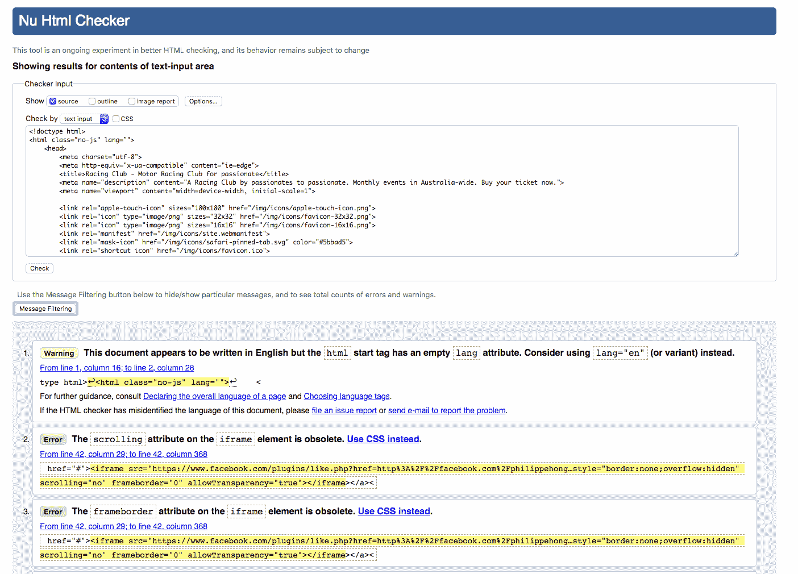

W3 验证器报告

其中一个建议是我们应该尽量遵循报告建议我们做的事情，但是，你仍然可以按照现在的样子启动网站。

起初，它说：

这个文档似乎是用英语写的，但 HTML 起始标记具有空的 lang 属性。考虑使用 lang="en"（或变体）代替。

事实上，建议指定网站的语言，以便搜索引擎可以识别它，并在必要时进行翻译。让我们在我们的`lang`属性中添加`en`值（表示英语）：

```html
<html class="no-js" lang="en">
```

其次，它建议我们去掉我们实现的 iframe 上的一些属性，但也要在 iframe 之前删除`<a>`标签。让我们这样做。

最后，它说：

img 元素必须具有 alt 属性，除非在某些条件下。

`alt`属性是替代属性。它用于在加载照片时描述照片，或者当浏览器无法正确渲染图像时。它还用于谷歌搜索图像，因此非常重要。

让我们为所有的图片添加`alt`属性，例如：

```html

```

现在让我们再次检查我们的代码：

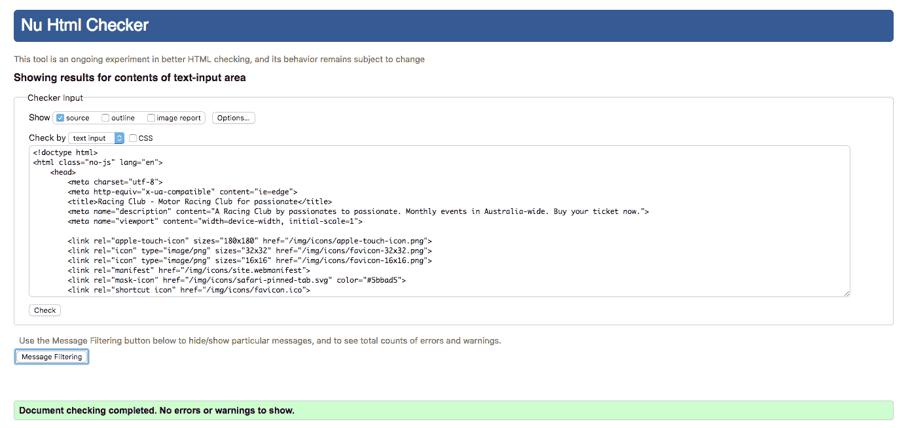

W3 标记检查器上的成功验证

干得好，我们的代码现在已经验证通过了！

# 关键词

接下来要考虑的是*内容为王*。你的网站上有很棒的内容非常重要，即使你的网站是搜索结果中的前几名。如果你的内容不好，你的用户不想阅读它，那么它就毫无价值，即使你排名很高。如果可能的话，继续提供新的内容，这样你的访问者就会想要继续回来。接下来你需要做的是在内容中有策略地放置关键词。这对于在搜索排名中表现良好非常关键，因为关键词是用户实际用来找到你的东西。不过要小心，不要过度使用关键词，因为搜索引擎会认为这是关键词垃圾邮件，他们可能会对你进行惩罚。在标题、meta-description 标签、标题和链接中使用关键词。

# 链接

另一件重要的事情是让其他网站链接到你。这些链接被称为反向链接，就像是给你的网站写推荐信一样。搜索引擎部分地根据指向网站的链接数量和质量对网站进行排名。这是 SEO 的一个关键因素，因此你应该有一个策略来增加指向你网站的反向链接的数量和质量。实际上，关于 SEO 还有很多更多的信息在互联网上。如果你感兴趣，可以查阅一些书籍或互联网上的信息；这是一个充满激情的主题。

至此，优化工作就完成了。让我们继续下一部分，我们将学习如何在互联网上发布我们的网站。

# 启动我们的网站

我们的网站现在已经准备好与世界分享。我们已经走了这么长的路，现在我们几乎到了尽头。发布我们的网站非常容易。我们只需要按照这三个步骤进行即可。

# 购买域名

首先，我们需要选择并购买一个域名。对于我们的网站，可以是[www.racingclub.com](http://www.racingclub.com)。然后，我们需要购买网络托管；把它想象成互联网上的一个文件夹，我们将把所有文件放在其中。为了确保我们的网站运行顺利，我们需要正确的带宽。这是在一定时间内允许的数据传输量。

一旦我们拥有这两样东西，我们只需要将我们的网站上传到我们的网络空间，然后我们就准备好了。有许多域名注册公司和网络托管公司。当然，我不会告诉你应该选择哪一个。我只能告诉你，我曾经用[namecheap.com](http://namecheap.com)注册域名和购买网络托管。那里的服务总是很好，但我不能告诉你它是最好的网络托管，因为我到目前为止还没有尝试过其他服务器。

您可以访问*Namecheap*网站，在购买之前检查您的域名是否可用。这很容易和直接：

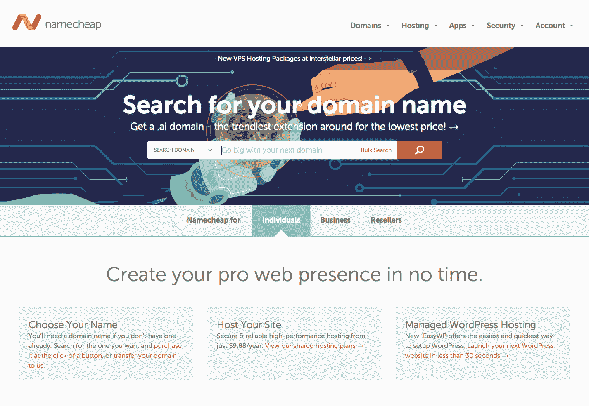

一旦您拥有域名，您需要一个主机。我建议使用相同的提供商获取托管和域名，这样更容易管理。

在购买托管时，您可以选择使用您购买的域名或您自己的域名：

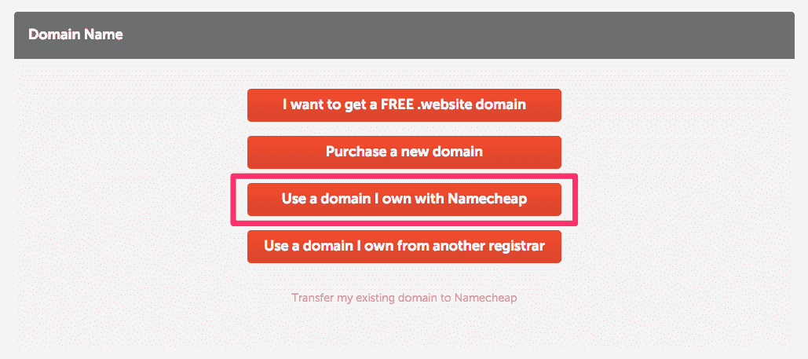

使用 Namecheap 购买托管

一旦您购买了托管并将其链接到您的域名，您将收到一些确认购买的电子邮件，但更重要的是，连接到服务器以及您的**文件传输协议**（**FTP**）的所有凭据。这是用于将文件传输到服务器的协议。要上传我们的文件，我们需要使用这个协议的工具。我总是使用*FileZilla*。易于使用和开源，它可以胜任工作。下一步是下载 FileZilla（[`filezilla-project.org/`](https://filezilla-project.org/)）：

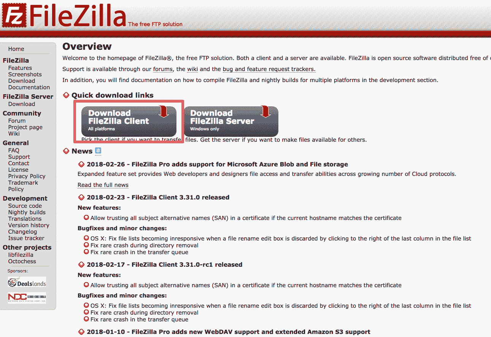

FileZilla 网站

单击下载 FileZilla 客户端，并正确安装 FileZilla。

一旦您在 FileZilla 上，单击文件|站点管理器：

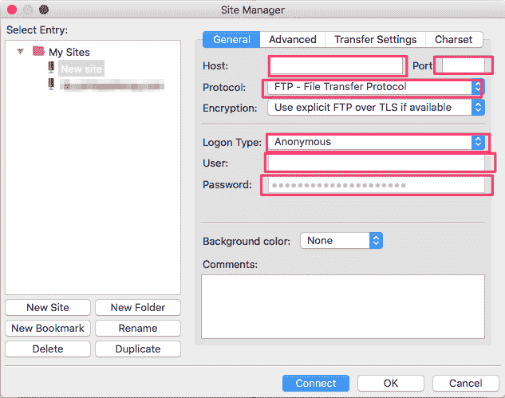

FileZilla 新网站

现在我们需要添加一个新站点，但我们需要找到 Namecheap 发送给我们的凭据。转到您的电子邮件，查找 SFTP 详细信息，它应该看起来像这样：

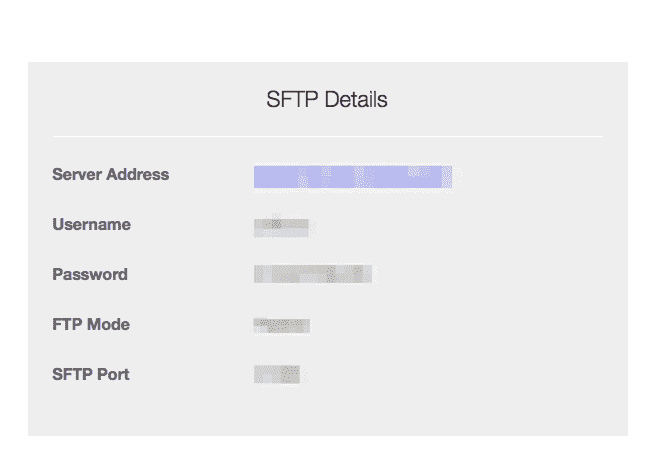

Namecheap SFTP 凭据

查看 SFTP 详细信息的描述，以便输入正确的信息：

+   **主机**：这是服务器地址

+   **端口**：这是端口

+   **协议**：需要设置为 SFTP

+   **登录类型**：设置为正常

+   **用户名**和**密码**：相应地放置

单击连接。

现在你会看到一堆文件夹，各种名称。不要担心它们；寻找`public_html`，因为这将是您的`public`文件夹。一旦进入，您可以删除默认设置的文件。

现在转到`Web Project`，并选择您要放入 FileZilla 的所有文件。*要小心；*所有文件，包括隐藏文件，都需要上传。如果您使用 Windows，您不需要担心这个问题，但对于 Mac 用户，隐藏文件在文件名前面有一个点。要显示隐藏文件，只需使用快捷键*Shift* + *CMD* + *。*来显示我们的隐藏文件：

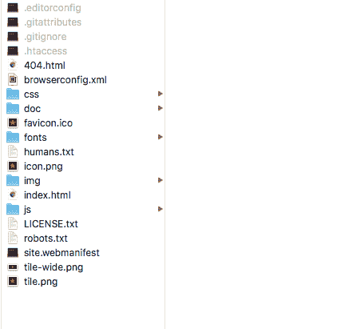

在 macOS 中显示隐藏文件

现在将所有文件拖放到 FileZilla 中。它将自动将它们上传到您的服务器。一旦完成，您的网站现在正式上线了！

这将因托管提供商而异，但通常是相同的过程。如果托管使用 FTP 或 SFTP 传输文件，FileZilla 是一个很好的工具，可以与每个托管一起使用。

# Google 分析

现在我们的网站已经上线，我们仍然可以继续工作，因为上线并不是故事的结束。您唯一需要做的就是网站维护。这意味着您应该跟踪您的网站的成功，并监控您的用户行为。我们如何做到这一点？我们使用一个非常强大的工具，叫做 Google Analytics。使用这个软件，您将能够监控统计数据，比如您的网站接收的访问次数，您的访客停留的时间，每个访客的平均页面浏览量，以及许多其他有用的统计数据：

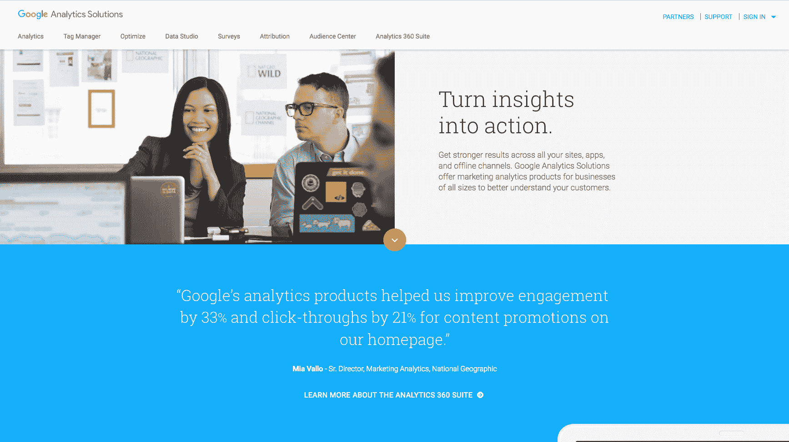

Google Analytics 网站

然后，使用这些数据，您可以对网站进行调整，使其更好。我现在将在刚上传的网站上安装 Google Analytics，以向您展示它有多么简单。您需要先创建一个 Google Analytics 帐户，但如果您已经有 Google 帐户，这很容易。创建了 Google Analytics 帐户后，您需要创建一个帐户以获取跟踪代码：

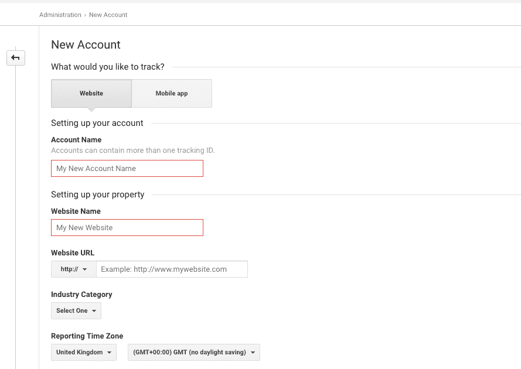

Google 分析中的新帐户

在我们的情况下，这是一个网站，我将称之为“赛车俱乐部”。然后，我们需要将其链接到我们的网站。输入所有必要的信息，然后点击获取跟踪 ID：

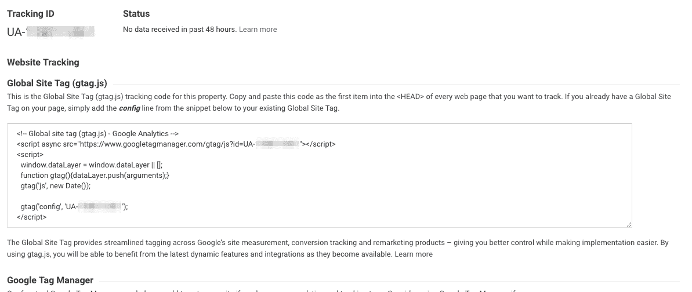

Google Analytics 跟踪代码

现在谷歌已经为您提供了一个代码，可以粘贴到您的网站上。这是一个基本的 JavaScript 代码，所以您可以在所有脚本之后粘贴它。

在我们的 HTML 样板中，留有一个位置用于我们的 Google 分析代码。只需用 Google 提供的代码替换即可：

```html
<script src="img/modernizr-3.5.0.min.js"></script>
        <script src="img/jquery-3.2.1.min.js" integrity="sha256-hwg4gsxgFZhOsEEamdOYGBf13FyQuiTwlAQgxVSNgt4=" crossorigin="anonymous"></script>
        <script>window.jQuery || document.write('<script src="img/jquery-3.2.1.min.js"><\/script>')</script>
        <script src="img/jquery.waypoints.min.js"></script>
        <script src="img/instafeed.min.js"></script>
        <script src="img/plugins.js"></script>
        <script src="img/main.js"></script>

        <!-- Global site tag (gtag.js) - Google Analytics -->
        <script async src="img/js?id=YOUR GOOGLE ANALYTICS CODE"></script>
        <script>
          window.dataLayer = window.dataLayer || [];
          function gtag(){dataLayer.push(arguments);}
          gtag('js', new Date());

          gtag('config', 'YOUR GOOGLE ANALYTICS CODE');
        </script>

```

现在的最后一步是使用 FileZilla 将更新后的文件上传到我们的服务器。只需拖放`index.html`（不要忘记保存！），然后就完成了！

这是对 Google Analytics 的一个非常快速的介绍，但这个工具非常强大，可以设置跟踪网站上的所有内容。这是一个相当漫长的旅程，但我们做到了。现在你实际上可以在互联网上打开一个网页，看到我们一起创建的网站。现在你可以自己做到所有这些。很神奇，不是吗？

# Google 搜索控制台

当一切都完成后，您可以通过告诉谷歌查看您的网站并使用他们的机器人爬行来完成您的上线。为此，我们需要将我们的 URL 添加到谷歌数据库，我们将使用他们的 Google 搜索控制台（[`www.google.com/webmasters/tools/`](https://www.google.com/webmasters/tools/)）来完成这一点。

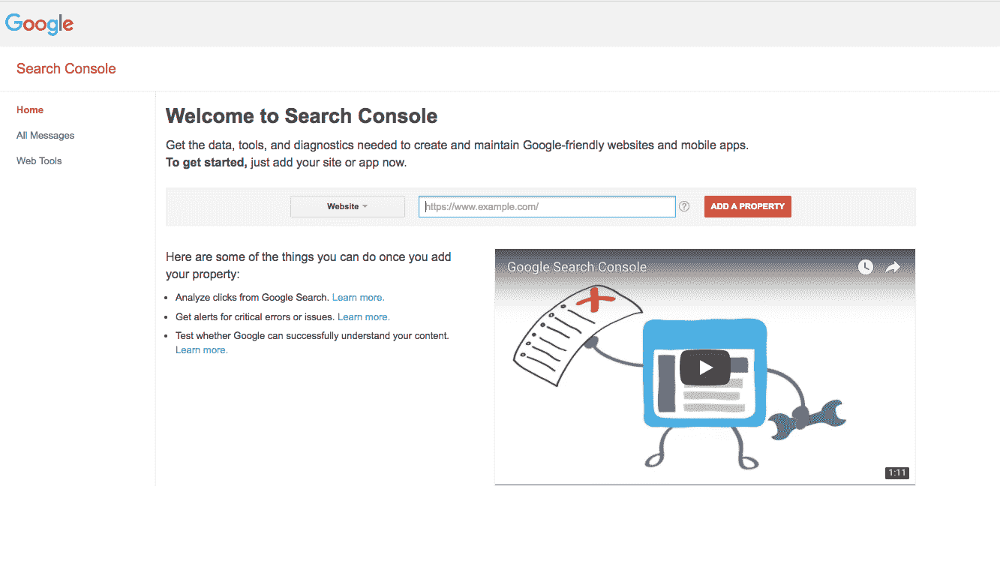

Google 搜索控制台

只需输入您的域名，验证您拥有此域名，然后您就可以了。

# 总结

干得好。在本章中，我们涵盖了相当多的内容。在本章中，我们走过了启动网站的过程。从创建我们的 favicon，压缩我们的图像，缩小我们的 CSS 和 JS 文件，我们还成功验证了我们的 HTML 与 W3 Markup Validator。接着购买我们的域名并将文件上传到我们的服务器。我们通过集成 Google Analytics 并将网站提交给 Google 搜索来完成了本章。我们可以说这是一个非常紧凑的章节！

在下一章中，我们将学习 Bootstrap 是什么，以及为什么开发人员喜欢它。我们还将了解它的组件，学习如何使用 Bootstrap Grid，最后，Bootstrap 如何使用媒体查询。

让我们跳到下一章！
