# 第十一章：什么是 Bootstrap？

现在我们知道如何从头开始构建网站了，我想向您介绍 Bootstrap ([`getbootstrap.com/`](https://getbootstrap.com/))。

在本章中，我们将：

+   了解 Bootstrap 是什么，以及为什么开发者喜欢它

+   阅读 Bootstrap 的文档，了解如何使用它

+   让我们来了解著名的 Bootstrap 网格

+   了解 Bootstrap 如何使用媒体查询

# 什么是 Bootstrap？

Bootstrap 是一个开源的 HTML、CSS 和 JS 库，可以帮助您轻松构建网站和应用程序。它是一个组件库，您可以重复使用这些组件，而不是一遍又一遍地重新创建每个组件。Bootstrap 是响应式和移动优先的；这基本上就是 Bootstrap 的全部内容，也是为什么它在网页开发者中如此受欢迎的原因。现在，假设开发者为不同的设备创建了不同版本的网站；只需在页面上应用少量代码，网站就可以在任何设备上正确显示，这节省了时间和额外的成本。

每隔几年就会有重大更新。Bootstrap 2 于 2012 年正式发布，然后相对较快地被 Bootstrap 3 取代，后者于 2013 年发布。然后，当然，2016 年出现了 Bootstrap 4。它变得越来越稳定，发布之间的间隔也越来越长。希望不久之后 Bootstrap 5 就会到来。

Bootstrap 4 仍然非常新，所以很多开发者仍在使用 Bootstrap 3：

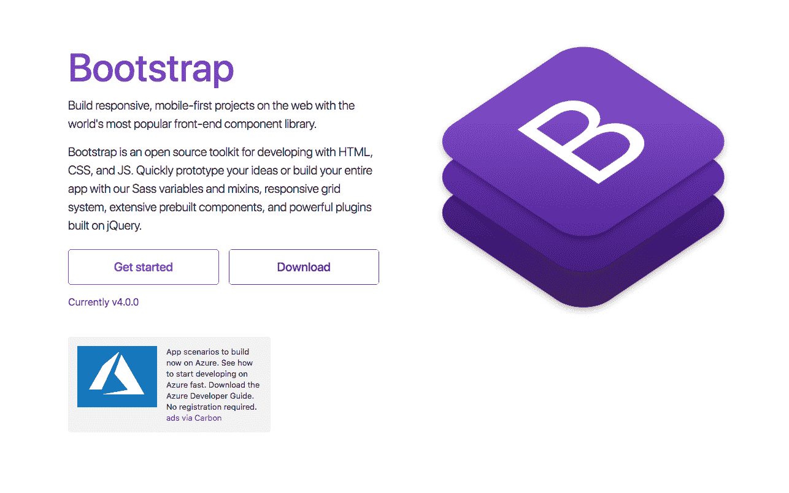

Bootstrap 网站

在框架内，还有许多元素和组件，您可以在您的网站或页面中使用。文档选项卡中的所有内容都是必不可少的；它包含了您可以随时参考的宝贵信息，也是您想要了解新元素或组件的地方：

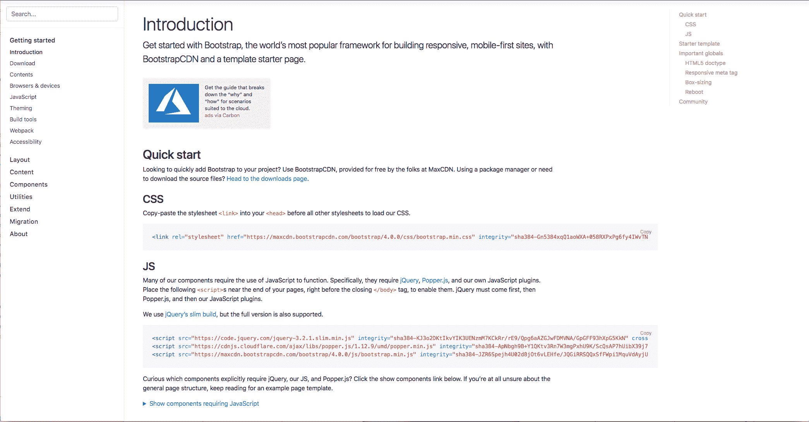

Bootstrap 文档

它从 Bootstrap 的介绍开始，包括了您开始所需的所有信息。然后，在左侧，它提供了所有的部分和组件。这可能是您将查看的最受欢迎的部分之一，因为它包含了您可以在 Bootstrap 中使用的所有不同元素。因此，这可以帮助您构建您的页面。

Bootstrap 还提供了一些示例或快速开始示例，这些都在示例选项卡中。这些是在您完成本章后练习或测试的想法，这样您就可以将新想法应用到自己的页面中，并测试您在整个章节中学到的内容：

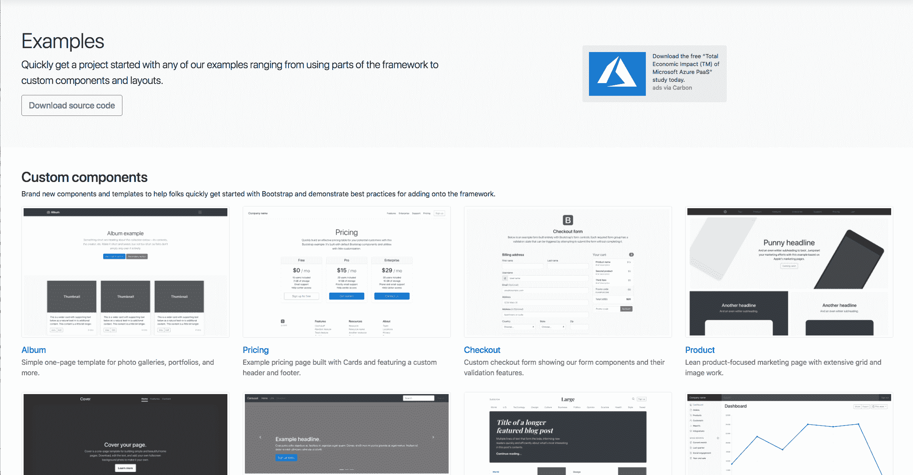

Bootstrap 示例。

值得将此页面加为书签，或者将来再次访问。现在，另一个值得关注的重要部分是 Bootstrap 博客；这是所有更新发布的地方，无论大小。因此，最好随时关注，以防发生可能会影响您网站的变化。

因此，简而言之，这只是对 Bootstrap 网站的一个快速概述。值得将组件页面加为书签，以便将来需要时可以快速查阅。接下来，我们将更仔细地看看这些组件是什么，以及我们将如何使用它们。

# 组件

让我们来看看我们的 Bootstrap 文档 ([`getbootstrap.com/docs/4.0/getting-started/introduction/`](https://getbootstrap.com/docs/4.0/getting-started/introduction/))，更具体地说是组件部分。这位于文档选项卡上，包含了您在使用 Bootstrap 编写网站时将使用的许多元素：

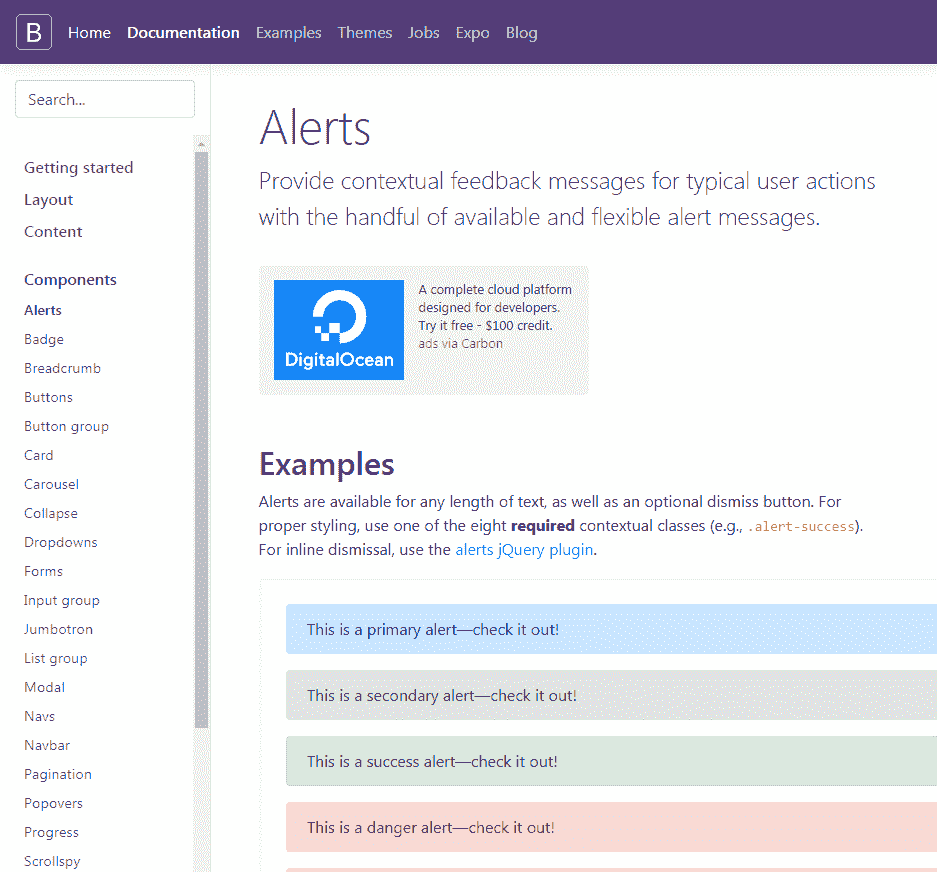

Bootstrap 组件

这些都按字母顺序列出，因此您可以轻松找到所需的内容。例如，如果我们只看看按钮，这提供了您在 Bootstrap 中开始使用按钮所需的所有信息。默认按钮有它们自己的样式类；我们可以在这里看到有主要、次要、成功、危险、警告、信息、浅色、深色和链接：

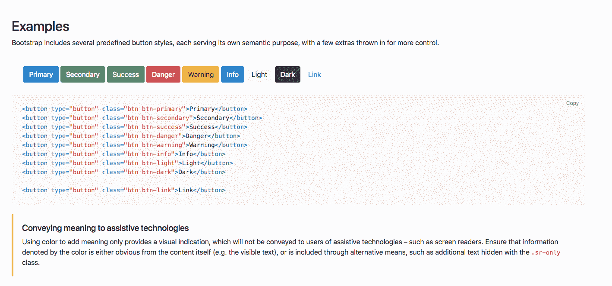

Bootstrap 按钮

要将这些按钮中的任何一个添加到您的页面，您可以使用此处提供的代码，或者如果您想要一个按钮的轮廓，例如，如果我们向下滚动，您会看到轮廓按钮也有自己的类。您只需要添加此代码以添加轮廓按钮：

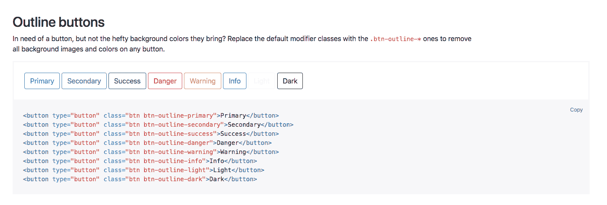

Bootstrap 轮廓按钮

如果我们继续向下滚动，您会看到有许多不同的按钮选项可用。当然，您可以只添加一个标准按钮并手动启动它，但这些示例是快速在页面上使用按钮的好方法。

现在，显然，按钮并不那么令人兴奋；这只是 Bootstrap 中有多少细节以及在 Bootstrap 中编码时有多少支持的一个例子。让我们看另一个例子，比如表单。我们在右侧有所有我们的表单内容。让我们点击内联表单，例如；我们可以看到所有描述内联表单选项的信息，以及您需要添加到页面的代码：

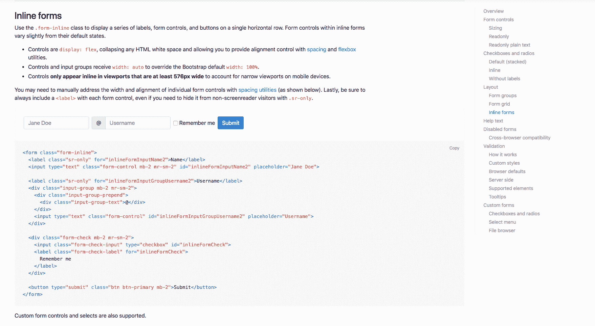

内联表单

如果您选择另一个，例如导航栏，这将显示在向页面添加导航栏时可以使用的所有不同选项。它从基础开始，然后说明导航栏需要一个导航栏类，并且默认情况下是流体的。这只是意味着它们会延伸到整个页面的宽度。然后，它继续描述导航栏的不同元素，包括添加您的品牌、不同的颜色方案以及如何使您的导航栏响应式。有很多信息可以帮助确保您在需要时可以快速上手。如果您愿意，随时查看这些组件。将来使用时，将这个页面加入书签肯定是值得的。

当我们开始构建我们的页面时，我们显然会更详细地讨论。接下来，我们将继续并查看 Bootstrap 网格系统。

# Bootstrap 网格系统

Bootstrap 之所以如此受欢迎的主要原因之一是其响应式特性。现在，Bootstrap 建立在一个网格系统上，并且基于一组 12 列。如果您只是跳转到 Bootstrap 网站上的文档，然后进入布局部分，然后进入网格部分，我们可以更仔细地看一下：

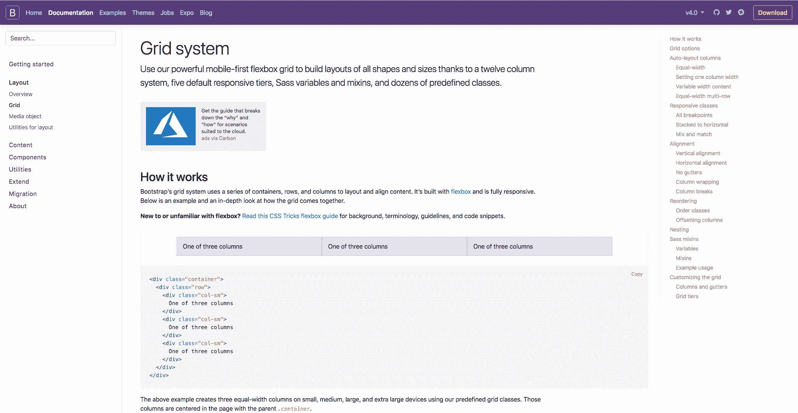

Bootstrap 网格

Bootstrap 包含三种不同的组件；它们是列、容器和行。基本上，容器保存内容，行对齐内容，列决定内容在该行上如何分割。如果您对网格系统没有经验，不要担心太多，因为当您逐步学习并获得实际经验时，一切都会变得清晰起来。为了最好地说明网格系统的内容，我们可以看一下接下来页面上的响应式类部分。我觉得这是对网格系统内容的最好解释：Bootstrap：

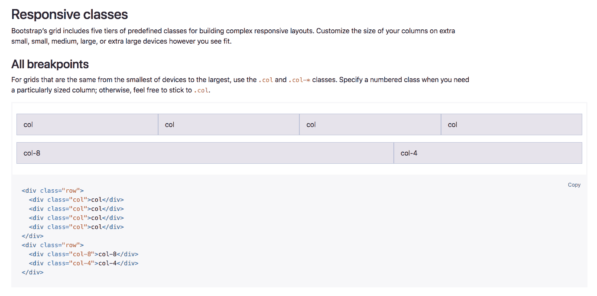

Bootstrap 中的响应式类

有五个预定义类的层次结构，用于构建复杂的响应式布局。在这个例子中，我们可以看到正在使用新的`col`类。这意味着在这一行中，我们基本上有四列，并且每个元素占据 12 列行中的特定列数。

在第一种情况下，每个元素占据 12 列行中的三列，因为 3 可以整除 12 四次。这个布局在所有设备上也是一样的，从超小型设备一直到超大型设备。如果您愿意，您还可以定义您想要在行中占据的列数，这在这个例子中是在第二行中。

因此，第一部分内容将占用`8`列，下一个将占用`4`列。同样，无论屏幕尺寸如何，它都将填满整个 12 列。Bootstrap 之所以如此受欢迎，是因为它具有响应式特性，某些元素在较小的设备上堆叠，而在较大的设备上沿着行对齐。为此，我们只需要在我们的列类中定义设备大小：

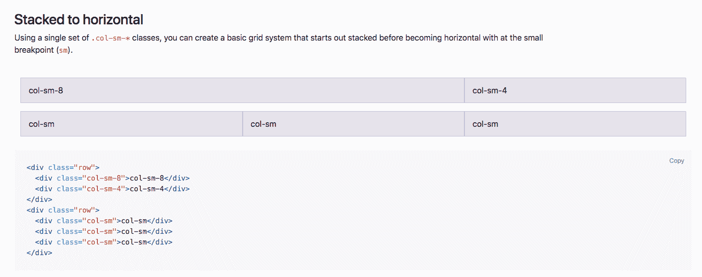

响应式特性

在下一个示例中，您可以看到通过使用`sm`类或小类，内容是相似的，因为顶部有`8`和`4`，然后下一行切换为三个部分。然而，在实际的示例中，两者的内容在较小的设备上实际上会堆叠，当断点达到较小设备以上时，它将沿着行显示。在本页中有关网格系统的更多信息，但是，正如我提到的，随着我们逐步学习本章内容，您很快就会习惯它的工作方式。

我希望这能稍微解释一下网格系统，但是，正如我所说的，通过在下一章中使用它，您很快就会掌握它。接下来，我们将看一下 Bootstrap 媒体查询。

# 媒体查询

Bootstrap 最好的一点是，您可以将媒体查询整合到您的 CSS 文件中，这实质上让您可以从特定的项目或断点开始，并帮助您针对特定设备定位样式。如果您首先转到文档选项卡，然后转到布局部分，然后我们只需要稍微向下滚动到响应式断点部分。我们可以在这里看到我们的媒体查询。我们可以看到断点很重要，因为这些通常用作查询的指南，因此您可以确定您想要为哪个设备设置样式：

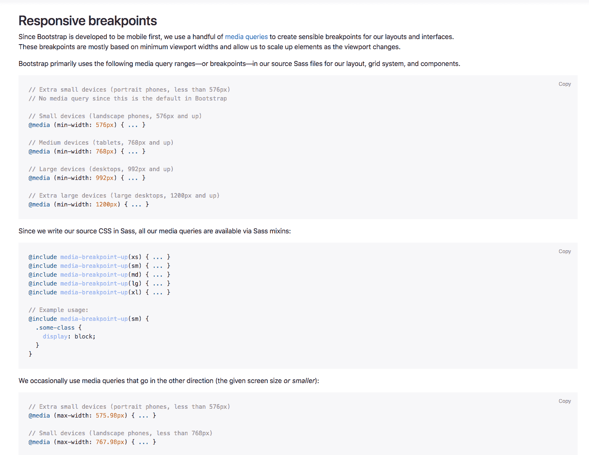

响应式断点

在这段代码的第一部分中，我们有所有断点的媒体查询，除了超小型设备。这使用了`min-width`命令。如果我们稍微向下滚动，我们会看到除了超大型设备之外，我们有所有断点，这些使用了`max-width`命令。不同之处在于，如果您首先为移动设备设计，则倾向于使用`min-width`选项，如果您首先为桌面设计，则倾向于使用`max-width`：

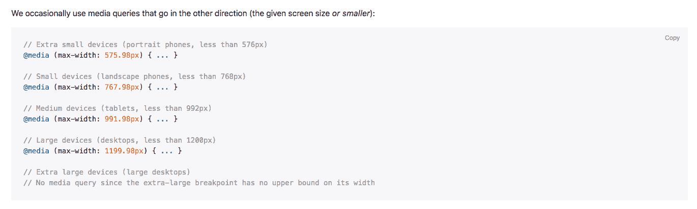

最大宽度命令

通常，我倾向于使用`max-width`，并且我倾向于首先为桌面设计，然而；了解两者都是很好的，以防您需要首先为移动设备设计。

这是对媒体查询的简单介绍；再次，随着我们课程的进行，您会更好地理解这一点，但我希望这能稍微解释一下，这样当我们真正开始时，您就有了基本的理解。

# 摘要

在本章中要记住的重要点是，Bootstrap 就像是开发人员可以轻松重复使用的组件库。通过了解它们（网格、组件、媒体查询），您将能够实现很多，而不是从头开始构建网站时。

接下来，我们将使用 Bootstrap 设计我们的页面，并逐步学习如何使用它。
