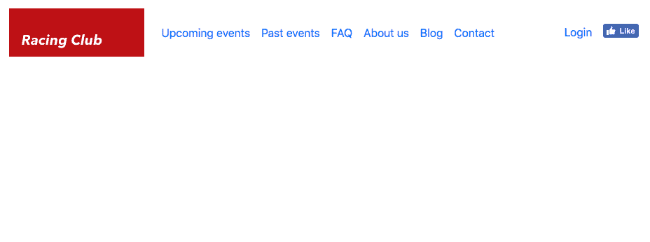

# 第十二章：使用 Bootstrap 构建网站

我们刚刚看到了 Bootstrap 有多么强大。有了一个可以重复使用的广泛组件和元素列表，它可以使我们的开发阶段非常容易，这就是为什么开发人员喜欢它。在本章中，我们将讨论如何使用 Bootstrap 框架构建我们的网站，具体步骤如下：

+   学习如何在项目中设置 Bootstrap

+   创建和设计我们的导航栏

+   继续英雄部分

+   创建和设计博客部分

+   创建和设计关于部分

+   完成页脚

我们将从头开始创建项目，并创建与之前创建的相同页面，以比较我们最初的技术与 Bootstrap 技术。让我们开始吧！

# 安装 Bootstrap

我们需要做的第一件事是下载 Bootstrap。有多种下载方式。让我们前往下载页面查看一下。在主页上点击下载按钮。现在你可以查看不同的下载最新版本 Bootstrap 的方法：


下载 Bootstrap

第一种方法是下载编译后的 Bootstrap 版本。你的版本将取决于你学习这门课程的时间，但总是选择最新版本的 Bootstrap。

你也可以下载包含所有文件的 Bootstrap 源版本，但大多数情况下，你只需要编译后的文件，因为这样更快更容易让 Bootstrap 运行起来。

如果你向下滚动一点，你会注意到 BoostrapCDN。Bootstrap 还提供了一个内容传送网络（CDN），它将在服务器上托管最新版本的 Bootstrap，因此你可以只粘贴 URL 而无需在服务器上托管文件。这很好，因为你的用户不需要再次下载文件，因为他们可能已经通过访问使用 Bootstrap 的其他网站下载了文件。

# 设置我们的项目

要开始，让我们创建一个名为`Racing Club Bootstrap`的文件夹。在 Atom 中，我们将打开一个新窗口，点击添加项目文件夹...，并找到`Racing Club Bootstrap`。

在里面，让我们创建我们的`index.html`文件。点击创建新文件（*Ctrl* + *N*或*Cmd* + *N*），并保存它，这样我们就可以将文件命名为`index.html`。

完成后，让我们前往 Bootstrap 网站（[`getbootstrap.com/docs/4.0/getting-started/introduction/`](http://getbootstrap.com/docs/4.0/getting-started/introduction/)），具体来说是“Introduction”部分。

在这一部分，Bootstrap 为你提供了一个启动项目的模板：


启动模板

复制提供的代码并粘贴到你的`index.html`文件中。我们可以从模板中删除`<h1>Hello, world!</h1>`。

我们准备好开始了，但我们也想写自己的 CSS。为此，让我们创建一个名为`css`的文件夹和一个名为`styles.css`的 CSS 文件。

为了快速做到这一点，你可以右键单击 Atom 中的左侧栏，然后点击新建文件夹，如下截图所示：


在 Atom 中创建一个文件夹

当你创建 CSS 文件时，你总是需要将它链接到你的 HTML 文件中，否则它不起作用。如果你记得链接它，你将需要添加以下代码：

```html
<link rel="stylesheet" href="css/styles.css">
```

既然我们已经创建了我们的 CSS 文件并将其链接到我们的 HTML 文件中，我们需要做的最后一件事就是复制我们在上一个项目中创建的`img`和`fonts`文件夹。这更容易，因为我们将重新创建相同的页面。只需将这些文件夹复制粘贴到我们的新项目中。

不要忘记将字体 CSS 链接到你的 HTML 文件中。在你的`styles.css`之前添加它：

```html
<link rel="stylesheet" href="fonts/font.css">
```

安装 Google 字体 Roboto：

```html
<link href="https://fonts.googleapis.com/css?family=Roboto:400,700" rel="stylesheet">
```

既然我们都准备好了，让我们开始吧。

# Bootstrap 导航栏

我们将首先创建的是 Bootstrap `navbar`。Bootstrap 中的`navbar`是 Bootstrap 框架中最具标志性的特性之一，因为它的工作方式。因此，为了提供一个它的工作方式的示例，如果我们导航到 Bootstrap 网站，然后到文档选项卡，我们会看到屏幕顶部的所有导航元素：

！[](img/c78be0f0-5ca3-4ec2-8f7e-a1087a470fbd.png)

Bootstrap 导航

如果我们缩小浏览器，我们可以看到导航也在缩小。然后，当它达到较小的屏幕时，我们会得到这个汉堡菜单，如果我们点击它，它会显示其中的导航元素：

！[](img/8c3ee499-9e69-44e7-a6d1-eeac3e734a44.png)

Bootstrap 移动导航

# 编写 Bootstrap 导航

现在让我们转到 Bootstrap 网站上的组件中的`navbar`部分。在这里，您可以找到使用 Bootstrap 构建导航所需的所有文档。

现在让我们回到我们的 HTML 文件，并写入以下代码：

```html
<nav class="navbar navbar-expand-lg fixed-top ">

</nav>
```

上述代码的细节如下：

1.  我们首先在内容的主体中添加了我们的`<nav>`元素，所有`<nav>`元素都需要一个`navbar`类。

1.  然后，我们添加了新的扩展类，即`navbar-expand-lg`。这基本上告诉浏览器何时折叠`navbar`，何时扩展它。

1.  因此，在这种情况下，当它达到大屏幕时，它将展开并显示桌面版本。如果我们想在中等屏幕上展开，那么我们只需要将`lg`更改为`md`，或者对于较小的屏幕，更改为`sm`。

1.  然后，我们添加了定位类，因为我们希望这个`navbar`固定在屏幕顶部，所以当用户滚动时，导航始终可见，我们只需添加`fixed-top`类。

接下来，让我们添加一些导航选项：

```html
<nav class="navbar navbar-expand-lg fixed-top ">
      <div class="collapse navbar-collapse" id="navigation-bar">

      </div>
    </nav>
```

在这段代码中，我们简单地标识了以下内容：

1.  我们添加了一个带有`collapse`类的`div`。这只是告诉浏览器，这个`div`及其所有内容将是可折叠的元素。

1.  然后，我们添加了一个`navbar-collapse`类。

1.  最后，我们添加了一个将在稍后链接到我们的切换按钮的`id="navigation-bar"`。

现在我们需要添加我们的导航列表，包括`<ul>`和`<li>`用于列表，以及每个链接的`<a>`：

```html
<nav class="navbar navbar-expand-lg fixed-top ">
      <div class="collapse navbar-collapse" id="navigation-bar">
        <ul class="navbar-nav">
          <li class="nav-item"><a class="nav-link" href="upcoming.html">Upcoming events</a></li>
          <li class="nav-item"><a class="nav-link" href="past.html">Past events</a></li>
          <li class="nav-item"><a class="nav-link" href="faq.html">FAQ</a></li>
          <li class="nav-item"><a class="nav-link" href="about.html">About us</a></li>
          <li class="nav-item"><a class="nav-link" href="blog.html">Blog</a></li>
          <li class="nav-item"><a class="nav-link" href="contact.html">Contact</a></li>
        </ul>
      </div>
    </nav>
```

为了使导航正常工作，我们需要在`<ul>`上使用`.navbar-nav`类，在`<li>`上使用`nav-item`类。最后，我们需要在`<a>`标签上使用`.nav-link`类。

现在让我们在浏览器中检查一下我们的列表：

！[](img/94dfd980-0930-46ae-850c-dc26b0b0ab45.png)

我们导航的工作进展

我们有了 Bootstrap 导航，但是如果将页面缩小到移动视图，您会注意到导航消失了。这是因为我们还没有包含我们的切换按钮，所以现在让我们添加它。

回到我们的`index.html`，我们可以在创建的`div`上方添加我们的按钮。让我们创建一个按钮标签，并给它`.navbar-toggler`类和指示，如下所示：

```html
<button type="button" class="navbar-toggler" data-toggle="collapse" data-target="#navigation-bar">

</button>
```

`data-target`属性是我们之前所拥有的导航选项的链接方式，即`#navigation-bar`ID。

现在我们需要在这个按钮内添加汉堡菜单。为此，我们可以使用`≡`的 HTML 代码，这是三条杠图标的 HTML 代码。有很多可用的 HTML 符号，您可以使用。您可以搜索 HTML 符号，那将为您提供很多示例和符号。

让我们添加一个带有`.navbar-toggler-icon`类和 HTML 符号的`span`标签：

```html
<button type="button" class="navbar-toggler" data-toggle="collapse" data-target="#navigation-bar">
 <span class="navbar-toggler-icon">≡</span>
</button>
```

现在，如果我们保存并检查，我们可以在移动屏幕上看到我们的菜单图标，如果我们点击它，菜单将正确显示：

！[](img/6786a443-f0fb-406d-9dd1-312be245c07b.png)

移动导航。

现在让我们在我们的`navbar`中添加标志。通常，标志是一个链接，所以让我们添加一个带有`.navbar-brand`类的`<a>`标签。

我们不希望标志在移动视图上折叠，所以我们只需在`<button>`之前添加`<a>`：

```html
<nav class="navbar navbar-expand-lg fixed-top ">

      <a class="navbar-brand" href="#"></a>

      <button type="button" class="navbar-toggler" data-toggle="collapse" data-target="#navigation-bar">
        <span class="navbar-toggler-icon">☰</span>
      </button>

      <div class="collapse navbar-collapse" id="navigation-bar">
        <ul class="navbar-nav">
          <li class="nav-item"><a class="nav-link" href="upcoming.html">Upcoming events</a></li>
          <li class="nav-item"><a class="nav-link" href="past.html">Past events</a></li>
          <li class="nav-item"><a class="nav-link" href="faq.html">FAQ</a></li>
          <li class="nav-item"><a class="nav-link" href="about.html">About us</a></li>
          <li class="nav-item"><a class="nav-link" href="blog.html">Blog</a></li>
          <li class="nav-item"><a class="nav-link" href="contact.html">Contact</a></li>
        </ul>
      </div>

    </nav>
```

在这个`<a>`中，我们添加了以下内容：

1.  一个`.navbar-brand`类

1.  与我们的标志相关联的`img`标签

1.  在这个`img`中，我们添加了一个`.img-fluid`类，使这个图像具有响应性

我们现在设置了我们的标志，但还没有完成。我们需要添加右侧导航。为此，我们只需要在`<ul class="navbar-nav">`之后添加另一个`<ul>`：

```html
<div class="collapse navbar-collapse" id="navigation-bar">
        <ul class="navbar-nav">
          <li class="nav-item"><a class="nav-link" href="upcoming.html">Upcoming events</a></li>
          <li class="nav-item"><a class="nav-link" href="past.html">Past events</a></li>
          <li class="nav-item"><a class="nav-link" href="faq.html">FAQ</a></li>
          <li class="nav-item"><a class="nav-link" href="about.html">About us</a></li>
          <li class="nav-item"><a class="nav-link" href="blog.html">Blog</a></li>
          <li class="nav-item"><a class="nav-link" href="contact.html">Contact</a></li>
        </ul>

        <ul class="navbar-nav ml-auto">
 <li class="nav-item"><a class="nav-link" href="login.html">Login</a></li>
 <li class="nav-item"><span class="nav-link"><iframe src="img/like.php?href=http%3A%2F%2Ffacebook.com%2Fphilippehongcreative&width=51&layout=button&action=like&size=small&show_faces=false&share=false&height=65&appId=235448876515718" width="51" height="20" style="border:none;overflow:hidden"></iframe></span></li>
 </ul>
      </div>
```

我们添加了`.ml-auto`类来将第二个导航移到右侧。这代表着`margin-left`自动。它填充了导航左侧的边距，这将有效地将其移动到右侧。如果你想要相反的效果，你只需添加`.mr-auto`类。

现在让我们来看看我们的导航：



Bootstrap 导航

我们的导航看起来很棒，我们已经拥有了导航栏所需的所有元素。接下来，我们将添加一些样式。

# 样式化我们的导航栏

样式化 Bootstrap 组件非常简单。我们唯一需要做的就是覆盖 Bootstrap CSS。但是，我们不想覆盖 Bootstrap CSS 文件本身；我们想要做的唯一事情就是添加额外的 CSS 属性，这些属性将覆盖原始的 Bootstrap CSS。我们之前创建了一个名为`styles.css`的 CSS 文件，并且，由于这个文件在 HTML 文档中按顺序链接到 Bootstrap CSS 文件之后，我们编写的每个具有相同属性和类的 CSS 都将覆盖原始的 Bootstrap CSS：

```html
<link rel="stylesheet" href="https://maxcdn.bootstrapcdn.com/bootstrap/4.0.0/css/bootstrap.min.css" integrity="sha384-Gn5384xqQ1aoWXA+058RXPxPg6fy4IWvTNh0E263XmFcJlSAwiGgFAW/dAiS6JXm" crossorigin="anonymous">
<link rel="stylesheet" href="css/styles.css">
```

我们需要定位正确的 CSS 类来覆盖它。如果您记得，我们使用了谷歌 Chrome 的检查器来检查元素并检查它们的 CSS。要打开检查器（或开发工具），右键单击元素，然后单击检查：


在 Chrome 上检查元素

现在我们可以看到开发者面板，那里有很多信息。您可以检查不同的面板。当在 HTML 中悬停在一个元素上时，您可以看到它显示在网页上：


谷歌 Chrome 检查器

当您想要修复任何 CSS 样式问题或查看 HTML 时，这非常有用。现在让我们修复 CSS。

通过检查器，我们可以看到`.navbar`类默认有一些填充，但我们想要摆脱它。

只需将以下 CSS 添加到您的`styles.css`中：

```html
.navbar {
  padding: 0;
}
```

保存后，您可以检查我们用自己的样式覆盖了 bootstrap CSS：


覆盖 Bootstrap CSS

现在您了解了原理，我们可以快速修复导航：

```html
.navbar {
  padding: 0;
  background-image: linear-gradient(0deg, rgba(0,0,0,0.00) 0%, rgba(0,0,0,0.50) 50%);
}

.navbar-brand {
  padding: 0;
}

.navbar-nav li a {
  color: white;
  text-decoration: none;
  font-family: 'built_titling', Helvetica, sans-serif;
  font-weight: 200;
  font-size: 20px;
  letter-spacing: 4px;
}

.navbar-collapse {
  padding: 10px 15px;
}

@media (min-width: 992px) {
  .navbar-collapse {
    padding: 0;
  }
}

.navbar-toggler-icon {
  color: white;
}
```

上面的代码将正确地为`navbar`添加样式。您可以看到一切都很正常，而且没有太多的代码，甚至是响应式的部分。这就是 Bootstrap 的强大之处。如果我们比较一下我们为了使导航栏响应而做的工作，使用 jQuery 和所有媒体查询，我们写的代码比我们为*第一个项目*写的要少得多。现在让我们继续进行英雄部分的工作。

# 样式化英雄部分

现在我们了解了如何使用 Bootstrap，我们可以开始使用 Bootstrap 库中的其他组件：

```html
<!-- HERO SECTION -->

    <div class="hero position-relative overflow-hidden d-flex align-items-center">
      <div class="container">
        <div class="col-md-7 my-auto">
          <p class="lead font-weight-normal">13.05.17</p>
          <h1 class="display-2 font-weight-normal custom-font-title">WAKEFIELD PARK</h1>
          <a class="btn btn-primary" href="#">Book now</a>
        </div>
      </div>
    </div>

<!-- END HERO SECTION -->
```

让我解释一下上面的代码片段。

对于*第一个*`div`，它如下所示：

1.  我们首先设置了一个自定义类`.hero`，这样我们就可以在父元素中应用自定义代码。

1.  我们添加了 Bootstrap 提供的实用类`.position-relative`和`.overflow-hidden`，这样我们就不必在 CSS 中应用它们。

1.  类`.d-flex`将设置`display: flex`。

1.  实用类`.align-items-center`将使子元素垂直居中对齐。

1.  我们添加了一个自定义字体`.custom-font-title`，这样我们就可以为每个元素添加自定义字体。

然后我们应用了*第二个*`div`，使用`.container`类，这样我们就可以应用 Bootstrap 默认的`container`类。

以下类都是 Bootstrap 库的一部分。您可以在 Bootstrap 网站上看到它们。

接下来是自定义我们添加的`.hero`类：

```html
.hero {
  width: 100%;
  height: 700px;
  background-image:
    linear-gradient(to bottom, rgba(0,0,0,0.3) 0%,rgba(0,0,0,0.4) 100%),
    url("../img/hero-image.jpg");
  background-repeat: no-repeat;
  background-size: cover;
  background-position: center;
  color: white;
}
```

保存，并查看我们的成果：


英雄部分的预览

现在让我们为其添加最后的修饰：

```html
.custom-font-title {
  font-family: 'built_titling', Helvetica, sans-serif;
  font-weight: 400;
}

.btn-primary {
  font-size: 18px;
  letter-spacing: 4.5px;
  background: #BF0000;
  color: white;
  font-family: 'built_titling', Helvetica, sans-serif;
  font-weight: 400;
  padding: 12px 22px;
  border: none;
  outline: none;
  transition: all 0.3s ease;
  border-radius: 0px;
}

.btn-primary:hover {
  background: #A3171B;
}

.btn-primary:active {
  box-shadow: inset 0px 8px 4px rgba(0, 0, 0, 0.25);
  background: #A3171B!important;
  box-shadow: none!important;

}

.btn-primary:focus {
  box-shadow: inset 0px 8px 4px rgba(0, 0, 0, 0.25);
  background: #A3171B;
  box-shadow: none;
}
```

这将覆盖 Bootstrap 的默认样式，用于标题和主按钮：

！[](img/39b8112b-a917-461b-b3d1-c31910ad78e7.png)

我们最终的英雄部分

现在让我们开始博客部分。

# 美化博客部分

在我们之前建立的网站中，我们有自己的网格系统。然而，现在，我们可以简单地使用 Bootstrap 网格，这比我们创建的网格系统要好得多，更实用。

让我们从 HTML 开始：

```html
<div class="blog py-5">
      <div class="container">
        <div class="row">
          <div class="col-md-4">
            <div class="card mb-4">
              
              <div class="card-body">
                <small class="text-muted">09th January 2016</small>
                <h4 class="font-weight-bold">Racing Club Advan Neova Challenge Round 3 Update</h4>
                <p class="card-text">FINAL ROUND: Labour Day Trackday Wakefield Park. Last chance to compete in the Circuit Club Advan Neova Challenge 2016!
There was much anticipation with Jason's big power Evo competing at Round 3, however some suspected engi... </p>
                <a href="#" class="btn btn-outline-primary">Read more</a>
              </div>
            </div>
          </div>
      </div>
    </div>
```

在上面的代码中，您可以注意到有很多`.py-5` `.my-5`类。这些类是间距类；它们已经添加到 Bootstrap 的最新版本中，因此您可以只用一个简单的类来添加间距。要了解如何使用它们，请转到文档的实用程序部分中的间距部分：

！[](img/7eda7dc3-316a-4503-ac85-b5bdc892d03f.png)

Bootstrap 中的间距实用工具

此外，您可能已经注意到我们为每个卡片使用了网格。一开始，网格有点难以理解，但是一旦理解了，它就非常强大和有用。最好的做法是尝试一下。您可以通过查看文档中提供的示例来尝试网格。 [`getbootstrap.com/docs/4.0/layout/grid/`](https://getbootstrap.com/docs/4.0/layout/grid/)。

在这里，我们添加了`.col-md-4`类，因为我们希望三个相同宽度的相同块，Bootstrap 使用的是 12 列系统-12 除以 3 等于 4。此外，我们使用了`md`属性，以便仅在浏览器分辨率大于 768px 时应用。

现在让我们为我们的六篇博客文章复制卡片六次：

```html
<!-- BLOG SECTION -->

    <div class="blog py-5">
      <div class="container">
        <div class="row">
          <div class="col-md-4">
            <div class="card mb-4">
              
              <div class="card-body">
                <small class="text-muted">09th January 2016</small>
                <h4 class="font-weight-bold">Racing Club Advan Neova Challenge Round 3 Update</h4>
                <p class="card-text">FINAL ROUND: Labour Day Trackday Wakefield Park. Last chance to compete in the Circuit Club Advan Neova Challenge 2016!
There was much anticipation with Jason's big power Evo competing at Round 3, however some suspected engi... </p>
                <a href="#" class="btn btn-outline-primary">Read more</a>
              </div>
            </div>
          </div>
          <div class="col-md-4">
            <div class="card mb-4">
              
              <div class="card-body">
                <small class="text-muted">09th January 2016</small>
                <h4 class="font-weight-bold">Hidden Behind the Scenes</h4>
                <p class="card-text">Originally posted by Narada Kudinar, 23.08.11.
At our Trackdays, we get a variety - owners with their girlfriends, owners with their mates, owners and their mechanics - but there is one combination I am truly at envy with. It's the owners and their Dads. </p>
                <a href="#" class="btn btn-outline-primary">Read more</a>
              </div>
            </div>
          </div>
          <div class="col-md-4">
            <div class="card mb-4">
              
              <div class="card-body">
                <small class="text-muted">04th July 2013</small>
                <h4 class="font-weight-bold">Introducing Advan Trackdays!</h4>
                <p class="card-text">For the first time, Yokohama Advan Tyres are hosting their very own Trackdays, hosted by your's truly! The aim? To thank their loyal customers by providing a bargain event as well as introduce new Advan tyres to those who don't use them yet.. </p>
                <a href="#" class="btn btn-outline-primary">Read more</a>
              </div>
            </div>
          </div>
          <div class="col-md-4">
            <div class="card mb-4">
              
              <div class="card-body">
                <small class="text-muted">03th January 2016</small>
                <h4 class="font-weight-bold">ANZAC Day Spots Running Out!</h4>
                <p class="card-text">FINAL ROUND: Labour Day Trackday Wakefield Park. Last chance to compete in the Circuit Club Advan Neova Challenge 2016!
There was much anticipation with Jason's big power Evo competing at Round 3, however some suspected engi… </p>
                <a href="#" class="btn btn-outline-primary">Read more</a>
              </div>
            </div>
          </div>
          <div class="col-md-4">
            <div class="card mb-4">
              
              <div class="card-body">
                <small class="text-muted">02th January 2016</small>
                <h4 class="font-weight-bold">10 Year Anniversary Details Now Available!</h4>
                <p class="card-text">Originally posted by Narada Kudinar, 23.08.11.
At our Trackdays, we get a variety - owners with their girlfriends, owners with their mates, owners and their mechanics - but there is one combination I am truly at envy with. It's the owners and their Dads.</p>
                <a href="#" class="btn btn-outline-primary">Read more</a>
              </div>
            </div>
          </div>
          <div class="col-md-4">
            <div class="card mb-4">
              
              <div class="card-body">
                <small class="text-muted">01th January 2016</small>
                <h4 class="font-weight-bold">Prepare for EPICNESS</h4>
                <p class="card-text">For the first time, Yokohama Advan Tyres are hosting their very own Trackdays, hosted by your's truly! The aim? To thank their loyal customers by providing a bargain event as well as introduce new Advan tyres to those who don't use them yet... </p>
                <a href="#" class="btn btn-outline-primary">Read more</a>
              </div>
            </div>
          </div>
      </div>
    </div>

    <!-- END BLOG SECTION -->
```

最后一件事是添加“显示更多”按钮。我们还需要水平居中按钮。为此，我们将使用`.d-flex` flexbox Bootstrap 类配合`.align-items-center`类：

```html
<div class="row d-flex align-items-center py-5">
    <div class="mx-auto">
        <a href="#" class="btn btn-primary">Show more</a>
    </div>
</div>
```

最后，为了使其居中，我们只需要添加`.mx-auto`类，这样左右边距就会自动调整。

让我们来看看现在有什么：

！[](img/f0024867-8940-465b-b99e-ed92a16ee425.png)

正在进行中-博客部分

我们有一些相当不错的东西，完全没有样式。唯一剩下的就是自定义卡片和轮廓按钮，然后我们就可以开始了：

```html
body {
    font-family: 'Roboto', sans-serif;
}

.btn-outline-primary {
  color: #BF0000;
  background-color: transparent;
  background-image: none;
  border-color: #BF0000;
}

.btn-outline-primary:hover {
  background: #A3171B;
  border-color: #A3171B;
}

.btn-outline-primary:active {
  box-shadow: inset 0px 8px 4px rgba(0, 0, 0, 0.25);
  background: #A3171B!important;
  box-shadow: none!important;
  outline: none;
  border-color: #A3171B!important;

}

.btn-outline-primary:focus {
  box-shadow: inset 0px 8px 4px rgba(0, 0, 0, 0.25);
  background: #A3171B;
  box-shadow: none;
  outline: none;
}

.card {
  border: none;
}
```

以下是设计的最终阶段：

！[](img/e2164d73-9ded-4348-a013-18eb5677f6e2.png)

博客部分的设计最终确定

就是这样；我们已经完成了博客部分。让我们开始关于我们部分。

# 美化关于部分

这一部分非常简单。我们将重用之前使用的相同类。您可以观察以下 HTML 代码：

```html
<!-- ABOUT SECTION -->

    <div class="about position-relative py-5">
      <div class="container">
        <div class="row d-flex align-items-center py-5">
          <div class="col-md-6 my-auto">
            <h1 class="display-1 font-weight-normal custom-font-title text-white">The<br /> Love<br /> of car</h1>
          </div>
          <div class="col-md-6 my-auto">
            <h3 class="font-weight-normal custom-font-title text-white">About us</h3>
            <p class="lead font-weight-normal text-white">Circuit Club was founded in 2003 with one goal in mind, to make motorsport accessible through Trackdays. What started out simply as a bunch of mates with a love of cars and driving fast…</p>
            <a class="btn btn-primary" href="#">Learn more</a>
          </div>
        </div>
      </div>
    </div>

<!-- END ABOUT SECTION -->
```

我们使用的唯一新类是`.text-white`类。这是 Bootstrap 的一个实用类，可以让您使用一些主要颜色来着色字体。您可以在[`getbootstrap.com/docs/4.0/utilities/colors/`](https://getbootstrap.com/docs/4.0/utilities/colors/)上访问文档：

！[](img/bf3957fb-8ac2-4200-915f-73be91b4a2bb.png)

Bootstrap 中的文本颜色类。

对于 CSS，我们只需要添加背景和标题上的一点样式：

```html
.about {
  background-image: url(../img/about-us-bg.jpg);
  background-repeat: no-repeat;
  background-size: cover;
}

.about h1.display-1::after {
  content: "";
  display: block;
  background: #BF0000;
  width: 90px;
  height: 2px;
  margin-top: 30px;
}
```

让我们看看它的样子：

！[](img/d9733fd1-16a6-48ac-af89-5821475342b4.png)

关于我们部分

这个关于我们部分非常简单；让我们继续到合作伙伴部分。

# 美化合作伙伴部分

对于合作伙伴部分，我们将 HTML 设置为以下内容：

```html
<!-- PARTNERS SECTION -->

    <div class="partners position-relative py-5">
      <div class="container py-5">
        <h3 class="display-3 custom-font-title text-white text-center">PARTNERS</h3>
        <div class="row d-flex justify-content-center py-5">
          <div class="my-auto text-center px-3">
            
            <p class="font-weight-normal text-white">Advan Neova Cup</p>
          </div>
          <div class="my-auto text-center px-3">
            
            <p class="font-weight-normal text-white">JDM Style Tuning</p>
          </div>
        </div>
        <div class="row d-flex align-items-center pb-5">
          <div class="mx-auto">
            <a href="#" class="btn btn-primary">Show more</a>
          </div>
        </div>
      </div>
    </div>

<!-- END PARTNERS SECTION -->
```

在上面的代码中，我们使用了`.justify-content-center`类来水平居中两个合作伙伴。其他的都很简单。

在 CSS 方面，我们唯一需要做的就是将背景颜色更改为黑色：

```html
.partners {
  background: #000;
}
```

完成了！有多容易呢？：

！[](img/77f400eb-da8f-4344-ab15-f25816c7a3ae.png)

合作伙伴部分

让我们进入最后一步，也就是页脚。

# 美化页脚

对于页脚，事情会变得更加复杂。HTML 将是这样的：

```html
<!-- FOOTER -->
    <nav class="footer">
      <div class="container d-md-flex align-items-center py-md-5">
        <a class="navbar-brand" href="#"></a>
        <ul class="nav d-block d-md-flex pt-5 pt-md-0">
          <li class="nav-item"><a class="nav-link text-white" href="upcoming.html">Upcoming events</a></li>
          <li class="nav-item"><a class="nav-link text-white" href="past.html">Past events</a></li>
          <li class="nav-item"><a class="nav-link text-white" href="faq.html">FAQ</a></li>
          <li class="nav-item"><a class="nav-link text-white" href="about.html">About us</a></li>
          <li class="nav-item"><a class="nav-link text-white" href="blog.html">Blog</a></li>
          <li class="nav-item"><a class="nav-link text-white" href="contact.html">Contact</a></li>
        </ul>

        <ul class="nav ml-auto d-block d-md-flex pb-5 pb-md-0">
          <li class="nav-item"><a class="nav-link text-white" href="login.html">Login</a></li>
          <li class="nav-item"><span class="nav-link"><iframe src="img/like.php?href=http%3A%2F%2Ffacebook.com%2Fphilippehongcreative&width=51&layout=button&action=like&size=small&show_faces=false&share=false&height=65&appId=235448876515718" width="51" height="20" style="border:none;overflow:hidden"></iframe></span></li>
        </ul>
      </div>
    </nav>
    <!-- END FOOTER -->
```

在许多 Bootstrap 类中，有一些响应式实用类可以应用，并且它们始终具有相同的引用：`xs`、`sm`、`md`和`lg`。例如，对于`.d-flex`类，您可以在需要时应用响应式实用类。通过添加`.d-md-flex`，您仅在中等屏幕上应用`display:flex`属性。这非常有用，并且可以应用于许多 Bootstrap 类。

通过良好使用类，我们需要编写的唯一 CSS 是以下内容：

```html
.footer {
  background: #000;
}

.footer .nav-link {
  text-decoration: none;
  font-family: 'built_titling', Helvetica, sans-serif;
  font-weight: 200;
  font-size: 20px;
  letter-spacing: 4px;
} 
```

这就是我们的页脚的样子：


我们的页脚部分

它是完全响应式的：


移动端的页脚部分

# 摘要

您看到了 Bootstrap 如何在开发阶段帮助您。如果您能掌握 Bootstrap 的使用，您就可以真正轻松高效地启动或实施任何项目。这就是为什么有这么多开发人员喜欢 Bootstrap，您也应该喜欢。

接下来呢？接下来，我们将介绍服务器端渲染以及为什么它是新的开发趋势。让我们开始吧。
