# 第十三章：客户端渲染简介

自 Web 诞生以来，我们已经学到，显示 HTML 的传统方法是使用**服务器端渲染**。后者很棒；网站简单，不需要太多交互。然而，现在不再是这样了。单个网站上有很多应用程序；您需要消息传递，更新，购物，实时数据同步-最终用户总是想要更多。

在本章中，您将学到以下内容：

+   什么是服务器端渲染？

+   什么是客户端渲染？

+   两者的优缺点

+   VueJS 简介

+   最后，使用 VueJS 创建一个天气应用程序

那么，什么是**客户端渲染**？客户端渲染是一种使用大多数 JavaScript 而不是服务器端语言（如 PHP，Python 或 Ruby）来渲染网站的新方法。

要理解区别，我们需要了解服务器端渲染的工作原理。

# 什么是服务器端渲染？

服务器端渲染是渲染网站的最常见方式。每当您访问一个网站时，都会向服务器发出请求，并在 HTML 中渲染网站。这通常需要几毫秒，但会取决于许多因素，如互联网速度，位置和访问者数量。

如果您想访问另一个网站，基本上要重新向服务器发出另一个请求，整个过程都要重复一遍。如果您的页面有一千行代码，像现在许多网站一样，这可能会很烦人。

然而，服务器端渲染对于 SEO 很有好处，因为 HTML 页面可以供机器人爬行，而客户端渲染做不到这一点，至少不像服务器端渲染那样简单。

# 什么是客户端渲染？

另一方面，客户端渲染是使用 JavaScript 渲染的。您不是单独获取 HTML，而是获取一个简单的 HTML 结构，但其中包含 JavaScript 来渲染浏览器中的其余 HTML。

这是一种新的方法，最近在 Facebook 和 Google 等公司的框架开发中获得了很多关注。

主要区别在于，当您点击查看另一个页面时，JavaScript 会渲染页面，而不是从服务器请求新页面。这是加载内容的更快方式，因为它只会加载需要的内容，而不是整个页面。

它的缺点是在 SEO 方面非常糟糕，因为内容直到加载到浏览器中才会被渲染。这可以修复，但目前还不是一种简单的方式。

# 服务器端渲染的优缺点

接下来的两节是对每种方法的优缺点的简要总结，这样您就可以决定在每个项目中使用哪种方法。

# 服务器端渲染

优点：

+   更好的 SEO，因为搜索引擎可以爬行网站

+   初始页面加载更快

+   适用于静态网站

缺点：

+   频繁的服务器请求

+   渲染较慢

+   每次页面都必须重新加载

# 客户端渲染

优点：

+   初始加载后更快的渲染

+   适用于 Web 应用程序

+   对服务器的请求较少

缺点：

+   如果没有正确实现，SEO 不好

+   初始加载可能需要更多时间

+   大多数情况下需要外部库

# 介绍 VueJS

如果我们想构建一个客户端渲染的网站，我们可以使用许多 JavaScript 框架。ReactJS，AngularJS 和 VueJS 是最知名的框架之一-当你知道它们由谷歌和 Facebook 支持时，这一点也就不足为奇了。

VueJS 是最容易学习的之一。这就是为什么我们选择从这个开始的原因。在本书的最后一章，我们将快速介绍 VueJS，以便您了解它的工作原理和可能性：

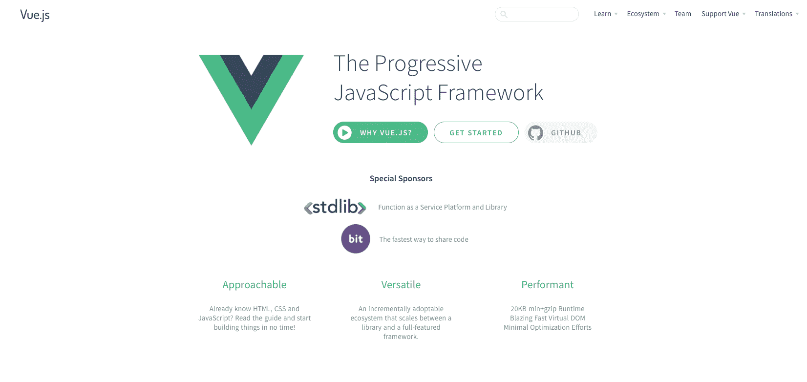

VueJS 主页

VueJS 允许您创建从由 JavaScript 驱动的小部件到放入现有应用程序的中等大小的应用程序。通过 JavaScript 控制整个页面并因此重新渲染各个部分，使其非常具有反应性，一直到构建大型企业级应用程序，单页面应用程序，其中整个网页，多个页面（至少对用户来说是这样），都由 VueJS 驱动，它渲染 DOM 的重要部分，使其看起来像是加载了不同的页面，但最终 JavaScript 处理所有这些。

为什么选择 JavaScript？由于 JavaScript 在浏览器中运行，如果您只想重新渲染应用程序的部分，您无需访问任何服务器并等待任何响应。这使得应用程序非常具有反应性，感觉很好，并提供了出色的用户体验。

这就是您可以使用 VueJS 做的事情。那么，为什么选择 VueJS 而不是比如说 Angular 2 或 ReactJS，您可能已经了解并且执行类似操作的框架呢？首先，VueJS 非常精简，文件大小很小。我们说的是核心框架压缩后 gzip 格式只有 16 千字节。

这是一个非常专注和简洁的框架。但是，它不仅小巧，因此加载速度快，而且在运行时也很快，根据一些基准测试的结果，它甚至超过了 Angular 2 和 ReactJS。当然，这将始终取决于您的特定应用程序。

我想现在就开始使用 VueJS 并构建我们的第一个小应用程序，并看看我们如何实际设置它。

# 设置 VueJS

开始使用 VueJS 并创建您的第一个应用程序实际上非常简单。我们从[vuejs.org](http://vuejs.org)开始，它的官方主页；在那里，您会注意到这个不错的“开始”按钮。让我们点击它。它会带您到官方文档，无论如何都值得一看，但在那里，我们想要去安装。现在，在这里，您有几种不同的选项，取决于您想要使用哪种设置：

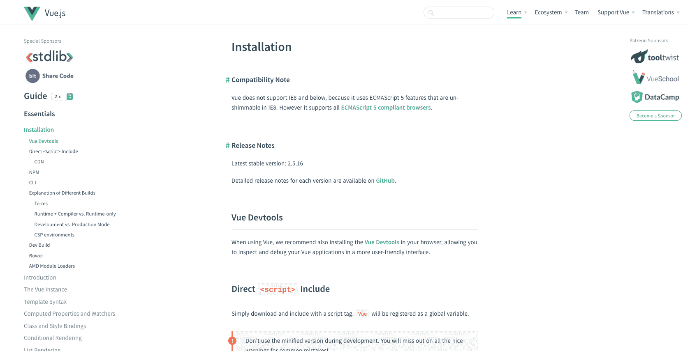

VueJS 安装页面

有不同的选项可以下载 VueJS——我们可以下载文件或使用提供的 CDN。在这个练习中，我们将简单地使用 CDN。只需单击 VueJS 提供的链接，如下所示：

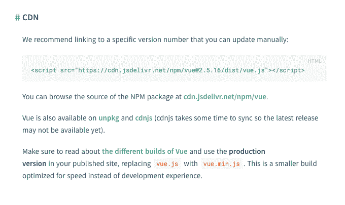

VueJS CDN

现在，我们不需要创建一个新的 HTML 项目，让我们去[jsfiddle.net](https://jsfiddle.net/)。

JSFiddle 是一个在线网络编辑器，因此您可以非常轻松地创建或测试一些东西：

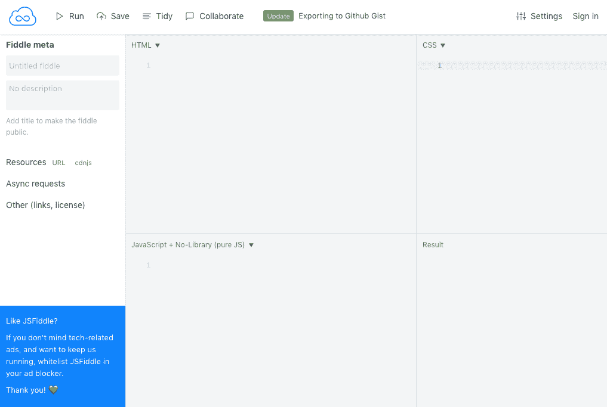

JSFiddle

只需将 VueJS 的脚本复制并粘贴到 HTML 的`block`部分：

```html
<script src="img/VueJS"></script>
```

您可以删除`@2.5.16`，只留下`vue`，这样它将始终获取最新版本：

```html
<script src="img/VueJS"></script>
```

既然我们已经导入了 VueJS，我们现在就可以使用它及其所有功能。所以，让我们使用它并构建我们的第一个小应用程序。为此，我想添加一个段落，在其中我想说“你好，世界”：

```html
<p>
Hello world!
</p>
```

到目前为止，还没有什么有趣的。但是，我们想要做的是能够使用 VueJS 控制文本。为此，我们需要创建一个实例。在 VueJS 中，您只需在我们的 JavaScript 文件中添加以下代码：

```html
 var app = new Vue({

 })
```

现在，我需要创建一个包含我的应用程序的`div`，因为我们不希望我们的`<p>`标签成为应用程序。我们将添加一个 ID app：

```html
<div id="app">
    <p>
        Hello world!
    </p>
</div>
```

现在我们需要调用`#app` `div`并将其设置为我们应用程序的模板：

```html
var app = new Vue({
    el: '#app',
})
```

现在，要将任何数据放入我们的应用程序，我们将需要`data`属性：

```html
var app = new Vue({
       el: '#app',
       data: {
         title: "Hello World!"
       }
    })
```

我们可以称它为`title`。现在我们需要将它链接到我们的文本；为此，只需删除文本并添加`{{ title }}`或属性的名称。

让我们通过单击左上角的“运行”按钮在 JSFiddle 上运行这个：

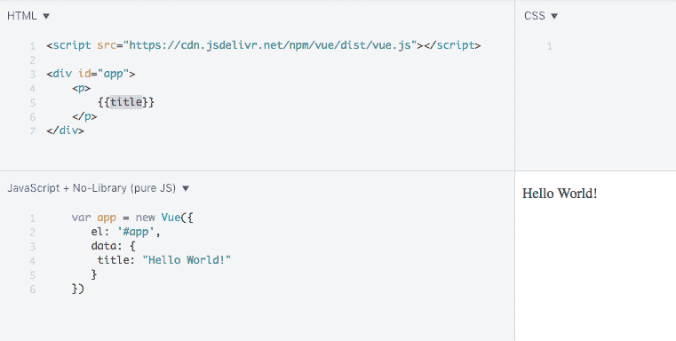

第一个 VueJS 实例

现在，你可能会说这样做没有意义。还没有完成。让我们通过添加一个输入来扩展我们的 VueJS 应用程序，该输入将与`<p>`中显示的文本相关联：

```html
<input v-model="title" type="text">
```

我们在输入中添加了`v-model`指令；这将把文本框绑定到 Vue 中的数据属性`title`。

你现在可以尝试添加任何文本；它将跟随你写的内容：

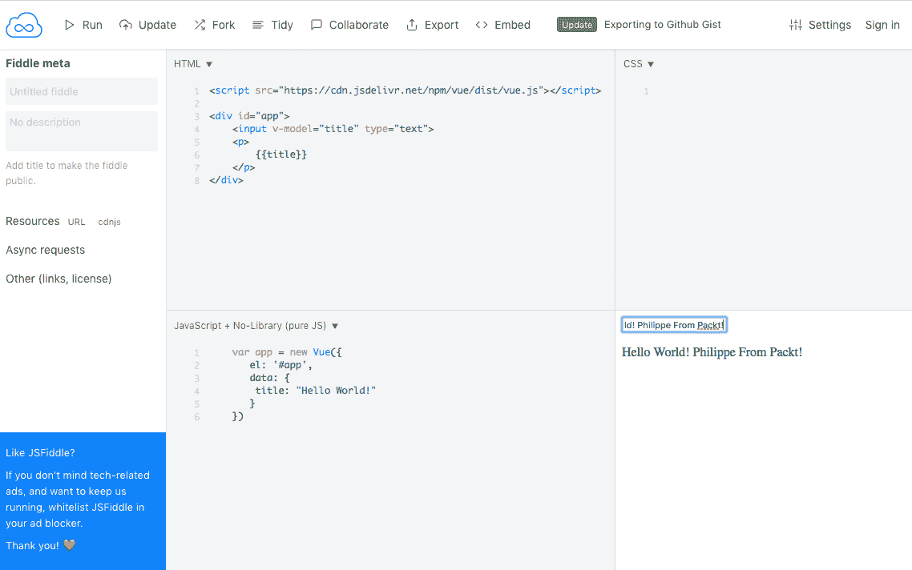

JSFiddle 练习结束

这个介绍现在已经结束。如果你在这一步遇到任何问题，你可以访问我的 JSfiddle[ https://jsfiddle.net/knee8oha/9/](https://jsfiddle.net/knee8oha/9/)。

对我来说，学习的最好方式是通过实践。所以，让我们一起创建一个应用程序，让你熟悉 VueJS。

# 在 VueJS 中创建一个天气应用程序

在这个练习中，我们将构建一个组件，用于在 VueJS 中显示位置的天气。这个组件将包括一个位置搜索文本框；然后将搜索[`openweathermap.org/`](http://openweathermap.org/)，这是一个免费的天气 API，所以我们可以获取基于位置的搜索信息。

# Vue Material

让我们创建一个简单的 HTML 文件。在这个练习中，我们将不使用 Bootstrap，而是使用另一个库，并看看它有多容易。我们将使用 Vue Material，这是一个基于 Google Material 设计的库。你可以在[`vuematerial.io/`](https://vuematerial.io/)上查看它：

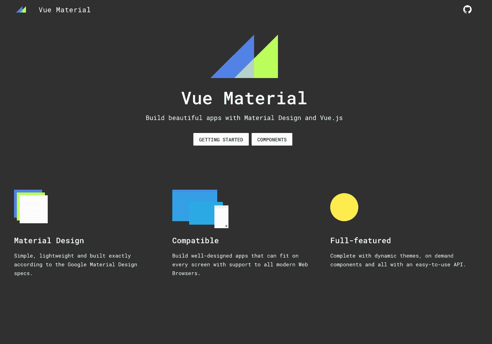

Vue Material

点击“入门”来查看他们的安装说明。幸运的是，他们提供了一个 CDN 和一个准备好使用的模板。让我们复制他们的模板并粘贴到我们的 HTML 文件中：

```html
<!doctype html>
<html>
  <head>
    <meta charset="utf-8">
    <meta content="width=device-width,initial-scale=1,minimal-ui" name="viewport">
    <link rel="stylesheet" href="https://fonts.googleapis.com/css?family=Roboto:300,400,500,700,400italic|Material+Icons">
    <link rel="stylesheet" href="https://unpkg.com/vue-material@beta/dist/vue-material.min.css">
    <link rel="stylesheet" href="https://unpkg.com/vue-material@beta/dist/theme/default.css">
  </head>

  <body>
    <div id="app">
      <!-- Your code here -->
    </div>

    <script src="img/vue"></script>
    <script src="img/vue-material@beta"></script>
    <script>
      Vue.use(VueMaterial.default)

      new Vue({
        el: '#app'
      })
    </script>
  </body>
</html> 
```

让我们首先在`<head>`部分添加一个标题：

```html
<title>Vue JS Weather App</title>
```

Vue Material 提供了方便的布局，我们可以重用。我们希望应用程序首先是移动端的，并带有一个标题。我们可以使用以下代码插入到我们的应用程序中：

```html
<div id="app">
      <div class="page-container">
        <md-app md-waterfall md-mode="fixed-last">
          <md-app-toolbar class="md-primary">
            <div class="md-toolbar-row">
              <div class="md-toolbar-section-start">
                <span class="md-title">VueJS: Weather</span>
              </div>

              <div class="md-toolbar-section-end">
                <md-button class="md-icon-button">
                  <md-icon>more_vert</md-icon>
                </md-button>
              </div>
            </div>
          </md-app-toolbar>

          <md-app-content>
            <!-- OUR APP HERE -->
          </md-app-content>
        </md-app>
      </div>
    </div>
```

现在，在我们的`<script>`部分，我们将要挂载这个应用程序：

```html
<script>

      Vue.use(VueMaterial.default)
      var weather = {
        el: '#app'
      }
      var app = new Vue(weather)
      app.$mount("#app")

    </script>
```

现在我们有一个准备好使用并完全响应的应用程序：

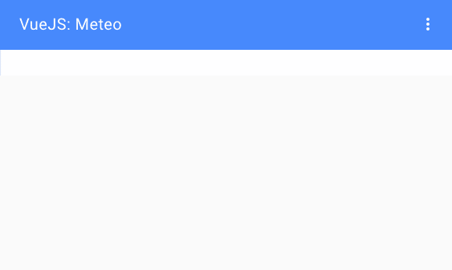

我们的 VueJS 应用程序

# 组件

我们将创建的第一个组件是主要的天气组件。我们需要附加到它的以下三个属性：

+   数据

+   方法

+   模板

数据数组将需要以下组件的数据点：

+   `weatherLocation`：这将存储在输入中输入的位置

+   `weatherApi`：这是你的 OpenWeather API 密钥[`openweathermap.org/appid`](http://openweathermap.org/appid)

+   `weather`：我们将在这个组件中存储 API 的结果

+   `displayWeather`：如果我们想要显示数据，我们将设置一个 true 或 false（布尔值）

为了调用 OpenWeather API，我们将使用 Vue 资源方法`.get()`。这个方法的结果将存储在天气数据点中，然后将`displayWeather`数据点设置为`true`。

# OpenWeather API

要能够访问 API，我们需要注册并创建一个账户。话不多说，让我们在[`openweathermap.org/appid`](http://openweathermap.org/appid)创建一个账户：

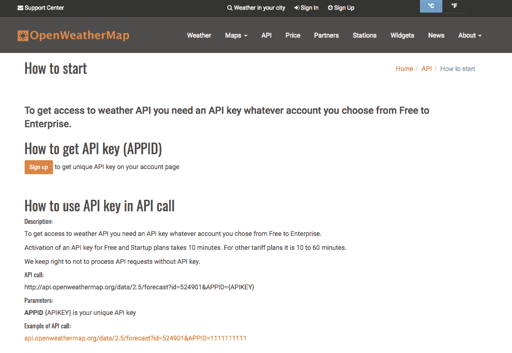

OpenWeather 注册页面

点击“注册”并按照流程进行。最后，你将访问一个带有 API 选项卡的会员仪表板。你可以复制提供的 API 密钥：

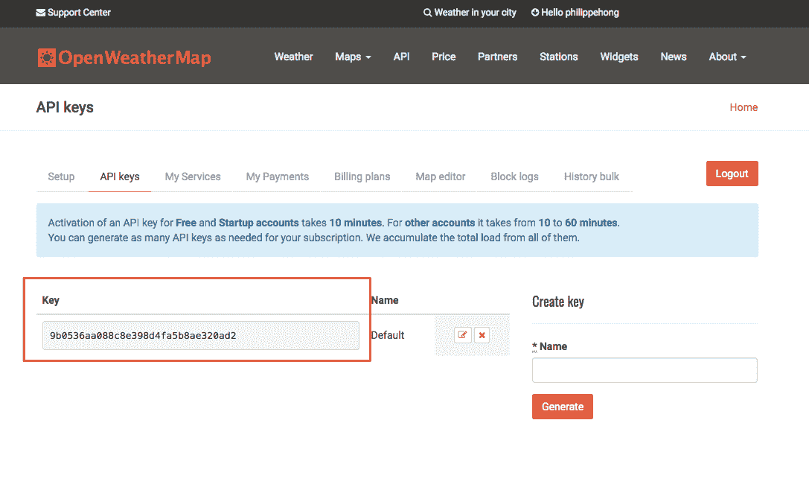

OpenWeather API

现在让我们看看如何调用 API 并获取结果。如果我们查看 OpenWeather 提供的文档([`openweathermap.org/current`](http://openweathermap.org/current))，你可以得到一个 API 调用的示例：

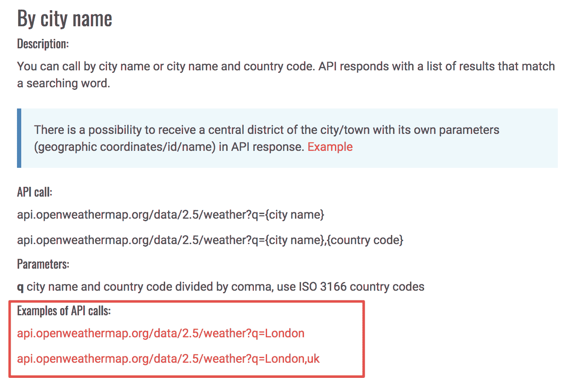

API 文档

URL 的组成如下：

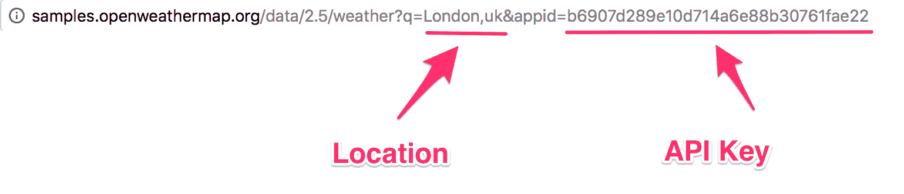

API 调用 URL

我们从这个调用中得到的结果看起来像这样（你可以自己测试）：

```html
{"coord":{"lon":-0.13,"lat":51.51},"weather":[{"id":300,"main":"Drizzle","description":"light intensity drizzle","icon":"09d"}],"base":"stations","main":{"temp":280.32,"pressure":1012,"humidity":81,"temp_min":279.15,"temp_max":281.15},"visibility":10000,"wind":{"speed":4.1,"deg":80},"clouds":{"all":90},"dt":1485789600,"sys":{"type":1,"id":5091,"message":0.0103,"country":"GB","sunrise":1485762037,"sunset":1485794875},"id":2643743,"name":"London","cod":200}
```

提供的代码是 JSON 格式，通常用于显示数据。代码是被压缩的，所以很难阅读。让我们使用一个工具来解压缩它。我使用了[`unminify.com/`](http://unminify.com/)。要做到这一点，只需粘贴代码并点击 Unminify：

```html
{
    "coord": {
        "lon": -0.13, "lat": 51.51
    }
    ,
    "weather":[ {
        "id": 300, "main": "Drizzle", "description": "light intensity drizzle", "icon": "09d"
    }
    ],
    "base":"stations",
    "main": {
        "temp": 280.32, "pressure": 1012, "humidity": 81, "temp_min": 279.15, "temp_max": 281.15
    }
    ,
    "visibility":10000,
    "wind": {
        "speed": 4.1, "deg": 80
    }
    ,
    "clouds": {
        "all": 90
    }
    ,
    "dt":1485789600,
    "sys": {
        "type": 1, "id": 5091, "message": 0.0103, "country": "GB", "sunrise": 1485762037, "sunset": 1485794875
    }
    ,
    "id":2643743,
    "name":"London",
    "cod":200
}
```

现在代码更多了，你可以看到数据显示为`id`和`value`。我们可以使用任何一个。在这个练习中，我们将选择以下数据：

+   平均温度

+   最低温度

+   最高温度

+   天气描述

+   日出和日落时间

让我们开始吧。

# API 调用

首先，我们需要创建一个将包含所有内容的 HTML 标签。

让我们在我们的应用中创建一个 HTML 标签`<weather>`：

```html
<md-app-content>
            <!-- OUR APP HERE -->
            <weather></weather>
          </md-app-content>
```

在`script`部分，让我们创建我们的第一个 Vue 函数：

```html
Vue.component('weather', {

});
```

正如我们之前所说，我们需要数据、方法和模板来显示内容。让我们从数据开始：

```html
Vue.component('weather', {

    data: function(){
            return {
                weatherLocation: '',
                weatherApi: '05911854df7aa0be884df72549a75fd9',
                weather: [],
                displayWeather: false
            }
        },

});
```

该函数将存储以下内容：

+   用户设置的位置

+   我们的 API 密钥

+   从 API 中提取的数据

+   一个布尔值，用于显示或不显示信息

接下来，我们需要添加方法，如下所示：

```html
methods: {
            getWeather: function()
            {
                return this.$http.get('http://api.openweathermap.org/data/2.5/weather?q='+ this.weatherLocation +'&appid=' + this.weatherApi).then((response) => {
                    this.weather = response.body;
                    this.displayWeather = true
                }, (response) => {
                    this.weather = [];
                    this.displayWeather = false
                });
            }
        },
```

我们将设置`getWeather`函数，它将执行以下操作：

+   使用我们的 API 密钥和用户设置的位置调用 API

+   存储从 API 获取的数据，并将显示信息设置为`true`

+   如果没有来自 API 的答案或内容，显示信息将设置为`false`

最后，模板将如下：

```html
template: '<div id="weatherApp">' +
                  '<form v-on:submit.prevent="getWeather"><md-field> <md-icon>place</md-icon> <label>Location</label> <md-input type="text" name="weatherLocation" v-model="weatherLocation"></md-input></md-field>' +
                    '<md-button class="md-primary md-raised" type="submit">Search</md-button> '+
                    '</p>' +
                '</form>' +
                '<div v-if="displayWeather" class="container display-weather-section"><md-card><md-card-header><h1>{{ weather.name }}</h1></md-card-header>' +
                '<md-card-content><weather-display v-bind:weatherDisplay="weather.weather[0]"></weather-display>' +
                '<temperature v-bind:temperature="weather.main"></temperature>' +
                '<clouds v-bind:cloud="weather.clouds"></clouds>' +
                '<sun v-bind:sun="weather.sys"></sun>' +
                '</md-card-content></md-card>' +
                '</div></div>'

      });
```

然后，我们将把这些信息传递给我们为每个创建的模板。对于天气名称和描述，我们有以下模板：

```html
Vue.component('weather-display', {
        props: ['weatherDisplay'],

        template: '<div id="weatherDisplay">' +
                    '<h2>{{ weatherDisplay.main }}</h2>' +
                    '<p>{{ weatherDisplay.description }}</p>' +
                    '</div>'
      });
```

我们使用`props`属性传递数据，使用`template`属性创建具有该值的 HTML。

然后，我们有温度。我们将显示平均温度、最高温度和最低温度。我们从 OpenWeather API 获取的数据格式是开尔文，所以我们需要创建一个函数来转换温度。

将开尔文转换为摄氏度，您只需要从数字中减去`273.15`：

```html
Vue.component('temperature', {
        props: ['temperature'],

        methods: {
            displayTemp: function( temp )
            {
                return parseFloat(temp - 273.15).toFixed(2);
            }
        },

        template: '<div id="temp">' +
                    '<h2>Temperature</h2>' +
                    '<p>Avg Temp - {{ displayTemp(temperature.temp) }}c</p>' +
                    '<p>Min Temp - {{ displayTemp(temperature.temp_min) }}c</p>' +
                    '<p>Max Temp - {{ displayTemp(temperature.temp_max) }}c</p>' +
                    '</div>'
      });
```

对于`cloud`，我们只需要显示文本：

```html
Vue.component('clouds', {
        props: ['cloud'],

        template: '<div id="cloud">' +
                    '<h2>Clouds</h2>' +
                    '<p>Coverage - {{ cloud.all }}%</p>' +
                    '</div>'
      });
```

最后，我们有日出和日落时间。我们从 OpenWeather 得到的格式是时间戳，所以我们需要将其转换为日期时间：

```html
Vue.component('sun', {
        props: ['sun'],

        methods: {
            timestampToDate: function( timestamp ){
                var date = new Date(timestamp*1000);
                return date.toString();
            }
        },

        template: '<div id="sun">' +
                    '<h2>Sun</h2>' +
                    '<p>Sunrise - {{ timestampToDate(sun.sunrise) }}</p>' +
                    '<p>Sunset - {{ timestampToDate(sun.sunset) }}</p>' +
                '</div>'
      });
```

我们的应用现在已经完成。让我们看看它的样子：

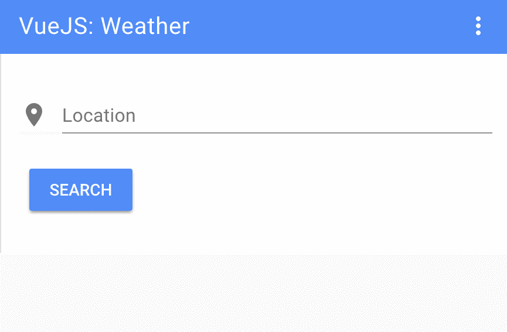

我们的天气应用 - 搜索栏

然后，我们有我们的结果页面：

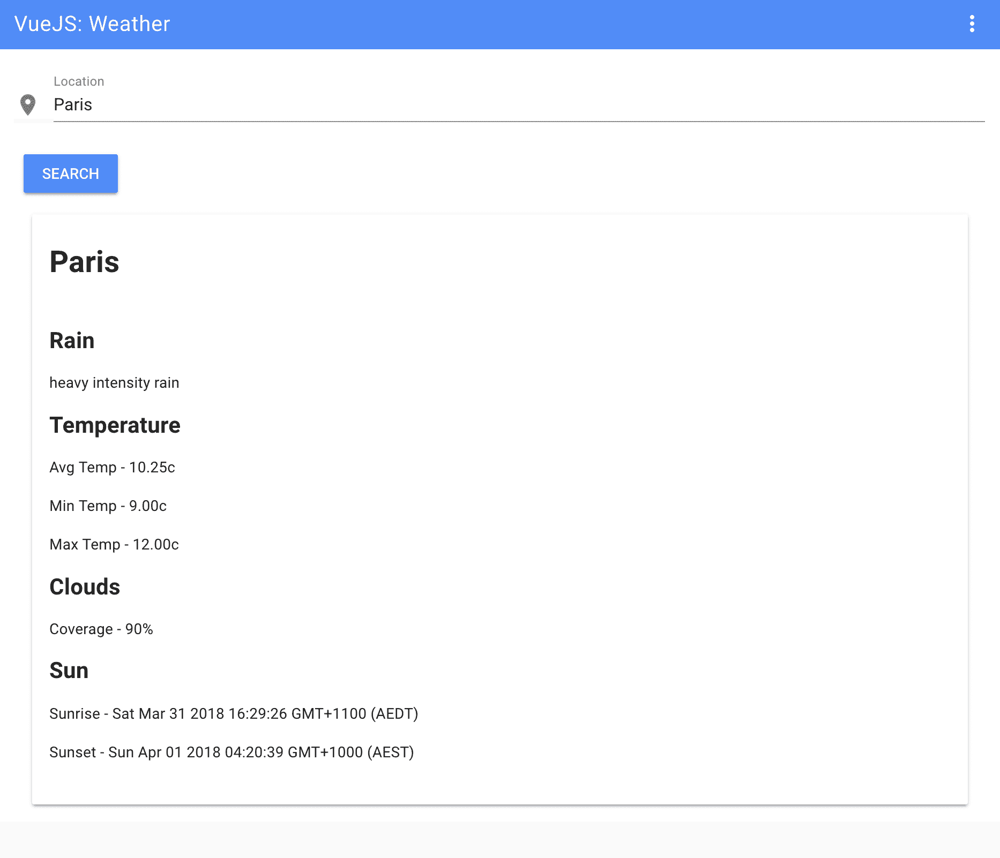

我们的天气应用 - 结果页面

# 摘要

这是对 VueJS 的简要介绍。这个框架有很多可能性，我只触及了其中的一小部分。我希望这会引起你对 VueJS 或你选择的任何客户端渲染框架的好奇心。在下一个最后一章中，我将向你展示我每天用来帮助我的工作流程的工具列表。这些工具肯定也会帮助到你。让我们开始吧！
