# 第十四章：帮助您的工作流程的工具

没有相机的摄影师或者没有纸和铅笔的时尚设计师会是什么？正如他们所说，你的工具决定了你的水平。

在本章中，我们将介绍一些我最喜欢的工具，这些工具应该帮助您每天改善工作流程，例如以下内容：

+   HTML 模板

+   Lorem Ipsum

+   CSS 预处理器 - Less

+   CSS 预处理器 - Sass

+   ColorZilla

+   Foundation

+   Fontastic

+   webflow

+   Modernizr

+   CSS3 生成器

+   git

+   Codekit

+   Animate.css

+   TinyPNG

+   Unsplash

让我们开始吧！

# HTML 模板

我们已经在我们的项目中使用了这个工具。HTML5 Boilerplate 是最顶尖的前端模板之一。正如其名称所示，这个前端模板是基于 HTML5 的。它是一个库和技巧的集合，可以让您快速（和高效地）开始您的最新项目。HTML5 Boiler 可能是最快的解决方案，让您的项目立即启动：

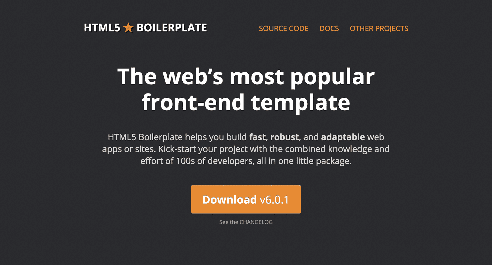HTML 模板

无论您想构建网站还是应用程序，您都可以使用 HTML5 Boilerplate 来节省时间，而不会影响性能。

HTML5 Boilerplate 更好的地方在于它在 GitHub 上有一个庞大的社区支持。在极少数情况下，您总是可以找到所需的帮助。尽管 HTML5 Boilerplate 不适用于大型项目，但在您需要立即开始较小项目并且不想从头开始编码时，它是完美的选择。

# Lorem Ipsum

我们都熟悉 Lorem Ipsum，即使我们不知道它的名字。设计师使用它来模拟设计项目中的文本。

事实上，Lorem Ipsum 的历史比您想象的要长得多。这不是一种新的设计师技巧。印刷和设计行业在过去 500 年中一直使用这段拉丁文本来复制实际文本的外观：

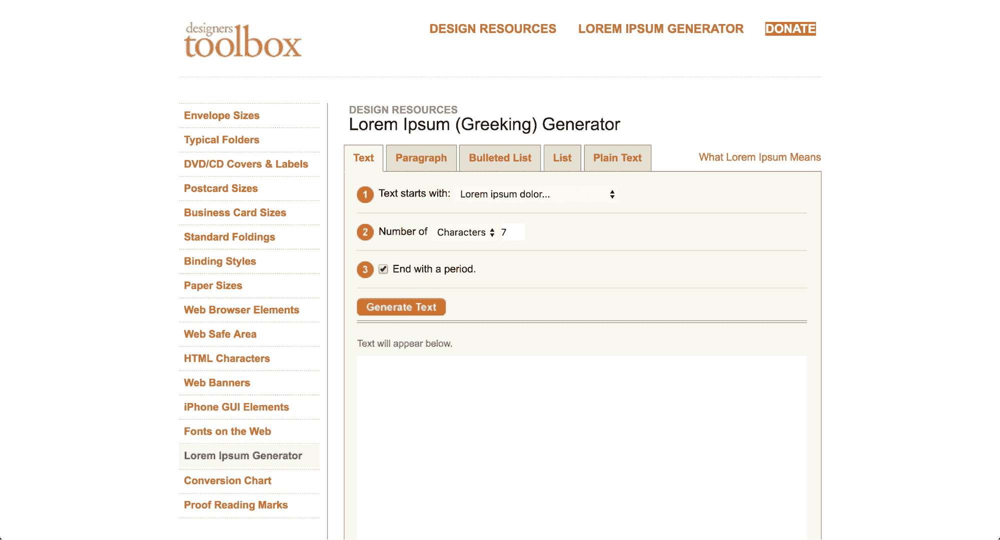[Lorem Ipsum](http://designerstoolbox.com/designresources/greek/)

然而，您可能会想，为什么要使用 Lorem Ipsum？为什么要使用一种已经不存在的语言来填充空间，而您可以轻松地一遍又一遍地复制和粘贴*您的文本*这样的短语？

Lorem Ipsum 不仅是一个填充文本，它还提供了一种错觉。在内容中，就像你正在阅读的内容一样，有变化。你会看到两个字母的单词和九个字母的单词。没有重复的模式。

然而，当您使用重复的短语作为文本占位符时，它可能会玷污整个项目。人眼会被重复的模式分散注意力。当然，这会让人们关注您的整体设计，并可能导致客户关注项目中所有看起来不对劲的琐碎事情。

如果您是一个纯粹主义者，您可以在这里使用 Designers Toolbox 的 Lorem Ipsum（Greeking）生成器[(http://designerstoolbox.com/designresources/greek/)](http://designerstoolbox.com/designresources/greek/)。这对于传统的 Lorem Ipsum 文本占位符来说是完美的。然而，为了有趣和幽默，可以查看 Bacon Ipsum[(https://baconipsum.com/)](https://baconipsum.com/?paras=5&type=all-meat&start-with-lorem=1)。

# CSS 预处理器 - LESS

想要更多地使用**更精简的样式表**（**LESS**）吗？这是 CSS 的一种语言扩展，也是最流行的 CSS 预处理器之一：

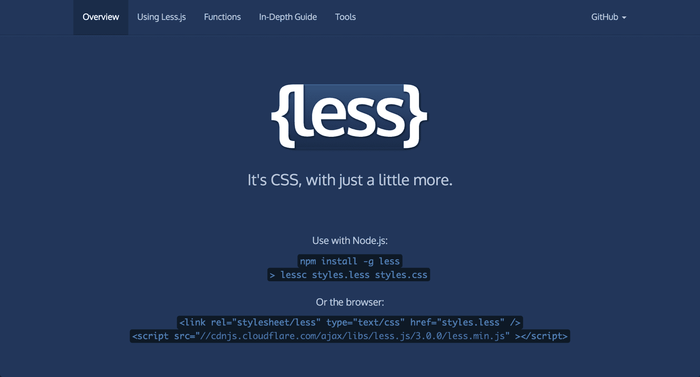[LESS](http://lesscss.org/)

如果您已经熟悉 CSS，那么开始使用 LESS 对您来说将会很容易。事实上，如果您有 CSS 背景，您可能学习 LESS 的时间比阅读本章剩下的时间还要短。

那么，为什么选择 LESS 而不是 CSS？使用 LESS 的最大原因之一是您可以在项目中获得更多的时间。

它的工作方式很像编程语言。 LESS 可以用`@`符号定义变量。然后，您可以存储一个常量值，然后在整个样式表中重复使用。这绝对是一个值得一试的工具。

# CSS 预处理器 - SCSS

LESS 并不是唯一的 CSS 扩展。看看**语法上令人愉悦的样式表**（**SASS**）。它是由两种语法组成的脚本语言：原始的*缩进语法*（给定`.sass`扩展名）和较新的 SCSS 语法（给定`.scss`扩展名）：

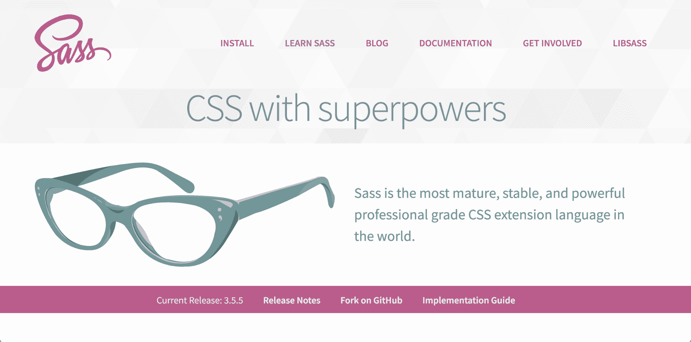[SCSS](https://sass-lang.com/)

无论您使用哪个版本的 CSS 库，SASS 都与每一个兼容。而且，与 LESS 类似，SASS 是开源的，并得到了庞大的开发者社区的支持。同样，它也向后兼容，这样您就可以转换您的 CSS 文件。

那么，为什么选择 SASS 而不是 LESS？根据您问的人，SASS 更受欢迎，而 LESS 更容易使用。这可能取决于您是更喜欢 Ruby 还是 JavaScript。SASS 是用 Ruby 编写的。然而，最初是用 Ruby 编写的 LESS 已经转移到 JavaScript。您需要 NodeJS 来运行 LESS。

# ColorZilla

试图找到完美的颜色，但无法完全复制它吗？

输入 ColorZilla。这个浏览器附加组件是一个吸管，一个颜色选择器和一个渐变生成器。ColorZilla 在 Chrome 和 Firefox 中都可用。ColorZilla 还提供 CSS 渐变编辑器，您可以直接从[`www.colorzilla.com/gradient-editor/`](http://www.colorzilla.com/gradient-editor/)访问： 

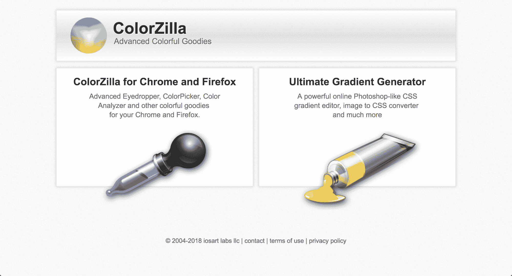[ColorZilla](http://www.colorzilla.com/)

对于平面设计师和网页开发人员来说，ColorZilla 是一个救星。这是一个简单的工具，您会发现自己每天都在使用。它可以帮助您从浏览器中的任何页面（或图像）中获取准确的颜色读数。

# Foundation

由 Zurb 创建，Foundation 是一个开源的响应式前端框架。

Foundation 是高度可定制的。设计师喜欢 Foundation，因为它与几乎所有浏览器和设备兼容，符合移动优先的要求。当您需要快速设置项目时，包括必须在智能手机上运行的应用程序时，Foundation 是一个明智的选择。您不需要了解或调整后端编码。它对于各种项目都能很好地工作，从原型到 HTML 电子邮件到工作网站：

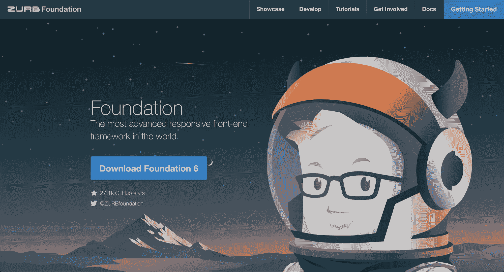[Foundation](https://foundation.zurb.com)

Foundation 可以与您选择的任何 CMS 一起使用。

# Fontastic

您是否曾经需要快速更改图标的大小或颜色？添加阴影或其他设计元素到您的图标？

让我们来认识一下 Fontastic。这个神奇的工具允许设计师快速更改图标，以满足任何项目的独特需求。您可以通过创建自己的图标字体来实现这一点。然后，将该字体上传到您的项目中。上传后，您可以使用 CSS 自定义图标的外观和感觉，而无需在 Photoshop 中费力地操作每个图标：

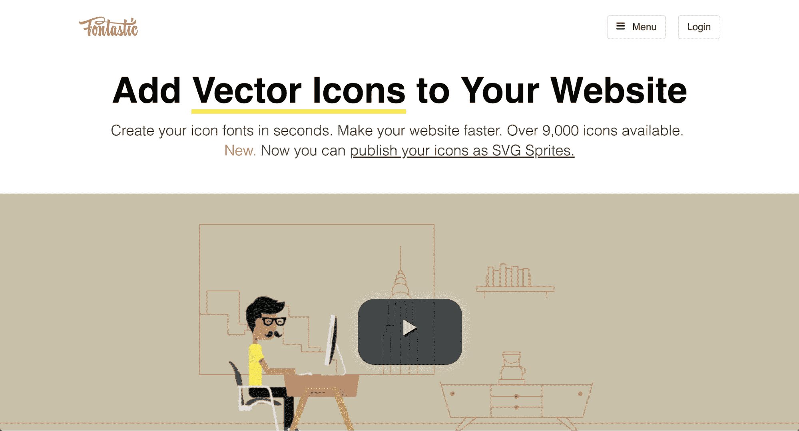

Fontastic (http://fontastic.me/)

它是如何工作的。转到 Fontastic，并从其超过 9,000 个可用图标图像的庞大库中选择图标。接下来，为这些图标分配字母（以创建字体）。

从那里，您可以通过 CSS 修改您的图标。从更改颜色到调整大小，您可以通过编码来完成所有这些，而不是重新绘制并浪费大量时间。

# webflow

好消息是，即使您对编码一无所知，您仍然可以设计和构建网站。

webflow 只是你需要的工具。它是一半设计师，一半开发者，完全令人惊叹。您可以直观地设置您的网站设计，然后 webflow 会完成其余工作。它将编写您的网站，使其生动起来，并无缺地运行：

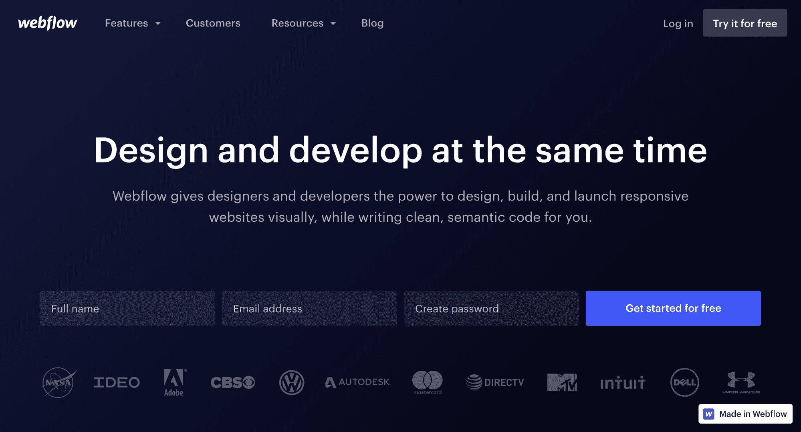

webflow (https://webflow.com/)

这里没有模拟和原型。webflow 创建使用 HTML、CSS 和 JavaScript 的实时和完全功能的网站。

顺便说一句，我提到它也是响应式的了吗？这意味着您不必担心最终项目在较小的屏幕上看起来很奇怪。

如果您想了解代码的质量，您可以放心，webflow 保证代码整洁，不会减慢网站访客的体验。

# Modernizr

Modernizr 是一个小型 JavaScript 库，用于自动检测用户浏览器中的功能和/或技术（例如 HTML5）。此工具的目的是根据用户的独特浏览器优化您的网站用户体验。您可以使用 Modernizr 在您的网站上提供愉快的浏览体验，无论浏览器是多新还是过时：

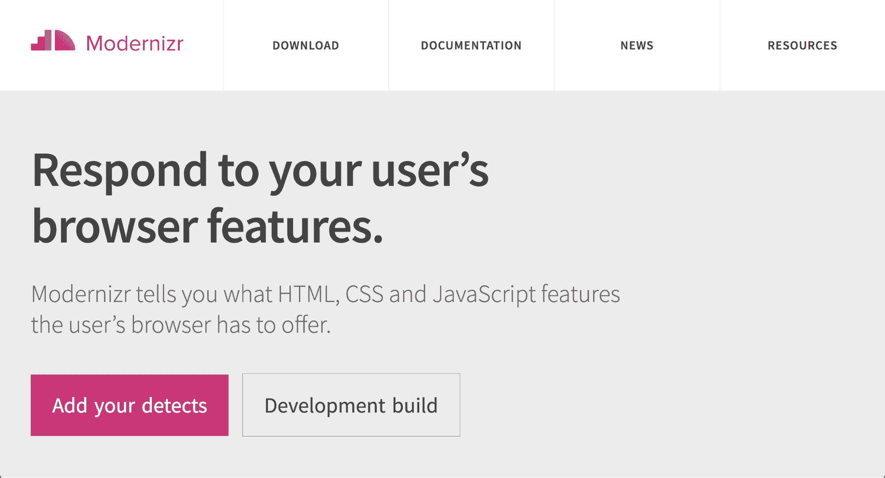

ModerniZR（https://modernizr.com/）

# CSS3 生成器

当您需要快速为您的 CSS 创建代码时，您将需要 CSS3 生成器。

从文本阴影到渐变，从多列到过渡，您可以通过简单的 CSS3 生成器做很多事情：

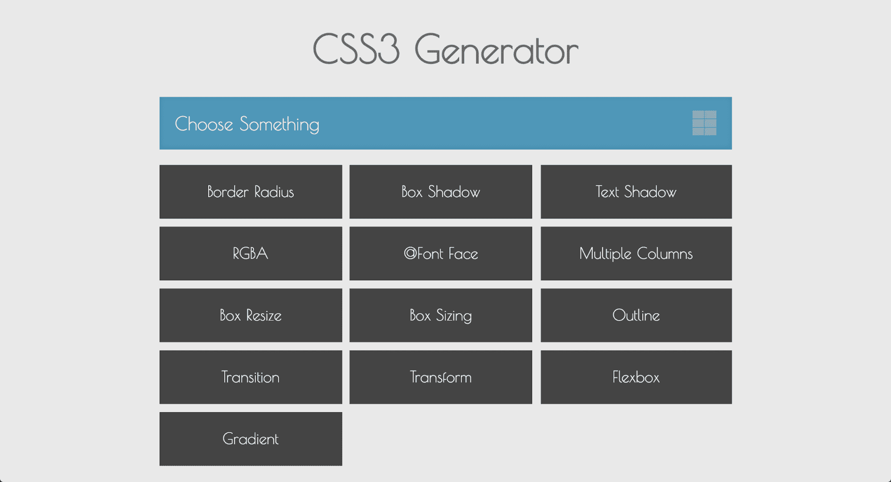

CSS3 生成器（http://css3generator.com/）

好消息是，CSS3 生成器有很多工具可供您使用。通过其中一个工具生成您的 CSS3 片段，然后直接将代码复制到您的项目中。编码并不适合每个人，如果您更喜欢视觉思维，这个生成器快捷方式对您来说是完美的解决方案。

CSS3 生成器是我最喜欢的 CSS3 工具之一，因为它快速、干净且易于使用。

# git

以下所有内容对您都是真的吗：

+   您需要一个版本控制系统来跟踪对文件所做的任何更改

+   您与许多人一起工作

+   您需要经常远程或离线工作

然后，您需要 git：

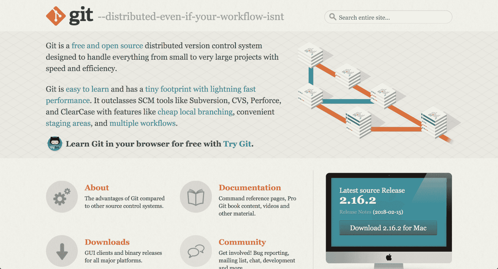

git（https://git-scm.com/）

git 是一个开源的版本控制系统。无论您是在小型项目还是大型项目上工作，git 都是一个不错的选择。其速度和灵活性使其成为一个很棒的选择。

这是 git 的工作原理：

git 与您的本地副本一起工作，可以在离线时执行：

1.  每当您保存工作时，git 都会创建您文件的图像，也称为提交

1.  每次创建此提交时，它都会链接到您的其他提交，这意味着文件上的所有活动都会发生变化

1.  每当您（或团队中的其他人）进行更改时，您的提交都会记录下来

1.  您可以使用它来撤消更改并返回到以前的提交

git 的另一个好处是文件的处理方式。文件存在为修改、暂存或提交状态。在修改状态下，您对文件所做的更改仅存在于本地工作目录中。然后，您可以将这些新修改的文件暂存。当更改成为文件开发的永久部分时，最终阶段是提交。

# CodeKit

CodeKit 是用于构建网站的另一个工具。基本上，CodeKit 自动化了许多开发人员的任务，以便构建网站不会花费太长时间。它可以编译任何语言，因此 CodeKit 非常易于使用：

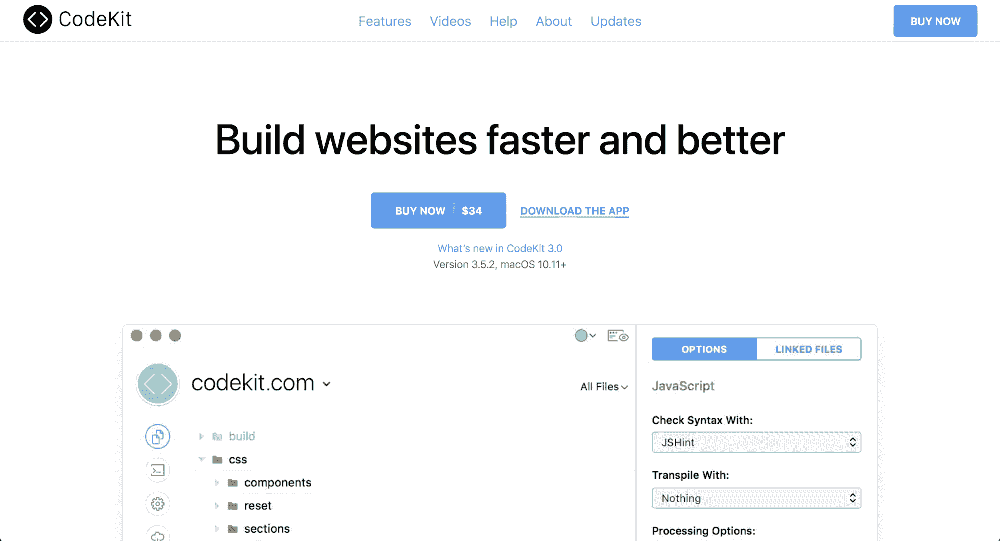

CodeKit（https://codekitapp.com/）

我喜欢 CodeKit 的简单原因是您无需在更改后刷新浏览器。CodeKit 会自动为您完成。所有浏览器都受支持，所有设备都受支持。

另一个放下一切去使用 CodeKit 的原因？网站优化非常容易。CodeKit 允许您通过一键最小化图像高达 70％。您可以使用它来缩小脚本并减少 HTTP 请求。这些类型的优化是确保网站速度快的最佳方法之一。

CodeKit 的拖放用户界面非常流畅和友好。

# Animate.css

Animate.CSS 基本上只是为了好玩。从吸引注意力到缩放退出，您会发现数十种 CSS 动画来装饰您的网页设计：

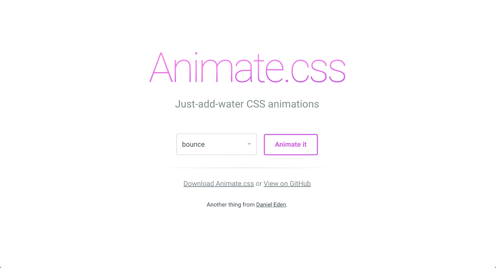

Animate CSS（https://daneden.github.io/animate.css/）

Animate.CSS 打包在一个小文件中。你所需要的一切都包含在那个文件中。从官方网站下载后，你将把样式表放入文档的头部。然后，你可以为所需的元素添加所选择的动画，看着你的想法在屏幕上跳动（或者你选择的任何效果）。所有这些都在 [(https://github.com/daneden/animate.css/blob/master/README.md)](https://github.com/daneden/animate.css/blob/master/README.md) 的 README 文件中有详细说明。

Animate.CSS 是为你的网页项目增添乐趣和趣味的绝佳选择。由于它是 CSS，所以它轻巧且兼容大多数屏幕。

# TinyPNG

我最喜欢的设计师工具之一是 TinyPNG。顾名思义，TinyPNG 可以压缩 PNG 或 JPEG 图像以减小文件大小。然而，它在不降低文件的视觉质量的情况下进行压缩——就像魔术一样：

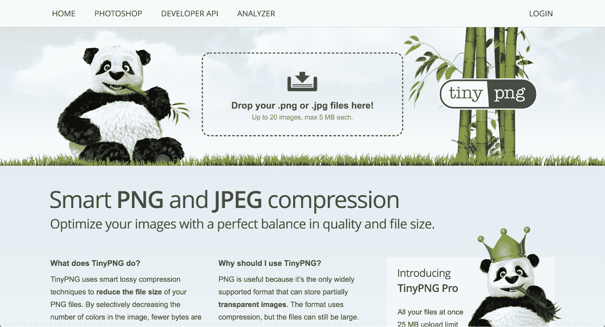

TinyPNG (https://tinypng.com/)

为了实现网页项目的最大速度，尽可能减小文件大小非常重要。毫无疑问，图像文件通常是网站上最大的文件。这就是为什么：TinyPNG 是一个很棒的选择——它可以减小你的文件大小（通常可以减少 50% 或更多），而不会影响视觉效果。更小的文件大小不仅意味着更快的加载时间，还可以节省你的带宽。

TinyPNG 使用起来速度非常快，如果你注册了专业账户，一次可以上传多达 25 MB 的文件。免费服务则限制为最多 20 张图片，每张最大为 5 MB。

# Unsplash

当你需要高质量的照片，但又负担不起聘请摄影师，或者只是需要一些设计的占位符时，Unsplash ([`unsplash.com/`](https://unsplash.com/)) 就是你的选择。它提供了摄影师上传的开源免费图片：

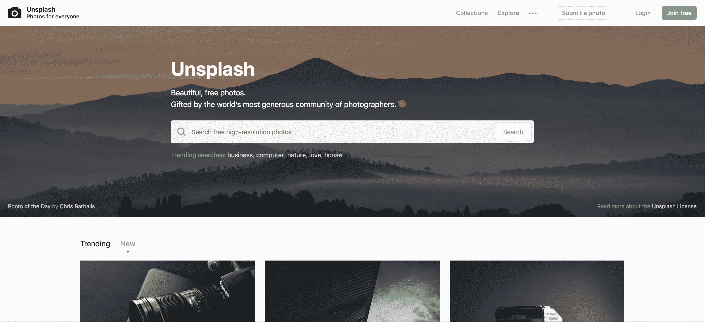

Unsplash (https://unsplash.com/)

我每天都在使用它，说实话，它已经成为我最常用的网站之一。

# 总结

我希望这些工具清单能像它帮助我一样帮助你。不要节制地使用它。设计社区的好处在于每个人都喜欢分享自己的工作并互相帮助。设计师和开发者是一个开放的社区，这就是我们社区的真正精神。
