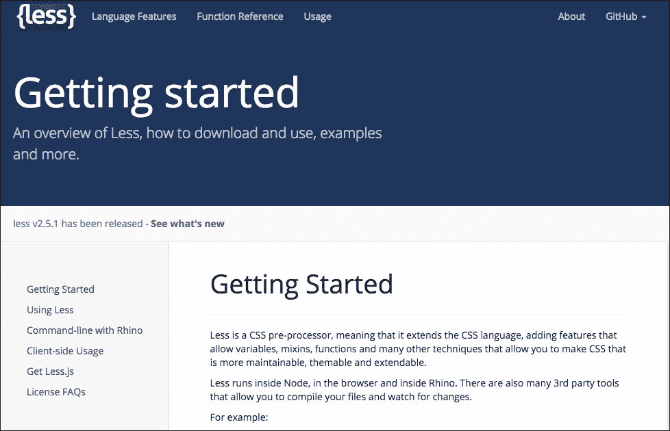
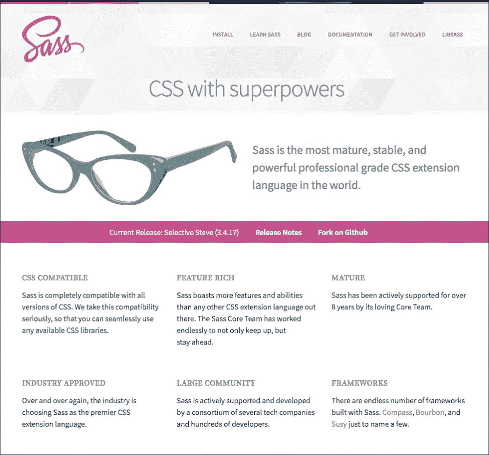
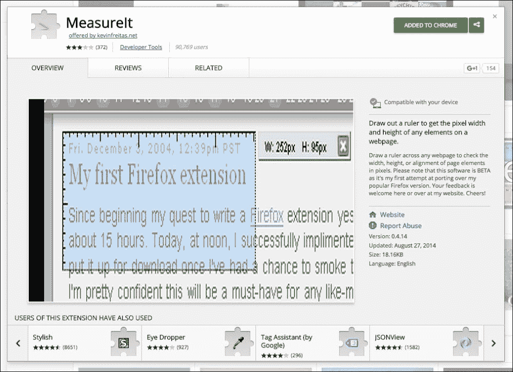

# 第一章：基础和工具

了解每个领域的基础知识非常重要。您需要有基本信息才能成为专业人士。良好的工具使用几乎和基础一样重要。没有好的工具，您的基础就无法得到很好的利用。

本章介绍了将帮助构建更好的 CSS 代码的工具。它描述了预处理器的特性，最后是关于 SASS 的基础知识。在本章中，您可以获得有关使用`GULP.js`在前端开发中自动化可重复过程的基本知识。最后，您可以找到一个文件结构的示例，它将您的项目部分化为小型、易于编辑和可维护的文件。

在本章中，我们将：

+   了解预处理器的用法。

+   创建一个具有适当结构的 CSS 项目。

# 选择正确的 IDE

构建 CSS 代码非常简单。如果您想开始，您只需要一个简单的文本编辑器并开始编写代码。如果您想加快这个过程，您将需要选择正确的文本编辑器或集成开发环境（IDE）。目前，前端开发人员最流行的编辑器/IDE 如下：

+   Sublime Text

+   Atom

+   WebStorm/PHPStorm

+   Eclipse/Aptana

+   Brackets

您的选择将基于价格和质量。您应该使用您感觉最舒适的编辑器。

## 使用代码片段/Emmet 加快编程过程

当您创建代码时，您会有一些在所有项目/文件中重复的代码部分。您需要创建一些代码片段，这将帮助您加快编写代码的过程。作为前端开发人员，我建议您对**Emmet**（以前是 Zen Coding）有基本了解。这是一组 HTML/CSS 代码片段，可以帮助您更快地构建代码。如何使用它？它基本上包含在现代前端编辑器（Sublime Text，Atom，Brackets，WebStorm 等）中。如果您想了解 Emmet 在 CSS 中的工作原理，您需要开始声明一些类，例如`.className`，打开括号（`{}`）并写入例如：

```css
pl
```

```css
padding-left
```

以下是最常用的属性和值的示例：

| Emmet 表单 | 结果 |
| --- | --- |
| `bg` | 背景 |
| `bgc` | 背景颜色 |
| `m` | 外边距 |
| `ml`，`mr`，`mt`，`mb` | 左边距，右边距，上边距，下边距 |
| `ml20px` | 左边距：20px |
| `c` | 颜色 |
| `fl` | 浮动：左 |
| `p20px20p` | 填充：20px 20% |
| `tac` | 文本对齐：中心 |
| `tdn` | 文本装饰：无 |
| `ttu` | 文本转换：大写 |
| `dib` | 显示：内联块 |
| `!` | !important |

为了更好地理解 Emmet 并获得完整的功能列表，建议查看项目的官方网站：[`emmet.io/`](http://emmet.io/)。

## 键盘快捷键

您还记得您学习最令人印象深刻的键盘快捷键*Ctrl* + *C*，*Ctrl* + *V*吗？它帮助您每次想要复制和粘贴文本或任何其他元素时节省约 2 秒。但是在构建代码时自动化一些过程呢？是的，这将会很有帮助，您可以使用键盘快捷键来实现。

您的 IDE 中应该知道的快捷键如下：

+   复制行

+   删除行

+   移动行

+   格式化代码

# 跨浏览器兼容性 - 您应该安装哪些浏览器？

要测试您的代码，您将需要所有现代的 Web 浏览器。在您的列表中，您应该有以下浏览器：

+   Google Chrome（最新版本）

+   Mozilla Firefox（最新版本）

+   Mozilla Firefox 开发者版（最新版本）

+   Opera（最新版本）

+   Safari（最新版本）

+   Internet Explorer

Internet Explorer（IE）是前端开发人员生活中最大的问题，因为你需要在你的机器上安装一堆 IE，比如 9、10 和 11。这个列表越来越小，因为过去这个列表更长。IE6、7、8、9 等。现在 IE6、7 和 8 在像 YouTube 和 Facebook 这样的大型网络项目中大多数情况下不被支持。但在一些大公司中，更改操作系统是一个相当复杂的过程。

要在一堆浏览器上轻松测试你的代码，最好使用专门用于此测试的在线工具：

+   [`crossbrowsertesting.com/`](https://crossbrowsertesting.com/)

+   [`www.browserling.com/`](https://www.browserling.com/)

+   [`www.browserstack.com/`](https://www.browserstack.com/)

但一个简单而免费的方法是在你的计算机上创建一个虚拟机，并使用你需要的系统和浏览器。要收集所需版本的 IE，你可以参考[`modern.ie`](http://modern.ie)。使用`modern.ie`，你可以选择你需要的 IE 版本和你的虚拟机平台版本（VirtualBox，Parallels，Vagrant，VMware）。

## 如何使用检查器

在没有检查器的情况下处理 HTML 和 CSS 代码现在几乎是不可能的。在这个工具中，你可以看到标记和 CSS。此外，你还可以看到盒模型。这对于网页开发人员在浏览器中也是众所周知的。几年前，每个人都在使用专门为 Firefox 设计的 Firebug。现在每个现代浏览器都有自己内置的检查器，它可以帮助你调试代码。

调用检查器的最简单方法是右键单击元素，然后选择**检查**。在 Chrome 中，你可以使用快捷键。在 Windows 中，你需要按下*F12*。在 MAC OSX 中，你可以使用*cmd* + *alt* + *I*来调用检查器。


## 快捷键

为了更快地使用你的浏览器，最好知道一些可以加快进程的快捷键组合。

| 快捷键组合 | 功能 |
| --- | --- |
| *Ctrl* + *R*, *cmd* + *R* | 重新加载 |
| *Ctrl* + *Shift* + *R*, *cmd* + *shift* + *R* | 带缓存重新加载 |
| *cmd* + *I*, *F12* | 检查器 |
| *Ctrl* + *U*, *cmd* + *alt* + *U* | 页面源 |

# 预处理器-为什么应该使用它们？

预处理器是一个程序，它将从其他类似或几乎相同于 CSS 的语法构建 CSS 代码。预处理器的主要优点如下：

+   代码嵌套

+   使用变量的能力

+   创建 mixin 的能力

+   使用数学/逻辑运算的能力

+   使用循环和条件的能力

+   合并多个文件

## 在预处理器中嵌套元素

预处理器使你能够建立具有声明嵌套的代码的优势。在简单的 CSS 中，你需要写以下内容：

```css
.class {
  property: value;
}
.class .insideClass {
  property: value;
}
```

在预处理器中，你只需要写以下内容：

```css
.class {
  property: value;

  .insideClass {
    property: value;
  }
}
```

或者在 SASS 中使用以下缩进：

```css
.class
  property: value

  .insideClass
    property: value
```

它将简单地编译成代码：

```css
.class {
  property: value;
}
.class .insideClass {
  property: value;
}
```

正确的嵌套用法会给你最好的结果。你需要知道良好的 CSS 代码。

## 使用变量来参数化你的 CSS 代码

在良好的 CSS 代码中，所有浏览器都不可能使用变量。有时你在几个地方使用相同的值，但当你从客户/项目经理/客户经理那里收到更改请求时，你立即需要更改一些颜色/边距等。在 CSS 中，旧版本的 Internet Explorer 不支持使用变量。使用变量是可能的，使用 CSS 预处理器。

## 在预处理器中使用 mixin

在经典的编程语言中，你可以使用函数来执行一些数学运算或做其他事情，比如显示文本。在 CSS 中，你没有这个功能，但在预处理器中你可以创建 mixin。例如，你需要为 border-radius（旧 IE，Opera 版本）添加前缀：

```css
-webkit-border-radius: 50%;
-moz-border-radius: 50%;
border-radius: 50%;
```

你可以在 SASS 中创建一个 mixin：

```css
@mixin borderRadius($radius) {
  -webkit-border-radius: $radius;
  -moz-border-radius: $radius;
  border-radius: $radius;
}
```

然后调用它：

```css
@include borderRadius(20px)
```

## 数学运算

在预处理器中，你可以使用以下数学运算：

+   加法

+   减法

+   乘法

+   除法

例如，我们可以创建简单的网格系统。例如，您需要 10 列，分辨率为 1,000 像素：

```css
$wrapperWidth: 1000px;
$columnsNumber: 10;
$innerPadding: 10px;

$widthOfColumn = $wrapperWidth / $columnsNumber;

.wrapper {
  width: $wrapperWidth;
}

.column {
  width: $widthOfColumn;
  padding: 0 10px;
}
```

## 逻辑操作和循环

没有逻辑运算符的比较操作和循环，您无法在经典编程语言中创建良好的程序。预处理器也是如此。您需要它们来自动创建类/ mixin 等。以下是可能的运算符和循环的列表。

比较运算符的列表如下：

+   `<`：小于

+   `>`：大于

+   `==`：等于

+   `!=`：不等于

+   `<=`：小于或等于

+   `>=`：大于或等于

逻辑运算符的列表如下：

+   `and`

+   `or`

+   `not`

循环的列表如下：

+   `if`

+   `for`

+   `each`

+   `while`

## 多个文件的连接

在经典 CSS 中，您可以将文件导入一个 CSS 文档。但在浏览器中，它仍然会向服务器发出额外的请求。所以，比方说当您有一个文件，其中包含以下内容：

```css
@import "typography.css"
@import "blocks.css"
@import "main.css"
@import "single.css"
```

它将生成四个额外的 CSS 文件请求。使用预处理器，每个`@import`都会为您合并，在这个地方您将得到所提到文件的内容。所以，最终，您将得到一个文件中的四个文件。

## Less – 简短介绍

Less 是主要用于 Bootstrap 框架的预处理器。它具有预处理器的所有功能（mixin，数学，嵌套和变量）。



其中一个好功能是快速调用已声明的 mixin。例如，您已创建了一个类：

```css
.text-settings {
  font-size: 12px;
  font-family: Arial;
  text-align: center;
}
```

然后，您可以在您的 less 文件中声明的其他元素中添加已声明属性及其值（它的工作原理类似于 mixin）：

```css
p {
  .text-settings;
  color: red;
}
```

最终您将得到以下内容：

```css
p {
  font-size: 12px;
  font-family: Arial;
  text-align: center;
  color: red;
}
```

## 使用 Stylus 的 CSS

Stylus 有两个版本的代码（类似 SASS）：一个带有大括号/分号，另一个不带大括号/分号。此外（超过 SASS），您可以省略冒号。如果它继续开发并保留其现有功能，它将成为 SASS 的最大竞争对手。


## SASS – 最成熟的预处理器

SASS 代表**Syntactically Awesome Stylesheets**。它首次出现于 2006 年，主要与**Ruby on Rails**（**RoR**）项目相关联。RoR 中使用的敏捷方法对前端开发产生了影响。这是目前在 Foundation 框架中使用的最知名的 CSS 预处理器，结合了 Compass。Twitter Bootstrap 的新版本（第四版）框架也将基于 SASS。



在 SASS 中，您可以以称为**SCSS**的 CSS 样式版本编写代码。这个代码版本看起来非常类似于 CSS 语法：

```css
a {
  color: #000;

  &:hover {
    color: #f00;
  }
}
```

代码的第二个版本是 SASS。它使用缩进，与前面的代码相同，但是用 SASS 编写：

```css
a 
  color: #000;

  &:hover 
         color: #f00;
```

您可以在 mixin 中看到更大的差异。要在 SCSS 中调用 mixin，请写以下内容：

```css
@include nameOfMixin()
```

要在 SASS 中调用 mixin，请写以下内容：

```css
+nameOfMixin()
```

正如您所看到的，SASS 比 SCSS 更短。由于快捷方式和自动化过程，强烈建议使用 SASS 而不是 SCSS——写 Less——获得更多。

我个人使用 SASS。为什么？第一个原因是它的结构。它看起来非常类似于 Jade（一种 HTML 预处理器）。它们两者都基于缩进，很容易对 Jade 代码进行样式化。第二个原因是函数的较短版本（特别是 mixin）。第三个原因是它的可读性。有时，当您的代码更大时，SCSS 中的嵌套看起来像一个大混乱。例如，如果您想将嵌套类更改为任何其他元素，您必须更改您的`{}`。在 SASS 中，您只需处理缩进。

## 简短比较

我一直在使用 Less 和 SASS。为什么我最终选择了 SASS？因为以下原因：

+   这是一个成熟的预处理器

+   它具有非常好的数学运算

+   它有扩展（Compass，Bourbon）

推荐使用 Compass，因为：

+   它具有一系列现代 mixin

+   它创建精灵

大多数预处理器都具有相同的选项，您选择的原因是您自己的偏好。在本书中，我将使用 SASS 和 Compass。在下表中，您可以找到一个简短的比较：

|  | Less | Stylus | SASS |
| --- | --- | --- | --- |
| 变量 | 是 | 是 | 是 |
| 嵌套 | 是 | 是 | 是 |
| 混合 | 是 | 是 | 是 |
| 数学 | 是 | 是 | 是 |
| 额外的混合集合 | 否 | 否 | 是（Compass/Bourbon） |

# SASS 基础

使用 SASS 预处理器非常简单。您可以以两种方式使用它：SCSS 和 SASS 本身。SCSS 语法看起来像扩展的 CSS。您可以使用新的大括号嵌套您的定义。SASS 语法基于缩进（类似于 Python 语言）。

## 变量 - 在哪里以及如何使用

使用变量是 SASS 的基本功能，在大多数现代浏览器上使用的 CSS 中几乎不可能。变量可用于您想要参数化的每个元素，例如颜色、边距、填充和字体。

要在 SASS 中定义变量，您只需要使用`$`符号并在其后添加您的变量名称。

在 SCSS 中：

```css
$color_blue: blue;
```

用法：

```css
.className {
  color: $color_blue;
}
```

## 简单的混合 - 在哪里以及如何使用（@mixin，@include）

如前一节所述，变量可用于参数化代码。第二个最为人所知的功能是添加一些预定义的代码块，您可以使用一些更短的版本来调用。

在 SCSS 中，您可以预定义它的方式：

```css
@mixin animateAll($time) {
  -webkit-transition: all $time ease-in-out;
  -moz-transition: all $time ease-in-out ;
  -o-transition: all $time ease-in-out;
  transition: all $time ease-in-out;
}
```

然后通过以下方式调用：

```css
@include animateAll(5s)
```

在 SASS 版本中：

```css
=animateAll($time)
  -webkit-transition: all $time ease-in-out
  -moz-transition: all $time ease-in-out
  -o-transition: all $time ease-in-out
  transition: all $time ease-in-out
```

并通过以下方式调用：

```css
+animateAll(5s)
```

示例：

SASS：

```css
.animatedElement
  +animateAll(5s)
```

编译后的 CSS：

```css
.animatedElement {
    -webkit-transition: all 5s ease-in-out;
    -moz-transition: all 5s ease-in-out;
    -o-transition: all 5s ease-in-out;
    transition: all 5s ease-in-out;
}
```

## 扩展类（@extend）

`@extend`在 SASS 代码中的作用是什么？例如，您有一部分代码在所有字体中重复：

```css
.font-small {
  font-family: Arial;
  font-size: 12px;
  font-weight: normal;
}
```

您不希望在下一个选择器中重复此部分代码。您将在 SASS 中编写：

```css
.font-small-red {
  @extend .font-small;
  color: red;
}
```

生成的代码如下所示：

```css
.font-small, .font-small-red {
    font-family: Arial;
    font-size: 12px;
    font-weight: normal;
}

.font-small-red {
    color: red;
}
```

这个 SASS 功能非常适合构建优化的代码。请记住在项目中使用它而不是混合，这将生成更多的代码。

## 导入文件（@import）

在 CSS 中，您可以使用`@import`将 CSS 文件导入一个根文件。例如：

```css
@import "typography.css"
@import "grid.css"
```

在 SASS 中，您可以将 SASS/SCSS 文件导入一个自动合并选项中。例如，如果您有两个文件想要包含在一个 SASS 文件中，您需要编写以下代码：

```css
@import "typography"
@import "grid"
```

如您在上述代码中所见，您不需要在`import`中添加文件的扩展名，因为它会自动加载 SASS 或 SCSS 文件。您唯一需要记住的是在这个例子中只有一个名为`typography`的文件。

让我们看看它在实际代码中的表现。假设我们有两个文件，`_typography.sass`和`_grid.sass`。

文件`_grid.sass`：

```css
.grid-1of2
  float: left
  width: 50%

.grid-1of4
  float: left
  width: 25%

.grid-1of5
  float: left
  width: 20%
```

文件`_typography.sass`：

```css
body
  font-size: 12px

h1, h2, h3, h4, h5, h6
  font:
    family: Arial

h1
  font:
    size: 36px

h2
  font:
    size: 32px

h3
  font:
    size: 28px

h4
  font:
    size: 24px

h5
  font:
    size: 20px

h6
  font:
    size: 16px
```

现在让我们创建一个`style.sass`文件：

```css
@import _typography
@import _grid
```

编译`style.sass`后，您将看到一个`style.css`文件：

```css
body {
    font-size: 12px;
}

h1, h2, h3, h4, h5, h6 {
    font-family: Arial;
}

h1 {
    font-size: 36px;
}

h2 {
    font-size: 32px;
}

h3 {
    font-size: 28px;
}

h4 {
    font-size: 24px;
}

h5 {
    font-size: 20px;
}

h6 {
    font-size: 16px;
}

.grid-1of2 {
    float: left;
    width: 50%;
}

.grid-1of4 {
    float: left;
    width: 25%;
}

.grid-1of5 {
    float: left;
    width: 2%;
}
```

如您所见，两个文件合并成一个 CSS 文件，因此我们还对代码进行了小优化，因为我们减少了对服务器的请求次数。如果有三个文件，我们将有三个请求（`style.css`，然后`typography.css`和`grid.css`）。现在只会有一个请求。

## 在 SASS 中使用`&`

有时，在嵌套中，您需要使用您当前描述的选择器的名称。作为问题的最佳描述，您需要首先描述一个链接：

```css
a {
  color: #000;
}
```

然后：

```css
a:hover {
  color: #f00;
}
```

在 SCSS 中，您可以使用`&`来做到这一点：

```css
a {
  color: #000;

&:hover {
    color: #f00;
  }
}
```

在 SASS 中：

```css
a
  color: #000

  &:hover
    color: #f00
```

您可以使用此元素解决其他问题，例如组合名称：

```css
.classname {}

.classname_inside {}
```

在 SCSS 中：

```css
.classname {
  &_inside {

  }
}
```

在 SASS 中：

```css
.classname
  &_inside
```

自 SASS 3.5 以来，这个选项已经成为可能。在创建基于 BEM 方法的代码时，这将非常有帮助。

## Compass 功能

Compass 是一个非常有用的 SASS 框架，特别是当您使用大量图标/可重用图像时。您需要做的是将所有图像收集到项目中的一个文件夹中。例如，`yourfolder/envelope.png`和`yourfloder/star.png`。

然后在您的 SASS 代码中：

```css
@import "compass/utilities/sprites"
@import "yourfolder/*.png"
@include all-yourfolder-sprites
```

然后在您的代码中，您可以使用图像作为示例：

```css
.simple-class-envelope
  @extend .yourfolder-envelope

.simple-class-star
  @extend .yourfolder-star
```

它将向您的类添加代码：

```css
.simple-class-envelope {
  background-image: url('spriteurl.png');
  background-position: -100px -200px;
}
```

其中`-100px`和`-200px`是您精灵中的偏移量的示例。

# 简单的自动化（使用 Gulp）

每当我们编译项目文件（例如 Compass、Jade、图像优化等），我们都在考虑如何自动化和加快这个过程。第一个想法是一些终端片段和编译调用者。但我们可以使用`grunt.js`和`gulp.js`。Grunt 和 Gulp 是什么？简而言之——任务运行器。您可以定义一系列任务，这些任务您一直重复，将它们分组到一些逻辑结构中，并运行。

在大多数项目中，您可以使用它们来自动化 SASS/Compass 编译过程。

我假设您已经安装了 Node.js、Ruby、sass 和 Compass。如果没有，我建议您首先这样做。要安装所有列出的软件，您需要访问：

+   [`nodejs.org/en/`](https://nodejs.org/en/) 安装 Node.js

+   [`www.ruby-lang.org/en/`](https://www.ruby-lang.org/en/) 安装 Ruby

+   [`sass-lang.com/`](http://sass-lang.com/) 安装 SASS

+   [`compass-style.org/`](http://compass-style.org/) 安装 Compass

+   [`gulpjs.com/`](http://gulpjs.com/) 在您的机器上全局安装 Gulp

在这些页面上，您可以找到有关如何安装所有这些软件的指南和教程。

然后，您需要为项目创建一个基本结构。最好创建文件夹：

+   `src`：在这个文件夹中，我们将保存我们的源文件

+   `dist`：在这个文件夹中，我们将保存我们的编译文件

在`src`文件夹中，请创建一个`css`文件夹，其中将保存我们的 SASS 文件。

然后在`root`文件夹中运行以下命令行：

```css
npm init
npm install gulp-compass gulp --save-dev

```

在`gulpfile.js`中添加以下代码行：

```css
var gulp = require('gulp'),
    compass = require('gulp-compass');

gulp.task('compass', function () {
    return gulp.src('src/styles/main.sass')
        .pipe(compass({
            sass: 'src/styles',
            image: 'src/images',
            css: 'dist/css',
            sourcemap: true,
            style: 'compressed'
        }));
});

gulp.task('default', function () {
    gulp.watch('src/css/**/*.sass', ['compass']);
});
```

现在，您可以在命令行中运行您的自动化程序：

```css
gulp

```

这将从您的`gulpfile.js`运行`default`任务，该任务将向具有`.sass`扩展名的文件添加监视器，这些文件位于`src/css`文件夹中。每次更改此位置中的任何文件时，您的`compass`任务将运行。这意味着它将运行`compass`任务并为我们创建一个源映射。我们可以使用默认的`compass`命令，但`gulp.js`是现代前端开发人员工作流程的一部分。我们将在下一章中向这个自动化程序添加新功能。

让我们深入分析一下代码：

```css
gulp.task('default', function () {
    gulp.watch('src/css/**/*.sass', ['compass']);
});
```

上述代码定义了默认任务。它附加了一个监视器，用于检查`srs/css/**/*.sass`位置的 sass 文件。这意味着`src/css`文件夹中的每个文件和任何后续文件夹，例如`src/css/folder/file.sass`，都将有一个监视器。当此位置的文件发生更改时，数组`[compass]`中定义的任务将运行。我们的`task compass`是数组中唯一的元素，但它当然可以扩展（我们将在下一章中进行）。

现在让我们分析`task compass`：

```css
gulp.task('compass', function () {
    return gulp.src('src/styles/main.sass')
        .pipe(compass({
            sass: 'src/styles',
            image: 'src/images',
            css: 'dist/css',
            sourcemap: true,
            style: 'compressed'
      }));
});
```

它将编译`gulp.src('src/styles/main.sass)`文件，并将编译后的文件保存在`pipe`（`gulp.dest('style.css')`）中。`compass`任务在`pipe`中定义：

```css
.pipe(compass({
            sass: 'src/styles',
            image: 'src/images',
            css: 'dist/css',
            sourcemap: true,
            style: 'compressed'
      }))
```

此任务的第一行定义了 SASS 文件的源文件夹。第二行定义了图像文件夹。第三行设置了 CSS 文件的目标位置。第四行设置为为文件生成源映射（以便更容易调试）。第五行定义了保存的 CSS 文件的样式；在这种情况下，它将被压缩（这意味着它将准备用于生产代码）。

# 像素完美的布局工具

在常见的工作流程中，图形设计师创建网站/应用程序的设计。然后，在开发过程中，项目处于**质量保证**（**QA**）阶段。有时它只关注项目的功能方面，但在良好的工作流程中，它检查了图形设计阶段。在 QA 过程中，设计师参与其中，他/她将找到代码中所有不好的像素。如何检查像素完美项目中的所有细节？

问题是关于移动项目。在需要在浏览器中灵活时如何检查它是否仍然是像素完美的？您将需要在描述的范围内进行。例如，您必须为具有移动、平板和桌面三种视图的网页创建 HTML/CSS。您将需要插件，这些插件将帮助您构建像素完美的布局。

## Pixelfperfect 插件

Pixelperfect 插件将帮助您在浏览器中将设计与您的 HTML/CSS 进行比较。此插件可在 Firefox 和 Chrome 上使用。要使用它，您需要对设计进行截图并将其添加到插件中。然后，您可以设置图像的位置和不透明度。这个插件是前端开发人员中最常用的之一，用于创建像素完美的 HTML 布局。


## MeasureIT 插件

这个插件将帮助您在元素、字体等之间保持适当的距离。正如您在下面的截图中所看到的，它看起来像是在您的网页上的标尺。它很容易使用-只需单击浏览器中的插件图标，然后单击网站（它将启动标尺），并将光标移动到您想要知道距离的地方，然后就完成了！



# 检查兼容性

一些 CSS 特性在所有浏览器中都不起作用。一些新属性需要特定于浏览器的前缀（如`-ms`、`-o`、`-webkit`）才能在所有现代浏览器中正常工作。但是如何检查您是否可以在项目中使用某些属性呢？当然，您可以自己检查，但最简单的方法是在[`caniuse.com/`](http://caniuse.com/)上进行检查。您可以打开这个网页并检查您可以使用哪些属性。


# 代码中的良好假设

在创建 CSS 代码时，您必须记住以下初始假设，这将帮助您保持清晰和非常可读的代码。这些假设如下：

+   命名约定-您需要记住，您的代码需要是类的确切名称。

+   使用注释，但不是到处都是，只在需要它们的地方。是的，但什么时候需要它们？当您有一些异常或者当您需要一些快速修复浏览器时，它们尤其需要。通过注释，您可以描述代码块，例如页脚/页眉的视图，或者任何其他元素。

+   尽量保持可读和逻辑的代码。但是不合逻辑的代码是什么样的呢？看下面的两个例子：

示例 1 如下：

```css
.classname {
  font-size: 12px;
  color: red;
  font-weight: bold;
  text-align: center;
  margin: 10px;
  padding-left: 2px;
  text-transform: uppercase;
}
```

示例 2 如下：

```css
.classname {
  margin: 10px;
  padding-left: 2px;

  font-size: 12px;
  font-weight: bold;
  text-align: center;
  text-transform: uppercase;

  color: red;
}
```

哪种代码看起来更好？是的，当然是第二个例子，因为它有分组声明。首先是框模型的描述，然后是字体和文本行为，最后是颜色。您可以尝试将其保持在另一个层次结构中，这将对您更具可读性。

在 SASS 中使用示例 2：

```css
.classname
  margin: 10px
  padding:
    left: 2px
  font:
    size: 12px
    weight: bold
  text:
    align: center
    transform: uppercase
  color: red
```

是不是更短更合乎逻辑？

+   创建适当的选择器（这将在本章后面描述）。

+   为您的文件创建一个弹性结构。

# 创建适当的选择器

CSS 编码人员的主要问题是创建适当的选择器。了解选择器中的优先级是强制性的。它将帮助您在代码中省略`!important`语句，并帮助您创建更小、更可读的文件。

## 使用 ID

在 CSS 中使用 ID 是相当不好的行为。HTML 的基础规定 ID 是唯一的，应该在 HTML 代码中只使用一次。最好在 CSS 中省略 ID，并仅在需要样式化某些元素时使用它们：

```css
#id_name {
  property: value;
}
```

在 CSS 代码中使用 ID 是不好的行为，因为基于 ID 的选择器比基于类的选择器更强。当您看到代码的某些部分仍然由另一个选择器前置时，这在旧代码中是令人困惑的，因为它添加在 ID 的父级选择器中，如下所示：

```css
#someID .class {
    /* your code */
}
```

在您的项目中最好避免这个问题。首先，仔细考虑一下，基于 ID 的选择器在这个地方是否是一个好主意，是否可以用任何其他“较弱”的选择器替换它。

## 使用类

类是 HTML/CSS 编码者的最佳朋友。它们是可重用的元素，您可以定义，然后在 HTML 代码中尽可能多地重用，例如：

```css
.class_name {
  property: value;
}
```

## 分组选择器

您可以对选择器进行分组和嵌套。首先，让我们嵌套它们：

```css
.class_wrapper .class_nested {
  property: value;
}
```

然后让我们将它们分组：

```css
.class_wrapper_one,
.class_wrapper_two {
  property: value;
}
```

## 有趣的选择器

在 CSS 代码中，您需要成为选择器专家。这是一个非常重要的技能，可以创建正确的选择器，以匹配 DOM 结构中的特定元素。让我们提供一些关于选择器的基础知识。

### 相邻兄弟组合符号+

在 CSS 中，加号可以用在选择器中，您需要选择紧跟在加号左侧元素后面的元素，例如：

```css
p + a {
  property: value;
}
```

这个选择器将返回`a`，它紧跟在`p`选择器后面，就像下面的例子中一样：

```css
<p>Text</p>
<a>Text</a>
```

但在以下情况下不起作用：

```css
<p>Text</p>
<h1>Text</h1>
<a>Text</a>
```

### 子组合符号">"

使用元素（`>`）在选择器中，您可以匹配每个直接在元素中的元素。让我们分析下面的例子：

```css
p >a {
    property: value;
}
```

这个选择器将返回所有在`<p>`元素中但没有更深层嵌套的`<a>`元素，例如：

```css
<p>
<a>text</a>
</p>
```

但在以下情况下不起作用：

```css
<p>
<span>
<a>text</a>
</span>
</p>
```

### 相邻兄弟组合符号~

使用`~`，您可以创建一个选择器，它将匹配 DOM 结构中的每个平行元素，例如：

```css
p ~ a {
    color: pink;
}
```

这个选择器将在以下情况下起作用：

```css
<p></p>
<a></a>
```

和：

```css
<p>Text</p>
<span>Text</span>
<a>Text</a>
```

### 通过属性获取元素

有时，无法根据元素、类和 ID 创建选择器。这就是您需要寻找任何其他可能性来创建正确选择器的时刻。可以通过它们的属性（`data`、`href`等）获取元素：

```css
[attribute] {
    property: value;
}
```

它将返回以下内容：

```css
<p attribute>text</p>
```

并且还将返回以下内容：

```css
<p attribute="1">text</p>
```

### 具有确切值的属性 [attribute="value"]

在真实的 CSS/HTML 代码中，有时您需要基于具有确切值的属性创建选择器，例如类型为文本的输入或元素数据属性设置为某个值。可以使用类似于此示例代码的选择器：

```css
input[type="text"] {
    background: #0000ff;
}
```

将匹配：

```css
<input type="text">
```

### 以 [attribute^="value"] 开头的属性

当您想要匹配以某个特定字符串开头的属性的元素时，这个选择器非常有用。让我们来看一个例子：

```css
<div class="container">
    <div class="grid-1of4">Grid 2</div>
    <div class="grid-1of2">Grid 1</div>
    <div class="grid-1of4">Grid 3</div>
</div>
```

SASS 代码：

```css
.grid-1of2
width: 50%
  background: blue

.grid-1of4
width: 25%
  background: green

[class^="grid"]
  float: left
```

编译后的 CSS：

```css
.grid-1of2 {
    width: 50%;
    background: blue;
}

.grid-1of4 {
    width: 25%;
    background: green;
}

[class^="grid"] {
    float: left;
}
```

让我们分析 SASS 代码中的这个片段：

```css
[class^="grid"]
  float: left
```

这个选择器将匹配每个具有以`grid`开头的属性的元素。在我们的例子中，这将匹配`.grid-1of2`和`.grid-1of4`。当然，我们可以用 SASS 来做到这一点：

```css
.grid-1of2, .grid-1of4
float: left
```

并在编译后的代码中获取它：

```css
.grid-1of2, .grid-1of4 {
    float: left;
}
```

但让我们想象一下，我们有大约`10`或者`40`个类，就像下面的例子一样：

```css
.grid-2of4
  width: 50%

.grid-3of4
  width: 75%

.grid-1of5
  width: 20%

.grid-2of5
  width: 40%
.grid-3of5
  width: 60%

.grid-4of5
  width: 80%
```

在编译后的 CSS 中：

```css
.grid-2of4 {
    width: 50%;
}

.grid-3of4 {
    width: 75%;
}

.grid-1of5 {
    width: 20%;
}

.grid-2of5 {
    width: 40%;
}

.grid-3of5 {
    width: 60%;
}

.grid-4of5 {
    width: 80%;
}
```

现在我们想要对这些元素应用`float: left`，如下所示：

```css
.grid-1of2, .grid-1of4, .grid-2of4, .grid-3of4, .grid-1of5, .grid-2of5, .grid-3of5, .grid-4of5
  float: left
```

在 CSS 中：

```css
.grid-1of2, .grid-1of4, .grid-2of4, .grid-3of4, .grid-1of5, .grid-2of5, .grid-3of5, .grid-4of5 {
    float: left;
}
```

使用基于`[attribute^="value"]`的选择器更容易，并匹配所有以 grid 字符串开头的类的元素：

```css
[class^="grid"]
  float: left
```

## 空格分隔的属性值 [attribute~="value"]

使用这个选择器，您可以匹配所有在包含描述为“value”的字符串的“attributes”列表中的元素。让我们分析下面的例子。

HTML：

```css
<div class="container">
    <div data-style="green font10">Element green font10</div>
    <div data-style="black font24">Element black font24</div>
    <div data-style="blue font17">Element blue font17</div>
</div>
```

现在在 SASS 中：

```css
[data-style~="green"]
  color: green

[data-style~="black"]
  color: black

[data-style~="blue"]
  color: blue

[data-style~="font10"]
  font:
    size: 10px

[data-style~="font17"]
  font:
    size: 17px

[data-style~="font24"]
  font:
    size: 24px
```

编译后的 CSS：

```css
[data-style~="green"] {
    color: green;
}

[data-style~="black"] {
    color: black;
}

[data-style~="blue"] {
    color: blue;
}

[data-style~="font10"] {
    font-size: 10px;
}

[data-style~="font17"] {
    font-size: 17px;
}

[data-style~="font24"] {
    font-size: 24px;
}
```

在浏览器中的效果如下：

![空格分隔的属性值 [attribute~="value"]](img/00009.jpeg)

## 属性值以 [attribute$="value"] 结尾

在之前的某个部分中，我们有一个基于属性开头的选择器的示例。但是如果我们需要一个属性结尾呢？有了这个功能，就有了基于模式的选择器`[attribute$="value"]`。让我们来看下面的示例代码：

```css
<div class="container">
    <a href="/contact-form">Contact form</a><br>
    <a href="/contact">Contact page</a><br>
    <a href="/recommendation-form">Recommendation form</a>
</div>
```

SASS：

```css
[href$="form"]
  color: yellowgreen
font:
    weight: bold
```

编译后的 CSS：

```css
[href$="form"] {
  color: yellowgreen;
  font-weight: bold; 
}
```

在浏览器中的效果如下：

![属性值以 [attribute$="value"] 结尾](img/00010.jpeg)

使用选择器`[href$="form"],`，我们匹配了所有属性`href`以字符串`form`结尾的元素。

## 包含字符串的属性 [attribute*="value"]

使用这个选择器，您可以匹配每个包含任何位置的字符串值的元素。让我们分析下面的例子代码。

HTML：

```css
<div class="container">
    <a href="/contact-form">Contact form</a><br>
    <a href="/form-contact">Contact form</a><br>
    <a href="/rocommendation-form">Recommendation form</a><br>
    <a href="/rocommendation-and-contact-form">Recommendation and contact form</a>
</div>
```

SASS：

```css
[href*="contact"]
  color: yellowgreen
  font:
    weight: bold
```

编译的 CSS：

```css
[href*="contact"] {
    color: yellowgreen;
    font-weight: bold;
}
```

在浏览器中我们将看到：

![包含字符串的属性 [attribute*="value"]](img/00011.jpeg)

使用选择器`[href*="contact"]`，我们匹配了包含`contact`字符串的每个元素在属性`href`的值中。

## 在 CSS 中使用!important

哈...这是 CSS 中的魔法词，你可以在一些特殊情况下看到。使用`!important`，你甚至可以覆盖 HTML 中由 JavaScript 添加的内联代码。

如何使用？非常简单：

```css
element {
    property: value !important;
}
```

记住要正确使用它，并且在您真正需要它的情况下使用它。不要在您的代码中过度使用它，因为它可能会在将来产生很大的影响，特别是在有人阅读您的代码并尝试调试它的情况下。

# 准备您的项目

开始您的项目并计划是最重要的过程之一。您需要为保持变量和 mixin 创建一个简单的策略，并创建适当的文件结构。本章介绍了在规划文件结构和项目中文件的部分化中最常见的问题。

## 文件结构

当您开始一个项目时，最重要的是制定一个良好的计划。首先，您需要分开设置：

+   字体

+   变量

+   混合

然后您需要对项目进行部分化。您需要为所有站点中可重复的元素创建文件：

+   页眉

+   页脚

+   表单

然后您需要准备下一个部分化-样式和元素的特定视图，例如：

+   查看主页

+   查看博客

+   查看单个帖子

+   查看联系页面

## 如何在项目中保存变量

您可以在变量中保存什么？是的，这肯定是一个好问题：

+   颜色（字体，背景和元素的颜色）

+   全局字体大小（如 H1-H6，p 等）

+   网格分隔符

+   全局填充/边距

## 如何以及在哪里保存 mixin（本地和全局）

在这个文件中，您可以收集您最常用的 mixin。我将其分为本地和全局。在全局 mixin 中，我正在收集我在所有项目中使用的最常用的 mixin。

在本地 mixin 中，我建议收集您仅在此项目中使用的 mixin：

+   专用渐变

+   字体样式包括字体系列大小等等

+   悬停/活动状态等等

## 将排版样式保存在单独的文件中

这个文件是专门为所有最重要的文本元素而设计的：

+   `h1`-`h6`

+   `p`

+   `a`

+   `strong`

+   `span`

此外，您还可以添加类似以下的类：

+   `.h1`-`h6`

+   `.red .blue`（或者您知道将在您的文本中重复的任何其他内容）

+   `.small`, `.large`

为什么应该使用类似`.h1`-`.h6`的类？

是的，这是一个非常明显的问题。有时您不能重复`h1`-`h6`元素，但是，例如，在博客上，您需要使它们与`h1`相同的字体样式。这是这种样式的最佳用法，例如（HTML 结构）：

```css
<h1> Main title</h1>
<h2>Subtitle</h2>
<p>... Text block ... </p>

<h2>Second subtitle</h2>
<p>... Text block ... </p>

<p class="h2">Something important</p>
<p>... Text block ... </p>

<p class="h1">Something important</p>
<p>... Text block ... </p>
```

## 特定元素的视图

在下面列出的文件中，您可以收集在某些特定视图中可见的所有元素。例如，在博客结构中，您可以有单个帖子或页面视图。因此，您需要创建文件：

```css
_view_singlepost.sass
_view_singlepage.sass
_view_contactpage.sass
```

### 提示

**下载示例代码**

您可以从[`www.packtpub.com`](http://www.packtpub.com)的帐户中下载本书的示例代码文件。如果您在其他地方购买了本书，您可以访问[`www.packtpub.com/support`](http://www.packtpub.com/support)并注册，以便直接将文件发送到您的电子邮件。

您可以按照以下步骤下载代码文件：

+   使用您的电子邮件地址和密码登录或注册我们的网站。

+   将鼠标指针悬停在顶部的**SUPPORT**选项卡上。

+   点击**代码下载和勘误**。

+   在**搜索**框中输入书名。

+   选择您要下载代码文件的书籍。

+   从下拉菜单中选择您购买本书的地方。

+   点击**代码下载**。

您还可以通过在 Packt Publishing 网站上的图书网页上点击**代码文件**按钮来下载代码文件。可以通过在**搜索**框中输入书名来访问该页面。请注意，您需要登录您的 Packt 账户。

文件下载完成后，请确保使用最新版本的解压缩或提取文件夹：

+   WinRAR / 7-Zip for Windows

+   Zipeg / iZip / UnRarX for Mac

+   7-Zip / PeaZip for Linux

# 摘要

在本章中，您收集了关于现代 CSS 工作流程基础知识的信息。我们从选择 IDE 开始，然后专注于通过使用片段、预处理器和流程自动化来加快流程。

在下一章中，我们将专注于 CSS 理论的基础知识，包括 CSS 的盒模型、定位和显示模式。
