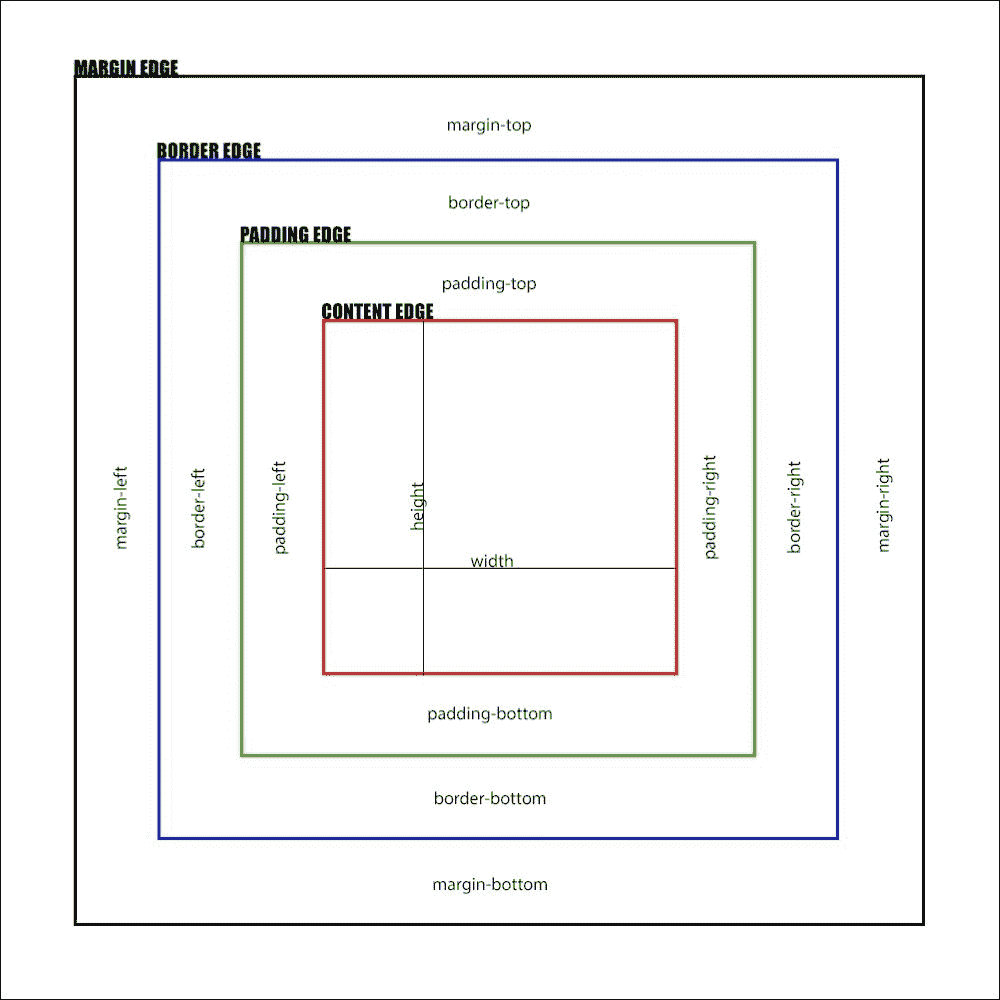
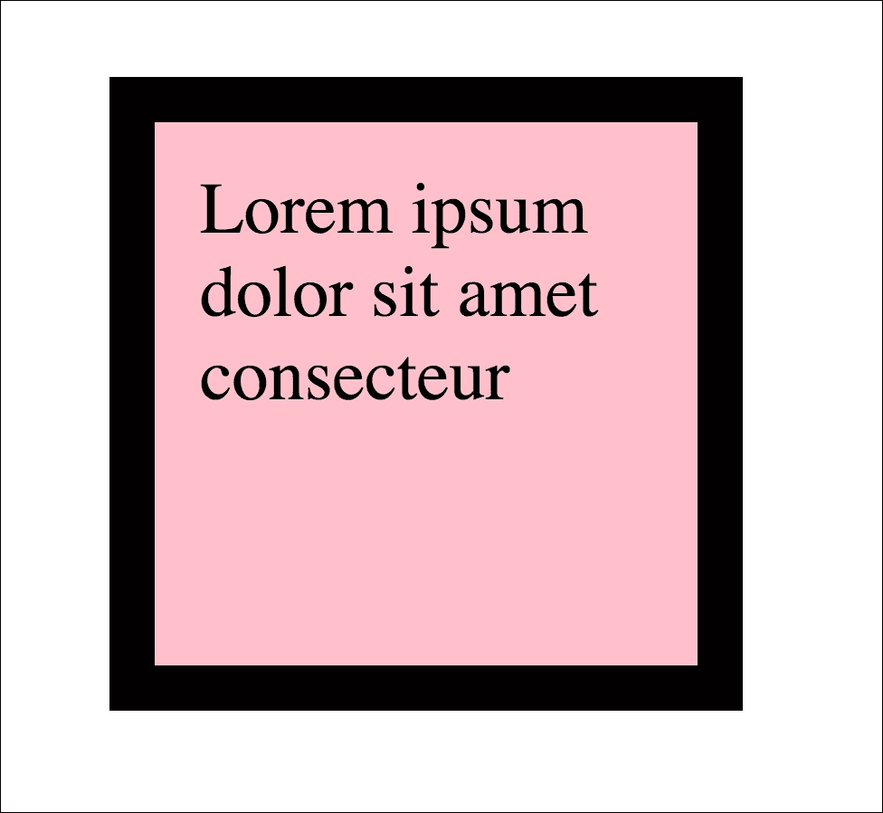
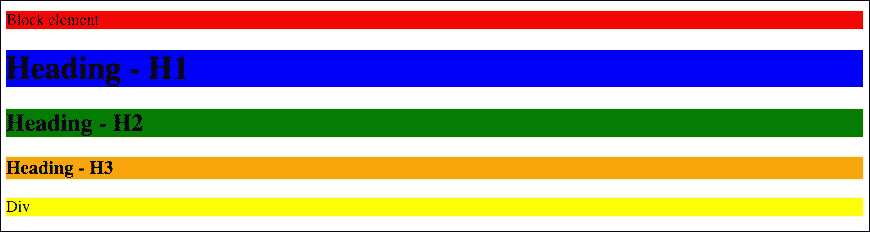
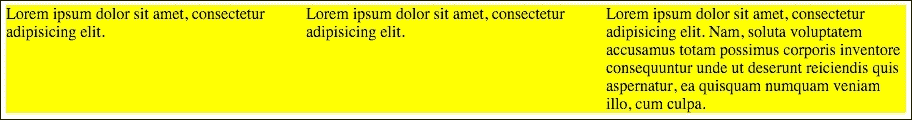
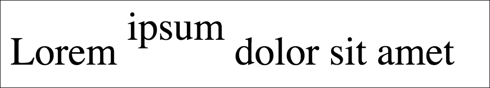
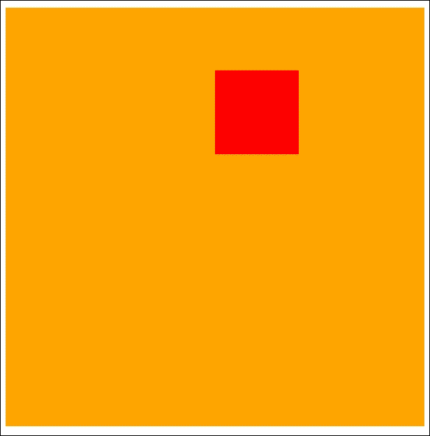
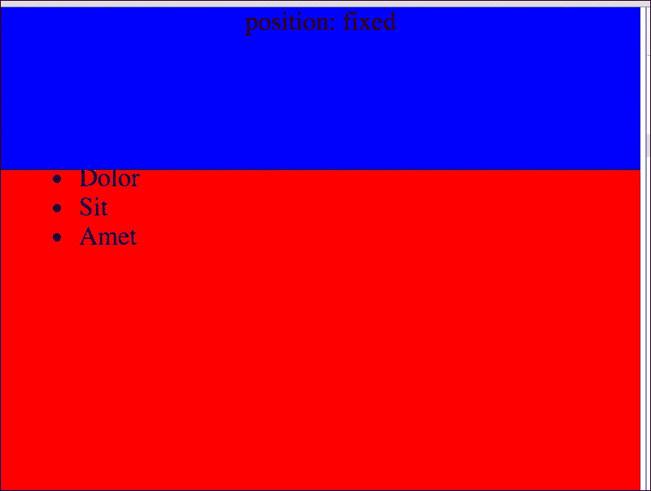
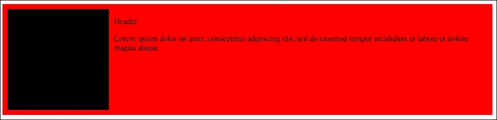

# 第二章：基础的掌握

本章将掌握盒子模型、浮动故障排除定位和显示类型。在本章之后，您将更加了解 HTML 和 CSS 的基础知识。

在本章中，我们将涵盖以下主题：

+   了解传统盒子模型

+   浮动元素的基础知识

+   在网页上定位元素的基础

+   了解显示类型

# 传统的盒子模型

对盒子模型的理解是 CSS 理论的基础。您必须了解宽度、高度、边距和边框对盒子大小的影响，以及如何管理它以匹配网站上的元素。面试中对编码人员和前端开发人员的主要问题基于盒子模型理论。让我们开始这一重要的章节，这将是以后每个主题的基础。

## 填充/边距/边框/宽度/高度

盒子的最终宽度和高度的组成部分如下：

+   宽度

+   高度

+   边距

+   填充

+   边框

为了更好地理解盒子模型，以下是谷歌浏览器检查器的图像：


为了更清晰地理解盒子模型，让我们分析以下图像：



在上图中，您可以看到在盒子模型中，我们有以下四个边缘：

+   内容边缘

+   填充边缘

+   边框边缘

+   边距边缘

盒子的宽度和高度基于以下内容：

+   内容的宽度/高度

+   填充

+   边框

+   边距

默认盒子尺寸中盒子内容的宽度和高度由以下属性控制：

+   最小宽度

+   最大宽度

+   宽度

+   最小高度

+   最大高度

+   高度

盒子模型的一个重要问题是背景属性的行为方式。背景将包括在内容部分和填充部分（到填充边缘）。

让我们获取一个代码并尝试指向盒子模型的所有元素。

HTML 代码：

```css
<div class="element">
  Lorem ipsum dolor sit amet consecteur
</div>
```

CSS 代码：

```css
.element {
   background: pink;
   padding: 10px;
   margin: 20px;
  width: 100px;
  height: 100px;
   border: solid 10px black;
}
```

在浏览器中，我们将看到以下内容：



在谷歌浏览器的检查器视图如下：


让我们检查盒子模型的区域如何放置在以下具体示例中：


面试的前端开发人员的基本任务是：

盒子/元素的样式描述如下：

```css
.box {
    width: 100px;
    height: 200px;
    border: 10px solid #000;
    margin: 20px;
    padding: 30px;
}
```

请计算此元素的最终`宽度`和`高度`（实际所需的空间）。

因此，您可以看到，问题在于计算盒子的宽度和高度。

*宽度*的组成部分如下：

+   宽度

+   左边框

+   右边框

+   左填充

+   右填充

此外，用于盒子占用空间的宽度的图像：

+   左边距

+   右边距

*高度的组成部分*如下：

+   高度

+   顶部边框

+   底部边框

+   顶部填充

+   底部填充

此外，用于盒子占用空间的高度的图像：

+   顶部边距

+   底部边距

因此，当您总结这些元素时，您将得到以下方程：

宽度：

```css
Box width = width + borderLeft + borderRight + paddingLeft + paddingRight
Box width = 100px + 10px + 10px + 30px + 30px = 180px
```

空间宽度：

```css
width = width + borderLeft + borderRight + paddingLeft + paddingRight +  marginLeft + marginRight 
width = 100px + 10px + 10px + 30px + 30px + 20px + 20 px = 220px
```

高度：

```css
Box height = height + borderTop + borderBottom + paddingTop + paddingBottom
Box height  = 200px + 10px + 10px + 30px + 30px = 280px
```

空间高度：

```css
Space height = height + borderTop + borderBottom + paddingTop + paddingBottom +  marginTop + marginBottom
Space height = 200px + 10px + 10px + 30px + 30px + 20px + 20px = 320px
```

您可以在实际浏览器中检查如下所示：


## 省略传统盒子模型的问题（盒子尺寸）

盒子模型的基本理论是非常难学的。您需要记住所有宽度/高度的元素，即使您设置了宽度和高度。初学者最难理解的是填充，它不应计入宽度和高度的组成部分。它应该是*在*盒子内部，并且应该影响这个值。为了改变这些行为，CSS3 支持自 Internet Explorer 8 以来，引入了盒子尺寸。

您可以设置如下值：

```css
box-sizing: border-box
```

这对您有什么好处？最终，盒子的宽度和高度的计算将更容易，因为盒子的填充和边框在盒子内部。因此，如果我们正在进行我们之前的课程：

```css
.box {
    width: 100px;
    height: 200px;
    border: 10px solid #000;
    margin: 20px;
    padding: 30px;
}
```

我们可以轻松计算宽度和高度：

```css
Width = 100px
Height = 200px
```

此外，框所占用的空间：

+   空间宽度= 140px（因为 20px 的边距在左右两侧）

+   空间高度= 240px（因为 20px 的边距在顶部和底部两侧）

以下是来自 Google Chrome 的示例：


因此，如果您不想重复传统框模型的所有问题，您应该全局为所有元素使用它。当然，对于旧项目，例如需要对旧项目进行一些小改动的新客户，不建议使用它。如果您添加以下代码：

```css
* {
width: 100px;
}
```

由于这个属性对现在基于传统框模型的所有元素都有继承，所以可能会带来更多的伤害。但对于所有新项目，您应该使用它。

# 浮动元素

浮动框在现代布局中被广泛使用。浮动框的理论特别在网格系统和 CSS 框架中的内联列表中被使用。例如，Zurb Foundation 框架中的类和 mixin 内联列表是基于浮动的。

## 浮动元素的可能性

元素可以浮动到左侧和右侧。当然，也有一种方法可以重置浮动。可能的值如下：

```css
float: left; // will float element to left
float: right; // will float element to right
float: none; // will reset float 
```

## 最常见的浮动问题

当您使用浮动元素时，可能会遇到一些问题。浮动元素最常见的问题如下：

+   太大的元素（因为宽度、左/右边距、左/右填充和基于框模型的宽度计算不当）

+   未清除的浮动

所有这些问题都会产生特定的效果，您可以轻松识别并进行修复。

当元素太大时，可以通过它们不在一行中来识别。您首先应该检查的是是否应用了`box-sizing: border-box`，然后检查宽度、填充和边距。

您可以轻松识别未清除的浮动，当一些元素的浮动结构来自下一个容器时。这意味着您的浮动容器中没有清除浮动。

## 定义清除浮动/类/混合

当我开始开发 HTML 和 CSS 代码时，有一种方法可以使用`.cb`或`.clear`类来清除浮动，这两种方法都定义如下：

```css
.clearboth, .cb {
    clear: both
}
```

此元素是在所有浮动元素之后的容器中添加的。这一点很重要，要记住清除浮动，因为包含浮动元素的容器不会继承最高浮动元素的高度（其高度将等于`0`），例如：

```css
<div class="container">
    <div class="float">
        … content ...
    </div>
    <div class="float">
        … content ...
    </div>
    <div class="clearboth"></div>
</div>
```

CSS 如下所示：

```css
.float {
    width: 100px;
    height: 100px;
    float: left;
}

.clearboth {
    clear: both
}
```

现在，有一种更好、更快的方法来清除浮动。您可以使用“清除浮动”元素来实现，如下所示：

```css
.clearfix:after {
    content: "";
    visibility: hidden;
    display: block;
    height: 0;
    clear: both;
}
```

您可以在 HTML 代码中使用它：

```css
<div class="container clearfix">
    <div class="float">
        ... content ...
    </div>
    <div class="float">
        ... content ...
    </div>
</div>

</div>
```

打开“清除浮动”的主要原因是您可以节省一个标签（带有`clearboth`类）。推荐的用法是基于 SASS 中定义的“清除浮动”mixin，如下所示：

```css
=clear fix
&:after
    content: ""
    visibility: hidden
    display: block
    height: 0
    clear: both
```

因此，每次您需要在某个容器中清除浮动时，都需要调用它。例如，让我们看看之前的代码：

```css
<div class="container">
<div class="float">
        … content ...
</div>
<div class="float">
        … content ...
</div>
</div>
```

容器可以描述如下：

```css
.container
  +clear fix
```

## 使用浮动元素的示例

浮动元素最常见的用法是网格。网格主要用于构造网页上显示的数据。在本章中，让我们简要检查一下网格的草图。在接下来的章节中，我们将专注于使用 mixin 自动创建网格。

让我们创建一些 HTML 代码：

```css
<div class="row">
    <div class="column_1of2">
        Lorem
    </div>
    <div class="column_1of2">
        Lorem
    </div>

</div>
<div class="row">
    <div class="column_1of3">
        Lorem
    </div>
    <div class="column_1of3">
        Lorem
    </div>
    <div class="column_1of3">
        Lorem
    </div>

</div>

<div class="row">
    <div class="column_1of4">
        Lorem
    </div>
    <div class="column_1of4">
        Lorem
    </div>
    <div class="column_1of4">
        Lorem
    </div>
    <div class="column_1of4">
        Lorem
    </div>
</div>
```

并创建一些 SASS 代码：

```css
*
  box-sizing: border-box

=clear fix
&:after
    content: ""
    visibility: hidden
    display: block
    height: 0
    clear: both

.row
  +clear fix

.column_1of2
  background: orange
  width: 50%
  float: left

&:nth-child(2n)
    background: red

.column_1of3
  background: orange
  width: (100% / 3)
  float: left

&:nth-child(2n)
    background: red

.column_1of4
  background: orange
  width: 25%
  float: left

&:nth-child(2n)
    background: red
```

最终效果如下：


正如您所看到的，我们创建了一个基本网格结构。在放置 HTML 代码的地方，`Lorem`是一个完整的`lorem ipsum`，用来说明网格系统。

# 显示类型

CSS 中有几种显示类型，其定义和行为是前端开发人员的基础。最常见和基本的显示值如下：

+   内联

+   块

+   内联块

+   表格/表格单元格

+   Flex（这将在本书的后续部分中进一步描述）

## 块级元素

块级元素总是从新的一行开始。块级元素最重要的属性是宽度和高度，可以从 CSS 代码中进行更改。为了更好地理解，让我们来看下面的截图：



很容易看到，所有的块级元素都占据尽可能多的宽度。

主要使用的 HTML 块级元素如下：

+   `address`

+   `article`

+   `aside`

+   `blockquote`

+   `canvas`

+   `div`

+   `footer`

+   `form`

+   `h1`，`h2`，`h3`，`h4`，`h5`，`h6`

+   `header`

+   `main`

+   `nav`

+   `ol`

+   `output`

+   `p`

+   `pre`

+   `section`

+   `table`

+   `ul`

+   `video`

## 内联元素

内联元素可以被描述为占据所需的空间的元素。可以通过以下图像最好地描述：


主要使用的 HTML 内联级元素如下：

+   `acronym`

+   `cite`

+   `code`

+   `dfn`

+   `strong`

+   `samp`

+   `var`

+   `a`

+   `bdo`

+   `br`

+   `img`

+   `map`

+   `object`

+   `script`

+   `span`

+   `sub`

+   `sup`

+   `button`

+   `input`

+   `label`

+   `select`

+   `textarea`

## 内联块显示

内联元素是具有内联和块级元素属性的元素。内联元素占据所需的空间，但另外您可以设置它们的宽度、高度和填充。在下面添加的图像中，您可以看到以下代码：

```css
<body>
<p> Block element </p>
<span>Inline element</span>
<p class="width300"> Block element width 300 </p>
<span class="width300">Inline element width 300</span>
<span class="width300 dib"> Block element width 300 </span>
</body>
```

用 SASS 代码描述：

```css
p, span
  background: red

&.width300
    width: 300px

.dib
  display: inline-block
```

编译为 CSS：

```css
p, span {
  background: red;
}
p.width300, 
span.width300 {
    width: 300px;
}

.dib {
  display: inline-block;
}
```


正如您可以轻松看到的，第一个元素是一个块级元素，它占据尽可能多的宽度。第二个元素是内联的。第三个是一个具有固定宽度（300 像素）的块级元素。第四个元素是具有固定宽度（300 像素）的内联元素，但它没有适当的显示类型，因此未应用到该元素。此外，最后一个元素是一个 span，其正常的显示类型是内联的，但在 CSS 中设置为内联块。在此操作之后，您可以设置元素的宽度，并且此外，它会自然地浮动到前一个内联元素。

## 您可以在哪些地方使用其他类型的元素 - 导航

与显示类型相关的最常见问题是内联导航。为了更好地理解，让我们创建一个如下的标记：

```css
<nav class="main-navigation">
    <ul>
        <li>
            <a href="#">First element</a>
        </li>
        <li>
            <a href="#">Second element</a>
        </li>
        <li>
            <a href="#"> Third element</a>
        </li>
    </ul>
</nav>
```

使元素在一行中的最简单方法是使用`float:left`，例如：

```css
.main-navigation
  ul
    +clear fix /* This will prevent problems of cleared float */
    list-style: none

  li
    float: left
```

第二个想法是在`li`元素上使用`display: inline-block`：

```css
.main-navigation
  ul
    list-style: none

  li
    display: inline-block
```

## 您可以在哪些地方使用其他类型的元素 - 等高框的问题

有一个问题，在网页上重复出现，您需要附加一些 JavaScript 代码来应用相同的高度。过去是必须这样做的。首先，测量框的高度，然后将更大的高度设置为将应用于另一个框的高度。最后，将高度应用于所有等高框。

如今，您可以使用`table-cell`值的显示。

HTML 代码：

```css
<div class="equalizer">
    <div class="equalized">
        Lorem ipsum dolor sit amet, consectetur adipisicing elit.
    </div>
    <div class="equalized">
        Lorem ipsum dolor sit amet, consectetur adipisicing elit.
    </div>
    <div class="equalized">
        Lorem ipsum dolor sit amet, consectetur adipisicing elit. Nam, soluta voluptatem accusamus totam possimus corporis inventore consequuntur unde ut deserunt reiciendis quis aspernatur, ea quisquam numquam veniam illo, cum culpa.
    </div>
</div>
```

SASS 代码：

```css
.equalizer
  display: table
  background: orange

.equalized
  display: table-cell
  width: 300px
  background: yellow
```

在浏览器中的效果如下所示：



# CSS 元素定位

在 CSS 中理解位置是前端开发人员的关键技能之一。它可以帮助您改变网页上每个元素的行为。此外，通过混合位置，您可以改变内部（子）元素的行为。

## 静态、相对、绝对、固定 - 差异

静态位置是位置的默认值，包括网页上的每个元素。

相对位置使元素相对于自身。您可以通过以下代码轻松理解它：

```css
<p>
    Lorem
    <span> ipsum</span>
</p>
```

并创建 SASS：

```css
span
  position: relative
  top: -10px
```

在附加样式之前，您应该看到的如下所示：


此外，在附加样式之后，您将看到以下内容：



正如您所看到的，当我们将位置更改为`relative`并使用 top、left、right 或 bottom 属性移动它时，我们将从当前位置移动元素。

此外，相对定位的元素可以被设置为绝对定位内部元素的作用域，例如，HTML：

```css
<div class="relative">
    <div class="absolute"></div>
</div>
```

SASS：

```css
.relative
  width: 200px
  height: 200px
  background: orange
  position: relative

.absolute
  width: 40px
  height: 40px
  background: red
  position: absolute
  left: 100px
  top: 30px
```

在浏览器中的效果如下所示：



橙色框是一个`.relative`元素。较小的框是绝对定位的，并与`relative`元素相关。

`absolute`定位可以像上面的例子一样使用。但是当没有父相对元素时会发生什么？绝对定位的元素将与 HTML DOM 元素相关联。

*固定*元素严格固定在浏览器中。因此，当您将 position: `fixed`应用于任何元素并给它 top: `0`和 left: `0`时，该元素将固定在浏览器的左上角。即使进行滚动操作，元素的位置也不会相对于浏览器发生变化。

以下代码将展示固定元素的行为。

HTML：

```css
<body>
<div class="fixed">
    position: fixed
</div>

<ul>
    <li>Lorem</li>
    <li>Ipsum</li>
    <li>Dolor</li>
    <li>Sit</li>
    <li>Amet</li>
</ul>
</body>
```

SASS：

```css
body
  padding-top: 100px
  background: red

.fixed
  position: fixed
  text-align: center
  top: 0
  left: 0
  height: 100px
  width: 100%
  background: blue

ul
  height: 2000px
```

如您在上述代码中所见，`body`元素具有`padding-top`，其值等于`.fixed`元素的高度。这是由`fixed`元素引起的，通常情况下，当您移除填充时，`fixed`元素将覆盖`body`内容（它将覆盖此元素）。以下截图显示了滚动操作之前的浏览器，下一截图显示了滚动操作之后的浏览器。两个截图都包含了浏览器的边框，以显示正确的滚动操作。



可以添加到具有`relative`/`fixed`/`absolute`位置的元素的重要属性如下：

+   左侧

+   右侧

+   顶部

+   底部

+   Z-index

在编写位置时常见的问题是通过应用`right`值来覆盖`left`值。示例代码如下：

```css
.element
  position: absolute
  left: 10px
  right: 20px
```

`.element`仍将固定在其左侧位置。如何将其附加到右侧位置？

```css
.element
  position: absolute
  left: auto
  right: 20px
```

## 固定图像的列表（右侧或左侧）和描述

这是一个与列表相关的常见问题。具有固定宽度和高度的固定图像的文章列表在一侧，而右侧具有弹性内容可能会在没有`relative`和`absolute`位置的情况下出现问题。以下是一个例子。

HTML：

```css
<article>
    <div class="image">
        
    </div>
    <div class="content">
        <p class="header">Header</p>
        <p class="description">Lorem ipsum dolor sit amet, consectetur adipiscing elit, sed do eiusmod tempor incididunt ut labore et dolore magna aliqua</p>
    </div>
</article>
```

SASS：

```css
*
  box-sizing: border-box

article
  position: relative
  padding: 10px
    left: 220px
  height: 220px
  background: red

  .image
    position: absolute
    left: 10px
    top: 10px
    background: #000
    width: 200px
    height: 200px

  .content
    width: 100%
```

编译后的 CSS 代码：

```css
* {
    box-sizing: border-box;
}

article {
    position: relative;
    padding: 10px;
    padding-left: 220px;
    height: 220px;
    background: red;
}

article .image {
    position: absolute;
    left: 10px;
    top: 10px;
    background: #000;
    width: 200px;
    height: 200px;
}

article .content {
    width: 100%;
}
```

在浏览器中的效果如下所示：



调整浏览器大小后的效果如下所示：


当您想要在右侧获取图像时，您需要进行以下更改：

```css
article
  position: relative
  padding: 10px
    right: 220px // change here
height: 220px
  background: red

  .image
    position: absolute
    right: 10px // change here
top: 10px
    background: #000
    width: 200px
    height: 200px
```

编译后的 CSS：

```css
* {
    box-sizing: border-box;
}

article {
    position: relative;
    padding: 10px;
    padding-right: 220px;
    height: 220px;
    background: red;
}

article .image {
    position: absolute;
    right: 10px;
    top: 10px;
    background: #000;
    width: 200px;
    height: 200px;
}
```

在浏览器中的效果如下所示：


# 总结

本章为专业使用 CSS 建立了坚实的基础。您已经了解了盒模型、位置和浮动元素的知识。下一章将讲述关于伪类的故事。
