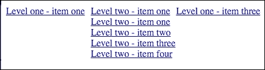
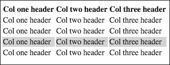
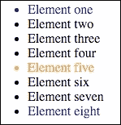
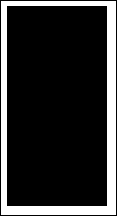
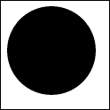
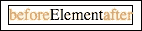
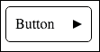

# 第三章：掌握伪元素和伪类

使用 CSS 添加网站上的简单交互自从伪类可用以来就已经很常见了。了解如何在网站上使用这个功能非常重要。伪元素可以在诸如 Internet Explorer 8/9 +之类的浏览器中使用，并且可以帮助处理一些在网页上重复出现的元素，这些元素在大多数情况下是通过空的`spans`和`divs`添加的，例如按钮中的图形细节，三角形等。使用伪元素，您可以在不创建 DOM 元素的情况下添加这些元素。

绘制基本图形是一项非常重要的技能，特别是当你将它们与伪元素链接在一起时，你可以在其中添加它们。添加三角形或其他特定元素可能是一个非常重要的功能，因为你不必将这些图形元素作为背景或`img`元素进行裁剪。

本章将掌握 CSS 代码中的伪元素，伪类和基本图形的绘制。最后，在每个部分中，您可以将这些元素组合成实用且可重用的代码。

在本章中，我们将：

+   学习伪类的使用

+   学习伪元素的使用

+   学习如何绘制基本图形

+   在 SASS 中创建大量可重用的混合

# 伪类

伪类用于描述元素在特定操作后的行为。伪类支持的操作如下：

+   鼠标悬停

+   鼠标点击/触摸

+   输入焦点

伪类的另一个用途是匹配特定容器中的元素，描述了容器中的顺序：

+   第一个子元素，最后一个子元素

+   任何子元素

+   任何类型的子元素

伪类的最重要特性可以在链接（带有`href`属性的`<a>`元素）上看到。

## 我们如何检查：活动状态，悬停状态？

悬停状态可以在将鼠标指针移动到链接上时进行检查。这个属性最简单的用法可以通过以下代码进行检查：

HTML：

```css
<a href="#"> Title of link</a>
```

SASS：

```css
a
  color: #000
  background: #fff

a:hover
  color: #fff
  background: #000
```

生成的 CSS 代码：

```css
a {
    color: #000;
    background: #fff;
}

a:hover {
    color: #fff;
    background: #000;
}
```

使用上述代码，当你将鼠标悬停在链接上时，链接的颜色和背景将会改变。

## 用法-多级菜单

多级菜单是悬停状态的最常见用法。下拉菜单可以使用简单的 HTML 和 CSS 开发。您几乎可以在每个网站上看到它。了解如何构建它可以成为更复杂解决方案的基础。让我们构建一个多级导航，并以以下内容为基础：

HTML 代码：

```css
<ul>
    <li>
        <a href="#">Level one - item one</a>
        <ul>
            <li><a href="#">Level two - item one</a></li>
            <li><a href="#">Level two - item two</a></li>
            <li><a href="#">Level two - item three</a></li>
            <li><a href="#">Level two - item four</a></li>
        </ul>
    </li>
    <li>
        <a href="#">Level two - item one</a>
        <ul>
            <li><a href="#">Level two - item one</a></li>
            <li><a href="#">Level two - item two</a></li>
            <li><a href="#">Level two - item three</a></li>
            <li><a href="#">Level two - item four</a></li>
        </ul>
    </li>
    <li>
        <a href="#">Level one - item three</a>
        <ul>
            <li><a href="#">Level three - item one</a></li>
            <li><a href="#">Level three - item two</a></li>
            <li><a href="#">Level three - item three</a></li>
            <li><a href="#">Level three - item four</a></li>
        </ul>
    </li>
<ul>
```

SASS 代码：

```css
ul
  list-style: none
  padding: 0

ul > li
  float: left
  display: inline-block
  position: relative
  margin-right: 10px

  &:hover
    ul
      display: block
      width: 200px

ul ul
  display: none
  position: absolute
  left: 0

  li
    display: block
```

编译后的 CSS：

```css
ul {
    list-style: none;
    padding: 0;
}

ul >li {
    float: left;
    display: inline-block;
    position: relative;
    margin-right: 10px;
}

ul >li:hover ul {
    display: block;
    width: 200px;
}

ul ul {
    display: none;
    position: absolute;
    left: 0;
}

ul ul li {
    display: block;
}
```

在任何元素上悬停时的效果可以在以下截图中看到：


在悬停在第二个元素后：



## 用法- CSS 悬停行

在简短的 HTML 表格中，阅读所有内容很容易。但是在您有大量数据（特别是在金融网站上）分配在许多行和列中的情况下，很容易使表格变得难以阅读。有几种方法可以简化阅读过程。最简单的方法是为所有行添加悬停效果。每次指向一行时，它都会改变背景颜色。让我们使用以下 HTML 代码：

```css
<table>
    <thead>
    <tr>
        <th> Col one header</th>
        <th> Col two header</th>
        <th> Col three header</th>
    </tr>
    </thead>
    <tbody>
    <tr>
        <td> Col one header</td>
        <td> Col two header</td>
        <td> Col three header</td>
    </tr>
    <tr>
        <td> Col one header</td>
        <td> Col two header</td>
        <td> Col three header</td>
    </tr>
    <tr>
        <td> Col one header</td>
        <td> Col two header</td>
        <td> Col three header</td>
    </tr>
    <tr>
        <td> Col one header</td>
        <td> Col two header</td>
        <td> Col three header</td>
    </tr>
    </tbody>
</table>
```

假设行数（`tbody`中的`tr`元素）几乎是无限的。这可能会给我们带来一个非常长的表格。为了方便阅读，我们可以为每一行添加悬停效果，如下所示：

SASS：

```css
tbody
  tr:hover
    background: #d3d3d3
```

编译后的 CSS：

```css
tbody tr:hover {
    background: #d3d3d3;
}
```

每次悬停在每一行上时，您可以看到以下截图中显示的效果（灰色行被悬停）：



# 伪类的用法

新的伪类为 CSS/HTML 编码人员打开了新的视野。大多数功能，如`first-child`，`last-child`和`nth-child`，都是通过 JavaScript 代码添加的。例如，使用 jQuery 代码，您可以获取一个列表元素，并向第一个/最后一个/nth 元素添加特定类，然后正确创建选择器，您可以添加 CSS 代码。

但是当它被浏览器原生支持时，最好使用 CSS。让我们收集关于这个功能的基本知识。

## 如何使用：first-child，:last-child，:nth-child()

这些伪元素的简短介绍如下：

+   `:first-child`：这指向其父元素的第一个子元素

+   `:last-child`：这指向其父元素的最后一个子元素

+   `:nth-child()`：这指向与`()`中包装的模式匹配的元素

检查其工作原理的最简单方法是创建一个带有新元素的无序列表：

```css
<ul>
    <li>Element one</li>
   <li>Element two</li>
   <li>Element three</li>
   <li>Element four</li>
   <li>Element five</li>
   <li>Element six</li>
   <li>Element seven</li>
   <li>Element eight</li>
</ul>
```

假设我们需要为列表的元素添加样式。我们需要添加的第一个样式仅与列表的第一个元素相关。最简单的方法是向该元素添加特定的类，如下所示：

```css
<li class="first_element>Element one</li>
```

然后为其添加特定的 CSS/SASS 代码：

SASS 代码：

```css
.first_element
  color: #f00
```

编译为 CSS：

```css
.first_element {
    color: #f00;
}
```

使用新伪类：

```css
li:first-child
  color: #00f
```

或：

```css
li:nth-child(1)
  color: #00f
```

编译为：

```css
li:first-child {
    color: #00f;
}

li:nth-child(1) {
    color: #00f;
}
```

我们需要追加的第二种样式是使最后一个元素的文本颜色变为蓝色。最简单的方法是更改 HTML 代码：

```css
<li class="last_element">Element eight</li>
```

然后为其添加特定的 CSS/SASS 代码：

```css
.last_element
  color: #00f
```

编译为：

```css
.last_element {
  color: #00f;
}
```

使用新伪类：

```css
li:last-child
  color: #00f
```

编译为：

```css
li:last-child {
  color: #00f; 
}
```

在这种情况下，我们不关心列表中元素的数量。列表的最后一个元素将始终具有前面的 CSS 代码。

为第八个元素添加样式，如下所示：

```css
li:nth-child(8)
  color: #00f
```

编译后：

```css
li:nth-child(8) {
  color: #00f; 
}
```

在这种情况下，我们关心的是计数元素。列表的第八个元素将始终具有前面的 CSS 代码。

假设我们想要使第五个元素变为橙色。最简单的方法是更改 HTML 代码：

```css
<li class="fifth_element">Element five</li>
```

然后追加 CSS 代码：

```css
.fifth_element
  color: orange
```

使用伪类，我们可以这样绘制 SASS：

```css
li:nth-child(5)
  color: orange
```

在浏览器中的代码：



## 用法-为表格添加样式

实际示例对于学习是最好的。我们可以使用伪类的所有属性的最常见的情况是表格。让我们看一下以下 HTML 代码：

```css
<table>
    <thead>
    <tr>
        <th> Col one header</th>
        <th> Col two header</th>
        <th> Col three header</th>
    </tr>
    </thead>
    <tbody>
    <tr>
        <td> Col one content</td>
        <td> Col two content</td>
        <td> Col three content</td>
    </tr>
    <tr>
        <td> Col one content</td>
        <td> Col two content</td>
        <td> Col three content</td>
    </tr>
    <tr>
        <td> Col one content</td>
        <td> Col two content</td>
        <td> Col three content</td>
    </tr>
    <tr>
        <td> Col one content</td>
        <td> Col two content</td>
        <td> Col three content</td>
    </tr>
    </tbody>
</table>
```

让我们为表格添加斑马条纹样式；这样可以更轻松地阅读表格：

```css
tbody
  tr:nth-child(2n)
    background: #d3d3d3
```

编译后的 CSS：

```css
tbody tr:nth-child(2n) {
    background: #d3d3d3;
}
```

这种样式将为表格中的每个第二个元素添加灰色背景，如下面的屏幕截图所示：


## 探索:nth-child 参数

作为`:nth-child`基于选择器的参数，您可以使用以下任何一个：

+   **Even**：这将匹配所有偶数元素

+   **Odd**：这将匹配所有奇数元素

此外，您可以使用*an+b*参数，例如：

+   **3n+1**：这将匹配具有索引（从 1 开始计数）的元素：1, 4, 7, 10,…

+   **–n+5**：这将匹配从 1 到 5 的元素

+   **2n+4**：这将匹配元素：4, 6, 8, 10, 12, …

## 如何使用:nth-last-child

这个伪类与`nth-child`类似。不同之处在于`nth-child`从列表的开头开始工作，而`nth-last-child`从列表的末尾开始工作：

+   **Even**：这将匹配从最后一个元素开始的所有偶数元素

+   **Odd**：这将匹配从最后一个元素开始的所有奇数元素

您可以使用*an+b*参数，就像我们在`nth-child`中使用的那样：

+   **3n+1**：这将匹配具有索引（从最后一个元素开始计数）的元素：1, 4, 7, 10,…

+   **–n+5**：这将匹配最后五个元素

+   **2n+4**：这将匹配元素：4, 6, 8, 10, 12, …（从最后一个元素开始计数）

## 如何使用:first-of-type、:last-of-type、:nth-of-type 和:nth-last-of-type

这些伪类与容器中的元素相关联，其中聚集了一些元素。它的工作方式类似于 nth-child 机制。为了更好地理解，让我们从以下 HTML 代码开始：

```css
<div class="parent">
    <span>First span</span><br/>
    <strong>First strong</strong><br/>
    <span>Second span</span><br/>
    <strong>Second strong</strong><br/>
    <span>Third span</span><br/>
    <strong>Third strong</strong><br/>
    <span>Fourth span</span><br/>
    <strong>Fourth strong</strong><br/>
    <span>Fifth span</span>
</div>
```

SASS 代码：

```css
.parent
  span
    &:first-of-type
      color: red

    &:last-of-type
      color: red

  strong
    &:nth-of-type(2)
      color: pink

    &:nth-last-of-type(2)
      color: magenta
```

编译为 CSS：

```css
.parent span:first-of-type {
    color: red;
}

.parent span:last-of-type {
    color: red;
}

.parent strong:nth-of-type(2) {
    color: pink;
}

.parent strong:nth-last-of-type(2) {
    color: magenta;
}
```

让我们解释一下：

+   **.parent span:first-of-type**：这将匹配`.parent div (<div class="parent">)`中的第一个元素，即`span`

+   **.parent span:last-of-type**：这将匹配`.parent`中的最后一个元素，即`span`

+   **.parent strong:nth-of-type(2)**：这将匹配第二个元素，即`strong`

+   **.parent strong:nth-last-of-type(2)**：这将匹配从最后一个元素开始计数的第二个元素，*即强调*，如下面的屏幕截图所示：

## 使用:empty 伪类的空元素

有时，您需要处理列表，其中需要使用一段 CSS 代码处理空元素，另一段 CSS 代码处理有内容的元素。最简单的方法是向其元素添加*empty*类，而无需干扰 HTML 代码。让我们看看 HTML 代码：

```css
<ul>
    <li class="box">Black text</li>
    <li class="box"></li>
    <li class="box">Black text</li>
    <li class="box"></li>
    <li class="box"></li>
    <li class="box">Black text</li>
    <li class="box"></li>
</ul>
```

和 SASS 代码：

```css
ul
  list-style: none

.box
  background: white
  color: black
  text-align: center
  height: 100px
  width: 100px
  float: left

.box:empty
  color: black
  background: black
```

编译为 CSS：

```css
ul {
    list-style: none;
}

.box {
    background: white;
    color: black;
    text-align: center;
    height: 100px;
    width: 100px;
    float: left;
}

.box:empty {
    color: black;
    background: black;
}
```

这将在浏览器中显示以下视图：


很容易分析上述代码。所有空元素（没有子元素的元素）都具有黑色背景。所有具有子元素的元素都具有白色背景和黑色文本。

# 使用伪类支持表单样式

您可以使用 CSS 代码支持表单的验证和简单交互。在接下来的几节中，您将看到如何使用 CSS 选择器进行简单验证和输入的简单交互。使用适当的 CSS 代码，您还可以检查任何元素是否为必填或禁用。让我们看看这是如何完成的。

## 使用:valid 和:invalid 进行验证

以前的验证是使用 JavaScript 代码完成的。使用适当的 CSS 代码，您只需使用良好的选择器即可完成。让我们使用 HTML 和 CSS 代码进行检查：

HTML 代码：

```css
<form class="simple_validation">
    <input type="number" min="5" max="10" placeholder="Number">
    <input type="email" placeholder="Email">
    <input type="text" required placeholder="Your name"/>
</form>
```

SASS 代码：

```css
.simple_validation
  padding: 10px
  width: 400px
  box-sizing: border-box

  &:valid
    background: lightgreen

  &:invalid
    background: lightcoral

  input
    display: block
    margin: 10px 0
    width: 100%
    box-sizing: border-box

    &:valid
      border: 3px solid green

    &:invalid
      border: 3px solid red
```

编译后的 CSS：

```css
.simple_validation {
    padding: 10px;
    width: 400px;
    box-sizing: border-box;
}

.simple_validation:valid {
    background: lightgreen;
}

.simple_validation:invalid {
    background: lightcoral;
}

.simple_validation input {
    display: block;
    margin: 10px 0;
    width: 100%;
    box-sizing: border-box;
}

.simple_validation input:valid {
    border: 3px solid green;
}

.simple_validation input:invalid {
    border: 3px solid red;
}
```

在上面的示例中，您可以检查有效和无效伪类的工作原理。每次将电子邮件输入到电子邮件字符串中，而该字符串不是电子邮件地址时，输入框将具有红色边框，并且表单的背景颜色将更改为浅红色（`lightcoral`）。在输入数字的情况下也是如此，该数字需要在 5 到 10 的范围内。另外，对于类型为文本的输入，添加了 required 属性。如果没有输入，它具有`:invalid`伪类。

## 添加输入状态：:focus，:checked，:disabled

焦点伪类与当前接收焦点的输入相关。请记住，用户可以使用鼠标指针和键盘上的 Tab 键来完成此操作。伪类 checked 与输入类型为复选框和单选按钮相关，并匹配状态更改为已选中的元素。为了展示它的确切工作原理，让我们修改我们在上一节中使用的 HTML 代码：

HTML 代码：

```css
<form class="simple_validation">
    <input type="number" min="5" max="10" placeholder="Number">
    <input type="email" placeholder="Email">
    <input type="text" required placeholder="Your name"/>

    <input type="checkbox" id="newsletter"></input>
    <label for="newsletter">checked</label>
</form>
```

SASS 代码：

```css
.simple_validation
  padding: 10px
  width: 400px
  box-sizing: border-box

  &:valid
    background: lightgreen

  &:invalid
    background: lightcoral

  label
    display: inline-block

    &:before
      content: 'Not '

  input
    display: block
    margin: 10px 0
    width: 100%
    box-sizing: border-box

    &:valid
      border: 3px solid green

    &:invalid
      border: 3px solid red

    &:focus
      background: orange
      color: red
      border: 3px solid orange

    &[type="checkbox"]
      display: inline-block
      width: 20px

      &:checked
        & + label
          color: red

          &:before
            content: 'Is '
```

编译后的 CSS：

```css
.simple_validation {
    padding: 10px;
    width: 400px;
    box-sizing: border-box;
}

.simple_validation:valid {
    background: lightgreen;
}

.simple_validation:invalid {
    background: lightcoral;
}

.simple_validation label {
    display: inline-block;
}

.simple_validation label:before {
    content: "Not ";
}

.simple_validation input {
    display: block;
    margin: 10px 0;
    width: 100%;
    box-sizing: border-box;
}

.simple_validation input:valid {
    border: 3px solid green;
}

.simple_validation input:invalid {
    border: 3px solid red;
}

.simple_validation input:focus {
    background: orange;
    color: red;
    border: 3px solid orange;
}

.simple_validation input[type="checkbox"] {
    display: inline-block;
    width: 20px;
}

.simple_validation input[type="checkbox"]:checked + label {
    color: red;
}

.simple_validation input[type="checkbox"]:checked + label:before {
    content: "Is ";
}
```

上面的示例为表单添加了更多的交互性。第一个新功能是将焦点元素的颜色更改为红色，其背景/边框更改为橙色。第二个功能是与复选框相关的交互。在将其状态更改为已选中后，它将更改`:before`元素（这将在下一节中更好地描述）。在初始化时，`:before`元素设置为`"Not"`。使用 HTML 代码完全给出`"Not checked"`。复选框选中后，`before`元素更改为`"Is"`，并显示完整字符串等于`"Is checked"`。

让我们看看在浏览器中它将是什么样子。以下屏幕截图出现在页面的开头：


当复选框被选中时，将出现以下内容：


标签的 before 元素发生了可见的变化，如下面的屏幕截图所示，它还显示了输入的焦点：

添加输入状态：:focus，:checked，:disabled

验证后的表单如下：


## 额外的方面-给占位符着色

是的，当然！您需要为占位符添加样式。您可以这样做，但是需要额外添加前缀：

对于 Internet Explorer：

```css
:-ms-input-placeholder
```

对于 Firefox：

```css
:-moz-placeholder
```

对于 WebKit 浏览器：

```css
::-webkit-input-placeholder
```

# 使用 CSS 绘制基本图形

绘图原语是图形基础中最简单和主要的情况。在 CSS 中，它可以在常见情况下使用，比如为按钮或任何其他 DOM 元素添加细节。让我们学习在 CSS 中绘制原语的基础知识。

## 如何画一个矩形/正方形

在 CSS 中最容易绘制的原语是矩形。让我们使用以下代码绘制一个简单的矩形：

HTML 代码：

```css
<div class="rectangle"></div>
```

SASS 代码：

```css
.rectangle
width: 100px
height: 200px
background: black
```

编译后的 CSS：

```css
.rectangle {
    width: 100px;
    height: 200px;
    background: black;
}
```

这将在浏览器中绘制一个矩形，如下所示：



要画一个正方形，我们需要创建以下代码：

HTML 代码：

```css
<div class="square"></div>
```

SASS 代码：

```css
.square
width: 100px
height: 100px
background: black
```

编译后的 CSS：

```css
.square {
    width: 100px;
    height: 100px;
    background: black;
}
```

可重用的混合器用于正方形和矩形：

```css
=rectangle($w, $h, $c)
  width: $w
  height: $h
  background: $c

=square($w, $c)
  width: $w
  height: $w
  background: $c
```

## 如何画一个圆

画一个圆非常简单。这种方法是基于边框半径和一个简单的矩形，如下面的例子所示：

HTML 代码：

```css
<div class="circle"></div>
```

SASS 代码：

```css
.circle
    width: 100px
    height: 100px
    border-radius: 50%
    background: black
```

编译后的 CSS：

```css
.circle {
    width: 100px;
    height: 100px;
    border-radius: 50%;
    background: black;
}
```

在浏览器中，你将看到以下内容：



SASS 混合器：

```css
=circle($size, $color)
  width: $size
  height: $size
  border-radius: 50%
  background: $color
```

## 如何画一个环

画一个环非常类似于画一个圆。模式是一样的，但是有一个适当的边框。让我们从初始的环标记开始：

HTML 代码：

```css
<div class="ring"></div>
```

SASS 代码：

```css
.ring
  width: 100px
  height: 100px
  border-radius: 50%
  border: 2px solid black
  background: none
```

编译后的 CSS：

```css
.ring {
    width: 100px;
    height: 100px;
    border-radius: 50%;
    border: 2px solid black;
    background: none;
}
```

在浏览器中，你将看到以下内容：


SASS 混合器：

```css
=ring($size, $color, $width)
  width: $size
height: $size
border-radius: 50%
  border: $width solid $color
background: none
```

## 如何用 CSS 画一个三角形

画一个三角形是基于边框的一个技巧：

HTML 代码：

```css
<div class="triangle-up"></div><br>
<div class="triangle-down"></div><br>
<div class="triangle-left"></div><br>
<div class="triangle-right"></div>
```

`br`元素仅用于在不同行中显示所有元素。

SASS 代码：

```css
.triangle-up
    width: 0 
    height: 0
    border-left: 10px solid transparent 
    border-right: 10px solid transparent
    border-bottom: 10px solid black

.triangle-down 
    width: 0 
    height: 0 
    border-left: 10px solid transparent
    border-right: 10px solid transparent
    border-top: 10px solid black

.triangle-left 
    width: 0 
    height: 0
    border-top: 10px solid transparent 
    border-bottom: 10px solid transparent
    border-left: 10px solid black 

.triangle-right 
    width: 0
    height: 0
    border-top: 10px solid transparent
    border-bottom: 10px solid transparent
    border-right: 10px solid black
```

编译后的 CSS：

```css
.triangle-up {
    width: 0;
    height: 0;
    border-left: 10px solid transparent;
    border-right: 10px solid transparent;
    border-bottom: 10px solid black;
}

.triangle-down {
    width: 0;
    height: 0;
    border-left: 10px solid transparent;
    border-right: 10px solid transparent;
    border-top: 10px solid black;
}

.triangle-left {
    width: 0;
    height: 0;
    border-top: 10px solid transparent;
    border-bottom: 10px solid transparent;
    border-left: 10px solid black;
}

.triangle-right {
    width: 0;
    height: 0;
    border-top: 10px solid transparent;
    border-bottom: 10px solid transparent;
    border-right: 10px solid black;
}
```

在浏览器中，你将看到以下内容：


SASS 混合器：

```css
=triangleRight($width, $height, $color)
  width: 0
  height: 0
  border-style: solid
  border-width: $height/2 0 $height/2 $width
  border-color: transparent transparent transparent $color

=triangleLeft($width, $height, $color)
  width: 0
  height: 0
  border-style: solid
  border-width: $height/2 $width $height/2 0
  border-color: transparent $color transparent transparent

=triangleTop($width, $height, $color)
  width: 0
  height: 0
  border-style: solid
  border-width: 0 $width/2 $height $width/2
  border-color: transparent transparent $color transparent

=triangleBottom($width, $height, $color)
  width: 0
  height: 0
  border-style: solid
  border-width: $height $width/2 0 $width/2
  border-color: $color transparent transparent transparent
```

# 伪元素

使用伪元素真的很重要，可以省略需要特定 HTML 代码的重复代码元素。伪元素的主要目的是减少 HTML 代码中的 DOM 元素。

## 什么是:before 和:after？

`:before`和`:after`是伪元素，你可以添加到 HTML 元素中。一个元素被添加为内联元素到一个选定的元素中。要获得`before`和`after`伪元素的基础，你可以绘制如下的 HTML 代码：

```css
<a>Element</a>
```

并附加以下 SASS 代码：

```css
a
  border: 1px solid #000

  &:before
    content: 'before'
    color: orange

  &:after
    content: 'after'
    color: orange
```

编译后的 CSS：

```css
a {
    border: 1px solid #000;
}

a:before {
    content: "before";
    color: orange;
}

a:after {
    content: "after";
    color: orange;
}
```

上述代码的输出如下：



## 我们在哪里可以使用:before 和:after？

让我们假设一个任务，我们需要为列表中的每个元素添加一些文本。例如，我们有一个如下所示的列表：

```css
<ul>
    <li>Mike</li>
    <li>Ravi</li>
    <li>Adam</li>
    <li>Greg</li>
    <li>Anna</li>
</ul>
```

我们需要添加每个人都是前端开发者：

```css
ul
  li
&:before
content: "My name is "
      color: #f00

&:after
content: ". I'm Front End Developer"
      color: #f00
```

编译后的 CSS：

```css
ul li:before {
    content: "My name is ";
    color: #f00;
}

ul li:after {
    content: ". I'm Front End Developer";
    color: #f00;
}
```

在浏览器中，你将看到以下内容：


让我们使我们之前的代码可重用，并让我们创建一个带有箭头的按钮。HTML 代码将如下所示：

```css
<a href="#">Button</a>
```

让我们将之前创建的三角形混合器重新用到以下 SASS 代码的最后一行 CSS 代码中：

```css
=triangleRight($width, $height, $color)
  width: 0
  height: 0
  border-style: solid
  border-width: $height/2 0 $height/2 $width
  border-color: transparent transparent transparent $color

a
  display: inline-block
  border: 1px solid #000
    radius: 5px
  padding: 10px 40px 10px 10px
  position: relative
  text-decoration: none
  color: #000

  &:after
    display: block
    position: absolute
    right: 10px
    top: 50%
    margin-top: -5px
    content: ''
    +triangleRight(10px, 10px, #000)
```

编译后的 CSS：

```css
a {
    display: inline-block;
    border: 1px solid #000;
    border-radius: 5px;
    padding: 10px 40px 10px 10px;
    position: relative;
    text-decoration: none;
    color: #000;
}

a:after {
    display: block;
    position: absolute;
    right: 10px;
    top: 50%;
    margin-top: -5px;
    content: "";
    width: 0;
    height: 0;
    border-style: solid;
    border-width: 5px 0 5px 10px;
    border-color: transparent transparent transparent #000;
}
```

这将在浏览器中给我们以下结果：



## 第一个字母和第一行-简单的文本操作

在网页上，有些情况下，你需要为文本的第一行和文本的第一个字母添加样式。使用 CSS，你必须使用适当的选择器来做到这一点。让我们使用以下 HTML 代码：

```css
<p>Paragraph lorem ipsm Lorem ipsum dolor sit amet, consectetur adipisicing elit. Totam nisi soluta doloribus ducimus repellat dolorum quas atque, tempora quae, incidunt at eius eaque sit, culpa eum ut corporis repudiandae.</p>
```

在 SASS 文件中：

```css
p
  &:first-letter
    color: orange
    font:
      weight: bold
      size: 20px

  &:first-line
    color: pink
```

编译后的 CSS：

```css
p:first-letter {
    color: orange;
    font-weight: bold;
    font-size: 20px;
}

p:first-line {
    color: pink;
}
```

上述代码将把文本的第一行颜色改为粉色。第一个字母将被改为`橙色`颜色，`粗体`，`20px`大小。

## 如何改变选择颜色？使用::selection

公司有他们自己的颜色调色板。有时你需要自定义页面上选择的颜色。这可以通过`:selection`伪元素来实现：

SASS 代码：

```css
::-moz-selection,
::selection
background: red
color: white
```

编译后的 CSS：

```css
::-moz-selection,
::selection {
    background: red;
    color: white;
}
```

使用上述代码，每当你在页面上选择某些内容时，选择的颜色将变为`红色`，字体颜色将变为`白色`。

# 总结

在本章中，您学习了 CSS 代码中伪类、伪元素和基本图形的绘制基础。作为前端开发人员，您将经常使用这些 CSS 元素。伪类为您提供基本的交互性（悬停、激活），并扩展了选择器的可能性（`:nth-child`、`:first-child`、`:last-child`）。通过伪元素，您可以用 CSS 代码扩展 HTML 的可能性（`:before`、`:after`、`:first-letter`、`:first-line`），并且可以为选择设置样式。

在下一章中，您将获得有关媒体查询的基本知识，这是响应式网站的基础。
