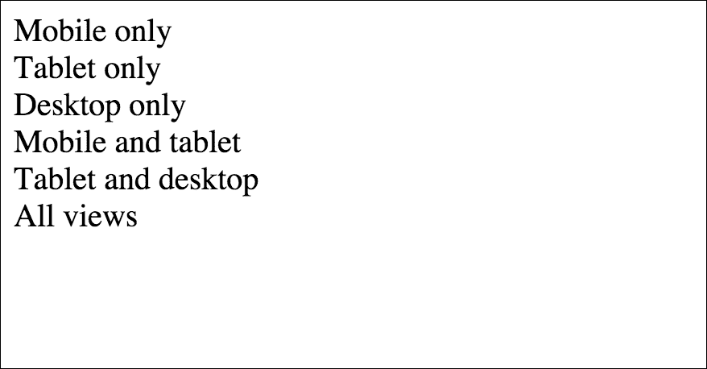
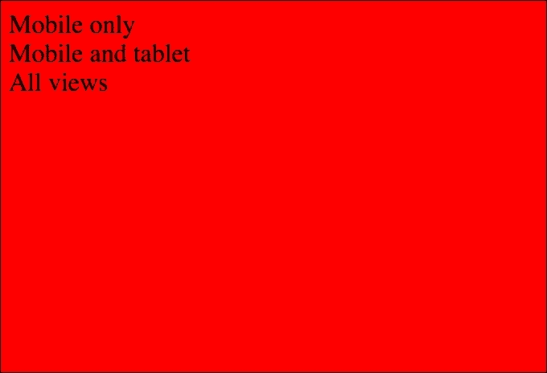
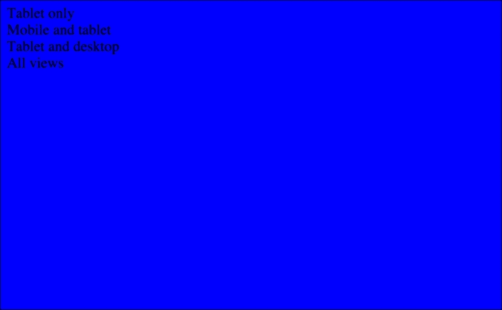
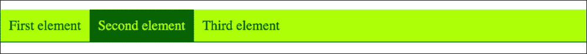
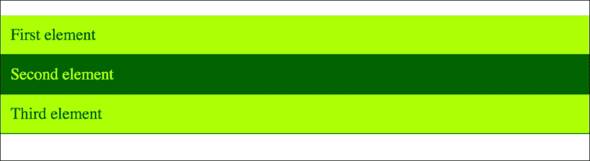

# 第四章：响应式网站-为特定设备准备您的代码

在这一章中，您将了解**响应式网页设计**（**RWD**）以及如何准备项目。它将涵盖现代网站的问题和优化技术。这一章将是关于媒体查询的知识基础-如何准备它们以及如何调整特定设备。

在这一章中，我们将涵盖以下主题：

+   RWD 方法

+   使用媒体查询

# 响应式网站的基础

几乎所有现代网站都可以在桌面和移动设备（手机、平板电脑）上显示。正确调整 CSS 和 HTML 代码是创建响应式网站的主要假设。基本的响应式网站构建过程是基于代码的调整，一旦完成，网站就可以在所有设备上正确显示。现在，响应式网站的*响应性*稍微增强了。它不仅是创建 CSS/HTML/JS 代码和考虑设计方面，还要考虑移动设备上的性能。带有 Web 浏览器的移动设备现在是人们浏览网站的主要设备。让我们看看创建响应式网站的主要方法。

## 桌面优先方法

这种方法曾经是 CSS 框架中的主要方法。HTML 和 CSS 代码的主要目的是在桌面浏览器中查看网页。然后提供基于桌面代码的移动版本。最后的过程是调整移动设备的代码。它看起来像是削减网站的功能，并调整桌面视图以适应较小的移动设备。

## 移动优先方法

这种方法在所有现代 CSS 框架（Twitter bootstrap，Foundation framework）中都有使用。首先，代码是为移动设备准备的，然后再为较大的设备（从平板电脑到台式电脑屏幕）进行*缩放*。这种方法现在更为常见，也更好，因为移动设备的代码不必像在桌面优先方法中那样是 CSS 技巧、HTML 重复和 JS 机制的组合。

哪种方法适合您？这完全取决于项目类型。并非在所有情况下您都是从头开始制作项目。有时，您有一些旧代码，需要调整到移动设备上。在这种情况下，您总是被迫使用桌面优先方法。在可以从头开始编写代码的情况下，建议使用移动优先方法。

## 在 HTML 中调整视口

响应式网站的一个重要元素是正确的 HTML 视口 meta 标签。视口描述应该添加在 HTML 文档的头部。它描述了网页在移动设备上的行为方式。有一堆大多数使用的视口，我们稍后会进行分析。最常用的是以下视口：

```css
<head>
    <!-- ... -->
    <meta name="viewport" content="width=device-width, initial-scale=1.0">
    <!-- ... -->
</head>
```

这意味着无论何时在移动设备上打开项目，它都将具有设备的宽度，并且项目将具有等于`1`的初始比例。稍微增强的视口看起来像下面这样：

```css
<head>
    <!-- ... -->
    <meta name="viewport"content="width=device-width, initial-scale=2.0">
    <!-- ... -->
</head>
```

第一个和第二个视口之间的主要区别是最大缩放。这意味着在移动设备上双击或捏合手势后，将进行缩放，但此缩放的最大范围设置为`2`。视口的一个更安全的选项如下：

```css
<head>
    <!-- ... -->
    <meta name="viewport"content="width=device-width, initial-scale=1.0, maximum-scale=1">
    <!-- ... -->
</head>
```

为什么更安全？例如，在某些情况下，我们在内容上有一些固定的窗口，它们也不会被缩放，也不会给用户带来不好的体验：

```css
<head>
    <!-- ... -->
    <meta name="viewport"content="width=600, initial-scale=1.0">
    <!-- ... -->
</head>
```

这个`viewport`设置将缩放网站，使其表现得像在桌面上打开的网页，浏览器的宽度设置为`600`。初始比例设置如前面的例子一样，等于`1`。

## 选择正确的视口

所以问题是：推荐使用哪个`viewport`？这是一个很好的问题。最好的体验可以通过以下方式保留：

```css
<head>
    <!-- ... -->
    <meta name="viewport"content="width=device-width, initial-scale=1.0, maximum-scale=2.0">
    <!-- ... -->
</head>
```

为什么？因为我们正在根据设备的`宽度`进行缩放，而且我们不会停止页面的缩放。但最安全的选择如下：

```css
<head>
    <!-- ... -->
    <meta name="viewport"content="width=device-width, initial-scale=1.0, maximum-scale=1">
    <!-- ... -->
</head>
```

这将防止缩放，这可能会让调整变得很烦人，特别是在旧项目中，我们有老式的模态窗口类型。

## 折叠区域之上

这种方法与代码的优化密切相关。它也与网页的移动版和桌面版相关。现代网页加载了很多东西：CSS 文件、JS 文件、图片以及视频和音频等媒体文件。在这么长的队列中，你会发现当页面加载的处理时间，比如说 10 秒，你无法在所有文件加载完之前看到内容。在信息页面的情况下，你应该先看到标题和主要内容，但在这么长的队列中几乎是不可能的。

上述的折叠方法将特定的样式附件分开，描述页面上最重要的元素，比如标题、副标题和文本内容。需要将这些`style`附件分开，并将它们内联到`head`部分，例如：

```css
<head>
    <!-- ... -->
    <style>
        /* here we have a section for inline most important styles */
    </style>
    <!-- ... -->
    <link rel="stylesheet"type="text/css"href="link_to_rest_of_styles.css">
    <!-- ... -->
</head>
```

这意味着这个内联部分将首先被浏览器解析，在长时间的加载过程中，它将首先为读者准备好最重要的元素，然后再加载页面所需的其他资源。

# 媒体查询 - 你可以在哪里使用它

媒体查询是在 CSS 代码中设置的过滤器，有助于描述网站在各种显示器（屏幕、打印）上的显示。在媒体查询中，最常用的过滤器是最小/最大宽度、最小/最大高度、最小/最大像素比和最小/最大宽高比。

## 如何构建媒体查询

首先创建一个媒体查询，然后创建更复杂的过滤器是相当简单的。基本的媒体查询看起来如下：

```css
@media screen and (min-width: 640px)
  .element
    background: #000
```

编译后的 CSS：

```css
@media screen and (min-width: 640px) {
    .element {
        background: #000;
    }
}
```

通过这个媒体查询，你可以过滤出所有最小宽度为 640px 的屏幕的 CSS 声明。让我们试着让它更复杂一些，让我们尝试为特定设备创建更多的媒体查询。

## 媒体查询是如何工作的？

媒体查询是过滤器，如前所述。但让我们试着在代码和浏览器中看看。这个简单的章节将向你展示如何调整代码以适应特定的屏幕分辨率，并为创建更高级的媒体查询奠定基础：

```css
<div class="mobile_only">Mobile only</div>
<div class="tablet_only">Tablet only</div>
<div class="desktop_only">Desktop only</div>
<div class="mobile_and_tablet">Mobile and tablet</div>
<div class="tablet_and_desktop">Tablet and desktop</div>
<div class="all">All views</div>
```

现在代码看起来如下（没有任何样式）：



现在我们需要做一些方法：

+   移动视图是宽度小于等于 400px 的所有分辨率

+   平板视图是宽度小于等于 700px 的所有分辨率

+   桌面视图是宽度大于 701px 的所有分辨率

现在，基于上述方法，让我们创建样式和媒体查询：

编译后的 CSS：

```css
.mobile_only,
.tablet_only,
.desktop_only,
.mobile_and_tablet,
.tablet_and_desktop {
    display: none;
}

/* Mobile only */
@media screen and (max-width: 400px) {
body {
        background: red;
    }

    .mobile_only {
        display: block;
    }
}

/* Mobile and tablet */
@media screen and (max-width: 700px) {
    .mobile_and_tablet {
        display: block;
    }
}

/* Tablet only */
@media screen and (min-width: 401px) and (max-width: 700px) {
body {
        background: blue;
    }

    .tablet_only {
        display: block;
    }
}

/* Tablet and desktop */
@media screen and (min-width: 401px) {
    .tablet_and_desktop {
        display: block;
    }
}

/* Desktop only */
@media screen and (min-width: 701px) {
body {
        background: green;
    }

    .desktop_only {
        display: block;
    }
}
```

现在让我们在宽度为 350px 的浏览器中检查一下：



在上述视图中，我们可以看到所有在 CSS 文件中描述的元素，带有以下注释：

+   `/* 仅限移动设备 */`

+   `/* 移动和平板 */`

在宽度为 550px 的浏览器中的输出如下：



在上述视图中，我们可以看到所有在 CSS 文件中描述的元素，带有以下注释：

+   `/* 仅限平板 */`

+   `/* 移动和平板 */`

+   `/* 平板电脑和台式机 */`

在宽度为 850px 的浏览器中的输出如下：


在上述视图中，我们可以看到所有在 CSS 文件中描述的元素，带有以下注释：

+   `/* 平板和台式机 */`

+   `/* 仅限桌面 */`

前面的代码揭示了媒体查询过滤器的工作原理。你如何创建一个在特定视图中可见的代码，以及如何为真实项目创建方法？在接下来的项目中，我们将研究可以过滤的内容，因为媒体查询不仅仅与设备的宽度有关。让我们开始吧！

## 特定视图/设备的媒体查询

媒体查询可以在许多不同的情况下使用。如前所述，我们可以使用媒体查询来设置特定的最小和最大宽度：

```css
@media screen and (min-width: 640px)
@media screen and (max-width: 640px)
```

在前面的媒体查询中，第一个例子是所有最小宽度为`640`像素的分辨率，第二个例子是所有最大宽度为`640`像素的分辨率。前端开发人员处理基本桌面和像素密度更大的屏幕上的像素比。如何用 CSS 过滤它们？让我们来看看这个媒体查询：

```css
@media (-webkit-min-device-pixel-ratio: 2)
```

正如我们所知，视网膜设备的像素比等于`2`。我们还可以用范围构建更复杂的过滤器：

```css
@media screen and (min-width: 640px) and (max-width: 1024px)
```

在这种情况下，我们正在过滤所有宽度匹配从`640`像素到`1024`像素的分辨率。但是我们如何编写一个媒体查询过滤器，以匹配一些特定的设备呢？假设我们想为具有视网膜显示屏的新一代 iPad 编写代码：

```css
@media only screen 
and (min-device-width: 768px) 
and (max-device-width: 1024px) 
and (-webkit-min-device-pixel-ratio: 2)
```

正如我们所知，移动设备有两种方向：横向和纵向。那么我们如何在媒体查询中匹配这种情况呢？对于纵向视图，请使用以下内容：

```css
@media only screen 
and (min-device-width: 768px) 
and (max-device-width: 1024px) 
and (orientation: portrait) 
and (-webkit-min-device-pixel-ratio: 2)
```

而对于横向视图，请使用以下内容：

```css
@media only screen 
and (min-device-width: 768px) 
and (max-device-width: 1024px) 
and (orientation: landscape) 
and (-webkit-min-device-pixel-ratio: 1)
```

通过媒体查询，您还可以过滤打印视图。为此，您需要附加以下代码：

```css
@media print
```

## 如何为移动设备选择合适的媒体查询

为了创建良好的媒体查询过滤器并在其中设置良好的范围，您首先必须选择设备和分辨率。然后，您必须根据最流行的分辨率创建适当的媒体查询。回到过去，设备和标准分辨率的范围较小。因此，主要设置如下：

```css
@media (max-width: 768px)
  // Cover small devices
  .element
    font-size: 12px

@media (min-width: 768px) and (max-width: 1024px)
  // Cover medium devices
  .element
    font-size: 14px

@media (min-width: 1024px)
  // Cover large devices
  .element
    font-size: 16px
```

编译后的 CSS：

```css
@media (max-width: 768px) {
    .element {
        font-size: 12px;
    }
}

@media (min-width: 768px) and (max-width: 1024px) {
    .element {
        font-size: 14px;
    }
}

@media (min-width: 1024px) {
    .element {
        font-size: 16px;
    }
}
```

当然，在每个项目中，您可以为异常情况添加一些*特定*的媒体查询，这样在质量分析过程之后，CSS 文件中可能会出现更多的过滤器。

如今，一种方法是在一个媒体查询步骤中覆盖尽可能多的设备：

```css
@media only screen
  .element
    font-size: 16px
@media only screen and (max-width: 640px)
  // Cover small devices
  .element
    font-size: 12px

@media only screen and (min-width: 641px)
  // Cover devices which resolution is at minimum medium
  .element
    font-size: 14px

@media only screen and (min-width: 641px) and (max-width: 1024px)
  // Cover medium devices
  .element
    font-size: 15px

@media only screen and (min-width: 1025px)
  // Cover  devices which resolution is at minimum large
  .element
    font-size: 16px
```

编译后的 CSS：

```css
@media only screen {
    .element {
        font-size: 16px;
    }
}

@media only screen and (max-width: 640px) {
    .element {
        font-size: 12px;
    }
}

@media only screen and (min-width: 641px) {
    .element {
        font-size: 14px;
    }
}

@media only screen and (min-width: 641px) and (max-width: 1024px) {
    .element {
        font-size: 15px;
    }
}

@media only screen and (min-width: 1025px) {
    .element {
        font-size: 16px;
    }
}
```

为了更好地覆盖和更好地编写代码，让我们在这个媒体查询列表中添加一个`max-width`步骤：

```css
@media only screen and (max-width: 1024px)
    .element
        font-size: 15px
```

编译后的 CSS：

```css
@media only screen and (min-width: 1025px) {
    .element {
        font-size: 16px;
    }
}
```

这个媒体查询将一次覆盖小型和中型设备。目前，桌面网站最常见的分辨率是`1280px`。让我们将这个范围添加到媒体查询中：

```css
@media only screen and (min-width: 1025px) and (max-width: 1280px) {} 
@media only screen and (min-width: 1281px) {}
```

用于媒体查询的 SASS mixin

让我们为 mixin 创建媒体查询，这将帮助我们保持代码清晰。正如我们所知，我们必须将显示类型和断点作为参数添加进去：

```css
@mixin mq($display, $breakpoint)
@media #{$display} and (#{$breakpoint})
@content
```

现在让我们收集我们的标准断点：

```css
@mixin mq($display, $breakpoint)
  @media #{$display} and #{$breakpoint}
    @content

$mq_small_only: "(max-width: 640px)"
$mq_medium_only: "(min-width: 641px) and (max-width: 1024px)"
$mq_small_and_medium: "(max-width: 1024px)"

+mq("screen", $mq_small_only)
  .slider
    width: 100%
    height: 300px

+mq("screen", $mq_medium_only)
  .slider
    width: 100%
    height: 400px

+mq("screen", $mq_small_and_medium)
  .slider
    max-width: 1200px
    width: 100%
```

编译后的 CSS：

```css
@media screen and (max-width: 640px) {
    .slider {
        width: 100%;
        height: 300px;
    }
}

@media screen and (min-width: 641px) and (max-width: 1024px) {
    .slider {
        width: 100%;
        height: 400px;
    }
}

@media screen and (max-width: 1024px) {
    .slider {
        max-width: 1200px;
        width: 100%;
    }
}
```

前面的代码是三个步骤的选择，但您可以添加另一个作为练习，以覆盖上一节中的所有步骤。

# 用法示例-主导航

让我们想象一下，我们想解决与导航相关的经典问题。在大多数情况下，它在桌面视图中是内联的，但在移动视图中变成了元素下的列表元素。让我们从 HTML 开始：

```css
<nav class="main-navigation">
    <ul>
        <li>
            <a href="#">First element</a>
        </li>
        <li>
            <a href="#">Second element</a>
        </li>
        <li>
            <a href="#"> Third element</a>
        </li>
    </ul>
</nav>
```

在 SASS 代码中，我们将使用之前创建的 mixin 来进行媒体查询和清除浮动。以下是完整的 SASS 文件：

```css
@mixin mq($display, $breakpoint)
@media #{$display} and #{$breakpoint}
@content

$mq_small_only: "(max-width: 640px)"
$mq_medium_only: "(min-width: 641px) and (max-width: 1024px)"
$mq_small_and_medium: "(max-width: 1024px)"

=clear fix
  &:after
    content: " "
    visibility: hidden
    display: block
    height: 0
    clear: both

body
  padding: 0
  margin: 0

.main-navigation
  ul
    +clearfix /* This will prevent problems of cleared float */
    list-style: none
    padding: 0
    background: greenyellow
    border:
      bottom: 1px solid darkgreen

  li
    float: left
    display: block

  a
    padding: 10px
    width: 100%
    display: block
    background: greenyellow
    text-decoration: none
    color: darkgreen

    &:hover
      background: darkgreen
      color: greenyellow

+mq("screen", $mq_small_and_medium)
  .main-navigation
    ul
      list-style: none
      border: none

    li
      float: none
      width: 100%

    a
      border:
        bottom: 1px solid darkgreen
```

编译后的 CSS：

```css
body {
    padding: 0;
    margin: 0;
}

.main-navigation ul {
    list-style: none;
    padding: 0;
    background: greenyellow;
    border-bottom: 1px solid darkgreen;
}

.main-navigation ul:after {
    content: "";
    visibility: hidden;
    display: block;
    height: 0;
    clear: both;
}

.main-navigation li {
    float: left;
    display: block;
}

.main-navigation a {
    padding: 10px;
    width: 100%;
    display: block;
    background: greenyellow;
    text-decoration: none;
    color: darkgreen;
}

.main-navigation a:hover {
    background: darkgreen;
    color: greenyellow;
}

@media screen and (max-width: 1024px) {
    .main-navigation ul {
        list-style: none;
        border: none;
    }

    .main-navigation li {
        float: none;
        width: 100%;
    }

    .main-navigation a {
        border-bottom: 1px solid darkgreen;
    }
}
```



前面的屏幕截图是在全局 CSS 相关的桌面视图中制作的。下一个屏幕截图与`@media`屏幕和（最大宽度：`1024px`）有关。正如你所看到的，我们改变了导航的显示方式，并为触摸设备提供了更多的灵活性。导航中的较大项目更容易点击（在这个例子中，按钮更长）：



# 总结

在本章中，您学习了创建响应式网站的主要方法以及移动和桌面优先的含义。然后，我们通过响应式网站的性能基础知识扩展了知识。最后，您了解了媒体查询的基本知识以及如何创建它们以覆盖所有特定的显示类型。在下一章中，您将学习有关 CSS 代码中的图像的知识。

在下一章中，您还将学习有关 CSS 背景和可以使用的新功能的知识。我们将重复图像，裁剪图像，并将它们定位到容器中。让我们看看我们可以用背景做些什么。
